# gson 2cbddb

https://github.com/google/gson/commit/2cbddb

## Delta Energy per test method

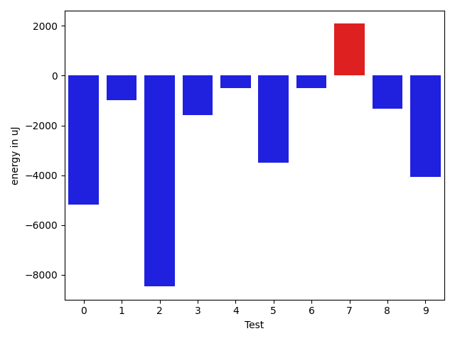

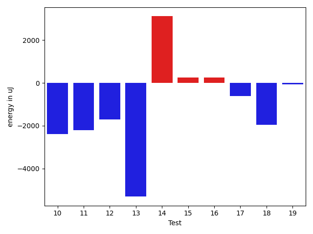

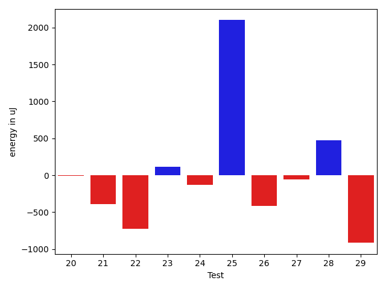

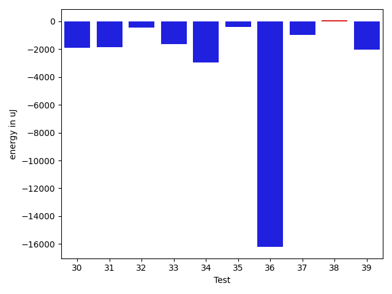

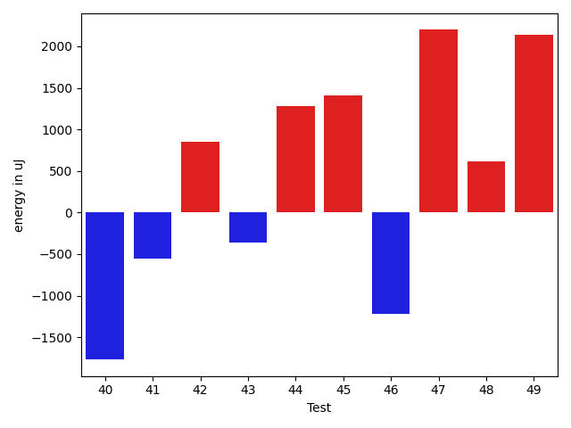

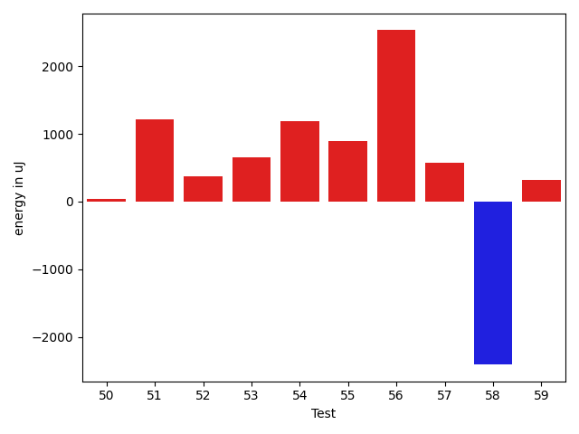

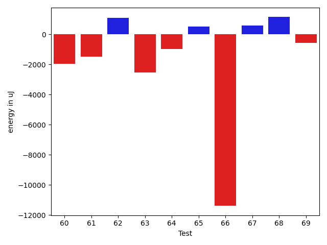

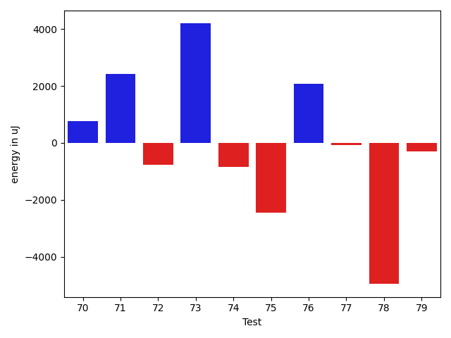

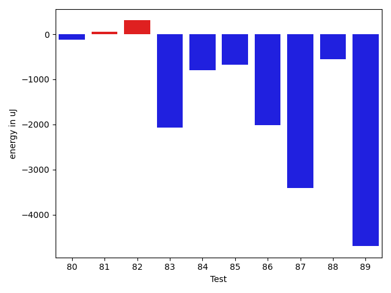

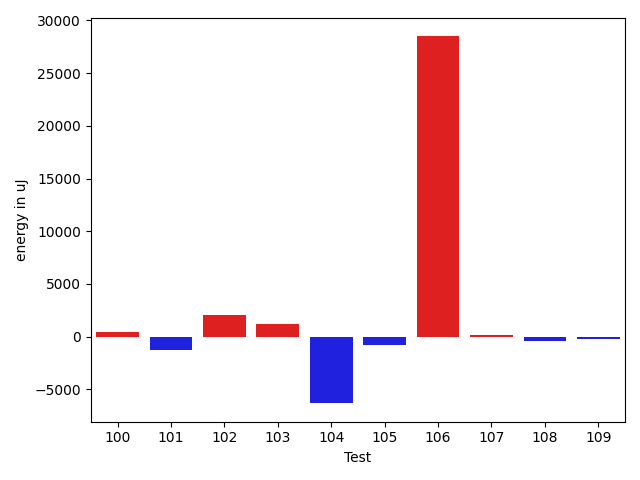

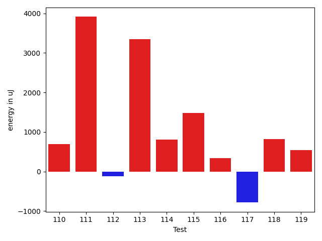

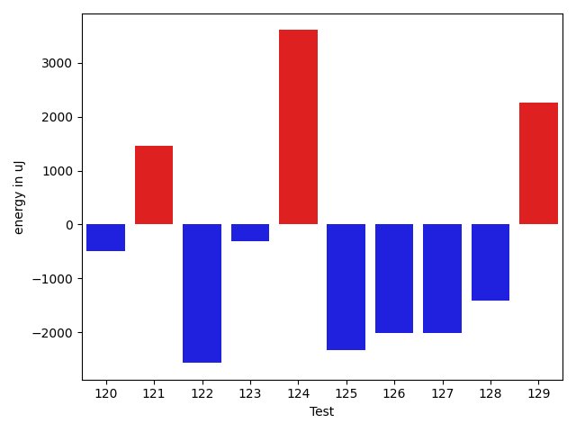

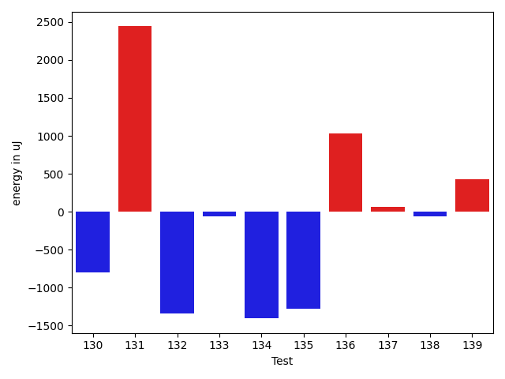

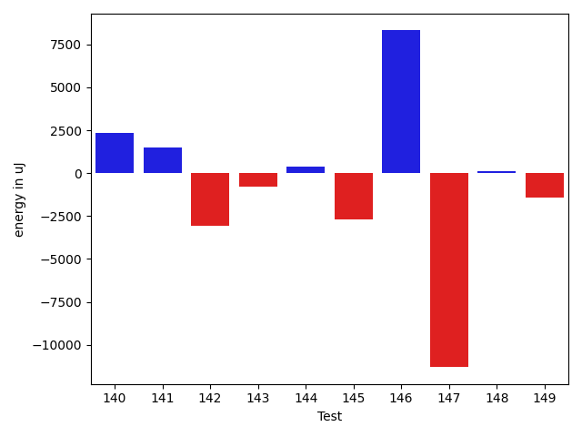

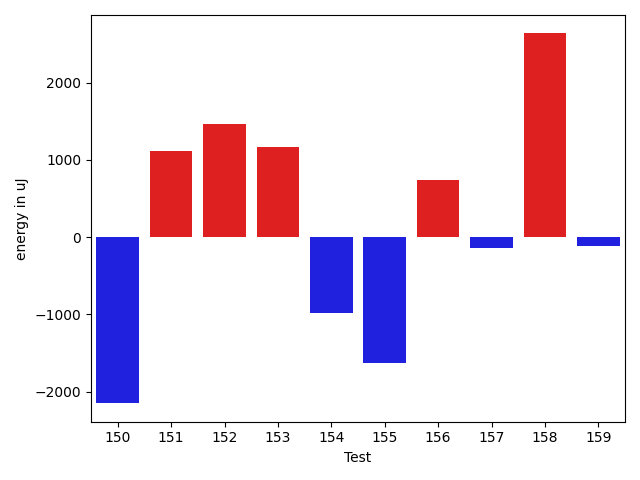

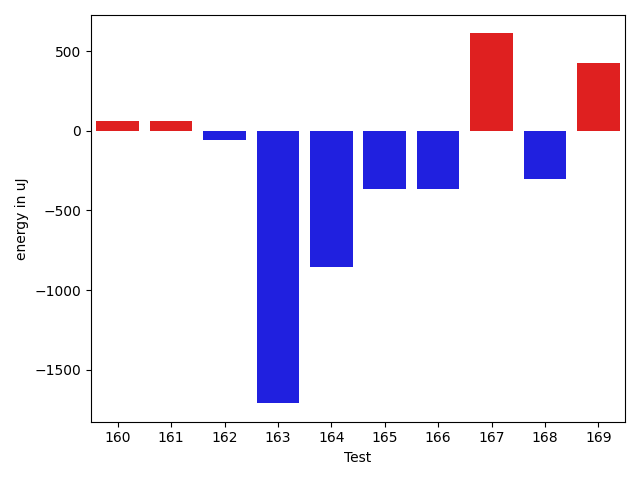

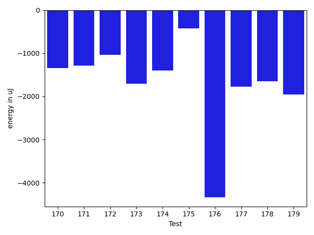

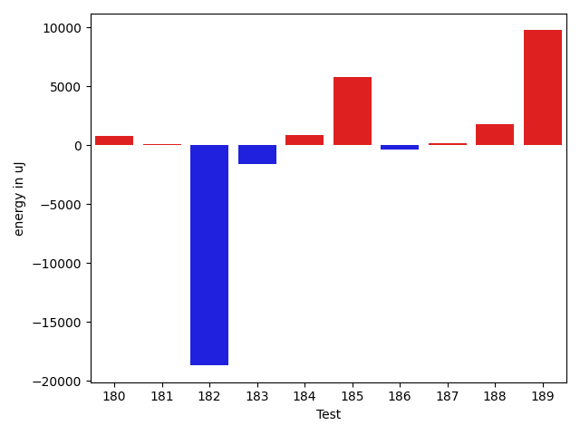

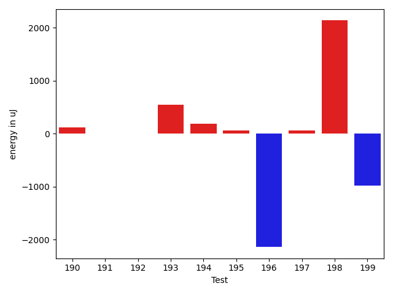

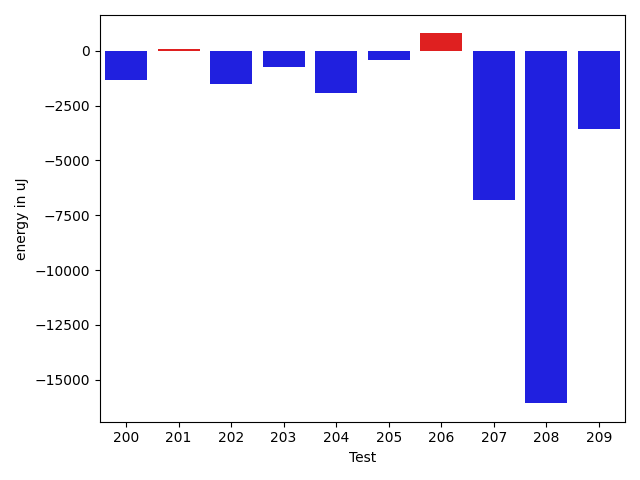

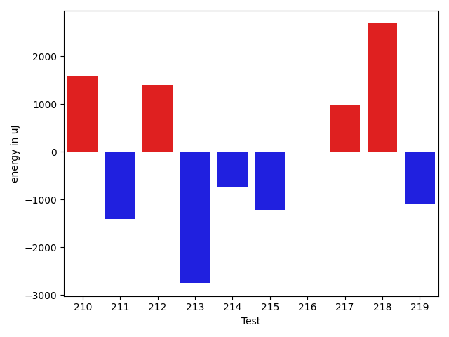

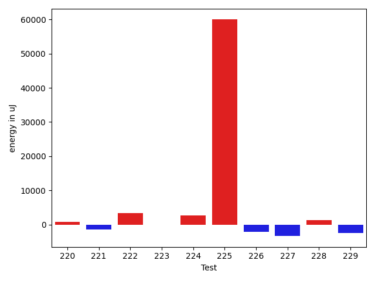

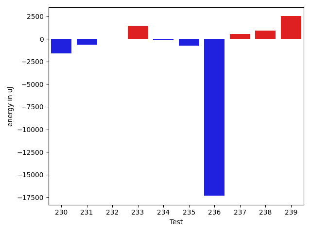

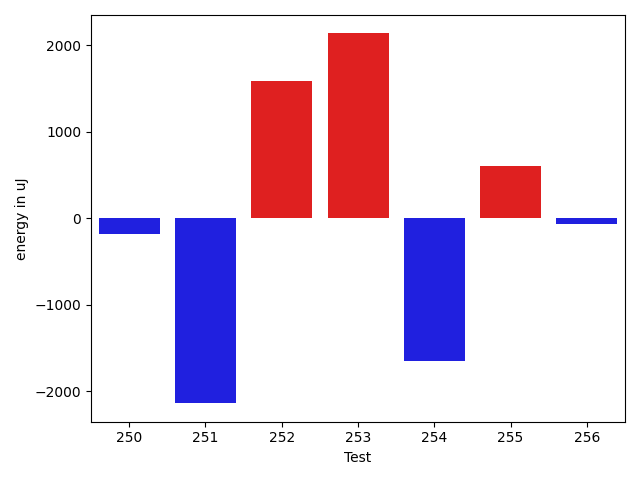

| ID | EnergyV1 | EnergyV2 | DeltaEnergy | σV1 | σV2 |
| --- | --- | --- | --- | --- | --- |
| 0 | 38452 | 36560 | -1892 | 18181.281631192964 | 9590.166278932204 |
| 1 | 40344 | 37536 | -2808 | 5072.6771339752695 | 4738.479685862685 |
| 2 | 41381 | 39124 | -2257 | 22023.859298297026 | 11492.569624694466 |
| 3 | 37903 | 36132 | -1771 | 3630.5487623933245 | 2880.615301555478 |
| 4 | 38147 | 38025 | -122 | 4848.38268978401 | 4173.811098489315 |
| 5 | 37476 | 35462 | -2014 | 10972.54799483187 | 7832.590803262867 |
| 6 | 36071 | 35339 | -732 | 4006.6446138543906 | 3478.3864360285083 |
| 7 | 36255 | 37475 | 1220 | 3566.1129062327796 | 5017.04007845153 |
| 8 | 38819 | 38391 | -428 | 3449.5775780038152 | 3162.8380012612442 |
| 9 | 37658 | 36804 | -854 | 21156.923718224698 | 12132.882295483041 |
| 10 | 37476 | 35096 | -2380 | 4565.411932319862 | 3273.1913885254185 |
| 11 | 40893 | 38696 | -2197 | 4131.806384163351 | 3917.696557459055 |
| 12 | 38696 | 36987 | -1709 | 5034.774237371699 | 3745.1551501593935 |
| 13 | 44555 | 39245 | -5310 | 24087.08142800069 | 17624.493693775363 |
| 14 | 33264 | 36377 | 3113 | 3269.9737103418015 | 4349.789239338691 |
| 15 | 39551 | 39795 | 244 | 4416.872737870583 | 4918.077798032479 |
| 16 | 37049 | 37293 | 244 | 26547.530465281066 | 21083.641832069145 |
| 17 | 36316 | 35705 | -611 | 4798.162817857129 | 3862.8704191313486 |
| 18 | 39856 | 37903 | -1953 | 3203.573885348813 | 5316.208939648629 |
| 19 | 39795 | 39734 | -61 | 4479.190526561985 | 4440.736642227259 |
| 20 | 39246 | 38085 | -1161 | 4053.8809027071 | 3633.2959414179127 |
| 21 | 37658 | 37414 | -244 | 3820.879405610994 | 3234.641105038141 |
| 22 | 38391 | 36988 | -1403 | 4438.916590443391 | 3372.074646072522 |
| 23 | 36560 | 36438 | -122 | 4046.9420962720123 | 2829.2166073968688 |
| 24 | 37353 | 38086 | 733 | 2734.769118497554 | 2725.9118392515743 |
| 25 | 35401 | 37598 | 2197 | 3634.7096078770514 | 4294.430299543018 |
| 26 | 36377 | 36682 | 305 | 3530.3402940390856 | 2954.1732244403 |
| 27 | 37232 | 36804 | -428 | 4383.4180839574765 | 3796.1205824718827 |
| 28 | 36377 | 38757 | 2380 | 4531.985756752583 | 3197.746474520162 |
| 29 | 39246 | 37719 | -1527 | 3545.7589518153513 | 2566.6578571277387 |
| 30 | 39368 | 38940 | -428 | 4457.943031060605 | 3569.8037055409295 |
| 31 | 38025 | 37231 | -794 | 4269.909927613292 | 4031.6436403663674 |
| 32 | 37902 | 38086 | 184 | 4786.112029547052 | 4403.960735926269 |
| 33 | 36438 | 33996 | -2442 | 3259.7365878583228 | 3559.924105776539 |
| 34 | 38024 | 33020 | -5004 | 2912.0638239646723 | 4844.986284682902 |
| 35 | 34851 | 35888 | 1037 | 3397.904207007608 | 3649.5179763908545 |
| 36 | 37110 | 37354 | 244 | 52679.10697272484 | 4774.878090357677 |
| 37 | 38208 | 36072 | -2136 | 3250.3200056131222 | 3805.308906702914 |
| 38 | 36133 | 35522 | -611 | 3941.6720809053145 | 4421.360266356377 |
| 39 | 38757 | 34912 | -3845 | 3429.52548460961 | 4241.024043954345 |
| 40 | 37963 | 36194 | -1769 | 4947.648368164415 | 44953.756892600235 |
| 41 | 39307 | 38757 | -550 | 4274.796398457345 | 3848.45294525393 |
| 42 | 34790 | 35644 | 854 | 3576.421248102291 | 3229.8482807504543 |
| 43 | 36438 | 36072 | -366 | 3246.818548979909 | 5199.956769985903 |
| 44 | 35706 | 36987 | 1281 | 4123.844495308668 | 3453.338239378754 |
| 45 | 34546 | 35950 | 1404 | 4138.435332070857 | 3414.3277491176887 |
| 46 | 39063 | 37842 | -1221 | 4521.255954954103 | 2922.8419502456336 |
| 47 | 34973 | 37171 | 2198 | 3570.058008128985 | 2720.1473050390323 |
| 48 | 35462 | 36072 | 610 | 3460.2881537731587 | 3631.2123516612387 |
| 49 | 38085 | 40222 | 2137 | 4931.282943358211 | 4094.6093204968897 |
| 50 | 35888 | 37353 | 1465 | 4162.745611038731 | 4358.095061644081 |
| 51 | 35950 | 38025 | 2075 | 4041.055335113995 | 3355.59003293546 |
| 52 | 36071 | 36377 | 306 | 2816.5195658549487 | 2817.9005019259153 |
| 53 | 35095 | 38330 | 3235 | 5290.561940852786 | 4177.916702522238 |
| 54 | 34667 | 37537 | 2870 | 4517.619360625682 | 3749.076761017304 |
| 55 | 36194 | 36438 | 244 | 3675.978643079282 | 3195.387102429845 |
| 56 | 36682 | 38513 | 1831 | 4917.642405690649 | 3835.3526972757018 |
| 57 | 39917 | 38574 | -1343 | 4646.64873785996 | 3736.20932749878 |
| 58 | 38269 | 36621 | -1648 | 4282.903678218495 | 4375.547071263148 |
| 59 | 36072 | 36682 | 610 | 3831.9167463055983 | 3784.3320491431173 |
| 60 | 38147 | 35950 | -2197 | 3325.353174225759 | 3996.780422171771 |
| 61 | 37842 | 35034 | -2808 | 3348.074495387859 | 4789.953714391335 |
| 62 | 35522 | 35889 | 367 | 4583.631590780394 | 3000.9099155069043 |
| 63 | 39611 | 39185 | -426 | 11302.639582211927 | 7744.016127953247 |
| 64 | 41260 | 39734 | -1526 | 8680.455075072608 | 9567.669589782401 |
| 65 | 38330 | 38269 | -61 | 5026.49627689516 | 4084.189300296331 |
| 66 | 41748 | 39856 | -1892 | 40779.69949966523 | 19131.95714054832 |
| 67 | 38635 | 39063 | 428 | 3783.5907502318314 | 4475.068095129854 |
| 68 | 37597 | 38147 | 550 | 4435.617907898081 | 4569.482894468422 |
| 69 | 38452 | 39307 | 855 | 3990.886809266299 | 3916.198495090519 |
| 70 | 36865 | 38086 | 1221 | 3604.2618852926266 | 4143.142238687927 |
| 71 | 38330 | 38697 | 367 | 9399.68850918413 | 15439.77388467252 |
| 72 | 37964 | 38146 | 182 | 10199.979985080921 | 8990.948442626774 |
| 73 | 82214 | 85632 | 3418 | 32589.23691206285 | 30488.7136176182 |
| 74 | 38453 | 38208 | -245 | 3781.349607824383 | 3374.2832285155655 |
| 75 | 39306 | 37354 | -1952 | 3135.441374330358 | 3867.3838945080174 |
| 76 | 37781 | 39917 | 2136 | 3400.562292939694 | 3500.932252986339 |
| 77 | 37475 | 38025 | 550 | 6014.658680513452 | 3922.354632191878 |
| 78 | 37903 | 36377 | -1526 | 28334.5888253104 | 3280.8718422889806 |
| 79 | 38025 | 38086 | 61 | 3560.9528327977882 | 4249.005026052078 |
| 80 | 38391 | 38268 | -123 | 3804.9029343193283 | 5006.508768095173 |
| 81 | 38574 | 38635 | 61 | 3614.0935129626846 | 46689.663084700056 |
| 82 | 38941 | 39246 | 305 | 10310.754347059732 | 10339.291228425018 |
| 83 | 38574 | 36499 | -2075 | 3462.0118357130564 | 3812.837330213114 |
| 84 | 38941 | 38147 | -794 | 81712.84612808417 | 113642.11874605624 |
| 85 | 38635 | 37963 | -672 | 6100.403147181302 | 5526.091839424268 |
| 86 | 37842 | 35828 | -2014 | 3969.5151242221727 | 3508.2162943165768 |
| 87 | 39794 | 36377 | -3417 | 4150.5968257589175 | 4438.9104147790895 |
| 88 | 37659 | 37110 | -549 | 3516.2656867997457 | 4207.642823310733 |
| 89 | 40649 | 35949 | -4700 | 36296.62021218367 | 2957.0212759915453 |
| 90 | 36682 | 38635 | 1953 | 28459.862903279583 | 4480.717109814211 |
| 91 | 36743 | 36438 | -305 | 3563.284703877369 | 10401.368747326816 |
| 92 | 36926 | 40405 | 3479 | 3819.2325405208217 | 4575.769853060683 |
| 93 | 42358 | 42358 | 0 | 39202.552950015845 | 65879.62939283007 |
| 94 | 38757 | 39917 | 1160 | 15416.909895992983 | 8371.471352536568 |
| 95 | 38513 | 39856 | 1343 | 13206.958056443566 | 11185.23410049927 |
| 96 | 38269 | 37964 | -305 | 4067.6320431659306 | 3640.8931516793245 |
| 97 | 39612 | 42175 | 2563 | 20877.544919757023 | 34562.89274381756 |
| 98 | 37658 | 38391 | 733 | 4346.206707436288 | 4945.531292837044 |
| 99 | 38819 | 40283 | 1464 | 5616.0108726404715 | 6758.613297660777 |
| 100 | 36866 | 36865 | -1 | 4529.534802820859 | 3703.978392959414 |
| 101 | 37048 | 35705 | -1343 | 5016.691485744165 | 4562.522072074093 |
| 102 | 36377 | 39612 | 3235 | 2692.6278817768753 | 4437.022497019059 |
| 103 | 36743 | 37536 | 793 | 3733.9219583977588 | 4295.338940321811 |
| 104 | 125915 | 121948 | -3967 | 26635.88704546376 | 23007.94241293938 |
| 105 | 36621 | 36011 | -610 | 3964.6310585475667 | 2829.1911163995005 |
| 106 | 423766 | 478270 | 54504 | 244469.50255692544 | 263664.8305991632 |
| 107 | 36438 | 36865 | 427 | 3646.1884203583077 | 3517.402324690901 |
| 108 | 37963 | 39062 | 1099 | 4978.327214524502 | 4297.242849910988 |
| 109 | 39062 | 38391 | -671 | 10847.44728153543 | 10596.804125024068 |
| 110 | 37110 | 38879 | 1769 | 3682.383893470219 | 4452.169938329322 |
| 111 | 35644 | 36865 | 1221 | 4434.243461842041 | 21343.029326846063 |
| 112 | 75134 | 78125 | 2991 | 24367.859393179682 | 19676.734883038436 |
| 113 | 36315 | 36804 | 489 | 4191.560306150266 | 25493.58673489712 |
| 114 | 34851 | 37536 | 2685 | 4751.222323158708 | 4531.8476121127205 |
| 115 | 35766 | 36621 | 855 | 3828.3372328961173 | 7157.404280227031 |
| 116 | 35644 | 35400 | -244 | 4380.196195773586 | 3397.3419194333424 |
| 117 | 36804 | 36621 | -183 | 4373.758482044849 | 3989.112064808408 |
| 118 | 36438 | 37414 | 976 | 4103.38275613125 | 3683.1825530386445 |
| 119 | 34668 | 35828 | 1160 | 4077.1286641513193 | 4260.73697850501 |
| 120 | 38757 | 38269 | -488 | 3947.7270213276697 | 4257.672025754084 |
| 121 | 33874 | 35339 | 1465 | 3030.5247482903023 | 3312.3516698091603 |
| 122 | 40344 | 37781 | -2563 | 15807.07744544829 | 16844.303845885483 |
| 123 | 36866 | 36560 | -306 | 4155.085542123125 | 5785.703719172083 |
| 124 | 32654 | 36255 | 3601 | 4734.377912907061 | 4048.1744014277597 |
| 125 | 37109 | 34790 | -2319 | 4733.134768245565 | 4005.624326630463 |
| 126 | 36804 | 34790 | -2014 | 4673.954236958645 | 4158.661678953939 |
| 127 | 38208 | 36194 | -2014 | 37131.3608198191 | 3768.5642678610325 |
| 128 | 36682 | 35278 | -1404 | 37063.80919538927 | 4567.191897226014 |
| 129 | 35949 | 38208 | 2259 | 4811.468797612638 | 3922.952529266063 |
| 130 | 36377 | 35583 | -794 | 4530.533963011424 | 3918.2212806101866 |
| 131 | 34851 | 37292 | 2441 | 3803.965125307567 | 3937.133467489819 |
| 132 | 38391 | 37048 | -1343 | 4555.157319613479 | 4259.012385581193 |
| 133 | 37598 | 37537 | -61 | 3943.3206936502793 | 4315.707468561085 |
| 134 | 39428 | 38024 | -1404 | 4317.412103702096 | 3999.2263152598016 |
| 135 | 40100 | 38819 | -1281 | 29579.583874381715 | 3531.997301485414 |
| 136 | 39307 | 40344 | 1037 | 19110.231104451763 | 16556.590565269697 |
| 137 | 39490 | 39551 | 61 | 4307.180893577608 | 3642.120135124003 |
| 138 | 38025 | 37964 | -61 | 9811.589535164516 | 10971.963559273281 |
| 139 | 41076 | 41504 | 428 | 16351.023960782299 | 16525.999664803265 |
| 140 | 39490 | 38574 | -916 | 6984.790542888291 | 21647.459090766646 |
| 141 | 37720 | 39794 | 2074 | 4347.266013623951 | 4577.74187796448 |
| 142 | 39002 | 38940 | -62 | 26597.734743655452 | 4387.342492617966 |
| 143 | 39185 | 39001 | -184 | 7202.523411577431 | 4817.376660954144 |
| 144 | 37659 | 38452 | 793 | 4002.583826379809 | 3949.3285143535113 |
| 145 | 40344 | 36621 | -3723 | 3376.0721774719213 | 4931.170122345223 |
| 146 | 44616 | 43945 | -671 | 37361.17892348245 | 55992.55633790868 |
| 147 | 37963 | 35400 | -2563 | 48783.84475049091 | 3862.34586531726 |
| 148 | 35645 | 36377 | 732 | 3532.5660998769717 | 3400.6608268352193 |
| 149 | 40039 | 38146 | -1893 | 4020.8467740778487 | 3115.0983836790774 |
| 150 | 40039 | 37354 | -2685 | 3340.0507568888456 | 3709.3110988972558 |
| 151 | 37293 | 38086 | 793 | 3827.8420014095545 | 3146.1073525943843 |
| 152 | 38574 | 40222 | 1648 | 4239.798435460503 | 3352.7973674977734 |
| 153 | 40833 | 39795 | -1038 | 7162.342773143436 | 9479.364651470874 |
| 154 | 39368 | 37964 | -1404 | 4747.721775997803 | 3345.353231538833 |
| 155 | 40894 | 39368 | -1526 | 4469.895053699627 | 4629.626525466835 |
| 156 | 38636 | 41443 | 2807 | 4817.103859404166 | 5536.4213089072455 |
| 157 | 39733 | 38757 | -976 | 5593.562415694482 | 7673.368395062431 |
| 158 | 41564 | 42968 | 1404 | 11242.132332497138 | 17767.9509351749 |
| 159 | 39916 | 40161 | 245 | 3913.862266385557 | 4483.481863159921 |
| 160 | 44494 | 44555 | 61 | 21808.23409045553 | 22064.62596838051 |
| 161 | 43701 | 43763 | 62 | 21626.782711979096 | 21024.05659001257 |
| 162 | 44189 | 44128 | -61 | 22303.794967491773 | 20200.66990461062 |
| 163 | 40466 | 38757 | -1709 | 52515.51057490834 | 55492.53981477983 |
| 164 | 72876 | 72022 | -854 | 45863.85792876776 | 37464.527454100426 |
| 165 | 38513 | 38147 | -366 | 9748.754394363348 | 9280.359362473353 |
| 166 | 43579 | 43213 | -366 | 26608.22470600213 | 19237.501664088883 |
| 167 | 38757 | 39367 | 610 | 11210.07284620009 | 11099.483054244267 |
| 168 | 39001 | 38697 | -304 | 4870.335992753893 | 3969.7057757033044 |
| 169 | 39551 | 39978 | 427 | 6979.183287220974 | 6510.085995230395 |
| 170 | 39367 | 38025 | -1342 | 4050.9128187138194 | 4602.246878183537 |
| 171 | 40222 | 38940 | -1282 | 3742.201722429995 | 4783.8310957348585 |
| 172 | 41321 | 40283 | -1038 | 14302.988935096748 | 24215.092185121877 |
| 173 | 39429 | 37720 | -1709 | 3288.99100629755 | 4288.729671348594 |
| 174 | 41199 | 39795 | -1404 | 18766.412231742168 | 17855.95210009933 |
| 175 | 38940 | 38513 | -427 | 19916.554097722325 | 6083.85577392083 |
| 176 | 79528 | 75196 | -4332 | 28659.172739762587 | 25352.844338874653 |
| 177 | 39551 | 37780 | -1771 | 12262.689629401108 | 29995.447933346783 |
| 178 | 40832 | 39185 | -1647 | 27392.47247656718 | 16591.784850344127 |
| 179 | 39367 | 37415 | -1952 | 18715.13189459861 | 19597.685531405783 |
| 180 | 37659 | 38757 | 1098 | 4214.618655157308 | 4231.3503815685135 |
| 181 | 37842 | 36927 | -915 | 4936.821629790815 | 4732.419888580952 |
| 182 | 79162 | 75378 | -3784 | 276900.808435473 | 259033.7785532133 |
| 183 | 40344 | 41442 | 1098 | 20760.760597161083 | 17360.209129143936 |
| 184 | 37659 | 39611 | 1952 | 8440.053982680656 | 7641.0027973873375 |
| 185 | 43091 | 44190 | 1099 | 21370.940295909142 | 25405.03787103357 |
| 186 | 38940 | 39185 | 245 | 4059.760800634361 | 4219.740389570417 |
| 187 | 37109 | 38513 | 1404 | 4321.9401361154105 | 4231.717097419509 |
| 188 | 37597 | 39673 | 2076 | 4259.811380049591 | 3602.656950944194 |
| 189 | 41382 | 39795 | -1587 | 27913.944960692526 | 54555.17519944605 |
| 190 | 38819 | 38940 | 121 | 4175.755737354872 | 4694.4791536550765 |
| 191 | 37598 | 37597 | -1 | 5248.748036878207 | 30850.54089186628 |
| 192 | 38391 | 38391 | 0 | 4121.269287840751 | 3775.02188480666 |
| 193 | 38208 | 38757 | 549 | 3986.7331086561685 | 4502.956519833485 |
| 194 | 37781 | 37964 | 183 | 4140.30757810892 | 3604.9648364993373 |
| 195 | 37903 | 37964 | 61 | 4438.963506208605 | 4307.104454528845 |
| 196 | 38880 | 36743 | -2137 | 3565.30666371145 | 4220.563071308008 |
| 197 | 40100 | 40161 | 61 | 4943.011738988201 | 3411.894352712885 |
| 198 | 37903 | 40039 | 2136 | 4473.743370665179 | 3721.0917626169835 |
| 199 | 39063 | 38085 | -978 | 4322.391472062707 | 4336.89237944039 |
| 200 | 39001 | 38025 | -976 | 4020.2173363396532 | 3396.03786795985 |
| 201 | 40405 | 39367 | -1038 | 9911.467527569697 | 11685.613419709636 |
| 202 | 40283 | 40588 | 305 | 95492.86883700298 | 105732.37570345963 |
| 203 | 71472 | 73486 | 2014 | 29884.267294754136 | 27663.803049053517 |
| 204 | 41137 | 40527 | -610 | 16657.44624153497 | 13077.06487176673 |
| 205 | 39490 | 39368 | -122 | 7609.836846258051 | 8034.2748796450505 |
| 206 | 40650 | 40344 | -306 | 16284.3233055805 | 18817.249879091065 |
| 207 | 40711 | 40283 | -428 | 63389.936339058324 | 61490.79274033398 |
| 208 | 40466 | 39551 | -915 | 59954.22520523469 | 41487.160994516 |
| 209 | 41198 | 40283 | -915 | 28157.868690171003 | 15273.897119458163 |
| 210 | 39856 | 41443 | 1587 | 3930.1829306637524 | 4957.256166605954 |
| 211 | 38635 | 37232 | -1403 | 3668.8951591957193 | 4754.8355786691 |
| 212 | 37597 | 39001 | 1404 | 4450.27104121363 | 3774.3880823415448 |
| 213 | 41321 | 38574 | -2747 | 2685.0643032337234 | 4952.527939906605 |
| 214 | 41077 | 40344 | -733 | 3766.855256258195 | 3967.9148570124335 |
| 215 | 42237 | 41015 | -1222 | 17829.167501778662 | 20734.843307899868 |
| 216 | 37963 | 37964 | 1 | 35487.29940842435 | 5238.860317893578 |
| 217 | 38268 | 39246 | 978 | 4112.068166029853 | 4867.666598644113 |
| 218 | 37781 | 40466 | 2685 | 3265.586661981822 | 4709.524873609587 |
| 219 | 39428 | 38330 | -1098 | 4185.1306409005865 | 4163.498131845089 |
| 220 | 39734 | 39246 | -488 | 17536.450791603733 | 21499.269804208452 |
| 221 | 40527 | 40954 | 427 | 13043.143641619572 | 10387.775455772527 |
| 222 | 38879 | 40955 | 2076 | 16893.336811279223 | 23170.969113104828 |
| 223 | 40100 | 38880 | -1220 | 4142.543490103311 | 4669.114863185437 |
| 224 | 42969 | 43457 | 488 | 372424.7166896338 | 360981.462663526 |
| 225 | 83190 | 85266 | 2076 | 265456.66272951465 | 396429.4790433249 |
| 226 | 40283 | 41199 | 916 | 22343.297980197414 | 15848.349673103803 |
| 227 | 39063 | 39551 | 488 | 24670.161337773527 | 8071.205348670519 |
| 228 | 39550 | 38879 | -671 | 6824.025734051011 | 10128.740141141927 |
| 229 | 40588 | 40833 | 245 | 266108.2492386535 | 247736.22898288767 |
| 230 | 38941 | 37353 | -1588 | 6572.412059145016 | 5018.770425212701 |
| 231 | 40283 | 39673 | -610 | 4497.22629523929 | 5760.710708823027 |
| 232 | 38330 | 38330 | 0 | 4076.533220773878 | 4525.46981227941 |
| 233 | 38513 | 39978 | 1465 | 4312.627316506005 | 3927.128347869738 |
| 234 | 39367 | 39246 | -121 | 3628.9634837934514 | 4246.2740427454455 |
| 235 | 39734 | 39001 | -733 | 19315.35961507545 | 8544.525258250975 |
| 236 | 437072 | 419738 | -17334 | 148421.01066161945 | 144286.06895104313 |
| 237 | 42358 | 42908 | 550 | 32152.22768000472 | 34177.232090749865 |
| 238 | 38024 | 38941 | 917 | 5009.04895397561 | 4060.9463839858417 |
| 239 | 39001 | 41504 | 2503 | 4960.004495841252 | 3607.353411402252 |
| 240 | 37902 | 40100 | 2198 | 3504.327727313169 | 3784.7980183888276 |
| 241 | 120117 | 120606 | 489 | 365546.21202249307 | 417979.8587217567 |
| 242 | 38940 | 40466 | 1526 | 3977.05267597818 | 4231.9130063788725 |
| 243 | 38391 | 41870 | 3479 | 186872.00288416553 | 198657.1954826092 |
| 244 | 38330 | 38818 | 488 | 25445.12063531939 | 10765.423742324338 |
| 245 | 43457 | 42114 | -1343 | 30577.141726382364 | 14959.04196924907 |
| 246 | 164062 | 175903 | 11841 | 41231.885170916925 | 40305.76649356533 |
| 247 | 39551 | 38452 | -1099 | 3720.5641375179976 | 4907.3984310539845 |
| 248 | 38818 | 41198 | 2380 | 3212.0536151491615 | 27732.35279269837 |
| 249 | 40649 | 41565 | 916 | 38597.69994196545 | 22679.33636404691 |
| 250 | 39551 | 39367 | -184 | 6575.519285577376 | 4591.117772262973 |
| 251 | 41992 | 39856 | -2136 | 29714.228902821225 | 54614.58023097454 |
| 252 | 39246 | 40833 | 1587 | 32152.983903556196 | 14071.203277358829 |
| 253 | 37780 | 39917 | 2137 | 6626.794078464136 | 11704.034691752302 |
| 254 | 40344 | 38697 | -1647 | 16443.331788792882 | 21310.174306171626 |
| 255 | 40100 | 40710 | 610 | 8357.499436419488 | 12159.964051446972 |
| 256 | 42053 | 41992 | -61 | 37076.73612148021 | 4813.213164755432 |

## Delta Duration per test method

| ID | DurationV1 | DurationsV2 | DeltaDuration |
| --- | --- | --- | --- |
| 0 | 987937.3606557377 | 851840.703125 | -136096.6575307377 |
| 1 | 453545.625 | 438700.5333333333 | -14845.091666666674 |
| 2 | 1112749.2121212122 | 735853.9565217391 | -376895.255599473 |
| 3 | 457649.36363636365 | 468753.6666666667 | 11104.30303030304 |
| 4 | 525483.6666666666 | 481320.4210526316 | -44163.245614035055 |
| 5 | 713484.4 | 599495.2592592592 | -113989.14074074081 |
| 6 | 502054.3333333333 | 551081.4545454546 | 49027.121212121274 |
| 7 | 408975.65 | 382690.76470588235 | -26284.885294117674 |
| 8 | 399772.3333333333 | 418064.4 | 18292.06666666671 |
| 9 | 1111430.393939394 | 1013061.1935483871 | -98369.20039100689 |
| 10 | 551531.9487179487 | 777572.0 | 226040.05128205125 |
| 11 | 875538.0615384616 | 888193.1428571428 | 12655.081318681245 |
| 12 | 819598.3846153846 | 447473.3333333333 | -372125.0512820513 |
| 13 | 1314501.0 | 1015976.5853658536 | -298524.4146341464 |
| 14 | 366240.78571428574 | 372271.86666666664 | 6031.0809523809 |
| 15 | 435420.53846153844 | 417747.4 | -17673.138461538416 |
| 16 | 1095578.12987013 | 1097478.8705882353 | 1900.7407181053422 |
| 17 | 347345.93333333335 | 342855.625 | -4490.308333333349 |
| 18 | 409098.5 | 398948.3 | -10150.200000000012 |
| 19 | 418508.4285714286 | 450276.95454545453 | 31768.52597402595 |
| 20 | 416728.06666666665 | 413147.8823529412 | -3580.1843137254473 |
| 21 | 449877.8 | 478732.1923076923 | 28854.392307692324 |
| 22 | 408345.6111111111 | 422229.0 | 13883.388888888876 |
| 23 | 348115.45454545453 | 375960.9090909091 | 27845.454545454588 |
| 24 | 365382.9411764706 | 415648.63636363635 | 50265.69518716575 |
| 25 | 382904.9375 | 341677.8461538461 | -41227.09134615387 |
| 26 | 355910.3076923077 | 351954.13333333336 | -3956.1743589743273 |
| 27 | 411434.81481481483 | 459790.76666666666 | 48355.95185185183 |
| 28 | 416391.23076923075 | 403442.85714285716 | -12948.373626373592 |
| 29 | 346791.76923076925 | 404324.22222222225 | 57532.452991453 |
| 30 | 447656.95454545453 | 453895.8125 | 6238.85795454547 |
| 31 | 409561.1666666667 | 410472.35294117645 | 911.1862745097606 |
| 32 | 377204.375 | 402610.27777777775 | 25405.902777777752 |
| 33 | 326014.26666666666 | 350523.7916666667 | 24509.525000000023 |
| 34 | 331102.875 | 342755.6666666667 | 11652.791666666686 |
| 35 | 363411.375 | 365017.55 | 1606.1749999999884 |
| 36 | 930345.2307692308 | 373119.27777777775 | -557225.952991453 |
| 37 | 356554.6666666667 | 354906.82352941175 | -1647.8431372549385 |
| 38 | 338037.0 | 671464.4782608695 | 333427.4782608695 |
| 39 | 401861.54545454547 | 431155.60869565216 | 29294.06324110669 |
| 40 | 318472.6875 | 665827.052631579 | 347354.365131579 |
| 41 | 420238.875 | 475442.26086956525 | 55203.385869565245 |
| 42 | 360098.4285714286 | 391033.75 | 30935.32142857142 |
| 43 | 366668.0 | 378277.5833333333 | 11609.583333333314 |
| 44 | 360464.54545454547 | 342356.3333333333 | -18108.212121212156 |
| 45 | 339616.5238095238 | 396277.27777777775 | 56660.753968253965 |
| 46 | 415067.82608695654 | 456362.0909090909 | 41294.26482213434 |
| 47 | 388360.6666666667 | 391193.3888888889 | 2832.72222222219 |
| 48 | 330777.28571428574 | 715938.8571428572 | 385161.5714285714 |
| 49 | 401283.92307692306 | 367202.0 | -34081.92307692306 |
| 50 | 413069.93333333335 | 396438.46428571426 | -16631.469047619088 |
| 51 | 357379.29411764705 | 319811.22222222225 | -37568.0718954248 |
| 52 | 355037.375 | 417745.23529411765 | 62707.86029411765 |
| 53 | 446865.45 | 470429.39285714284 | 23563.94285714283 |
| 54 | 345215.875 | 383037.2 | 37821.32500000001 |
| 55 | 419241.3125 | 394386.6875 | -24854.625 |
| 56 | 326120.1666666667 | 332058.4375 | 5938.270833333314 |
| 57 | 650915.5833333334 | 416828.4 | -234087.18333333335 |
| 58 | 334549.94736842107 | 369107.8888888889 | 34557.94152046781 |
| 59 | 450263.77777777775 | 470933.84210526315 | 20670.064327485394 |
| 60 | 338963.2 | 347435.25 | 8472.049999999988 |
| 61 | 436075.26666666666 | 404085.1304347826 | -31990.13623188407 |
| 62 | 362066.3 | 380928.22222222225 | 18861.92222222226 |
| 63 | 998611.077922078 | 1007381.2166666667 | 8770.138744588709 |
| 64 | 1027974.0645161291 | 924718.6666666666 | -103255.39784946246 |
| 65 | 936873.1724137932 | 864601.5471698113 | -72271.62524398183 |
| 66 | 1480233.948275862 | 1096174.9814814816 | -384058.96679438045 |
| 67 | 824445.5762711865 | 802948.8913043478 | -21496.684966838686 |
| 68 | 773438.0 | 704780.4444444445 | -68657.5555555555 |
| 69 | 597577.0689655172 | 544976.3703703703 | -52600.69859514688 |
| 70 | 525155.0322580645 | 505229.3 | -19925.732258064498 |
| 71 | 1152591.775280899 | 1186828.2345679011 | 34236.45928700222 |
| 72 | 994184.0606060605 | 1093072.3731343283 | 98888.31252826774 |
| 73 | 2605661.6868686867 | 2572492.1616161615 | -33169.52525252523 |
| 74 | 722911.568627451 | 749425.9444444445 | 26514.37581699353 |
| 75 | 508174.77419354836 | 488018.375 | -20156.399193548365 |
| 76 | 528508.1785714285 | 487421.0 | -41087.17857142852 |
| 77 | 735456.283018868 | 752903.9583333334 | 17447.67531446542 |
| 78 | 838085.8139534884 | 700391.7222222222 | -137694.09173126612 |
| 79 | 867702.6808510638 | 843031.1428571428 | -24671.537993920967 |
| 80 | 625822.8285714285 | 568014.5263157894 | -57808.30225563911 |
| 81 | 498298.55555555556 | 767100.5294117647 | 268801.97385620914 |
| 82 | 857738.8679245283 | 1017674.7719298246 | 159935.9040052963 |
| 83 | 453888.3703703704 | 445323.26666666666 | -8565.103703703731 |
| 84 | 1207262.3793103448 | 2175431.606060606 | 968169.2267502612 |
| 85 | 776530.6279069767 | 832981.9423076923 | 56451.31440071552 |
| 86 | 556114.5357142857 | 747387.1666666666 | 191272.63095238095 |
| 87 | 612124.5666666667 | 609970.4146341464 | -2154.1520325202728 |
| 88 | 602716.1515151515 | 554487.4848484849 | -48228.66666666663 |
| 89 | 665402.7 | 389048.0 | -276354.69999999995 |
| 90 | 630275.9714285714 | 792927.0454545454 | 162651.07402597403 |
| 91 | 671753.1052631579 | 702219.6052631579 | 30466.5 |
| 92 | 558891.0 | 577040.7419354839 | 18149.74193548388 |
| 93 | 1799863.9494949495 | 2015888.4747474748 | 216024.52525252523 |
| 94 | 1008209.6610169491 | 968667.8771929825 | -39541.78382396663 |
| 95 | 1211381.530120482 | 1237970.217948718 | 26588.687828236027 |
| 96 | 789488.6226415094 | 859152.9411764706 | 69664.3185349612 |
| 97 | 1219088.1355932204 | 1289225.0384615385 | 70136.90286831814 |
| 98 | 862334.5079365079 | 848901.224137931 | -13433.283798576915 |
| 99 | 829363.9591836735 | 832119.0731707317 | 2755.1139870581683 |
| 100 | 1068461.894117647 | 1055739.657142857 | -12722.236974789994 |
| 101 | 510289.0 | 508903.60714285716 | -1385.3928571428405 |
| 102 | 383682.8333333333 | 361416.92307692306 | -22265.91025641025 |
| 103 | 748622.4181818182 | 732960.8367346938 | -15661.581447124365 |
| 104 | 3714332.3131313133 | 3639026.4545454546 | -75305.85858585872 |
| 105 | 594741.28 | 595723.9629629629 | 982.6829629628919 |
| 106 | 10634664.434343435 | 11142399.484848484 | 507735.0505050495 |
| 107 | 649874.5116279069 | 643406.6666666666 | -6467.844961240306 |
| 108 | 402193.7619047619 | 422223.0 | 20029.238095238106 |
| 109 | 1273592.329787234 | 1268306.1022727273 | -5286.227514506783 |
| 110 | 358220.8333333333 | 343021.92307692306 | -15198.91025641025 |
| 111 | 817481.1166666667 | 989364.5172413794 | 171883.40057471266 |
| 112 | 2380916.767676768 | 2334032.262626263 | -46884.505050505046 |
| 113 | 774281.7608695652 | 857094.7 | 82812.93913043477 |
| 114 | 799750.0 | 638142.9117647059 | -161607.0882352941 |
| 115 | 594631.6363636364 | 723056.0357142857 | 128424.39935064933 |
| 116 | 642908.2857142857 | 599783.0 | -43125.28571428568 |
| 117 | 487324.8888888889 | 487897.68 | 572.7911111111171 |
| 118 | 763654.1428571428 | 737497.75 | -26156.39285714284 |
| 119 | 484224.0 | 436203.48 | -48020.52000000002 |
| 120 | 830040.5714285715 | 807738.2166666667 | -22302.354761904804 |
| 121 | 427601.75 | 467689.7894736842 | 40088.03947368421 |
| 122 | 1067361.12 | 1066385.3829787234 | -975.7370212767273 |
| 123 | 722221.0392156863 | 696500.5 | -25720.539215686265 |
| 124 | 550433.5333333333 | 515586.0 | -34847.533333333326 |
| 125 | 809363.625 | 407997.125 | -401366.5 |
| 126 | 336748.14285714284 | 371024.9 | 34276.75714285718 |
| 127 | 792336.4166666666 | 558124.0322580645 | -234212.38440860214 |
| 128 | 667336.7666666667 | 475164.73913043475 | -192172.02753623197 |
| 129 | 543732.24 | 544541.15625 | 808.9162500000093 |
| 130 | 486224.35 | 449457.4285714286 | -36766.9214285714 |
| 131 | 361733.0 | 337490.46153846156 | -24242.53846153844 |
| 132 | 703844.7234042553 | 743205.3773584906 | 39360.653954235255 |
| 133 | 696752.9285714285 | 727713.6097560975 | 30960.681184669025 |
| 134 | 906827.28125 | 1013274.2950819673 | 106447.01383196726 |
| 135 | 919773.3076923077 | 830348.6226415094 | -89424.68505079835 |
| 136 | 1171874.2666666666 | 1243663.391304348 | 71789.12463768129 |
| 137 | 707445.3269230769 | 806750.7547169811 | 99305.42779390421 |
| 138 | 1038737.9322033898 | 1139268.7352941176 | 100530.80309072777 |
| 139 | 1376265.6666666667 | 1480939.0108695652 | 104673.34420289844 |
| 140 | 943614.7234042553 | 1125659.0892857143 | 182044.36588145897 |
| 141 | 855910.0555555555 | 913888.9253731343 | 57978.869817578816 |
| 142 | 791483.1739130435 | 763229.5609756098 | -28253.612937433645 |
| 143 | 757598.1777777778 | 832199.1052631579 | 74600.92748538009 |
| 144 | 406945.64705882355 | 364073.61904761905 | -42872.0280112045 |
| 145 | 396527.5 | 342443.21428571426 | -54084.28571428574 |
| 146 | 1806236.138888889 | 1879487.2 | 73251.06111111096 |
| 147 | 637346.84 | 339603.75 | -297743.08999999997 |
| 148 | 445630.1666666667 | 391618.8461538461 | -54011.32051282056 |
| 149 | 386627.0 | 371595.8 | -15031.200000000012 |
| 150 | 391640.25 | 388569.8461538461 | -3070.403846153873 |
| 151 | 412855.14285714284 | 328093.9411764706 | -84761.20168067224 |
| 152 | 389433.6666666667 | 344957.5833333333 | -44476.08333333337 |
| 153 | 601779.5 | 611885.2666666667 | 10105.766666666721 |
| 154 | 425016.29411764705 | 375746.6842105263 | -49269.60990712076 |
| 155 | 701714.0540540541 | 684830.25 | -16883.804054054082 |
| 156 | 581932.5151515151 | 469035.0833333333 | -112897.43181818182 |
| 157 | 853544.0784313725 | 878415.9545454546 | 24871.876114082057 |
| 158 | 874588.1071428572 | 1001073.0 | 126484.89285714284 |
| 159 | 731784.3076923077 | 623793.0 | -107991.30769230775 |
| 160 | 1649920.581632653 | 1750754.163265306 | 100833.58163265302 |
| 161 | 1648687.4285714286 | 1768180.7272727273 | 119493.29870129866 |
| 162 | 1650918.694736842 | 1705483.6666666667 | 54564.97192982468 |
| 163 | 1743653.2857142857 | 1729583.9032258065 | -14069.38248847914 |
| 164 | 2176424.0303030303 | 2280205.111111111 | 103781.08080808073 |
| 165 | 1202412.7605633803 | 1224591.939759036 | 22179.179195655743 |
| 166 | 1661469.7653061224 | 1699277.0 | 37807.23469387763 |
| 167 | 1180701.3037974683 | 1235638.2696629213 | 54936.96586545301 |
| 168 | 795115.8 | 785599.4782608695 | -9516.321739130537 |
| 169 | 927109.475409836 | 1001091.1111111111 | 73981.63570127508 |
| 170 | 716243.3421052631 | 720810.5531914893 | 4567.211086226162 |
| 171 | 871535.2888888889 | 852995.4081632653 | -18539.880725623574 |
| 172 | 961679.55 | 1133811.0833333333 | 172131.5333333332 |
| 173 | 468840.22222222225 | 442871.7894736842 | -25968.432748538035 |
| 174 | 1335504.9552238807 | 1275689.3194444445 | -59815.63577943621 |
| 175 | 1012375.1333333333 | 982270.276923077 | -30104.856410256354 |
| 176 | 2423283.1938775512 | 2232958.81443299 | -190324.37944456143 |
| 177 | 1033252.265625 | 1011928.1304347826 | -21324.135190217406 |
| 178 | 1484617.038961039 | 1215235.9240506329 | -269381.11491040606 |
| 179 | 1189882.7 | 988336.448275862 | -201546.25172413792 |
| 180 | 826407.1 | 750608.8 | -75798.29999999993 |
| 181 | 591182.1290322581 | 506354.36363636365 | -84827.76539589441 |
| 182 | 3969620.2525252528 | 3316820.8282828284 | -652799.4242424243 |
| 183 | 1585036.7362637362 | 1368860.9294117647 | -216175.80685197143 |
| 184 | 977537.6865671641 | 862826.3571428572 | -114711.32942430698 |
| 185 | 1621983.878787879 | 1796802.9393939395 | 174819.06060606055 |
| 186 | 845405.4857142858 | 808468.3090909091 | -36937.17662337667 |
| 187 | 719588.7454545455 | 744299.5925925926 | 24710.847138047102 |
| 188 | 816134.16 | 815263.5964912281 | -870.563508771942 |
| 189 | 1178386.3714285714 | 1608248.2535211267 | 429861.8820925553 |
| 190 | 713470.0 | 782344.6086956522 | 68874.60869565222 |
| 191 | 718589.4705882353 | 887935.976744186 | 169346.50615595072 |
| 192 | 704823.9615384615 | 742180.8076923077 | 37356.84615384624 |
| 193 | 808353.4385964912 | 849431.3278688524 | 41077.88927236118 |
| 194 | 731288.5961538461 | 770166.9636363636 | 38878.3674825175 |
| 195 | 721345.0652173914 | 715451.4444444445 | -5893.620772946859 |
| 196 | 708557.2941176471 | 726775.7708333334 | 18218.476715686265 |
| 197 | 805728.1346153846 | 836731.3148148148 | 31003.180199430208 |
| 198 | 687337.9814814815 | 699155.2708333334 | 11817.289351851912 |
| 199 | 759869.6666666666 | 728262.7435897436 | -31606.923076923005 |
| 200 | 912651.880952381 | 792439.1851851852 | -120212.69576719578 |
| 201 | 882887.8703703703 | 784735.6428571428 | -98152.2275132275 |
| 202 | 2112826.2372881356 | 2100505.4897959186 | -12320.747492216993 |
| 203 | 2190360.4343434344 | 2033219.0707070706 | -157141.36363636376 |
| 204 | 1224191.403508772 | 1064459.6607142857 | -159731.74279448623 |
| 205 | 829880.2 | 877819.6176470588 | 47939.41764705884 |
| 206 | 1300114.8414634147 | 1308250.0555555555 | 8135.2140921407845 |
| 207 | 1818134.7719298245 | 1598751.893939394 | -219382.87799043045 |
| 208 | 1691058.3666666667 | 1114812.9024390243 | -576245.4642276424 |
| 209 | 1009989.9743589744 | 1010637.2790697674 | 647.3047107930761 |
| 210 | 528006.7619047619 | 559419.5483870967 | 31412.786482334835 |
| 211 | 879214.8305084746 | 836485.6923076923 | -42729.138200782356 |
| 212 | 441125.17391304346 | 519729.7894736842 | 78604.61556064076 |
| 213 | 423681.3125 | 497713.86666666664 | 74032.55416666664 |
| 214 | 543275.4 | 544712.0 | 1436.5999999999767 |
| 215 | 1247518.9655172413 | 1434955.1186440678 | 187436.1531268265 |
| 216 | 704762.6666666666 | 632392.2 | -72370.46666666667 |
| 217 | 347790.35294117645 | 433978.93333333335 | 86188.5803921569 |
| 218 | 374078.6666666667 | 409489.7619047619 | 35411.09523809521 |
| 219 | 453503.0909090909 | 474920.5238095238 | 21417.432900432905 |
| 220 | 1138098.9365079366 | 1144293.4375 | 6194.500992063433 |
| 221 | 1259939.0526315789 | 1210737.705882353 | -49201.346749225864 |
| 222 | 1131093.2112676057 | 1151992.0 | 20898.788732394343 |
| 223 | 871911.0 | 887328.5645161291 | 15417.564516129089 |
| 224 | 3610267.2622950817 | 3734109.420289855 | 123842.15799477324 |
| 225 | 3836964.8383838385 | 5827115.545454546 | 1990150.7070707073 |
| 226 | 1198798.6612903227 | 1236393.9642857143 | 37595.302995391656 |
| 227 | 1152760.3376623376 | 1058087.0128205128 | -94673.32484182483 |
| 228 | 1089692.9452054794 | 1119470.8289473683 | 29777.883741888916 |
| 229 | 2363529.0985915493 | 2459780.4153846153 | 96251.31679306598 |
| 230 | 947594.5901639344 | 911890.9433962264 | -35703.64676770801 |
| 231 | 741328.1153846154 | 666121.0952380953 | -75207.02014652011 |
| 232 | 790847.2432432432 | 597100.4516129033 | -193746.79163033993 |
| 233 | 638320.2972972973 | 588751.2413793104 | -49569.0559179869 |
| 234 | 563654.1034482758 | 582126.8125 | 18472.709051724174 |
| 235 | 822118.1818181818 | 912631.0277777778 | 90512.84595959599 |
| 236 | 12127093.606060605 | 11566441.494949495 | -560652.1111111101 |
| 237 | 1726929.2417582418 | 1753001.9791666667 | 26072.73740842496 |
| 238 | 611845.4242424242 | 551160.5555555555 | -60684.86868686869 |
| 239 | 805557.8611111111 | 720895.4838709678 | -84662.37724014337 |
| 240 | 533642.9565217391 | 480883.55 | -52759.40652173915 |
| 241 | 5827761.121212121 | 6225160.070707071 | 397398.94949494954 |
| 242 | 918784.2857142857 | 797818.4285714285 | -120965.85714285716 |
| 243 | 1693983.0 | 1706010.7272727273 | 12027.727272727294 |
| 244 | 867863.282051282 | 671963.447368421 | -195899.834682861 |
| 245 | 1601664.15625 | 950791.6071428572 | -650872.5491071428 |
| 246 | 4845365.868686869 | 4989536.929292929 | 144171.06060606055 |
| 247 | 444234.4736842105 | 363644.72222222225 | -80589.75146198826 |
| 248 | 436894.2631578947 | 730760.4705882353 | 293866.2074303406 |
| 249 | 1345782.9 | 764299.7222222222 | -581483.1777777777 |
| 250 | 596722.03125 | 622548.8235294118 | 25826.792279411806 |
| 251 | 738748.8636363636 | 1622861.9583333333 | 884113.0946969696 |
| 252 | 916490.46875 | 992963.5675675676 | 76473.09881756757 |
| 253 | 1110712.2285714287 | 1236596.7567567567 | 125884.528185328 |
| 254 | 784449.0 | 1055786.4838709678 | 271337.48387096776 |
| 255 | 974457.8 | 1086904.3676470588 | 112446.56764705875 |
| 256 | 1016781.03125 | 781634.1 | -235146.93125000002 |

## Misc.

| ID | Test Class | Test Method |
| --- | --- | --- |
| 0 | com.google.gson.functional.PrimitiveTest | testDeserializePrimitiveWrapperAsObjectField |
| 1 | com.google.gson.functional.PrimitiveTest | testDoubleNoFractAsStringRepresentationDeserialization |
| 2 | com.google.gson.functional.PrimitiveTest | testPrimitiveIntegerAutoboxedDeserialization |
| 3 | com.google.gson.functional.PrimitiveTest | testLongAsStringDeserialization |
| 4 | com.google.gson.functional.PrimitiveTest | testBigIntegerDeserialization |
| 5 | com.google.gson.functional.PrimitiveTest | testPrimitiveClassLiteral |
| 6 | com.google.gson.functional.PrimitiveTest | testDeserializingBigIntegerAsBigDecimal |
| 7 | com.google.gson.functional.PrimitiveTest | testBigDecimalNoFractAsStringRepresentationDeserialization |
| 8 | com.google.gson.functional.PrimitiveTest | testNegativeInfinityFloatDeserialization |
| 9 | com.google.gson.functional.PrimitiveTest | testStringsAsBooleans |
| 10 | com.google.gson.functional.PrimitiveTest | testDeserializingNonZeroDecimalPointValuesAsIntegerFails |
| 11 | com.google.gson.functional.PrimitiveTest | testByteDeserialization |
| 12 | com.google.gson.functional.PrimitiveTest | testPrimitiveLongAutoboxedDeserialization |
| 13 | com.google.gson.functional.PrimitiveTest | testNumberDeserialization |
| 14 | com.google.gson.functional.PrimitiveTest | testDeserializeJsonArrayAsBooleanWrapper |
| 15 | com.google.gson.functional.PrimitiveTest | testBigDecimalNaNDeserializationNotSupported |
| 16 | com.google.gson.functional.PrimitiveTest | testValueVeryCloseToZeroIsZero |
| 17 | com.google.gson.functional.PrimitiveTest | testDeserializeJsonArrayAsBigDecimal |
| 18 | com.google.gson.functional.PrimitiveTest | testBigDecimalPreservePrecisionDeserialization |
| 19 | com.google.gson.functional.PrimitiveTest | testDoubleAsStringRepresentationDeserialization |
| 20 | com.google.gson.functional.PrimitiveTest | testReallyLongValuesDeserialization |
| 21 | com.google.gson.functional.PrimitiveTest | testUnquotedStringDeserializationFails |
| 22 | com.google.gson.functional.PrimitiveTest | testBigDecimalDeserialization |
| 23 | com.google.gson.functional.PrimitiveTest | testDeserializeJsonArrayAsShortWrapper |
| 24 | com.google.gson.functional.PrimitiveTest | testBigDecimalNegativeInfinityDeserializationNotSupported |
| 25 | com.google.gson.functional.PrimitiveTest | testDeserializeJsonObjectAsBigDecimal |
| 26 | com.google.gson.functional.PrimitiveTest | testDeserializeJsonObjectAsLongPrimitive |
| 27 | com.google.gson.functional.PrimitiveTest | testDeserializingBigIntegerAsInteger |
| 28 | com.google.gson.functional.PrimitiveTest | testNegativeInfinityDeserialization |
| 29 | com.google.gson.functional.PrimitiveTest | testQuotedStringSerializationAndDeserialization |
| 30 | com.google.gson.functional.PrimitiveTest | testBooleanDeserialization |
| 31 | com.google.gson.functional.PrimitiveTest | testLargeDoubleDeserialization |
| 32 | com.google.gson.functional.PrimitiveTest | testBigDecimalAsStringRepresentationDeserialization |
| 33 | com.google.gson.functional.PrimitiveTest | testDeserializeJsonArrayAsDoublePrimitive |
| 34 | com.google.gson.functional.PrimitiveTest | testDeserializingBigDecimalAsDouble |
| 35 | com.google.gson.functional.PrimitiveTest | testDeserializeJsonObjectAsDoubleWrapper |
| 36 | com.google.gson.functional.PrimitiveTest | testFloatInfinityDeserialization |
| 37 | com.google.gson.functional.PrimitiveTest | testDeserializeJsonArrayAsBigInteger |
| 38 | com.google.gson.functional.PrimitiveTest | testDeserializeJsonObjectAsBigInteger |
| 39 | com.google.gson.functional.PrimitiveTest | testDeserializingBigDecimalAsIntegerFails |
| 40 | com.google.gson.functional.PrimitiveTest | testDeserializeJsonObjectAsBooleanPrimitive |
| 41 | com.google.gson.functional.PrimitiveTest | testDoubleNaNDeserialization |
| 42 | com.google.gson.functional.PrimitiveTest | testDeserializeJsonArrayAsInt |
| 43 | com.google.gson.functional.PrimitiveTest | testDeserializeJsonArrayAsLongWrapper |
| 44 | com.google.gson.functional.PrimitiveTest | testDeserializeJsonArrayAsByteWrapper |
| 45 | com.google.gson.functional.PrimitiveTest | testDeserializeJsonArrayAsNumber |
| 46 | com.google.gson.functional.PrimitiveTest | testPrimitiveDoubleAutoboxedDeserialization |
| 47 | com.google.gson.functional.PrimitiveTest | testDeserializingDecimalPointValueZeroSucceeds |
| 48 | com.google.gson.functional.PrimitiveTest | testDeserializeJsonObjectAsNumber |
| 49 | com.google.gson.functional.PrimitiveTest | testSmallValueForBigDecimalDeserialization |
| 50 | com.google.gson.functional.PrimitiveTest | testDeserializingBigDecimalAsBigIntegerFails |
| 51 | com.google.gson.functional.PrimitiveTest | testDeserializeJsonObjectAsShortPrimitive |
| 52 | com.google.gson.functional.PrimitiveTest | testBigDecimalInfinityDeserializationNotSupported |
| 53 | com.google.gson.functional.PrimitiveTest | testDeserializingBigIntegerAsLong |
| 54 | com.google.gson.functional.PrimitiveTest | testDeserializeJsonArrayAsFloatWrapper |
| 55 | com.google.gson.functional.PrimitiveTest | testSmallValueForBigIntegerDeserialization |
| 56 | com.google.gson.functional.PrimitiveTest | testDeserializeJsonObjectAsFloatPrimitive |
| 57 | com.google.gson.functional.PrimitiveTest | testBadValueForBigIntegerDeserialization |
| 58 | com.google.gson.functional.PrimitiveTest | testDeserializeJsonObjectAsBytePrimitive |
| 59 | com.google.gson.functional.PrimitiveTest | testFloatNaNDeserialization |
| 60 | com.google.gson.functional.PrimitiveTest | testDeserializeJsonObjectAsInteger |
| 61 | com.google.gson.functional.PrimitiveTest | testDoubleInfinityDeserialization |
| 62 | com.google.gson.functional.PrimitiveTest | testDeserializingBigDecimalAsFloat |
| 63 | com.google.gson.functional.CustomTypeAdaptersTest | testCustomAdapterInvokedForCollectionElementDeserialization |
| 64 | com.google.gson.functional.CustomTypeAdaptersTest | testCustomAdapterInvokedForMapElementDeserialization |
| 65 | com.google.gson.functional.CustomTypeAdaptersTest | testCustomNestedDeserializers |
| 66 | com.google.gson.functional.CustomTypeAdaptersTest | testCustomDeserializers |
| 67 | com.google.gson.functional.CustomTypeAdaptersTest | testCustomByteArrayDeserializerAndInstanceCreator |
| 68 | com.google.gson.functional.CustomTypeAdaptersTest | testEnsureCustomDeserializerNotInvokedForNullValues |
| 69 | com.google.gson.functional.ObjectTest | testStringFieldWithEmptyValueDeserialization |
| 70 | com.google.gson.functional.ObjectTest | testNullObjectFieldsDeserialization |
| 71 | com.google.gson.functional.ObjectTest | testEmptyCollectionInAnObjectDeserialization |
| 72 | com.google.gson.functional.ObjectTest | testArrayOfArraysDeserialization |
| 73 | com.google.gson.functional.ObjectTest | testSingletonLists |
| 74 | com.google.gson.functional.ObjectTest | testStringFieldWithNumberValueDeserialization |
| 75 | com.google.gson.functional.ObjectTest | testPrivateNoArgConstructorDeserialization |
| 76 | com.google.gson.functional.ObjectTest | testObjectFieldNamesWithoutQuotesDeserialization |
| 77 | com.google.gson.functional.ObjectTest | testArrayOfObjectsDeserialization |
| 78 | com.google.gson.functional.ObjectTest | testNullFieldsDeserialization |
| 79 | com.google.gson.functional.ObjectTest | testInnerClassDeserialization |
| 80 | com.google.gson.functional.ObjectTest | testBagOfPrimitiveWrappersDeserialization |
| 81 | com.google.gson.functional.ObjectTest | testNullArraysDeserialization |
| 82 | com.google.gson.functional.ObjectTest | testTruncatedDeserialization |
| 83 | com.google.gson.functional.ObjectTest | testClassWithNoFieldsDeserialization |
| 84 | com.google.gson.functional.ObjectTest | testJsonInSingleQuotesDeserialization |
| 85 | com.google.gson.functional.ObjectTest | testNestedDeserialization |
| 86 | com.google.gson.functional.ObjectTest | testNullPrimitiveFieldsDeserialization |
| 87 | com.google.gson.functional.ObjectTest | testBagOfPrimitivesDeserialization |
| 88 | com.google.gson.functional.ObjectTest | testClassWithTransientFieldsDeserialization |
| 89 | com.google.gson.functional.ObjectTest | testEmptyStringDeserialization |
| 90 | com.google.gson.functional.ObjectTest | testClassWithTransientFieldsDeserializationTransientFieldsPassedInJsonAreIgnored |
| 91 | com.google.gson.functional.ObjectTest | testPrimitiveArrayInAnObjectDeserialization |
| 92 | com.google.gson.functional.ObjectTest | testJsonInMixedQuotesDeserialization |
| 93 | com.google.gson.functional.CustomDeserializerTest | testDefaultConstructorNotCalledOnObject |
| 94 | com.google.gson.functional.CustomDeserializerTest | testCustomDeserializerReturnsNull |
| 95 | com.google.gson.functional.CustomDeserializerTest | testJsonTypeFieldBasedDeserialization |
| 96 | com.google.gson.functional.CustomDeserializerTest | testCustomDeserializerReturnsNullForArrayElements |
| 97 | com.google.gson.functional.CustomDeserializerTest | testCustomDeserializerReturnsNullForTopLevelObject |
| 98 | com.google.gson.functional.CustomDeserializerTest | testCustomDeserializerReturnsNullForArrayElementsForArrayField |
| 99 | com.google.gson.functional.CustomDeserializerTest | testDefaultConstructorNotCalledOnField |
| 100 | com.google.gson.functional.DefaultTypeAdaptersTest | testDefaultJavaSqlTimestampDeserialization |
| 101 | com.google.gson.functional.DefaultTypeAdaptersTest | testUrlDeserialization |
| 102 | com.google.gson.functional.DefaultTypeAdaptersTest | testStringBuilderDeserialization |
| 103 | com.google.gson.functional.DefaultTypeAdaptersTest | testSqlDateSerialization |
| 104 | com.google.gson.functional.DefaultTypeAdaptersTest | testDefaultDateDeserializationUsingBuilder |
| 105 | com.google.gson.functional.DefaultTypeAdaptersTest | testJsonArrayDeerialization |
| 106 | com.google.gson.functional.DefaultTypeAdaptersTest | testNullSerialization |
| 107 | com.google.gson.functional.DefaultTypeAdaptersTest | testDefaultJavaSqlTimeDeserialization |
| 108 | com.google.gson.functional.DefaultTypeAdaptersTest | testLocaleDeserializationWithLanguageCountryVariant |
| 109 | com.google.gson.functional.DefaultTypeAdaptersTest | testDateSerializationInCollection |
| 110 | com.google.gson.functional.DefaultTypeAdaptersTest | testStringBufferDeserialization |
| 111 | com.google.gson.functional.DefaultTypeAdaptersTest | testDefaultJavaSqlDateDeserialization |
| 112 | com.google.gson.functional.DefaultTypeAdaptersTest | testDefaultDateDeserialization |
| 113 | com.google.gson.functional.DefaultTypeAdaptersTest | testTreeSetDeserialization |
| 114 | com.google.gson.functional.DefaultTypeAdaptersTest | testBigIntegerFieldDeserialization |
| 115 | com.google.gson.functional.DefaultTypeAdaptersTest | testPropertiesDeserialization |
| 116 | com.google.gson.functional.DefaultTypeAdaptersTest | testBadValueForBigDecimalDeserialization |
| 117 | com.google.gson.functional.DefaultTypeAdaptersTest | testDefaultGregorianCalendarDeserialization |
| 118 | com.google.gson.functional.DefaultTypeAdaptersTest | testTimestampSerialization |
| 119 | com.google.gson.functional.DefaultTypeAdaptersTest | testLocaleDeserializationWithLanguage |
| 120 | com.google.gson.functional.DefaultTypeAdaptersTest | testDateDeserializationWithPattern |
| 121 | com.google.gson.functional.DefaultTypeAdaptersTest | testLocaleDeserializationWithLanguageCountry |
| 122 | com.google.gson.functional.DefaultTypeAdaptersTest | testBigDecimalFieldDeserialization |
| 123 | com.google.gson.functional.DefaultTypeAdaptersTest | testBitSetDeserialization |
| 124 | com.google.gson.functional.DefaultTypeAdaptersTest | testUrlNullDeserialization |
| 125 | com.google.gson.functional.DefaultTypeAdaptersTest | testJsonObjectDeerialization |
| 126 | com.google.gson.functional.DefaultTypeAdaptersTest | testJsonNullDeerialization |
| 127 | com.google.gson.functional.DefaultTypeAdaptersTest | testDefaultCalendarDeserialization |
| 128 | com.google.gson.functional.DefaultTypeAdaptersTest | testUriDeserialization |
| 129 | com.google.gson.functional.DefaultTypeAdaptersTest | testJsonPrimitiveDeserialization |
| 130 | com.google.gson.functional.DefaultTypeAdaptersTest | testUuidDeserialization |
| 131 | com.google.gson.functional.DefaultTypeAdaptersTest | testNullJsonElementDeserialization |
| 132 | com.google.gson.functional.CollectionTest | testNullsInListDeserialization |
| 133 | com.google.gson.functional.CollectionTest | testRawCollectionOfBagOfPrimitivesNotAllowed |
| 134 | com.google.gson.functional.CollectionTest | testFieldIsArrayList |
| 135 | com.google.gson.functional.CollectionTest | testWildcardPrimitiveCollectionDeserilaization |
| 136 | com.google.gson.functional.CollectionTest | testTopLevelCollectionOfIntegersDeserialization |
| 137 | com.google.gson.functional.CollectionTest | testLinkedListDeserialization |
| 138 | com.google.gson.functional.CollectionTest | testSetDeserialization |
| 139 | com.google.gson.functional.CollectionTest | testWildcardCollectionField |
| 140 | com.google.gson.functional.CollectionTest | testRawCollectionDeserializationNotAlllowed |
| 141 | com.google.gson.functional.CollectionTest | testTopLevelListOfIntegerCollectionsDeserialization |
| 142 | com.google.gson.functional.CollectionTest | testCollectionOfStringsDeserialization |
| 143 | com.google.gson.functional.CollectionTest | testQueueDeserialization |
| 144 | com.google.gson.functional.StringTest | testEscapingQuotesInStringSerialization |
| 145 | com.google.gson.functional.StringTest | testEscapedCtrlRInStringDeserialization |
| 146 | com.google.gson.functional.StringTest | testSingleQuoteInStringSerialization |
| 147 | com.google.gson.functional.StringTest | testEscapingQuotesInStringDeserialization |
| 148 | com.google.gson.functional.StringTest | testStringWithEscapedSlashDeserialization |
| 149 | com.google.gson.functional.StringTest | testEscapedBackslashInStringDeserialization |
| 150 | com.google.gson.functional.StringTest | testEscapedCtrlNInStringDeserialization |
| 151 | com.google.gson.functional.StringTest | testAssignmentCharDeserialization |
| 152 | com.google.gson.functional.StringTest | testSingleQuoteInStringDeserialization |
| 153 | com.google.gson.functional.StringTest | testStringValueDeserialization |
| 154 | com.google.gson.functional.StringTest | testJavascriptKeywordsInStringDeserialization |
| 155 | com.google.gson.functional.NullObjectAndFieldTest | testExplicitDeserializationOfNulls |
| 156 | com.google.gson.functional.NullObjectAndFieldTest | testNullWrappedPrimitiveMemberDeserialization |
| 157 | com.google.gson.functional.NullObjectAndFieldTest | testCustomTypeAdapterPassesNullDesrialization |
| 158 | com.google.gson.functional.NullObjectAndFieldTest | testTopLevelNullObjectDeserialization |
| 159 | com.google.gson.functional.NullObjectAndFieldTest | testExplicitNullSetsFieldToNullDuringDeserialization |
| 160 | com.google.gson.functional.ParameterizedTypesTest | testVariableTypeArrayDeserialization |
| 161 | com.google.gson.functional.ParameterizedTypesTest | testVariableTypeDeserialization |
| 162 | com.google.gson.functional.ParameterizedTypesTest | testParameterizedTypeGenericArraysDeserialization |
| 163 | com.google.gson.functional.ParameterizedTypesTest | testParameterizedTypeDeserialization |
| 164 | com.google.gson.functional.ParameterizedTypesTest | testVariableTypeFieldsAndGenericArraysDeserialization |
| 165 | com.google.gson.functional.ParameterizedTypesTest | testTypesWithMultipleParametersDeserialization |
| 166 | com.google.gson.functional.ParameterizedTypesTest | testParameterizedTypeWithVariableTypeDeserialization |
| 167 | com.google.gson.functional.ParameterizedTypesTest | testParameterizedTypesWithCustomDeserializer |
| 168 | com.google.gson.functional.ParameterizedTypesTest | testDeepParameterizedTypeDeserialization |
| 169 | com.google.gson.functional.VersioningTest | testVersionedGsonMixingSinceAndUntilDeserialization |
| 170 | com.google.gson.functional.VersioningTest | testVersionedGsonWithUnversionedClassesDeserialization |
| 171 | com.google.gson.functional.VersioningTest | testVersionedClassesDeserialization |
| 172 | com.google.gson.functional.VersioningTest | testVersionedUntilDeserialization |
| 173 | com.google.gson.functional.VersioningTest | testIgnoreLaterVersionClassDeserialization |
| 174 | com.google.gson.functional.JsonParserTest | testExtraCommasInArrays |
| 175 | com.google.gson.functional.JsonParserTest | testExtraCommasInMaps |
| 176 | com.google.gson.functional.EnumTest | testEnumSubclass |
| 177 | com.google.gson.functional.EnumTest | testCollectionOfEnumsDeserialization |
| 178 | com.google.gson.functional.EnumTest | testEnumSubclassWithRegisteredTypeAdapter |
| 179 | com.google.gson.functional.EnumTest | testTopLevelEnumDeserialization |
| 180 | com.google.gson.functional.EnumTest | testEnumSubclassAsParameterizedType |
| 181 | com.google.gson.functional.EnumTest | testClassWithEnumFieldDeserialization |
| 182 | com.google.gson.functional.TypeVariableTest | testAdvancedTypeVariables |
| 183 | com.google.gson.functional.TypeVariableTest | testTypeVariablesViaTypeParameter |
| 184 | com.google.gson.functional.TypeVariableTest | testBasicTypeVariables |
| 185 | com.google.gson.functional.MapTest | testMapSubclassDeserialization |
| 186 | com.google.gson.functional.MapTest | testMapDeserialization |
| 187 | com.google.gson.functional.MapTest | testMapDeserializationWithDuplicateKeys |
| 188 | com.google.gson.functional.MapTest | testMapOfMapDeserialization |
| 189 | com.google.gson.functional.MapTest | testMapStandardSubclassDeserialization |
| 190 | com.google.gson.functional.MapTest | testReadMapsWithEmptyStringKey |
| 191 | com.google.gson.functional.MapTest | testStringKeyDeserialization |
| 192 | com.google.gson.functional.MapTest | testBooleanKeyDeserialization |
| 193 | com.google.gson.functional.MapTest | testComplexKeysDeserialization |
| 194 | com.google.gson.functional.MapTest | testNumberKeyDeserialization |
| 195 | com.google.gson.functional.MapTest | testMapDeserializationWithIntegerKeys |
| 196 | com.google.gson.functional.MapTest | testMapDeserializationWithNullValue |
| 197 | com.google.gson.functional.MapTest | testMapDeserializationWithWildcardValues |
| 198 | com.google.gson.functional.MapTest | testMapDeserializationEmpty |
| 199 | com.google.gson.functional.MapTest | testMapDeserializationWithNullKey |
| 200 | com.google.gson.functional.MapTest | testParameterizedMapSubclassDeserialization |
| 201 | com.google.gson.functional.UncategorizedTest | testGsonInstanceReusableForSerializationAndDeserialization |
| 202 | com.google.gson.functional.UncategorizedTest | testInvalidJsonDeserializationFails |
| 203 | com.google.gson.functional.UncategorizedTest | testReturningDerivedClassesDuringDeserialization |
| 204 | com.google.gson.functional.UncategorizedTest | testTrailingWhitespace |
| 205 | com.google.gson.functional.EscapingTest | testGsonDoubleDeserialization |
| 206 | com.google.gson.functional.EscapingTest | testGsonAcceptsEscapedAndNonEscapedJsonDeserialization |
| 207 | com.google.gson.functional.EscapingTest | testEscapingObjectFields |
| 208 | com.google.gson.functional.EscapingTest | testEscapingQuotesInStringArray |
| 209 | com.google.gson.functional.ArrayTest | testTopLevelArrayOfIntsDeserialization |
| 210 | com.google.gson.functional.ArrayTest | testInvalidArrayDeserialization |
| 211 | com.google.gson.functional.ArrayTest | testArrayOfCollectionDeserialization |
| 212 | com.google.gson.functional.ArrayTest | testMultidimenstionalArraysDeserialization |
| 213 | com.google.gson.functional.ArrayTest | testArrayOfStringsDeserialization |
| 214 | com.google.gson.functional.ArrayTest | testEmptyArrayDeserialization |
| 215 | com.google.gson.functional.ArrayTest | testArrayOfPrimitivesAsObjectsDeserialization |
| 216 | com.google.gson.functional.ArrayTest | testSingleNullInArrayDeserialization |
| 217 | com.google.gson.functional.ArrayTest | testArrayOfNullDeserialization |
| 218 | com.google.gson.functional.ArrayTest | testSingleStringArrayDeserialization |
| 219 | com.google.gson.functional.ArrayTest | testNullsInArrayDeserialization |
| 220 | com.google.gson.functional.InheritanceTest | testSubClassDeserialization |
| 221 | com.google.gson.functional.InheritanceTest | testSubInterfacesOfCollectionDeserialization |
| 222 | com.google.gson.functional.InstanceCreatorTest | testInstanceCreatorReturnsSubTypeForField |
| 223 | com.google.gson.functional.InstanceCreatorTest | testInstanceCreatorReturnsSubTypeForTopLevelObject |
| 224 | com.google.gson.functional.InstanceCreatorTest | testInstanceCreatorReturnsBaseType |
| 225 | com.google.gson.functional.MapAsArrayTypeAdapterTest | testSerializeComplexMapWithTypeAdapter |
| 226 | com.google.gson.functional.MapAsArrayTypeAdapterTest | testTwoTypesCollapseToOneDeserialize |
| 227 | com.google.gson.functional.MapAsArrayTypeAdapterTest | testMultipleEnableComplexKeyRegistrationHasNoEffect |
| 228 | com.google.gson.functional.MapAsArrayTypeAdapterTest | testMapWithTypeVariableDeserialization |
| 229 | com.google.gson.CommentsTest | testParseComments |
| 230 | com.google.gson.functional.NamingPolicyTest | testComplexFieldNameStrategy |
| 231 | com.google.gson.functional.NamingPolicyTest | testGsonWithSerializedNameFieldNamingPolicyDeserialization |
| 232 | com.google.gson.functional.NamingPolicyTest | testGsonWithLowerCaseDashPolicyDeserialiation |
| 233 | com.google.gson.functional.NamingPolicyTest | testGsonWithLowerCaseUnderscorePolicyDeserialiation |
| 234 | com.google.gson.functional.NamingPolicyTest | testGsonWithUpperCamelCaseSpacesPolicyDeserialiation |
| 235 | com.google.gson.functional.NamingPolicyTest | testGsonWithNonDefaultFieldNamingPolicyDeserialiation |
| 236 | com.google.gson.functional.ConcurrencyTest | testMultiThreadDeserialization |
| 237 | com.google.gson.functional.ConcurrencyTest | testSingleThreadDeserialization |
| 238 | com.google.gson.functional.ExposeFieldsTest | testExposedInterfaceFieldDeserialization |
| 239 | com.google.gson.functional.ExposeFieldsTest | testExposeAnnotationDeserialization |
| 240 | com.google.gson.functional.ExposeFieldsTest | testNoExposedFieldDeserialization |
| 241 | com.google.gson.functional.TypeHierarchyAdapterTest | testTypeHierarchy |
| 242 | com.google.gson.functional.TypeHierarchyAdapterTest | testRegisterSuperTypeFirst |
| 243 | com.google.gson.functional.SecurityTest | testJsonWithNonExectuableTokenWithRegularGsonDeserialization |
| 244 | com.google.gson.functional.SecurityTest | testJsonWithNonExectuableTokenWithConfiguredGsonDeserialization |
| 245 | com.google.gson.functional.SecurityTest | testNonExecutableJsonDeserialization |
| 246 | com.google.gson.DefaultInetAddressTypeAdapterTest | testInetAddressSerializationAndDeserialization |
| 247 | com.google.gson.functional.InternationalizationTest | testStringsWithUnicodeChineseCharactersDeserialization |
| 248 | com.google.gson.functional.InternationalizationTest | testStringsWithUnicodeChineseCharactersEscapedDeserialization |
| 249 | com.google.gson.functional.InternationalizationTest | testStringsWithRawChineseCharactersDeserialization |
| 250 | com.google.gson.GsonTypeAdapterTest | testTypeAdapterProperlyConvertsTypes |
| 251 | com.google.gson.GsonTypeAdapterTest | testTypeAdapterDoesNotAffectNonAdaptedTypes |
| 252 | com.google.gson.GsonTypeAdapterTest | testTypeAdapterThrowsException |
| 253 | com.google.gson.GsonTypeAdapterTest | testDefaultTypeAdapterThrowsParseException |
| 254 | com.google.gson.functional.PrimitiveCharacterTest | testPrimitiveCharacterAutoboxedDeserialization |
| 255 | com.google.gson.functional.ReadersWritersTest | testTypeMismatchThrowsJsonSyntaxExceptionForStrings |
| 256 | com.google.gson.functional.CircularReferenceTest | testDirectedAcyclicGraphDeserialization |

| Test | IterationV1 | IterationV2 | DeltaIteration |
| --- | --- | --- | --- |
| 0 | 61 | 64 | 3 |
| 1 | 24 | 15 | -9 |
| 2 | 33 | 23 | -10 |
| 3 | 22 | 15 | -7 |
| 4 | 24 | 19 | -5 |
| 5 | 30 | 27 | -3 |
| 6 | 27 | 33 | 6 |
| 7 | 20 | 17 | -3 |
| 8 | 15 | 15 | 0 |
| 9 | 66 | 62 | -4 |
| 10 | 39 | 34 | -5 |
| 11 | 65 | 56 | -9 |
| 12 | 13 | 18 | 5 |
| 13 | 36 | 41 | 5 |
| 14 | 14 | 15 | 1 |
| 15 | 26 | 20 | -6 |
| 16 | 77 | 85 | 8 |
| 17 | 15 | 16 | 1 |
| 18 | 12 | 10 | -2 |
| 19 | 21 | 22 | 1 |
| 20 | 15 | 17 | 2 |
| 21 | 30 | 26 | -4 |
| 22 | 18 | 17 | -1 |
| 23 | 11 | 11 | 0 |
| 24 | 17 | 11 | -6 |
| 25 | 16 | 13 | -3 |
| 26 | 13 | 15 | 2 |
| 27 | 27 | 30 | 3 |
| 28 | 13 | 14 | 1 |
| 29 | 13 | 18 | 5 |
| 30 | 22 | 16 | -6 |
| 31 | 24 | 17 | -7 |
| 32 | 16 | 18 | 2 |
| 33 | 15 | 24 | 9 |
| 34 | 16 | 9 | -7 |
| 35 | 8 | 20 | 12 |
| 36 | 13 | 18 | 5 |
| 37 | 18 | 17 | -1 |
| 38 | 11 | 23 | 12 |
| 39 | 22 | 23 | 1 |
| 40 | 16 | 19 | 3 |
| 41 | 24 | 23 | -1 |
| 42 | 14 | 12 | -2 |
| 43 | 10 | 12 | 2 |
| 44 | 11 | 15 | 4 |
| 45 | 21 | 18 | -3 |
| 46 | 23 | 22 | -1 |
| 47 | 21 | 18 | -3 |
| 48 | 14 | 14 | 0 |
| 49 | 13 | 20 | 7 |
| 50 | 15 | 28 | 13 |
| 51 | 17 | 9 | -8 |
| 52 | 16 | 17 | 1 |
| 53 | 20 | 28 | 8 |
| 54 | 8 | 5 | -3 |
| 55 | 16 | 16 | 0 |
| 56 | 18 | 16 | -2 |
| 57 | 24 | 30 | 6 |
| 58 | 19 | 9 | -10 |
| 59 | 9 | 19 | 10 |
| 60 | 15 | 12 | -3 |
| 61 | 15 | 23 | 8 |
| 62 | 10 | 9 | -1 |
| 63 | 77 | 60 | -17 |
| 64 | 62 | 66 | 4 |
| 65 | 58 | 53 | -5 |
| 66 | 58 | 54 | -4 |
| 67 | 59 | 46 | -13 |
| 68 | 41 | 36 | -5 |
| 69 | 29 | 27 | -2 |
| 70 | 31 | 30 | -1 |
| 71 | 89 | 81 | -8 |
| 72 | 66 | 67 | 1 |
| 73 | 99 | 99 | 0 |
| 74 | 51 | 54 | 3 |
| 75 | 31 | 32 | 1 |
| 76 | 28 | 30 | 2 |
| 77 | 53 | 48 | -5 |
| 78 | 43 | 36 | -7 |
| 79 | 47 | 56 | 9 |
| 80 | 35 | 38 | 3 |
| 81 | 27 | 34 | 7 |
| 82 | 53 | 57 | 4 |
| 83 | 27 | 15 | -12 |
| 84 | 29 | 33 | 4 |
| 85 | 43 | 52 | 9 |
| 86 | 28 | 24 | -4 |
| 87 | 30 | 41 | 11 |
| 88 | 33 | 33 | 0 |
| 89 | 20 | 15 | -5 |
| 90 | 35 | 22 | -13 |
| 91 | 38 | 38 | 0 |
| 92 | 29 | 31 | 2 |
| 93 | 99 | 99 | 0 |
| 94 | 59 | 57 | -2 |
| 95 | 83 | 78 | -5 |
| 96 | 53 | 51 | -2 |
| 97 | 59 | 52 | -7 |
| 98 | 63 | 58 | -5 |
| 99 | 49 | 41 | -8 |
| 100 | 85 | 70 | -15 |
| 101 | 23 | 28 | 5 |
| 102 | 12 | 13 | 1 |
| 103 | 55 | 49 | -6 |
| 104 | 99 | 99 | 0 |
| 105 | 25 | 27 | 2 |
| 106 | 99 | 99 | 0 |
| 107 | 43 | 39 | -4 |
| 108 | 21 | 18 | -3 |
| 109 | 94 | 88 | -6 |
| 110 | 12 | 13 | 1 |
| 111 | 60 | 58 | -2 |
| 112 | 99 | 99 | 0 |
| 113 | 46 | 60 | 14 |
| 114 | 35 | 34 | -1 |
| 115 | 33 | 28 | -5 |
| 116 | 35 | 33 | -2 |
| 117 | 27 | 25 | -2 |
| 118 | 49 | 44 | -5 |
| 119 | 19 | 25 | 6 |
| 120 | 63 | 60 | -3 |
| 121 | 16 | 19 | 3 |
| 122 | 50 | 47 | -3 |
| 123 | 51 | 48 | -3 |
| 124 | 15 | 16 | 1 |
| 125 | 16 | 16 | 0 |
| 126 | 14 | 10 | -4 |
| 127 | 24 | 31 | 7 |
| 128 | 30 | 23 | -7 |
| 129 | 25 | 32 | 7 |
| 130 | 20 | 28 | 8 |
| 131 | 13 | 13 | 0 |
| 132 | 47 | 53 | 6 |
| 133 | 42 | 41 | -1 |
| 134 | 64 | 61 | -3 |
| 135 | 52 | 53 | 1 |
| 136 | 60 | 69 | 9 |
| 137 | 52 | 53 | 1 |
| 138 | 59 | 68 | 9 |
| 139 | 93 | 92 | -1 |
| 140 | 47 | 56 | 9 |
| 141 | 54 | 67 | 13 |
| 142 | 46 | 41 | -5 |
| 143 | 45 | 57 | 12 |
| 144 | 17 | 21 | 4 |
| 145 | 20 | 14 | -6 |
| 146 | 36 | 35 | -1 |
| 147 | 25 | 12 | -13 |
| 148 | 12 | 13 | 1 |
| 149 | 14 | 20 | 6 |
| 150 | 16 | 13 | -3 |
| 151 | 14 | 17 | 3 |
| 152 | 15 | 12 | -3 |
| 153 | 18 | 15 | -3 |
| 154 | 17 | 19 | 2 |
| 155 | 37 | 28 | -9 |
| 156 | 33 | 24 | -9 |
| 157 | 51 | 44 | -7 |
| 158 | 28 | 23 | -5 |
| 159 | 26 | 36 | 10 |
| 160 | 98 | 98 | 0 |
| 161 | 98 | 99 | 1 |
| 162 | 95 | 99 | 4 |
| 163 | 84 | 93 | 9 |
| 164 | 99 | 99 | 0 |
| 165 | 71 | 83 | 12 |
| 166 | 98 | 98 | 0 |
| 167 | 79 | 89 | 10 |
| 168 | 55 | 46 | -9 |
| 169 | 61 | 54 | -7 |
| 170 | 38 | 47 | 9 |
| 171 | 45 | 49 | 4 |
| 172 | 40 | 36 | -4 |
| 173 | 18 | 19 | 1 |
| 174 | 67 | 72 | 5 |
| 175 | 60 | 65 | 5 |
| 176 | 98 | 97 | -1 |
| 177 | 64 | 46 | -18 |
| 178 | 77 | 79 | 2 |
| 179 | 30 | 29 | -1 |
| 180 | 50 | 50 | 0 |
| 181 | 31 | 33 | 2 |
| 182 | 99 | 99 | 0 |
| 183 | 91 | 85 | -6 |
| 184 | 67 | 56 | -11 |
| 185 | 99 | 99 | 0 |
| 186 | 35 | 55 | 20 |
| 187 | 55 | 54 | -1 |
| 188 | 50 | 57 | 7 |
| 189 | 70 | 71 | 1 |
| 190 | 54 | 46 | -8 |
| 191 | 51 | 43 | -8 |
| 192 | 52 | 52 | 0 |
| 193 | 57 | 61 | 4 |
| 194 | 52 | 55 | 3 |
| 195 | 46 | 45 | -1 |
| 196 | 51 | 48 | -3 |
| 197 | 52 | 54 | 2 |
| 198 | 54 | 48 | -6 |
| 199 | 48 | 39 | -9 |
| 200 | 42 | 54 | 12 |
| 201 | 54 | 56 | 2 |
| 202 | 59 | 49 | -10 |
| 203 | 99 | 99 | 0 |
| 204 | 57 | 56 | -1 |
| 205 | 45 | 34 | -11 |
| 206 | 82 | 72 | -10 |
| 207 | 57 | 66 | 9 |
| 208 | 30 | 41 | 11 |
| 209 | 39 | 43 | 4 |
| 210 | 21 | 31 | 10 |
| 211 | 59 | 52 | -7 |
| 212 | 23 | 19 | -4 |
| 213 | 16 | 15 | -1 |
| 214 | 25 | 32 | 7 |
| 215 | 58 | 59 | 1 |
| 216 | 27 | 25 | -2 |
| 217 | 17 | 15 | -2 |
| 218 | 9 | 21 | 12 |
| 219 | 22 | 21 | -1 |
| 220 | 63 | 48 | -15 |
| 221 | 76 | 68 | -8 |
| 222 | 71 | 73 | 2 |
| 223 | 63 | 62 | -1 |
| 224 | 61 | 69 | 8 |
| 225 | 99 | 99 | 0 |
| 226 | 62 | 56 | -6 |
| 227 | 77 | 78 | 1 |
| 228 | 73 | 76 | 3 |
| 229 | 71 | 65 | -6 |
| 230 | 61 | 53 | -8 |
| 231 | 26 | 42 | 16 |
| 232 | 37 | 31 | -6 |
| 233 | 37 | 29 | -8 |
| 234 | 29 | 32 | 3 |
| 235 | 33 | 36 | 3 |
| 236 | 99 | 99 | 0 |
| 237 | 91 | 96 | 5 |
| 238 | 33 | 27 | -6 |
| 239 | 36 | 31 | -5 |
| 240 | 23 | 20 | -3 |
| 241 | 99 | 99 | 0 |
| 242 | 49 | 56 | 7 |
| 243 | 35 | 33 | -2 |
| 244 | 39 | 38 | -1 |
| 245 | 32 | 28 | -4 |
| 246 | 99 | 99 | 0 |
| 247 | 19 | 18 | -1 |
| 248 | 19 | 17 | -2 |
| 249 | 20 | 18 | -2 |
| 250 | 32 | 34 | 2 |
| 251 | 22 | 24 | 2 |
| 252 | 32 | 37 | 5 |
| 253 | 35 | 37 | 2 |
| 254 | 28 | 31 | 3 |
| 255 | 55 | 68 | 13 |
| 256 | 32 | 40 | 8 |

| Time Label | Time (s) |
| --- | --- |
| Selection | 28.23106575012207 |
| Injection | 15.634381532669067 |
| Total | 1235.8563332557678 |

