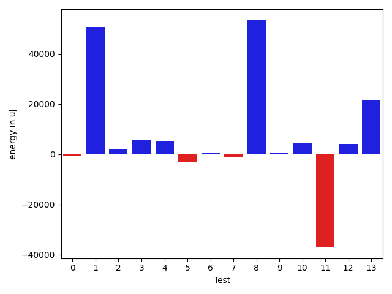
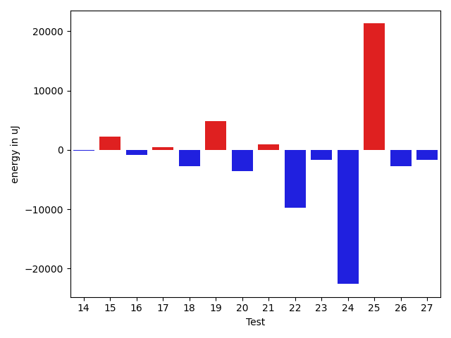
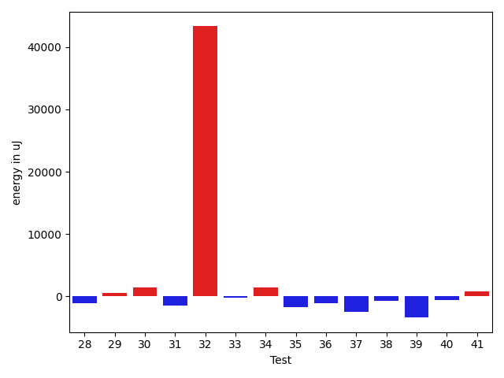
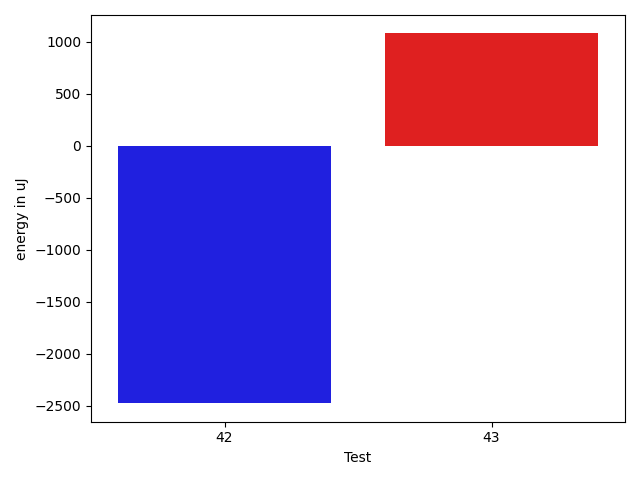

# gson 172143

https://github.com/google/gson/commit/172143

## Delta Energy per test method

| ID | EnergyV1 | EnergyV2 | DeltaEnergy | σV1 | σV2 |
| --- | --- | --- | --- | --- | --- |
| 0 | 37415 | 36743 | -672 | 4442.651807214851 | 4235.35111284162 |
| 1 | 40528 | 39123 | -1405 | 187202.7582600922 | 271980.20739204274 |
| 2 | 76355 | 84900 | 8545 | 27136.247674143637 | 22273.76742840208 |
| 3 | 39124 | 41442 | 2318 | 7212.621096752574 | 12948.332311512753 |
| 4 | 41077 | 42237 | 1160 | 14107.630078802553 | 18548.50813117849 |
| 5 | 77088 | 76904 | -184 | 24847.371287223 | 27429.830506080176 |
| 6 | 36499 | 37659 | 1160 | 4308.980845744628 | 4671.595459555659 |
| 7 | 39795 | 39551 | -244 | 3740.4799871674227 | 4642.975823570901 |
| 8 | 41687 | 42115 | 428 | 298206.3838077984 | 412043.385213226 |
| 9 | 36927 | 38086 | 1159 | 3717.085366808605 | 3207.956494057953 |
| 10 | 38941 | 40344 | 1403 | 3557.185284453003 | 14458.445687873356 |
| 11 | 38696 | 38208 | -488 | 149678.28639637085 | 4590.8893433585345 |
| 12 | 38635 | 39306 | 671 | 11840.954420072369 | 27189.49264924723 |
| 13 | 40772 | 39733 | -1039 | 53903.4491577688 | 74517.09972126642 |
| 14 | 38269 | 38269 | 0 | 13948.95848590968 | 12762.975245703838 |
| 15 | 109618 | 96374 | -13244 | 323285.37147091684 | 330064.81296555226 |
| 16 | 38513 | 38330 | -183 | 15246.275586912978 | 14618.84160731996 |
| 17 | 38269 | 39428 | 1159 | 9904.65100983588 | 10671.82121361823 |
| 18 | 40955 | 39795 | -1160 | 33142.7893764578 | 25398.056762244178 |
| 19 | 39795 | 39306 | -489 | 16322.94217280234 | 19798.87229817698 |
| 20 | 39856 | 38758 | -1098 | 14870.638138903103 | 11026.962021440166 |
| 21 | 36438 | 36927 | 489 | 4091.170884863785 | 4067.0263106078937 |
| 22 | 40284 | 37597 | -2687 | 26362.31967675396 | 18305.7242152231 |
| 23 | 38513 | 37293 | -1220 | 9721.56166844446 | 9727.55143534002 |
| 24 | 40649 | 41016 | 367 | 116782.75589019436 | 84831.17954035627 |
| 25 | 44922 | 42541 | -2381 | 405695.2028479298 | 419272.319772963 |
| 26 | 38635 | 35828 | -2807 | 4463.544513542461 | 3843.6308609901075 |
| 27 | 38024 | 36072 | -1952 | 6992.468348229744 | 7012.932546552429 |
| 28 | 36865 | 35705 | -1160 | 3920.613872897862 | 3653.391783349362 |
| 29 | 42603 | 43151 | 548 | 54929.66694465594 | 54177.79907031508 |
| 30 | 40649 | 42054 | 1405 | 106652.60672357904 | 96429.33233867244 |
| 31 | 37476 | 35950 | -1526 | 3885.754136721129 | 3898.4127726778343 |
| 32 | 102539 | 145874 | 43335 | 224819.54817217242 | 353983.5091646458 |
| 33 | 39123 | 38879 | -244 | 8422.408210366013 | 5887.153502194417 |
| 34 | 37170 | 38574 | 1404 | 4309.412071783358 | 4285.319630884373 |
| 35 | 38940 | 37170 | -1770 | 4563.100379522677 | 6720.641193552081 |
| 36 | 38208 | 37048 | -1160 | 4330.144419517384 | 4314.423225288575 |
| 37 | 39184 | 36682 | -2502 | 3826.4617568177637 | 3884.365111636583 |
| 38 | 39856 | 39123 | -733 | 446024.24174766435 | 530053.8072205697 |
| 39 | 40649 | 37232 | -3417 | 4207.466796007566 | 3197.3697231966157 |
| 40 | 38391 | 37780 | -611 | 3818.112393578796 | 3598.2674723356977 |
| 41 | 40161 | 40893 | 732 | 157641.82329041092 | 188419.38515117305 |
| 42 | 40222 | 37354 | -2868 | 4309.365320420601 | 3348.4765773242148 |
| 43 | 36621 | 37842 | 1221 | 3322.903133810312 | 3342.9686869009106 |

## Delta Duration per test method

| ID | DurationV1 | DurationsV2 | DeltaDuration |
| --- | --- | --- | --- |
| 0 | 910708.6949152543 | 957407.724137931 | 46699.02922267676 |
| 1 | 2766077.695652174 | 4393473.355263158 | 1627395.659610984 |
| 2 | 2679192.9696969697 | 2809508.222222222 | 130315.25252525229 |
| 3 | 971074.9152542372 | 1330437.447761194 | 359362.53250695684 |
| 4 | 1423853.392857143 | 1537553.3086419753 | 113699.91578483232 |
| 5 | 2305281.282828283 | 2354697.606060606 | 49416.32323232293 |
| 6 | 584003.0769230769 | 728992.4242424242 | 144989.34731934732 |
| 7 | 563182.36 | 586808.0 | 23625.640000000014 |
| 8 | 2896359.5444444446 | 4698498.6736842105 | 1802139.129239766 |
| 9 | 608984.5185185185 | 597286.3636363636 | -11698.154882154893 |
| 10 | 675634.9615384615 | 786364.5357142857 | 110729.57417582418 |
| 11 | 1738077.3157894737 | 644227.2592592592 | -1093850.0565302144 |
| 12 | 1051146.7142857143 | 1221642.8857142858 | 170496.17142857146 |
| 13 | 1448536.1666666667 | 2318223.769230769 | 869687.6025641023 |
| 14 | 1398446.6626506024 | 1336289.0595238095 | -62157.603126792936 |
| 15 | 4932988.97979798 | 5147612.171717172 | 214623.19191919174 |
| 16 | 1424566.4555555556 | 1373018.630952381 | -51547.82460317458 |
| 17 | 1212573.4776119404 | 1174855.7962962964 | -37717.681315643946 |
| 18 | 1495071.9672131147 | 1327115.3541666667 | -167956.61304644798 |
| 19 | 1567156.5520833333 | 1708308.8762886599 | 141152.32420532661 |
| 20 | 1559166.3804347827 | 1422145.9529411765 | -137020.42749360623 |
| 21 | 820841.5483870967 | 781207.2564102564 | -39634.29197684035 |
| 22 | 1550592.2962962964 | 1281996.5081967213 | -268595.7880995751 |
| 23 | 1143685.2857142857 | 1075688.0952380951 | -67997.19047619053 |
| 24 | 3023226.2352941176 | 2190535.6136363638 | -832690.6216577538 |
| 25 | 4486384.64935065 | 5330281.408450704 | 843896.7591000544 |
| 26 | 795525.3 | 764630.3666666667 | -30894.93333333335 |
| 27 | 1006155.2058823529 | 994188.2380952381 | -11966.967787114787 |
| 28 | 919811.5434782609 | 873866.1818181818 | -45945.3616600791 |
| 29 | 2266292.5113636362 | 2154869.3372093025 | -111423.17415433377 |
| 30 | 2562693.064102564 | 2556145.7837837837 | -6547.2803187803365 |
| 31 | 776663.8717948718 | 775884.7045454546 | -779.1672494171653 |
| 32 | 4515487.5050505055 | 6563960.01010101 | 2048472.5050505046 |
| 33 | 1147745.657142857 | 871876.24 | -275869.4171428571 |
| 34 | 607714.0 | 598554.2272727273 | -9159.772727272706 |
| 35 | 935173.26 | 1046344.0555555555 | 111170.7955555555 |
| 36 | 713024.0 | 638678.5483870967 | -74345.45161290327 |
| 37 | 586800.4583333334 | 582759.6451612903 | -4040.8131720430683 |
| 38 | 5837142.033333333 | 7115695.222222222 | 1278553.1888888888 |
| 39 | 670498.6666666666 | 544350.6842105263 | -126147.98245614034 |
| 40 | 620354.9444444445 | 647111.8333333334 | 26756.888888888876 |
| 41 | 2308941.1739130435 | 2253845.9375 | -55095.23641304346 |
| 42 | 484385.125 | 514408.8333333333 | 30023.708333333314 |
| 43 | 596414.8846153846 | 567120.56 | -29294.32461538457 |

## Misc.

| ID | Test Class | Test Method |
| --- | --- | --- |
| 0 | com.google.gson.functional.CustomTypeAdaptersTest | testCustomTypeAdapterAppliesToSubClassesSerializedAsBaseClass |
| 1 | com.google.gson.functional.CustomTypeAdaptersTest | testCustomSerializers |
| 2 | com.google.gson.functional.CustomTypeAdaptersTest | testCustomTypeAdapterDoesNotAppliesToSubClasses |
| 3 | com.google.gson.functional.CustomTypeAdaptersTest | testEnsureCustomSerializerNotInvokedForNullValues |
| 4 | com.google.gson.functional.ReadersWritersTest | testReadWriteTwoObjects |
| 5 | com.google.gson.functional.MapTest | testInterfaceTypeMapWithSerializer |
| 6 | com.google.gson.JsonParserTest | testParseUnquotedStringArrayFails |
| 7 | com.google.gson.JsonParserTest | testParseMixedArray |
| 8 | com.google.gson.JsonParserTest | testReadWriteTwoObjects |
| 9 | com.google.gson.internal.bind.JsonElementReaderTest | testObject |
| 10 | com.google.gson.internal.bind.JsonElementReaderTest | testNestedObjects |
| 11 | com.google.gson.internal.bind.JsonElementReaderTest | testEmptyObject |
| 12 | com.google.gson.DefaultMapJsonSerializerTest | testEmptyMapSerialization |
| 13 | com.google.gson.DefaultMapJsonSerializerTest | testEmptyMapNoTypeSerialization |
| 14 | com.google.gson.functional.MapAsArrayTypeAdapterTest | testMultipleEnableComplexKeyRegistrationHasNoEffect |
| 15 | com.google.gson.functional.MapAsArrayTypeAdapterTest | testSerializeComplexMapWithTypeAdapter |
| 16 | com.google.gson.functional.MapAsArrayTypeAdapterTest | testMapWithTypeVariableSerialization |
| 17 | com.google.gson.functional.ExclusionStrategyFunctionalTest | testExclusionStrategyWithMode |
| 18 | com.google.gson.functional.ExclusionStrategyFunctionalTest | testExclusionStrategyDeserialization |
| 19 | com.google.gson.functional.ParameterizedTypesTest | testParameterizedTypeWithCustomSerializer |
| 20 | com.google.gson.functional.CustomDeserializerTest | testJsonTypeFieldBasedDeserialization |
| 21 | com.google.gson.functional.JsonParserTest | testBadFieldTypeForCustomDeserializerCustomTree |
| 22 | com.google.gson.functional.JsonParserTest | testChangingCustomTreeAndDeserializing |
| 23 | com.google.gson.functional.JsonParserTest | testBadFieldTypeForDeserializingCustomTree |
| 24 | com.google.gson.functional.JsonParserTest | testDeserializingCustomTree |
| 25 | com.google.gson.functional.CustomSerializerTest | testSubClassSerializerInvokedForBaseClassFieldsHoldingSubClassInstances |
| 26 | com.google.gson.functional.CustomSerializerTest | testBaseClassSerializerInvokedForBaseClassFields |
| 27 | com.google.gson.functional.CustomSerializerTest | testSubClassSerializerInvokedForBaseClassFieldsHoldingArrayOfSubClassInstances |
| 28 | com.google.gson.functional.CustomSerializerTest | testBaseClassSerializerInvokedForBaseClassFieldsHoldingSubClassInstances |
| 29 | com.google.gson.functional.JsonTreeTest | testJsonTreeToString |
| 30 | com.google.gson.functional.JsonTreeTest | testToJsonTreeObjectType |
| 31 | com.google.gson.functional.JsonTreeTest | testToJsonTree |
| 32 | com.google.gson.functional.TypeHierarchyAdapterTest | testTypeHierarchy |
| 33 | com.google.gson.functional.PrintFormattingTest | testJsonObjectWithNullValues |
| 34 | com.google.gson.functional.PrintFormattingTest | testJsonObjectWithNullValuesSerialized |
| 35 | com.google.gson.functional.NullObjectAndFieldTest | testCustomSerializationOfNulls |
| 36 | com.google.gson.functional.ObjectTest | testJsonObjectSerialization |
| 37 | com.google.gson.JsonObjectTest | testWritePropertyWithEmptyStringName |
| 38 | com.google.gson.JsonObjectTest | testPropertyWithQuotes |
| 39 | com.google.gson.internal.bind.JsonElementWriterTest | testNestedObject |
| 40 | com.google.gson.internal.bind.JsonElementWriterTest | testObject |
| 41 | com.google.gson.internal.bind.JsonElementWriterTest | testSerializeNullsFalse |
| 42 | com.google.gson.internal.bind.JsonElementWriterTest | testSerializeNullsTrue |
| 43 | com.google.gson.functional.DefaultTypeAdaptersTest | testJsonObjectSerialization |

| Test | IterationV1 | IterationV2 | DeltaIteration |
| --- | --- | --- | --- |
| 0 | 59 | 58 | -1 |
| 1 | 69 | 76 | 7 |
| 2 | 99 | 99 | 0 |
| 3 | 59 | 67 | 8 |
| 4 | 84 | 81 | -3 |
| 5 | 99 | 99 | 0 |
| 6 | 26 | 33 | 7 |
| 7 | 25 | 24 | -1 |
| 8 | 90 | 95 | 5 |
| 9 | 27 | 22 | -5 |
| 10 | 26 | 28 | 2 |
| 11 | 19 | 27 | 8 |
| 12 | 63 | 70 | 7 |
| 13 | 24 | 39 | 15 |
| 14 | 83 | 84 | 1 |
| 15 | 99 | 99 | 0 |
| 16 | 90 | 84 | -6 |
| 17 | 67 | 54 | -13 |
| 18 | 61 | 48 | -13 |
| 19 | 96 | 97 | 1 |
| 20 | 92 | 85 | -7 |
| 21 | 31 | 39 | 8 |
| 22 | 54 | 61 | 7 |
| 23 | 63 | 63 | 0 |
| 24 | 51 | 44 | -7 |
| 25 | 77 | 71 | -6 |
| 26 | 40 | 30 | -10 |
| 27 | 68 | 63 | -5 |
| 28 | 46 | 55 | 9 |
| 29 | 88 | 86 | -2 |
| 30 | 78 | 74 | -4 |
| 31 | 39 | 44 | 5 |
| 32 | 99 | 99 | 0 |
| 33 | 35 | 25 | -10 |
| 34 | 19 | 22 | 3 |
| 35 | 50 | 36 | -14 |
| 36 | 28 | 31 | 3 |
| 37 | 24 | 31 | 7 |
| 38 | 30 | 36 | 6 |
| 39 | 18 | 19 | 1 |
| 40 | 18 | 18 | 0 |
| 41 | 23 | 16 | -7 |
| 42 | 16 | 12 | -4 |
| 43 | 26 | 25 | -1 |

| Time Label | Time (s) |
| --- | --- |
| Selection | 28.96558928489685 |
| Injection | 13.008283138275146 |
| Total | 1168.594596862793 |

