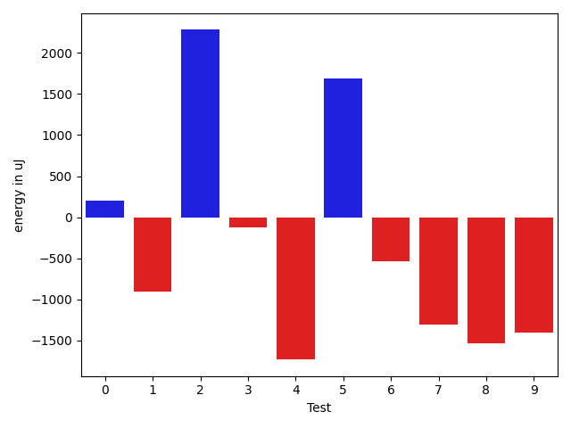
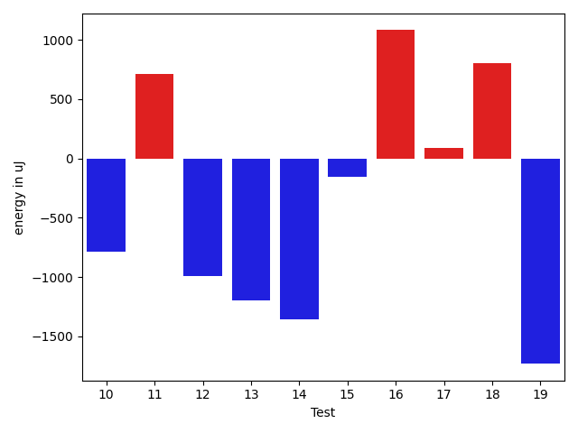

# gson 016261

https://github.com/google/gson/commit/016261

## Delta Energy per test method

| ID | EnergyV1 | EnergyV2 | DeltaEnergy | σV1 | σV2 |
| --- | --- | --- | --- | --- | --- |
| 0 | 35228.51851851852 | 35435.142857142855 | 206.62433862433681 | 3699.114592463389 | 3450.1701998833714 |
| 1 | 36737.86956521739 | 35837.77777777778 | -900.0917874396109 | 2995.7228539651956 | 2603.8132198663207 |
| 2 | 33902.57692307692 | 36182.78571428572 | 2280.2087912087954 | 3309.1055283760575 | 3181.8661792496964 |
| 3 | 35721.8 | 35598.65 | -123.15000000000146 | 2686.4559851224067 | 2972.2703826368156 |
| 4 | 36336.22222222222 | 34603.63157894737 | -1732.5906432748525 | 3175.522818818896 | 2819.056807749457 |
| 5 | 35638.619047619046 | 37324.08 | 1685.4609523809559 | 3264.8940254979834 | 3288.466012231235 |
| 6 | 35205.0 | 34667.96296296296 | -537.0370370370365 | 2956.6445846601177 | 3832.584714161039 |
| 7 | 36509.11111111111 | 35198.42307692308 | -1310.6880341880315 | 2379.020991194321 | 3346.6156518198977 |
| 8 | 37280.26666666667 | 35741.125 | -1539.14166666667 | 3156.0882849220525 | 4749.755163097883 |
| 9 | 36196.583333333336 | 34795.454545454544 | -1401.1287878787916 | 3517.1584164476994 | 2907.8960486496194 |
| 10 | 35528.19047619047 | 34744.1 | -784.0904761904749 | 2575.0368766485217 | 2522.136929272477 |
| 11 | 35095.055555555555 | 35811.565217391304 | 716.5096618357493 | 4355.83487943627 | 4332.787664010189 |
| 12 | 35644.47368421053 | 34651.36363636364 | -993.110047846887 | 3289.6721700117146 | 3204.4128741110435 |
| 13 | 37715.28571428572 | 36514.782608695656 | -1200.5031055900618 | 3398.8644412209082 | 2479.50685764102 |
| 14 | 36498.86363636364 | 35140.92857142857 | -1357.9350649350672 | 3034.1182977994317 | 3498.9995603699904 |
| 15 | 35160.74074074074 | 35002.09523809524 | -158.64550264550053 | 3678.895774273827 | 4607.276614275891 |
| 16 | 35445.0 | 36526.96153846154 | 1081.961538461539 | 2647.6428762202804 | 2180.0518603706023 |
| 17 | 35475.46666666667 | 35563.88 | 88.41333333333023 | 3082.0666414310745 | 3180.7470483520065 |
| 18 | 53435.74025974026 | 54239.94285714286 | 804.2025974025964 | 23367.521900635737 | 24959.2323622146 |
| 19 | 38348.125 | 36615.934426229505 | -1732.1905737704947 | 15188.940044383446 | 7269.532268690755 |

## Delta Duration per test method

| ID | DurationV1 | DurationsV2 | DeltaDuration |
| --- | --- | --- | --- |
| 0 | 573989.0 | 593396.619047619 | 19407.619047619053 |
| 1 | 540371.2173913043 | 509379.6666666667 | -30991.550724637636 |
| 2 | 593422.1153846154 | 590995.2857142857 | -2426.8296703296946 |
| 3 | 564413.2666666667 | 545747.55 | -18665.716666666674 |
| 4 | 513377.8333333333 | 541100.5263157894 | 27722.692982456123 |
| 5 | 564998.0952380953 | 546264.92 | -18733.175238095224 |
| 6 | 563627.04 | 561888.2222222222 | -1738.8177777777892 |
| 7 | 513169.44444444444 | 541106.7692307692 | 27937.32478632481 |
| 8 | 572616.3333333334 | 571117.7083333334 | -1498.625 |
| 9 | 554999.0833333334 | 534364.1818181818 | -20634.901515151607 |
| 10 | 520985.71428571426 | 535870.05 | 14884.335714285786 |
| 11 | 626084.6666666666 | 570391.7826086957 | -55692.88405797095 |
| 12 | 541458.1578947369 | 568613.5454545454 | 27155.387559808558 |
| 13 | 528230.2142857143 | 537699.1739130435 | 9468.959627329139 |
| 14 | 559853.5909090909 | 586838.3928571428 | 26984.8019480519 |
| 15 | 719276.7407407408 | 854616.380952381 | 135339.64021164016 |
| 16 | 551919.2 | 533562.6538461539 | -18356.54615384608 |
| 17 | 536983.3333333334 | 560304.48 | 23321.14666666661 |
| 18 | 1947423.87012987 | 1946417.4 | -1006.4701298701111 |
| 19 | 1644170.65625 | 1367601.786885246 | -276568.86936475406 |

## Misc.

| ID | Test Class | Test Method |
| --- | --- | --- |
| 0 | com.google.gson.functional.PrimitiveTest | testDeserializeJsonObjectAsShortPrimitive |
| 1 | com.google.gson.functional.PrimitiveTest | testDeserializeJsonObjectAsBigInteger |
| 2 | com.google.gson.functional.PrimitiveTest | testDeserializeJsonArrayAsInt |
| 3 | com.google.gson.functional.PrimitiveTest | testDeserializeJsonArrayAsByteWrapper |
| 4 | com.google.gson.functional.PrimitiveTest | testDeserializeJsonArrayAsBooleanWrapper |
| 5 | com.google.gson.functional.PrimitiveTest | testDeserializeJsonObjectAsBigDecimal |
| 6 | com.google.gson.functional.PrimitiveTest | testDeserializeJsonArrayAsDoublePrimitive |
| 7 | com.google.gson.functional.PrimitiveTest | testDeserializeJsonArrayAsFloatWrapper |
| 8 | com.google.gson.functional.PrimitiveTest | testDeserializeJsonArrayAsLongWrapper |
| 9 | com.google.gson.functional.PrimitiveTest | testDeserializeJsonObjectAsDoubleWrapper |
| 10 | com.google.gson.functional.PrimitiveTest | testDeserializeJsonObjectAsBooleanPrimitive |
| 11 | com.google.gson.functional.PrimitiveTest | testDeserializeJsonArrayAsShortWrapper |
| 12 | com.google.gson.functional.PrimitiveTest | testDeserializeJsonObjectAsFloatPrimitive |
| 13 | com.google.gson.functional.PrimitiveTest | testDeserializeJsonArrayAsBigDecimal |
| 14 | com.google.gson.functional.PrimitiveTest | testDeserializeJsonObjectAsInteger |
| 15 | com.google.gson.functional.PrimitiveTest | testDeserializeJsonObjectAsLongPrimitive |
| 16 | com.google.gson.functional.PrimitiveTest | testDeserializeJsonArrayAsBigInteger |
| 17 | com.google.gson.functional.PrimitiveTest | testDeserializeJsonObjectAsBytePrimitive |
| 18 | com.google.gson.functional.ObjectTest | testTruncatedDeserialization |
| 19 | com.google.gson.GsonTypeAdapterTest | testDefaultTypeAdapterThrowsParseException |

| Test | IterationV1 | IterationV2 | DeltaIteration |
| --- | --- | --- | --- |
| 0 | 27 | 21 | -6 |
| 1 | 23 | 18 | -5 |
| 2 | 26 | 28 | 2 |
| 3 | 15 | 20 | 5 |
| 4 | 18 | 19 | 1 |
| 5 | 21 | 25 | 4 |
| 6 | 25 | 27 | 2 |
| 7 | 18 | 26 | 8 |
| 8 | 15 | 24 | 9 |
| 9 | 24 | 22 | -2 |
| 10 | 21 | 20 | -1 |
| 11 | 18 | 23 | 5 |
| 12 | 19 | 11 | -8 |
| 13 | 14 | 23 | 9 |
| 14 | 22 | 28 | 6 |
| 15 | 27 | 21 | -6 |
| 16 | 15 | 26 | 11 |
| 17 | 30 | 25 | -5 |
| 18 | 77 | 70 | -7 |
| 19 | 64 | 61 | -3 |

| Time Label | Time (s) |
| --- | --- |
| Selection | 28.28620147705078 |
| Injection | 10.840299844741821 |
| Total | 1130.125777721405 |

