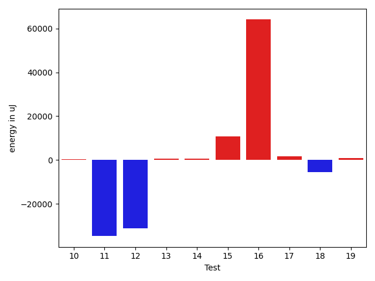
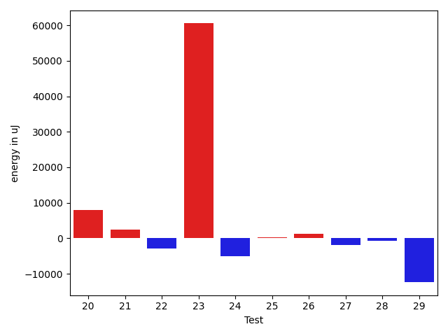

# gson 0340e0

https://github.com/google/gson/commit/0340e0

## Delta Energy per test method

| ID | EnergyV1 | EnergyV2 | DeltaEnergy | σV1 | σV2 |
| --- | --- | --- | --- | --- | --- |
| 0 | 40954 | 40833 | -121 | 19616.11560914196 | 17922.9459402548 |
| 1 | 38818 | 40405 | 1587 | 24227.35136726108 | 28679.553051194944 |
| 2 | 36377 | 37231 | 854 | 11522.646371714998 | 10808.503876182729 |
| 3 | 35340 | 37109 | 1769 | 5360.9784308962035 | 3971.7034482212093 |
| 4 | 36255 | 36621 | 366 | 11919.481440581141 | 6281.330579936257 |
| 5 | 36621 | 37110 | 489 | 3927.7681442571584 | 6739.027749529291 |
| 6 | 37292 | 36194 | -1098 | 4544.399093389576 | 3531.775674279852 |
| 7 | 34912 | 35462 | 550 | 5182.011199534286 | 4554.262848625999 |
| 8 | 36804 | 36316 | -488 | 6916.429994978085 | 9248.774795697727 |
| 9 | 44006 | 42725 | -1281 | 432828.8686213575 | 419913.79266521655 |
| 10 | 37720 | 38208 | 488 | 7066.569863712617 | 6576.239322773095 |
| 11 | 82459 | 82214 | -245 | 440400.5352266452 | 365205.67915357684 |
| 12 | 44067 | 46448 | 2381 | 229053.36046948264 | 25014.63833564873 |
| 13 | 36805 | 39124 | 2319 | 5269.647979596968 | 4812.099523728983 |
| 14 | 39612 | 39611 | -1 | 8418.58872932681 | 9181.776596901595 |
| 15 | 39062 | 38025 | -1037 | 13997.580666075459 | 40035.58476844667 |
| 16 | 98266 | 96008 | -2258 | 398818.5049899886 | 509568.4747363726 |
| 17 | 40100 | 40832 | 732 | 17622.9387301507 | 17833.052365201147 |
| 18 | 39978 | 40405 | 427 | 67701.2207658252 | 56694.82446412834 |
| 19 | 36011 | 38391 | 2380 | 3710.5623817368073 | 4472.801957710559 |
| 20 | 39978 | 41016 | 1038 | 60031.65770831404 | 77444.91338254008 |
| 21 | 36682 | 36438 | -244 | 6995.097425303023 | 24328.50924861845 |
| 22 | 39002 | 37842 | -1160 | 15564.903814019199 | 11935.341464600075 |
| 23 | 162170 | 200256 | 38086 | 240897.24954966802 | 280005.84296448936 |
| 24 | 46692 | 41992 | -4700 | 23025.714572197045 | 21401.941518114512 |
| 25 | 36438 | 38391 | 1953 | 5710.47528012336 | 6124.570048851895 |
| 26 | 38208 | 38452 | 244 | 4667.213591160692 | 5792.143531660627 |
| 27 | 39673 | 37781 | -1892 | 2822.9765839713928 | 3452.4849720157304 |
| 28 | 41381 | 39368 | -2013 | 4577.082482051203 | 4379.124778983122 |
| 29 | 40771 | 39002 | -1769 | 27856.36108938854 | 15315.668285293592 |

## Delta Duration per test method

| ID | DurationV1 | DurationsV2 | DeltaDuration |
| --- | --- | --- | --- |
| 0 | 1560996.5128205128 | 1482094.4642857143 | -78902.04853479844 |
| 1 | 1299666.8181818181 | 1333678.923076923 | 34012.10489510489 |
| 2 | 1278024.5 | 1308711.2469135802 | 30686.746913580224 |
| 3 | 988897.5614035088 | 1004542.9642857143 | 15645.402882205555 |
| 4 | 930037.6666666666 | 896819.9782608695 | -33217.68840579712 |
| 5 | 976235.3272727273 | 997698.4385964912 | 21463.111323763966 |
| 6 | 762141.4 | 815614.8157894737 | 53473.415789473685 |
| 7 | 800440.9555555555 | 783915.2 | -16525.755555555574 |
| 8 | 1118255.794117647 | 1136347.4393939395 | 18091.64527629246 |
| 9 | 5315416.261363637 | 5586237.367346939 | 270821.105983302 |
| 10 | 1189731.2028985508 | 1171216.6351351351 | -18514.56776341563 |
| 11 | 5786677.555555556 | 4769974.2727272725 | -1016703.2828282835 |
| 12 | 3016366.1224489794 | 1902988.030612245 | -1113378.0918367344 |
| 13 | 973270.1228070175 | 1001384.283018868 | 28114.160211850423 |
| 14 | 1152605.8709677418 | 1188232.9672131147 | 35627.0962453729 |
| 15 | 1389247.894736842 | 1704922.3974358975 | 315674.5026990555 |
| 16 | 5866089.636363637 | 7766888.090909091 | 1900798.4545454541 |
| 17 | 1595709.6170212766 | 1581379.9484536082 | -14329.668567668414 |
| 18 | 2043257.12987013 | 1864602.875 | -178654.25487012998 |
| 19 | 1018248.0363636364 | 979926.7384615385 | -38321.297902097926 |
| 20 | 2161112.213483146 | 2361708.0555555555 | 200595.84207240958 |
| 21 | 1232716.7647058824 | 1323516.120879121 | 90799.35617323848 |
| 22 | 1457208.625 | 1466410.7471264368 | 9202.122126436792 |
| 23 | 9561821.606060605 | 11405963.757575758 | 1844142.1515151523 |
| 24 | 1869721.7959183673 | 1905457.5102040817 | 35735.71428571432 |
| 25 | 1101444.4736842106 | 1130789.4655172413 | 29344.991833030712 |
| 26 | 739164.0645161291 | 700580.1851851852 | -38583.87933094392 |
| 27 | 550858.0476190476 | 625016.8947368421 | 74158.84711779456 |
| 28 | 540858.3 | 513983.962962963 | -26874.33703703707 |
| 29 | 1556872.16 | 906776.5769230769 | -650095.583076923 |

## Misc.

| ID | Test Class | Test Method |
| --- | --- | --- |
| 0 | com.google.gson.functional.ReadersWritersTest | testReadWriteTwoObjects |
| 1 | com.google.gson.functional.ReadersWritersTest | testReaderForDeserialization |
| 2 | com.google.gson.functional.ObjectTest | testArrayOfArraysDeserialization |
| 3 | com.google.gson.functional.ObjectTest | testNestedDeserialization |
| 4 | com.google.gson.functional.ObjectTest | testBagOfPrimitiveWrappersDeserialization |
| 5 | com.google.gson.functional.ObjectTest | testNullFieldsDeserialization |
| 6 | com.google.gson.functional.ObjectTest | testBagOfPrimitivesDeserialization |
| 7 | com.google.gson.functional.ObjectTest | testObjectFieldNamesWithoutQuotesDeserialization |
| 8 | com.google.gson.functional.ObjectTest | testArrayOfObjectsDeserialization |
| 9 | com.google.gson.JsonParserTest | testReadWriteTwoObjects |
| 10 | com.google.gson.functional.TypeVariableTest | testBasicTypeVariables |
| 11 | com.google.gson.functional.TypeVariableTest | testAdvancedTypeVariables |
| 12 | com.google.gson.functional.TypeVariableTest | testTypeVariablesViaTypeParameter |
| 13 | com.google.gson.functional.MapTest | testReadMapsWithEmptyStringKey |
| 14 | com.google.gson.functional.UncategorizedTest | testGsonInstanceReusableForSerializationAndDeserialization |
| 15 | com.google.gson.functional.InheritanceTest | testSubClassDeserialization |
| 16 | com.google.gson.functional.MapAsArrayTypeAdapterTest | testSerializeComplexMapWithTypeAdapter |
| 17 | com.google.gson.functional.EscapingTest | testGsonAcceptsEscapedAndNonEscapedJsonDeserialization |
| 18 | com.google.gson.functional.EscapingTest | testEscapingObjectFields |
| 19 | com.google.gson.functional.EscapingTest | testGsonDoubleDeserialization |
| 20 | com.google.gson.functional.ParameterizedTypesTest | testParameterizedTypeDeserialization |
| 21 | com.google.gson.functional.ParameterizedTypesTest | testParameterizedTypeWithReaderDeserialization |
| 22 | com.google.gson.functional.ParameterizedTypesTest | testTypesWithMultipleParametersDeserialization |
| 23 | com.google.gson.functional.DefaultTypeAdaptersTest | testNullSerialization |
| 24 | com.google.gson.functional.CollectionTest | testWildcardCollectionField |
| 25 | com.google.gson.functional.VersioningTest | testVersionedGsonWithUnversionedClassesDeserialization |
| 26 | com.google.gson.functional.PrimitiveTest | testBooleanDeserialization |
| 27 | com.google.gson.functional.PrimitiveTest | testDeserializeJsonObjectAsBooleanPrimitive |
| 28 | com.google.gson.functional.PrimitiveTest | testDeserializeJsonArrayAsBooleanWrapper |
| 29 | com.google.gson.JsonPrimitiveTest | testParsingStringAsBoolean |

| Test | IterationV1 | IterationV2 | DeltaIteration |
| --- | --- | --- | --- |
| 0 | 78 | 84 | 6 |
| 1 | 44 | 39 | -5 |
| 2 | 74 | 81 | 7 |
| 3 | 57 | 56 | -1 |
| 4 | 42 | 46 | 4 |
| 5 | 55 | 57 | 2 |
| 6 | 50 | 38 | -12 |
| 7 | 45 | 40 | -5 |
| 8 | 68 | 66 | -2 |
| 9 | 88 | 98 | 10 |
| 10 | 69 | 74 | 5 |
| 11 | 99 | 99 | 0 |
| 12 | 98 | 98 | 0 |
| 13 | 57 | 53 | -4 |
| 14 | 62 | 61 | -1 |
| 15 | 76 | 78 | 2 |
| 16 | 99 | 99 | 0 |
| 17 | 94 | 97 | 3 |
| 18 | 77 | 72 | -5 |
| 19 | 55 | 65 | 10 |
| 20 | 89 | 90 | 1 |
| 21 | 85 | 91 | 6 |
| 22 | 88 | 87 | -1 |
| 23 | 99 | 99 | 0 |
| 24 | 98 | 98 | 0 |
| 25 | 57 | 58 | 1 |
| 26 | 31 | 27 | -4 |
| 27 | 21 | 19 | -2 |
| 28 | 20 | 27 | 7 |
| 29 | 25 | 26 | 1 |

| Time Label | Time (s) |
| --- | --- |
| Selection | 28.697402238845825 |
| Injection | 12.96480107307434 |
| Total | 1167.8596830368042 |

