# gson 94d59b

https://github.com/google/gson/commit/94d59b

## Delta Energy per test method

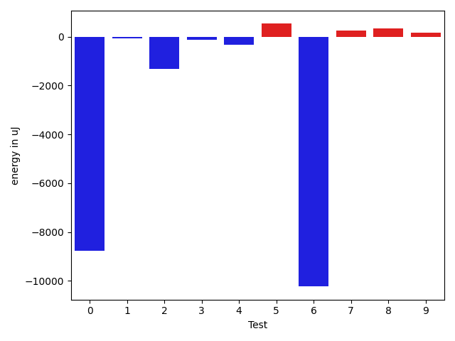

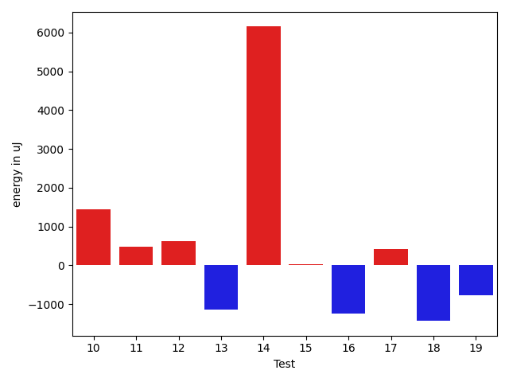

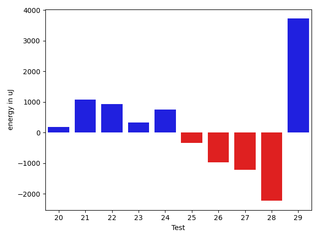

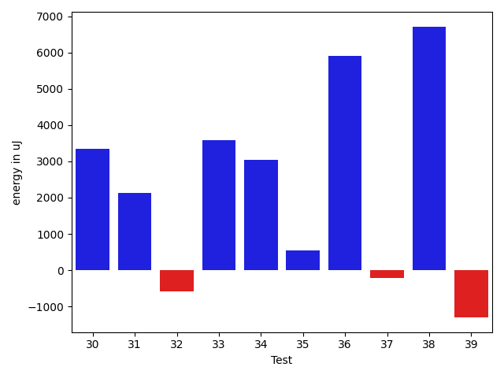

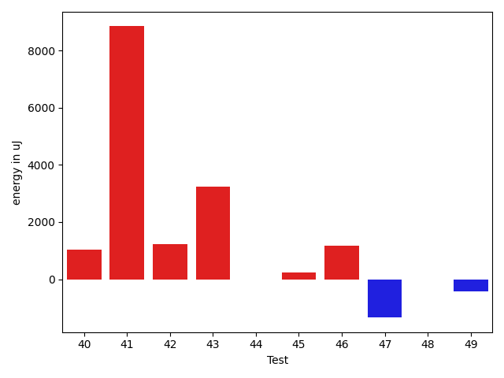

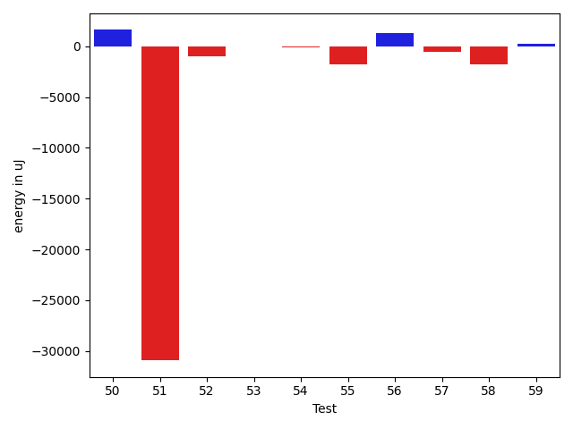

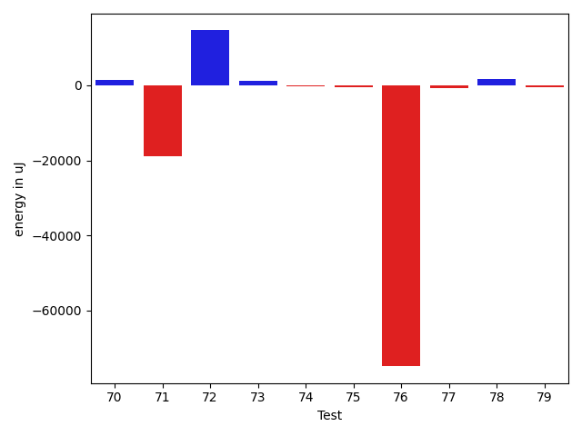

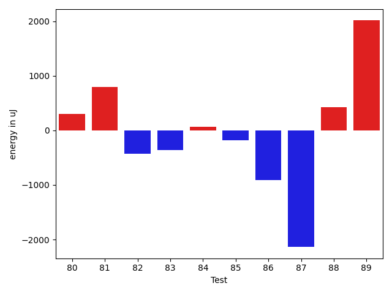

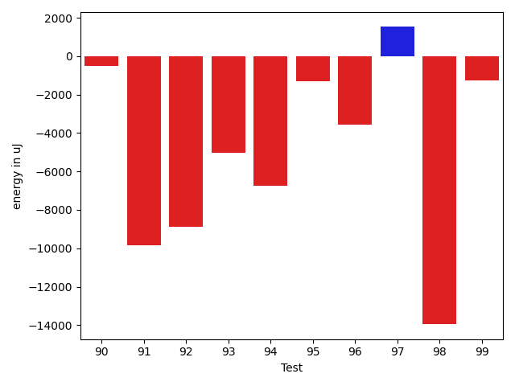

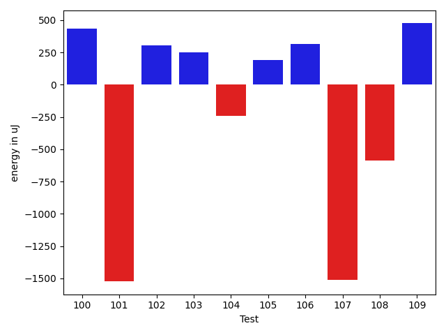

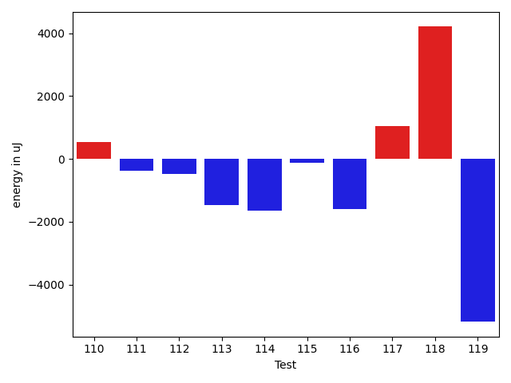

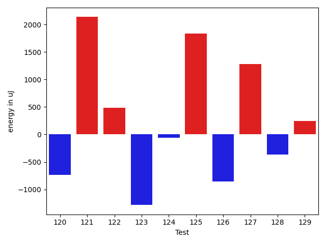

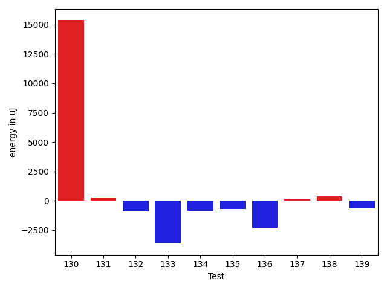

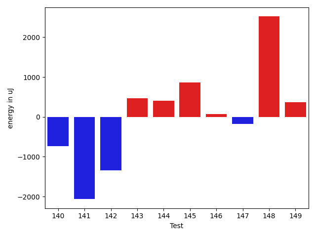

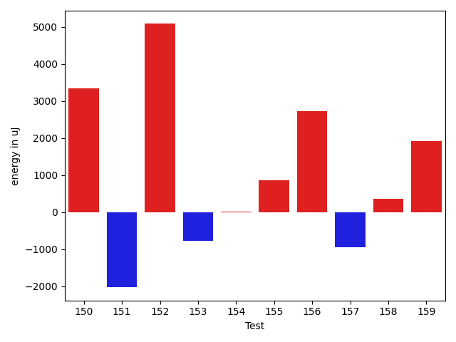

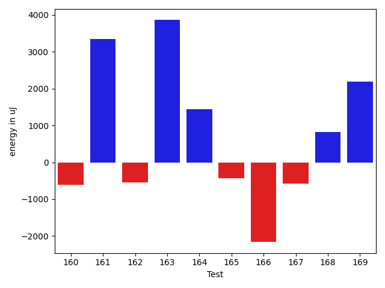

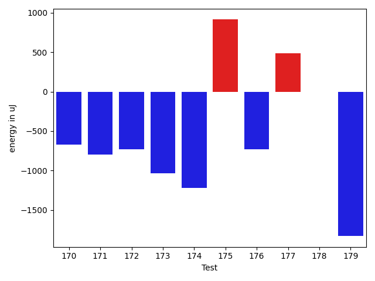

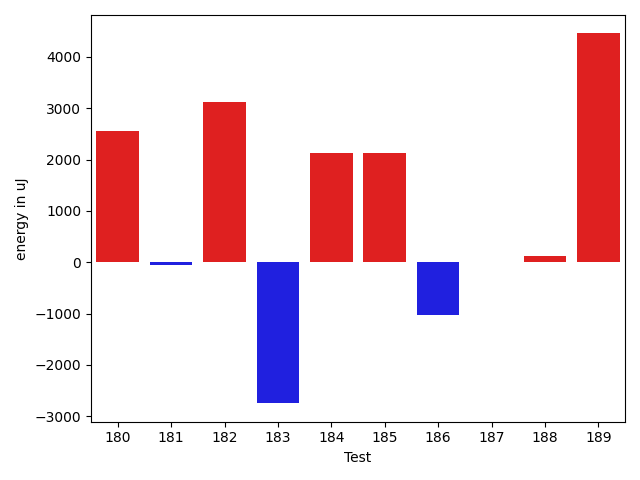

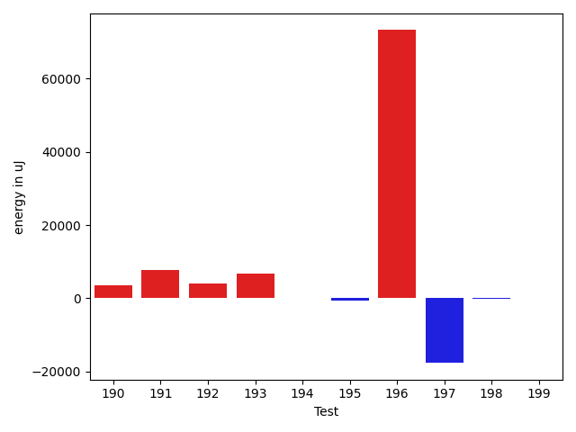

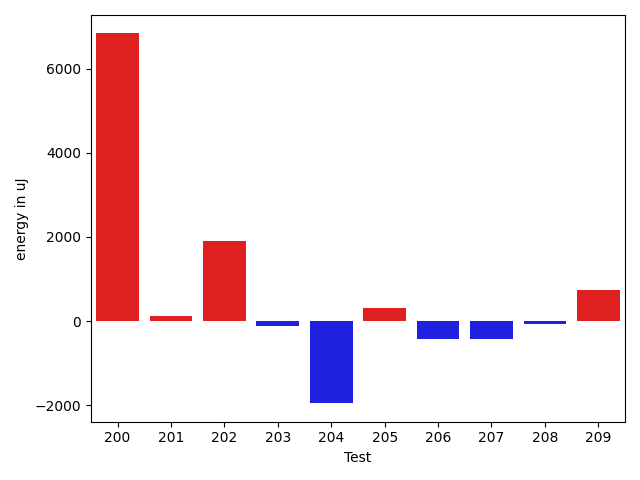

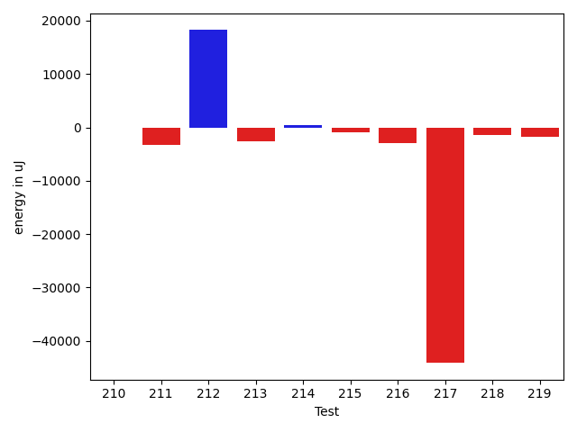

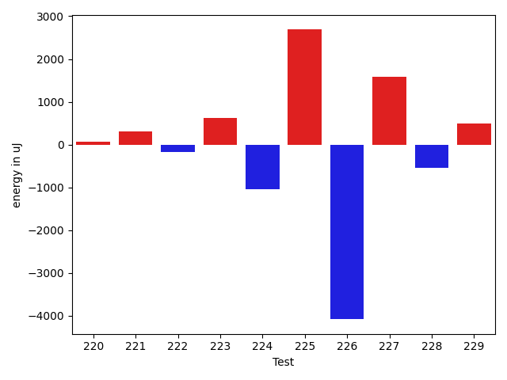

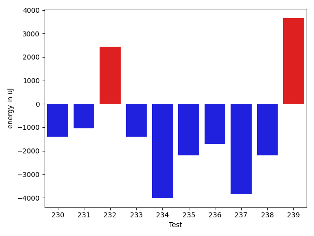

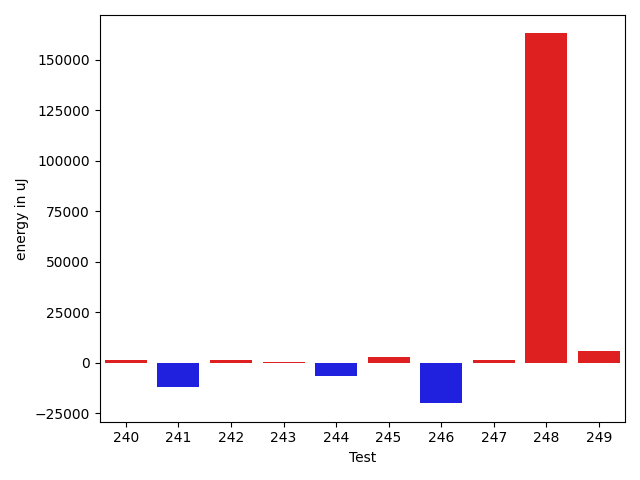

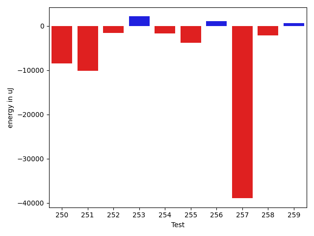

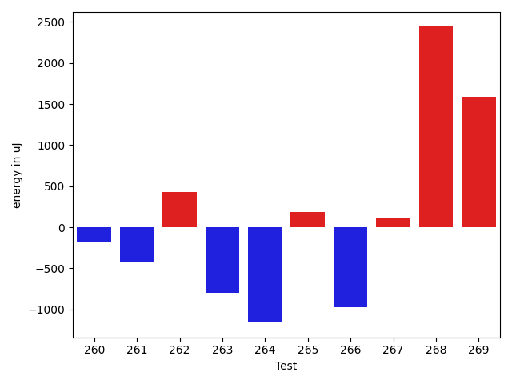

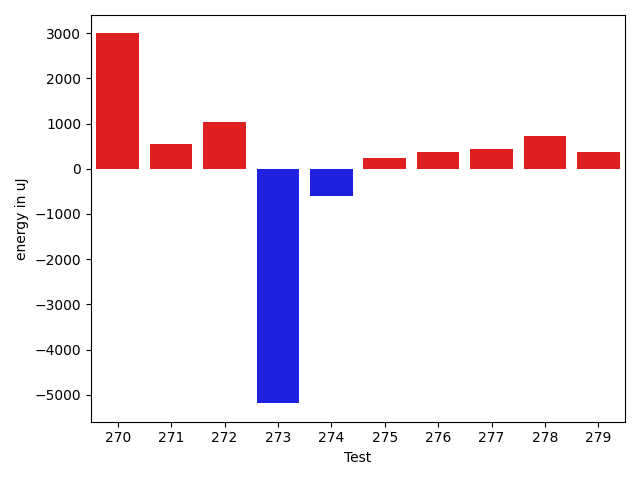

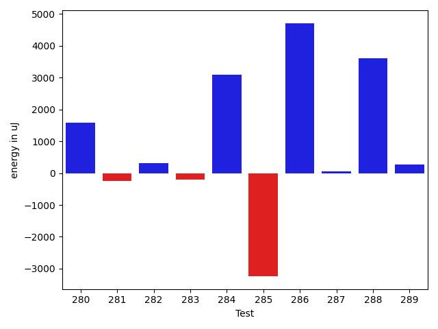

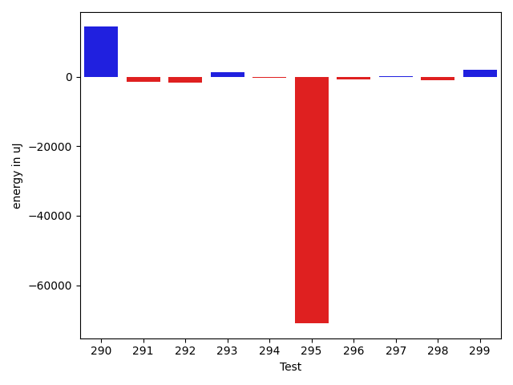

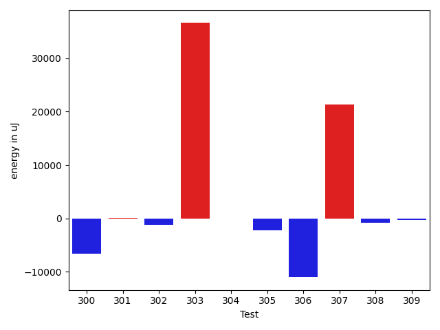

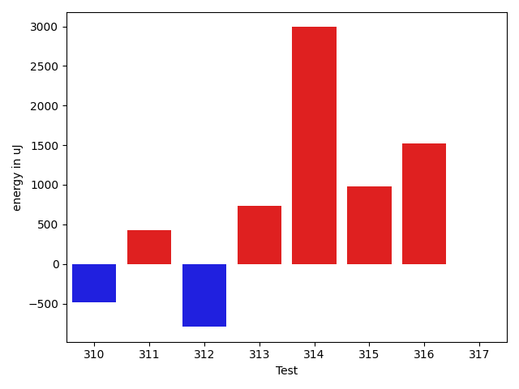

| ID | EnergyV1 | EnergyV2 | DeltaEnergy | σV1 | σV2 |
| --- | --- | --- | --- | --- | --- |
| 0 | 42969 | 41016 | -1953 | 47788.360244683274 | 37076.93124675593 |
| 1 | 37964 | 38208 | 244 | 4013.8871622998436 | 4008.9716955721888 |
| 2 | 39184 | 37232 | -1952 | 11160.743858759295 | 10918.425417240194 |
| 3 | 39063 | 39551 | 488 | 17542.1558284962 | 16718.58338105759 |
| 4 | 38024 | 37170 | -854 | 4174.321164713184 | 3860.5609667220356 |
| 5 | 38392 | 38879 | 487 | 4085.43532804033 | 5064.352528345359 |
| 6 | 40344 | 40527 | 183 | 78292.73991683635 | 60608.977284164306 |
| 7 | 38818 | 38879 | 61 | 4120.324125339078 | 4307.324461007865 |
| 8 | 35828 | 35889 | 61 | 5308.998434082983 | 4846.720399130091 |
| 9 | 35096 | 36682 | 1586 | 3980.30779661774 | 4184.497183772728 |
| 10 | 34851 | 36560 | 1709 | 4106.911281808264 | 4142.276626445897 |
| 11 | 35828 | 37537 | 1709 | 4088.5111806374434 | 4128.734344356081 |
| 12 | 120544 | 117737 | -2807 | 19825.779940979268 | 21959.41837677353 |
| 13 | 36988 | 36621 | -367 | 16348.33835532617 | 12590.284474300262 |
| 14 | 173278 | 440734 | 267456 | 244649.45717843415 | 237132.8901415469 |
| 15 | 37109 | 37353 | 244 | 3902.1277715321753 | 6182.763419482646 |
| 16 | 36194 | 34851 | -1343 | 4149.451082653534 | 4294.959789148206 |
| 17 | 38696 | 36560 | -2136 | 16223.666596069332 | 16499.63124040637 |
| 18 | 74646 | 75501 | 855 | 22858.30455823915 | 18500.345987835623 |
| 19 | 36194 | 34851 | -1343 | 4286.61544969985 | 4111.036515115164 |
| 20 | 35095 | 35889 | 794 | 4403.850620546289 | 3059.8575035516806 |
| 21 | 37049 | 36621 | -428 | 4453.712620408536 | 4562.633198778664 |
| 22 | 36377 | 36438 | 61 | 3907.1640741710703 | 3547.056250660746 |
| 23 | 34301 | 33814 | -487 | 3604.9769877835533 | 3632.717775335702 |
| 24 | 35705 | 36499 | 794 | 4063.522495289306 | 4732.522072912021 |
| 25 | 36011 | 35461 | -550 | 4248.727607561108 | 4224.405484970233 |
| 26 | 45959 | 41320 | -4639 | 21348.399594449642 | 24250.483111591886 |
| 27 | 36438 | 34607 | -1831 | 3084.7778732835854 | 4309.163744027315 |
| 28 | 36987 | 33875 | -3112 | 3981.928001408167 | 4172.641461443225 |
| 29 | 35462 | 39489 | 4027 | 3737.1595844487547 | 4157.117787311042 |
| 30 | 33814 | 37720 | 3906 | 5020.778210530234 | 3821.7848671775932 |
| 31 | 33692 | 37048 | 3356 | 3782.048545731325 | 3369.949209330816 |
| 32 | 36011 | 35950 | -61 | 4671.174257530421 | 3619.864453708611 |
| 33 | 34240 | 37415 | 3175 | 5315.913444554943 | 4434.462216474324 |
| 34 | 38391 | 38330 | -61 | 9133.05115808553 | 13972.556868899841 |
| 35 | 41626 | 41504 | -122 | 19612.28764291492 | 20371.941483678795 |
| 36 | 75988 | 76660 | 672 | 81356.53329971286 | 91707.4939182143 |
| 37 | 41931 | 41565 | -366 | 20067.361509402035 | 18844.962785737553 |
| 38 | 71105 | 79467 | 8362 | 34835.24838496549 | 37195.390524773065 |
| 39 | 40893 | 42297 | 1404 | 29136.27366653862 | 21131.651637339543 |
| 40 | 38147 | 39184 | 1037 | 43253.25080895607 | 43277.05152992114 |
| 41 | 50537 | 59387 | 8850 | 25645.09434996388 | 24658.07966410536 |
| 42 | 37598 | 38819 | 1221 | 9779.980249946691 | 9726.899017978727 |
| 43 | 71899 | 75134 | 3235 | 30826.634595578827 | 30433.636688401602 |
| 44 | 41443 | 41443 | 0 | 18821.743208579646 | 18228.649373282362 |
| 45 | 37902 | 38146 | 244 | 4539.914164308037 | 4899.460928012792 |
| 46 | 37537 | 38697 | 1160 | 4384.145912446419 | 4264.728130220185 |
| 47 | 37903 | 36560 | -1343 | 4283.790340774146 | 4729.559844167238 |
| 48 | 37903 | 37903 | 0 | 5976.708905889061 | 8251.750796550232 |
| 49 | 36499 | 36072 | -427 | 4374.440658268743 | 3934.3232994722416 |
| 50 | 80139 | 82276 | 2137 | 31616.37941541788 | 32598.142872276563 |
| 51 | 82824 | 80444 | -2380 | 228269.87563325497 | 159244.2518592166 |
| 52 | 38330 | 37476 | -854 | 6813.702091190956 | 4387.3375068066725 |
| 53 | 39978 | 38086 | -1892 | 17672.42591942317 | 18757.89983374577 |
| 54 | 36743 | 37292 | 549 | 5389.79092717385 | 5433.80848966284 |
| 55 | 37781 | 37598 | -183 | 10012.813281904842 | 5810.9611347722 |
| 56 | 38452 | 37354 | -1098 | 4949.717148035386 | 3700.6336657088577 |
| 57 | 38269 | 37658 | -611 | 4785.454185309403 | 3880.4933392821354 |
| 58 | 38391 | 35645 | -2746 | 5117.296115103816 | 4143.3940499677465 |
| 59 | 36926 | 36987 | 61 | 8981.921254361461 | 6659.749464527998 |
| 60 | 39001 | 38513 | -488 | 4808.909731364035 | 3959.360263266774 |
| 61 | 40039 | 38086 | -1953 | 4513.15797122856 | 3782.6568662480395 |
| 62 | 37170 | 38147 | 977 | 4751.540914973443 | 4615.549775092287 |
| 63 | 37475 | 39063 | 1588 | 25570.612523282613 | 5397.237553014055 |
| 64 | 37841 | 39368 | 1527 | 6878.519113903313 | 5756.014786942438 |
| 65 | 78308 | 77759 | -549 | 20172.523154244478 | 22494.090592693155 |
| 66 | 38452 | 39978 | 1526 | 10822.017394469147 | 18132.31384302001 |
| 67 | 37109 | 37781 | 672 | 4246.858724887056 | 4419.59863687995 |
| 68 | 39185 | 40100 | 915 | 21406.66965810699 | 25432.15598779427 |
| 69 | 38086 | 38085 | -1 | 5276.206386040938 | 4184.969750443001 |
| 70 | 35827 | 37964 | 2137 | 5437.636380051727 | 3942.9101757437174 |
| 71 | 184326 | 181213 | -3113 | 114061.34054138298 | 85704.83577972832 |
| 72 | 121521 | 126281 | 4760 | 55626.00074474161 | 71938.00678247007 |
| 73 | 112671 | 105407 | -7264 | 32016.328223352186 | 38144.37598580416 |
| 74 | 42114 | 41260 | -854 | 2731.760219963495 | 2513.7298661550726 |
| 75 | 41626 | 40344 | -1282 | 18570.261598251655 | 16332.25710475639 |
| 76 | 40039 | 40222 | 183 | 439124.0515378009 | 301732.10006685765 |
| 77 | 39001 | 38025 | -976 | 4213.596479167909 | 3764.3954267437 |
| 78 | 38940 | 39978 | 1038 | 9923.9520809162 | 11675.814260930058 |
| 79 | 37659 | 38513 | 854 | 6704.630975841305 | 3953.5763175592588 |
| 80 | 40833 | 41138 | 305 | 55490.38404983572 | 65337.207016198976 |
| 81 | 38757 | 39551 | 794 | 3944.303098590893 | 6026.907730395221 |
| 82 | 41137 | 40711 | -426 | 57275.71187305399 | 60246.91384240032 |
| 83 | 37841 | 37476 | -365 | 4086.5276504909575 | 3778.227868470476 |
| 84 | 39062 | 39123 | 61 | 4515.066974278701 | 3755.617863799363 |
| 85 | 37720 | 37537 | -183 | 3519.239794952171 | 2977.817934720615 |
| 86 | 38147 | 37231 | -916 | 20944.202835082047 | 18261.92275154958 |
| 87 | 42053 | 39916 | -2137 | 26494.900647308794 | 15927.160443621926 |
| 88 | 36499 | 36926 | 427 | 3987.226746195315 | 3731.4322956146743 |
| 89 | 36499 | 38513 | 2014 | 3614.0980751466104 | 3615.511032476595 |
| 90 | 37964 | 37414 | -550 | 3979.841153004854 | 3725.4782875640426 |
| 91 | 41565 | 40039 | -1526 | 45291.819464886394 | 32043.090885795606 |
| 92 | 39063 | 38513 | -550 | 31508.098423844844 | 13069.906516679572 |
| 93 | 43030 | 41077 | -1953 | 19611.5800039102 | 18945.158477806654 |
| 94 | 39123 | 41016 | 1893 | 53914.14318147645 | 35335.45561322353 |
| 95 | 38697 | 37719 | -978 | 5395.406977939662 | 4666.5859494324595 |
| 96 | 37049 | 36438 | -611 | 13139.235874902093 | 6331.764947707527 |
| 97 | 36254 | 38696 | 2442 | 5238.358305740316 | 4373.140530793746 |
| 98 | 38086 | 37476 | -610 | 49393.013177248984 | 4070.1096104023345 |
| 99 | 37963 | 35888 | -2075 | 4689.1683801311965 | 3964.553194212962 |
| 100 | 36133 | 38025 | 1892 | 3939.038686791698 | 3528.1820831022083 |
| 101 | 36560 | 36987 | 427 | 9627.50578250422 | 4992.857912195935 |
| 102 | 37170 | 36621 | -549 | 3292.4265946086675 | 4097.934581011136 |
| 103 | 37597 | 37781 | 184 | 3707.821019527998 | 3725.399275012231 |
| 104 | 36682 | 36621 | -61 | 4149.826446880033 | 3879.0811863739223 |
| 105 | 38146 | 38025 | -121 | 14755.109044727822 | 14606.508898834114 |
| 106 | 37476 | 38269 | 793 | 4214.728022664066 | 4859.477911737966 |
| 107 | 37842 | 35339 | -2503 | 3891.258911320417 | 4278.2239042105575 |
| 108 | 37414 | 36804 | -610 | 3952.776794118053 | 3517.4577421928248 |
| 109 | 36743 | 36987 | 244 | 4038.677164588188 | 3679.557223362615 |
| 110 | 37292 | 37842 | 550 | 4599.327639900131 | 3550.4224807423952 |
| 111 | 38208 | 37842 | -366 | 16495.114822768788 | 10522.982424644402 |
| 112 | 36927 | 36438 | -489 | 4678.562767310628 | 3320.33447989769 |
| 113 | 37903 | 36437 | -1466 | 3843.9838789631253 | 3509.2145631180774 |
| 114 | 37963 | 36316 | -1647 | 4537.686173683894 | 3654.269350930402 |
| 115 | 37354 | 37231 | -123 | 4611.66045733054 | 4605.049240922634 |
| 116 | 37658 | 36071 | -1587 | 4311.575321805244 | 3631.84750642388 |
| 117 | 37414 | 38452 | 1038 | 4007.0742062476215 | 4248.572039715705 |
| 118 | 35522 | 39733 | 4211 | 3430.597425846532 | 4875.224927598168 |
| 119 | 39489 | 34301 | -5188 | 4906.548959044432 | 3668.9868117577194 |
| 120 | 37537 | 36804 | -733 | 4736.146127934789 | 4360.247157226155 |
| 121 | 37964 | 40100 | 2136 | 13321.828084276722 | 13500.015295279869 |
| 122 | 38635 | 39124 | 489 | 12068.567344065195 | 26602.727125368954 |
| 123 | 40772 | 39489 | -1283 | 75021.00067127327 | 112950.89263797589 |
| 124 | 38086 | 38024 | -62 | 15012.912470709158 | 13162.909564372301 |
| 125 | 75256 | 77088 | 1832 | 31045.17791964547 | 38700.90285377035 |
| 126 | 37903 | 37048 | -855 | 5083.220100652021 | 4963.3808460891005 |
| 127 | 35584 | 36865 | 1281 | 3647.6087718934727 | 6023.151079478541 |
| 128 | 36743 | 36376 | -367 | 27157.30871776352 | 5356.954097245935 |
| 129 | 37720 | 37964 | 244 | 24043.907699322837 | 11254.528984275948 |
| 130 | 423949 | 439330 | 15381 | 222852.6703475481 | 225106.89572580956 |
| 131 | 34546 | 34790 | 244 | 4296.364635289361 | 4841.025851254773 |
| 132 | 38208 | 37292 | -916 | 6490.361163181711 | 6707.62268856386 |
| 133 | 39429 | 35766 | -3663 | 16674.41068908891 | 4481.345671036727 |
| 134 | 37231 | 36377 | -854 | 3172.8090110867583 | 4247.667562983223 |
| 135 | 43273 | 42541 | -732 | 19696.594464392543 | 18200.3718299184 |
| 136 | 38575 | 36255 | -2320 | 9916.44525470695 | 3934.487936728621 |
| 137 | 36255 | 36376 | 121 | 3973.947066400734 | 3905.8211408185584 |
| 138 | 35645 | 36010 | 365 | 4651.543837989136 | 38371.328774048656 |
| 139 | 36438 | 35767 | -671 | 6622.142585573562 | 4430.6328743092845 |
| 140 | 37598 | 36804 | -794 | 5998.184000075808 | 4609.873569289068 |
| 141 | 39063 | 38025 | -1038 | 5909.361520353218 | 4354.945431837891 |
| 142 | 37842 | 37048 | -794 | 6061.964491530006 | 3816.5212894280153 |
| 143 | 37109 | 37353 | 244 | 4383.151053568654 | 3691.9213021192186 |
| 144 | 36621 | 37415 | 794 | 5004.440169477009 | 6072.3632384060575 |
| 145 | 38024 | 38391 | 367 | 4421.358140152123 | 3798.026212307519 |
| 146 | 37232 | 36560 | -672 | 8484.88953411224 | 8869.540280907622 |
| 147 | 35827 | 37963 | 2136 | 4110.783117209505 | 4905.451666824937 |
| 148 | 38086 | 37781 | -305 | 6658.185565480658 | 13183.341175799402 |
| 149 | 37170 | 37964 | 794 | 4063.4910616855595 | 3447.9500578036264 |
| 150 | 36193 | 36805 | 612 | 4226.824650706961 | 17996.229884494016 |
| 151 | 38208 | 35034 | -3174 | 4092.9762166883515 | 4336.649055167096 |
| 152 | 36743 | 35828 | -915 | 10661.227621664957 | 44314.85300297121 |
| 153 | 37353 | 37292 | -61 | 3886.6085342993947 | 3173.5044572207553 |
| 154 | 36438 | 35400 | -1038 | 3744.449862865065 | 3295.523226034575 |
| 155 | 36560 | 38452 | 1892 | 4107.694233378448 | 4891.185888278014 |
| 156 | 38147 | 37293 | -854 | 65345.2651041709 | 70157.40549493591 |
| 157 | 36682 | 36132 | -550 | 4217.199600343313 | 4409.895393473359 |
| 158 | 36194 | 35401 | -793 | 4967.902053181001 | 4157.757053797155 |
| 159 | 37048 | 38758 | 1710 | 3762.960582697988 | 4418.3541257916295 |
| 160 | 36987 | 37048 | 61 | 3755.3847082915795 | 4132.590826335324 |
| 161 | 127868 | 124573 | -3295 | 90813.68579895538 | 85948.39432990464 |
| 162 | 38147 | 38086 | -61 | 4959.525611134597 | 4200.864622205734 |
| 163 | 38879 | 37597 | -1282 | 4514.131370947889 | 28757.262433656662 |
| 164 | 36804 | 38330 | 1526 | 4448.4935088481225 | 4202.45057492777 |
| 165 | 39367 | 39002 | -365 | 3877.1834046718895 | 5041.937305479664 |
| 166 | 40222 | 39124 | -1098 | 10773.787910220508 | 7274.716584470834 |
| 167 | 38024 | 36804 | -1220 | 4122.163052861325 | 4574.793367029861 |
| 168 | 36987 | 38208 | 1221 | 3922.894018718026 | 4477.750463664065 |
| 169 | 39185 | 38452 | -733 | 8205.575973549468 | 27062.574465155736 |
| 170 | 39367 | 38696 | -671 | 3954.2737073994135 | 3938.0506777882383 |
| 171 | 40527 | 39733 | -794 | 34678.58207216593 | 22631.75383991549 |
| 172 | 39489 | 38757 | -732 | 8835.376806182749 | 6647.53237165015 |
| 173 | 40771 | 39733 | -1038 | 19533.29366528648 | 16552.55556577057 |
| 174 | 41809 | 40588 | -1221 | 76015.1420492967 | 48450.615579443176 |
| 175 | 38575 | 39489 | 914 | 23639.507783568068 | 18803.157704982154 |
| 176 | 36072 | 35339 | -733 | 3510.94354269618 | 4538.952910478992 |
| 177 | 37292 | 37780 | 488 | 11775.717279925278 | 10796.628509853403 |
| 178 | 36804 | 36804 | 0 | 5780.602122144842 | 8288.312962731052 |
| 179 | 37292 | 35461 | -1831 | 4036.961205825955 | 3945.7792684239153 |
| 180 | 78491 | 81055 | 2564 | 58076.168047741216 | 84931.57926502834 |
| 181 | 37353 | 37292 | -61 | 6853.91747812754 | 8366.739852230652 |
| 182 | 37292 | 40405 | 3113 | 17279.699568820153 | 17466.323271930134 |
| 183 | 38818 | 36071 | -2747 | 3464.3132103209705 | 4280.32217862232 |
| 184 | 40466 | 42602 | 2136 | 97181.33926034787 | 146985.0188451707 |
| 185 | 38147 | 40283 | 2136 | 11214.75063911079 | 14308.549628294579 |
| 186 | 38452 | 37415 | -1037 | 4860.066008122295 | 4736.3451727743895 |
| 187 | 36621 | 36621 | 0 | 3518.3524250680525 | 3544.576467856764 |
| 188 | 37231 | 37353 | 122 | 4368.8455066657625 | 4576.078708312523 |
| 189 | 73303 | 77758 | 4455 | 38137.23566764961 | 24456.236028137166 |
| 190 | 38208 | 37536 | -672 | 17235.628448647905 | 28699.013809093514 |
| 191 | 39062 | 41260 | 2198 | 15856.217428594284 | 25969.39737940904 |
| 192 | 38757 | 39367 | 610 | 15119.679525393958 | 23496.160784693282 |
| 193 | 39246 | 40161 | 915 | 13374.417920866066 | 32293.91547480543 |
| 194 | 38391 | 36987 | -1404 | 4759.233246612658 | 8262.616704936467 |
| 195 | 36987 | 34485 | -2502 | 4549.768572403981 | 5652.117483314046 |
| 196 | 40710 | 41992 | 1282 | 222612.16020929514 | 424069.3160751648 |
| 197 | 39856 | 39978 | 122 | 266180.7474034324 | 153251.6063594541 |
| 198 | 39123 | 38696 | -427 | 3410.612984659719 | 4674.349501481757 |
| 199 | 37170 | 39917 | 2747 | 8703.580820531357 | 5287.491864159578 |
| 200 | 74829 | 81665 | 6836 | 343155.8971092367 | 247698.51823802522 |
| 201 | 41259 | 41382 | 123 | 17251.81437878989 | 19907.575340388557 |
| 202 | 168761 | 170654 | 1893 | 146824.3566827484 | 142320.00507757041 |
| 203 | 38635 | 38513 | -122 | 7098.319390894672 | 4336.187212380172 |
| 204 | 40466 | 38513 | -1953 | 13873.46111138663 | 14322.067923657589 |
| 205 | 38452 | 38757 | 305 | 7323.501906607668 | 4519.652973954928 |
| 206 | 38513 | 38086 | -427 | 7262.382241192067 | 6865.1952750820865 |
| 207 | 38269 | 37842 | -427 | 3878.790320111889 | 3724.6966034047614 |
| 208 | 39489 | 39428 | -61 | 26093.59236467388 | 25774.61695886724 |
| 209 | 37902 | 38635 | 733 | 4551.920939692487 | 3942.883831668719 |
| 210 | 39490 | 39307 | -183 | 10759.461227106121 | 12834.381825110417 |
| 211 | 39856 | 38574 | -1282 | 13937.390109796494 | 7525.178070281065 |
| 212 | 83923 | 87341 | 3418 | 247318.95807036493 | 281615.47529189294 |
| 213 | 41565 | 40832 | -733 | 19233.81538113435 | 18032.802708993233 |
| 214 | 38697 | 39246 | 549 | 9898.08000242345 | 10314.205847582423 |
| 215 | 38147 | 38208 | 61 | 9998.663268367176 | 9684.261783601956 |
| 216 | 39123 | 41442 | 2319 | 32810.63218527449 | 27700.38393922768 |
| 217 | 81542 | 79101 | -2441 | 298315.73907633417 | 148269.0788676754 |
| 218 | 37964 | 37963 | -1 | 20127.13011473132 | 14232.542882225343 |
| 219 | 40528 | 40405 | -123 | 29399.867912469806 | 32629.200824483036 |
| 220 | 38635 | 38696 | 61 | 19387.580934313388 | 11238.027072073328 |
| 221 | 39246 | 39551 | 305 | 41609.84970329234 | 50809.853420089574 |
| 222 | 37720 | 37537 | -183 | 4585.191647347642 | 4726.790031300312 |
| 223 | 36193 | 36805 | 612 | 4555.431370416913 | 4367.0170827409465 |
| 224 | 38024 | 36987 | -1037 | 3971.936212647901 | 3431.194701031827 |
| 225 | 35156 | 37842 | 2686 | 3842.8749194136544 | 5064.005245356683 |
| 226 | 40222 | 36133 | -4089 | 4214.772836859245 | 3835.7347925006493 |
| 227 | 37292 | 38879 | 1587 | 3770.011286480325 | 4099.042264943839 |
| 228 | 37415 | 36865 | -550 | 11333.529141378534 | 10719.870283337465 |
| 229 | 38635 | 39123 | 488 | 5072.341082109369 | 4889.701379815225 |
| 230 | 38025 | 36621 | -1404 | 4597.48114901579 | 5099.165973386497 |
| 231 | 42480 | 41443 | -1037 | 19343.007535081822 | 17772.01917756752 |
| 232 | 36316 | 38757 | 2441 | 3104.9859819691383 | 3875.4467534029595 |
| 233 | 37781 | 36377 | -1404 | 3423.5973585689076 | 4511.27118273891 |
| 234 | 39367 | 35339 | -4028 | 4528.474872036574 | 5031.107492925579 |
| 235 | 36926 | 34729 | -2197 | 4049.579355940463 | 66193.89760003844 |
| 236 | 37476 | 35767 | -1709 | 4163.930578116667 | 3066.58032658665 |
| 237 | 36316 | 32470 | -3846 | 4858.47018316569 | 4396.655820321494 |
| 238 | 39795 | 37598 | -2197 | 4266.2440182986065 | 3504.816326767353 |
| 239 | 35461 | 39123 | 3662 | 3369.6275892100302 | 3976.746607012935 |
| 240 | 35950 | 37475 | 1525 | 4518.356887097751 | 4004.6758870174713 |
| 241 | 40893 | 39062 | -1831 | 57656.99689837209 | 48111.608417463096 |
| 242 | 35278 | 38574 | 3296 | 4121.445809704025 | 4201.575363435248 |
| 243 | 39978 | 37292 | -2686 | 4909.705126244005 | 3460.1427904318507 |
| 244 | 40344 | 40528 | 184 | 44296.13925162009 | 22889.205823295855 |
| 245 | 37231 | 39611 | 2380 | 4417.162580469951 | 7544.266619592655 |
| 246 | 39245 | 41809 | 2564 | 73646.07943470486 | 10883.971559170228 |
| 247 | 38086 | 39062 | 976 | 3968.7069130781965 | 3928.355664957031 |
| 248 | 39245 | 40649 | 1404 | 313961.49883012666 | 563424.0965288957 |
| 249 | 41992 | 42663 | 671 | 52045.42210067784 | 71180.79637539996 |
| 250 | 317138 | 306213 | -10925 | 135689.14358263434 | 138780.71644553804 |
| 251 | 444213 | 422606 | -21607 | 134519.1054663022 | 149437.4888625643 |
| 252 | 41686 | 41443 | -243 | 41462.45812492443 | 40554.608426197025 |
| 253 | 40283 | 39489 | -794 | 15850.851367132149 | 22694.534358397566 |
| 254 | 39551 | 40466 | 915 | 32415.887865013923 | 29724.561611248177 |
| 255 | 39428 | 39429 | 1 | 28555.3964526529 | 16792.61769502112 |
| 256 | 39856 | 38757 | -1099 | 10696.791967770898 | 14468.8939926524 |
| 257 | 42419 | 40893 | -1526 | 239042.9824486642 | 24704.489409802085 |
| 258 | 39672 | 39245 | -427 | 12048.58712884431 | 5654.220007959931 |
| 259 | 40284 | 40039 | -245 | 8388.93357963931 | 3768.7471469830057 |
| 260 | 39184 | 39002 | -182 | 11108.743227609779 | 14648.264162594598 |
| 261 | 39856 | 39429 | -427 | 30027.85061067543 | 43072.142207120436 |
| 262 | 37658 | 38086 | 428 | 8530.70422143332 | 3849.5192864130954 |
| 263 | 39367 | 38574 | -793 | 31285.91661237759 | 10967.752699414325 |
| 264 | 40710 | 39550 | -1160 | 35585.235165468315 | 39116.71591477434 |
| 265 | 38879 | 39062 | 183 | 4603.95647443475 | 6630.255030120297 |
| 266 | 41870 | 40893 | -977 | 67948.52043390246 | 88073.1638784906 |
| 267 | 39124 | 39245 | 121 | 4051.266912345042 | 3974.519033923527 |
| 268 | 39063 | 41504 | 2441 | 14098.870483718427 | 18432.752766756694 |
| 269 | 38818 | 40405 | 1587 | 16930.444694544836 | 17462.44709409786 |
| 270 | 40527 | 43518 | 2991 | 33471.74919356697 | 65349.522400961294 |
| 271 | 38513 | 39062 | 549 | 6055.672771533006 | 8732.73477434621 |
| 272 | 37903 | 38940 | 1037 | 4563.775985806957 | 5446.922757315482 |
| 273 | 118957 | 113770 | -5187 | 416075.2660982799 | 294512.7133718125 |
| 274 | 37781 | 37170 | -611 | 4607.2660111505365 | 3266.1893110983956 |
| 275 | 41565 | 41809 | 244 | 20587.08929794238 | 21346.637710877236 |
| 276 | 36987 | 37353 | 366 | 4709.879530721123 | 4208.886824567917 |
| 277 | 37292 | 37719 | 427 | 4322.392529834928 | 3500.3834586143157 |
| 278 | 37293 | 38025 | 732 | 3776.44621361261 | 5870.405706214483 |
| 279 | 40588 | 40954 | 366 | 67120.76728073186 | 76709.5023820476 |
| 280 | 39490 | 40161 | 671 | 4231.979647116798 | 4344.6565961656415 |
| 281 | 36255 | 37964 | 1709 | 4594.896645902217 | 4478.757684894328 |
| 282 | 38635 | 37537 | -1098 | 4398.284983677842 | 3871.52075994176 |
| 283 | 37598 | 38147 | 549 | 4060.397892819246 | 3846.7970813553407 |
| 284 | 163452 | 159423 | -4029 | 44575.28627233922 | 46053.66471304849 |
| 285 | 41443 | 42236 | 793 | 94359.21052905291 | 85126.57609047994 |
| 286 | 36621 | 38330 | 1709 | 4308.739511422792 | 23959.33824696862 |
| 287 | 37720 | 37780 | 60 | 3464.583550032286 | 4143.877826735071 |
| 288 | 38574 | 38086 | -488 | 4117.501493624502 | 14742.365013026094 |
| 289 | 38024 | 39245 | 1221 | 3945.868741788534 | 4047.7622848605165 |
| 290 | 38513 | 44006 | 5493 | 9798.082419164763 | 21703.063401859836 |
| 291 | 39795 | 38818 | -977 | 4449.502106478381 | 4824.41731297815 |
| 292 | 41259 | 37476 | -3783 | 3440.315502828595 | 3927.7685450904123 |
| 293 | 37231 | 39917 | 2686 | 3971.1181761767048 | 4476.049675358953 |
| 294 | 38147 | 37964 | -183 | 8627.010709731974 | 7280.789017898786 |
| 295 | 39734 | 42542 | 2808 | 360868.7939958152 | 43739.871604143176 |
| 296 | 37841 | 36865 | -976 | 5378.236731770972 | 4635.19082070371 |
| 297 | 38757 | 39306 | 549 | 4943.68840471357 | 4593.861387714233 |
| 298 | 39185 | 38147 | -1038 | 4402.216434362541 | 4105.254896461601 |
| 299 | 39124 | 39489 | 365 | 12632.551492077917 | 15164.020325522342 |
| 300 | 39978 | 41504 | 1526 | 38647.160177800826 | 7829.305410930835 |
| 301 | 38879 | 38330 | -549 | 3860.610873440464 | 7027.30388940749 |
| 302 | 38269 | 37903 | -366 | 8479.891189437005 | 7729.637966510203 |
| 303 | 39062 | 41504 | 2442 | 31643.967893392983 | 94242.3831683044 |
| 304 | 41260 | 40283 | -977 | 23351.44987409181 | 22616.416327673724 |
| 305 | 38085 | 37049 | -1036 | 8094.6839946928685 | 4032.849558314815 |
| 306 | 41931 | 38574 | -3357 | 45020.908016041205 | 4343.434468124146 |
| 307 | 40283 | 42907 | 2624 | 242957.1309276284 | 277146.087311294 |
| 308 | 37414 | 38879 | 1465 | 34286.527141721424 | 26183.175983297377 |
| 309 | 39551 | 39734 | 183 | 7643.00285065781 | 7876.415413854198 |
| 310 | 38269 | 37781 | -488 | 4624.510305967541 | 4403.828498422664 |
| 311 | 37110 | 37537 | 427 | 3788.270312748152 | 3886.349456593608 |
| 312 | 38208 | 37414 | -794 | 3206.841063316344 | 3377.6061660717546 |
| 313 | 38940 | 39673 | 733 | 21459.154131989602 | 215813.67176851456 |
| 314 | 36804 | 39795 | 2991 | 3491.6416132348745 | 13115.303336560239 |
| 315 | 37231 | 38208 | 977 | 3612.3546893661637 | 4622.439724422285 |
| 316 | 36743 | 38269 | 1526 | 16841.816403711524 | 14955.762665468324 |
| 317 | 39123 | 39123 | 0 | 3600.9959864158172 | 3951.0192008674903 |

## Delta Duration per test method

| ID | DurationV1 | DurationsV2 | DeltaDuration |
| --- | --- | --- | --- |
| 0 | 1893588.2828282828 | 1710422.7878787878 | -183165.49494949495 |
| 1 | 891687.4285714285 | 851529.6229508197 | -40157.80562060885 |
| 2 | 1022299.8 | 922177.7551020408 | -100122.04489795922 |
| 3 | 1232751.4146341463 | 1287159.125 | 54407.71036585374 |
| 4 | 814756.3265306122 | 770450.2888888889 | -44306.03764172329 |
| 5 | 816666.72 | 781613.8666666667 | -35052.853333333274 |
| 6 | 1774454.295774648 | 1359430.8983050848 | -415023.3974695632 |
| 7 | 733074.2909090909 | 768241.0227272727 | 35166.73181818181 |
| 8 | 1004860.6052631579 | 1017457.675 | 12597.069736842182 |
| 9 | 725153.0833333334 | 734880.6739130435 | 9727.590579710086 |
| 10 | 448173.14285714284 | 445225.75 | -2947.3928571428405 |
| 11 | 557355.0344827586 | 605271.8611111111 | 47916.826628352515 |
| 12 | 3537802.717171717 | 3565345.3636363638 | 27542.646464646794 |
| 13 | 1278460.2365591398 | 1252343.9411764706 | -26116.295382669196 |
| 14 | 9782490.333333334 | 10090719.404040404 | 308229.0707070697 |
| 15 | 855865.1379310344 | 898977.3389830509 | 43112.20105201646 |
| 16 | 364217.0869565217 | 439650.68 | 75433.59304347826 |
| 17 | 878703.4347826086 | 1041279.6756756756 | 162576.24089306698 |
| 18 | 2320099.9191919193 | 2324442.0606060605 | 4342.141414141282 |
| 19 | 684991.5714285715 | 669260.9787234042 | -15730.592705167248 |
| 20 | 589308.40625 | 625089.9117647059 | 35781.5055147059 |
| 21 | 659439.3243243244 | 699047.7291666666 | 39608.40484234225 |
| 22 | 608454.6842105263 | 543333.5238095238 | -65121.160401002504 |
| 23 | 641359.2571428572 | 628355.7435897436 | -13003.51355311356 |
| 24 | 921785.1 | 967752.7857142857 | 45967.685714285704 |
| 25 | 792040.8644067796 | 804621.8421052631 | 12580.977698483504 |
| 26 | 1538850.4727272727 | 1602004.6792452831 | 63154.20651801047 |
| 27 | 485256.85 | 534516.8148148148 | 49259.964814814855 |
| 28 | 509820.96875 | 485646.7586206897 | -24174.21012931032 |
| 29 | 442603.5238095238 | 446143.9411764706 | 3540.4173669468146 |
| 30 | 421163.1052631579 | 428324.8888888889 | 7161.783625730954 |
| 31 | 462455.9130434783 | 464174.04761904763 | 1718.134575569362 |
| 32 | 434969.95454545453 | 433363.2727272727 | -1606.6818181818235 |
| 33 | 416683.5 | 455303.5652173913 | 38620.0652173913 |
| 34 | 1170232.7023809524 | 1183308.0 | 13075.297619047575 |
| 35 | 1537147.1145833333 | 1574238.3298969073 | 37091.21531357407 |
| 36 | 2707996.98989899 | 2937418.888888889 | 229421.89898989908 |
| 37 | 1524711.3368421053 | 1590295.1875 | 65583.85065789474 |
| 38 | 2243502.6565656564 | 2372570.3636363638 | 129067.70707070734 |
| 39 | 1588934.4948453608 | 1622721.875 | 33787.38015463925 |
| 40 | 1471738.8072289156 | 1552649.7045454546 | 80910.89731653896 |
| 41 | 1825093.2323232323 | 1909230.5 | 84137.26767676766 |
| 42 | 1115417.8873239437 | 1139582.2533333334 | 24164.36600938975 |
| 43 | 2167509.6868686867 | 2223036.7474747472 | 55527.06060606055 |
| 44 | 1522060.6494845361 | 1534421.855670103 | 12361.20618556696 |
| 45 | 823716.4255319149 | 875063.1818181818 | 51346.75628626684 |
| 46 | 758064.340425532 | 787417.1111111111 | 29352.770685579162 |
| 47 | 618077.6896551724 | 650126.6666666666 | 32048.977011494222 |
| 48 | 972616.9193548387 | 1003398.7571428572 | 30781.837788018514 |
| 49 | 721492.3684210526 | 712822.8837209302 | -8669.484700122382 |
| 50 | 2657160.696969697 | 2544870.8383838385 | -112289.85858585825 |
| 51 | 4430578.555555556 | 3360391.3636363638 | -1070187.1919191922 |
| 52 | 876241.3166666667 | 794790.1379310344 | -81451.17873563222 |
| 53 | 864422.425 | 817259.0 | -47163.42500000005 |
| 54 | 936874.6393442623 | 846714.425925926 | -90160.21341833635 |
| 55 | 1065834.2676056337 | 1003067.5064935065 | -62766.76111212722 |
| 56 | 529574.4333333333 | 550914.4166666666 | 21339.98333333328 |
| 57 | 558827.7368421053 | 596299.1923076923 | 37471.45546558697 |
| 58 | 619804.7419354839 | 595038.1739130435 | -24766.56802244042 |
| 59 | 749297.0 | 691321.3870967742 | -57975.61290322582 |
| 60 | 584196.6666666666 | 562491.875 | -21704.791666666628 |
| 61 | 499411.4166666667 | 560784.75 | 61373.333333333314 |
| 62 | 603244.6666666666 | 577283.9696969697 | -25960.696969696903 |
| 63 | 1031731.3728813559 | 952483.7959183673 | -79247.57696298859 |
| 64 | 887443.081632653 | 839856.4 | -47586.681632652995 |
| 65 | 2335553.616161616 | 2326377.525252525 | -9176.090909090824 |
| 66 | 908962.3191489362 | 1011048.6153846154 | 102086.29623567918 |
| 67 | 658287.268292683 | 632376.5555555555 | -25910.71273712744 |
| 68 | 1107254.015625 | 1104231.7142857143 | -3022.301339285681 |
| 69 | 834868.5454545454 | 861564.3050847457 | 26695.759630200337 |
| 70 | 505398.6842105263 | 432753.9655172414 | -72644.7186932849 |
| 71 | 5883346.151515151 | 5378518.070707071 | -504828.08080808073 |
| 72 | 3817800.4242424243 | 4061605.6666666665 | 243805.2424242422 |
| 73 | 3051285.0404040404 | 3024900.404040404 | -26384.636363636237 |
| 74 | 562916.85 | 590905.5666666667 | 27988.716666666674 |
| 75 | 761244.15 | 794049.972972973 | 32805.822972972994 |
| 76 | 4932111.428571428 | 2925316.5555555555 | -2006794.8730158727 |
| 77 | 571972.5454545454 | 791437.6666666666 | 219465.12121212122 |
| 78 | 991471.0370370371 | 975211.0 | -16260.03703703708 |
| 79 | 772459.0681818182 | 822540.6666666666 | 50081.59848484839 |
| 80 | 1497982.5416666667 | 1503894.2592592593 | 5911.717592592584 |
| 81 | 835993.1636363637 | 903050.0930232558 | 67056.92938689212 |
| 82 | 1695412.6315789474 | 1630521.5432098766 | -64891.088369070785 |
| 83 | 477455.1052631579 | 578850.0 | 101394.89473684208 |
| 84 | 527897.2 | 524505.1666666666 | -3392.0333333333256 |
| 85 | 448582.5 | 470681.9375 | 22099.4375 |
| 86 | 1354315.0735294118 | 1181940.403508772 | -172374.6700206399 |
| 87 | 1683099.5729166667 | 1473532.4895833333 | -209567.0833333335 |
| 88 | 732361.3846153846 | 711175.5909090909 | -21185.793706293683 |
| 89 | 702549.4102564103 | 678381.2558139535 | -24168.154442456784 |
| 90 | 757531.724137931 | 781250.4222222222 | 23718.698084291187 |
| 91 | 2039350.2282608696 | 1625203.6701030927 | -414146.55815777695 |
| 92 | 1243363.3333333333 | 890463.9508196721 | -352899.38251366117 |
| 93 | 1735483.4848484849 | 1673106.5353535353 | -62376.94949494954 |
| 94 | 1474903.31147541 | 1121685.9811320754 | -353217.33034333447 |
| 95 | 558926.72 | 507593.7826086957 | -51332.937391304295 |
| 96 | 1051453.5492957747 | 954782.4838709678 | -96671.0654248069 |
| 97 | 709103.2558139535 | 678831.1153846154 | -30272.14042933809 |
| 98 | 1189080.1666666667 | 739995.8771929825 | -449084.2894736843 |
| 99 | 751486.2083333334 | 657248.9756097561 | -94237.2327235773 |
| 100 | 549218.5833333334 | 501716.09375 | -47502.48958333337 |
| 101 | 970476.0172413794 | 841723.6428571428 | -128752.37438423652 |
| 102 | 457897.4736842105 | 373820.44444444444 | -84077.02923976607 |
| 103 | 844194.223880597 | 823012.914893617 | -21181.308986980002 |
| 104 | 698069.0652173914 | 645802.0925925926 | -52266.97262479877 |
| 105 | 1158427.1791044776 | 1068353.7391304348 | -90073.43997404282 |
| 106 | 725734.1395348837 | 718650.7608695652 | -7083.37866531848 |
| 107 | 692220.3541666666 | 685924.8936170213 | -6295.460549645359 |
| 108 | 835363.4561403509 | 780453.2857142857 | -54910.17042606522 |
| 109 | 731570.8596491228 | 718838.2444444444 | -12732.615204678383 |
| 110 | 716095.5416666666 | 714317.6808510638 | -1777.8608156028204 |
| 111 | 1095089.4285714286 | 976367.625 | -118721.80357142864 |
| 112 | 731912.9318181818 | 730338.0425531915 | -1574.8892649902264 |
| 113 | 512347.1388888889 | 499014.3 | -13332.838888888888 |
| 114 | 706373.4705882353 | 695280.0625 | -11093.408088235301 |
| 115 | 705584.3902439025 | 702591.8918918918 | -2992.498352010618 |
| 116 | 692606.4 | 677256.25 | -15350.150000000023 |
| 117 | 750327.875 | 667107.1304347826 | -83220.7445652174 |
| 118 | 539179.9230769231 | 420502.0 | -118677.92307692312 |
| 119 | 408397.25 | 360125.76923076925 | -48271.48076923075 |
| 120 | 714418.8536585366 | 700409.0444444445 | -14009.809214092093 |
| 121 | 1129780.177419355 | 1131648.3698630137 | 1868.1924436588306 |
| 122 | 731712.9069767442 | 1031238.1463414634 | 299525.23936471925 |
| 123 | 1517856.8285714285 | 2474010.3 | 956153.4714285713 |
| 124 | 1215897.869047619 | 1191569.0875 | -24328.78154761903 |
| 125 | 2337420.202020202 | 2429203.909090909 | 91783.70707070734 |
| 126 | 715826.0 | 733474.0606060605 | 17648.06060606055 |
| 127 | 727517.641025641 | 781716.2972972973 | 54198.65627165628 |
| 128 | 633943.1379310344 | 548692.76 | -85250.37793103443 |
| 129 | 1227895.7808219178 | 1178813.164556962 | -49082.61626495584 |
| 130 | 8649175.193181818 | 9150818.102564102 | 501642.9093822837 |
| 131 | 511962.04761904763 | 487585.6666666667 | -24376.380952380947 |
| 132 | 790841.4655172414 | 802804.75 | 11963.284482758609 |
| 133 | 573044.4615384615 | 472332.2962962963 | -100712.16524216521 |
| 134 | 843132.9791666666 | 770988.0181818182 | -72144.96098484844 |
| 135 | 1653802.6288659794 | 1644386.8645833333 | -9415.764282646123 |
| 136 | 606423.08 | 591020.8571428572 | -15402.222857142799 |
| 137 | 723842.5744680851 | 739535.8297872341 | 15693.255319149 |
| 138 | 603001.1714285715 | 787074.0303030303 | 184072.85887445882 |
| 139 | 723814.8648648649 | 700022.1891891892 | -23792.675675675622 |
| 140 | 717920.3333333334 | 757974.7857142857 | 40054.45238095231 |
| 141 | 613979.4761904762 | 509069.03571428574 | -104910.44047619047 |
| 142 | 798832.2222222222 | 802379.9830508474 | 3547.760828625178 |
| 143 | 468262.96 | 444854.9583333333 | -23408.001666666707 |
| 144 | 743714.9024390244 | 783647.2564102564 | 39932.35397123196 |
| 145 | 546715.1515151515 | 572326.5833333334 | 25611.43181818188 |
| 146 | 987151.9354838709 | 991073.1607142857 | 3921.2252304147696 |
| 147 | 507952.7619047619 | 523848.0833333333 | 15895.32142857142 |
| 148 | 742456.2 | 822791.8717948718 | 80335.6717948718 |
| 149 | 506137.21875 | 545564.1052631579 | 39426.886513157864 |
| 150 | 504867.7586206897 | 645955.5 | 141087.74137931032 |
| 151 | 625249.2727272727 | 626788.5882352941 | 1539.315508021391 |
| 152 | 677526.9512195121 | 968159.972972973 | 290633.02175346087 |
| 153 | 498810.8 | 494647.6 | -4163.200000000012 |
| 154 | 495923.14285714284 | 467806.22222222225 | -28116.920634920592 |
| 155 | 506428.0 | 439851.037037037 | -66576.96296296298 |
| 156 | 1286635.425 | 1321481.0810810812 | 34845.656081081135 |
| 157 | 528644.5555555555 | 547129.3214285715 | 18484.765873015975 |
| 158 | 515684.5 | 436211.4 | -79473.09999999998 |
| 159 | 583578.6071428572 | 531900.0606060605 | -51678.54653679661 |
| 160 | 545075.074074074 | 523769.2162162162 | -21305.85785785783 |
| 161 | 4333568.131313131 | 4428498.03030303 | 94929.89898989908 |
| 162 | 693363.65 | 733985.6052631579 | 40621.95526315784 |
| 163 | 836791.3018867924 | 984868.2941176471 | 148076.9922308547 |
| 164 | 470482.5416666667 | 563481.0 | 92998.45833333331 |
| 165 | 764296.7234042553 | 763958.9803921569 | -337.7430120984791 |
| 166 | 771418.7222222222 | 799923.975 | 28505.25277777773 |
| 167 | 660868.65625 | 607509.8285714285 | -53358.827678571455 |
| 168 | 606945.4242424242 | 595483.28125 | -11462.142992424197 |
| 169 | 888546.9230769231 | 849165.0555555555 | -39381.86752136762 |
| 170 | 945484.696969697 | 1074279.4307692307 | 128794.73379953369 |
| 171 | 1300260.137254902 | 970027.0425531915 | -330233.0947017104 |
| 172 | 1043518.2419354839 | 958243.0294117647 | -85275.21252371918 |
| 173 | 1422333.1222222222 | 1358818.7872340425 | -63514.33498817962 |
| 174 | 1717105.9078947369 | 1276340.7846153846 | -440765.1232793522 |
| 175 | 1397541.4375 | 1411194.0 | 13652.5625 |
| 176 | 458099.96 | 538047.7894736842 | 79947.82947368413 |
| 177 | 922496.7692307692 | 1182740.2075471699 | 260243.43831640063 |
| 178 | 879783.509090909 | 994342.5555555555 | 114559.04646464647 |
| 179 | 455038.1875 | 512796.5 | 57758.3125 |
| 180 | 2755051.787878788 | 3329706.6868686867 | 574654.8989898986 |
| 181 | 869852.2407407408 | 1032608.0655737704 | 162755.82483302965 |
| 182 | 1163991.1641791044 | 1282421.5974025973 | 118430.43322349293 |
| 183 | 453518.18518518517 | 569518.6071428572 | 116000.42195767199 |
| 184 | 1778379.0930232557 | 3759176.8205128205 | 1980797.7274895648 |
| 185 | 958189.2564102564 | 1201204.9574468085 | 243015.70103655208 |
| 186 | 420032.8181818182 | 484133.53571428574 | 64100.71753246756 |
| 187 | 482302.0 | 482214.47826086957 | -87.52173913043225 |
| 188 | 747709.8510638297 | 821876.4603174604 | 74166.60925363062 |
| 189 | 2377933.8163265307 | 2277521.7291666665 | -100412.08715986414 |
| 190 | 1233452.4285714286 | 1395512.4204545454 | 162059.99188311677 |
| 191 | 890387.8214285715 | 1149319.4074074074 | 258931.58597883594 |
| 192 | 938972.4074074074 | 1187899.081632653 | 248926.6742252456 |
| 193 | 1121199.2 | 1348361.3265306123 | 227162.12653061235 |
| 194 | 959127.2857142857 | 953269.4193548387 | -5857.866359447013 |
| 195 | 592923.3225806452 | 621192.2413793104 | 28268.918798665167 |
| 196 | 2256500.84 | 4502296.243902439 | 2245795.4039024394 |
| 197 | 2106140.975 | 1682462.1358024692 | -423678.8391975309 |
| 198 | 687724.3636363636 | 586209.4074074074 | -101514.95622895623 |
| 199 | 900462.380952381 | 924619.5454545454 | 24157.164502164465 |
| 200 | 4271920.313131313 | 3634349.494949495 | -637570.8181818179 |
| 201 | 1426835.0210526315 | 1449772.9130434783 | 22937.89199084672 |
| 202 | 5647614.04040404 | 5767138.02020202 | 119523.97979797982 |
| 203 | 880965.4716981133 | 817827.0925925926 | -63138.37910552067 |
| 204 | 841903.0 | 783914.1470588235 | -57988.852941176505 |
| 205 | 876582.9803921569 | 860428.5744680851 | -16154.40592407179 |
| 206 | 990889.9137931034 | 982441.5901639344 | -8448.323629169026 |
| 207 | 804923.5555555555 | 795598.0238095238 | -9325.531746031716 |
| 208 | 928517.7631578947 | 901389.0857142857 | -27128.67744360899 |
| 209 | 713151.15625 | 716189.3235294118 | 3038.167279411806 |
| 210 | 1073439.2133333334 | 1107970.445945946 | 34531.23261261266 |
| 211 | 1138133.842857143 | 1037938.3421052631 | -100195.50075187976 |
| 212 | 3794222.272727273 | 4307411.7272727275 | 513189.4545454546 |
| 213 | 1211764.0327868853 | 1148338.716981132 | -63425.31580575323 |
| 214 | 1176642.0694444445 | 1094845.253164557 | -81796.81627988745 |
| 215 | 938077.6428571428 | 886557.4444444445 | -51520.198412698344 |
| 216 | 1145078.6216216215 | 1007644.8235294118 | -137433.79809220973 |
| 217 | 4167234.696969697 | 3041842.0808080807 | -1125392.616161616 |
| 218 | 1282957.884057971 | 1115589.0983606558 | -167368.78569731512 |
| 219 | 1173894.8292682928 | 1154769.138888889 | -19125.690379403764 |
| 220 | 1282584.2261904762 | 1186429.0428571429 | -96155.18333333335 |
| 221 | 1432668.9090909092 | 1671914.2222222222 | 239245.31313131307 |
| 222 | 442841.0 | 413682.1111111111 | -29158.888888888876 |
| 223 | 847383.6727272727 | 773894.2413793104 | -73489.43134796235 |
| 224 | 351228.25 | 337953.5833333333 | -13274.666666666686 |
| 225 | 477969.8095238095 | 452323.84375 | -25645.965773809527 |
| 226 | 448846.9285714286 | 390352.68 | -58494.24857142859 |
| 227 | 400086.3043478261 | 355610.71428571426 | -44475.59006211185 |
| 228 | 1044297.3684210526 | 937389.8928571428 | -106907.47556390974 |
| 229 | 481279.5 | 483812.0967741936 | 2532.5967741935747 |
| 230 | 525733.4 | 535423.0370370371 | 9689.637037037057 |
| 231 | 1554014.392857143 | 1400970.6274509805 | -153043.76540616248 |
| 232 | 439032.3461538461 | 385371.8461538461 | -53660.5 |
| 233 | 476386.16 | 383935.5263157895 | -92450.63368421048 |
| 234 | 522304.875 | 546297.6818181818 | 23992.806818181765 |
| 235 | 487388.92307692306 | 1032707.0 | 545318.076923077 |
| 236 | 375865.625 | 381145.8461538461 | 5280.221153846127 |
| 237 | 423556.6923076923 | 398599.76923076925 | -24956.923076923063 |
| 238 | 383227.8461538461 | 364559.375 | -18668.471153846127 |
| 239 | 374646.1176470588 | 325266.5833333333 | -49379.53431372548 |
| 240 | 464051.64285714284 | 404902.6153846154 | -59149.027472527465 |
| 241 | 1764519.2666666666 | 1232426.5357142857 | -532092.7309523809 |
| 242 | 444600.15789473685 | 406886.2105263158 | -37713.94736842107 |
| 243 | 435976.4 | 368501.6153846154 | -67474.78461538465 |
| 244 | 1243732.775510204 | 977694.7209302326 | -266038.0545799715 |
| 245 | 900423.7441860465 | 969794.725 | 69370.98081395344 |
| 246 | 1534538.5142857144 | 674645.8636363636 | -859892.6506493507 |
| 247 | 524089.7419354839 | 538872.36 | 14782.618064516108 |
| 248 | 2908180.48 | 7610480.842105263 | 4702300.362105263 |
| 249 | 1868377.9010989012 | 2013841.558139535 | 145463.65704063373 |
| 250 | 9450903.666666666 | 8972385.474747475 | -478518.1919191908 |
| 251 | 11816862.303030303 | 11666158.434343435 | -150703.86868686788 |
| 252 | 1811594.3333333333 | 1733797.3902439023 | -77796.94308943092 |
| 253 | 1490978.5274725275 | 1409305.4421052632 | -81673.08536726423 |
| 254 | 1423311.7931034483 | 1357582.9772727273 | -65728.81583072105 |
| 255 | 1313151.7727272727 | 1267185.25 | -45966.522727272706 |
| 256 | 1211498.6419753085 | 1214351.463414634 | 2852.8214393255766 |
| 257 | 2278882.709090909 | 1266171.828125 | -1012710.880965909 |
| 258 | 988416.8679245283 | 963753.1803278689 | -24663.68759665941 |
| 259 | 761150.22 | 761628.612244898 | 478.39224489801563 |
| 260 | 1179466.4512195121 | 1190855.9615384615 | 11389.510318949353 |
| 261 | 1215590.593220339 | 1300072.5873015872 | 84481.9940812483 |
| 262 | 877567.3111111111 | 700423.1219512195 | -177144.18915989157 |
| 263 | 933089.7619047619 | 1072071.642857143 | 138981.88095238106 |
| 264 | 1255889.2368421052 | 1394268.7792207792 | 138379.54237867403 |
| 265 | 784481.475409836 | 793785.9830508474 | 9304.507641011383 |
| 266 | 1432557.1904761905 | 1997692.4523809524 | 565135.2619047619 |
| 267 | 737163.4888888889 | 814873.2857142857 | 77709.79682539683 |
| 268 | 1060875.861111111 | 1163570.5151515151 | 102694.65404040413 |
| 269 | 1047275.1272727273 | 1087802.15 | 40527.02272727259 |
| 270 | 1532654.6020408163 | 1677609.2291666667 | 144954.6271258504 |
| 271 | 871787.5254237289 | 949030.0 | 77242.47457627114 |
| 272 | 816607.5925925926 | 1004099.3157894737 | 187491.72319688112 |
| 273 | 6013615.303030303 | 4895346.282828283 | -1118269.0202020202 |
| 274 | 583551.8275862068 | 621912.4827586206 | 38360.6551724138 |
| 275 | 1484134.9795918367 | 1524648.3157894737 | 40513.33619763702 |
| 276 | 617168.9210526316 | 713564.6206896552 | 96395.69963702362 |
| 277 | 796718.4285714285 | 693186.7894736842 | -103531.63909774437 |
| 278 | 814124.8771929825 | 904349.6444444444 | 90224.76725146198 |
| 279 | 1804115.2222222222 | 1736844.9268292682 | -67270.29539295402 |
| 280 | 647948.3870967742 | 723725.6451612903 | 75777.25806451612 |
| 281 | 511355.90625 | 491821.45 | -19534.45624999999 |
| 282 | 699511.085106383 | 770974.7924528302 | 71463.70734644728 |
| 283 | 548374.4074074074 | 580529.0454545454 | 32154.638047137996 |
| 284 | 4869196.444444444 | 4898779.313131313 | 29582.86868686881 |
| 285 | 2268980.2409638553 | 2084529.5617977527 | -184450.67916610255 |
| 286 | 589801.2857142857 | 869618.2 | 279816.9142857143 |
| 287 | 540443.8055555555 | 636222.6470588235 | 95778.84150326799 |
| 288 | 806490.3 | 934560.7678571428 | 128070.4678571428 |
| 289 | 447434.1052631579 | 517477.3333333333 | 70043.22807017539 |
| 290 | 603619.6363636364 | 1233494.6538461538 | 629875.0174825174 |
| 291 | 591504.8 | 509501.42307692306 | -82003.37692307698 |
| 292 | 450436.4210526316 | 488241.8181818182 | 37805.397129186604 |
| 293 | 442552.90476190473 | 440773.5909090909 | -1779.3138528138516 |
| 294 | 824698.023255814 | 840035.027027027 | 15337.003771213 |
| 295 | 3742144.8666666667 | 1591355.7258064516 | -2150789.140860215 |
| 296 | 677935.2619047619 | 744038.21875 | 66102.9568452381 |
| 297 | 674253.5384615385 | 590441.0645161291 | -83812.47394540941 |
| 298 | 617726.7826086957 | 612455.303030303 | -5271.479578392697 |
| 299 | 1184187.7454545454 | 1232150.1746031747 | 47962.42914862931 |
| 300 | 920592.59375 | 884312.6363636364 | -36279.95738636365 |
| 301 | 792710.7735849057 | 929005.4821428572 | 136294.7085579515 |
| 302 | 791212.8666666667 | 863091.4375 | 71878.5708333333 |
| 303 | 965136.25 | 2305152.6363636362 | 1340016.3863636362 |
| 304 | 914420.8666666667 | 1022072.2 | 107651.33333333326 |
| 305 | 568973.5185185185 | 682160.2666666667 | 113186.74814814818 |
| 306 | 927192.2727272727 | 678553.7 | -248638.57272727275 |
| 307 | 2993613.7647058824 | 3641302.15 | 647688.3852941175 |
| 308 | 864608.04 | 973776.5806451613 | 109168.5406451613 |
| 309 | 785329.9803921569 | 870214.48 | 84884.49960784311 |
| 310 | 667465.9 | 742491.8793103448 | 75025.97931034479 |
| 311 | 488937.6 | 550212.3333333334 | 61274.733333333395 |
| 312 | 412138.7272727273 | 487782.53125 | 75643.8039772727 |
| 313 | 958773.6153846154 | 1664453.3863636365 | 705679.7709790211 |
| 314 | 592626.46875 | 717458.6896551724 | 124832.2209051724 |
| 315 | 536796.5714285715 | 549937.7307692308 | 13141.159340659273 |
| 316 | 945739.8 | 762679.0833333334 | -183060.71666666667 |
| 317 | 580174.4210526316 | 663827.8095238095 | 83653.3884711779 |

## Misc.

| ID | Test Class | Test Method |
| --- | --- | --- |
| 0 | com.google.gson.functional.CustomDeserializerTest | testDefaultConstructorNotCalledOnObject |
| 1 | com.google.gson.functional.CustomDeserializerTest | testCustomDeserializerReturnsNullForArrayElementsForArrayField |
| 2 | com.google.gson.functional.CustomDeserializerTest | testCustomDeserializerReturnsNull |
| 3 | com.google.gson.functional.CustomDeserializerTest | testJsonTypeFieldBasedDeserialization |
| 4 | com.google.gson.functional.CustomDeserializerTest | testCustomDeserializerReturnsNullForArrayElements |
| 5 | com.google.gson.functional.CustomDeserializerTest | testDefaultConstructorNotCalledOnField |
| 6 | com.google.gson.functional.InterfaceTest | testSerializingObjectImplementingInterface |
| 7 | com.google.gson.functional.InterfaceTest | testSerializingInterfaceObjectField |
| 8 | com.google.gson.functional.DefaultTypeAdaptersTest | testDefaultJavaSqlTimestampDeserialization |
| 9 | com.google.gson.functional.DefaultTypeAdaptersTest | testDefaultJavaSqlTimestampSerialization |
| 10 | com.google.gson.functional.DefaultTypeAdaptersTest | testDefaultGregorianCalendarDeserialization |
| 11 | com.google.gson.functional.DefaultTypeAdaptersTest | testBigIntegerFieldDeserialization |
| 12 | com.google.gson.functional.DefaultTypeAdaptersTest | testDefaultDateDeserializationUsingBuilder |
| 13 | com.google.gson.functional.DefaultTypeAdaptersTest | testUrlNullSerialization |
| 14 | com.google.gson.functional.DefaultTypeAdaptersTest | testNullSerialization |
| 15 | com.google.gson.functional.DefaultTypeAdaptersTest | testDefaultDateSerialization |
| 16 | com.google.gson.functional.DefaultTypeAdaptersTest | testDefaultGregorianCalendarSerialization |
| 17 | com.google.gson.functional.DefaultTypeAdaptersTest | testBigDecimalFieldDeserialization |
| 18 | com.google.gson.functional.DefaultTypeAdaptersTest | testDefaultDateDeserialization |
| 19 | com.google.gson.functional.DefaultTypeAdaptersTest | testDefaultDateSerializationUsingBuilder |
| 20 | com.google.gson.functional.DefaultTypeAdaptersTest | testBadValueForBigDecimalDeserialization |
| 21 | com.google.gson.functional.DefaultTypeAdaptersTest | testBitSetDeserialization |
| 22 | com.google.gson.functional.DefaultTypeAdaptersTest | testPropertiesDeserialization |
| 23 | com.google.gson.functional.DefaultTypeAdaptersTest | testDefaultJavaSqlTimeDeserialization |
| 24 | com.google.gson.functional.DefaultTypeAdaptersTest | testBigIntegerFieldSerialization |
| 25 | com.google.gson.functional.DefaultTypeAdaptersTest | testDefaultJavaSqlDateDeserialization |
| 26 | com.google.gson.functional.DefaultTypeAdaptersTest | testBigDecimalFieldSerialization |
| 27 | com.google.gson.functional.DefaultTypeAdaptersTest | testDefaultCalendarDeserialization |
| 28 | com.google.gson.functional.DefaultTypeAdaptersTest | testDefaultJavaSqlDateSerialization |
| 29 | com.google.gson.functional.DefaultTypeAdaptersTest | testPropertiesSerialization |
| 30 | com.google.gson.functional.DefaultTypeAdaptersTest | testDefaultCalendarSerialization |
| 31 | com.google.gson.functional.DefaultTypeAdaptersTest | testDefaultJavaSqlTimeSerialization |
| 32 | com.google.gson.functional.DefaultTypeAdaptersTest | testUrlNullDeserialization |
| 33 | com.google.gson.functional.DefaultTypeAdaptersTest | testBitSetSerialization |
| 34 | com.google.gson.functional.ParameterizedTypesTest | testParameterizedTypeGenericArraysSerialization |
| 35 | com.google.gson.functional.ParameterizedTypesTest | testVariableTypeArrayDeserialization |
| 36 | com.google.gson.functional.ParameterizedTypesTest | testParameterizedTypesSerialization |
| 37 | com.google.gson.functional.ParameterizedTypesTest | testVariableTypeDeserialization |
| 38 | com.google.gson.functional.ParameterizedTypesTest | testVariableTypeFieldsAndGenericArraysSerialization |
| 39 | com.google.gson.functional.ParameterizedTypesTest | testParameterizedTypeGenericArraysDeserialization |
| 40 | com.google.gson.functional.ParameterizedTypesTest | testParameterizedTypeDeserialization |
| 41 | com.google.gson.functional.ParameterizedTypesTest | testVariableTypeFieldsAndGenericArraysDeserialization |
| 42 | com.google.gson.functional.ParameterizedTypesTest | testTypesWithMultipleParametersDeserialization |
| 43 | com.google.gson.functional.ParameterizedTypesTest | testTypesWithMultipleParametersSerialization |
| 44 | com.google.gson.functional.ParameterizedTypesTest | testParameterizedTypeWithVariableTypeDeserialization |
| 45 | com.google.gson.functional.ParameterizedTypesTest | testParameterizedTypesWithWriterSerialization |
| 46 | com.google.gson.functional.ParameterizedTypesTest | testDeepParameterizedTypeDeserialization |
| 47 | com.google.gson.functional.ParameterizedTypesTest | testDeepParameterizedTypeSerialization |
| 48 | com.google.gson.functional.ParameterizedTypesTest | testParameterizedTypeWithReaderDeserialization |
| 49 | com.google.gson.functional.NamingPolicyTest | testAtSignInSerializedName |
| 50 | com.google.gson.functional.NamingPolicyTest | testGsonWithNonDefaultFieldNamingPolicySerialization |
| 51 | com.google.gson.functional.NamingPolicyTest | testGsonDuplicateNameUsingSerializedNameFieldNamingPolicySerialization |
| 52 | com.google.gson.functional.NamingPolicyTest | testGsonWithSerializedNameFieldNamingPolicySerialization |
| 53 | com.google.gson.functional.NamingPolicyTest | testGsonWithNonDefaultFieldNamingPolicyDeserialiation |
| 54 | com.google.gson.functional.NamingPolicyTest | testComplexFieldNameStrategy |
| 55 | com.google.gson.functional.NamingPolicyTest | testDeprecatedNamingStrategy |
| 56 | com.google.gson.functional.NamingPolicyTest | testGsonWithLowerCaseUnderscorePolicyDeserialiation |
| 57 | com.google.gson.functional.NamingPolicyTest | testGsonWithLowerCaseUnderscorePolicySerialization |
| 58 | com.google.gson.functional.NamingPolicyTest | testGsonWithLowerCaseDashPolicyDeserialiation |
| 59 | com.google.gson.functional.NamingPolicyTest | testGsonWithSerializedNameFieldNamingPolicyDeserialization |
| 60 | com.google.gson.functional.NamingPolicyTest | testGsonWithUpperCamelCaseSpacesPolicyDeserialiation |
| 61 | com.google.gson.functional.NamingPolicyTest | testGsonWithUpperCamelCaseSpacesPolicySerialiation |
| 62 | com.google.gson.functional.NamingPolicyTest | testGsonWithLowerCaseDashPolicySerialization |
| 63 | com.google.gson.functional.CustomTypeAdaptersTest | testCustomAdapterInvokedForMapElementDeserialization |
| 64 | com.google.gson.functional.CustomTypeAdaptersTest | testCustomAdapterInvokedForMapElementSerializationWithType |
| 65 | com.google.gson.functional.CustomTypeAdaptersTest | testCustomTypeAdapterDoesNotAppliesToSubClasses |
| 66 | com.google.gson.functional.CustomTypeAdaptersTest | testEnsureCustomSerializerNotInvokedForNullValues |
| 67 | com.google.gson.functional.CustomTypeAdaptersTest | testEnsureCustomDeserializerNotInvokedForNullValues |
| 68 | com.google.gson.functional.CustomTypeAdaptersTest | testCustomNestedSerializers |
| 69 | com.google.gson.functional.CustomTypeAdaptersTest | testCustomNestedDeserializers |
| 70 | com.google.gson.functional.CustomTypeAdaptersTest | testCustomAdapterInvokedForMapElementSerialization |
| 71 | com.google.gson.functional.CircularReferenceTest | testCircularSerialization |
| 72 | com.google.gson.functional.CircularReferenceTest | testSelfReferenceArrayFieldSerialization |
| 73 | com.google.gson.functional.CircularReferenceTest | testSelfReferenceSerialization |
| 74 | com.google.gson.functional.CircularReferenceTest | testDirectedAcyclicGraphSerialization |
| 75 | com.google.gson.functional.CircularReferenceTest | testDirectedAcyclicGraphDeserialization |
| 76 | com.google.gson.LongSerializationPolicyTest | testDefaultLongSerializationIntegration |
| 77 | com.google.gson.LongSerializationPolicyTest | testStringLongSerializationIntegration |
| 78 | com.google.gson.functional.PrettyPrintingTest | testEmptyMapField |
| 79 | com.google.gson.functional.PrettyPrintingTest | testPrettyPrintListOfPrimitiveArrays |
| 80 | com.google.gson.functional.PrettyPrintingTest | testMap |
| 81 | com.google.gson.functional.PrettyPrintingTest | testPrettyPrintArrayOfObjects |
| 82 | com.google.gson.functional.PrettyPrintingTest | testPrettyPrintList |
| 83 | com.google.gson.functional.PrettyPrintingTest | testMultipleArrays |
| 84 | com.google.gson.functional.PrettyPrintingTest | testPrettyPrintArrayOfPrimitiveArrays |
| 85 | com.google.gson.functional.PrettyPrintingTest | testPrettyPrintArrayOfPrimitives |
| 86 | com.google.gson.functional.MapTest | testMapSerializationWithNullValues |
| 87 | com.google.gson.functional.MapTest | testInterfaceTypeMapWithSerializer |
| 88 | com.google.gson.functional.MapTest | testMapDeserializationWithIntegerKeys |
| 89 | com.google.gson.functional.MapTest | testMapSerializationWithIntegerKeys |
| 90 | com.google.gson.functional.MapTest | testParameterizedMapSubclassDeserialization |
| 91 | com.google.gson.functional.MapTest | testInterfaceTypeMap |
| 92 | com.google.gson.functional.MapTest | testMapDeserialization |
| 93 | com.google.gson.functional.MapTest | testParameterizedMapSubclassSerialization |
| 94 | com.google.gson.functional.MapTest | testMapSerialization |
| 95 | com.google.gson.functional.MapTest | testRawMapSerialization |
| 96 | com.google.gson.functional.MapTest | testSerializeMaps |
| 97 | com.google.gson.functional.MapTest | testMapSerializationEmpty |
| 98 | com.google.gson.functional.MapTest | testMapOfMapDeserialization |
| 99 | com.google.gson.functional.MapTest | testReadMapsWithEmptyStringKey |
| 100 | com.google.gson.functional.MapTest | testMapSerializationWithNullValuesSerialized |
| 101 | com.google.gson.functional.MapTest | testMapSubclassDeserialization |
| 102 | com.google.gson.functional.MapTest | testMapWithQuotes |
| 103 | com.google.gson.functional.MapTest | testGeneralMapField |
| 104 | com.google.gson.functional.MapTest | testMapSerializationWithNullValueButSerializeNulls |
| 105 | com.google.gson.functional.MapTest | testMapSerializationWithWildcardValues |
| 106 | com.google.gson.functional.MapTest | testMapDeserializationWithNullValue |
| 107 | com.google.gson.functional.MapTest | testBooleanKeyDeserialization |
| 108 | com.google.gson.functional.MapTest | testComplexKeysDeserialization |
| 109 | com.google.gson.functional.MapTest | testMapDeserializationWithWildcardValues |
| 110 | com.google.gson.functional.MapTest | testMapSerializationWithNullKey |
| 111 | com.google.gson.functional.MapTest | testComplexKeysSerialization |
| 112 | com.google.gson.functional.MapTest | testMapStandardSubclassDeserialization |
| 113 | com.google.gson.functional.MapTest | testMapSubclassSerialization |
| 114 | com.google.gson.functional.MapTest | testNumberKeyDeserialization |
| 115 | com.google.gson.functional.MapTest | testMapSerializationWithNullValue |
| 116 | com.google.gson.functional.MapTest | testStringKeyDeserialization |
| 117 | com.google.gson.functional.MapTest | testMapDeserializationEmpty |
| 118 | com.google.gson.functional.MapTest | testMapOfMapSerialization |
| 119 | com.google.gson.functional.MapTest | testWriteMapsWithEmptyStringKey |
| 120 | com.google.gson.functional.MapTest | testMapDeserializationWithNullKey |
| 121 | com.google.gson.functional.ReadersWritersTest | testReadWriteTwoObjects |
| 122 | com.google.gson.functional.ReadersWritersTest | testReaderForDeserialization |
| 123 | com.google.gson.functional.ReadersWritersTest | testWriterForSerialization |
| 124 | com.google.gson.functional.ObjectTest | testEmptyCollectionInAnObjectDeserialization |
| 125 | com.google.gson.functional.ObjectTest | testSingletonLists |
| 126 | com.google.gson.functional.ObjectTest | testNullFieldsSerialization |
| 127 | com.google.gson.functional.ObjectTest | testStringFieldWithNumberValueDeserialization |
| 128 | com.google.gson.functional.ObjectTest | testPrivateNoArgConstructorDeserialization |
| 129 | com.google.gson.functional.ObjectTest | testArrayOfObjectsAsFields |
| 130 | com.google.gson.functional.ObjectTest | testDateAsMapObjectField |
| 131 | com.google.gson.functional.ObjectTest | testPrimitiveArrayFieldSerialization |
| 132 | com.google.gson.functional.ObjectTest | testInnerClassSerialization |
| 133 | com.google.gson.functional.ObjectTest | testEmptyCollectionInAnObjectSerialization |
| 134 | com.google.gson.functional.ObjectTest | testArrayOfObjectsDeserialization |
| 135 | com.google.gson.functional.ObjectTest | testArrayOfArraysSerialization |
| 136 | com.google.gson.functional.ObjectTest | testBagOfPrimitivesSerialization |
| 137 | com.google.gson.functional.ObjectTest | testNestedDeserialization |
| 138 | com.google.gson.functional.ObjectTest | testJsonInMixedQuotesDeserialization |
| 139 | com.google.gson.functional.ObjectTest | testNullFieldsDeserialization |
| 140 | com.google.gson.functional.ObjectTest | testArrayOfObjectsSerialization |
| 141 | com.google.gson.functional.ObjectTest | testNullPrimitiveFieldsDeserialization |
| 142 | com.google.gson.functional.ObjectTest | testInnerClassDeserialization |
| 143 | com.google.gson.functional.ObjectTest | testStringFieldWithEmptyValueDeserialization |
| 144 | com.google.gson.functional.ObjectTest | testNestedSerialization |
| 145 | com.google.gson.functional.ObjectTest | testBagOfPrimitiveWrappersDeserialization |
| 146 | com.google.gson.functional.ObjectTest | testArrayOfArraysDeserialization |
| 147 | com.google.gson.functional.ObjectTest | testClassWithTransientFieldsDeserializationTransientFieldsPassedInJsonAreIgnored |
| 148 | com.google.gson.functional.ObjectTest | testBagOfPrimitiveWrappersSerialization |
| 149 | com.google.gson.functional.ObjectTest | testNullObjectFieldsDeserialization |
| 150 | com.google.gson.functional.ObjectTest | testClassWithTransientFieldsDeserialization |
| 151 | com.google.gson.functional.ObjectTest | testPrimitiveArrayInAnObjectDeserialization |
| 152 | com.google.gson.functional.ObjectTest | testClassWithTransientFieldsSerialization |
| 153 | com.google.gson.functional.ObjectTest | testObjectFieldNamesWithoutQuotesDeserialization |
| 154 | com.google.gson.functional.ObjectTest | testClassWithNoFieldsSerialization |
| 155 | com.google.gson.functional.ObjectTest | testClassWithObjectFieldSerialization |
| 156 | com.google.gson.functional.ObjectTest | testJsonInSingleQuotesDeserialization |
| 157 | com.google.gson.functional.ObjectTest | testNullArraysDeserialization |
| 158 | com.google.gson.functional.ObjectTest | testClassWithNoFieldsDeserialization |
| 159 | com.google.gson.functional.ObjectTest | testBagOfPrimitivesDeserialization |
| 160 | com.google.gson.functional.ObjectTest | testStringFieldWithEmptyValueSerialization |
| 161 | com.google.gson.functional.ExposeFieldsTest | testNullExposeFieldSerialization |
| 162 | com.google.gson.functional.ExposeFieldsTest | testNoExposedFieldSerialization |
| 163 | com.google.gson.functional.ExposeFieldsTest | testExposedInterfaceFieldSerialization |
| 164 | com.google.gson.functional.ExposeFieldsTest | testNoExposedFieldDeserialization |
| 165 | com.google.gson.functional.ExposeFieldsTest | testArrayWithOneNullExposeFieldObjectSerialization |
| 166 | com.google.gson.functional.ExposeFieldsTest | testExposeAnnotationDeserialization |
| 167 | com.google.gson.functional.ExposeFieldsTest | testExposeAnnotationSerialization |
| 168 | com.google.gson.functional.ExposeFieldsTest | testExposedInterfaceFieldDeserialization |
| 169 | com.google.gson.functional.CollectionTest | testRawCollectionSerialization |
| 170 | com.google.gson.functional.CollectionTest | testFieldIsArrayList |
| 171 | com.google.gson.functional.CollectionTest | testCollectionOfBagOfPrimitivesSerialization |
| 172 | com.google.gson.functional.CollectionTest | testSetDeserialization |
| 173 | com.google.gson.functional.CollectionTest | testWildcardCollectionField |
| 174 | com.google.gson.functional.CollectionTest | testSetSerialization |
| 175 | com.google.gson.functional.InheritanceTest | testSubInterfacesOfCollectionSerialization |
| 176 | com.google.gson.functional.InheritanceTest | testBaseSerializedAsSubForToJsonMethod |
| 177 | com.google.gson.functional.InheritanceTest | testClassWithBaseArrayFieldSerialization |
| 178 | com.google.gson.functional.InheritanceTest | testSubClassDeserialization |
| 179 | com.google.gson.functional.InheritanceTest | testBaseSerializedAsSubWhenSpecifiedWithExplicitTypeForToJsonMethod |
| 180 | com.google.gson.functional.InheritanceTest | testSubInterfacesOfCollectionDeserialization |
| 181 | com.google.gson.functional.InheritanceTest | testClassWithBaseCollectionFieldSerialization |
| 182 | com.google.gson.functional.InheritanceTest | testSubClassSerialization |
| 183 | com.google.gson.functional.InheritanceTest | testBaseSerializedAsSub |
| 184 | com.google.gson.functional.InheritanceTest | testBaseSerializedAsBaseWhenSpecifiedWithExplicitTypeForToJsonMethod |
| 185 | com.google.gson.functional.InheritanceTest | testClassWithBaseFieldSerialization |
| 186 | com.google.gson.functional.InheritanceTest | testBaseSerializedAsSubWhenSpecifiedWithExplicitType |
| 187 | com.google.gson.functional.InheritanceTest | testBaseSerializedAsBaseWhenSpecifiedWithExplicitType |
| 188 | com.google.gson.functional.EnumTest | testEnumSubclassAsParameterizedType |
| 189 | com.google.gson.functional.EnumTest | testEnumSubclass |
| 190 | com.google.gson.functional.EnumTest | testClassWithEnumFieldSerialization |
| 191 | com.google.gson.functional.EnumTest | testTopLevelEnumDeserialization |
| 192 | com.google.gson.functional.EnumTest | testTopLevelEnumSerialization |
| 193 | com.google.gson.functional.EnumTest | testCollectionOfEnumsSerialization |
| 194 | com.google.gson.functional.EnumTest | testCollectionOfEnumsDeserialization |
| 195 | com.google.gson.functional.EnumTest | testClassWithEnumFieldDeserialization |
| 196 | com.google.gson.JsonParserTest | testReadWriteTwoObjects |
| 197 | com.google.gson.functional.FieldExclusionTest | testDefaultInnerClassExclusion |
| 198 | com.google.gson.functional.FieldExclusionTest | testDefaultNestedStaticClassIncluded |
| 199 | com.google.gson.functional.TypeVariableTest | testBasicTypeVariables |
| 200 | com.google.gson.functional.TypeVariableTest | testAdvancedTypeVariables |
| 201 | com.google.gson.functional.TypeVariableTest | testTypeVariablesViaTypeParameter |
| 202 | com.google.gson.functional.VersioningTest | testVersionedUntilSerialization |
| 203 | com.google.gson.functional.VersioningTest | testVersionedClassesSerialization |
| 204 | com.google.gson.functional.VersioningTest | testVersionedUntilDeserialization |
| 205 | com.google.gson.functional.VersioningTest | testVersionedGsonMixingSinceAndUntilDeserialization |
| 206 | com.google.gson.functional.VersioningTest | testVersionedGsonMixingSinceAndUntilSerialization |
| 207 | com.google.gson.functional.VersioningTest | testVersionedClassesDeserialization |
| 208 | com.google.gson.functional.VersioningTest | testVersionedGsonWithUnversionedClassesSerialization |
| 209 | com.google.gson.functional.VersioningTest | testVersionedGsonWithUnversionedClassesDeserialization |
| 210 | com.google.gson.functional.MapAsArrayTypeAdapterTest | testMultipleEnableComplexKeyRegistrationHasNoEffect |
| 211 | com.google.gson.functional.MapAsArrayTypeAdapterTest | testMapWithTypeVariableDeserialization |
| 212 | com.google.gson.functional.MapAsArrayTypeAdapterTest | testSerializeComplexMapWithTypeAdapter |
| 213 | com.google.gson.functional.MapAsArrayTypeAdapterTest | testTwoTypesCollapseToOneDeserialize |
| 214 | com.google.gson.functional.MapAsArrayTypeAdapterTest | testMapWithTypeVariableSerialization |
| 215 | com.google.gson.functional.ExclusionStrategyFunctionalTest | testExclusionStrategyWithMode |
| 216 | com.google.gson.functional.ExclusionStrategyFunctionalTest | testExclusionStrategyDeserialization |
| 217 | com.google.gson.functional.ExclusionStrategyFunctionalTest | testExclusionStrategySerialization |
| 218 | com.google.gson.functional.ArrayTest | testObjectArrayWithNonPrimitivesSerialization |
| 219 | com.google.gson.functional.ArrayTest | testTopLevelArrayOfIntsDeserialization |
| 220 | com.google.gson.functional.ArrayTest | testArrayOfCollectionSerialization |
| 221 | com.google.gson.functional.ArrayTest | testTopLevelArrayOfIntsSerialization |
| 222 | com.google.gson.functional.ArrayTest | testNullsInArraySerialization |
| 223 | com.google.gson.functional.ArrayTest | testArrayOfCollectionDeserialization |
| 224 | com.google.gson.functional.ArrayTest | testEmptyArraySerialization |
| 225 | com.google.gson.functional.ArrayTest | testMultidimenstionalArraysSerialization |
| 226 | com.google.gson.functional.ArrayTest | testNullsInArrayWithSerializeNullPropertySetSerialization |
| 227 | com.google.gson.functional.ArrayTest | testArrayOfNullDeserialization |
| 228 | com.google.gson.functional.ArrayTest | testArrayOfPrimitivesAsObjectsSerialization |
| 229 | com.google.gson.functional.ArrayTest | testEmptyArrayDeserialization |
| 230 | com.google.gson.functional.ArrayTest | testInvalidArrayDeserialization |
| 231 | com.google.gson.functional.ArrayTest | testArrayOfPrimitivesAsObjectsDeserialization |
| 232 | com.google.gson.functional.ArrayTest | testArrayElementsAreArrays |
| 233 | com.google.gson.functional.ArrayTest | testArrayOfStringsDeserialization |
| 234 | com.google.gson.functional.ArrayTest | testSingleNullInArrayDeserialization |
| 235 | com.google.gson.functional.ArrayTest | testMultidimenstionalArraysDeserialization |
| 236 | com.google.gson.functional.ArrayTest | testSingleStringArraySerialization |
| 237 | com.google.gson.functional.ArrayTest | testMixingTypesInObjectArraySerialization |
| 238 | com.google.gson.functional.ArrayTest | testArrayOfStringsSerialization |
| 239 | com.google.gson.functional.ArrayTest | testArrayOfNullSerialization |
| 240 | com.google.gson.functional.ArrayTest | testNullsInArrayDeserialization |
| 241 | com.google.gson.functional.ArrayTest | testSingleNullInArraySerialization |
| 242 | com.google.gson.functional.ArrayTest | testMultiDimenstionalObjectArraysSerialization |
| 243 | com.google.gson.functional.ArrayTest | testSingleStringArrayDeserialization |
| 244 | com.google.gson.functional.UncategorizedTest | testGsonInstanceReusableForSerializationAndDeserialization |
| 245 | com.google.gson.functional.UncategorizedTest | testInvalidJsonDeserializationFails |
| 246 | com.google.gson.functional.UncategorizedTest | testObjectEqualButNotSameSerialization |
| 247 | com.google.gson.functional.UncategorizedTest | testStaticFieldsAreNotSerialized |
| 248 | com.google.gson.FunctionWithInternalDependenciesTest | testAnonymousLocalClassesSerialization |
| 249 | com.google.gson.functional.ConcurrencyTest | testSingleThreadSerialization |
| 250 | com.google.gson.functional.ConcurrencyTest | testMultiThreadSerialization |
| 251 | com.google.gson.functional.ConcurrencyTest | testMultiThreadDeserialization |
| 252 | com.google.gson.functional.ConcurrencyTest | testSingleThreadDeserialization |
| 253 | com.google.gson.functional.RawSerializationTest | testThreeLevelParameterizedObject |
| 254 | com.google.gson.functional.RawSerializationTest | testCollectionOfObjects |
| 255 | com.google.gson.functional.RawSerializationTest | testTwoLevelParameterizedObject |
| 256 | com.google.gson.functional.RawSerializationTest | testParameterizedObject |
| 257 | com.google.gson.functional.InstanceCreatorTest | testInstanceCreatorReturnsBaseType |
| 258 | com.google.gson.functional.InstanceCreatorTest | testInstanceCreatorReturnsSubTypeForField |
| 259 | com.google.gson.functional.InstanceCreatorTest | testInstanceCreatorReturnsSubTypeForTopLevelObject |
| 260 | com.google.gson.functional.EscapingTest | testGsonAcceptsEscapedAndNonEscapedJsonDeserialization |
| 261 | com.google.gson.functional.EscapingTest | testEscapingObjectFields |
| 262 | com.google.gson.functional.EscapingTest | testGsonDoubleDeserialization |
| 263 | com.google.gson.functional.EscapingTest | testEscapingQuotesInStringArray |
| 264 | com.google.gson.functional.JsonTreeTest | testJsonTreeToString |
| 265 | com.google.gson.functional.JsonTreeTest | testToJsonTreeObjectType |
| 266 | com.google.gson.functional.JsonTreeTest | testToJsonTree |
| 267 | com.google.gson.functional.MoreSpecificTypeSerializationTest | testParameterizedSubclassFields |
| 268 | com.google.gson.functional.MoreSpecificTypeSerializationTest | testListOfSubclassFields |
| 269 | com.google.gson.functional.MoreSpecificTypeSerializationTest | testMapOfSubclassFields |
| 270 | com.google.gson.functional.MoreSpecificTypeSerializationTest | testSubclassFields |
| 271 | com.google.gson.functional.MoreSpecificTypeSerializationTest | testListOfParameterizedSubclassFields |
| 272 | com.google.gson.functional.MoreSpecificTypeSerializationTest | testMapOfParameterizedSubclassFields |
| 273 | com.google.gson.functional.TypeHierarchyAdapterTest | testTypeHierarchy |
| 274 | com.google.gson.functional.NullObjectAndFieldTest | testExplicitNullSetsFieldToNullDuringDeserialization |
| 275 | com.google.gson.functional.NullObjectAndFieldTest | testExplicitSerializationOfNullArrayMembers |
| 276 | com.google.gson.functional.NullObjectAndFieldTest | testExplicitSerializationOfNullStringMembers |
| 277 | com.google.gson.functional.NullObjectAndFieldTest | testExplicitSerializationOfNullCollectionMembers |
| 278 | com.google.gson.functional.NullObjectAndFieldTest | testPrintPrintingObjectWithNulls |
| 279 | com.google.gson.functional.NullObjectAndFieldTest | testExplicitSerializationOfNulls |
| 280 | com.google.gson.functional.NullObjectAndFieldTest | testExplicitDeserializationOfNulls |
| 281 | com.google.gson.functional.NullObjectAndFieldTest | testNullWrappedPrimitiveMemberDeserialization |
| 282 | com.google.gson.functional.NullObjectAndFieldTest | testNullWrappedPrimitiveMemberSerialization |
| 283 | com.google.gson.functional.NullObjectAndFieldTest | testPrintPrintingArraysWithNulls |
| 284 | com.google.gson.DefaultInetAddressTypeAdapterTest | testInetAddressSerializationAndDeserialization |
| 285 | com.google.gson.functional.PrintFormattingTest | testCompactFormattingLeavesNoWhiteSpace |
| 286 | com.google.gson.functional.PrimitiveTest | testBigDecimalInASingleElementArraySerialization |
| 287 | com.google.gson.functional.PrimitiveTest | testBigIntegerInASingleElementArraySerialization |
| 288 | com.google.gson.functional.PrimitiveTest | testDeserializePrimitiveWrapperAsObjectField |
| 289 | com.google.gson.functional.PrimitiveTest | testPrimitiveDoubleAutoboxedInASingleElementArraySerialization |
| 290 | com.google.gson.functional.PrimitiveTest | testMoreSpecificSerialization |
| 291 | com.google.gson.functional.PrimitiveTest | testPrimitiveIntegerAutoboxedInASingleElementArraySerialization |
| 292 | com.google.gson.functional.PrimitiveTest | testPrimitiveLongAutoboxedInASingleElementArraySerialization |
| 293 | com.google.gson.functional.PrimitiveTest | testPrimitiveBooleanAutoboxedInASingleElementArraySerialization |
| 294 | com.google.gson.functional.CustomSerializerTest | testSubClassSerializerInvokedForBaseClassFieldsHoldingArrayOfSubClassInstances |
| 295 | com.google.gson.functional.CustomSerializerTest | testSubClassSerializerInvokedForBaseClassFieldsHoldingSubClassInstances |
| 296 | com.google.gson.functional.CustomSerializerTest | testBaseClassSerializerInvokedForBaseClassFieldsHoldingSubClassInstances |
| 297 | com.google.gson.functional.CustomSerializerTest | testBaseClassSerializerInvokedForBaseClassFields |
| 298 | com.google.gson.functional.JsonParserTest | testBadFieldTypeForCustomDeserializerCustomTree |
| 299 | com.google.gson.functional.JsonParserTest | testChangingCustomTreeAndDeserializing |
| 300 | com.google.gson.functional.JsonParserTest | testBadTypeForDeserializingCustomTree |
| 301 | com.google.gson.functional.JsonParserTest | testExtraCommasInMaps |
| 302 | com.google.gson.functional.JsonParserTest | testBadFieldTypeForDeserializingCustomTree |
| 303 | com.google.gson.functional.JsonParserTest | testDeserializingCustomTree |
| 304 | com.google.gson.functional.SecurityTest | testNonExecutableJsonDeserialization |
| 305 | com.google.gson.functional.SecurityTest | testJsonWithNonExectuableTokenWithConfiguredGsonDeserialization |
| 306 | com.google.gson.functional.SecurityTest | testJsonWithNonExectuableTokenWithRegularGsonDeserialization |
| 307 | com.google.gson.functional.SecurityTest | testNonExecutableJsonSerialization |
| 308 | com.google.gson.DefaultMapJsonSerializerTest | testEmptyMapNoTypeSerialization |
| 309 | com.google.gson.DefaultMapJsonSerializerTest | testEmptyMapSerialization |
| 310 | com.google.gson.DefaultMapJsonSerializerTest | testNonEmptyMapSerialization |
| 311 | com.google.gson.MixedStreamTest | testWriteInvalidState |
| 312 | com.google.gson.MixedStreamTest | testWriteClosed |
| 313 | com.google.gson.MixedStreamTest | testWriteMixedStreamed |
| 314 | com.google.gson.MixedStreamTest | testReaderDoesNotMutateState |
| 315 | com.google.gson.MixedStreamTest | testWriteDoesNotMutateState |
| 316 | com.google.gson.MixedStreamTest | testReadMixedStreamed |
| 317 | com.google.gson.functional.StringTest | testStringValueAsSingleElementArraySerialization |

| Test | IterationV1 | IterationV2 | DeltaIteration |
| --- | --- | --- | --- |
| 0 | 99 | 99 | 0 |
| 1 | 63 | 61 | -2 |
| 2 | 60 | 49 | -11 |
| 3 | 82 | 80 | -2 |
| 4 | 49 | 45 | -4 |
| 5 | 50 | 45 | -5 |
| 6 | 71 | 59 | -12 |
| 7 | 55 | 44 | -11 |
| 8 | 76 | 80 | 4 |
| 9 | 48 | 46 | -2 |
| 10 | 21 | 20 | -1 |
| 11 | 29 | 36 | 7 |
| 12 | 99 | 99 | 0 |
| 13 | 93 | 85 | -8 |
| 14 | 99 | 99 | 0 |
| 15 | 58 | 59 | 1 |
| 16 | 23 | 25 | 2 |
| 17 | 46 | 37 | -9 |
| 18 | 99 | 99 | 0 |
| 19 | 42 | 47 | 5 |
| 20 | 32 | 34 | 2 |
| 21 | 37 | 48 | 11 |
| 22 | 19 | 21 | 2 |
| 23 | 35 | 39 | 4 |
| 24 | 60 | 56 | -4 |
| 25 | 59 | 57 | -2 |
| 26 | 55 | 53 | -2 |
| 27 | 20 | 27 | 7 |
| 28 | 32 | 29 | -3 |
| 29 | 21 | 17 | -4 |
| 30 | 19 | 18 | -1 |
| 31 | 23 | 21 | -2 |
| 32 | 22 | 22 | 0 |
| 33 | 8 | 23 | 15 |
| 34 | 84 | 82 | -2 |
| 35 | 96 | 97 | 1 |
| 36 | 99 | 99 | 0 |
| 37 | 95 | 96 | 1 |
| 38 | 99 | 99 | 0 |
| 39 | 97 | 96 | -1 |
| 40 | 83 | 88 | 5 |
| 41 | 99 | 98 | -1 |
| 42 | 71 | 75 | 4 |
| 43 | 99 | 99 | 0 |
| 44 | 97 | 97 | 0 |
| 45 | 47 | 55 | 8 |
| 46 | 47 | 54 | 7 |
| 47 | 29 | 33 | 4 |
| 48 | 62 | 70 | 8 |
| 49 | 38 | 43 | 5 |
| 50 | 99 | 99 | 0 |
| 51 | 99 | 99 | 0 |
| 52 | 60 | 58 | -2 |
| 53 | 40 | 36 | -4 |
| 54 | 61 | 54 | -7 |
| 55 | 71 | 77 | 6 |
| 56 | 30 | 36 | 6 |
| 57 | 38 | 26 | -12 |
| 58 | 31 | 23 | -8 |
| 59 | 34 | 31 | -3 |
| 60 | 33 | 32 | -1 |
| 61 | 24 | 32 | 8 |
| 62 | 30 | 33 | 3 |
| 63 | 59 | 49 | -10 |
| 64 | 49 | 60 | 11 |
| 65 | 99 | 99 | 0 |
| 66 | 47 | 39 | -8 |
| 67 | 41 | 36 | -5 |
| 68 | 64 | 56 | -8 |
| 69 | 55 | 59 | 4 |
| 70 | 19 | 29 | 10 |
| 71 | 99 | 99 | 0 |
| 72 | 99 | 99 | 0 |
| 73 | 99 | 99 | 0 |
| 74 | 40 | 30 | -10 |
| 75 | 40 | 37 | -3 |
| 76 | 28 | 36 | 8 |
| 77 | 22 | 30 | 8 |
| 78 | 54 | 61 | 7 |
| 79 | 44 | 45 | 1 |
| 80 | 24 | 27 | 3 |
| 81 | 55 | 43 | -12 |
| 82 | 76 | 81 | 5 |
| 83 | 19 | 23 | 4 |
| 84 | 30 | 30 | 0 |
| 85 | 16 | 16 | 0 |
| 86 | 68 | 57 | -11 |
| 87 | 96 | 96 | 0 |
| 88 | 39 | 44 | 5 |
| 89 | 39 | 43 | 4 |
| 90 | 58 | 45 | -13 |
| 91 | 92 | 97 | 5 |
| 92 | 54 | 61 | 7 |
| 93 | 99 | 99 | 0 |
| 94 | 61 | 53 | -8 |
| 95 | 25 | 23 | -2 |
| 96 | 71 | 62 | -9 |
| 97 | 43 | 52 | 9 |
| 98 | 42 | 57 | 15 |
| 99 | 48 | 41 | -7 |
| 100 | 24 | 32 | 8 |
| 101 | 58 | 56 | -2 |
| 102 | 19 | 18 | -1 |
| 103 | 67 | 47 | -20 |
| 104 | 46 | 54 | 8 |
| 105 | 67 | 69 | 2 |
| 106 | 43 | 46 | 3 |
| 107 | 48 | 47 | -1 |
| 108 | 57 | 56 | -1 |
| 109 | 57 | 45 | -12 |
| 110 | 48 | 47 | -1 |
| 111 | 70 | 56 | -14 |
| 112 | 44 | 47 | 3 |
| 113 | 36 | 30 | -6 |
| 114 | 51 | 48 | -3 |
| 115 | 41 | 37 | -4 |
| 116 | 50 | 44 | -6 |
| 117 | 40 | 46 | 6 |
| 118 | 13 | 13 | 0 |
| 119 | 16 | 13 | -3 |
| 120 | 41 | 45 | 4 |
| 121 | 62 | 73 | 11 |
| 122 | 43 | 41 | -2 |
| 123 | 35 | 30 | -5 |
| 124 | 84 | 80 | -4 |
| 125 | 99 | 99 | 0 |
| 126 | 37 | 33 | -4 |
| 127 | 39 | 37 | -2 |
| 128 | 29 | 25 | -4 |
| 129 | 73 | 79 | 6 |
| 130 | 88 | 78 | -10 |
| 131 | 21 | 21 | 0 |
| 132 | 58 | 68 | 10 |
| 133 | 26 | 27 | 1 |
| 134 | 48 | 55 | 7 |
| 135 | 97 | 96 | -1 |
| 136 | 25 | 21 | -4 |
| 137 | 47 | 47 | 0 |
| 138 | 35 | 33 | -2 |
| 139 | 37 | 37 | 0 |
| 140 | 45 | 42 | -3 |
| 141 | 21 | 28 | 7 |
| 142 | 54 | 59 | 5 |
| 143 | 25 | 24 | -1 |
| 144 | 41 | 39 | -2 |
| 145 | 33 | 24 | -9 |
| 146 | 62 | 56 | -6 |
| 147 | 21 | 24 | 3 |
| 148 | 40 | 39 | -1 |
| 149 | 32 | 19 | -13 |
| 150 | 29 | 24 | -5 |
| 151 | 33 | 34 | 1 |
| 152 | 41 | 37 | -4 |
| 153 | 30 | 20 | -10 |
| 154 | 14 | 9 | -5 |
| 155 | 24 | 27 | 3 |
| 156 | 40 | 37 | -3 |
| 157 | 18 | 28 | 10 |
| 158 | 10 | 25 | 15 |
| 159 | 28 | 33 | 5 |
| 160 | 27 | 37 | 10 |
| 161 | 99 | 99 | 0 |
| 162 | 40 | 38 | -2 |
| 163 | 53 | 51 | -2 |
| 164 | 24 | 22 | -2 |
| 165 | 47 | 51 | 4 |
| 166 | 36 | 40 | 4 |
| 167 | 32 | 35 | 3 |
| 168 | 33 | 32 | -1 |
| 169 | 52 | 54 | 2 |
| 170 | 66 | 65 | -1 |
| 171 | 51 | 47 | -4 |
| 172 | 62 | 68 | 6 |
| 173 | 90 | 94 | 4 |
| 174 | 76 | 65 | -11 |
| 175 | 80 | 84 | 4 |
| 176 | 25 | 19 | -6 |
| 177 | 52 | 53 | 1 |
| 178 | 55 | 54 | -1 |
| 179 | 16 | 22 | 6 |
| 180 | 99 | 99 | 0 |
| 181 | 54 | 61 | 7 |
| 182 | 67 | 77 | 10 |
| 183 | 27 | 28 | 1 |
| 184 | 43 | 39 | -4 |
| 185 | 39 | 47 | 8 |
| 186 | 22 | 28 | 6 |
| 187 | 13 | 23 | 10 |
| 188 | 47 | 63 | 16 |
| 189 | 98 | 96 | -2 |
| 190 | 84 | 88 | 4 |
| 191 | 28 | 27 | -1 |
| 192 | 54 | 49 | -5 |
| 193 | 55 | 49 | -6 |
| 194 | 56 | 62 | 6 |
| 195 | 31 | 29 | -2 |
| 196 | 75 | 82 | 7 |
| 197 | 80 | 81 | 1 |
| 198 | 33 | 27 | -6 |
| 199 | 63 | 55 | -8 |
| 200 | 99 | 99 | 0 |
| 201 | 95 | 92 | -3 |
| 202 | 99 | 99 | 0 |
| 203 | 53 | 54 | 1 |
| 204 | 31 | 34 | 3 |
| 205 | 51 | 47 | -4 |
| 206 | 58 | 61 | 3 |
| 207 | 54 | 42 | -12 |
| 208 | 38 | 35 | -3 |
| 209 | 32 | 34 | 2 |
| 210 | 75 | 74 | -1 |
| 211 | 70 | 76 | 6 |
| 212 | 99 | 99 | 0 |
| 213 | 61 | 53 | -8 |
| 214 | 72 | 79 | 7 |
| 215 | 42 | 45 | 3 |
| 216 | 37 | 34 | -3 |
| 217 | 99 | 99 | 0 |
| 218 | 69 | 61 | -8 |
| 219 | 41 | 36 | -5 |
| 220 | 84 | 70 | -14 |
| 221 | 22 | 18 | -4 |
| 222 | 17 | 18 | 1 |
| 223 | 55 | 58 | 3 |
| 224 | 16 | 12 | -4 |
| 225 | 21 | 32 | 11 |
| 226 | 14 | 25 | 11 |
| 227 | 23 | 14 | -9 |
| 228 | 38 | 28 | -10 |
| 229 | 26 | 31 | 5 |
| 230 | 30 | 27 | -3 |
| 231 | 56 | 51 | -5 |
| 232 | 26 | 13 | -13 |
| 233 | 25 | 19 | -6 |
| 234 | 24 | 22 | -2 |
| 235 | 26 | 16 | -10 |
| 236 | 8 | 13 | 5 |
| 237 | 13 | 13 | 0 |
| 238 | 13 | 8 | -5 |
| 239 | 17 | 12 | -5 |
| 240 | 14 | 26 | 12 |
| 241 | 30 | 28 | -2 |
| 242 | 19 | 19 | 0 |
| 243 | 15 | 13 | -2 |
| 244 | 49 | 43 | -6 |
| 245 | 43 | 40 | -3 |
| 246 | 35 | 22 | -13 |
| 247 | 31 | 25 | -6 |
| 248 | 50 | 57 | 7 |
| 249 | 91 | 86 | -5 |
| 250 | 99 | 99 | 0 |
| 251 | 99 | 99 | 0 |
| 252 | 90 | 82 | -8 |
| 253 | 91 | 95 | 4 |
| 254 | 87 | 88 | 1 |
| 255 | 88 | 88 | 0 |
| 256 | 81 | 82 | 1 |
| 257 | 55 | 64 | 9 |
| 258 | 53 | 61 | 8 |
| 259 | 50 | 49 | -1 |
| 260 | 82 | 78 | -4 |
| 261 | 59 | 63 | 4 |
| 262 | 45 | 41 | -4 |
| 263 | 21 | 28 | 7 |
| 264 | 76 | 77 | 1 |
| 265 | 61 | 59 | -2 |
| 266 | 42 | 42 | 0 |
| 267 | 45 | 49 | 4 |
| 268 | 72 | 66 | -6 |
| 269 | 55 | 60 | 5 |
| 270 | 98 | 96 | -2 |
| 271 | 59 | 61 | 2 |
| 272 | 54 | 57 | 3 |
| 273 | 99 | 99 | 0 |
| 274 | 29 | 29 | 0 |
| 275 | 98 | 95 | -3 |
| 276 | 38 | 29 | -9 |
| 277 | 42 | 38 | -4 |
| 278 | 57 | 45 | -12 |
| 279 | 36 | 41 | 5 |
| 280 | 31 | 31 | 0 |
| 281 | 32 | 20 | -12 |
| 282 | 47 | 53 | 6 |
| 283 | 27 | 22 | -5 |
| 284 | 99 | 99 | 0 |
| 285 | 83 | 89 | 6 |
| 286 | 28 | 35 | 7 |
| 287 | 36 | 34 | -2 |
| 288 | 60 | 56 | -4 |
| 289 | 19 | 21 | 2 |
| 290 | 33 | 26 | -7 |
| 291 | 15 | 26 | 11 |
| 292 | 19 | 22 | 3 |
| 293 | 21 | 22 | 1 |
| 294 | 43 | 37 | -6 |
| 295 | 60 | 62 | 2 |
| 296 | 42 | 32 | -10 |
| 297 | 26 | 31 | 5 |
| 298 | 23 | 33 | 10 |
| 299 | 55 | 63 | 8 |
| 300 | 32 | 33 | 1 |
| 301 | 53 | 56 | 3 |
| 302 | 45 | 48 | 3 |
| 303 | 32 | 33 | 1 |
| 304 | 30 | 30 | 0 |
| 305 | 27 | 30 | 3 |
| 306 | 22 | 30 | 8 |
| 307 | 34 | 40 | 6 |
| 308 | 25 | 31 | 6 |
| 309 | 51 | 50 | -1 |
| 310 | 50 | 58 | 8 |
| 311 | 35 | 27 | -8 |
| 312 | 22 | 32 | 10 |
| 313 | 39 | 44 | 5 |
| 314 | 32 | 29 | -3 |
| 315 | 28 | 26 | -2 |
| 316 | 35 | 48 | 13 |
| 317 | 19 | 21 | 2 |

| Time Label | Time (s) |
| --- | --- |
| Selection | 28.42906403541565 |
| Injection | 16.494048833847046 |
| Total | 1257.4064514636993 |

