# gson 90c9ea

https://github.com/google/gson/commit/90c9ea

## Delta Energy per test method

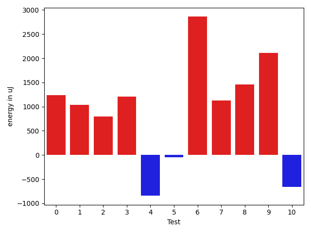

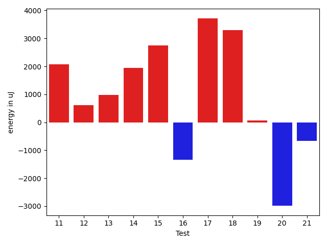

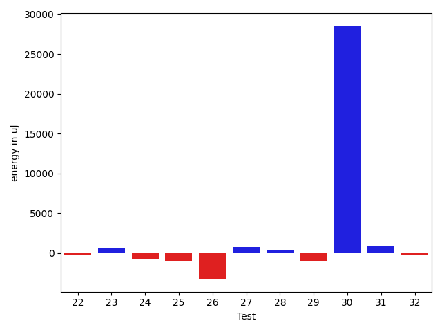

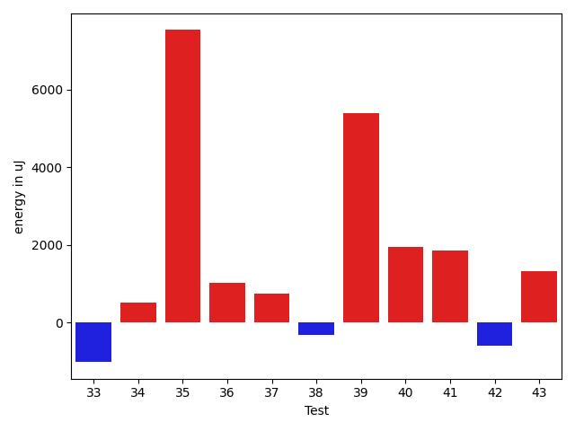

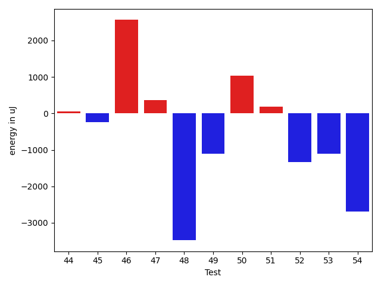

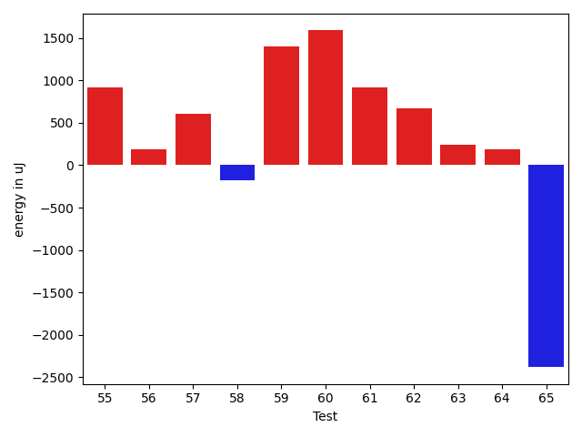

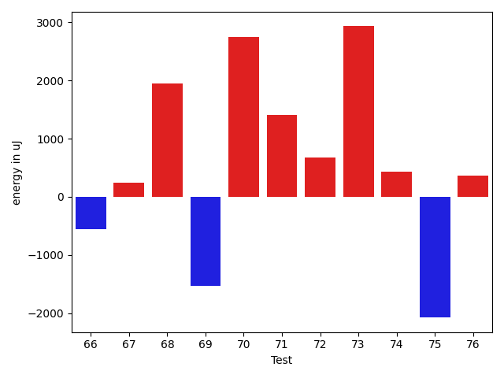

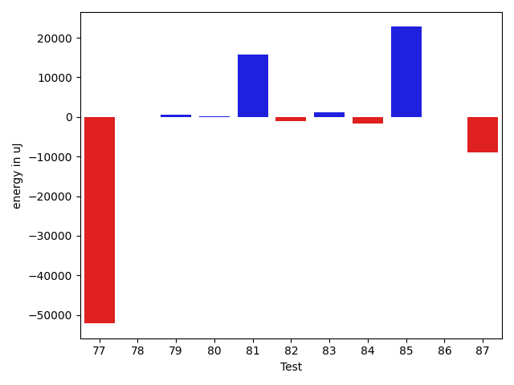

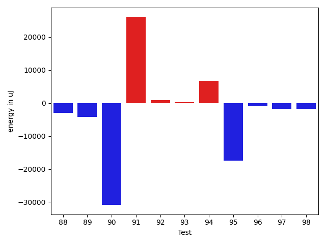

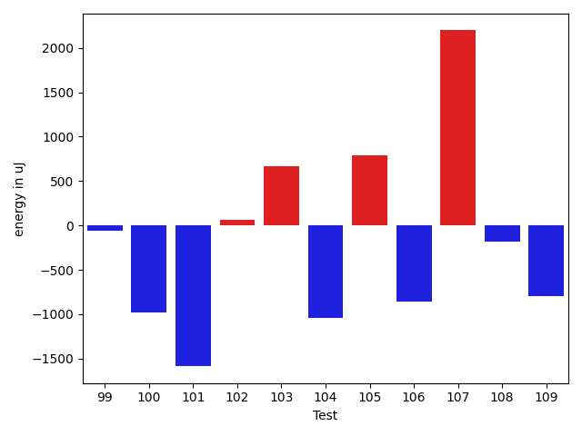

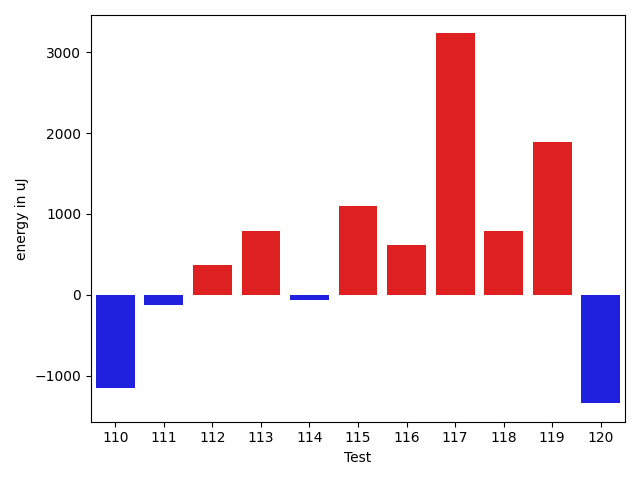

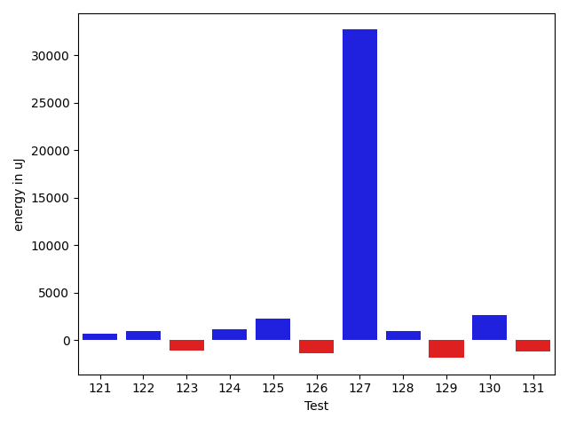

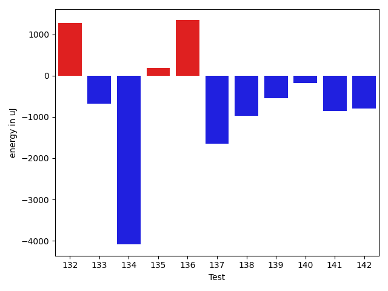

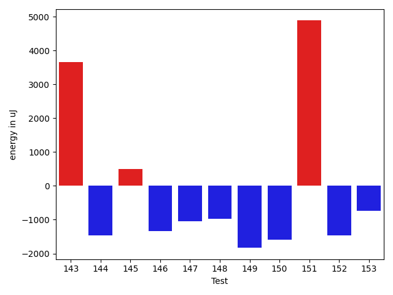

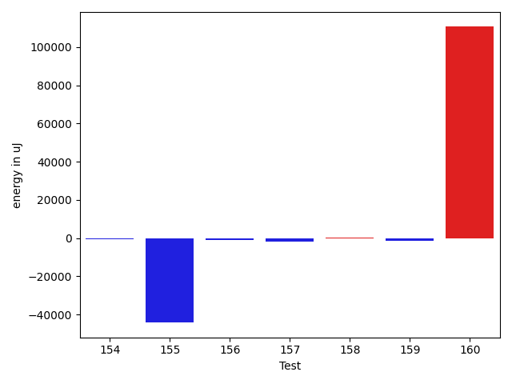

| ID | EnergyV1 | EnergyV2 | DeltaEnergy | σV1 | σV2 |
| --- | --- | --- | --- | --- | --- |
| 0 | 35339 | 37415 | 2076 | 8427.200575183611 | 8089.362576057307 |
| 1 | 36438 | 38452 | 2014 | 4563.168708186779 | 4441.6512334214285 |
| 2 | 36316 | 37292 | 976 | 9098.470033015628 | 11337.748741041461 |
| 3 | 36133 | 37292 | 1159 | 4856.223125488309 | 7486.777141839489 |
| 4 | 38269 | 38941 | 672 | 26253.602253144738 | 20369.877948852998 |
| 5 | 37414 | 37598 | 184 | 5926.953338233695 | 4389.487349053417 |
| 6 | 74890 | 79467 | 4577 | 21123.351732957566 | 24942.469999753503 |
| 7 | 37231 | 38879 | 1648 | 16648.54135940589 | 14363.771967115896 |
| 8 | 37353 | 37781 | 428 | 4073.411647501391 | 4175.922710472642 |
| 9 | 34424 | 37110 | 2686 | 3941.0194968999094 | 3305.9670559692995 |
| 10 | 38086 | 36133 | -1953 | 5490.248137780295 | 3896.2701150829603 |
| 11 | 36194 | 38269 | 2075 | 11631.188715380069 | 8995.38590566501 |
| 12 | 38879 | 39490 | 611 | 19416.061266703477 | 18512.061787932173 |
| 13 | 36987 | 37964 | 977 | 4092.5933711260686 | 3941.0644544107454 |
| 14 | 38330 | 40283 | 1953 | 114668.86837015601 | 142617.591984397 |
| 15 | 34790 | 37537 | 2747 | 3266.9302819189015 | 2747.483104588634 |
| 16 | 36438 | 35095 | -1343 | 4318.600786548838 | 4600.846356206341 |
| 17 | 81726 | 85449 | 3723 | 168886.80442468365 | 104292.63320740128 |
| 18 | 81359 | 84656 | 3297 | 63793.570021845444 | 155851.7893624347 |
| 19 | 36621 | 36682 | 61 | 9239.73865709547 | 4192.702353758359 |
| 20 | 39306 | 36315 | -2991 | 5123.714726207496 | 3770.8439078465913 |
| 21 | 36743 | 36071 | -672 | 4376.690888312303 | 4490.44569681141 |
| 22 | 36805 | 36865 | 60 | 8105.900043752813 | 9428.1661605117 |
| 23 | 37842 | 38574 | 732 | 3708.312474469283 | 4601.90525437254 |
| 24 | 39611 | 37841 | -1770 | 5594.330860117315 | 3264.5667706450727 |
| 25 | 38696 | 36987 | -1709 | 5051.648622085705 | 5229.033356196954 |
| 26 | 41748 | 40833 | -915 | 48995.74776670454 | 49744.367883786916 |
| 27 | 39490 | 39124 | -366 | 8512.395977541437 | 12411.585097726933 |
| 28 | 37048 | 37353 | 305 | 5148.1299059841995 | 4671.051262550706 |
| 29 | 37902 | 37415 | -487 | 4412.54052956775 | 4586.815353393632 |
| 30 | 38635 | 40405 | 1770 | 364086.09151312907 | 416525.23032440274 |
| 31 | 39307 | 39246 | -61 | 3731.144983044122 | 4451.926621864363 |
| 32 | 67321 | 68115 | 794 | 22378.182754316153 | 23190.94345059205 |
| 33 | 39978 | 39063 | -915 | 10766.187193753734 | 9464.793258644844 |
| 34 | 38330 | 38941 | 611 | 3639.7455254157226 | 3621.495366699024 |
| 35 | 44311 | 49499 | 5188 | 49329.45380360945 | 58109.7233731898 |
| 36 | 39002 | 40893 | 1891 | 14257.419107988888 | 14865.114120280305 |
| 37 | 38208 | 40161 | 1953 | 3663.7154647161124 | 4383.971604508382 |
| 38 | 36621 | 36926 | 305 | 4382.883373248235 | 3936.5869429219615 |
| 39 | 39184 | 40039 | 855 | 14019.294092196062 | 23124.656394538553 |
| 40 | 36744 | 38086 | 1342 | 9947.62925710202 | 11055.989157666416 |
| 41 | 118225 | 120727 | 2502 | 24792.927912035368 | 25222.966817579298 |
| 42 | 37598 | 36988 | -610 | 4115.118932031369 | 3870.05720543521 |
| 43 | 37415 | 37720 | 305 | 10939.387976177128 | 12939.875097292015 |
| 44 | 35523 | 35584 | 61 | 4296.067365305075 | 4184.552555483083 |
| 45 | 36499 | 36255 | -244 | 4314.7299592319505 | 3945.2849906899874 |
| 46 | 34912 | 37475 | 2563 | 4179.1793422452165 | 3742.1860091318476 |
| 47 | 36987 | 37354 | 367 | 4228.164063964472 | 3229.475428835857 |
| 48 | 38513 | 35034 | -3479 | 3346.7700139686917 | 3991.748793440138 |
| 49 | 37048 | 35949 | -1099 | 4216.793816378002 | 3788.8270942337813 |
| 50 | 35279 | 36316 | 1037 | 4242.39357621852 | 4291.535890267969 |
| 51 | 36377 | 36560 | 183 | 3506.243363145234 | 3558.660398289944 |
| 52 | 36926 | 35584 | -1342 | 4211.851437303378 | 4191.591088851471 |
| 53 | 37598 | 36499 | -1099 | 6701.641401319478 | 3579.072514205846 |
| 54 | 37231 | 34546 | -2685 | 3174.419301907199 | 2771.589383713135 |
| 55 | 37902 | 38819 | 917 | 5593.926876943068 | 15027.96605214798 |
| 56 | 40466 | 40650 | 184 | 13802.324258542674 | 9902.994506336781 |
| 57 | 39551 | 40161 | 610 | 27345.534515608502 | 25259.46948919574 |
| 58 | 39368 | 39185 | -183 | 14564.899590762516 | 12688.522161873057 |
| 59 | 38147 | 39550 | 1403 | 7408.430733658069 | 4579.052831549445 |
| 60 | 36682 | 38269 | 1587 | 3766.8688980349048 | 4575.651640088048 |
| 61 | 37170 | 38085 | 915 | 3794.6676862901973 | 4147.67606942243 |
| 62 | 36621 | 37292 | 671 | 10255.272265990154 | 7562.51201826523 |
| 63 | 39428 | 39673 | 245 | 22445.391432838347 | 18155.21471526674 |
| 64 | 37964 | 38146 | 182 | 3500.7061162086393 | 3790.7305510970327 |
| 65 | 38940 | 36560 | -2380 | 6736.75128710575 | 4131.9350611864975 |
| 66 | 38086 | 37536 | -550 | 5813.084807500089 | 4022.794755281619 |
| 67 | 37963 | 38208 | 245 | 4101.759445945118 | 4145.344624828405 |
| 68 | 36988 | 38940 | 1952 | 4794.021507715752 | 4217.840199748834 |
| 69 | 41626 | 40100 | -1526 | 26169.540718464046 | 26645.538327826653 |
| 70 | 39490 | 42237 | 2747 | 56642.612530536106 | 44328.16068045664 |
| 71 | 36805 | 38208 | 1403 | 4786.537943527708 | 3479.619000372756 |
| 72 | 37720 | 38391 | 671 | 4316.973178570217 | 3228.079240559831 |
| 73 | 38269 | 41199 | 2930 | 339047.2116477888 | 260877.65328945225 |
| 74 | 37292 | 37719 | 427 | 4358.750430583942 | 4319.5156941024325 |
| 75 | 42358 | 40283 | -2075 | 501569.20685079636 | 321897.7759358772 |
| 76 | 37964 | 38330 | 366 | 4479.492290775299 | 4353.21204149934 |
| 77 | 43273 | 41504 | -1769 | 265323.36561712524 | 52109.614033832135 |
| 78 | 39429 | 38025 | -1404 | 6539.002714142434 | 6682.620812485876 |
| 79 | 37110 | 37293 | 183 | 8504.039564310386 | 7417.972103049188 |
| 80 | 38513 | 38269 | -244 | 4970.329080207422 | 4233.448862768187 |
| 81 | 83190 | 108215 | 25025 | 32583.079477068433 | 34175.319505460015 |
| 82 | 40100 | 38025 | -2075 | 12099.353815291106 | 15159.96813246465 |
| 83 | 36499 | 39673 | 3174 | 4198.017003448852 | 3540.068687179527 |
| 84 | 39856 | 37597 | -2259 | 5940.789670761137 | 4729.027664614155 |
| 85 | 124634 | 118774 | -5860 | 187030.1812605998 | 296061.201990756 |
| 86 | 38086 | 39002 | 916 | 6950.029173105962 | 5431.741800028582 |
| 87 | 80871 | 78980 | -1891 | 333486.9402875037 | 285717.7764899752 |
| 88 | 42847 | 42175 | -672 | 23600.27552086298 | 17564.259534436842 |
| 89 | 90270 | 45898 | -44372 | 49862.74939405522 | 47258.697890497424 |
| 90 | 40344 | 39550 | -794 | 229545.91129169002 | 150375.17698280315 |
| 91 | 39123 | 40345 | 1222 | 16151.147566303358 | 182875.22911868186 |
| 92 | 36377 | 38513 | 2136 | 4520.509781047629 | 4925.87361242202 |
| 93 | 37902 | 37414 | -488 | 4071.7758789210466 | 5484.328740000463 |
| 94 | 39367 | 39794 | 427 | 18546.150755024326 | 29010.855059614587 |
| 95 | 175353 | 170044 | -5309 | 263927.8084208743 | 235923.03759934215 |
| 96 | 38269 | 37293 | -976 | 4369.5801703717625 | 4604.838683264474 |
| 97 | 38391 | 36316 | -2075 | 6071.569469596929 | 5658.603616554569 |
| 98 | 38940 | 37720 | -1220 | 40492.75319174448 | 38182.24791371246 |
| 99 | 36682 | 36621 | -61 | 7024.1514404921645 | 8922.442297514122 |
| 100 | 37658 | 36682 | -976 | 4835.425496186108 | 4409.400605048544 |
| 101 | 37841 | 36254 | -1587 | 4702.196676820314 | 5386.0036133917865 |
| 102 | 38269 | 38330 | 61 | 8171.579304226025 | 6946.776825398558 |
| 103 | 39123 | 39795 | 672 | 28459.878195057336 | 24989.662072683965 |
| 104 | 36499 | 35461 | -1038 | 5035.446738205636 | 3233.3905574355817 |
| 105 | 38208 | 39001 | 793 | 13941.04701503166 | 9794.543767588691 |
| 106 | 83984 | 83129 | -855 | 200973.38378942435 | 371506.8780688224 |
| 107 | 39795 | 41992 | 2197 | 13916.930493431668 | 26013.698670953807 |
| 108 | 37414 | 37231 | -183 | 6193.061301374213 | 8205.367774230304 |
| 109 | 40039 | 39245 | -794 | 18713.836274684207 | 15345.26572050408 |
| 110 | 39673 | 38513 | -1160 | 52170.815529324515 | 25037.6798450401 |
| 111 | 37781 | 37658 | -123 | 11937.479840096992 | 10262.455665213398 |
| 112 | 40283 | 40650 | 367 | 420322.61392474704 | 429785.78800315515 |
| 113 | 43824 | 44616 | 792 | 434932.1401065186 | 522500.6050939739 |
| 114 | 39184 | 39123 | -61 | 7064.221478394099 | 4767.135350102303 |
| 115 | 40283 | 41381 | 1098 | 21889.332976044923 | 26873.064681562402 |
| 116 | 39978 | 40589 | 611 | 4139.420705579197 | 4125.708967584493 |
| 117 | 36926 | 40161 | 3235 | 4070.88141241217 | 3705.6719047031306 |
| 118 | 39246 | 40039 | 793 | 4590.771368735324 | 4586.437063152187 |
| 119 | 36987 | 38879 | 1892 | 3972.182722948119 | 4034.736676352002 |
| 120 | 40589 | 39246 | -1343 | 15474.07764258952 | 15787.977169183976 |
| 121 | 37414 | 37719 | 305 | 4215.6267980653965 | 3492.590514081893 |
| 122 | 38269 | 38574 | 305 | 4938.630443999632 | 4013.693103658667 |
| 123 | 39795 | 38086 | -1709 | 3515.9394850057106 | 4179.960811884352 |
| 124 | 40100 | 40771 | 671 | 38960.93225145539 | 38433.355950786936 |
| 125 | 39123 | 41138 | 2015 | 4881.182716748648 | 4138.5379100886585 |
| 126 | 38391 | 37719 | -672 | 11666.03323824147 | 9951.685855198286 |
| 127 | 83190 | 85204 | 2014 | 260011.6212468621 | 334730.12921125744 |
| 128 | 38635 | 38330 | -305 | 9295.844207674729 | 10522.976588750964 |
| 129 | 38819 | 37780 | -1039 | 10574.787715222908 | 9324.492253276498 |
| 130 | 41870 | 41076 | -794 | 20085.780798203607 | 24936.34404768763 |
| 131 | 41932 | 41443 | -489 | 20358.223419173755 | 16601.284171931406 |
| 132 | 71533 | 72815 | 1282 | 31108.13544344432 | 32927.19524645058 |
| 133 | 39368 | 38696 | -672 | 4495.0853220967965 | 4770.285151497005 |
| 134 | 41809 | 37719 | -4090 | 392660.67865827016 | 148744.62383202542 |
| 135 | 39489 | 39673 | 184 | 10485.558457654375 | 15566.510432712055 |
| 136 | 38574 | 39917 | 1343 | 15631.857515198133 | 16778.05683465205 |
| 137 | 42236 | 40589 | -1647 | 4093.0971565958866 | 4086.811008870146 |
| 138 | 40528 | 39550 | -978 | 6394.243523230484 | 5454.086407750603 |
| 139 | 40405 | 39856 | -549 | 40733.81497219244 | 45596.21734141501 |
| 140 | 39428 | 39246 | -182 | 18415.363424661886 | 18139.315595627577 |
| 141 | 40223 | 39368 | -855 | 346885.0839026433 | 344200.35302558745 |
| 142 | 39978 | 39185 | -793 | 21802.944207646626 | 19413.33327669723 |
| 143 | 36499 | 40161 | 3662 | 6096.706395349357 | 4697.680204947808 |
| 144 | 38452 | 36987 | -1465 | 4425.818364976379 | 4195.017853324981 |
| 145 | 37536 | 38025 | 489 | 7525.391481734406 | 7878.46492154971 |
| 146 | 39307 | 37963 | -1344 | 5268.863726794755 | 3700.8602651845886 |
| 147 | 38086 | 37048 | -1038 | 4811.189191815924 | 4591.8044450111865 |
| 148 | 35522 | 34546 | -976 | 4176.794851208391 | 3339.836004947074 |
| 149 | 37414 | 35583 | -1831 | 4037.354858002094 | 3770.8261235967902 |
| 150 | 39368 | 37781 | -1587 | 4088.369068106625 | 4324.489191588538 |
| 151 | 368651 | 373535 | 4884 | 191359.83351184824 | 187693.4812397178 |
| 152 | 41748 | 40283 | -1465 | 371667.73418836494 | 184787.17288990197 |
| 153 | 38146 | 37414 | -732 | 5321.40987293711 | 4386.673102958804 |
| 154 | 39611 | 37964 | -1647 | 4508.813669975997 | 4425.978120992015 |
| 155 | 40894 | 40710 | -184 | 328767.9907004056 | 176490.1487826109 |
| 156 | 39062 | 39368 | 306 | 4475.007560705048 | 5122.754559956007 |
| 157 | 43152 | 41870 | -1282 | 7320.540259157818 | 8368.128101459588 |
| 158 | 41015 | 41564 | 549 | 7141.008064235006 | 5347.539075749392 |
| 159 | 41137 | 40771 | -366 | 3584.439125930304 | 3585.8988443066823 |
| 160 | 38208 | 38757 | 549 | 3626.675977199868 | 353350.69090331957 |

## Delta Duration per test method

| ID | DurationV1 | DurationsV2 | DeltaDuration |
| --- | --- | --- | --- |
| 0 | 1174172.025 | 1093653.9615384615 | -80518.0634615384 |
| 1 | 836612.05 | 794215.9019607843 | -42396.14803921571 |
| 2 | 952761.0 | 944636.4107142857 | -8124.589285714319 |
| 3 | 919371.4237288135 | 878233.5636363636 | -41137.86009244993 |
| 4 | 1202804.1475409835 | 1131969.0 | -70835.14754098351 |
| 5 | 922381.2711864407 | 927861.890625 | 5480.619438559283 |
| 6 | 2427699.5656565656 | 2486932.4242424243 | 59232.85858585872 |
| 7 | 1267903.2650602409 | 1198323.3456790124 | -69579.91938122851 |
| 8 | 837386.32 | 805703.9122807018 | -31682.40771929815 |
| 9 | 661584.7297297297 | 637140.4444444445 | -24444.28528528521 |
| 10 | 690151.04 | 643485.5588235294 | -46665.48117647064 |
| 11 | 950390.8333333334 | 893765.9387755102 | -56624.894557823194 |
| 12 | 1129367.0322580645 | 1173623.822580645 | 44256.79032258061 |
| 13 | 812995.8157894737 | 774246.0754716981 | -38749.740317775635 |
| 14 | 1527498.7536231885 | 1989615.865671642 | 462117.1120484534 |
| 15 | 555882.3478260869 | 510273.95 | -45608.397826086904 |
| 16 | 790843.4444444445 | 741952.1923076923 | -48891.25213675224 |
| 17 | 3361532.8585858587 | 3208181.797979798 | -153351.06060606055 |
| 18 | 2611280.3552631577 | 3721533.9743589745 | 1110253.6190958167 |
| 19 | 711049.8648648649 | 778881.0714285715 | 67831.20656370663 |
| 20 | 537156.3 | 603047.125 | 65890.82499999995 |
| 21 | 920420.265625 | 938265.9117647059 | 17845.646139705903 |
| 22 | 1190550.0779220778 | 1210321.5747126436 | 19771.496790565783 |
| 23 | 644705.5588235294 | 661872.3421052631 | 17166.783281733748 |
| 24 | 567448.4375 | 627051.15 | 59602.71250000002 |
| 25 | 625799.7857142857 | 644206.0 | 18406.21428571432 |
| 26 | 1841557.776119403 | 1809438.9350649351 | -32118.84105446795 |
| 27 | 819102.5185185185 | 890925.6944444445 | 71823.17592592596 |
| 28 | 580832.3333333334 | 618485.9444444445 | 37653.611111111124 |
| 29 | 530541.8387096775 | 609979.6153846154 | 79437.77667493792 |
| 30 | 4456774.533333333 | 5173071.657142857 | 716297.1238095239 |
| 31 | 608918.8064516129 | 615599.8787878788 | 6681.072336265934 |
| 32 | 1861516.7777777778 | 1849243.8585858585 | -12272.919191919267 |
| 33 | 993464.7258064516 | 1046474.8166666667 | 53010.090860215016 |
| 34 | 950585.4225352113 | 944884.4477611941 | -5700.9747740172315 |
| 35 | 2201509.3608247424 | 2377119.0102040814 | 175609.64937933907 |
| 36 | 1249099.9350649351 | 1272292.2023809524 | 23192.2673160173 |
| 37 | 739562.76 | 738196.3555555556 | -1366.404444444459 |
| 38 | 687991.6896551724 | 638849.0857142857 | -49142.60394088668 |
| 39 | 1202307.3943661973 | 1420392.2727272727 | 218084.87836107542 |
| 40 | 1300415.8350515463 | 1315755.4639175257 | 15339.628865979379 |
| 41 | 3683619.282828283 | 3673371.111111111 | -10248.171717172023 |
| 42 | 837528.1355932204 | 851764.3050847457 | 14236.16949152539 |
| 43 | 1303611.4838709678 | 1329247.2105263157 | 25635.72665534797 |
| 44 | 806999.3220338983 | 797961.2 | -9038.12203389837 |
| 45 | 774800.5416666666 | 748931.1702127659 | -25869.371453900705 |
| 46 | 795379.5957446808 | 806836.9090909091 | 11457.313346228213 |
| 47 | 452717.8947368421 | 481150.2272727273 | 28432.332535885216 |
| 48 | 552033.68 | 515667.35294117645 | -36366.327058823605 |
| 49 | 565677.78125 | 568883.9722222222 | 3206.190972222248 |
| 50 | 818489.3157894737 | 822261.976744186 | 3772.660954712308 |
| 51 | 498593.56 | 516035.0714285714 | 17441.511428571423 |
| 52 | 839446.1282051282 | 780740.2115384615 | -58705.916666666744 |
| 53 | 914053.7962962963 | 854447.1320754717 | -59606.664220824605 |
| 54 | 538528.3333333334 | 511903.5263157895 | -26624.807017543877 |
| 55 | 922569.754385965 | 938994.7368421053 | 16424.982456140337 |
| 56 | 1339487.3866666667 | 1240636.011627907 | -98851.37503875978 |
| 57 | 1361535.046875 | 1271636.4915254237 | -89898.55534957629 |
| 58 | 1022300.2923076923 | 1016421.546875 | -5878.745432692347 |
| 59 | 846710.725490196 | 826032.3260869565 | -20678.399403239484 |
| 60 | 737554.8529411765 | 687575.4210526316 | -49979.43188854493 |
| 61 | 636549.9 | 646616.303030303 | 10066.403030302958 |
| 62 | 896511.6909090909 | 821150.074074074 | -75361.61683501687 |
| 63 | 925166.6666666666 | 821162.4090909091 | -104004.25757575757 |
| 64 | 686706.6046511628 | 702745.2285714286 | 16038.623920265818 |
| 65 | 761811.75 | 682743.7272727273 | -79068.0227272727 |
| 66 | 859693.0967741936 | 870793.25 | 11100.153225806425 |
| 67 | 758222.12 | 767204.0833333334 | 8981.963333333377 |
| 68 | 640931.3870967742 | 632000.0277777778 | -8931.35931899643 |
| 69 | 1648858.081632653 | 1567348.701030928 | -81509.38060172508 |
| 70 | 1420726.7555555555 | 1223823.3043478262 | -196903.4512077293 |
| 71 | 558268.5853658536 | 585151.6428571428 | 26883.05749128922 |
| 72 | 584124.2413793104 | 506514.5 | -77609.74137931038 |
| 73 | 5239125.2727272725 | 4527472.894736842 | -711652.3779904302 |
| 74 | 547412.9545454546 | 489738.2083333333 | -57674.746212121274 |
| 75 | 6409852.568181818 | 3435743.773809524 | -2974108.7943722946 |
| 76 | 728903.4827586206 | 740744.8684210526 | 11841.385662431945 |
| 77 | 3379527.1791044776 | 1779319.220338983 | -1600207.9587654946 |
| 78 | 770701.8461538461 | 799966.0238095238 | 29264.17765567766 |
| 79 | 930423.641509434 | 883889.0408163265 | -46534.600693107466 |
| 80 | 648605.5666666667 | 638342.2258064516 | -10263.340860215016 |
| 81 | 2648615.0303030303 | 3078195.5353535353 | 429580.50505050505 |
| 82 | 1054613.5555555555 | 1191563.53125 | 136949.9756944445 |
| 83 | 709042.0 | 626044.7857142857 | -82997.21428571432 |
| 84 | 826167.85 | 837264.0847457628 | 11096.234745762777 |
| 85 | 4185812.3131313133 | 4821755.656565657 | 635943.3434343436 |
| 86 | 968844.1612903225 | 914194.265625 | -54649.89566532255 |
| 87 | 4223471.444444444 | 3876164.242424242 | -347307.20202020183 |
| 88 | 1572933.2268041237 | 1509630.9166666667 | -63302.31013745698 |
| 89 | 2206234.6428571427 | 2028726.4 | -177508.24285714282 |
| 90 | 2333051.8085106383 | 1460636.6041666667 | -872415.2043439716 |
| 91 | 913772.1707317074 | 1599815.0 | 686042.8292682926 |
| 92 | 671283.8536585366 | 624556.1 | -46727.75365853659 |
| 93 | 643762.0857142857 | 673992.5925925926 | 30230.506878306856 |
| 94 | 1307544.0476190476 | 1521913.282352941 | 214369.23473389354 |
| 95 | 7485760.848484849 | 7087823.262626262 | -397937.58585858624 |
| 96 | 682565.4857142858 | 593232.7333333333 | -89332.75238095247 |
| 97 | 910937.6451612903 | 874693.3962264151 | -36244.24893487524 |
| 98 | 1403004.170212766 | 1365128.1951219512 | -37875.975090814754 |
| 99 | 1095949.7236842106 | 1044947.5138888889 | -51002.20979532169 |
| 100 | 776030.9166666666 | 748647.4888888889 | -27383.427777777775 |
| 101 | 980737.3833333333 | 927373.2 | -53364.18333333335 |
| 102 | 1017992.125 | 936723.8529411765 | -81268.2720588235 |
| 103 | 1269814.9 | 1101309.6756756757 | -168505.22432432417 |
| 104 | 554153.3636363636 | 438681.05555555556 | -115472.30808080808 |
| 105 | 1020402.813559322 | 1133109.9574468085 | 112707.14388748643 |
| 106 | 3686286.9292929294 | 5476071.03030303 | 1789784.101010101 |
| 107 | 896935.6181818182 | 1352387.322580645 | 455451.7043988269 |
| 108 | 1062440.2222222222 | 1025096.7808219178 | -37343.44140030444 |
| 109 | 1422618.8131868131 | 1387140.3229166667 | -35478.4902701464 |
| 110 | 1652380.010989011 | 1387775.0113636365 | -264604.99962537456 |
| 111 | 1210449.375 | 1183266.857142857 | -27182.517857142957 |
| 112 | 4603633.338709678 | 4417343.462686568 | -186289.87602311 |
| 113 | 5308222.173333333 | 6941829.153846154 | 1633606.980512821 |
| 114 | 981949.3529411765 | 944249.1724137932 | -37700.180527383345 |
| 115 | 1377941.593220339 | 1399457.5972222222 | 21516.004001883324 |
| 116 | 460450.0 | 422681.76923076925 | -37768.23076923075 |
| 117 | 480611.38095238095 | 459746.9285714286 | -20864.452380952367 |
| 118 | 472032.4 | 438840.4117647059 | -33191.98823529412 |
| 119 | 446058.1052631579 | 470062.5 | 24004.394736842078 |
| 120 | 1201280.9666666666 | 1170297.1923076923 | -30983.774358974304 |
| 121 | 495741.652173913 | 540142.1739130435 | 44400.52173913043 |
| 122 | 525136.56 | 527370.8214285715 | 2234.2614285714226 |
| 123 | 463297.86666666664 | 458030.0 | -5267.8666666666395 |
| 124 | 1599730.3793103448 | 1608742.5789473683 | 9012.1996370235 |
| 125 | 494315.21428571426 | 438175.7894736842 | -56139.42481203005 |
| 126 | 1113769.5789473683 | 1174930.8352941177 | 61161.256346749375 |
| 127 | 3748987.3131313133 | 4836038.777777778 | 1087051.4646464647 |
| 128 | 1121738.7931034483 | 1241973.0779220778 | 120234.2848186295 |
| 129 | 1096506.611111111 | 1159621.2337662338 | 63114.622655122774 |
| 130 | 1228899.6440677966 | 1375759.5151515151 | 146859.8710837185 |
| 131 | 1423510.7272727273 | 1376768.1494252873 | -46742.57784744003 |
| 132 | 2116192.0 | 2165642.3535353537 | 49450.35353535367 |
| 133 | 465865.47826086957 | 490324.3157894737 | 24458.83752860414 |
| 134 | 4752303.666666667 | 1658068.9473684211 | -3094234.719298246 |
| 135 | 1105179.7671232878 | 1119299.2666666666 | 14119.499543378828 |
| 136 | 1240050.0810810812 | 1225848.3289473683 | -14201.752133712871 |
| 137 | 482810.3333333333 | 448225.6 | -34584.73333333334 |
| 138 | 602967.5 | 599689.6666666666 | -3277.833333333372 |
| 139 | 1779329.5684210525 | 1828033.0666666667 | 48703.498245614115 |
| 140 | 1280335.865671642 | 1184558.361111111 | -95777.50456053088 |
| 141 | 3755641.8620689656 | 3331379.6346153845 | -424262.22745358106 |
| 142 | 1115035.3962264152 | 1092538.836734694 | -22496.559491721215 |
| 143 | 456544.3125 | 489478.9411764706 | 32934.6286764706 |
| 144 | 571988.0689655172 | 531673.1212121212 | -40314.947753396 |
| 145 | 928350.2037037037 | 879154.5357142857 | -49195.66798941803 |
| 146 | 620756.1212121212 | 699920.8823529412 | 79164.76114081999 |
| 147 | 662438.1470588235 | 720217.8214285715 | 57779.67436974798 |
| 148 | 540498.6666666666 | 492451.57692307694 | -48047.08974358969 |
| 149 | 606334.4761904762 | 469242.52 | -137091.9561904762 |
| 150 | 447131.95652173914 | 520142.4117647059 | 73010.45524296677 |
| 151 | 11114937.97979798 | 11005718.04040404 | -109219.93939393945 |
| 152 | 3868284.9589041094 | 2060443.1898734176 | -1807841.7690306918 |
| 153 | 769603.6756756756 | 711580.8 | -58022.875675675576 |
| 154 | 639564.8148148148 | 534531.25 | -105033.56481481483 |
| 155 | 3251951.880597015 | 2013375.2857142857 | -1238576.5948827292 |
| 156 | 849564.2857142857 | 950993.7962962963 | 101429.51058201061 |
| 157 | 726598.1363636364 | 738779.6315789474 | 12181.495215311064 |
| 158 | 900722.2142857143 | 549102.625 | -351619.5892857143 |
| 159 | 589551.95 | 509610.24 | -79941.70999999996 |
| 160 | 472641.82352941175 | 3852121.590909091 | 3379479.7673796793 |

## Misc.

| ID | Test Class | Test Method |
| --- | --- | --- |
| 0 | com.google.gson.functional.CustomTypeAdaptersTest | testCustomAdapterInvokedForCollectionElementDeserialization |
| 1 | com.google.gson.functional.CustomTypeAdaptersTest | testCustomTypeAdapterAppliesToSubClassesSerializedAsBaseClass |
| 2 | com.google.gson.functional.CustomTypeAdaptersTest | testCustomAdapterInvokedForMapElementDeserialization |
| 3 | com.google.gson.functional.CustomTypeAdaptersTest | testCustomAdapterInvokedForMapElementSerializationWithType |
| 4 | com.google.gson.functional.CustomTypeAdaptersTest | testCustomNestedSerializers |
| 5 | com.google.gson.functional.CustomTypeAdaptersTest | testCustomNestedDeserializers |
| 6 | com.google.gson.functional.CustomTypeAdaptersTest | testCustomTypeAdapterDoesNotAppliesToSubClasses |
| 7 | com.google.gson.functional.CustomTypeAdaptersTest | testCustomAdapterInvokedForCollectionElementSerializationWithType |
| 8 | com.google.gson.functional.CustomTypeAdaptersTest | testCustomByteArrayDeserializerAndInstanceCreator |
| 9 | com.google.gson.functional.CustomTypeAdaptersTest | testEnsureCustomDeserializerNotInvokedForNullValues |
| 10 | com.google.gson.functional.CustomTypeAdaptersTest | testCustomAdapterInvokedForCollectionElementSerialization |
| 11 | com.google.gson.functional.CustomTypeAdaptersTest | testEnsureCustomSerializerNotInvokedForNullValues |
| 12 | com.google.gson.functional.CustomTypeAdaptersTest | testCustomDeserializers |
| 13 | com.google.gson.functional.CustomTypeAdaptersTest | testCustomByteArraySerializer |
| 14 | com.google.gson.functional.CustomTypeAdaptersTest | testCustomSerializers |
| 15 | com.google.gson.functional.CustomTypeAdaptersTest | testCustomAdapterInvokedForMapElementSerialization |
| 16 | com.google.gson.functional.NamingPolicyTest | testAtSignInSerializedName |
| 17 | com.google.gson.functional.NamingPolicyTest | testGsonWithNonDefaultFieldNamingPolicySerialization |
| 18 | com.google.gson.functional.NamingPolicyTest | testGsonDuplicateNameUsingSerializedNameFieldNamingPolicySerialization |
| 19 | com.google.gson.functional.NamingPolicyTest | testGsonWithSerializedNameFieldNamingPolicyDeserialization |
| 20 | com.google.gson.functional.NamingPolicyTest | testGsonWithUpperCamelCaseSpacesPolicyDeserialiation |
| 21 | com.google.gson.functional.NamingPolicyTest | testComplexFieldNameStrategy |
| 22 | com.google.gson.functional.NamingPolicyTest | testDeprecatedNamingStrategy |
| 23 | com.google.gson.functional.NamingPolicyTest | testGsonWithLowerCaseDashPolicySerialization |
| 24 | com.google.gson.functional.NamingPolicyTest | testGsonWithLowerCaseUnderscorePolicyDeserialiation |
| 25 | com.google.gson.functional.NamingPolicyTest | testGsonWithLowerCaseDashPolicyDeserialiation |
| 26 | com.google.gson.functional.NamingPolicyTest | testGsonWithSerializedNameFieldNamingPolicySerialization |
| 27 | com.google.gson.functional.NamingPolicyTest | testGsonWithNonDefaultFieldNamingPolicyDeserialiation |
| 28 | com.google.gson.functional.NamingPolicyTest | testGsonWithLowerCaseUnderscorePolicySerialization |
| 29 | com.google.gson.functional.NamingPolicyTest | testGsonWithUpperCamelCaseSpacesPolicySerialiation |
| 30 | com.google.gson.LongSerializationPolicyTest | testDefaultLongSerializationIntegration |
| 31 | com.google.gson.LongSerializationPolicyTest | testStringLongSerializationIntegration |
| 32 | com.google.gson.functional.MapTest | testInterfaceTypeMapWithSerializer |
| 33 | com.google.gson.functional.MapTest | testCustomSerializerForSpecificMapType |
| 34 | com.google.gson.functional.MapTest | testGeneralMapField |
| 35 | com.google.gson.functional.MapTest | testInterfaceTypeMap |
| 36 | com.google.gson.functional.MapTest | testSerializeMaps |
| 37 | com.google.gson.functional.MapTest | testMapSerializationWithNullValueButSerializeNulls |
| 38 | com.google.gson.functional.MapTest | testMapSerializationWithNullValuesSerialized |
| 39 | com.google.gson.functional.MapTest | testMapSubclassDeserialization |
| 40 | com.google.gson.functional.DefaultTypeAdaptersTest | testDateSerializationWithPattern |
| 41 | com.google.gson.functional.DefaultTypeAdaptersTest | testDefaultDateDeserializationUsingBuilder |
| 42 | com.google.gson.functional.DefaultTypeAdaptersTest | testDateDeserializationWithPattern |
| 43 | com.google.gson.functional.DefaultTypeAdaptersTest | testDateSerializationInCollection |
| 44 | com.google.gson.functional.DefaultTypeAdaptersTest | testBitSetDeserialization |
| 45 | com.google.gson.functional.DefaultTypeAdaptersTest | testSqlDateSerialization |
| 46 | com.google.gson.functional.DefaultTypeAdaptersTest | testTimestampSerialization |
| 47 | com.google.gson.functional.DefaultTypeAdaptersTest | testBitSetSerialization |
| 48 | com.google.gson.functional.DefaultTypeAdaptersTest | testDefaultCalendarSerialization |
| 49 | com.google.gson.functional.DefaultTypeAdaptersTest | testDefaultCalendarDeserialization |
| 50 | com.google.gson.functional.DefaultTypeAdaptersTest | testSetSerialization |
| 51 | com.google.gson.functional.DefaultTypeAdaptersTest | testDefaultGregorianCalendarSerialization |
| 52 | com.google.gson.functional.DefaultTypeAdaptersTest | testDefaultDateSerializationUsingBuilder |
| 53 | com.google.gson.functional.DefaultTypeAdaptersTest | testDateSerializationWithPatternNotOverridenByTypeAdapter |
| 54 | com.google.gson.functional.DefaultTypeAdaptersTest | testDefaultGregorianCalendarDeserialization |
| 55 | com.google.gson.functional.CustomDeserializerTest | testCustomDeserializerReturnsNullForArrayElementsForArrayField |
| 56 | com.google.gson.functional.CustomDeserializerTest | testJsonTypeFieldBasedDeserialization |
| 57 | com.google.gson.functional.CustomDeserializerTest | testCustomDeserializerReturnsNullForTopLevelObject |
| 58 | com.google.gson.functional.CustomDeserializerTest | testCustomDeserializerReturnsNull |
| 59 | com.google.gson.functional.CustomDeserializerTest | testCustomDeserializerReturnsNullForArrayElements |
| 60 | com.google.gson.functional.NullObjectAndFieldTest | testExplicitDeserializationOfNulls |
| 61 | com.google.gson.functional.NullObjectAndFieldTest | testExplicitSerializationOfNullStringMembers |
| 62 | com.google.gson.functional.NullObjectAndFieldTest | testCustomTypeAdapterPassesNullDesrialization |
| 63 | com.google.gson.functional.NullObjectAndFieldTest | testTopLevelNullObjectDeserialization |
| 64 | com.google.gson.functional.NullObjectAndFieldTest | testExplicitSerializationOfNullCollectionMembers |
| 65 | com.google.gson.functional.NullObjectAndFieldTest | testCustomSerializationOfNulls |
| 66 | com.google.gson.functional.NullObjectAndFieldTest | testPrintPrintingObjectWithNulls |
| 67 | com.google.gson.functional.NullObjectAndFieldTest | testNullWrappedPrimitiveMemberSerialization |
| 68 | com.google.gson.functional.NullObjectAndFieldTest | testExplicitNullSetsFieldToNullDuringDeserialization |
| 69 | com.google.gson.functional.NullObjectAndFieldTest | testExplicitSerializationOfNullArrayMembers |
| 70 | com.google.gson.functional.NullObjectAndFieldTest | testExplicitSerializationOfNulls |
| 71 | com.google.gson.functional.NullObjectAndFieldTest | testNullWrappedPrimitiveMemberDeserialization |
| 72 | com.google.gson.functional.NullObjectAndFieldTest | testPrintPrintingArraysWithNulls |
| 73 | com.google.gson.functional.NullObjectAndFieldTest | testTopLevelNullObjectSerialization |
| 74 | com.google.gson.functional.NullObjectAndFieldTest | testCustomTypeAdapterPassesNullSerialization |
| 75 | com.google.gson.JsonParserTest | testReadWriteTwoObjects |
| 76 | com.google.gson.functional.CustomSerializerTest | testSerializerReturnsNull |
| 77 | com.google.gson.functional.CustomSerializerTest | testSubClassSerializerInvokedForBaseClassFieldsHoldingSubClassInstances |
| 78 | com.google.gson.functional.CustomSerializerTest | testBaseClassSerializerInvokedForBaseClassFieldsHoldingSubClassInstances |
| 79 | com.google.gson.functional.CustomSerializerTest | testSubClassSerializerInvokedForBaseClassFieldsHoldingArrayOfSubClassInstances |
| 80 | com.google.gson.functional.CustomSerializerTest | testBaseClassSerializerInvokedForBaseClassFields |
| 81 | com.google.gson.functional.ObjectTest | testSingletonLists |
| 82 | com.google.gson.functional.ObjectTest | testInnerClassDeserialization |
| 83 | com.google.gson.functional.ObjectTest | testJsonObjectSerialization |
| 84 | com.google.gson.functional.TypeHierarchyAdapterTest | testRegisterSuperTypeFirst |
| 85 | com.google.gson.functional.TypeHierarchyAdapterTest | testTypeHierarchy |
| 86 | com.google.gson.functional.TypeVariableTest | testBasicTypeVariables |
| 87 | com.google.gson.functional.TypeVariableTest | testAdvancedTypeVariables |
| 88 | com.google.gson.functional.TypeVariableTest | testTypeVariablesViaTypeParameter |
| 89 | com.google.gson.functional.SecurityTest | testJsonWithNonExectuableTokenSerialization |
| 90 | com.google.gson.functional.SecurityTest | testNonExecutableJsonSerialization |
| 91 | com.google.gson.functional.SecurityTest | testNonExecutableJsonDeserialization |
| 92 | com.google.gson.functional.SecurityTest | testJsonWithNonExectuableTokenWithConfiguredGsonDeserialization |
| 93 | com.google.gson.functional.SecurityTest | testJsonWithNonExectuableTokenWithRegularGsonDeserialization |
| 94 | com.google.gson.functional.EnumTest | testEnumSubclassWithRegisteredTypeAdapter |
| 95 | com.google.gson.functional.VersioningTest | testVersionedUntilSerialization |
| 96 | com.google.gson.functional.VersioningTest | testIgnoreLaterVersionClassSerialization |
| 97 | com.google.gson.functional.VersioningTest | testVersionedClassesDeserialization |
| 98 | com.google.gson.functional.VersioningTest | testVersionedGsonWithUnversionedClassesSerialization |
| 99 | com.google.gson.functional.VersioningTest | testVersionedGsonMixingSinceAndUntilSerialization |
| 100 | com.google.gson.functional.VersioningTest | testVersionedGsonWithUnversionedClassesDeserialization |
| 101 | com.google.gson.functional.VersioningTest | testVersionedGsonMixingSinceAndUntilDeserialization |
| 102 | com.google.gson.functional.VersioningTest | testVersionedClassesSerialization |
| 103 | com.google.gson.functional.VersioningTest | testVersionedUntilDeserialization |
| 104 | com.google.gson.functional.VersioningTest | testIgnoreLaterVersionClassDeserialization |
| 105 | com.google.gson.functional.ExclusionStrategyFunctionalTest | testExclusionStrategyWithMode |
| 106 | com.google.gson.functional.ExclusionStrategyFunctionalTest | testExclusionStrategySerialization |
| 107 | com.google.gson.functional.ExclusionStrategyFunctionalTest | testExclusionStrategyDeserialization |
| 108 | com.google.gson.functional.ParameterizedTypesTest | testParameterizedTypeWithReaderDeserialization |
| 109 | com.google.gson.functional.ParameterizedTypesTest | testParameterizedTypeWithCustomSerializer |
| 110 | com.google.gson.functional.ParameterizedTypesTest | testParameterizedTypeDeserialization |
| 111 | com.google.gson.functional.ParameterizedTypesTest | testParameterizedTypesWithCustomDeserializer |
| 112 | com.google.gson.FunctionWithInternalDependenciesTest | testAnonymousLocalClassesSerialization |
| 113 | com.google.gson.functional.InstanceCreatorTest | testInstanceCreatorReturnsBaseType |
| 114 | com.google.gson.functional.InstanceCreatorTest | testInstanceCreatorReturnsSubTypeForTopLevelObject |
| 115 | com.google.gson.functional.InstanceCreatorTest | testInstanceCreatorReturnsSubTypeForField |
| 116 | com.google.gson.functional.PrimitiveTest | testFloatInfinitySerialization |
| 117 | com.google.gson.functional.PrimitiveTest | testNegativeInfinityFloatSerialization |
| 118 | com.google.gson.functional.PrimitiveTest | testDoubleNaNSerialization |
| 119 | com.google.gson.functional.PrimitiveTest | testDoubleInfinitySerialization |
| 120 | com.google.gson.functional.PrimitiveTest | testMoreSpecificSerialization |
| 121 | com.google.gson.functional.PrimitiveTest | testLongAsStringDeserialization |
| 122 | com.google.gson.functional.PrimitiveTest | testLongAsStringSerialization |
| 123 | com.google.gson.functional.PrimitiveTest | testFloatNaNSerialization |
| 124 | com.google.gson.functional.PrimitiveTest | testHtmlCharacterSerialization |
| 125 | com.google.gson.functional.PrimitiveTest | testNegativeInfinitySerialization |
| 126 | com.google.gson.functional.MapAsArrayTypeAdapterTest | testMapWithTypeVariableDeserialization |
| 127 | com.google.gson.functional.MapAsArrayTypeAdapterTest | testSerializeComplexMapWithTypeAdapter |
| 128 | com.google.gson.functional.MapAsArrayTypeAdapterTest | testMapWithTypeVariableSerialization |
| 129 | com.google.gson.functional.MapAsArrayTypeAdapterTest | testMultipleEnableComplexKeyRegistrationHasNoEffect |
| 130 | com.google.gson.functional.MapAsArrayTypeAdapterTest | testTwoTypesCollapseToOneDeserialize |
| 131 | com.google.gson.functional.EscapingTest | testGsonAcceptsEscapedAndNonEscapedJsonDeserialization |
| 132 | com.google.gson.functional.UncategorizedTest | testReturningDerivedClassesDuringDeserialization |
| 133 | com.google.gson.JsonObjectTest | testWritePropertyWithEmptyStringName |
| 134 | com.google.gson.JsonObjectTest | testPropertyWithQuotes |
| 135 | com.google.gson.functional.ReadersWritersTest | testReadWriteTwoStrings |
| 136 | com.google.gson.functional.ReadersWritersTest | testReadWriteTwoObjects |
| 137 | com.google.gson.functional.ReadersWritersTest | testTopLevelNullObjectDeserializationWithReaderAndSerializeNulls |
| 138 | com.google.gson.functional.ReadersWritersTest | testTopLevelNullObjectSerializationWithWriterAndSerializeNulls |
| 139 | com.google.gson.MixedStreamTest | testWriteHtmlSafe |
| 140 | com.google.gson.MixedStreamTest | testWriteLenient |
| 141 | com.google.gson.MixedStreamTest | testWriteMixedStreamed |
| 142 | com.google.gson.MixedStreamTest | testReadMixedStreamed |
| 143 | com.google.gson.MixedStreamTest | testReadInvalidState |
| 144 | com.google.gson.MixedStreamTest | testWriteInvalidState |
| 145 | com.google.gson.MixedStreamTest | testReadClosed |
| 146 | com.google.gson.MixedStreamTest | testReaderDoesNotMutateState |
| 147 | com.google.gson.MixedStreamTest | testWriteDoesNotMutateState |
| 148 | com.google.gson.MixedStreamTest | testWriteClosed |
| 149 | com.google.gson.MixedStreamTest | testWriteNulls |
| 150 | com.google.gson.MixedStreamTest | testReadNulls |
| 151 | com.google.gson.functional.CircularReferenceTest | testSelfReferenceCustomHandlerSerialization |
| 152 | com.google.gson.functional.FieldExclusionTest | testDefaultInnerClassExclusion |
| 153 | com.google.gson.functional.FieldExclusionTest | testDefaultNestedStaticClassIncluded |
| 154 | com.google.gson.functional.FieldExclusionTest | testInnerClassExclusion |
| 155 | com.google.gson.CommentsTest | testParseComments |
| 156 | com.google.gson.DefaultMapJsonSerializerTest | testNonEmptyMapSerialization |
| 157 | com.google.gson.functional.PrintFormattingTest | testJsonObjectWithNullValuesSerialized |
| 158 | com.google.gson.functional.ArrayTest | testNullsInArrayWithSerializeNullPropertySetSerialization |
| 159 | com.google.gson.functional.ArrayTest | testArrayElementsAreArrays |
| 160 | com.google.gson.GsonBuilderTest | testCreatingMoreThanOnce |

| Test | IterationV1 | IterationV2 | DeltaIteration |
| --- | --- | --- | --- |
| 0 | 80 | 78 | -2 |
| 1 | 40 | 51 | 11 |
| 2 | 59 | 56 | -3 |
| 3 | 59 | 55 | -4 |
| 4 | 61 | 68 | 7 |
| 5 | 59 | 64 | 5 |
| 6 | 99 | 99 | 0 |
| 7 | 83 | 81 | -2 |
| 8 | 50 | 57 | 7 |
| 9 | 37 | 36 | -1 |
| 10 | 25 | 34 | 9 |
| 11 | 54 | 49 | -5 |
| 12 | 62 | 62 | 0 |
| 13 | 38 | 53 | 15 |
| 14 | 69 | 67 | -2 |
| 15 | 23 | 20 | -3 |
| 16 | 45 | 52 | 7 |
| 17 | 99 | 99 | 0 |
| 18 | 76 | 78 | 2 |
| 19 | 37 | 42 | 5 |
| 20 | 30 | 32 | 2 |
| 21 | 64 | 68 | 4 |
| 22 | 77 | 87 | 10 |
| 23 | 34 | 38 | 4 |
| 24 | 32 | 40 | 8 |
| 25 | 28 | 33 | 5 |
| 26 | 67 | 77 | 10 |
| 27 | 27 | 36 | 9 |
| 28 | 30 | 36 | 6 |
| 29 | 31 | 39 | 8 |
| 30 | 30 | 35 | 5 |
| 31 | 31 | 33 | 2 |
| 32 | 99 | 99 | 0 |
| 33 | 62 | 60 | -2 |
| 34 | 71 | 67 | -4 |
| 35 | 97 | 98 | 1 |
| 36 | 77 | 84 | 7 |
| 37 | 50 | 45 | -5 |
| 38 | 29 | 35 | 6 |
| 39 | 71 | 66 | -5 |
| 40 | 97 | 97 | 0 |
| 41 | 99 | 99 | 0 |
| 42 | 59 | 59 | 0 |
| 43 | 93 | 95 | 2 |
| 44 | 59 | 50 | -9 |
| 45 | 48 | 47 | -1 |
| 46 | 47 | 55 | 8 |
| 47 | 19 | 22 | 3 |
| 48 | 25 | 34 | 9 |
| 49 | 32 | 36 | 4 |
| 50 | 38 | 43 | 5 |
| 51 | 25 | 28 | 3 |
| 52 | 39 | 52 | 13 |
| 53 | 54 | 53 | -1 |
| 54 | 18 | 19 | 1 |
| 55 | 57 | 57 | 0 |
| 56 | 75 | 86 | 11 |
| 57 | 64 | 59 | -5 |
| 58 | 65 | 64 | -1 |
| 59 | 51 | 46 | -5 |
| 60 | 34 | 38 | 4 |
| 61 | 40 | 33 | -7 |
| 62 | 55 | 54 | -1 |
| 63 | 30 | 22 | -8 |
| 64 | 43 | 35 | -8 |
| 65 | 36 | 33 | -3 |
| 66 | 62 | 52 | -10 |
| 67 | 50 | 48 | -2 |
| 68 | 31 | 36 | 5 |
| 69 | 98 | 97 | -1 |
| 70 | 45 | 46 | 1 |
| 71 | 41 | 28 | -13 |
| 72 | 29 | 24 | -5 |
| 73 | 22 | 19 | -3 |
| 74 | 22 | 24 | 2 |
| 75 | 88 | 84 | -4 |
| 76 | 58 | 38 | -20 |
| 77 | 67 | 59 | -8 |
| 78 | 52 | 42 | -10 |
| 79 | 53 | 49 | -4 |
| 80 | 30 | 31 | 1 |
| 81 | 99 | 99 | 0 |
| 82 | 54 | 64 | 10 |
| 83 | 17 | 28 | 11 |
| 84 | 60 | 59 | -1 |
| 85 | 99 | 99 | 0 |
| 86 | 62 | 64 | 2 |
| 87 | 99 | 99 | 0 |
| 88 | 97 | 96 | -1 |
| 89 | 42 | 35 | -7 |
| 90 | 47 | 48 | 1 |
| 91 | 41 | 43 | 2 |
| 92 | 41 | 30 | -11 |
| 93 | 35 | 27 | -8 |
| 94 | 84 | 85 | 1 |
| 95 | 99 | 99 | 0 |
| 96 | 35 | 30 | -5 |
| 97 | 62 | 53 | -9 |
| 98 | 47 | 41 | -6 |
| 99 | 76 | 72 | -4 |
| 100 | 48 | 45 | -3 |
| 101 | 60 | 70 | 10 |
| 102 | 56 | 68 | 12 |
| 103 | 40 | 37 | -3 |
| 104 | 22 | 18 | -4 |
| 105 | 59 | 47 | -12 |
| 106 | 99 | 99 | 0 |
| 107 | 55 | 31 | -24 |
| 108 | 81 | 73 | -8 |
| 109 | 91 | 96 | 5 |
| 110 | 91 | 88 | -3 |
| 111 | 88 | 84 | -4 |
| 112 | 62 | 67 | 5 |
| 113 | 75 | 78 | 3 |
| 114 | 68 | 58 | -10 |
| 115 | 59 | 72 | 13 |
| 116 | 18 | 13 | -5 |
| 117 | 21 | 14 | -7 |
| 118 | 25 | 17 | -8 |
| 119 | 19 | 20 | 1 |
| 120 | 30 | 26 | -4 |
| 121 | 23 | 23 | 0 |
| 122 | 25 | 28 | 3 |
| 123 | 15 | 24 | 9 |
| 124 | 58 | 57 | -1 |
| 125 | 14 | 19 | 5 |
| 126 | 76 | 85 | 9 |
| 127 | 99 | 99 | 0 |
| 128 | 87 | 77 | -10 |
| 129 | 72 | 77 | 5 |
| 130 | 59 | 66 | 7 |
| 131 | 88 | 87 | -1 |
| 132 | 99 | 99 | 0 |
| 133 | 23 | 19 | -4 |
| 134 | 24 | 19 | -5 |
| 135 | 73 | 75 | 2 |
| 136 | 74 | 76 | 2 |
| 137 | 18 | 15 | -3 |
| 138 | 16 | 27 | 11 |
| 139 | 95 | 90 | -5 |
| 140 | 67 | 72 | 5 |
| 141 | 58 | 52 | -6 |
| 142 | 53 | 49 | -4 |
| 143 | 16 | 17 | 1 |
| 144 | 29 | 33 | 4 |
| 145 | 54 | 56 | 2 |
| 146 | 33 | 34 | 1 |
| 147 | 34 | 28 | -6 |
| 148 | 27 | 26 | -1 |
| 149 | 21 | 25 | 4 |
| 150 | 23 | 17 | -6 |
| 151 | 99 | 99 | 0 |
| 152 | 73 | 79 | 6 |
| 153 | 37 | 30 | -7 |
| 154 | 27 | 20 | -7 |
| 155 | 67 | 63 | -4 |
| 156 | 56 | 54 | -2 |
| 157 | 22 | 19 | -3 |
| 158 | 28 | 24 | -4 |
| 159 | 20 | 25 | 5 |
| 160 | 17 | 22 | 5 |

| Time Label | Time (s) |
| --- | --- |
| Selection | 28.998710870742798 |
| Injection | 15.406562328338623 |
| Total | 1213.1573088169098 |

