# gson 339d3d

https://github.com/google/gson/commit/339d3d

## Delta Energy per test method

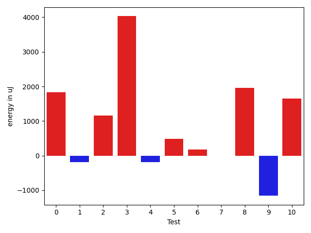

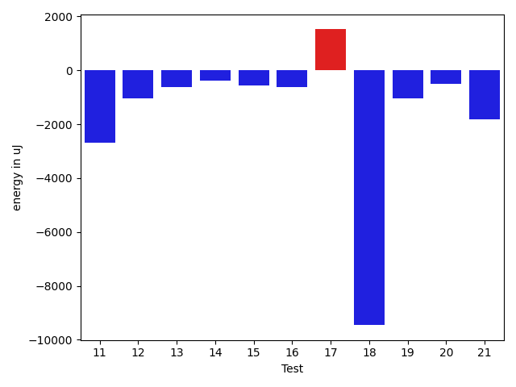

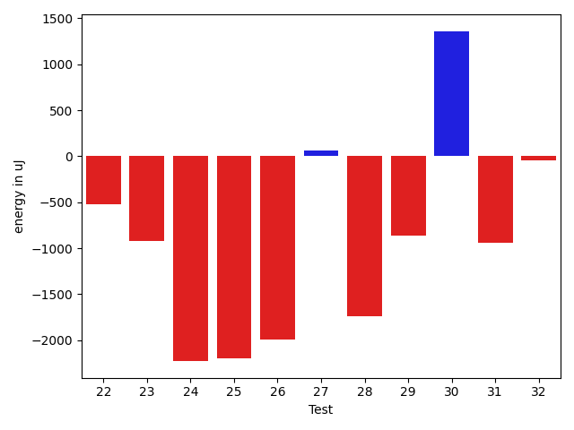

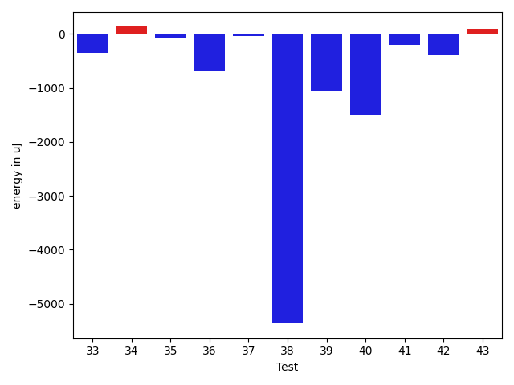

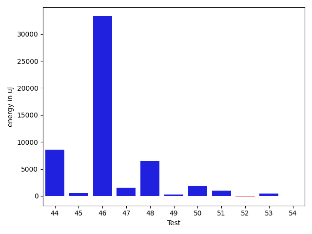

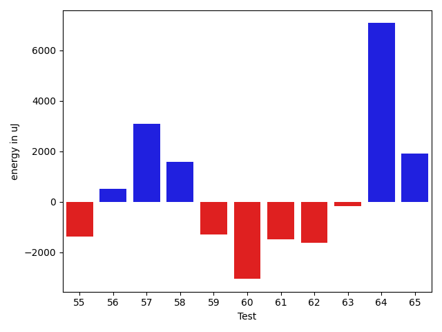

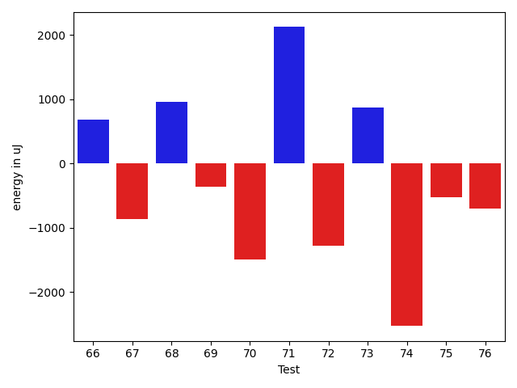

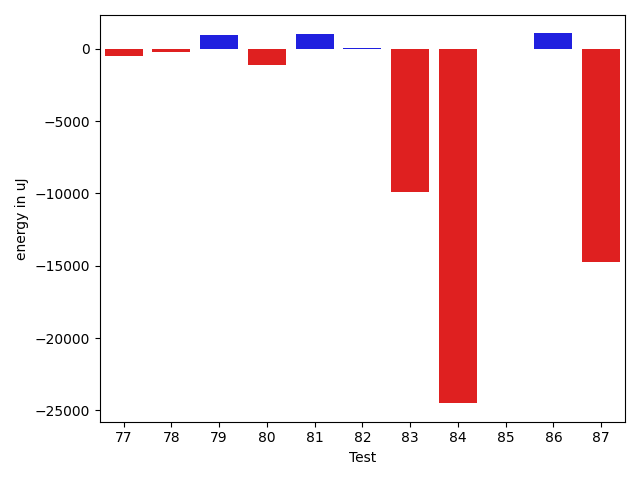

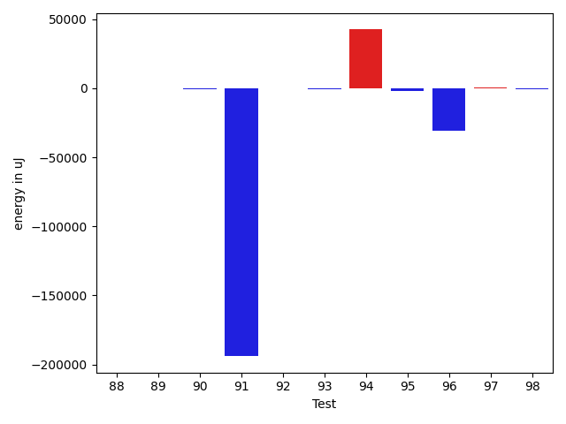

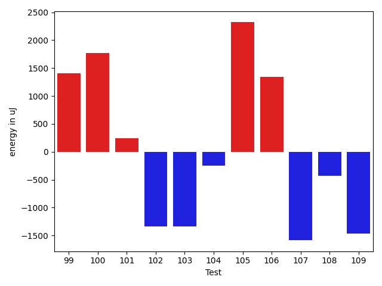

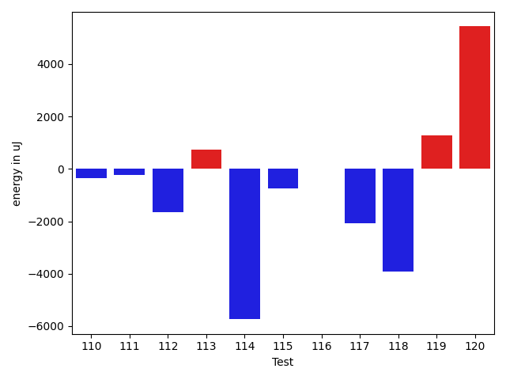

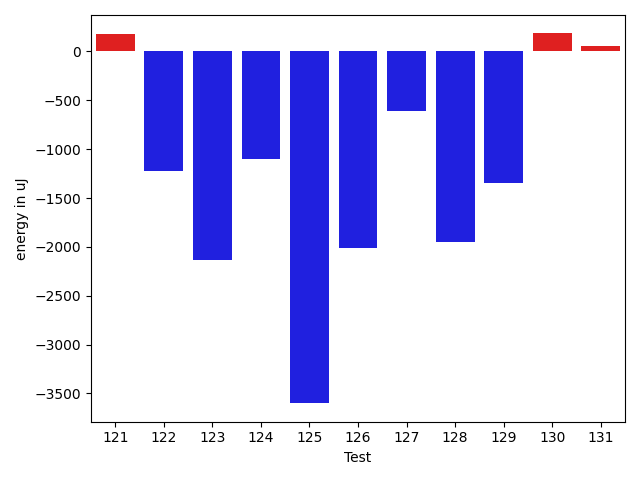

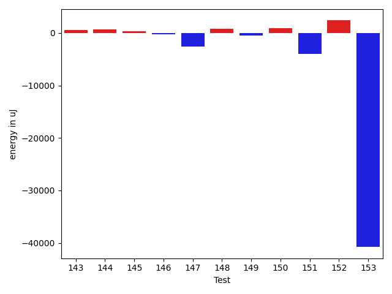

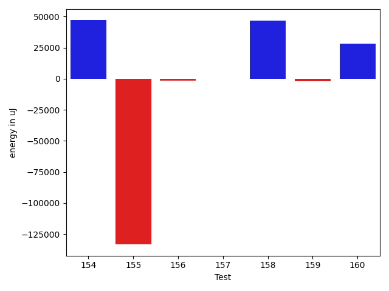

| ID | EnergyV1 | EnergyV2 | DeltaEnergy | σV1 | σV2 |
| --- | --- | --- | --- | --- | --- |
| 0 | 36855.290322580644 | 37066.891304347824 | 211.6009817671802 | 5314.726802031213 | 4722.763405447856 |
| 1 | 44983.710144927536 | 44816.257575757576 | -167.45256916996004 | 15160.612837123157 | 16525.536908997066 |
| 2 | 77632.94117647059 | 46745.142857142855 | -30887.798319327732 | 200315.64374554632 | 25924.159035422497 |
| 3 | 35150.25 | 37367.95238095238 | 2217.7023809523816 | 4097.626848250095 | 3961.972073604021 |
| 4 | 36975.71875 | 37946.32142857143 | 970.6026785714275 | 4614.025481035886 | 4994.833380987451 |
| 5 | 37507.55263157895 | 38229.666666666664 | 722.1140350877176 | 5122.1399655004825 | 4249.371838545342 |
| 6 | 65513.1976744186 | 62103.10227272727 | -3410.095401691331 | 47104.876459607454 | 45418.3802926744 |
| 7 | 170643.6851851852 | 109426.33846153846 | -61217.34672364674 | 413479.5995888777 | 316566.3738126664 |
| 8 | 38011.22222222222 | 39891.95918367347 | 1880.73696145125 | 6998.865708804287 | 9323.132168263275 |
| 9 | 35802.291666666664 | 36871.25 | 1068.9583333333358 | 3553.537620915795 | 4561.496507452352 |
| 10 | 36874.57692307692 | 36935.92 | 61.343076923076296 | 4413.860530481721 | 4810.97356400968 |
| 11 | 38973.38461538462 | 37807.96551724138 | -1165.4190981432403 | 4408.3418396431025 | 5513.023774367563 |
| 12 | 36939.294117647056 | 36487.10526315789 | -452.1888544891626 | 4421.300568545005 | 6280.768970923278 |
| 13 | 41293.322916666664 | 39960.145833333336 | -1333.1770833333285 | 12152.939231669086 | 11011.035436078027 |
| 14 | 35948.4081632653 | 35577.22448979592 | -371.1836734693861 | 3801.194988895839 | 4755.333179019308 |
| 15 | 35806.5 | 35876.03448275862 | 69.5344827586232 | 3857.779335815639 | 4552.571387709396 |
| 16 | 35758.8085106383 | 35443.897959183676 | -314.9105514546245 | 3980.0600211356696 | 3539.927032828634 |
| 17 | 36409.17647058824 | 36656.03703703704 | 246.86056644879864 | 3987.6683575295533 | 4435.167477580054 |
| 18 | 130841.18181818182 | 124377.62626262626 | -6463.555555555562 | 25502.44403473361 | 23698.290199410418 |
| 19 | 37362.846153846156 | 37041.46031746032 | -321.38583638583805 | 4371.711188401276 | 4719.366626946502 |
| 20 | 39115.5 | 39370.20652173913 | 254.70652173912822 | 9770.028772041653 | 11516.588651326854 |
| 21 | 36692.229166666664 | 35360.625 | -1331.6041666666642 | 3801.265366293524 | 4230.789156218376 |
| 22 | 36623.03448275862 | 36097.46153846154 | -525.5729442970842 | 4106.1186260536515 | 3994.0929964017273 |
| 23 | 37882.450980392154 | 36959.186440677964 | -923.2645397141896 | 3572.690244190001 | 3659.2116057163685 |
| 24 | 36401.71875 | 34171.24137931035 | -2230.477370689652 | 4740.902935058725 | 4175.741583158881 |
| 25 | 37627.1935483871 | 35432.086956521736 | -2195.106591865362 | 4402.919481723352 | 4134.144314102964 |
| 26 | 38257.096774193546 | 36264.153846153844 | -1992.9429280397017 | 4064.101879555795 | 3800.1711266357433 |
| 27 | 37600.0 | 37666.57407407407 | 66.574074074073 | 4288.524986519257 | 3779.797861545331 |
| 28 | 38766.416666666664 | 37023.86666666667 | -1742.5499999999956 | 8632.93729521161 | 6563.466925506841 |
| 29 | 36997.26865671642 | 36137.63265306123 | -859.6360036551923 | 4269.244928108692 | 3577.370386955254 |
| 30 | 81161.03174603175 | 82523.34426229508 | 1362.3125162633369 | 175188.9057857594 | 173151.2244481623 |
| 31 | 79531.71717171717 | 78589.59595959596 | -942.1212121212156 | 18240.803939641817 | 18490.45007014019 |
| 32 | 41137.5974025974 | 41094.1125 | -43.484902597396285 | 12279.142289158308 | 11386.226387607254 |
| 33 | 44578.13846153846 | 44230.0 | -348.1384615384595 | 22714.231358590972 | 20921.633957188824 |
| 34 | 37074.392857142855 | 37206.42857142857 | 132.0357142857174 | 3942.7216292382686 | 3436.552615274648 |
| 35 | 37968.68 | 37892.813953488374 | -75.86604651162634 | 4320.7884069461215 | 3692.7835927740352 |
| 36 | 41155.60784313725 | 40462.730769230766 | -692.8770739064857 | 9339.127114349485 | 12290.290218635359 |
| 37 | 37735.94666666666 | 37703.64615384615 | -32.30051282051136 | 6844.221276168354 | 7027.558826463732 |
| 38 | 48801.91803278688 | 43435.89655172414 | -5366.021481062744 | 34389.86492629796 | 23240.764103773123 |
| 39 | 37826.755102040814 | 36760.316666666666 | -1066.438435374148 | 4438.632601218129 | 3752.8880811612567 |
| 40 | 36956.55 | 35464.6 | -1491.9500000000044 | 3500.2021295205222 | 4446.995597029527 |
| 41 | 36027.89743589744 | 35829.63157894737 | -198.26585695007088 | 4084.8638228243385 | 4119.313461073546 |
| 42 | 37113.7037037037 | 36737.1935483871 | -376.5101553166023 | 3889.3162572932465 | 2907.878890180672 |
| 43 | 36923.78846153846 | 37021.08888888889 | 97.30042735042662 | 4402.925134920309 | 4421.170854585027 |
| 44 | 105385.85858585859 | 113960.9898989899 | 8575.131313131307 | 138195.80948616192 | 141623.70682409022 |
| 45 | 37691.2 | 38183.90909090909 | 492.7090909090912 | 3957.598896637539 | 5166.5008870586635 |
| 46 | 127808.8717948718 | 161081.5357142857 | 33272.66391941391 | 158361.59949138787 | 255941.1742092425 |
| 47 | 58393.666666666664 | 59926.944444444445 | 1533.277777777781 | 39499.77095353392 | 43802.289296428615 |
| 48 | 40105.666666666664 | 46573.71111111111 | 6468.044444444444 | 11245.345614066204 | 20519.194994630136 |
| 49 | 37635.51724137931 | 37940.12903225807 | 304.61179087875644 | 4183.823491535395 | 4575.974295988148 |
| 50 | 38419.92307692308 | 40314.96590909091 | 1895.0428321678337 | 8617.818786393022 | 9124.022826195074 |
| 51 | 37574.34482758621 | 38550.38888888889 | 976.0440613026803 | 4253.130694991648 | 5239.102787255859 |
| 52 | 38115.45714285714 | 37993.42857142857 | -122.02857142857101 | 4090.9114411817613 | 4085.648088374819 |
| 53 | 36600.354838709674 | 37006.89230769231 | 406.5374689826349 | 3918.0089788003884 | 4332.147700170744 |
| 54 | 37664.63333333333 | 37644.13157894737 | -20.501754385964887 | 3840.210562658715 | 4206.252915357103 |
| 55 | 39493.833333333336 | 38123.642857142855 | -1370.1904761904807 | 8456.816347709631 | 7052.295822811815 |
| 56 | 37217.45161290323 | 37728.34285714286 | 510.8912442396322 | 3715.1792805150553 | 4910.676746744833 |
| 57 | 46141.68831168831 | 49242.04054054054 | 3100.352228852229 | 16209.169452640344 | 19361.118882007348 |
| 58 | 39218.5 | 40789.41176470588 | 1570.911764705881 | 4729.289860363111 | 8008.227769420674 |
| 59 | 44991.39743589744 | 43714.17857142857 | -1277.218864468865 | 17938.855735839883 | 15765.528964409536 |
| 60 | 40050.09090909091 | 37001.181818181816 | -3048.9090909090955 | 4652.751570152195 | 4407.162792095733 |
| 61 | 64068.20202020202 | 62587.393939393936 | -1480.808080808085 | 26615.62767330571 | 24411.83766987994 |
| 62 | 46987.78082191781 | 45357.31081081081 | -1630.4700111069978 | 22729.079654749796 | 21213.975319653226 |
| 63 | 38736.086956521736 | 38579.828125 | -156.25883152173628 | 6779.488236294961 | 7379.791817343765 |
| 64 | 80749.27083333333 | 87822.4693877551 | 7073.198554421775 | 60032.09551503803 | 57338.26372416699 |
| 65 | 47039.27777777778 | 48949.416666666664 | 1910.1388888888832 | 16508.041010555215 | 17069.344924390552 |
| 66 | 40074.55 | 40753.69491525424 | 679.1449152542336 | 7878.922573180083 | 10911.006110693974 |
| 67 | 38080.47826086957 | 37212.166666666664 | -868.3115942029035 | 3955.9731707619408 | 3767.692091246901 |
| 68 | 36673.78378378379 | 37631.555555555555 | 957.7717717717678 | 4330.7093865888055 | 5179.3944811491265 |
| 69 | 44262.16129032258 | 43903.21875 | -358.9425403225832 | 14567.188999978074 | 11794.027404618764 |
| 70 | 38885.142857142855 | 37395.21052631579 | -1489.9323308270687 | 4713.212192344837 | 3912.2929012475993 |
| 71 | 61706.42 | 63832.21276595745 | 2125.792765957449 | 38259.19828699498 | 38484.10276428115 |
| 72 | 39199.0 | 37923.04761904762 | -1275.9523809523816 | 3653.5567276155384 | 2715.881852332252 |
| 73 | 38339.46153846154 | 39213.23529411765 | 873.7737556561115 | 4033.9106930235753 | 4519.425972522094 |
| 74 | 40283.0 | 37757.380952380954 | -2525.619047619046 | 4374.230364304102 | 3438.06614352549 |
| 75 | 38284.95652173913 | 37758.967741935485 | -525.9887798036434 | 4369.79906490846 | 4216.276231110093 |
| 76 | 38421.7 | 37719.35 | -702.3499999999985 | 4593.701536887219 | 3780.1462706487964 |
| 77 | 39723.5 | 39223.882352941175 | -499.61764705882524 | 3296.774319947707 | 3717.5181455683246 |
| 78 | 37414.4 | 37214.07142857143 | -200.32857142857392 | 3969.979627151756 | 2823.53136197224 |
| 79 | 38161.23684210526 | 39109.307692307695 | 948.0708502024354 | 3334.003950004058 | 3333.0936823121297 |
| 80 | 38917.09523809524 | 37802.7 | -1114.3952380952396 | 8355.569625627417 | 6507.606485490653 |
| 81 | 37768.53333333333 | 38803.71428571428 | 1035.1809523809497 | 4282.310573614306 | 3269.0838696703354 |
| 82 | 37691.03125 | 37740.4 | 49.368750000001455 | 4228.902173469308 | 3838.018790990998 |
| 83 | 57385.88888888889 | 47473.61616161616 | -9912.272727272728 | 27835.83756249911 | 19103.735127782373 |
| 84 | 72626.4255319149 | 48120.85365853659 | -24505.571873378307 | 60305.60751095816 | 31012.217397036013 |
| 85 | 38455.617647058825 | 38466.78787878788 | 11.170231729054649 | 4942.287616399716 | 5553.09758361821 |
| 86 | 37061.77777777778 | 38116.96721311475 | 1055.1894353369717 | 3843.9023558081763 | 3840.297781176005 |
| 87 | 54681.06896551724 | 39952.31578947369 | -14728.753176043552 | 27944.22030048684 | 7877.4157801884 |
| 88 | 37394.07142857143 | 37495.35135135135 | 101.27992277992598 | 3914.7092903855955 | 3735.2502446376657 |
| 89 | 38148.2 | 37941.769230769234 | -206.43076923076296 | 3402.5219640078085 | 3976.5713711465673 |
| 90 | 37658.666666666664 | 37251.444444444445 | -407.222222222219 | 3799.5080748843147 | 4284.45612031604 |
| 91 | 280419.2 | 86355.78571428571 | -194063.4142857143 | 387030.5506832245 | 171630.98838503935 |
| 92 | 37556.77777777778 | 37742.22222222222 | 185.44444444443798 | 4026.3418060947306 | 4008.820222989167 |
| 93 | 38502.74285714285 | 37545.25 | -957.4928571428536 | 3579.7731320203375 | 4773.242126876209 |
| 94 | 118470.96666666666 | 160977.72727272726 | 42506.760606060605 | 303299.01967850694 | 410383.8618082224 |
| 95 | 38967.55319148936 | 37056.5 | -1911.0531914893581 | 3286.106574258271 | 3792.0996796984687 |
| 96 | 86500.30985915494 | 55944.73333333333 | -30555.576525821605 | 212799.83795666497 | 34234.05024478147 |
| 97 | 38543.04081632653 | 38926.25581395349 | 383.2149976269575 | 4070.89977497922 | 7041.915166602689 |
| 98 | 38992.607142857145 | 38256.339622641506 | -736.2675202156388 | 4235.025491905785 | 4190.6383309115945 |
| 99 | 39481.89743589744 | 39099.0 | -382.8974358974374 | 4393.083823086022 | 5051.264528148702 |
| 100 | 96119.0303030303 | 94957.52525252526 | -1161.5050505050458 | 30547.680612728414 | 29742.80996362298 |
| 101 | 41104.32727272727 | 39574.88679245283 | -1529.4404802744393 | 12645.364148111632 | 6227.665263057535 |
| 102 | 39978.05 | 38729.07692307692 | -1248.973076923081 | 3284.4171244682066 | 4623.418922458182 |
| 103 | 183417.4 | 128390.02380952382 | -55027.37619047618 | 457279.6108139373 | 382140.3970624189 |
| 104 | 37190.59259259259 | 37156.318181818184 | -34.27441077440744 | 4160.722829467115 | 5180.865962947995 |
| 105 | 37009.86046511628 | 38455.26315789474 | 1445.402692778458 | 3983.6022005413547 | 3968.007584910318 |
| 106 | 44677.643835616436 | 44080.360655737706 | -597.2831798787302 | 18642.782984506186 | 15629.239568081523 |
| 107 | 55545.74603174603 | 63058.705882352944 | 7512.959850606916 | 32901.03743477866 | 43200.084039176654 |
| 108 | 38372.482142857145 | 38061.05084745763 | -311.4312953995177 | 4834.491973572638 | 5362.690702780248 |
| 109 | 45068.975 | 43460.7625 | -1608.2125000000015 | 15039.951654655506 | 14605.811124552232 |
| 110 | 37346.1 | 37815.392857142855 | 469.2928571428565 | 4333.193290172965 | 3765.0343608684916 |
| 111 | 38727.19402985075 | 37605.583333333336 | -1121.6106965174113 | 5731.842558166278 | 4247.684743055784 |
| 112 | 125084.73737373737 | 106136.81818181818 | -18947.919191919194 | 241996.96220885677 | 181013.13895000165 |
| 113 | 51561.12631578947 | 52606.536082474224 | 1045.409766684752 | 20140.724937165756 | 19477.598994193173 |
| 114 | 82172.36842105263 | 81563.93478260869 | -608.4336384439375 | 40763.57862978141 | 46106.58981590667 |
| 115 | 128451.36111111111 | 197696.80487804877 | 69245.44376693766 | 255355.16948927703 | 365742.19212626776 |
| 116 | 49336.545454545456 | 55697.833333333336 | 6361.28787878788 | 21843.982387627133 | 32032.235666677327 |
| 117 | 38085.857142857145 | 36953.37037037037 | -1132.4867724867727 | 3692.761561625717 | 4828.17855501659 |
| 118 | 37721.21052631579 | 35796.34146341463 | -1924.8690629011544 | 4309.968611180699 | 5204.70498032148 |
| 119 | 44086.807692307695 | 54250.90697674418 | 10164.099284436488 | 19472.91311952204 | 28163.40642535485 |
| 120 | 191353.43434343435 | 222610.15151515152 | 31256.717171717173 | 66547.79991402573 | 176904.87364547787 |
| 121 | 37351.546875 | 38362.90540540541 | 1011.3585304054068 | 5295.394469872168 | 8549.80734597067 |
| 122 | 37485.40540540541 | 36196.92307692308 | -1288.4823284823287 | 4107.302274094468 | 4194.836718711104 |
| 123 | 39698.166666666664 | 36631.76470588235 | -3066.4019607843147 | 4174.916569359334 | 4394.37615232994 |
| 124 | 38061.08474576271 | 36453.17307692308 | -1607.9116688396316 | 4310.681460492657 | 3764.2169515725204 |
| 125 | 39153.44262295082 | 36608.854545454546 | -2544.5880774962716 | 4124.3415670215745 | 3817.2193993114065 |
| 126 | 37647.77419354839 | 36659.52631578947 | -988.2478777589131 | 4086.7458322482626 | 5710.233620763116 |
| 127 | 40796.34090909091 | 50283.63636363636 | 9487.295454545449 | 15406.364545129309 | 38243.17929427986 |
| 128 | 38764.875 | 37030.857142857145 | -1734.017857142855 | 4137.6276144720505 | 4048.354442718369 |
| 129 | 39395.333333333336 | 44283.925 | 4888.591666666667 | 3872.5045741441904 | 18634.55857055313 |
| 130 | 41709.36781609195 | 40583.545454545456 | -1125.8223615464958 | 11135.511814997668 | 8605.852898932431 |
| 131 | 45288.71428571428 | 43069.80263157895 | -2218.911654135336 | 15722.138211590098 | 13305.608936024468 |
| 132 | 147297.18181818182 | 154652.22222222222 | 7355.0404040403955 | 257743.49425632818 | 338560.06477670575 |
| 133 | 50639.0 | 45114.91803278688 | -5524.081967213118 | 18702.935378450406 | 12996.986627165697 |
| 134 | 42329.193181818184 | 41140.458823529414 | -1188.7343582887697 | 11022.651908124506 | 11319.647401027938 |
| 135 | 40996.70909090909 | 44292.166666666664 | 3295.457575757573 | 9002.826280821184 | 11645.876518305937 |
| 136 | 41677.979166666664 | 51703.35555555556 | 10025.376388888893 | 14412.277475139012 | 27304.143035367408 |
| 137 | 129560.69696969698 | 204059.0707070707 | 74498.37373737372 | 149712.76158262545 | 397541.8063405028 |
| 138 | 40053.4375 | 38863.705128205125 | -1189.7323717948748 | 9375.539524267057 | 6302.898045504543 |
| 139 | 48104.836956521736 | 48489.37634408602 | 384.53938756428397 | 18505.567624764204 | 19884.168882522794 |
| 140 | 41296.206896551725 | 40954.5 | -341.70689655172464 | 11375.439119110793 | 11680.930962769053 |
| 141 | 54474.74725274725 | 54106.813953488374 | -367.9332992588752 | 50579.517956543816 | 46954.437106999314 |
| 142 | 44026.583333333336 | 48843.444444444445 | 4816.8611111111095 | 17544.36396186504 | 21678.827799372593 |
| 143 | 38726.229508196724 | 39099.85964912281 | 373.630140926085 | 4766.261009732866 | 5451.818947832984 |
| 144 | 111016.02739726027 | 202540.16 | 91524.13260273973 | 277660.4944650474 | 470066.09757658665 |
| 145 | 131331.9014084507 | 46438.46575342466 | -84893.43565502606 | 357006.85554076266 | 19180.46859176053 |
| 146 | 47199.93023255814 | 46869.84705882353 | -330.08317373460886 | 17493.333928252927 | 14876.874822438052 |
| 147 | 71191.43434343435 | 69047.84848484848 | -2143.585858585866 | 24580.14912348088 | 30372.722071417113 |
| 148 | 39615.574468085106 | 39480.96428571428 | -134.61018237082317 | 4746.856902964367 | 4330.842189476899 |
| 149 | 40142.307692307695 | 38779.78947368421 | -1362.5182186234815 | 2736.762921763745 | 3677.4158486768565 |
| 150 | 39806.0 | 41453.757575757576 | 1647.757575757576 | 4485.004236341366 | 5196.851255475138 |
| 151 | 246992.08080808082 | 170360.41414141413 | -76631.66666666669 | 448746.054306565 | 245037.32711127622 |
| 152 | 37846.01754385965 | 39963.82142857143 | 2117.8038847117787 | 4509.906571138028 | 5345.156499470014 |
| 153 | 450618.9494949495 | 426893.63636363635 | -23725.31313131313 | 204846.0774307754 | 200831.6893074646 |
| 154 | 88834.58064516129 | 135884.18181818182 | 47049.601173020535 | 249613.59898228437 | 363255.5691151186 |
| 155 | 208136.72 | 74771.7741935484 | -133364.9458064516 | 460680.0476694879 | 197883.39690116138 |
| 156 | 39492.47619047619 | 38141.916666666664 | -1350.5595238095266 | 5170.323510363163 | 3616.960025544779 |
| 157 | 39529.117647058825 | 39286.2 | -242.91764705882815 | 3951.9464732376678 | 4936.875384289136 |
| 158 | 40405.142857142855 | 87284.28571428571 | 46879.142857142855 | 3548.8498510511995 | 172821.98795185945 |
| 159 | 43852.23809523809 | 41846.71428571428 | -2005.5238095238092 | 6413.599181982 | 7947.910687678854 |
| 160 | 249218.9642857143 | 277651.76470588235 | 28432.80042016806 | 515865.34982517356 | 527110.0187580588 |

## Delta Duration per test method

| ID | DurationV1 | DurationsV2 | DeltaDuration |
| --- | --- | --- | --- |
| 0 | 707334.4838709678 | 682028.8260869565 | -25305.657784011215 |
| 1 | 1224738.4057971016 | 1166960.5909090908 | -57777.81488801073 |
| 2 | 2094380.3921568627 | 1097745.0535714286 | -996635.338585434 |
| 3 | 485502.3 | 450452.5714285714 | -35049.72857142857 |
| 4 | 571801.84375 | 585782.9285714285 | 13981.084821428522 |
| 5 | 689048.3947368421 | 629935.9777777778 | -59112.416959064314 |
| 6 | 2012261.6279069767 | 1899804.6818181819 | -112456.94608879485 |
| 7 | 4675841.055555556 | 2926214.476923077 | -1749626.578632479 |
| 8 | 912254.574074074 | 928838.7959183673 | 16584.221844293294 |
| 9 | 637470.7083333334 | 552104.3 | -85366.40833333333 |
| 10 | 541604.8076923077 | 544614.28 | 3009.472307692282 |
| 11 | 500718.23076923075 | 461521.724137931 | -39196.50663129974 |
| 12 | 874666.0196078431 | 823817.649122807 | -50848.37048503617 |
| 13 | 1331619.8229166667 | 1311789.84375 | -19829.979166666744 |
| 14 | 786245.4285714285 | 761337.775510204 | -24907.653061224497 |
| 15 | 534536.0384615385 | 524179.8275862069 | -10356.210875331599 |
| 16 | 768904.8936170213 | 738389.775510204 | -30515.118106817245 |
| 17 | 813311.9215686275 | 771892.4814814815 | -41419.44008714601 |
| 18 | 3763456.232323232 | 3650394.3636363638 | -113061.86868686834 |
| 19 | 854112.7538461538 | 858822.4444444445 | 4709.690598290646 |
| 20 | 1291545.6956521738 | 1314898.456521739 | 23352.760869565187 |
| 21 | 840364.8125 | 785189.15 | -55175.66249999998 |
| 22 | 530325.7931034482 | 478952.92307692306 | -51372.87002652517 |
| 23 | 806085.0196078431 | 790216.7457627119 | -15868.273845131276 |
| 24 | 554995.1875 | 551328.5172413794 | -3666.6702586206375 |
| 25 | 502949.7419354839 | 519008.0869565217 | 16058.34502103785 |
| 26 | 534375.7096774194 | 554402.1538461539 | 20026.44416873448 |
| 27 | 787761.68 | 728122.6851851852 | -59638.99481481488 |
| 28 | 927200.2833333333 | 903382.8166666667 | -23817.466666666674 |
| 29 | 872162.104477612 | 848148.918367347 | -24013.18611026497 |
| 30 | 2267814.873015873 | 2378429.5901639345 | 110614.71714806138 |
| 31 | 2401569.9393939395 | 2345128.1414141413 | -56441.79797979817 |
| 32 | 1164284.4415584416 | 1125826.75 | -38457.69155844161 |
| 33 | 1039908.1230769231 | 1127010.5438596492 | 87102.42078272614 |
| 34 | 806713.875 | 792196.8571428572 | -14517.01785714284 |
| 35 | 751225.94 | 749118.7906976744 | -2107.1493023255607 |
| 36 | 893912.7843137255 | 911871.9423076923 | 17959.157993966714 |
| 37 | 1160516.8133333332 | 1082980.1846153846 | -77536.62871794868 |
| 38 | 1260368.31147541 | 1163177.5344827587 | -97190.77699265117 |
| 39 | 920735.7142857143 | 881441.7666666667 | -39293.9476190476 |
| 40 | 490475.4 | 549388.25 | 58912.84999999998 |
| 41 | 657372.0 | 650237.1228070175 | -7134.8771929824725 |
| 42 | 594551.074074074 | 565807.6129032258 | -28743.461170848226 |
| 43 | 732595.2307692308 | 782734.088888889 | 50138.858119658194 |
| 44 | 3052245.9393939395 | 3464566.5353535353 | 412320.59595959587 |
| 45 | 634413.6333333333 | 642789.5757575758 | 8375.942424242501 |
| 46 | 3605823.9487179485 | 4503599.94047619 | 897775.9917582418 |
| 47 | 1655277.7101449275 | 1607996.5416666667 | -47281.16847826075 |
| 48 | 787661.6363636364 | 1044569.8888888889 | 256908.25252525252 |
| 49 | 603936.4137931034 | 593330.9677419355 | -10605.446051167906 |
| 50 | 1167801.1666666667 | 1201087.2613636365 | 33286.094696969725 |
| 51 | 625017.3103448276 | 674418.8055555555 | 49401.49521072791 |
| 52 | 593424.0285714286 | 620630.0571428571 | 27206.0285714285 |
| 53 | 895157.3870967742 | 958493.4461538461 | 63336.05905707192 |
| 54 | 563544.9666666667 | 600152.8684210526 | 36607.90175438591 |
| 55 | 671621.4666666667 | 837107.4761904762 | 165486.00952380954 |
| 56 | 568960.1612903225 | 572900.0857142857 | 3939.9244239631807 |
| 57 | 1270846.9220779222 | 1410618.7702702703 | 139771.84819234814 |
| 58 | 590753.2777777778 | 946254.8823529412 | 355501.60457516345 |
| 59 | 1192470.8461538462 | 1220446.238095238 | 27975.391941391863 |
| 60 | 467826.63636363635 | 485473.54545454547 | 17646.909090909117 |
| 61 | 1933370.606060606 | 2023507.0505050505 | 90136.4444444445 |
| 62 | 1375945.7260273972 | 1312606.810810811 | -63338.91521658632 |
| 63 | 1027446.2028985508 | 1063705.34375 | 36259.14085144922 |
| 64 | 2456684.03125 | 2607015.275510204 | 150331.24426020402 |
| 65 | 1371762.1666666667 | 1432812.0476190476 | 61049.88095238083 |
| 66 | 1072593.7166666666 | 1090069.9491525423 | 17476.23248587572 |
| 67 | 733499.804347826 | 821668.4629629629 | 88168.65861513687 |
| 68 | 656855.0540540541 | 688371.0277777778 | 31515.97372372367 |
| 69 | 925726.9677419355 | 817280.5 | -108446.46774193551 |
| 70 | 447920.4285714286 | 453619.4736842105 | 5699.045112781925 |
| 71 | 1603281.88 | 1716260.3829787234 | 112978.5029787235 |
| 72 | 461247.5238095238 | 471612.2380952381 | 10364.714285714319 |
| 73 | 500037.6153846154 | 467731.1176470588 | -32306.49773755658 |
| 74 | 572083.72 | 475740.85714285716 | -96342.86285714281 |
| 75 | 562544.8260869565 | 510325.87096774194 | -52218.9551192146 |
| 76 | 423115.6 | 435362.2 | 12246.600000000035 |
| 77 | 417095.9166666667 | 457751.9411764706 | 40656.024509803916 |
| 78 | 445395.4666666667 | 446301.14285714284 | 905.6761904761661 |
| 79 | 715391.552631579 | 663125.3846153846 | -52266.168016194366 |
| 80 | 952162.3492063492 | 851683.14 | -100479.20920634922 |
| 81 | 566104.6333333333 | 498804.6666666667 | -67299.96666666662 |
| 82 | 611121.96875 | 600390.7428571428 | -10731.225892857183 |
| 83 | 1682963.808080808 | 1553457.5353535353 | -129506.2727272727 |
| 84 | 1950594.3617021276 | 1076384.1463414633 | -874210.2153606643 |
| 85 | 913064.6176470588 | 659457.8787878788 | -253606.73885918 |
| 86 | 913273.3703703703 | 827185.6229508197 | -86087.74741955067 |
| 87 | 1221566.6896551724 | 621566.7894736842 | -599999.9001814883 |
| 88 | 708139.7142857143 | 676243.1621621621 | -31896.55212355219 |
| 89 | 771205.9555555555 | 754585.3333333334 | -16620.622222222155 |
| 90 | 588095.5555555555 | 567857.8148148148 | -20237.74074074067 |
| 91 | 7512832.28 | 2151178.3571428573 | -5361653.922857143 |
| 92 | 490325.9166666667 | 527821.5555555555 | 37495.63888888882 |
| 93 | 723462.0285714286 | 675824.3214285715 | -47637.707142857136 |
| 94 | 3390126.1666666665 | 4582601.329545454 | 1192475.1628787876 |
| 95 | 726407.0 | 749324.0576923077 | 22917.057692307746 |
| 96 | 2364024.6056338027 | 1490841.2666666666 | -873183.3389671361 |
| 97 | 775572.224489796 | 744934.5348837209 | -30637.68960607506 |
| 98 | 888047.8214285715 | 890033.2264150943 | 1985.404986522859 |
| 99 | 594809.5897435897 | 670152.8666666667 | 75343.27692307695 |
| 100 | 2761923.606060606 | 2732587.222222222 | -29336.383838383947 |
| 101 | 1050963.2181818183 | 969795.4716981133 | -81167.746483705 |
| 102 | 526792.45 | 475571.07692307694 | -51221.37307692302 |
| 103 | 5210595.976470588 | 3657603.523809524 | -1552992.452661064 |
| 104 | 581233.925925926 | 616453.4090909091 | 35219.4831649831 |
| 105 | 788298.0465116279 | 735164.2894736842 | -53133.757037943695 |
| 106 | 1101064.6164383562 | 1099399.3934426229 | -1665.2229957333766 |
| 107 | 1424375.4126984128 | 1600952.2352941176 | 176576.8225957048 |
| 108 | 900301.4464285715 | 891387.5084745763 | -8913.937953995191 |
| 109 | 1321847.8375 | 1294379.9375 | -27467.899999999907 |
| 110 | 853243.62 | 841781.2142857143 | -11462.405714285676 |
| 111 | 969237.4925373135 | 962711.8333333334 | -6525.659203980118 |
| 112 | 3681591.404040404 | 3032903.3434343436 | -648688.0606060605 |
| 113 | 1625836.1368421053 | 1549836.412371134 | -75999.72447097139 |
| 114 | 2166726.210526316 | 2215606.065217391 | 48879.85469107516 |
| 115 | 3728868.0 | 5892940.365853659 | 2164072.365853659 |
| 116 | 1125908.303030303 | 1375149.2777777778 | 249240.97474747477 |
| 117 | 685115.3428571429 | 748318.8518518518 | 63203.508994708885 |
| 118 | 643480.9736842106 | 689862.243902439 | 46381.270218228456 |
| 119 | 1258613.435897436 | 1654039.3255813953 | 395425.8896839593 |
| 120 | 5183322.737373738 | 6255421.909090909 | 1072099.1717171716 |
| 121 | 1013522.09375 | 1092587.0135135136 | 79064.91976351361 |
| 122 | 658747.9459459459 | 758584.3846153846 | 99836.4386694387 |
| 123 | 594450.1388888889 | 658357.8823529412 | 63907.74346405233 |
| 124 | 786342.033898305 | 862043.3653846154 | 75701.33148631034 |
| 125 | 856068.8852459016 | 958398.6545454545 | 102329.76929955289 |
| 126 | 863565.4677419355 | 983761.5263157894 | 120196.05857385392 |
| 127 | 851757.2954545454 | 1242143.4545454546 | 390386.1590909092 |
| 128 | 428951.4166666667 | 539054.9285714285 | 110103.51190476184 |
| 129 | 666588.7878787878 | 955040.15 | 288451.3621212122 |
| 130 | 1207144.91954023 | 1140862.6233766233 | -66282.29616360669 |
| 131 | 1314216.3116883116 | 1181532.9868421052 | -132683.32484620647 |
| 132 | 4218129.303030303 | 4313763.232323232 | 95633.92929292936 |
| 133 | 1345469.1803278688 | 1195376.5409836066 | -150092.6393442622 |
| 134 | 1242250.4772727273 | 1205871.1529411764 | -36379.32433155086 |
| 135 | 995983.5454545454 | 1064193.5740740742 | 68210.02861952875 |
| 136 | 870862.6875 | 1317486.6888888888 | 446624.0013888888 |
| 137 | 3566442.595959596 | 6036803.828282828 | 2470361.2323232326 |
| 138 | 1056659.6625 | 1054215.8846153845 | -2443.777884615585 |
| 139 | 1498327.5543478262 | 1460379.2150537635 | -37948.339294062695 |
| 140 | 1245951.1609195403 | 1207750.011627907 | -38201.149291633395 |
| 141 | 1717427.6263736263 | 1668682.7325581396 | -48744.89381548669 |
| 142 | 1148364.375 | 1391486.3333333333 | 243121.95833333326 |
| 143 | 909208.0 | 966598.5087719298 | 57390.50877192977 |
| 144 | 3053528.205479452 | 5775649.08 | 2722120.874520548 |
| 145 | 3656070.4788732394 | 1228548.8904109588 | -2427521.5884622806 |
| 146 | 1341230.953488372 | 1373758.3294117646 | 32527.375923392596 |
| 147 | 2118140.9696969697 | 2171840.8484848486 | 53699.8787878789 |
| 148 | 863116.2765957447 | 809622.8571428572 | -53493.419452887494 |
| 149 | 549121.1923076923 | 624073.0 | 74951.80769230775 |
| 150 | 635940.2727272727 | 671189.2121212122 | 35248.93939393945 |
| 151 | 6971940.252525252 | 4819835.363636363 | -2152104.888888889 |
| 152 | 862833.1052631579 | 878894.9464285715 | 16061.841165413614 |
| 153 | 11482525.828282828 | 10935993.717171717 | -546532.1111111101 |
| 154 | 2426309.2741935486 | 3632070.242424242 | 1205760.9682306936 |
| 155 | 5523345.12 | 1858547.6451612904 | -3664797.4748387095 |
| 156 | 579710.0952380953 | 660730.8333333334 | 81020.7380952381 |
| 157 | 394028.4705882353 | 439522.73333333334 | 45494.262745098036 |
| 158 | 527463.6428571428 | 1981264.5714285714 | 1453800.9285714286 |
| 159 | 713423.0952380953 | 847604.2857142857 | 134181.19047619042 |
| 160 | 6090211.178571428 | 7420451.176470588 | 1330239.9978991598 |

## Misc.

| ID | Test Class | Test Method |
| --- | --- | --- |
| 0 | com.google.gson.MixedStreamTest | testReaderDoesNotMutateState |
| 1 | com.google.gson.MixedStreamTest | testWriteLenient |
| 2 | com.google.gson.MixedStreamTest | testReadMixedStreamed |
| 3 | com.google.gson.MixedStreamTest | testReadInvalidState |
| 4 | com.google.gson.MixedStreamTest | testWriteInvalidState |
| 5 | com.google.gson.MixedStreamTest | testWriteDoesNotMutateState |
| 6 | com.google.gson.MixedStreamTest | testWriteHtmlSafe |
| 7 | com.google.gson.MixedStreamTest | testWriteMixedStreamed |
| 8 | com.google.gson.MixedStreamTest | testReadClosed |
| 9 | com.google.gson.MixedStreamTest | testWriteNulls |
| 10 | com.google.gson.MixedStreamTest | testWriteClosed |
| 11 | com.google.gson.MixedStreamTest | testReadNulls |
| 12 | com.google.gson.functional.DefaultTypeAdaptersTest | testDateSerializationWithPatternNotOverridenByTypeAdapter |
| 13 | com.google.gson.functional.DefaultTypeAdaptersTest | testDateSerializationWithPattern |
| 14 | com.google.gson.functional.DefaultTypeAdaptersTest | testBitSetDeserialization |
| 15 | com.google.gson.functional.DefaultTypeAdaptersTest | testDefaultGregorianCalendarDeserialization |
| 16 | com.google.gson.functional.DefaultTypeAdaptersTest | testSqlDateSerialization |
| 17 | com.google.gson.functional.DefaultTypeAdaptersTest | testTimestampSerialization |
| 18 | com.google.gson.functional.DefaultTypeAdaptersTest | testDefaultDateDeserializationUsingBuilder |
| 19 | com.google.gson.functional.DefaultTypeAdaptersTest | testDateDeserializationWithPattern |
| 20 | com.google.gson.functional.DefaultTypeAdaptersTest | testDateSerializationInCollection |
| 21 | com.google.gson.functional.DefaultTypeAdaptersTest | testSetSerialization |
| 22 | com.google.gson.functional.DefaultTypeAdaptersTest | testBitSetSerialization |
| 23 | com.google.gson.functional.DefaultTypeAdaptersTest | testDefaultDateSerializationUsingBuilder |
| 24 | com.google.gson.functional.DefaultTypeAdaptersTest | testDefaultCalendarSerialization |
| 25 | com.google.gson.functional.DefaultTypeAdaptersTest | testDefaultGregorianCalendarSerialization |
| 26 | com.google.gson.functional.DefaultTypeAdaptersTest | testDefaultCalendarDeserialization |
| 27 | com.google.gson.functional.CustomTypeAdaptersTest | testCustomTypeAdapterAppliesToSubClassesSerializedAsBaseClass |
| 28 | com.google.gson.functional.CustomTypeAdaptersTest | testCustomAdapterInvokedForMapElementDeserialization |
| 29 | com.google.gson.functional.CustomTypeAdaptersTest | testCustomAdapterInvokedForMapElementSerializationWithType |
| 30 | com.google.gson.functional.CustomTypeAdaptersTest | testCustomSerializers |
| 31 | com.google.gson.functional.CustomTypeAdaptersTest | testCustomTypeAdapterDoesNotAppliesToSubClasses |
| 32 | com.google.gson.functional.CustomTypeAdaptersTest | testCustomAdapterInvokedForCollectionElementSerializationWithType |
| 33 | com.google.gson.functional.CustomTypeAdaptersTest | testCustomDeserializers |
| 34 | com.google.gson.functional.CustomTypeAdaptersTest | testCustomByteArrayDeserializerAndInstanceCreator |
| 35 | com.google.gson.functional.CustomTypeAdaptersTest | testCustomByteArraySerializer |
| 36 | com.google.gson.functional.CustomTypeAdaptersTest | testEnsureCustomSerializerNotInvokedForNullValues |
| 37 | com.google.gson.functional.CustomTypeAdaptersTest | testCustomAdapterInvokedForCollectionElementDeserialization |
| 38 | com.google.gson.functional.CustomTypeAdaptersTest | testCustomNestedSerializers |
| 39 | com.google.gson.functional.CustomTypeAdaptersTest | testCustomNestedDeserializers |
| 40 | com.google.gson.functional.CustomTypeAdaptersTest | testCustomAdapterInvokedForMapElementSerialization |
| 41 | com.google.gson.functional.CustomTypeAdaptersTest | testEnsureCustomDeserializerNotInvokedForNullValues |
| 42 | com.google.gson.functional.CustomTypeAdaptersTest | testCustomAdapterInvokedForCollectionElementSerialization |
| 43 | com.google.gson.functional.NamingPolicyTest | testAtSignInSerializedName |
| 44 | com.google.gson.functional.NamingPolicyTest | testGsonWithNonDefaultFieldNamingPolicySerialization |
| 45 | com.google.gson.functional.NamingPolicyTest | testGsonWithLowerCaseDashPolicyDeserialiation |
| 46 | com.google.gson.functional.NamingPolicyTest | testGsonDuplicateNameUsingSerializedNameFieldNamingPolicySerialization |
| 47 | com.google.gson.functional.NamingPolicyTest | testGsonWithSerializedNameFieldNamingPolicySerialization |
| 48 | com.google.gson.functional.NamingPolicyTest | testGsonWithNonDefaultFieldNamingPolicyDeserialiation |
| 49 | com.google.gson.functional.NamingPolicyTest | testGsonWithLowerCaseUnderscorePolicySerialization |
| 50 | com.google.gson.functional.NamingPolicyTest | testDeprecatedNamingStrategy |
| 51 | com.google.gson.functional.NamingPolicyTest | testGsonWithLowerCaseDashPolicySerialization |
| 52 | com.google.gson.functional.NamingPolicyTest | testGsonWithLowerCaseUnderscorePolicyDeserialiation |
| 53 | com.google.gson.functional.NamingPolicyTest | testComplexFieldNameStrategy |
| 54 | com.google.gson.functional.NamingPolicyTest | testGsonWithUpperCamelCaseSpacesPolicyDeserialiation |
| 55 | com.google.gson.functional.NamingPolicyTest | testGsonWithSerializedNameFieldNamingPolicyDeserialization |
| 56 | com.google.gson.functional.NamingPolicyTest | testGsonWithUpperCamelCaseSpacesPolicySerialiation |
| 57 | com.google.gson.functional.ReadersWritersTest | testReadWriteTwoObjects |
| 58 | com.google.gson.functional.ReadersWritersTest | testTopLevelNullObjectSerializationWithWriterAndSerializeNulls |
| 59 | com.google.gson.functional.ReadersWritersTest | testReadWriteTwoStrings |
| 60 | com.google.gson.functional.ReadersWritersTest | testTopLevelNullObjectDeserializationWithReaderAndSerializeNulls |
| 61 | com.google.gson.functional.MapTest | testInterfaceTypeMapWithSerializer |
| 62 | com.google.gson.functional.MapTest | testMapSubclassDeserialization |
| 63 | com.google.gson.functional.MapTest | testGeneralMapField |
| 64 | com.google.gson.functional.MapTest | testInterfaceTypeMap |
| 65 | com.google.gson.functional.MapTest | testSerializeMaps |
| 66 | com.google.gson.functional.MapTest | testCustomSerializerForSpecificMapType |
| 67 | com.google.gson.functional.MapTest | testMapSerializationWithNullValueButSerializeNulls |
| 68 | com.google.gson.functional.MapTest | testMapSerializationWithNullValuesSerialized |
| 69 | com.google.gson.functional.PrimitiveTest | testMoreSpecificSerialization |
| 70 | com.google.gson.functional.PrimitiveTest | testDoubleInfinitySerialization |
| 71 | com.google.gson.functional.PrimitiveTest | testHtmlCharacterSerialization |
| 72 | com.google.gson.functional.PrimitiveTest | testFloatInfinitySerialization |
| 73 | com.google.gson.functional.PrimitiveTest | testFloatNaNSerialization |
| 74 | com.google.gson.functional.PrimitiveTest | testLongAsStringSerialization |
| 75 | com.google.gson.functional.PrimitiveTest | testLongAsStringDeserialization |
| 76 | com.google.gson.functional.PrimitiveTest | testNegativeInfinityFloatSerialization |
| 77 | com.google.gson.functional.PrimitiveTest | testNegativeInfinitySerialization |
| 78 | com.google.gson.functional.PrimitiveTest | testDoubleNaNSerialization |
| 79 | com.google.gson.functional.NullObjectAndFieldTest | testExplicitDeserializationOfNulls |
| 80 | com.google.gson.functional.NullObjectAndFieldTest | testCustomTypeAdapterPassesNullDesrialization |
| 81 | com.google.gson.functional.NullObjectAndFieldTest | testPrintPrintingArraysWithNulls |
| 82 | com.google.gson.functional.NullObjectAndFieldTest | testExplicitNullSetsFieldToNullDuringDeserialization |
| 83 | com.google.gson.functional.NullObjectAndFieldTest | testExplicitSerializationOfNullArrayMembers |
| 84 | com.google.gson.functional.NullObjectAndFieldTest | testExplicitSerializationOfNulls |
| 85 | com.google.gson.functional.NullObjectAndFieldTest | testCustomSerializationOfNulls |
| 86 | com.google.gson.functional.NullObjectAndFieldTest | testPrintPrintingObjectWithNulls |
| 87 | com.google.gson.functional.NullObjectAndFieldTest | testTopLevelNullObjectDeserialization |
| 88 | com.google.gson.functional.NullObjectAndFieldTest | testExplicitSerializationOfNullCollectionMembers |
| 89 | com.google.gson.functional.NullObjectAndFieldTest | testNullWrappedPrimitiveMemberSerialization |
| 90 | com.google.gson.functional.NullObjectAndFieldTest | testNullWrappedPrimitiveMemberDeserialization |
| 91 | com.google.gson.functional.NullObjectAndFieldTest | testTopLevelNullObjectSerialization |
| 92 | com.google.gson.functional.NullObjectAndFieldTest | testCustomTypeAdapterPassesNullSerialization |
| 93 | com.google.gson.functional.NullObjectAndFieldTest | testExplicitSerializationOfNullStringMembers |
| 94 | com.google.gson.JsonParserTest | testReadWriteTwoObjects |
| 95 | com.google.gson.functional.CustomSerializerTest | testSerializerReturnsNull |
| 96 | com.google.gson.functional.CustomSerializerTest | testSubClassSerializerInvokedForBaseClassFieldsHoldingSubClassInstances |
| 97 | com.google.gson.functional.CustomSerializerTest | testBaseClassSerializerInvokedForBaseClassFieldsHoldingSubClassInstances |
| 98 | com.google.gson.functional.CustomSerializerTest | testSubClassSerializerInvokedForBaseClassFieldsHoldingArrayOfSubClassInstances |
| 99 | com.google.gson.functional.CustomSerializerTest | testBaseClassSerializerInvokedForBaseClassFields |
| 100 | com.google.gson.functional.ObjectTest | testSingletonLists |
| 101 | com.google.gson.functional.ObjectTest | testInnerClassDeserialization |
| 102 | com.google.gson.functional.ObjectTest | testJsonObjectSerialization |
| 103 | com.google.gson.functional.FieldExclusionTest | testDefaultInnerClassExclusion |
| 104 | com.google.gson.functional.FieldExclusionTest | testInnerClassExclusion |
| 105 | com.google.gson.functional.FieldExclusionTest | testDefaultNestedStaticClassIncluded |
| 106 | com.google.gson.functional.CustomDeserializerTest | testCustomDeserializerReturnsNull |
| 107 | com.google.gson.functional.CustomDeserializerTest | testCustomDeserializerReturnsNullForTopLevelObject |
| 108 | com.google.gson.functional.CustomDeserializerTest | testCustomDeserializerReturnsNullForArrayElementsForArrayField |
| 109 | com.google.gson.functional.CustomDeserializerTest | testJsonTypeFieldBasedDeserialization |
| 110 | com.google.gson.functional.CustomDeserializerTest | testCustomDeserializerReturnsNullForArrayElements |
| 111 | com.google.gson.functional.TypeVariableTest | testBasicTypeVariables |
| 112 | com.google.gson.functional.TypeVariableTest | testAdvancedTypeVariables |
| 113 | com.google.gson.functional.TypeVariableTest | testTypeVariablesViaTypeParameter |
| 114 | com.google.gson.functional.SecurityTest | testJsonWithNonExectuableTokenSerialization |
| 115 | com.google.gson.functional.SecurityTest | testNonExecutableJsonSerialization |
| 116 | com.google.gson.functional.SecurityTest | testNonExecutableJsonDeserialization |
| 117 | com.google.gson.functional.SecurityTest | testJsonWithNonExectuableTokenWithConfiguredGsonDeserialization |
| 118 | com.google.gson.functional.SecurityTest | testJsonWithNonExectuableTokenWithRegularGsonDeserialization |
| 119 | com.google.gson.functional.EnumTest | testEnumSubclassWithRegisteredTypeAdapter |
| 120 | com.google.gson.functional.VersioningTest | testVersionedUntilSerialization |
| 121 | com.google.gson.functional.VersioningTest | testVersionedGsonMixingSinceAndUntilSerialization |
| 122 | com.google.gson.functional.VersioningTest | testVersionedGsonWithUnversionedClassesDeserialization |
| 123 | com.google.gson.functional.VersioningTest | testIgnoreLaterVersionClassSerialization |
| 124 | com.google.gson.functional.VersioningTest | testVersionedClassesDeserialization |
| 125 | com.google.gson.functional.VersioningTest | testVersionedClassesSerialization |
| 126 | com.google.gson.functional.VersioningTest | testVersionedGsonMixingSinceAndUntilDeserialization |
| 127 | com.google.gson.functional.VersioningTest | testVersionedGsonWithUnversionedClassesSerialization |
| 128 | com.google.gson.functional.VersioningTest | testIgnoreLaterVersionClassDeserialization |
| 129 | com.google.gson.functional.VersioningTest | testVersionedUntilDeserialization |
| 130 | com.google.gson.functional.MapAsArrayTypeAdapterTest | testMultipleEnableComplexKeyRegistrationHasNoEffect |
| 131 | com.google.gson.functional.MapAsArrayTypeAdapterTest | testMapWithTypeVariableDeserialization |
| 132 | com.google.gson.functional.MapAsArrayTypeAdapterTest | testSerializeComplexMapWithTypeAdapter |
| 133 | com.google.gson.functional.MapAsArrayTypeAdapterTest | testTwoTypesCollapseToOneDeserialize |
| 134 | com.google.gson.functional.MapAsArrayTypeAdapterTest | testMapWithTypeVariableSerialization |
| 135 | com.google.gson.functional.ExclusionStrategyFunctionalTest | testExclusionStrategyWithMode |
| 136 | com.google.gson.functional.ExclusionStrategyFunctionalTest | testExclusionStrategyDeserialization |
| 137 | com.google.gson.functional.ExclusionStrategyFunctionalTest | testExclusionStrategySerialization |
| 138 | com.google.gson.functional.ParameterizedTypesTest | testParameterizedTypeWithReaderDeserialization |
| 139 | com.google.gson.functional.ParameterizedTypesTest | testParameterizedTypeWithCustomSerializer |
| 140 | com.google.gson.functional.ParameterizedTypesTest | testParameterizedTypesWithCustomDeserializer |
| 141 | com.google.gson.functional.ParameterizedTypesTest | testParameterizedTypeDeserialization |
| 142 | com.google.gson.functional.InstanceCreatorTest | testInstanceCreatorReturnsSubTypeForField |
| 143 | com.google.gson.functional.InstanceCreatorTest | testInstanceCreatorReturnsSubTypeForTopLevelObject |
| 144 | com.google.gson.functional.InstanceCreatorTest | testInstanceCreatorReturnsBaseType |
| 145 | com.google.gson.CommentsTest | testParseComments |
| 146 | com.google.gson.functional.EscapingTest | testGsonAcceptsEscapedAndNonEscapedJsonDeserialization |
| 147 | com.google.gson.functional.UncategorizedTest | testReturningDerivedClassesDuringDeserialization |
| 148 | com.google.gson.DefaultMapJsonSerializerTest | testNonEmptyMapSerialization |
| 149 | com.google.gson.functional.ArrayTest | testArrayElementsAreArrays |
| 150 | com.google.gson.functional.ArrayTest | testNullsInArrayWithSerializeNullPropertySetSerialization |
| 151 | com.google.gson.functional.TypeHierarchyAdapterTest | testTypeHierarchy |
| 152 | com.google.gson.functional.TypeHierarchyAdapterTest | testRegisterSuperTypeFirst |
| 153 | com.google.gson.functional.CircularReferenceTest | testSelfReferenceCustomHandlerSerialization |
| 154 | com.google.gson.FunctionWithInternalDependenciesTest | testAnonymousLocalClassesSerialization |
| 155 | com.google.gson.LongSerializationPolicyTest | testDefaultLongSerializationIntegration |
| 156 | com.google.gson.LongSerializationPolicyTest | testStringLongSerializationIntegration |
| 157 | com.google.gson.JsonObjectTest | testWritePropertyWithEmptyStringName |
| 158 | com.google.gson.JsonObjectTest | testPropertyWithQuotes |
| 159 | com.google.gson.functional.PrintFormattingTest | testJsonObjectWithNullValuesSerialized |
| 160 | com.google.gson.GsonBuilderTest | testCreatingMoreThanOnce |

| Test | IterationV1 | IterationV2 | DeltaIteration |
| --- | --- | --- | --- |
| 0 | 31 | 46 | 15 |
| 1 | 69 | 66 | -3 |
| 2 | 51 | 56 | 5 |
| 3 | 20 | 21 | 1 |
| 4 | 32 | 28 | -4 |
| 5 | 38 | 45 | 7 |
| 6 | 86 | 88 | 2 |
| 7 | 54 | 65 | 11 |
| 8 | 54 | 49 | -5 |
| 9 | 24 | 20 | -4 |
| 10 | 26 | 25 | -1 |
| 11 | 13 | 29 | 16 |
| 12 | 51 | 57 | 6 |
| 13 | 96 | 96 | 0 |
| 14 | 49 | 49 | 0 |
| 15 | 26 | 29 | 3 |
| 16 | 47 | 49 | 2 |
| 17 | 51 | 54 | 3 |
| 18 | 99 | 99 | 0 |
| 19 | 65 | 63 | -2 |
| 20 | 92 | 92 | 0 |
| 21 | 48 | 40 | -8 |
| 22 | 29 | 26 | -3 |
| 23 | 51 | 59 | 8 |
| 24 | 32 | 29 | -3 |
| 25 | 31 | 23 | -8 |
| 26 | 31 | 26 | -5 |
| 27 | 50 | 54 | 4 |
| 28 | 60 | 60 | 0 |
| 29 | 67 | 49 | -18 |
| 30 | 63 | 61 | -2 |
| 31 | 99 | 99 | 0 |
| 32 | 77 | 80 | 3 |
| 33 | 65 | 57 | -8 |
| 34 | 56 | 49 | -7 |
| 35 | 50 | 43 | -7 |
| 36 | 51 | 52 | 1 |
| 37 | 75 | 65 | -10 |
| 38 | 61 | 58 | -3 |
| 39 | 49 | 60 | 11 |
| 40 | 20 | 20 | 0 |
| 41 | 39 | 57 | 18 |
| 42 | 27 | 31 | 4 |
| 43 | 52 | 45 | -7 |
| 44 | 99 | 99 | 0 |
| 45 | 30 | 33 | 3 |
| 46 | 78 | 84 | 6 |
| 47 | 69 | 72 | 3 |
| 48 | 33 | 45 | 12 |
| 49 | 29 | 31 | 2 |
| 50 | 78 | 88 | 10 |
| 51 | 29 | 36 | 7 |
| 52 | 35 | 35 | 0 |
| 53 | 62 | 65 | 3 |
| 54 | 30 | 38 | 8 |
| 55 | 30 | 42 | 12 |
| 56 | 31 | 35 | 4 |
| 57 | 77 | 74 | -3 |
| 58 | 18 | 17 | -1 |
| 59 | 78 | 84 | 6 |
| 60 | 11 | 22 | 11 |
| 61 | 99 | 99 | 0 |
| 62 | 73 | 74 | 1 |
| 63 | 69 | 64 | -5 |
| 64 | 96 | 98 | 2 |
| 65 | 72 | 84 | 12 |
| 66 | 60 | 59 | -1 |
| 67 | 46 | 54 | 8 |
| 68 | 37 | 36 | -1 |
| 69 | 31 | 32 | 1 |
| 70 | 21 | 19 | -2 |
| 71 | 50 | 47 | -3 |
| 72 | 21 | 21 | 0 |
| 73 | 13 | 17 | 4 |
| 74 | 25 | 21 | -4 |
| 75 | 23 | 31 | 8 |
| 76 | 10 | 20 | 10 |
| 77 | 12 | 17 | 5 |
| 78 | 15 | 14 | -1 |
| 79 | 38 | 39 | 1 |
| 80 | 63 | 50 | -13 |
| 81 | 30 | 21 | -9 |
| 82 | 32 | 35 | 3 |
| 83 | 99 | 99 | 0 |
| 84 | 47 | 41 | -6 |
| 85 | 34 | 33 | -1 |
| 86 | 54 | 61 | 7 |
| 87 | 29 | 19 | -10 |
| 88 | 42 | 37 | -5 |
| 89 | 45 | 39 | -6 |
| 90 | 36 | 27 | -9 |
| 91 | 25 | 14 | -11 |
| 92 | 36 | 27 | -9 |
| 93 | 35 | 28 | -7 |
| 94 | 90 | 88 | -2 |
| 95 | 47 | 52 | 5 |
| 96 | 71 | 60 | -11 |
| 97 | 49 | 43 | -6 |
| 98 | 56 | 53 | -3 |
| 99 | 39 | 30 | -9 |
| 100 | 99 | 99 | 0 |
| 101 | 55 | 53 | -2 |
| 102 | 20 | 13 | -7 |
| 103 | 85 | 84 | -1 |
| 104 | 27 | 22 | -5 |
| 105 | 43 | 38 | -5 |
| 106 | 73 | 61 | -12 |
| 107 | 63 | 51 | -12 |
| 108 | 56 | 59 | 3 |
| 109 | 80 | 80 | 0 |
| 110 | 50 | 56 | 6 |
| 111 | 67 | 60 | -7 |
| 112 | 99 | 99 | 0 |
| 113 | 95 | 97 | 2 |
| 114 | 38 | 46 | 8 |
| 115 | 36 | 41 | 5 |
| 116 | 33 | 36 | 3 |
| 117 | 35 | 27 | -8 |
| 118 | 38 | 41 | 3 |
| 119 | 78 | 86 | 8 |
| 120 | 99 | 99 | 0 |
| 121 | 64 | 74 | 10 |
| 122 | 37 | 39 | 2 |
| 123 | 36 | 34 | -2 |
| 124 | 59 | 52 | -7 |
| 125 | 61 | 55 | -6 |
| 126 | 62 | 57 | -5 |
| 127 | 44 | 33 | -11 |
| 128 | 24 | 14 | -10 |
| 129 | 33 | 40 | 7 |
| 130 | 87 | 77 | -10 |
| 131 | 77 | 76 | -1 |
| 132 | 99 | 99 | 0 |
| 133 | 61 | 61 | 0 |
| 134 | 88 | 85 | -3 |
| 135 | 55 | 54 | -1 |
| 136 | 48 | 45 | -3 |
| 137 | 99 | 99 | 0 |
| 138 | 80 | 78 | -2 |
| 139 | 92 | 93 | 1 |
| 140 | 87 | 86 | -1 |
| 141 | 91 | 86 | -5 |
| 142 | 72 | 63 | -9 |
| 143 | 61 | 57 | -4 |
| 144 | 73 | 75 | 2 |
| 145 | 71 | 73 | 2 |
| 146 | 86 | 85 | -1 |
| 147 | 99 | 99 | 0 |
| 148 | 47 | 56 | 9 |
| 149 | 26 | 19 | -7 |
| 150 | 22 | 33 | 11 |
| 151 | 99 | 99 | 0 |
| 152 | 57 | 56 | -1 |
| 153 | 99 | 99 | 0 |
| 154 | 62 | 66 | 4 |
| 155 | 25 | 31 | 6 |
| 156 | 21 | 24 | 3 |
| 157 | 17 | 15 | -2 |
| 158 | 14 | 14 | 0 |
| 159 | 21 | 21 | 0 |
| 160 | 28 | 17 | -11 |

| Time Label | Time (s) |
| --- | --- |
| Selection | 27.955249547958374 |
| Injection | 15.217120170593262 |
| Total | 1212.1798620224 |

