# gson 319645

https://github.com/google/gson/commit/319645

## Delta Energy per test method

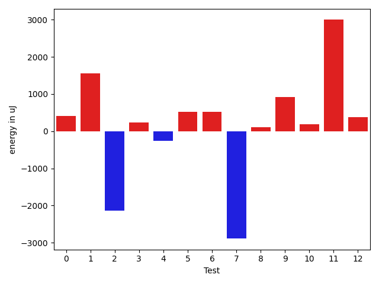

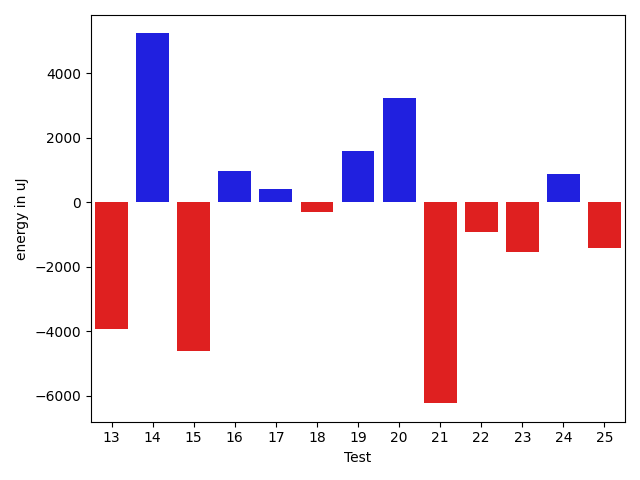

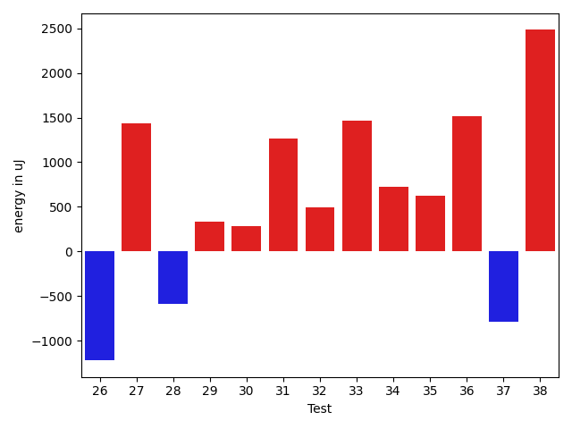

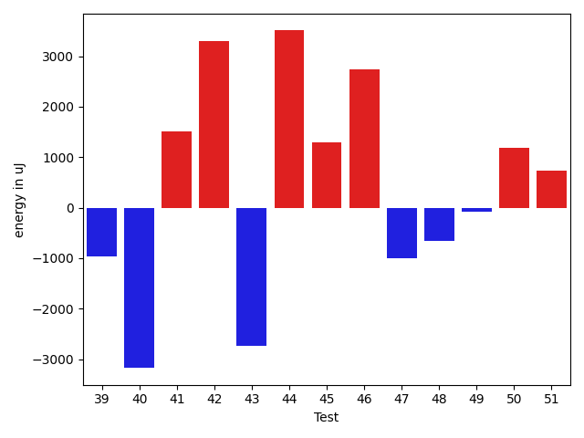

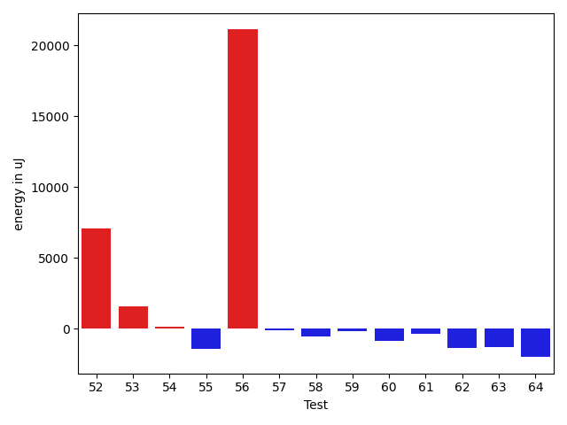

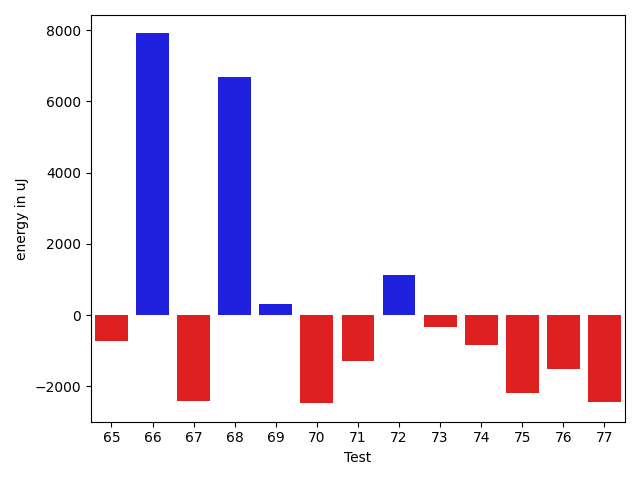

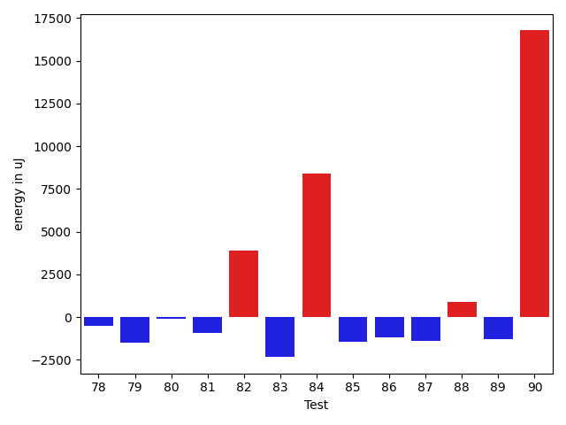

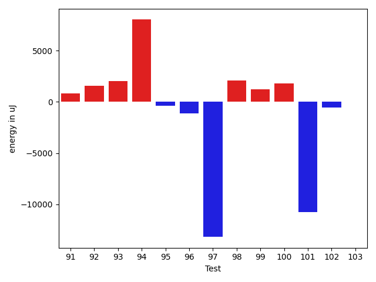

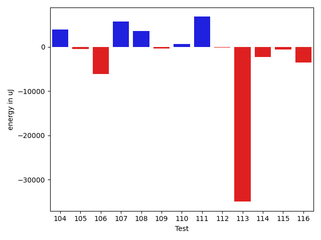

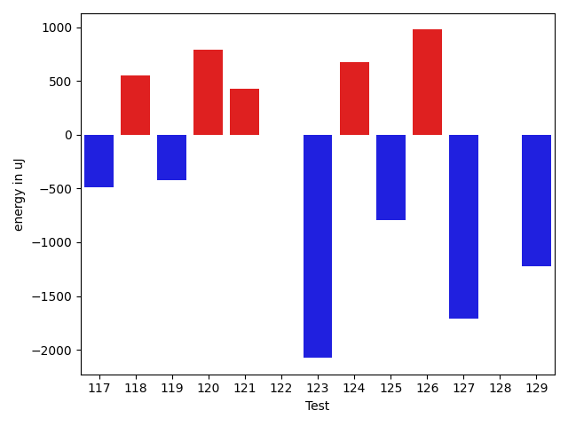

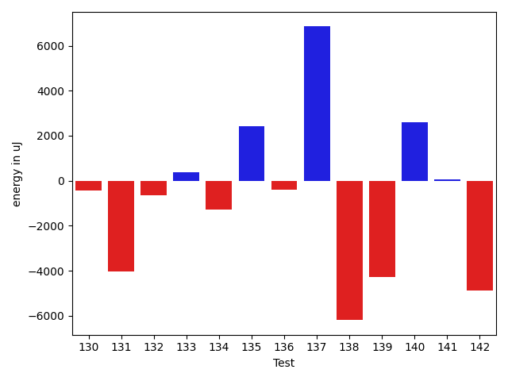

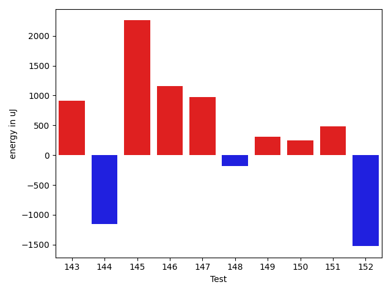

| ID | EnergyV1 | EnergyV2 | DeltaEnergy | σV1 | σV2 |
| --- | --- | --- | --- | --- | --- |
| 0 | 39147.903225806454 | 39560.123076923075 | 412.2198511166207 | 5346.498370835292 | 6779.183167286551 |
| 1 | 37368.148148148146 | 38932.360655737706 | 1564.2125075895601 | 4215.965964650232 | 3965.9616204453464 |
| 2 | 37943.52380952381 | 35804.42857142857 | -2139.0952380952367 | 4761.341703854248 | 3952.8486361276296 |
| 3 | 41707.47887323944 | 41945.20547945205 | 237.72660621261457 | 10348.358913045855 | 15618.49343931554 |
| 4 | 38170.6129032258 | 37910.6129032258 | -260.0 | 4201.088596845249 | 5384.296675413211 |
| 5 | 38345.983606557376 | 38868.163636363635 | 522.180029806259 | 5858.178258462949 | 5554.396207308999 |
| 6 | 37616.26530612245 | 38135.05882352941 | 518.7935174069644 | 4031.4757958938517 | 4348.705182148553 |
| 7 | 327259.202020202 | 324368.3434343434 | -2890.858585858601 | 242893.72526121855 | 231972.46860006324 |
| 8 | 43644.0 | 43751.27472527473 | 107.27472527472855 | 12933.487065517676 | 13393.483148852356 |
| 9 | 35288.18918918919 | 36206.0 | 917.8108108108136 | 3851.9935859018606 | 4945.449733509246 |
| 10 | 37417.020833333336 | 37599.0 | 181.97916666666424 | 3633.0562059235062 | 3523.015418789086 |
| 11 | 37597.444444444445 | 40595.395348837206 | 2997.950904392761 | 4209.894320687637 | 10041.50673197755 |
| 12 | 38638.2 | 39021.791666666664 | 383.59166666666715 | 3643.9729499544865 | 3828.4864935895 |
| 13 | 50005.60975609756 | 46070.186046511626 | -3935.4237095859353 | 31758.754022587567 | 25124.138717396232 |
| 14 | 38888.19512195122 | 44115.34042553192 | 5227.145303580699 | 4544.82221723993 | 22662.504071212596 |
| 15 | 44292.24074074074 | 39661.47692307692 | -4630.763817663814 | 13739.580441239941 | 6659.739027244681 |
| 16 | 36448.6 | 37397.74509803922 | 949.1450980392183 | 3987.5304249622973 | 4014.932767943123 |
| 17 | 38960.898305084746 | 39356.26153846154 | 395.3632333767964 | 5230.375112758799 | 5466.276987203301 |
| 18 | 43251.61818181818 | 42952.30357142857 | -299.31461038960697 | 12443.275067997623 | 12111.020889963409 |
| 19 | 36272.645833333336 | 37862.11111111111 | 1589.4652777777737 | 4526.576817758202 | 3989.560433722115 |
| 20 | 42625.985714285714 | 45856.35820895522 | 3230.3724946695074 | 11470.012653490163 | 15274.194437757844 |
| 21 | 64568.86440677966 | 58333.98412698413 | -6234.880279795536 | 58007.0757581824 | 47086.533241618396 |
| 22 | 38075.95161290323 | 37148.94736842105 | -927.0042444821738 | 5057.198626638228 | 3849.591928344325 |
| 23 | 37678.2972972973 | 36139.77142857143 | -1538.5258687258683 | 4711.0148494368295 | 4595.626020378907 |
| 24 | 36693.5 | 37557.916666666664 | 864.4166666666642 | 3823.004561205754 | 3736.3554313959776 |
| 25 | 41443.69117647059 | 40006.356164383564 | -1437.3350120870236 | 11001.799847748647 | 9132.034805089505 |
| 26 | 48154.54945054945 | 46933.45360824742 | -1221.0958423020274 | 17691.577096450234 | 14508.042860768977 |
| 27 | 78190.4625 | 79625.0945945946 | 1434.6320945946063 | 100282.75618120293 | 96531.84471012506 |
| 28 | 37997.23529411765 | 37406.15254237288 | -591.0827517447688 | 4119.16527137137 | 4626.034795144041 |
| 29 | 37584.93103448276 | 37914.742424242424 | 329.81138975966314 | 5399.353316520699 | 3804.680941947481 |
| 30 | 39197.859375 | 39485.055555555555 | 287.19618055555475 | 3955.427394207813 | 3784.2855943858867 |
| 31 | 36772.416666666664 | 38042.454545454544 | 1270.03787878788 | 4399.960865514096 | 4393.515063314367 |
| 32 | 36687.75925925926 | 37180.75471698113 | 492.99545772186684 | 3819.8281468769683 | 3813.8562068136935 |
| 33 | 36508.25 | 37975.8 | 1467.550000000003 | 4428.677047098829 | 4169.506884512844 |
| 34 | 37049.565217391304 | 37773.88636363636 | 724.3211462450563 | 4458.213195655923 | 4113.31125303684 |
| 35 | 37161.57142857143 | 37780.72727272727 | 619.1558441558445 | 4099.371390337593 | 4263.730528132485 |
| 36 | 39468.08860759494 | 40985.74418604651 | 1517.655578451573 | 7164.4661150477705 | 12127.279990080837 |
| 37 | 37497.912280701756 | 36714.36363636364 | -783.548644338116 | 4387.004310103505 | 5582.450815743282 |
| 38 | 50510.19387755102 | 52992.24742268041 | 2482.053545129391 | 19780.471918524956 | 20454.271790383158 |
| 39 | 37514.92105263158 | 36557.7125 | -957.2085526315786 | 5700.273393173804 | 6439.765221251763 |
| 40 | 47029.74193548387 | 43856.989130434784 | -3172.7528050490873 | 19146.27185692881 | 16336.453188907319 |
| 41 | 94117.17171717172 | 95630.77777777778 | 1513.6060606060637 | 75999.54312569219 | 79782.24502762246 |
| 42 | 49583.68041237113 | 52885.31313131313 | 3301.632718941997 | 18248.291611351327 | 20846.355354560557 |
| 43 | 71133.50505050505 | 68406.67676767676 | -2726.8282828282827 | 27727.59075575556 | 29790.47100947261 |
| 44 | 48443.979797979795 | 51950.666666666664 | 3506.6868686868693 | 16490.89278933954 | 21179.03030277016 |
| 45 | 52770.27272727273 | 54064.29069767442 | 1294.0179704016919 | 41660.44824414269 | 45695.0217325304 |
| 46 | 61677.40404040404 | 64422.72727272727 | 2745.3232323232296 | 22728.193063632698 | 25489.19847395779 |
| 47 | 77707.43434343435 | 76699.9696969697 | -1007.4646464646503 | 32989.76876112283 | 26982.061428632096 |
| 48 | 50146.85567010309 | 49486.30612244898 | -660.5495476541109 | 18150.526946421618 | 18489.031497139254 |
| 49 | 37439.666666666664 | 37363.77358490566 | -75.89308176100167 | 3870.7294021379435 | 4480.520659778111 |
| 50 | 37826.29113924051 | 39018.1625 | 1191.871360759491 | 4955.7916230851015 | 9098.481169189383 |
| 51 | 38816.04878048781 | 39555.80722891566 | 739.7584484278559 | 7967.5997302220885 | 10677.125165238283 |
| 52 | 247337.7676767677 | 253969.0303030303 | 6631.2626262626145 | 91624.04343903266 | 113181.88262497862 |
| 53 | 50132.6 | 52218.90697674418 | 2086.306976744185 | 27520.247598631806 | 26901.902804503894 |
| 54 | 41054.820512820515 | 41644.1 | 589.2794871794831 | 3120.8488233236744 | 3261.9962890843394 |
| 55 | 38817.42307692308 | 38865.0 | 47.57692307692196 | 8374.46546249636 | 9711.648430969546 |
| 56 | 55279.868686868685 | 59036.878787878784 | 3757.010101010099 | 22823.144466225316 | 23148.16641702224 |
| 57 | 41867.15151515151 | 43428.970588235294 | 1561.8190730837814 | 13067.938847982834 | 16423.533506894186 |
| 58 | 38876.70212765958 | 38106.58928571428 | -770.1128419452943 | 3726.495181374046 | 4442.960779933586 |
| 59 | 37544.30909090909 | 37381.22727272727 | -163.08181818181765 | 4495.161547800751 | 3945.767213469715 |
| 60 | 39977.95161290323 | 39918.793650793654 | -59.15796210957342 | 12130.426787464892 | 11231.762717893873 |
| 61 | 36980.9375 | 36752.94642857143 | -227.99107142857247 | 3958.7168818015284 | 4244.309153862225 |
| 62 | 37981.36538461538 | 36411.93939393939 | -1569.4259906759908 | 7014.411467249316 | 6207.499098423854 |
| 63 | 37641.59016393442 | 36474.305555555555 | -1167.2846083788681 | 3787.423330943097 | 3903.8538317884213 |
| 64 | 40129.61111111111 | 39844.109589041094 | -285.5015220700152 | 8237.825808015721 | 11194.859317502618 |
| 65 | 37501.055555555555 | 36784.833333333336 | -716.222222222219 | 4039.1548548375845 | 3781.391531786502 |
| 66 | 73127.48314606742 | 81033.42708333333 | 7905.943937265911 | 43219.78017562666 | 47986.97888202435 |
| 67 | 42726.627118644064 | 40322.125 | -2404.5021186440645 | 13286.008955388159 | 11398.745371917887 |
| 68 | 51247.232323232325 | 57933.979797979795 | 6686.74747474747 | 18414.054958556328 | 19224.93599152881 |
| 69 | 48086.953125 | 48401.606060606064 | 314.6529356060637 | 36419.09471882062 | 40358.32573293922 |
| 70 | 37807.32608695652 | 35334.5 | -2472.82608695652 | 3876.3647137062967 | 4428.923942501332 |
| 71 | 38103.30612244898 | 36819.92 | -1283.386122448981 | 3978.5540405061506 | 3769.068987641377 |
| 72 | 36433.0 | 37571.769230769234 | 1138.7692307692341 | 3926.541102169571 | 3862.6263266142187 |
| 73 | 38187.92727272727 | 37860.08 | -327.8472727272674 | 4001.3702828112887 | 3918.6816856693017 |
| 74 | 37394.509090909094 | 36558.574468085106 | -835.9346228239883 | 3909.1931642439863 | 4405.578131186237 |
| 75 | 38995.58490566038 | 36808.648148148146 | -2186.9367575122305 | 6113.824953623201 | 4048.2826087001363 |
| 76 | 38316.72727272727 | 36800.234042553195 | -1516.4932301740773 | 3270.2497955996937 | 4103.539329692171 |
| 77 | 38663.6 | 36214.19047619047 | -2449.409523809525 | 4327.640139075029 | 4324.899752419786 |
| 78 | 37235.9 | 36737.117647058825 | -498.7823529411762 | 4214.064545068099 | 3714.232888086514 |
| 79 | 38228.24444444444 | 36724.78 | -1503.464444444442 | 3812.681681823645 | 4440.015046325857 |
| 80 | 36968.31034482759 | 36884.67857142857 | -83.63177339901449 | 4544.780887730364 | 4141.381843691198 |
| 81 | 37285.545454545456 | 36347.661538461536 | -937.8839160839198 | 4343.950785834488 | 4781.516052714544 |
| 82 | 45190.596774193546 | 49081.48611111111 | 3890.889336917564 | 20750.471291546124 | 18131.752582749115 |
| 83 | 38139.98387096774 | 35803.4375 | -2336.5463709677424 | 3886.797568493828 | 4050.8031606205886 |
| 84 | 46137.475409836065 | 54532.47692307692 | 8395.001513240859 | 25976.999350059697 | 31430.541759009695 |
| 85 | 38223.43636363636 | 36787.62686567164 | -1435.8094979647212 | 7727.874880795053 | 5112.086225523654 |
| 86 | 38917.395833333336 | 37718.22727272727 | -1199.1685606060637 | 3800.020864743066 | 4154.291876337247 |
| 87 | 38038.72727272727 | 36635.41176470588 | -1403.315508021391 | 4690.912173184329 | 4345.056244932428 |
| 88 | 35929.242424242424 | 36798.354838709674 | 869.1124144672503 | 3819.2434839527227 | 4750.171199280778 |
| 89 | 37026.5 | 35739.05 | -1287.449999999997 | 4009.551992251931 | 4554.795137819044 |
| 90 | 81017.76530612246 | 97810.66666666667 | 16792.901360544216 | 46460.52804368435 | 56702.15201249848 |
| 91 | 41113.320512820515 | 41925.26190476191 | 811.9413919413928 | 9504.663304161631 | 11121.050056535907 |
| 92 | 43184.205882352944 | 44762.97260273973 | 1578.7667203867823 | 11033.036391512358 | 16387.99422311296 |
| 93 | 39233.36363636364 | 41263.5306122449 | 2030.1669758812568 | 7252.34211789828 | 7986.319435548136 |
| 94 | 53569.65714285714 | 61601.67857142857 | 8032.021428571432 | 43340.9514741249 | 50252.90288847115 |
| 95 | 39134.81481481482 | 38788.218181818185 | -346.59663299663225 | 6909.636773092839 | 4443.7430810723645 |
| 96 | 103061.56565656565 | 101939.50505050505 | -1122.0606060606078 | 31348.909800502362 | 32477.419666118283 |
| 97 | 236453.10344827586 | 223272.8 | -13180.303448275867 | 196957.52506533705 | 201232.5354037629 |
| 98 | 41683.642857142855 | 43754.86440677966 | 2071.221549636808 | 13421.494966003189 | 13079.118407622034 |
| 99 | 40675.59259259259 | 41914.24137931035 | 1238.6487867177566 | 9965.924529260097 | 7809.607855057898 |
| 100 | 36928.125 | 38735.44 | 1807.3150000000023 | 4062.951980626279 | 3913.2205977174353 |
| 101 | 54693.31707317073 | 43953.47457627119 | -10739.842496899539 | 37383.402472376154 | 20421.494136272893 |
| 102 | 44460.46666666667 | 43904.470588235294 | -555.9960784313735 | 32311.42707368057 | 12545.76542785268 |
| 103 | 38698.16129032258 | 38703.775 | 5.613709677418228 | 3450.8016188554084 | 3358.5208536459913 |
| 104 | 44346.328571428574 | 48253.26388888889 | 3906.9353174603166 | 18826.3499661826 | 24222.017087876116 |
| 105 | 39379.25 | 38897.95161290323 | -481.2983870967728 | 4961.743175673863 | 6346.014696635735 |
| 106 | 96371.77083333333 | 90265.05154639175 | -6106.719286941574 | 34912.658988025374 | 39273.961537813215 |
| 107 | 47332.68292682927 | 53025.20930232558 | 5692.526375496309 | 19615.60108681418 | 27516.513651579986 |
| 108 | 40308.098360655735 | 43851.69387755102 | 3543.595516895286 | 6629.944117918237 | 21039.203101619296 |
| 109 | 38459.90740740741 | 38071.24 | -388.6674074074108 | 4446.942604583924 | 5997.827025048322 |
| 110 | 38111.653846153844 | 38745.96296296296 | 634.3091168091196 | 3670.120181875286 | 6507.040656837745 |
| 111 | 43236.02 | 50016.86956521739 | 6780.849565217395 | 20901.01004304816 | 34423.17142919658 |
| 112 | 40556.46666666667 | 40386.307692307695 | -170.15897435897205 | 7570.54099578682 | 8283.308380152828 |
| 113 | 134875.64646464647 | 99891.59595959596 | -34984.050505050516 | 284964.7381964654 | 178737.79658765087 |
| 114 | 51771.336734693876 | 49500.65979381443 | -2270.6769408794426 | 20725.62295754814 | 17470.487087366128 |
| 115 | 39804.58928571428 | 39130.6 | -673.989285714284 | 6538.028748835501 | 5530.173032856506 |
| 116 | 55053.56989247312 | 51526.701030927834 | -3526.8688615452847 | 27522.986047989107 | 19802.42825272779 |
| 117 | 42667.67441860465 | 41535.813953488374 | -1131.860465116275 | 12809.905195845711 | 11104.076574395453 |
| 118 | 51438.0 | 56334.58823529412 | 4896.588235294119 | 32765.357936611737 | 43271.31701289493 |
| 119 | 49796.4 | 45184.822222222225 | -4611.577777777777 | 18756.6960451165 | 14513.20943721254 |
| 120 | 61265.84375 | 70408.31428571428 | 9142.470535714281 | 57943.935834083066 | 67980.55862493605 |
| 121 | 44290.65909090909 | 39064.08823529412 | -5226.570855614969 | 33947.85241295778 | 4560.763870279828 |
| 122 | 39739.34545454545 | 41339.403846153844 | 1600.0583916083924 | 8519.76345002005 | 15244.296777508447 |
| 123 | 191286.12121212122 | 115609.51515151515 | -75676.60606060606 | 398605.05882392626 | 201059.12094852404 |
| 124 | 43614.85882352941 | 41721.77142857143 | -1893.0873949579764 | 13364.537664724277 | 10721.967955252869 |
| 125 | 43024.88311688312 | 39944.765432098764 | -3080.1176847843526 | 13145.957051676389 | 7798.090445698798 |
| 126 | 41393.1125 | 40915.282051282054 | -477.83044871794846 | 11124.408340439673 | 7883.8413891105265 |
| 127 | 47801.74285714285 | 45495.13114754098 | -2306.6117096018716 | 17846.81665546765 | 21775.954725621297 |
| 128 | 104822.34285714285 | 87121.45 | -17700.892857142855 | 297724.34910735243 | 245515.1036494785 |
| 129 | 38730.89189189189 | 37909.25 | -821.6418918918935 | 4150.755038992068 | 3969.2552254349753 |
| 130 | 39302.119047619046 | 38868.90243902439 | -433.2166085946592 | 4912.42007181981 | 4658.729502326542 |
| 131 | 47431.05 | 43396.708333333336 | -4034.341666666667 | 17909.581061473775 | 8595.15477437644 |
| 132 | 39921.6875 | 39257.10344827586 | -664.5840517241377 | 6623.536175249876 | 3736.5149523718565 |
| 133 | 38104.90740740741 | 38495.36363636364 | 390.4562289562309 | 4121.806464217316 | 4056.720629741293 |
| 134 | 39639.454545454544 | 38353.30158730159 | -1286.152958152954 | 5063.8367768402 | 4209.703464408324 |
| 135 | 45442.76119402985 | 47868.307692307695 | 2425.546498277843 | 17098.47746655576 | 18901.766059061236 |
| 136 | 40029.934426229505 | 39616.97142857143 | -412.96299765807635 | 5800.330696815604 | 6434.541908373296 |
| 137 | 44058.5974025974 | 50905.61038961039 | 6847.0129870129895 | 13898.221909313173 | 29017.11906504877 |
| 138 | 81878.04347826086 | 75683.46774193548 | -6194.57573632538 | 55039.09186098703 | 57151.94161173262 |
| 139 | 68399.17283950618 | 64127.65909090909 | -4271.513748597092 | 45425.549542947396 | 43046.7574507087 |
| 140 | 44133.305555555555 | 46718.375 | 2585.0694444444453 | 13421.077864520592 | 21751.155496246054 |
| 141 | 43615.42307692308 | 43674.65909090909 | 59.23601398601022 | 12312.411787026682 | 10118.799277364837 |
| 142 | 67411.74418604652 | 62536.365853658535 | -4875.378332387983 | 76356.01046812869 | 69035.11536777322 |
| 143 | 41098.044117647056 | 40823.45901639344 | -274.585101253615 | 7784.36629033933 | 5117.157560034867 |
| 144 | 40246.92592592593 | 38909.769230769234 | -1337.1566951566929 | 3887.8718345542766 | 4061.333243649964 |
| 145 | 39209.142857142855 | 40525.62162162162 | 1316.4787644787648 | 4000.7566104153743 | 4455.082954008833 |
| 146 | 49782.60824742268 | 51784.19191919192 | 2001.5836717692437 | 21856.229856433423 | 19601.09181543483 |
| 147 | 38008.46341463415 | 39407.76315789474 | 1399.2997432605916 | 4373.931953799281 | 4644.178508934942 |
| 148 | 38819.230769230766 | 38790.07692307692 | -29.153846153843915 | 6349.229660770438 | 5296.433505548637 |
| 149 | 37436.86666666667 | 38318.45945945946 | 881.5927927927914 | 4890.828762308308 | 4175.118289922209 |
| 150 | 74942.97619047618 | 65959.37647058823 | -8983.599719887949 | 71390.93906458467 | 58095.58521973055 |
| 151 | 40570.83928571428 | 47712.549019607846 | 7141.709733893564 | 13325.859565919169 | 24446.305639586277 |
| 152 | 56558.186046511626 | 50815.36 | -5742.8260465116255 | 49628.31106697804 | 39385.414083774725 |

## Delta Duration per test method

| ID | DurationV1 | DurationsV2 | DeltaDuration |
| --- | --- | --- | --- |
| 0 | 994811.0322580645 | 1000088.0461538462 | 5277.013895781711 |
| 1 | 855245.9629629629 | 862888.3770491803 | 7642.41408621741 |
| 2 | 559222.4285714285 | 511562.0 | -47660.42857142852 |
| 3 | 1132698.5774647887 | 1146029.1232876712 | 13330.54582288256 |
| 4 | 588556.3225806452 | 557163.0322580645 | -31393.290322580724 |
| 5 | 919297.3606557377 | 973130.2181818181 | 53832.85752608045 |
| 6 | 827764.5918367347 | 805304.9411764706 | -22459.650660264073 |
| 7 | 9497307.06060606 | 9376069.545454545 | -121237.5151515156 |
| 8 | 1362146.9130434783 | 1326524.4065934066 | -35622.5064500717 |
| 9 | 767052.7027027027 | 752482.4333333333 | -14570.269369369373 |
| 10 | 769174.9375 | 727417.641025641 | -41757.296474359 |
| 11 | 884758.2777777778 | 812125.8139534884 | -72632.46382428939 |
| 12 | 527751.65 | 501781.2916666667 | -25970.358333333337 |
| 13 | 1130001.1707317072 | 993095.1627906977 | -136906.0079410096 |
| 14 | 794711.6341463415 | 848767.8936170213 | 54056.2594706798 |
| 15 | 1109988.2777777778 | 1004096.7538461538 | -105891.5239316239 |
| 16 | 724875.525 | 689195.6470588235 | -35679.87794117653 |
| 17 | 1010046.7457627119 | 978151.3538461538 | -31895.39191655803 |
| 18 | 1081378.1818181819 | 1051797.1964285714 | -29580.98538961052 |
| 19 | 712079.0625 | 679775.7777777778 | -32303.284722222248 |
| 20 | 1228080.6285714286 | 1263394.656716418 | 35314.028144989396 |
| 21 | 1793321.7288135593 | 1568742.746031746 | -224578.98278181325 |
| 22 | 917124.5 | 948743.3684210526 | 31618.868421052583 |
| 23 | 666232.6486486486 | 694898.0857142857 | 28665.43706563709 |
| 24 | 920165.28125 | 821658.7833333333 | -98506.49791666667 |
| 25 | 1120688.3676470588 | 1071931.4794520547 | -48756.88819500408 |
| 26 | 1541629.934065934 | 1448187.4432989692 | -93442.49076696485 |
| 27 | 2328636.6 | 2395690.054054054 | 67053.45405405387 |
| 28 | 882000.4705882353 | 818922.1016949152 | -63078.36889332009 |
| 29 | 865373.1896551724 | 810167.7878787878 | -55205.40177638456 |
| 30 | 892391.515625 | 837782.3888888889 | -54609.126736111124 |
| 31 | 741292.4166666666 | 709639.2727272727 | -31653.14393939392 |
| 32 | 835232.7407407408 | 839655.4150943396 | 4422.67435359885 |
| 33 | 566205.35 | 466432.35 | -99773.0 |
| 34 | 725807.6086956522 | 711521.9772727273 | -14285.631422924926 |
| 35 | 765235.8979591837 | 707265.0681818182 | -57970.829777365434 |
| 36 | 1165001.1392405063 | 1230832.2441860465 | 65831.1049455402 |
| 37 | 869633.6140350878 | 871504.1212121212 | 1870.5071770334616 |
| 38 | 1568680.969387755 | 1661767.3092783506 | 93086.33989059553 |
| 39 | 1011642.7105263158 | 1008651.8 | -2990.910526315798 |
| 40 | 1405965.1612903227 | 1385631.8695652173 | -20333.291725105373 |
| 41 | 2876205.8484848486 | 3037617.2525252528 | 161411.40404040413 |
| 42 | 1546885.9587628867 | 1660332.8686868686 | 113446.90992398188 |
| 43 | 2123681.98989899 | 2200562.1616161615 | 76880.17171717156 |
| 44 | 1552127.0808080807 | 1657949.313131313 | 105822.23232323234 |
| 45 | 1566639.4886363635 | 1610836.488372093 | 44196.999735729536 |
| 46 | 1892373.3636363635 | 2013769.8686868686 | 121396.50505050505 |
| 47 | 2326254.9393939395 | 2319040.4646464647 | -7214.474747474771 |
| 48 | 1543276.5773195876 | 1621750.693877551 | 78474.11655796343 |
| 49 | 771706.725490196 | 796531.0754716981 | 24824.349981502048 |
| 50 | 1128520.7215189873 | 1175231.1875 | 46710.465981012676 |
| 51 | 1181107.987804878 | 1223575.8915662651 | 42467.903761387104 |
| 52 | 6726239.424242424 | 7068927.5050505055 | 342688.08080808166 |
| 53 | 946580.675 | 1090272.9069767443 | 143692.23197674425 |
| 54 | 727600.9230769231 | 787117.55 | 59516.626923076925 |
| 55 | 1025460.7307692308 | 1152636.961038961 | 127176.23026973032 |
| 56 | 1664309.4141414142 | 1894658.8686868686 | 230349.45454545435 |
| 57 | 1122026.0757575757 | 1244754.6323529412 | 122728.55659536552 |
| 58 | 710570.8297872341 | 852272.3214285715 | 141701.4916413374 |
| 59 | 746595.0 | 851300.7954545454 | 104705.79545454541 |
| 60 | 990678.2580645161 | 1105106.2222222222 | 114427.96415770613 |
| 61 | 718704.25 | 748511.6607142857 | 29807.41071428568 |
| 62 | 928979.2307692308 | 995346.7727272727 | 66367.54195804195 |
| 63 | 799085.8852459016 | 857215.0138888889 | 58129.12864298723 |
| 64 | 1010774.8055555555 | 1182462.8219178081 | 171688.01636225265 |
| 65 | 781257.5277777778 | 827616.7407407408 | 46359.212962963036 |
| 66 | 2243543.7528089886 | 2551569.0520833335 | 308025.2992743449 |
| 67 | 1092288.6610169492 | 1129085.9305555555 | 36797.269538606284 |
| 68 | 1712267.1616161617 | 1799650.4242424243 | 87383.26262626261 |
| 69 | 1247480.078125 | 1369042.7727272727 | 121562.6946022727 |
| 70 | 741043.0 | 775846.6538461539 | 34803.65384615387 |
| 71 | 754009.8775510204 | 773192.24 | 19182.362448979635 |
| 72 | 743863.1621621621 | 812547.5769230769 | 68684.41476091475 |
| 73 | 755375.2 | 828263.16 | 72887.96000000008 |
| 74 | 739980.2545454545 | 839006.2127659575 | 99025.95822050294 |
| 75 | 759162.7924528302 | 857489.4444444445 | 98326.65199161426 |
| 76 | 706572.6181818182 | 750999.1914893617 | 44426.57330754353 |
| 77 | 436664.2 | 431863.4761904762 | -4800.723809523799 |
| 78 | 713763.375 | 792095.6862745098 | 78332.31127450976 |
| 79 | 777429.8222222222 | 826496.78 | 49066.9577777778 |
| 80 | 535382.8275862068 | 592803.2142857143 | 57420.38669950748 |
| 81 | 722880.6590909091 | 807736.0923076923 | 84855.43321678322 |
| 82 | 1262711.7258064516 | 1392353.1527777778 | 129641.42697132612 |
| 83 | 775817.8548387097 | 821350.5416666666 | 45532.68682795693 |
| 84 | 1238296.5081967213 | 1570052.3230769231 | 331755.8148802018 |
| 85 | 890315.2181818181 | 943072.2388059702 | 52757.020624152035 |
| 86 | 714627.0833333334 | 791114.2045454546 | 76487.12121212122 |
| 87 | 405889.8181818182 | 441884.8823529412 | 35995.06417112303 |
| 88 | 592750.303030303 | 617581.5161290322 | 24831.213098729262 |
| 89 | 470750.0 | 540807.45 | 70057.44999999995 |
| 90 | 2357647.102040816 | 2939842.585858586 | 582195.4838177697 |
| 91 | 1101032.7564102565 | 1222779.0 | 121746.2435897435 |
| 92 | 1147088.8529411764 | 1285371.3698630137 | 138282.51692183735 |
| 93 | 940089.4 | 891989.6734693878 | -48099.72653061221 |
| 94 | 1513905.2571428572 | 1604083.75 | 90178.49285714282 |
| 95 | 866029.3518518518 | 785200.6363636364 | -80828.71548821544 |
| 96 | 3024568.5656565656 | 2816736.0404040404 | -207832.52525252523 |
| 97 | 6888885.091954023 | 6279477.255555555 | -609407.8363984674 |
| 98 | 1082648.7142857143 | 1084593.7118644067 | 1944.9975786923897 |
| 99 | 1218991.913580247 | 1182591.632183908 | -36400.28139633895 |
| 100 | 600044.4375 | 580325.72 | -19718.717500000028 |
| 101 | 1215486.0731707318 | 869730.4745762711 | -345755.59859446064 |
| 102 | 1249959.5777777778 | 953441.6470588235 | -296517.9307189543 |
| 103 | 651278.5806451613 | 583135.4 | -68143.18064516131 |
| 104 | 1284152.4 | 1445916.2777777778 | 161763.87777777785 |
| 105 | 907045.0961538461 | 966383.4193548387 | 59338.32320099254 |
| 106 | 2804537.1770833335 | 2641044.762886598 | -163492.4141967357 |
| 107 | 1377439.8170731708 | 1482348.6395348837 | 104908.82246171287 |
| 108 | 872308.262295082 | 1066967.551020408 | 194659.28872532607 |
| 109 | 839515.4074074074 | 805160.9 | -34354.50740740739 |
| 110 | 898891.5961538461 | 920070.9629629629 | 21179.366809116793 |
| 111 | 953127.26 | 1236056.652173913 | 282929.3921739131 |
| 112 | 1026385.8933333333 | 989850.2153846154 | -36535.67794871796 |
| 113 | 3922999.6363636362 | 2914946.474747475 | -1008053.1616161615 |
| 114 | 1562395.2653061224 | 1447689.6907216494 | -114705.57458447292 |
| 115 | 1039107.8214285715 | 921124.8166666667 | -117983.00476190483 |
| 116 | 1645994.0430107526 | 1586062.4948453608 | -59931.5481653919 |
| 117 | 1275396.465116279 | 1276965.8255813953 | 1569.3604651163332 |
| 118 | 1526215.5595238095 | 1661725.4 | 135509.84047619044 |
| 119 | 1401903.5222222223 | 1394957.6888888888 | -6945.833333333489 |
| 120 | 1548179.71875 | 1934639.1714285715 | 386459.45267857146 |
| 121 | 952336.8636363636 | 747950.0588235294 | -204386.80481283425 |
| 122 | 815956.6727272727 | 877420.1730769231 | 61463.50034965039 |
| 123 | 5588531.222222222 | 3202163.797979798 | -2386367.424242424 |
| 124 | 1214187.282352941 | 1123949.8714285714 | -90237.4109243697 |
| 125 | 1207283.961038961 | 1072729.8395061728 | -134554.12153278827 |
| 126 | 1176752.675 | 1089807.5512820513 | -86945.1237179488 |
| 127 | 1255116.3285714285 | 1075063.8688524591 | -180052.45971896942 |
| 128 | 2878710.0857142857 | 2439864.033333333 | -438846.0523809525 |
| 129 | 594595.4324324324 | 631038.3214285715 | 36442.88899613905 |
| 130 | 704944.2619047619 | 757103.2926829269 | 52159.030778164975 |
| 131 | 1496838.8875 | 1123556.3055555555 | -373282.58194444445 |
| 132 | 992083.875 | 843516.0 | -148567.875 |
| 133 | 947304.6481481482 | 940087.6909090909 | -7216.957239057287 |
| 134 | 873266.8181818182 | 882796.4126984127 | 9529.594516594429 |
| 135 | 1207974.2388059702 | 1275727.5846153847 | 67753.34580941452 |
| 136 | 1055495.0 | 1010417.4714285714 | -45077.528571428615 |
| 137 | 1149861.6363636365 | 1396357.844155844 | 246496.2077922076 |
| 138 | 2356606.6666666665 | 2067026.6612903227 | -289580.00537634385 |
| 139 | 2038097.8395061728 | 1849296.7272727273 | -188801.1122334455 |
| 140 | 1211186.2083333333 | 1222951.109375 | 11764.901041666744 |
| 141 | 1083140.076923077 | 968132.8636363636 | -115007.21328671335 |
| 142 | 1960572.8837209302 | 1846801.8780487804 | -113771.00567214983 |
| 143 | 1034288.8382352941 | 971648.0 | -62640.8382352941 |
| 144 | 610809.2222222222 | 537575.5 | -73233.72222222225 |
| 145 | 796923.880952381 | 816779.2432432432 | 19855.36229086225 |
| 146 | 1658958.8144329898 | 1596168.0707070706 | -62790.743725919165 |
| 147 | 745310.0487804879 | 700967.8421052631 | -44342.206675224705 |
| 148 | 902906.5076923077 | 904482.1346153846 | 1575.6269230769249 |
| 149 | 734094.0666666667 | 710667.4324324324 | -23426.634234234225 |
| 150 | 2235744.523809524 | 1970794.8235294118 | -264949.700280112 |
| 151 | 1020071.8928571428 | 1349289.0980392157 | 329217.2051820728 |
| 152 | 1310779.3488372094 | 1129001.72 | -181777.62883720943 |

## Misc.

| ID | Test Class | Test Method |
| --- | --- | --- |
| 0 | com.google.gson.functional.CustomTypeAdaptersTest | testCustomAdapterInvokedForCollectionElementDeserialization |
| 1 | com.google.gson.functional.CustomTypeAdaptersTest | testCustomAdapterInvokedForMapElementSerializationWithType |
| 2 | com.google.gson.functional.CustomTypeAdaptersTest | testCustomAdapterInvokedForMapElementSerialization |
| 3 | com.google.gson.functional.CustomTypeAdaptersTest | testCustomAdapterInvokedForCollectionElementSerializationWithType |
| 4 | com.google.gson.functional.CustomTypeAdaptersTest | testCustomAdapterInvokedForCollectionElementSerialization |
| 5 | com.google.gson.functional.CustomTypeAdaptersTest | testCustomAdapterInvokedForMapElementDeserialization |
| 6 | com.google.gson.functional.DefaultTypeAdaptersTest | testTreeSetDeserialization |
| 7 | com.google.gson.functional.DefaultTypeAdaptersTest | testNullSerialization |
| 8 | com.google.gson.functional.DefaultTypeAdaptersTest | testDateSerializationInCollection |
| 9 | com.google.gson.functional.DefaultTypeAdaptersTest | testSetSerialization |
| 10 | com.google.gson.functional.DefaultTypeAdaptersTest | testTreeSetSerialization |
| 11 | com.google.gson.functional.DefaultTypeAdaptersTest | testPropertiesDeserialization |
| 12 | com.google.gson.functional.DefaultTypeAdaptersTest | testPropertiesSerialization |
| 13 | com.google.gson.ParameterizedTypeTest | testNotEquals |
| 14 | com.google.gson.ParameterizedTypeTest | testOurTypeFunctionality |
| 15 | com.google.gson.functional.CollectionTest | testCollectionOfObjectSerialization |
| 16 | com.google.gson.functional.CollectionTest | testNullsInListDeserialization |
| 17 | com.google.gson.functional.CollectionTest | testFieldIsArrayList |
| 18 | com.google.gson.functional.CollectionTest | testCollectionOfStringsDeserialization |
| 19 | com.google.gson.functional.CollectionTest | testNullsInListSerialization |
| 20 | com.google.gson.functional.CollectionTest | testWildcardPrimitiveCollectionSerilaization |
| 21 | com.google.gson.functional.CollectionTest | testCollectionOfBagOfPrimitivesSerialization |
| 22 | com.google.gson.functional.CollectionTest | testTopLevelCollectionOfIntegersDeserialization |
| 23 | com.google.gson.functional.CollectionTest | testRawCollectionOfIntegersSerialization |
| 24 | com.google.gson.functional.CollectionTest | testQueueSerialization |
| 25 | com.google.gson.functional.CollectionTest | testSetDeserialization |
| 26 | com.google.gson.functional.CollectionTest | testWildcardCollectionField |
| 27 | com.google.gson.functional.CollectionTest | testSetSerialization |
| 28 | com.google.gson.functional.CollectionTest | testCollectionOfObjectWithNullSerialization |
| 29 | com.google.gson.functional.CollectionTest | testLinkedListSerialization |
| 30 | com.google.gson.functional.CollectionTest | testWildcardPrimitiveCollectionDeserilaization |
| 31 | com.google.gson.functional.CollectionTest | testQueueDeserialization |
| 32 | com.google.gson.functional.CollectionTest | testTopLevelListOfIntegerCollectionsDeserialization |
| 33 | com.google.gson.functional.CollectionTest | testCollectionOfStringsSerialization |
| 34 | com.google.gson.functional.CollectionTest | testTopLevelCollectionOfIntegersSerialization |
| 35 | com.google.gson.functional.CollectionTest | testLinkedListDeserialization |
| 36 | com.google.gson.functional.ParameterizedTypesTest | testParameterizedTypeGenericArraysSerialization |
| 37 | com.google.gson.functional.ParameterizedTypesTest | testParameterizedTypesWithWriterSerialization |
| 38 | com.google.gson.functional.ParameterizedTypesTest | testVariableTypeArrayDeserialization |
| 39 | com.google.gson.functional.ParameterizedTypesTest | testParameterizedTypeWithReaderDeserialization |
| 40 | com.google.gson.functional.ParameterizedTypesTest | testParameterizedTypeWithCustomSerializer |
| 41 | com.google.gson.functional.ParameterizedTypesTest | testParameterizedTypesSerialization |
| 42 | com.google.gson.functional.ParameterizedTypesTest | testVariableTypeDeserialization |
| 43 | com.google.gson.functional.ParameterizedTypesTest | testVariableTypeFieldsAndGenericArraysSerialization |
| 44 | com.google.gson.functional.ParameterizedTypesTest | testParameterizedTypeGenericArraysDeserialization |
| 45 | com.google.gson.functional.ParameterizedTypesTest | testParameterizedTypeDeserialization |
| 46 | com.google.gson.functional.ParameterizedTypesTest | testVariableTypeFieldsAndGenericArraysDeserialization |
| 47 | com.google.gson.functional.ParameterizedTypesTest | testTypesWithMultipleParametersSerialization |
| 48 | com.google.gson.functional.ParameterizedTypesTest | testParameterizedTypeWithVariableTypeDeserialization |
| 49 | com.google.gson.functional.ParameterizedTypesTest | testDeepParameterizedTypeDeserialization |
| 50 | com.google.gson.functional.ParameterizedTypesTest | testTypesWithMultipleParametersDeserialization |
| 51 | com.google.gson.functional.ParameterizedTypesTest | testParameterizedTypesWithCustomDeserializer |
| 52 | com.google.gson.functional.CircularReferenceTest | testCircularSerialization |
| 53 | com.google.gson.functional.CircularReferenceTest | testDirectedAcyclicGraphDeserialization |
| 54 | com.google.gson.functional.CircularReferenceTest | testDirectedAcyclicGraphSerialization |
| 55 | com.google.gson.functional.MapTest | testSerializeMaps |
| 56 | com.google.gson.functional.MapTest | testInterfaceTypeMapWithSerializer |
| 57 | com.google.gson.functional.MapTest | testComplexKeysSerialization |
| 58 | com.google.gson.functional.MapTest | testMapSerializationEmpty |
| 59 | com.google.gson.functional.MapTest | testMapDeserializationWithNullKey |
| 60 | com.google.gson.functional.MapTest | testMapSubclassDeserialization |
| 61 | com.google.gson.functional.MapTest | testStringKeyDeserialization |
| 62 | com.google.gson.functional.MapTest | testCustomSerializerForSpecificMapType |
| 63 | com.google.gson.functional.MapTest | testParameterizedMapSubclassDeserialization |
| 64 | com.google.gson.functional.MapTest | testGeneralMapField |
| 65 | com.google.gson.functional.MapTest | testMapSerializationWithNullValueButSerializeNulls |
| 66 | com.google.gson.functional.MapTest | testInterfaceTypeMap |
| 67 | com.google.gson.functional.MapTest | testMapSerializationWithWildcardValues |
| 68 | com.google.gson.functional.MapTest | testParameterizedMapSubclassSerialization |
| 69 | com.google.gson.functional.MapTest | testMapSerialization |
| 70 | com.google.gson.functional.MapTest | testBooleanKeyDeserialization |
| 71 | com.google.gson.functional.MapTest | testNumberKeyDeserialization |
| 72 | com.google.gson.functional.MapTest | testMapSerializationWithNullKey |
| 73 | com.google.gson.functional.MapTest | testMapDeserializationEmpty |
| 74 | com.google.gson.functional.MapTest | testMapDeserializationWithIntegerKeys |
| 75 | com.google.gson.functional.MapTest | testMapStandardSubclassDeserialization |
| 76 | com.google.gson.functional.MapTest | testReadMapsWithEmptyStringKey |
| 77 | com.google.gson.functional.MapTest | testMapWithQuotes |
| 78 | com.google.gson.functional.MapTest | testMapSerializationWithIntegerKeys |
| 79 | com.google.gson.functional.MapTest | testMapDeserializationWithNullValue |
| 80 | com.google.gson.functional.MapTest | testMapSubclassSerialization |
| 81 | com.google.gson.functional.MapTest | testMapDeserializationWithWildcardValues |
| 82 | com.google.gson.functional.MapTest | testMapSerializationWithNullValues |
| 83 | com.google.gson.functional.MapTest | testMapOfMapDeserialization |
| 84 | com.google.gson.functional.MapTest | testMapDeserialization |
| 85 | com.google.gson.functional.MapTest | testComplexKeysDeserialization |
| 86 | com.google.gson.functional.MapTest | testMapSerializationWithNullValue |
| 87 | com.google.gson.functional.MapTest | testWriteMapsWithEmptyStringKey |
| 88 | com.google.gson.functional.MapTest | testMapSerializationWithNullValuesSerialized |
| 89 | com.google.gson.functional.MapTest | testMapOfMapSerialization |
| 90 | com.google.gson.functional.InheritanceTest | testSubInterfacesOfCollectionSerialization |
| 91 | com.google.gson.functional.InheritanceTest | testSubInterfacesOfCollectionDeserialization |
| 92 | com.google.gson.functional.InheritanceTest | testClassWithBaseCollectionFieldSerialization |
| 93 | com.google.gson.DefaultMapJsonSerializerTest | testEmptyMapSerialization |
| 94 | com.google.gson.DefaultMapJsonSerializerTest | testEmptyMapNoTypeSerialization |
| 95 | com.google.gson.DefaultMapJsonSerializerTest | testNonEmptyMapSerialization |
| 96 | com.google.gson.functional.ObjectTest | testSingletonLists |
| 97 | com.google.gson.functional.ObjectTest | testDateAsMapObjectField |
| 98 | com.google.gson.functional.ObjectTest | testTruncatedDeserialization |
| 99 | com.google.gson.functional.ObjectTest | testEmptyCollectionInAnObjectDeserialization |
| 100 | com.google.gson.functional.ObjectTest | testEmptyCollectionInAnObjectSerialization |
| 101 | com.google.gson.reflect.TypeTokenTest | testIsAssignableFromWithTypeParameters |
| 102 | com.google.gson.reflect.TypeTokenTest | testIsAssignableFromWithBasicWildcards |
| 103 | com.google.gson.reflect.TypeTokenTest | testIsAssignableFromWithNestedWildcards |
| 104 | com.google.gson.functional.JsonParserTest | testExtraCommasInArrays |
| 105 | com.google.gson.functional.JsonParserTest | testExtraCommasInMaps |
| 106 | com.google.gson.functional.EnumTest | testEnumSubclass |
| 107 | com.google.gson.functional.EnumTest | testEnumSubclassWithRegisteredTypeAdapter |
| 108 | com.google.gson.functional.EnumTest | testCollectionOfEnumsSerialization |
| 109 | com.google.gson.functional.EnumTest | testEnumSubclassAsParameterizedType |
| 110 | com.google.gson.functional.EnumTest | testCollectionOfEnumsDeserialization |
| 111 | com.google.gson.GenericArrayTypeTest | testNotEquals |
| 112 | com.google.gson.GenericArrayTypeTest | testOurTypeFunctionality |
| 113 | com.google.gson.functional.TypeVariableTest | testAdvancedTypeVariables |
| 114 | com.google.gson.functional.TypeVariableTest | testTypeVariablesViaTypeParameter |
| 115 | com.google.gson.functional.TypeVariableTest | testBasicTypeVariables |
| 116 | com.google.gson.functional.RawSerializationTest | testThreeLevelParameterizedObject |
| 117 | com.google.gson.functional.RawSerializationTest | testParameterizedObject |
| 118 | com.google.gson.functional.RawSerializationTest | testCollectionOfObjects |
| 119 | com.google.gson.functional.RawSerializationTest | testTwoLevelParameterizedObject |
| 120 | com.google.gson.functional.RawSerializationTest | testCollectionOfPrimitives |
| 121 | com.google.gson.internal.ParameterizedTypeHandlerMapTest | testHasGenericButNotSpecific |
| 122 | com.google.gson.internal.ParameterizedTypeHandlerMapTest | testHasSpecificType |
| 123 | com.google.gson.functional.MapAsArrayTypeAdapterTest | testSerializeComplexMapWithTypeAdapter |
| 124 | com.google.gson.functional.MapAsArrayTypeAdapterTest | testMapWithTypeVariableSerialization |
| 125 | com.google.gson.functional.MapAsArrayTypeAdapterTest | testMultipleEnableComplexKeyRegistrationHasNoEffect |
| 126 | com.google.gson.functional.MapAsArrayTypeAdapterTest | testMapWithTypeVariableDeserialization |
| 127 | com.google.gson.functional.MapAsArrayTypeAdapterTest | testTwoTypesCollapseToOneDeserialize |
| 128 | com.google.gson.CommentsTest | testParseComments |
| 129 | com.google.gson.internal.bind.MiniGsonTest | testDeserializeWithCustomTypeAdapter |
| 130 | com.google.gson.internal.bind.MiniGsonTest | testSerializeWithCustomTypeAdapter |
| 131 | com.google.gson.functional.ArrayTest | testArrayOfCollectionSerialization |
| 132 | com.google.gson.functional.ArrayTest | testArrayOfCollectionDeserialization |
| 133 | com.google.gson.functional.MoreSpecificTypeSerializationTest | testMapOfParameterizedSubclassFields |
| 134 | com.google.gson.functional.MoreSpecificTypeSerializationTest | testParameterizedSubclassFields |
| 135 | com.google.gson.functional.MoreSpecificTypeSerializationTest | testMapOfSubclassFields |
| 136 | com.google.gson.functional.MoreSpecificTypeSerializationTest | testListOfParameterizedSubclassFields |
| 137 | com.google.gson.functional.MoreSpecificTypeSerializationTest | testListOfSubclassFields |
| 138 | com.google.gson.functional.EscapingTest | testEscapeAllHtmlCharacters |
| 139 | com.google.gson.MixedStreamTest | testWriteHtmlSafe |
| 140 | com.google.gson.MixedStreamTest | testWriteLenient |
| 141 | com.google.gson.MixedStreamTest | testReadClosed |
| 142 | com.google.gson.functional.PrettyPrintingTest | testPrettyPrintList |
| 143 | com.google.gson.functional.PrettyPrintingTest | testEmptyMapField |
| 144 | com.google.gson.functional.PrettyPrintingTest | testMap |
| 145 | com.google.gson.functional.PrettyPrintingTest | testPrettyPrintListOfPrimitiveArrays |
| 146 | com.google.gson.functional.NullObjectAndFieldTest | testExplicitSerializationOfNullArrayMembers |
| 147 | com.google.gson.functional.NullObjectAndFieldTest | testExplicitSerializationOfNullCollectionMembers |
| 148 | com.google.gson.functional.NullObjectAndFieldTest | testPrintPrintingObjectWithNulls |
| 149 | com.google.gson.functional.NullObjectAndFieldTest | testExplicitSerializationOfNullStringMembers |
| 150 | com.google.gson.ObjectTypeAdapterTest | testSerialize |
| 151 | com.google.gson.functional.UncategorizedTest | testTrailingWhitespace |
| 152 | com.google.gson.FieldAttributesTest | testDeclaredTypeAndClass |

| Test | IterationV1 | IterationV2 | DeltaIteration |
| --- | --- | --- | --- |
| 0 | 62 | 65 | 3 |
| 1 | 54 | 61 | 7 |
| 2 | 21 | 21 | 0 |
| 3 | 71 | 73 | 2 |
| 4 | 31 | 31 | 0 |
| 5 | 61 | 55 | -6 |
| 6 | 49 | 51 | 2 |
| 7 | 99 | 99 | 0 |
| 8 | 92 | 91 | -1 |
| 9 | 37 | 30 | -7 |
| 10 | 48 | 39 | -9 |
| 11 | 36 | 43 | 7 |
| 12 | 20 | 24 | 4 |
| 13 | 41 | 43 | 2 |
| 14 | 41 | 47 | 6 |
| 15 | 54 | 65 | 11 |
| 16 | 40 | 51 | 11 |
| 17 | 59 | 65 | 6 |
| 18 | 55 | 56 | 1 |
| 19 | 48 | 45 | -3 |
| 20 | 70 | 67 | -3 |
| 21 | 59 | 63 | 4 |
| 22 | 62 | 57 | -5 |
| 23 | 37 | 35 | -2 |
| 24 | 64 | 60 | -4 |
| 25 | 68 | 73 | 5 |
| 26 | 91 | 97 | 6 |
| 27 | 80 | 74 | -6 |
| 28 | 51 | 59 | 8 |
| 29 | 58 | 66 | 8 |
| 30 | 64 | 54 | -10 |
| 31 | 48 | 55 | 7 |
| 32 | 54 | 53 | -1 |
| 33 | 20 | 20 | 0 |
| 34 | 46 | 44 | -2 |
| 35 | 49 | 44 | -5 |
| 36 | 79 | 86 | 7 |
| 37 | 57 | 66 | 9 |
| 38 | 98 | 97 | -1 |
| 39 | 76 | 80 | 4 |
| 40 | 93 | 92 | -1 |
| 41 | 99 | 99 | 0 |
| 42 | 97 | 99 | 2 |
| 43 | 99 | 99 | 0 |
| 44 | 99 | 99 | 0 |
| 45 | 88 | 86 | -2 |
| 46 | 99 | 99 | 0 |
| 47 | 99 | 99 | 0 |
| 48 | 97 | 98 | 1 |
| 49 | 51 | 53 | 2 |
| 50 | 79 | 80 | 1 |
| 51 | 82 | 83 | 1 |
| 52 | 99 | 99 | 0 |
| 53 | 40 | 43 | 3 |
| 54 | 39 | 40 | 1 |
| 55 | 78 | 77 | -1 |
| 56 | 99 | 99 | 0 |
| 57 | 66 | 68 | 2 |
| 58 | 47 | 56 | 9 |
| 59 | 55 | 44 | -11 |
| 60 | 62 | 63 | 1 |
| 61 | 48 | 56 | 8 |
| 62 | 52 | 66 | 14 |
| 63 | 61 | 72 | 11 |
| 64 | 72 | 73 | 1 |
| 65 | 36 | 54 | 18 |
| 66 | 89 | 96 | 7 |
| 67 | 59 | 72 | 13 |
| 68 | 99 | 99 | 0 |
| 69 | 64 | 66 | 2 |
| 70 | 46 | 52 | 6 |
| 71 | 49 | 50 | 1 |
| 72 | 37 | 52 | 15 |
| 73 | 55 | 50 | -5 |
| 74 | 55 | 47 | -8 |
| 75 | 53 | 54 | 1 |
| 76 | 55 | 47 | -8 |
| 77 | 15 | 21 | 6 |
| 78 | 40 | 51 | 11 |
| 79 | 45 | 50 | 5 |
| 80 | 29 | 28 | -1 |
| 81 | 44 | 65 | 21 |
| 82 | 62 | 72 | 10 |
| 83 | 62 | 48 | -14 |
| 84 | 61 | 65 | 4 |
| 85 | 55 | 67 | 12 |
| 86 | 48 | 44 | -4 |
| 87 | 22 | 17 | -5 |
| 88 | 33 | 31 | -2 |
| 89 | 28 | 20 | -8 |
| 90 | 98 | 99 | 1 |
| 91 | 78 | 84 | 6 |
| 92 | 68 | 73 | 5 |
| 93 | 55 | 49 | -6 |
| 94 | 35 | 28 | -7 |
| 95 | 54 | 55 | 1 |
| 96 | 99 | 99 | 0 |
| 97 | 87 | 90 | 3 |
| 98 | 56 | 59 | 3 |
| 99 | 81 | 87 | 6 |
| 100 | 32 | 25 | -7 |
| 101 | 41 | 59 | 18 |
| 102 | 45 | 51 | 6 |
| 103 | 31 | 40 | 9 |
| 104 | 70 | 72 | 2 |
| 105 | 52 | 62 | 10 |
| 106 | 96 | 97 | 1 |
| 107 | 82 | 86 | 4 |
| 108 | 61 | 49 | -12 |
| 109 | 54 | 50 | -4 |
| 110 | 52 | 54 | 2 |
| 111 | 50 | 46 | -4 |
| 112 | 75 | 65 | -10 |
| 113 | 99 | 99 | 0 |
| 114 | 98 | 97 | -1 |
| 115 | 56 | 60 | 4 |
| 116 | 93 | 97 | 4 |
| 117 | 86 | 86 | 0 |
| 118 | 84 | 85 | 1 |
| 119 | 90 | 90 | 0 |
| 120 | 32 | 35 | 3 |
| 121 | 44 | 34 | -10 |
| 122 | 55 | 52 | -3 |
| 123 | 99 | 99 | 0 |
| 124 | 85 | 70 | -15 |
| 125 | 77 | 81 | 4 |
| 126 | 80 | 78 | -2 |
| 127 | 70 | 61 | -9 |
| 128 | 70 | 60 | -10 |
| 129 | 37 | 28 | -9 |
| 130 | 42 | 41 | -1 |
| 131 | 80 | 72 | -8 |
| 132 | 64 | 58 | -6 |
| 133 | 54 | 55 | 1 |
| 134 | 55 | 63 | 8 |
| 135 | 67 | 65 | -2 |
| 136 | 61 | 70 | 9 |
| 137 | 77 | 77 | 0 |
| 138 | 69 | 62 | -7 |
| 139 | 81 | 88 | 7 |
| 140 | 72 | 64 | -8 |
| 141 | 52 | 44 | -8 |
| 142 | 86 | 82 | -4 |
| 143 | 68 | 61 | -7 |
| 144 | 27 | 26 | -1 |
| 145 | 42 | 37 | -5 |
| 146 | 97 | 99 | 2 |
| 147 | 41 | 38 | -3 |
| 148 | 65 | 52 | -13 |
| 149 | 30 | 37 | 7 |
| 150 | 84 | 85 | 1 |
| 151 | 56 | 51 | -5 |
| 152 | 43 | 50 | 7 |

| Time Label | Time (s) |
| --- | --- |
| Selection | 30.325990200042725 |
| Injection | 15.465075254440308 |
| Total | 1208.624256849289 |

