# gson 5db4ca

https://github.com/google/gson/commit/5db4ca

## Delta Energy per test method

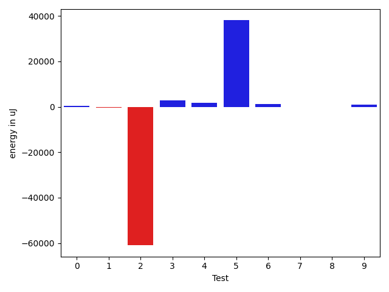

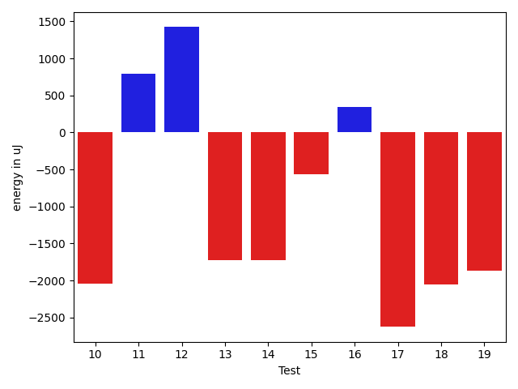

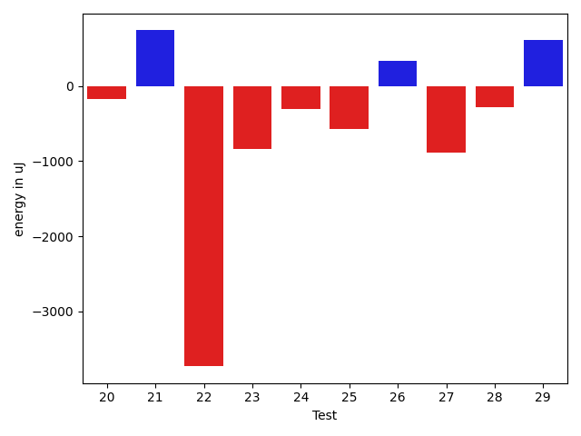

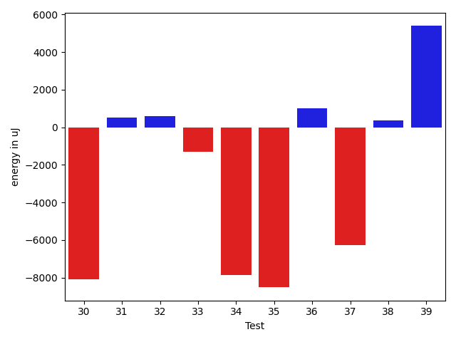

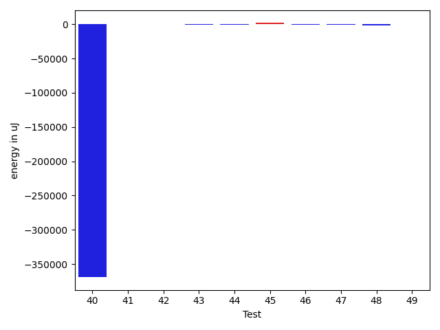

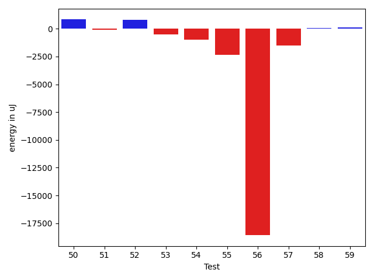

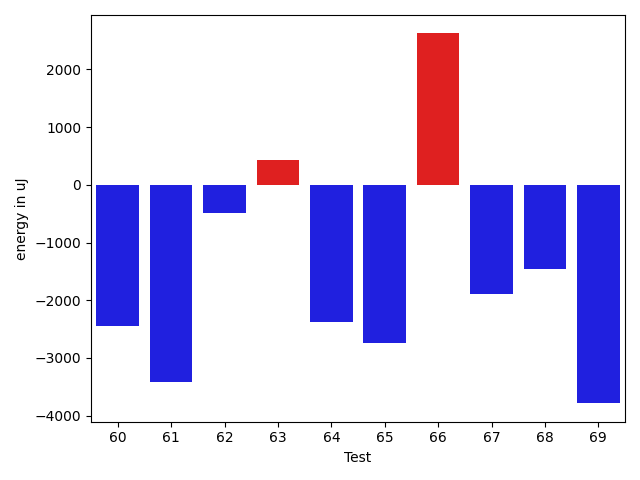

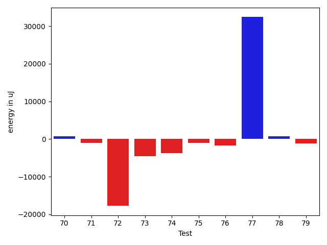

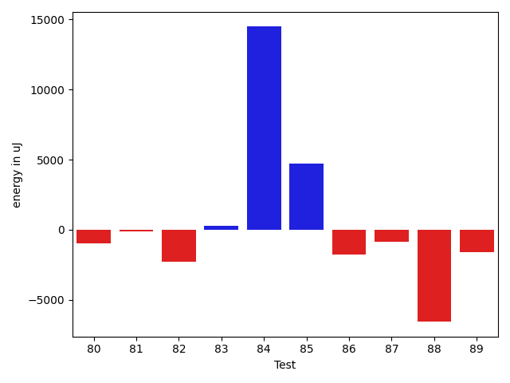

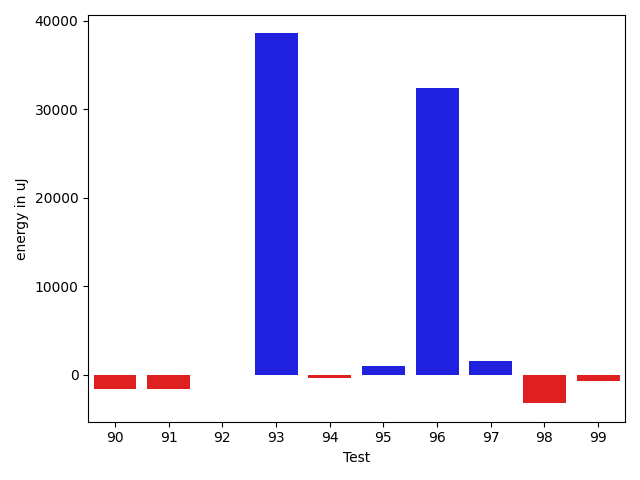

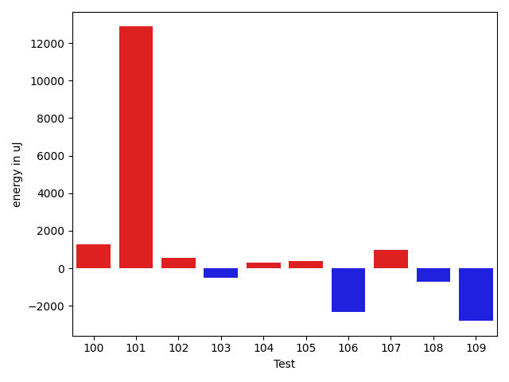

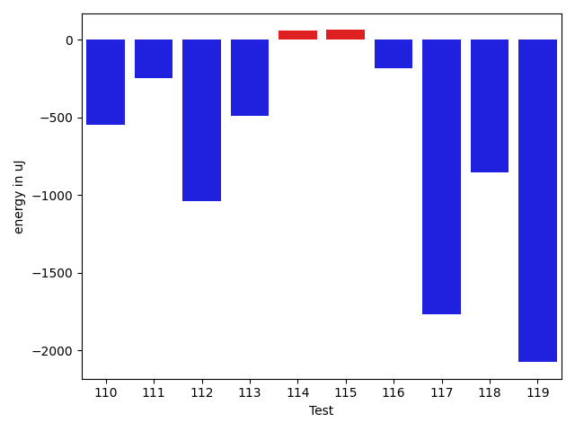

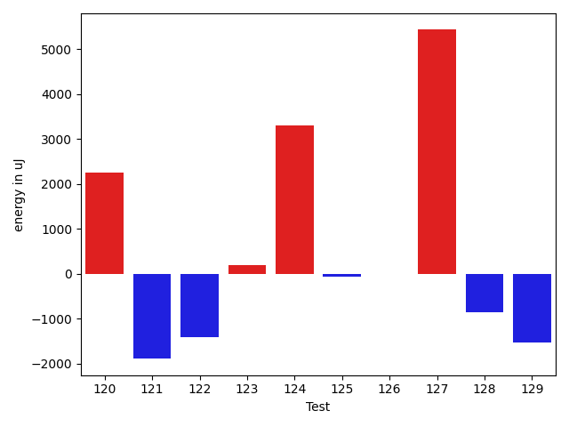

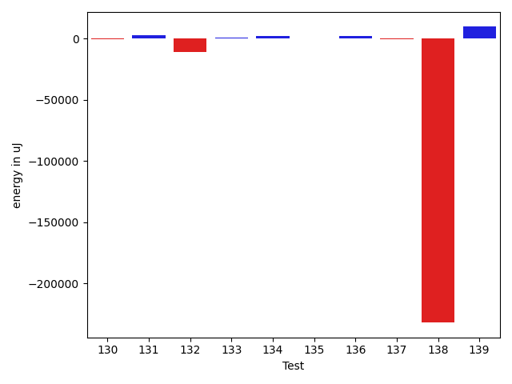

| ID | EnergyV1 | EnergyV2 | DeltaEnergy | σV1 | σV2 |
| --- | --- | --- | --- | --- | --- |
| 0 | 37919.11538461538 | 38221.86363636364 | 302.74825174825673 | 3761.141794996701 | 3971.2061517361167 |
| 1 | 87251.101010101 | 86885.9696969697 | -365.13131313130725 | 21259.309899522574 | 22025.683382216026 |
| 2 | 120007.41176470589 | 59025.20289855073 | -60982.20886615516 | 248290.28824651265 | 129565.49498826079 |
| 3 | 46339.67857142857 | 49220.833333333336 | 2881.1547619047633 | 14846.599506172575 | 18026.022822729246 |
| 4 | 43936.14864864865 | 45578.91780821918 | 1642.7691595705328 | 13887.341350136134 | 16514.210332236722 |
| 5 | 64489.21621621621 | 102522.80952380953 | 38033.59330759331 | 86365.19670910209 | 129216.32166167418 |
| 6 | 38078.1875 | 39229.42105263158 | 1151.23355263158 | 3840.1632813389265 | 4319.3410720153715 |
| 7 | 37771.0625 | 37513.11538461538 | -257.94711538461706 | 3265.173932364668 | 3643.1551448934088 |
| 8 | 38892.05263157895 | 38803.0 | -89.0526315789466 | 3077.816219568745 | 3286.2915015764097 |
| 9 | 40374.675 | 41291.32467532468 | 916.6496753246756 | 6725.945788093669 | 9895.17924795359 |
| 10 | 39364.4 | 37317.94736842105 | -2046.452631578948 | 3454.9202508885787 | 5222.410549219426 |
| 11 | 37775.666666666664 | 38570.58823529412 | 794.9215686274547 | 3519.128048568597 | 2419.098885677293 |
| 12 | 38771.76190476191 | 40195.0 | 1423.2380952380918 | 3830.987599944655 | 4541.586604798909 |
| 13 | 38394.0 | 36668.65217391304 | -1725.3478260869597 | 3462.2499765326015 | 4462.1173333304805 |
| 14 | 38962.545454545456 | 37237.09523809524 | -1725.4502164502192 | 3396.0284521678973 | 3958.1369463635033 |
| 15 | 38349.891304347824 | 37782.96153846154 | -566.9297658862852 | 4127.61466660968 | 3543.031931517338 |
| 16 | 39559.969696969696 | 39909.43103448276 | 349.4613375130648 | 3497.2810043409654 | 4527.290226721488 |
| 17 | 39542.142857142855 | 36916.692307692305 | -2625.45054945055 | 2467.177648857173 | 2723.5272204826706 |
| 18 | 40438.27272727273 | 38379.4375 | -2058.835227272728 | 4439.582762764764 | 3192.680769524844 |
| 19 | 40039.0 | 38175.4 | -1863.5999999999985 | 3263.3954914066626 | 4984.280179390667 |
| 20 | 38843.294117647056 | 38668.454545454544 | -174.8395721925117 | 3481.2382476676635 | 4930.706207276939 |
| 21 | 38272.933333333334 | 39016.625 | 743.6916666666657 | 3672.1654913083034 | 3697.161003307132 |
| 22 | 41820.625 | 38085.75 | -3734.875 | 3356.4159619116044 | 2879.257923059343 |
| 23 | 39019.23529411765 | 38186.07142857143 | -833.163865546223 | 3853.46143142243 | 3084.7855555077713 |
| 24 | 37594.5 | 37296.125 | -298.375 | 3196.34132251235 | 3376.714599188833 |
| 25 | 37605.125 | 37030.18518518518 | -574.9398148148175 | 3358.0284060802205 | 3405.7018533416276 |
| 26 | 38395.13333333333 | 38728.23809523809 | 333.1047619047604 | 4200.746185566983 | 3407.370245648351 |
| 27 | 39259.055555555555 | 38373.117647058825 | -885.9379084967295 | 4514.976528451631 | 4668.977062450465 |
| 28 | 38002.18518518518 | 37726.21428571428 | -275.9708994708999 | 4158.55306065692 | 3395.185050260178 |
| 29 | 40148.8 | 40766.083333333336 | 617.2833333333328 | 4135.189946463564 | 3721.507500514931 |
| 30 | 68394.9191919192 | 60306.25252525252 | -8088.6666666666715 | 30435.43136738368 | 23071.946847638832 |
| 31 | 38534.6 | 39044.541666666664 | 509.9416666666657 | 3716.181957332014 | 4280.354005795614 |
| 32 | 40200.93023255814 | 40801.41818181818 | 600.4879492600448 | 5228.636330713145 | 7599.875957578421 |
| 33 | 50344.395604395606 | 49059.04081632653 | -1285.3547880690749 | 19988.348772639627 | 16428.172872133444 |
| 34 | 54884.8431372549 | 47009.4406779661 | -7875.402459288802 | 35625.56161861958 | 23329.329232019776 |
| 35 | 90967.35353535354 | 82444.07070707071 | -8523.282828282827 | 53027.01160811472 | 45733.132153292936 |
| 36 | 56761.30303030303 | 57778.14432989691 | 1016.8412995938779 | 32627.94771526694 | 35410.24718395303 |
| 37 | 42198.5 | 35930.42105263158 | -6268.07894736842 | 15439.460375238878 | 4459.072210741761 |
| 38 | 35833.442307692305 | 36217.15 | 383.70769230769656 | 3741.349804823951 | 3870.504854343939 |
| 39 | 122280.84848484848 | 127678.45454545454 | 5397.606060606064 | 20161.024822819294 | 24198.716439068397 |
| 40 | 328272.3896103896 | 38582.49230769231 | -289689.8973026973 | 198040.8815314916 | 7793.404592490275 |
| 41 | 36277.01587301587 | 36511.74193548387 | 234.72606246799842 | 3864.036007801857 | 3438.3471457508517 |
| 42 | 37266.57894736842 | 37927.2 | 660.6210526315772 | 3164.022195606982 | 3227.0875868704484 |
| 43 | 74989.24242424243 | 73261.70707070707 | -1727.5353535353643 | 20318.634443741597 | 19260.372418047093 |
| 44 | 36208.46296296296 | 36187.76470588235 | -20.698257080613985 | 3773.773637998241 | 3876.163393165855 |
| 45 | 35732.92307692308 | 36755.08641975309 | 1022.163342830012 | 3401.5531662463827 | 3682.4674437139433 |
| 46 | 36408.96363636364 | 36463.490909090906 | 54.5272727272677 | 2875.104127528641 | 4059.46067565509 |
| 47 | 36132.642857142855 | 36712.6875 | 580.0446428571449 | 4203.980097260603 | 3554.867687740818 |
| 48 | 36051.94594594595 | 35194.416666666664 | -857.5292792792825 | 3792.595659296677 | 3963.8763741724115 |
| 49 | 36951.1282051282 | 36034.38888888889 | -916.7393162393128 | 4194.94738318206 | 3182.8939947944805 |
| 50 | 35626.2962962963 | 36454.04081632653 | 827.7445200302318 | 3794.438745544587 | 4032.5676934697153 |
| 51 | 36280.775 | 36166.90243902439 | -113.87256097561476 | 3726.503786979828 | 3179.792697682972 |
| 52 | 37048.23809523809 | 37854.63157894737 | 806.3934837092747 | 2666.6260813238086 | 3078.927704840494 |
| 53 | 36774.55172413793 | 36252.42307692308 | -522.1286472148495 | 2568.3094343892617 | 3908.8805024641497 |
| 54 | 36948.91428571429 | 35942.96428571428 | -1005.9500000000044 | 3653.264953603077 | 3993.699139914405 |
| 55 | 38597.88888888889 | 36274.22727272727 | -2323.6616161616184 | 3000.6708303475684 | 2996.8565035537754 |
| 56 | 53561.59259259259 | 34985.16 | -18576.432592592588 | 39701.41315355884 | 4037.2167807042515 |
| 57 | 41616.08 | 40084.51162790698 | -1531.5683720930247 | 13492.654036682332 | 9462.850117321317 |
| 58 | 35610.93548387097 | 35663.230769230766 | 52.29528535979625 | 4049.9713255494976 | 3548.3701383949865 |
| 59 | 35779.67567567567 | 35896.7 | 117.02432432432397 | 3077.404074989126 | 3651.737204400119 |
| 60 | 38228.28571428572 | 36345.32258064516 | -1882.9631336405582 | 3729.4205108754863 | 4040.836973243145 |
| 61 | 39147.7 | 36769.92 | -2377.779999999999 | 4343.784664322116 | 4506.479991478936 |
| 62 | 36578.875 | 37348.083333333336 | 769.2083333333358 | 2600.8558897745565 | 2827.6078069142163 |
| 63 | 37331.71428571428 | 37362.107142857145 | 30.39285714286234 | 4485.6040113833915 | 3815.5071404100936 |
| 64 | 37133.0 | 36847.76190476191 | -285.2380952380918 | 4274.272712663784 | 3452.5094517957846 |
| 65 | 38563.97222222222 | 36086.916666666664 | -2477.0555555555547 | 3199.3301684893627 | 3047.406191018118 |
| 66 | 35766.642857142855 | 37985.35 | 2218.7071428571435 | 3973.9499710551186 | 3746.763019928002 |
| 67 | 38557.0625 | 37386.583333333336 | -1170.4791666666642 | 3878.548640740986 | 4060.5378842860487 |
| 68 | 133899.9111111111 | 162739.9875 | 28840.076388888876 | 353205.03220058227 | 424320.3803977748 |
| 69 | 39547.0625 | 38803.71428571428 | -743.3482142857174 | 5319.209803494665 | 4131.33730387236 |
| 70 | 38677.125 | 39435.76470588235 | 758.6397058823495 | 4036.218540834354 | 2904.9397995060626 |
| 71 | 39362.625 | 38327.57692307692 | -1035.048076923078 | 2891.181676127427 | 3123.2082269195926 |
| 72 | 58729.425 | 40998.119047619046 | -17731.305952380957 | 120097.89403209518 | 14780.969420495978 |
| 73 | 43074.92592592593 | 38463.71428571428 | -4611.211640211644 | 17103.139274166893 | 3540.7773446069205 |
| 74 | 39539.09523809524 | 35778.53333333333 | -3760.561904761904 | 4238.1174718517905 | 4129.29109116269 |
| 75 | 43402.7037037037 | 42321.52 | -1081.183703703704 | 9478.867039718036 | 9300.681923902139 |
| 76 | 39146.68965517241 | 37489.07407407407 | -1657.61558109834 | 4315.569048692294 | 3662.822489161278 |
| 77 | 41186.48 | 73587.8 | 32401.32 | 8977.895847558048 | 179400.7479669283 |
| 78 | 37859.666666666664 | 38631.833333333336 | 772.1666666666715 | 5097.185548763015 | 3411.7697305715756 |
| 79 | 40020.94117647059 | 38927.47368421053 | -1093.4674922600607 | 3886.189884716032 | 3431.4005636554366 |
| 80 | 38069.73684210526 | 37126.619047619046 | -943.1177944862138 | 3805.9953099247214 | 4024.5058315535603 |
| 81 | 39268.5 | 39161.19047619047 | -107.30952380952658 | 3440.6567142044264 | 4463.737294060381 |
| 82 | 39693.95652173913 | 37409.333333333336 | -2284.6231884057925 | 3319.5162229805987 | 3901.70948289194 |
| 83 | 37632.89473684211 | 37919.0 | 286.1052631578932 | 4277.74553135468 | 2911.798161503186 |
| 84 | 95309.41489361702 | 109791.89690721649 | 14482.482013599467 | 44619.04137473377 | 67329.8209924545 |
| 85 | 41657.76119402985 | 46374.25 | 4716.488805970148 | 15863.852014846265 | 28094.643976030038 |
| 86 | 40091.84444444445 | 38300.25581395349 | -1791.5886304909582 | 3823.853855619459 | 3820.1216046212594 |
| 87 | 40955.53571428572 | 40097.15625 | -858.3794642857174 | 10449.692314274625 | 10800.609200437999 |
| 88 | 44014.529411764706 | 37456.09523809524 | -6558.43417366947 | 36996.98268107869 | 3414.0725237286492 |
| 89 | 38345.25 | 36759.26470588235 | -1585.9852941176505 | 4418.613111640025 | 3545.6008891617953 |
| 90 | 38826.76470588235 | 37189.06122448979 | -1637.7034813925566 | 4317.5712017164915 | 3600.761951157647 |
| 91 | 40021.42857142857 | 38363.6 | -1657.828571428574 | 3849.0709648585334 | 2885.6531738932176 |
| 92 | 39003.13432835821 | 38945.757575757576 | -57.37675260063406 | 5060.344938085116 | 3910.9745900811977 |
| 93 | 166351.75757575757 | 204895.0909090909 | 38543.33333333334 | 354406.2490903692 | 449836.03376799746 |
| 94 | 58622.92857142857 | 58294.07142857143 | -328.85714285714494 | 23078.231304585694 | 23672.37294790477 |
| 95 | 42647.68235294118 | 43689.6 | 1041.9176470588209 | 11999.690942306179 | 12665.912725303293 |
| 96 | 164458.58585858587 | 196862.55555555556 | 32403.969696969696 | 339692.0089341779 | 431868.3738572032 |
| 97 | 43167.26506024096 | 44670.25301204819 | 1502.9879518072266 | 13697.394506514456 | 12779.797862952006 |
| 98 | 53331.256410256414 | 50120.358024691355 | -3210.8983855650586 | 23645.0489263424 | 19856.91327093907 |
| 99 | 47200.193181818184 | 46444.84269662921 | -755.3504851889738 | 16083.330355920716 | 14308.243341717996 |
| 100 | 268233.32558139536 | 275986.1707317073 | 7752.845150311943 | 218338.0904280205 | 224526.57738672107 |
| 101 | 58037.4081632653 | 62404.31313131313 | 4366.904968047827 | 21391.970517680722 | 21071.030906616914 |
| 102 | 41093.649122807015 | 39999.470588235294 | -1094.1785345717217 | 8876.861153981212 | 7622.457707592539 |
| 103 | 47873.43396226415 | 46864.480769230766 | -1008.9531930333833 | 20821.12076216861 | 19166.611513344666 |
| 104 | 38317.10526315789 | 38661.782608695656 | 344.67734553776245 | 4016.073952122853 | 3653.2231267211955 |
| 105 | 37187.348837209305 | 38173.53846153846 | 986.1896243291558 | 4837.036411937131 | 4656.216995594082 |
| 106 | 41425.805555555555 | 43382.1935483871 | 1956.3879928315437 | 10211.36384083777 | 14632.793154791949 |
| 107 | 38623.75 | 38031.527272727275 | -592.222727272725 | 8938.32959669572 | 3946.4859022336473 |
| 108 | 44105.54945054945 | 43611.47777777778 | -494.07167277167173 | 13146.813289772015 | 12577.9659106513 |
| 109 | 81321.40404040404 | 84714.65656565657 | 3393.252525252523 | 27488.11857744471 | 34493.49900985197 |
| 110 | 41857.454545454544 | 39910.90243902439 | -1946.5521064301574 | 8950.422830170817 | 4199.296258142855 |
| 111 | 39833.6 | 40077.0625 | 243.46250000000146 | 4880.079238427726 | 4340.0313718444195 |
| 112 | 39427.30612244898 | 39294.583333333336 | -132.72278911564354 | 5590.205126403559 | 6877.322760650882 |
| 113 | 45182.42352941177 | 47570.76470588235 | 2388.3411764705816 | 12923.66659898805 | 16408.62104515368 |
| 114 | 61225.13114754098 | 62294.637681159424 | 1069.5065336184416 | 60234.6657339539 | 68396.53606004952 |
| 115 | 137451.96226415093 | 105644.0 | -31807.962264150934 | 305652.05677130143 | 205124.3619985203 |
| 116 | 38351.4 | 38659.53333333333 | 308.1333333333314 | 3275.966352086053 | 3187.9170182982425 |
| 117 | 40905.04761904762 | 39362.92307692308 | -1542.1245421245403 | 3655.0307206863527 | 5067.231158085 |
| 118 | 38883.92307692308 | 40247.89473684211 | 1363.9716599190288 | 4089.996604503734 | 4095.371596721775 |
| 119 | 40923.9 | 40295.89473684211 | -628.0052631578947 | 2907.174829624115 | 3988.666508400453 |
| 120 | 149105.0285714286 | 206666.22535211267 | 57561.196780684084 | 416275.6038584454 | 472164.195821756 |
| 121 | 39417.270833333336 | 38259.39473684211 | -1157.876096491229 | 3674.8407660490498 | 4410.280815378837 |
| 122 | 39325.86363636364 | 37416.62962962963 | -1909.234006734012 | 4115.4837923434125 | 4500.760052259059 |
| 123 | 38005.8275862069 | 38965.67924528302 | 959.851659076121 | 3609.673937600283 | 6057.374257639724 |
| 124 | 53844.16049382716 | 66980.94594594595 | 13136.785452118784 | 38086.58234668458 | 47100.23683130103 |
| 125 | 53955.666666666664 | 70447.42857142857 | 16491.7619047619 | 61645.69731540249 | 88827.36090281632 |
| 126 | 38342.68965517241 | 37913.53571428572 | -429.15394088669564 | 3300.112810020061 | 4733.773370172368 |
| 127 | 161146.61616161617 | 214644.65656565657 | 53498.040404040396 | 246287.59497809695 | 371536.4252654285 |
| 128 | 169076.1313131313 | 176082.24242424243 | 7006.111111111124 | 41961.16308959085 | 43091.13462646087 |
| 129 | 78622.67368421053 | 68728.79775280898 | -9893.875931401548 | 86679.92465671345 | 65199.79119687732 |
| 130 | 39505.37037037037 | 39044.529411764706 | -460.84095860566595 | 4913.261156926133 | 4303.748941913003 |
| 131 | 37241.86956521739 | 39859.5625 | 2617.692934782608 | 3755.925316481515 | 3958.2437862129905 |
| 132 | 66299.95454545454 | 55061.22727272727 | -11238.727272727272 | 82871.5860460833 | 38971.230896453744 |
| 133 | 40137.13043478261 | 40677.19565217391 | 540.065217391304 | 6450.606070644753 | 8579.478641856278 |
| 134 | 41478.44827586207 | 43456.97435897436 | 1978.5260831122869 | 10319.563354790333 | 12847.450535252228 |
| 135 | 39857.47368421053 | 39961.67647058824 | 104.20278637771116 | 6246.594923960119 | 6237.549126156128 |
| 136 | 50118.232558139534 | 51881.04255319149 | 1762.8099950519536 | 31857.157733068994 | 36852.4707026789 |
| 137 | 40161.117647058825 | 39585.57142857143 | -575.5462184873977 | 3987.9105082051788 | 3877.946751414042 |
| 138 | 398235.5294117647 | 166187.03703703705 | -232048.49237472765 | 554415.362634966 | 358746.91603221936 |
| 139 | 48931.06896551724 | 58419.757575757576 | 9488.688610240337 | 25340.27383425925 | 33283.79622144878 |

## Delta Duration per test method

| ID | DurationV1 | DurationsV2 | DeltaDuration |
| --- | --- | --- | --- |
| 0 | 861666.9423076923 | 816636.8409090909 | -45030.10139860131 |
| 1 | 2542661.8383838385 | 2506904.484848485 | -35757.35353535367 |
| 2 | 3546076.2647058824 | 1573347.0144927537 | -1972729.2502131287 |
| 3 | 1189430.107142857 | 1243650.8541666667 | 54220.7470238097 |
| 4 | 1241628.7027027027 | 1313273.4657534247 | 71644.76305072196 |
| 5 | 1610253.1621621621 | 2850646.595238095 | 1240393.433075933 |
| 6 | 487134.8125 | 396343.84210526315 | -90790.97039473685 |
| 7 | 550437.53125 | 530961.0769230769 | -19476.45432692312 |
| 8 | 368498.2105263158 | 419071.5833333333 | 50573.37280701753 |
| 9 | 1123726.275 | 1079872.3116883116 | -43853.963311688276 |
| 10 | 454633.55 | 420852.36842105264 | -33781.18157894735 |
| 11 | 383506.0 | 386606.70588235295 | 3100.7058823529514 |
| 12 | 420128.90476190473 | 414024.77777777775 | -6104.126984126982 |
| 13 | 465369.8 | 445825.3043478261 | -19544.49565217388 |
| 14 | 559289.6363636364 | 540324.619047619 | -18965.0173160173 |
| 15 | 618182.3695652174 | 570235.5769230769 | -47946.79264214053 |
| 16 | 1016173.5757575758 | 967771.0172413794 | -48402.55851619644 |
| 17 | 393773.21428571426 | 379258.3846153846 | -14514.829670329636 |
| 18 | 449098.1818181818 | 475611.375 | 26513.193181818177 |
| 19 | 467196.4666666667 | 473301.4 | 6104.933333333349 |
| 20 | 499679.23529411765 | 472663.7272727273 | -27015.508021390357 |
| 21 | 476102.8 | 400309.3125 | -75793.48749999999 |
| 22 | 433379.1875 | 444206.75 | 10827.5625 |
| 23 | 397460.29411764705 | 375655.14285714284 | -21805.151260504208 |
| 24 | 378667.95 | 385271.25 | 6603.299999999988 |
| 25 | 487164.0416666667 | 500855.8888888889 | 13691.84722222219 |
| 26 | 491382.86666666664 | 422425.04761904763 | -68957.819047619 |
| 27 | 448424.27777777775 | 450487.0588235294 | 2062.781045751646 |
| 28 | 565695.7777777778 | 546371.3214285715 | -19324.456349206273 |
| 29 | 427913.73333333334 | 425581.9166666667 | -2331.816666666651 |
| 30 | 2119525.202020202 | 1824477.1616161617 | -295048.04040404013 |
| 31 | 643361.5 | 551118.875 | -92242.625 |
| 32 | 1070591.6511627906 | 960528.7090909091 | -110062.9420718815 |
| 33 | 1462775.4065934066 | 1498949.336734694 | 36173.93014128739 |
| 34 | 1446447.862745098 | 1215752.9661016949 | -230694.89664340322 |
| 35 | 2682012.616161616 | 2386703.9292929294 | -295308.6868686867 |
| 36 | 1856886.7373737374 | 1811707.4948453608 | -45179.242528376635 |
| 37 | 816551.7619047619 | 560506.052631579 | -256045.7092731829 |
| 38 | 855341.4807692308 | 836957.3833333333 | -18384.09743589745 |
| 39 | 3674790.787878788 | 3751541.0808080807 | 76750.29292929266 |
| 40 | 9563394.064935066 | 964094.8615384615 | -8599299.203396603 |
| 41 | 852215.8571428572 | 875491.5322580645 | 23275.675115207327 |
| 42 | 391246.4210526316 | 390086.73333333334 | -1159.6877192982356 |
| 43 | 2281246.4343434344 | 2420054.606060606 | 138808.17171717156 |
| 44 | 735876.0555555555 | 752439.0980392157 | 16563.04248366016 |
| 45 | 1093204.217948718 | 1118689.87654321 | 25485.65859449189 |
| 46 | 811482.4181818182 | 780515.4 | -30967.018181818188 |
| 47 | 586037.1785714285 | 561248.34375 | -24788.83482142852 |
| 48 | 495850.13513513515 | 516726.0 | 20875.864864864852 |
| 49 | 635638.1025641026 | 654606.1944444445 | 18968.091880341875 |
| 50 | 651873.8333333334 | 718347.2040816327 | 66473.37074829929 |
| 51 | 579148.65 | 584033.9268292683 | 4885.276829268318 |
| 52 | 473138.5238095238 | 508648.05263157893 | 35509.528822055145 |
| 53 | 454190.1379310345 | 484921.3461538461 | 30731.208222811634 |
| 54 | 632415.8857142857 | 630601.3571428572 | -1814.5285714284983 |
| 55 | 528359.8888888889 | 508696.8181818182 | -19663.0707070707 |
| 56 | 1353701.1851851852 | 563789.08 | -789912.1051851852 |
| 57 | 994040.18 | 1069442.534883721 | 75402.35488372098 |
| 58 | 523226.87096774194 | 531983.0769230769 | 8756.205955334939 |
| 59 | 557066.2432432432 | 580343.3666666667 | 23277.1234234235 |
| 60 | 665450.5238095238 | 551958.5483870967 | -113491.97542242706 |
| 61 | 518276.0 | 468727.52 | -49548.47999999998 |
| 62 | 473678.6875 | 405870.25 | -67808.4375 |
| 63 | 512401.0 | 462356.0 | -50045.0 |
| 64 | 420235.1666666667 | 393596.3333333333 | -26638.833333333372 |
| 65 | 611983.9166666666 | 675330.7083333334 | 63346.791666666744 |
| 66 | 427005.0 | 399239.2 | -27765.79999999999 |
| 67 | 632418.59375 | 694602.5 | 62183.90625 |
| 68 | 3945233.1666666665 | 4696523.9375 | 751290.7708333335 |
| 69 | 506313.9375 | 509483.09523809527 | 3169.157738095266 |
| 70 | 434032.625 | 456689.76470588235 | 22657.13970588235 |
| 71 | 452388.2083333333 | 439170.6923076923 | -13217.516025641002 |
| 72 | 1202008.825 | 764185.1428571428 | -437823.6821428571 |
| 73 | 663039.1481481482 | 476314.2380952381 | -186724.9100529101 |
| 74 | 382691.2380952381 | 478547.06666666665 | 95855.82857142854 |
| 75 | 762663.1111111111 | 1028158.24 | 265495.12888888887 |
| 76 | 561764.4827586206 | 511087.5925925926 | -50676.89016602805 |
| 77 | 630934.28 | 1514579.3333333333 | 883645.0533333332 |
| 78 | 490890.0 | 479605.3888888889 | -11284.611111111124 |
| 79 | 495856.0 | 474620.3157894737 | -21235.68421052629 |
| 80 | 475675.15789473685 | 414863.8095238095 | -60811.34837092733 |
| 81 | 436672.5 | 550300.2857142857 | 113627.78571428568 |
| 82 | 438819.6956521739 | 421414.2916666667 | -17405.403985507204 |
| 83 | 439857.36842105264 | 451373.26666666666 | 11515.898245614022 |
| 84 | 2676217.2021276597 | 3248127.12371134 | 571909.9215836804 |
| 85 | 1114666.3582089553 | 1350207.75 | 235541.39179104473 |
| 86 | 728965.2444444444 | 715927.1627906977 | -13038.081653746776 |
| 87 | 909988.2142857143 | 1044555.0 | 134566.78571428568 |
| 88 | 961748.8235294118 | 832135.9047619047 | -129612.91876750707 |
| 89 | 566533.7857142857 | 598313.5294117647 | 31779.743697479018 |
| 90 | 827883.7058823529 | 976875.3469387755 | 148991.6410564226 |
| 91 | 486749.09523809527 | 536112.5 | 49363.404761904734 |
| 92 | 1028679.8507462686 | 1026395.8787878788 | -2283.971958389855 |
| 93 | 4738750.828282828 | 5795894.323232323 | 1057143.4949494945 |
| 94 | 1718639.0714285714 | 1707422.3775510204 | -11216.693877551006 |
| 95 | 1237985.4588235293 | 1190902.325 | -47083.13382352935 |
| 96 | 4764508.6161616165 | 5535138.080808081 | 770629.4646464642 |
| 97 | 1301525.0120481928 | 1244681.7590361445 | -56843.25301204831 |
| 98 | 1442111.2948717948 | 1483714.3703703703 | 41603.07549857558 |
| 99 | 1347378.4659090908 | 1375632.5056179776 | 28254.03970888676 |
| 100 | 7602346.848837209 | 7933018.048780488 | 330671.1999432789 |
| 101 | 1819185.9387755103 | 1882246.5353535353 | 63060.596578025026 |
| 102 | 914133.3684210526 | 972589.0392156863 | 58455.67079463368 |
| 103 | 1138862.1132075472 | 1139432.1346153845 | 570.021407837281 |
| 104 | 571174.2631578947 | 549192.9130434783 | -21981.350114416447 |
| 105 | 821228.9302325582 | 831627.5897435897 | 10398.659511031583 |
| 106 | 903124.5 | 1059215.1612903227 | 156090.66129032266 |
| 107 | 847894.7083333334 | 822287.5636363636 | -25607.14469696977 |
| 108 | 1374967.4395604397 | 1343787.2333333334 | -31180.206227106275 |
| 109 | 2442076.767676768 | 2531691.9494949495 | 89615.18181818165 |
| 110 | 951330.0681818182 | 932058.512195122 | -19271.555986696272 |
| 111 | 881430.9666666667 | 791413.03125 | -90017.93541666667 |
| 112 | 834715.2857142857 | 950068.0833333334 | 115352.79761904769 |
| 113 | 1335813.0352941176 | 1454653.1529411764 | 118840.1176470588 |
| 114 | 1693891.6065573771 | 1689650.8260869565 | -4240.780470420606 |
| 115 | 3586840.2075471696 | 3038315.375 | -548524.8325471696 |
| 116 | 440214.45 | 398423.6 | -41790.850000000035 |
| 117 | 447971.3333333333 | 626484.3461538461 | 178513.0128205128 |
| 118 | 604405.1538461539 | 763826.3684210526 | 159421.2145748987 |
| 119 | 423883.1 | 388808.84210526315 | -35074.25789473683 |
| 120 | 4098991.7285714285 | 6190933.816901408 | 2091942.0883299797 |
| 121 | 748151.0 | 872641.447368421 | 124490.44736842101 |
| 122 | 653260.6818181818 | 674827.0370370371 | 21566.355218855315 |
| 123 | 824343.775862069 | 919311.3773584906 | 94967.60149642162 |
| 124 | 1499589.9012345679 | 1880874.3243243243 | 381284.4230897564 |
| 125 | 1472956.36 | 2008904.5714285714 | 535948.2114285713 |
| 126 | 579974.7931034482 | 665073.1428571428 | 85098.34975369461 |
| 127 | 4602714.242424242 | 6029179.04040404 | 1426464.7979797982 |
| 128 | 4745259.333333333 | 4789975.292929293 | 44715.95959595963 |
| 129 | 2420197.389473684 | 2120167.6516853934 | -300029.7377882907 |
| 130 | 509779.48148148146 | 572656.8823529412 | 62877.400871459744 |
| 131 | 526095.2173913043 | 438323.8125 | -87771.40489130432 |
| 132 | 2041409.0795454546 | 1543429.7727272727 | -497979.3068181819 |
| 133 | 929086.1521739131 | 956747.8478260869 | 27661.695652173832 |
| 134 | 1110401.103448276 | 1170560.3333333333 | 60159.22988505731 |
| 135 | 836553.5 | 938570.3529411765 | 102016.8529411765 |
| 136 | 1298015.2790697673 | 1284630.744680851 | -13384.534388916334 |
| 137 | 413019.76470588235 | 439945.28571428574 | 26925.52100840339 |
| 138 | 11137608.176470589 | 4540983.851851852 | -6596624.324618737 |
| 139 | 1276773.3793103448 | 1610237.7575757576 | 333464.37826541276 |

## Misc.

| ID | Test Class | Test Method |
| --- | --- | --- |
| 0 | com.google.gson.functional.CustomTypeAdaptersTest | testCustomTypeAdapterAppliesToSubClassesSerializedAsBaseClass |
| 1 | com.google.gson.functional.CustomTypeAdaptersTest | testCustomTypeAdapterDoesNotAppliesToSubClasses |
| 2 | com.google.gson.functional.CustomTypeAdaptersTest | testCustomSerializers |
| 3 | com.google.gson.functional.CustomTypeAdaptersTest | testEnsureCustomSerializerNotInvokedForNullValues |
| 4 | com.google.gson.functional.ReadersWritersTest | testReadWriteTwoObjects |
| 5 | com.google.gson.functional.ReadersWritersTest | testWriterForSerialization |
| 6 | com.google.gson.functional.PrimitiveTest | testBigDecimalPreservePrecisionDeserialization |
| 7 | com.google.gson.functional.PrimitiveTest | testBigIntegerDeserialization |
| 8 | com.google.gson.functional.PrimitiveTest | testDeserializeJsonArrayAsByteWrapper |
| 9 | com.google.gson.functional.PrimitiveTest | testValueVeryCloseToZeroIsZero |
| 10 | com.google.gson.functional.PrimitiveTest | testDeserializingBigDecimalAsBigIntegerFails |
| 11 | com.google.gson.functional.PrimitiveTest | testDeserializeJsonArrayAsBigDecimal |
| 12 | com.google.gson.functional.PrimitiveTest | testSmallValueForBigIntegerDeserialization |
| 13 | com.google.gson.functional.PrimitiveTest | testBigDecimalNoFractAsStringRepresentationDeserialization |
| 14 | com.google.gson.functional.PrimitiveTest | testPrimitiveBooleanAutoboxedInASingleElementArraySerialization |
| 15 | com.google.gson.functional.PrimitiveTest | testDeserializingNonZeroDecimalPointValuesAsIntegerFails |
| 16 | com.google.gson.functional.PrimitiveTest | testByteDeserialization |
| 17 | com.google.gson.functional.PrimitiveTest | testDeserializeJsonArrayAsBigInteger |
| 18 | com.google.gson.functional.PrimitiveTest | testBigDecimalInfinityDeserializationNotSupported |
| 19 | com.google.gson.functional.PrimitiveTest | testPrimitiveBooleanAutoboxedSerialization |
| 20 | com.google.gson.functional.PrimitiveTest | testBigDecimalDeserialization |
| 21 | com.google.gson.functional.PrimitiveTest | testSmallValueForBigDecimalDeserialization |
| 22 | com.google.gson.functional.PrimitiveTest | testBigDecimalNegativeInfinityDeserializationNotSupported |
| 23 | com.google.gson.functional.PrimitiveTest | testDeserializeJsonObjectAsBigDecimal |
| 24 | com.google.gson.functional.PrimitiveTest | testDeserializeJsonObjectAsBigInteger |
| 25 | com.google.gson.functional.PrimitiveTest | testBadValueForBigIntegerDeserialization |
| 26 | com.google.gson.functional.PrimitiveTest | testBigDecimalAsStringRepresentationDeserialization |
| 27 | com.google.gson.functional.PrimitiveTest | testBigDecimalNaNDeserializationNotSupported |
| 28 | com.google.gson.functional.PrimitiveTest | testDeserializingBigIntegerAsBigDecimal |
| 29 | com.google.gson.functional.PrimitiveTest | testDeserializeJsonObjectAsBytePrimitive |
| 30 | com.google.gson.functional.MapTest | testInterfaceTypeMapWithSerializer |
| 31 | com.google.gson.functional.MapTest | testWriteMapsWithEmptyStringKey |
| 32 | com.google.gson.functional.CollectionTest | testRawCollectionSerialization |
| 33 | com.google.gson.functional.CollectionTest | testWildcardCollectionField |
| 34 | com.google.gson.functional.CollectionTest | testCollectionOfBagOfPrimitivesSerialization |
| 35 | com.google.gson.functional.InheritanceTest | testSubInterfacesOfCollectionSerialization |
| 36 | com.google.gson.functional.InheritanceTest | testSubClassSerialization |
| 37 | com.google.gson.functional.DefaultTypeAdaptersTest | testUrlDeserialization |
| 38 | com.google.gson.functional.DefaultTypeAdaptersTest | testDefaultJavaSqlTimestampSerialization |
| 39 | com.google.gson.functional.DefaultTypeAdaptersTest | testDefaultDateDeserializationUsingBuilder |
| 40 | com.google.gson.functional.DefaultTypeAdaptersTest | testDefaultDateSerialization |
| 41 | com.google.gson.functional.DefaultTypeAdaptersTest | testDefaultJavaSqlDateDeserialization |
| 42 | com.google.gson.functional.DefaultTypeAdaptersTest | testStringBufferSerialization |
| 43 | com.google.gson.functional.DefaultTypeAdaptersTest | testDefaultDateDeserialization |
| 44 | com.google.gson.functional.DefaultTypeAdaptersTest | testDefaultDateSerializationUsingBuilder |
| 45 | com.google.gson.functional.DefaultTypeAdaptersTest | testDefaultJavaSqlTimestampDeserialization |
| 46 | com.google.gson.functional.DefaultTypeAdaptersTest | testBitSetDeserialization |
| 47 | com.google.gson.functional.DefaultTypeAdaptersTest | testDefaultJavaSqlDateSerialization |
| 48 | com.google.gson.functional.DefaultTypeAdaptersTest | testDefaultGregorianCalendarDeserialization |
| 49 | com.google.gson.functional.DefaultTypeAdaptersTest | testBigIntegerFieldDeserialization |
| 50 | com.google.gson.functional.DefaultTypeAdaptersTest | testDefaultJavaSqlTimeDeserialization |
| 51 | com.google.gson.functional.DefaultTypeAdaptersTest | testDefaultJavaSqlTimeSerialization |
| 52 | com.google.gson.functional.DefaultTypeAdaptersTest | testBitSetSerialization |
| 53 | com.google.gson.functional.DefaultTypeAdaptersTest | testDefaultGregorianCalendarSerialization |
| 54 | com.google.gson.functional.DefaultTypeAdaptersTest | testBadValueForBigDecimalDeserialization |
| 55 | com.google.gson.functional.DefaultTypeAdaptersTest | testLocaleSerializationWithLanguageCountryVariant |
| 56 | com.google.gson.functional.DefaultTypeAdaptersTest | testJsonObjectSerialization |
| 57 | com.google.gson.functional.DefaultTypeAdaptersTest | testBigDecimalFieldDeserialization |
| 58 | com.google.gson.functional.DefaultTypeAdaptersTest | testDefaultCalendarSerialization |
| 59 | com.google.gson.functional.DefaultTypeAdaptersTest | testDefaultCalendarDeserialization |
| 60 | com.google.gson.functional.DefaultTypeAdaptersTest | testUuidSerialization |
| 61 | com.google.gson.functional.DefaultTypeAdaptersTest | testUuidDeserialization |
| 62 | com.google.gson.functional.DefaultTypeAdaptersTest | testLocaleSerializationWithLanguageCountry |
| 63 | com.google.gson.functional.DefaultTypeAdaptersTest | testLocaleSerializationWithLanguage |
| 64 | com.google.gson.functional.DefaultTypeAdaptersTest | testStringBuilderSerialization |
| 65 | com.google.gson.functional.DefaultTypeAdaptersTest | testJsonArrayDeerialization |
| 66 | com.google.gson.functional.DefaultTypeAdaptersTest | testStringBufferDeserialization |
| 67 | com.google.gson.JsonParserTest | testParseUnquotedStringArrayFails |
| 68 | com.google.gson.JsonParserTest | testReadWriteTwoObjects |
| 69 | com.google.gson.JsonParserTest | testParseMixedArray |
| 70 | com.google.gson.internal.bind.JsonElementReaderTest | testEmptyArray |
| 71 | com.google.gson.internal.bind.JsonElementReaderTest | testSkipValue |
| 72 | com.google.gson.internal.bind.JsonElementReaderTest | testWrongType |
| 73 | com.google.gson.internal.bind.JsonElementReaderTest | testLenientNansAndInfinities |
| 74 | com.google.gson.internal.bind.JsonElementReaderTest | testStrings |
| 75 | com.google.gson.internal.bind.JsonElementReaderTest | testNumbers |
| 76 | com.google.gson.internal.bind.JsonElementReaderTest | testStrictNansAndInfinities |
| 77 | com.google.gson.internal.bind.JsonElementReaderTest | testArray |
| 78 | com.google.gson.internal.bind.JsonElementReaderTest | testEarlyClose |
| 79 | com.google.gson.internal.bind.JsonElementReaderTest | testNulls |
| 80 | com.google.gson.internal.bind.JsonElementReaderTest | testStringsFromNumbers |
| 81 | com.google.gson.internal.bind.JsonElementReaderTest | testBooleans |
| 82 | com.google.gson.internal.bind.JsonElementReaderTest | testNestedArrays |
| 83 | com.google.gson.internal.bind.JsonElementReaderTest | testNumbersFromStrings |
| 84 | com.google.gson.functional.EnumTest | testEnumSubclass |
| 85 | com.google.gson.functional.EnumTest | testClassWithEnumFieldSerialization |
| 86 | com.google.gson.functional.EnumTest | testTopLevelEnumSerialization |
| 87 | com.google.gson.functional.EnumTest | testCollectionOfEnumsSerialization |
| 88 | com.google.gson.functional.EnumTest | testEnumSubclassAsParameterizedType |
| 89 | com.google.gson.functional.EnumTest | testClassWithEnumFieldDeserialization |
| 90 | com.google.gson.functional.EnumTest | testCollectionOfEnumsDeserialization |
| 91 | com.google.gson.functional.EnumTest | testTopLevelEnumDeserialization |
| 92 | com.google.gson.functional.TypeVariableTest | testBasicTypeVariables |
| 93 | com.google.gson.functional.TypeVariableTest | testAdvancedTypeVariables |
| 94 | com.google.gson.functional.TypeVariableTest | testTypeVariablesViaTypeParameter |
| 95 | com.google.gson.functional.MapAsArrayTypeAdapterTest | testMultipleEnableComplexKeyRegistrationHasNoEffect |
| 96 | com.google.gson.functional.MapAsArrayTypeAdapterTest | testSerializeComplexMapWithTypeAdapter |
| 97 | com.google.gson.functional.MapAsArrayTypeAdapterTest | testMapWithTypeVariableSerialization |
| 98 | com.google.gson.functional.ArrayTest | testObjectArrayWithNonPrimitivesSerialization |
| 99 | com.google.gson.functional.ObjectTest | testArrayOfObjectsAsFields |
| 100 | com.google.gson.functional.ObjectTest | testDateAsMapObjectField |
| 101 | com.google.gson.functional.ObjectTest | testArrayOfArraysSerialization |
| 102 | com.google.gson.functional.ObjectTest | testNestedSerialization |
| 103 | com.google.gson.functional.ObjectTest | testBagOfPrimitiveWrappersSerialization |
| 104 | com.google.gson.functional.ObjectTest | testJsonObjectSerialization |
| 105 | com.google.gson.functional.ObjectTest | testNullFieldsSerialization |
| 106 | com.google.gson.functional.ObjectTest | testBagOfPrimitivesSerialization |
| 107 | com.google.gson.functional.ObjectTest | testArrayOfObjectsSerialization |
| 108 | com.google.gson.functional.ParameterizedTypesTest | testParameterizedTypeWithCustomSerializer |
| 109 | com.google.gson.functional.ParameterizedTypesTest | testTypesWithMultipleParametersSerialization |
| 110 | com.google.gson.functional.UncategorizedTest | testGsonInstanceReusableForSerializationAndDeserialization |
| 111 | com.google.gson.functional.UncategorizedTest | testStaticFieldsAreNotSerialized |
| 112 | com.google.gson.functional.EscapingTest | testGsonDoubleDeserialization |
| 113 | com.google.gson.functional.EscapingTest | testGsonAcceptsEscapedAndNonEscapedJsonDeserialization |
| 114 | com.google.gson.functional.EscapingTest | testEscapingObjectFields |
| 115 | com.google.gson.functional.SecurityTest | testNonExecutableJsonSerialization |
| 116 | com.google.gson.internal.bind.JsonElementWriterTest | testSerializeNullsTrue |
| 117 | com.google.gson.internal.bind.JsonElementWriterTest | testObject |
| 118 | com.google.gson.internal.bind.JsonElementWriterTest | testNestedObject |
| 119 | com.google.gson.internal.bind.JsonElementWriterTest | testSerializeNullsFalse |
| 120 | com.google.gson.functional.CustomSerializerTest | testSubClassSerializerInvokedForBaseClassFieldsHoldingSubClassInstances |
| 121 | com.google.gson.functional.CustomSerializerTest | testBaseClassSerializerInvokedForBaseClassFieldsHoldingSubClassInstances |
| 122 | com.google.gson.functional.CustomSerializerTest | testBaseClassSerializerInvokedForBaseClassFields |
| 123 | com.google.gson.functional.CustomSerializerTest | testSubClassSerializerInvokedForBaseClassFieldsHoldingArrayOfSubClassInstances |
| 124 | com.google.gson.functional.JsonTreeTest | testJsonTreeToString |
| 125 | com.google.gson.functional.JsonTreeTest | testToJsonTreeObjectType |
| 126 | com.google.gson.functional.JsonTreeTest | testToJsonTree |
| 127 | com.google.gson.functional.TypeHierarchyAdapterTest | testTypeHierarchy |
| 128 | com.google.gson.DefaultInetAddressTypeAdapterTest | testInetAddressSerializationAndDeserialization |
| 129 | com.google.gson.functional.PrintFormattingTest | testCompactFormattingLeavesNoWhiteSpace |
| 130 | com.google.gson.functional.PrintFormattingTest | testJsonObjectWithNullValues |
| 131 | com.google.gson.functional.PrintFormattingTest | testJsonObjectWithNullValuesSerialized |
| 132 | com.google.gson.functional.PrettyPrintingTest | testPrettyPrintList |
| 133 | com.google.gson.functional.PrettyPrintingTest | testPrettyPrintArrayOfObjects |
| 134 | com.google.gson.GsonTypeAdapterTest | testDefaultTypeAdapterThrowsParseException |
| 135 | com.google.gson.functional.NullObjectAndFieldTest | testCustomSerializationOfNulls |
| 136 | com.google.gson.functional.VersioningTest | testVersionedGsonWithUnversionedClassesSerialization |
| 137 | com.google.gson.JsonObjectTest | testWritePropertyWithEmptyStringName |
| 138 | com.google.gson.JsonObjectTest | testPropertyWithQuotes |
| 139 | com.google.gson.functional.PrimitiveCharacterTest | testPrimitiveCharacterAutoboxedSerialization |

| Test | IterationV1 | IterationV2 | DeltaIteration |
| --- | --- | --- | --- |
| 0 | 52 | 44 | -8 |
| 1 | 99 | 99 | 0 |
| 2 | 68 | 69 | 1 |
| 3 | 56 | 48 | -8 |
| 4 | 74 | 73 | -1 |
| 5 | 37 | 42 | 5 |
| 6 | 16 | 19 | 3 |
| 7 | 32 | 26 | -6 |
| 8 | 19 | 12 | -7 |
| 9 | 80 | 77 | -3 |
| 10 | 20 | 19 | -1 |
| 11 | 12 | 17 | 5 |
| 12 | 21 | 9 | -12 |
| 13 | 20 | 23 | 3 |
| 14 | 22 | 21 | -1 |
| 15 | 46 | 26 | -20 |
| 16 | 66 | 58 | -8 |
| 17 | 14 | 13 | -1 |
| 18 | 11 | 16 | 5 |
| 19 | 15 | 15 | 0 |
| 20 | 17 | 22 | 5 |
| 21 | 15 | 16 | 1 |
| 22 | 16 | 12 | -4 |
| 23 | 17 | 14 | -3 |
| 24 | 20 | 16 | -4 |
| 25 | 24 | 27 | 3 |
| 26 | 15 | 21 | 6 |
| 27 | 18 | 17 | -1 |
| 28 | 27 | 28 | 1 |
| 29 | 15 | 12 | -3 |
| 30 | 99 | 99 | 0 |
| 31 | 20 | 24 | 4 |
| 32 | 43 | 55 | 12 |
| 33 | 91 | 98 | 7 |
| 34 | 51 | 59 | 8 |
| 35 | 99 | 99 | 0 |
| 36 | 99 | 97 | -2 |
| 37 | 42 | 19 | -23 |
| 38 | 52 | 60 | 8 |
| 39 | 99 | 99 | 0 |
| 40 | 77 | 65 | -12 |
| 41 | 63 | 62 | -1 |
| 42 | 19 | 15 | -4 |
| 43 | 99 | 99 | 0 |
| 44 | 54 | 51 | -3 |
| 45 | 78 | 81 | 3 |
| 46 | 55 | 55 | 0 |
| 47 | 28 | 32 | 4 |
| 48 | 37 | 24 | -13 |
| 49 | 39 | 36 | -3 |
| 50 | 54 | 49 | -5 |
| 51 | 40 | 41 | 1 |
| 52 | 21 | 19 | -2 |
| 53 | 29 | 26 | -3 |
| 54 | 35 | 28 | -7 |
| 55 | 18 | 22 | 4 |
| 56 | 27 | 25 | -2 |
| 57 | 50 | 43 | -7 |
| 58 | 31 | 26 | -5 |
| 59 | 37 | 30 | -7 |
| 60 | 21 | 31 | 10 |
| 61 | 10 | 25 | 15 |
| 62 | 16 | 12 | -4 |
| 63 | 14 | 28 | 14 |
| 64 | 18 | 21 | 3 |
| 65 | 36 | 24 | -12 |
| 66 | 14 | 20 | 6 |
| 67 | 32 | 24 | -8 |
| 68 | 90 | 80 | -10 |
| 69 | 16 | 21 | 5 |
| 70 | 16 | 17 | 1 |
| 71 | 24 | 26 | 2 |
| 72 | 40 | 42 | 2 |
| 73 | 27 | 21 | -6 |
| 74 | 21 | 15 | -6 |
| 75 | 27 | 25 | -2 |
| 76 | 29 | 27 | -2 |
| 77 | 25 | 30 | 5 |
| 78 | 27 | 18 | -9 |
| 79 | 17 | 19 | 2 |
| 80 | 19 | 21 | 2 |
| 81 | 16 | 21 | 5 |
| 82 | 23 | 24 | 1 |
| 83 | 19 | 15 | -4 |
| 84 | 94 | 97 | 3 |
| 85 | 67 | 84 | 17 |
| 86 | 45 | 43 | -2 |
| 87 | 56 | 64 | 8 |
| 88 | 51 | 63 | 12 |
| 89 | 28 | 34 | 6 |
| 90 | 51 | 49 | -2 |
| 91 | 21 | 20 | -1 |
| 92 | 67 | 66 | -1 |
| 93 | 99 | 99 | 0 |
| 94 | 98 | 98 | 0 |
| 95 | 85 | 80 | -5 |
| 96 | 99 | 99 | 0 |
| 97 | 83 | 83 | 0 |
| 98 | 78 | 81 | 3 |
| 99 | 88 | 89 | 1 |
| 100 | 86 | 82 | -4 |
| 101 | 98 | 99 | 1 |
| 102 | 57 | 51 | -6 |
| 103 | 53 | 52 | -1 |
| 104 | 19 | 23 | 4 |
| 105 | 43 | 39 | -4 |
| 106 | 36 | 31 | -5 |
| 107 | 48 | 55 | 7 |
| 108 | 91 | 90 | -1 |
| 109 | 99 | 99 | 0 |
| 110 | 44 | 41 | -3 |
| 111 | 30 | 32 | 2 |
| 112 | 49 | 36 | -13 |
| 113 | 85 | 85 | 0 |
| 114 | 61 | 69 | 8 |
| 115 | 53 | 40 | -13 |
| 116 | 20 | 15 | -5 |
| 117 | 21 | 26 | 5 |
| 118 | 13 | 19 | 6 |
| 119 | 10 | 19 | 9 |
| 120 | 70 | 71 | 1 |
| 121 | 48 | 38 | -10 |
| 122 | 44 | 27 | -17 |
| 123 | 58 | 53 | -5 |
| 124 | 81 | 74 | -7 |
| 125 | 75 | 70 | -5 |
| 126 | 29 | 28 | -1 |
| 127 | 99 | 99 | 0 |
| 128 | 99 | 99 | 0 |
| 129 | 95 | 89 | -6 |
| 130 | 27 | 17 | -10 |
| 131 | 23 | 16 | -7 |
| 132 | 88 | 88 | 0 |
| 133 | 46 | 46 | 0 |
| 134 | 29 | 39 | 10 |
| 135 | 38 | 34 | -4 |
| 136 | 43 | 47 | 4 |
| 137 | 17 | 21 | 4 |
| 138 | 17 | 27 | 10 |
| 139 | 29 | 33 | 4 |

| Time Label | Time (s) |
| --- | --- |
| Selection | 29.010130882263184 |
| Injection | 15.586570262908936 |
| Total | 1204.8015127182007 |

