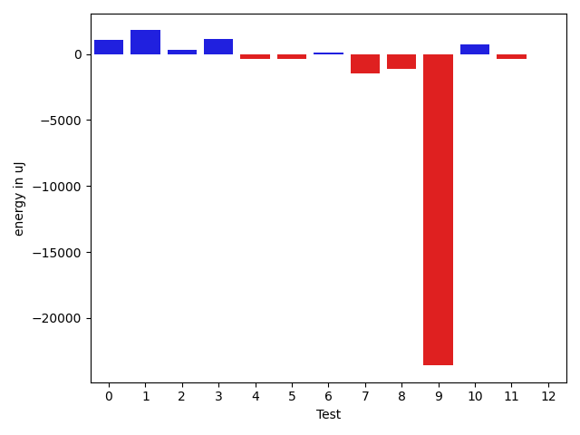
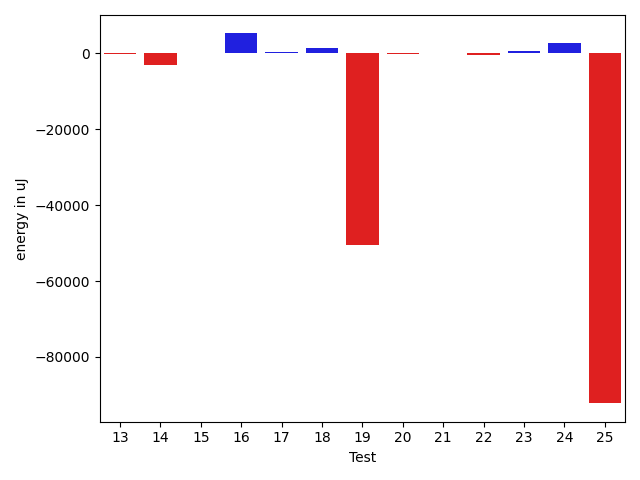
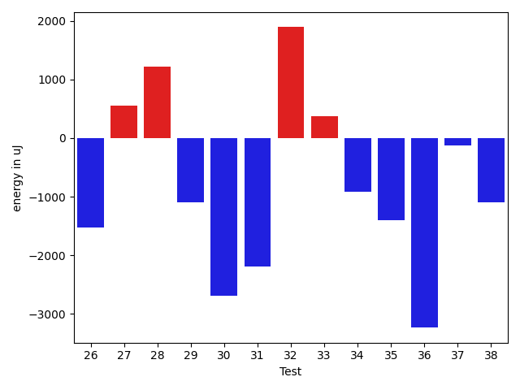
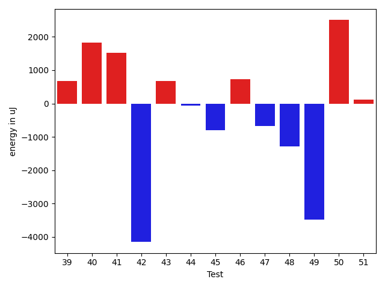
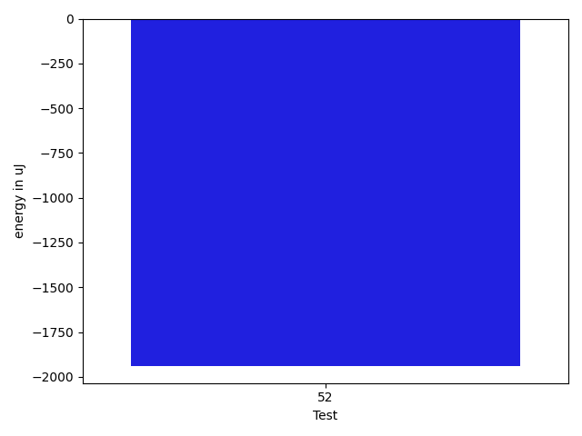

# gson 38ce53

https://github.com/google/gson/commit/38ce53

## Delta Energy per test method

| ID | EnergyV1 | EnergyV2 | DeltaEnergy | σV1 | σV2 |
| --- | --- | --- | --- | --- | --- |
| 0 | 35787.46551724138 | 36872.38983050847 | 1084.9243132670963 | 5370.20989834282 | 7875.4972982974095 |
| 1 | 39358.05194805195 | 41154.34210526316 | 1796.2901572112096 | 10676.68987433025 | 10346.034848843798 |
| 2 | 35836.28571428572 | 36130.0 | 293.7142857142826 | 3882.120932459519 | 3914.0853078467067 |
| 3 | 44174.125 | 45339.427083333336 | 1165.3020833333358 | 15213.430815983236 | 15316.80790337366 |
| 4 | 36193.76271186441 | 35793.89655172414 | -399.86616014027095 | 3967.1532693278195 | 3899.1588203790616 |
| 5 | 36604.385714285716 | 36248.5 | -355.88571428571595 | 5839.497841162266 | 5641.114689696327 |
| 6 | 37819.82142857143 | 37906.84482758621 | 87.02339901478263 | 5061.632832633948 | 4139.140868718281 |
| 7 | 38443.50632911392 | 36988.14492753623 | -1455.3614015776911 | 5888.894989667164 | 3764.6606955885222 |
| 8 | 47190.64367816092 | 46054.2962962963 | -1136.3473818646235 | 26654.835565689657 | 23574.726451128587 |
| 9 | 113755.17567567568 | 90161.40277777778 | -23593.7728978979 | 252406.24901579975 | 203881.50949473478 |
| 10 | 87851.57575757576 | 88604.30303030302 | 752.7272727272648 | 20468.6357384105 | 20549.504994138722 |
| 11 | 37218.357142857145 | 36841.59090909091 | -376.7662337662332 | 3222.6648601771185 | 3971.560909757945 |
| 12 | 44278.5 | 44225.22352941176 | -53.27647058823641 | 13716.932046300313 | 14328.790053904 |
| 13 | 37401.61403508772 | 37375.48275862069 | -26.131276467029238 | 4475.941895403814 | 4188.187202454802 |
| 14 | 46764.96923076923 | 43778.03278688525 | -2986.936443883984 | 17087.793977410824 | 10791.878137591711 |
| 15 | 36185.5 | 36173.36666666667 | -12.133333333331393 | 4108.4623727353055 | 3997.9205635207686 |
| 16 | 70728.40404040404 | 75980.57575757576 | 5252.171717171717 | 24423.874816021118 | 28014.694417661744 |
| 17 | 39476.132352941175 | 39847.43076923077 | 371.2984162895955 | 7649.841084286369 | 5981.1301195297165 |
| 18 | 37963.730769230766 | 39350.08888888889 | 1386.3581196581217 | 4083.654863342323 | 4180.2566897379365 |
| 19 | 189070.5 | 138495.01204819276 | -50575.48795180724 | 462732.85952332255 | 330078.28613354027 |
| 20 | 38027.89655172414 | 37815.27272727273 | -212.62382445140975 | 4169.612471406936 | 4596.624217656596 |
| 21 | 38901.51515151515 | 39104.5 | 202.98484848484804 | 5332.39272077351 | 4141.366080402065 |
| 22 | 40095.40909090909 | 39595.298507462685 | -500.1105834464033 | 8254.292209396222 | 6042.903001622041 |
| 23 | 54429.306818181816 | 55156.5 | 727.1931818181838 | 29112.350291335257 | 32399.097853773215 |
| 24 | 42359.023255813954 | 45089.13483146067 | 2730.111575646719 | 11181.74273867351 | 14833.594036821834 |
| 25 | 243678.8282828283 | 151480.80808080808 | -92198.02020202021 | 486668.85572587873 | 253616.17005225288 |
| 26 | 47065.5393258427 | 44676.27173913043 | -2389.267586712267 | 14867.524262940606 | 13639.75776042648 |
| 27 | 45836.642857142855 | 48000.63636363636 | 2163.9935064935053 | 18073.42483341726 | 22534.144206521207 |
| 28 | 38447.282051282054 | 39128.153846153844 | 680.8717948717895 | 6779.078970603444 | 5921.8099084415035 |
| 29 | 161939.1739130435 | 125140.46153846153 | -36798.712374581955 | 288157.7960605057 | 235540.63828174453 |
| 30 | 39861.709677419356 | 38228.333333333336 | -1633.3763440860203 | 4794.498717068434 | 3788.9993255329155 |
| 31 | 73160.38372093023 | 71163.24705882353 | -1997.136662106699 | 49985.6689153091 | 55565.24538888674 |
| 32 | 259861.797979798 | 305904.28282828286 | 46042.48484848486 | 452860.49045164074 | 492826.17656963324 |
| 33 | 38236.88888888889 | 38781.47619047619 | 544.5873015873003 | 4346.976997799776 | 6350.3090009985535 |
| 34 | 37734.84090909091 | 37777.833333333336 | 42.99242424242402 | 4173.235849069977 | 4278.328550556624 |
| 35 | 68603.40625 | 68723.45161290323 | 120.04536290322721 | 47270.09399640232 | 58677.66126451756 |
| 36 | 54870.63636363636 | 50094.032258064515 | -4776.604105571845 | 37495.68601312745 | 36882.31587830877 |
| 37 | 39299.892857142855 | 51414.52380952381 | 12114.630952380954 | 3998.979810430992 | 57104.191422028896 |
| 38 | 38361.48148148148 | 36828.55 | -1532.9314814814788 | 4518.5493195671515 | 3525.5660322138347 |
| 39 | 38160.681818181816 | 39346.30434782609 | 1185.6225296442717 | 5102.402147174172 | 3569.893098323724 |
| 40 | 37682.933333333334 | 37278.05882352941 | -404.8745098039217 | 5078.753160198104 | 4421.213134963648 |
| 41 | 49352.10344827586 | 56957.9 | 7605.796551724139 | 61370.87623078332 | 75687.84551954165 |
| 42 | 120288.86363636363 | 51286.0 | -69002.86363636363 | 132203.36702296458 | 60271.373146039165 |
| 43 | 37521.166666666664 | 38788.88 | 1267.7133333333331 | 3780.547267114761 | 3545.0440597544066 |
| 44 | 38969.35 | 45610.65714285714 | 6641.307142857142 | 4420.320291279808 | 31114.235403422525 |
| 45 | 40895.294117647056 | 52365.204545454544 | 11469.910427807488 | 6871.974318283055 | 43676.58612698755 |
| 46 | 37243.46666666667 | 36315.77777777778 | -927.6888888888861 | 2505.7095300311425 | 4155.451580695673 |
| 47 | 40113.434782608696 | 37883.318181818184 | -2230.116600790512 | 4798.389248089558 | 5668.773447471713 |
| 48 | 39264.192307692305 | 38125.739130434784 | -1138.453177257521 | 5605.935137932837 | 3953.4106927892167 |
| 49 | 44191.48275862069 | 43087.0 | -1104.4827586206884 | 9208.030361931615 | 11767.73043178469 |
| 50 | 269901.68 | 226111.1923076923 | -43790.48769230768 | 466627.0812426317 | 436756.2619203265 |
| 51 | 38121.458333333336 | 38414.96428571428 | 293.50595238094684 | 4189.264026245806 | 3952.635616921077 |
| 52 | 45824.36842105263 | 43886.6 | -1937.768421052635 | 11658.82818527401 | 10303.72499244812 |

## Delta Duration per test method

| ID | DurationV1 | DurationsV2 | DeltaDuration |
| --- | --- | --- | --- |
| 0 | 998701.3275862068 | 1047412.9322033898 | 48711.60461718298 |
| 1 | 1359417.2987012987 | 1371530.894736842 | 12113.596035543364 |
| 2 | 912631.0 | 911440.3913043478 | -1190.6086956522195 |
| 3 | 1496218.4479166667 | 1562514.59375 | 66296.14583333326 |
| 4 | 900878.9830508474 | 917679.9827586206 | 16800.99970777321 |
| 5 | 1053952.8 | 1073262.358974359 | 19309.55897435895 |
| 6 | 921144.0892857143 | 939507.8448275862 | 18363.755541871884 |
| 7 | 1034334.0253164558 | 1039147.4347826086 | 4813.409466152894 |
| 8 | 1434646.6091954024 | 1389669.6790123456 | -44976.93018305674 |
| 9 | 3170388.8513513515 | 2765569.0694444445 | -404819.781906907 |
| 10 | 2706219.6565656564 | 2756879.3636363638 | 50659.70707070734 |
| 11 | 665998.1071428572 | 695616.4090909091 | 29618.3019480519 |
| 12 | 1386611.1538461538 | 1353884.2352941176 | -32726.918552036164 |
| 13 | 904658.4385964912 | 896099.5862068966 | -8558.852389594656 |
| 14 | 1233259.6923076923 | 1132405.213114754 | -100854.47919293819 |
| 15 | 650454.3181818182 | 622068.1333333333 | -28386.184848484932 |
| 16 | 2310339.797979798 | 2331672.9595959596 | 21333.161616161466 |
| 17 | 1244526.044117647 | 1133238.646153846 | -111287.39796380093 |
| 18 | 839794.5576923077 | 836872.2666666667 | -2922.291025641025 |
| 19 | 5590877.30952381 | 4049550.0240963856 | -1541327.2854274241 |
| 20 | 913671.051724138 | 961950.3636363636 | 48279.311912225676 |
| 21 | 759082.7575757576 | 810409.6666666666 | 51326.90909090906 |
| 22 | 1006714.0 | 1064165.2537313432 | 57451.2537313432 |
| 23 | 1674408.1136363635 | 1736302.6162790698 | 61894.50264270627 |
| 24 | 1340240.1046511629 | 1362991.8426966292 | 22751.738045466365 |
| 25 | 7016565.7272727275 | 4448013.606060606 | -2568552.121212121 |
| 26 | 1449549.5056179776 | 1428257.6195652173 | -21291.886052760296 |
| 27 | 1527871.0408163266 | 1712156.2727272727 | 184285.23191094608 |
| 28 | 935035.0256410256 | 767546.6153846154 | -167488.41025641025 |
| 29 | 4366848.717391305 | 3354119.269230769 | -1012729.4481605357 |
| 30 | 628743.2580645161 | 653534.5 | 24791.24193548388 |
| 31 | 2254945.3255813955 | 2242828.894117647 | -12116.431463748682 |
| 32 | 7419966.05050505 | 8956471.404040404 | 1536505.3535353532 |
| 33 | 967538.5396825396 | 1010489.3333333334 | 42950.79365079373 |
| 34 | 983187.5454545454 | 928618.9761904762 | -54568.5692640692 |
| 35 | 1995583.5625 | 1617093.9032258065 | -378489.65927419346 |
| 36 | 1264179.0 | 1064295.9032258065 | -199883.09677419346 |
| 37 | 644621.5357142857 | 1113775.1904761905 | 469153.65476190485 |
| 38 | 655837.3703703703 | 638441.7 | -17395.670370370382 |
| 39 | 509579.0909090909 | 541914.5217391305 | 32335.430830039608 |
| 40 | 539831.3333333334 | 490826.5294117647 | -49004.80392156867 |
| 41 | 955736.3448275862 | 1167258.55 | 211522.20517241384 |
| 42 | 3021091.8636363638 | 1076057.1818181819 | -1945034.6818181819 |
| 43 | 536635.5 | 494007.88 | -42627.619999999995 |
| 44 | 750603.075 | 1059707.6857142858 | 309104.61071428587 |
| 45 | 896112.7647058824 | 1465140.6136363635 | 569027.8489304811 |
| 46 | 797661.1333333333 | 764866.7777777778 | -32794.35555555555 |
| 47 | 741871.695652174 | 697406.3636363636 | -44465.3320158103 |
| 48 | 587249.3461538461 | 584757.1739130435 | -2492.172240802669 |
| 49 | 935196.275862069 | 856485.7575757576 | -78710.51828631142 |
| 50 | 7388983.72 | 5911690.615384615 | -1477293.1046153847 |
| 51 | 523193.7916666667 | 522042.96428571426 | -1150.8273809524253 |
| 52 | 1306368.5263157894 | 1033232.12 | -273136.40631578944 |

## Misc.

| ID | Test Class | Test Method |
| --- | --- | --- |
| 0 | com.google.gson.functional.DefaultTypeAdaptersTest | testDateSerializationWithPatternNotOverridenByTypeAdapter |
| 1 | com.google.gson.functional.DefaultTypeAdaptersTest | testDateSerializationWithPattern |
| 2 | com.google.gson.functional.DefaultTypeAdaptersTest | testTimestampSerialization |
| 3 | com.google.gson.functional.DefaultTypeAdaptersTest | testDateSerializationInCollection |
| 4 | com.google.gson.functional.DefaultTypeAdaptersTest | testSqlDateSerialization |
| 5 | com.google.gson.functional.DefaultTypeAdaptersTest | testDateDeserializationWithPattern |
| 6 | com.google.gson.functional.CustomTypeAdaptersTest | testCustomTypeAdapterAppliesToSubClassesSerializedAsBaseClass |
| 7 | com.google.gson.functional.CustomTypeAdaptersTest | testCustomAdapterInvokedForMapElementSerializationWithType |
| 8 | com.google.gson.functional.CustomTypeAdaptersTest | testCustomNestedSerializers |
| 9 | com.google.gson.functional.CustomTypeAdaptersTest | testCustomSerializers |
| 10 | com.google.gson.functional.CustomTypeAdaptersTest | testCustomTypeAdapterDoesNotAppliesToSubClasses |
| 11 | com.google.gson.functional.CustomTypeAdaptersTest | testCustomAdapterInvokedForCollectionElementSerialization |
| 12 | com.google.gson.functional.CustomTypeAdaptersTest | testCustomAdapterInvokedForCollectionElementSerializationWithType |
| 13 | com.google.gson.functional.CustomTypeAdaptersTest | testCustomByteArraySerializer |
| 14 | com.google.gson.functional.CustomTypeAdaptersTest | testEnsureCustomSerializerNotInvokedForNullValues |
| 15 | com.google.gson.functional.CustomTypeAdaptersTest | testCustomAdapterInvokedForMapElementSerialization |
| 16 | com.google.gson.functional.MapTest | testInterfaceTypeMapWithSerializer |
| 17 | com.google.gson.functional.MapTest | testCustomSerializerForSpecificMapType |
| 18 | com.google.gson.functional.CustomSerializerTest | testSerializerReturnsNull |
| 19 | com.google.gson.functional.CustomSerializerTest | testSubClassSerializerInvokedForBaseClassFieldsHoldingSubClassInstances |
| 20 | com.google.gson.functional.CustomSerializerTest | testBaseClassSerializerInvokedForBaseClassFieldsHoldingSubClassInstances |
| 21 | com.google.gson.functional.CustomSerializerTest | testBaseClassSerializerInvokedForBaseClassFields |
| 22 | com.google.gson.functional.CustomSerializerTest | testSubClassSerializerInvokedForBaseClassFieldsHoldingArrayOfSubClassInstances |
| 23 | com.google.gson.functional.EnumTest | testEnumSubclassWithRegisteredTypeAdapter |
| 24 | com.google.gson.functional.MapAsArrayTypeAdapterTest | testMultipleEnableComplexKeyRegistrationHasNoEffect |
| 25 | com.google.gson.functional.MapAsArrayTypeAdapterTest | testSerializeComplexMapWithTypeAdapter |
| 26 | com.google.gson.functional.MapAsArrayTypeAdapterTest | testMapWithTypeVariableSerialization |
| 27 | com.google.gson.functional.ParameterizedTypesTest | testParameterizedTypeWithCustomSerializer |
| 28 | com.google.gson.functional.NullObjectAndFieldTest | testCustomSerializationOfNulls |
| 29 | com.google.gson.functional.NullObjectAndFieldTest | testTopLevelNullObjectSerialization |
| 30 | com.google.gson.functional.NullObjectAndFieldTest | testCustomTypeAdapterPassesNullSerialization |
| 31 | com.google.gson.functional.JsonTreeTest | testJsonTreeToString |
| 32 | com.google.gson.functional.TypeHierarchyAdapterTest | testTypeHierarchy |
| 33 | com.google.gson.functional.TypeHierarchyAdapterTest | testRegisterSuperTypeFirst |
| 34 | com.google.gson.JsonPrimitiveTest | testEqualsIntegerAndBigInteger |
| 35 | com.google.gson.JsonPrimitiveTest | testValidJsonOnToString |
| 36 | com.google.gson.JsonDeserializerExceptionWrapperTest | testWrappedExceptionPropagation |
| 37 | com.google.gson.internal.bind.JsonElementWriterTest | testNestedObject |
| 38 | com.google.gson.internal.bind.JsonElementWriterTest | testLenientNansAndInfinities |
| 39 | com.google.gson.internal.bind.JsonElementWriterTest | testNestedArray |
| 40 | com.google.gson.internal.bind.JsonElementWriterTest | testSerializeNullsTrue |
| 41 | com.google.gson.internal.bind.JsonElementWriterTest | testObject |
| 42 | com.google.gson.internal.bind.JsonElementWriterTest | testArray |
| 43 | com.google.gson.internal.bind.JsonElementWriterTest | testSerializeNullsFalse |
| 44 | com.google.gson.GsonTypeAdapterTest | testTypeAdapterProperlyConvertsTypes |
| 45 | com.google.gson.GsonTypeAdapterTest | testTypeAdapterThrowsException |
| 46 | com.google.gson.functional.ObjectTest | testJsonObjectSerialization |
| 47 | com.google.gson.JsonParserTest | testParseMixedArray |
| 48 | com.google.gson.functional.PrintFormattingTest | testJsonObjectWithNullValuesSerialized |
| 49 | com.google.gson.functional.PrintFormattingTest | testJsonObjectWithNullValues |
| 50 | com.google.gson.JsonObjectTest | testPropertyWithQuotes |
| 51 | com.google.gson.JsonObjectTest | testWritePropertyWithEmptyStringName |
| 52 | com.google.gson.functional.ReadersWritersTest | testTopLevelNullObjectSerializationWithWriterAndSerializeNulls |

| Test | IterationV1 | IterationV2 | DeltaIteration |
| --- | --- | --- | --- |
| 0 | 58 | 59 | 1 |
| 1 | 77 | 76 | -1 |
| 2 | 63 | 69 | 6 |
| 3 | 96 | 96 | 0 |
| 4 | 59 | 58 | -1 |
| 5 | 70 | 78 | 8 |
| 6 | 56 | 58 | 2 |
| 7 | 79 | 69 | -10 |
| 8 | 87 | 81 | -6 |
| 9 | 74 | 72 | -2 |
| 10 | 99 | 99 | 0 |
| 11 | 28 | 44 | 16 |
| 12 | 78 | 85 | 7 |
| 13 | 57 | 58 | 1 |
| 14 | 65 | 61 | -4 |
| 15 | 22 | 30 | 8 |
| 16 | 99 | 99 | 0 |
| 17 | 68 | 65 | -3 |
| 18 | 52 | 45 | -7 |
| 19 | 84 | 83 | -1 |
| 20 | 58 | 44 | -14 |
| 21 | 33 | 42 | 9 |
| 22 | 66 | 67 | 1 |
| 23 | 88 | 86 | -2 |
| 24 | 86 | 89 | 3 |
| 25 | 99 | 99 | 0 |
| 26 | 89 | 92 | 3 |
| 27 | 98 | 99 | 1 |
| 28 | 39 | 39 | 0 |
| 29 | 46 | 26 | -20 |
| 30 | 31 | 24 | -7 |
| 31 | 86 | 85 | -1 |
| 32 | 99 | 99 | 0 |
| 33 | 63 | 63 | 0 |
| 34 | 44 | 42 | -2 |
| 35 | 32 | 31 | -1 |
| 36 | 22 | 31 | 9 |
| 37 | 28 | 21 | -7 |
| 38 | 27 | 20 | -7 |
| 39 | 22 | 23 | 1 |
| 40 | 15 | 17 | 2 |
| 41 | 29 | 20 | -9 |
| 42 | 22 | 22 | 0 |
| 43 | 12 | 25 | 13 |
| 44 | 40 | 35 | -5 |
| 45 | 34 | 44 | 10 |
| 46 | 15 | 18 | 3 |
| 47 | 23 | 22 | -1 |
| 48 | 26 | 23 | -3 |
| 49 | 29 | 33 | 4 |
| 50 | 25 | 26 | 1 |
| 51 | 24 | 28 | 4 |
| 52 | 19 | 25 | 6 |

| Time Label | Time (s) |
| --- | --- |
| Selection | 28.731576919555664 |
| Injection | 13.424611806869507 |
| Total | 1164.5616357326508 |

