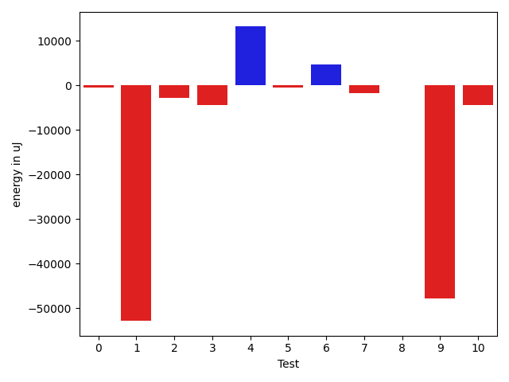

# gson 349c01

https://github.com/google/gson/commit/349c01

## Delta Energy per test method

| ID | EnergyV1 | EnergyV2 | DeltaEnergy | σV1 | σV2 |
| --- | --- | --- | --- | --- | --- |
| 0 | 38208 | 38147 | -61 | 17017.12438618699 | 16728.015365291318 |
| 1 | 115905 | 111877 | -4028 | 622912.4621452187 | 567254.9872721764 |
| 2 | 39184 | 37903 | -1281 | 16422.59207864046 | 14598.627005554788 |
| 3 | 37720 | 38330 | 610 | 28594.0300959712 | 10591.038010572895 |
| 4 | 73669 | 82397 | 8728 | 104168.44044563411 | 110877.27226107763 |
| 5 | 34118 | 33508 | -610 | 3778.929405241108 | 3363.16282575016 |
| 6 | 46570 | 63964 | 17394 | 51425.0994995815 | 51202.4891285916 |
| 7 | 44129 | 62927 | 18798 | 124789.03493614511 | 116379.92775142542 |
| 8 | 34118 | 35706 | 1588 | 3933.0331523109303 | 3195.1104376778735 |
| 9 | 191344 | 190856 | -488 | 739410.9124700045 | 693548.2008515779 |
| 10 | 38330 | 38086 | -244 | 30413.980571892094 | 26650.955127600588 |

## Delta Duration per test method

| ID | DurationV1 | DurationsV2 | DeltaDuration |
| --- | --- | --- | --- |
| 0 | 1663379.06185567 | 1597120.4040404041 | -66258.65781526593 |
| 1 | 11239296.97979798 | 9557105.292929294 | -1682191.6868686862 |
| 2 | 1694029.9591836734 | 1612462.142857143 | -81567.81632653042 |
| 3 | 1632435.5569620254 | 1554787.0909090908 | -77648.46605293453 |
| 4 | 3678850.3636363638 | 4144603.787878788 | 465753.4242424243 |
| 5 | 1114350.0714285714 | 1107938.6129032257 | -6411.458525345661 |
| 6 | 2647560.9591836734 | 2879056.8333333335 | 231495.8741496601 |
| 7 | 3846042.644444444 | 3962078.425531915 | 116035.7810874707 |
| 8 | 830511.023255814 | 932117.0980392157 | 101606.07478340168 |
| 9 | 17228208.474747475 | 15796196.464646464 | -1432012.010101011 |
| 10 | 1892181.2395833333 | 1770732.6153846155 | -121448.62419871776 |

## Misc.

| ID | Test Class | Test Method |
| --- | --- | --- |
| 0 | com.google.gson.functional.MapAsArrayTypeAdapterTest | testMultipleEnableComplexKeyRegistrationHasNoEffect |
| 1 | com.google.gson.functional.MapAsArrayTypeAdapterTest | testSerializeComplexMapWithTypeAdapter |
| 2 | com.google.gson.functional.MapAsArrayTypeAdapterTest | testMapWithTypeVariableSerialization |
| 3 | com.google.gson.functional.ExclusionStrategyFunctionalTest | testExclusionStrategyWithMode |
| 4 | com.google.gson.functional.ParameterizedTypesTest | testParameterizedTypeWithCustomSerializer |
| 5 | com.google.gson.functional.MapTest | testMapSerializationWithIntegerKeys |
| 6 | com.google.gson.functional.JsonTreeTest | testJsonTreeToString |
| 7 | com.google.gson.functional.JsonTreeTest | testToJsonTreeObjectType |
| 8 | com.google.gson.functional.JsonTreeTest | testToJsonTree |
| 9 | com.google.gson.functional.TypeHierarchyAdapterTest | testTypeHierarchy |
| 10 | com.google.gson.functional.MoreSpecificTypeSerializationTest | testMapOfSubclassFields |

| Test | IterationV1 | IterationV2 | DeltaIteration |
| --- | --- | --- | --- |
| 0 | 97 | 99 | 2 |
| 1 | 99 | 99 | 0 |
| 2 | 98 | 98 | 0 |
| 3 | 79 | 88 | 9 |
| 4 | 99 | 99 | 0 |
| 5 | 70 | 62 | -8 |
| 6 | 98 | 96 | -2 |
| 7 | 90 | 94 | 4 |
| 8 | 43 | 51 | 8 |
| 9 | 99 | 99 | 0 |
| 10 | 96 | 91 | -5 |

| Time Label | Time (s) |
| --- | --- |
| Selection | 27.982163667678833 |
| Injection | 11.195492506027222 |
| Total | 1125.2731320858002 |

