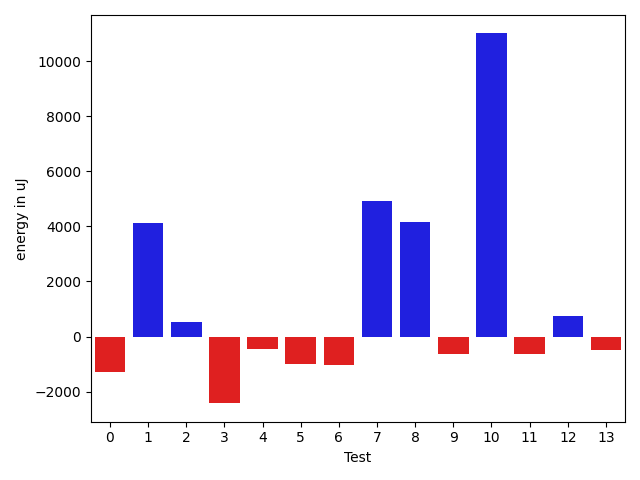
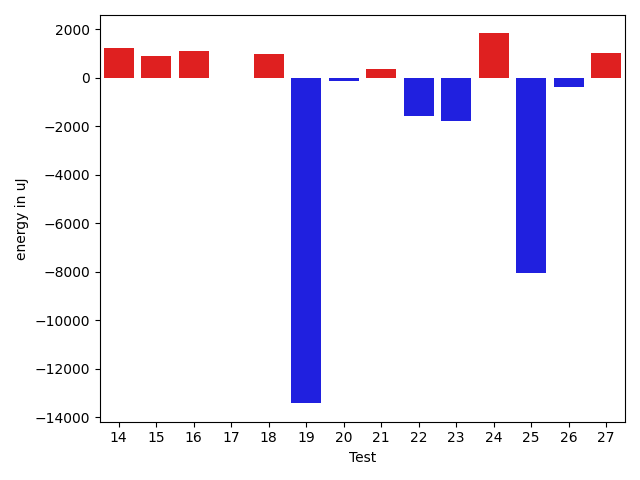
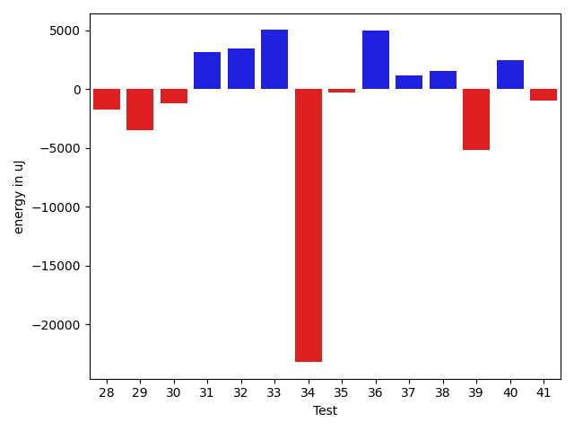
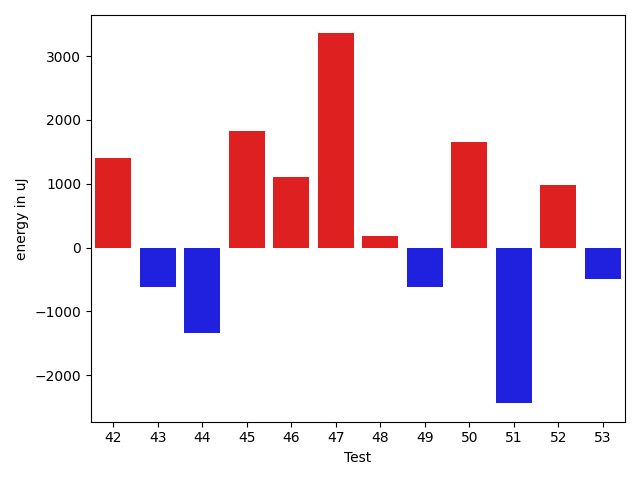

# gson ed2b25

https://github.com/google/gson/commit/ed2b25

## Delta Energy per test method

| ID | EnergyV1 | EnergyV2 | DeltaEnergy | σV1 | σV2 |
| --- | --- | --- | --- | --- | --- |
| 0 | 38025 | 38207 | 182 | 3826.9525183354604 | 3469.074262652202 |
| 1 | 39978 | 40466 | 488 | 17107.788703888986 | 21308.835701392032 |
| 2 | 73426 | 72876 | -550 | 20745.31880245981 | 21494.414160441822 |
| 3 | 39184 | 35584 | -3600 | 4010.098310110041 | 4467.247619052536 |
| 4 | 37536 | 36682 | -854 | 4687.091224499092 | 3912.305262068719 |
| 5 | 39184 | 37231 | -1953 | 4023.3284782507153 | 3887.4213222202306 |
| 6 | 36499 | 36255 | -244 | 4610.141132957728 | 4192.133283723915 |
| 7 | 77820 | 82153 | 4333 | 43682.43750229168 | 47391.46936689117 |
| 8 | 40650 | 40527 | -123 | 13968.26898260646 | 17429.379291515233 |
| 9 | 61462 | 47973 | -13489 | 19983.49612355329 | 19938.941138135437 |
| 10 | 39002 | 38696 | -306 | 55768.71182737592 | 74787.11277360452 |
| 11 | 36621 | 36377 | -244 | 4155.3780865749795 | 3707.1210312230237 |
| 12 | 36804 | 37353 | 549 | 4039.30648156844 | 4344.6536306636635 |
| 13 | 37719 | 36377 | -1342 | 3898.9376765415927 | 4198.017187181521 |
| 14 | 38269 | 39489 | 1220 | 25911.64691367673 | 29356.042082529184 |
| 15 | 35889 | 36804 | 915 | 4605.742525000418 | 3945.6937318304467 |
| 16 | 36315 | 37415 | 1100 | 3336.2500015805194 | 4240.5314049153985 |
| 17 | 37414 | 37414 | 0 | 3981.072642532911 | 3912.579743501236 |
| 18 | 38208 | 39185 | 977 | 12413.117225733993 | 10682.961553847681 |
| 19 | 105225 | 91796 | -13429 | 461649.63835346646 | 428665.9375066869 |
| 20 | 39551 | 39429 | -122 | 15988.160072304432 | 12846.580255684545 |
| 21 | 37414 | 37781 | 367 | 7800.409141687228 | 4334.415111717271 |
| 22 | 39184 | 37597 | -1587 | 8301.539308583566 | 7034.067444990327 |
| 23 | 40894 | 39123 | -1771 | 287391.71888115705 | 283838.2247042685 |
| 24 | 112121 | 113952 | 1831 | 236016.08214923393 | 351799.3827975074 |
| 25 | 72937 | 64881 | -8056 | 22316.85159177452 | 23539.675789194327 |
| 26 | 40344 | 39978 | -366 | 20132.385686425117 | 25918.669472232352 |
| 27 | 43579 | 44616 | 1037 | 369413.1927863906 | 553815.900876522 |
| 28 | 38513 | 36499 | -2014 | 7258.212293158403 | 6588.880134818506 |
| 29 | 39185 | 36499 | -2686 | 9816.875613822533 | 6954.041045844062 |
| 30 | 39185 | 38513 | -672 | 3905.5363475117856 | 3226.132200115793 |
| 31 | 39428 | 37841 | -1587 | 9978.752333199966 | 17976.996418196137 |
| 32 | 37964 | 38757 | 793 | 16350.659131885408 | 20282.81055830273 |
| 33 | 141052 | 151245 | 10193 | 495619.09550618875 | 497105.3292840521 |
| 34 | 41137 | 39489 | -1648 | 79232.96763725032 | 61890.91672674468 |
| 35 | 39551 | 40222 | 671 | 11095.819206527545 | 10517.526545705177 |
| 36 | 38086 | 38147 | 61 | 3475.836773691157 | 35584.95899314135 |
| 37 | 42114 | 41443 | -671 | 121102.66034284733 | 130631.13142667698 |
| 38 | 35828 | 37781 | 1953 | 4870.697920572511 | 3981.0053788065843 |
| 39 | 42663 | 40955 | -1708 | 48038.27961645132 | 47221.01645965156 |
| 40 | 40100 | 40710 | 610 | 19085.088085597414 | 22821.237822837942 |
| 41 | 39611 | 38452 | -1159 | 17862.29656637317 | 19580.320682871403 |
| 42 | 36499 | 37903 | 1404 | 4182.463195158808 | 4388.417064310594 |
| 43 | 37964 | 37353 | -611 | 4032.676379769472 | 4920.62312980133 |
| 44 | 41443 | 40100 | -1343 | 14785.07615841055 | 15524.952205327923 |
| 45 | 37781 | 39612 | 1831 | 4329.927658083296 | 4115.341044865608 |
| 46 | 38330 | 39429 | 1099 | 111822.15994145941 | 49979.448601522425 |
| 47 | 35950 | 39306 | 3356 | 3805.1045013940056 | 3760.620367100958 |
| 48 | 36377 | 36560 | 183 | 4230.871149128664 | 4296.345713486744 |
| 49 | 37476 | 36865 | -611 | 4817.844018453647 | 4304.234867610683 |
| 50 | 36621 | 38269 | 1648 | 64590.864812693915 | 72376.31870373187 |
| 51 | 38269 | 35828 | -2441 | 3903.3025606529663 | 3259.0468790736963 |
| 52 | 34485 | 35462 | 977 | 8667.33578499958 | 4013.1600632585455 |
| 53 | 39673 | 39185 | -488 | 92343.7045299625 | 67344.02634710817 |

## Delta Duration per test method

| ID | DurationV1 | DurationsV2 | DeltaDuration |
| --- | --- | --- | --- |
| 0 | 526830.4848484849 | 500344.6785714286 | -26485.806277056283 |
| 1 | 1542578.5051546392 | 1640618.6315789474 | 98040.12642430817 |
| 2 | 2206997.585858586 | 2252107.9393939395 | 45110.35353535367 |
| 3 | 504026.3823529412 | 536915.5 | 32889.117647058796 |
| 4 | 875532.6296296297 | 958118.0869565217 | 82585.45732689206 |
| 5 | 1079130.6329113925 | 1098639.2025316455 | 19508.569620253053 |
| 6 | 921023.0655737704 | 989972.96875 | 68949.90317622956 |
| 7 | 2631755.111111111 | 2791346.4242424243 | 159591.3131313133 |
| 8 | 1420030.2891566264 | 1493989.875 | 73959.58584337356 |
| 9 | 1842782.0202020202 | 1907831.898989899 | 65049.8787878789 |
| 10 | 1614598.0571428572 | 2035978.507936508 | 421380.4507936507 |
| 11 | 800609.8235294118 | 737173.2380952381 | -63436.5854341737 |
| 12 | 912766.6607142857 | 951010.6111111111 | 38243.95039682544 |
| 13 | 661187.1333333333 | 638456.7567567568 | -22730.3765765765 |
| 14 | 1411802.953125 | 1569494.2571428572 | 157691.30401785718 |
| 15 | 762848.4375 | 764671.4693877551 | 1823.0318877551472 |
| 16 | 706596.2162162162 | 747771.4634146341 | 41175.2471984179 |
| 17 | 869266.7272727273 | 908453.7090909091 | 39186.98181818181 |
| 18 | 1385358.3977272727 | 1292977.1666666667 | -92381.23106060596 |
| 19 | 6889822.474747474 | 6065228.787878788 | -824593.6868686862 |
| 20 | 1464495.559139785 | 1405957.9764705882 | -58537.58266919665 |
| 21 | 709313.5813953489 | 707983.9795918367 | -1329.601803512196 |
| 22 | 1204373.7611940298 | 1225914.4925373134 | 21540.73134328355 |
| 23 | 3074541.324675325 | 3443832.347222222 | 369291.0225468972 |
| 24 | 4232055.4949494945 | 5408105.848484849 | 1176050.3535353541 |
| 25 | 2034950.4343434344 | 2050445.494949495 | 15495.06060606055 |
| 26 | 1601877.9895833333 | 1706592.8645833333 | 104714.875 |
| 27 | 4085576.225 | 7973866.864197531 | 3888290.6391975307 |
| 28 | 961416.606557377 | 998034.0615384616 | 36617.454981084564 |
| 29 | 1044380.2272727273 | 1100944.1296296297 | 56563.90235690237 |
| 30 | 766773.5897435897 | 819307.1590909091 | 52533.56934731931 |
| 31 | 1215980.6875 | 1327544.3417721519 | 111563.65427215188 |
| 32 | 1473984.6962025317 | 1539847.3023255814 | 65862.60612304974 |
| 33 | 8971045.292929294 | 9059195.555555556 | 88150.26262626238 |
| 34 | 2725420.5 | 1745081.2432432433 | -980339.2567567567 |
| 35 | 1221672.7936507936 | 1130298.6065573771 | -91374.18709341646 |
| 36 | 986356.6875 | 1139125.5263157894 | 152768.83881578944 |
| 37 | 3174985.379746835 | 3107299.864197531 | -67685.51554930443 |
| 38 | 770935.6 | 748655.6521739131 | -22279.947826086893 |
| 39 | 2177246.1428571427 | 2019562.0106382978 | -157684.13221884496 |
| 40 | 1535905.6626506024 | 1610742.8522727273 | 74837.18962212489 |
| 41 | 1410097.9466666668 | 1404166.2857142857 | -5931.660952381091 |
| 42 | 730724.1388888889 | 713354.6578947369 | -17369.48099415202 |
| 43 | 663270.5 | 712148.9487179487 | 48878.44871794875 |
| 44 | 1461280.9 | 1439787.4235294117 | -21493.47647058824 |
| 45 | 669010.9642857143 | 635289.7 | -33721.264285714366 |
| 46 | 1986824.8666666667 | 906437.7666666667 | -1080387.1 |
| 47 | 632049.3181818182 | 546848.2272727273 | -85201.09090909094 |
| 48 | 643060.1304347826 | 572439.619047619 | -70620.51138716354 |
| 49 | 623984.1578947369 | 676949.6 | 52965.44210526312 |
| 50 | 1074969.619047619 | 1425847.4166666667 | 350877.7976190478 |
| 51 | 548962.4 | 596223.0 | 47260.59999999998 |
| 52 | 845159.1891891892 | 759146.3666666667 | -86012.82252252253 |
| 53 | 2923097.054054054 | 1670704.525 | -1252392.529054054 |

## Misc.

| ID | Test Class | Test Method |
| --- | --- | --- |
| 0 | com.google.gson.functional.MapTest | testWriteMapsWithEmptyStringKey |
| 1 | com.google.gson.functional.MapTest | testSerializeMaps |
| 2 | com.google.gson.functional.MapTest | testInterfaceTypeMapWithSerializer |
| 3 | com.google.gson.functional.MapTest | testMapWithQuotes |
| 4 | com.google.gson.functional.MapTest | testMapSerializationWithIntegerKeys |
| 5 | com.google.gson.functional.MapTest | testGeneralMapField |
| 6 | com.google.gson.functional.MapTest | testMapSerializationWithNullValueButSerializeNulls |
| 7 | com.google.gson.functional.MapTest | testInterfaceTypeMap |
| 8 | com.google.gson.functional.MapTest | testMapSerializationWithWildcardValues |
| 9 | com.google.gson.functional.MapTest | testParameterizedMapSubclassSerialization |
| 10 | com.google.gson.functional.MapTest | testMapSerialization |
| 11 | com.google.gson.functional.MapTest | testRawMapSerialization |
| 12 | com.google.gson.functional.MapTest | testMapSerializationWithNullValue |
| 13 | com.google.gson.functional.MapTest | testMapOfMapSerialization |
| 14 | com.google.gson.functional.MapTest | testMapSerializationWithNullValues |
| 15 | com.google.gson.functional.MapTest | testMapSerializationWithNullValuesSerialized |
| 16 | com.google.gson.functional.MapTest | testMapSubclassSerialization |
| 17 | com.google.gson.functional.MapTest | testMapSerializationWithNullKey |
| 18 | com.google.gson.functional.MapAsArrayTypeAdapterTest | testMultipleEnableComplexKeyRegistrationHasNoEffect |
| 19 | com.google.gson.functional.MapAsArrayTypeAdapterTest | testSerializeComplexMapWithTypeAdapter |
| 20 | com.google.gson.functional.MapAsArrayTypeAdapterTest | testMapWithTypeVariableSerialization |
| 21 | com.google.gson.functional.CustomTypeAdaptersTest | testCustomAdapterInvokedForMapElementSerialization |
| 22 | com.google.gson.functional.CustomTypeAdaptersTest | testCustomAdapterInvokedForMapElementSerializationWithType |
| 23 | com.google.gson.functional.ExclusionStrategyFunctionalTest | testExclusionStrategyWithMode |
| 24 | com.google.gson.functional.TypeVariableTest | testAdvancedTypeVariables |
| 25 | com.google.gson.functional.TypeVariableTest | testTypeVariablesViaTypeParameter |
| 26 | com.google.gson.functional.ParameterizedTypesTest | testParameterizedTypeWithCustomSerializer |
| 27 | com.google.gson.functional.CustomSerializerTest | testSubClassSerializerInvokedForBaseClassFieldsHoldingSubClassInstances |
| 28 | com.google.gson.functional.CustomSerializerTest | testBaseClassSerializerInvokedForBaseClassFieldsHoldingSubClassInstances |
| 29 | com.google.gson.functional.CustomSerializerTest | testSubClassSerializerInvokedForBaseClassFieldsHoldingArrayOfSubClassInstances |
| 30 | com.google.gson.functional.CustomSerializerTest | testBaseClassSerializerInvokedForBaseClassFields |
| 31 | com.google.gson.functional.MoreSpecificTypeSerializationTest | testMapOfParameterizedSubclassFields |
| 32 | com.google.gson.functional.MoreSpecificTypeSerializationTest | testMapOfSubclassFields |
| 33 | com.google.gson.functional.TypeHierarchyAdapterTest | testTypeHierarchy |
| 34 | com.google.gson.DefaultMapJsonSerializerTest | testEmptyMapNoTypeSerialization |
| 35 | com.google.gson.DefaultMapJsonSerializerTest | testEmptyMapSerialization |
| 36 | com.google.gson.DefaultMapJsonSerializerTest | testNonEmptyMapSerialization |
| 37 | com.google.gson.functional.JsonTreeTest | testToJsonTreeObjectType |
| 38 | com.google.gson.functional.JsonTreeTest | testToJsonTree |
| 39 | com.google.gson.functional.JsonTreeTest | testJsonTreeToString |
| 40 | com.google.gson.functional.InheritanceTest | testClassWithBaseCollectionFieldSerialization |
| 41 | com.google.gson.functional.InheritanceTest | testClassWithBaseFieldSerialization |
| 42 | com.google.gson.functional.InheritanceTest | testBaseSerializedAsSub |
| 43 | com.google.gson.functional.InheritanceTest | testBaseSerializedAsSubWhenSpecifiedWithExplicitType |
| 44 | com.google.gson.functional.InheritanceTest | testClassWithBaseArrayFieldSerialization |
| 45 | com.google.gson.functional.InheritanceTest | testBaseSerializedAsBaseWhenSpecifiedWithExplicitType |
| 46 | com.google.gson.internal.bind.JsonElementWriterTest | testNestedArray |
| 47 | com.google.gson.internal.bind.JsonElementWriterTest | testWriteAfterClose |
| 48 | com.google.gson.internal.bind.JsonElementWriterTest | testNestedObject |
| 49 | com.google.gson.internal.bind.JsonElementWriterTest | testPrematureClose |
| 50 | com.google.gson.internal.bind.JsonElementWriterTest | testArray |
| 51 | com.google.gson.internal.bind.JsonElementWriterTest | testObject |
| 52 | com.google.gson.functional.DefaultTypeAdaptersTest | testPropertiesSerialization |
| 53 | com.google.gson.functional.PrettyPrintingTest | testMap |

| Test | IterationV1 | IterationV2 | DeltaIteration |
| --- | --- | --- | --- |
| 0 | 33 | 28 | -5 |
| 1 | 97 | 95 | -2 |
| 2 | 99 | 99 | 0 |
| 3 | 34 | 24 | -10 |
| 4 | 54 | 46 | -8 |
| 5 | 79 | 79 | 0 |
| 6 | 61 | 64 | 3 |
| 7 | 99 | 99 | 0 |
| 8 | 83 | 80 | -3 |
| 9 | 99 | 99 | 0 |
| 10 | 70 | 63 | -7 |
| 11 | 34 | 42 | 8 |
| 12 | 56 | 54 | -2 |
| 13 | 30 | 37 | 7 |
| 14 | 64 | 70 | 6 |
| 15 | 48 | 49 | 1 |
| 16 | 37 | 41 | 4 |
| 17 | 55 | 55 | 0 |
| 18 | 88 | 90 | 2 |
| 19 | 99 | 99 | 0 |
| 20 | 93 | 85 | -8 |
| 21 | 43 | 49 | 6 |
| 22 | 67 | 67 | 0 |
| 23 | 77 | 72 | -5 |
| 24 | 99 | 99 | 0 |
| 25 | 99 | 99 | 0 |
| 26 | 96 | 96 | 0 |
| 27 | 80 | 81 | 1 |
| 28 | 61 | 65 | 4 |
| 29 | 66 | 54 | -12 |
| 30 | 39 | 44 | 5 |
| 31 | 80 | 79 | -1 |
| 32 | 79 | 86 | 7 |
| 33 | 99 | 99 | 0 |
| 34 | 30 | 37 | 7 |
| 35 | 63 | 61 | -2 |
| 36 | 64 | 57 | -7 |
| 37 | 79 | 81 | 2 |
| 38 | 35 | 46 | 11 |
| 39 | 84 | 94 | 10 |
| 40 | 83 | 88 | 5 |
| 41 | 75 | 70 | -5 |
| 42 | 36 | 38 | 2 |
| 43 | 36 | 39 | 3 |
| 44 | 80 | 85 | 5 |
| 45 | 28 | 30 | 2 |
| 46 | 15 | 30 | 15 |
| 47 | 22 | 22 | 0 |
| 48 | 23 | 21 | -2 |
| 49 | 19 | 15 | -4 |
| 50 | 21 | 24 | 3 |
| 51 | 25 | 15 | -10 |
| 52 | 37 | 30 | -7 |
| 53 | 37 | 40 | 3 |

| Time Label | Time (s) |
| --- | --- |
| Selection | 28.135053634643555 |
| Injection | 12.402545928955078 |
| Total | 1156.0647413730621 |

