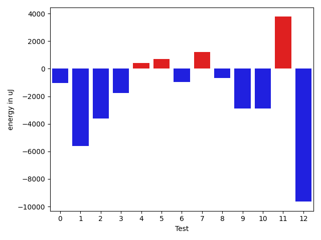
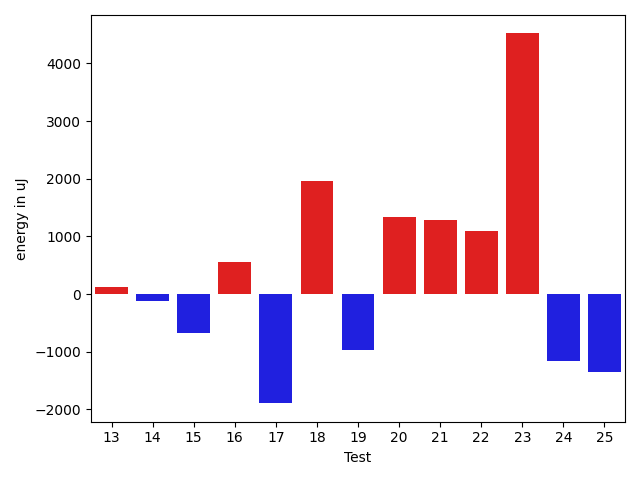
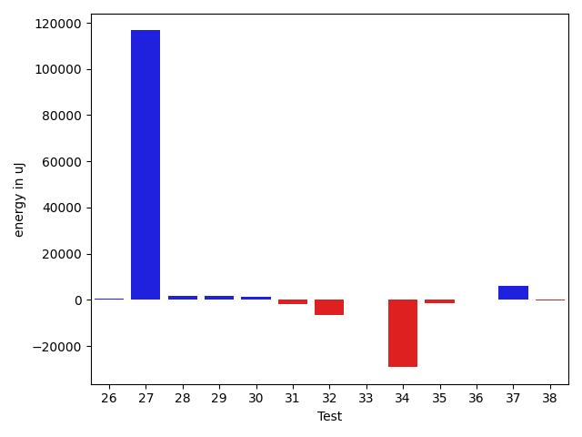
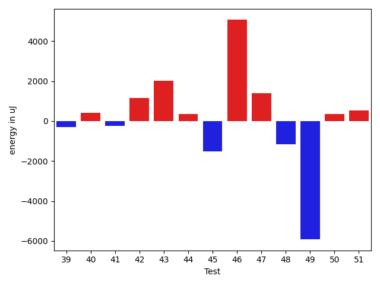
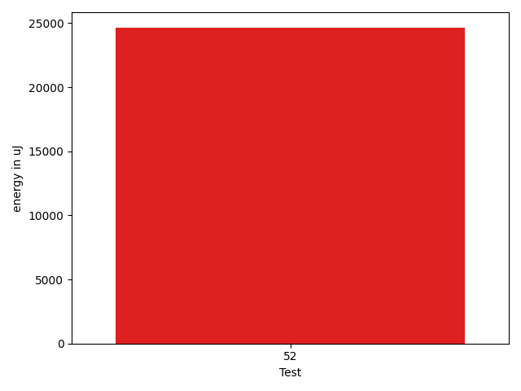

# gson 9b7b49

https://github.com/google/gson/commit/9b7b49

## Delta Energy per test method

| ID | EnergyV1 | EnergyV2 | DeltaEnergy | σV1 | σV2 |
| --- | --- | --- | --- | --- | --- |
| 0 | 39184 | 38513 | -671 | 4639.944670400575 | 4845.530694357527 |
| 1 | 42114 | 40222 | -1892 | 16242.761695545 | 12378.351153485693 |
| 2 | 41199 | 39795 | -1404 | 17875.01282459937 | 14470.666817118055 |
| 3 | 39063 | 39185 | 122 | 15595.15708742392 | 14549.425285414203 |
| 4 | 37293 | 38574 | 1281 | 4329.183891840932 | 4699.4014793867955 |
| 5 | 37414 | 38635 | 1221 | 4031.591301443513 | 4866.412999759162 |
| 6 | 41260 | 40283 | -977 | 18016.106440115127 | 19599.299471317692 |
| 7 | 72936 | 75805 | 2869 | 21089.887729753973 | 20102.937639630767 |
| 8 | 37597 | 37720 | 123 | 7265.001547731665 | 5802.836022243062 |
| 9 | 85510 | 83252 | -2258 | 46276.24682778934 | 47191.175936386186 |
| 10 | 40832 | 38697 | -2135 | 18605.46490286404 | 17258.37517922498 |
| 11 | 45532 | 65185 | 19653 | 20483.286248709628 | 19145.509782077654 |
| 12 | 40100 | 39429 | -671 | 79200.44727538804 | 70316.35049809222 |
| 13 | 36744 | 36865 | 121 | 4284.806908752164 | 4380.7295038934535 |
| 14 | 34546 | 34424 | -122 | 3528.451396179135 | 3516.9387100147196 |
| 15 | 38941 | 38269 | -672 | 30597.871003915006 | 30530.96413525063 |
| 16 | 36804 | 37353 | 549 | 4465.318386866843 | 4366.1946757777005 |
| 17 | 38452 | 36560 | -1892 | 4216.707001013701 | 3380.001197593517 |
| 18 | 36560 | 38513 | 1953 | 4263.853611855517 | 4505.869877140509 |
| 19 | 37353 | 36377 | -976 | 4147.606112822213 | 4916.80602291184 |
| 20 | 35034 | 36377 | 1343 | 4260.868211867736 | 4085.3816287992067 |
| 21 | 36560 | 37842 | 1282 | 4121.86832211362 | 6013.174326647538 |
| 22 | 35523 | 36621 | 1098 | 4537.495151131006 | 4088.7086398789766 |
| 23 | 35339 | 39856 | 4517 | 3841.385859504353 | 4082.642960133859 |
| 24 | 38513 | 37353 | -1160 | 4265.040145453564 | 4396.956499464353 |
| 25 | 38818 | 37476 | -1342 | 4370.621579084701 | 3782.735980966777 |
| 26 | 39002 | 38208 | -794 | 9659.979620319456 | 10578.622251016843 |
| 27 | 43945 | 44922 | 977 | 471311.0396507098 | 639811.0722340496 |
| 28 | 36987 | 38208 | 1221 | 4131.5335734956 | 6027.694006251958 |
| 29 | 37354 | 39368 | 2014 | 6094.674627351799 | 7859.760117149328 |
| 30 | 36804 | 39001 | 2197 | 4329.196554276043 | 4008.447789618666 |
| 31 | 39368 | 37964 | -1404 | 11888.596922095569 | 11499.6631906806 |
| 32 | 104492 | 105347 | 855 | 452306.3018700347 | 431564.1275913346 |
| 33 | 40527 | 39306 | -1221 | 12296.463355806847 | 13605.820317429801 |
| 34 | 116211 | 112243 | -3968 | 619758.621467637 | 540010.5199958872 |
| 35 | 71533 | 72814 | 1281 | 26074.586532087218 | 25204.801011736243 |
| 36 | 39123 | 39184 | 61 | 19192.679365465225 | 20485.922496076073 |
| 37 | 36438 | 40893 | 4455 | 85067.21468061092 | 119863.84371026415 |
| 38 | 37964 | 38818 | 854 | 3296.7810754103275 | 3937.9785956123646 |
| 39 | 39307 | 39002 | -305 | 81469.74599761299 | 3408.9032552781773 |
| 40 | 38025 | 38452 | 427 | 35304.04082159215 | 5159.871093591325 |
| 41 | 42114 | 41870 | -244 | 44187.71156169297 | 41746.9099132759 |
| 42 | 40222 | 41382 | 1160 | 96461.83318895432 | 92886.49475515152 |
| 43 | 37048 | 39062 | 2014 | 3866.0508266120905 | 4896.303606135981 |
| 44 | 38208 | 38574 | 366 | 4402.1169745705765 | 6365.992418243663 |
| 45 | 40100 | 38574 | -1526 | 32499.126298367668 | 32916.09706442236 |
| 46 | 39124 | 44190 | 5066 | 57251.152077927654 | 94408.70475001367 |
| 47 | 37109 | 38513 | 1404 | 7253.349261702157 | 9954.76462082119 |
| 48 | 40772 | 39611 | -1161 | 20377.199933440545 | 17413.556716452353 |
| 49 | 158874 | 152954 | -5920 | 401627.1463852551 | 602153.6905683952 |
| 50 | 35889 | 36255 | 366 | 3946.1996269632473 | 7740.331973644426 |
| 51 | 38940 | 39489 | 549 | 15057.538744946187 | 42540.14518211648 |
| 52 | 39429 | 40222 | 793 | 43876.17063779307 | 75428.31459503734 |

## Delta Duration per test method

| ID | DurationV1 | DurationsV2 | DeltaDuration |
| --- | --- | --- | --- |
| 0 | 660080.1282051282 | 663541.03125 | 3460.903044871753 |
| 1 | 1472207.375 | 1316894.4024390243 | -155312.9725609757 |
| 2 | 1445765.9523809524 | 1322568.2117647058 | -123197.74061624659 |
| 3 | 1342147.9285714286 | 1270451.6896551724 | -71696.23891625623 |
| 4 | 689620.925 | 697427.7272727273 | 7806.802272727247 |
| 5 | 625677.3125 | 624285.0 | -1392.3125 |
| 6 | 1695138.93814433 | 1626760.8041237113 | -68378.13402061863 |
| 7 | 2364714.404040404 | 2356170.9292929294 | -8543.474747474771 |
| 8 | 1126456.0886075948 | 1131469.0277777778 | 5012.939170182915 |
| 9 | 3043622.5353535353 | 2922653.9393939395 | -120968.59595959587 |
| 10 | 1547835.1325301204 | 1495364.268292683 | -52470.86423743749 |
| 11 | 1867586.2121212122 | 1860089.303030303 | -7496.909090909176 |
| 12 | 2228803.880597015 | 1972884.5324675324 | -255919.34812948247 |
| 13 | 940671.7058823529 | 960082.8148148148 | 19411.10893246194 |
| 14 | 602326.6521739131 | 547606.3 | -54720.35217391304 |
| 15 | 1641691.1805555555 | 1583833.9726027397 | -57857.20795281581 |
| 16 | 923006.3859649122 | 931033.9655172414 | 8027.579552329145 |
| 17 | 651124.3928571428 | 658575.1290322581 | 7450.73617511522 |
| 18 | 911844.3833333333 | 938722.1833333333 | 26877.800000000047 |
| 19 | 827917.2380952381 | 818591.6363636364 | -9325.601731601753 |
| 20 | 775267.9545454546 | 752353.8913043478 | -22914.063241106807 |
| 21 | 972557.140625 | 989666.7285714286 | 17109.587946428568 |
| 22 | 715613.8947368421 | 703099.3611111111 | -12514.533625731012 |
| 23 | 582161.08 | 562691.0833333334 | -19469.996666666586 |
| 24 | 867557.4655172414 | 911873.4 | 44315.93448275863 |
| 25 | 803112.4186046511 | 870023.8333333334 | 66911.41472868226 |
| 26 | 1034121.0 | 1129219.2741935484 | 95098.27419354836 |
| 27 | 5944094.644736842 | 9146860.233766234 | 3202765.5890293913 |
| 28 | 987315.6981132076 | 1047699.5396825396 | 60383.84156933206 |
| 29 | 1130963.5479452056 | 1179583.014925373 | 48619.46698016743 |
| 30 | 728309.6 | 735180.0277777778 | 6870.427777777775 |
| 31 | 1330848.91954023 | 1388551.978021978 | 57703.05848174798 |
| 32 | 6404585.131313131 | 6286737.939393939 | -117847.19191919174 |
| 33 | 1385824.1612903227 | 1439960.2659574468 | 54136.104667124106 |
| 34 | 9885447.838383839 | 9169487.02020202 | -715960.8181818184 |
| 35 | 2284150.8585858587 | 2166365.090909091 | -117785.7676767679 |
| 36 | 1618466.1489361702 | 1650978.5684210525 | 32512.419484882383 |
| 37 | 1976814.6296296297 | 2025931.037037037 | 49116.407407407416 |
| 38 | 564265.3928571428 | 559063.1428571428 | -5202.25 |
| 39 | 1555889.0344827587 | 679042.9615384615 | -876846.0729442972 |
| 40 | 1002319.1818181818 | 628148.9090909091 | -374170.2727272727 |
| 41 | 2012746.775 | 1908071.9770114943 | -104674.79798850557 |
| 42 | 2464525.75 | 2301626.4320987654 | -162899.3179012346 |
| 43 | 722758.9811320754 | 804187.1176470588 | 81428.13651498337 |
| 44 | 988011.1578947369 | 923436.3888888889 | -64574.76900584798 |
| 45 | 1318400.917808219 | 1247671.3870967743 | -70729.5307114448 |
| 46 | 1586681.375 | 2664975.0714285714 | 1078293.6964285714 |
| 47 | 1245489.472972973 | 1239935.4189189188 | -5554.054054054199 |
| 48 | 1541382.7738095238 | 1472928.231707317 | -68454.54210220673 |
| 49 | 7122818.060606061 | 10992938.727272727 | 3870120.666666666 |
| 50 | 760588.8947368421 | 846853.0333333333 | 86264.13859649119 |
| 51 | 1322457.7916666667 | 1433986.9027777778 | 111529.11111111101 |
| 52 | 1045863.4523809524 | 2312179.294117647 | 1266315.8417366948 |

## Misc.

| ID | Test Class | Test Method |
| --- | --- | --- |
| 0 | com.google.gson.functional.InheritanceTest | testBaseSerializedAsSubWhenSpecifiedWithExplicitType |
| 1 | com.google.gson.functional.InheritanceTest | testClassWithBaseArrayFieldSerialization |
| 2 | com.google.gson.functional.InheritanceTest | testClassWithBaseCollectionFieldSerialization |
| 3 | com.google.gson.functional.InheritanceTest | testClassWithBaseFieldSerialization |
| 4 | com.google.gson.functional.InheritanceTest | testBaseSerializedAsSub |
| 5 | com.google.gson.functional.InheritanceTest | testBaseSerializedAsBaseWhenSpecifiedWithExplicitType |
| 6 | com.google.gson.functional.MapTest | testSerializeMaps |
| 7 | com.google.gson.functional.MapTest | testInterfaceTypeMapWithSerializer |
| 8 | com.google.gson.functional.MapTest | testGeneralMapField |
| 9 | com.google.gson.functional.MapTest | testInterfaceTypeMap |
| 10 | com.google.gson.functional.MapTest | testMapSerializationWithWildcardValues |
| 11 | com.google.gson.functional.MapTest | testParameterizedMapSubclassSerialization |
| 12 | com.google.gson.functional.MapTest | testMapSerialization |
| 13 | com.google.gson.functional.MapTest | testMapSerializationWithNullValue |
| 14 | com.google.gson.functional.MapTest | testWriteMapsWithEmptyStringKey |
| 15 | com.google.gson.functional.MapTest | testMapSerializationWithNullValues |
| 16 | com.google.gson.functional.MapTest | testMapSerializationWithIntegerKeys |
| 17 | com.google.gson.functional.MapTest | testMapOfMapSerialization |
| 18 | com.google.gson.functional.MapTest | testMapSerializationWithNullKey |
| 19 | com.google.gson.functional.MapTest | testRawMapSerialization |
| 20 | com.google.gson.functional.MapTest | testMapSerializationWithNullValuesSerialized |
| 21 | com.google.gson.functional.MapTest | testMapSerializationWithNullValueButSerializeNulls |
| 22 | com.google.gson.functional.MapTest | testMapSubclassSerialization |
| 23 | com.google.gson.functional.MapTest | testMapWithQuotes |
| 24 | com.google.gson.functional.CustomSerializerTest | testSerializerReturnsNull |
| 25 | com.google.gson.functional.CustomSerializerTest | testBaseClassSerializerInvokedForBaseClassFields |
| 26 | com.google.gson.functional.CustomSerializerTest | testSubClassSerializerInvokedForBaseClassFieldsHoldingArrayOfSubClassInstances |
| 27 | com.google.gson.functional.CustomSerializerTest | testSubClassSerializerInvokedForBaseClassFieldsHoldingSubClassInstances |
| 28 | com.google.gson.functional.CustomSerializerTest | testBaseClassSerializerInvokedForBaseClassFieldsHoldingSubClassInstances |
| 29 | com.google.gson.functional.CustomTypeAdaptersTest | testCustomAdapterInvokedForMapElementSerializationWithType |
| 30 | com.google.gson.functional.CustomTypeAdaptersTest | testCustomAdapterInvokedForMapElementSerialization |
| 31 | com.google.gson.functional.MapAsArrayTypeAdapterTest | testMultipleEnableComplexKeyRegistrationHasNoEffect |
| 32 | com.google.gson.functional.MapAsArrayTypeAdapterTest | testSerializeComplexMapWithTypeAdapter |
| 33 | com.google.gson.functional.MapAsArrayTypeAdapterTest | testMapWithTypeVariableSerialization |
| 34 | com.google.gson.functional.TypeVariableTest | testAdvancedTypeVariables |
| 35 | com.google.gson.functional.TypeVariableTest | testTypeVariablesViaTypeParameter |
| 36 | com.google.gson.functional.ParameterizedTypesTest | testParameterizedTypeWithCustomSerializer |
| 37 | com.google.gson.internal.bind.JsonElementWriterTest | testNestedArray |
| 38 | com.google.gson.internal.bind.JsonElementWriterTest | testObject |
| 39 | com.google.gson.internal.bind.JsonElementWriterTest | testArray |
| 40 | com.google.gson.internal.bind.JsonElementWriterTest | testNestedObject |
| 41 | com.google.gson.functional.JsonTreeTest | testJsonTreeToString |
| 42 | com.google.gson.functional.JsonTreeTest | testToJsonTreeObjectType |
| 43 | com.google.gson.functional.JsonTreeTest | testToJsonTree |
| 44 | com.google.gson.DefaultMapJsonSerializerTest | testNonEmptyMapSerialization |
| 45 | com.google.gson.DefaultMapJsonSerializerTest | testEmptyMapSerialization |
| 46 | com.google.gson.DefaultMapJsonSerializerTest | testEmptyMapNoTypeSerialization |
| 47 | com.google.gson.functional.MoreSpecificTypeSerializationTest | testMapOfParameterizedSubclassFields |
| 48 | com.google.gson.functional.MoreSpecificTypeSerializationTest | testMapOfSubclassFields |
| 49 | com.google.gson.functional.TypeHierarchyAdapterTest | testTypeHierarchy |
| 50 | com.google.gson.functional.DefaultTypeAdaptersTest | testPropertiesSerialization |
| 51 | com.google.gson.functional.ExclusionStrategyFunctionalTest | testExclusionStrategyWithMode |
| 52 | com.google.gson.functional.PrettyPrintingTest | testMap |

| Test | IterationV1 | IterationV2 | DeltaIteration |
| --- | --- | --- | --- |
| 0 | 39 | 32 | -7 |
| 1 | 72 | 82 | 10 |
| 2 | 84 | 85 | 1 |
| 3 | 70 | 58 | -12 |
| 4 | 40 | 33 | -7 |
| 5 | 32 | 27 | -5 |
| 6 | 97 | 97 | 0 |
| 7 | 99 | 99 | 0 |
| 8 | 79 | 72 | -7 |
| 9 | 99 | 99 | 0 |
| 10 | 83 | 82 | -1 |
| 11 | 99 | 99 | 0 |
| 12 | 67 | 77 | 10 |
| 13 | 51 | 54 | 3 |
| 14 | 23 | 20 | -3 |
| 15 | 72 | 73 | 1 |
| 16 | 57 | 58 | 1 |
| 17 | 28 | 31 | 3 |
| 18 | 60 | 60 | 0 |
| 19 | 42 | 44 | 2 |
| 20 | 44 | 46 | 2 |
| 21 | 64 | 70 | 6 |
| 22 | 38 | 36 | -2 |
| 23 | 25 | 24 | -1 |
| 24 | 58 | 55 | -3 |
| 25 | 43 | 42 | -1 |
| 26 | 56 | 62 | 6 |
| 27 | 76 | 77 | 1 |
| 28 | 53 | 63 | 10 |
| 29 | 73 | 67 | -6 |
| 30 | 30 | 36 | 6 |
| 31 | 87 | 91 | 4 |
| 32 | 99 | 99 | 0 |
| 33 | 93 | 94 | 1 |
| 34 | 99 | 99 | 0 |
| 35 | 99 | 99 | 0 |
| 36 | 94 | 95 | 1 |
| 37 | 27 | 27 | 0 |
| 38 | 28 | 21 | -7 |
| 39 | 29 | 26 | -3 |
| 40 | 22 | 22 | 0 |
| 41 | 80 | 87 | 7 |
| 42 | 76 | 81 | 5 |
| 43 | 53 | 34 | -19 |
| 44 | 57 | 72 | 15 |
| 45 | 73 | 62 | -11 |
| 46 | 32 | 28 | -4 |
| 47 | 74 | 74 | 0 |
| 48 | 84 | 82 | -2 |
| 49 | 99 | 99 | 0 |
| 50 | 38 | 30 | -8 |
| 51 | 72 | 72 | 0 |
| 52 | 42 | 34 | -8 |

| Time Label | Time (s) |
| --- | --- |
| Selection | 28.236210584640503 |
| Injection | 12.4183669090271 |
| Total | 1156.2662427425385 |

