# gson d3f927

https://github.com/google/gson/commit/d3f927

## Delta Energy per test method

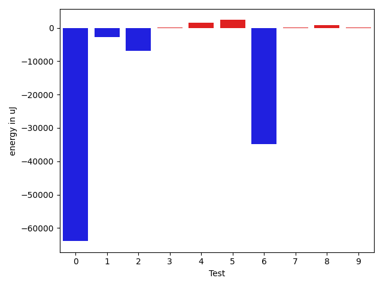

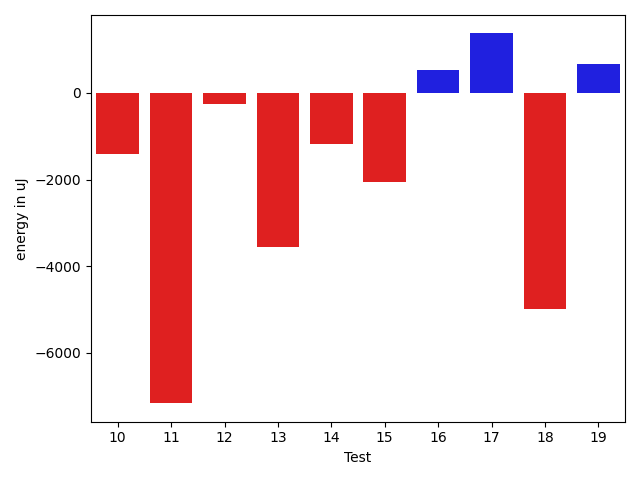

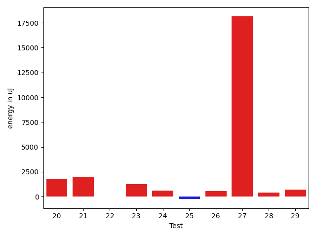

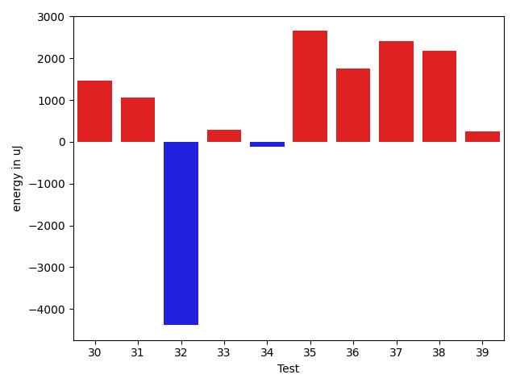

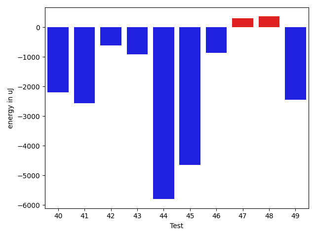

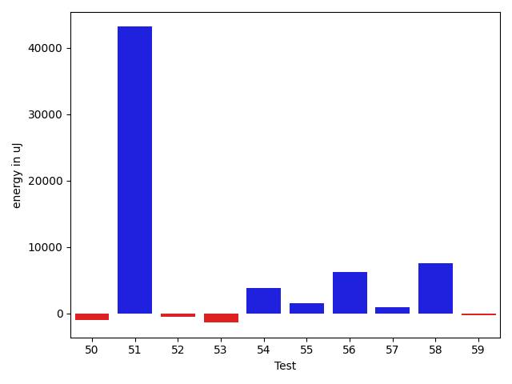

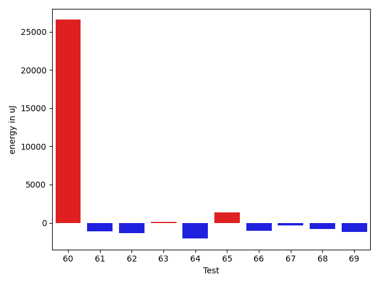

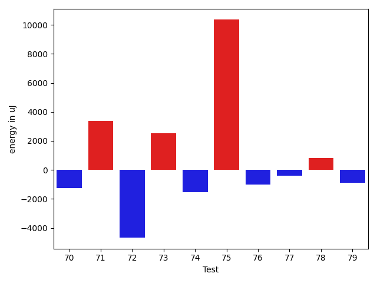

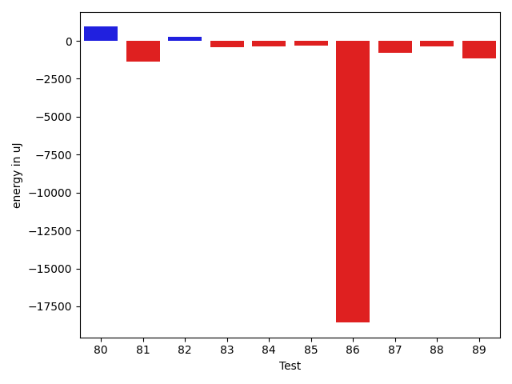

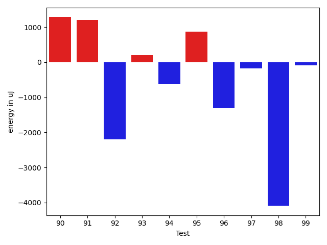

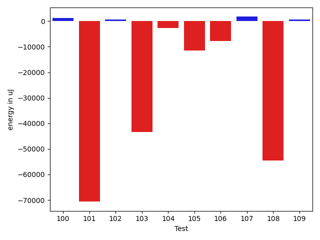

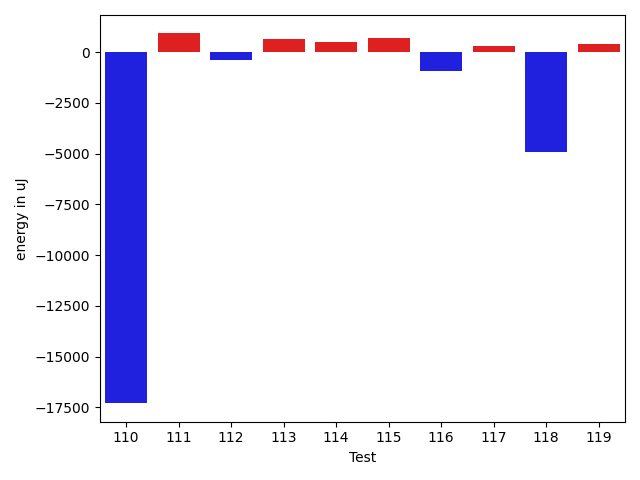

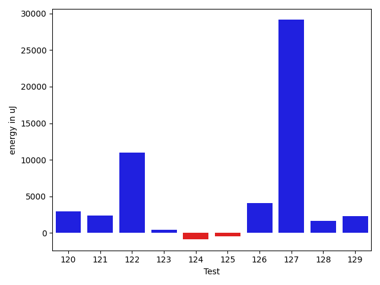

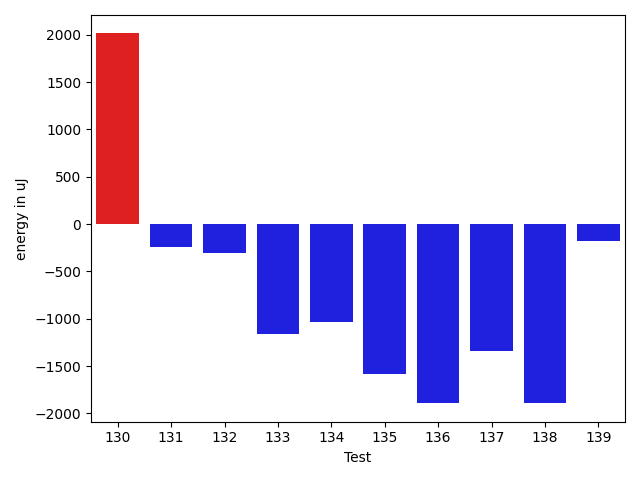

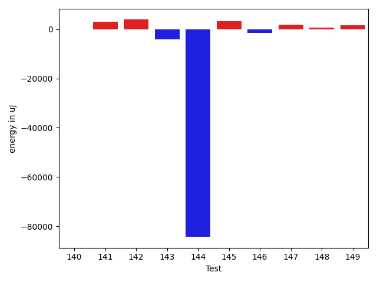

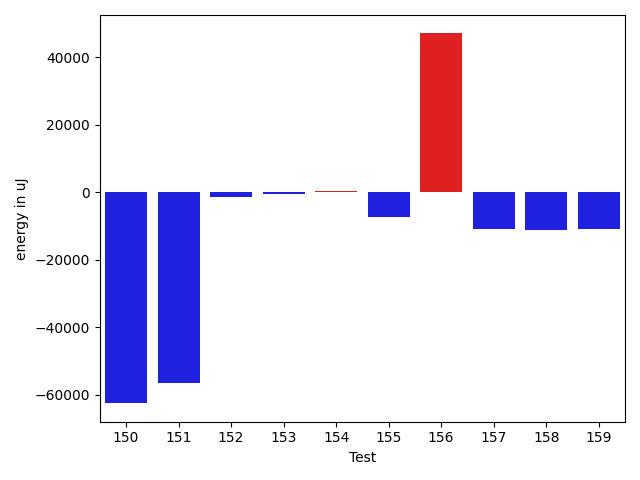

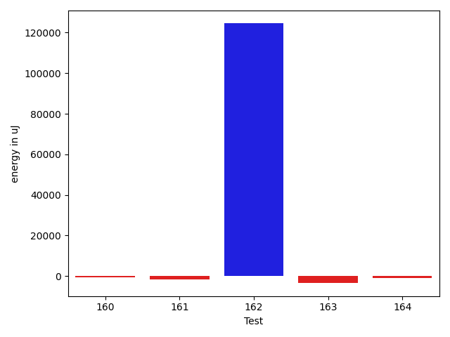

| ID | EnergyV1 | EnergyV2 | DeltaEnergy | σV1 | σV2 |
| --- | --- | --- | --- | --- | --- |
| 0 | 404967 | 396361 | -8606 | 387438.7820716008 | 350354.8968427249 |
| 1 | 71777 | 72448 | 671 | 30737.297973855777 | 28524.425172498875 |
| 2 | 45471 | 48340 | 2869 | 82748.21492326244 | 20360.90504542841 |
| 3 | 37049 | 36865 | -184 | 3966.304303555435 | 6014.571569532032 |
| 4 | 363037 | 367736 | 4699 | 107865.21135187797 | 66759.27799666085 |
| 5 | 107056 | 99426 | -7630 | 54321.912136344756 | 59002.6651413966 |
| 6 | 36194 | 36804 | 610 | 153490.38666091955 | 4658.0426591168025 |
| 7 | 38025 | 37659 | -366 | 5594.864800923456 | 7094.615253486973 |
| 8 | 37903 | 38758 | 855 | 4379.692520734451 | 3701.4786390457407 |
| 9 | 37110 | 37598 | 488 | 4161.702879723351 | 3876.1027033335877 |
| 10 | 37903 | 39184 | 1281 | 33401.49918636341 | 27079.24244228287 |
| 11 | 38818 | 39368 | 550 | 195410.30797141537 | 187083.67454814838 |
| 12 | 37780 | 37842 | 62 | 4227.346666021201 | 4453.453791891845 |
| 13 | 81604 | 80078 | -1526 | 21785.866788141382 | 21656.523664105414 |
| 14 | 39978 | 39795 | -183 | 16090.453614514208 | 14239.550167464176 |
| 15 | 39184 | 41809 | 2625 | 35482.2256726562 | 25502.98012642618 |
| 16 | 38147 | 37781 | -366 | 4394.75088892582 | 4201.021110318825 |
| 17 | 37536 | 38818 | 1282 | 4968.9548107403525 | 4500.941276844212 |
| 18 | 40527 | 37842 | -2685 | 16831.040433865044 | 11079.268268895492 |
| 19 | 36438 | 37963 | 1525 | 4090.514012489619 | 4566.785651112813 |
| 20 | 36011 | 37781 | 1770 | 5774.530545207832 | 3401.7429197349343 |
| 21 | 34912 | 36926 | 2014 | 4854.565037695491 | 3329.918582084795 |
| 22 | 37719 | 37720 | 1 | 3624.7108181971644 | 3850.1816328089185 |
| 23 | 36560 | 37842 | 1282 | 5699.1072348843145 | 4004.8212731629433 |
| 24 | 37353 | 37964 | 611 | 11813.652834928867 | 11038.192041907087 |
| 25 | 38208 | 37963 | -245 | 6318.286889704538 | 4223.197675556536 |
| 26 | 35583 | 36133 | 550 | 3820.220277155022 | 3790.0610137694666 |
| 27 | 84045 | 102173 | 18128 | 46082.7775864347 | 48013.32462568749 |
| 28 | 36926 | 37353 | 427 | 7342.466604172788 | 4221.208992317719 |
| 29 | 38391 | 39123 | 732 | 13573.379467987561 | 12846.24734359041 |
| 30 | 36255 | 37659 | 1404 | 4214.131013381624 | 4874.170078528968 |
| 31 | 34668 | 36621 | 1953 | 4861.344381748192 | 4449.526705916784 |
| 32 | 40161 | 38269 | -1892 | 15357.60246158136 | 9977.695169623545 |
| 33 | 38697 | 39611 | 914 | 4623.293176715024 | 4367.161702020801 |
| 34 | 36499 | 36194 | -305 | 4369.011468759083 | 3672.1233878782546 |
| 35 | 34363 | 38146 | 3783 | 4697.913662723262 | 4844.557183320006 |
| 36 | 35340 | 38329 | 2989 | 4302.419624633422 | 4316.800501014097 |
| 37 | 35828 | 37902 | 2074 | 3664.273590699799 | 3679.0475314799737 |
| 38 | 41077 | 40344 | -733 | 15182.021050089843 | 19116.20809923554 |
| 39 | 72815 | 72815 | 0 | 26544.3072640895 | 26367.88023627372 |
| 40 | 40344 | 38147 | -2197 | 8760.733944401773 | 21270.407011929157 |
| 41 | 39856 | 37292 | -2564 | 8342.071957241953 | 6610.917408496031 |
| 42 | 39428 | 38818 | -610 | 4870.01293187166 | 7773.594738146943 |
| 43 | 40100 | 39184 | -916 | 3782.715754195402 | 4590.106534348419 |
| 44 | 74096 | 68298 | -5798 | 44934.15035143682 | 45686.16289592779 |
| 45 | 39917 | 35278 | -4639 | 4014.0667993909183 | 4295.306407792436 |
| 46 | 41321 | 40467 | -854 | 18989.148417249882 | 16317.43458510476 |
| 47 | 40222 | 40528 | 306 | 13889.920351094786 | 10477.67108233298 |
| 48 | 39733 | 40100 | 367 | 3351.9096333284406 | 4871.302256557325 |
| 49 | 41138 | 38696 | -2442 | 6053.174514986717 | 9504.01894644037 |
| 50 | 38879 | 37964 | -915 | 4496.27972273093 | 3774.625439520812 |
| 51 | 41198 | 41259 | 61 | 171318.87867809506 | 320764.4910864837 |
| 52 | 39611 | 37597 | -2014 | 4211.663582112049 | 4897.251761708631 |
| 53 | 39795 | 38330 | -1465 | 7048.503378598633 | 4252.613088888639 |
| 54 | 39550 | 40100 | 550 | 16656.966782020747 | 22497.893530845395 |
| 55 | 39428 | 40161 | 733 | 10710.309303485692 | 12707.3450957398 |
| 56 | 41931 | 41443 | -488 | 28473.274108937065 | 34452.795482726535 |
| 57 | 37536 | 38635 | 1099 | 4728.822765326163 | 3992.4233977244235 |
| 58 | 81909 | 82336 | 427 | 31332.30868882567 | 35237.34265894799 |
| 59 | 38574 | 38635 | 61 | 4212.382559520811 | 4026.3246284720794 |
| 60 | 84107 | 90393 | 6286 | 146667.30146273915 | 201203.30153851747 |
| 61 | 38940 | 37109 | -1831 | 4471.104743916695 | 4052.61623885952 |
| 62 | 39612 | 37171 | -2441 | 19124.2476633578 | 15081.769337640933 |
| 63 | 38452 | 37903 | -549 | 5878.733858172598 | 7374.1242018122875 |
| 64 | 39306 | 37597 | -1709 | 3574.8795597649455 | 3821.5796092553855 |
| 65 | 39917 | 38696 | -1221 | 5485.605003096742 | 8100.953320836453 |
| 66 | 37659 | 36927 | -732 | 4190.917432998307 | 3779.396667350977 |
| 67 | 38941 | 37170 | -1771 | 4545.129865031362 | 4054.2664113101337 |
| 68 | 38879 | 36682 | -2197 | 4755.923487411487 | 4177.869315158498 |
| 69 | 38818 | 37231 | -1587 | 4389.161336565335 | 3897.4837365387452 |
| 70 | 37658 | 36316 | -1342 | 4425.424454736355 | 3646.9425256129234 |
| 71 | 43335 | 45471 | 2136 | 35505.33602187086 | 33577.16407686296 |
| 72 | 99304 | 91003 | -8301 | 32872.508132314615 | 29215.853678774703 |
| 73 | 39673 | 38940 | -733 | 6745.249263787725 | 14600.368459835061 |
| 74 | 39429 | 37232 | -2197 | 3261.5101318014868 | 3957.2301655745696 |
| 75 | 41992 | 41443 | -549 | 35420.15547401021 | 50951.91530119906 |
| 76 | 39673 | 38819 | -854 | 4218.443943412184 | 4472.153071107108 |
| 77 | 40283 | 40039 | -244 | 3599.1407653617675 | 3996.3683213183926 |
| 78 | 44129 | 42908 | -1221 | 15717.131596516654 | 14465.69320622152 |
| 79 | 40650 | 37109 | -3541 | 5246.842002360318 | 3445.266720518196 |
| 80 | 39245 | 40405 | 1160 | 3361.85351140351 | 4600.918721335165 |
| 81 | 41199 | 39795 | -1404 | 5696.523421474956 | 4109.375128193443 |
| 82 | 40772 | 38818 | -1954 | 3760.1474298814987 | 4320.811556633373 |
| 83 | 40467 | 40466 | -1 | 3343.818983670551 | 4289.203842999921 |
| 84 | 38940 | 39734 | 794 | 3053.9152094756437 | 4475.29437889596 |
| 85 | 39550 | 38513 | -1037 | 4069.155743917435 | 4896.590270248407 |
| 86 | 123962 | 125244 | 1282 | 320041.4173203354 | 234372.96936492293 |
| 87 | 38024 | 38025 | 1 | 6519.04477055363 | 4245.390903187397 |
| 88 | 37780 | 36987 | -793 | 3687.0743303128647 | 4564.923074611747 |
| 89 | 38513 | 36987 | -1526 | 5274.159008552929 | 3662.8105681611896 |
| 90 | 37293 | 38818 | 1525 | 3585.231288990371 | 3947.25654420121 |
| 91 | 37232 | 39124 | 1892 | 4083.5561445006906 | 3872.742932233045 |
| 92 | 42236 | 42236 | 0 | 29378.87375448436 | 24068.086006199923 |
| 93 | 37415 | 38269 | 854 | 3978.342430341506 | 4860.66800551905 |
| 94 | 37353 | 37354 | 1 | 4360.967027343849 | 4256.398716859454 |
| 95 | 38147 | 39124 | 977 | 3835.8665357708833 | 4168.978836464499 |
| 96 | 39856 | 40833 | 977 | 62032.35239213203 | 57191.88754276514 |
| 97 | 38452 | 38391 | -61 | 4009.1876655569913 | 3896.4772282063395 |
| 98 | 43213 | 39490 | -3723 | 23198.3542124686 | 20922.244622096823 |
| 99 | 37964 | 38147 | 183 | 3872.230926659075 | 4150.925532298955 |
| 100 | 37171 | 38086 | 915 | 4024.978737542485 | 3398.2832093328147 |
| 101 | 41870 | 42603 | 733 | 362816.443566096 | 275504.6321418268 |
| 102 | 38879 | 39367 | 488 | 5555.632465300972 | 4413.4004743436735 |
| 103 | 86365 | 87891 | 1526 | 364606.4411326101 | 248857.89943214296 |
| 104 | 43579 | 43823 | 244 | 25716.252942856587 | 20140.058228050628 |
| 105 | 93811 | 42602 | -51209 | 42551.949638903716 | 47977.42752238817 |
| 106 | 41137 | 40100 | -1037 | 24584.899515263834 | 13970.049325014093 |
| 107 | 37476 | 39368 | 1892 | 4176.2935782704635 | 4315.145161158543 |
| 108 | 40772 | 40344 | -428 | 281125.09411705664 | 172998.34767567957 |
| 109 | 37781 | 37842 | 61 | 3138.904377542907 | 4613.650072450272 |
| 110 | 175353 | 172179 | -3174 | 111717.90880991427 | 70415.70106140235 |
| 111 | 39551 | 41015 | 1464 | 3618.089102465816 | 4128.149568006354 |
| 112 | 38696 | 39489 | 793 | 3959.409461288334 | 4326.3711028990565 |
| 113 | 38269 | 39978 | 1709 | 6301.62693983775 | 5019.12881727931 |
| 114 | 39551 | 41809 | 2258 | 16257.868815810354 | 13416.68926217588 |
| 115 | 38635 | 38696 | 61 | 4181.697959239314 | 4241.726368239451 |
| 116 | 39612 | 38330 | -1282 | 3623.805609515437 | 4155.07513560768 |
| 117 | 38452 | 38940 | 488 | 4144.087054575757 | 4112.452338603833 |
| 118 | 39551 | 39306 | -245 | 27582.993634665545 | 21127.193977775518 |
| 119 | 38330 | 38636 | 306 | 3970.135756870014 | 4140.811423855702 |
| 120 | 38758 | 40222 | 1464 | 5699.438575795715 | 11165.909542581992 |
| 121 | 38879 | 39795 | 916 | 7990.448908255366 | 11871.319631863153 |
| 122 | 85449 | 85449 | 0 | 46494.180655049815 | 161771.39797269096 |
| 123 | 41198 | 41260 | 62 | 19242.092400974845 | 20003.222340576798 |
| 124 | 40283 | 39490 | -793 | 9900.55368576032 | 8561.015625169715 |
| 125 | 37842 | 38880 | 1038 | 6525.1157709859945 | 6339.35234878897 |
| 126 | 40039 | 40344 | 305 | 13238.070736610378 | 20825.670017202483 |
| 127 | 83862 | 85754 | 1892 | 206887.15118389606 | 283842.5897531606 |
| 128 | 39001 | 38940 | -61 | 6460.700308639214 | 9543.053121444173 |
| 129 | 40954 | 40954 | 0 | 10977.361505837582 | 13977.874955448982 |
| 130 | 39795 | 41809 | 2014 | 27362.218317249164 | 60411.01924958937 |
| 131 | 39734 | 39490 | -244 | 8858.860086667324 | 9919.90545038296 |
| 132 | 43762 | 43456 | -306 | 303167.39602044545 | 383119.07994765294 |
| 133 | 40954 | 39794 | -1160 | 17161.776711791867 | 21537.469621995988 |
| 134 | 39856 | 38818 | -1038 | 4508.308169925047 | 4926.655209659679 |
| 135 | 43335 | 41748 | -1587 | 20998.220745511026 | 19987.15531943579 |
| 136 | 44861 | 42968 | -1893 | 299036.54390324134 | 435452.9407319941 |
| 137 | 38575 | 37231 | -1344 | 6436.551056480246 | 4398.584468666695 |
| 138 | 40405 | 38513 | -1892 | 4394.561452106969 | 4558.841981381121 |
| 139 | 39001 | 38818 | -183 | 7912.440601341159 | 8271.685784890064 |
| 140 | 39978 | 37903 | -2075 | 4323.037469045021 | 4484.619570978122 |
| 141 | 74951 | 75988 | 1037 | 22951.6942986983 | 27458.39925407459 |
| 142 | 39917 | 41809 | 1892 | 6876.664259169073 | 12444.779939388076 |
| 143 | 40527 | 39307 | -1220 | 18108.14523407976 | 13781.55873027129 |
| 144 | 40588 | 39856 | -732 | 393158.05249507254 | 177839.99232142002 |
| 145 | 37415 | 38513 | 1098 | 4080.937285236451 | 5120.76599494646 |
| 146 | 40222 | 39978 | -244 | 20476.61316492832 | 18384.93904672436 |
| 147 | 40649 | 39978 | -671 | 36735.75727822205 | 38863.39482416495 |
| 148 | 38758 | 39001 | 243 | 3582.7745065703693 | 4071.656680426763 |
| 149 | 38574 | 39185 | 611 | 7380.780120731411 | 9093.797740907687 |
| 150 | 39062 | 38635 | -427 | 376281.7265472546 | 201895.1449817024 |
| 151 | 39368 | 38207 | -1161 | 273017.0850054216 | 4103.0133667220725 |
| 152 | 41016 | 38269 | -2747 | 5816.088585303595 | 4280.034975973392 |
| 153 | 36621 | 36560 | -61 | 6179.708955675786 | 3950.811427967413 |
| 154 | 37781 | 38025 | 244 | 4230.037557090953 | 4025.20279941134 |
| 155 | 298095 | 300292 | 2197 | 177021.33934729444 | 158570.49443286486 |
| 156 | 43701 | 42725 | -976 | 255031.47368226384 | 363807.1484008438 |
| 157 | 41138 | 38879 | -2259 | 34298.05652396117 | 17070.652329828914 |
| 158 | 41564 | 41015 | -549 | 381418.6494206771 | 353989.76906270324 |
| 159 | 41748 | 40649 | -1099 | 457845.6781255655 | 390273.4226266532 |
| 160 | 41565 | 39916 | -1649 | 5993.8383062608555 | 5775.594814233566 |
| 161 | 39551 | 38147 | -1404 | 5503.684751827634 | 3803.9301145152103 |
| 162 | 39184 | 40344 | 1160 | 3800.661501969359 | 343698.40052322956 |
| 163 | 41443 | 38208 | -3235 | 8023.173137685545 | 7055.570465837613 |
| 164 | 38330 | 38147 | -183 | 4532.640474764063 | 4195.940799288729 |

## Delta Duration per test method

| ID | DurationV1 | DurationsV2 | DeltaDuration |
| --- | --- | --- | --- |
| 0 | 17201777.757575758 | 15407706.474747475 | -1794071.2828282826 |
| 1 | 2378261.272727273 | 2302281.0707070706 | -75980.2020202023 |
| 2 | 1984901.313131313 | 1767756.0 | -217145.31313131307 |
| 3 | 741455.4038461539 | 747990.4871794871 | 6535.083333333256 |
| 4 | 10466463.282828283 | 10379523.696969697 | -86939.58585858531 |
| 5 | 3466384.121212121 | 3470306.0 | 3921.8787878789008 |
| 6 | 1833166.2372881356 | 778838.3870967742 | -1054327.8501913613 |
| 7 | 1048046.4857142858 | 1021476.5074626865 | -26569.97825159924 |
| 8 | 812529.350877193 | 762071.1086956522 | -50458.242181540816 |
| 9 | 928017.4423076923 | 905823.4423076923 | -22194.0 |
| 10 | 1232093.1492537314 | 1154444.3333333333 | -77648.8159203981 |
| 11 | 2665571.71875 | 2353484.046875 | -312087.671875 |
| 12 | 916218.6551724138 | 904950.3157894737 | -11268.339382940088 |
| 13 | 2437780.696969697 | 2418144.242424242 | -19636.454545454588 |
| 14 | 1245403.861111111 | 1157853.2692307692 | -87550.59188034176 |
| 15 | 1289402.828125 | 1173452.6833333333 | -115950.14479166665 |
| 16 | 807724.8285714285 | 762462.2105263158 | -45262.6180451127 |
| 17 | 770072.074074074 | 756844.94 | -13227.1340740741 |
| 18 | 1051621.96 | 888883.4905660377 | -162738.46943396225 |
| 19 | 682506.0638297872 | 649215.4222222222 | -33290.64160756499 |
| 20 | 980599.8928571428 | 892914.5789473684 | -87685.31390977441 |
| 21 | 524918.4285714285 | 478249.5 | -46668.92857142852 |
| 22 | 642911.5666666667 | 610791.0322580645 | -32120.534408602165 |
| 23 | 867100.0909090909 | 885676.298245614 | 18576.207336523104 |
| 24 | 1189562.152542373 | 1056222.552238806 | -133339.60030356701 |
| 25 | 999507.6428571428 | 1017259.2459016393 | 17751.6030444965 |
| 26 | 790039.0952380953 | 785857.4761904762 | -4181.619047619053 |
| 27 | 2534700.303030303 | 2640646.3917525774 | 105946.08872227417 |
| 28 | 983768.1698113207 | 915137.5714285715 | -68630.59838274925 |
| 29 | 1339720.3870967743 | 1300477.7252747254 | -39242.66182204895 |
| 30 | 835889.5813953489 | 771535.9375 | -64353.64389534888 |
| 31 | 582035.3243243244 | 574792.6333333333 | -7242.6909909910755 |
| 32 | 1241104.648148148 | 1061560.7307692308 | -179543.91737891734 |
| 33 | 491534.6551724138 | 518654.25 | 27119.594827586203 |
| 34 | 754421.9607843137 | 796226.1555555556 | 41804.19477124186 |
| 35 | 501196.9655172414 | 474280.82608695654 | -26916.13943028485 |
| 36 | 537971.3225806452 | 566996.4666666667 | 29025.144086021464 |
| 37 | 513561.8 | 506569.06666666665 | -6992.733333333337 |
| 38 | 1343363.5679012346 | 1429573.3209876544 | 86209.75308641978 |
| 39 | 1932041.8383838383 | 2011199.2424242424 | 79157.40404040413 |
| 40 | 1058276.6176470588 | 1296321.40625 | 238044.7886029412 |
| 41 | 941462.3478260869 | 983468.671641791 | 42006.32381570409 |
| 42 | 997889.7777777778 | 1019084.0704225352 | 21194.29264475743 |
| 43 | 733187.9811320754 | 734734.2040816327 | 1546.2229495572392 |
| 44 | 2207729.606060606 | 2294561.3535353537 | 86831.74747474771 |
| 45 | 629163.9090909091 | 655543.4242424242 | 26379.515151515137 |
| 46 | 1335596.175 | 1293898.4146341463 | -41697.760365853785 |
| 47 | 1226068.6233766233 | 1191271.3026315789 | -34797.32074504439 |
| 48 | 466806.45 | 488136.23529411765 | 21329.78529411764 |
| 49 | 663400.5217391305 | 788560.7727272727 | 125160.25098814222 |
| 50 | 744775.0227272727 | 740636.25 | -4138.772727272706 |
| 51 | 1961188.6785714286 | 3091599.7317073173 | 1130411.0531358887 |
| 52 | 549412.0333333333 | 627523.6666666666 | 78111.6333333333 |
| 53 | 913649.4912280702 | 909332.8307692307 | -4316.6604588394985 |
| 54 | 1136435.3469387756 | 1223735.3392857143 | 87299.9923469387 |
| 55 | 1251215.2 | 1295143.4666666666 | 43928.266666666605 |
| 56 | 1303401.4098360655 | 1585942.641509434 | 282541.2316733685 |
| 57 | 885401.5490196078 | 866295.6470588235 | -19105.901960784337 |
| 58 | 2614120.474747475 | 2873648.131313131 | 259527.65656565642 |
| 59 | 627047.4285714285 | 639370.0882352941 | 12322.659663865576 |
| 60 | 3728989.4242424243 | 4660056.060606061 | 931066.6363636362 |
| 61 | 924594.2 | 909416.2786885246 | -15177.921311475337 |
| 62 | 822706.5 | 963473.6470588235 | 140767.1470588235 |
| 63 | 1059026.2588235294 | 1125864.963414634 | 66838.70459110476 |
| 64 | 537994.9310344828 | 591520.1944444445 | 53525.26340996171 |
| 65 | 731654.125 | 784424.8421052631 | 52770.717105263146 |
| 66 | 944890.2857142857 | 958976.0285714286 | 14085.742857142934 |
| 67 | 602645.7666666667 | 661727.6857142857 | 59081.91904761898 |
| 68 | 613979.1071428572 | 645082.7105263158 | 31103.603383458685 |
| 69 | 548806.52 | 591200.7272727273 | 42394.207272727275 |
| 70 | 633396.7096774194 | 672541.6363636364 | 39144.92668621696 |
| 71 | 1844438.8488372094 | 1977537.4597701149 | 133098.61093290546 |
| 72 | 3045363.262626263 | 2907450.3131313133 | -137912.94949494954 |
| 73 | 1042927.7887323943 | 1152798.392857143 | 109870.60412474861 |
| 74 | 620012.75 | 530596.2777777778 | -89416.47222222225 |
| 75 | 1379232.0166666666 | 1564900.0806451612 | 185668.0639784946 |
| 76 | 552371.5625 | 576889.947368421 | 24518.38486842101 |
| 77 | 468799.4 | 460210.4285714286 | -8588.971428571444 |
| 78 | 1103166.3333333333 | 1177478.65625 | 74312.32291666674 |
| 79 | 427498.6666666667 | 481482.64285714284 | 53983.976190476154 |
| 80 | 486810.8695652174 | 490312.4210526316 | 3501.5514874141663 |
| 81 | 418095.8947368421 | 464835.2727272727 | 46739.37799043063 |
| 82 | 438872.77777777775 | 448726.14285714284 | 9853.365079365089 |
| 83 | 434127.86666666664 | 464839.26086956525 | 30711.394202898606 |
| 84 | 396768.3333333333 | 423179.44444444444 | 26411.111111111124 |
| 85 | 844590.1355932204 | 871622.5370370371 | 27032.40144381672 |
| 86 | 5455591.96969697 | 4989699.313131313 | -465892.6565656569 |
| 87 | 918398.2033898305 | 843919.693877551 | -74478.50951227953 |
| 88 | 719361.5454545454 | 685230.4651162791 | -34131.08033826633 |
| 89 | 926560.45 | 863355.0350877193 | -63205.41491228063 |
| 90 | 802001.6 | 758241.0408163265 | -43760.55918367347 |
| 91 | 722095.6511627907 | 572433.0952380953 | -149662.55592469545 |
| 92 | 1759447.6767676768 | 1610460.1414141415 | -148987.53535353532 |
| 93 | 795163.3958333334 | 754803.6666666666 | -40359.729166666744 |
| 94 | 678696.2777777778 | 697846.4634146341 | 19150.18563685636 |
| 95 | 620145.3333333334 | 566962.1666666666 | -53183.166666666744 |
| 96 | 1890832.0416666667 | 1805422.3684210526 | -85409.67324561416 |
| 97 | 579322.0555555555 | 547100.9583333334 | -32221.09722222213 |
| 98 | 1144054.423076923 | 1005027.1363636364 | -139027.28671328665 |
| 99 | 812078.65 | 742401.1666666666 | -69677.4833333334 |
| 100 | 514759.9032258064 | 483274.25 | -31485.653225806425 |
| 101 | 6796139.80952381 | 4692710.409090909 | -2103429.4004329005 |
| 102 | 1019975.4722222222 | 990897.3134328359 | -29078.15878938639 |
| 103 | 5121963.121212121 | 3822246.0 | -1299717.121212121 |
| 104 | 1803043.092783505 | 1735549.2474226805 | -67493.8453608246 |
| 105 | 2226754.1818181816 | 1788731.564102564 | -438022.61771561764 |
| 106 | 1156057.8636363635 | 864901.5128205129 | -291156.35081585066 |
| 107 | 765884.6764705882 | 715960.1081081082 | -49924.56836248003 |
| 108 | 3732225.5094339624 | 2115839.0476190476 | -1616386.4618149148 |
| 109 | 762177.7777777778 | 697055.2 | -65122.5777777778 |
| 110 | 5770255.858585859 | 5059175.080808081 | -711080.777777778 |
| 111 | 581417.3225806452 | 595226.3939393939 | 13809.071358748712 |
| 112 | 896919.5303030303 | 849206.52 | -47713.010303030256 |
| 113 | 1028329.0533333333 | 998178.5616438356 | -30150.49168949772 |
| 114 | 738501.6111111111 | 688461.7352941176 | -50039.87581699353 |
| 115 | 691445.1739130435 | 678827.8604651163 | -12617.313447927125 |
| 116 | 814319.6833333333 | 798100.5882352941 | -16219.095098039252 |
| 117 | 894333.2884615385 | 878820.4237288135 | -15512.864732724964 |
| 118 | 1051535.3 | 885322.8965517242 | -166212.40344827587 |
| 119 | 441719.3157894737 | 424843.5909090909 | -16875.724880382826 |
| 120 | 1091888.9268292682 | 1123289.6666666667 | 31400.73983739852 |
| 121 | 1111950.4805194805 | 1192618.4691358025 | 80667.98861632193 |
| 122 | 2833029.121212121 | 3214902.97979798 | 381873.8585858587 |
| 123 | 1205505.4782608696 | 1177442.9682539683 | -28062.510006901342 |
| 124 | 1164229.8266666667 | 1230274.8933333333 | 66045.06666666665 |
| 125 | 869454.1860465116 | 906426.4262295082 | 36972.24018299661 |
| 126 | 900872.45 | 1189126.2826086956 | 288253.8326086956 |
| 127 | 3818877.727272727 | 4580110.898989899 | 761233.171717172 |
| 128 | 1060394.2753623188 | 1088217.9367088608 | 27823.66134654195 |
| 129 | 1242446.7528089888 | 1337858.4606741574 | 95411.70786516857 |
| 130 | 1424946.8255813953 | 2001601.0705882353 | 576654.24500684 |
| 131 | 1134677.25 | 1221843.8488372094 | 87166.5988372094 |
| 132 | 2967343.0547945206 | 4382786.225352113 | 1415443.1705575925 |
| 133 | 1192853.3934426229 | 1320880.6133333333 | 128027.21989071043 |
| 134 | 870986.593220339 | 941201.2424242424 | 70214.64920390339 |
| 135 | 1478826.0344827587 | 1442952.465116279 | -35873.56936647976 |
| 136 | 3489518.8529411764 | 5391824.822580645 | 1902305.9696394685 |
| 137 | 831872.731707317 | 874340.5681818182 | 42467.83647450118 |
| 138 | 691024.0769230769 | 686817.0303030303 | -4207.0466200466035 |
| 139 | 980383.0545454546 | 956885.6078431372 | -23497.446702317335 |
| 140 | 790509.9387755102 | 775770.44 | -14739.498775510234 |
| 141 | 1952313.7878787878 | 1993617.3636363635 | 41303.57575757569 |
| 142 | 752036.5925925926 | 888184.7142857143 | 136148.12169312174 |
| 143 | 1236137.4782608696 | 1193724.4057971016 | -42413.07246376807 |
| 144 | 4398598.642857143 | 1749836.4561403508 | -2648762.186716792 |
| 145 | 449991.0 | 430382.0 | -19609.0 |
| 146 | 1075179.8727272728 | 1011045.3469387755 | -64134.525788497296 |
| 147 | 1690339.1 | 1783659.4157303371 | 93320.31573033705 |
| 148 | 453624.0416666667 | 463842.2916666667 | 10218.25 |
| 149 | 947225.2765957447 | 864905.4629629629 | -82319.81363278173 |
| 150 | 3434128.4545454546 | 1811519.2926829269 | -1622609.1618625277 |
| 151 | 2398276.72 | 682825.0 | -1715451.7200000002 |
| 152 | 592573.2777777778 | 449344.6666666667 | -143228.61111111107 |
| 153 | 674405.0 | 611359.5172413794 | -63045.48275862064 |
| 154 | 600558.48 | 574210.9583333334 | -26347.52166666661 |
| 155 | 9004286.757575758 | 8788983.747474747 | -215303.01010101102 |
| 156 | 2822233.6896551726 | 4337206.666666667 | 1514972.9770114943 |
| 157 | 1635380.012345679 | 1322594.644736842 | -312785.3676088371 |
| 158 | 4061020.342465753 | 3444141.6533333333 | -616878.6891324199 |
| 159 | 4682010.535714285 | 4991297.416666667 | 309286.8809523815 |
| 160 | 957158.82 | 897806.2033898305 | -59352.61661016941 |
| 161 | 383448.0 | 455721.2727272727 | 72273.2727272727 |
| 162 | 530025.3913043478 | 4337378.192307692 | 3807352.8010033444 |
| 163 | 1078995.8095238095 | 634010.48 | -444985.3295238095 |
| 164 | 510543.85714285716 | 442232.15789473685 | -68311.6992481203 |

## Misc.

| ID | Test Class | Test Method |
| --- | --- | --- |
| 0 | com.google.gson.DefaultDateTypeAdapterTest | testParsingDatesFormattedWithUsLocale |
| 1 | com.google.gson.DefaultDateTypeAdapterTest | testFormattingInEnUs |
| 2 | com.google.gson.DefaultDateTypeAdapterTest | testFormatUsesDefaultTimezone |
| 3 | com.google.gson.DefaultDateTypeAdapterTest | testDatePattern |
| 4 | com.google.gson.DefaultDateTypeAdapterTest | testParsingDatesFormattedWithSystemLocale |
| 5 | com.google.gson.DefaultDateTypeAdapterTest | testFormattingInFr |
| 6 | com.google.gson.DefaultDateTypeAdapterTest | testDateSerialization |
| 7 | com.google.gson.functional.CustomTypeAdaptersTest | testCustomAdapterInvokedForCollectionElementDeserialization |
| 8 | com.google.gson.functional.CustomTypeAdaptersTest | testCustomTypeAdapterAppliesToSubClassesSerializedAsBaseClass |
| 9 | com.google.gson.functional.CustomTypeAdaptersTest | testCustomAdapterInvokedForMapElementSerializationWithType |
| 10 | com.google.gson.functional.CustomTypeAdaptersTest | testCustomNestedSerializers |
| 11 | com.google.gson.functional.CustomTypeAdaptersTest | testCustomSerializers |
| 12 | com.google.gson.functional.CustomTypeAdaptersTest | testCustomNestedDeserializers |
| 13 | com.google.gson.functional.CustomTypeAdaptersTest | testCustomTypeAdapterDoesNotAppliesToSubClasses |
| 14 | com.google.gson.functional.CustomTypeAdaptersTest | testCustomAdapterInvokedForCollectionElementSerializationWithType |
| 15 | com.google.gson.functional.CustomTypeAdaptersTest | testCustomDeserializers |
| 16 | com.google.gson.functional.CustomTypeAdaptersTest | testCustomByteArrayDeserializerAndInstanceCreator |
| 17 | com.google.gson.functional.CustomTypeAdaptersTest | testCustomByteArraySerializer |
| 18 | com.google.gson.functional.CustomTypeAdaptersTest | testEnsureCustomSerializerNotInvokedForNullValues |
| 19 | com.google.gson.functional.CustomTypeAdaptersTest | testEnsureCustomDeserializerNotInvokedForNullValues |
| 20 | com.google.gson.functional.CustomTypeAdaptersTest | testCustomAdapterInvokedForMapElementDeserialization |
| 21 | com.google.gson.functional.CustomTypeAdaptersTest | testCustomAdapterInvokedForMapElementSerialization |
| 22 | com.google.gson.functional.CustomTypeAdaptersTest | testCustomAdapterInvokedForCollectionElementSerialization |
| 23 | com.google.gson.functional.DefaultTypeAdaptersTest | testDateSerializationWithPatternNotOverridenByTypeAdapter |
| 24 | com.google.gson.functional.DefaultTypeAdaptersTest | testDateSerializationWithPattern |
| 25 | com.google.gson.functional.DefaultTypeAdaptersTest | testBitSetDeserialization |
| 26 | com.google.gson.functional.DefaultTypeAdaptersTest | testSqlDateSerialization |
| 27 | com.google.gson.functional.DefaultTypeAdaptersTest | testDefaultDateDeserializationUsingBuilder |
| 28 | com.google.gson.functional.DefaultTypeAdaptersTest | testDateDeserializationWithPattern |
| 29 | com.google.gson.functional.DefaultTypeAdaptersTest | testDateSerializationInCollection |
| 30 | com.google.gson.functional.DefaultTypeAdaptersTest | testDefaultDateSerializationUsingBuilder |
| 31 | com.google.gson.functional.DefaultTypeAdaptersTest | testDefaultCalendarDeserialization |
| 32 | com.google.gson.functional.DefaultTypeAdaptersTest | testSetSerialization |
| 33 | com.google.gson.functional.DefaultTypeAdaptersTest | testBitSetSerialization |
| 34 | com.google.gson.functional.DefaultTypeAdaptersTest | testTimestampSerialization |
| 35 | com.google.gson.functional.DefaultTypeAdaptersTest | testDefaultGregorianCalendarSerialization |
| 36 | com.google.gson.functional.DefaultTypeAdaptersTest | testDefaultCalendarSerialization |
| 37 | com.google.gson.functional.DefaultTypeAdaptersTest | testDefaultGregorianCalendarDeserialization |
| 38 | com.google.gson.functional.MapTest | testSerializeMaps |
| 39 | com.google.gson.functional.MapTest | testInterfaceTypeMapWithSerializer |
| 40 | com.google.gson.functional.MapTest | testMapSubclassDeserialization |
| 41 | com.google.gson.functional.MapTest | testCustomSerializerForSpecificMapType |
| 42 | com.google.gson.functional.MapTest | testGeneralMapField |
| 43 | com.google.gson.functional.MapTest | testMapSerializationWithNullValueButSerializeNulls |
| 44 | com.google.gson.functional.MapTest | testInterfaceTypeMap |
| 45 | com.google.gson.functional.MapTest | testMapSerializationWithNullValuesSerialized |
| 46 | com.google.gson.functional.ReadersWritersTest | testReadWriteTwoObjects |
| 47 | com.google.gson.functional.ReadersWritersTest | testReadWriteTwoStrings |
| 48 | com.google.gson.functional.ReadersWritersTest | testTopLevelNullObjectDeserializationWithReaderAndSerializeNulls |
| 49 | com.google.gson.functional.ReadersWritersTest | testTopLevelNullObjectSerializationWithWriterAndSerializeNulls |
| 50 | com.google.gson.functional.FieldExclusionTest | testDefaultNestedStaticClassIncluded |
| 51 | com.google.gson.functional.FieldExclusionTest | testDefaultInnerClassExclusion |
| 52 | com.google.gson.functional.FieldExclusionTest | testInnerClassExclusion |
| 53 | com.google.gson.functional.CustomDeserializerTest | testCustomDeserializerReturnsNullForArrayElementsForArrayField |
| 54 | com.google.gson.functional.CustomDeserializerTest | testCustomDeserializerReturnsNull |
| 55 | com.google.gson.functional.CustomDeserializerTest | testJsonTypeFieldBasedDeserialization |
| 56 | com.google.gson.functional.CustomDeserializerTest | testCustomDeserializerReturnsNullForTopLevelObject |
| 57 | com.google.gson.functional.CustomDeserializerTest | testCustomDeserializerReturnsNullForArrayElements |
| 58 | com.google.gson.functional.NamingPolicyTest | testGsonWithNonDefaultFieldNamingPolicySerialization |
| 59 | com.google.gson.functional.NamingPolicyTest | testGsonWithLowerCaseDashPolicyDeserialiation |
| 60 | com.google.gson.functional.NamingPolicyTest | testGsonDuplicateNameUsingSerializedNameFieldNamingPolicySerialization |
| 61 | com.google.gson.functional.NamingPolicyTest | testGsonWithSerializedNameFieldNamingPolicySerialization |
| 62 | com.google.gson.functional.NamingPolicyTest | testGsonWithNonDefaultFieldNamingPolicyDeserialiation |
| 63 | com.google.gson.functional.NamingPolicyTest | testDeprecatedNamingStrategy |
| 64 | com.google.gson.functional.NamingPolicyTest | testGsonWithUpperCamelCaseSpacesPolicySerialiation |
| 65 | com.google.gson.functional.NamingPolicyTest | testGsonWithSerializedNameFieldNamingPolicyDeserialization |
| 66 | com.google.gson.functional.NamingPolicyTest | testComplexFieldNameStrategy |
| 67 | com.google.gson.functional.NamingPolicyTest | testGsonWithLowerCaseUnderscorePolicySerialization |
| 68 | com.google.gson.functional.NamingPolicyTest | testGsonWithLowerCaseUnderscorePolicyDeserialiation |
| 69 | com.google.gson.functional.NamingPolicyTest | testGsonWithUpperCamelCaseSpacesPolicyDeserialiation |
| 70 | com.google.gson.functional.NamingPolicyTest | testGsonWithLowerCaseDashPolicySerialization |
| 71 | com.google.gson.JsonDeserializerExceptionWrapperTest | testProperSerialization |
| 72 | com.google.gson.functional.ObjectTest | testSingletonLists |
| 73 | com.google.gson.functional.ObjectTest | testInnerClassDeserialization |
| 74 | com.google.gson.functional.ObjectTest | testJsonObjectSerialization |
| 75 | com.google.gson.functional.PrimitiveTest | testHtmlCharacterSerialization |
| 76 | com.google.gson.functional.PrimitiveTest | testLongAsStringSerialization |
| 77 | com.google.gson.functional.PrimitiveTest | testFloatNaNSerialization |
| 78 | com.google.gson.functional.PrimitiveTest | testMoreSpecificSerialization |
| 79 | com.google.gson.functional.PrimitiveTest | testDoubleInfinitySerialization |
| 80 | com.google.gson.functional.PrimitiveTest | testLongAsStringDeserialization |
| 81 | com.google.gson.functional.PrimitiveTest | testFloatInfinitySerialization |
| 82 | com.google.gson.functional.PrimitiveTest | testDoubleNaNSerialization |
| 83 | com.google.gson.functional.PrimitiveTest | testNegativeInfinitySerialization |
| 84 | com.google.gson.functional.PrimitiveTest | testNegativeInfinityFloatSerialization |
| 85 | com.google.gson.functional.TypeHierarchyAdapterTest | testRegisterSuperTypeFirst |
| 86 | com.google.gson.functional.TypeHierarchyAdapterTest | testTypeHierarchy |
| 87 | com.google.gson.functional.NullObjectAndFieldTest | testCustomTypeAdapterPassesNullDesrialization |
| 88 | com.google.gson.functional.NullObjectAndFieldTest | testExplicitSerializationOfNullCollectionMembers |
| 89 | com.google.gson.functional.NullObjectAndFieldTest | testPrintPrintingObjectWithNulls |
| 90 | com.google.gson.functional.NullObjectAndFieldTest | testNullWrappedPrimitiveMemberSerialization |
| 91 | com.google.gson.functional.NullObjectAndFieldTest | testExplicitNullSetsFieldToNullDuringDeserialization |
| 92 | com.google.gson.functional.NullObjectAndFieldTest | testExplicitSerializationOfNullArrayMembers |
| 93 | com.google.gson.functional.NullObjectAndFieldTest | testExplicitDeserializationOfNulls |
| 94 | com.google.gson.functional.NullObjectAndFieldTest | testExplicitSerializationOfNullStringMembers |
| 95 | com.google.gson.functional.NullObjectAndFieldTest | testPrintPrintingArraysWithNulls |
| 96 | com.google.gson.functional.NullObjectAndFieldTest | testExplicitSerializationOfNulls |
| 97 | com.google.gson.functional.NullObjectAndFieldTest | testNullWrappedPrimitiveMemberDeserialization |
| 98 | com.google.gson.functional.NullObjectAndFieldTest | testTopLevelNullObjectDeserialization |
| 99 | com.google.gson.functional.NullObjectAndFieldTest | testCustomSerializationOfNulls |
| 100 | com.google.gson.functional.NullObjectAndFieldTest | testCustomTypeAdapterPassesNullSerialization |
| 101 | com.google.gson.functional.NullObjectAndFieldTest | testTopLevelNullObjectSerialization |
| 102 | com.google.gson.functional.TypeVariableTest | testBasicTypeVariables |
| 103 | com.google.gson.functional.TypeVariableTest | testAdvancedTypeVariables |
| 104 | com.google.gson.functional.TypeVariableTest | testTypeVariablesViaTypeParameter |
| 105 | com.google.gson.functional.SecurityTest | testJsonWithNonExectuableTokenSerialization |
| 106 | com.google.gson.functional.SecurityTest | testNonExecutableJsonDeserialization |
| 107 | com.google.gson.functional.SecurityTest | testJsonWithNonExectuableTokenWithRegularGsonDeserialization |
| 108 | com.google.gson.functional.SecurityTest | testNonExecutableJsonSerialization |
| 109 | com.google.gson.functional.SecurityTest | testJsonWithNonExectuableTokenWithConfiguredGsonDeserialization |
| 110 | com.google.gson.functional.VersioningTest | testVersionedUntilSerialization |
| 111 | com.google.gson.functional.VersioningTest | testIgnoreLaterVersionClassSerialization |
| 112 | com.google.gson.functional.VersioningTest | testVersionedClassesSerialization |
| 113 | com.google.gson.functional.VersioningTest | testVersionedGsonMixingSinceAndUntilSerialization |
| 114 | com.google.gson.functional.VersioningTest | testVersionedUntilDeserialization |
| 115 | com.google.gson.functional.VersioningTest | testVersionedGsonWithUnversionedClassesDeserialization |
| 116 | com.google.gson.functional.VersioningTest | testVersionedClassesDeserialization |
| 117 | com.google.gson.functional.VersioningTest | testVersionedGsonMixingSinceAndUntilDeserialization |
| 118 | com.google.gson.functional.VersioningTest | testVersionedGsonWithUnversionedClassesSerialization |
| 119 | com.google.gson.functional.VersioningTest | testIgnoreLaterVersionClassDeserialization |
| 120 | com.google.gson.functional.MapAsArrayTypeAdapterTest | testMultipleEnableComplexKeyRegistrationHasNoEffect |
| 121 | com.google.gson.functional.MapAsArrayTypeAdapterTest | testMapWithTypeVariableDeserialization |
| 122 | com.google.gson.functional.MapAsArrayTypeAdapterTest | testSerializeComplexMapWithTypeAdapter |
| 123 | com.google.gson.functional.MapAsArrayTypeAdapterTest | testTwoTypesCollapseToOneDeserialize |
| 124 | com.google.gson.functional.MapAsArrayTypeAdapterTest | testMapWithTypeVariableSerialization |
| 125 | com.google.gson.functional.ExclusionStrategyFunctionalTest | testExclusionStrategyWithMode |
| 126 | com.google.gson.functional.ExclusionStrategyFunctionalTest | testExclusionStrategyDeserialization |
| 127 | com.google.gson.functional.ExclusionStrategyFunctionalTest | testExclusionStrategySerialization |
| 128 | com.google.gson.functional.ParameterizedTypesTest | testParameterizedTypeWithReaderDeserialization |
| 129 | com.google.gson.functional.ParameterizedTypesTest | testParameterizedTypeWithCustomSerializer |
| 130 | com.google.gson.functional.ParameterizedTypesTest | testParameterizedTypeDeserialization |
| 131 | com.google.gson.functional.ParameterizedTypesTest | testParameterizedTypesWithCustomDeserializer |
| 132 | com.google.gson.functional.InstanceCreatorTest | testInstanceCreatorReturnsBaseType |
| 133 | com.google.gson.functional.InstanceCreatorTest | testInstanceCreatorReturnsSubTypeForField |
| 134 | com.google.gson.functional.InstanceCreatorTest | testInstanceCreatorReturnsSubTypeForTopLevelObject |
| 135 | com.google.gson.functional.EscapingTest | testGsonAcceptsEscapedAndNonEscapedJsonDeserialization |
| 136 | com.google.gson.functional.CustomSerializerTest | testSubClassSerializerInvokedForBaseClassFieldsHoldingSubClassInstances |
| 137 | com.google.gson.functional.CustomSerializerTest | testBaseClassSerializerInvokedForBaseClassFieldsHoldingSubClassInstances |
| 138 | com.google.gson.functional.CustomSerializerTest | testBaseClassSerializerInvokedForBaseClassFields |
| 139 | com.google.gson.functional.CustomSerializerTest | testSubClassSerializerInvokedForBaseClassFieldsHoldingArrayOfSubClassInstances |
| 140 | com.google.gson.functional.CustomSerializerTest | testSerializerReturnsNull |
| 141 | com.google.gson.functional.UncategorizedTest | testReturningDerivedClassesDuringDeserialization |
| 142 | com.google.gson.functional.ArrayTest | testNullsInArrayWithSerializeNullPropertySetSerialization |
| 143 | com.google.gson.MixedStreamTest | testWriteLenient |
| 144 | com.google.gson.MixedStreamTest | testWriteMixedStreamed |
| 145 | com.google.gson.MixedStreamTest | testWriteNulls |
| 146 | com.google.gson.MixedStreamTest | testReadMixedStreamed |
| 147 | com.google.gson.MixedStreamTest | testWriteHtmlSafe |
| 148 | com.google.gson.MixedStreamTest | testReadNulls |
| 149 | com.google.gson.MixedStreamTest | testReadClosed |
| 150 | com.google.gson.MixedStreamTest | testReaderDoesNotMutateState |
| 151 | com.google.gson.MixedStreamTest | testWriteDoesNotMutateState |
| 152 | com.google.gson.MixedStreamTest | testReadInvalidState |
| 153 | com.google.gson.MixedStreamTest | testWriteInvalidState |
| 154 | com.google.gson.MixedStreamTest | testWriteClosed |
| 155 | com.google.gson.functional.CircularReferenceTest | testSelfReferenceCustomHandlerSerialization |
| 156 | com.google.gson.JsonParserTest | testReadWriteTwoObjects |
| 157 | com.google.gson.functional.EnumTest | testEnumSubclassWithRegisteredTypeAdapter |
| 158 | com.google.gson.CommentsTest | testParseComments |
| 159 | com.google.gson.GsonBuilderTest | testCreatingMoreThanOnce |
| 160 | com.google.gson.DefaultMapJsonSerializerTest | testNonEmptyMapSerialization |
| 161 | com.google.gson.JsonObjectTest | testWritePropertyWithEmptyStringName |
| 162 | com.google.gson.JsonObjectTest | testPropertyWithQuotes |
| 163 | com.google.gson.functional.PrintFormattingTest | testJsonObjectWithNullValuesSerialized |
| 164 | com.google.gson.internal.ParameterizedTypeHandlerMapTest | testMakeUnmodifiable |

| Test | IterationV1 | IterationV2 | DeltaIteration |
| --- | --- | --- | --- |
| 0 | 99 | 99 | 0 |
| 1 | 99 | 99 | 0 |
| 2 | 99 | 99 | 0 |
| 3 | 52 | 39 | -13 |
| 4 | 99 | 99 | 0 |
| 5 | 99 | 99 | 0 |
| 6 | 59 | 62 | 3 |
| 7 | 70 | 67 | -3 |
| 8 | 57 | 46 | -11 |
| 9 | 52 | 52 | 0 |
| 10 | 67 | 66 | -1 |
| 11 | 64 | 64 | 0 |
| 12 | 58 | 57 | -1 |
| 13 | 99 | 99 | 0 |
| 14 | 72 | 78 | 6 |
| 15 | 64 | 60 | -4 |
| 16 | 70 | 57 | -13 |
| 17 | 54 | 50 | -4 |
| 18 | 50 | 53 | 3 |
| 19 | 47 | 45 | -2 |
| 20 | 56 | 57 | 1 |
| 21 | 21 | 26 | 5 |
| 22 | 30 | 31 | 1 |
| 23 | 55 | 57 | 2 |
| 24 | 59 | 67 | 8 |
| 25 | 70 | 61 | -9 |
| 26 | 42 | 42 | 0 |
| 27 | 99 | 97 | -2 |
| 28 | 53 | 56 | 3 |
| 29 | 93 | 91 | -2 |
| 30 | 43 | 48 | 5 |
| 31 | 37 | 30 | -7 |
| 32 | 54 | 52 | -2 |
| 33 | 29 | 24 | -5 |
| 34 | 51 | 45 | -6 |
| 35 | 29 | 23 | -6 |
| 36 | 31 | 30 | -1 |
| 37 | 20 | 30 | 10 |
| 38 | 81 | 81 | 0 |
| 39 | 99 | 99 | 0 |
| 40 | 68 | 64 | -4 |
| 41 | 69 | 67 | -2 |
| 42 | 72 | 71 | -1 |
| 43 | 53 | 49 | -4 |
| 44 | 99 | 99 | 0 |
| 45 | 33 | 33 | 0 |
| 46 | 80 | 82 | 2 |
| 47 | 77 | 76 | -1 |
| 48 | 20 | 17 | -3 |
| 49 | 23 | 22 | -1 |
| 50 | 44 | 44 | 0 |
| 51 | 84 | 82 | -2 |
| 52 | 30 | 27 | -3 |
| 53 | 57 | 65 | 8 |
| 54 | 49 | 56 | 7 |
| 55 | 85 | 90 | 5 |
| 56 | 61 | 53 | -8 |
| 57 | 51 | 51 | 0 |
| 58 | 99 | 99 | 0 |
| 59 | 35 | 34 | -1 |
| 60 | 99 | 99 | 0 |
| 61 | 55 | 61 | 6 |
| 62 | 34 | 34 | 0 |
| 63 | 85 | 82 | -3 |
| 64 | 29 | 36 | 7 |
| 65 | 32 | 38 | 6 |
| 66 | 63 | 70 | 7 |
| 67 | 30 | 35 | 5 |
| 68 | 28 | 38 | 10 |
| 69 | 25 | 33 | 8 |
| 70 | 31 | 33 | 2 |
| 71 | 86 | 87 | 1 |
| 72 | 99 | 99 | 0 |
| 73 | 71 | 56 | -15 |
| 74 | 16 | 18 | 2 |
| 75 | 60 | 62 | 2 |
| 76 | 32 | 19 | -13 |
| 77 | 15 | 21 | 6 |
| 78 | 30 | 32 | 2 |
| 79 | 21 | 14 | -7 |
| 80 | 23 | 19 | -4 |
| 81 | 19 | 22 | 3 |
| 82 | 18 | 21 | 3 |
| 83 | 15 | 23 | 8 |
| 84 | 15 | 18 | 3 |
| 85 | 59 | 54 | -5 |
| 86 | 99 | 99 | 0 |
| 87 | 59 | 49 | -10 |
| 88 | 44 | 43 | -1 |
| 89 | 60 | 57 | -3 |
| 90 | 45 | 49 | 4 |
| 91 | 43 | 42 | -1 |
| 92 | 99 | 99 | 0 |
| 93 | 48 | 36 | -12 |
| 94 | 36 | 41 | 5 |
| 95 | 36 | 30 | -6 |
| 96 | 48 | 38 | -10 |
| 97 | 36 | 24 | -12 |
| 98 | 26 | 22 | -4 |
| 99 | 40 | 36 | -4 |
| 100 | 31 | 24 | -7 |
| 101 | 21 | 22 | 1 |
| 102 | 72 | 67 | -5 |
| 103 | 99 | 99 | 0 |
| 104 | 97 | 97 | 0 |
| 105 | 44 | 39 | -5 |
| 106 | 44 | 39 | -5 |
| 107 | 34 | 37 | 3 |
| 108 | 53 | 42 | -11 |
| 109 | 27 | 35 | 8 |
| 110 | 99 | 99 | 0 |
| 111 | 31 | 33 | 2 |
| 112 | 66 | 50 | -16 |
| 113 | 75 | 73 | -2 |
| 114 | 36 | 34 | -2 |
| 115 | 46 | 43 | -3 |
| 116 | 60 | 51 | -9 |
| 117 | 52 | 59 | 7 |
| 118 | 40 | 29 | -11 |
| 119 | 19 | 22 | 3 |
| 120 | 82 | 84 | 2 |
| 121 | 77 | 81 | 4 |
| 122 | 99 | 99 | 0 |
| 123 | 69 | 63 | -6 |
| 124 | 75 | 75 | 0 |
| 125 | 43 | 61 | 18 |
| 126 | 40 | 46 | 6 |
| 127 | 99 | 99 | 0 |
| 128 | 69 | 79 | 10 |
| 129 | 89 | 89 | 0 |
| 130 | 86 | 85 | -1 |
| 131 | 84 | 86 | 2 |
| 132 | 73 | 71 | -2 |
| 133 | 61 | 75 | 14 |
| 134 | 59 | 66 | 7 |
| 135 | 87 | 86 | -1 |
| 136 | 68 | 62 | -6 |
| 137 | 41 | 44 | 3 |
| 138 | 39 | 33 | -6 |
| 139 | 55 | 51 | -4 |
| 140 | 49 | 50 | 1 |
| 141 | 99 | 99 | 0 |
| 142 | 27 | 28 | 1 |
| 143 | 69 | 69 | 0 |
| 144 | 56 | 57 | 1 |
| 145 | 22 | 16 | -6 |
| 146 | 55 | 49 | -6 |
| 147 | 90 | 89 | -1 |
| 148 | 24 | 24 | 0 |
| 149 | 47 | 54 | 7 |
| 150 | 33 | 41 | 8 |
| 151 | 25 | 36 | 11 |
| 152 | 18 | 30 | 12 |
| 153 | 22 | 29 | 7 |
| 154 | 25 | 24 | -1 |
| 155 | 99 | 99 | 0 |
| 156 | 87 | 90 | 3 |
| 157 | 81 | 76 | -5 |
| 158 | 73 | 75 | 2 |
| 159 | 28 | 24 | -4 |
| 160 | 50 | 59 | 9 |
| 161 | 20 | 22 | 2 |
| 162 | 23 | 26 | 3 |
| 163 | 21 | 25 | 4 |
| 164 | 7 | 19 | 12 |

| Time Label | Time (s) |
| --- | --- |
| Selection | 28.77685523033142 |
| Injection | 14.922061681747437 |
| Total | 1215.1895105838776 |

