# gson 049bf8

https://github.com/google/gson/commit/049bf8

## Delta Energy per test method

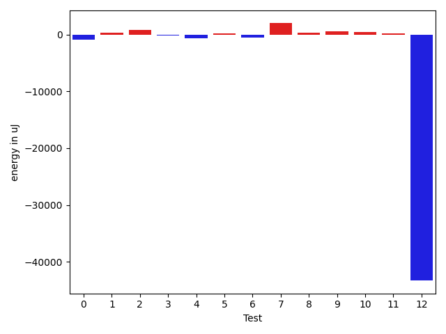

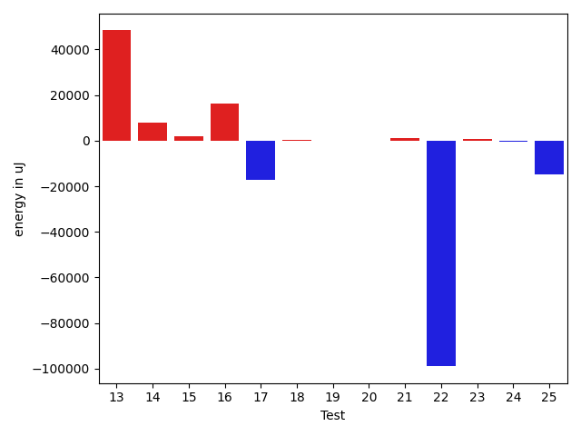

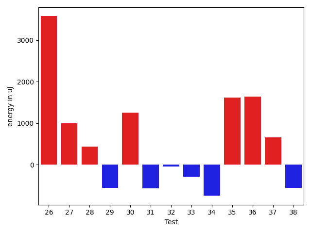

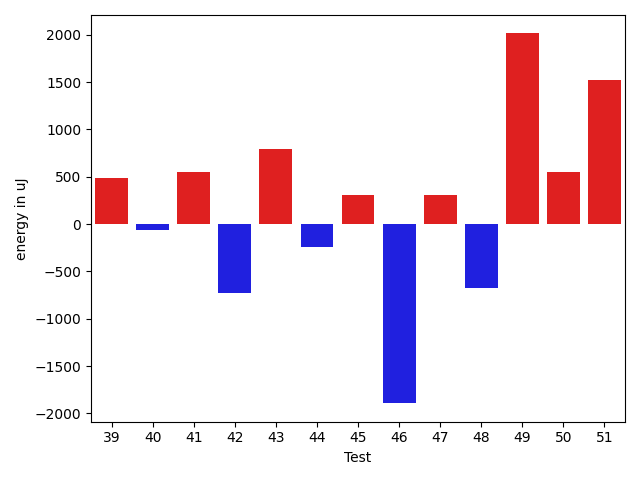

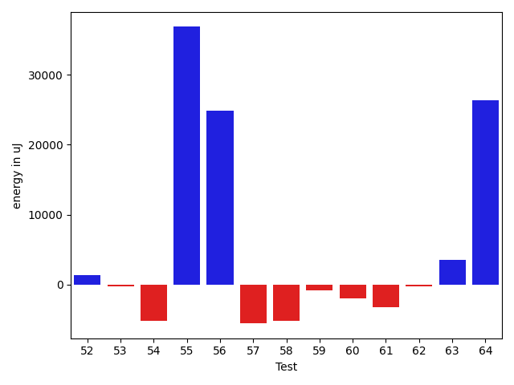

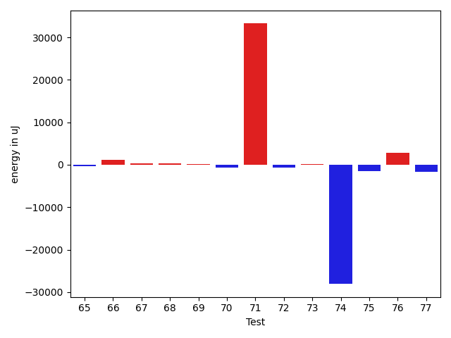

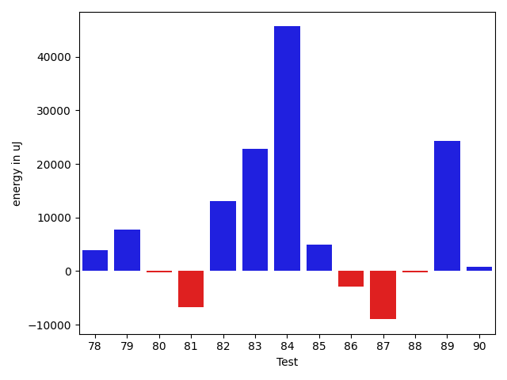

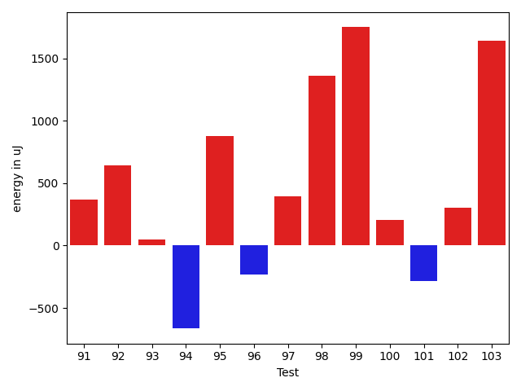

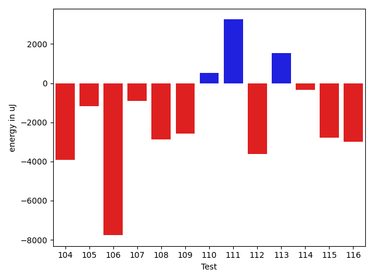

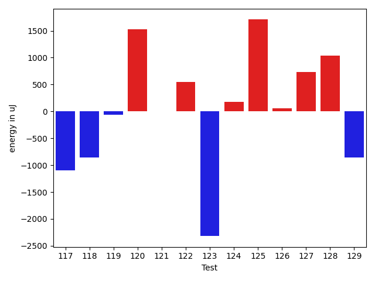

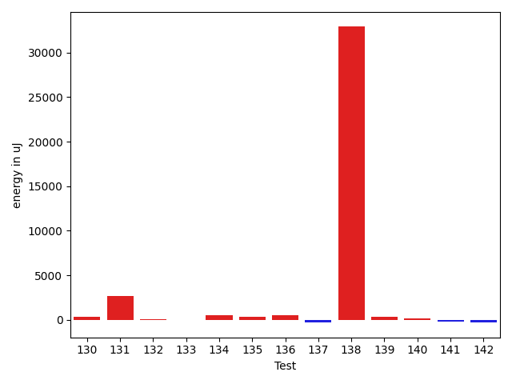

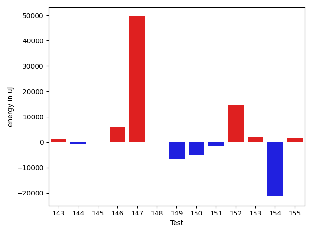

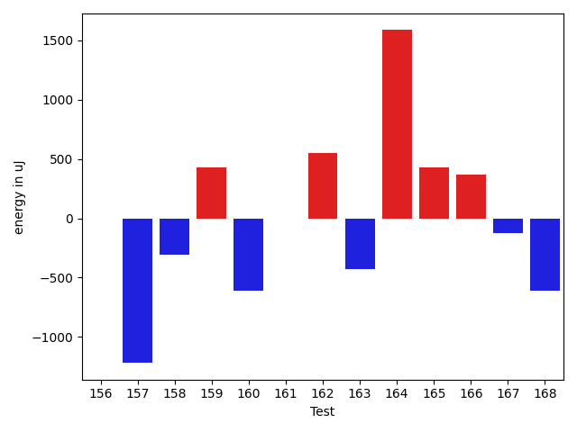

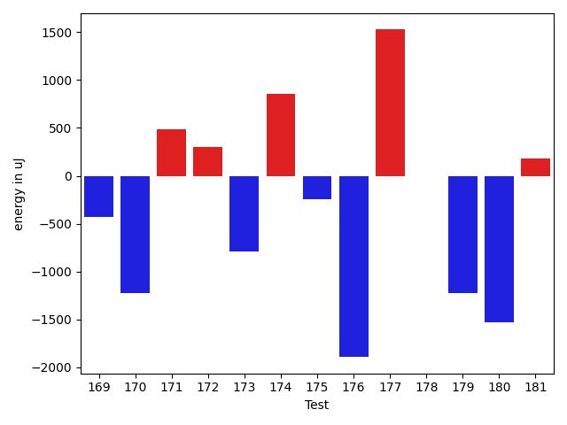

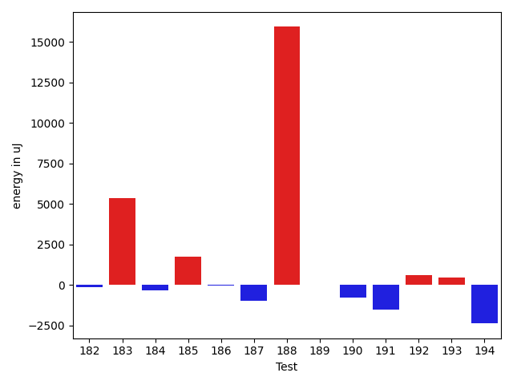

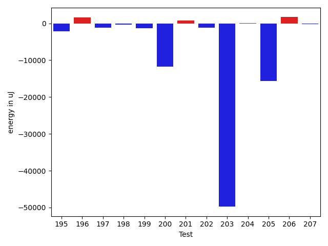

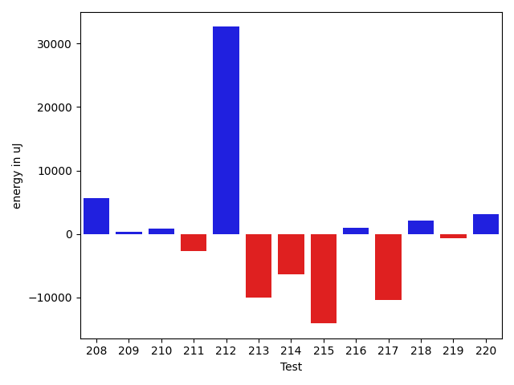

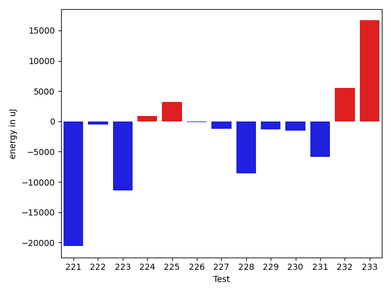

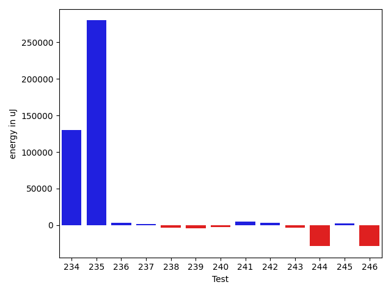

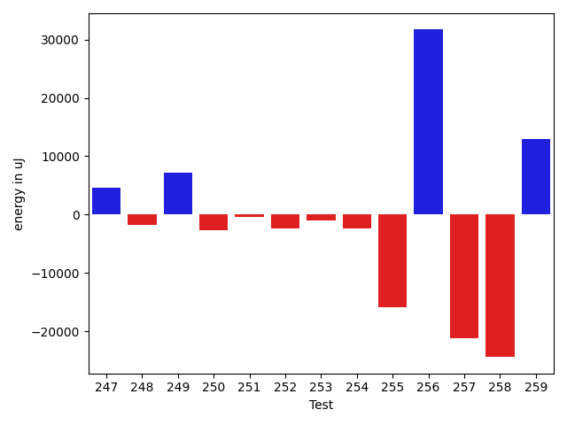

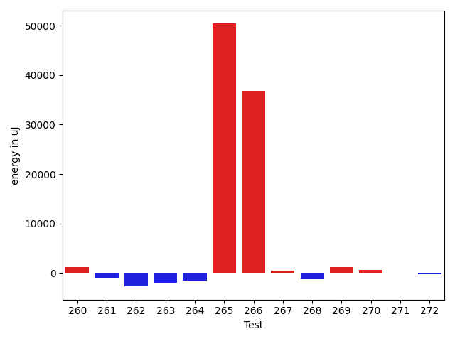

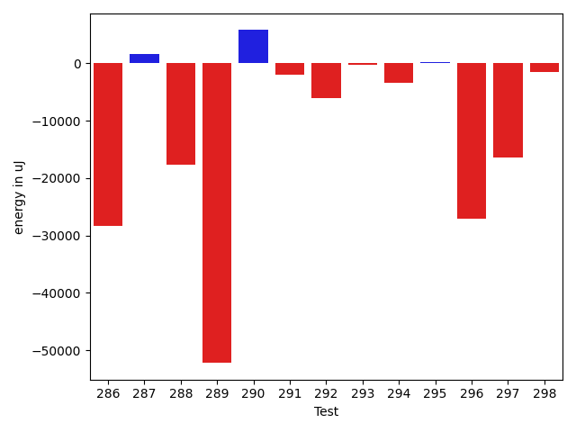

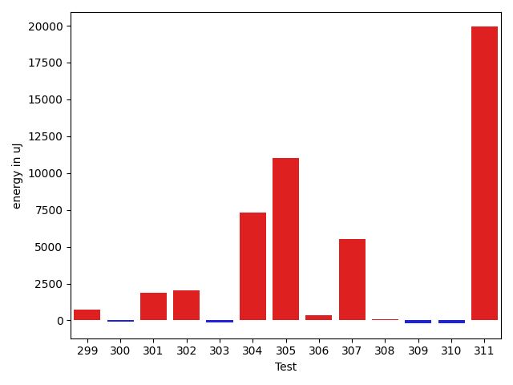

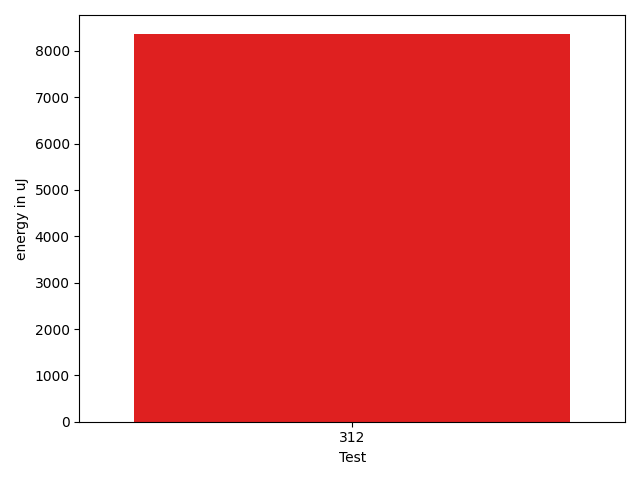

| ID | EnergyV1 | EnergyV2 | DeltaEnergy | σV1 | σV2 |
| --- | --- | --- | --- | --- | --- |
| 0 | 55922.976744186046 | 56913.38461538462 | 990.4078711985712 | 25565.348984458116 | 27516.552777631117 |
| 1 | 51815.85057471264 | 53267.44736842105 | 1451.5967937084133 | 21407.08656084823 | 26508.318801242047 |
| 2 | 42285.63461538462 | 42794.898305084746 | 509.26368970012845 | 3722.5056595960814 | 3359.9752505894153 |
| 3 | 47208.375 | 45174.166666666664 | -2034.2083333333358 | 13454.101899158726 | 7778.482208774554 |
| 4 | 110361.69696969698 | 102197.32323232324 | -8164.373737373739 | 123912.96601467757 | 31876.818266326543 |
| 5 | 41555.47222222222 | 42962.434782608696 | 1406.962560386477 | 3587.991766419631 | 6839.126362713808 |
| 6 | 43384.74025974026 | 44187.989130434784 | 803.2488706945223 | 5549.683478519815 | 9469.585398498028 |
| 7 | 42803.71929824561 | 43377.882352941175 | 574.1630546955639 | 6855.354218788856 | 3241.4928456672724 |
| 8 | 48230.80357142857 | 49394.40350877193 | 1163.5999373433588 | 14769.994169429698 | 15666.893037027856 |
| 9 | 44587.68421052631 | 45034.228070175435 | 446.54385964912217 | 10386.44725770651 | 8719.923635625595 |
| 10 | 43007.439024390245 | 43293.204545454544 | 285.7655210642988 | 7952.200416601318 | 5894.749653792639 |
| 11 | 42421.32258064516 | 43968.87096774193 | 1547.5483870967728 | 3302.2793632150374 | 9210.830366903238 |
| 12 | 96770.72043010753 | 42597.5 | -54173.220430107525 | 137415.3406996441 | 8019.7621461972885 |
| 13 | 83684.6511627907 | 131962.48314606742 | 48277.831983276716 | 176125.56231436916 | 222848.78198960325 |
| 14 | 41523.54054054054 | 49222.02380952381 | 7698.483268983269 | 4157.649684257334 | 23285.829437550023 |
| 15 | 42692.0625 | 44467.41860465116 | 1775.3561046511604 | 5831.745369835154 | 7509.366861592223 |
| 16 | 41690.32352941176 | 58037.75675675676 | 16347.433227344998 | 4910.2189882912335 | 31704.36125289936 |
| 17 | 65643.94871794872 | 48400.825 | -17243.12371794872 | 39878.72642820771 | 20699.50806285925 |
| 18 | 41594.166666666664 | 42075.38461538462 | 481.2179487179528 | 2912.1619927851234 | 3237.4912720633533 |
| 19 | 41286.87234042553 | 41388.34782608696 | 101.47548566143087 | 2706.7820544118454 | 2016.4074081243486 |
| 20 | 41655.692307692305 | 41743.05263157895 | 87.36032388664171 | 2836.387628149636 | 2208.791964988631 |
| 21 | 41183.13559322034 | 42182.93548387097 | 999.7998906506327 | 3733.384984064943 | 3787.611699070331 |
| 22 | 811746.9595959596 | 712833.9797979798 | -98912.97979797982 | 645334.8085105686 | 656528.2070905676 |
| 23 | 49184.71111111111 | 49942.77551020408 | 758.0643990929748 | 16805.856128309326 | 16755.765375444695 |
| 24 | 50195.43434343435 | 49664.545454545456 | -530.8888888888905 | 17623.632362819837 | 16583.37917415484 |
| 25 | 58246.4375 | 43537.09375 | -14709.34375 | 37463.61848258379 | 5709.656186887345 |
| 26 | 77832.67346938775 | 81408.44444444444 | 3575.7709750566864 | 16602.46956905318 | 19119.918295872845 |
| 27 | 41416.217391304344 | 42407.5 | 991.2826086956557 | 2527.578476079629 | 3542.805833386431 |
| 28 | 41660.434782608696 | 42093.76190476191 | 433.32712215321226 | 2273.468482605129 | 2737.0870491709297 |
| 29 | 41719.46666666667 | 41154.13636363636 | -565.3303030303068 | 2999.66848983165 | 2350.9930647485685 |
| 30 | 42109.21621621621 | 43359.3 | 1250.0837837837898 | 2939.7033048962808 | 7352.002435391328 |
| 31 | 44190.64444444444 | 43617.254237288136 | -573.3902071563061 | 5968.2054967433905 | 5456.52479766809 |
| 32 | 43057.64864864865 | 43009.291666666664 | -48.356981981982244 | 2877.763050330851 | 3516.4392676774455 |
| 33 | 47479.58762886598 | 47191.74747474748 | -287.84015411850123 | 13858.173481462889 | 13334.252587511015 |
| 34 | 49951.30303030303 | 49201.683673469386 | -749.6193568336457 | 16859.491236590075 | 16021.535583743589 |
| 35 | 44701.80882352941 | 46319.680555555555 | 1617.8717320261421 | 8344.072907401984 | 10849.660899496646 |
| 36 | 51580.64835164835 | 53214.47252747253 | 1633.8241758241784 | 19942.57023421688 | 21579.942112756107 |
| 37 | 44897.25714285715 | 45549.54761904762 | 652.290476190472 | 8068.977089863046 | 8910.476862345757 |
| 38 | 43030.90697674418 | 42466.95121951219 | -563.95575723199 | 5176.914618582275 | 3802.3156291872883 |
| 39 | 50447.44155844156 | 49665.09459459459 | -782.3469638469687 | 16807.974938085546 | 15024.785080235526 |
| 40 | 60082.558139534885 | 63243.05882352941 | 3160.500683994527 | 36899.56607345688 | 46686.961506299136 |
| 41 | 43183.31034482759 | 42905.723076923074 | -277.5872679045133 | 6628.76358213385 | 3232.952865571336 |
| 42 | 52312.41071428572 | 48448.565217391304 | -3863.8454968944134 | 33343.12914325013 | 32390.872686239578 |
| 43 | 41549.89473684211 | 43354.54838709677 | 1804.653650254666 | 3524.42685490653 | 4976.626035706479 |
| 44 | 42781.6875 | 42900.0 | 118.3125 | 3132.011807902989 | 4027.5785529273044 |
| 45 | 43334.8 | 43693.7 | 358.8999999999942 | 3657.610273874946 | 3086.529405335384 |
| 46 | 136211.0 | 101438.9898989899 | -34772.010101010106 | 213344.38536253345 | 43773.99900948879 |
| 47 | 58644.868686868685 | 61314.85858585859 | 2669.989898989901 | 20689.618109283925 | 23197.02417653326 |
| 48 | 46259.76404494382 | 46548.47368421053 | 288.7096392667081 | 11795.676595159079 | 11508.187168814446 |
| 49 | 55249.73333333333 | 67309.90361445783 | 12060.170281124498 | 71707.05352573219 | 61985.98176300219 |
| 50 | 43979.24590163935 | 49253.59420289855 | 5274.348301259204 | 6450.533226543795 | 13470.587225957908 |
| 51 | 58417.48275862069 | 66830.0 | 8412.517241379312 | 25473.36155328572 | 32809.70084640265 |
| 52 | 43801.0 | 44100.91025641026 | 299.9102564102577 | 6891.655729188391 | 8100.356942413722 |
| 53 | 44342.84848484849 | 52495.4875 | 8152.639015151515 | 8012.698463939152 | 17525.750573794085 |
| 54 | 43525.69014084507 | 43709.844155844155 | 184.1540149990833 | 8290.899177507401 | 8865.66768394835 |
| 55 | 42079.63333333333 | 42959.782608695656 | 880.1492753623243 | 3560.4112635418333 | 5777.3635150148775 |
| 56 | 71904.06060606061 | 70303.71717171717 | -1600.3434343434346 | 32667.823727442214 | 51434.603461416315 |
| 57 | 41814.71875 | 42119.0 | 304.28125 | 2746.7533020183005 | 3716.649235327641 |
| 58 | 78816.46464646465 | 75049.64646464646 | -3766.818181818191 | 29199.06250996548 | 33353.58664835547 |
| 59 | 47887.786516853936 | 48175.39772727273 | 287.6112104187923 | 14225.143125973284 | 14911.508078372168 |
| 60 | 85771.49494949495 | 86124.75757575757 | 353.2626262626145 | 38505.12846424428 | 44579.528853837386 |
| 61 | 44331.97590361446 | 44312.22784810127 | -19.748055513191503 | 10264.475486427327 | 9054.991678765675 |
| 62 | 43471.3625 | 44622.11688311688 | 1150.7543831168805 | 6015.385545091331 | 12965.059726573227 |
| 63 | 46297.857142857145 | 44800.388235294115 | -1497.4689075630304 | 20505.42213609834 | 10889.507416174545 |
| 64 | 47835.93670886076 | 44950.39240506329 | -2885.544303797469 | 27327.04444149397 | 9012.571243304461 |
| 65 | 49713.0125 | 49966.060975609755 | 253.0484756097576 | 17134.621554395177 | 20040.785655542648 |
| 66 | 42727.887323943665 | 46299.529411764706 | 3571.642087821041 | 8119.805653244358 | 11022.272958010957 |
| 67 | 42044.07407407407 | 42550.29090909091 | 506.21683501683583 | 4220.770567052682 | 3151.220627414816 |
| 68 | 42219.7027027027 | 41979.5918367347 | -240.11086596800305 | 3000.1534723344175 | 3451.4024769494126 |
| 69 | 47051.52 | 49562.558139534885 | 2511.0381395348886 | 11806.329968125856 | 20189.213802611284 |
| 70 | 84168.4947368421 | 59099.767676767675 | -25068.727060074423 | 170158.04105761726 | 25557.39349106511 |
| 71 | 151854.9898989899 | 171225.37373737374 | 19370.38383838383 | 51594.03874803011 | 60787.431800336184 |
| 72 | 43537.836734693876 | 46347.55319148936 | 2809.7164567954824 | 3009.2416723706647 | 15557.396452325505 |
| 73 | 43084.46153846154 | 44938.229166666664 | 1853.7676282051252 | 7536.298992538112 | 7763.348974614585 |
| 74 | 282115.55555555556 | 250569.0202020202 | -31546.53535353535 | 85511.36734892783 | 73892.4523876301 |
| 75 | 193569.12121212122 | 187393.51515151514 | -6175.606060606078 | 45984.22993255794 | 31840.033517431875 |
| 76 | 40970.2 | 47740.57575757576 | 6770.375757575763 | 3234.003585120373 | 26946.377689921468 |
| 77 | 43962.89473684211 | 44636.354838709674 | 673.4601018675676 | 7375.25903841055 | 7550.231885131131 |
| 78 | 41341.041666666664 | 43584.44117647059 | 2243.399509803923 | 4362.363106535709 | 2768.913539227302 |
| 79 | 42037.85 | 43361.02857142857 | 1323.1785714285725 | 3350.1432995470504 | 3169.870781374573 |
| 80 | 46308.680555555555 | 46610.68571428571 | 302.00515873015684 | 11603.727519908793 | 13542.238634881665 |
| 81 | 42538.84 | 43569.82089552239 | 1030.9808955223925 | 2701.683618486813 | 6242.976284857625 |
| 82 | 45180.94623655914 | 52237.436170212764 | 7056.4899336536255 | 11653.620618212974 | 18636.097243218384 |
| 83 | 45411.96875 | 43399.69696969697 | -2012.2717803030318 | 18553.233073180894 | 3080.5825844615474 |
| 84 | 42907.53846153846 | 43493.148148148146 | 585.609686609685 | 2255.4832371658395 | 2787.2022970568164 |
| 85 | 649715.0505050505 | 759789.494949495 | 110074.4444444445 | 667513.7841755414 | 675375.7497927272 |
| 86 | 42845.35294117647 | 43034.63265306123 | 189.2797118847593 | 2207.011739118983 | 2382.4316911541055 |
| 87 | 42812.328125 | 42486.45 | -325.8781250000029 | 4571.855593105384 | 2443.575579794222 |
| 88 | 46351.97727272727 | 45762.72 | -589.2572727272709 | 10250.47990115726 | 9766.745089414386 |
| 89 | 42613.1375 | 43688.3023255814 | 1075.1648255813998 | 2685.126304029988 | 6405.565213101567 |
| 90 | 70100.47222222222 | 43677.36111111111 | -26423.11111111111 | 54996.3705436227 | 3588.9522314456576 |
| 91 | 42480.4 | 42846.58064516129 | 366.1806451612865 | 3325.726468006652 | 3988.6426163440256 |
| 92 | 43173.769230769234 | 43818.346153846156 | 644.576923076922 | 5971.352737098029 | 7125.639544534867 |
| 93 | 43240.807692307695 | 43288.28947368421 | 47.481781376518484 | 9543.677294899047 | 3132.0720475336816 |
| 94 | 42607.5 | 41943.2 | -664.3000000000029 | 1758.9880376701446 | 2606.5788037195425 |
| 95 | 42365.68 | 43244.41935483871 | 878.7393548387117 | 3034.1557339068804 | 3820.456591309081 |
| 96 | 42578.232558139534 | 42344.45283018868 | -233.77972795085225 | 2937.646612568523 | 2726.62189618512 |
| 97 | 44273.05084745763 | 44668.230769230766 | 395.17992177313863 | 6588.943474947909 | 7601.271283894618 |
| 98 | 41876.7027027027 | 43238.94285714286 | 1362.2401544401582 | 2174.418615864876 | 6521.320037025182 |
| 99 | 43142.05263157895 | 44891.28333333333 | 1749.2307017543862 | 6691.095608032096 | 9948.24491739065 |
| 100 | 42230.1 | 42432.6875 | 202.58750000000146 | 2364.555692584409 | 3516.9376366156607 |
| 101 | 42437.95652173913 | 42156.46153846154 | -281.4949832775892 | 2330.022774254454 | 3217.2654087064634 |
| 102 | 42133.568181818184 | 42439.58974358974 | 306.0215617715585 | 3018.234518553454 | 2508.514860639389 |
| 103 | 41602.75862068965 | 43245.083333333336 | 1642.3247126436836 | 3166.2407346902555 | 2899.761191077255 |
| 104 | 41453.391304347824 | 42993.48148148148 | 1540.0901771336576 | 2397.7371712790123 | 2196.711066325365 |
| 105 | 41820.06060606061 | 43228.816326530614 | 1408.755720470006 | 2689.752505674351 | 5968.859497505191 |
| 106 | 42955.34782608696 | 42486.36666666667 | -468.9811594202911 | 2901.042535375945 | 3291.329412090028 |
| 107 | 42297.16129032258 | 42897.53333333333 | 600.3720430107496 | 2284.0359453808696 | 3128.664536543063 |
| 108 | 47790.25925925926 | 57389.40540540541 | 9599.146146146144 | 16146.852849171091 | 48421.361340061834 |
| 109 | 44358.59090909091 | 43134.5 | -1224.0909090909117 | 4419.538115100541 | 3123.258934990821 |
| 110 | 41451.8 | 42970.96428571428 | 1519.1642857142797 | 2527.985138405683 | 2863.914135810625 |
| 111 | 42663.57142857143 | 42274.04761904762 | -389.5238095238092 | 3262.5337593061386 | 2995.886473088923 |
| 112 | 42454.692307692305 | 42738.36363636364 | 283.6713286713348 | 3154.125500761854 | 3403.022474018896 |
| 113 | 44260.375 | 43990.4358974359 | -269.93910256410163 | 7768.535274922058 | 7033.2548098479865 |
| 114 | 42079.875 | 42991.65 | 911.7750000000015 | 2686.16970273194 | 2534.0661746489573 |
| 115 | 52767.416666666664 | 42424.77272727273 | -10342.643939393936 | 47029.283953295766 | 2706.988815704104 |
| 116 | 43835.4 | 43479.58064516129 | -355.8193548387135 | 8055.284187413874 | 5157.81693801525 |
| 117 | 43479.145454545454 | 42665.48387096774 | -813.661583577712 | 4071.87808541456 | 4621.966400898018 |
| 118 | 54659.230769230766 | 50382.97727272727 | -4276.253496503494 | 21047.8272868293 | 17692.594750974502 |
| 119 | 67415.11458333333 | 64555.16842105263 | -2859.9461622806994 | 43343.82826690118 | 41141.145197747726 |
| 120 | 79197.29591836735 | 80924.24742268042 | 1726.9515043130668 | 53011.62327787455 | 55855.86037902425 |
| 121 | 49297.55128205128 | 42895.65573770492 | -6401.895544346364 | 27409.73910326234 | 2731.3250425463552 |
| 122 | 43336.47368421053 | 45800.4623655914 | 2463.98868138087 | 7684.559903286734 | 11291.261776553061 |
| 123 | 165935.66666666666 | 164036.31313131313 | -1899.3535353535262 | 26600.613716243624 | 30213.22740815851 |
| 124 | 42454.75 | 42412.81578947369 | -41.93421052631311 | 3119.5135248856423 | 2870.299350381999 |
| 125 | 42191.71428571428 | 43959.617647058825 | 1767.9033613445426 | 3473.981944870753 | 2723.9504618315123 |
| 126 | 46202.15555555555 | 48713.16470588235 | 2511.0091503267977 | 13842.316463905656 | 15714.19776758439 |
| 127 | 42336.377358490565 | 42150.96551724138 | -185.411841249188 | 2543.479055674957 | 3000.976852256021 |
| 128 | 44092.22368421053 | 44936.89855072464 | 844.6748665141131 | 8540.14532354888 | 8650.085163600073 |
| 129 | 59090.57142857143 | 42601.41071428572 | -16489.16071428571 | 42655.278225919625 | 2340.9648787319798 |
| 130 | 42621.85507246377 | 42885.0 | 263.144927536232 | 3114.6612827934023 | 3211.0829446495704 |
| 131 | 42846.72222222222 | 44104.52173913043 | 1257.7995169082133 | 3055.3391847633907 | 3549.3770656095744 |
| 132 | 42039.782608695656 | 42336.95 | 297.16739130434144 | 2964.0463376727857 | 3156.4343565960626 |
| 133 | 42379.5 | 42984.86666666667 | 605.3666666666686 | 2650.058272944201 | 3859.6140371228257 |
| 134 | 47019.57894736842 | 51940.65217391304 | 4921.07322654462 | 17229.939531053707 | 39838.92243676397 |
| 135 | 59601.71428571428 | 60696.755319148935 | 1095.0410334346525 | 40752.934653928656 | 36844.23180573894 |
| 136 | 42555.27272727273 | 47115.36363636364 | 4560.090909090912 | 5979.124177136635 | 14464.875559737035 |
| 137 | 60222.09090909091 | 60880.1282051282 | 658.0372960372915 | 36896.58760756399 | 51425.72163620144 |
| 138 | 115909.06060606061 | 126937.23469387754 | 11028.174087816937 | 47096.821118532775 | 54945.5213488967 |
| 139 | 42886.65625 | 42599.782608695656 | -286.87364130434435 | 3103.9454792386314 | 3441.075880245971 |
| 140 | 42411.045454545456 | 42709.17857142857 | 298.1331168831166 | 3642.132086333158 | 2994.5042524785704 |
| 141 | 42362.38636363636 | 42829.54 | 467.15363636364054 | 4831.417969988019 | 6886.962556047477 |
| 142 | 54441.32352941176 | 45447.29268292683 | -8994.03084648493 | 37658.63899771253 | 9422.101633002554 |
| 143 | 43403.22666666667 | 44718.02597402597 | 1314.7993073593025 | 6758.965687289407 | 9215.760444518615 |
| 144 | 42401.95238095238 | 41820.619047619046 | -581.3333333333358 | 3714.200900741068 | 2436.277145783246 |
| 145 | 42692.54347826087 | 42607.1320754717 | -85.4114027891701 | 3214.929938424663 | 2816.912320306033 |
| 146 | 118033.14141414141 | 124016.9696969697 | 5983.828282828283 | 59661.72653833911 | 64134.74092631817 |
| 147 | 42147.11538461538 | 91732.93478260869 | 49585.819397993306 | 3917.5571698437393 | 74121.94072971393 |
| 148 | 42178.47368421053 | 42224.625 | 46.1513157894733 | 3826.8531853128434 | 3517.001259507167 |
| 149 | 49014.87755102041 | 42397.068181818184 | -6617.809369202223 | 26593.196009991403 | 6003.319950424883 |
| 150 | 57074.94117647059 | 52228.641975308645 | -4846.299201161943 | 25902.082423371452 | 20320.86055659817 |
| 151 | 43540.66129032258 | 42053.06779661017 | -1487.5934937124111 | 4628.300088353864 | 3477.361988948415 |
| 152 | 45589.89189189189 | 60178.71428571428 | 14588.82239382239 | 9499.377740029717 | 90160.85576808071 |
| 153 | 43809.2 | 45751.50632911392 | 1942.306329113926 | 6533.834790862538 | 12304.645434250357 |
| 154 | 77133.76315789473 | 55690.09523809524 | -21443.667919799496 | 35235.62780798511 | 32866.06833354448 |
| 155 | 42118.7 | 43755.31481481482 | 1636.6148148148204 | 3846.7033041293944 | 7572.347463276849 |
| 156 | 42140.86956521739 | 41445.0 | -695.8695652173919 | 2837.1208508128802 | 4849.313406918398 |
| 157 | 42097.933333333334 | 50842.12 | 8744.186666666668 | 3384.920215045286 | 41784.507498660314 |
| 158 | 42057.0 | 46793.545454545456 | 4736.545454545456 | 2430.9986373916377 | 16960.25594269949 |
| 159 | 48005.08620689655 | 53012.820512820515 | 5007.734305923965 | 23178.57310719691 | 47124.07367456398 |
| 160 | 47346.17441860465 | 43704.71428571428 | -3641.4601328903664 | 24675.56486532915 | 8569.229176552119 |
| 161 | 42918.90740740741 | 42812.875 | -106.03240740740875 | 2908.958018034271 | 3849.6743093340283 |
| 162 | 48055.84126984127 | 51805.10447761194 | 3749.2632077706658 | 15033.284426281285 | 21756.130917091432 |
| 163 | 43069.0625 | 42327.2131147541 | -741.8493852458996 | 2886.1886084581774 | 3900.3084960574815 |
| 164 | 47214.896103896106 | 52404.13157894737 | 5189.23547505126 | 13012.46727114855 | 19448.856751234904 |
| 165 | 58041.15151515151 | 58740.969696969696 | 699.8181818181838 | 20721.924192742583 | 20554.546827451828 |
| 166 | 43003.510204081635 | 41936.77777777778 | -1066.7324263038536 | 5683.242108351603 | 3465.7464038504704 |
| 167 | 52661.05882352941 | 51918.3908045977 | -742.6680189317121 | 32587.19713353803 | 28628.04830864679 |
| 168 | 46550.846153846156 | 42264.114285714284 | -4286.731868131872 | 9816.235870670542 | 3265.1068131417214 |
| 169 | 42925.18421052631 | 43570.25 | 645.0657894736869 | 3699.1450566687718 | 7467.305890274522 |
| 170 | 42444.27272727273 | 42210.11111111111 | -234.16161616161844 | 3763.604290962743 | 4764.42877906984 |
| 171 | 41569.686274509804 | 42127.063829787236 | 557.3775552774314 | 3598.8797194279286 | 3210.486112885733 |
| 172 | 46753.613333333335 | 47524.02352941177 | 770.4101960784319 | 11093.563052381123 | 14308.576808397102 |
| 173 | 107203.36363636363 | 122224.64444444445 | 15021.280808080817 | 254367.2673821133 | 300294.1722122311 |
| 174 | 41407.3870967742 | 45098.75 | 3691.362903225803 | 3012.0630768940323 | 16350.89229789922 |
| 175 | 42329.34210526316 | 43100.313725490196 | 770.9716202270356 | 4850.049388117045 | 6376.621161005888 |
| 176 | 43365.42105263158 | 42119.74418604651 | -1245.6768665850686 | 3246.768771300727 | 3990.8035974179284 |
| 177 | 42283.13333333333 | 48709.529411764706 | 6426.396078431375 | 5834.937124673143 | 20188.425732167743 |
| 178 | 42294.708333333336 | 42404.91176470588 | 110.20343137254531 | 3158.9203387545595 | 3109.026255424745 |
| 179 | 43583.23809523809 | 42259.91836734694 | -1323.319727891154 | 6840.47261598037 | 2914.356818717554 |
| 180 | 169383.84848484848 | 151514.72727272726 | -17869.121212121216 | 160965.093989215 | 108533.27722774386 |
| 181 | 42500.7 | 43171.86301369863 | 671.163013698635 | 3777.092119166101 | 5039.3282910592725 |
| 182 | 43313.82089552239 | 43157.59523809524 | -156.22565742715233 | 8103.564770998769 | 6095.054988460588 |
| 183 | 43264.38461538462 | 48633.46875 | 5369.084134615383 | 3116.1067187823073 | 30359.76256904891 |
| 184 | 43118.290322580644 | 42794.75 | -323.540322580644 | 6300.974170424598 | 5878.462867748677 |
| 185 | 41036.42105263158 | 42789.117647058825 | 1752.6965944272451 | 3861.801302034958 | 3246.504181103711 |
| 186 | 43807.82142857143 | 43750.32258064516 | -57.498847926268354 | 7611.568216741688 | 5622.437345350621 |
| 187 | 42905.51724137931 | 41940.73684210526 | -964.7803992740519 | 3928.3434222081682 | 3902.649893842108 |
| 188 | 69852.6 | 85783.07692307692 | 15930.476923076916 | 117671.27942886774 | 175178.77966433717 |
| 189 | 43156.06896551724 | 43157.318181818184 | 1.2492163009446813 | 3284.786561386363 | 3047.0462058489547 |
| 190 | 44127.041666666664 | 43338.509803921566 | -788.5318627450979 | 5958.688809763203 | 8887.487795138028 |
| 191 | 44160.119402985074 | 42619.13043478261 | -1540.988968202466 | 7615.654579372025 | 6224.939624672102 |
| 192 | 42294.84 | 42889.93548387097 | 595.0954838709731 | 2824.753889173356 | 3865.7465325473922 |
| 193 | 42644.13636363636 | 43110.12 | 465.9836363636423 | 2893.0604320033035 | 2599.407614361395 |
| 194 | 43988.78571428572 | 41615.708333333336 | -2373.0773809523816 | 3007.355202037912 | 3746.738865101742 |
| 195 | 43835.34545454545 | 41742.967741935485 | -2092.3777126099667 | 8697.224268211681 | 2806.2173712033223 |
| 196 | 42517.92307692308 | 44075.096774193546 | 1557.1736972704675 | 2900.180497341461 | 7481.717861021295 |
| 197 | 43336.14 | 42146.45283018868 | -1189.6871698113173 | 2386.9399490561127 | 3216.772556730934 |
| 198 | 42143.62962962963 | 41862.82352941176 | -280.8061002178656 | 3317.122650376468 | 3689.7675797247102 |
| 199 | 42867.925 | 41590.065217391304 | -1277.8597826086989 | 4013.1412782725456 | 4087.7844185167633 |
| 200 | 55827.32432432433 | 44118.76315789474 | -11708.561166429587 | 34599.026277545345 | 5875.918711747441 |
| 201 | 42480.41935483871 | 43240.846153846156 | 760.4267990074441 | 3247.7790006471723 | 6480.080398909519 |
| 202 | 42995.59259259259 | 41763.15625 | -1232.4363425925912 | 3524.2558579844517 | 3189.6616112584634 |
| 203 | 95981.12987012987 | 46224.89189189189 | -49756.23797823797 | 247106.7508134764 | 11703.529415184825 |
| 204 | 42371.40476190476 | 42457.16216216216 | 85.75740025739651 | 4165.443965702323 | 3370.2090520892784 |
| 205 | 60397.096774193546 | 44777.26530612245 | -15619.831468071097 | 45593.67017106711 | 8493.180286476454 |
| 206 | 55771.818181818184 | 57449.9595959596 | 1678.1414141414134 | 21344.413598549207 | 23023.88150012288 |
| 207 | 42749.38775510204 | 42507.584615384614 | -241.80313971742726 | 4306.514930851393 | 3337.130752341726 |
| 208 | 43077.57142857143 | 41960.75 | -1116.8214285714275 | 5154.24630092628 | 3556.697991011425 |
| 209 | 72733.86486486487 | 57723.119047619046 | -15010.745817245821 | 63451.06937192783 | 48304.23782266608 |
| 210 | 47037.12765957447 | 48189.020833333336 | 1151.8931737588646 | 13855.806432633099 | 16026.809794437127 |
| 211 | 66864.5 | 52683.666666666664 | -14180.833333333336 | 137860.10438501023 | 17864.732290694472 |
| 212 | 42626.530303030304 | 43813.609375 | 1187.079071969696 | 3810.876369501794 | 6213.0206764131335 |
| 213 | 96798.26086956522 | 55938.602040816324 | -40859.65882874889 | 202762.69820659544 | 25215.717222310097 |
| 214 | 50375.34042553192 | 46846.34042553192 | -3529.0 | 17070.297546642796 | 13876.821180500954 |
| 215 | 44127.388059701494 | 43173.878787878784 | -953.5092718227097 | 8600.71188298886 | 2913.0923198717037 |
| 216 | 44500.92941176471 | 44044.4125 | -456.5169117647092 | 10035.171602962237 | 8236.689537814556 |
| 217 | 42320.175 | 42410.805555555555 | 90.63055555555184 | 3485.3853580881128 | 3139.183694489208 |
| 218 | 48733.55670103093 | 44922.36170212766 | -3811.194998903273 | 15389.353251664505 | 10438.133626939849 |
| 219 | 43298.18461538461 | 48430.416666666664 | 5132.2320512820515 | 6324.573923970162 | 17061.834077155625 |
| 220 | 68882.06172839506 | 59110.01282051282 | -9772.048907882236 | 41149.16298875595 | 40102.293411459774 |
| 221 | 64496.619047619046 | 43910.030303030304 | -20586.588744588742 | 42118.376258640346 | 6786.917783433193 |
| 222 | 42314.57142857143 | 41801.88461538462 | -512.6868131868105 | 4253.6827290224255 | 4053.70136017142 |
| 223 | 62325.720588235294 | 50942.37142857143 | -11383.349159663863 | 122462.48183289413 | 18233.69637407733 |
| 224 | 43549.07843137255 | 44473.43636363636 | 924.3579322638107 | 4346.752431382638 | 8257.72280686639 |
| 225 | 48169.64893617021 | 51422.31958762887 | 3252.670651458655 | 17941.85173008666 | 22624.180325322486 |
| 226 | 43717.0 | 43608.386666666665 | -108.6133333333346 | 6678.659420285924 | 7492.341725421291 |
| 227 | 45573.301204819276 | 44343.7108433735 | -1229.5903614457784 | 10370.874926475633 | 7541.976206347468 |
| 228 | 51275.206349206346 | 42672.0 | -8603.206349206346 | 32208.08847398269 | 3255.2765694883205 |
| 229 | 42744.944444444445 | 41424.4 | -1320.5444444444438 | 3525.6940604687597 | 3481.926426563319 |
| 230 | 42880.204081632655 | 41402.87272727273 | -1477.3313543599288 | 3887.0829048749524 | 3764.9779091687806 |
| 231 | 90734.41414141415 | 84831.11340206186 | -5903.300739352286 | 186349.45797255987 | 139338.33103887274 |
| 232 | 50244.88607594937 | 55723.47619047619 | 5478.590114526822 | 16039.584173393516 | 21868.85860210717 |
| 233 | 46818.48148148148 | 63473.875 | 16655.39351851852 | 21135.935574751056 | 60052.609436998726 |
| 234 | 51226.194444444445 | 44999.066666666666 | -6227.12777777778 | 33213.557227617035 | 9016.618773994804 |
| 235 | 42885.148148148146 | 43269.83870967742 | 384.6905615292708 | 5694.520379138396 | 5379.24844910618 |
| 236 | 46055.73333333333 | 45972.68292682927 | -83.05040650405863 | 9300.589788705756 | 13681.590703122107 |
| 237 | 44022.29508196721 | 42375.04109589041 | -1647.253986076801 | 6660.104548837895 | 3788.843816266982 |
| 238 | 126550.20202020202 | 153438.9393939394 | 26888.73737373737 | 223404.36151964348 | 263864.5505857782 |
| 239 | 45821.96428571428 | 45879.8202247191 | 57.85593900481763 | 9894.476065253144 | 10246.751229252992 |
| 240 | 47532.76470588235 | 47100.85135135135 | -431.913354530996 | 17847.47894712769 | 15450.645744996002 |
| 241 | 152292.1717171717 | 148247.22222222222 | -4044.949494949484 | 79373.64022651914 | 90138.6859093573 |
| 242 | 54246.290322580644 | 55943.121212121216 | 1696.8308895405717 | 38200.32910953783 | 55155.69679017347 |
| 243 | 45923.75 | 41489.26315789474 | -4434.48684210526 | 25338.444664596787 | 3735.5270302737495 |
| 244 | 42207.55319148936 | 44361.903846153844 | 2154.350654664486 | 4464.374692620103 | 11378.765194701004 |
| 245 | 48994.829268292684 | 55960.28571428572 | 6965.456445993033 | 21453.662717476494 | 47041.24616338391 |
| 246 | 53583.391304347824 | 60643.851851851854 | 7060.46054750403 | 29033.295172715258 | 63650.01234395371 |
| 247 | 42374.653846153844 | 45223.32352941176 | 2848.669683257918 | 4087.880821519476 | 7453.899227212987 |
| 248 | 43354.5 | 45073.84745762712 | 1719.3474576271183 | 6644.647576056987 | 9314.707997485792 |
| 249 | 42260.26315789474 | 42276.26315789474 | 16.0 | 3904.2766071943165 | 4848.436110770318 |
| 250 | 53436.25 | 66590.71794871795 | 13154.467948717953 | 29097.25238591648 | 70410.07309889859 |
| 251 | 42151.0 | 42901.46153846154 | 750.461538461539 | 3428.4862241919077 | 3758.137671951524 |
| 252 | 102620.92592592593 | 107673.02380952382 | 5052.097883597889 | 225614.79575380587 | 228207.35815851754 |
| 253 | 42594.0 | 43003.45238095238 | 409.45238095238165 | 4043.1856527028563 | 7016.5944025315575 |
| 254 | 42468.25 | 44048.05263157895 | 1579.8026315789466 | 3538.0371588636544 | 8814.875038512931 |
| 255 | 43534.5 | 41990.333333333336 | -1544.1666666666642 | 3407.738887726446 | 3321.6212156114366 |
| 256 | 42186.555555555555 | 46504.69565217391 | 4318.140096618357 | 3983.2977714203676 | 12286.741954802099 |
| 257 | 45152.81012658228 | 45419.71052631579 | 266.9003997335094 | 9691.108534880526 | 9628.54831903514 |
| 258 | 47618.67032967033 | 44448.529411764706 | -3170.140917905621 | 13508.630781231132 | 8557.566011277404 |
| 259 | 50799.745762711864 | 44511.70175438596 | -6288.044008325902 | 20756.102136107253 | 6493.242552136346 |
| 260 | 42338.820512820515 | 46899.66216216216 | 4560.841649341644 | 3175.2140196132377 | 14188.727053046921 |
| 261 | 70878.375 | 140651.1739130435 | 69772.79891304349 | 150386.8372332977 | 315951.21478517953 |
| 262 | 44954.86363636364 | 45080.42857142857 | 125.5649350649328 | 5315.914069141437 | 11010.758272281353 |
| 263 | 43829.3 | 41733.769230769234 | -2095.530769230769 | 3367.781199840631 | 3344.949112038953 |
| 264 | 43332.17391304348 | 43670.470588235294 | 338.29667519181385 | 3514.5165002634176 | 7355.93024562813 |
| 265 | 325758.6666666667 | 366299.35353535356 | 40540.68686868687 | 127939.1730512211 | 141040.0061956284 |
| 266 | 431872.0101010101 | 450880.37373737374 | 19008.363636363647 | 156889.80109937006 | 132570.5999634855 |
| 267 | 46767.181818181816 | 47318.66216216216 | 551.4803439803436 | 21936.774886097217 | 31041.843084594195 |
| 268 | 43780.651162790695 | 43231.71111111111 | -548.9400516795868 | 7572.338371546558 | 5811.054333948253 |
| 269 | 118510.6507936508 | 157928.50793650793 | 39417.85714285713 | 231932.81332906566 | 307234.0182829397 |
| 270 | 41952.82142857143 | 42831.666666666664 | 878.8452380952367 | 3517.9763262986803 | 6391.545898902531 |
| 271 | 44622.60975609756 | 42081.0 | -2541.6097560975613 | 7844.51655268001 | 3829.826893619047 |
| 272 | 42428.2962962963 | 49675.72222222222 | 7247.42592592592 | 4411.352591891322 | 41361.575498960054 |
| 273 | 67878.25373134328 | 69756.43243243243 | 1878.1787010891421 | 37689.46412276239 | 42387.90345391486 |
| 274 | 62497.15217391304 | 70548.13725490196 | 8050.985080988918 | 43928.07169332879 | 67277.2978019345 |
| 275 | 41830.444444444445 | 44355.813559322036 | 2525.3691148775906 | 3373.1108768693507 | 8577.166480233822 |
| 276 | 41475.433333333334 | 51998.09090909091 | 10522.657575757577 | 3982.6558951143256 | 58342.101785497165 |
| 277 | 49140.634146341465 | 58915.43137254902 | 9774.797226207556 | 20839.675553108642 | 50357.128299757445 |
| 278 | 42073.458333333336 | 42848.179487179485 | 774.7211538461488 | 4540.651026919365 | 7193.226282580004 |
| 279 | 42264.970588235294 | 45613.5 | 3348.5294117647063 | 3084.7002760807404 | 8755.599357934707 |
| 280 | 42187.4 | 42795.3870967742 | 607.9870967741954 | 3967.2752016609948 | 3594.9604123390736 |
| 281 | 43489.53658536585 | 48411.767857142855 | 4922.231271777004 | 5594.34712552382 | 15067.453678602235 |
| 282 | 47064.36842105263 | 63056.59756097561 | 15992.22913992298 | 10890.181238937095 | 64576.71272477444 |
| 283 | 44586.0 | 48762.12698412698 | 4176.126984126982 | 8633.997369738143 | 13678.237132877912 |
| 284 | 42904.818181818184 | 43090.64 | 185.82181818181562 | 2327.453185475169 | 3364.459646124471 |
| 285 | 145627.68686868687 | 130674.67676767676 | -14953.010101010106 | 137268.7313818583 | 63966.42672714301 |
| 286 | 45471.957746478874 | 55565.028169014084 | 10093.07042253521 | 10973.897040970462 | 29346.193337597586 |
| 287 | 53625.84146341463 | 63484.22093023256 | 9858.379466817925 | 31060.31682909314 | 53614.85093169554 |
| 288 | 57509.78787878788 | 77372.0303030303 | 19862.242424242424 | 36376.08148783415 | 72074.5904780238 |
| 289 | 41976.75 | 42879.86363636364 | 903.1136363636397 | 3668.8679027051385 | 4857.185083559243 |
| 290 | 113599.66666666667 | 117386.42424242424 | 3786.7575757575687 | 35202.97566480092 | 66195.01030771277 |
| 291 | 42773.54347826087 | 41864.47727272727 | -909.0662055335997 | 3602.0285088467053 | 4206.3882071776825 |
| 292 | 108416.79710144928 | 146341.27692307692 | 37924.47982162764 | 190942.875907314 | 320805.3255220972 |
| 293 | 71105.84210526316 | 45552.163636363635 | -25553.678468899525 | 59297.98552324878 | 10781.36054791473 |
| 294 | 57452.25806451613 | 70445.45454545454 | 12993.196480938415 | 29784.6480120585 | 66630.37424907026 |
| 295 | 58501.98529411765 | 59699.56 | 1197.5747058823472 | 37461.7159983883 | 33090.87950407282 |
| 296 | 64503.528735632186 | 56895.81707317073 | -7607.711662461457 | 47006.88547310232 | 42079.74857111198 |
| 297 | 84951.6 | 50240.770833333336 | -34710.82916666667 | 60715.28253981859 | 21637.524143294424 |
| 298 | 108697.6875 | 113656.73684210527 | 4959.049342105267 | 260174.4619609164 | 297525.08379583765 |
| 299 | 41596.48275862069 | 42302.34782608696 | 705.8650674662713 | 3099.3942525050525 | 4195.530495644928 |
| 300 | 42485.90909090909 | 42389.793103448275 | -96.1159874608129 | 3705.166416445248 | 2398.643213889603 |
| 301 | 41798.666666666664 | 43649.07407407407 | 1850.4074074074088 | 4255.325330296929 | 8806.340022228624 |
| 302 | 42437.6 | 44488.21052631579 | 2050.610526315788 | 5700.910550663522 | 8292.712679651793 |
| 303 | 41237.64 | 41112.208333333336 | -125.43166666666366 | 3502.4572274904367 | 3871.9755183795464 |
| 304 | 61653.085106382976 | 68962.44210526315 | 7309.3569988801755 | 37660.458504926195 | 65910.39200271771 |
| 305 | 50996.181818181816 | 61997.530120481926 | 11001.34830230011 | 28825.442584138884 | 63688.24924457771 |
| 306 | 41230.16 | 41580.17857142857 | 350.018571428569 | 3937.6423065585836 | 3988.4744134422717 |
| 307 | 44430.86956521739 | 49951.21153846154 | 5520.341973244147 | 5299.49170494802 | 29832.075329659558 |
| 308 | 42504.6037735849 | 42558.42105263158 | 53.81727904667787 | 2554.23110565936 | 4102.408141513565 |
| 309 | 43249.95652173913 | 43055.444444444445 | -194.51207729468297 | 3262.8533255720513 | 3874.602336903208 |
| 310 | 42106.80952380953 | 41900.55263157895 | -206.25689223057998 | 3846.8448062950006 | 3283.1594755611186 |
| 311 | 73914.36923076923 | 93837.2463768116 | 19922.877146042374 | 152961.38869255857 | 234638.75120280494 |
| 312 | 43384.795454545456 | 51742.63157894737 | 8357.83612440191 | 2815.9427581632526 | 40125.59567755102 |

## Delta Duration per test method

| ID | DurationV1 | DurationsV2 | DeltaDuration |
| --- | --- | --- | --- |
| 0 | 1402534.8604651163 | 1539054.5494505495 | 136519.6889854332 |
| 1 | 1473750.8390804597 | 1456476.0394736843 | -17274.7996067754 |
| 2 | 828527.9230769231 | 807865.4406779661 | -20662.482398957014 |
| 3 | 1145390.5714285714 | 1027823.8939393939 | -117566.67748917744 |
| 4 | 2883714.5555555555 | 2569756.727272727 | -313957.82828282844 |
| 5 | 924655.8888888889 | 1042717.2753623188 | 118061.38647342997 |
| 6 | 1084873.8181818181 | 1099363.3804347827 | 14489.562252964592 |
| 7 | 744546.5964912281 | 927479.2549019608 | 182932.65841073275 |
| 8 | 1008818.3392857143 | 1034891.4912280702 | 26073.151942355908 |
| 9 | 850368.649122807 | 829026.6315789474 | -21342.017543859547 |
| 10 | 771673.2195121951 | 813421.75 | 41748.53048780491 |
| 11 | 474367.06451612903 | 775488.7096774194 | 301121.64516129036 |
| 12 | 2612923.1505376343 | 630531.447368421 | -1982391.7031692131 |
| 13 | 1990565.1627906978 | 3615831.2359550563 | 1625266.0731643585 |
| 14 | 823776.7837837838 | 993796.7142857143 | 170019.93050193053 |
| 15 | 726097.0 | 783248.2325581395 | 57151.23255813948 |
| 16 | 552545.9411764706 | 1155460.054054054 | 602914.1128775834 |
| 17 | 1401538.076923077 | 1004978.75 | -396559.326923077 |
| 18 | 841221.125 | 834751.5 | -6469.625 |
| 19 | 741114.8297872341 | 762749.6521739131 | 21634.822386679007 |
| 20 | 604195.0 | 622195.1052631579 | 18000.105263157864 |
| 21 | 867783.7288135593 | 907577.8064516129 | 39794.07763805357 |
| 22 | 19694643.565656565 | 17613355.09090909 | -2081288.4747474752 |
| 23 | 1191136.3777777778 | 1218288.612244898 | 27152.234467120143 |
| 24 | 1392646.1818181819 | 1407277.0909090908 | 14630.909090908943 |
| 25 | 1203588.53125 | 665257.34375 | -538331.1875 |
| 26 | 2083914.7959183673 | 2182417.303030303 | 98502.50711193588 |
| 27 | 426594.4347826087 | 461205.23076923075 | 34610.79598662205 |
| 28 | 463821.52173913043 | 473282.2380952381 | 9460.716356107674 |
| 29 | 465459.06666666665 | 475886.6818181818 | 10427.615151515172 |
| 30 | 653110.8648648649 | 700561.625 | 47450.76013513515 |
| 31 | 811957.1333333333 | 801545.8644067796 | -10411.268926553661 |
| 32 | 667144.5135135135 | 755869.2083333334 | 88724.69481981988 |
| 33 | 1271160.9175257732 | 1305037.9797979798 | 33877.06227220665 |
| 34 | 1401054.2222222222 | 1426467.081632653 | 25412.85941043077 |
| 35 | 1084336.4852941176 | 1088094.4722222222 | 3757.986928104656 |
| 36 | 1377417.868131868 | 1407610.956043956 | 30193.087912088027 |
| 37 | 692863.7714285714 | 811341.0238095238 | 118477.25238095236 |
| 38 | 835037.4418604651 | 796046.4390243902 | -38991.00283607491 |
| 39 | 1325243.6233766233 | 1215213.7702702703 | -110029.85310635297 |
| 40 | 1571344.2209302327 | 1642563.905882353 | 71219.6849521203 |
| 41 | 862773.7586206896 | 864844.8153846153 | 2071.056763925706 |
| 42 | 1203750.9285714286 | 1121562.7826086956 | -82188.14596273308 |
| 43 | 905604.3684210526 | 967339.2580645161 | 61734.88964346354 |
| 44 | 405274.875 | 429114.9375 | 23840.0625 |
| 45 | 740652.1333333333 | 749086.78 | 8434.646666666726 |
| 46 | 3518399.7474747472 | 2654128.737373737 | -864271.0101010101 |
| 47 | 1606245.616161616 | 1639722.4040404041 | 33476.787878788076 |
| 48 | 1348122.3820224719 | 1318035.9052631578 | -30086.47675931407 |
| 49 | 1363134.6666666667 | 1865116.6144578313 | 501981.9477911645 |
| 50 | 911260.9672131147 | 1214285.956521739 | 303024.9893086243 |
| 51 | 1522802.2988505748 | 1774250.1304347827 | 251447.83158420795 |
| 52 | 1036073.9827586206 | 1042571.4615384615 | 6497.478779840865 |
| 53 | 1015815.8636363636 | 1281138.5625 | 265322.69886363635 |
| 54 | 1104223.309859155 | 1082987.7792207792 | -21235.530638375785 |
| 55 | 888677.6166666667 | 907025.1014492754 | 18347.48478260869 |
| 56 | 2001560.0606060605 | 1942934.7171717172 | -58625.34343434335 |
| 57 | 549217.4375 | 562704.1153846154 | 13486.677884615376 |
| 58 | 2146698.101010101 | 2084817.303030303 | -61880.797979797935 |
| 59 | 1294857.6966292134 | 1270533.2386363635 | -24324.45799284987 |
| 60 | 2358998.232323232 | 2316830.3434343436 | -42167.88888888853 |
| 61 | 1176303.0722891567 | 1100851.569620253 | -75451.50266890367 |
| 62 | 1118221.1375 | 1197933.2727272727 | 79712.13522727275 |
| 63 | 1163965.0 | 1113768.7764705883 | -50196.22352941171 |
| 64 | 1181326.9367088608 | 1111270.6075949366 | -70056.32911392418 |
| 65 | 1311790.025 | 1168638.8292682928 | -143151.19573170715 |
| 66 | 1101418.8591549296 | 1161461.3235294118 | 60042.464374482166 |
| 67 | 804316.1851851852 | 792508.5454545454 | -11807.639730639756 |
| 68 | 706775.972972973 | 714211.5306122449 | 7435.557639271836 |
| 69 | 1288204.0266666666 | 1341107.1976744186 | 52903.17100775195 |
| 70 | 2355838.9789473685 | 1630396.202020202 | -725442.7769271664 |
| 71 | 3775828.484848485 | 4274518.686868687 | 498690.2020202023 |
| 72 | 700013.2040816327 | 771700.9574468085 | 71687.7533651758 |
| 73 | 764414.2051282051 | 742829.6666666666 | -21584.538461538497 |
| 74 | 6924090.343434343 | 6000283.121212121 | -923807.222222222 |
| 75 | 4878494.676767677 | 4605042.848484849 | -273451.82828282844 |
| 76 | 580592.9142857143 | 744886.4242424242 | 164293.50995670992 |
| 77 | 707757.9210526316 | 708319.7741935484 | 561.8531409167917 |
| 78 | 690855.625 | 546043.0294117647 | -144812.5955882353 |
| 79 | 501038.95 | 522349.4 | 21310.45000000001 |
| 80 | 1065790.9444444445 | 1086694.357142857 | 20903.412698412547 |
| 81 | 745744.64 | 811595.9402985075 | 65851.30029850744 |
| 82 | 1244220.7419354839 | 1289744.4468085107 | 45523.704873026814 |
| 83 | 709693.59375 | 708697.8484848485 | -995.7452651514905 |
| 84 | 474635.1153846154 | 476666.22222222225 | 2031.1068376068724 |
| 85 | 15308885.777777778 | 17803478.494949494 | 2494592.7171717156 |
| 86 | 693072.9215686275 | 722565.7551020408 | 29492.83353341336 |
| 87 | 872500.46875 | 847443.5333333333 | -25056.935416666674 |
| 88 | 858380.5909090909 | 893510.06 | 35129.469090909115 |
| 89 | 1009605.6375 | 1080923.4069767443 | 71317.76947674435 |
| 90 | 1393059.8055555555 | 624635.5 | -768424.3055555555 |
| 91 | 544004.4 | 566485.9677419355 | 22481.56774193549 |
| 92 | 776311.9743589744 | 826406.3461538461 | 50094.37179487175 |
| 93 | 773166.6923076923 | 829060.2105263158 | 55893.51821862359 |
| 94 | 351824.6666666667 | 421714.45 | 69889.78333333333 |
| 95 | 449568.16 | 538874.6774193548 | 89306.51741935482 |
| 96 | 724236.2558139535 | 676132.1320754717 | -48104.12373848178 |
| 97 | 816816.2542372881 | 925871.7846153846 | 109055.5303780965 |
| 98 | 615801.972972973 | 763902.5714285715 | 148100.59845559846 |
| 99 | 759141.8070175438 | 834774.3833333333 | 75632.57631578948 |
| 100 | 458996.6 | 487553.375 | 28556.775000000023 |
| 101 | 432213.0869565217 | 481578.07692307694 | 49364.98996655521 |
| 102 | 679931.8863636364 | 657766.8205128205 | -22165.065850815852 |
| 103 | 611960.9655172414 | 715973.0555555555 | 104012.09003831411 |
| 104 | 400244.2173913043 | 498803.14814814815 | 98558.93075684382 |
| 105 | 641371.6060606061 | 768578.918367347 | 127207.3123067409 |
| 106 | 456436.7826086957 | 492606.0 | 36169.21739130432 |
| 107 | 445611.4516129032 | 491280.73333333334 | 45669.281720430125 |
| 108 | 1015833.7407407408 | 1382201.3783783785 | 366367.6376376377 |
| 109 | 611446.1818181818 | 585422.40625 | -26023.775568181765 |
| 110 | 582184.15 | 579755.4285714285 | -2428.7214285715017 |
| 111 | 476461.0 | 590592.4285714285 | 114131.42857142852 |
| 112 | 479431.6538461539 | 537496.5454545454 | 58064.89160839154 |
| 113 | 1047472.375 | 753308.7435897436 | -294163.6314102564 |
| 114 | 621194.09375 | 671002.35 | 49808.25624999998 |
| 115 | 900596.0833333334 | 428704.8181818182 | -471891.2651515152 |
| 116 | 926143.3666666667 | 942994.2903225806 | 16850.92365591391 |
| 117 | 771936.1454545455 | 857224.7258064516 | 85288.58035190613 |
| 118 | 1358508.8461538462 | 1232018.0681818181 | -126490.77797202813 |
| 119 | 1750180.7291666667 | 1727291.7157894736 | -22889.01337719313 |
| 120 | 2095141.8163265307 | 2158205.9278350514 | 63064.111508520786 |
| 121 | 1258125.1025641025 | 825199.1803278689 | -432925.9222362336 |
| 122 | 1032616.697368421 | 1227078.7096774194 | 194462.01230899838 |
| 123 | 4171961.02020202 | 4072455.909090909 | -99505.11111111101 |
| 124 | 581924.8333333334 | 551054.1578947369 | -30870.675438596518 |
| 125 | 982727.2857142857 | 903866.4852941176 | -78860.80042016809 |
| 126 | 1225290.8444444444 | 1176739.6470588236 | -48551.19738562079 |
| 127 | 711788.1132075472 | 706154.7068965518 | -5633.406310995459 |
| 128 | 1046038.0657894737 | 1060125.9130434783 | 14087.847254004562 |
| 129 | 1315073.0714285714 | 815255.625 | -499817.44642857136 |
| 130 | 926534.2463768116 | 916105.8709677419 | -10428.375409069704 |
| 131 | 431386.6666666667 | 427035.52173913043 | -4351.144927536254 |
| 132 | 440343.5652173913 | 390590.9 | -49752.66521739127 |
| 133 | 410212.55 | 428769.4 | 18556.850000000035 |
| 134 | 684002.2105263158 | 911129.5652173914 | 227127.3546910755 |
| 135 | 1540985.5494505495 | 1601530.3404255318 | 60544.790974982316 |
| 136 | 690699.6363636364 | 844710.3636363636 | 154010.7272727273 |
| 137 | 1269304.1363636365 | 1271740.4871794872 | 2436.3508158507757 |
| 138 | 3061542.5454545454 | 3359117.387755102 | 297574.8423005566 |
| 139 | 517555.15625 | 566622.0 | 49066.84375 |
| 140 | 512857.9090909091 | 554341.4642857143 | 41483.5551948052 |
| 141 | 770676.3636363636 | 800457.56 | 29781.19636363641 |
| 142 | 1040306.0 | 692358.9512195121 | -347947.04878048785 |
| 143 | 1058343.0933333333 | 1077914.168831169 | 19571.07549783564 |
| 144 | 406393.09523809527 | 476875.90476190473 | 70482.80952380947 |
| 145 | 728475.2826086957 | 815722.3018867924 | 87247.01927809673 |
| 146 | 2982718.898989899 | 3250559.515151515 | 267840.61616161605 |
| 147 | 451771.53846153844 | 2252808.8695652173 | 1801037.3311036788 |
| 148 | 451061.4210526316 | 529618.125 | 78556.70394736843 |
| 149 | 878172.1632653062 | 884331.0909090909 | 6158.9276437847875 |
| 150 | 1447849.517647059 | 1379938.5308641975 | -67910.98678286141 |
| 151 | 790476.5161290322 | 818618.9830508474 | 28142.466921815183 |
| 152 | 777137.9459459459 | 1177884.9142857143 | 400746.96833976835 |
| 153 | 980309.5428571429 | 1148465.1012658228 | 168155.5584086799 |
| 154 | 1643398.605263158 | 1076710.0952380951 | -566688.5100250628 |
| 155 | 768130.375 | 880799.1296296297 | 112668.75462962966 |
| 156 | 432395.04347826086 | 545477.7407407408 | 113082.69726247992 |
| 157 | 403036.0 | 887001.68 | 483965.68000000005 |
| 158 | 399381.75 | 746822.7878787878 | 347441.03787878784 |
| 159 | 1034223.0689655172 | 1293127.2692307692 | 258904.20026525203 |
| 160 | 1112461.988372093 | 1134532.9404761905 | 22070.952104097465 |
| 161 | 825181.8888888889 | 915581.25 | 90399.36111111112 |
| 162 | 1034199.6825396825 | 1193474.2835820895 | 159274.60104240698 |
| 163 | 725831.0416666666 | 827321.9344262296 | 101490.89275956294 |
| 164 | 1123219.3766233767 | 1334426.9078947369 | 211207.53127136012 |
| 165 | 1566669.8585858585 | 1605931.98989899 | 39262.131313131424 |
| 166 | 844363.5306122449 | 896555.7592592592 | 52192.22864701436 |
| 167 | 1481282.105882353 | 1386967.103448276 | -94315.00243407697 |
| 168 | 719240.3461538461 | 634251.5714285715 | -84988.77472527465 |
| 169 | 524215.34210526315 | 884031.0 | 359815.65789473685 |
| 170 | 898615.8333333334 | 1006137.0634920635 | 107521.23015873018 |
| 171 | 675698.0392156863 | 721296.1489361703 | 45598.109720484004 |
| 172 | 1220514.92 | 1178581.517647059 | -41933.40235294099 |
| 173 | 2933231.121212121 | 3235752.644444444 | 302521.5232323231 |
| 174 | 932859.2258064516 | 769453.4 | -163405.8258064516 |
| 175 | 732498.1315789474 | 926023.7058823529 | 193525.57430340548 |
| 176 | 695676.1842105263 | 692562.7441860465 | -3113.440024479758 |
| 177 | 644247.6333333333 | 964024.1764705882 | 319776.5431372549 |
| 178 | 479831.5416666667 | 617436.1470588235 | 137604.6053921568 |
| 179 | 828295.6904761905 | 725597.3265306122 | -102698.36394557834 |
| 180 | 4568820.181818182 | 3900602.777777778 | -668217.4040404037 |
| 181 | 885075.9166666666 | 1076093.7534246575 | 191017.83675799088 |
| 182 | 1051877.776119403 | 1059017.8095238095 | 7140.033404406393 |
| 183 | 489009.1538461539 | 688100.4375 | 199091.28365384613 |
| 184 | 687030.0322580645 | 660994.85 | -26035.18225806451 |
| 185 | 551659.8421052631 | 690185.0588235294 | 138525.21671826625 |
| 186 | 727015.8928571428 | 595667.8709677419 | -131348.0218894009 |
| 187 | 515874.724137931 | 1036176.2631578947 | 520301.5390199637 |
| 188 | 1913847.4666666666 | 2374331.5512820515 | 460484.0846153849 |
| 189 | 514436.0344827586 | 559291.6818181818 | 44855.64733542316 |
| 190 | 878627.4791666666 | 949582.725490196 | 70955.2463235294 |
| 191 | 969485.4776119404 | 966133.5217391305 | -3351.9558728098636 |
| 192 | 538467.88 | 571399.4516129033 | 32931.571612903266 |
| 193 | 446926.5 | 495942.92 | 49016.419999999984 |
| 194 | 545565.5357142857 | 574283.1666666666 | 28717.630952380947 |
| 195 | 909425.8727272727 | 794130.1290322581 | -115295.74369501462 |
| 196 | 502642.1923076923 | 798765.4193548387 | 296123.22704714636 |
| 197 | 700836.08 | 722204.5660377359 | 21368.486037735944 |
| 198 | 542756.9629629629 | 720185.8529411765 | 177428.88997821358 |
| 199 | 700736.65 | 708274.0217391305 | 7537.371739130467 |
| 200 | 1040711.4594594594 | 686389.5263157894 | -354321.93314367 |
| 201 | 473042.67741935485 | 657597.0769230769 | 184554.39950372203 |
| 202 | 498630.18518518517 | 522608.90625 | 23978.721064814832 |
| 203 | 2665074.7532467535 | 1036662.7972972973 | -1628411.9559494562 |
| 204 | 601256.0952380953 | 583739.9459459459 | -17516.14929214935 |
| 205 | 1463943.7580645161 | 949904.3265306122 | -514039.43153390393 |
| 206 | 1606688.8181818181 | 1597787.383838384 | -8901.434343434172 |
| 207 | 779894.5306122449 | 821796.5230769231 | 41901.992464678246 |
| 208 | 910882.3428571429 | 928213.0147058824 | 17330.671848739497 |
| 209 | 1887109.7027027027 | 1239128.7857142857 | -647980.916988417 |
| 210 | 1347729.085106383 | 1314799.8229166667 | -32929.26218971633 |
| 211 | 1921014.8775510204 | 1412197.5555555555 | -508817.32199546485 |
| 212 | 900578.7878787878 | 856537.25 | -44041.53787878784 |
| 213 | 2701440.7934782607 | 1495387.357142857 | -1206053.4363354037 |
| 214 | 1336547.4680851065 | 1322096.9361702127 | -14450.53191489377 |
| 215 | 1037376.2985074627 | 902443.7424242424 | -134932.5560832203 |
| 216 | 1118576.1176470588 | 1047813.975 | -70762.14264705882 |
| 217 | 618549.25 | 543671.5555555555 | -74877.6944444445 |
| 218 | 1300630.5154639175 | 1284696.6914893617 | -15933.823974555824 |
| 219 | 974357.2153846154 | 1020505.25 | 46148.03461538465 |
| 220 | 1803545.2469135802 | 1478837.8846153845 | -324707.3622981957 |
| 221 | 1473264.5238095238 | 763876.1212121212 | -709388.4025974026 |
| 222 | 574173.5714285715 | 566251.0384615385 | -7922.532967032981 |
| 223 | 1558221.6470588236 | 1201404.3 | -356817.34705882357 |
| 224 | 848388.0588235294 | 975326.5454545454 | 126938.48663101601 |
| 225 | 1316688.3617021276 | 1385173.3402061856 | 68484.97850405797 |
| 226 | 1002360.9420289855 | 1017699.36 | 15338.41797101451 |
| 227 | 1130008.4216867469 | 1146315.1325301204 | 16306.710843373556 |
| 228 | 1006462.1587301587 | 804968.5789473684 | -201493.57978279027 |
| 229 | 440123.22222222225 | 552742.5 | 112619.27777777775 |
| 230 | 769926.775510204 | 849853.3090909091 | 79926.53358070506 |
| 231 | 2603368.3535353537 | 2401826.93814433 | -201541.41539102374 |
| 232 | 1223284.1139240507 | 1413885.5833333333 | 190601.46940928255 |
| 233 | 879781.5185185185 | 1454313.3333333333 | 574531.8148148147 |
| 234 | 1263580.8333333333 | 1100436.9466666668 | -163143.88666666648 |
| 235 | 672878.8148148148 | 620866.1935483871 | -52012.62126642768 |
| 236 | 922345.7333333333 | 911968.6097560975 | -10377.123577235732 |
| 237 | 944308.3606557377 | 967126.205479452 | 22817.844823714346 |
| 238 | 3270752.222222222 | 4273796.606060606 | 1003044.3838383844 |
| 239 | 1140472.9642857143 | 1317439.0674157303 | 176966.103130016 |
| 240 | 1099339.1176470588 | 1124392.9594594594 | 25053.841812400613 |
| 241 | 3923897.9595959596 | 3969436.595959596 | 45538.63636363624 |
| 242 | 1359158.5483870967 | 1413544.7121212122 | 54386.16373411543 |
| 243 | 745636.5833333334 | 692141.8947368421 | -53494.688596491236 |
| 244 | 776899.8936170213 | 932165.6346153846 | 155265.74099836336 |
| 245 | 970822.5365853659 | 1184801.6285714286 | 213979.0919860627 |
| 246 | 1393022.6956521738 | 1261764.4814814816 | -131258.21417069226 |
| 247 | 527527.1538461539 | 703601.9705882353 | 176074.81674208143 |
| 248 | 937058.9 | 944381.6101694915 | 7322.7101694914745 |
| 249 | 730426.7631578947 | 904365.552631579 | 173938.78947368427 |
| 250 | 1128437.8333333333 | 1600848.1538461538 | 472410.3205128205 |
| 251 | 639012.6842105263 | 702447.5897435897 | 63434.90553306346 |
| 252 | 2855588.12345679 | 2984934.619047619 | 129346.49559082882 |
| 253 | 713602.0833333334 | 840294.3333333334 | 126692.25 |
| 254 | 640565.075 | 860798.6842105263 | 220233.60921052634 |
| 255 | 672095.2307692308 | 752188.6944444445 | 80093.46367521374 |
| 256 | 645800.4444444445 | 910504.6521739131 | 264704.2077294686 |
| 257 | 1098181.670886076 | 1158217.9342105263 | 60036.263324450236 |
| 258 | 1245721.043956044 | 1178953.7882352942 | -66767.25572074973 |
| 259 | 1383190.847457627 | 1026190.0175438597 | -357000.8299137674 |
| 260 | 995743.858974359 | 1072602.9594594594 | 76859.10048510041 |
| 261 | 1477509.125 | 3806904.347826087 | 2329395.222826087 |
| 262 | 607720.0 | 873974.1714285715 | 266254.17142857146 |
| 263 | 480381.35 | 628879.8846153846 | 148498.53461538465 |
| 264 | 498758.6956521739 | 747997.0294117647 | 249238.3337595908 |
| 265 | 7983337.161616161 | 9011743.535353536 | 1028406.3737373743 |
| 266 | 11032581.02020202 | 11590733.727272727 | 558152.7070707064 |
| 267 | 984827.9272727272 | 1074444.554054054 | 89616.62678132672 |
| 268 | 754939.5813953489 | 822361.1111111111 | 67421.52971576224 |
| 269 | 3170096.365079365 | 4297576.380952381 | 1127480.0158730154 |
| 270 | 590858.25 | 817516.4 | 226658.15000000002 |
| 271 | 815384.0975609756 | 797412.350877193 | -17971.74668378255 |
| 272 | 565213.2592592592 | 793930.5833333334 | 228717.32407407416 |
| 273 | 1730859.0746268656 | 1745363.3243243243 | 14504.249697458697 |
| 274 | 1429164.7391304348 | 1693481.0392156863 | 264316.30008525145 |
| 275 | 794261.6851851852 | 904607.1525423729 | 110345.46735718776 |
| 276 | 561584.7666666667 | 839279.1212121212 | 277694.3545454545 |
| 277 | 1034238.243902439 | 1465870.0196078431 | 431631.7757054041 |
| 278 | 696641.9166666666 | 738643.9743589744 | 42002.057692307746 |
| 279 | 593325.0 | 832426.3333333334 | 239101.33333333337 |
| 280 | 558657.8571428572 | 726949.2903225806 | 168291.43317972345 |
| 281 | 750058.3414634146 | 1080181.2142857143 | 330122.8728222997 |
| 282 | 1186526.3026315789 | 1788137.9146341463 | 601611.6120025674 |
| 283 | 932179.1290322581 | 1101877.761904762 | 169698.63287250383 |
| 284 | 511260.5 | 570563.68 | 59303.18000000005 |
| 285 | 3908436.484848485 | 3278561.0404040404 | -629875.4444444445 |
| 286 | 1045444.1408450705 | 1384022.38028169 | 338578.23943661957 |
| 287 | 1382483.3658536586 | 1806636.8139534884 | 424153.4480998297 |
| 288 | 1292122.4242424243 | 1902386.4848484849 | 610264.0606060605 |
| 289 | 513207.75 | 581948.8636363636 | 68741.11363636365 |
| 290 | 2909795.909090909 | 3043795.5454545454 | 133999.63636363624 |
| 291 | 753606.9782608695 | 768468.7272727273 | 14861.749011857784 |
| 292 | 2663931.1014492754 | 3997218.5384615385 | 1333287.437012263 |
| 293 | 1703134.9473684211 | 965001.7272727273 | -738133.2200956938 |
| 294 | 1636040.9139784947 | 1971318.8686868686 | 335277.9547083739 |
| 295 | 1438088.294117647 | 1461358.04 | 23269.745882353047 |
| 296 | 1768974.5057471264 | 1510970.5487804879 | -258003.95696663857 |
| 297 | 2198898.325 | 983174.3958333334 | -1215723.9291666667 |
| 298 | 2750277.65625 | 2729988.9210526315 | -20288.735197368544 |
| 299 | 527861.2413793104 | 883394.695652174 | 355533.4542728636 |
| 300 | 509029.9090909091 | 459286.3448275862 | -49743.564263322914 |
| 301 | 591160.8888888889 | 624462.1481481482 | 33301.25925925933 |
| 302 | 733108.4666666667 | 715903.8421052631 | -17204.62456140353 |
| 303 | 499289.92 | 575724.5416666666 | 76434.62166666664 |
| 304 | 1694766.3936170214 | 1972945.5894736843 | 278179.19585666293 |
| 305 | 1408066.1477272727 | 1654728.7349397591 | 246662.58721248643 |
| 306 | 554116.8 | 517679.5 | -36437.30000000005 |
| 307 | 729320.4565217391 | 988395.6153846154 | 259075.15886287624 |
| 308 | 840944.6603773584 | 899421.9649122807 | 58477.30453492224 |
| 309 | 728099.7391304348 | 741964.2444444444 | 13864.505314009613 |
| 310 | 689726.7857142857 | 672631.6315789474 | -17095.154135338264 |
| 311 | 1908270.553846154 | 2502796.695652174 | 594526.1418060199 |
| 312 | 738322.9772727273 | 1166772.649122807 | 428449.67185007967 |

## Misc.

| ID | Test Class | Test Method |
| --- | --- | --- |
| 0 | com.google.gson.functional.StreamingTypeAdaptersTest | testNullSafe |
| 1 | com.google.gson.functional.StreamingTypeAdaptersTest | testSerializeWithCustomTypeAdapter |
| 2 | com.google.gson.functional.StreamingTypeAdaptersTest | testSerializeRecursive |
| 3 | com.google.gson.functional.StreamingTypeAdaptersTest | testDeserializeWithCustomTypeAdapter |
| 4 | com.google.gson.functional.JsonAdapterAnnotationOnClassesTest | testJsonAdapterInvoked |
| 5 | com.google.gson.functional.JsonAdapterAnnotationOnClassesTest | testNullSafeObjectFromJson |
| 6 | com.google.gson.functional.JsonAdapterAnnotationOnClassesTest | testJsonAdapterFactoryInvoked |
| 7 | com.google.gson.functional.JsonAdapterAnnotationOnClassesTest | testRegisteredDeserializerOverridesJsonAdapter |
| 8 | com.google.gson.functional.JsonAdapterAnnotationOnClassesTest | testRegisteredSerializerOverridesJsonAdapter |
| 9 | com.google.gson.functional.JsonAdapterAnnotationOnClassesTest | testSuperclassTypeAdapterNotInvoked |
| 10 | com.google.gson.functional.JsonAdapterAnnotationOnClassesTest | testIncorrectTypeAdapterFails |
| 11 | com.google.gson.functional.ExclusionStrategyFunctionalTest | testExclusionStrategySerializationDoesNotImpactSerialization |
| 12 | com.google.gson.functional.ExclusionStrategyFunctionalTest | testExcludeTopLevelClassDeserializationDoesNotImpactSerialization |
| 13 | com.google.gson.functional.ExclusionStrategyFunctionalTest | testExclusionStrategySerialization |
| 14 | com.google.gson.functional.ExclusionStrategyFunctionalTest | testExclusionStrategyWithMode |
| 15 | com.google.gson.functional.ExclusionStrategyFunctionalTest | testExclusionStrategySerializationDoesNotImpactDeserialization |
| 16 | com.google.gson.functional.ExclusionStrategyFunctionalTest | testExcludeTopLevelClassSerializationDoesNotImpactDeserialization |
| 17 | com.google.gson.functional.ExclusionStrategyFunctionalTest | testExclusionStrategyDeserialization |
| 18 | com.google.gson.functional.DefaultTypeAdaptersTest | testTreeSetDeserialization |
| 19 | com.google.gson.functional.DefaultTypeAdaptersTest | testBadValueForBigDecimalDeserialization |
| 20 | com.google.gson.functional.DefaultTypeAdaptersTest | testBigIntegerFieldDeserialization |
| 21 | com.google.gson.functional.DefaultTypeAdaptersTest | testUrlNullSerialization |
| 22 | com.google.gson.functional.DefaultTypeAdaptersTest | testNullSerialization |
| 23 | com.google.gson.functional.DefaultTypeAdaptersTest | testTreeSetSerialization |
| 24 | com.google.gson.functional.DefaultTypeAdaptersTest | testBigIntegerFieldSerialization |
| 25 | com.google.gson.functional.DefaultTypeAdaptersTest | testBigDecimalFieldDeserialization |
| 26 | com.google.gson.functional.DefaultTypeAdaptersTest | testBigDecimalFieldSerialization |
| 27 | com.google.gson.functional.DefaultTypeAdaptersTest | testUrlNullDeserialization |
| 28 | com.google.gson.functional.DefaultTypeAdaptersTest | testPropertiesSerialization |
| 29 | com.google.gson.functional.DefaultTypeAdaptersTest | testPropertiesDeserialization |
| 30 | com.google.gson.functional.DefaultTypeAdaptersTest | testSetSerialization |
| 31 | com.google.gson.functional.CollectionTest | testCollectionOfObjectSerialization |
| 32 | com.google.gson.functional.CollectionTest | testRawCollectionSerialization |
| 33 | com.google.gson.functional.CollectionTest | testStack |
| 34 | com.google.gson.functional.CollectionTest | testPriorityQueue |
| 35 | com.google.gson.functional.CollectionTest | testFieldIsArrayList |
| 36 | com.google.gson.functional.CollectionTest | testIssue1107 |
| 37 | com.google.gson.functional.CollectionTest | testCollectionOfBagOfPrimitivesSerialization |
| 38 | com.google.gson.functional.CollectionTest | testLinkedListDeserialization |
| 39 | com.google.gson.functional.CollectionTest | testSetDeserialization |
| 40 | com.google.gson.functional.CollectionTest | testWildcardCollectionField |
| 41 | com.google.gson.functional.CollectionTest | testVector |
| 42 | com.google.gson.functional.CollectionTest | testSetSerialization |
| 43 | com.google.gson.functional.CollectionTest | testLinkedListSerialization |
| 44 | com.google.gson.functional.CollectionTest | testCollectionOfStringsSerialization |
| 45 | com.google.gson.functional.CollectionTest | testCollectionOfObjectWithNullSerialization |
| 46 | com.google.gson.functional.JsonAdapterSerializerDeserializerTest | testJsonSerializerDeserializerBasedJsonAdapterOnFields |
| 47 | com.google.gson.functional.JsonAdapterSerializerDeserializerTest | testDifferentJsonAdaptersForGenericFieldsOfSameRawType |
| 48 | com.google.gson.functional.JsonAdapterSerializerDeserializerTest | testJsonSerializerDeserializerBasedJsonAdapterOnClass |
| 49 | com.google.gson.functional.ThrowableFunctionalTest | testExceptionWithoutCause |
| 50 | com.google.gson.functional.ThrowableFunctionalTest | testErrornWithCause |
| 51 | com.google.gson.functional.ThrowableFunctionalTest | testSerializedNameOnExceptionFields |
| 52 | com.google.gson.functional.ThrowableFunctionalTest | testErrorWithoutCause |
| 53 | com.google.gson.functional.ThrowableFunctionalTest | testExceptionWithCause |
| 54 | com.google.gson.functional.ParameterizedTypesTest | testParameterizedTypeGenericArraysSerialization |
| 55 | com.google.gson.functional.ParameterizedTypesTest | testParameterizedTypeWithReaderDeserialization |
| 56 | com.google.gson.functional.ParameterizedTypesTest | testParameterizedTypesSerialization |
| 57 | com.google.gson.functional.ParameterizedTypesTest | testDeepParameterizedTypeSerialization |
| 58 | com.google.gson.functional.ParameterizedTypesTest | testVariableTypeFieldsAndGenericArraysSerialization |
| 59 | com.google.gson.functional.ParameterizedTypesTest | testVariableTypeFieldsAndGenericArraysDeserialization |
| 60 | com.google.gson.functional.ParameterizedTypesTest | testTypesWithMultipleParametersSerialization |
| 61 | com.google.gson.functional.ParameterizedTypesTest | testParameterizedTypeWithVariableTypeDeserialization |
| 62 | com.google.gson.functional.ParameterizedTypesTest | testVariableTypeArrayDeserialization |
| 63 | com.google.gson.functional.ParameterizedTypesTest | testParameterizedTypeGenericArraysDeserialization |
| 64 | com.google.gson.functional.ParameterizedTypesTest | testVariableTypeDeserialization |
| 65 | com.google.gson.functional.ParameterizedTypesTest | testParameterizedTypeDeserialization |
| 66 | com.google.gson.functional.ParameterizedTypesTest | testTypesWithMultipleParametersDeserialization |
| 67 | com.google.gson.functional.ParameterizedTypesTest | testParameterizedTypesWithWriterSerialization |
| 68 | com.google.gson.functional.ParameterizedTypesTest | testDeepParameterizedTypeDeserialization |
| 69 | com.google.gson.internal.bind.RecursiveTypesResolveTest | testIssue440WeakReference |
| 70 | com.google.gson.internal.bind.RecursiveTypesResolveTest | testRecursiveResolveSimple |
| 71 | com.google.gson.internal.bind.RecursiveTypesResolveTest | testIssue603PrintStream |
| 72 | com.google.gson.internal.bind.RecursiveTypesResolveTest | testRecursiveTypeVariablesResolve12 |
| 73 | com.google.gson.internal.bind.RecursiveTypesResolveTest | testRecursiveTypeVariablesResolve1 |
| 74 | com.google.gson.functional.CircularReferenceTest | testCircularSerialization |
| 75 | com.google.gson.functional.CircularReferenceTest | testSelfReferenceArrayFieldSerialization |
| 76 | com.google.gson.functional.CircularReferenceTest | testDirectedAcyclicGraphSerialization |
| 77 | com.google.gson.functional.CircularReferenceTest | testDirectedAcyclicGraphDeserialization |
| 78 | com.google.gson.functional.CircularReferenceTest | testSelfReferenceIgnoredInSerialization |
| 79 | com.google.gson.functional.ObjectTest | testNullObjectFieldsDeserialization |
| 80 | com.google.gson.functional.ObjectTest | testEmptyCollectionInAnObjectDeserialization |
| 81 | com.google.gson.functional.ObjectTest | testArrayOfArraysDeserialization |
| 82 | com.google.gson.functional.ObjectTest | testSingletonLists |
| 83 | com.google.gson.functional.ObjectTest | testNullFieldsSerialization |
| 84 | com.google.gson.functional.ObjectTest | testStringFieldWithNumberValueDeserialization |
| 85 | com.google.gson.functional.ObjectTest | testDateAsMapObjectField |
| 86 | com.google.gson.functional.ObjectTest | testStringFieldWithEmptyValueSerialization |
| 87 | com.google.gson.functional.ObjectTest | testInnerClassSerialization |
| 88 | com.google.gson.functional.ObjectTest | testBagOfPrimitiveWrappersSerialization |
| 89 | com.google.gson.functional.ObjectTest | testArrayOfArraysSerialization |
| 90 | com.google.gson.functional.ObjectTest | testBagOfPrimitiveWrappersDeserialization |
| 91 | com.google.gson.functional.ObjectTest | testJsonInMixedQuotesDeserialization |
| 92 | com.google.gson.functional.ObjectTest | testArrayOfObjectsSerialization |
| 93 | com.google.gson.functional.ObjectTest | testClassWithTransientFieldsSerialization |
| 94 | com.google.gson.functional.ObjectTest | testClassWithNoFieldsDeserialization |
| 95 | com.google.gson.functional.ObjectTest | testClassWithTransientFieldsDeserialization |
| 96 | com.google.gson.functional.ObjectTest | testPrivateNoArgConstructorDeserialization |
| 97 | com.google.gson.functional.ObjectTest | testArrayOfObjectsAsFields |
| 98 | com.google.gson.functional.ObjectTest | testPrimitiveArrayInAnObjectDeserialization |
| 99 | com.google.gson.functional.ObjectTest | testInnerClassDeserialization |
| 100 | com.google.gson.functional.ObjectTest | testClassWithTransientFieldsDeserializationTransientFieldsPassedInJsonAreIgnored |
| 101 | com.google.gson.functional.ObjectTest | testNullArraysDeserialization |
| 102 | com.google.gson.functional.ObjectTest | testClassWithObjectFieldSerialization |
| 103 | com.google.gson.functional.ObjectTest | testNestedDeserialization |
| 104 | com.google.gson.functional.ObjectTest | testStringFieldWithEmptyValueDeserialization |
| 105 | com.google.gson.functional.ObjectTest | testNestedSerialization |
| 106 | com.google.gson.functional.ObjectTest | testEmptyCollectionInAnObjectSerialization |
| 107 | com.google.gson.functional.ObjectTest | testObjectFieldNamesWithoutQuotesDeserialization |
| 108 | com.google.gson.functional.ObjectTest | testJsonInSingleQuotesDeserialization |
| 109 | com.google.gson.functional.ObjectTest | testNullFieldsDeserialization |
| 110 | com.google.gson.functional.ObjectTest | testNullPrimitiveFieldsDeserialization |
| 111 | com.google.gson.functional.ObjectTest | testBagOfPrimitivesDeserialization |
| 112 | com.google.gson.functional.ObjectTest | testClassWithNoFieldsSerialization |
| 113 | com.google.gson.functional.ObjectTest | testBagOfPrimitivesSerialization |
| 114 | com.google.gson.functional.ObjectTest | testArrayOfObjectsDeserialization |
| 115 | com.google.gson.functional.ObjectTest | testPrimitiveArrayFieldSerialization |
| 116 | com.google.gson.functional.MapTest | testSerializeMaps |
| 117 | com.google.gson.functional.MapTest | testHashMapDeserialization |
| 118 | com.google.gson.functional.MapTest | testMapSerializationWithNullValues |
| 119 | com.google.gson.functional.MapTest | testInterfaceTypeMapWithSerializer |
| 120 | com.google.gson.functional.MapTest | testInterfaceTypeMap |
| 121 | com.google.gson.functional.MapTest | testConcurrentHashMap |
| 122 | com.google.gson.functional.MapTest | testConcurrentMap |
| 123 | com.google.gson.functional.MapTest | testConcurrentNavigableMap |
| 124 | com.google.gson.functional.MapTest | testMapSerializationWithNullValuesSerialized |
| 125 | com.google.gson.functional.MapTest | testConcurrentSkipListMap |
| 126 | com.google.gson.functional.MapTest | testComplexKeysSerialization |
| 127 | com.google.gson.functional.MapTest | testMapStandardSubclassDeserialization |
| 128 | com.google.gson.functional.MapTest | testGeneralMapField |
| 129 | com.google.gson.functional.MapTest | testComplexKeysDeserialization |
| 130 | com.google.gson.functional.MapTest | testMapSubclassSerialization |
| 131 | com.google.gson.functional.MapTest | testWriteMapsWithEmptyStringKey |
| 132 | com.google.gson.functional.MapTest | testMapWithQuotes |
| 133 | com.google.gson.functional.MapTest | testMapOfMapSerialization |
| 134 | com.google.gson.functional.MapTest | testRawMapSerialization |
| 135 | com.google.gson.functional.ReadersWritersTest | testReadWriteTwoObjects |
| 136 | com.google.gson.functional.ReadersWritersTest | testReaderForDeserialization |
| 137 | com.google.gson.functional.ReadersWritersTest | testWriterForSerialization |
| 138 | com.google.gson.functional.ExposeFieldsTest | testNullExposeFieldSerialization |
| 139 | com.google.gson.functional.ExposeFieldsTest | testExposeAnnotationSerialization |
| 140 | com.google.gson.functional.ExposeFieldsTest | testExposedInterfaceFieldDeserialization |
| 141 | com.google.gson.functional.ExposeFieldsTest | testArrayWithOneNullExposeFieldObjectSerialization |
| 142 | com.google.gson.functional.ExposeFieldsTest | testExposeAnnotationDeserialization |
| 143 | com.google.gson.functional.ExposeFieldsTest | testExposedInterfaceFieldSerialization |
| 144 | com.google.gson.functional.ExposeFieldsTest | testNoExposedFieldDeserialization |
| 145 | com.google.gson.functional.ExposeFieldsTest | testNoExposedFieldSerialization |
| 146 | com.google.gson.functional.InheritanceTest | testSubInterfacesOfCollectionSerialization |
| 147 | com.google.gson.functional.InheritanceTest | testBaseSerializedAsSubForToJsonMethod |
| 148 | com.google.gson.functional.InheritanceTest | testBaseSerializedAsSub |
| 149 | com.google.gson.functional.InheritanceTest | testSubClassDeserialization |
| 150 | com.google.gson.functional.InheritanceTest | testSubInterfacesOfCollectionDeserialization |
| 151 | com.google.gson.functional.InheritanceTest | testClassWithBaseCollectionFieldSerialization |
| 152 | com.google.gson.functional.InheritanceTest | testClassWithBaseFieldSerialization |
| 153 | com.google.gson.functional.InheritanceTest | testSubClassSerialization |
| 154 | com.google.gson.functional.InheritanceTest | testBaseSerializedAsBaseWhenSpecifiedWithExplicitTypeForToJsonMethod |
| 155 | com.google.gson.functional.InheritanceTest | testClassWithBaseArrayFieldSerialization |
| 156 | com.google.gson.functional.InheritanceTest | testBaseSerializedAsSubWhenSpecifiedWithExplicitType |
| 157 | com.google.gson.functional.InheritanceTest | testBaseSerializedAsSubWhenSpecifiedWithExplicitTypeForToJsonMethod |
| 158 | com.google.gson.functional.InheritanceTest | testBaseSerializedAsBaseWhenSpecifiedWithExplicitType |
| 159 | com.google.gson.functional.MoreSpecificTypeSerializationTest | testSubclassFields |
| 160 | com.google.gson.functional.MoreSpecificTypeSerializationTest | testParameterizedSubclassFields |
| 161 | com.google.gson.functional.MoreSpecificTypeSerializationTest | testListOfParameterizedSubclassFields |
| 162 | com.google.gson.functional.MoreSpecificTypeSerializationTest | testMapOfSubclassFields |
| 163 | com.google.gson.functional.MoreSpecificTypeSerializationTest | testMapOfParameterizedSubclassFields |
| 164 | com.google.gson.functional.MoreSpecificTypeSerializationTest | testListOfSubclassFields |
| 165 | com.google.gson.functional.EnumTest | testEnumSubclassAsParameterizedType |
| 166 | com.google.gson.functional.EnumTest | testClassWithEnumFieldSerialization |
| 167 | com.google.gson.functional.EnumTest | testCollectionOfEnumsSerialization |
| 168 | com.google.gson.functional.EnumTest | testClassWithEnumFieldDeserialization |
| 169 | com.google.gson.functional.NullObjectAndFieldTest | testExplicitSerializationOfNullStringMembers |
| 170 | com.google.gson.functional.NullObjectAndFieldTest | testAbsentJsonElementsAreSetToNull |
| 171 | com.google.gson.functional.NullObjectAndFieldTest | testExplicitNullSetsFieldToNullDuringDeserialization |
| 172 | com.google.gson.functional.NullObjectAndFieldTest | testExplicitSerializationOfNullArrayMembers |
| 173 | com.google.gson.functional.NullObjectAndFieldTest | testExplicitSerializationOfNulls |
| 174 | com.google.gson.functional.NullObjectAndFieldTest | testExplicitSerializationOfNullCollectionMembers |
| 175 | com.google.gson.functional.NullObjectAndFieldTest | testPrintPrintingObjectWithNulls |
| 176 | com.google.gson.functional.NullObjectAndFieldTest | testNullWrappedPrimitiveMemberSerialization |
| 177 | com.google.gson.functional.NullObjectAndFieldTest | testExplicitDeserializationOfNulls |
| 178 | com.google.gson.functional.NullObjectAndFieldTest | testNullWrappedPrimitiveMemberDeserialization |
| 179 | com.google.gson.functional.VersioningTest | testVersionedGsonMixingSinceAndUntilDeserialization |
| 180 | com.google.gson.functional.VersioningTest | testVersionedUntilSerialization |
| 181 | com.google.gson.functional.VersioningTest | testVersionedClassesSerialization |
| 182 | com.google.gson.functional.VersioningTest | testVersionedGsonMixingSinceAndUntilSerialization |
| 183 | com.google.gson.functional.VersioningTest | testVersionedGsonWithUnversionedClassesDeserialization |
| 184 | com.google.gson.functional.VersioningTest | testVersionedGsonWithUnversionedClassesSerialization |
| 185 | com.google.gson.functional.VersioningTest | testVersionedClassesDeserialization |
| 186 | com.google.gson.functional.VersioningTest | testVersionedUntilDeserialization |
| 187 | com.google.gson.functional.NamingPolicyTest | testGsonWithLowerCaseDashPolicyDeserialiation |
| 188 | com.google.gson.functional.NamingPolicyTest | testGsonDuplicateNameUsingSerializedNameFieldNamingPolicySerialization |
| 189 | com.google.gson.functional.NamingPolicyTest | testGsonWithUpperCamelCaseSpacesPolicyDeserialiation |
| 190 | com.google.gson.functional.NamingPolicyTest | testGsonWithSerializedNameFieldNamingPolicySerialization |
| 191 | com.google.gson.functional.NamingPolicyTest | testComplexFieldNameStrategy |
| 192 | com.google.gson.functional.NamingPolicyTest | testGsonWithLowerCaseDashPolicySerialization |
| 193 | com.google.gson.functional.NamingPolicyTest | testGsonWithSerializedNameFieldNamingPolicyDeserialization |
| 194 | com.google.gson.functional.NamingPolicyTest | testGsonWithLowerCaseDotPolicySerialization |
| 195 | com.google.gson.functional.NamingPolicyTest | testDeprecatedNamingStrategy |
| 196 | com.google.gson.functional.NamingPolicyTest | testGsonWithLowerCaseUnderscorePolicyDeserialiation |
| 197 | com.google.gson.functional.NamingPolicyTest | testAtSignInSerializedName |
| 198 | com.google.gson.functional.NamingPolicyTest | testGsonWithLowerCaseDotPolicyDeserialiation |
| 199 | com.google.gson.functional.NamingPolicyTest | testGsonWithNonDefaultFieldNamingPolicySerialization |
| 200 | com.google.gson.functional.NamingPolicyTest | testGsonWithNonDefaultFieldNamingPolicyDeserialiation |
| 201 | com.google.gson.functional.NamingPolicyTest | testGsonWithLowerCaseUnderscorePolicySerialization |
| 202 | com.google.gson.functional.NamingPolicyTest | testGsonWithUpperCamelCaseSpacesPolicySerialiation |
| 203 | com.google.gson.functional.FieldExclusionTest | testDefaultInnerClassExclusion |
| 204 | com.google.gson.functional.FieldExclusionTest | testDefaultNestedStaticClassIncluded |
| 205 | com.google.gson.functional.CustomDeserializerTest | testCustomDeserializerReturnsNull |
| 206 | com.google.gson.functional.CustomDeserializerTest | testJsonTypeFieldBasedDeserialization |
| 207 | com.google.gson.functional.CustomDeserializerTest | testDefaultConstructorNotCalledOnField |
| 208 | com.google.gson.functional.CustomDeserializerTest | testCustomDeserializerReturnsNullForArrayElementsForArrayField |
| 209 | com.google.gson.functional.CustomDeserializerTest | testDefaultConstructorNotCalledOnObject |
| 210 | com.google.gson.functional.JsonAdapterAnnotationOnFieldsTest | testPrimitiveFieldAnnotationTakesPrecedenceOverDefault |
| 211 | com.google.gson.functional.JsonAdapterAnnotationOnFieldsTest | testClassAnnotationAdapterFactoryTakesPrecedenceOverDefault |
| 212 | com.google.gson.functional.JsonAdapterAnnotationOnFieldsTest | testJsonAdapterWrappedInNullSafeAsRequested |
| 213 | com.google.gson.functional.JsonAdapterAnnotationOnFieldsTest | testClassAnnotationAdapterTakesPrecedenceOverDefault |
| 214 | com.google.gson.functional.JsonAdapterAnnotationOnFieldsTest | testFieldAnnotationWorksForParameterizedType |
| 215 | com.google.gson.functional.JsonAdapterAnnotationOnFieldsTest | testRegisteredTypeAdapterTakesPrecedenceOverClassAnnotationAdapter |
| 216 | com.google.gson.functional.JsonAdapterAnnotationOnFieldsTest | testFieldAnnotationTakesPrecedenceOverClassAnnotation |
| 217 | com.google.gson.functional.JsonAdapterAnnotationOnFieldsTest | testNonPrimitiveFieldAnnotationTakesPrecedenceOverDefault |
| 218 | com.google.gson.functional.JsonAdapterAnnotationOnFieldsTest | testFieldAnnotationTakesPrecedenceOverRegisteredTypeAdapter |
| 219 | com.google.gson.functional.JsonAdapterAnnotationOnFieldsTest | testJsonAdapterInvokedOnlyForAnnotatedFields |
| 220 | com.google.gson.functional.SerializedNameTest | testFirstNameIsChosenForSerialization |
| 221 | com.google.gson.functional.SerializedNameTest | testMultipleNamesDeserializedCorrectly |
| 222 | com.google.gson.functional.SerializedNameTest | testMultipleNamesInTheSameString |
| 223 | com.google.gson.functional.CustomTypeAdaptersTest | testCustomNestedSerializers |
| 224 | com.google.gson.functional.CustomTypeAdaptersTest | testCustomNestedDeserializers |
| 225 | com.google.gson.functional.CustomTypeAdaptersTest | testCustomTypeAdapterDoesNotAppliesToSubClasses |
| 226 | com.google.gson.functional.CustomTypeAdaptersTest | testCustomAdapterInvokedForCollectionElementSerialization |
| 227 | com.google.gson.functional.CustomTypeAdaptersTest | testEnsureCustomSerializerNotInvokedForNullValues |
| 228 | com.google.gson.functional.CustomTypeAdaptersTest | testEnsureCustomDeserializerNotInvokedForNullValues |
| 229 | com.google.gson.functional.CustomTypeAdaptersTest | testCustomAdapterInvokedForMapElementSerialization |
| 230 | com.google.gson.functional.TypeVariableTest | testBasicTypeVariables |
| 231 | com.google.gson.functional.TypeVariableTest | testAdvancedTypeVariables |
| 232 | com.google.gson.functional.TypeVariableTest | testTypeVariablesViaTypeParameter |
| 233 | com.google.gson.functional.ArrayTest | testSingleNullInArraySerialization |
| 234 | com.google.gson.functional.ArrayTest | testArrayOfCollectionSerialization |
| 235 | com.google.gson.functional.ArrayTest | testSingleNullInArrayDeserialization |
| 236 | com.google.gson.functional.ArrayTest | testObjectArrayWithNonPrimitivesSerialization |
| 237 | com.google.gson.functional.MapAsArrayTypeAdapterTest | testMultipleEnableComplexKeyRegistrationHasNoEffect |
| 238 | com.google.gson.functional.MapAsArrayTypeAdapterTest | testSerializeComplexMapWithTypeAdapter |
| 239 | com.google.gson.functional.MapAsArrayTypeAdapterTest | testMapWithTypeVariableSerialization |
| 240 | com.google.gson.functional.MapAsArrayTypeAdapterTest | testMapWithTypeVariableDeserialization |
| 241 | com.google.gson.functional.RuntimeTypeAdapterFactoryFunctionalTest | testSubclassesAutomaticallySerialized |
| 242 | com.google.gson.functional.JavaUtilConcurrentAtomicTest | testAtomicLongWithStringSerializationPolicy |
| 243 | com.google.gson.functional.EscapingTest | testGsonDoubleDeserialization |
| 244 | com.google.gson.functional.EscapingTest | testGsonAcceptsEscapedAndNonEscapedJsonDeserialization |
| 245 | com.google.gson.functional.EscapingTest | testEscapingObjectFields |
| 246 | com.google.gson.functional.EscapingTest | testEscapeAllHtmlCharacters |
| 247 | com.google.gson.functional.JsonParserTest | testBadFieldTypeForCustomDeserializerCustomTree |
| 248 | com.google.gson.functional.JsonParserTest | testChangingCustomTreeAndDeserializing |
| 249 | com.google.gson.functional.JsonParserTest | testBadFieldTypeForDeserializingCustomTree |
| 250 | com.google.gson.functional.JsonParserTest | testDeserializingCustomTree |
| 251 | com.google.gson.functional.JsonParserTest | testBadTypeForDeserializingCustomTree |
| 252 | com.google.gson.functional.FieldNamingTest | testIdentity |
| 253 | com.google.gson.functional.FieldNamingTest | testLowerCaseWithUnderscores |
| 254 | com.google.gson.functional.FieldNamingTest | testUpperCamelCaseWithSpaces |
| 255 | com.google.gson.functional.FieldNamingTest | testLowerCaseWithDashes |
| 256 | com.google.gson.functional.FieldNamingTest | testUpperCamelCase |
| 257 | com.google.gson.functional.RawSerializationTest | testThreeLevelParameterizedObject |
| 258 | com.google.gson.functional.RawSerializationTest | testParameterizedObject |
| 259 | com.google.gson.functional.RawSerializationTest | testCollectionOfObjects |
| 260 | com.google.gson.functional.RawSerializationTest | testTwoLevelParameterizedObject |
| 261 | com.google.gson.functional.SecurityTest | testNonExecutableJsonSerialization |
| 262 | com.google.gson.functional.SecurityTest | testNonExecutableJsonDeserialization |
| 263 | com.google.gson.functional.SecurityTest | testJsonWithNonExectuableTokenWithConfiguredGsonDeserialization |
| 264 | com.google.gson.functional.SecurityTest | testJsonWithNonExectuableTokenWithRegularGsonDeserialization |
| 265 | com.google.gson.functional.ConcurrencyTest | testMultiThreadSerialization |
| 266 | com.google.gson.functional.ConcurrencyTest | testMultiThreadDeserialization |
| 267 | com.google.gson.functional.ConcurrencyTest | testSingleThreadSerialization |
| 268 | com.google.gson.functional.ConcurrencyTest | testSingleThreadDeserialization |
| 269 | com.google.gson.functional.CustomSerializerTest | testSubClassSerializerInvokedForBaseClassFieldsHoldingSubClassInstances |
| 270 | com.google.gson.functional.CustomSerializerTest | testBaseClassSerializerInvokedForBaseClassFieldsHoldingSubClassInstances |
| 271 | com.google.gson.functional.CustomSerializerTest | testSubClassSerializerInvokedForBaseClassFieldsHoldingArrayOfSubClassInstances |
| 272 | com.google.gson.functional.CustomSerializerTest | testBaseClassSerializerInvokedForBaseClassFields |
| 273 | com.google.gson.functional.JsonTreeTest | testJsonTreeToString |
| 274 | com.google.gson.functional.JsonTreeTest | testToJsonTree |
| 275 | com.google.gson.functional.JsonTreeTest | testToJsonTreeObjectType |
| 276 | com.google.gson.functional.JsonTreeTest | testJsonTreeNull |
| 277 | com.google.gson.functional.UncategorizedTest | testInvalidJsonDeserializationFails |
| 278 | com.google.gson.functional.UncategorizedTest | testStaticFieldsAreNotSerialized |
| 279 | com.google.gson.functional.UncategorizedTest | testGsonInstanceReusableForSerializationAndDeserialization |
| 280 | com.google.gson.functional.UncategorizedTest | testObjectEqualButNotSameSerialization |
| 281 | com.google.gson.functional.PrettyPrintingTest | testPrettyPrintArrayOfObjects |
| 282 | com.google.gson.functional.PrettyPrintingTest | testPrettyPrintList |
| 283 | com.google.gson.functional.PrettyPrintingTest | testEmptyMapField |
| 284 | com.google.gson.functional.PrettyPrintingTest | testMap |
| 285 | com.google.gson.functional.TypeHierarchyAdapterTest | testTypeHierarchy |
| 286 | com.google.gson.functional.TreeTypeAdaptersTest | testDeserializeId |
| 287 | com.google.gson.functional.TreeTypeAdaptersTest | testSerializeId |
| 288 | com.google.gson.DefaultMapJsonSerializerTest | testEmptyMapNoTypeSerialization |
| 289 | com.google.gson.functional.JavaUtilTest | testProperties |
| 290 | com.google.gson.functional.JavaUtilTest | testCurrency |
| 291 | com.google.gson.functional.InstanceCreatorTest | testInstanceCreatorReturnsSubTypeForTopLevelObject |
| 292 | com.google.gson.functional.InstanceCreatorTest | testInstanceCreatorReturnsBaseType |
| 293 | com.google.gson.functional.InstanceCreatorTest | testInstanceCreatorReturnsSubTypeForField |
| 294 | com.google.gson.GsonTypeAdapterTest | testDeserializerForAbstractClass |
| 295 | com.google.gson.functional.PrintFormattingTest | testCompactFormattingLeavesNoWhiteSpace |
| 296 | com.google.gson.regression.JsonAdapterNullSafeTest | testNullSafeBugSerialize |
| 297 | com.google.gson.regression.JsonAdapterNullSafeTest | testNullSafeBugDeserialize |
| 298 | com.google.gson.MixedStreamTest | testWriteMixedStreamed |
| 299 | com.google.gson.MixedStreamTest | testReaderDoesNotMutateState |
| 300 | com.google.gson.MixedStreamTest | testWriteClosed |
| 301 | com.google.gson.MixedStreamTest | testWriteInvalidState |
| 302 | com.google.gson.MixedStreamTest | testReadMixedStreamed |
| 303 | com.google.gson.MixedStreamTest | testWriteDoesNotMutateState |
| 304 | com.google.gson.functional.DelegateTypeAdapterTest | testDelegateInvoked |
| 305 | com.google.gson.ObjectTypeAdapterTest | testSerialize |
| 306 | com.google.gson.ObjectTypeAdapterTest | testSerializeNullValue |
| 307 | com.google.gson.functional.InterfaceTest | testSerializingObjectImplementingInterface |
| 308 | com.google.gson.functional.InterfaceTest | testSerializingInterfaceObjectField |
| 309 | com.google.gson.GsonBuilderTest | testExcludeFieldsWithModifiers |
| 310 | com.google.gson.GsonBuilderTest | testTransientFieldExclusion |
| 311 | com.google.gson.JsonParserTest | testReadWriteTwoObjects |
| 312 | com.google.gson.functional.PrimitiveTest | testDeserializePrimitiveWrapperAsObjectField |

| Test | IterationV1 | IterationV2 | DeltaIteration |
| --- | --- | --- | --- |
| 0 | 86 | 91 | 5 |
| 1 | 87 | 76 | -11 |
| 2 | 52 | 59 | 7 |
| 3 | 56 | 66 | 10 |
| 4 | 99 | 99 | 0 |
| 5 | 72 | 69 | -3 |
| 6 | 77 | 92 | 15 |
| 7 | 57 | 51 | -6 |
| 8 | 56 | 57 | 1 |
| 9 | 57 | 57 | 0 |
| 10 | 41 | 44 | 3 |
| 11 | 31 | 31 | 0 |
| 12 | 93 | 38 | -55 |
| 13 | 43 | 89 | 46 |
| 14 | 37 | 42 | 5 |
| 15 | 32 | 43 | 11 |
| 16 | 34 | 37 | 3 |
| 17 | 39 | 40 | 1 |
| 18 | 48 | 52 | 4 |
| 19 | 47 | 46 | -1 |
| 20 | 39 | 38 | -1 |
| 21 | 59 | 62 | 3 |
| 22 | 99 | 99 | 0 |
| 23 | 45 | 49 | 4 |
| 24 | 99 | 99 | 0 |
| 25 | 32 | 32 | 0 |
| 26 | 98 | 99 | 1 |
| 27 | 23 | 26 | 3 |
| 28 | 23 | 21 | -2 |
| 29 | 15 | 22 | 7 |
| 30 | 37 | 40 | 3 |
| 31 | 45 | 59 | 14 |
| 32 | 37 | 48 | 11 |
| 33 | 97 | 99 | 2 |
| 34 | 99 | 98 | -1 |
| 35 | 68 | 72 | 4 |
| 36 | 91 | 91 | 0 |
| 37 | 35 | 42 | 7 |
| 38 | 43 | 41 | -2 |
| 39 | 77 | 74 | -3 |
| 40 | 86 | 85 | -1 |
| 41 | 58 | 65 | 7 |
| 42 | 56 | 69 | 13 |
| 43 | 57 | 62 | 5 |
| 44 | 16 | 16 | 0 |
| 45 | 45 | 50 | 5 |
| 46 | 99 | 99 | 0 |
| 47 | 99 | 99 | 0 |
| 48 | 89 | 95 | 6 |
| 49 | 75 | 83 | 8 |
| 50 | 61 | 69 | 8 |
| 51 | 87 | 92 | 5 |
| 52 | 58 | 78 | 20 |
| 53 | 66 | 80 | 14 |
| 54 | 71 | 77 | 6 |
| 55 | 60 | 69 | 9 |
| 56 | 99 | 99 | 0 |
| 57 | 32 | 26 | -6 |
| 58 | 99 | 99 | 0 |
| 59 | 89 | 88 | -1 |
| 60 | 99 | 99 | 0 |
| 61 | 83 | 79 | -4 |
| 62 | 80 | 77 | -3 |
| 63 | 77 | 85 | 8 |
| 64 | 79 | 79 | 0 |
| 65 | 80 | 82 | 2 |
| 66 | 71 | 68 | -3 |
| 67 | 54 | 55 | 1 |
| 68 | 37 | 49 | 12 |
| 69 | 75 | 86 | 11 |
| 70 | 95 | 99 | 4 |
| 71 | 99 | 99 | 0 |
| 72 | 49 | 47 | -2 |
| 73 | 39 | 48 | 9 |
| 74 | 99 | 99 | 0 |
| 75 | 99 | 99 | 0 |
| 76 | 35 | 33 | -2 |
| 77 | 38 | 31 | -7 |
| 78 | 24 | 34 | 10 |
| 79 | 20 | 35 | 15 |
| 80 | 72 | 70 | -2 |
| 81 | 50 | 67 | 17 |
| 82 | 93 | 94 | 1 |
| 83 | 32 | 33 | 1 |
| 84 | 26 | 27 | 1 |
| 85 | 99 | 99 | 0 |
| 86 | 51 | 49 | -2 |
| 87 | 64 | 60 | -4 |
| 88 | 44 | 50 | 6 |
| 89 | 80 | 86 | 6 |
| 90 | 36 | 36 | 0 |
| 91 | 20 | 31 | 11 |
| 92 | 39 | 52 | 13 |
| 93 | 26 | 38 | 12 |
| 94 | 12 | 20 | 8 |
| 95 | 25 | 31 | 6 |
| 96 | 43 | 53 | 10 |
| 97 | 59 | 65 | 6 |
| 98 | 37 | 35 | -2 |
| 99 | 57 | 60 | 3 |
| 100 | 30 | 32 | 2 |
| 101 | 23 | 26 | 3 |
| 102 | 44 | 39 | -5 |
| 103 | 29 | 36 | 7 |
| 104 | 23 | 27 | 4 |
| 105 | 33 | 49 | 16 |
| 106 | 23 | 30 | 7 |
| 107 | 31 | 30 | -1 |
| 108 | 27 | 37 | 10 |
| 109 | 22 | 32 | 10 |
| 110 | 20 | 28 | 8 |
| 111 | 21 | 21 | 0 |
| 112 | 26 | 22 | -4 |
| 113 | 24 | 39 | 15 |
| 114 | 32 | 40 | 8 |
| 115 | 24 | 22 | -2 |
| 116 | 60 | 62 | 2 |
| 117 | 55 | 62 | 7 |
| 118 | 91 | 88 | -3 |
| 119 | 96 | 95 | -1 |
| 120 | 98 | 97 | -1 |
| 121 | 78 | 61 | -17 |
| 122 | 76 | 93 | 17 |
| 123 | 99 | 99 | 0 |
| 124 | 36 | 38 | 2 |
| 125 | 63 | 68 | 5 |
| 126 | 90 | 85 | -5 |
| 127 | 53 | 58 | 5 |
| 128 | 76 | 69 | -7 |
| 129 | 56 | 56 | 0 |
| 130 | 69 | 62 | -7 |
| 131 | 18 | 23 | 5 |
| 132 | 23 | 20 | -3 |
| 133 | 20 | 15 | -5 |
| 134 | 19 | 23 | 4 |
| 135 | 91 | 94 | 3 |
| 136 | 22 | 33 | 11 |
| 137 | 22 | 39 | 17 |
| 138 | 99 | 98 | -1 |
| 139 | 32 | 23 | -9 |
| 140 | 22 | 28 | 6 |
| 141 | 44 | 50 | 6 |
| 142 | 34 | 41 | 7 |
| 143 | 75 | 77 | 2 |
| 144 | 21 | 21 | 0 |
| 145 | 46 | 53 | 7 |
| 146 | 99 | 99 | 0 |
| 147 | 26 | 46 | 20 |
| 148 | 19 | 16 | -3 |
| 149 | 49 | 44 | -5 |
| 150 | 85 | 81 | -4 |
| 151 | 62 | 59 | -3 |
| 152 | 37 | 35 | -2 |
| 153 | 70 | 79 | 9 |
| 154 | 38 | 21 | -17 |
| 155 | 40 | 54 | 14 |
| 156 | 23 | 27 | 4 |
| 157 | 15 | 25 | 10 |
| 158 | 16 | 33 | 17 |
| 159 | 58 | 78 | 20 |
| 160 | 86 | 84 | -2 |
| 161 | 54 | 56 | 2 |
| 162 | 63 | 67 | 4 |
| 163 | 48 | 61 | 13 |
| 164 | 77 | 76 | -1 |
| 165 | 99 | 99 | 0 |
| 166 | 49 | 54 | 5 |
| 167 | 85 | 87 | 2 |
| 168 | 26 | 35 | 9 |
| 169 | 38 | 28 | -10 |
| 170 | 66 | 63 | -3 |
| 171 | 51 | 47 | -4 |
| 172 | 75 | 85 | 10 |
| 173 | 33 | 45 | 12 |
| 174 | 31 | 40 | 9 |
| 175 | 38 | 51 | 13 |
| 176 | 38 | 43 | 5 |
| 177 | 30 | 34 | 4 |
| 178 | 24 | 34 | 10 |
| 179 | 42 | 49 | 7 |
| 180 | 99 | 99 | 0 |
| 181 | 60 | 73 | 13 |
| 182 | 67 | 84 | 17 |
| 183 | 26 | 32 | 6 |
| 184 | 31 | 40 | 9 |
| 185 | 38 | 34 | -4 |
| 186 | 28 | 31 | 3 |
| 187 | 29 | 19 | -10 |
| 188 | 75 | 78 | 3 |
| 189 | 29 | 22 | -7 |
| 190 | 48 | 51 | 3 |
| 191 | 67 | 69 | 2 |
| 192 | 25 | 31 | 6 |
| 193 | 22 | 25 | 3 |
| 194 | 28 | 24 | -4 |
| 195 | 55 | 62 | 7 |
| 196 | 26 | 31 | 5 |
| 197 | 50 | 53 | 3 |
| 198 | 27 | 34 | 7 |
| 199 | 40 | 46 | 6 |
| 200 | 37 | 38 | 1 |
| 201 | 31 | 26 | -5 |
| 202 | 27 | 32 | 5 |
| 203 | 77 | 74 | -3 |
| 204 | 42 | 37 | -5 |
| 205 | 62 | 49 | -13 |
| 206 | 99 | 99 | 0 |
| 207 | 49 | 65 | 16 |
| 208 | 70 | 68 | -2 |
| 209 | 37 | 42 | 5 |
| 210 | 94 | 96 | 2 |
| 211 | 98 | 99 | 1 |
| 212 | 66 | 64 | -2 |
| 213 | 92 | 98 | 6 |
| 214 | 94 | 94 | 0 |
| 215 | 67 | 66 | -1 |
| 216 | 85 | 80 | -5 |
| 217 | 40 | 36 | -4 |
| 218 | 97 | 94 | -3 |
| 219 | 65 | 72 | 7 |
| 220 | 81 | 78 | -3 |
| 221 | 42 | 33 | -9 |
| 222 | 35 | 26 | -9 |
| 223 | 68 | 70 | 2 |
| 224 | 51 | 55 | 4 |
| 225 | 94 | 97 | 3 |
| 226 | 69 | 75 | 6 |
| 227 | 83 | 83 | 0 |
| 228 | 63 | 57 | -6 |
| 229 | 18 | 20 | 2 |
| 230 | 49 | 55 | 6 |
| 231 | 99 | 97 | -2 |
| 232 | 79 | 84 | 5 |
| 233 | 27 | 24 | -3 |
| 234 | 72 | 75 | 3 |
| 235 | 27 | 31 | 4 |
| 236 | 45 | 41 | -4 |
| 237 | 61 | 73 | 12 |
| 238 | 99 | 99 | 0 |
| 239 | 84 | 89 | 5 |
| 240 | 68 | 74 | 6 |
| 241 | 99 | 99 | 0 |
| 242 | 62 | 66 | 4 |
| 243 | 36 | 38 | 2 |
| 244 | 47 | 52 | 5 |
| 245 | 41 | 35 | -6 |
| 246 | 23 | 27 | 4 |
| 247 | 26 | 34 | 8 |
| 248 | 50 | 59 | 9 |
| 249 | 38 | 38 | 0 |
| 250 | 36 | 39 | 3 |
| 251 | 38 | 39 | 1 |
| 252 | 81 | 84 | 3 |
| 253 | 36 | 42 | 6 |
| 254 | 40 | 38 | -2 |
| 255 | 26 | 36 | 10 |
| 256 | 27 | 46 | 19 |
| 257 | 79 | 76 | -3 |
| 258 | 91 | 85 | -6 |
| 259 | 59 | 57 | -2 |
| 260 | 78 | 74 | -4 |
| 261 | 40 | 46 | 6 |
| 262 | 22 | 35 | 13 |
| 263 | 20 | 26 | 6 |
| 264 | 23 | 34 | 11 |
| 265 | 99 | 99 | 0 |
| 266 | 99 | 99 | 0 |
| 267 | 55 | 74 | 19 |
| 268 | 43 | 45 | 2 |
| 269 | 63 | 63 | 0 |
| 270 | 28 | 45 | 17 |
| 271 | 41 | 57 | 16 |
| 272 | 27 | 36 | 9 |
| 273 | 67 | 74 | 7 |
| 274 | 46 | 51 | 5 |
| 275 | 54 | 59 | 5 |
| 276 | 30 | 33 | 3 |
| 277 | 41 | 51 | 10 |
| 278 | 24 | 39 | 15 |
| 279 | 34 | 30 | -4 |
| 280 | 35 | 31 | -4 |
| 281 | 41 | 56 | 15 |
| 282 | 76 | 82 | 6 |
| 283 | 62 | 63 | 1 |
| 284 | 22 | 25 | 3 |
| 285 | 99 | 99 | 0 |
| 286 | 71 | 71 | 0 |
| 287 | 82 | 86 | 4 |
| 288 | 33 | 33 | 0 |
| 289 | 28 | 22 | -6 |
| 290 | 99 | 99 | 0 |
| 291 | 46 | 44 | -2 |
| 292 | 69 | 65 | -4 |
| 293 | 57 | 55 | -2 |
| 294 | 93 | 99 | 6 |
| 295 | 68 | 75 | 7 |
| 296 | 87 | 82 | -5 |
| 297 | 40 | 48 | 8 |
| 298 | 32 | 38 | 6 |
| 299 | 29 | 23 | -6 |
| 300 | 22 | 29 | 7 |
| 301 | 18 | 27 | 9 |
| 302 | 30 | 38 | 8 |
| 303 | 25 | 24 | -1 |
| 304 | 94 | 95 | 1 |
| 305 | 88 | 83 | -5 |
| 306 | 25 | 28 | 3 |
| 307 | 46 | 52 | 6 |
| 308 | 53 | 57 | 4 |
| 309 | 46 | 45 | -1 |
| 310 | 42 | 38 | -4 |
| 311 | 65 | 69 | 4 |
| 312 | 44 | 57 | 13 |

| Time Label | Time (s) |
| --- | --- |
| Selection | 35.06142854690552 |
| Injection | 21.668542623519897 |
| Total | 1607.1634452342987 |

