# gson 049bf8

https://github.com/google/gson/commit/049bf8

## Delta Energy per test method

| ID | EnergyV1 | EnergyV2 | DeltaEnergy |
| --- | --- | --- | --- |
| 0 | 51750.37277677371 | 41814.10363143416 | -9936.269145339546 |
| 1 | 56133.59194235627 | 44291.08712383885 | -11842.504818517416 |
| 2 | 43608.07863426001 | 43727.44057557913 | 119.36194131911907 |
| 3 | 42166.43265549255 | 40255.23879288477 | -1911.1938626077826 |
| 4 | 88323.5628490376 | 104953.0109829701 | 16629.4481339325 |
| 5 | 42283.47072317266 | 45099.02187376424 | 2815.5511505915856 |
| 6 | 48123.72422256373 | 45978.8348357378 | -2144.889386825933 |
| 7 | 45044.761808685376 | 41375.29635762091 | -3669.4654510644687 |
| 8 | 44076.55677754972 | 45761.7546701905 | 1685.1978926407828 |
| 9 | 42378.09442268352 | 41707.97104920962 | -670.1233734738998 |
| 10 | 44280.75661827017 | 42303.188120792875 | -1977.5684974772958 |
| 11 | 45818.45578391488 | 43714.290718947304 | -2104.165064967572 |
| 12 | 43447.001502848776 | 42149.82120067566 | -1297.1803021731175 |
| 13 | 44739.67897268543 | 43368.74321437502 | -1370.9357583104138 |
| 14 | 45563.90225050604 | 48162.77823332812 | 2598.875982822079 |
| 15 | 43050.2967555568 | 64748.68524683807 | 21698.388491281265 |
| 16 | 43856.40859957619 | 42012.18195050944 | -1844.2266490667535 |
| 17 | 40927.39573219263 | 41764.112918284496 | 836.7171860918679 |
| 18 | 1074937.541537989 | 1181238.0876116566 | 106300.5460736677 |
| 19 | 43577.63546777476 | 43417.84437538062 | -159.7910923941381 |
| 20 | 83107.16779640282 | 84333.48855334547 | 1226.320756942645 |
| 21 | 41336.15303926522 | 41149.30527554459 | -186.8477637206306 |
| 22 | 40999.17434268183 | 41477.2277957376 | 478.05345305577066 |
| 23 | 63292.99664741195 | 62335.08256602655 | -957.9140813854028 |
| 24 | 46675.62359986175 | 50582.46485626954 | 3906.841256407788 |
| 25 | 41690.40666818619 | 41029.93343117833 | -660.4732370078564 |
| 26 | 42707.14500927925 | 42000.359822273254 | -706.7851870059967 |
| 27 | 44080.43127441406 | 40450.939011096954 | -3629.492263317108 |
| 28 | 40879.99390281089 | 42923.31774766909 | 2043.3238448581978 |
| 29 | 60850.39304410337 | 38852.151173171136 | -21998.241870932237 |
| 30 | 38164.209822494515 | 38530.25870894955 | 366.04888645503524 |
| 31 | 41750.584138815444 | 40007.67046946741 | -1742.9136693480323 |
| 32 | 40733.87210952307 | 41039.214059826634 | 305.34195030356204 |
| 33 | 125180.01223951195 | 106087.35779232498 | -19092.65444718697 |
| 34 | 46064.55320549726 | 41480.113328418265 | -4584.439877078992 |
| 35 | 39514.44947206903 | 55533.758976123856 | 16019.309504054829 |
| 36 | 40768.0363297665 | 41604.52366868695 | 836.487338920444 |
| 37 | 43212.521414608644 | 43688.33313978906 | 475.8117251804142 |
| 38 | 52815.66220595024 | 86272.53268623854 | 33456.8704802883 |
| 39 | 39358.4711848913 | 39533.47914385033 | 175.00795895903138 |
| 40 | 44070.604910199916 | 62819.41077651732 | 18748.8058663174 |
| 41 | 41539.15394218863 | 40921.560873817085 | -617.5930683715414 |
| 42 | 55777.45425930973 | 56933.6173490863 | 1156.1630897765717 |
| 43 | 43463.37283325195 | 39700.59167480469 | -3762.7811584472656 |
| 44 | 184870.03863664268 | 115585.9941198912 | -69284.04451675148 |
| 45 | 85191.41072572167 | 85039.91823433072 | -151.492491390949 |
| 46 | 44874.688810083695 | 51659.39466469108 | 6784.705854607382 |
| 47 | 42036.14574096811 | 85508.05300688426 | 43471.907265916154 |
| 48 | 47933.77026215 | 63827.90832398977 | 15894.138061839774 |
| 49 | 43434.459622903174 | 45474.21145962726 | 2039.7518367240846 |
| 50 | 42726.55930442941 | 51617.457040543384 | 8890.897736113977 |
| 51 | 42244.440922271926 | 62474.29614358677 | 20229.855221314843 |
| 52 | 42959.09309387207 | 44321.94633316994 | 1362.8532392978668 |
| 53 | 43988.176136437076 | 43703.52687574203 | -284.6492606950487 |
| 54 | 46752.545500853696 | 41539.72637243881 | -5212.819128414885 |
| 55 | 51932.96523512996 | 88796.6057370724 | 36863.64050194244 |
| 56 | 42776.55630880355 | 67636.58086019676 | 24860.02455139321 |
| 57 | 45107.098377728405 | 39555.90387705702 | -5551.194500671387 |
| 58 | 46818.62659562856 | 41610.14358853234 | -5208.48300709622 |
| 59 | 78282.87900865175 | 77461.96143581677 | -820.9175728349801 |
| 60 | 43718.33337402344 | 41779.055603027344 | -1939.2777709960938 |
| 61 | 45087.1424371528 | 41874.599409343034 | -3212.543027809763 |
| 62 | 43717.577233496995 | 43448.09143937708 | -269.4857941199152 |
| 63 | 43637.530889656926 | 47142.09420589442 | 3504.5633162374943 |
| 64 | 182273.16468394094 | 208672.0963934643 | 26398.93170952337 |
| 65 | 42080.494304672415 | 43529.90750507813 | 1449.4132004057174 |
| 66 | 43668.03492175325 | 45028.01730454646 | 1359.9823827932123 |
| 67 | 41514.11805107389 | 44910.29138801411 | 3396.173336940221 |
| 68 | 43085.407176842964 | 42944.25291670089 | -141.15426014207333 |
| 69 | 43721.52686715126 | 43323.739124298096 | -397.7877428531647 |
| 70 | 47357.34856033325 | 49790.23461437225 | 2432.8860540390015 |
| 71 | 42804.94059055815 | 41771.769483174314 | -1033.1711073838378 |
| 72 | 42265.936738712495 | 42236.925912258725 | -29.010826453770278 |
| 73 | 44344.511265025845 | 43869.34128971931 | -475.16997530653316 |
| 74 | 41101.18883302723 | 44788.50529107646 | 3687.3164580492303 |
| 75 | 40446.076365702276 | 42065.74212965497 | 1619.6657639526966 |
| 76 | 55595.16671002501 | 62484.73850599113 | 6889.57179596612 |
| 77 | 42022.30157575477 | 38035.57673493028 | -3986.7248408244923 |
| 78 | 42773.39519800441 | 46693.46205354117 | 3920.0668555367592 |
| 79 | 87538.73321253559 | 95219.43631930376 | 7680.703106768167 |
| 80 | 44374.500440289004 | 44167.79944960548 | -206.70099068352283 |
| 81 | 51586.59471669921 | 44895.14404849917 | -6691.450668200043 |
| 82 | 41481.97103499711 | 54478.50605301805 | 12996.535018020943 |
| 83 | 41351.00760131702 | 64109.304290237065 | 22758.296688920047 |
| 84 | 66927.76486974482 | 112585.6891802771 | 45657.92431053228 |
| 85 | 40939.25368419927 | 45821.01085492017 | 4881.757170720899 |
| 86 | 52894.76377462962 | 49938.1460724969 | -2956.6177021327167 |
| 87 | 54649.55528081868 | 45665.051526912255 | -8984.503753906421 |
| 88 | 43673.28644516127 | 43465.48478767123 | -207.80165749003936 |
| 89 | 161397.62902538397 | 185753.10757479633 | 24355.478549412364 |
| 90 | 43650.109932934705 | 44497.56601046345 | 847.4560775287464 |
| 91 | 42560.0411529541 | 51277.678882530425 | 8717.637729576323 |
| 92 | 94183.0981148553 | 106122.60333438817 | 11939.505219532875 |
| 93 | 45956.20261909318 | 41939.76525802952 | -4016.4373610636612 |
| 94 | 43083.516845703125 | 44224.20923691988 | 1140.692391216755 |
| 95 | 59753.70353378536 | 43882.719472471654 | -15870.984061313706 |
| 96 | 43474.16019520734 | 42863.541806676214 | -610.6183885311257 |
| 97 | 39571.51066610217 | 69563.66107685435 | 29992.150410752176 |
| 98 | 40369.8577003479 | 43155.20962524414 | 2785.3519248962402 |
| 99 | 39990.26326630058 | 41603.80243178706 | 1613.5391654864798 |
| 100 | 43242.738855870295 | 43374.14180571254 | 131.40294984224602 |
| 101 | 48440.848096594156 | 52765.61703109741 | 4324.768934503256 |
| 102 | 39284.51143890156 | 46364.16816057943 | 7079.656721677871 |
| 103 | 38935.88166689873 | 40161.71268701553 | 1225.831020116806 |
| 104 | 44375.75667341258 | 40450.60715868557 | -3925.1495147270107 |
| 105 | 40928.51772686094 | 39755.600453328574 | -1172.9172735323664 |
| 106 | 91048.45583891292 | 83282.56610190393 | -7765.889737008998 |
| 107 | 44043.583806951996 | 43147.97813460231 | -895.6056723496877 |
| 108 | 44352.557013642705 | 41485.84844646962 | -2866.708567173082 |
| 109 | 44392.816674002315 | 41814.703125642925 | -2578.11354835939 |
| 110 | 43229.6413141489 | 43756.21089935303 | 526.5695852041245 |
| 111 | 42765.815924063325 | 46012.782272815704 | 3246.9663487523794 |
| 112 | 41845.95543932257 | 38229.5896778078 | -3616.3657615147677 |
| 113 | 41193.00791120529 | 42730.83381839935 | 1537.8259071940556 |
| 114 | 42257.73017787933 | 41911.294800162315 | -346.4353777170181 |
| 115 | 43532.27919925749 | 40759.0143904686 | -2773.2648087888956 |
| 116 | 44431.54286131263 | 41440.93140856363 | -2990.611452748999 |
| 117 | 42459.871255793776 | 41834.29561712602 | -625.5756386677531 |
| 118 | 44991.89191011024 | 56769.65193174412 | 11777.760021633883 |
| 119 | 44697.22147580981 | 41966.212351077236 | -2731.0091247325763 |
| 120 | 328172.59988034144 | 223373.40205196117 | -104799.19782838027 |
| 121 | 208795.36204916367 | 178319.15525785528 | -30476.20679130839 |
| 122 | 44328.977966089384 | 40315.09911142429 | -4013.8788546650903 |
| 123 | 44224.60067331986 | 41320.36157684587 | -2904.23909647399 |
| 124 | 43970.56216645241 | 43663.42843795067 | -307.1337285017362 |
| 125 | 54752.59666754598 | 55273.3385907612 | 520.7419232152242 |
| 126 | 36638.686945438385 | 40750.8331253347 | 4112.146179896314 |
| 127 | 79029.17629957199 | 46874.30057253051 | -32154.87572704148 |
| 128 | 40494.57444050636 | 42687.53538089613 | 2192.9609403897703 |
| 129 | 45554.62474565208 | 41631.384329363704 | -3923.240416288376 |
| 130 | 42814.09013075063 | 43005.64057286976 | 191.550442119129 |
| 131 | 43830.46373174978 | 43258.8557769581 | -571.6079547916815 |
| 132 | 398595.61196968635 | 204490.12812442795 | -194105.4838452584 |
| 133 | 43463.625574371006 | 43503.57575857616 | 39.95018420515407 |
| 134 | 43031.46232056618 | 37760.90465822816 | -5270.557662338018 |
| 135 | 41403.95464069649 | 42713.17063897669 | 1309.215998280204 |
| 136 | 43297.95695387479 | 42359.50773918826 | -938.4492146865305 |
| 137 | 42660.79326222947 | 43816.42387660843 | 1155.6306143789625 |
| 138 | 42253.470544654876 | 43115.5773106594 | 862.1067660045228 |
| 139 | 44191.21462804637 | 40652.872266019636 | -3538.342362026735 |
| 140 | 65708.65634483099 | 44266.68657817178 | -21441.96976665921 |
| 141 | 42522.03523015976 | 41962.33380031586 | -559.7014298439026 |
| 142 | 42864.897888183594 | 44597.20920456195 | 1732.3113163783564 |
| 143 | 41943.31880261387 | 44130.88127282116 | 2187.5624702072964 |
| 144 | 44266.737786428945 | 44205.07889677617 | -61.65888965277554 |
| 145 | 41181.56033966364 | 45748.38270248822 | 4566.822362824576 |
| 146 | 41287.51150593322 | 42401.9779564579 | 1114.4664505246838 |
| 147 | 41618.75466679763 | 40963.177610357496 | -655.5770564401319 |
| 148 | 160471.25499012487 | 41786.87757589333 | -118684.37741423154 |
| 149 | 44231.303592681885 | 44350.38473905437 | 119.08114637248218 |
| 150 | 42310.92236328125 | 40794.58848571777 | -1516.3338775634766 |
| 151 | 43612.09462118149 | 42810.30643431377 | -801.7881868677214 |
| 152 | 41941.91138620202 | 39930.72201332037 | -2011.1893728816503 |
| 153 | 40677.57876403257 | 43089.48448268883 | 2411.905718656257 |
| 154 | 41162.95344950418 | 42582.53116716423 | 1419.577717660046 |
| 155 | 41867.449077129364 | 43191.908209204674 | 1324.4591320753098 |
| 156 | 42115.38238395471 | 41232.91393251426 | -882.4684514404507 |
| 157 | 42193.41154766083 | 40013.89170908928 | -2179.5198385715485 |
| 158 | 41023.8850843478 | 42052.37557245232 | 1028.4904881045222 |
| 159 | 43259.91498231888 | 44942.26876401476 | 1682.3537816958851 |
| 160 | 43641.8886847496 | 45801.960243603215 | 2160.0715588536114 |
| 161 | 44363.4866771698 | 42532.9558243826 | -1830.5308527871966 |
| 162 | 45279.427700430155 | 39927.670828819275 | -5351.75687161088 |
| 163 | 42621.47210383415 | 42909.531556352376 | 288.05945251822413 |
| 164 | 40470.208285689354 | 45005.207924842834 | 4534.9996391534805 |
| 165 | 93997.57927578632 | 173736.71446390948 | 79739.13518812315 |
| 166 | 43437.425433840566 | 43044.365297220385 | -393.06013662018086 |
| 167 | 43266.24102782046 | 40882.682264702475 | -2383.558763117988 |
| 168 | 44571.297145865254 | 44523.139359463225 | -48.15778640202916 |
| 169 | 42839.35165699711 | 44217.44115567207 | 1378.0894986749627 |
| 170 | 44234.52441120148 | 43466.07727487758 | -768.447136323899 |
| 171 | 51609.940160687314 | 44043.13547147929 | -7566.804689208024 |
| 172 | 39020.76961517334 | 44087.9027261734 | 5067.133111000061 |
| 173 | 42035.79391382415 | 42574.55409328372 | 538.7601794595685 |
| 174 | 69391.60094402338 | 54026.82148592986 | -15364.779458093515 |
| 175 | 74682.29717728743 | 46912.119239931744 | -27770.177937355686 |
| 176 | 47242.33201068631 | 47571.41089190766 | 329.07888122135046 |
| 177 | 40404.51302293973 | 43824.84880773807 | 3420.335784798335 |
| 178 | 41665.93106456598 | 46022.348236500686 | 4356.417171934707 |
| 179 | 54775.78456558521 | 43369.31553133429 | -11406.46903425092 |
| 180 | 41999.591687948836 | 45582.2354460627 | 3582.643758113867 |
| 181 | 69003.4810635285 | 71310.1878543749 | 2306.7067908464087 |
| 182 | 40894.43277491811 | 51788.86864095175 | 10894.435866033637 |
| 183 | 39890.041153211234 | 38922.33605624482 | -967.7050969664124 |
| 184 | 40887.94933760166 | 39587.86066218454 | -1300.0886754171224 |
| 185 | 41367.080674191006 | 42067.24480926135 | 700.164135070343 |
| 186 | 42581.416773700636 | 44771.18083179742 | 2189.7640580967854 |
| 187 | 42523.58640072344 | 45386.58154368202 | 2862.995142958578 |
| 188 | 41530.12358750882 | 43403.555604584646 | 1873.4320170758292 |
| 189 | 41962.587890745795 | 68215.75069827808 | 26253.16280753228 |
| 190 | 44540.11267194396 | 44131.67187144187 | -408.44080050209595 |
| 191 | 40714.126651656115 | 43474.87431750432 | 2760.7476658482046 |
| 192 | 43632.34387524985 | 41150.722146416345 | -2481.621728833503 |
| 193 | 43883.2457971703 | 44310.761357433745 | 427.5155602634477 |
| 194 | 44128.49841570854 | 43424.63474954502 | -703.8636661635246 |
| 195 | 47088.47904231958 | 59886.77982442493 | 12798.300782105347 |
| 196 | 43988.37618432042 | 42042.18849871767 | -1946.187685602752 |
| 197 | 130191.42994843838 | 135451.32342854067 | 5259.893480102284 |
| 198 | 42254.66933007217 | 60025.76232553141 | 17771.092995459243 |
| 199 | 41990.22853460908 | 45698.108219510876 | 3707.8796849017963 |
| 200 | 39509.46969406164 | 38924.195344225394 | -585.274349836247 |
| 201 | 44822.751877324656 | 39108.860163688274 | -5713.891713636382 |
| 202 | 41746.76847471564 | 43212.97894592711 | 1466.2104712114742 |
| 203 | 46078.7010634169 | 38948.49895262066 | -7130.2021107962355 |
| 204 | 43564.1341538694 | 51314.76773784859 | 7750.633583979186 |
| 205 | 64923.08367272181 | 48272.867159284906 | -16650.216513436906 |
| 206 | 43374.880954863576 | 65482.44968529939 | 22107.568730435814 |
| 207 | 48039.36834115054 | 56274.185006798856 | 8234.816665648315 |
| 208 | 46556.327531679315 | 52168.97415249572 | 5612.646620816406 |
| 209 | 42976.16310577969 | 43358.807074762706 | 382.64396898301493 |
| 210 | 41008.321214366166 | 41881.86148972812 | 873.5402753619564 |
| 211 | 43373.49186876016 | 40724.42009322613 | -2649.07177553403 |
| 212 | 43086.87849803254 | 75695.91877114028 | 32609.040273107734 |
| 213 | 53497.60271860526 | 43496.805230051796 | -10000.797488553464 |
| 214 | 73297.17217823755 | 66974.94480249545 | -6322.227375742106 |
| 215 | 56814.69423056304 | 42742.69609327905 | -14071.998137283983 |
| 216 | 43328.81481773197 | 44315.78714054823 | 986.972322816262 |
| 217 | 53474.78993782376 | 43097.6453875879 | -10377.144550235862 |
| 218 | 39804.88256704075 | 41875.7188437296 | 2070.836276688846 |
| 219 | 43178.15252771247 | 42503.28713147137 | -674.8653962410972 |
| 220 | 38795.21424480023 | 41866.43935858432 | 3071.225113784094 |
| 221 | 43391.910529934336 | 41043.77805839715 | -2348.1324715371884 |
| 222 | 43205.52655482206 | 40983.87335416339 | -2221.6532006586713 |
| 223 | 37930.70161437988 | 37019.92915725708 | -910.7724571228027 |
| 224 | 40083.72007737901 | 44324.495928480625 | 4240.7758511016145 |
| 225 | 87444.03979797705 | 58893.23985890592 | -28550.799939071127 |
| 226 | 45412.55205604853 | 43152.60204512839 | -2259.95001092014 |
| 227 | 48296.89090453833 | 55505.97571325302 | 7209.084808714688 |
| 228 | 44517.669478224605 | 40695.74450779143 | -3821.924970433174 |
| 229 | 44959.98407123983 | 43189.56994696893 | -1770.414124270901 |
| 230 | 42116.835558879255 | 42467.56860972982 | 350.733050850562 |
| 231 | 150492.6629160133 | 172361.7944994757 | 21869.13158346241 |
| 232 | 44383.56862011088 | 43011.3180838211 | -1372.2505362897791 |
| 233 | 43361.70316883642 | 44228.88146327122 | 867.1782944347942 |
| 234 | 266998.8759025159 | 396698.1057187877 | 129699.2298162718 |
| 235 | 344438.3146201207 | 624273.3056300685 | 279834.99100994784 |
| 236 | 42138.30153704326 | 45296.73924702529 | 3158.4377099820267 |
| 237 | 42078.740704716576 | 43322.19453488497 | 1243.4538301683933 |
| 238 | 43954.386955344955 | 40872.1184829328 | -3082.2684724121573 |
| 239 | 47673.435412023355 | 43339.195250796416 | -4334.240161226939 |
| 240 | 48318.34119224548 | 45461.223485544324 | -2857.1177067011595 |
| 241 | 45733.71685016155 | 50363.30044950498 | 4629.58359934343 |
| 242 | 41570.860246361335 | 44982.974828828184 | 3412.1145824668492 |
| 243 | 41504.16214941426 | 38084.5077234902 | -3419.654425924062 |
| 244 | 107392.46911773365 | 78696.88040765312 | -28695.588710080527 |
| 245 | 40580.996291364354 | 42984.142316914695 | 2403.1460255503407 |
| 246 | 95097.96540184438 | 66583.90106474249 | -28514.064337101896 |
| 247 | 40901.64673256129 | 45517.36732966271 | 4615.720597101419 |
| 248 | 43002.57378211277 | 41309.95182677352 | -1692.6219553392511 |
| 249 | 39298.15712210346 | 46538.4859722661 | 7240.3288501626375 |
| 250 | 43201.92648011446 | 40492.78576342815 | -2709.1407166863064 |
| 251 | 42567.58657332245 | 42102.56859090343 | -465.01798241902 |
| 252 | 45464.90919379166 | 43046.19690845287 | -2418.712285338792 |
| 253 | 44494.529711319854 | 43492.49857088295 | -1002.0311404369058 |
| 254 | 46238.48874179849 | 43860.86457822412 | -2377.6241635743645 |
| 255 | 62567.04386538034 | 46709.11070023586 | -15857.93316514448 |
| 256 | 89792.19763065597 | 121478.65242227557 | 31686.454791619602 |
| 257 | 64524.3866367054 | 43401.28211076778 | -21123.10452593762 |
| 258 | 66048.61575632644 | 41642.401950709005 | -24406.213805617437 |
| 259 | 47415.1976942004 | 60330.82202973942 | 12915.624335539025 |
| 260 | 44764.9432220459 | 44172.26654791832 | -592.6766741275787 |
| 261 | 43408.53744459152 | 44113.4488481828 | 704.9114035912789 |
| 262 | 43472.915635585785 | 42932.18114678899 | -540.734488796792 |
| 263 | 98787.86655486628 | 42420.56672742781 | -56367.29982743847 |
| 264 | 40687.22778567218 | 100917.10796744634 | 60229.88018177416 |
| 265 | 44399.155848539434 | 42705.82663950324 | -1693.3292090361938 |
| 266 | 41333.936764993734 | 54442.593851172205 | 13108.657086178471 |
| 267 | 42616.241013314575 | 42022.55073603921 | -593.6902772753674 |
| 268 | 38633.63755086379 | 44206.64335134944 | 5573.005800485655 |
| 269 | 56718.10160398031 | 45316.45378067959 | -11401.647823300715 |
| 270 | 96751.12806629812 | 74015.39413059369 | -22735.733935704426 |
| 271 | 44871.453285948475 | 44856.10898747995 | -15.344298468524357 |
| 272 | 41661.48508847505 | 42613.59933820338 | 952.114249728329 |
| 273 | 44697.75270353258 | 103361.97463776043 | 58664.221934227855 |
| 274 | 90148.94363129247 | 61817.203209279105 | -28331.74042201336 |
| 275 | 37218.44626072976 | 44937.64193098324 | 7719.195670253481 |
| 276 | 135739.3325397274 | 47444.78165330774 | -88294.55088641965 |
| 277 | 36502.59415523708 | 41110.11672478425 | 4607.5225695471745 |
| 278 | 43431.02239900231 | 102929.53901744593 | 59498.516618443624 |
| 279 | 39776.85836982727 | 38738.21313957181 | -1038.6452302554608 |
| 280 | 39096.414171293494 | 54277.79765761737 | 15181.383486323874 |
| 281 | 43670.29011307296 | 41972.084932759404 | -1698.2051803135546 |
| 282 | 111703.7982101093 | 120723.48965166652 | 9019.691441557225 |
| 283 | 44207.6369763628 | 69692.69106796321 | 25485.05409160041 |
| 284 | 41003.8183431605 | 102619.6679429326 | 61615.849599772104 |
| 285 | 39294.60630499944 | 41003.5377407074 | 1708.9314357079566 |
| 286 | 118927.23221414727 | 90627.94947640758 | -28299.28273773969 |
| 287 | 39739.59769551382 | 41389.33067887381 | 1649.7329833599943 |
| 288 | 127366.57895185557 | 109724.3916779802 | -17642.187273875374 |
| 289 | 118636.86145812724 | 66446.98265694788 | -52189.878801179366 |
| 290 | 66321.89583001912 | 72079.35217810511 | 5757.456348085994 |
| 291 | 45234.08146117509 | 43239.311828010366 | -1994.769633164724 |
| 292 | 44775.867311632115 | 38699.160162648725 | -6076.707148983391 |
| 293 | 43129.993411525866 | 42847.23488867862 | -282.75852284724533 |
| 294 | 43009.6594414711 | 39638.76021039486 | -3370.8992310762405 |
| 295 | 49461.37705342152 | 49627.642064870444 | 166.26501144892245 |
| 296 | 69377.56197982689 | 42295.91522286565 | -27081.646756961236 |
| 297 | 94840.6990418469 | 78364.62134583993 | -16476.077696006978 |
| 298 | 45429.44451862819 | 43929.319612775915 | -1500.1249058522735 |
| 299 | 542708.984908645 | 47107.07750064287 | -495601.9074080022 |
| 300 | 41964.19927183539 | 41676.075021505356 | -288.1242503300309 |
| 301 | 42312.19807720184 | 40812.50426886231 | -1499.6938083395362 |
| 302 | 43901.40489196777 | 40103.907163865864 | -3797.497728101909 |
| 303 | 46299.21142366715 | 36976.819742286985 | -9322.391681380162 |
| 304 | 38286.77148371935 | 41976.05138659477 | 3689.2799028754234 |
| 305 | 43577.74527752758 | 60893.46520838834 | 17315.71993086076 |
| 306 | 48554.28843108609 | 64791.945107986474 | 16237.656676900384 |
| 307 | 42556.73677057028 | 41452.97302124649 | -1103.7637493237853 |
| 308 | 44580.95423251775 | 42901.271610327356 | -1679.6826221903975 |
| 309 | 40988.92735301737 | 43010.17605138218 | 2021.2486983648123 |
| 310 | 42483.524163051676 | 44164.15795563317 | 1680.633792581495 |
| 311 | 41908.903639395314 | 41491.20778801221 | -417.69585138310504 |
| 312 | 42879.20261035015 | 127239.90276816912 | 84360.70015781897 |

## Delta Duration per test method

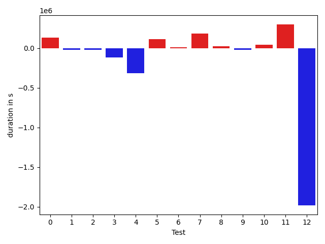

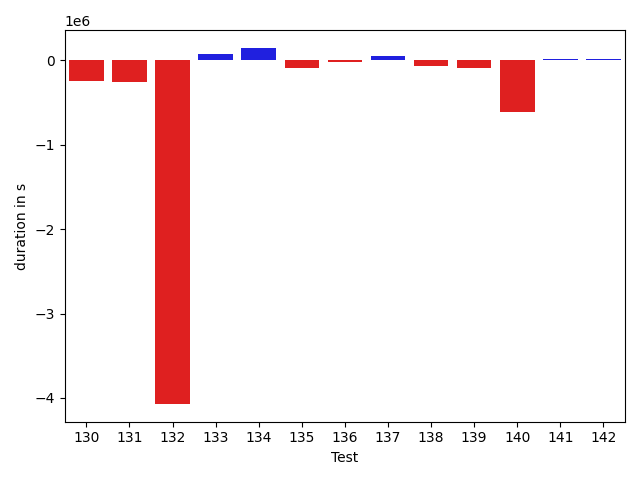

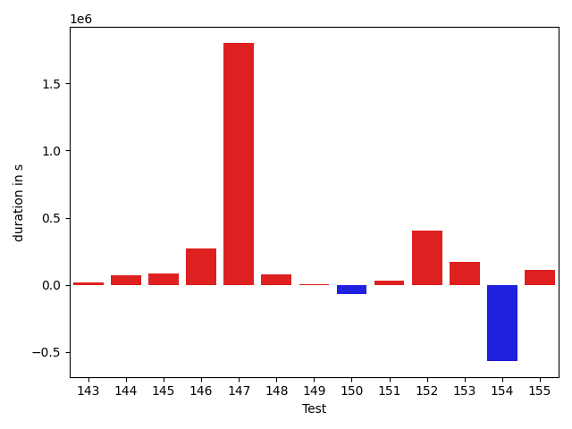

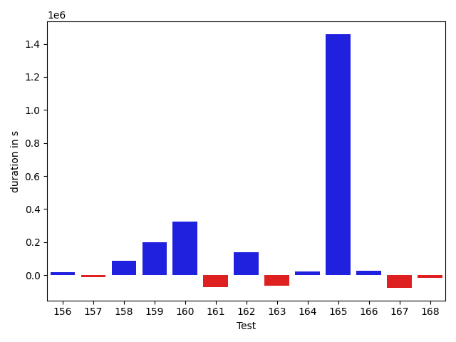

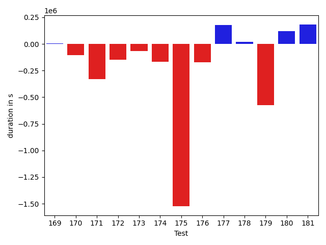

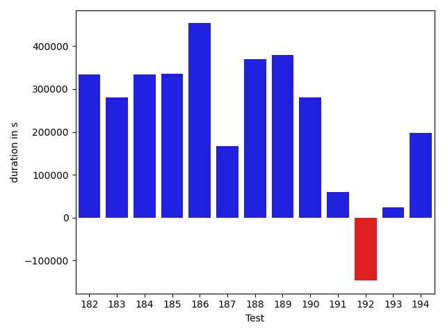

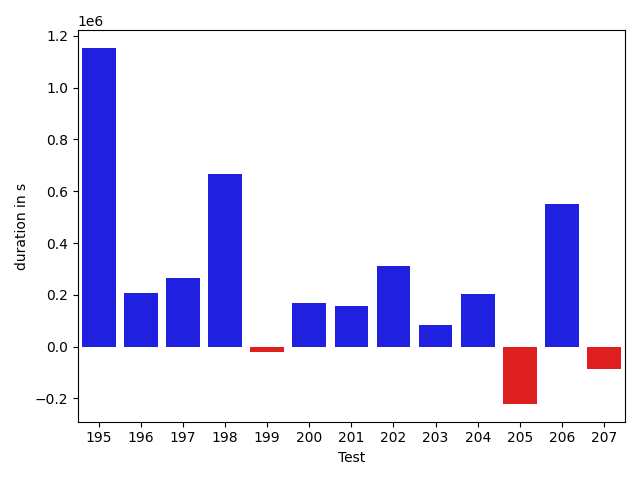

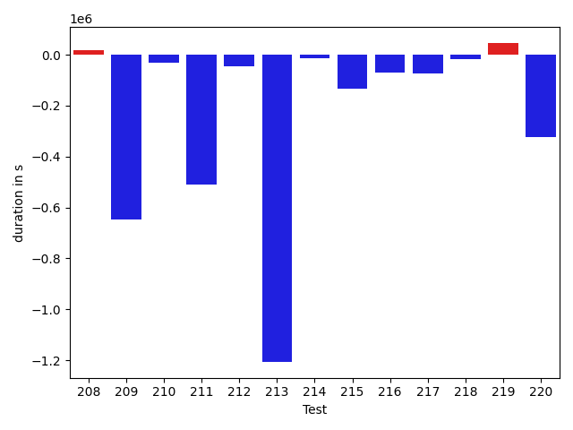

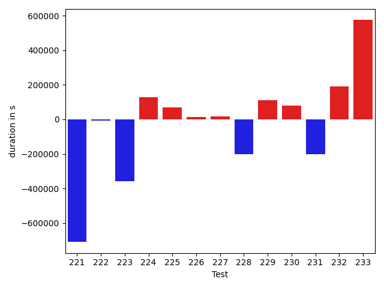

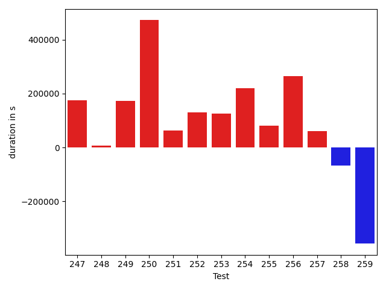

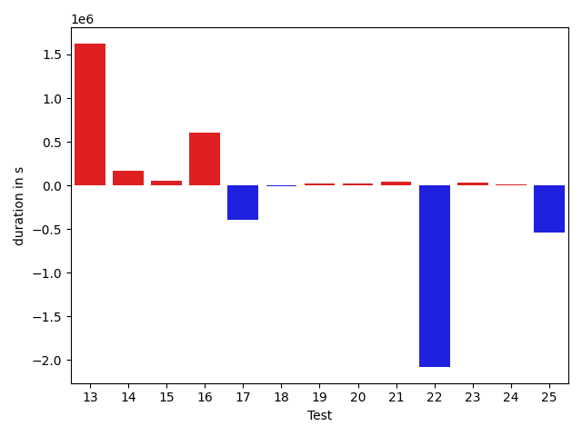

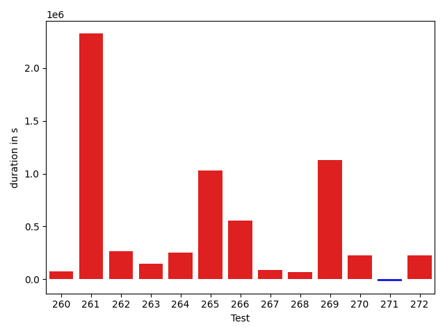

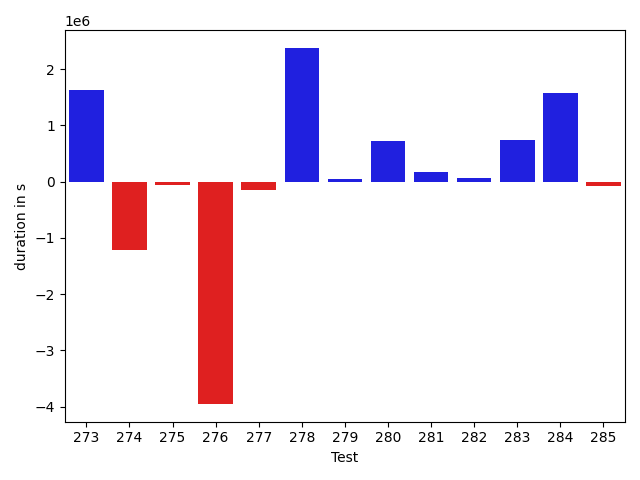

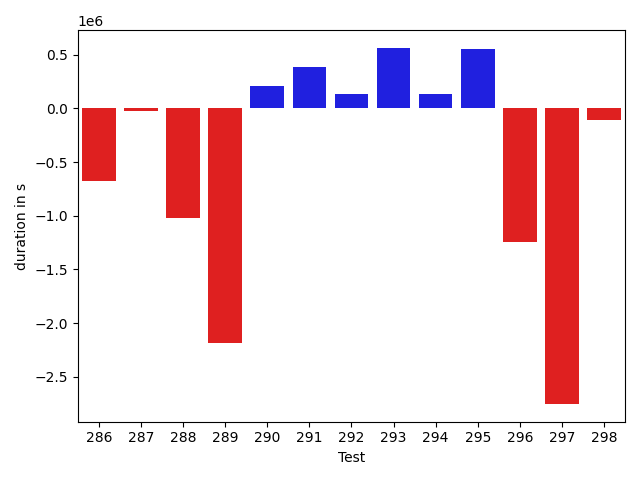

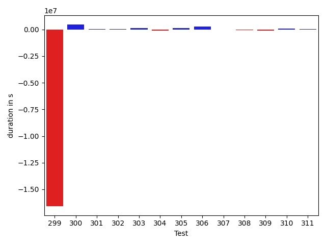

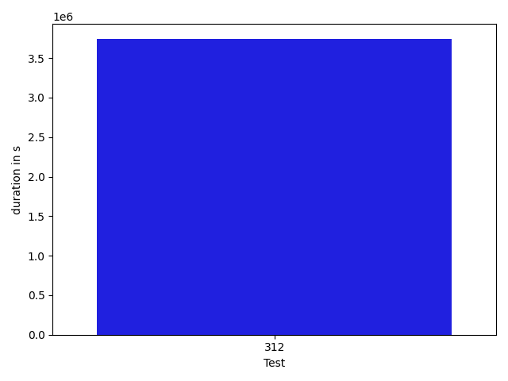

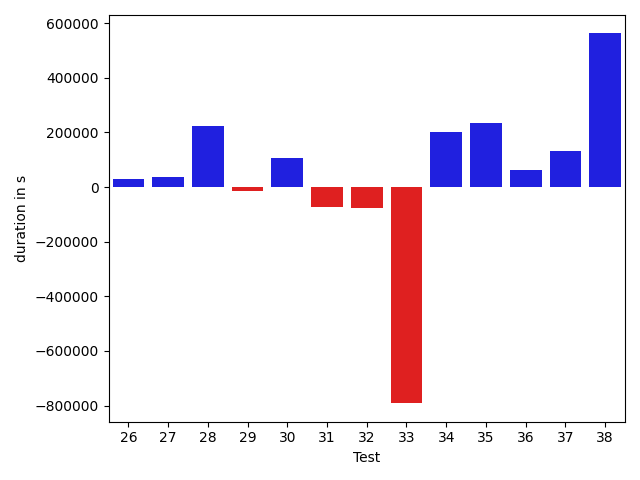

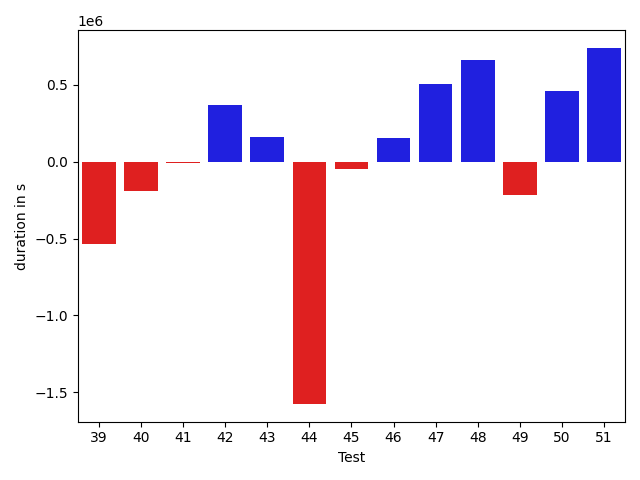

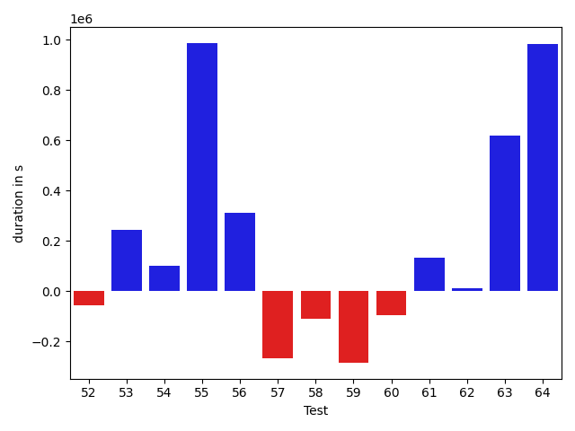

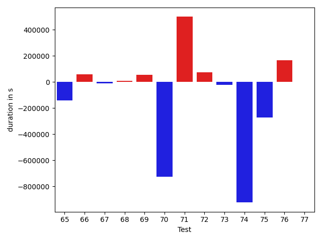

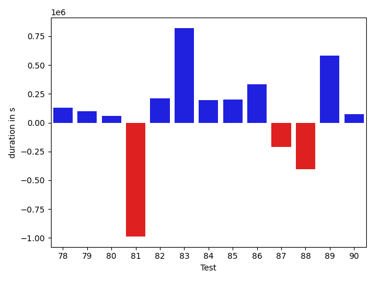

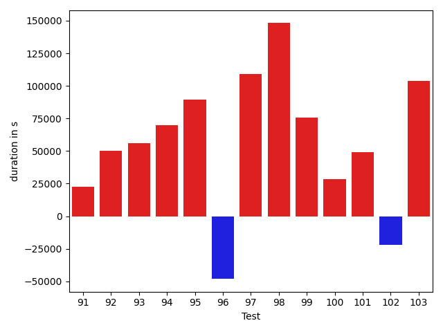

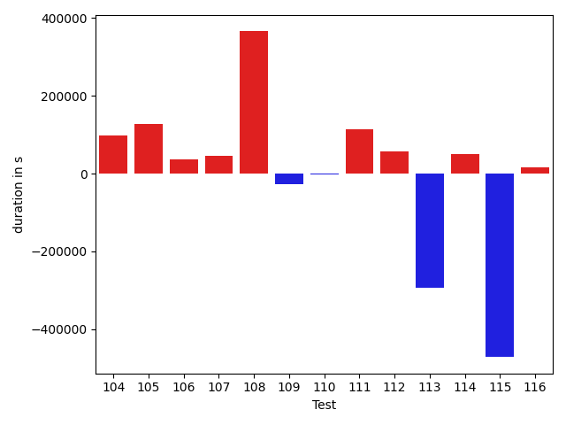

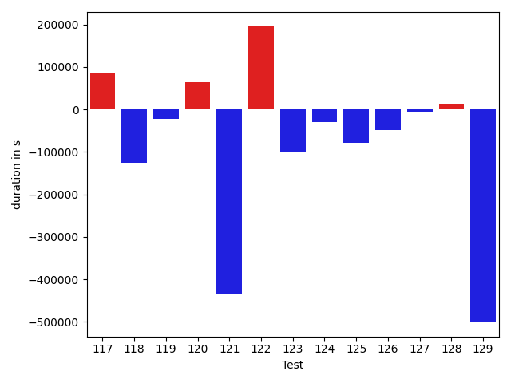

| ID | DurationV1 | DurationsV2 | DeltaDuration |
| --- | --- | --- | --- |
| 0 | 1431444.8805118261 | 1169968.3122834829 | -261476.56822834327 |
| 1 | 1477797.934598751 | 1248119.8927815615 | -229678.04181718943 |
| 2 | 1171977.692529167 | 835386.6596958026 | -336591.03283336444 |
| 3 | 997360.9870932244 | 759789.4075102451 | -237571.57958297932 |
| 4 | 2149244.789999701 | 2314997.103710436 | 165752.3137107347 |
| 5 | 629145.3181227645 | 654124.8741676768 | 24979.556044912315 |
| 6 | 1002314.986387323 | 694006.2870986003 | -308308.6992887227 |
| 7 | 805276.7036690898 | 646691.1106861575 | -158585.59298293234 |
| 8 | 849452.4506604844 | 865441.9696083725 | 15989.518947888166 |
| 9 | 1007195.3753164201 | 944813.3732925664 | -62382.00202385371 |
| 10 | 665795.9598974476 | 860088.8389318186 | 194292.879034371 |
| 11 | 884425.0128826494 | 666314.841596355 | -218110.17128629447 |
| 12 | 1060454.5454855643 | 961844.7732751507 | -98609.77221041359 |
| 13 | 918035.2312096786 | 739234.4959878912 | -178800.73522178736 |
| 14 | 1514073.789001942 | 1419917.5128903692 | -94156.27611157275 |
| 15 | 663890.7490936262 | 1233876.615724427 | 569985.8666308008 |
| 16 | 694795.2570408861 | 788018.3942647766 | 93223.13722389052 |
| 17 | 852894.5899563433 | 916453.0612107315 | 63558.47125438822 |
| 18 | 25229176.70360078 | 28443273.041514475 | 3214096.3379136957 |
| 19 | 1331268.5897350798 | 1363125.7212955838 | 31857.13156050397 |
| 20 | 1973836.8191820462 | 2074768.4064411111 | 100931.5872590649 |
| 21 | 759859.5636770071 | 730889.194912012 | -28970.36876499513 |
| 22 | 557969.9623837747 | 587191.073041042 | 29221.110657267272 |
| 23 | 1734169.599922081 | 1319522.996439916 | -414646.6034821649 |
| 24 | 766556.281946118 | 955987.8816823871 | 189431.5997362691 |
| 25 | 409181.94504642487 | 486757.277499944 | 77575.3324535191 |
| 26 | 440662.3751182556 | 471880.6508245468 | 31218.2757062912 |
| 27 | 489294.6859741211 | 527084.1603441238 | 37789.47437000275 |
| 28 | 536466.7546957404 | 760438.7596454653 | 223972.00494972488 |
| 29 | 1156135.0444066862 | 1142507.7529826793 | -13627.291424006922 |
| 30 | 1295020.3127411695 | 1403227.8511217555 | 108207.53838058608 |
| 31 | 1607998.3831401262 | 1533496.7590764817 | -74501.62406364456 |
| 32 | 708297.9294282679 | 631776.8378251226 | -76521.09160314524 |
| 33 | 3519942.859097043 | 2728297.89124042 | -791644.9678566232 |
| 34 | 740796.6410534219 | 942105.3995515014 | 201308.7584980795 |
| 35 | 1041862.5985170011 | 1277465.6859937152 | 235603.08747671405 |
| 36 | 836508.0892509948 | 900365.2299618991 | 63857.14071090426 |
| 37 | 1210269.7221756112 | 1341011.0469263976 | 130741.32475078641 |
| 38 | 1738055.336852109 | 2300451.3656556047 | 562396.0288034957 |
| 39 | 1368716.3315566224 | 834904.7910203331 | -533811.5405362893 |
| 40 | 1513269.603431445 | 1319535.1917575258 | -193734.4116739193 |
| 41 | 804162.5081585663 | 793800.165097968 | -10362.34306059836 |
| 42 | 1354294.355990108 | 1722750.4582021541 | 368456.10221204604 |
| 43 | 366548.76025390625 | 529219.7428588867 | 162670.98260498047 |
| 44 | 4808952.042967028 | 3232271.289717278 | -1576680.75324975 |
| 45 | 2081042.9243146987 | 2030885.3175700782 | -50157.60674462048 |
| 46 | 1452214.2726434094 | 1606623.8976623488 | 154409.62501893938 |
| 47 | 1206148.5795827245 | 1714520.9254813758 | 508372.3458986513 |
| 48 | 1357139.0240880689 | 2022034.0460016227 | 664895.0219135538 |
| 49 | 1613595.3806381845 | 1396568.4138309613 | -217026.96680722316 |
| 50 | 1177554.1475799973 | 1639269.3488825122 | 461715.2013025149 |
| 51 | 885620.4273609266 | 1626186.7846229896 | 740566.357262063 |
| 52 | 481745.56746292114 | 424001.6342778206 | -57743.933185100555 |
| 53 | 803247.9041538865 | 1046993.4279155128 | 243745.52376162633 |
| 54 | 1436069.909617268 | 1538278.8773474162 | 102208.96773014823 |
| 55 | 1305905.2117824277 | 2292796.2653066046 | 986891.0535241768 |
| 56 | 1104557.989595794 | 1416416.3641906893 | 311858.3745948954 |
| 57 | 862047.3845640728 | 595179.2399887582 | -266868.1445753146 |
| 58 | 1225025.9306345475 | 1115152.6770219805 | -109873.25361256697 |
| 59 | 2362637.4344665906 | 2078322.6359516561 | -284314.7985149345 |
| 60 | 480161.1000185013 | 383434.5368652344 | -96726.5631532669 |
| 61 | 917628.2730713304 | 1050321.2158293882 | 132692.94275805785 |
| 62 | 882266.3108615638 | 893038.7768132963 | 10772.465951732476 |
| 63 | 918455.1060478942 | 1538534.6627338848 | 620079.5566859905 |
| 64 | 4077063.49754099 | 5061170.709128364 | 984107.2115873741 |
| 65 | 733448.556615761 | 993256.1500623424 | 259807.5934465814 |
| 66 | 1033379.8403602068 | 1018504.6596589454 | -14875.180701261386 |
| 67 | 575657.7902163607 | 585231.3248874602 | 9573.534671099507 |
| 68 | 897805.4259998925 | 1048174.3357361336 | 150368.9097362411 |
| 69 | 377424.93537449837 | 367337.79910087585 | -10087.136273622513 |
| 70 | 540125.4041404724 | 820909.2848497629 | 280783.8807092905 |
| 71 | 936581.3374723047 | 1012013.9156384023 | 75432.57816609764 |
| 72 | 692852.772517577 | 927766.0181399309 | 234913.24562235386 |
| 73 | 969730.6817534543 | 1089956.0561121313 | 120225.37435867707 |
| 74 | 849972.9182523077 | 861091.2375101398 | 11118.319257832132 |
| 75 | 654181.6086641329 | 666303.4369252227 | 12121.82826108986 |
| 76 | 1817921.8956328854 | 1861907.7572025415 | 43985.86156965606 |
| 77 | 511459.6471531484 | 611503.8625152409 | 100044.21536209248 |
| 78 | 1029720.325645971 | 1157489.36677091 | 127769.0411249391 |
| 79 | 1961989.160085958 | 2059254.8236109698 | 97265.66352501186 |
| 80 | 1069577.8855824678 | 1130375.8958090302 | 60798.01022656239 |
| 81 | 2103118.3891143445 | 1115465.6111371787 | -987652.7779771658 |
| 82 | 1057813.3824922894 | 1268320.1047712094 | 210506.72227892 |
| 83 | 941999.2888815866 | 1762834.0185531843 | 820834.7296715977 |
| 84 | 2222875.1439036266 | 2417972.774552377 | 195097.63064875035 |
| 85 | 893200.6388749373 | 1095245.699177947 | 202045.06030300958 |
| 86 | 1146990.357378327 | 1477637.8019112602 | 330647.4445329332 |
| 87 | 1659431.6041935435 | 1448779.211165576 | -210652.39302796754 |
| 88 | 1057817.2343594402 | 653460.5867913758 | -404356.6475680644 |
| 89 | 3811438.448685659 | 4392609.172689204 | 581170.724003545 |
| 90 | 618500.653586553 | 692251.8032937251 | 73751.14970717218 |
| 91 | 446679.9906616211 | 734204.34290508 | 287524.35224345885 |
| 92 | 2524855.2766181477 | 2763963.8957689013 | 239108.6191507536 |
| 93 | 676647.7742233507 | 960051.8635471573 | 283404.0893238066 |
| 94 | 359416.6100769043 | 653513.0765249729 | 294096.4664480686 |
| 95 | 1497493.7975082418 | 1084224.1790299658 | -413269.61847827607 |
| 96 | 908477.1988976833 | 1024831.553560304 | 116354.3546626207 |
| 97 | 637051.9395435452 | 1422929.5705224453 | 785877.6309789 |
| 98 | 682416.3026351929 | 654800.7575683594 | -27615.545066833496 |
| 99 | 1158290.6621707785 | 710850.274154408 | -447440.3880163705 |
| 100 | 661672.4639633922 | 651781.1271146117 | -9891.336848780513 |
| 101 | 755825.015716129 | 1106447.532503128 | 350622.51678699907 |
| 102 | 1158431.8810547977 | 880041.077352995 | -278390.8037018026 |
| 103 | 479906.657725811 | 461507.6356099844 | -18399.022115826607 |
| 104 | 713979.6198506589 | 745065.8432094814 | 31086.22335882252 |
| 105 | 872526.8444079906 | 635060.0927331215 | -237466.7516748691 |
| 106 | 2092138.145351537 | 2289332.140575584 | 197193.995224047 |
| 107 | 445548.0038707624 | 712092.6398547888 | 266544.63598402636 |
| 108 | 870410.390815102 | 1040580.8915797479 | 170170.50076464587 |
| 109 | 762373.6242854539 | 819064.6856096049 | 56691.061324151 |
| 110 | 553415.5464023054 | 773034.2426757812 | 219618.69627347589 |
| 111 | 480920.3133539334 | 647970.1123013496 | 167049.79894741625 |
| 112 | 915577.8060509092 | 1292745.6633227912 | 377167.857271882 |
| 113 | 681260.59927845 | 594959.92896483 | -86300.67031362001 |
| 114 | 456836.9959869385 | 444860.4735582471 | -11976.522428691387 |
| 115 | 454109.88099666685 | 668753.3544301391 | 214643.47343347222 |
| 116 | 472080.743779093 | 537568.1871383535 | 65487.44335926045 |
| 117 | 953145.9941079749 | 767310.9127582639 | -185835.08134971105 |
| 118 | 783756.3107580753 | 1274712.362781427 | 490956.0520233518 |
| 119 | 453897.6761363447 | 458520.91755960137 | 4623.241423256695 |
| 120 | 7513214.707844228 | 5642641.213924563 | -1870573.493919665 |
| 121 | 5039877.220282579 | 4489532.965270262 | -550344.2550123166 |
| 122 | 662762.6855793002 | 656238.3069834574 | -6524.378595842747 |
| 123 | 667826.2230445619 | 909000.6325049419 | 241174.40946037997 |
| 124 | 486427.8798749447 | 745374.4721823119 | 258946.59230736725 |
| 125 | 1764871.1640138822 | 1521066.3913055207 | -243804.7727083615 |
| 126 | 945143.6682906151 | 517016.31380591984 | -428127.35448469524 |
| 127 | 1861976.6023664474 | 867296.2977423774 | -994680.3046240701 |
| 128 | 922415.1057157202 | 937969.706194232 | 15554.60047851177 |
| 129 | 425983.13630218804 | 451410.7514785975 | 25427.615176409483 |
| 130 | 867079.9386759865 | 624729.242043164 | -242350.6966328225 |
| 131 | 935413.6057600311 | 679372.6242882926 | -256040.98147173855 |
| 132 | 9496918.166950487 | 5426229.07855468 | -4070689.088395807 |
| 133 | 603767.1306686272 | 682035.9089367712 | 78268.778268144 |
| 134 | 386199.76252293587 | 530502.899508059 | 144303.13698512316 |
| 135 | 838714.5677340353 | 747076.4160357876 | -91638.15169824776 |
| 136 | 633029.1382988556 | 609939.9606968372 | -23089.177602018462 |
| 137 | 895683.7388758658 | 949948.9324089244 | 54265.19353305863 |
| 138 | 568132.6099633984 | 493124.51169110124 | -75008.09827229718 |
| 139 | 782221.5477117281 | 685646.7172727602 | -96574.83043896791 |
| 140 | 1123615.037446186 | 515149.5063842717 | -608465.5310619143 |
| 141 | 427834.18730068207 | 443199.17925834656 | 15364.99195766449 |
| 142 | 444121.7067050934 | 455427.40026796196 | 11305.693562868575 |
| 143 | 848744.92103536 | 750455.8255764681 | -98289.09545889182 |
| 144 | 1103551.0345863532 | 1298017.5830900762 | 194466.548503723 |
| 145 | 417503.1742315083 | 504358.0169461556 | 86854.8427146473 |
| 146 | 649372.1218340457 | 677230.4809240501 | 27858.35909000435 |
| 147 | 658894.3518672234 | 768957.0853523605 | 110062.73348513711 |
| 148 | 3360235.0405302956 | 562739.9158470831 | -2797495.1246832125 |
| 149 | 602718.9879875183 | 425288.7861294085 | -177430.2018581098 |
| 150 | 347980.29248046875 | 391412.77411842346 | 43432.48163795471 |
| 151 | 369575.8970490694 | 456376.43722951505 | 86800.54018044565 |
| 152 | 782668.8977317688 | 697306.1336422311 | -85362.76408953767 |
| 153 | 545907.1994349584 | 416885.88451518444 | -129021.31491977395 |
| 154 | 597630.8931409459 | 595624.6047305824 | -2006.288410363486 |
| 155 | 367143.4803302288 | 444821.3744030148 | 77677.89407278597 |
| 156 | 679423.8301213013 | 695454.2254163886 | 16030.395295087248 |
| 157 | 425109.45215153694 | 412639.67644541524 | -12469.775706121698 |
| 158 | 402126.7798790978 | 486798.8682944663 | 84672.08841536846 |
| 159 | 526970.0398307592 | 727539.1416970597 | 200569.10186630057 |
| 160 | 442840.9626660347 | 765663.2169803851 | 322822.25431435043 |
| 161 | 500700.17555999756 | 427978.5497798994 | -72721.62578009814 |
| 162 | 391546.4710138738 | 528827.1771583557 | 137280.7061444819 |
| 163 | 578245.8073065281 | 514784.9513431203 | -63460.85596340778 |
| 164 | 400685.80306875706 | 423630.6881608963 | 22944.885092139244 |
| 165 | 2520060.5753020896 | 3978858.885192865 | 1458798.3098907755 |
| 166 | 676815.5914271987 | 700988.5904729815 | 24172.999045782723 |
| 167 | 647624.089196861 | 570612.3153983434 | -77011.77379851765 |
| 168 | 1085558.1228890186 | 1068117.6125435997 | -17440.510345418938 |
| 169 | 515271.4437384326 | 519663.8562157154 | 4392.412477282807 |
| 170 | 671464.4538321495 | 564237.3520255238 | -107227.10180662572 |
| 171 | 860201.3316275303 | 528953.8701786264 | -331247.4614489039 |
| 172 | 536012.0725851059 | 386771.1434516907 | -149240.92913341522 |
| 173 | 538890.9026038308 | 473208.117858329 | -65682.78474550182 |
| 174 | 1262107.0387022558 | 1093695.3405609946 | -168411.69814126124 |
| 175 | 2381994.603624806 | 858613.2910794823 | -1523381.3125453235 |
| 176 | 1242078.5504103808 | 1067921.355920457 | -174157.19448992377 |
| 177 | 942191.4119427224 | 1117877.804791625 | 175686.3928489025 |
| 178 | 881602.157538982 | 900423.1260684235 | 18820.96852944151 |
| 179 | 1405195.437474278 | 830118.5985148136 | -575076.8389594645 |
| 180 | 650720.6517990315 | 772994.0013490914 | 122273.34955005988 |
| 181 | 1443152.0644518163 | 1625558.58174902 | 182406.51729720365 |
| 182 | 1163206.7725272172 | 1496864.4745747626 | 333657.70204754546 |
| 183 | 741732.7738469681 | 1022991.131791733 | 281258.3579447649 |
| 184 | 433676.248090148 | 768256.9339799507 | 334580.68588980276 |
| 185 | 464246.44292057585 | 799312.9634441842 | 335066.5205236083 |
| 186 | 440316.7873193475 | 893757.065500252 | 453440.27818090445 |
| 187 | 805248.4167630291 | 972344.5241450989 | 167096.1073820698 |
| 188 | 506699.3814718466 | 876700.8016979651 | 370001.4202261185 |
| 189 | 917227.8538919801 | 1296822.9565486338 | 379595.1026566536 |
| 190 | 613934.8978324643 | 893831.342349034 | 279896.4445165697 |
| 191 | 643172.2885281229 | 703203.6730352348 | 60031.384507111856 |
| 192 | 765418.2456538985 | 618463.51902734 | -146954.72662655846 |
| 193 | 618155.2893076154 | 642274.2115417311 | 24118.922234115773 |
| 194 | 403973.76321566105 | 601039.3486390292 | 197065.58542336815 |
| 195 | 948866.6653522099 | 2102020.6987251 | 1153154.0333728902 |
| 196 | 726101.2345373707 | 934442.8870542992 | 208341.6525169285 |
| 197 | 3416137.065100495 | 3683015.274681691 | 266878.2095811963 |
| 198 | 1038412.5804974174 | 1705380.9936338859 | 666968.4131364685 |
| 199 | 508012.0644336641 | 488374.69787657773 | -19637.366557086352 |
| 200 | 1230299.3966175374 | 1397351.890637523 | 167052.49401998566 |
| 201 | 1037098.6253509969 | 1195965.1739754262 | 158866.5486244294 |
| 202 | 557798.9438963458 | 867581.1569087091 | 309782.2130123633 |
| 203 | 672896.815220952 | 758272.0369723332 | 85375.22175138118 |
| 204 | 1238611.7636013909 | 1441025.507664604 | 202413.74406321323 |
| 205 | 1539797.170311971 | 1318826.8959943086 | -220970.27431766246 |
| 206 | 905972.1239419067 | 1456945.4553567646 | 550973.3314148579 |
| 207 | 1341201.3979639537 | 1255357.0578879127 | -85844.34007604094 |
| 208 | 1230501.8277056548 | 1731743.0783628933 | 501241.25065723853 |
| 209 | 1025863.9314560548 | 996511.0759446087 | -29352.855511446134 |
| 210 | 984531.8244440819 | 1002802.3558502098 | 18270.531406127964 |
| 211 | 519795.7505452597 | 558644.2354101981 | 38848.48486493842 |
| 212 | 855890.873325805 | 1714698.912283822 | 858808.038958017 |
| 213 | 1264392.520337261 | 1072220.378725112 | -192172.14161214908 |
| 214 | 1933932.7978096176 | 1499259.6848071571 | -434673.11300246045 |
| 215 | 1323075.5291883529 | 772261.1283267648 | -550814.4008615881 |
| 216 | 460841.6234399353 | 478137.3722614944 | 17295.74882155907 |
| 217 | 1562531.5093460009 | 749065.2044680873 | -813466.3048779136 |
| 218 | 887777.9725269658 | 842281.8108684386 | -45496.16165852721 |
| 219 | 1344518.6153237897 | 1066619.8083869945 | -277898.8069367951 |
| 220 | 1290376.008836676 | 852550.9082841589 | -437825.100552517 |
| 221 | 1109032.7086445047 | 953033.534308983 | -155999.17433552165 |
| 222 | 901156.0236881129 | 656124.1581128942 | -245031.8655752187 |
| 223 | 540073.5381393433 | 644939.2596797943 | 104865.72154045105 |
| 224 | 849493.7215169074 | 689663.6444080202 | -159830.07710888726 |
| 225 | 1846591.506729216 | 1547850.4580469602 | -298741.0486822559 |
| 226 | 1277172.959044172 | 1095543.1373721492 | -181629.8216720228 |
| 227 | 933681.9585078284 | 965672.4142509699 | 31990.455743141472 |
| 228 | 850560.7752303309 | 993832.9944566977 | 143272.21922636684 |
| 229 | 581857.6656780839 | 515532.8546043169 | -66324.81107376702 |
| 230 | 1176469.9455939082 | 873166.4424430411 | -303303.50315086707 |
| 231 | 3815955.970329229 | 4368490.3331229165 | 552534.3627936877 |
| 232 | 719506.4543931896 | 1000020.5121740643 | 280514.05778087466 |
| 233 | 927515.2627566303 | 835902.8790125735 | -91612.3837440568 |
| 234 | 6374206.288106216 | 9059831.91859967 | 2685625.6304934546 |
| 235 | 8659904.717243541 | 15229581.514066573 | 6569676.796823032 |
| 236 | 530350.919362311 | 708326.2149463762 | 177975.29558406514 |
| 237 | 756313.792896469 | 721500.2938482334 | -34813.49904823559 |
| 238 | 769949.2844946668 | 740558.3418534982 | -29390.9426411686 |
| 239 | 1128464.00340949 | 985738.4593467417 | -142725.54406274832 |
| 240 | 816498.5542473793 | 667472.8977833688 | -149025.65646401048 |
| 241 | 478302.93491755426 | 969985.7869302536 | 491682.85201269935 |
| 242 | 883730.0140955586 | 778301.7111372331 | -105428.30295832548 |
| 243 | 1144764.8774178193 | 1333954.7786129764 | 189189.9011951571 |
| 244 | 3762486.652639508 | 2125151.9299290194 | -1637334.7227104884 |
| 245 | 867509.2397452161 | 889354.9687872938 | 21845.72904207767 |
| 246 | 2631467.2380071916 | 1742959.468310139 | -888507.7696970527 |
| 247 | 707943.4110174477 | 929460.0730725916 | 221516.66205514385 |
| 248 | 715297.1642351157 | 969886.4147924361 | 254589.2505573203 |
| 249 | 1035053.7988875401 | 1180153.2812886918 | 145099.48240115168 |
| 250 | 778565.2379561067 | 882655.0489511511 | 104089.81099504442 |
| 251 | 995946.6355111606 | 1094136.1241244846 | 98189.488613324 |
| 252 | 1103657.7326033586 | 1075486.5982129832 | -28171.134390375344 |
| 253 | 909664.7116553108 | 1048786.0903943304 | 139121.37873901962 |
| 254 | 847985.5062228967 | 1021359.4562483649 | 173373.95002546813 |
| 255 | 1777600.6411497833 | 988516.1353260276 | -789084.5058237556 |
| 256 | 2283414.7618379123 | 2629997.0746612777 | 346582.31282336544 |
| 257 | 1486362.7306983 | 1157566.8700987874 | -328795.8605995127 |
| 258 | 1376512.493913792 | 951562.0098366718 | -424950.4840771203 |
| 259 | 578632.4266763404 | 1048034.6874167717 | 469402.26074043126 |
| 260 | 447791.30240345 | 469437.8310768604 | 21646.528673410416 |
| 261 | 454891.6888408661 | 519237.4186692988 | 64345.729828432726 |
| 262 | 516189.1553463936 | 563655.3458875248 | 47466.19054113119 |
| 263 | 2358199.3237143154 | 495201.49738956045 | -1862997.8263247549 |
| 264 | 706812.9021686174 | 2399146.2718246626 | 1692333.3696560452 |
| 265 | 425264.6533717485 | 506944.9880441092 | 81680.33467236068 |
| 266 | 610044.7485329839 | 1001464.1721931787 | 391419.42366019473 |
| 267 | 627785.3248620667 | 591518.7287360551 | -36266.59612601157 |
| 268 | 631216.7036306543 | 619025.09595459 | -12191.607676064246 |
| 269 | 1197718.845950076 | 620142.2032660636 | -577576.6426840123 |
| 270 | 2504716.7257200438 | 2279557.8613013313 | -225158.86441871244 |
| 271 | 1060946.810465064 | 744631.535491551 | -316315.27497351286 |
| 272 | 675733.6895378381 | 739023.2896829927 | 63289.60014515463 |
| 273 | 461115.4808269143 | 2087053.6610224976 | 1625938.1801955833 |
| 274 | 2520125.0108691854 | 1300973.0660423758 | -1219151.9448268097 |
| 275 | 910513.9835708078 | 843733.2247714408 | -66780.758799367 |
| 276 | 4728558.176653218 | 776347.7545488193 | -3952210.422104399 |
| 277 | 659358.166611826 | 514504.8390397739 | -144853.32757205213 |
| 278 | 757256.1969331275 | 3131303.2872629925 | 2374047.090329865 |
| 279 | 1034302.2537893057 | 1074272.6357304065 | 39970.381941100815 |
| 280 | 801442.3745251383 | 1521961.8023779616 | 720519.4278528233 |
| 281 | 638368.7308029538 | 799132.8397955457 | 160764.10899259185 |
| 282 | 2619882.9218071266 | 2675204.1640489697 | 55321.24224184314 |
| 283 | 821550.755422015 | 1565467.3900037657 | 743916.6345817507 |
| 284 | 1025739.4026322409 | 2600302.608754441 | 1574563.2061222002 |
| 285 | 635239.0085417666 | 562601.5256977081 | -72637.48284405842 |
| 286 | 2963685.844892486 | 2287081.1042459384 | -676604.7406465476 |
| 287 | 723057.5040677399 | 697250.3046323198 | -25807.1994354201 |
| 288 | 4006094.973464286 | 2980567.876981277 | -1025527.0964830089 |
| 289 | 3773017.8224050165 | 1588531.3215366197 | -2184486.500868397 |
| 290 | 1411374.449886536 | 1622614.0451562442 | 211239.5952697082 |
| 291 | 1099543.3817259609 | 1481538.510346408 | 381995.1286204471 |
| 292 | 705869.5849281367 | 840955.3706477304 | 135085.78571959375 |
| 293 | 771289.3749067216 | 1334755.7961439053 | 563466.4212371836 |
| 294 | 528475.4242920876 | 659093.7936439812 | 130618.36935189366 |
| 295 | 845565.2406430708 | 1403634.1883757852 | 558068.9477327145 |
| 296 | 1801638.653085862 | 559839.6040607982 | -1241799.0490250639 |
| 297 | 4456761.908216568 | 1702859.6895324138 | -2753902.2186841536 |
| 298 | 1210137.3022265038 | 1101128.193712518 | -109009.10851398576 |
| 299 | 17256048.632742014 | 674321.3635884945 | -16581727.269153519 |
| 300 | 462830.4571641572 | 930211.2442052364 | 467380.78704107925 |
| 301 | 468224.0448498726 | 501050.8247281872 | 32826.779878314584 |
| 302 | 440677.27697753906 | 473600.7879036069 | 32923.51092606783 |
| 303 | 657240.7139090318 | 787081.5413716084 | 129840.82746257656 |
| 304 | 654848.293533206 | 530171.5154963732 | -124676.77803683281 |
| 305 | 1402823.9421838776 | 1524496.4514503167 | 121672.50926643913 |
| 306 | 1443330.489746038 | 1723226.0869104373 | 279895.5971643992 |
| 307 | 584193.5113654733 | 593286.2188409716 | 9092.707475498319 |
| 308 | 766498.7100834739 | 719075.3244832109 | -47423.38560026302 |
| 309 | 1095811.2663047286 | 1007749.3536069611 | -88061.91269776749 |
| 310 | 717525.1514445015 | 796845.7330441825 | 79320.58159968106 |
| 311 | 581311.4213878661 | 628419.7737982289 | 47108.3524103628 |
| 312 | 709081.2353978684 | 4453221.402297917 | 3744140.1669000485 |

## Misc.

| ID | Test Class | Test Method |
| --- | --- | --- |
| 0 | com.google.gson.functional.StreamingTypeAdaptersTest | testNullSafe |
| 1 | com.google.gson.functional.StreamingTypeAdaptersTest | testSerializeWithCustomTypeAdapter |
| 2 | com.google.gson.functional.StreamingTypeAdaptersTest | testDeserializeWithCustomTypeAdapter |
| 3 | com.google.gson.functional.StreamingTypeAdaptersTest | testSerializeRecursive |
| 4 | com.google.gson.functional.JsonAdapterAnnotationOnClassesTest | testJsonAdapterInvoked |
| 5 | com.google.gson.functional.JsonAdapterAnnotationOnClassesTest | testRegisteredDeserializerOverridesJsonAdapter |
| 6 | com.google.gson.functional.JsonAdapterAnnotationOnClassesTest | testRegisteredSerializerOverridesJsonAdapter |
| 7 | com.google.gson.functional.JsonAdapterAnnotationOnClassesTest | testSuperclassTypeAdapterNotInvoked |
| 8 | com.google.gson.functional.JsonAdapterAnnotationOnClassesTest | testNullSafeObjectFromJson |
| 9 | com.google.gson.functional.JsonAdapterAnnotationOnClassesTest | testJsonAdapterFactoryInvoked |
| 10 | com.google.gson.functional.JsonAdapterAnnotationOnClassesTest | testIncorrectTypeAdapterFails |
| 11 | com.google.gson.functional.CustomDeserializerTest | testDefaultConstructorNotCalledOnField |
| 12 | com.google.gson.functional.CustomDeserializerTest | testCustomDeserializerReturnsNullForArrayElementsForArrayField |
| 13 | com.google.gson.functional.CustomDeserializerTest | testCustomDeserializerReturnsNull |
| 14 | com.google.gson.functional.CustomDeserializerTest | testJsonTypeFieldBasedDeserialization |
| 15 | com.google.gson.functional.CustomDeserializerTest | testDefaultConstructorNotCalledOnObject |
| 16 | com.google.gson.functional.DefaultTypeAdaptersTest | testTreeSetDeserialization |
| 17 | com.google.gson.functional.DefaultTypeAdaptersTest | testUrlNullSerialization |
| 18 | com.google.gson.functional.DefaultTypeAdaptersTest | testNullSerialization |
| 19 | com.google.gson.functional.DefaultTypeAdaptersTest | testBigIntegerFieldSerialization |
| 20 | com.google.gson.functional.DefaultTypeAdaptersTest | testBigDecimalFieldSerialization |
| 21 | com.google.gson.functional.DefaultTypeAdaptersTest | testBadValueForBigDecimalDeserialization |
| 22 | com.google.gson.functional.DefaultTypeAdaptersTest | testBigIntegerFieldDeserialization |
| 23 | com.google.gson.functional.DefaultTypeAdaptersTest | testTreeSetSerialization |
| 24 | com.google.gson.functional.DefaultTypeAdaptersTest | testBigDecimalFieldDeserialization |
| 25 | com.google.gson.functional.DefaultTypeAdaptersTest | testUrlNullDeserialization |
| 26 | com.google.gson.functional.DefaultTypeAdaptersTest | testPropertiesSerialization |
| 27 | com.google.gson.functional.DefaultTypeAdaptersTest | testPropertiesDeserialization |
| 28 | com.google.gson.functional.DefaultTypeAdaptersTest | testSetSerialization |
| 29 | com.google.gson.functional.CollectionTest | testCollectionOfObjectSerialization |
| 30 | com.google.gson.functional.CollectionTest | testStack |
| 31 | com.google.gson.functional.CollectionTest | testPriorityQueue |
| 32 | com.google.gson.functional.CollectionTest | testCollectionOfBagOfPrimitivesSerialization |
| 33 | com.google.gson.functional.CollectionTest | testWildcardCollectionField |
| 34 | com.google.gson.functional.CollectionTest | testCollectionOfObjectWithNullSerialization |
| 35 | com.google.gson.functional.CollectionTest | testLinkedListSerialization |
| 36 | com.google.gson.functional.CollectionTest | testRawCollectionSerialization |
| 37 | com.google.gson.functional.CollectionTest | testFieldIsArrayList |
| 38 | com.google.gson.functional.CollectionTest | testIssue1107 |
| 39 | com.google.gson.functional.CollectionTest | testLinkedListDeserialization |
| 40 | com.google.gson.functional.CollectionTest | testSetDeserialization |
| 41 | com.google.gson.functional.CollectionTest | testVector |
| 42 | com.google.gson.functional.CollectionTest | testSetSerialization |
| 43 | com.google.gson.functional.CollectionTest | testCollectionOfStringsSerialization |
| 44 | com.google.gson.functional.JsonAdapterSerializerDeserializerTest | testJsonSerializerDeserializerBasedJsonAdapterOnFields |
| 45 | com.google.gson.functional.JsonAdapterSerializerDeserializerTest | testDifferentJsonAdaptersForGenericFieldsOfSameRawType |
| 46 | com.google.gson.functional.JsonAdapterSerializerDeserializerTest | testJsonSerializerDeserializerBasedJsonAdapterOnClass |
| 47 | com.google.gson.functional.ThrowableFunctionalTest | testExceptionWithoutCause |
| 48 | com.google.gson.functional.ThrowableFunctionalTest | testSerializedNameOnExceptionFields |
| 49 | com.google.gson.functional.ThrowableFunctionalTest | testErrorWithoutCause |
| 50 | com.google.gson.functional.ThrowableFunctionalTest | testExceptionWithCause |
| 51 | com.google.gson.functional.ThrowableFunctionalTest | testErrornWithCause |
| 52 | com.google.gson.functional.MapTest | testWriteMapsWithEmptyStringKey |
| 53 | com.google.gson.functional.MapTest | testSerializeMaps |
| 54 | com.google.gson.functional.MapTest | testMapSerializationWithNullValues |
| 55 | com.google.gson.functional.MapTest | testInterfaceTypeMapWithSerializer |
| 56 | com.google.gson.functional.MapTest | testComplexKeysSerialization |
| 57 | com.google.gson.functional.MapTest | testMapStandardSubclassDeserialization |
| 58 | com.google.gson.functional.MapTest | testGeneralMapField |
| 59 | com.google.gson.functional.MapTest | testInterfaceTypeMap |
| 60 | com.google.gson.functional.MapTest | testMapOfMapSerialization |
| 61 | com.google.gson.functional.MapTest | testMapSubclassSerialization |
| 62 | com.google.gson.functional.MapTest | testComplexKeysDeserialization |
| 63 | com.google.gson.functional.MapTest | testConcurrentMap |
| 64 | com.google.gson.functional.MapTest | testConcurrentNavigableMap |
| 65 | com.google.gson.functional.MapTest | testHashMapDeserialization |
| 66 | com.google.gson.functional.MapTest | testConcurrentHashMap |
| 67 | com.google.gson.functional.MapTest | testMapSerializationWithNullValuesSerialized |
| 68 | com.google.gson.functional.MapTest | testConcurrentSkipListMap |
| 69 | com.google.gson.functional.MapTest | testMapWithQuotes |
| 70 | com.google.gson.functional.MapTest | testRawMapSerialization |
| 71 | com.google.gson.functional.ParameterizedTypesTest | testParameterizedTypeGenericArraysSerialization |
| 72 | com.google.gson.functional.ParameterizedTypesTest | testParameterizedTypesWithWriterSerialization |
| 73 | com.google.gson.functional.ParameterizedTypesTest | testVariableTypeArrayDeserialization |
| 74 | com.google.gson.functional.ParameterizedTypesTest | testParameterizedTypeWithReaderDeserialization |
| 75 | com.google.gson.functional.ParameterizedTypesTest | testDeepParameterizedTypeDeserialization |
| 76 | com.google.gson.functional.ParameterizedTypesTest | testParameterizedTypesSerialization |
| 77 | com.google.gson.functional.ParameterizedTypesTest | testDeepParameterizedTypeSerialization |
| 78 | com.google.gson.functional.ParameterizedTypesTest | testVariableTypeDeserialization |
| 79 | com.google.gson.functional.ParameterizedTypesTest | testVariableTypeFieldsAndGenericArraysSerialization |
| 80 | com.google.gson.functional.ParameterizedTypesTest | testParameterizedTypeGenericArraysDeserialization |
| 81 | com.google.gson.functional.ParameterizedTypesTest | testParameterizedTypeDeserialization |
| 82 | com.google.gson.functional.ParameterizedTypesTest | testVariableTypeFieldsAndGenericArraysDeserialization |
| 83 | com.google.gson.functional.ParameterizedTypesTest | testTypesWithMultipleParametersDeserialization |
| 84 | com.google.gson.functional.ParameterizedTypesTest | testTypesWithMultipleParametersSerialization |
| 85 | com.google.gson.functional.ParameterizedTypesTest | testParameterizedTypeWithVariableTypeDeserialization |
| 86 | com.google.gson.internal.bind.RecursiveTypesResolveTest | testIssue440WeakReference |
| 87 | com.google.gson.internal.bind.RecursiveTypesResolveTest | testRecursiveResolveSimple |
| 88 | com.google.gson.internal.bind.RecursiveTypesResolveTest | testRecursiveTypeVariablesResolve1 |
| 89 | com.google.gson.internal.bind.RecursiveTypesResolveTest | testIssue603PrintStream |
| 90 | com.google.gson.internal.bind.RecursiveTypesResolveTest | testRecursiveTypeVariablesResolve12 |
| 91 | com.google.gson.functional.InheritanceTest | testBaseSerializedAsBaseWhenSpecifiedWithExplicitType |
| 92 | com.google.gson.functional.InheritanceTest | testSubInterfacesOfCollectionSerialization |
| 93 | com.google.gson.functional.InheritanceTest | testSubClassDeserialization |
| 94 | com.google.gson.functional.InheritanceTest | testBaseSerializedAsSubWhenSpecifiedWithExplicitTypeForToJsonMethod |
| 95 | com.google.gson.functional.InheritanceTest | testSubInterfacesOfCollectionDeserialization |
| 96 | com.google.gson.functional.InheritanceTest | testSubClassSerialization |
| 97 | com.google.gson.functional.InheritanceTest | testBaseSerializedAsSubForToJsonMethod |
| 98 | com.google.gson.functional.InheritanceTest | testBaseSerializedAsSub |
| 99 | com.google.gson.functional.InheritanceTest | testClassWithBaseCollectionFieldSerialization |
| 100 | com.google.gson.functional.InheritanceTest | testClassWithBaseFieldSerialization |
| 101 | com.google.gson.functional.InheritanceTest | testBaseSerializedAsBaseWhenSpecifiedWithExplicitTypeForToJsonMethod |
| 102 | com.google.gson.functional.InheritanceTest | testClassWithBaseArrayFieldSerialization |
| 103 | com.google.gson.functional.InheritanceTest | testBaseSerializedAsSubWhenSpecifiedWithExplicitType |
| 104 | com.google.gson.functional.NamingPolicyTest | testAtSignInSerializedName |
| 105 | com.google.gson.functional.NamingPolicyTest | testGsonWithLowerCaseDotPolicyDeserialiation |
| 106 | com.google.gson.functional.NamingPolicyTest | testGsonDuplicateNameUsingSerializedNameFieldNamingPolicySerialization |
| 107 | com.google.gson.functional.NamingPolicyTest | testGsonWithLowerCaseUnderscorePolicySerialization |
| 108 | com.google.gson.functional.NamingPolicyTest | testComplexFieldNameStrategy |
| 109 | com.google.gson.functional.NamingPolicyTest | testDeprecatedNamingStrategy |
| 110 | com.google.gson.functional.NamingPolicyTest | testGsonWithLowerCaseDashPolicyDeserialiation |
| 111 | com.google.gson.functional.NamingPolicyTest | testGsonWithUpperCamelCaseSpacesPolicyDeserialiation |
| 112 | com.google.gson.functional.NamingPolicyTest | testGsonWithSerializedNameFieldNamingPolicySerialization |
| 113 | com.google.gson.functional.NamingPolicyTest | testGsonWithLowerCaseDashPolicySerialization |
| 114 | com.google.gson.functional.NamingPolicyTest | testGsonWithSerializedNameFieldNamingPolicyDeserialization |
| 115 | com.google.gson.functional.NamingPolicyTest | testGsonWithLowerCaseDotPolicySerialization |
| 116 | com.google.gson.functional.NamingPolicyTest | testGsonWithLowerCaseUnderscorePolicyDeserialiation |
| 117 | com.google.gson.functional.NamingPolicyTest | testGsonWithNonDefaultFieldNamingPolicySerialization |
| 118 | com.google.gson.functional.NamingPolicyTest | testGsonWithNonDefaultFieldNamingPolicyDeserialiation |
| 119 | com.google.gson.functional.NamingPolicyTest | testGsonWithUpperCamelCaseSpacesPolicySerialiation |
| 120 | com.google.gson.functional.CircularReferenceTest | testCircularSerialization |
| 121 | com.google.gson.functional.CircularReferenceTest | testSelfReferenceArrayFieldSerialization |
| 122 | com.google.gson.functional.CircularReferenceTest | testDirectedAcyclicGraphSerialization |
| 123 | com.google.gson.functional.CircularReferenceTest | testDirectedAcyclicGraphDeserialization |
| 124 | com.google.gson.functional.CircularReferenceTest | testSelfReferenceIgnoredInSerialization |
| 125 | com.google.gson.functional.ReadersWritersTest | testReadWriteTwoObjects |
| 126 | com.google.gson.functional.ReadersWritersTest | testReaderForDeserialization |
| 127 | com.google.gson.functional.ReadersWritersTest | testWriterForSerialization |
| 128 | com.google.gson.functional.ObjectTest | testEmptyCollectionInAnObjectDeserialization |
| 129 | com.google.gson.functional.ObjectTest | testStringFieldWithNumberValueDeserialization |
| 130 | com.google.gson.functional.ObjectTest | testPrivateNoArgConstructorDeserialization |
| 131 | com.google.gson.functional.ObjectTest | testArrayOfObjectsAsFields |
| 132 | com.google.gson.functional.ObjectTest | testDateAsMapObjectField |
| 133 | com.google.gson.functional.ObjectTest | testPrimitiveArrayInAnObjectDeserialization |
| 134 | com.google.gson.functional.ObjectTest | testNullArraysDeserialization |
| 135 | com.google.gson.functional.ObjectTest | testInnerClassSerialization |
| 136 | com.google.gson.functional.ObjectTest | testArrayOfObjectsDeserialization |
| 137 | com.google.gson.functional.ObjectTest | testArrayOfArraysSerialization |
| 138 | com.google.gson.functional.ObjectTest | testNestedDeserialization |
| 139 | com.google.gson.functional.ObjectTest | testArrayOfObjectsSerialization |
| 140 | com.google.gson.functional.ObjectTest | testClassWithTransientFieldsSerialization |
| 141 | com.google.gson.functional.ObjectTest | testBagOfPrimitivesDeserialization |
| 142 | com.google.gson.functional.ObjectTest | testNullObjectFieldsDeserialization |
| 143 | com.google.gson.functional.ObjectTest | testArrayOfArraysDeserialization |
| 144 | com.google.gson.functional.ObjectTest | testSingletonLists |
| 145 | com.google.gson.functional.ObjectTest | testNullFieldsSerialization |
| 146 | com.google.gson.functional.ObjectTest | testStringFieldWithEmptyValueSerialization |
| 147 | com.google.gson.functional.ObjectTest | testBagOfPrimitiveWrappersSerialization |
| 148 | com.google.gson.functional.ObjectTest | testBagOfPrimitiveWrappersDeserialization |
| 149 | com.google.gson.functional.ObjectTest | testJsonInMixedQuotesDeserialization |
| 150 | com.google.gson.functional.ObjectTest | testClassWithNoFieldsDeserialization |
| 151 | com.google.gson.functional.ObjectTest | testClassWithTransientFieldsDeserialization |
| 152 | com.google.gson.functional.ObjectTest | testInnerClassDeserialization |
| 153 | com.google.gson.functional.ObjectTest | testClassWithTransientFieldsDeserializationTransientFieldsPassedInJsonAreIgnored |
| 154 | com.google.gson.functional.ObjectTest | testClassWithObjectFieldSerialization |
| 155 | com.google.gson.functional.ObjectTest | testStringFieldWithEmptyValueDeserialization |
| 156 | com.google.gson.functional.ObjectTest | testNestedSerialization |
| 157 | com.google.gson.functional.ObjectTest | testEmptyCollectionInAnObjectSerialization |
| 158 | com.google.gson.functional.ObjectTest | testObjectFieldNamesWithoutQuotesDeserialization |
| 159 | com.google.gson.functional.ObjectTest | testJsonInSingleQuotesDeserialization |
| 160 | com.google.gson.functional.ObjectTest | testNullFieldsDeserialization |
| 161 | com.google.gson.functional.ObjectTest | testNullPrimitiveFieldsDeserialization |
| 162 | com.google.gson.functional.ObjectTest | testClassWithNoFieldsSerialization |
| 163 | com.google.gson.functional.ObjectTest | testBagOfPrimitivesSerialization |
| 164 | com.google.gson.functional.ObjectTest | testPrimitiveArrayFieldSerialization |
| 165 | com.google.gson.functional.ExposeFieldsTest | testNullExposeFieldSerialization |
| 166 | com.google.gson.functional.ExposeFieldsTest | testNoExposedFieldSerialization |
| 167 | com.google.gson.functional.ExposeFieldsTest | testArrayWithOneNullExposeFieldObjectSerialization |
| 168 | com.google.gson.functional.ExposeFieldsTest | testExposedInterfaceFieldSerialization |
| 169 | com.google.gson.functional.ExposeFieldsTest | testExposeAnnotationSerialization |
| 170 | com.google.gson.functional.ExposeFieldsTest | testExposedInterfaceFieldDeserialization |
| 171 | com.google.gson.functional.ExposeFieldsTest | testExposeAnnotationDeserialization |
| 172 | com.google.gson.functional.ExposeFieldsTest | testNoExposedFieldDeserialization |
| 173 | com.google.gson.functional.FieldExclusionTest | testDefaultNestedStaticClassIncluded |
| 174 | com.google.gson.functional.FieldExclusionTest | testDefaultInnerClassExclusion |
| 175 | com.google.gson.functional.MoreSpecificTypeSerializationTest | testSubclassFields |
| 176 | com.google.gson.functional.MoreSpecificTypeSerializationTest | testListOfSubclassFields |
| 177 | com.google.gson.functional.MoreSpecificTypeSerializationTest | testParameterizedSubclassFields |
| 178 | com.google.gson.functional.MoreSpecificTypeSerializationTest | testListOfParameterizedSubclassFields |
| 179 | com.google.gson.functional.MoreSpecificTypeSerializationTest | testMapOfSubclassFields |
| 180 | com.google.gson.functional.MoreSpecificTypeSerializationTest | testMapOfParameterizedSubclassFields |
| 181 | com.google.gson.functional.EnumTest | testEnumSubclassAsParameterizedType |
| 182 | com.google.gson.functional.EnumTest | testCollectionOfEnumsSerialization |
| 183 | com.google.gson.functional.EnumTest | testClassWithEnumFieldSerialization |
| 184 | com.google.gson.functional.EnumTest | testClassWithEnumFieldDeserialization |
| 185 | com.google.gson.functional.NullObjectAndFieldTest | testExplicitDeserializationOfNulls |
| 186 | com.google.gson.functional.NullObjectAndFieldTest | testExplicitSerializationOfNullStringMembers |
| 187 | com.google.gson.functional.NullObjectAndFieldTest | testAbsentJsonElementsAreSetToNull |
| 188 | com.google.gson.functional.NullObjectAndFieldTest | testPrintPrintingObjectWithNulls |
| 189 | com.google.gson.functional.NullObjectAndFieldTest | testExplicitSerializationOfNullArrayMembers |
| 190 | com.google.gson.functional.NullObjectAndFieldTest | testExplicitSerializationOfNulls |
| 191 | com.google.gson.functional.NullObjectAndFieldTest | testExplicitNullSetsFieldToNullDuringDeserialization |
| 192 | com.google.gson.functional.NullObjectAndFieldTest | testExplicitSerializationOfNullCollectionMembers |
| 193 | com.google.gson.functional.NullObjectAndFieldTest | testNullWrappedPrimitiveMemberSerialization |
| 194 | com.google.gson.functional.NullObjectAndFieldTest | testNullWrappedPrimitiveMemberDeserialization |
| 195 | com.google.gson.JsonParserTest | testReadWriteTwoObjects |
| 196 | com.google.gson.functional.VersioningTest | testVersionedGsonMixingSinceAndUntilDeserialization |
| 197 | com.google.gson.functional.VersioningTest | testVersionedUntilSerialization |
| 198 | com.google.gson.functional.VersioningTest | testVersionedClassesSerialization |
| 199 | com.google.gson.functional.VersioningTest | testVersionedGsonWithUnversionedClassesDeserialization |
| 200 | com.google.gson.functional.VersioningTest | testVersionedGsonMixingSinceAndUntilSerialization |
| 201 | com.google.gson.functional.VersioningTest | testVersionedGsonWithUnversionedClassesSerialization |
| 202 | com.google.gson.functional.VersioningTest | testVersionedClassesDeserialization |
| 203 | com.google.gson.functional.VersioningTest | testVersionedUntilDeserialization |
| 204 | com.google.gson.functional.JsonAdapterAnnotationOnFieldsTest | testPrimitiveFieldAnnotationTakesPrecedenceOverDefault |
| 205 | com.google.gson.functional.JsonAdapterAnnotationOnFieldsTest | testClassAnnotationAdapterFactoryTakesPrecedenceOverDefault |
| 206 | com.google.gson.functional.JsonAdapterAnnotationOnFieldsTest | testJsonAdapterWrappedInNullSafeAsRequested |
| 207 | com.google.gson.functional.JsonAdapterAnnotationOnFieldsTest | testClassAnnotationAdapterTakesPrecedenceOverDefault |
| 208 | com.google.gson.functional.JsonAdapterAnnotationOnFieldsTest | testFieldAnnotationWorksForParameterizedType |
| 209 | com.google.gson.functional.JsonAdapterAnnotationOnFieldsTest | testRegisteredTypeAdapterTakesPrecedenceOverClassAnnotationAdapter |
| 210 | com.google.gson.functional.JsonAdapterAnnotationOnFieldsTest | testFieldAnnotationTakesPrecedenceOverClassAnnotation |
| 211 | com.google.gson.functional.JsonAdapterAnnotationOnFieldsTest | testNonPrimitiveFieldAnnotationTakesPrecedenceOverDefault |
| 212 | com.google.gson.functional.JsonAdapterAnnotationOnFieldsTest | testJsonAdapterInvokedOnlyForAnnotatedFields |
| 213 | com.google.gson.functional.JsonAdapterAnnotationOnFieldsTest | testFieldAnnotationTakesPrecedenceOverRegisteredTypeAdapter |
| 214 | com.google.gson.functional.SerializedNameTest | testFirstNameIsChosenForSerialization |
| 215 | com.google.gson.functional.SerializedNameTest | testMultipleNamesDeserializedCorrectly |
| 216 | com.google.gson.functional.SerializedNameTest | testMultipleNamesInTheSameString |
| 217 | com.google.gson.functional.CustomTypeAdaptersTest | testCustomNestedSerializers |
| 218 | com.google.gson.functional.CustomTypeAdaptersTest | testCustomNestedDeserializers |
| 219 | com.google.gson.functional.CustomTypeAdaptersTest | testCustomTypeAdapterDoesNotAppliesToSubClasses |
| 220 | com.google.gson.functional.CustomTypeAdaptersTest | testCustomAdapterInvokedForCollectionElementSerialization |
| 221 | com.google.gson.functional.CustomTypeAdaptersTest | testEnsureCustomSerializerNotInvokedForNullValues |
| 222 | com.google.gson.functional.CustomTypeAdaptersTest | testEnsureCustomDeserializerNotInvokedForNullValues |
| 223 | com.google.gson.functional.CustomTypeAdaptersTest | testCustomAdapterInvokedForMapElementSerialization |
| 224 | com.google.gson.functional.TypeVariableTest | testBasicTypeVariables |
| 225 | com.google.gson.functional.TypeVariableTest | testAdvancedTypeVariables |
| 226 | com.google.gson.functional.TypeVariableTest | testTypeVariablesViaTypeParameter |
| 227 | com.google.gson.functional.ArrayTest | testSingleNullInArraySerialization |
| 228 | com.google.gson.functional.ArrayTest | testArrayOfCollectionSerialization |
| 229 | com.google.gson.functional.ArrayTest | testSingleNullInArrayDeserialization |
| 230 | com.google.gson.functional.ArrayTest | testObjectArrayWithNonPrimitivesSerialization |
| 231 | com.google.gson.functional.RuntimeTypeAdapterFactoryFunctionalTest | testSubclassesAutomaticallySerialized |
| 232 | com.google.gson.functional.JavaUtilConcurrentAtomicTest | testAtomicLongWithStringSerializationPolicy |
| 233 | com.google.gson.functional.ConcurrencyTest | testSingleThreadSerialization |
| 234 | com.google.gson.functional.ConcurrencyTest | testMultiThreadSerialization |
| 235 | com.google.gson.functional.ConcurrencyTest | testMultiThreadDeserialization |
| 236 | com.google.gson.functional.ConcurrencyTest | testSingleThreadDeserialization |
| 237 | com.google.gson.functional.EscapingTest | testGsonDoubleDeserialization |
| 238 | com.google.gson.functional.EscapingTest | testGsonAcceptsEscapedAndNonEscapedJsonDeserialization |
| 239 | com.google.gson.functional.EscapingTest | testEscapingObjectFields |
| 240 | com.google.gson.functional.EscapingTest | testEscapeAllHtmlCharacters |
| 241 | com.google.gson.functional.JsonParserTest | testBadFieldTypeForCustomDeserializerCustomTree |
| 242 | com.google.gson.functional.JsonParserTest | testChangingCustomTreeAndDeserializing |
| 243 | com.google.gson.functional.JsonParserTest | testBadFieldTypeForDeserializingCustomTree |
| 244 | com.google.gson.functional.JsonParserTest | testDeserializingCustomTree |
| 245 | com.google.gson.functional.JsonParserTest | testBadTypeForDeserializingCustomTree |
| 246 | com.google.gson.functional.FieldNamingTest | testIdentity |
| 247 | com.google.gson.functional.FieldNamingTest | testUpperCamelCase |
| 248 | com.google.gson.functional.FieldNamingTest | testLowerCaseWithUnderscores |
| 249 | com.google.gson.functional.FieldNamingTest | testUpperCamelCaseWithSpaces |
| 250 | com.google.gson.functional.FieldNamingTest | testLowerCaseWithDashes |
| 251 | com.google.gson.functional.RawSerializationTest | testThreeLevelParameterizedObject |
| 252 | com.google.gson.functional.RawSerializationTest | testParameterizedObject |
| 253 | com.google.gson.functional.RawSerializationTest | testCollectionOfObjects |
| 254 | com.google.gson.functional.RawSerializationTest | testTwoLevelParameterizedObject |
| 255 | com.google.gson.functional.MapAsArrayTypeAdapterTest | testMapWithTypeVariableDeserialization |
| 256 | com.google.gson.functional.MapAsArrayTypeAdapterTest | testSerializeComplexMapWithTypeAdapter |
| 257 | com.google.gson.functional.MapAsArrayTypeAdapterTest | testMapWithTypeVariableSerialization |
| 258 | com.google.gson.functional.MapAsArrayTypeAdapterTest | testMultipleEnableComplexKeyRegistrationHasNoEffect |
| 259 | com.google.gson.functional.SecurityTest | testNonExecutableJsonSerialization |
| 260 | com.google.gson.functional.SecurityTest | testJsonWithNonExectuableTokenWithConfiguredGsonDeserialization |
| 261 | com.google.gson.functional.SecurityTest | testNonExecutableJsonDeserialization |
| 262 | com.google.gson.functional.SecurityTest | testJsonWithNonExectuableTokenWithRegularGsonDeserialization |
| 263 | com.google.gson.functional.ExclusionStrategyFunctionalTest | testExcludeTopLevelClassDeserializationDoesNotImpactSerialization |
| 264 | com.google.gson.functional.ExclusionStrategyFunctionalTest | testExclusionStrategySerialization |
| 265 | com.google.gson.functional.ExclusionStrategyFunctionalTest | testExclusionStrategySerializationDoesNotImpactSerialization |
| 266 | com.google.gson.functional.ExclusionStrategyFunctionalTest | testExclusionStrategyWithMode |
| 267 | com.google.gson.functional.ExclusionStrategyFunctionalTest | testExclusionStrategySerializationDoesNotImpactDeserialization |
| 268 | com.google.gson.functional.ExclusionStrategyFunctionalTest | testExcludeTopLevelClassSerializationDoesNotImpactDeserialization |
| 269 | com.google.gson.functional.ExclusionStrategyFunctionalTest | testExclusionStrategyDeserialization |
| 270 | com.google.gson.functional.CustomSerializerTest | testSubClassSerializerInvokedForBaseClassFieldsHoldingSubClassInstances |
| 271 | com.google.gson.functional.CustomSerializerTest | testSubClassSerializerInvokedForBaseClassFieldsHoldingArrayOfSubClassInstances |
| 272 | com.google.gson.functional.CustomSerializerTest | testBaseClassSerializerInvokedForBaseClassFieldsHoldingSubClassInstances |
| 273 | com.google.gson.functional.CustomSerializerTest | testBaseClassSerializerInvokedForBaseClassFields |
| 274 | com.google.gson.functional.JsonTreeTest | testJsonTreeToString |
| 275 | com.google.gson.functional.JsonTreeTest | testToJsonTreeObjectType |
| 276 | com.google.gson.functional.JsonTreeTest | testToJsonTree |
| 277 | com.google.gson.functional.JsonTreeTest | testJsonTreeNull |
| 278 | com.google.gson.functional.UncategorizedTest | testInvalidJsonDeserializationFails |
| 279 | com.google.gson.functional.UncategorizedTest | testStaticFieldsAreNotSerialized |
| 280 | com.google.gson.functional.UncategorizedTest | testGsonInstanceReusableForSerializationAndDeserialization |
| 281 | com.google.gson.functional.UncategorizedTest | testObjectEqualButNotSameSerialization |
| 282 | com.google.gson.functional.TypeHierarchyAdapterTest | testTypeHierarchy |
| 283 | com.google.gson.functional.TreeTypeAdaptersTest | testDeserializeId |
| 284 | com.google.gson.functional.TreeTypeAdaptersTest | testSerializeId |
| 285 | com.google.gson.functional.JavaUtilTest | testProperties |
| 286 | com.google.gson.functional.JavaUtilTest | testCurrency |
| 287 | com.google.gson.functional.InstanceCreatorTest | testInstanceCreatorReturnsSubTypeForTopLevelObject |
| 288 | com.google.gson.functional.InstanceCreatorTest | testInstanceCreatorReturnsBaseType |
| 289 | com.google.gson.functional.InstanceCreatorTest | testInstanceCreatorReturnsSubTypeForField |
| 290 | com.google.gson.GsonTypeAdapterTest | testDeserializerForAbstractClass |
| 291 | com.google.gson.functional.PrettyPrintingTest | testPrettyPrintList |
| 292 | com.google.gson.functional.PrettyPrintingTest | testPrettyPrintArrayOfObjects |
| 293 | com.google.gson.functional.PrettyPrintingTest | testEmptyMapField |
| 294 | com.google.gson.functional.PrettyPrintingTest | testMap |
| 295 | com.google.gson.regression.JsonAdapterNullSafeTest | testNullSafeBugSerialize |
| 296 | com.google.gson.regression.JsonAdapterNullSafeTest | testNullSafeBugDeserialize |
| 297 | com.google.gson.DefaultMapJsonSerializerTest | testEmptyMapNoTypeSerialization |
| 298 | com.google.gson.functional.PrintFormattingTest | testCompactFormattingLeavesNoWhiteSpace |
| 299 | com.google.gson.MixedStreamTest | testWriteMixedStreamed |
| 300 | com.google.gson.MixedStreamTest | testReaderDoesNotMutateState |
| 301 | com.google.gson.MixedStreamTest | testWriteClosed |
| 302 | com.google.gson.MixedStreamTest | testWriteInvalidState |
| 303 | com.google.gson.MixedStreamTest | testReadMixedStreamed |
| 304 | com.google.gson.MixedStreamTest | testWriteDoesNotMutateState |
| 305 | com.google.gson.functional.DelegateTypeAdapterTest | testDelegateInvoked |
| 306 | com.google.gson.ObjectTypeAdapterTest | testSerialize |
| 307 | com.google.gson.ObjectTypeAdapterTest | testSerializeNullValue |
| 308 | com.google.gson.functional.InterfaceTest | testSerializingObjectImplementingInterface |
| 309 | com.google.gson.functional.InterfaceTest | testSerializingInterfaceObjectField |
| 310 | com.google.gson.GsonBuilderTest | testExcludeFieldsWithModifiers |
| 311 | com.google.gson.GsonBuilderTest | testTransientFieldExclusion |
| 312 | com.google.gson.functional.PrimitiveTest | testDeserializePrimitiveWrapperAsObjectField |

| Test | IterationV1 | IterationV2 | DeltaIteration |
| --- | --- | --- | --- |
| 0 | 86 | 91 | 5 |
| 1 | 87 | 76 | -11 |
| 2 | 56 | 66 | 10 |
| 3 | 52 | 59 | 7 |
| 4 | 99 | 99 | 0 |
| 5 | 57 | 51 | -6 |
| 6 | 56 | 57 | 1 |
| 7 | 57 | 57 | 0 |
| 8 | 72 | 69 | -3 |
| 9 | 77 | 92 | 15 |
| 10 | 41 | 44 | 3 |
| 11 | 49 | 65 | 16 |
| 12 | 70 | 68 | -2 |
| 13 | 62 | 49 | -13 |
| 14 | 99 | 99 | 0 |
| 15 | 37 | 42 | 5 |
| 16 | 48 | 52 | 4 |
| 17 | 59 | 62 | 3 |
| 18 | 99 | 99 | 0 |
| 19 | 99 | 99 | 0 |
| 20 | 98 | 99 | 1 |
| 21 | 47 | 46 | -1 |
| 22 | 39 | 38 | -1 |
| 23 | 45 | 49 | 4 |
| 24 | 32 | 32 | 0 |
| 25 | 23 | 26 | 3 |
| 26 | 23 | 21 | -2 |
| 27 | 15 | 22 | 7 |
| 28 | 37 | 40 | 3 |
| 29 | 45 | 59 | 14 |
| 30 | 97 | 99 | 2 |
| 31 | 99 | 98 | -1 |
| 32 | 35 | 42 | 7 |
| 33 | 86 | 85 | -1 |
| 34 | 45 | 50 | 5 |
| 35 | 57 | 62 | 5 |
| 36 | 37 | 48 | 11 |
| 37 | 68 | 72 | 4 |
| 38 | 91 | 91 | 0 |
| 39 | 43 | 41 | -2 |
| 40 | 77 | 74 | -3 |
| 41 | 58 | 65 | 7 |
| 42 | 56 | 69 | 13 |
| 43 | 16 | 16 | 0 |
| 44 | 99 | 99 | 0 |
| 45 | 99 | 99 | 0 |
| 46 | 89 | 95 | 6 |
| 47 | 75 | 83 | 8 |
| 48 | 87 | 92 | 5 |
| 49 | 58 | 78 | 20 |
| 50 | 66 | 80 | 14 |
| 51 | 61 | 69 | 8 |
| 52 | 18 | 23 | 5 |
| 53 | 60 | 62 | 2 |
| 54 | 91 | 88 | -3 |
| 55 | 96 | 95 | -1 |
| 56 | 90 | 85 | -5 |
| 57 | 53 | 58 | 5 |
| 58 | 76 | 69 | -7 |
| 59 | 98 | 97 | -1 |
| 60 | 20 | 15 | -5 |
| 61 | 69 | 62 | -7 |
| 62 | 56 | 56 | 0 |
| 63 | 76 | 93 | 17 |
| 64 | 99 | 99 | 0 |
| 65 | 55 | 62 | 7 |
| 66 | 78 | 61 | -17 |
| 67 | 36 | 38 | 2 |
| 68 | 63 | 68 | 5 |
| 69 | 23 | 20 | -3 |
| 70 | 19 | 23 | 4 |
| 71 | 71 | 77 | 6 |
| 72 | 54 | 55 | 1 |
| 73 | 80 | 77 | -3 |
| 74 | 60 | 69 | 9 |
| 75 | 37 | 49 | 12 |
| 76 | 99 | 99 | 0 |
| 77 | 32 | 26 | -6 |
| 78 | 79 | 79 | 0 |
| 79 | 99 | 99 | 0 |
| 80 | 77 | 85 | 8 |
| 81 | 80 | 82 | 2 |
| 82 | 89 | 88 | -1 |
| 83 | 71 | 68 | -3 |
| 84 | 99 | 99 | 0 |
| 85 | 83 | 79 | -4 |
| 86 | 75 | 86 | 11 |
| 87 | 95 | 99 | 4 |
| 88 | 39 | 48 | 9 |
| 89 | 99 | 99 | 0 |
| 90 | 49 | 47 | -2 |
| 91 | 16 | 33 | 17 |
| 92 | 99 | 99 | 0 |
| 93 | 49 | 44 | -5 |
| 94 | 15 | 25 | 10 |
| 95 | 85 | 81 | -4 |
| 96 | 70 | 79 | 9 |
| 97 | 26 | 46 | 20 |
| 98 | 19 | 16 | -3 |
| 99 | 62 | 59 | -3 |
| 100 | 37 | 35 | -2 |
| 101 | 38 | 21 | -17 |
| 102 | 40 | 54 | 14 |
| 103 | 23 | 27 | 4 |
| 104 | 50 | 53 | 3 |
| 105 | 27 | 34 | 7 |
| 106 | 75 | 78 | 3 |
| 107 | 31 | 26 | -5 |
| 108 | 67 | 69 | 2 |
| 109 | 55 | 62 | 7 |
| 110 | 29 | 19 | -10 |
| 111 | 29 | 22 | -7 |
| 112 | 48 | 51 | 3 |
| 113 | 25 | 31 | 6 |
| 114 | 22 | 25 | 3 |
| 115 | 28 | 24 | -4 |
| 116 | 26 | 31 | 5 |
| 117 | 40 | 46 | 6 |
| 118 | 37 | 38 | 1 |
| 119 | 27 | 32 | 5 |
| 120 | 99 | 99 | 0 |
| 121 | 99 | 99 | 0 |
| 122 | 35 | 33 | -2 |
| 123 | 38 | 31 | -7 |
| 124 | 24 | 34 | 10 |
| 125 | 91 | 94 | 3 |
| 126 | 22 | 33 | 11 |
| 127 | 22 | 39 | 17 |
| 128 | 72 | 70 | -2 |
| 129 | 26 | 27 | 1 |
| 130 | 43 | 53 | 10 |
| 131 | 59 | 65 | 6 |
| 132 | 99 | 99 | 0 |
| 133 | 37 | 35 | -2 |
| 134 | 23 | 26 | 3 |
| 135 | 64 | 60 | -4 |
| 136 | 32 | 40 | 8 |
| 137 | 80 | 86 | 6 |
| 138 | 29 | 36 | 7 |
| 139 | 39 | 52 | 13 |
| 140 | 26 | 38 | 12 |
| 141 | 21 | 21 | 0 |
| 142 | 20 | 35 | 15 |
| 143 | 50 | 67 | 17 |
| 144 | 93 | 94 | 1 |
| 145 | 32 | 33 | 1 |
| 146 | 51 | 49 | -2 |
| 147 | 44 | 50 | 6 |
| 148 | 36 | 36 | 0 |
| 149 | 20 | 31 | 11 |
| 150 | 12 | 20 | 8 |
| 151 | 25 | 31 | 6 |
| 152 | 57 | 60 | 3 |
| 153 | 30 | 32 | 2 |
| 154 | 44 | 39 | -5 |
| 155 | 23 | 27 | 4 |
| 156 | 33 | 49 | 16 |
| 157 | 23 | 30 | 7 |
| 158 | 31 | 30 | -1 |
| 159 | 27 | 37 | 10 |
| 160 | 22 | 32 | 10 |
| 161 | 20 | 28 | 8 |
| 162 | 26 | 22 | -4 |
| 163 | 24 | 39 | 15 |
| 164 | 24 | 22 | -2 |
| 165 | 99 | 98 | -1 |
| 166 | 46 | 53 | 7 |
| 167 | 44 | 50 | 6 |
| 168 | 75 | 77 | 2 |
| 169 | 32 | 23 | -9 |
| 170 | 22 | 28 | 6 |
| 171 | 34 | 41 | 7 |
| 172 | 21 | 21 | 0 |
| 173 | 42 | 37 | -5 |
| 174 | 77 | 74 | -3 |
| 175 | 58 | 78 | 20 |
| 176 | 77 | 76 | -1 |
| 177 | 86 | 84 | -2 |
| 178 | 54 | 56 | 2 |
| 179 | 63 | 67 | 4 |
| 180 | 48 | 61 | 13 |
| 181 | 99 | 99 | 0 |
| 182 | 85 | 87 | 2 |
| 183 | 49 | 54 | 5 |
| 184 | 26 | 35 | 9 |
| 185 | 30 | 34 | 4 |
| 186 | 38 | 28 | -10 |
| 187 | 66 | 63 | -3 |
| 188 | 38 | 51 | 13 |
| 189 | 75 | 85 | 10 |
| 190 | 33 | 45 | 12 |
| 191 | 51 | 47 | -4 |
| 192 | 31 | 40 | 9 |
| 193 | 38 | 43 | 5 |
| 194 | 24 | 34 | 10 |
| 195 | 65 | 69 | 4 |
| 196 | 42 | 49 | 7 |
| 197 | 99 | 99 | 0 |
| 198 | 60 | 73 | 13 |
| 199 | 26 | 32 | 6 |
| 200 | 67 | 84 | 17 |
| 201 | 31 | 40 | 9 |
| 202 | 38 | 34 | -4 |
| 203 | 28 | 31 | 3 |
| 204 | 94 | 96 | 2 |
| 205 | 98 | 99 | 1 |
| 206 | 66 | 64 | -2 |
| 207 | 92 | 98 | 6 |
| 208 | 94 | 94 | 0 |
| 209 | 67 | 66 | -1 |
| 210 | 85 | 80 | -5 |
| 211 | 40 | 36 | -4 |
| 212 | 65 | 72 | 7 |
| 213 | 97 | 94 | -3 |
| 214 | 81 | 78 | -3 |
| 215 | 42 | 33 | -9 |
| 216 | 35 | 26 | -9 |
| 217 | 68 | 70 | 2 |
| 218 | 51 | 55 | 4 |
| 219 | 94 | 97 | 3 |
| 220 | 69 | 75 | 6 |
| 221 | 83 | 83 | 0 |
| 222 | 63 | 57 | -6 |
| 223 | 18 | 20 | 2 |
| 224 | 49 | 55 | 6 |
| 225 | 99 | 97 | -2 |
| 226 | 79 | 84 | 5 |
| 227 | 27 | 24 | -3 |
| 228 | 72 | 75 | 3 |
| 229 | 27 | 31 | 4 |
| 230 | 45 | 41 | -4 |
| 231 | 99 | 99 | 0 |
| 232 | 62 | 66 | 4 |
| 233 | 55 | 74 | 19 |
| 234 | 99 | 99 | 0 |
| 235 | 99 | 99 | 0 |
| 236 | 43 | 45 | 2 |
| 237 | 36 | 38 | 2 |
| 238 | 47 | 52 | 5 |
| 239 | 41 | 35 | -6 |
| 240 | 23 | 27 | 4 |
| 241 | 26 | 34 | 8 |
| 242 | 50 | 59 | 9 |
| 243 | 38 | 38 | 0 |
| 244 | 36 | 39 | 3 |
| 245 | 38 | 39 | 1 |
| 246 | 81 | 84 | 3 |
| 247 | 27 | 46 | 19 |
| 248 | 36 | 42 | 6 |
| 249 | 40 | 38 | -2 |
| 250 | 26 | 36 | 10 |
| 251 | 79 | 76 | -3 |
| 252 | 91 | 85 | -6 |
| 253 | 59 | 57 | -2 |
| 254 | 78 | 74 | -4 |
| 255 | 68 | 74 | 6 |
| 256 | 99 | 99 | 0 |
| 257 | 84 | 89 | 5 |
| 258 | 61 | 73 | 12 |
| 259 | 40 | 46 | 6 |
| 260 | 20 | 26 | 6 |
| 261 | 22 | 35 | 13 |
| 262 | 23 | 34 | 11 |
| 263 | 93 | 38 | -55 |
| 264 | 43 | 89 | 46 |
| 265 | 31 | 31 | 0 |
| 266 | 37 | 42 | 5 |
| 267 | 32 | 43 | 11 |
| 268 | 34 | 37 | 3 |
| 269 | 39 | 40 | 1 |
| 270 | 63 | 63 | 0 |
| 271 | 41 | 57 | 16 |
| 272 | 28 | 45 | 17 |
| 273 | 27 | 36 | 9 |
| 274 | 67 | 74 | 7 |
| 275 | 54 | 59 | 5 |
| 276 | 46 | 51 | 5 |
| 277 | 30 | 33 | 3 |
| 278 | 41 | 51 | 10 |
| 279 | 24 | 39 | 15 |
| 280 | 34 | 30 | -4 |
| 281 | 35 | 31 | -4 |
| 282 | 99 | 99 | 0 |
| 283 | 71 | 71 | 0 |
| 284 | 82 | 86 | 4 |
| 285 | 28 | 22 | -6 |
| 286 | 99 | 99 | 0 |
| 287 | 46 | 44 | -2 |
| 288 | 69 | 65 | -4 |
| 289 | 57 | 55 | -2 |
| 290 | 93 | 99 | 6 |
| 291 | 76 | 82 | 6 |
| 292 | 41 | 56 | 15 |
| 293 | 62 | 63 | 1 |
| 294 | 22 | 25 | 3 |
| 295 | 87 | 82 | -5 |
| 296 | 40 | 48 | 8 |
| 297 | 33 | 33 | 0 |
| 298 | 68 | 75 | 7 |
| 299 | 32 | 38 | 6 |
| 300 | 29 | 23 | -6 |
| 301 | 22 | 29 | 7 |
| 302 | 18 | 27 | 9 |
| 303 | 30 | 38 | 8 |
| 304 | 25 | 24 | -1 |
| 305 | 94 | 95 | 1 |
| 306 | 88 | 83 | -5 |
| 307 | 25 | 28 | 3 |
| 308 | 46 | 52 | 6 |
| 309 | 53 | 57 | 4 |
| 310 | 46 | 45 | -1 |
| 311 | 42 | 38 | -4 |
| 312 | 44 | 57 | 13 |

| Time Label | Time (s) |
| --- | --- |
| Selection | 35.06142854690552 |
| Injection | 21.668542623519897 |
| Total | 1607.1634452342987 |

