# gson 1470f2

https://github.com/google/gson/commit/1470f2

## Delta Energy per test method

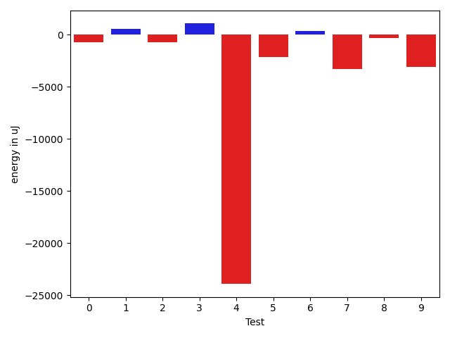

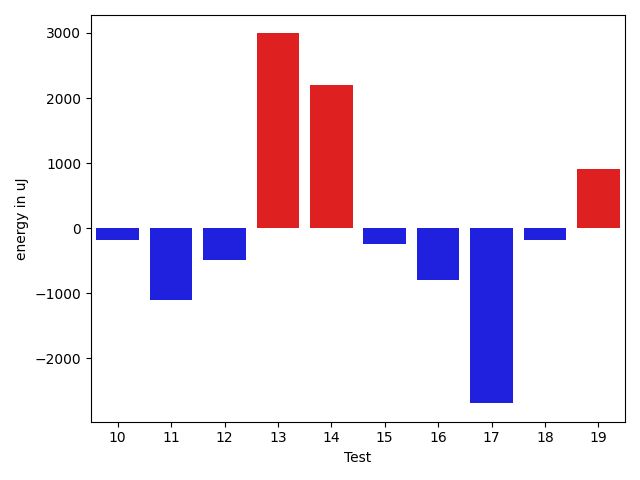

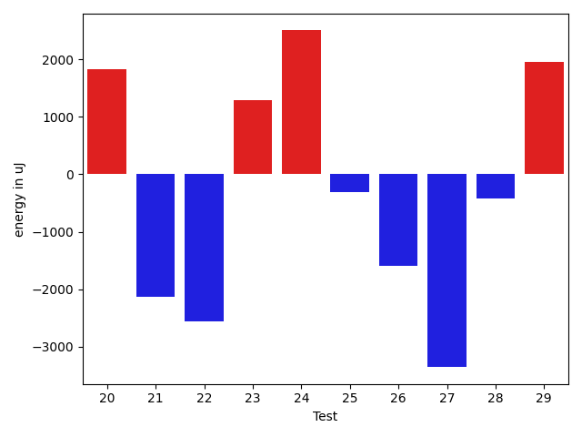

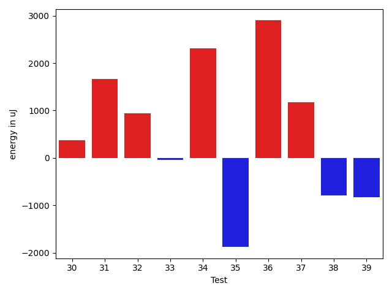

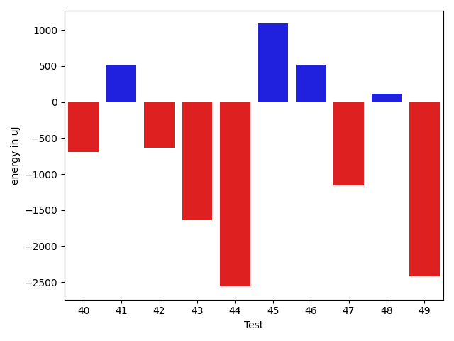

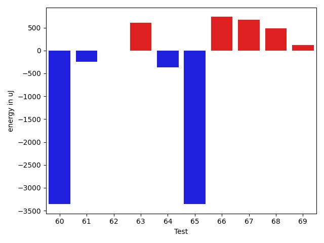

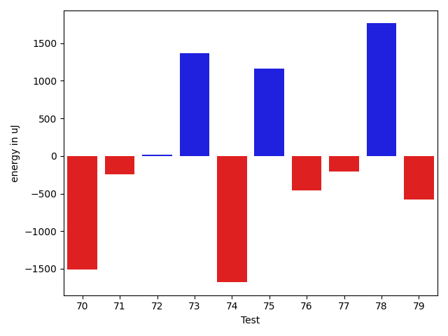

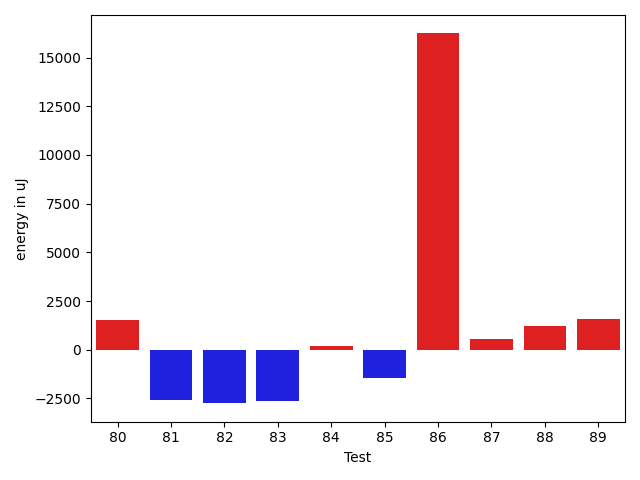

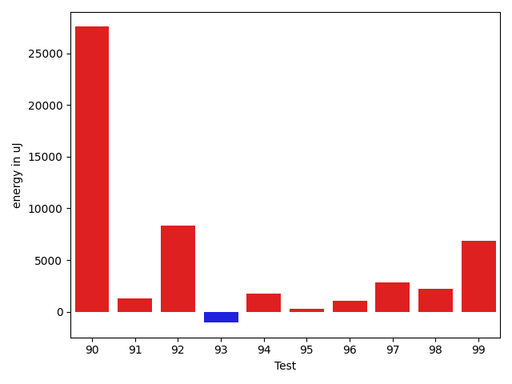

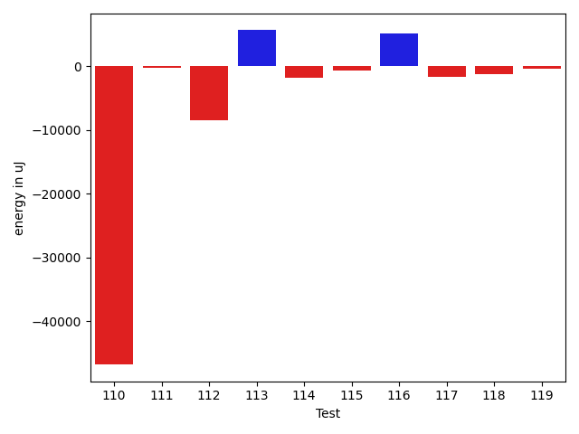

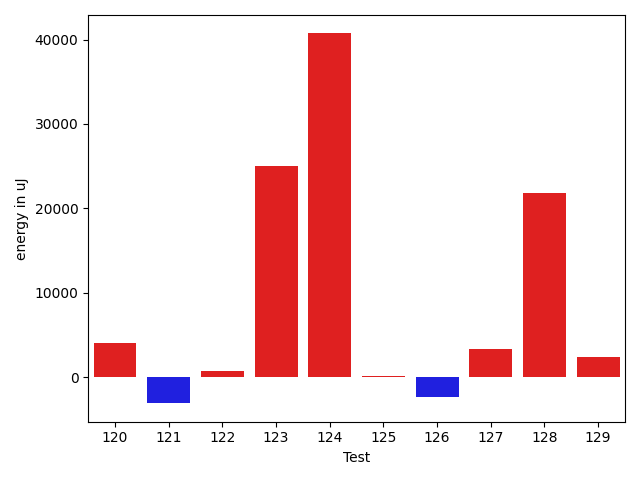

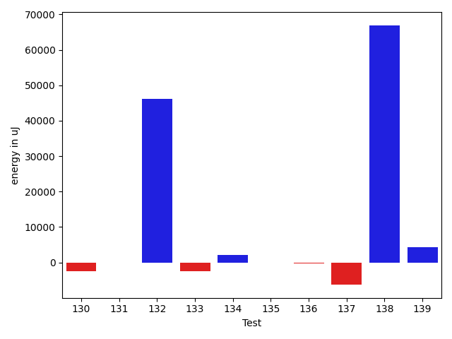

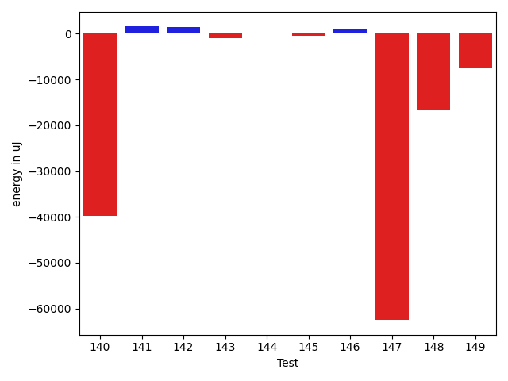

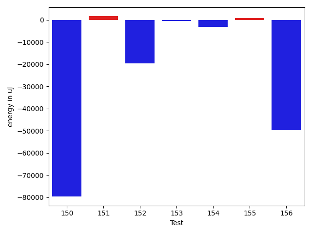

| ID | EnergyV1 | EnergyV2 | DeltaEnergy | σV1 | σV2 |
| --- | --- | --- | --- | --- | --- |
| 0 | 40589.03703703704 | 39897.68493150685 | -691.3521055301899 | 8741.742202045501 | 7878.571435205494 |
| 1 | 37946.87234042553 | 38538.7 | 591.8276595744683 | 3963.1066184004458 | 3794.848135301333 |
| 2 | 40989.206896551725 | 40256.24 | -732.9668965517267 | 8079.556397345307 | 9715.828091439247 |
| 3 | 38104.921875 | 39184.46808510638 | 1079.5462101063822 | 4042.7226295556666 | 7261.930084134228 |
| 4 | 104041.98387096774 | 80119.61904761905 | -23922.36482334869 | 229188.7238002983 | 173183.36741084472 |
| 5 | 83059.35353535354 | 80923.15151515152 | -2136.2020202020212 | 20178.235614428144 | 18357.792234485005 |
| 6 | 41511.614285714284 | 41895.49253731343 | 383.8782515991479 | 8970.903606808684 | 11490.887255629397 |
| 7 | 43725.22641509434 | 40454.51063829787 | -3270.7157767964673 | 15615.15117724958 | 8154.173065219206 |
| 8 | 38000.67441860465 | 37722.97368421053 | -277.70073439412226 | 3942.5476105481102 | 3891.6538865875127 |
| 9 | 46805.328125 | 43705.17333333333 | -3100.1547916666677 | 24592.706505851667 | 17678.667535289213 |
| 10 | 39732.67857142857 | 39012.25806451613 | -720.4205069124437 | 7267.316755533302 | 4953.277383372399 |
| 11 | 47419.912280701756 | 43965.892857142855 | -3454.0194235589006 | 23043.018860825843 | 19945.04043945205 |
| 12 | 38791.61403508772 | 38687.3125 | -104.30153508771764 | 3859.5458634512574 | 4115.1107475794315 |
| 13 | 37716.86956521739 | 38409.35 | 692.4804347826066 | 4632.24442082789 | 3349.566035697759 |
| 14 | 36928.52 | 37733.0 | 804.4800000000032 | 4263.239417344515 | 3632.0750207728006 |
| 15 | 38701.704545454544 | 39190.18518518518 | 488.48063973063836 | 3565.2301632926965 | 3838.3546150520847 |
| 16 | 48603.931506849316 | 46878.2183908046 | -1725.713116044717 | 19510.47542045798 | 15809.150893194728 |
| 17 | 63601.65306122449 | 64458.49494949495 | 856.8418882704573 | 24775.6901533239 | 25537.358984169412 |
| 18 | 41405.31428571429 | 38474.8375 | -2930.476785714287 | 12325.172351785772 | 4132.206100994207 |
| 19 | 39620.47142857143 | 40824.49180327869 | 1204.0203747072592 | 11003.690738918243 | 11482.889926739042 |
| 20 | 39267.08823529412 | 39307.32394366197 | 40.23570836785075 | 6459.444225171148 | 4229.144034111122 |
| 21 | 68489.26262626263 | 68369.22448979592 | -120.03813646671188 | 35885.400756664 | 35724.904396133374 |
| 22 | 39639.425 | 38812.95652173913 | -826.4684782608747 | 4663.954142610645 | 3168.294932723015 |
| 23 | 37321.08823529412 | 38793.51351351351 | 1472.4252782193944 | 4074.816627903403 | 3640.2865466483927 |
| 24 | 38311.62790697674 | 39284.822222222225 | 973.1943152454842 | 3945.076908633741 | 4175.651578104714 |
| 25 | 92846.15584415584 | 154695.5 | 61849.344155844155 | 246157.77140007383 | 420288.6471039576 |
| 26 | 39709.36666666667 | 39541.346153846156 | -168.02051282051252 | 4149.469480012542 | 5504.203994307147 |
| 27 | 56882.69696969697 | 49564.51724137931 | -7318.179728317657 | 20936.550020398718 | 21001.07953156414 |
| 28 | 72353.96666666666 | 65416.385714285716 | -6937.580952380944 | 45273.96097131575 | 44947.336021899115 |
| 29 | 39586.64705882353 | 41168.125 | 1581.4779411764684 | 4368.850622049862 | 3419.799736004288 |
| 30 | 39745.23809523809 | 40120.22222222222 | 374.9841269841272 | 4726.988469515205 | 3530.5364332028694 |
| 31 | 38742.666666666664 | 40401.89473684211 | 1659.2280701754426 | 3535.8826113531886 | 4094.4123014399547 |
| 32 | 39724.21052631579 | 40671.36363636364 | 947.1531100478533 | 3768.754667679014 | 5111.455045870051 |
| 33 | 39486.45 | 39441.82608695652 | -44.62391304347693 | 4267.873328427168 | 4240.595442727906 |
| 34 | 38818.24 | 41129.083333333336 | 2310.843333333338 | 4113.967003076228 | 3265.5573828725373 |
| 35 | 40518.0 | 38638.555555555555 | -1879.4444444444453 | 4790.719267500445 | 4490.213385454369 |
| 36 | 38196.90909090909 | 41096.181818181816 | 2899.272727272728 | 6069.928492233368 | 3892.675425326667 |
| 37 | 38822.56565656565 | 39995.47872340425 | 1172.9130668385988 | 9120.607731790926 | 11091.689830323445 |
| 38 | 39141.885714285716 | 38354.137931034486 | -787.7477832512304 | 8375.552970303952 | 5146.761772182167 |
| 39 | 36172.875 | 35337.71052631579 | -835.1644736842136 | 4039.8638184813854 | 3297.5945771353327 |
| 40 | 36020.096153846156 | 35330.11666666667 | -689.9794871794875 | 3859.410647812272 | 3753.4524955551105 |
| 41 | 120230.32323232324 | 120741.47474747474 | 511.151515151505 | 23991.314261551637 | 22213.650390777864 |
| 42 | 36214.06060606061 | 35576.62962962963 | -637.4309764309801 | 4560.336091677255 | 3313.4033879040344 |
| 43 | 37396.95714285714 | 35755.21666666667 | -1641.7404761904763 | 5561.451908156241 | 3612.3350208771544 |
| 44 | 41221.26804123711 | 38660.4367816092 | -2560.831259627914 | 13027.37770094985 | 9553.790993001545 |
| 45 | 40652.204545454544 | 41738.95121951219 | 1086.7466740576492 | 10121.348694219529 | 12712.187108078262 |
| 46 | 36144.98181818182 | 36664.77358490566 | 519.7917667238435 | 4094.0470508061903 | 4135.441856073256 |
| 47 | 37027.40909090909 | 35868.98 | -1158.429090909085 | 4038.2387943158283 | 4082.239084081186 |
| 48 | 38287.653846153844 | 38404.260869565216 | 116.60702341137221 | 3980.807503532106 | 5032.112411627091 |
| 49 | 38613.375 | 36190.82258064516 | -2422.552419354841 | 8557.262232334968 | 6418.557396266512 |
| 50 | 37041.5 | 35219.357142857145 | -1822.142857142855 | 4627.766370867627 | 4186.666729155833 |
| 51 | 35958.55882352941 | 35232.769230769234 | -725.7895927601785 | 4795.559239860392 | 4257.891042080896 |
| 52 | 39491.51515151515 | 37469.137931034486 | -2022.3772204806664 | 3603.0416790094896 | 5301.579925372526 |
| 53 | 38994.63043478261 | 37772.0 | -1222.630434782608 | 4441.834899730631 | 3939.0682872258726 |
| 54 | 39452.0 | 37985.818181818184 | -1466.1818181818162 | 3975.880651174146 | 6575.677061369955 |
| 55 | 39526.43103448276 | 38087.0 | -1439.4310344827609 | 5581.898157289078 | 4399.6732677262635 |
| 56 | 51549.28282828283 | 49636.27272727273 | -1913.0101010100989 | 24822.910892410135 | 20331.19554127944 |
| 57 | 60696.97435897436 | 64377.743589743586 | 3680.769230769227 | 50842.00464712032 | 62030.67501450203 |
| 58 | 37555.8 | 37958.75 | 402.9499999999971 | 4110.462446813821 | 4171.262141626521 |
| 59 | 39403.52272727273 | 38133.89473684211 | -1269.6279904306211 | 4326.0971308845 | 3868.0807207973153 |
| 60 | 179238.53846153847 | 181407.18181818182 | 2168.643356643355 | 323319.74772116734 | 305767.97046002 |
| 61 | 38881.444444444445 | 38177.4375 | -704.0069444444453 | 3873.4979056004872 | 4143.086070019997 |
| 62 | 38141.75 | 38515.48 | 373.7300000000032 | 4559.780753592581 | 4228.301778444864 |
| 63 | 38812.85294117647 | 39068.566666666666 | 255.71372549019725 | 3975.4156063334544 | 3646.757278124712 |
| 64 | 47564.125 | 47740.7037037037 | 176.57870370370074 | 20738.78822663887 | 18676.01405410816 |
| 65 | 39726.730769230766 | 37999.03846153846 | -1727.692307692305 | 4293.798341415856 | 4877.122484548644 |
| 66 | 38079.78 | 38220.767441860466 | 140.9874418604668 | 4105.2464057106245 | 4520.707229283208 |
| 67 | 104430.16279069768 | 141374.28235294117 | 36944.11956224349 | 283399.0671323891 | 379578.7676921883 |
| 68 | 106760.0505050505 | 93685.04040404041 | -13075.010101010092 | 135174.77275416022 | 24573.44822434839 |
| 69 | 71223.64864864865 | 71355.77027027027 | 132.12162162161258 | 48546.0977921967 | 56217.29615579929 |
| 70 | 40939.862068965514 | 39426.51724137931 | -1513.3448275862029 | 14217.001283611693 | 4644.406154242413 |
| 71 | 38736.0 | 38491.63157894737 | -244.3684210526335 | 4039.2768683326995 | 5414.915079704046 |
| 72 | 41009.4 | 41024.90476190476 | 15.504761904761835 | 10219.686470294046 | 9940.05342591162 |
| 73 | 37869.1724137931 | 39235.74193548387 | 1366.5695216907698 | 4551.825992590799 | 4223.389985031074 |
| 74 | 89805.89705882352 | 88126.35135135135 | -1679.545707472178 | 65176.745321097216 | 50848.186678564794 |
| 75 | 38081.46428571428 | 39244.07142857143 | 1162.607142857145 | 4014.5890866237824 | 4786.498513392382 |
| 76 | 38320.08108108108 | 37867.083333333336 | -452.99774774774414 | 5678.798513857788 | 4225.985692875556 |
| 77 | 38217.153846153844 | 38008.5 | -208.65384615384392 | 3503.057606108694 | 3830.5689546941544 |
| 78 | 37877.096774193546 | 39640.382352941175 | 1763.2855787476292 | 3782.3310303162016 | 3777.0323318922187 |
| 79 | 39074.6 | 38500.416666666664 | -574.1833333333343 | 4151.247853356867 | 4367.376910273361 |
| 80 | 38168.916666666664 | 39547.6 | 1378.6833333333343 | 4164.422831657868 | 4204.611925017575 |
| 81 | 39967.346153846156 | 38874.25 | -1093.096153846156 | 4099.690001810715 | 3785.6063977401445 |
| 82 | 144838.76923076922 | 114788.58333333333 | -30050.18589743589 | 362676.84753785 | 317085.4456498168 |
| 83 | 38916.88636363636 | 37977.8 | -939.0863636363574 | 3982.232734945133 | 7231.159076425537 |
| 84 | 39158.4 | 39272.0 | 113.59999999999854 | 3861.1465447454857 | 4860.943282944166 |
| 85 | 40273.71186440678 | 37738.97727272727 | -2534.7345916795093 | 7044.93803139037 | 3873.7514322132724 |
| 86 | 100594.30303030302 | 105025.83838383839 | 4431.535353535364 | 29596.488434365758 | 32355.108697427753 |
| 87 | 41837.578125 | 44679.57575757576 | 2841.99763257576 | 9594.341600333839 | 13787.889787408198 |
| 88 | 39364.72727272727 | 39834.35294117647 | 469.6256684491964 | 3766.793804017346 | 3961.8801677572 |
| 89 | 38443.491228070176 | 39022.65151515151 | 579.1602870813367 | 4265.659958494349 | 4476.418216076886 |
| 90 | 216731.54545454544 | 244301.52525252526 | 27569.979797979817 | 115809.3868462418 | 201978.73172204883 |
| 91 | 38322.375 | 39635.12765957447 | 1312.7526595744712 | 4272.013974818162 | 5911.5950420465915 |
| 92 | 51109.25 | 59466.18518518518 | 8356.935185185182 | 39485.75182312602 | 45522.360389265305 |
| 93 | 39792.625 | 38737.25454545455 | -1055.370454545453 | 7393.114971672969 | 3913.834047757829 |
| 94 | 39573.66233766234 | 41295.69696969697 | 1722.0346320346289 | 6819.09870193733 | 9744.31351807174 |
| 95 | 38195.42857142857 | 38463.41860465116 | 267.99003322258795 | 3727.5205087104673 | 4173.814362953634 |
| 96 | 39180.78787878788 | 40219.96551724138 | 1039.177638453497 | 3758.2173059365464 | 4667.393797493405 |
| 97 | 46940.5641025641 | 49769.71428571428 | 2829.150183150181 | 29160.58267751255 | 30828.120632742743 |
| 98 | 37004.53571428572 | 39238.41176470588 | 2233.8760504201637 | 4197.423354887264 | 3989.9705152798765 |
| 99 | 42956.746268656716 | 49851.649122807015 | 6894.902854150299 | 8905.448006100072 | 19424.990291032576 |
| 100 | 43816.56470588235 | 45527.698795180724 | 1711.1340892983717 | 12221.037251104015 | 13183.600660637261 |
| 101 | 39704.5625 | 39247.484375 | -457.078125 | 3350.0042655834163 | 7954.502133210844 |
| 102 | 58884.206349206346 | 63542.52542372881 | 4658.319074522464 | 30453.356114555907 | 37755.91345101507 |
| 103 | 39319.307692307695 | 37897.66197183099 | -1421.6457204767066 | 3468.8331696943274 | 4708.953569183165 |
| 104 | 39561.470588235294 | 39046.6129032258 | -514.8576850094905 | 4661.003764455913 | 4104.427587118334 |
| 105 | 195750.31313131313 | 169194.53535353535 | -26555.77777777778 | 352113.90590923786 | 242114.73417078968 |
| 106 | 40165.529411764706 | 38730.5625 | -1434.9669117647063 | 5863.35590884954 | 4654.696881494407 |
| 107 | 168700.68686868687 | 148606.0404040404 | -20094.646464646474 | 362823.35579949786 | 301373.5028375657 |
| 108 | 55353.12244897959 | 55373.4375 | 20.315051020406827 | 22621.566538559517 | 21730.205353480374 |
| 109 | 71934.375 | 77417.86046511628 | 5483.485465116275 | 42643.39128791676 | 40425.22848913949 |
| 110 | 153930.29268292684 | 107120.3829787234 | -46809.90970420344 | 298102.0730283786 | 236117.9352324789 |
| 111 | 38331.7027027027 | 38122.90909090909 | -208.7936117936115 | 6816.854195875875 | 4189.839776813893 |
| 112 | 46234.91428571429 | 37759.6875 | -8475.226785714287 | 48663.32007543343 | 3687.0984479457215 |
| 113 | 50242.769230769234 | 55872.14705882353 | 5629.377828054297 | 26147.841023256868 | 35047.75893660497 |
| 114 | 51076.17857142857 | 49188.73863636364 | -1887.4399350649328 | 27257.69450875106 | 25472.419852163057 |
| 115 | 38915.35294117647 | 38249.68421052631 | -665.6687306501553 | 3563.2863539348627 | 4970.176816219674 |
| 116 | 40262.72222222222 | 45362.90909090909 | 5100.186868686869 | 4277.858093401878 | 9064.93018029117 |
| 117 | 44338.9756097561 | 42596.51219512195 | -1742.4634146341486 | 16958.89361538487 | 11565.561588596009 |
| 118 | 49299.65753424657 | 48000.77027027027 | -1298.8872639762994 | 18760.856678762662 | 18588.314645662293 |
| 119 | 43986.204545454544 | 43593.579545454544 | -392.625 | 12399.579279115493 | 13167.819574907186 |
| 120 | 56710.05376344086 | 60816.8085106383 | 4106.754747197439 | 49495.70008745858 | 59587.78046861703 |
| 121 | 44908.69047619047 | 41822.96551724138 | -3085.7249589490966 | 13926.45399690835 | 9854.808967221035 |
| 122 | 38489.643835616436 | 39272.78947368421 | 783.1456380677773 | 6307.176934797816 | 5949.190810335802 |
| 123 | 165838.16666666666 | 190815.77192982455 | 24977.605263157893 | 410224.4928107928 | 460614.4365641767 |
| 124 | 142137.0 | 182853.27777777778 | 40716.27777777778 | 355473.72693681484 | 440314.76018819713 |
| 125 | 39110.26153846154 | 39253.40740740741 | 143.14586894586682 | 3986.01884389742 | 4849.108908283002 |
| 126 | 47592.793650793654 | 45290.36 | -2302.433650793653 | 20592.27552213796 | 17242.16066633568 |
| 127 | 41205.97590361446 | 44531.72222222222 | 3325.7463186077584 | 8348.785439372145 | 13134.147694953013 |
| 128 | 134687.59595959596 | 156507.94949494948 | 21820.353535353526 | 244650.81456250942 | 325277.3419284345 |
| 129 | 46459.07246376811 | 48892.357142857145 | 2433.2846790890326 | 21488.976887939574 | 19903.77293238338 |
| 130 | 44734.08641975309 | 42271.80952380953 | -2462.2768959435634 | 13698.19889142638 | 11135.83471166951 |
| 131 | 41806.59210526316 | 41656.4625 | -150.12960526315874 | 10512.358401546688 | 9364.399393372421 |
| 132 | 62179.987341772154 | 108285.2027027027 | 46105.21536093055 | 162203.8737091083 | 295671.32376234565 |
| 133 | 78262.28282828283 | 75747.47474747474 | -2514.808080808085 | 33448.687480112436 | 28891.198782287403 |
| 134 | 37467.6129032258 | 39558.08 | 2090.4670967741986 | 3823.454127233556 | 4217.719620079078 |
| 135 | 48041.55714285714 | 47997.933333333334 | -43.62380952380772 | 20744.837599912287 | 15952.93491896989 |
| 136 | 39829.98484848485 | 39554.34 | -275.64484848485154 | 7111.9004183394245 | 6598.276613207419 |
| 137 | 63739.13483146067 | 57407.20224719101 | -6331.9325842696635 | 46367.976873620515 | 40727.19113622661 |
| 138 | 126508.98181818181 | 193484.51923076922 | 66975.53741258741 | 353950.62220297393 | 457493.01742273325 |
| 139 | 46647.85964912281 | 50990.80434782609 | 4342.944698703279 | 20125.926289188417 | 27059.175147796206 |
| 140 | 78373.35714285714 | 38594.42424242424 | -39778.932900432905 | 258583.56916734844 | 5383.80775485441 |
| 141 | 37907.64 | 39460.37037037037 | 1552.7303703703728 | 3338.826403154258 | 4376.629805617375 |
| 142 | 38100.67567567567 | 39501.634146341465 | 1400.9584706657915 | 4140.00612386317 | 4583.473923522913 |
| 143 | 38532.31578947369 | 37488.88888888889 | -1043.4269005847964 | 4190.318001406168 | 3766.107179031236 |
| 144 | 38232.26666666667 | 38294.25 | 61.98333333332994 | 4666.147161083638 | 4952.807522422679 |
| 145 | 39645.3 | 39123.416666666664 | -521.8833333333387 | 4407.118311323172 | 3350.9375294667743 |
| 146 | 43047.416666666664 | 44144.36842105263 | 1096.9517543859693 | 12127.923940974215 | 10675.22446065274 |
| 147 | 101278.5294117647 | 38750.78947368421 | -62527.739938080485 | 248351.37704757266 | 3952.718938694004 |
| 148 | 203203.04761904763 | 186713.29411764705 | -16489.753501400584 | 398673.446024554 | 400616.81339283695 |
| 149 | 48063.102040816324 | 40580.58974358974 | -7482.512297226582 | 19056.2520494787 | 10153.898310925353 |
| 150 | 215979.40404040404 | 136336.77777777778 | -79642.62626262626 | 382651.1660545245 | 177278.5178741852 |
| 151 | 38326.8813559322 | 39913.93023255814 | 1587.0488766259368 | 4294.1938810000765 | 4121.85671865071 |
| 152 | 372963.29292929295 | 353397.55555555556 | -19565.737373737385 | 172023.65286170354 | 159220.02640493543 |
| 153 | 42220.958333333336 | 41629.333333333336 | -591.625 | 8222.30349658358 | 5852.590736873145 |
| 154 | 51163.651162790695 | 48131.166666666664 | -3032.4844961240306 | 23287.63243369074 | 18348.935460774035 |
| 155 | 45901.36842105263 | 46826.15 | 924.781578947368 | 7660.257981161609 | 11274.22557551072 |
| 156 | 159889.47368421053 | 110247.6 | -49641.87368421053 | 350884.6742615267 | 307207.9961054725 |

## Delta Duration per test method

| ID | DurationV1 | DurationsV2 | DeltaDuration |
| --- | --- | --- | --- |
| 0 | 1164226.4074074074 | 1126913.3287671234 | -37313.07864028402 |
| 1 | 814914.0 | 745685.4 | -69228.59999999998 |
| 2 | 937582.7413793104 | 957338.6 | 19755.8586206896 |
| 3 | 922477.625 | 914817.6170212766 | -7660.007978723384 |
| 4 | 2805508.0322580645 | 2218946.904761905 | -586561.1274961596 |
| 5 | 2423187.4343434344 | 2349405.9191919193 | -73781.51515151514 |
| 6 | 1255523.7571428572 | 1174819.0298507463 | -80704.72729211091 |
| 7 | 957356.0 | 830753.5531914893 | -126602.4468085107 |
| 8 | 671866.1860465116 | 656803.947368421 | -15062.238678090624 |
| 9 | 1176549.1875 | 1046411.7466666667 | -130137.4408333333 |
| 10 | 949301.875 | 877017.6290322581 | -72284.24596774194 |
| 11 | 1158292.1228070175 | 1005259.3214285715 | -153032.80137844605 |
| 12 | 835678.2280701754 | 801967.75 | -33710.47807017539 |
| 13 | 521449.47826086957 | 499887.55 | -21561.92826086958 |
| 14 | 690704.52 | 593069.7391304348 | -97634.7808695652 |
| 15 | 774556.5909090909 | 738709.9814814815 | -35846.60942760948 |
| 16 | 1361799.589041096 | 1307210.7471264368 | -54588.84191465913 |
| 17 | 1901504.969387755 | 1922524.9090909092 | 21019.939703154145 |
| 18 | 1069961.7142857143 | 989750.8375 | -80210.8767857143 |
| 19 | 902838.3428571429 | 968777.4918032787 | 65939.14894613577 |
| 20 | 952898.3676470588 | 979448.1690140845 | 26549.801367025706 |
| 21 | 2009965.7373737374 | 1993776.3673469387 | -16189.370026798686 |
| 22 | 719566.4 | 823223.3695652174 | 103656.96956521738 |
| 23 | 697737.2647058824 | 664924.5945945946 | -32812.67011128785 |
| 24 | 774148.5348837209 | 754694.4888888889 | -19454.045994832064 |
| 25 | 2708411.4025974027 | 4581052.9625 | 1872641.5599025977 |
| 26 | 566304.6 | 611099.4615384615 | 44794.861538461526 |
| 27 | 1471395.0909090908 | 1142427.5862068965 | -328967.50470219436 |
| 28 | 1812050.2666666666 | 1594905.0857142857 | -217145.18095238088 |
| 29 | 443815.4705882353 | 478296.125 | 34480.6544117647 |
| 30 | 514203.1904761905 | 431236.3888888889 | -82966.8015873016 |
| 31 | 437108.71428571426 | 468830.94736842107 | 31722.233082706807 |
| 32 | 474112.7894736842 | 450323.3181818182 | -23789.471291866037 |
| 33 | 474994.85 | 471012.1304347826 | -3982.719565217383 |
| 34 | 570256.4 | 539244.0 | -31012.400000000023 |
| 35 | 486468.85 | 429472.0 | -56996.84999999998 |
| 36 | 508764.63636363635 | 448121.04545454547 | -60643.59090909088 |
| 37 | 1310787.808080808 | 1275727.8936170214 | -35059.91446378664 |
| 38 | 981067.0571428571 | 974832.2413793104 | -6234.815763546736 |
| 39 | 530883.625 | 502347.5263157895 | -28536.098684210505 |
| 40 | 844973.0192307692 | 773605.15 | -71367.86923076923 |
| 41 | 3671883.0808080807 | 3600377.898989899 | -71505.18181818165 |
| 42 | 553532.1212121212 | 532887.1851851852 | -20644.936026936048 |
| 43 | 918379.5142857142 | 917090.4 | -1289.1142857142258 |
| 44 | 1345904.4020618557 | 1282884.9770114943 | -63019.425050361315 |
| 45 | 1247461.0227272727 | 1059108.6829268292 | -188352.3398004435 |
| 46 | 864229.7454545455 | 792980.9056603773 | -71248.83979416813 |
| 47 | 800927.6136363636 | 772839.68 | -28087.933636363596 |
| 48 | 533707.8461538461 | 515271.4347826087 | -18436.411371237424 |
| 49 | 940393.8214285715 | 870574.2741935484 | -69819.54723502311 |
| 50 | 520930.27777777775 | 460296.96428571426 | -60633.31349206349 |
| 51 | 577641.0588235294 | 557833.9743589744 | -19807.084464555024 |
| 52 | 716912.9393939395 | 728940.448275862 | 12027.508881922578 |
| 53 | 603633.0652173914 | 641579.9142857143 | 37946.84906832292 |
| 54 | 643511.2619047619 | 757632.4545454546 | 114121.1926406927 |
| 55 | 856822.6724137932 | 881477.4117647059 | 24654.739350912743 |
| 56 | 1581605.121212121 | 1593718.4343434344 | 12113.313131313305 |
| 57 | 1462336.8717948718 | 1579147.641025641 | 116810.76923076925 |
| 58 | 801552.0 | 851441.3541666666 | 49889.35416666663 |
| 59 | 667585.6590909091 | 682206.6052631579 | 14620.946172248805 |
| 60 | 4327370.153846154 | 4936911.090909091 | 609540.9370629368 |
| 61 | 543189.1111111111 | 565494.3125 | 22305.201388888876 |
| 62 | 487378.0833333333 | 496561.44 | 9183.356666666688 |
| 63 | 628002.3529411765 | 617046.8666666667 | -10955.486274509807 |
| 64 | 900038.375 | 978175.2962962963 | 78136.92129629629 |
| 65 | 557288.0769230769 | 593952.9230769231 | 36664.84615384624 |
| 66 | 767882.86 | 766040.0465116279 | -1842.813488372136 |
| 67 | 3057822.2674418604 | 4216239.05882353 | 1158416.7913816692 |
| 68 | 2964270.3131313133 | 2532126.111111111 | -432144.2020202023 |
| 69 | 1934736.3783783785 | 1824507.4054054054 | -110228.97297297302 |
| 70 | 663210.5172413794 | 565150.6206896552 | -98059.89655172417 |
| 71 | 878437.5396825396 | 924825.0 | 46387.460317460354 |
| 72 | 1199971.4888888889 | 1193594.607142857 | -6376.88174603181 |
| 73 | 592699.6551724138 | 559638.7741935484 | -33060.88097886543 |
| 74 | 2461429.3235294116 | 2272134.8513513515 | -189294.4721780601 |
| 75 | 581300.8571428572 | 587880.5476190476 | 6579.690476190415 |
| 76 | 645594.7027027027 | 612507.75 | -33086.95270270272 |
| 77 | 575158.2307692308 | 585745.1 | 10586.869230769225 |
| 78 | 551195.1935483871 | 503066.26470588235 | -48128.9288425048 |
| 79 | 536728.95 | 536055.0 | -673.9499999999534 |
| 80 | 628958.3055555555 | 619202.55 | -9755.755555555457 |
| 81 | 749866.4230769231 | 745515.8333333334 | -4350.58974358975 |
| 82 | 4155605.553846154 | 3122066.1333333333 | -1033539.4205128206 |
| 83 | 827771.3863636364 | 811328.3428571429 | -16443.043506493443 |
| 84 | 658423.4285714285 | 627615.8333333334 | -30807.59523809515 |
| 85 | 989663.779661017 | 881936.4545454546 | -107727.32511556242 |
| 86 | 2850768.727272727 | 2914080.3333333335 | 63311.60606060643 |
| 87 | 1030085.5625 | 1165972.4090909092 | 135886.84659090918 |
| 88 | 493552.9090909091 | 568019.4705882353 | 74466.56149732618 |
| 89 | 943050.8245614035 | 908784.3939393939 | -34266.43062200956 |
| 90 | 5824944.444444444 | 6604659.707070707 | 779715.2626262633 |
| 91 | 875379.9166666666 | 843379.1702127659 | -32000.746453900705 |
| 92 | 1189670.65 | 1556097.111111111 | 366426.4611111111 |
| 93 | 983291.9464285715 | 925690.0181818182 | -57601.92824675329 |
| 94 | 1031944.8311688312 | 1059090.6666666667 | 27145.835497835535 |
| 95 | 709017.0612244898 | 795955.1162790698 | 86938.05505457998 |
| 96 | 623766.8181818182 | 621109.1034482758 | -2657.714733542409 |
| 97 | 960495.1282051282 | 1098607.7428571428 | 138112.61465201457 |
| 98 | 501944.96428571426 | 470040.82352941175 | -31904.140756302513 |
| 99 | 1013396.0746268657 | 1309762.2280701755 | 296366.1534433098 |
| 100 | 1241021.1647058823 | 1362361.7108433736 | 121340.54613749124 |
| 101 | 846659.5 | 879245.359375 | 32585.859375 |
| 102 | 1336710.9523809524 | 1889313.6949152541 | 552602.7425343017 |
| 103 | 923303.6153846154 | 945198.2253521127 | 21894.609967497294 |
| 104 | 871556.431372549 | 848431.6451612903 | -23124.78621125873 |
| 105 | 5573324.101010101 | 4823936.818181818 | -749387.2828282826 |
| 106 | 963284.4705882353 | 979070.640625 | 15786.170036764699 |
| 107 | 4799688.131313131 | 4146161.0 | -653527.1313131312 |
| 108 | 1650571.551020408 | 1652775.6145833333 | 2204.0635629252065 |
| 109 | 1822425.5 | 2001645.465116279 | 179219.96511627897 |
| 110 | 4207432.731707317 | 2837458.8936170214 | -1369973.8380902954 |
| 111 | 765632.4054054054 | 723399.6363636364 | -42232.76904176909 |
| 112 | 985980.6 | 768812.09375 | -217168.50624999998 |
| 113 | 1112413.0512820513 | 1221984.0294117648 | 109570.97812971356 |
| 114 | 1437729.2857142857 | 1433532.6931818181 | -4196.592532467563 |
| 115 | 468620.5882352941 | 492359.4736842105 | 23738.885448916408 |
| 116 | 559232.7777777778 | 897553.5 | 338320.72222222225 |
| 117 | 1126103.3658536586 | 1129987.6829268292 | 3884.3170731705613 |
| 118 | 1297835.1643835616 | 1333797.3648648649 | 35962.20048130327 |
| 119 | 1393228.3863636365 | 1364662.4545454546 | -28565.93181818188 |
| 120 | 1731795.5161290322 | 1829902.5957446808 | 98107.0796156486 |
| 121 | 1278827.9166666667 | 1246895.0689655172 | -31932.847701149527 |
| 122 | 1096635.1095890412 | 1102388.7236842106 | 5753.614095169352 |
| 123 | 4796954.883333334 | 5065145.736842105 | 268190.8535087714 |
| 124 | 3953743.111111111 | 5176922.902777778 | 1223179.791666667 |
| 125 | 894694.8307692307 | 964682.8148148148 | 69987.9840455841 |
| 126 | 1246659.365079365 | 1199604.7866666666 | -47054.57841269835 |
| 127 | 1162463.0120481928 | 1225750.5277777778 | 63287.515729584964 |
| 128 | 3844315.777777778 | 4468811.01010101 | 624495.2323232321 |
| 129 | 1138592.8550724639 | 1207987.142857143 | 69394.2877846791 |
| 130 | 1213410.7283950618 | 1184974.5476190476 | -28436.180776014226 |
| 131 | 1143590.144736842 | 1134152.1625 | -9437.982236841926 |
| 132 | 1682534.3797468354 | 3016223.2702702703 | 1333688.8905234348 |
| 133 | 2280384.878787879 | 2214348.1616161615 | -66036.71717171744 |
| 134 | 584050.4838709678 | 537444.68 | -46605.803870967706 |
| 135 | 1269260.4428571428 | 1295521.15 | 26260.707142857136 |
| 136 | 872276.5 | 915052.24 | 42775.73999999999 |
| 137 | 1860054.1123595505 | 1756610.7865168538 | -103443.32584269671 |
| 138 | 3336879.0727272728 | 5190071.0 | 1853191.9272727272 |
| 139 | 1111116.7719298245 | 1249353.0 | 138236.2280701755 |
| 140 | 1826507.5952380951 | 707745.7575757576 | -1118761.8376623376 |
| 141 | 520280.2 | 489071.8888888889 | -31208.311111111136 |
| 142 | 716398.2162162162 | 677798.9756097561 | -38599.24060646014 |
| 143 | 452540.3157894737 | 471639.037037037 | 19098.721247563313 |
| 144 | 483699.5 | 535107.3333333334 | 51407.83333333337 |
| 145 | 476298.85 | 441965.0 | -34333.84999999998 |
| 146 | 1028894.875 | 1108348.6842105263 | 79453.80921052629 |
| 147 | 2511435.8235294116 | 510743.7894736842 | -2000692.0340557273 |
| 148 | 5334191.0 | 4805008.647058823 | -529182.3529411769 |
| 149 | 1274110.693877551 | 844153.4358974359 | -429957.25798011513 |
| 150 | 5921471.96969697 | 3749551.707070707 | -2171920.262626263 |
| 151 | 991634.4576271187 | 837219.0 | -154415.45762711868 |
| 152 | 9408314.93939394 | 8860894.8989899 | -547420.0404040404 |
| 153 | 819705.5 | 845221.0555555555 | 25515.555555555504 |
| 154 | 1538324.1744186047 | 1385843.7261904762 | -152480.4482281285 |
| 155 | 800585.0 | 1009231.75 | 208646.75 |
| 156 | 4156981.210526316 | 2692549.0 | -1464432.210526316 |

## Misc.

| ID | Test Class | Test Method |
| --- | --- | --- |
| 0 | com.google.gson.functional.CustomTypeAdaptersTest | testCustomAdapterInvokedForCollectionElementDeserialization |
| 1 | com.google.gson.functional.CustomTypeAdaptersTest | testCustomTypeAdapterAppliesToSubClassesSerializedAsBaseClass |
| 2 | com.google.gson.functional.CustomTypeAdaptersTest | testCustomAdapterInvokedForMapElementDeserialization |
| 3 | com.google.gson.functional.CustomTypeAdaptersTest | testCustomAdapterInvokedForMapElementSerializationWithType |
| 4 | com.google.gson.functional.CustomTypeAdaptersTest | testCustomSerializers |
| 5 | com.google.gson.functional.CustomTypeAdaptersTest | testCustomTypeAdapterDoesNotAppliesToSubClasses |
| 6 | com.google.gson.functional.CustomTypeAdaptersTest | testCustomAdapterInvokedForCollectionElementSerializationWithType |
| 7 | com.google.gson.functional.CustomTypeAdaptersTest | testEnsureCustomSerializerNotInvokedForNullValues |
| 8 | com.google.gson.functional.CustomTypeAdaptersTest | testEnsureCustomDeserializerNotInvokedForNullValues |
| 9 | com.google.gson.functional.CustomTypeAdaptersTest | testCustomNestedSerializers |
| 10 | com.google.gson.functional.CustomTypeAdaptersTest | testCustomNestedDeserializers |
| 11 | com.google.gson.functional.CustomTypeAdaptersTest | testCustomDeserializers |
| 12 | com.google.gson.functional.CustomTypeAdaptersTest | testCustomByteArrayDeserializerAndInstanceCreator |
| 13 | com.google.gson.functional.CustomTypeAdaptersTest | testCustomAdapterInvokedForMapElementSerialization |
| 14 | com.google.gson.functional.CustomTypeAdaptersTest | testCustomAdapterInvokedForCollectionElementSerialization |
| 15 | com.google.gson.functional.CustomTypeAdaptersTest | testCustomByteArraySerializer |
| 16 | com.google.gson.functional.MapTest | testSerializeMaps |
| 17 | com.google.gson.functional.MapTest | testInterfaceTypeMapWithSerializer |
| 18 | com.google.gson.functional.MapTest | testMapSubclassDeserialization |
| 19 | com.google.gson.functional.MapTest | testCustomSerializerForSpecificMapType |
| 20 | com.google.gson.functional.MapTest | testGeneralMapField |
| 21 | com.google.gson.functional.MapTest | testInterfaceTypeMap |
| 22 | com.google.gson.functional.MapTest | testMapSerializationWithNullValueButSerializeNulls |
| 23 | com.google.gson.functional.MapTest | testMapSerializationWithNullValuesSerialized |
| 24 | com.google.gson.functional.FieldExclusionTest | testDefaultNestedStaticClassIncluded |
| 25 | com.google.gson.functional.FieldExclusionTest | testDefaultInnerClassExclusion |
| 26 | com.google.gson.functional.FieldExclusionTest | testInnerClassExclusion |
| 27 | com.google.gson.functional.PrimitiveTest | testMoreSpecificSerialization |
| 28 | com.google.gson.functional.PrimitiveTest | testHtmlCharacterSerialization |
| 29 | com.google.gson.functional.PrimitiveTest | testNegativeInfinitySerialization |
| 30 | com.google.gson.functional.PrimitiveTest | testFloatNaNSerialization |
| 31 | com.google.gson.functional.PrimitiveTest | testNegativeInfinityFloatSerialization |
| 32 | com.google.gson.functional.PrimitiveTest | testDoubleInfinitySerialization |
| 33 | com.google.gson.functional.PrimitiveTest | testLongAsStringDeserialization |
| 34 | com.google.gson.functional.PrimitiveTest | testLongAsStringSerialization |
| 35 | com.google.gson.functional.PrimitiveTest | testDoubleNaNSerialization |
| 36 | com.google.gson.functional.PrimitiveTest | testFloatInfinitySerialization |
| 37 | com.google.gson.functional.DefaultTypeAdaptersTest | testDateSerializationWithPattern |
| 38 | com.google.gson.functional.DefaultTypeAdaptersTest | testBitSetDeserialization |
| 39 | com.google.gson.functional.DefaultTypeAdaptersTest | testDefaultGregorianCalendarDeserialization |
| 40 | com.google.gson.functional.DefaultTypeAdaptersTest | testTimestampSerialization |
| 41 | com.google.gson.functional.DefaultTypeAdaptersTest | testDefaultDateDeserializationUsingBuilder |
| 42 | com.google.gson.functional.DefaultTypeAdaptersTest | testDefaultCalendarSerialization |
| 43 | com.google.gson.functional.DefaultTypeAdaptersTest | testDateDeserializationWithPattern |
| 44 | com.google.gson.functional.DefaultTypeAdaptersTest | testDateSerializationInCollection |
| 45 | com.google.gson.functional.DefaultTypeAdaptersTest | testSetSerialization |
| 46 | com.google.gson.functional.DefaultTypeAdaptersTest | testDefaultDateSerializationUsingBuilder |
| 47 | com.google.gson.functional.DefaultTypeAdaptersTest | testSqlDateSerialization |
| 48 | com.google.gson.functional.DefaultTypeAdaptersTest | testBitSetSerialization |
| 49 | com.google.gson.functional.DefaultTypeAdaptersTest | testDateSerializationWithPatternNotOverridenByTypeAdapter |
| 50 | com.google.gson.functional.DefaultTypeAdaptersTest | testDefaultGregorianCalendarSerialization |
| 51 | com.google.gson.functional.DefaultTypeAdaptersTest | testDefaultCalendarDeserialization |
| 52 | com.google.gson.functional.NullObjectAndFieldTest | testExplicitDeserializationOfNulls |
| 53 | com.google.gson.functional.NullObjectAndFieldTest | testExplicitSerializationOfNullStringMembers |
| 54 | com.google.gson.functional.NullObjectAndFieldTest | testCustomSerializationOfNulls |
| 55 | com.google.gson.functional.NullObjectAndFieldTest | testPrintPrintingObjectWithNulls |
| 56 | com.google.gson.functional.NullObjectAndFieldTest | testExplicitSerializationOfNullArrayMembers |
| 57 | com.google.gson.functional.NullObjectAndFieldTest | testExplicitSerializationOfNulls |
| 58 | com.google.gson.functional.NullObjectAndFieldTest | testCustomTypeAdapterPassesNullDesrialization |
| 59 | com.google.gson.functional.NullObjectAndFieldTest | testExplicitSerializationOfNullCollectionMembers |
| 60 | com.google.gson.functional.NullObjectAndFieldTest | testTopLevelNullObjectSerialization |
| 61 | com.google.gson.functional.NullObjectAndFieldTest | testNullWrappedPrimitiveMemberDeserialization |
| 62 | com.google.gson.functional.NullObjectAndFieldTest | testCustomTypeAdapterPassesNullSerialization |
| 63 | com.google.gson.functional.NullObjectAndFieldTest | testExplicitNullSetsFieldToNullDuringDeserialization |
| 64 | com.google.gson.functional.NullObjectAndFieldTest | testTopLevelNullObjectDeserialization |
| 65 | com.google.gson.functional.NullObjectAndFieldTest | testPrintPrintingArraysWithNulls |
| 66 | com.google.gson.functional.NullObjectAndFieldTest | testNullWrappedPrimitiveMemberSerialization |
| 67 | com.google.gson.JsonParserTest | testReadWriteTwoObjects |
| 68 | com.google.gson.functional.NamingPolicyTest | testGsonWithNonDefaultFieldNamingPolicySerialization |
| 69 | com.google.gson.functional.NamingPolicyTest | testGsonWithSerializedNameFieldNamingPolicySerialization |
| 70 | com.google.gson.functional.NamingPolicyTest | testGsonWithNonDefaultFieldNamingPolicyDeserialiation |
| 71 | com.google.gson.functional.NamingPolicyTest | testComplexFieldNameStrategy |
| 72 | com.google.gson.functional.NamingPolicyTest | testDeprecatedNamingStrategy |
| 73 | com.google.gson.functional.NamingPolicyTest | testGsonWithLowerCaseUnderscorePolicyDeserialiation |
| 74 | com.google.gson.functional.NamingPolicyTest | testGsonDuplicateNameUsingSerializedNameFieldNamingPolicySerialization |
| 75 | com.google.gson.functional.NamingPolicyTest | testGsonWithLowerCaseDashPolicyDeserialiation |
| 76 | com.google.gson.functional.NamingPolicyTest | testGsonWithSerializedNameFieldNamingPolicyDeserialization |
| 77 | com.google.gson.functional.NamingPolicyTest | testGsonWithUpperCamelCaseSpacesPolicyDeserialiation |
| 78 | com.google.gson.functional.NamingPolicyTest | testGsonWithLowerCaseUnderscorePolicySerialization |
| 79 | com.google.gson.functional.NamingPolicyTest | testGsonWithUpperCamelCaseSpacesPolicySerialiation |
| 80 | com.google.gson.functional.NamingPolicyTest | testGsonWithLowerCaseDashPolicySerialization |
| 81 | com.google.gson.functional.CustomSerializerTest | testSerializerReturnsNull |
| 82 | com.google.gson.functional.CustomSerializerTest | testSubClassSerializerInvokedForBaseClassFieldsHoldingSubClassInstances |
| 83 | com.google.gson.functional.CustomSerializerTest | testBaseClassSerializerInvokedForBaseClassFieldsHoldingSubClassInstances |
| 84 | com.google.gson.functional.CustomSerializerTest | testBaseClassSerializerInvokedForBaseClassFields |
| 85 | com.google.gson.functional.CustomSerializerTest | testSubClassSerializerInvokedForBaseClassFieldsHoldingArrayOfSubClassInstances |
| 86 | com.google.gson.functional.ObjectTest | testSingletonLists |
| 87 | com.google.gson.functional.ObjectTest | testInnerClassDeserialization |
| 88 | com.google.gson.functional.ObjectTest | testJsonObjectSerialization |
| 89 | com.google.gson.functional.VersioningTest | testVersionedGsonMixingSinceAndUntilDeserialization |
| 90 | com.google.gson.functional.VersioningTest | testVersionedUntilSerialization |
| 91 | com.google.gson.functional.VersioningTest | testVersionedClassesDeserialization |
| 92 | com.google.gson.functional.VersioningTest | testVersionedGsonWithUnversionedClassesSerialization |
| 93 | com.google.gson.functional.VersioningTest | testVersionedClassesSerialization |
| 94 | com.google.gson.functional.VersioningTest | testVersionedGsonMixingSinceAndUntilSerialization |
| 95 | com.google.gson.functional.VersioningTest | testVersionedGsonWithUnversionedClassesDeserialization |
| 96 | com.google.gson.functional.VersioningTest | testIgnoreLaterVersionClassSerialization |
| 97 | com.google.gson.functional.VersioningTest | testVersionedUntilDeserialization |
| 98 | com.google.gson.functional.VersioningTest | testIgnoreLaterVersionClassDeserialization |
| 99 | com.google.gson.functional.CustomDeserializerTest | testCustomDeserializerReturnsNull |
| 100 | com.google.gson.functional.CustomDeserializerTest | testJsonTypeFieldBasedDeserialization |
| 101 | com.google.gson.functional.CustomDeserializerTest | testCustomDeserializerReturnsNullForArrayElements |
| 102 | com.google.gson.functional.CustomDeserializerTest | testCustomDeserializerReturnsNullForTopLevelObject |
| 103 | com.google.gson.functional.CustomDeserializerTest | testCustomDeserializerReturnsNullForArrayElementsForArrayField |
| 104 | com.google.gson.functional.TypeHierarchyAdapterTest | testRegisterSuperTypeFirst |
| 105 | com.google.gson.functional.TypeHierarchyAdapterTest | testTypeHierarchy |
| 106 | com.google.gson.functional.TypeVariableTest | testBasicTypeVariables |
| 107 | com.google.gson.functional.TypeVariableTest | testAdvancedTypeVariables |
| 108 | com.google.gson.functional.TypeVariableTest | testTypeVariablesViaTypeParameter |
| 109 | com.google.gson.functional.SecurityTest | testJsonWithNonExectuableTokenSerialization |
| 110 | com.google.gson.functional.SecurityTest | testNonExecutableJsonSerialization |
| 111 | com.google.gson.functional.SecurityTest | testJsonWithNonExectuableTokenWithConfiguredGsonDeserialization |
| 112 | com.google.gson.functional.SecurityTest | testJsonWithNonExectuableTokenWithRegularGsonDeserialization |
| 113 | com.google.gson.functional.SecurityTest | testNonExecutableJsonDeserialization |
| 114 | com.google.gson.functional.EnumTest | testEnumSubclassWithRegisteredTypeAdapter |
| 115 | com.google.gson.functional.ReadersWritersTest | testTopLevelNullObjectDeserializationWithReaderAndSerializeNulls |
| 116 | com.google.gson.functional.ReadersWritersTest | testTopLevelNullObjectSerializationWithWriterAndSerializeNulls |
| 117 | com.google.gson.functional.ReadersWritersTest | testReadWriteTwoStrings |
| 118 | com.google.gson.functional.ReadersWritersTest | testReadWriteTwoObjects |
| 119 | com.google.gson.functional.ParameterizedTypesTest | testParameterizedTypeWithCustomSerializer |
| 120 | com.google.gson.functional.ParameterizedTypesTest | testParameterizedTypeDeserialization |
| 121 | com.google.gson.functional.ParameterizedTypesTest | testParameterizedTypesWithCustomDeserializer |
| 122 | com.google.gson.functional.ParameterizedTypesTest | testParameterizedTypeWithReaderDeserialization |
| 123 | com.google.gson.FunctionWithInternalDependenciesTest | testAnonymousLocalClassesSerialization |
| 124 | com.google.gson.functional.InstanceCreatorTest | testInstanceCreatorReturnsBaseType |
| 125 | com.google.gson.functional.InstanceCreatorTest | testInstanceCreatorReturnsSubTypeForTopLevelObject |
| 126 | com.google.gson.functional.InstanceCreatorTest | testInstanceCreatorReturnsSubTypeForField |
| 127 | com.google.gson.functional.MapAsArrayTypeAdapterTest | testMapWithTypeVariableDeserialization |
| 128 | com.google.gson.functional.MapAsArrayTypeAdapterTest | testSerializeComplexMapWithTypeAdapter |
| 129 | com.google.gson.functional.MapAsArrayTypeAdapterTest | testTwoTypesCollapseToOneDeserialize |
| 130 | com.google.gson.functional.MapAsArrayTypeAdapterTest | testMapWithTypeVariableSerialization |
| 131 | com.google.gson.functional.MapAsArrayTypeAdapterTest | testMultipleEnableComplexKeyRegistrationHasNoEffect |
| 132 | com.google.gson.CommentsTest | testParseComments |
| 133 | com.google.gson.functional.UncategorizedTest | testReturningDerivedClassesDuringDeserialization |
| 134 | com.google.gson.MixedStreamTest | testWriteInvalidState |
| 135 | com.google.gson.MixedStreamTest | testWriteLenient |
| 136 | com.google.gson.MixedStreamTest | testReadClosed |
| 137 | com.google.gson.MixedStreamTest | testWriteHtmlSafe |
| 138 | com.google.gson.MixedStreamTest | testWriteMixedStreamed |
| 139 | com.google.gson.MixedStreamTest | testReadMixedStreamed |
| 140 | com.google.gson.MixedStreamTest | testReaderDoesNotMutateState |
| 141 | com.google.gson.MixedStreamTest | testWriteClosed |
| 142 | com.google.gson.MixedStreamTest | testWriteDoesNotMutateState |
| 143 | com.google.gson.MixedStreamTest | testWriteNulls |
| 144 | com.google.gson.MixedStreamTest | testReadInvalidState |
| 145 | com.google.gson.MixedStreamTest | testReadNulls |
| 146 | com.google.gson.DefaultMapJsonSerializerTest | testNonEmptyMapSerialization |
| 147 | com.google.gson.JsonObjectTest | testWritePropertyWithEmptyStringName |
| 148 | com.google.gson.JsonObjectTest | testPropertyWithQuotes |
| 149 | com.google.gson.functional.ExclusionStrategyFunctionalTest | testExclusionStrategyDeserialization |
| 150 | com.google.gson.functional.ExclusionStrategyFunctionalTest | testExclusionStrategySerialization |
| 151 | com.google.gson.functional.ExclusionStrategyFunctionalTest | testExclusionStrategyWithMode |
| 152 | com.google.gson.functional.CircularReferenceTest | testSelfReferenceCustomHandlerSerialization |
| 153 | com.google.gson.functional.ArrayTest | testNullsInArrayWithSerializeNullPropertySetSerialization |
| 154 | com.google.gson.functional.EscapingTest | testGsonAcceptsEscapedAndNonEscapedJsonDeserialization |
| 155 | com.google.gson.functional.PrintFormattingTest | testJsonObjectWithNullValuesSerialized |
| 156 | com.google.gson.GsonBuilderTest | testCreatingMoreThanOnce |

| Test | IterationV1 | IterationV2 | DeltaIteration |
| --- | --- | --- | --- |
| 0 | 81 | 73 | -8 |
| 1 | 47 | 50 | 3 |
| 2 | 58 | 50 | -8 |
| 3 | 64 | 47 | -17 |
| 4 | 62 | 63 | 1 |
| 5 | 99 | 99 | 0 |
| 6 | 70 | 67 | -3 |
| 7 | 53 | 47 | -6 |
| 8 | 43 | 38 | -5 |
| 9 | 64 | 75 | 11 |
| 10 | 56 | 62 | 6 |
| 11 | 57 | 56 | -1 |
| 12 | 57 | 48 | -9 |
| 13 | 23 | 20 | -3 |
| 14 | 25 | 23 | -2 |
| 15 | 44 | 54 | 10 |
| 16 | 73 | 87 | 14 |
| 17 | 98 | 99 | 1 |
| 18 | 70 | 80 | 10 |
| 19 | 70 | 61 | -9 |
| 20 | 68 | 71 | 3 |
| 21 | 99 | 98 | -1 |
| 22 | 40 | 46 | 6 |
| 23 | 34 | 37 | 3 |
| 24 | 43 | 45 | 2 |
| 25 | 77 | 80 | 3 |
| 26 | 30 | 26 | -4 |
| 27 | 33 | 29 | -4 |
| 28 | 60 | 70 | 10 |
| 29 | 17 | 16 | -1 |
| 30 | 21 | 18 | -3 |
| 31 | 21 | 19 | -2 |
| 32 | 19 | 22 | 3 |
| 33 | 20 | 23 | 3 |
| 34 | 25 | 36 | 11 |
| 35 | 20 | 18 | -2 |
| 36 | 11 | 22 | 11 |
| 37 | 99 | 94 | -5 |
| 38 | 70 | 58 | -12 |
| 39 | 32 | 38 | 6 |
| 40 | 52 | 60 | 8 |
| 41 | 99 | 99 | 0 |
| 42 | 33 | 27 | -6 |
| 43 | 70 | 60 | -10 |
| 44 | 97 | 87 | -10 |
| 45 | 44 | 41 | -3 |
| 46 | 55 | 53 | -2 |
| 47 | 44 | 50 | 6 |
| 48 | 26 | 23 | -3 |
| 49 | 56 | 62 | 6 |
| 50 | 36 | 28 | -8 |
| 51 | 34 | 39 | 5 |
| 52 | 33 | 29 | -4 |
| 53 | 46 | 35 | -11 |
| 54 | 42 | 33 | -9 |
| 55 | 58 | 51 | -7 |
| 56 | 99 | 99 | 0 |
| 57 | 39 | 39 | 0 |
| 58 | 60 | 48 | -12 |
| 59 | 44 | 38 | -6 |
| 60 | 26 | 22 | -4 |
| 61 | 27 | 32 | 5 |
| 62 | 24 | 25 | 1 |
| 63 | 34 | 30 | -4 |
| 64 | 24 | 27 | 3 |
| 65 | 26 | 26 | 0 |
| 66 | 50 | 43 | -7 |
| 67 | 86 | 85 | -1 |
| 68 | 99 | 99 | 0 |
| 69 | 74 | 74 | 0 |
| 70 | 29 | 29 | 0 |
| 71 | 63 | 57 | -6 |
| 72 | 90 | 84 | -6 |
| 73 | 29 | 31 | 2 |
| 74 | 68 | 74 | 6 |
| 75 | 28 | 42 | 14 |
| 76 | 37 | 36 | -1 |
| 77 | 26 | 30 | 4 |
| 78 | 31 | 34 | 3 |
| 79 | 20 | 24 | 4 |
| 80 | 36 | 40 | 4 |
| 81 | 52 | 36 | -16 |
| 82 | 65 | 60 | -5 |
| 83 | 44 | 35 | -9 |
| 84 | 35 | 30 | -5 |
| 85 | 59 | 44 | -15 |
| 86 | 99 | 99 | 0 |
| 87 | 64 | 66 | 2 |
| 88 | 22 | 17 | -5 |
| 89 | 57 | 66 | 9 |
| 90 | 99 | 99 | 0 |
| 91 | 48 | 47 | -1 |
| 92 | 40 | 27 | -13 |
| 93 | 56 | 55 | -1 |
| 94 | 77 | 66 | -11 |
| 95 | 49 | 43 | -6 |
| 96 | 33 | 29 | -4 |
| 97 | 39 | 35 | -4 |
| 98 | 28 | 17 | -11 |
| 99 | 67 | 57 | -10 |
| 100 | 85 | 83 | -2 |
| 101 | 48 | 64 | 16 |
| 102 | 63 | 59 | -4 |
| 103 | 52 | 71 | 19 |
| 104 | 51 | 62 | 11 |
| 105 | 99 | 99 | 0 |
| 106 | 68 | 64 | -4 |
| 107 | 99 | 99 | 0 |
| 108 | 98 | 96 | -2 |
| 109 | 40 | 43 | 3 |
| 110 | 41 | 47 | 6 |
| 111 | 37 | 33 | -4 |
| 112 | 35 | 32 | -3 |
| 113 | 39 | 34 | -5 |
| 114 | 84 | 88 | 4 |
| 115 | 17 | 19 | 2 |
| 116 | 18 | 22 | 4 |
| 117 | 82 | 82 | 0 |
| 118 | 73 | 74 | 1 |
| 119 | 88 | 88 | 0 |
| 120 | 93 | 94 | 1 |
| 121 | 84 | 87 | 3 |
| 122 | 73 | 76 | 3 |
| 123 | 60 | 57 | -3 |
| 124 | 63 | 72 | 9 |
| 125 | 65 | 54 | -11 |
| 126 | 63 | 75 | 12 |
| 127 | 83 | 72 | -11 |
| 128 | 99 | 99 | 0 |
| 129 | 69 | 56 | -13 |
| 130 | 81 | 84 | 3 |
| 131 | 76 | 80 | 4 |
| 132 | 79 | 74 | -5 |
| 133 | 99 | 99 | 0 |
| 134 | 31 | 25 | -6 |
| 135 | 70 | 60 | -10 |
| 136 | 66 | 50 | -16 |
| 137 | 89 | 89 | 0 |
| 138 | 55 | 52 | -3 |
| 139 | 57 | 46 | -11 |
| 140 | 42 | 33 | -9 |
| 141 | 25 | 27 | 2 |
| 142 | 37 | 41 | 4 |
| 143 | 19 | 27 | 8 |
| 144 | 30 | 12 | -18 |
| 145 | 20 | 24 | 4 |
| 146 | 48 | 57 | 9 |
| 147 | 17 | 19 | 2 |
| 148 | 21 | 17 | -4 |
| 149 | 49 | 39 | -10 |
| 150 | 99 | 99 | 0 |
| 151 | 59 | 43 | -16 |
| 152 | 99 | 99 | 0 |
| 153 | 24 | 18 | -6 |
| 154 | 86 | 84 | -2 |
| 155 | 19 | 20 | 1 |
| 156 | 19 | 20 | 1 |

| Time Label | Time (s) |
| --- | --- |
| Selection | 28.12863326072693 |
| Injection | 14.614630699157715 |
| Total | 1207.8828592300415 |

