# gson 47a36f

https://github.com/google/gson/commit/47a36f

## Delta Energy per test method

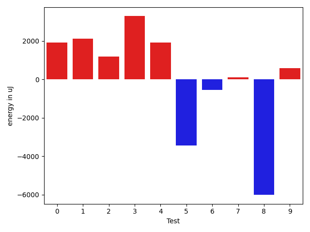

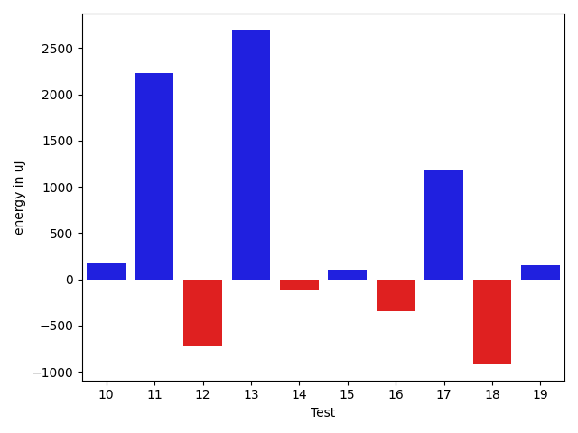

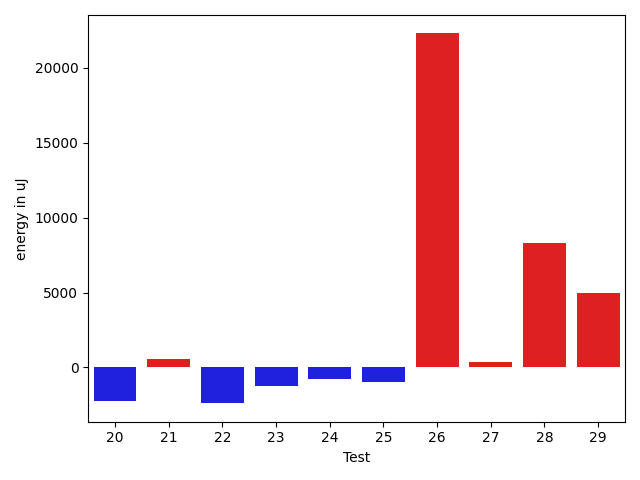

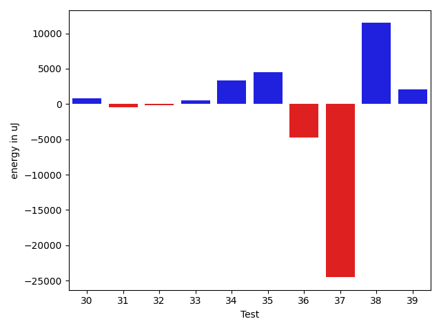

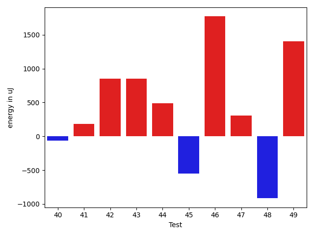

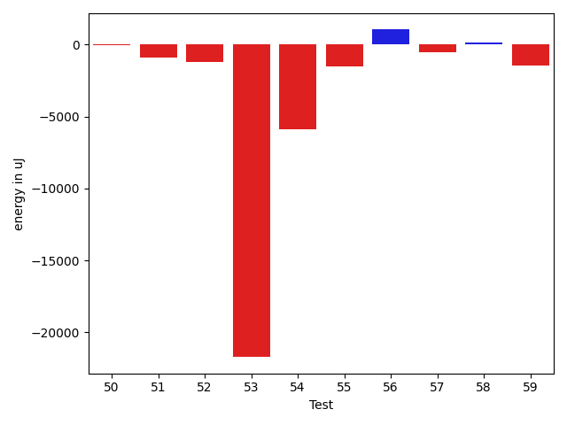

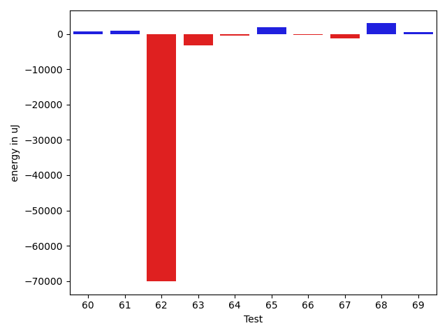

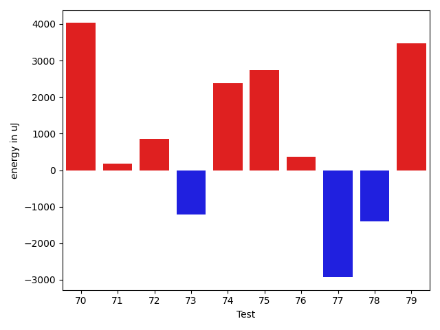

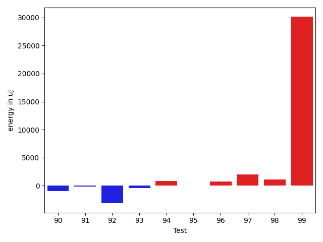

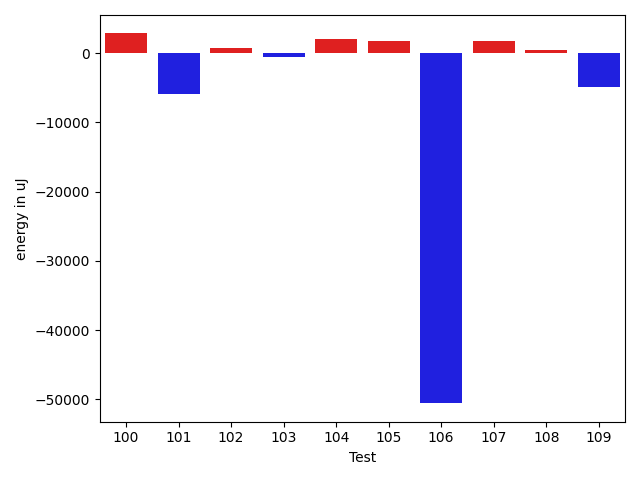

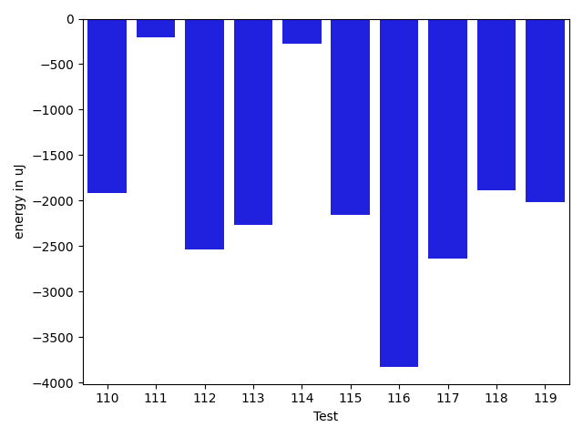

| ID | EnergyV1 | EnergyV2 | DeltaEnergy | σV1 | σV2 |
| --- | --- | --- | --- | --- | --- |
| 0 | 42178.44086021505 | 44106.98936170213 | 1928.5485014870792 | 10678.263754264653 | 12410.518995349443 |
| 1 | 61090.42424242424 | 63218.73737373737 | 2128.3131313131307 | 22798.582145835793 | 22504.70065087676 |
| 2 | 64447.48484848485 | 65633.62626262626 | 1186.1414141414134 | 22278.71127393926 | 22129.825813071508 |
| 3 | 93844.0808080808 | 97136.29292929293 | 3292.2121212121274 | 37567.152312925726 | 35879.40627112909 |
| 4 | 61683.50505050505 | 63608.9494949495 | 1925.4444444444453 | 21992.250391451023 | 23274.089566272254 |
| 5 | 84932.42424242424 | 81494.71717171717 | -3437.707070707067 | 30626.22000046673 | 24502.271529840415 |
| 6 | 60676.77777777778 | 60127.454545454544 | -549.3232323232369 | 20515.71894202572 | 23298.268681622358 |
| 7 | 39941.92857142857 | 40042.53846153846 | 100.60989010988851 | 6432.18039252949 | 7855.142811857372 |
| 8 | 52018.51136363636 | 46011.30864197531 | -6007.202721661051 | 19662.899091479085 | 14905.47890288981 |
| 9 | 38151.38888888889 | 38751.69090909091 | 600.3020202020198 | 4247.944380506476 | 4031.6635631313525 |
| 10 | 39098.807692307695 | 39277.95744680851 | 179.14975450081693 | 4502.743996884487 | 3876.0710418661683 |
| 11 | 39857.71875 | 42089.40677966102 | 2231.688029661018 | 7353.266815395619 | 8906.363784869145 |
| 12 | 40179.49206349206 | 39457.54385964912 | -721.9482038429414 | 8589.582466473543 | 5664.224014520685 |
| 13 | 49442.763636363634 | 52136.709677419356 | 2693.946041055722 | 30081.530273552868 | 25037.945115227252 |
| 14 | 39103.84 | 38992.9 | -110.93999999999505 | 4571.551856251878 | 4370.164405374242 |
| 15 | 38621.7 | 38728.30508474576 | 106.60508474576636 | 3869.193979370897 | 4683.7486118989855 |
| 16 | 38166.71428571428 | 37823.44680851064 | -343.26747720364074 | 4379.262308579715 | 4809.0444037207535 |
| 17 | 37589.50819672131 | 38768.45 | 1178.9418032786853 | 4449.850620528152 | 4291.385543252125 |
| 18 | 39836.96363636364 | 38922.920634920636 | -914.0430014430021 | 4345.55899935319 | 5516.406998065349 |
| 19 | 37685.32727272727 | 37836.86 | 151.53272727272997 | 4980.405113330898 | 4115.140576019245 |
| 20 | 48919.94666666666 | 46707.63636363636 | -2212.3103030303027 | 18977.53346030921 | 15654.713550087754 |
| 21 | 48639.97297297297 | 49172.8 | 532.8270270270295 | 17690.246803598937 | 17061.05721401813 |
| 22 | 40529.379310344826 | 38139.64 | -2389.7393103448267 | 7269.556474702035 | 4504.407529342788 |
| 23 | 39565.9375 | 38316.69565217391 | -1249.241847826088 | 3675.9458896444257 | 5260.371589079853 |
| 24 | 39543.529411764706 | 38741.54285714286 | -801.9865546218498 | 3997.7277534008517 | 4158.256498258149 |
| 25 | 40211.77777777778 | 39228.72222222222 | -983.055555555562 | 4258.238492819349 | 3399.808880340115 |
| 26 | 42501.94117647059 | 64796.71052631579 | 22294.7693498452 | 7528.705388051069 | 97005.16099154289 |
| 27 | 38452.217391304344 | 38831.28571428572 | 379.06832298137306 | 3968.5839874928306 | 5181.322492907598 |
| 28 | 58081.434782608696 | 66358.86363636363 | 8277.428853754936 | 93478.21219654952 | 120901.95402033809 |
| 29 | 38978.25 | 43958.565217391304 | 4980.315217391304 | 4619.629641089568 | 16229.447232211516 |
| 30 | 38092.807692307695 | 38898.681818181816 | 805.8741258741211 | 4142.5840692386755 | 3874.522720007103 |
| 31 | 37426.72 | 36926.05882352941 | -500.66117647058854 | 3856.5753048008796 | 3788.702423701724 |
| 32 | 39528.31707317073 | 39363.53333333333 | -164.78373983739584 | 4555.73123599127 | 6001.3490357492865 |
| 33 | 38818.36842105263 | 39352.4 | 534.031578947368 | 3753.3402977323703 | 4435.533309535619 |
| 34 | 38065.47619047619 | 41435.944444444445 | 3370.4682539682544 | 4976.850482546525 | 3576.544164913981 |
| 35 | 51982.89655172414 | 56520.88 | 4537.98344827586 | 65965.50836211344 | 83072.88805347748 |
| 36 | 42939.78947368421 | 38229.74193548387 | -4710.047538200342 | 20784.86230429036 | 5140.590903449575 |
| 37 | 64119.117647058825 | 39598.84210526316 | -24520.275541795665 | 101584.93464432629 | 5234.574765448408 |
| 38 | 52957.944444444445 | 64420.53333333333 | 11462.588888888888 | 62591.02134356212 | 97245.09859173138 |
| 39 | 39435.63461538462 | 41511.91176470588 | 2076.277149321264 | 6257.546084617313 | 15720.602805886603 |
| 40 | 39800.48148148148 | 38787.10909090909 | -1013.3723905723891 | 4904.536659282878 | 4226.4292888387145 |
| 41 | 43159.33707865168 | 43617.68235294118 | 458.34527428949514 | 11012.563642325325 | 12957.134519104107 |
| 42 | 40591.882352941175 | 42649.970588235294 | 2058.088235294119 | 7694.863658405735 | 10916.729712545877 |
| 43 | 38100.40476190476 | 38011.148148148146 | -89.2566137566173 | 4985.758298630036 | 3591.6233480626033 |
| 44 | 48341.84705882353 | 48660.74074074074 | 318.8936819172086 | 16141.873286219718 | 17625.70480214311 |
| 45 | 38356.2 | 38717.92857142857 | 361.7285714285754 | 4156.036455223037 | 4454.39959821885 |
| 46 | 48149.15151515151 | 38822.84905660377 | -9326.30245854774 | 58988.34103556871 | 4673.452210317525 |
| 47 | 39661.47692307692 | 39677.03571428572 | 15.558791208793991 | 5794.6794989560285 | 4336.544102015392 |
| 48 | 54571.05263157895 | 54082.71428571428 | -488.338345864664 | 19496.299252810128 | 18624.66589537342 |
| 49 | 40385.204081632655 | 41280.93023255814 | 895.7261509254822 | 5493.577218191097 | 5191.241028283811 |
| 50 | 38938.3870967742 | 38883.88888888889 | -54.49820788530633 | 3599.608775134744 | 4321.362605178151 |
| 51 | 41296.78431372549 | 40422.84444444445 | -873.9398692810428 | 7726.327967116087 | 4503.8815948298325 |
| 52 | 39156.230769230766 | 37981.81481481482 | -1174.4159544159484 | 4304.502904452252 | 4648.922726961807 |
| 53 | 143229.5 | 121517.09523809524 | -21712.404761904763 | 383513.9273049844 | 345011.8412701367 |
| 54 | 138624.05050505052 | 132762.74747474748 | -5861.303030303039 | 60838.832990317205 | 35950.32706987769 |
| 55 | 39973.16 | 38446.096774193546 | -1527.063225806458 | 6684.407232836731 | 4049.07563608829 |
| 56 | 39388.59375 | 40431.6 | 1043.0062499999985 | 4612.4018137203675 | 4435.763538933668 |
| 57 | 40317.65217391304 | 39814.181818181816 | -503.4703557312241 | 4738.955458277568 | 4265.313200014141 |
| 58 | 40359.541666666664 | 40507.41176470588 | 147.87009803921683 | 4014.921418691017 | 3909.3910471915688 |
| 59 | 39910.9 | 38481.28 | -1429.6200000000026 | 3428.0681376931047 | 3683.8955524824532 |
| 60 | 39472.52 | 40110.608695652176 | 638.088695652179 | 4641.209334817812 | 4274.468436203301 |
| 61 | 37968.57692307692 | 38902.83870967742 | 934.2617866004948 | 5957.01851195505 | 4797.10177352934 |
| 62 | 215087.94949494948 | 144983.47474747474 | -70104.47474747474 | 448108.0512407191 | 320921.8072243586 |
| 63 | 62063.154639175256 | 58894.354166666664 | -3168.800472508592 | 27496.066970986845 | 25796.830775544237 |
| 64 | 44588.06451612903 | 44107.52542372881 | -480.5390924002204 | 16591.7445561096 | 14924.867811759881 |
| 65 | 44371.63513513513 | 46358.58823529412 | 1986.9531001589858 | 18021.99451464217 | 16578.280989645045 |
| 66 | 44006.16129032258 | 43629.6 | -376.5612903225847 | 13575.295877716031 | 14047.114169719802 |
| 67 | 39649.47619047619 | 38291.875 | -1357.6011904761908 | 5260.025173025475 | 4579.811825760421 |
| 68 | 45100.48780487805 | 48081.34246575343 | 2980.854660875375 | 17088.006523078642 | 18426.64002717089 |
| 69 | 37306.857142857145 | 37895.58823529412 | 588.731092436974 | 3457.311703865747 | 4798.613599521079 |
| 70 | 43144.42424242424 | 50449.3125 | 7304.88825757576 | 13292.1877535101 | 16804.030265157933 |
| 71 | 38016.39655172414 | 38341.94117647059 | 325.5446247464497 | 4399.548812837498 | 4257.950719521437 |
| 72 | 49874.96153846154 | 47049.9 | -2825.0615384615376 | 36146.01399290721 | 28595.5564267714 |
| 73 | 40252.642857142855 | 38942.57142857143 | -1310.0714285714275 | 3493.725776448462 | 4420.967261879718 |
| 74 | 37133.64 | 38340.64705882353 | 1207.0070588235321 | 4112.936283289591 | 4646.857001574245 |
| 75 | 36874.68421052631 | 38653.117647058825 | 1778.4334365325121 | 3634.160180298398 | 4748.764618079515 |
| 76 | 37859.64705882353 | 38138.666666666664 | 279.0196078431327 | 4221.449548105157 | 5144.640929053153 |
| 77 | 39176.22727272727 | 37195.294117647056 | -1980.9331550802162 | 4508.0439815130685 | 3554.8270209377174 |
| 78 | 38088.107142857145 | 37589.875 | -498.23214285714494 | 4367.570927866997 | 3487.1681719376543 |
| 79 | 36562.458333333336 | 38661.28571428572 | 2098.8273809523816 | 4360.291542041337 | 5059.117070933916 |
| 80 | 38931.333333333336 | 40043.730769230766 | 1112.3974358974301 | 4358.017107712074 | 4308.572800981891 |
| 81 | 51666.107142857145 | 56150.60526315789 | 4484.498120300748 | 37622.49415228236 | 43634.87207108521 |
| 82 | 37109.2 | 38854.59375 | 1745.393750000003 | 3806.273316513148 | 4172.739087363471 |
| 83 | 38822.22580645161 | 39099.83870967742 | 277.61290322580317 | 4182.444745096538 | 3972.170545804041 |
| 84 | 37510.57142857143 | 37674.57894736842 | 164.00751879699237 | 3952.738647612125 | 4291.5162247072085 |
| 85 | 36275.066666666666 | 38574.07692307692 | 2299.0102564102563 | 4092.2186234635883 | 3771.295624369765 |
| 86 | 37569.583333333336 | 38620.0 | 1050.4166666666642 | 3195.875987329435 | 3913.902592042883 |
| 87 | 38685.392857142855 | 39108.76 | 423.367142857147 | 3982.9570613811698 | 4881.7192158500875 |
| 88 | 38637.739130434784 | 39921.692307692305 | 1283.953177257521 | 4135.797438667204 | 4026.686725118869 |
| 89 | 209459.77777777778 | 111912.93939393939 | -97546.83838383839 | 447841.9227025879 | 176057.5439866823 |
| 90 | 40138.33870967742 | 39214.43636363636 | -923.9023460410535 | 8380.68850228742 | 5204.170718196343 |
| 91 | 38940.206896551725 | 38770.81481481482 | -169.39208173690713 | 4074.9967072490217 | 4198.672453658877 |
| 92 | 57593.62626262626 | 54462.37373737374 | -3131.252525252523 | 26921.50533620643 | 24337.78220998627 |
| 93 | 38751.26829268293 | 38370.204545454544 | -381.0637472283852 | 4043.8635234527533 | 4408.080944952358 |
| 94 | 38344.45238095238 | 39217.333333333336 | 872.8809523809541 | 3882.0405360999134 | 4977.02739689081 |
| 95 | 39758.403846153844 | 39781.333333333336 | 22.929487179491844 | 4401.295854892386 | 4761.706568494582 |
| 96 | 38326.1875 | 39088.68571428571 | 762.4982142857116 | 3775.194195646596 | 4241.7119978439205 |
| 97 | 37778.10638297872 | 39807.892857142855 | 2029.7864741641315 | 4663.645634662215 | 4479.074109833142 |
| 98 | 38529.34210526316 | 39646.88461538462 | 1117.5425101214569 | 4196.029892249125 | 3999.3672030894995 |
| 99 | 191213.38383838383 | 221318.42424242425 | 30105.040404040425 | 315551.8036159305 | 391564.9324595634 |
| 100 | 39641.16071428572 | 42465.43859649123 | 2824.2778822055116 | 4454.242567392454 | 14344.307639260192 |
| 101 | 49408.51063829787 | 43533.92857142857 | -5874.582066869298 | 26537.851948436233 | 18434.096796029204 |
| 102 | 38990.70175438596 | 39724.96363636364 | 734.2618819776762 | 4671.946478022377 | 6086.153270748388 |
| 103 | 40292.18518518518 | 39730.444444444445 | -561.7407407407372 | 4559.430983317148 | 4744.168422884179 |
| 104 | 43142.1 | 45227.85294117647 | 2085.75294117647 | 10964.837885779642 | 11324.834429726852 |
| 105 | 37522.46666666667 | 39251.666666666664 | 1729.199999999997 | 4507.97936059556 | 4601.476837808585 |
| 106 | 117792.875 | 67229.18918918919 | -50563.68581081081 | 140281.68417744126 | 83050.6126012969 |
| 107 | 37012.583333333336 | 38762.514285714286 | 1749.9309523809497 | 5106.141810359364 | 4255.966194625601 |
| 108 | 38824.47457627119 | 39319.58928571428 | 495.1147094430926 | 6530.145105341171 | 5665.664258675063 |
| 109 | 49802.36363636364 | 44836.316666666666 | -4966.046969696974 | 20782.155706159097 | 17275.189901987247 |
| 110 | 40362.813559322036 | 38441.56896551724 | -1921.2445938047968 | 8208.942121969802 | 5530.137016173971 |
| 111 | 42501.7962962963 | 42299.490909090906 | -202.30538720539334 | 8112.188354750476 | 7619.415214670595 |
| 112 | 41057.58620689655 | 38518.041666666664 | -2539.5445402298865 | 5095.148690038678 | 3718.8203828540245 |
| 113 | 40102.333333333336 | 37834.0625 | -2268.2708333333358 | 4194.418497950307 | 4130.687006047188 |
| 114 | 39104.53846153846 | 38826.260869565216 | -278.27759197324485 | 4631.608154267215 | 3880.1620564250907 |
| 115 | 40232.166666666664 | 38071.954545454544 | -2160.21212121212 | 3841.1971405047957 | 4572.426205749503 |
| 116 | 87954.05434782608 | 84129.44565217392 | -3824.6086956521613 | 108926.36014821367 | 101010.7884788383 |
| 117 | 39330.46428571428 | 36688.851851851854 | -2641.6124338624286 | 3799.6061213362514 | 3911.916312667154 |
| 118 | 42298.56 | 40408.916666666664 | -1889.6433333333334 | 7151.044374523207 | 4917.913594000566 |
| 119 | 41209.42857142857 | 39191.4 | -2018.028571428571 | 4504.141438947141 | 4239.357061765717 |

## Delta Duration per test method

| ID | DurationV1 | DurationsV2 | DeltaDuration |
| --- | --- | --- | --- |
| 0 | 1325527.2258064516 | 1345457.3617021276 | 19930.13589567598 |
| 1 | 1911220.2323232323 | 1904334.5757575757 | -6885.656565656653 |
| 2 | 1951735.8686868686 | 1921465.797979798 | -30270.07070707064 |
| 3 | 2848262.4343434344 | 2802770.505050505 | -45491.92929292936 |
| 4 | 1840946.2525252525 | 1891594.1616161617 | 50647.909090909176 |
| 5 | 2406155.727272727 | 2374397.494949495 | -31758.232323232107 |
| 6 | 1841017.202020202 | 1820306.3636363635 | -20710.838383838534 |
| 7 | 1056541.857142857 | 1118272.673076923 | 61730.81593406596 |
| 8 | 1436282.1477272727 | 1372309.7654320989 | -63972.382295173826 |
| 9 | 898429.8703703703 | 808420.2545454545 | -90009.61582491582 |
| 10 | 830241.5384615385 | 747414.3191489362 | -82827.2193126023 |
| 11 | 1071961.734375 | 1084638.1694915255 | 12676.435116525507 |
| 12 | 1074149.507936508 | 1013424.8421052631 | -60724.66583124478 |
| 13 | 1403298.1636363636 | 1471399.8064516129 | 68101.64281524927 |
| 14 | 831443.98 | 848963.14 | 17519.160000000033 |
| 15 | 820367.44 | 823355.8813559322 | 2988.441355932271 |
| 16 | 892689.0612244898 | 885676.3829787234 | -7012.678245766438 |
| 17 | 920792.0655737704 | 877545.9166666666 | -43246.14890710381 |
| 18 | 864722.0363636364 | 837087.4603174604 | -27634.576046176022 |
| 19 | 846617.7454545455 | 807596.24 | -39021.50545454549 |
| 20 | 1382069.1333333333 | 1305256.2337662338 | -76812.89956709952 |
| 21 | 1370216.9054054054 | 1349467.9125 | -20748.99290540535 |
| 22 | 611307.724137931 | 622490.68 | 11182.955862069037 |
| 23 | 446028.28125 | 487669.60869565216 | 41641.32744565216 |
| 24 | 484419.35294117645 | 523152.3714285714 | 38733.01848739496 |
| 25 | 487598.3888888889 | 549441.6111111111 | 61843.22222222225 |
| 26 | 778291.2647058824 | 1442617.394736842 | 664326.1300309596 |
| 27 | 529185.5652173914 | 476990.4285714286 | -52195.136645962775 |
| 28 | 1017268.304347826 | 1216653.7727272727 | 199385.46837944665 |
| 29 | 571004.125 | 804744.5217391305 | 233740.3967391305 |
| 30 | 489137.42307692306 | 585838.4545454546 | 96701.03146853152 |
| 31 | 457762.88 | 480931.17647058825 | 23168.296470588248 |
| 32 | 645423.0487804879 | 687364.2333333333 | 41941.18455284543 |
| 33 | 429001.8947368421 | 415264.9 | -13736.994736842054 |
| 34 | 505629.6666666667 | 396818.72222222225 | -108810.94444444444 |
| 35 | 893647.5172413794 | 1110114.08 | 216466.5627586207 |
| 36 | 698568.052631579 | 549202.1290322581 | -149365.92359932093 |
| 37 | 1193820.0588235294 | 470532.4210526316 | -723287.6377708978 |
| 38 | 1038711.9444444445 | 1307915.6 | 269203.6555555556 |
| 39 | 979650.7115384615 | 1028358.5882352941 | 48707.876696832594 |
| 40 | 889729.5555555555 | 855013.7818181819 | -34715.773737373645 |
| 41 | 1258982.5168539325 | 1325699.9882352941 | 66717.4713813616 |
| 42 | 1081903.7352941176 | 1097557.3382352942 | 15653.602941176621 |
| 43 | 662078.380952381 | 630729.7037037037 | -31348.67724867724 |
| 44 | 1400181.5882352942 | 1364589.5555555555 | -35592.03267973871 |
| 45 | 638143.4 | 646807.6071428572 | 8664.207142857136 |
| 46 | 1140748.7272727273 | 647002.8490566037 | -493745.87821612356 |
| 47 | 879468.0 | 846017.7857142857 | -33450.21428571432 |
| 48 | 1587882.3263157895 | 1618595.7551020407 | 30713.42878625123 |
| 49 | 874085.0 | 880536.1162790698 | 6451.1162790698 |
| 50 | 600510.0967741936 | 542224.8148148148 | -58285.28195937874 |
| 51 | 865327.9411764706 | 887281.0 | 21953.058823529398 |
| 52 | 590841.3846153846 | 569132.1111111111 | -21709.2735042735 |
| 53 | 4075884.035714286 | 3455494.2023809524 | -620389.8333333335 |
| 54 | 3928312.4242424243 | 3720673.7474747472 | -207638.67676767707 |
| 55 | 866618.32 | 708654.7096774194 | -157963.61032258056 |
| 56 | 633008.65625 | 681373.6666666666 | 48365.01041666663 |
| 57 | 570666.6521739131 | 512683.63636363635 | -57983.01581027673 |
| 58 | 586541.0 | 534672.9411764706 | -51868.0588235294 |
| 59 | 475390.73333333334 | 510971.04 | 35580.30666666664 |
| 60 | 573899.8 | 509512.7826086957 | -64387.01739130437 |
| 61 | 626255.5769230769 | 634662.6451612903 | 8407.068238213426 |
| 62 | 6219550.757575758 | 4072719.787878788 | -2146830.9696969697 |
| 63 | 1890609.237113402 | 1648999.1875 | -241610.049613402 |
| 64 | 1046634.5483870967 | 1047508.5593220339 | 874.0109349371633 |
| 65 | 1238017.6756756757 | 1258748.5647058825 | 20730.889030206716 |
| 66 | 1163690.677419355 | 1218835.6857142858 | 55145.008294930914 |
| 67 | 486468.6666666667 | 457098.2083333333 | -29370.458333333372 |
| 68 | 1221029.256097561 | 1365336.4383561644 | 144307.1822586034 |
| 69 | 407514.38095238095 | 414366.70588235295 | 6852.324929972005 |
| 70 | 960493.303030303 | 1290646.84375 | 330153.540719697 |
| 71 | 810787.224137931 | 848126.7647058824 | 37339.54056795139 |
| 72 | 1021785.4230769231 | 1010491.9333333333 | -11293.489743589773 |
| 73 | 494787.14285714284 | 466642.10714285716 | -28145.03571428568 |
| 74 | 423507.0 | 467297.64705882355 | 43790.64705882355 |
| 75 | 527732.947368421 | 436280.29411764705 | -91452.65325077396 |
| 76 | 473309.6176470588 | 488706.06666666665 | 15396.449019607855 |
| 77 | 420445.9090909091 | 468867.5294117647 | 48421.62032085558 |
| 78 | 456642.75 | 437325.4375 | -19317.3125 |
| 79 | 544906.9583333334 | 481457.90476190473 | -63449.05357142864 |
| 80 | 636341.8148148148 | 548235.5 | -88106.31481481483 |
| 81 | 1110441.4285714286 | 1227694.5 | 117253.07142857136 |
| 82 | 417439.5333333333 | 455150.78125 | 37711.247916666674 |
| 83 | 595853.8709677419 | 638846.1612903225 | 42992.29032258061 |
| 84 | 476494.85714285716 | 504284.36842105264 | 27789.51127819548 |
| 85 | 365122.26666666666 | 392469.6153846154 | 27347.348717948713 |
| 86 | 421011.9583333333 | 434388.375 | 13376.416666666686 |
| 87 | 581277.7142857143 | 586685.8 | 5408.085714285728 |
| 88 | 487340.8695652174 | 486312.03846153844 | -1028.8311036789673 |
| 89 | 6085586.575757576 | 3137739.898989899 | -2947846.676767677 |
| 90 | 981719.4354838709 | 993633.6363636364 | 11914.200879765442 |
| 91 | 617183.1724137932 | 600812.3333333334 | -16370.839080459788 |
| 92 | 1788616.2424242424 | 1711674.7777777778 | -76941.46464646468 |
| 93 | 813989.7073170731 | 718154.1590909091 | -95835.54822616407 |
| 94 | 808748.0952380953 | 707166.8974358974 | -101581.19780219789 |
| 95 | 783951.3461538461 | 756895.6111111111 | -27055.735042735003 |
| 96 | 598982.34375 | 622703.6 | 23721.256249999977 |
| 97 | 655690.9574468085 | 590780.1428571428 | -64910.81458966562 |
| 98 | 646031.947368421 | 596190.0 | -49841.94736842101 |
| 99 | 5587930.717171717 | 6204934.7272727275 | 617004.0101010101 |
| 100 | 890440.8214285715 | 1000883.0175438597 | 110442.19611528818 |
| 101 | 1276019.8085106383 | 1036554.0 | -239465.8085106383 |
| 102 | 939630.7192982456 | 1009098.0 | 69467.28070175438 |
| 103 | 621970.4444444445 | 874596.3333333334 | 252625.88888888888 |
| 104 | 1204352.7857142857 | 1355884.3970588236 | 151531.61134453793 |
| 105 | 675527.5333333333 | 618210.7333333333 | -57316.80000000005 |
| 106 | 3527435.35 | 1690642.3243243243 | -1836793.0256756758 |
| 107 | 900641.8888888889 | 803402.8 | -97239.08888888883 |
| 108 | 946716.8983050848 | 927661.875 | -19055.02330508479 |
| 109 | 1346386.7454545454 | 1109441.4166666667 | -236945.32878787862 |
| 110 | 959536.9830508474 | 870045.5344827586 | -89491.44856808882 |
| 111 | 966706.2037037037 | 1038015.2727272727 | 71309.069023569 |
| 112 | 579988.3448275862 | 668824.9166666666 | 88836.57183908042 |
| 113 | 879367.6274509804 | 927845.6041666666 | 48477.976715686265 |
| 114 | 588535.7307692308 | 570161.9130434783 | -18373.81772575248 |
| 115 | 451902.22222222225 | 544972.8636363636 | 93070.6414141414 |
| 116 | 2538699.9782608696 | 2539207.684782609 | 507.7065217392519 |
| 117 | 550247.0357142857 | 768178.8888888889 | 217931.8531746032 |
| 118 | 1021690.06 | 862600.0 | -159090.06000000006 |
| 119 | 630265.6785714285 | 767228.0285714286 | 136962.3500000001 |

## Misc.

| ID | Test Class | Test Method |
| --- | --- | --- |
| 0 | com.google.gson.functional.ParameterizedTypesTest | testParameterizedTypeGenericArraysSerialization |
| 1 | com.google.gson.functional.ParameterizedTypesTest | testVariableTypeArrayDeserialization |
| 2 | com.google.gson.functional.ParameterizedTypesTest | testVariableTypeDeserialization |
| 3 | com.google.gson.functional.ParameterizedTypesTest | testVariableTypeFieldsAndGenericArraysSerialization |
| 4 | com.google.gson.functional.ParameterizedTypesTest | testParameterizedTypeGenericArraysDeserialization |
| 5 | com.google.gson.functional.ParameterizedTypesTest | testVariableTypeFieldsAndGenericArraysDeserialization |
| 6 | com.google.gson.functional.ParameterizedTypesTest | testParameterizedTypeWithVariableTypeDeserialization |
| 7 | com.google.gson.functional.CustomTypeAdaptersTest | testCustomAdapterInvokedForMapElementDeserialization |
| 8 | com.google.gson.functional.MapTest | testSerializeMaps |
| 9 | com.google.gson.functional.MapTest | testMapOfMapDeserialization |
| 10 | com.google.gson.functional.MapTest | testReadMapsWithEmptyStringKey |
| 11 | com.google.gson.functional.MapTest | testMapSubclassDeserialization |
| 12 | com.google.gson.functional.MapTest | testGeneralMapField |
| 13 | com.google.gson.functional.MapTest | testMapDeserialization |
| 14 | com.google.gson.functional.MapTest | testMapDeserializationWithIntegerKeys |
| 15 | com.google.gson.functional.MapTest | testMapDeserializationWithNullKey |
| 16 | com.google.gson.functional.MapTest | testMapStandardSubclassDeserialization |
| 17 | com.google.gson.functional.MapTest | testParameterizedMapSubclassDeserialization |
| 18 | com.google.gson.functional.MapTest | testMapDeserializationWithNullValue |
| 19 | com.google.gson.functional.MapTest | testMapDeserializationWithWildcardValues |
| 20 | com.google.gson.functional.ReadersWritersTest | testReadWriteTwoObjects |
| 21 | com.google.gson.functional.ReadersWritersTest | testReadWriteTwoStrings |
| 22 | com.google.gson.internal.bind.JsonElementReaderTest | testStrictNansAndInfinities |
| 23 | com.google.gson.internal.bind.JsonElementReaderTest | testObject |
| 24 | com.google.gson.internal.bind.JsonElementReaderTest | testNestedObjects |
| 25 | com.google.gson.internal.bind.JsonElementReaderTest | testSkipValue |
| 26 | com.google.gson.internal.bind.JsonElementReaderTest | testNumbersFromStrings |
| 27 | com.google.gson.internal.bind.JsonElementReaderTest | testNulls |
| 28 | com.google.gson.internal.bind.JsonElementReaderTest | testStringsFromNumbers |
| 29 | com.google.gson.internal.bind.JsonElementReaderTest | testNumbers |
| 30 | com.google.gson.internal.bind.JsonElementReaderTest | testArray |
| 31 | com.google.gson.internal.bind.JsonElementReaderTest | testEarlyClose |
| 32 | com.google.gson.internal.bind.JsonElementReaderTest | testWrongType |
| 33 | com.google.gson.internal.bind.JsonElementReaderTest | testStrings |
| 34 | com.google.gson.internal.bind.JsonElementReaderTest | testNestedArrays |
| 35 | com.google.gson.internal.bind.JsonElementReaderTest | testBooleans |
| 36 | com.google.gson.internal.bind.JsonElementReaderTest | testLenientNansAndInfinities |
| 37 | com.google.gson.internal.bind.JsonElementReaderTest | testEmptyArray |
| 38 | com.google.gson.internal.bind.JsonElementReaderTest | testEmptyObject |
| 39 | com.google.gson.functional.CustomDeserializerTest | testCustomDeserializerReturnsNullForArrayElementsForArrayField |
| 40 | com.google.gson.functional.CustomDeserializerTest | testCustomDeserializerReturnsNullForArrayElements |
| 41 | com.google.gson.functional.CustomDeserializerTest | testJsonTypeFieldBasedDeserialization |
| 42 | com.google.gson.functional.ObjectTest | testArrayOfArraysDeserialization |
| 43 | com.google.gson.functional.ObjectTest | testClassWithTransientFieldsDeserialization |
| 44 | com.google.gson.functional.ObjectTest | testArrayOfObjectsAsFields |
| 45 | com.google.gson.functional.ObjectTest | testClassWithTransientFieldsDeserializationTransientFieldsPassedInJsonAreIgnored |
| 46 | com.google.gson.functional.ObjectTest | testPrimitiveArrayInAnObjectDeserialization |
| 47 | com.google.gson.functional.ObjectTest | testArrayOfObjectsDeserialization |
| 48 | com.google.gson.functional.ObjectTest | testArrayOfArraysSerialization |
| 49 | com.google.gson.functional.ObjectTest | testClassWithTransientFieldsSerialization |
| 50 | com.google.gson.functional.ObjectTest | testNullArraysDeserialization |
| 51 | com.google.gson.functional.ObjectTest | testArrayOfObjectsSerialization |
| 52 | com.google.gson.functional.ObjectTest | testPrimitiveArrayFieldSerialization |
| 53 | com.google.gson.JsonParserTest | testReadWriteTwoObjects |
| 54 | com.google.gson.functional.CircularReferenceTest | testSelfReferenceArrayFieldSerialization |
| 55 | com.google.gson.functional.PrimitiveTest | testPrimitiveIntegerAutoboxedInASingleElementArraySerialization |
| 56 | com.google.gson.functional.PrimitiveTest | testBigIntegerInASingleElementArraySerialization |
| 57 | com.google.gson.functional.PrimitiveTest | testPrimitiveBooleanAutoboxedInASingleElementArraySerialization |
| 58 | com.google.gson.functional.PrimitiveTest | testPrimitiveDoubleAutoboxedInASingleElementArraySerialization |
| 59 | com.google.gson.functional.PrimitiveTest | testBigDecimalInASingleElementArraySerialization |
| 60 | com.google.gson.functional.PrimitiveTest | testPrimitiveLongAutoboxedInASingleElementArraySerialization |
| 61 | com.google.gson.functional.PrimitiveTest | testPrimitiveClassLiteral |
| 62 | com.google.gson.functional.TypeVariableTest | testAdvancedTypeVariables |
| 63 | com.google.gson.functional.TypeVariableTest | testTypeVariablesViaTypeParameter |
| 64 | com.google.gson.functional.ArrayTest | testTopLevelArrayOfIntsDeserialization |
| 65 | com.google.gson.functional.ArrayTest | testArrayOfCollectionSerialization |
| 66 | com.google.gson.functional.ArrayTest | testArrayOfPrimitivesAsObjectsDeserialization |
| 67 | com.google.gson.functional.ArrayTest | testEmptyArraySerialization |
| 68 | com.google.gson.functional.ArrayTest | testObjectArrayWithNonPrimitivesSerialization |
| 69 | com.google.gson.functional.ArrayTest | testArrayOfNullDeserialization |
| 70 | com.google.gson.functional.ArrayTest | testArrayOfPrimitivesAsObjectsSerialization |
| 71 | com.google.gson.functional.ArrayTest | testArrayOfCollectionDeserialization |
| 72 | com.google.gson.functional.ArrayTest | testTopLevelArrayOfIntsSerialization |
| 73 | com.google.gson.functional.ArrayTest | testNullsInArrayDeserialization |
| 74 | com.google.gson.functional.ArrayTest | testSingleStringArraySerialization |
| 75 | com.google.gson.functional.ArrayTest | testNullsInArraySerialization |
| 76 | com.google.gson.functional.ArrayTest | testMultidimenstionalArraysDeserialization |
| 77 | com.google.gson.functional.ArrayTest | testMultiDimenstionalObjectArraysSerialization |
| 78 | com.google.gson.functional.ArrayTest | testMixingTypesInObjectArraySerialization |
| 79 | com.google.gson.functional.ArrayTest | testMultidimenstionalArraysSerialization |
| 80 | com.google.gson.functional.ArrayTest | testEmptyArrayDeserialization |
| 81 | com.google.gson.functional.ArrayTest | testSingleNullInArraySerialization |
| 82 | com.google.gson.functional.ArrayTest | testSingleStringArrayDeserialization |
| 83 | com.google.gson.functional.ArrayTest | testSingleNullInArrayDeserialization |
| 84 | com.google.gson.functional.ArrayTest | testArrayOfStringsDeserialization |
| 85 | com.google.gson.functional.ArrayTest | testArrayOfNullSerialization |
| 86 | com.google.gson.functional.ArrayTest | testArrayOfStringsSerialization |
| 87 | com.google.gson.functional.ArrayTest | testInvalidArrayDeserialization |
| 88 | com.google.gson.functional.ArrayTest | testNullsInArrayWithSerializeNullPropertySetSerialization |
| 89 | com.google.gson.functional.MapAsArrayTypeAdapterTest | testSerializeComplexMapWithTypeAdapter |
| 90 | com.google.gson.functional.NullObjectAndFieldTest | testPrintPrintingObjectWithNulls |
| 91 | com.google.gson.functional.NullObjectAndFieldTest | testPrintPrintingArraysWithNulls |
| 92 | com.google.gson.functional.NullObjectAndFieldTest | testExplicitSerializationOfNullArrayMembers |
| 93 | com.google.gson.functional.NullObjectAndFieldTest | testExplicitSerializationOfNullStringMembers |
| 94 | com.google.gson.functional.NullObjectAndFieldTest | testExplicitSerializationOfNullCollectionMembers |
| 95 | com.google.gson.internal.bind.MiniGsonTest | testSerialize1dArray |
| 96 | com.google.gson.internal.bind.MiniGsonTest | testDeserialize1dArray |
| 97 | com.google.gson.internal.bind.MiniGsonTest | testDeserialize2dArray |
| 98 | com.google.gson.internal.bind.MiniGsonTest | testSerialize2dArray |
| 99 | com.google.gson.functional.TypeHierarchyAdapterTest | testTypeHierarchy |
| 100 | com.google.gson.functional.ExposeFieldsTest | testArrayWithOneNullExposeFieldObjectSerialization |
| 101 | com.google.gson.functional.ExclusionStrategyFunctionalTest | testExclusionStrategyDeserialization |
| 102 | com.google.gson.functional.ExclusionStrategyFunctionalTest | testExclusionStrategyWithMode |
| 103 | com.google.gson.functional.StringTest | testStringValueAsSingleElementArraySerialization |
| 104 | com.google.gson.functional.InheritanceTest | testClassWithBaseArrayFieldSerialization |
| 105 | com.google.gson.functional.JsonParserTest | testBadFieldTypeForCustomDeserializerCustomTree |
| 106 | com.google.gson.functional.JsonParserTest | testDeserializingCustomTree |
| 107 | com.google.gson.functional.JsonParserTest | testBadTypeForDeserializingCustomTree |
| 108 | com.google.gson.functional.JsonParserTest | testExtraCommasInMaps |
| 109 | com.google.gson.functional.JsonParserTest | testChangingCustomTreeAndDeserializing |
| 110 | com.google.gson.functional.JsonParserTest | testBadFieldTypeForDeserializingCustomTree |
| 111 | com.google.gson.functional.PrettyPrintingTest | testPrettyPrintArrayOfObjects |
| 112 | com.google.gson.functional.PrettyPrintingTest | testPrettyPrintArrayOfPrimitiveArrays |
| 113 | com.google.gson.functional.PrettyPrintingTest | testPrettyPrintListOfPrimitiveArrays |
| 114 | com.google.gson.functional.PrettyPrintingTest | testMultipleArrays |
| 115 | com.google.gson.functional.PrettyPrintingTest | testPrettyPrintArrayOfPrimitives |
| 116 | com.google.gson.functional.PrintFormattingTest | testCompactFormattingLeavesNoWhiteSpace |
| 117 | com.google.gson.functional.DefaultTypeAdaptersTest | testPropertiesDeserialization |
| 118 | com.google.gson.functional.CustomSerializerTest | testSubClassSerializerInvokedForBaseClassFieldsHoldingArrayOfSubClassInstances |
| 119 | com.google.gson.functional.EscapingTest | testEscapingQuotesInStringArray |

| Test | IterationV1 | IterationV2 | DeltaIteration |
| --- | --- | --- | --- |
| 0 | 93 | 94 | 1 |
| 1 | 99 | 99 | 0 |
| 2 | 99 | 99 | 0 |
| 3 | 99 | 99 | 0 |
| 4 | 99 | 99 | 0 |
| 5 | 99 | 99 | 0 |
| 6 | 99 | 99 | 0 |
| 7 | 56 | 52 | -4 |
| 8 | 88 | 81 | -7 |
| 9 | 54 | 55 | 1 |
| 10 | 52 | 47 | -5 |
| 11 | 64 | 59 | -5 |
| 12 | 63 | 57 | -6 |
| 13 | 55 | 62 | 7 |
| 14 | 50 | 50 | 0 |
| 15 | 50 | 59 | 9 |
| 16 | 49 | 47 | -2 |
| 17 | 61 | 60 | -1 |
| 18 | 55 | 63 | 8 |
| 19 | 55 | 50 | -5 |
| 20 | 75 | 77 | 2 |
| 21 | 74 | 80 | 6 |
| 22 | 29 | 25 | -4 |
| 23 | 32 | 23 | -9 |
| 24 | 17 | 35 | 18 |
| 25 | 18 | 18 | 0 |
| 26 | 34 | 38 | 4 |
| 27 | 23 | 14 | -9 |
| 28 | 23 | 22 | -1 |
| 29 | 24 | 23 | -1 |
| 30 | 26 | 22 | -4 |
| 31 | 25 | 17 | -8 |
| 32 | 41 | 30 | -11 |
| 33 | 19 | 20 | 1 |
| 34 | 21 | 18 | -3 |
| 35 | 29 | 25 | -4 |
| 36 | 19 | 31 | 12 |
| 37 | 17 | 19 | 2 |
| 38 | 18 | 15 | -3 |
| 39 | 52 | 68 | 16 |
| 40 | 54 | 55 | 1 |
| 41 | 89 | 85 | -4 |
| 42 | 68 | 68 | 0 |
| 43 | 42 | 27 | -15 |
| 44 | 85 | 81 | -4 |
| 45 | 35 | 28 | -7 |
| 46 | 33 | 53 | 20 |
| 47 | 65 | 56 | -9 |
| 48 | 95 | 98 | 3 |
| 49 | 49 | 43 | -6 |
| 50 | 31 | 27 | -4 |
| 51 | 51 | 45 | -6 |
| 52 | 26 | 27 | 1 |
| 53 | 84 | 84 | 0 |
| 54 | 99 | 99 | 0 |
| 55 | 25 | 31 | 6 |
| 56 | 32 | 30 | -2 |
| 57 | 23 | 22 | -1 |
| 58 | 24 | 34 | 10 |
| 59 | 30 | 25 | -5 |
| 60 | 25 | 23 | -2 |
| 61 | 26 | 31 | 5 |
| 62 | 99 | 99 | 0 |
| 63 | 97 | 96 | -1 |
| 64 | 62 | 59 | -3 |
| 65 | 74 | 85 | 11 |
| 66 | 62 | 70 | 8 |
| 67 | 21 | 24 | 3 |
| 68 | 82 | 73 | -9 |
| 69 | 21 | 17 | -4 |
| 70 | 33 | 32 | -1 |
| 71 | 58 | 51 | -7 |
| 72 | 26 | 30 | 4 |
| 73 | 14 | 28 | 14 |
| 74 | 25 | 17 | -8 |
| 75 | 19 | 17 | -2 |
| 76 | 34 | 30 | -4 |
| 77 | 22 | 17 | -5 |
| 78 | 28 | 16 | -12 |
| 79 | 24 | 21 | -3 |
| 80 | 27 | 26 | -1 |
| 81 | 28 | 38 | 10 |
| 82 | 15 | 32 | 17 |
| 83 | 31 | 31 | 0 |
| 84 | 14 | 19 | 5 |
| 85 | 15 | 13 | -2 |
| 86 | 24 | 16 | -8 |
| 87 | 28 | 25 | -3 |
| 88 | 23 | 26 | 3 |
| 89 | 99 | 99 | 0 |
| 90 | 62 | 55 | -7 |
| 91 | 29 | 27 | -2 |
| 92 | 99 | 99 | 0 |
| 93 | 41 | 44 | 3 |
| 94 | 42 | 39 | -3 |
| 95 | 52 | 36 | -16 |
| 96 | 32 | 35 | 3 |
| 97 | 47 | 28 | -19 |
| 98 | 38 | 26 | -12 |
| 99 | 99 | 99 | 0 |
| 100 | 56 | 57 | 1 |
| 101 | 47 | 42 | -5 |
| 102 | 57 | 55 | -2 |
| 103 | 27 | 18 | -9 |
| 104 | 70 | 68 | -2 |
| 105 | 30 | 30 | 0 |
| 106 | 40 | 37 | -3 |
| 107 | 36 | 35 | -1 |
| 108 | 59 | 56 | -3 |
| 109 | 55 | 60 | 5 |
| 110 | 59 | 58 | -1 |
| 111 | 54 | 55 | 1 |
| 112 | 29 | 24 | -5 |
| 113 | 51 | 48 | -3 |
| 114 | 26 | 23 | -3 |
| 115 | 18 | 22 | 4 |
| 116 | 92 | 92 | 0 |
| 117 | 28 | 27 | -1 |
| 118 | 50 | 48 | -2 |
| 119 | 28 | 35 | 7 |

| Time Label | Time (s) |
| --- | --- |
| Selection | 28.847577333450317 |
| Injection | 14.02325439453125 |
| Total | 1195.2781195640564 |

