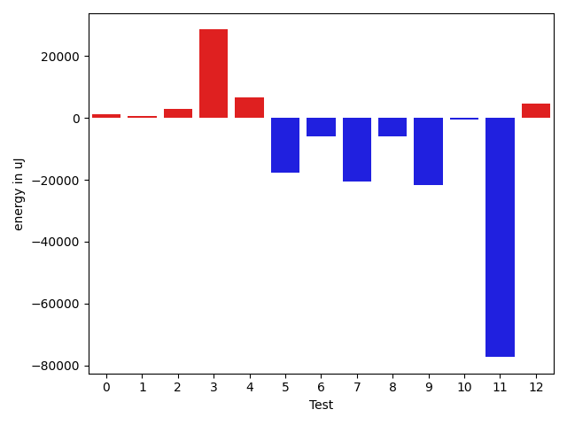

# gson cf1556

https://github.com/google/gson/commit/cf1556

## Delta Energy per test method

| ID | EnergyV1 | EnergyV2 | DeltaEnergy | σV1 | σV2 |
| --- | --- | --- | --- | --- | --- |
| 0 | 38379.59375 | 39425.39473684211 | 1045.8009868421068 | 5380.108333361972 | 8570.494280530376 |
| 1 | 37153.25 | 37837.8253968254 | 684.5753968253994 | 4049.154292147639 | 4323.145270865391 |
| 2 | 44445.77659574468 | 47403.903225806454 | 2958.1266300617717 | 13658.107138996358 | 16121.862310089162 |
| 3 | 115119.48648648648 | 143597.4827586207 | 28477.996272134216 | 146130.12368001434 | 163132.03436937544 |
| 4 | 47728.6375 | 54302.23809523809 | 6573.600595238095 | 15686.194866222138 | 24086.772811381772 |
| 5 | 113236.57575757576 | 95652.9494949495 | -17583.62626262626 | 99719.52646480767 | 72586.74341269261 |
| 6 | 57423.515625 | 51567.52173913043 | -5855.993885869568 | 54661.67548600442 | 36425.43734236915 |
| 7 | 313888.8080808081 | 293421.75757575757 | -20467.050505050516 | 578920.993729316 | 538673.1956440712 |
| 8 | 47434.311111111114 | 41365.163043478264 | -6069.14806763285 | 29850.832212722296 | 9558.931808019835 |
| 9 | 99229.57971014493 | 77381.15492957746 | -21848.424780567468 | 213405.53708892997 | 62446.127065970846 |
| 10 | 48821.75257731959 | 48272.26315789474 | -549.4894194248482 | 33260.31351155962 | 16469.51369633924 |
| 11 | 488614.1515151515 | 411368.5252525252 | -77245.62626262626 | 655587.9850032593 | 595951.0935125591 |
| 12 | 32635.303030303032 | 37242.256410256414 | 4606.953379953382 | 2669.520959010601 | 10060.147696621732 |

## Delta Duration per test method

| ID | DurationV1 | DurationsV2 | DeltaDuration |
| --- | --- | --- | --- |
| 0 | 1203078.375 | 1110610.7763157894 | -92467.59868421056 |
| 1 | 1024416.2058823529 | 943564.7777777778 | -80851.42810457514 |
| 2 | 1542029.925531915 | 1471700.3548387096 | -70329.57069320534 |
| 3 | 3860798.635135135 | 4632622.224137931 | 771823.589002796 |
| 4 | 1494124.875 | 1651288.2142857143 | 157163.33928571432 |
| 5 | 3714312.131313131 | 3080238.98989899 | -634073.1414141413 |
| 6 | 1925664.140625 | 1721537.2028985508 | -204126.93772644922 |
| 7 | 9511291.424242424 | 9060354.909090908 | -450936.5151515156 |
| 8 | 1531680.211111111 | 1313897.2173913044 | -217782.99371980666 |
| 9 | 3336358.0144927534 | 2377633.8309859154 | -958724.183506838 |
| 10 | 1808435.7113402062 | 1786648.9789473685 | -21786.73239283776 |
| 11 | 14261855.676767677 | 11837057.141414141 | -2424798.535353536 |
| 12 | 979048.0606060605 | 1140858.923076923 | 161810.86247086246 |

## Misc.

| ID | Test Class | Test Method |
| --- | --- | --- |
| 0 | com.google.gson.functional.JsonParserTest | testBadTypeForDeserializingCustomTree |
| 1 | com.google.gson.functional.JsonParserTest | testBadFieldTypeForCustomDeserializerCustomTree |
| 2 | com.google.gson.functional.JsonParserTest | testBadFieldTypeForDeserializingCustomTree |
| 3 | com.google.gson.functional.JsonParserTest | testDeserializingCustomTree |
| 4 | com.google.gson.functional.JsonParserTest | testChangingCustomTreeAndDeserializing |
| 5 | com.google.gson.functional.ReadersWritersTest | testReadWriteTwoObjects |
| 6 | com.google.gson.functional.ReadersWritersTest | testReadWriteTwoStrings |
| 7 | com.google.gson.JsonParserTest | testReadWriteTwoObjects |
| 8 | com.google.gson.functional.ExclusionStrategyFunctionalTest | testExclusionStrategyWithMode |
| 9 | com.google.gson.functional.ExclusionStrategyFunctionalTest | testExclusionStrategyDeserialization |
| 10 | com.google.gson.functional.CustomDeserializerTest | testJsonTypeFieldBasedDeserialization |
| 11 | com.google.gson.functional.TypeHierarchyAdapterTest | testTypeHierarchy |
| 12 | com.google.gson.functional.PrimitiveTest | testPrimitiveClassLiteral |

| Test | IterationV1 | IterationV2 | DeltaIteration |
| --- | --- | --- | --- |
| 0 | 64 | 76 | 12 |
| 1 | 68 | 63 | -5 |
| 2 | 94 | 93 | -1 |
| 3 | 74 | 58 | -16 |
| 4 | 80 | 84 | 4 |
| 5 | 99 | 99 | 0 |
| 6 | 64 | 69 | 5 |
| 7 | 99 | 99 | 0 |
| 8 | 90 | 92 | 2 |
| 9 | 69 | 71 | 2 |
| 10 | 97 | 95 | -2 |
| 11 | 99 | 99 | 0 |
| 12 | 33 | 39 | 6 |

| Time Label | Time (s) |
| --- | --- |
| Selection | 28.110486268997192 |
| Injection | 10.553075075149536 |
| Total | 1116.3148922920227 |

