# gson 364de8

https://github.com/google/gson/commit/364de8

## Delta Energy per test method

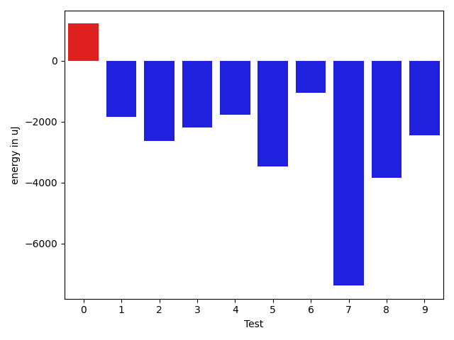

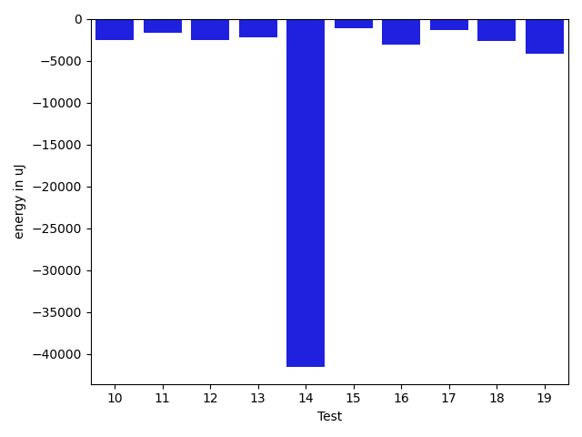

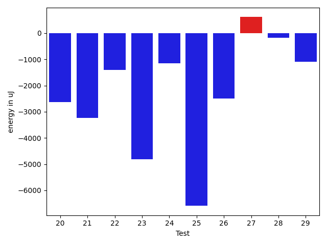

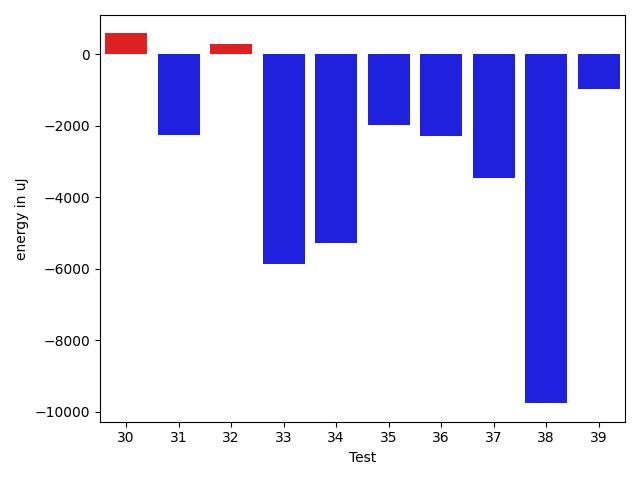

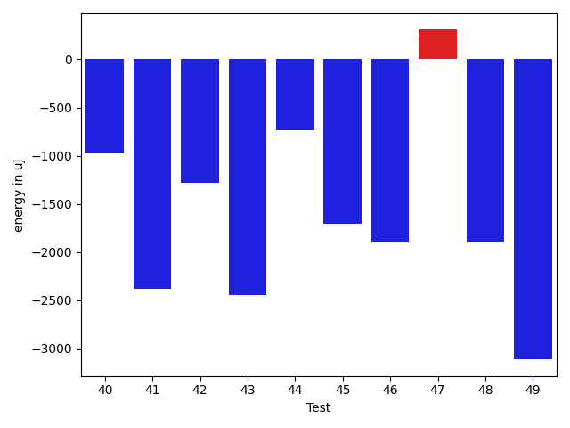

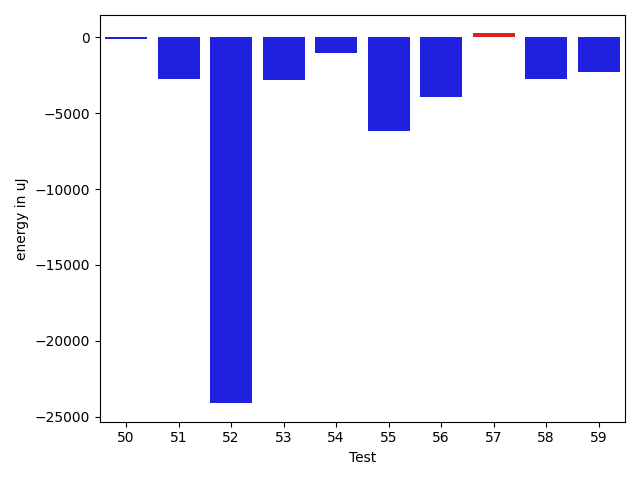

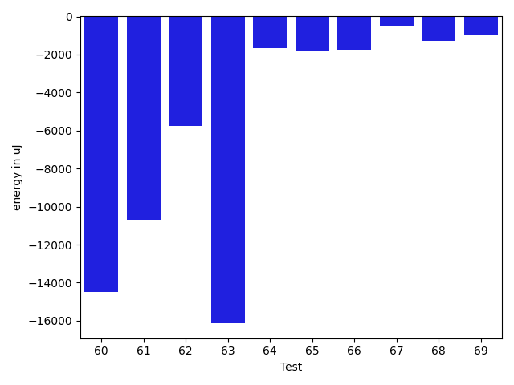

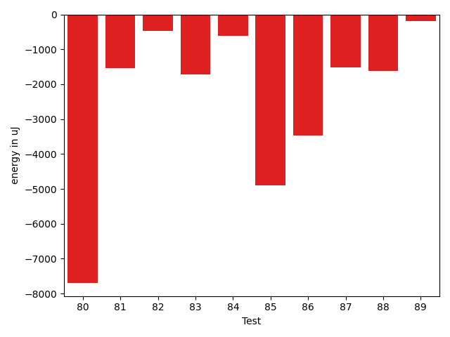

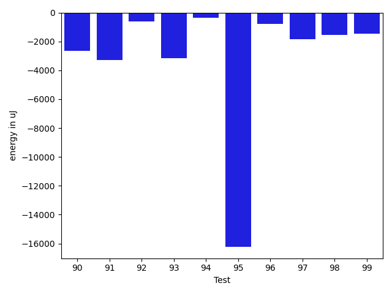

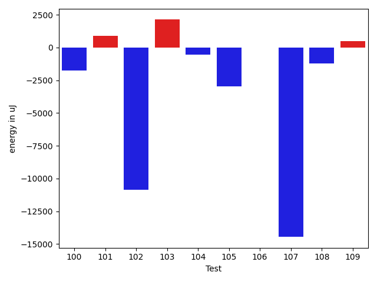

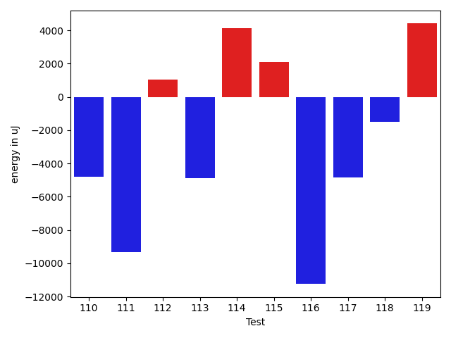

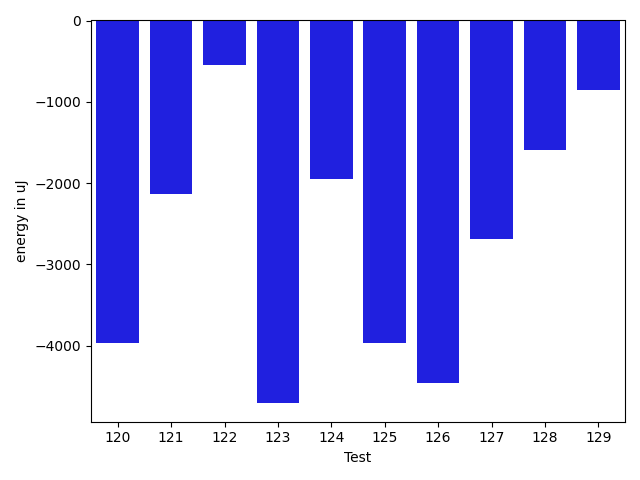

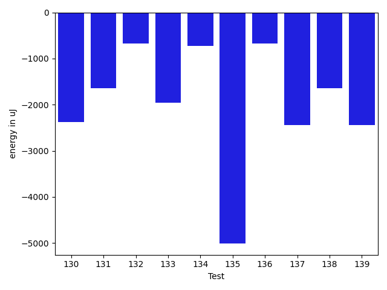

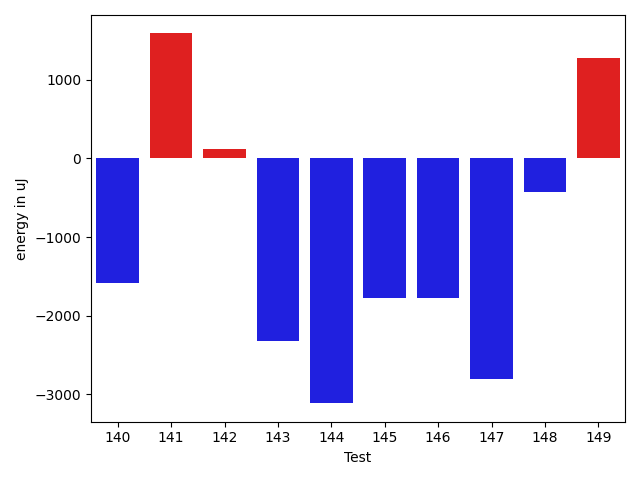

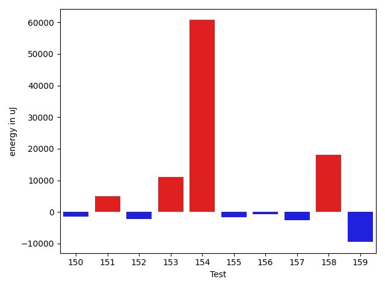

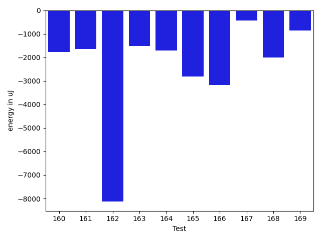

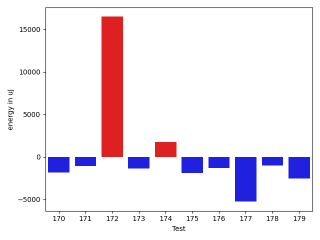

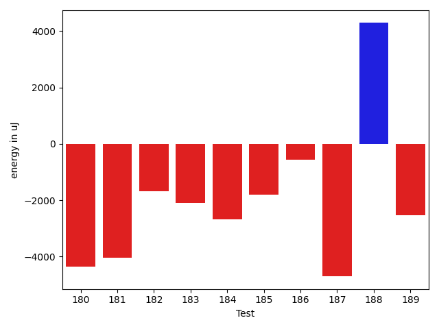

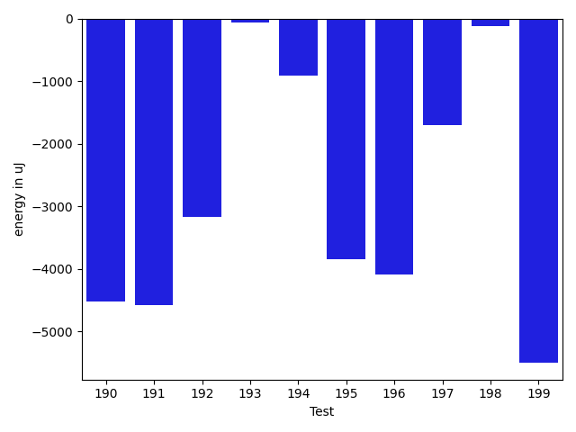

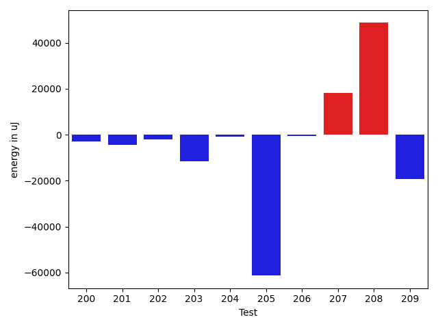

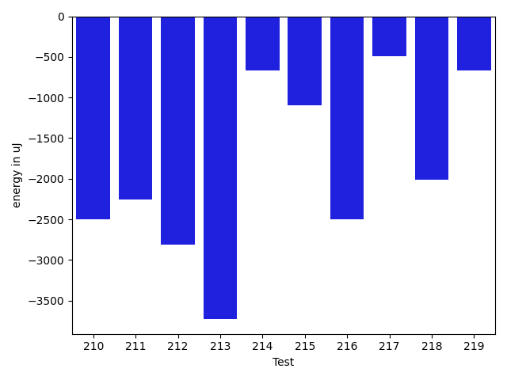

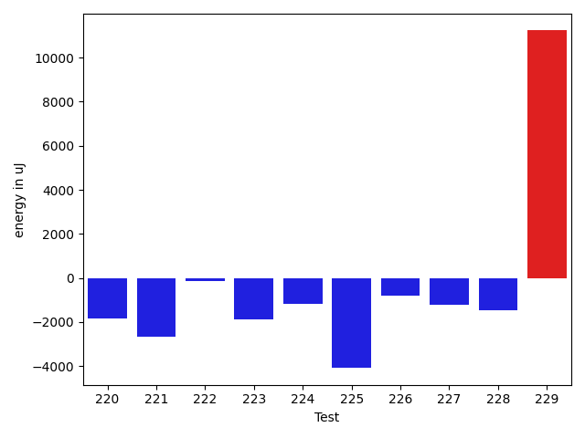

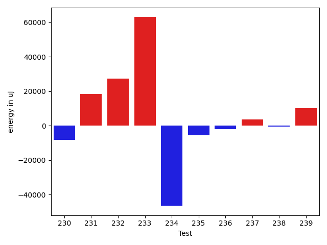

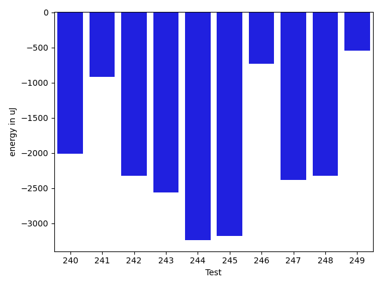

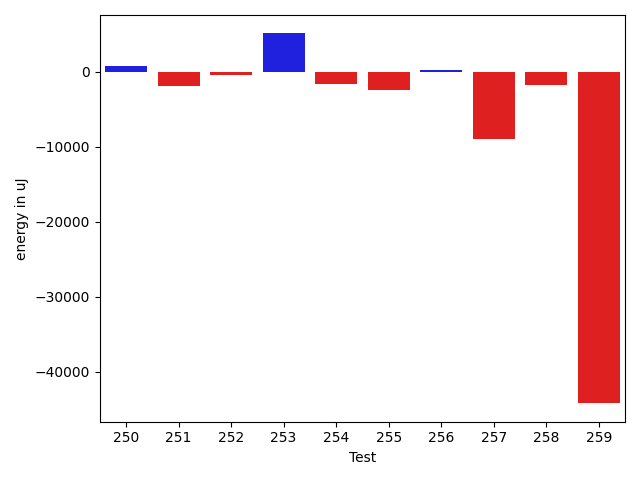

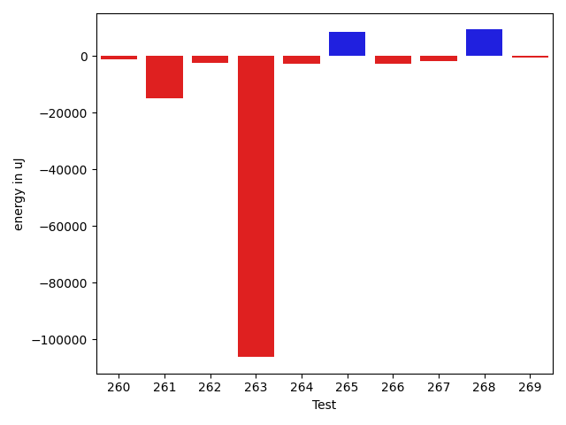

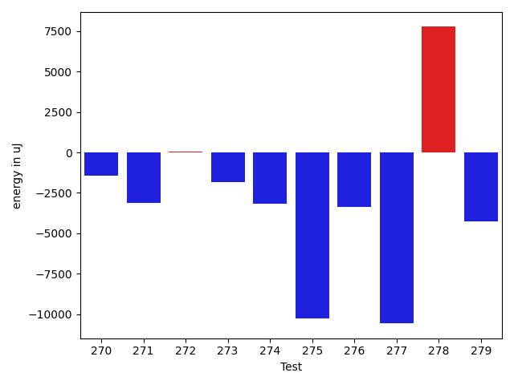

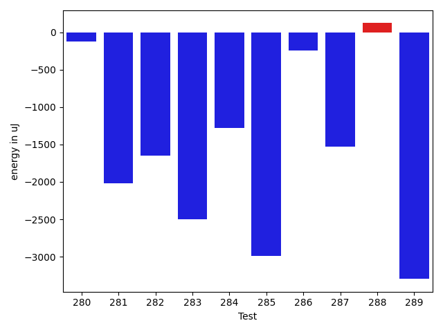

| ID | EnergyV1 | EnergyV2 | DeltaEnergy | σV1 | σV2 |
| --- | --- | --- | --- | --- | --- |
| 0 | 56120.79797979798 | 60981.36363636364 | 4860.565656565661 | 23503.4429775208 | 45402.26504861333 |
| 1 | 45091.28888888889 | 39237.586956521736 | -5853.701932367156 | 25598.011161131875 | 4165.364990406979 |
| 2 | 39270.0 | 37329.942307692305 | -1940.057692307695 | 5711.123287060086 | 6086.3465560644645 |
| 3 | 40579.15 | 48864.53333333333 | 8285.383333333331 | 3418.475336681545 | 40918.01726031646 |
| 4 | 42075.868686868685 | 39848.35051546392 | -2227.518171404765 | 10161.254305624132 | 8677.579276730521 |
| 5 | 40196.645833333336 | 37987.10294117647 | -2209.5428921568673 | 5621.856638341641 | 3716.5994385273666 |
| 6 | 38850.892857142855 | 38147.98148148148 | -702.9113756613733 | 3572.361597231942 | 4280.100515827052 |
| 7 | 135606.15151515152 | 122175.44444444444 | -13430.707070707082 | 23661.79813405226 | 23787.733552826063 |
| 8 | 39268.58620689655 | 36020.0625 | -3248.5237068965507 | 3132.6062468399673 | 3002.3038230821594 |
| 9 | 46584.63829787234 | 43403.25301204819 | -3181.3852858241517 | 19106.648311489873 | 20979.003019280324 |
| 10 | 40585.333333333336 | 41006.75 | 421.41666666666424 | 5535.016172672492 | 10636.695993201352 |
| 11 | 39473.851851851854 | 37726.21428571428 | -1747.6375661375714 | 3417.598054121288 | 5622.7351240753105 |
| 12 | 45011.32608695652 | 41320.717391304344 | -3690.608695652176 | 13357.672092088289 | 12753.832257255828 |
| 13 | 42130.153846153844 | 38082.0 | -4048.153846153844 | 10761.01338126275 | 4226.897624884 |
| 14 | 527120.4747474748 | 488808.9393939394 | -38311.53535353538 | 74125.08847564427 | 69734.10069263437 |
| 15 | 57516.66129032258 | 55306.137931034486 | -2210.5233592880977 | 31044.701337381415 | 29672.16421534422 |
| 16 | 39019.811320754714 | 36638.770833333336 | -2381.040487421378 | 3393.4736200069633 | 3962.3673281658234 |
| 17 | 38351.709677419356 | 36908.90625 | -1442.803427419356 | 4535.262237277365 | 4535.206778357624 |
| 18 | 48801.64179104478 | 43558.338983050846 | -5243.302807993932 | 37997.00708783364 | 27922.449037003782 |
| 19 | 39588.45238095238 | 36498.897959183676 | -3089.5544217687057 | 3758.1895666877954 | 3384.4183489953252 |
| 20 | 40329.51724137931 | 38098.41176470588 | -2231.1054766734305 | 3926.4381386441437 | 4378.771867286985 |
| 21 | 39527.13461538462 | 36738.22 | -2788.914615384616 | 3298.8724182481956 | 3543.159433556441 |
| 22 | 39387.22580645161 | 37859.45161290323 | -1527.7741935483864 | 3968.4675250527807 | 4769.780314402194 |
| 23 | 40674.94736842105 | 36318.95 | -4355.997368421056 | 4179.472007369807 | 3507.513271179455 |
| 24 | 39040.21212121212 | 38211.0 | -829.2121212121201 | 3301.9503947742837 | 4248.260349837331 |
| 25 | 38635.25 | 33747.333333333336 | -4887.916666666664 | 3553.131978152045 | 4373.960778160784 |
| 26 | 39879.72222222222 | 36165.61538461538 | -3714.106837606836 | 4487.756663109527 | 2997.998987490503 |
| 27 | 37257.86956521739 | 36525.65217391304 | -732.2173913043516 | 4052.929614642677 | 3055.3645282938246 |
| 28 | 38767.5 | 39048.0 | 280.5 | 3969.6583816074985 | 3566.564436870998 |
| 29 | 45138.666666666664 | 44247.88461538462 | -890.7820512820472 | 14221.22197242167 | 11329.570938059947 |
| 30 | 37222.619047619046 | 37804.27777777778 | 581.6587301587351 | 3860.0068033025473 | 3692.1552243394763 |
| 31 | 39635.5 | 37379.71428571428 | -2255.7857142857174 | 3245.231018142023 | 3112.778901527688 |
| 32 | 40251.95918367347 | 40529.82978723404 | 277.8706035605719 | 3460.9528118252297 | 7737.591219877233 |
| 33 | 45943.648148148146 | 40091.666666666664 | -5851.981481481482 | 12868.442337401026 | 7847.7370153081665 |
| 34 | 51071.39189189189 | 45802.12328767123 | -5269.268604220662 | 16745.79576831117 | 14151.272332501969 |
| 35 | 39737.58064516129 | 37763.793103448275 | -1973.7875417130126 | 2920.067561902807 | 4505.324974916638 |
| 36 | 40792.68253968254 | 38517.220338983054 | -2275.462200699483 | 6668.228097681647 | 3951.9938931015254 |
| 37 | 51407.8969072165 | 47955.298969072166 | -3452.597938144332 | 18309.943867827125 | 16210.012168355903 |
| 38 | 68669.06410256411 | 58908.74324324324 | -9760.32085932087 | 84433.18619421007 | 74531.93458403907 |
| 39 | 40038.88636363636 | 39074.954545454544 | -963.9318181818162 | 3586.35980433889 | 3796.0212241632053 |
| 40 | 40410.77777777778 | 40025.46 | -385.3177777777819 | 3675.9421300137296 | 4705.828999060634 |
| 41 | 56083.18032786885 | 52829.11111111111 | -3254.0692167577436 | 35732.84957988418 | 37629.936378361126 |
| 42 | 41016.51612903226 | 40121.66129032258 | -894.8548387096744 | 4928.623457439585 | 3859.653381326545 |
| 43 | 40761.26190476191 | 38832.76315789474 | -1928.498746867168 | 3206.0204976584128 | 3907.625900818542 |
| 44 | 40656.875 | 39527.47619047619 | -1129.3988095238092 | 4903.536936169136 | 3933.4843468070344 |
| 45 | 44306.48 | 40109.01851851852 | -4197.461481481485 | 16599.796805069633 | 11943.185079072937 |
| 46 | 74318.56521739131 | 52194.453125 | -22124.11209239131 | 101336.49648592972 | 51204.23662614796 |
| 47 | 40878.75925925926 | 40633.931818181816 | -244.82744107744657 | 3879.442428127399 | 4626.491756463419 |
| 48 | 46582.80952380953 | 43439.375 | -3143.4345238095266 | 13094.22540889521 | 11658.38418732952 |
| 49 | 63860.46464646464 | 58580.67676767677 | -5279.787878787873 | 32672.64503962166 | 25198.496199650563 |
| 50 | 45404.46590909091 | 46444.1797752809 | 1039.713866189988 | 12648.944520240038 | 15658.02751189263 |
| 51 | 105687.31313131313 | 111294.54545454546 | 5607.232323232325 | 94399.67656196159 | 99464.3868826672 |
| 52 | 64529.642857142855 | 57868.78350515464 | -6660.859351988212 | 24029.332716091227 | 24933.208552991015 |
| 53 | 90159.83838383839 | 88852.15151515152 | -1307.6868686868693 | 37419.62859565159 | 37393.41978935197 |
| 54 | 59367.25252525252 | 54793.43434343435 | -4573.8181818181765 | 22940.702715427993 | 21208.020751717624 |
| 55 | 74793.16161616161 | 73782.69696969698 | -1010.4646464646357 | 29900.368702401258 | 39088.18046274308 |
| 56 | 87983.45454545454 | 88209.20202020202 | 225.7474747474771 | 35829.522017259835 | 43443.56918736036 |
| 57 | 59372.73469387755 | 56710.17346938775 | -2662.5612244898 | 21529.700239413476 | 20666.74029075264 |
| 58 | 40577.44117647059 | 38010.42105263158 | -2567.0201238390073 | 3118.7520523739695 | 3672.9008371526706 |
| 59 | 40704.220338983054 | 38805.816326530614 | -1898.40401245244 | 3749.862700617802 | 4486.690460996242 |
| 60 | 245364.45454545456 | 209829.72727272726 | -35534.727272727294 | 114813.06397416987 | 67751.05462876175 |
| 61 | 119765.43434343435 | 110730.51515151515 | -9034.919191919194 | 28213.506454315622 | 38968.91886856915 |
| 62 | 105101.0808080808 | 94049.41414141415 | -11051.666666666657 | 26497.313801220283 | 28257.573790140843 |
| 63 | 320203.2727272727 | 273857.29292929295 | -46345.97979797976 | 155102.582885697 | 115092.35975039436 |
| 64 | 40536.26470588235 | 39821.65853658537 | -714.6061692969815 | 3021.81243148996 | 2703.2072785341143 |
| 65 | 52038.6282051282 | 45265.68918918919 | -6772.939015939017 | 20006.217137596013 | 15099.951858636052 |
| 66 | 61812.75257731959 | 57904.83157894737 | -3907.9209983722176 | 25669.088302651064 | 24997.46866664814 |
| 67 | 40880.03389830508 | 39018.546875 | -1861.4870233050824 | 7318.747051622332 | 4428.795536492144 |
| 68 | 42024.328571428574 | 40588.31746031746 | -1436.011111111111 | 8172.196193228126 | 8456.357942119686 |
| 69 | 40107.66071428572 | 40461.5 | 353.8392857142826 | 4181.361929002772 | 3898.732123790621 |
| 70 | 75691.54639175258 | 70144.23655913978 | -5547.309832612795 | 45630.82457418465 | 49503.60041460173 |
| 71 | 55266.21212121212 | 49719.48484848485 | -5546.727272727272 | 20920.506242437186 | 18323.001962463386 |
| 72 | 40233.84210526316 | 39509.91111111111 | -723.9309941520478 | 4476.725905694739 | 4121.950093084163 |
| 73 | 50235.522388059704 | 52868.55 | 2633.027611940299 | 19284.08583800922 | 21613.504020577042 |
| 74 | 39572.1 | 39144.17021276596 | -427.9297872340394 | 5110.550497744837 | 4925.898096401711 |
| 75 | 38705.08823529412 | 37727.48387096774 | -977.6043643263765 | 3630.338514175868 | 4513.896863564912 |
| 76 | 39999.35 | 38609.04761904762 | -1390.3023809523802 | 3708.9135238638282 | 3907.2742475223654 |
| 77 | 39988.565217391304 | 39978.0 | -10.565217391304031 | 3934.927774886444 | 3573.287999168273 |
| 78 | 39682.67346938775 | 39702.58139534884 | 19.90792596108804 | 4017.780940929473 | 3609.9596997850913 |
| 79 | 49382.356164383564 | 42298.17647058824 | -7084.179693795326 | 17046.32970608305 | 11512.027363921683 |
| 80 | 52565.730158730155 | 44877.737704918036 | -7687.9924538121195 | 56318.45479290531 | 40747.409570647396 |
| 81 | 40080.84375 | 38532.91176470588 | -1547.931985294119 | 4366.936069126263 | 3870.0029135697127 |
| 82 | 38746.392857142855 | 38268.88 | -477.5128571428577 | 4407.799575260117 | 4231.4248221609705 |
| 83 | 39900.934782608696 | 38181.969696969696 | -1718.9650856389999 | 4018.099791011828 | 4093.462907470801 |
| 84 | 40605.166666666664 | 40001.46153846154 | -603.7051282051252 | 2461.9696101112036 | 4181.846530226434 |
| 85 | 44451.849315068495 | 39557.31746031746 | -4894.531854751032 | 10715.100835213869 | 4015.1963790966697 |
| 86 | 41751.55882352941 | 38285.26666666667 | -3466.2921568627426 | 2579.1819860428673 | 4208.888570104412 |
| 87 | 41508.916666666664 | 39990.583333333336 | -1518.3333333333285 | 3566.711825064587 | 3126.212870186901 |
| 88 | 42690.46511627907 | 41062.604166666664 | -1627.8609496124045 | 6513.637037637686 | 8154.152037304839 |
| 89 | 59915.74157303371 | 59727.530120481926 | -188.2114525517827 | 46335.33397474537 | 62879.30343170415 |
| 90 | 41511.02380952381 | 38879.36842105263 | -2631.6553884711757 | 3078.200397945088 | 3293.755450777893 |
| 91 | 41149.75 | 37861.48387096774 | -3288.2661290322576 | 2806.8626769936573 | 3705.771208498961 |
| 92 | 49944.05714285714 | 49346.730769230766 | -597.3263736263762 | 50771.587444127996 | 46391.22909688666 |
| 93 | 47291.24193548387 | 44134.60256410256 | -3156.6393713813086 | 13306.758854644537 | 12823.40274788063 |
| 94 | 42631.53731343283 | 42276.958333333336 | -354.57898009949713 | 8742.21104128691 | 10667.550928760935 |
| 95 | 103077.23076923077 | 86863.2 | -16214.030769230769 | 151627.5789580851 | 112133.3816102948 |
| 96 | 183130.9090909091 | 182344.74747474748 | -786.1616161616112 | 110121.22797402364 | 124485.418237578 |
| 97 | 43017.4 | 41165.62 | -1851.7799999999988 | 9188.297991764011 | 6813.029590101602 |
| 98 | 41086.61111111111 | 39539.94117647059 | -1546.6699346405221 | 4578.515416905299 | 3896.6012662206454 |
| 99 | 40527.28888888889 | 39051.2037037037 | -1476.0851851851912 | 3938.5684462037852 | 4297.816363636519 |
| 100 | 41252.27272727273 | 39473.97435897436 | -1778.2983682983686 | 4155.715438334019 | 3890.5596228344475 |
| 101 | 87176.45454545454 | 88064.63917525773 | 888.1846298031887 | 46058.62135558583 | 42868.70713860853 |
| 102 | 49806.82142857143 | 38926.545454545456 | -10880.275974025972 | 41957.28739789479 | 3987.2792355789857 |
| 103 | 42513.96551724138 | 44637.73469387755 | 2123.769176636175 | 7123.6830457806 | 11710.541280951875 |
| 104 | 43609.968253968254 | 43052.228070175435 | -557.7401837928192 | 10634.035202941774 | 12018.620535633985 |
| 105 | 42790.645833333336 | 39844.65909090909 | -2945.9867424242475 | 6208.3280777033115 | 3757.8098973591095 |
| 106 | 51285.82795698925 | 51264.73626373626 | -21.09169325298717 | 21723.18366517777 | 23380.569109550932 |
| 107 | 72285.05357142857 | 57823.897959183676 | -14461.15561224489 | 102695.28330287542 | 37273.43811384084 |
| 108 | 40245.333333333336 | 39034.59090909091 | -1210.742424242424 | 3455.4363149946967 | 4306.534967181124 |
| 109 | 39247.96 | 39722.72727272727 | 474.76727272727294 | 3582.4958839334345 | 4129.155869950552 |
| 110 | 49703.57692307692 | 44910.40740740741 | -4793.169515669513 | 41653.476491878406 | 29819.221002641723 |
| 111 | 47670.75 | 38363.5 | -9307.25 | 31827.245841482523 | 4055.4163103188307 |
| 112 | 40339.32692307692 | 41403.27450980392 | 1063.9475867270012 | 3486.6474514658935 | 11168.33412732384 |
| 113 | 84756.0808080808 | 79864.63917525773 | -4891.441632823073 | 24047.259891648784 | 28618.711823144615 |
| 114 | 46123.692307692305 | 50265.22619047619 | 4141.533882783886 | 13339.935159481533 | 30877.300919604197 |
| 115 | 45136.53086419753 | 47221.82894736842 | 2085.298083170892 | 19749.049402399858 | 51449.484068148195 |
| 116 | 50418.852459016394 | 39178.63461538462 | -11240.217843631777 | 42690.74571265793 | 3962.1245759006147 |
| 117 | 46898.67796610169 | 42073.03636363636 | -4825.64160246533 | 16048.751450925467 | 12502.412395524656 |
| 118 | 41348.02127659575 | 39873.634146341465 | -1474.387130254283 | 7280.255786625648 | 7654.909069750673 |
| 119 | 90342.90909090909 | 94754.06060606061 | 4411.15151515152 | 34711.695585290516 | 33356.534347760055 |
| 120 | 41050.625 | 38279.97435897436 | -2770.6506410256407 | 3438.6405212489135 | 3807.559010012472 |
| 121 | 47395.79069767442 | 44104.10256410256 | -3291.688133571857 | 13249.016547193996 | 13211.803272355723 |
| 122 | 40247.458333333336 | 38314.75 | -1932.7083333333358 | 3739.313205424746 | 5636.733095286666 |
| 123 | 40750.05882352941 | 37517.5 | -3232.5588235294126 | 3329.1840807619237 | 4579.994568774072 |
| 124 | 40731.882352941175 | 39184.491228070176 | -1547.3911248709992 | 2684.2703733304434 | 4100.599353380015 |
| 125 | 61490.62626262626 | 56899.38383838384 | -4591.242424242424 | 20653.431651949144 | 24068.655096109884 |
| 126 | 41432.24137931035 | 38683.107142857145 | -2749.134236453203 | 4171.107755411417 | 3718.671943615717 |
| 127 | 48652.3 | 44421.068181818184 | -4231.231818181819 | 20817.265293260785 | 15662.735541866312 |
| 128 | 41229.1 | 39831.81967213115 | -1397.2803278688516 | 3965.854496826629 | 3859.019095225874 |
| 129 | 40255.51612903226 | 40063.88888888889 | -191.6272401433671 | 3608.5018593724867 | 4787.131672966703 |
| 130 | 40681.61224489796 | 39798.22222222222 | -883.3900226757396 | 3738.129237544465 | 7441.064022298869 |
| 131 | 41728.26470588235 | 39140.90476190476 | -2587.359943977586 | 8509.474433583613 | 6800.67220000215 |
| 132 | 40568.75 | 38991.90625 | -1576.84375 | 2968.325942646076 | 3855.7300164768976 |
| 133 | 40237.15 | 38511.0 | -1726.1500000000015 | 3183.683656945206 | 4845.605702148046 |
| 134 | 83046.38823529411 | 138294.38095238095 | 55247.99271708683 | 183407.05780480208 | 394367.55688283464 |
| 135 | 77286.53333333334 | 70617.3870967742 | -6669.146236559143 | 50500.70425167906 | 43602.05853432612 |
| 136 | 85987.64705882352 | 67016.35714285714 | -18971.28991596638 | 80497.4831801965 | 52454.534285290676 |
| 137 | 40721.95238095238 | 38793.17647058824 | -1928.7759103641438 | 4950.078358939098 | 4028.593116494876 |
| 138 | 42370.5 | 38833.625 | -3536.875 | 2838.476043583951 | 3329.9754104760295 |
| 139 | 55663.88888888889 | 39499.153846153844 | -16164.735042735047 | 39119.74289123771 | 6798.00446789807 |
| 140 | 40427.545454545456 | 39937.333333333336 | -490.2121212121201 | 3730.0086854306956 | 4384.981880109528 |
| 141 | 39260.16 | 39065.28571428572 | -194.8742857142861 | 3297.704397668172 | 4348.06925014789 |
| 142 | 40281.06896551724 | 45959.36363636364 | 5678.294670846401 | 3865.908332672034 | 30116.5765704257 |
| 143 | 42175.25 | 40921.692307692305 | -1253.557692307695 | 2698.75539601128 | 3187.295583420947 |
| 144 | 99671.40404040404 | 90405.73737373737 | -9265.666666666672 | 47227.37400910988 | 31261.79781810247 |
| 145 | 41724.47692307692 | 40005.25 | -1719.2269230769234 | 6534.825711542482 | 7177.176491316067 |
| 146 | 41956.89743589744 | 40455.608695652176 | -1501.2887402452616 | 7257.328201928464 | 6153.4761808062985 |
| 147 | 41999.510204081635 | 39956.20338983051 | -2043.3068142511256 | 4085.5611765639856 | 5572.776850282035 |
| 148 | 40188.34482758621 | 39736.208333333336 | -452.1364942528744 | 3195.719381274357 | 3707.5875015429133 |
| 149 | 39639.88461538462 | 39842.818181818184 | 202.93356643356674 | 3450.8225923117907 | 3916.9609234753743 |
| 150 | 40896.086956521736 | 39347.256410256414 | -1548.8305462653225 | 3447.0532836416455 | 4534.267140162382 |
| 151 | 42572.95161290323 | 47464.50943396227 | 4891.557821059039 | 6083.11300936909 | 13572.616668536803 |
| 152 | 40542.85106382979 | 38393.11666666667 | -2149.73439716312 | 4170.614633915069 | 4305.819457786817 |
| 153 | 71352.14814814815 | 82354.0 | 11001.851851851854 | 84876.63152098122 | 78035.9247974931 |
| 154 | 115070.55555555556 | 175789.0 | 60718.44444444444 | 314201.38730426686 | 462171.5001363856 |
| 155 | 39255.2 | 37642.77777777778 | -1612.422222222216 | 4220.401668088003 | 3455.580964536808 |
| 156 | 39888.65853658537 | 39129.8125 | -758.846036585368 | 4149.021604384176 | 3335.8719103622293 |
| 157 | 40894.61538461538 | 38237.96721311475 | -2656.6481715006303 | 3395.260957195429 | 6206.494100159805 |
| 158 | 42098.34482758621 | 60147.01960784314 | 18048.67478025693 | 6455.399179814453 | 130569.74179003823 |
| 159 | 57211.0 | 47713.55714285714 | -9497.442857142858 | 28935.042551979226 | 18187.47813715777 |
| 160 | 40054.490196078434 | 38614.34 | -1440.1501960784371 | 3549.1043022068393 | 4633.503139569455 |
| 161 | 45180.12765957447 | 47320.24074074074 | 2140.113081166266 | 21693.73045288492 | 24693.804794316762 |
| 162 | 96759.1294117647 | 92035.5 | -4723.629411764705 | 94070.5717087897 | 121806.41689956065 |
| 163 | 40462.444444444445 | 41934.25 | 1471.8055555555547 | 5835.191088607499 | 17706.034875401343 |
| 164 | 44906.76811594203 | 46667.42857142857 | 1760.6604554865407 | 12655.273699529294 | 20507.87245465327 |
| 165 | 41279.22727272727 | 39262.045454545456 | -2017.1818181818162 | 3000.324890465549 | 4420.754198069833 |
| 166 | 40851.4375 | 38730.22222222222 | -2121.215277777781 | 3604.400088238506 | 4539.786920544908 |
| 167 | 62817.454545454544 | 64486.32075471698 | 1668.8662092624363 | 41052.00694321918 | 39049.766829818 |
| 168 | 52429.0 | 38574.13333333333 | -13854.866666666669 | 42934.167372851196 | 4350.052258179077 |
| 169 | 39358.307692307695 | 38034.07692307692 | -1324.2307692307731 | 4669.925273403376 | 4095.364893323604 |
| 170 | 40623.114285714284 | 38771.470588235294 | -1851.6436974789904 | 3871.557942382432 | 3629.219525846019 |
| 171 | 41098.69696969697 | 40017.24444444444 | -1081.4525252525273 | 3888.612461774715 | 6699.362855793099 |
| 172 | 39664.53333333333 | 56163.181818181816 | 16498.648484848483 | 4173.788364969594 | 54296.73987838945 |
| 173 | 39794.88888888889 | 38448.1875 | -1346.7013888888905 | 2924.9457143849295 | 4392.714625074539 |
| 174 | 61787.76190476191 | 63551.0 | 1763.2380952380918 | 59717.85626786201 | 55346.404263410725 |
| 175 | 40693.1282051282 | 38809.18518518518 | -1883.9430199430208 | 4276.219449284056 | 4521.654769505887 |
| 176 | 39676.11111111111 | 38382.357142857145 | -1293.7539682539646 | 4248.196661707554 | 3536.9357320212903 |
| 177 | 41983.8 | 36712.5 | -5271.300000000003 | 3777.1381441509393 | 4017.2329718352157 |
| 178 | 39411.0 | 38381.61538461538 | -1029.384615384617 | 4043.021960295117 | 4060.734975885363 |
| 179 | 40683.44 | 38121.73529411765 | -2561.704705882352 | 4328.6138296688005 | 4417.948654328583 |
| 180 | 41054.57142857143 | 36691.230769230766 | -4363.340659340662 | 3145.7627218276994 | 4475.449374151351 |
| 181 | 41522.15 | 37487.53333333333 | -4034.6166666666686 | 2578.4382147920473 | 3615.0997933052354 |
| 182 | 40749.882352941175 | 39072.38888888889 | -1677.4934640522843 | 3887.89182072863 | 4263.414400309385 |
| 183 | 44039.897959183676 | 41950.066666666666 | -2089.8312925170103 | 10552.376523594587 | 10945.135248948629 |
| 184 | 40230.642857142855 | 37547.72727272727 | -2682.915584415583 | 2814.051720692904 | 5137.610093328841 |
| 185 | 40264.125 | 38463.27272727273 | -1800.852272727272 | 3032.28752089491 | 2252.814929690856 |
| 186 | 44042.72 | 43482.68421052631 | -560.035789473688 | 5985.039351716912 | 13049.935128101037 |
| 187 | 42110.13333333333 | 37410.0 | -4700.133333333331 | 3744.390753588033 | 3644.719487540453 |
| 188 | 40885.391304347824 | 45174.181818181816 | 4288.790513833992 | 3980.665989058379 | 34045.475015893826 |
| 189 | 40000.181818181816 | 37458.5 | -2541.681818181816 | 4527.711820619606 | 3828.9532983716467 |
| 190 | 41134.77272727273 | 38032.458333333336 | -3102.314393939392 | 4445.253402448894 | 3694.3495478361583 |
| 191 | 40881.2 | 36472.125 | -4409.074999999997 | 3157.0656407493334 | 3685.884881459946 |
| 192 | 41273.11111111111 | 37381.454545454544 | -3891.6565656565654 | 3260.216947261313 | 3680.0179190185363 |
| 193 | 38495.57142857143 | 37637.34782608696 | -858.2236024844678 | 2983.363866373606 | 3138.128736360816 |
| 194 | 40590.62962962963 | 38517.28571428572 | -2073.3439153439103 | 3256.364470775575 | 3986.6070147176433 |
| 195 | 41936.5 | 38681.0 | -3255.5 | 2625.8630399442873 | 3890.0080591176156 |
| 196 | 41618.77777777778 | 37076.27272727273 | -4542.505050505053 | 3497.323636337356 | 5543.1241288138235 |
| 197 | 42073.416666666664 | 40028.833333333336 | -2044.5833333333285 | 3768.1365964787187 | 3100.6469262254145 |
| 198 | 40104.2 | 38297.53333333333 | -1806.6666666666642 | 3321.687105473161 | 3467.2324192198143 |
| 199 | 49770.666666666664 | 36245.692307692305 | -13524.97435897436 | 39806.321834603106 | 2889.3005377830004 |
| 200 | 40944.055555555555 | 37907.52 | -3036.535555555558 | 3646.3882049718763 | 3601.8634301705556 |
| 201 | 41332.3125 | 36773.71428571428 | -4558.598214285717 | 3263.8996943600687 | 3693.3502682634407 |
| 202 | 41391.92592592593 | 39241.11111111111 | -2150.8148148148175 | 3090.1557904623264 | 4226.617532428513 |
| 203 | 151552.38383838383 | 140004.45454545456 | -11547.929292929271 | 179224.50877362056 | 197891.93349750072 |
| 204 | 40783.378787878784 | 39973.333333333336 | -810.0454545454486 | 3675.317730091618 | 7398.910737467381 |
| 205 | 177349.24242424243 | 116073.18181818182 | -61276.06060606061 | 402157.8919942946 | 169442.27408798653 |
| 206 | 58731.3085106383 | 58090.40425531915 | -640.9042553191539 | 24772.908606587825 | 24390.377439578264 |
| 207 | 91475.90196078431 | 109657.58536585367 | 18181.683405069358 | 152881.41391188226 | 125447.76732947474 |
| 208 | 56056.2 | 104715.24390243902 | 48659.04390243902 | 41765.463158691295 | 233981.346338818 |
| 209 | 226258.0 | 206877.80808080808 | -19380.191919191915 | 183900.14566661447 | 147236.46436113995 |
| 210 | 59306.61363636364 | 56158.81081081081 | -3147.802825552826 | 44299.108127804386 | 42938.19816071154 |
| 211 | 43013.23809523809 | 41002.93103448276 | -2010.307060755331 | 7950.649552608266 | 7348.386134951484 |
| 212 | 44014.41891891892 | 39133.986666666664 | -4880.432252252256 | 9868.651157876557 | 4207.087206110924 |
| 213 | 40773.055555555555 | 37866.7037037037 | -2906.351851851854 | 3041.963373149034 | 4322.576716238135 |
| 214 | 49375.75 | 47668.47222222222 | -1707.277777777781 | 18517.303759005776 | 19312.561156301745 |
| 215 | 39823.0 | 38938.142857142855 | -884.8571428571449 | 3327.9629019751824 | 3026.7963109801867 |
| 216 | 45488.41975308642 | 42774.98765432099 | -2713.4320987654282 | 15293.812244159719 | 14240.370862744048 |
| 217 | 39744.529411764706 | 40072.09090909091 | 327.5614973262054 | 4650.206638263156 | 5069.234467120714 |
| 218 | 41941.291666666664 | 39492.27272727273 | -2449.0189393939363 | 3363.815622166375 | 4131.582859585395 |
| 219 | 45790.333333333336 | 47061.903225806454 | 1271.5698924731187 | 14570.867734281115 | 13809.82394915894 |
| 220 | 40647.10344827586 | 38743.666666666664 | -1903.436781609198 | 3966.0123319128315 | 4317.2879475687305 |
| 221 | 39510.19047619047 | 37493.9 | -2016.290476190472 | 3673.2119021374924 | 3860.402918090286 |
| 222 | 58885.78571428572 | 47690.5 | -11195.285714285717 | 62080.62547224786 | 30100.001499169397 |
| 223 | 39618.38888888889 | 39419.38461538462 | -199.00427350427344 | 4011.7118144376677 | 3605.34397246134 |
| 224 | 40583.61538461538 | 38164.28571428572 | -2419.3296703296655 | 3596.788643273149 | 5021.248285729235 |
| 225 | 55032.48275862069 | 57852.46428571428 | 2819.981527093594 | 37822.40570552264 | 53470.703927132 |
| 226 | 40750.0 | 39750.833333333336 | -999.1666666666642 | 3758.743034579512 | 3843.436096486811 |
| 227 | 40735.75 | 38964.666666666664 | -1771.0833333333358 | 3587.612939569522 | 3352.5812078987074 |
| 228 | 61475.925531914894 | 59987.768421052635 | -1488.1571108622593 | 36843.982934727 | 47776.11278418772 |
| 229 | 373002.7878787879 | 377558.202020202 | 4555.414141414105 | 126035.5570590991 | 114235.74431053268 |
| 230 | 48432.31034482759 | 40262.53333333333 | -8169.777011494254 | 15368.163054259503 | 4748.194082900244 |
| 231 | 63275.32786885246 | 81706.75 | 18431.42213114754 | 57580.68873563038 | 112500.53011791766 |
| 232 | 40885.333333333336 | 68302.61538461539 | 27417.282051282054 | 3240.4565247645105 | 68154.58239183862 |
| 233 | 49274.91176470588 | 112334.92857142857 | 63060.016806722684 | 18005.38775799466 | 145647.3021198148 |
| 234 | 199749.66666666666 | 153293.46464646465 | -46456.20202020201 | 415206.89799129736 | 310866.7272190855 |
| 235 | 47993.35135135135 | 42358.354430379746 | -5634.996920971607 | 14359.347227345372 | 9750.963852440143 |
| 236 | 44645.066666666666 | 42569.046875 | -2076.0197916666657 | 12166.873130302989 | 11336.110670703058 |
| 237 | 45050.179487179485 | 48821.73417721519 | 3771.5546900357076 | 12152.635475213816 | 17699.24056134403 |
| 238 | 79202.44776119402 | 78646.38596491228 | -556.0617962817487 | 58250.964728231396 | 53767.04815912594 |
| 239 | 56610.854838709674 | 66784.51666666666 | 10173.661827956988 | 51071.3421442438 | 73110.46822343378 |
| 240 | 66227.86842105263 | 67595.51351351352 | 1367.6450924608944 | 71102.95659119247 | 74706.50929221761 |
| 241 | 39729.95918367347 | 49126.93877551021 | 9396.979591836738 | 3820.348317056986 | 68496.8639193954 |
| 242 | 126838.07575757576 | 159988.7894736842 | 33150.713716108454 | 340654.8563487822 | 458750.1711479861 |
| 243 | 40570.857142857145 | 39164.58139534884 | -1406.2757475083054 | 3949.299347572262 | 4209.90955121619 |
| 244 | 41638.51724137931 | 39511.969696969696 | -2126.5475444096155 | 3989.591333498134 | 3961.7938199518917 |
| 245 | 42539.87804878049 | 38044.470588235294 | -4495.407460545197 | 7001.272655025367 | 4401.378756141909 |
| 246 | 39274.03125 | 39304.709677419356 | 30.678427419356012 | 3819.086625788087 | 4100.6514131887625 |
| 247 | 52802.567164179105 | 51739.794117647056 | -1062.7730465320492 | 27705.027126252455 | 34537.53401631623 |
| 248 | 55186.31884057971 | 55020.45714285714 | -165.86169772256835 | 60153.08430597328 | 63538.847471602676 |
| 249 | 39127.857142857145 | 38499.0 | -628.8571428571449 | 3834.435306854059 | 3866.391261191162 |
| 250 | 39053.642857142855 | 39766.954545454544 | 713.3116883116891 | 4516.905729860762 | 3199.4250261467114 |
| 251 | 41254.89473684211 | 39371.54347826087 | -1883.351258581235 | 4083.3007468125184 | 3782.5051723090114 |
| 252 | 52068.41414141414 | 51684.836734693876 | -383.57740672026557 | 20813.52767803297 | 20338.901219340223 |
| 253 | 41242.793103448275 | 46340.36 | 5097.566896551725 | 4062.4919172699256 | 31935.06754760979 |
| 254 | 41407.5 | 39726.15625 | -1681.34375 | 6467.617319265382 | 3825.4780674231997 |
| 255 | 41858.065217391304 | 39356.85964912281 | -2501.205568268495 | 6021.507901579982 | 3595.4908819319808 |
| 256 | 40103.57575757576 | 40324.32432432433 | 220.7485667485671 | 3541.0178730972434 | 2946.9793243348304 |
| 257 | 62035.25 | 53025.52272727273 | -9009.727272727272 | 49636.45483713166 | 44321.45345217279 |
| 258 | 39933.269230769234 | 38132.47368421053 | -1800.7955465587074 | 4716.618684198478 | 3631.210018255058 |
| 259 | 138790.27777777778 | 94576.0 | -44214.27777777778 | 275200.32731485006 | 187485.90040730653 |
| 260 | 39995.57894736842 | 38904.294117647056 | -1091.284829721364 | 4096.629665003705 | 4858.388231462412 |
| 261 | 68927.04494382022 | 53819.84269662921 | -15107.20224719101 | 49424.68697482846 | 41868.24758582379 |
| 262 | 45209.46031746032 | 42820.61111111111 | -2388.8492063492085 | 15411.789593381018 | 16884.04630875469 |
| 263 | 147595.10169491524 | 41395.09756097561 | -106200.00413393963 | 395428.5786057441 | 9381.38984140066 |
| 264 | 40346.09375 | 37557.9 | -2788.1937499999985 | 3951.6244314788996 | 4063.916791717074 |
| 265 | 41390.1724137931 | 49974.875 | 8584.702586206899 | 6012.610971484137 | 32326.90563770951 |
| 266 | 51074.305555555555 | 48375.13043478261 | -2699.1751207729467 | 30926.380087160607 | 21504.20809840503 |
| 267 | 43297.28846153846 | 41377.17910447761 | -1920.10935706085 | 10001.383274205582 | 8308.914249032321 |
| 268 | 56663.82474226804 | 65908.55555555556 | 9244.730813287519 | 48883.801245889576 | 72404.35777236568 |
| 269 | 40621.47368421053 | 40042.29090909091 | -579.1827751196179 | 3829.783119255652 | 5323.6767461210575 |
| 270 | 42034.57627118644 | 40615.39682539683 | -1419.1794457896103 | 6554.360598437668 | 6991.09690405552 |
| 271 | 43219.53968253968 | 40078.56140350877 | -3140.978279030911 | 8416.107496419138 | 7915.526853535184 |
| 272 | 184241.30303030304 | 184289.38383838383 | 48.08080808079103 | 45193.263170175924 | 50030.705111296156 |
| 273 | 55191.06896551724 | 53365.10843373494 | -1825.9605317823007 | 36015.55083341535 | 36962.338262501944 |
| 274 | 50089.425287356324 | 46893.24096385542 | -3196.1843235009 | 16143.195377001732 | 17108.017188166814 |
| 275 | 58172.395604395606 | 47878.729166666664 | -10293.666437728942 | 24120.077144318857 | 18728.833571460946 |
| 276 | 48445.31460674157 | 45092.3734939759 | -3352.9411127656713 | 16259.098634852939 | 14601.345887553385 |
| 277 | 65300.04878048781 | 54717.86111111111 | -10582.187669376697 | 79197.84217033091 | 60203.361592722074 |
| 278 | 87247.45454545454 | 95018.63953488372 | 7771.184989429181 | 93912.10260396653 | 105954.62357756308 |
| 279 | 48821.933333333334 | 44541.333333333336 | -4280.5999999999985 | 37546.032530688986 | 25848.68836818525 |
| 280 | 47463.230769230766 | 47009.5 | -453.7307692307659 | 19294.603157308717 | 21421.99232406624 |
| 281 | 41596.3870967742 | 40535.724137931036 | -1060.6629588431606 | 3117.810446320999 | 7032.093178821244 |
| 282 | 41707.78947368421 | 40390.27027027027 | -1317.51920341394 | 6092.265735979015 | 8027.009162142283 |
| 283 | 139058.0 | 144960.0 | 5902.0 | 227020.45222219895 | 246624.8992983048 |
| 284 | 41996.65853658537 | 40540.7962962963 | -1455.8622402890687 | 6134.935448443893 | 6893.9866050317105 |
| 285 | 99917.5 | 67607.10169491525 | -32310.398305084746 | 270767.989154988 | 208401.07247883503 |
| 286 | 40617.434782608696 | 43613.51351351351 | 2996.0787309048173 | 4018.778246379461 | 11911.681962205685 |
| 287 | 47535.53571428572 | 40194.51612903226 | -7341.01958525346 | 39566.55946131616 | 7038.536600426704 |
| 288 | 77488.0 | 57776.260869565216 | -19711.739130434784 | 77539.86610153179 | 51268.29006927771 |
| 289 | 56130.28571428572 | 57276.95238095238 | 1146.6666666666642 | 27347.630509603496 | 34063.45104636653 |

## Delta Duration per test method

| ID | DurationV1 | DurationsV2 | DeltaDuration |
| --- | --- | --- | --- |
| 0 | 1524278.6363636365 | 1720044.7575757576 | 195766.1212121211 |
| 1 | 777378.088888889 | 707186.6521739131 | -70191.43671497586 |
| 2 | 813925.7272727273 | 806452.25 | -7473.477272727294 |
| 3 | 422247.0 | 833152.9333333333 | 410905.93333333335 |
| 4 | 1257940.7474747475 | 1265713.5051546392 | 7772.757679891773 |
| 5 | 892803.4166666666 | 889011.2352941176 | -3792.1813725490356 |
| 6 | 801942.75 | 817375.9814814815 | 15433.23148148146 |
| 7 | 3606360.1717171716 | 3542107.97979798 | -64252.19191919174 |
| 8 | 503360.8275862069 | 466235.3125 | -37125.5150862069 |
| 9 | 1278362.5106382978 | 1302997.3855421687 | 24634.87490387098 |
| 10 | 1087963.349206349 | 1097057.2857142857 | 9093.936507936567 |
| 11 | 785009.4074074074 | 873389.5714285715 | 88380.16402116406 |
| 12 | 1274898.1195652173 | 1263555.4891304348 | -11342.630434782477 |
| 13 | 1026364.1384615385 | 942820.8125 | -83543.32596153847 |
| 14 | 13741497.909090908 | 13504320.323232323 | -237177.5858585853 |
| 15 | 1464122.8387096773 | 1402069.603448276 | -62053.235261401394 |
| 16 | 732959.1886792453 | 723185.6458333334 | -9773.542845911928 |
| 17 | 571020.6451612903 | 747000.5 | 175979.8548387097 |
| 18 | 1281907.8358208956 | 1131534.3898305085 | -150373.44599038712 |
| 19 | 709934.5714285715 | 741251.918367347 | 31317.346938775503 |
| 20 | 487428.5172413793 | 508107.23529411765 | 20678.718052738346 |
| 21 | 890363.6153846154 | 741697.66 | -148665.95538461534 |
| 22 | 716056.4516129033 | 560501.4838709678 | -155554.9677419355 |
| 23 | 481973.2631578947 | 439982.9 | -41990.363157894695 |
| 24 | 544876.9696969697 | 470185.35 | -74691.61969696975 |
| 25 | 338405.75 | 328851.5 | -9554.25 |
| 26 | 365463.1666666667 | 361503.6153846154 | -3959.5512820513104 |
| 27 | 759760.4347826086 | 453363.7826086957 | -306396.65217391297 |
| 28 | 490238.7916666667 | 435412.9411764706 | -54825.850490196084 |
| 29 | 977363.1388888889 | 1118596.0384615385 | 141232.89957264962 |
| 30 | 527686.4285714285 | 428300.22222222225 | -99386.20634920627 |
| 31 | 385590.6666666667 | 418246.5714285714 | 32655.904761904734 |
| 32 | 744863.2040816327 | 702571.7872340425 | -42291.416847590124 |
| 33 | 1026803.9444444445 | 856022.8627450981 | -170781.08169934643 |
| 34 | 1374512.5405405406 | 1321198.3424657534 | -53314.19807478716 |
| 35 | 728938.5161290322 | 577414.6551724138 | -151523.86095661845 |
| 36 | 893930.3015873015 | 828878.8813559322 | -65051.420231369324 |
| 37 | 1476506.1237113401 | 1410595.5979381443 | -65910.52577319578 |
| 38 | 1882069.9743589743 | 1675343.1621621621 | -206726.81219681213 |
| 39 | 731356.2045454546 | 693952.4545454546 | -37403.75 |
| 40 | 805049.4074074074 | 755334.02 | -49715.3874074074 |
| 41 | 1384005.7049180327 | 1229070.462962963 | -154935.24195506983 |
| 42 | 990645.3548387097 | 940986.5 | -49658.854838709696 |
| 43 | 687062.5952380953 | 674550.3947368421 | -12512.20050125313 |
| 44 | 552606.6875 | 578268.2380952381 | 25661.550595238106 |
| 45 | 974715.92 | 800034.8888888889 | -174681.03111111117 |
| 46 | 1955593.1304347827 | 1228904.84375 | -726688.2866847827 |
| 47 | 738941.1851851852 | 752876.7727272727 | 13935.587542087538 |
| 48 | 1238913.4166666667 | 1255517.4 | 16603.983333333163 |
| 49 | 1782295.98989899 | 1796603.8181818181 | 14307.82828282821 |
| 50 | 1280248.0340909092 | 1287138.0112359552 | 6889.977145045996 |
| 51 | 3007872.909090909 | 3176209.1515151514 | 168336.2424242422 |
| 52 | 1740969.3163265307 | 1797799.175257732 | 56829.85893120128 |
| 53 | 2505863.383838384 | 2588872.616161616 | 83009.2323232321 |
| 54 | 1705707.5757575757 | 1665368.4444444445 | -40339.13131313119 |
| 55 | 2132929.2525252528 | 2223315.8383838385 | 90386.58585858578 |
| 56 | 2446261.242424242 | 2546097.1515151514 | 99835.90909090918 |
| 57 | 1658846.693877551 | 1654075.5204081633 | -4771.173469387693 |
| 58 | 624672.2352941176 | 640854.7631578947 | 16182.527863777126 |
| 59 | 868004.6440677966 | 916307.224489796 | 48302.58042199933 |
| 60 | 6466970.525252526 | 5476104.777777778 | -990865.7474747477 |
| 61 | 3114876.525252525 | 3018494.8181818184 | -96381.70707070688 |
| 62 | 2786617.222222222 | 2646819.9696969697 | -139797.2525252523 |
| 63 | 7831550.535353536 | 6890308.070707071 | -941242.4646464651 |
| 64 | 704235.3823529412 | 587556.9024390244 | -116678.47991391679 |
| 65 | 1399320.6923076923 | 1181110.7567567567 | -218209.93555093557 |
| 66 | 1741943.0103092783 | 1635667.894736842 | -106275.11557243625 |
| 67 | 903483.6779661017 | 795822.375 | -107661.30296610168 |
| 68 | 946121.2285714286 | 898225.8571428572 | -47895.37142857141 |
| 69 | 786284.1607142857 | 754507.6730769231 | -31776.48763736256 |
| 70 | 2104787.0412371135 | 1955177.4838709678 | -149609.55736614577 |
| 71 | 1646006.0303030303 | 1571459.5555555555 | -74546.47474747477 |
| 72 | 787963.1403508772 | 719548.7555555556 | -68414.38479532162 |
| 73 | 1337768.4179104478 | 1320907.6 | -16860.817910447717 |
| 74 | 729754.525 | 705623.085106383 | -24131.439893617062 |
| 75 | 642757.0588235294 | 580062.7741935484 | -62694.28462998103 |
| 76 | 563479.05 | 474790.04761904763 | -88689.00238095241 |
| 77 | 512340.9130434783 | 408055.375 | -104285.53804347827 |
| 78 | 769850.8163265307 | 707477.0930232558 | -62373.72330327483 |
| 79 | 1205129.0273972603 | 1080321.1470588236 | -124807.88033843669 |
| 80 | 1378689.349206349 | 1051205.9016393442 | -327483.44756700494 |
| 81 | 597421.40625 | 527686.2647058824 | -69735.14154411759 |
| 82 | 672783.3571428572 | 570292.8 | -102490.55714285711 |
| 83 | 748353.0 | 738105.9090909091 | -10247.09090909094 |
| 84 | 514895.6666666667 | 383581.3076923077 | -131314.358974359 |
| 85 | 971190.3561643836 | 961461.7777777778 | -9728.578386605834 |
| 86 | 524111.9411764706 | 573653.2666666667 | 49541.32549019612 |
| 87 | 405158.0833333333 | 426481.1666666667 | 21323.083333333372 |
| 88 | 847860.0930232558 | 908184.0416666666 | 60323.94864341081 |
| 89 | 1606514.5056179776 | 1629850.3614457832 | 23335.855827805586 |
| 90 | 703986.880952381 | 786372.7368421053 | 82385.85588972433 |
| 91 | 528854.45 | 481134.3870967742 | -47720.06290322577 |
| 92 | 962790.0 | 885253.9615384615 | -77536.0384615385 |
| 93 | 1172444.6129032257 | 1153113.217948718 | -19331.394954507705 |
| 94 | 1014060.1641791045 | 1084242.0555555555 | 70181.891376451 |
| 95 | 2786848.128205128 | 2306580.714285714 | -480267.4139194139 |
| 96 | 4870613.212121212 | 4941557.252525252 | 70944.04040404037 |
| 97 | 893908.0545454546 | 882435.94 | -11472.11454545462 |
| 98 | 829160.0555555555 | 831110.4705882353 | 1950.4150326797972 |
| 99 | 719287.911111111 | 712268.7407407408 | -7019.170370370266 |
| 100 | 646223.5151515151 | 632670.0 | -13553.515151515137 |
| 101 | 2406870.505050505 | 2476134.8969072164 | 69264.39185671136 |
| 102 | 641678.7857142857 | 498477.45454545453 | -143201.33116883115 |
| 103 | 883226.9655172414 | 957705.5714285715 | 74478.60591133009 |
| 104 | 1003600.5238095238 | 1009926.8596491228 | 6326.335839599022 |
| 105 | 753850.5625 | 798328.6363636364 | 44478.07386363635 |
| 106 | 1418846.0215053763 | 1427202.5164835164 | 8356.494978140108 |
| 107 | 1659690.982142857 | 1464611.530612245 | -195079.45153061207 |
| 108 | 517025.5714285714 | 424997.2727272727 | -92028.29870129871 |
| 109 | 457772.16 | 484430.2272727273 | 26658.06727272732 |
| 110 | 727988.4230769231 | 602722.5555555555 | -125265.86752136762 |
| 111 | 648495.625 | 449979.55 | -198516.075 |
| 112 | 780361.0576923077 | 960126.1960784313 | 179765.13838612358 |
| 113 | 2320598.4444444445 | 2236759.556701031 | -83838.88774341345 |
| 114 | 1144093.6538461538 | 1379820.2738095238 | 235726.61996337003 |
| 115 | 1223310.8395061728 | 1330499.9473684211 | 107189.10786224832 |
| 116 | 1178063.4098360655 | 815785.5 | -362277.9098360655 |
| 117 | 1087234.3050847459 | 981752.5272727272 | -105481.77781201864 |
| 118 | 859622.8510638297 | 813906.6829268293 | -45716.16813700041 |
| 119 | 2442680.505050505 | 2522359.717171717 | 79679.21212121192 |
| 120 | 695256.925 | 733658.4102564103 | 38401.485256410204 |
| 121 | 1283557.441860465 | 1242775.2948717948 | -40782.14698867034 |
| 122 | 470032.75 | 510516.45 | 40483.70000000001 |
| 123 | 450001.9411764706 | 457952.875 | 7950.933823529398 |
| 124 | 782636.8039215687 | 785717.052631579 | 3080.248710010317 |
| 125 | 1698457.9696969697 | 1708851.616161616 | 10393.646464646328 |
| 126 | 511712.4827586207 | 539740.1785714285 | 28027.695812807826 |
| 127 | 962639.66 | 898426.1363636364 | -64213.52363636368 |
| 128 | 874794.64 | 806334.5409836066 | -68460.09901639342 |
| 129 | 785577.5806451613 | 553281.3703703703 | -232296.210274791 |
| 130 | 806350.3469387755 | 839734.4722222222 | 33384.125283446745 |
| 131 | 786243.7647058824 | 719527.7619047619 | -66716.00280112051 |
| 132 | 575619.0714285715 | 561446.28125 | -14172.790178571478 |
| 133 | 471765.05 | 486030.5172413793 | 14265.467241379316 |
| 134 | 2339884.694117647 | 4157654.3928571427 | 1817769.6987394956 |
| 135 | 1824846.3666666667 | 1663006.4193548388 | -161839.9473118279 |
| 136 | 2296613.470588235 | 1692803.357142857 | -603810.1134453781 |
| 137 | 398800.95238095237 | 394524.82352941175 | -4276.1288515406195 |
| 138 | 402784.9 | 350027.625 | -52757.27500000002 |
| 139 | 883757.4444444445 | 384051.3846153846 | -499706.0598290599 |
| 140 | 396500.0909090909 | 351459.4666666667 | -45040.62424242421 |
| 141 | 457987.36 | 375875.85714285716 | -82111.50285714283 |
| 142 | 545184.275862069 | 789271.1818181818 | 244086.90595611278 |
| 143 | 325241.5 | 355621.0 | 30379.5 |
| 144 | 2756116.616161616 | 2633797.6565656564 | -122318.95959595963 |
| 145 | 860267.2461538462 | 862264.3333333334 | 1997.0871794872219 |
| 146 | 1064917.6666666667 | 1047692.6521739131 | -17225.01449275366 |
| 147 | 842121.2653061225 | 941400.0 | 99278.73469387752 |
| 148 | 520030.7931034483 | 598414.375 | 78383.58189655171 |
| 149 | 583492.1923076923 | 573723.1515151515 | -9769.040792540764 |
| 150 | 598915.4782608695 | 611105.6923076923 | 12190.214046822744 |
| 151 | 866910.9516129033 | 1097378.1509433961 | 230467.19933049288 |
| 152 | 790743.8297872341 | 764341.0 | -26402.829787234077 |
| 153 | 1695293.0 | 2234485.9583333335 | 539192.9583333335 |
| 154 | 3299242.3333333335 | 4803475.12195122 | 1504232.7886178861 |
| 155 | 664924.16 | 513837.7037037037 | -151086.45629629632 |
| 156 | 805175.0731707317 | 706424.625 | -98750.44817073166 |
| 157 | 875540.25 | 869434.0327868853 | -6106.217213114724 |
| 158 | 852625.448275862 | 1481831.9411764706 | 629206.4929006086 |
| 159 | 1368311.2121212122 | 1166955.4142857143 | -201355.79783549788 |
| 160 | 721287.9803921569 | 780591.18 | 59303.199607843184 |
| 161 | 878432.4042553192 | 1047680.7407407408 | 169248.33648542163 |
| 162 | 2578424.035294118 | 2761124.170212766 | 182700.13491864828 |
| 163 | 890807.3174603175 | 999049.4642857143 | 108242.1468253968 |
| 164 | 1063722.927536232 | 1193277.857142857 | 129554.92960662511 |
| 165 | 574831.7727272727 | 657866.3636363636 | 83034.59090909094 |
| 166 | 495786.9375 | 490994.3888888889 | -4792.548611111124 |
| 167 | 1373911.7045454546 | 1558935.283018868 | 185023.57847341336 |
| 168 | 732674.9285714285 | 412155.4 | -320519.5285714285 |
| 169 | 311329.53846153844 | 330740.8461538461 | 19411.307692307688 |
| 170 | 638254.8 | 625761.5 | -12493.300000000047 |
| 171 | 919939.9848484849 | 916168.0 | -3771.9848484848626 |
| 172 | 374472.93333333335 | 866539.4545454546 | 492066.52121212124 |
| 173 | 355348.3333333333 | 432481.6875 | 77133.35416666669 |
| 174 | 1310486.0952380951 | 1412981.7222222222 | 102495.6269841271 |
| 175 | 547415.4615384615 | 500352.85185185185 | -47062.60968660965 |
| 176 | 395509.3888888889 | 334801.78571428574 | -60707.60317460314 |
| 177 | 420959.6666666667 | 431268.6666666667 | 10309.0 |
| 178 | 333860.4285714286 | 320300.46153846156 | -13559.967032967019 |
| 179 | 622881.44 | 650531.2647058824 | 27649.824705882464 |
| 180 | 301281.0714285714 | 333455.3846153846 | 32174.313186813204 |
| 181 | 373877.05 | 339881.3333333333 | -33995.716666666674 |
| 182 | 414129.23529411765 | 676467.3333333334 | 262338.0980392157 |
| 183 | 1073212.918367347 | 1121201.6 | 47988.68163265311 |
| 184 | 365932.9285714286 | 331007.0909090909 | -34925.8376623377 |
| 185 | 340914.0625 | 308726.54545454547 | -32187.51704545453 |
| 186 | 666213.16 | 791296.0 | 125082.83999999997 |
| 187 | 456476.3333333333 | 376131.85714285716 | -80344.47619047615 |
| 188 | 482278.6956521739 | 736558.3181818182 | 254279.62252964434 |
| 189 | 380669.0909090909 | 371437.55555555556 | -9231.53535353532 |
| 190 | 464649.45454545453 | 492325.0833333333 | 27675.628787878784 |
| 191 | 349678.0 | 354709.125 | 5031.125 |
| 192 | 362267.77777777775 | 365667.45454545453 | 3399.6767676767777 |
| 193 | 438685.1904761905 | 465072.73913043475 | 26387.54865424428 |
| 194 | 442214.9259259259 | 485138.4285714286 | 42923.50264550268 |
| 195 | 502056.0909090909 | 481088.85 | -20967.240909090906 |
| 196 | 379681.55555555556 | 378498.36363636365 | -1183.191919191915 |
| 197 | 386240.8333333333 | 368860.8333333333 | -17380.0 |
| 198 | 388379.26666666666 | 379062.3333333333 | -9316.933333333349 |
| 199 | 604524.2777777778 | 434321.6153846154 | -170202.66239316238 |
| 200 | 375655.3888888889 | 391809.24 | 16153.851111111115 |
| 201 | 398830.5625 | 418519.35714285716 | 19688.79464285716 |
| 202 | 767304.7037037037 | 737251.6666666666 | -30053.03703703708 |
| 203 | 4103769.888888889 | 3864897.8484848486 | -238872.04040404037 |
| 204 | 937759.2575757576 | 1044996.8636363636 | 107237.60606060608 |
| 205 | 4722354.848484849 | 3355433.02020202 | -1366921.8282828284 |
| 206 | 1630577.5957446808 | 1688171.8510638298 | 57594.255319149 |
| 207 | 2475575.745098039 | 2917766.6341463416 | 442190.88904830255 |
| 208 | 1246222.525 | 2737784.0 | 1491561.475 |
| 209 | 6068670.686868687 | 5687978.909090909 | -380691.777777778 |
| 210 | 1185453.6363636365 | 1182126.8648648649 | -3326.771498771617 |
| 211 | 911138.3333333334 | 867042.6724137932 | -44095.66091954021 |
| 212 | 1054753.0810810812 | 954698.5066666667 | -100054.57441441447 |
| 213 | 598187.4166666666 | 616757.8148148148 | 18570.398148148204 |
| 214 | 1237027.7236842106 | 1217753.4444444445 | -19274.279239766067 |
| 215 | 543488.9230769231 | 489188.25 | -54300.67307692312 |
| 216 | 1220482.7037037036 | 1169254.061728395 | -51228.641975308536 |
| 217 | 434142.17647058825 | 432868.8181818182 | -1273.358288770076 |
| 218 | 414930.2916666667 | 401302.7727272727 | -13627.51893939398 |
| 219 | 810755.9487179487 | 913891.7741935484 | 103135.82547559962 |
| 220 | 464775.8620689655 | 383828.44444444444 | -80947.41762452107 |
| 221 | 372059.85714285716 | 395685.5 | 23625.64285714284 |
| 222 | 1349200.25 | 918034.5 | -431165.75 |
| 223 | 478317.27777777775 | 403799.53846153844 | -74517.73931623931 |
| 224 | 392355.76923076925 | 391167.9285714286 | -1187.840659340669 |
| 225 | 1136589.5862068965 | 1148682.392857143 | 12092.806650246494 |
| 226 | 370538.15 | 343727.77777777775 | -26810.37222222227 |
| 227 | 413354.8333333333 | 487464.4666666667 | 74109.63333333336 |
| 228 | 1732085.9042553192 | 1656858.4 | -75227.50425531925 |
| 229 | 9128972.424242424 | 9725922.262626262 | 596949.8383838385 |
| 230 | 1117227.0689655172 | 499093.06666666665 | -618134.0022988506 |
| 231 | 1687437.1967213114 | 1729241.625 | 41804.428278688574 |
| 232 | 465967.13333333336 | 1429512.8461538462 | 963545.7128205129 |
| 233 | 1304803.3823529412 | 2626761.714285714 | 1321958.3319327729 |
| 234 | 5483545.111111111 | 4471819.818181818 | -1011725.2929292927 |
| 235 | 1278344.972972973 | 1131656.7848101265 | -146688.1881628465 |
| 236 | 1141944.28 | 1120458.921875 | -21485.358125000028 |
| 237 | 1221029.0256410257 | 1336717.569620253 | 115688.54397922731 |
| 238 | 1905849.8507462686 | 2111443.5614035088 | 205593.71065724012 |
| 239 | 1408111.322580645 | 1828121.6833333333 | 420010.36075268826 |
| 240 | 1506105.0789473683 | 1808879.4054054054 | 302774.32645803713 |
| 241 | 781075.612244898 | 1114624.448979592 | 333548.83673469396 |
| 242 | 3565986.6666666665 | 4169904.8245614036 | 603918.1578947371 |
| 243 | 725249.8928571428 | 703208.2790697674 | -22041.61378737539 |
| 244 | 646487.0689655172 | 577668.9696969697 | -68818.09926854749 |
| 245 | 807364.1707317074 | 733560.1176470588 | -73804.05308464856 |
| 246 | 782724.125 | 702803.3225806452 | -79920.80241935479 |
| 247 | 1389859.9552238807 | 1317275.8823529412 | -72584.0728709395 |
| 248 | 1381132.1884057971 | 1404943.1 | 23810.911594202975 |
| 249 | 597959.9642857143 | 561697.5 | -36262.46428571432 |
| 250 | 586195.9285714285 | 496453.7272727273 | -89742.20129870123 |
| 251 | 769448.1315789474 | 710146.4782608695 | -59301.65331807791 |
| 252 | 1483347.2525252525 | 1488084.4285714286 | 4737.176046176115 |
| 253 | 508682.6896551724 | 774616.12 | 265933.4303448276 |
| 254 | 680841.7307692308 | 590861.71875 | -89980.01201923075 |
| 255 | 842698.7173913043 | 772750.1052631579 | -69948.61212814646 |
| 256 | 673473.696969697 | 626015.8378378379 | -47457.85913185915 |
| 257 | 1338855.7777777778 | 1073249.6363636365 | -265606.1414141413 |
| 258 | 658278.5 | 636396.9210526316 | -21881.578947368427 |
| 259 | 3307467.222222222 | 2443633.6923076925 | -863833.5299145295 |
| 260 | 645070.5263157894 | 612296.0882352941 | -32774.43808049534 |
| 261 | 1927395.5505617978 | 1550177.404494382 | -377218.14606741583 |
| 262 | 1134664.5714285714 | 1077569.8148148148 | -57094.75661375653 |
| 263 | 4045162.033898305 | 854549.1219512195 | -3190612.9119470855 |
| 264 | 573879.8125 | 571507.3 | -2372.5124999999534 |
| 265 | 961409.1034482758 | 1107655.7083333333 | 146246.60488505743 |
| 266 | 1267819.4166666667 | 1247354.652173913 | -20464.76449275366 |
| 267 | 995487.0384615385 | 974838.9402985075 | -20648.09816303104 |
| 268 | 1657230.5360824743 | 1947772.797979798 | 290542.26189732365 |
| 269 | 794337.7368421053 | 879675.7454545455 | 85338.0086124402 |
| 270 | 900163.7288135593 | 1012985.5238095238 | 112821.7949959645 |
| 271 | 1004656.126984127 | 1059303.894736842 | 54647.76775271504 |
| 272 | 4866565.212121212 | 5068470.929292929 | 201905.71717171744 |
| 273 | 1533345.8390804597 | 1499041.6024096385 | -34304.23667082121 |
| 274 | 1368652.2988505748 | 1290290.686746988 | -78361.61210358678 |
| 275 | 1588525.3516483516 | 1419864.9791666667 | -168660.3724816849 |
| 276 | 1283378.202247191 | 1234777.5180722892 | -48600.684174901806 |
| 277 | 1479810.9512195121 | 1354037.0 | -125773.95121951215 |
| 278 | 2406660.3068181816 | 2752065.7558139535 | 345405.4489957718 |
| 279 | 944434.0666666667 | 905883.7333333333 | -38550.33333333337 |
| 280 | 867411.4358974359 | 903180.7941176471 | 35769.35822021123 |
| 281 | 657600.7419354839 | 679575.7931034482 | 21975.051167964353 |
| 282 | 777234.9210526316 | 793940.4324324324 | 16705.511379800853 |
| 283 | 3580638.5454545454 | 4038211.4242424243 | 457572.8787878789 |
| 284 | 963241.9268292683 | 899671.2777777778 | -63570.64905149059 |
| 285 | 2618485.5178571427 | 1627897.7457627119 | -990587.7720944309 |
| 286 | 553941.1304347826 | 711723.1891891892 | 157782.05875440664 |
| 287 | 837109.1071428572 | 629313.9677419355 | -207795.13940092165 |
| 288 | 2009531.4782608696 | 1164612.608695652 | -844918.8695652175 |
| 289 | 1391841.7142857143 | 1263180.4285714286 | -128661.28571428568 |

## Misc.

| ID | Test Class | Test Method |
| --- | --- | --- |
| 0 | com.google.gson.functional.CustomDeserializerTest | testDefaultConstructorNotCalledOnObject |
| 1 | com.google.gson.functional.CustomDeserializerTest | testDefaultConstructorNotCalledOnField |
| 2 | com.google.gson.functional.DefaultTypeAdaptersTest | testDateSerializationWithPatternNotOverridenByTypeAdapter |
| 3 | com.google.gson.functional.DefaultTypeAdaptersTest | testLocaleSerializationWithLanguage |
| 4 | com.google.gson.functional.DefaultTypeAdaptersTest | testDateSerializationWithPattern |
| 5 | com.google.gson.functional.DefaultTypeAdaptersTest | testBitSetDeserialization |
| 6 | com.google.gson.functional.DefaultTypeAdaptersTest | testDefaultJavaSqlTimestampSerialization |
| 7 | com.google.gson.functional.DefaultTypeAdaptersTest | testDefaultDateDeserializationUsingBuilder |
| 8 | com.google.gson.functional.DefaultTypeAdaptersTest | testDefaultCalendarSerialization |
| 9 | com.google.gson.functional.DefaultTypeAdaptersTest | testUrlNullSerialization |
| 10 | com.google.gson.functional.DefaultTypeAdaptersTest | testTreeSetSerialization |
| 11 | com.google.gson.functional.DefaultTypeAdaptersTest | testDateDeserializationWithPattern |
| 12 | com.google.gson.functional.DefaultTypeAdaptersTest | testDateSerializationInCollection |
| 13 | com.google.gson.functional.DefaultTypeAdaptersTest | testBigIntegerFieldSerialization |
| 14 | com.google.gson.functional.DefaultTypeAdaptersTest | testDefaultDateSerialization |
| 15 | com.google.gson.functional.DefaultTypeAdaptersTest | testBigDecimalFieldSerialization |
| 16 | com.google.gson.functional.DefaultTypeAdaptersTest | testDefaultDateSerializationUsingBuilder |
| 17 | com.google.gson.functional.DefaultTypeAdaptersTest | testDefaultJavaSqlDateSerialization |
| 18 | com.google.gson.functional.DefaultTypeAdaptersTest | testUrlSerialization |
| 19 | com.google.gson.functional.DefaultTypeAdaptersTest | testSqlDateSerialization |
| 20 | com.google.gson.functional.DefaultTypeAdaptersTest | testUriSerialization |
| 21 | com.google.gson.functional.DefaultTypeAdaptersTest | testTimestampSerialization |
| 22 | com.google.gson.functional.DefaultTypeAdaptersTest | testDefaultJavaSqlTimeSerialization |
| 23 | com.google.gson.functional.DefaultTypeAdaptersTest | testPropertiesSerialization |
| 24 | com.google.gson.functional.DefaultTypeAdaptersTest | testUuidSerialization |
| 25 | com.google.gson.functional.DefaultTypeAdaptersTest | testStringBufferSerialization |
| 26 | com.google.gson.functional.DefaultTypeAdaptersTest | testStringBuilderSerialization |
| 27 | com.google.gson.functional.DefaultTypeAdaptersTest | testDefaultGregorianCalendarSerialization |
| 28 | com.google.gson.functional.DefaultTypeAdaptersTest | testBitSetSerialization |
| 29 | com.google.gson.functional.DefaultTypeAdaptersTest | testSetSerialization |
| 30 | com.google.gson.functional.DefaultTypeAdaptersTest | testLocaleSerializationWithLanguageCountryVariant |
| 31 | com.google.gson.functional.DefaultTypeAdaptersTest | testLocaleSerializationWithLanguageCountry |
| 32 | com.google.gson.functional.CollectionTest | testCollectionOfObjectSerialization |
| 33 | com.google.gson.functional.CollectionTest | testRawCollectionSerialization |
| 34 | com.google.gson.functional.CollectionTest | testWildcardPrimitiveCollectionSerilaization |
| 35 | com.google.gson.functional.CollectionTest | testRawCollectionOfIntegersSerialization |
| 36 | com.google.gson.functional.CollectionTest | testQueueSerialization |
| 37 | com.google.gson.functional.CollectionTest | testWildcardCollectionField |
| 38 | com.google.gson.functional.CollectionTest | testSetSerialization |
| 39 | com.google.gson.functional.CollectionTest | testTopLevelCollectionOfIntegersSerialization |
| 40 | com.google.gson.functional.CollectionTest | testLinkedListSerialization |
| 41 | com.google.gson.functional.CollectionTest | testCollectionOfBagOfPrimitivesSerialization |
| 42 | com.google.gson.functional.CollectionTest | testFieldIsArrayList |
| 43 | com.google.gson.functional.CollectionTest | testNullsInListSerialization |
| 44 | com.google.gson.functional.CollectionTest | testCollectionOfStringsSerialization |
| 45 | com.google.gson.functional.CollectionTest | testCollectionOfObjectWithNullSerialization |
| 46 | com.google.gson.functional.InterfaceTest | testSerializingObjectImplementingInterface |
| 47 | com.google.gson.functional.InterfaceTest | testSerializingInterfaceObjectField |
| 48 | com.google.gson.functional.ParameterizedTypesTest | testParameterizedTypeGenericArraysSerialization |
| 49 | com.google.gson.functional.ParameterizedTypesTest | testVariableTypeArrayDeserialization |
| 50 | com.google.gson.functional.ParameterizedTypesTest | testParameterizedTypeWithCustomSerializer |
| 51 | com.google.gson.functional.ParameterizedTypesTest | testParameterizedTypesSerialization |
| 52 | com.google.gson.functional.ParameterizedTypesTest | testVariableTypeDeserialization |
| 53 | com.google.gson.functional.ParameterizedTypesTest | testVariableTypeFieldsAndGenericArraysSerialization |
| 54 | com.google.gson.functional.ParameterizedTypesTest | testParameterizedTypeGenericArraysDeserialization |
| 55 | com.google.gson.functional.ParameterizedTypesTest | testVariableTypeFieldsAndGenericArraysDeserialization |
| 56 | com.google.gson.functional.ParameterizedTypesTest | testTypesWithMultipleParametersSerialization |
| 57 | com.google.gson.functional.ParameterizedTypesTest | testParameterizedTypeWithVariableTypeDeserialization |
| 58 | com.google.gson.functional.ParameterizedTypesTest | testDeepParameterizedTypeSerialization |
| 59 | com.google.gson.functional.ParameterizedTypesTest | testParameterizedTypesWithWriterSerialization |
| 60 | com.google.gson.functional.CircularReferenceTest | testCircularSerialization |
| 61 | com.google.gson.functional.CircularReferenceTest | testSelfReferenceArrayFieldSerialization |
| 62 | com.google.gson.functional.CircularReferenceTest | testSelfReferenceSerialization |
| 63 | com.google.gson.functional.CircularReferenceTest | testSelfReferenceCustomHandlerSerialization |
| 64 | com.google.gson.functional.CircularReferenceTest | testDirectedAcyclicGraphSerialization |
| 65 | com.google.gson.functional.MapTest | testSerializeMaps |
| 66 | com.google.gson.functional.MapTest | testInterfaceTypeMapWithSerializer |
| 67 | com.google.gson.functional.MapTest | testCustomSerializerForSpecificMapType |
| 68 | com.google.gson.functional.MapTest | testGeneralMapField |
| 69 | com.google.gson.functional.MapTest | testMapSerializationWithNullValueButSerializeNulls |
| 70 | com.google.gson.functional.MapTest | testInterfaceTypeMap |
| 71 | com.google.gson.functional.MapTest | testParameterizedMapSubclassSerialization |
| 72 | com.google.gson.functional.MapTest | testMapSerializationWithNullKey |
| 73 | com.google.gson.functional.MapTest | testMapSerializationWithNullValues |
| 74 | com.google.gson.functional.MapTest | testMapSerializationEmpty |
| 75 | com.google.gson.functional.MapTest | testMapSerializationWithNullValuesSerialized |
| 76 | com.google.gson.functional.MapTest | testMapOfMapSerialization |
| 77 | com.google.gson.functional.MapTest | testWriteMapsWithEmptyStringKey |
| 78 | com.google.gson.functional.MapTest | testMapSerializationWithIntegerKeys |
| 79 | com.google.gson.functional.MapTest | testMapSerializationWithWildcardValues |
| 80 | com.google.gson.functional.MapTest | testMapSerialization |
| 81 | com.google.gson.functional.MapTest | testMapSubclassSerialization |
| 82 | com.google.gson.functional.MapTest | testRawMapSerialization |
| 83 | com.google.gson.functional.MapTest | testMapSerializationWithNullValue |
| 84 | com.google.gson.functional.MapTest | testMapWithQuotes |
| 85 | com.google.gson.functional.PrettyPrintingTest | testEmptyMapField |
| 86 | com.google.gson.functional.PrettyPrintingTest | testPrettyPrintArrayOfPrimitiveArrays |
| 87 | com.google.gson.functional.PrettyPrintingTest | testPrettyPrintArrayOfPrimitives |
| 88 | com.google.gson.functional.PrettyPrintingTest | testPrettyPrintArrayOfObjects |
| 89 | com.google.gson.functional.PrettyPrintingTest | testPrettyPrintList |
| 90 | com.google.gson.functional.PrettyPrintingTest | testPrettyPrintListOfPrimitiveArrays |
| 91 | com.google.gson.functional.PrettyPrintingTest | testMultipleArrays |
| 92 | com.google.gson.functional.PrettyPrintingTest | testMap |
| 93 | com.google.gson.functional.ReadersWritersTest | testReadWriteTwoObjects |
| 94 | com.google.gson.functional.ReadersWritersTest | testReadWriteTwoStrings |
| 95 | com.google.gson.functional.ReadersWritersTest | testWriterForSerialization |
| 96 | com.google.gson.functional.ExposeFieldsTest | testNullExposeFieldSerialization |
| 97 | com.google.gson.functional.ExposeFieldsTest | testArrayWithOneNullExposeFieldObjectSerialization |
| 98 | com.google.gson.functional.ExposeFieldsTest | testExposedInterfaceFieldSerialization |
| 99 | com.google.gson.functional.ExposeFieldsTest | testNoExposedFieldSerialization |
| 100 | com.google.gson.functional.ExposeFieldsTest | testExposeAnnotationSerialization |
| 101 | com.google.gson.functional.InheritanceTest | testSubInterfacesOfCollectionSerialization |
| 102 | com.google.gson.functional.InheritanceTest | testBaseSerializedAsSubForToJsonMethod |
| 103 | com.google.gson.functional.InheritanceTest | testClassWithBaseArrayFieldSerialization |
| 104 | com.google.gson.functional.InheritanceTest | testClassWithBaseCollectionFieldSerialization |
| 105 | com.google.gson.functional.InheritanceTest | testClassWithBaseFieldSerialization |
| 106 | com.google.gson.functional.InheritanceTest | testSubClassSerialization |
| 107 | com.google.gson.functional.InheritanceTest | testBaseSerializedAsBaseWhenSpecifiedWithExplicitTypeForToJsonMethod |
| 108 | com.google.gson.functional.InheritanceTest | testBaseSerializedAsSubWhenSpecifiedWithExplicitTypeForToJsonMethod |
| 109 | com.google.gson.functional.InheritanceTest | testBaseSerializedAsBaseWhenSpecifiedWithExplicitType |
| 110 | com.google.gson.functional.InheritanceTest | testBaseSerializedAsSub |
| 111 | com.google.gson.functional.InheritanceTest | testBaseSerializedAsSubWhenSpecifiedWithExplicitType |
| 112 | com.google.gson.functional.EnumTest | testEnumSubclassAsParameterizedType |
| 113 | com.google.gson.functional.EnumTest | testEnumSubclass |
| 114 | com.google.gson.functional.EnumTest | testEnumSubclassWithRegisteredTypeAdapter |
| 115 | com.google.gson.functional.EnumTest | testClassWithEnumFieldSerialization |
| 116 | com.google.gson.functional.EnumTest | testTopLevelEnumSerialization |
| 117 | com.google.gson.functional.EnumTest | testCollectionOfEnumsSerialization |
| 118 | com.google.gson.functional.ObjectTest | testNestedSerialization |
| 119 | com.google.gson.functional.ObjectTest | testSingletonLists |
| 120 | com.google.gson.functional.ObjectTest | testNullFieldsSerialization |
| 121 | com.google.gson.functional.ObjectTest | testArrayOfObjectsAsFields |
| 122 | com.google.gson.functional.ObjectTest | testPrimitiveArrayFieldSerialization |
| 123 | com.google.gson.functional.ObjectTest | testClassWithNoFieldsSerialization |
| 124 | com.google.gson.functional.ObjectTest | testInnerClassSerialization |
| 125 | com.google.gson.functional.ObjectTest | testArrayOfArraysSerialization |
| 126 | com.google.gson.functional.ObjectTest | testEmptyCollectionInAnObjectSerialization |
| 127 | com.google.gson.functional.ObjectTest | testBagOfPrimitiveWrappersSerialization |
| 128 | com.google.gson.functional.ObjectTest | testAnonymousLocalClassesSerialization |
| 129 | com.google.gson.functional.ObjectTest | testBagOfPrimitivesSerialization |
| 130 | com.google.gson.functional.ObjectTest | testArrayOfObjectsSerialization |
| 131 | com.google.gson.functional.ObjectTest | testClassWithTransientFieldsSerialization |
| 132 | com.google.gson.functional.ObjectTest | testStringFieldWithEmptyValueSerialization |
| 133 | com.google.gson.functional.ObjectTest | testClassWithObjectFieldSerialization |
| 134 | com.google.gson.JsonParserTest | testReadWriteTwoObjects |
| 135 | com.google.gson.functional.StringTest | testSingleQuoteInStringSerialization |
| 136 | com.google.gson.functional.StringTest | testStringValueSerialization |
| 137 | com.google.gson.functional.StringTest | testEscapedCtrlRInStringSerialization |
| 138 | com.google.gson.functional.StringTest | testJavascriptKeywordsInStringSerialization |
| 139 | com.google.gson.functional.StringTest | testEscapedCtrlNInStringSerialization |
| 140 | com.google.gson.functional.StringTest | testEscapingQuotesInStringSerialization |
| 141 | com.google.gson.functional.StringTest | testAssignmentCharSerialization |
| 142 | com.google.gson.functional.StringTest | testStringValueAsSingleElementArraySerialization |
| 143 | com.google.gson.functional.StringTest | testEscapedBackslashInStringSerialization |
| 144 | com.google.gson.functional.NamingPolicyTest | testGsonWithNonDefaultFieldNamingPolicySerialization |
| 145 | com.google.gson.functional.NamingPolicyTest | testComplexFieldNameStrategy |
| 146 | com.google.gson.functional.NamingPolicyTest | testDeprecatedNamingStrategy |
| 147 | com.google.gson.functional.NamingPolicyTest | testGsonWithSerializedNameFieldNamingPolicySerialization |
| 148 | com.google.gson.functional.NamingPolicyTest | testGsonWithUpperCamelCaseSpacesPolicySerialiation |
| 149 | com.google.gson.functional.NamingPolicyTest | testGsonWithLowerCaseUnderscorePolicySerialization |
| 150 | com.google.gson.functional.NamingPolicyTest | testGsonWithLowerCaseDashPolicySerialization |
| 151 | com.google.gson.DefaultMapJsonSerializerTest | testEmptyMapSerialization |
| 152 | com.google.gson.DefaultMapJsonSerializerTest | testNonEmptyMapSerialization |
| 153 | com.google.gson.DefaultMapJsonSerializerTest | testEmptyMapNoTypeSerialization |
| 154 | com.google.gson.functional.FieldExclusionTest | testDefaultInnerClassExclusion |
| 155 | com.google.gson.functional.FieldExclusionTest | testInnerClassExclusion |
| 156 | com.google.gson.functional.FieldExclusionTest | testDefaultNestedStaticClassIncluded |
| 157 | com.google.gson.functional.CustomTypeAdaptersTest | testCustomAdapterInvokedForMapElementSerializationWithType |
| 158 | com.google.gson.functional.CustomTypeAdaptersTest | testCustomSerializers |
| 159 | com.google.gson.functional.CustomTypeAdaptersTest | testCustomTypeAdapterDoesNotAppliesToSubClasses |
| 160 | com.google.gson.functional.CustomTypeAdaptersTest | testCustomByteArraySerializer |
| 161 | com.google.gson.functional.CustomTypeAdaptersTest | testEnsureCustomSerializerNotInvokedForNullValues |
| 162 | com.google.gson.functional.CustomTypeAdaptersTest | testCustomTypeAdapterAppliesToSubClassesSerializedAsBaseClass |
| 163 | com.google.gson.functional.CustomTypeAdaptersTest | testCustomNestedSerializers |
| 164 | com.google.gson.functional.CustomTypeAdaptersTest | testCustomAdapterInvokedForCollectionElementSerializationWithType |
| 165 | com.google.gson.functional.CustomTypeAdaptersTest | testCustomAdapterInvokedForCollectionElementSerialization |
| 166 | com.google.gson.functional.CustomTypeAdaptersTest | testCustomAdapterInvokedForMapElementSerialization |
| 167 | com.google.gson.functional.PrimitiveTest | testHtmlCharacterSerialization |
| 168 | com.google.gson.functional.PrimitiveTest | testDoubleInfinitySerializationNotSupportedByDefault |
| 169 | com.google.gson.functional.PrimitiveTest | testPrimitiveLongAutoboxedSerialization |
| 170 | com.google.gson.functional.PrimitiveTest | testBigIntegerInASingleElementArraySerialization |
| 171 | com.google.gson.functional.PrimitiveTest | testBigIntegerSerialization |
| 172 | com.google.gson.functional.PrimitiveTest | testSmallValueForBigIntegerSerialization |
| 173 | com.google.gson.functional.PrimitiveTest | testNegativeInfinitySerialization |
| 174 | com.google.gson.functional.PrimitiveTest | testNumberSerialization |
| 175 | com.google.gson.functional.PrimitiveTest | testBigDecimalInASingleElementArraySerialization |
| 176 | com.google.gson.functional.PrimitiveTest | testPrimitiveBooleanAutoboxedSerialization |
| 177 | com.google.gson.functional.PrimitiveTest | testDoubleNaNSerializationNotSupportedByDefault |
| 178 | com.google.gson.functional.PrimitiveTest | testNegativeInfinityFloatSerializationNotSupportedByDefault |
| 179 | com.google.gson.functional.PrimitiveTest | testPrimitiveDoubleAutoboxedInASingleElementArraySerialization |
| 180 | com.google.gson.functional.PrimitiveTest | testPrimitiveIntegerAutoboxedSerialization |
| 181 | com.google.gson.functional.PrimitiveTest | testFloatInfinitySerialization |
| 182 | com.google.gson.functional.PrimitiveTest | testSmallValueForBigDecimalSerialization |
| 183 | com.google.gson.functional.PrimitiveTest | testBigDecimalSerialization |
| 184 | com.google.gson.functional.PrimitiveTest | testShortSerialization |
| 185 | com.google.gson.functional.PrimitiveTest | testReallyLongValuesSerialization |
| 186 | com.google.gson.functional.PrimitiveTest | testMoreSpecificSerialization |
| 187 | com.google.gson.functional.PrimitiveTest | testDoubleInfinitySerialization |
| 188 | com.google.gson.functional.PrimitiveTest | testPrimitiveIntegerAutoboxedInASingleElementArraySerialization |
| 189 | com.google.gson.functional.PrimitiveTest | testNegativeInfinityFloatSerialization |
| 190 | com.google.gson.functional.PrimitiveTest | testPrimitiveDoubleAutoboxedSerialization |
| 191 | com.google.gson.functional.PrimitiveTest | testByteSerialization |
| 192 | com.google.gson.functional.PrimitiveTest | testFloatInfinitySerializationNotSupportedByDefault |
| 193 | com.google.gson.functional.PrimitiveTest | testPrimitiveLongAutoboxedInASingleElementArraySerialization |
| 194 | com.google.gson.functional.PrimitiveTest | testPrimitiveBooleanAutoboxedInASingleElementArraySerialization |
| 195 | com.google.gson.functional.PrimitiveTest | testLongAsStringSerialization |
| 196 | com.google.gson.functional.PrimitiveTest | testNegativeInfinitySerializationNotSupportedByDefault |
| 197 | com.google.gson.functional.PrimitiveTest | testFloatNaNSerializationNotSupportedByDefault |
| 198 | com.google.gson.functional.PrimitiveTest | testQuotedStringSerializationAndDeserialization |
| 199 | com.google.gson.functional.PrimitiveTest | testBigDecimalPreservePrecisionSerialization |
| 200 | com.google.gson.functional.PrimitiveTest | testDoubleNaNSerialization |
| 201 | com.google.gson.functional.PrimitiveTest | testFloatNaNSerialization |
| 202 | com.google.gson.functional.TypeHierarchyAdapterTest | testRegisterSuperTypeFirst |
| 203 | com.google.gson.functional.TypeHierarchyAdapterTest | testTypeHierarchy |
| 204 | com.google.gson.functional.TypeVariableTest | testBasicTypeVariables |
| 205 | com.google.gson.functional.TypeVariableTest | testAdvancedTypeVariables |
| 206 | com.google.gson.functional.TypeVariableTest | testTypeVariablesViaTypeParameter |
| 207 | com.google.gson.functional.SecurityTest | testJsonWithNonExectuableTokenSerialization |
| 208 | com.google.gson.functional.SecurityTest | testNonExecutableJsonSerialization |
| 209 | com.google.gson.functional.VersioningTest | testVersionedUntilSerialization |
| 210 | com.google.gson.functional.VersioningTest | testVersionedGsonWithUnversionedClassesSerialization |
| 211 | com.google.gson.functional.VersioningTest | testVersionedClassesSerialization |
| 212 | com.google.gson.functional.VersioningTest | testVersionedGsonMixingSinceAndUntilSerialization |
| 213 | com.google.gson.functional.VersioningTest | testIgnoreLaterVersionClassSerialization |
| 214 | com.google.gson.functional.ArrayTest | testObjectArrayWithNonPrimitivesSerialization |
| 215 | com.google.gson.functional.ArrayTest | testMultidimenstionalArraysSerialization |
| 216 | com.google.gson.functional.ArrayTest | testArrayOfCollectionSerialization |
| 217 | com.google.gson.functional.ArrayTest | testEmptyArraySerialization |
| 218 | com.google.gson.functional.ArrayTest | testMixingTypesInObjectArraySerialization |
| 219 | com.google.gson.functional.ArrayTest | testArrayOfPrimitivesAsObjectsSerialization |
| 220 | com.google.gson.functional.ArrayTest | testMultiDimenstionalObjectArraysSerialization |
| 221 | com.google.gson.functional.ArrayTest | testArrayOfStringsSerialization |
| 222 | com.google.gson.functional.ArrayTest | testTopLevelArrayOfIntsSerialization |
| 223 | com.google.gson.functional.ArrayTest | testNullsInArraySerialization |
| 224 | com.google.gson.functional.ArrayTest | testSingleStringArraySerialization |
| 225 | com.google.gson.functional.ArrayTest | testSingleNullInArraySerialization |
| 226 | com.google.gson.functional.ArrayTest | testArrayOfNullSerialization |
| 227 | com.google.gson.functional.ArrayTest | testNullsInArrayWithSerializeNullPropertySetSerialization |
| 228 | com.google.gson.functional.ConcurrencyTest | testSingleThreadSerialization |
| 229 | com.google.gson.functional.ConcurrencyTest | testMultiThreadSerialization |
| 230 | com.google.gson.internal.bind.JsonElementWriterTest | testNestedObject |
| 231 | com.google.gson.internal.bind.JsonElementWriterTest | testArray |
| 232 | com.google.gson.internal.bind.JsonElementWriterTest | testNestedArray |
| 233 | com.google.gson.internal.bind.JsonElementWriterTest | testObject |
| 234 | com.google.gson.functional.MapAsArrayTypeAdapterTest | testSerializeComplexMapWithTypeAdapter |
| 235 | com.google.gson.functional.MapAsArrayTypeAdapterTest | testMapWithTypeVariableSerialization |
| 236 | com.google.gson.functional.MapAsArrayTypeAdapterTest | testMultipleEnableComplexKeyRegistrationHasNoEffect |
| 237 | com.google.gson.functional.EscapingTest | testGsonAcceptsEscapedAndNonEscapedJsonDeserialization |
| 238 | com.google.gson.functional.EscapingTest | testEscapeAllHtmlCharacters |
| 239 | com.google.gson.functional.EscapingTest | testEscapingObjectFields |
| 240 | com.google.gson.functional.EscapingTest | testEscapingQuotesInStringArray |
| 241 | com.google.gson.functional.EscapingTest | testGsonDoubleDeserialization |
| 242 | com.google.gson.functional.CustomSerializerTest | testSubClassSerializerInvokedForBaseClassFieldsHoldingSubClassInstances |
| 243 | com.google.gson.functional.CustomSerializerTest | testSerializerReturnsNull |
| 244 | com.google.gson.functional.CustomSerializerTest | testBaseClassSerializerInvokedForBaseClassFields |
| 245 | com.google.gson.functional.CustomSerializerTest | testSubClassSerializerInvokedForBaseClassFieldsHoldingArrayOfSubClassInstances |
| 246 | com.google.gson.functional.CustomSerializerTest | testBaseClassSerializerInvokedForBaseClassFieldsHoldingSubClassInstances |
| 247 | com.google.gson.functional.JsonTreeTest | testJsonTreeToString |
| 248 | com.google.gson.functional.JsonTreeTest | testToJsonTreeObjectType |
| 249 | com.google.gson.functional.JsonTreeTest | testToJsonTree |
| 250 | com.google.gson.functional.NullObjectAndFieldTest | testPrintPrintingArraysWithNulls |
| 251 | com.google.gson.functional.NullObjectAndFieldTest | testNullWrappedPrimitiveMemberSerialization |
| 252 | com.google.gson.functional.NullObjectAndFieldTest | testExplicitSerializationOfNullArrayMembers |
| 253 | com.google.gson.functional.NullObjectAndFieldTest | testCustomTypeAdapterPassesNullSerialization |
| 254 | com.google.gson.functional.NullObjectAndFieldTest | testCustomSerializationOfNulls |
| 255 | com.google.gson.functional.NullObjectAndFieldTest | testPrintPrintingObjectWithNulls |
| 256 | com.google.gson.functional.NullObjectAndFieldTest | testExplicitSerializationOfNullCollectionMembers |
| 257 | com.google.gson.functional.NullObjectAndFieldTest | testExplicitSerializationOfNulls |
| 258 | com.google.gson.functional.NullObjectAndFieldTest | testExplicitSerializationOfNullStringMembers |
| 259 | com.google.gson.functional.NullObjectAndFieldTest | testTopLevelNullObjectSerialization |
| 260 | com.google.gson.MixedStreamTest | testWriteInvalidState |
| 261 | com.google.gson.MixedStreamTest | testWriteHtmlSafe |
| 262 | com.google.gson.MixedStreamTest | testWriteLenient |
| 263 | com.google.gson.MixedStreamTest | testWriteMixedStreamed |
| 264 | com.google.gson.MixedStreamTest | testWriteClosed |
| 265 | com.google.gson.MixedStreamTest | testWriteDoesNotMutateState |
| 266 | com.google.gson.functional.MoreSpecificTypeSerializationTest | testListOfSubclassFields |
| 267 | com.google.gson.functional.MoreSpecificTypeSerializationTest | testMapOfSubclassFields |
| 268 | com.google.gson.functional.MoreSpecificTypeSerializationTest | testSubclassFields |
| 269 | com.google.gson.functional.MoreSpecificTypeSerializationTest | testParameterizedSubclassFields |
| 270 | com.google.gson.functional.MoreSpecificTypeSerializationTest | testMapOfParameterizedSubclassFields |
| 271 | com.google.gson.functional.MoreSpecificTypeSerializationTest | testListOfParameterizedSubclassFields |
| 272 | com.google.gson.DefaultInetAddressTypeAdapterTest | testInetAddressSerializationAndDeserialization |
| 273 | com.google.gson.functional.RawSerializationTest | testCollectionOfObjects |
| 274 | com.google.gson.functional.RawSerializationTest | testTwoLevelParameterizedObject |
| 275 | com.google.gson.functional.RawSerializationTest | testThreeLevelParameterizedObject |
| 276 | com.google.gson.functional.RawSerializationTest | testParameterizedObject |
| 277 | com.google.gson.functional.RawSerializationTest | testCollectionOfPrimitives |
| 278 | com.google.gson.functional.PrintFormattingTest | testCompactFormattingLeavesNoWhiteSpace |
| 279 | com.google.gson.functional.PrimitiveCharacterTest | testPrimitiveCharacterAutoboxedSerialization |
| 280 | com.google.gson.functional.UncategorizedTest | testObjectEqualButNotSameSerialization |
| 281 | com.google.gson.functional.UncategorizedTest | testStaticFieldsAreNotSerialized |
| 282 | com.google.gson.functional.UncategorizedTest | testGsonInstanceReusableForSerializationAndDeserialization |
| 283 | com.google.gson.functional.ExclusionStrategyFunctionalTest | testExclusionStrategySerialization |
| 284 | com.google.gson.functional.ExclusionStrategyFunctionalTest | testExclusionStrategyWithMode |
| 285 | com.google.gson.FunctionWithInternalDependenciesTest | testAnonymousLocalClassesSerialization |
| 286 | com.google.gson.GsonTypeAdapterTest | testTypeAdapterThrowsException |
| 287 | com.google.gson.GsonTypeAdapterTest | testTypeAdapterProperlyConvertsTypes |
| 288 | com.google.gson.GsonTypeAdapterTest | testTypeAdapterDoesNotAffectNonAdaptedTypes |
| 289 | com.google.gson.functional.InternationalizationTest | testStringsWithUnicodeChineseCharactersSerialization |

| Test | IterationV1 | IterationV2 | DeltaIteration |
| --- | --- | --- | --- |
| 0 | 99 | 99 | 0 |
| 1 | 45 | 46 | 1 |
| 2 | 55 | 52 | -3 |
| 3 | 20 | 15 | -5 |
| 4 | 99 | 97 | -2 |
| 5 | 48 | 68 | 20 |
| 6 | 56 | 54 | -2 |
| 7 | 99 | 99 | 0 |
| 8 | 29 | 32 | 3 |
| 9 | 94 | 83 | -11 |
| 10 | 63 | 56 | -7 |
| 11 | 54 | 56 | 2 |
| 12 | 92 | 92 | 0 |
| 13 | 65 | 64 | -1 |
| 14 | 99 | 99 | 0 |
| 15 | 62 | 58 | -4 |
| 16 | 53 | 48 | -5 |
| 17 | 31 | 32 | 1 |
| 18 | 67 | 59 | -8 |
| 19 | 42 | 49 | 7 |
| 20 | 29 | 34 | 5 |
| 21 | 52 | 50 | -2 |
| 22 | 31 | 31 | 0 |
| 23 | 19 | 20 | 1 |
| 24 | 33 | 20 | -13 |
| 25 | 12 | 12 | 0 |
| 26 | 18 | 13 | -5 |
| 27 | 23 | 23 | 0 |
| 28 | 24 | 17 | -7 |
| 29 | 36 | 26 | -10 |
| 30 | 21 | 18 | -3 |
| 31 | 18 | 7 | -11 |
| 32 | 49 | 47 | -2 |
| 33 | 54 | 51 | -3 |
| 34 | 74 | 73 | -1 |
| 35 | 31 | 29 | -2 |
| 36 | 63 | 59 | -4 |
| 37 | 97 | 97 | 0 |
| 38 | 78 | 74 | -4 |
| 39 | 44 | 44 | 0 |
| 40 | 54 | 50 | -4 |
| 41 | 61 | 54 | -7 |
| 42 | 62 | 62 | 0 |
| 43 | 42 | 38 | -4 |
| 44 | 16 | 21 | 5 |
| 45 | 50 | 54 | 4 |
| 46 | 69 | 64 | -5 |
| 47 | 54 | 44 | -10 |
| 48 | 84 | 80 | -4 |
| 49 | 99 | 99 | 0 |
| 50 | 88 | 89 | 1 |
| 51 | 99 | 99 | 0 |
| 52 | 98 | 97 | -1 |
| 53 | 99 | 99 | 0 |
| 54 | 99 | 99 | 0 |
| 55 | 99 | 99 | 0 |
| 56 | 99 | 99 | 0 |
| 57 | 98 | 98 | 0 |
| 58 | 34 | 38 | 4 |
| 59 | 59 | 49 | -10 |
| 60 | 99 | 99 | 0 |
| 61 | 99 | 99 | 0 |
| 62 | 99 | 99 | 0 |
| 63 | 99 | 99 | 0 |
| 64 | 34 | 41 | 7 |
| 65 | 78 | 74 | -4 |
| 66 | 97 | 95 | -2 |
| 67 | 59 | 64 | 5 |
| 68 | 70 | 63 | -7 |
| 69 | 56 | 52 | -4 |
| 70 | 97 | 93 | -4 |
| 71 | 99 | 99 | 0 |
| 72 | 57 | 45 | -12 |
| 73 | 67 | 60 | -7 |
| 74 | 40 | 47 | 7 |
| 75 | 34 | 31 | -3 |
| 76 | 20 | 21 | 1 |
| 77 | 23 | 16 | -7 |
| 78 | 49 | 43 | -6 |
| 79 | 73 | 68 | -5 |
| 80 | 63 | 61 | -2 |
| 81 | 32 | 34 | 2 |
| 82 | 28 | 25 | -3 |
| 83 | 46 | 33 | -13 |
| 84 | 18 | 13 | -5 |
| 85 | 73 | 63 | -10 |
| 86 | 34 | 30 | -4 |
| 87 | 12 | 24 | 12 |
| 88 | 43 | 48 | 5 |
| 89 | 89 | 83 | -6 |
| 90 | 42 | 38 | -4 |
| 91 | 20 | 31 | 11 |
| 92 | 35 | 26 | -9 |
| 93 | 62 | 78 | 16 |
| 94 | 67 | 72 | 5 |
| 95 | 39 | 35 | -4 |
| 96 | 99 | 99 | 0 |
| 97 | 55 | 50 | -5 |
| 98 | 54 | 51 | -3 |
| 99 | 45 | 54 | 9 |
| 100 | 33 | 39 | 6 |
| 101 | 99 | 97 | -2 |
| 102 | 28 | 22 | -6 |
| 103 | 58 | 49 | -9 |
| 104 | 63 | 57 | -6 |
| 105 | 48 | 44 | -4 |
| 106 | 93 | 91 | -2 |
| 107 | 56 | 49 | -7 |
| 108 | 21 | 22 | 1 |
| 109 | 25 | 22 | -3 |
| 110 | 26 | 27 | 1 |
| 111 | 24 | 20 | -4 |
| 112 | 52 | 51 | -1 |
| 113 | 99 | 97 | -2 |
| 114 | 78 | 84 | 6 |
| 115 | 81 | 76 | -5 |
| 116 | 61 | 52 | -9 |
| 117 | 59 | 55 | -4 |
| 118 | 47 | 41 | -6 |
| 119 | 99 | 99 | 0 |
| 120 | 40 | 39 | -1 |
| 121 | 86 | 78 | -8 |
| 122 | 24 | 20 | -4 |
| 123 | 17 | 16 | -1 |
| 124 | 51 | 57 | 6 |
| 125 | 99 | 99 | 0 |
| 126 | 29 | 28 | -1 |
| 127 | 50 | 44 | -6 |
| 128 | 50 | 61 | 11 |
| 129 | 31 | 27 | -4 |
| 130 | 49 | 36 | -13 |
| 131 | 34 | 42 | 8 |
| 132 | 28 | 32 | 4 |
| 133 | 20 | 29 | 9 |
| 134 | 85 | 84 | -1 |
| 135 | 30 | 31 | 1 |
| 136 | 17 | 14 | -3 |
| 137 | 21 | 17 | -4 |
| 138 | 10 | 8 | -2 |
| 139 | 9 | 13 | 4 |
| 140 | 22 | 15 | -7 |
| 141 | 25 | 21 | -4 |
| 142 | 29 | 22 | -7 |
| 143 | 12 | 13 | 1 |
| 144 | 99 | 99 | 0 |
| 145 | 65 | 60 | -5 |
| 146 | 78 | 69 | -9 |
| 147 | 49 | 59 | 10 |
| 148 | 29 | 24 | -5 |
| 149 | 26 | 33 | 7 |
| 150 | 23 | 39 | 16 |
| 151 | 62 | 53 | -9 |
| 152 | 47 | 60 | 13 |
| 153 | 27 | 24 | -3 |
| 154 | 81 | 82 | 1 |
| 155 | 25 | 27 | 2 |
| 156 | 41 | 48 | 7 |
| 157 | 52 | 61 | 9 |
| 158 | 58 | 51 | -7 |
| 159 | 66 | 70 | 4 |
| 160 | 51 | 50 | -1 |
| 161 | 47 | 54 | 7 |
| 162 | 85 | 94 | 9 |
| 163 | 63 | 56 | -7 |
| 164 | 69 | 70 | 1 |
| 165 | 22 | 22 | 0 |
| 166 | 16 | 18 | 2 |
| 167 | 44 | 53 | 9 |
| 168 | 14 | 15 | 1 |
| 169 | 13 | 13 | 0 |
| 170 | 35 | 34 | -1 |
| 171 | 66 | 45 | -21 |
| 172 | 15 | 11 | -4 |
| 173 | 9 | 16 | 7 |
| 174 | 21 | 18 | -3 |
| 175 | 39 | 27 | -12 |
| 176 | 18 | 14 | -4 |
| 177 | 15 | 12 | -3 |
| 178 | 7 | 13 | 6 |
| 179 | 25 | 34 | 9 |
| 180 | 14 | 13 | -1 |
| 181 | 20 | 15 | -5 |
| 182 | 17 | 18 | 1 |
| 183 | 49 | 45 | -4 |
| 184 | 14 | 11 | -3 |
| 185 | 16 | 11 | -5 |
| 186 | 25 | 19 | -6 |
| 187 | 15 | 14 | -1 |
| 188 | 23 | 22 | -1 |
| 189 | 11 | 18 | 7 |
| 190 | 22 | 24 | 2 |
| 191 | 20 | 16 | -4 |
| 192 | 9 | 11 | 2 |
| 193 | 21 | 23 | 2 |
| 194 | 27 | 14 | -13 |
| 195 | 22 | 20 | -2 |
| 196 | 9 | 11 | 2 |
| 197 | 12 | 18 | 6 |
| 198 | 15 | 15 | 0 |
| 199 | 18 | 13 | -5 |
| 200 | 18 | 25 | 7 |
| 201 | 16 | 14 | -2 |
| 202 | 54 | 54 | 0 |
| 203 | 99 | 99 | 0 |
| 204 | 66 | 66 | 0 |
| 205 | 99 | 99 | 0 |
| 206 | 94 | 94 | 0 |
| 207 | 51 | 41 | -10 |
| 208 | 40 | 41 | 1 |
| 209 | 99 | 99 | 0 |
| 210 | 44 | 37 | -7 |
| 211 | 63 | 58 | -5 |
| 212 | 74 | 75 | 1 |
| 213 | 36 | 27 | -9 |
| 214 | 76 | 72 | -4 |
| 215 | 26 | 28 | 2 |
| 216 | 81 | 81 | 0 |
| 217 | 17 | 11 | -6 |
| 218 | 24 | 22 | -2 |
| 219 | 39 | 31 | -8 |
| 220 | 29 | 18 | -11 |
| 221 | 21 | 10 | -11 |
| 222 | 28 | 22 | -6 |
| 223 | 18 | 13 | -5 |
| 224 | 13 | 14 | 1 |
| 225 | 29 | 28 | -1 |
| 226 | 20 | 18 | -2 |
| 227 | 24 | 15 | -9 |
| 228 | 94 | 95 | 1 |
| 229 | 99 | 99 | 0 |
| 230 | 29 | 15 | -14 |
| 231 | 61 | 16 | -45 |
| 232 | 15 | 13 | -2 |
| 233 | 34 | 14 | -20 |
| 234 | 99 | 99 | 0 |
| 235 | 74 | 79 | 5 |
| 236 | 75 | 64 | -11 |
| 237 | 78 | 79 | 1 |
| 238 | 67 | 57 | -10 |
| 239 | 62 | 60 | -2 |
| 240 | 38 | 37 | -1 |
| 241 | 49 | 49 | 0 |
| 242 | 66 | 57 | -9 |
| 243 | 56 | 43 | -13 |
| 244 | 29 | 33 | 4 |
| 245 | 41 | 34 | -7 |
| 246 | 32 | 31 | -1 |
| 247 | 67 | 68 | 1 |
| 248 | 69 | 70 | 1 |
| 249 | 28 | 26 | -2 |
| 250 | 28 | 22 | -6 |
| 251 | 38 | 46 | 8 |
| 252 | 99 | 98 | -1 |
| 253 | 29 | 25 | -4 |
| 254 | 26 | 32 | 6 |
| 255 | 46 | 57 | 11 |
| 256 | 33 | 37 | 4 |
| 257 | 36 | 44 | 8 |
| 258 | 26 | 38 | 12 |
| 259 | 18 | 13 | -5 |
| 260 | 38 | 34 | -4 |
| 261 | 89 | 89 | 0 |
| 262 | 63 | 54 | -9 |
| 263 | 59 | 41 | -18 |
| 264 | 32 | 20 | -12 |
| 265 | 29 | 24 | -5 |
| 266 | 72 | 69 | -3 |
| 267 | 52 | 67 | 15 |
| 268 | 97 | 99 | 2 |
| 269 | 57 | 55 | -2 |
| 270 | 59 | 63 | 4 |
| 271 | 63 | 57 | -6 |
| 272 | 99 | 99 | 0 |
| 273 | 87 | 83 | -4 |
| 274 | 87 | 83 | -4 |
| 275 | 91 | 96 | 5 |
| 276 | 89 | 83 | -6 |
| 277 | 41 | 36 | -5 |
| 278 | 88 | 86 | -2 |
| 279 | 30 | 30 | 0 |
| 280 | 39 | 34 | -5 |
| 281 | 31 | 29 | -2 |
| 282 | 38 | 37 | -1 |
| 283 | 99 | 99 | 0 |
| 284 | 41 | 54 | 13 |
| 285 | 56 | 59 | 3 |
| 286 | 23 | 37 | 14 |
| 287 | 28 | 31 | 3 |
| 288 | 23 | 23 | 0 |
| 289 | 14 | 21 | 7 |

| Time Label | Time (s) |
| --- | --- |
| Selection | 28.11768388748169 |
| Injection | 15.940526008605957 |
| Total | 1250.412603855133 |

