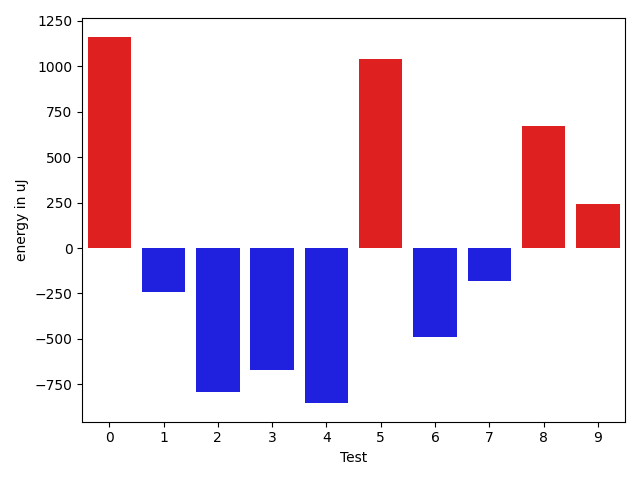
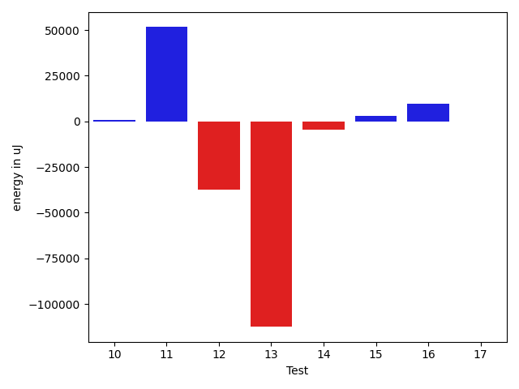

# gson 6c0566

https://github.com/google/gson/commit/6c0566

## Delta Energy per test method

| ID | EnergyV1 | EnergyV2 | DeltaEnergy | σV1 | σV2 |
| --- | --- | --- | --- | --- | --- |
| 0 | 36315 | 37476 | 1161 | 5840.081875628388 | 8075.809427476743 |
| 1 | 34912 | 34668 | -244 | 3874.137282191802 | 3617.6051079514255 |
| 2 | 35888 | 35095 | -793 | 3680.1104696650896 | 3646.470417945712 |
| 3 | 36315 | 35645 | -670 | 10953.672367873354 | 12204.04980098848 |
| 4 | 34851 | 33997 | -854 | 3844.9598621859486 | 5131.736846339682 |
| 5 | 35034 | 36072 | 1038 | 4604.549757041037 | 8279.895429653936 |
| 6 | 33935 | 33447 | -488 | 3365.133884635712 | 4001.2043981822594 |
| 7 | 35095 | 34912 | -183 | 4172.208744177196 | 4154.328507650901 |
| 8 | 36255 | 36926 | 671 | 3337.874713546397 | 3560.073056515078 |
| 9 | 36194 | 36438 | 244 | 4161.168809068571 | 3808.667195612309 |
| 10 | 36072 | 36010 | -62 | 3300.4491792149292 | 5945.500361921998 |
| 11 | 37720 | 38330 | 610 | 8160.3317363251235 | 136196.96499944714 |
| 12 | 36987 | 37354 | 367 | 138669.2064462453 | 58123.89674556118 |
| 13 | 126404 | 126587 | 183 | 664554.7679017392 | 530107.6285366978 |
| 14 | 80871 | 77942 | -2929 | 30200.30021947453 | 28639.907532455574 |
| 15 | 37536 | 38575 | 1039 | 8723.644784413169 | 10358.941878289075 |
| 16 | 123901 | 126465 | 2564 | 591477.4618573671 | 595323.749055641 |
| 17 | 34301 | 32837 | -1464 | 3545.0825575669455 | 6256.7755589490125 |

## Delta Duration per test method

| ID | DurationV1 | DurationsV2 | DeltaDuration |
| --- | --- | --- | --- |
| 0 | 1267407.875 | 1296318.1038961038 | 28910.2288961038 |
| 1 | 1031090.8032786886 | 1017157.6521739131 | -13933.15110477549 |
| 2 | 1032643.1290322581 | 1032077.5151515151 | -565.6138807429234 |
| 3 | 1420175.076923077 | 1470017.8988764044 | 49842.821953327395 |
| 4 | 1084502.638888889 | 1095332.6216216215 | 10829.982732732547 |
| 5 | 1270265.6266666667 | 1410152.644736842 | 139887.0180701753 |
| 6 | 1012090.84375 | 1020492.1272727273 | 8401.283522727317 |
| 7 | 1003827.3492063492 | 999633.6176470588 | -4193.731559290434 |
| 8 | 1075077.8524590165 | 1027207.046875 | -47870.80558401649 |
| 9 | 1039392.7868852459 | 1029997.5866666667 | -9395.200218579266 |
| 10 | 955023.2857142857 | 945527.6229508197 | -9495.66276346601 |
| 11 | 883863.375 | 2524971.864864865 | 1641108.4898648649 |
| 12 | 2451432.5476190476 | 1176085.3870967743 | -1275347.1605222733 |
| 13 | 12207367.222222222 | 8639127.191919193 | -3568240.0303030293 |
| 14 | 2730345.3333333335 | 2572080.01010101 | -158265.3232323234 |
| 15 | 1372569.8026315789 | 1463881.923076923 | 91312.12044534413 |
| 16 | 10010338.242424242 | 9779338.616161617 | -230999.62626262568 |
| 17 | 751900.0588235294 | 987136.8888888889 | 235236.83006535948 |

## Misc.

| ID | Test Class | Test Method |
| --- | --- | --- |
| 0 | com.google.gson.functional.CustomTypeAdaptersTest | testCustomAdapterInvokedForMapElementDeserialization |
| 1 | com.google.gson.functional.MapTest | testMapDeserializationWithIntegerKeys |
| 2 | com.google.gson.functional.MapTest | testMapOfMapDeserialization |
| 3 | com.google.gson.functional.MapTest | testMapSubclassDeserialization |
| 4 | com.google.gson.functional.MapTest | testParameterizedMapSubclassDeserialization |
| 5 | com.google.gson.functional.MapTest | testMapDeserialization |
| 6 | com.google.gson.functional.MapTest | testMapDeserializationWithWildcardValues |
| 7 | com.google.gson.functional.MapTest | testMapDeserializationWithNullKey |
| 8 | com.google.gson.functional.MapTest | testMapDeserializationWithNullValue |
| 9 | com.google.gson.functional.MapTest | testMapStandardSubclassDeserialization |
| 10 | com.google.gson.functional.MapTest | testReadMapsWithEmptyStringKey |
| 11 | com.google.gson.internal.bind.JsonElementReaderTest | testNumbersFromStrings |
| 12 | com.google.gson.internal.bind.JsonElementReaderTest | testNumbers |
| 13 | com.google.gson.functional.TypeVariableTest | testAdvancedTypeVariables |
| 14 | com.google.gson.functional.TypeVariableTest | testTypeVariablesViaTypeParameter |
| 15 | com.google.gson.functional.JsonParserTest | testExtraCommasInMaps |
| 16 | com.google.gson.functional.MapAsArrayTypeAdapterTest | testSerializeComplexMapWithTypeAdapter |
| 17 | com.google.gson.functional.DefaultTypeAdaptersTest | testPropertiesDeserialization |

| Test | IterationV1 | IterationV2 | DeltaIteration |
| --- | --- | --- | --- |
| 0 | 72 | 77 | 5 |
| 1 | 61 | 69 | 8 |
| 2 | 62 | 66 | 4 |
| 3 | 91 | 89 | -2 |
| 4 | 72 | 74 | 2 |
| 5 | 75 | 76 | 1 |
| 6 | 64 | 55 | -9 |
| 7 | 63 | 68 | 5 |
| 8 | 61 | 64 | 3 |
| 9 | 61 | 75 | 14 |
| 10 | 63 | 61 | -2 |
| 11 | 32 | 37 | 5 |
| 12 | 42 | 31 | -11 |
| 13 | 99 | 99 | 0 |
| 14 | 99 | 99 | 0 |
| 15 | 76 | 78 | 2 |
| 16 | 99 | 99 | 0 |
| 17 | 34 | 36 | 2 |

| Time Label | Time (s) |
| --- | --- |
| Selection | 27.90729546546936 |
| Injection | 11.152194499969482 |
| Total | 1124.1498703956604 |

