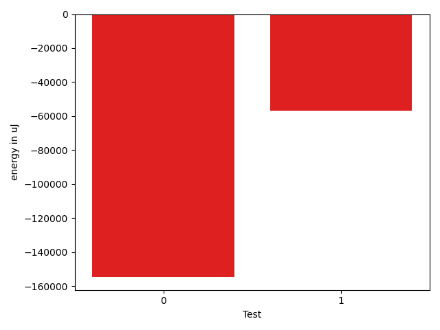

# gson 9ce9c6

https://github.com/google/gson/commit/9ce9c6

## Delta Energy per test method

| ID | EnergyV1 | EnergyV2 | DeltaEnergy | σV1 | σV2 |
| --- | --- | --- | --- | --- | --- |
| 0 | 122986 | 39123 | -83863 | 171786.2485955681 | 71117.49300874695 |
| 1 | 36255 | 37598 | 1343 | 139558.01978737905 | 93451.76377437742 |

## Delta Duration per test method

| ID | DurationV1 | DurationsV2 | DeltaDuration |
| --- | --- | --- | --- |
| 0 | 6910086.235955056 | 2409107.375 | -4500978.860955056 |
| 1 | 3481723.5576923075 | 1814453.2 | -1667270.3576923076 |

## Misc.

| ID | Test Class | Test Method |
| --- | --- | --- |
| 0 | com.google.gson.internal.bind.JsonElementReaderTest | testArray |
| 1 | com.google.gson.internal.bind.JsonElementReaderTest | testObject |

| Test | IterationV1 | IterationV2 | DeltaIteration |
| --- | --- | --- | --- |
| 0 | 89 | 56 | -33 |
| 1 | 52 | 35 | -17 |

| Time Label | Time (s) |
| --- | --- |
| Selection | 27.81732702255249 |
| Injection | 9.828680038452148 |
| Total | 1091.682438135147 |

