# gson 8b21c7

https://github.com/google/gson/commit/8b21c7

## Delta Energy per test method

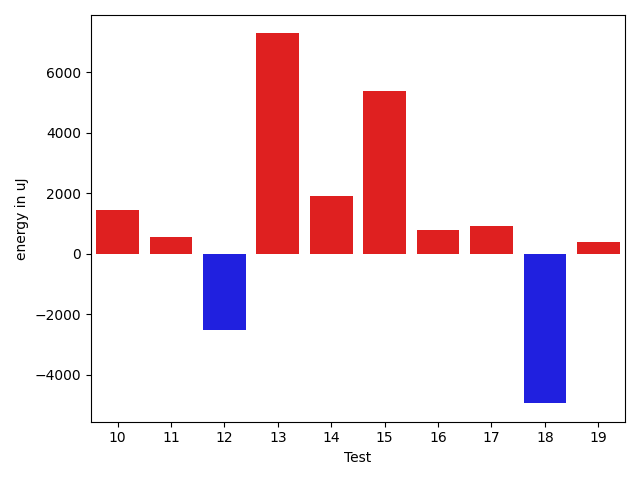

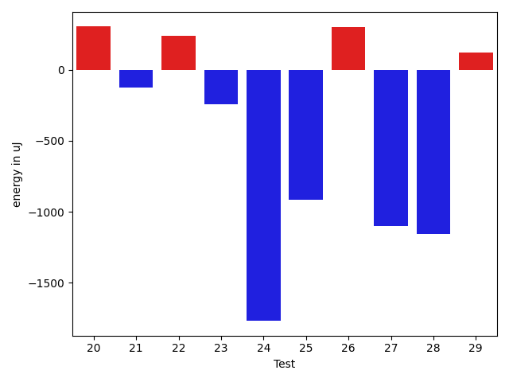

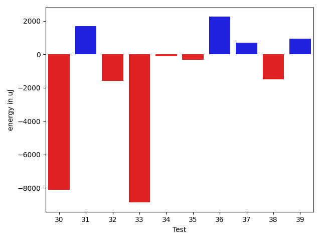

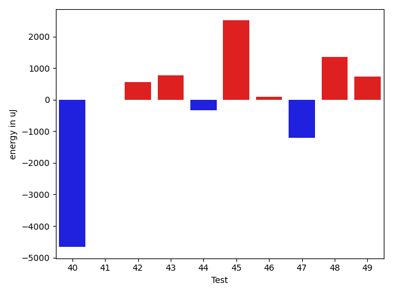

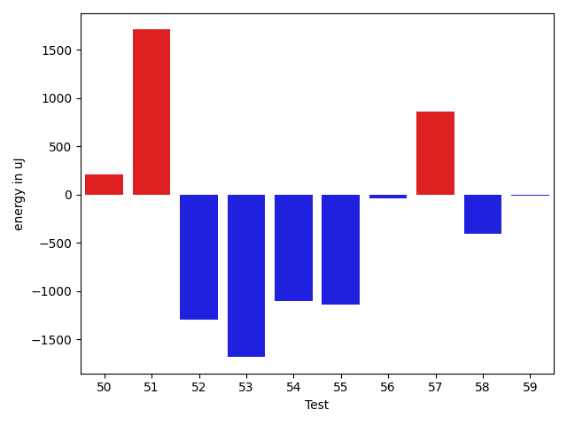

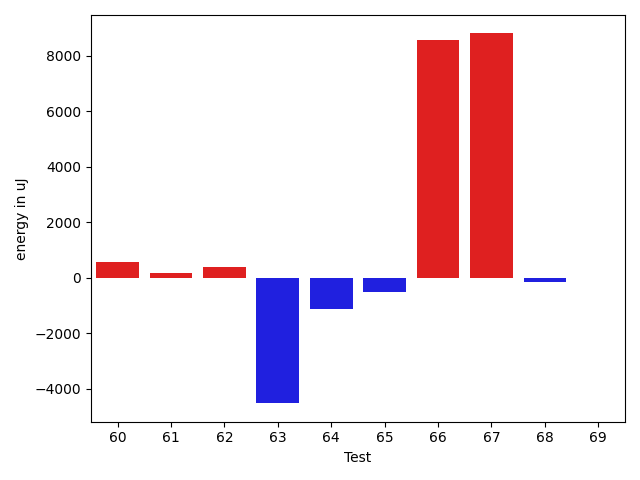

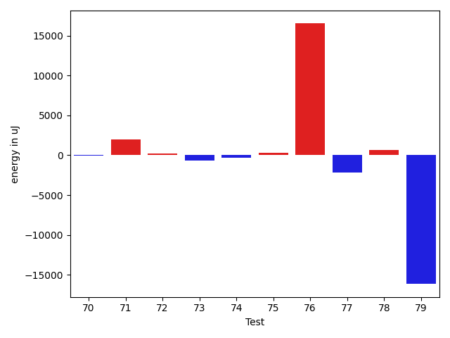

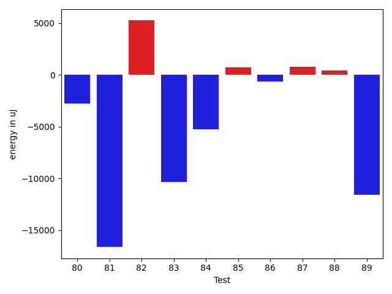

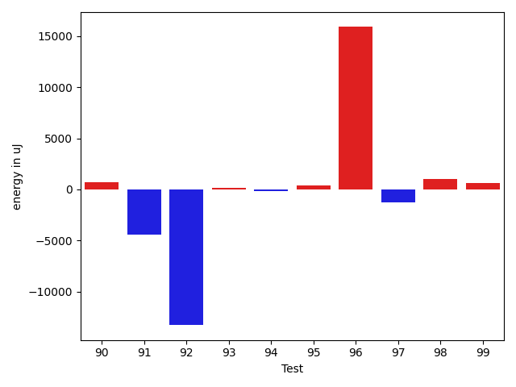

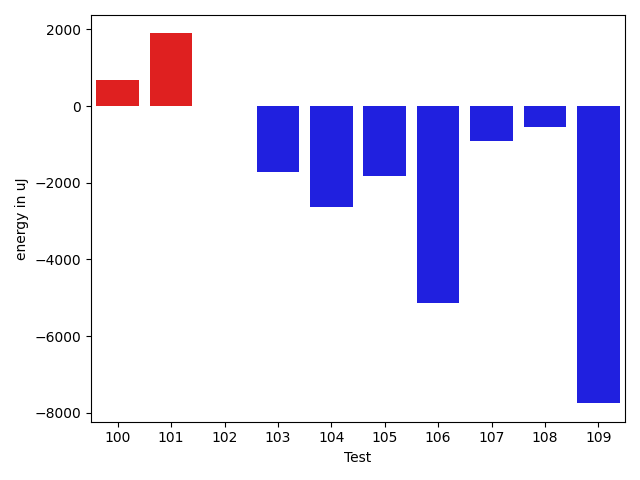

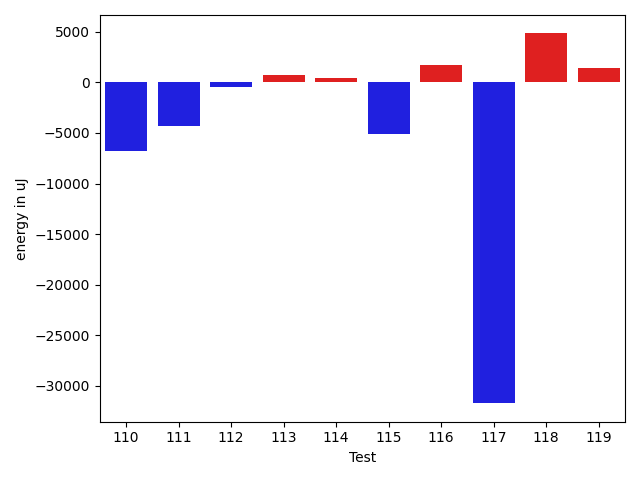

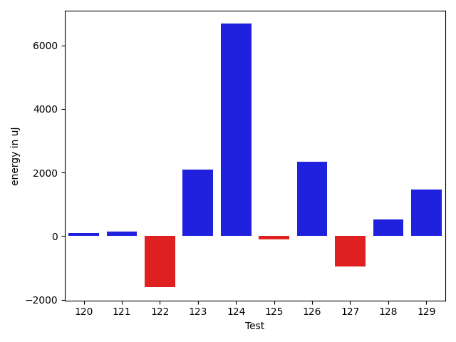

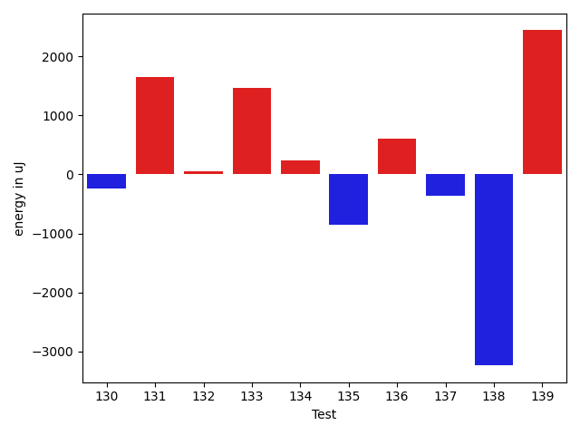

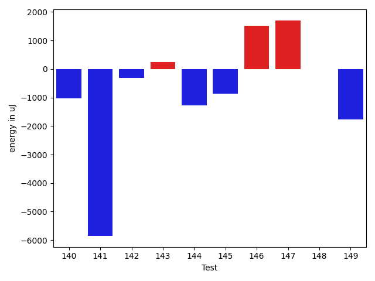

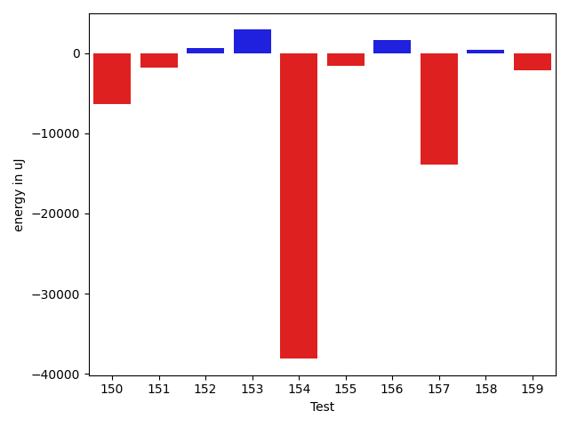

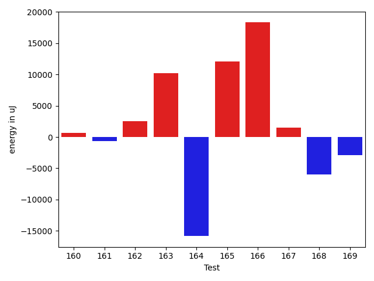

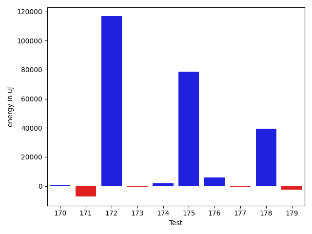

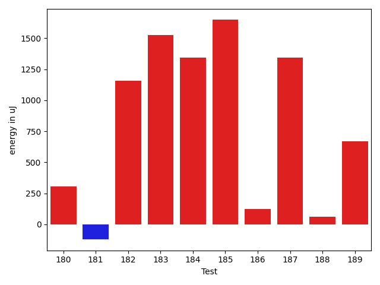

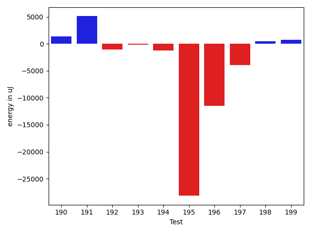

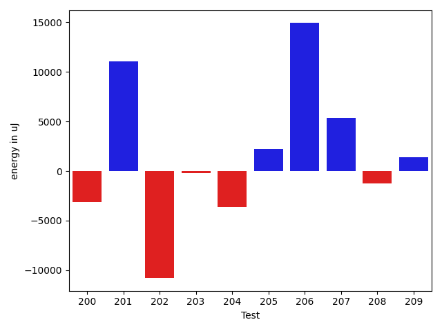

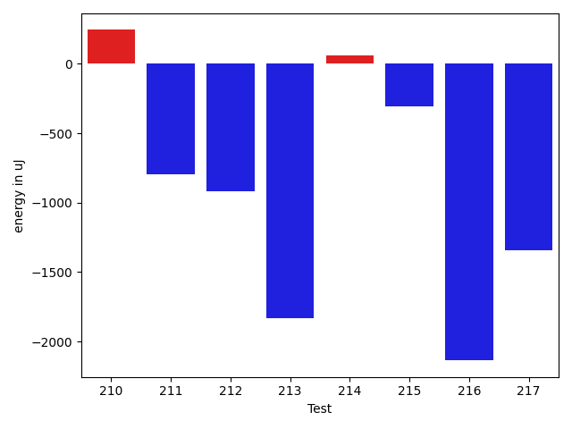

| ID | EnergyV1 | EnergyV2 | DeltaEnergy | σV1 | σV2 |
| --- | --- | --- | --- | --- | --- |
| 0 | 41443 | 41382 | -61 | 4061.0876454019512 | 4593.367134991278 |
| 1 | 41870 | 40954 | -916 | 4352.769368390657 | 17437.860186839083 |
| 2 | 42908 | 42481 | -427 | 11137.119007007146 | 11971.335195221787 |
| 3 | 39672 | 40100 | 428 | 4064.341815726346 | 4747.579388255023 |
| 4 | 39856 | 40527 | 671 | 6075.43104313279 | 34030.5124383649 |
| 5 | 41381 | 41626 | 245 | 4003.56659335843 | 4300.115548920984 |
| 6 | 41504 | 40466 | -1038 | 4841.105885186446 | 3726.4544638709353 |
| 7 | 45349 | 43396 | -1953 | 72097.97572749069 | 45711.04176851477 |
| 8 | 42236 | 41137 | -1099 | 14029.96860588811 | 12635.82203028036 |
| 9 | 39856 | 39734 | -122 | 4653.027815451721 | 30913.990457622505 |
| 10 | 40650 | 39978 | -672 | 10073.771440169261 | 11130.237302479789 |
| 11 | 38819 | 40222 | 1403 | 3442.30057739886 | 4574.323611201989 |
| 12 | 38879 | 40283 | 1404 | 26860.27234006787 | 4061.782973257036 |
| 13 | 40283 | 41626 | 1343 | 21059.663783980355 | 31811.510299828897 |
| 14 | 39489 | 40467 | 978 | 7153.651837987784 | 10338.529956201386 |
| 15 | 42603 | 42847 | 244 | 25303.502389775444 | 32241.11722034818 |
| 16 | 39429 | 40100 | 671 | 4072.176953287871 | 5475.384105848279 |
| 17 | 39612 | 40771 | 1159 | 3430.475016598455 | 5005.044142714769 |
| 18 | 216247 | 209716 | -6531 | 97217.17739719796 | 68206.40427088136 |
| 19 | 123047 | 121643 | -1404 | 26426.55057442276 | 33552.209999428196 |
| 20 | 86914 | 87219 | 305 | 41886.75114347461 | 33766.91158407203 |
| 21 | 42481 | 42358 | -123 | 3020.592202202867 | 2641.834691039009 |
| 22 | 41138 | 41381 | 243 | 2291.9759037565627 | 24154.11618129247 |
| 23 | 42968 | 42724 | -244 | 13181.849265137264 | 17121.51978424013 |
| 24 | 43091 | 41321 | -1770 | 142566.28237745241 | 157723.36013169392 |
| 25 | 41259 | 40345 | -914 | 6722.172807954285 | 5373.680501605332 |
| 26 | 44068 | 44372 | 304 | 26367.12828129506 | 28676.247757676512 |
| 27 | 41076 | 39977 | -1099 | 4329.622161579555 | 4552.273960473263 |
| 28 | 42114 | 40955 | -1159 | 6162.315014518024 | 29393.062641244094 |
| 29 | 44372 | 44495 | 123 | 45489.84879522109 | 37956.40926199251 |
| 30 | 46325 | 42907 | -3418 | 23909.648612358073 | 21356.424404946734 |
| 31 | 40588 | 40833 | 245 | 7919.4073773114515 | 18695.488008454297 |
| 32 | 39429 | 40893 | 1464 | 10086.781603970629 | 3825.385653180024 |
| 33 | 85937 | 83130 | -2807 | 40951.27054232021 | 37599.27560029002 |
| 34 | 40100 | 40405 | 305 | 3720.95992153538 | 3509.0654223193505 |
| 35 | 41626 | 42053 | 427 | 14910.96724802267 | 13247.457259734741 |
| 36 | 38391 | 40222 | 1831 | 3630.3337770299618 | 3514.976240405082 |
| 37 | 40161 | 41076 | 915 | 3913.172260269914 | 4018.501262651163 |
| 38 | 41626 | 40833 | -793 | 3868.8383101161626 | 3777.2734470497344 |
| 39 | 40589 | 40832 | 243 | 3797.458730113282 | 8214.967817885161 |
| 40 | 45654 | 43091 | -2563 | 27725.273546705892 | 23458.064126243757 |
| 41 | 41931 | 40222 | -1709 | 3822.4477978821137 | 5302.259076983385 |
| 42 | 40161 | 40528 | 367 | 4412.779925213509 | 4525.826842686021 |
| 43 | 40222 | 40467 | 245 | 4189.835644449553 | 4256.300808964152 |
| 44 | 40222 | 40833 | 611 | 3671.2425940741655 | 4376.302446256995 |
| 45 | 40954 | 41260 | 306 | 4346.748881559088 | 10236.93950574951 |
| 46 | 39795 | 39551 | -244 | 3732.3428137872907 | 5602.8706742942895 |
| 47 | 41137 | 38880 | -2257 | 3725.692226297947 | 2676.0609473451495 |
| 48 | 38697 | 40528 | 1831 | 4399.0364410146685 | 3301.9459114996316 |
| 49 | 41199 | 41931 | 732 | 3563.928932722986 | 4319.427903990224 |
| 50 | 40100 | 40467 | 367 | 7662.084082534676 | 7898.202641383639 |
| 51 | 41992 | 39611 | -2381 | 3289.385362225668 | 26108.399987760946 |
| 52 | 40710 | 39917 | -793 | 3090.549170826427 | 3812.6407100926845 |
| 53 | 41992 | 40283 | -1709 | 2770.455690743853 | 2941.815591131134 |
| 54 | 40527 | 39734 | -793 | 3164.6967581409212 | 4070.6272155501833 |
| 55 | 41199 | 40100 | -1099 | 2969.609039615024 | 4327.792986058542 |
| 56 | 42846 | 42054 | -792 | 12028.571643939624 | 14182.13291138973 |
| 57 | 41382 | 43518 | 2136 | 94472.11508263959 | 97705.3300484802 |
| 58 | 40527 | 39856 | -671 | 3507.0486995463402 | 3193.1897871763094 |
| 59 | 39307 | 39550 | 243 | 4346.414576072079 | 3053.6442234465408 |
| 60 | 39734 | 40588 | 854 | 4345.71883948259 | 4441.163068330881 |
| 61 | 40832 | 40771 | -61 | 3215.571108182052 | 3396.2427338795032 |
| 62 | 40100 | 39551 | -549 | 3840.865857257542 | 3730.738236741943 |
| 63 | 40527 | 40710 | 183 | 23367.471337188712 | 4014.648037937088 |
| 64 | 41442 | 40039 | -1403 | 3563.0422945647365 | 3941.8513395839145 |
| 65 | 37842 | 39307 | 1465 | 4799.340014459745 | 4176.888510199304 |
| 66 | 38696 | 41259 | 2563 | 3799.80347854806 | 40818.038970179514 |
| 67 | 131531 | 131225 | -306 | 99982.76418402721 | 120567.51303956409 |
| 68 | 41321 | 40466 | -855 | 3334.5565386053613 | 3937.0202636556005 |
| 69 | 41320 | 40405 | -915 | 4458.485414868858 | 3549.1835012263355 |
| 70 | 40039 | 40894 | 855 | 3465.5143569222196 | 4279.813823503606 |
| 71 | 41321 | 41443 | 122 | 6222.184042428448 | 8619.20715622867 |
| 72 | 41443 | 41321 | -122 | 3642.6881958955814 | 3457.299450689156 |
| 73 | 40527 | 39612 | -915 | 6381.205519419403 | 5365.753701383326 |
| 74 | 39794 | 40588 | 794 | 2892.2126851368453 | 4150.605055137279 |
| 75 | 41687 | 40650 | -1037 | 5779.373854382583 | 5480.656235725202 |
| 76 | 43518 | 42725 | -793 | 243935.3503877797 | 304896.35404078785 |
| 77 | 41259 | 42297 | 1038 | 12793.326454172562 | 8063.525027674198 |
| 78 | 40588 | 42053 | 1465 | 5776.161682629526 | 5188.814213482769 |
| 79 | 42846 | 42785 | -61 | 46570.00013675757 | 18613.388293212567 |
| 80 | 43824 | 42785 | -1039 | 18636.869710783772 | 16817.331174535477 |
| 81 | 43090 | 42359 | -731 | 111688.62680173147 | 79470.6604027963 |
| 82 | 41076 | 41565 | 489 | 10273.41134737899 | 24597.36320017063 |
| 83 | 87158 | 82397 | -4761 | 49636.64326713783 | 41438.75061712029 |
| 84 | 41992 | 42297 | 305 | 37309.625526071875 | 10888.399720501962 |
| 85 | 41992 | 42236 | 244 | 9482.268348057014 | 10768.903516126356 |
| 86 | 40894 | 41382 | 488 | 9616.388048572246 | 8314.037988511876 |
| 87 | 42725 | 42480 | -245 | 33738.087326587265 | 38626.56568294373 |
| 88 | 39490 | 39551 | 61 | 4408.806530211246 | 4003.378950979776 |
| 89 | 41381 | 40650 | -731 | 54073.44402035274 | 3456.9050444995432 |
| 90 | 40222 | 40161 | -61 | 9713.826907957291 | 18377.841288502244 |
| 91 | 41809 | 39978 | -1831 | 20516.31754380939 | 8860.311640869826 |
| 92 | 44250 | 44617 | 367 | 141556.15296250826 | 101088.00748690272 |
| 93 | 39917 | 40344 | 427 | 4234.64728732371 | 4052.435860861958 |
| 94 | 40100 | 40588 | 488 | 4346.050858173562 | 4475.7018571287035 |
| 95 | 40466 | 41015 | 549 | 5061.366507734826 | 4062.1593271018223 |
| 96 | 43090 | 42968 | -122 | 23641.6747269329 | 85931.11469381495 |
| 97 | 41442 | 39856 | -1586 | 4133.252248461045 | 3740.598789891636 |
| 98 | 40893 | 40771 | -122 | 8983.077370584853 | 11486.013405184565 |
| 99 | 40405 | 41748 | 1343 | 7658.353036227829 | 9253.133684126602 |
| 100 | 42175 | 42846 | 671 | 13752.36157466072 | 25740.233144000435 |
| 101 | 39917 | 41809 | 1892 | 10118.218683674124 | 11512.403648932379 |
| 102 | 39429 | 39428 | -1 | 4670.212960169304 | 3411.520034638538 |
| 103 | 45166 | 43456 | -1710 | 22315.687481226912 | 23619.256758446667 |
| 104 | 86670 | 84045 | -2625 | 119064.28566533641 | 104082.41035002892 |
| 105 | 45288 | 43457 | -1831 | 23030.923695787707 | 31127.558451322457 |
| 106 | 84717 | 79590 | -5127 | 36297.59913496422 | 32380.08309624077 |
| 107 | 44495 | 43579 | -916 | 20756.315288737373 | 21279.588504265543 |
| 108 | 42725 | 42175 | -550 | 35311.42230420668 | 38076.34375048147 |
| 109 | 80994 | 73242 | -7752 | 27772.133066404087 | 26963.658253080943 |
| 110 | 83862 | 80505 | -3357 | 34828.034037543846 | 37390.07513270525 |
| 111 | 43762 | 42419 | -1343 | 22353.375977919844 | 20885.0614797095 |
| 112 | 39795 | 39611 | -184 | 8479.744855334417 | 4472.776573707358 |
| 113 | 40161 | 40039 | -122 | 3897.121456331494 | 3259.093324024872 |
| 114 | 40894 | 41321 | 427 | 3885.8756916339667 | 3328.397593107541 |
| 115 | 41870 | 41504 | -366 | 16968.02149696505 | 10027.061161185338 |
| 116 | 41015 | 41443 | 428 | 11458.588621368453 | 11139.700186535512 |
| 117 | 43945 | 43884 | -61 | 321906.89752118284 | 223487.55191554522 |
| 118 | 85449 | 86975 | 1526 | 25532.03294112163 | 27518.43055178223 |
| 119 | 83557 | 87524 | 3967 | 130383.16718645884 | 100769.95046659239 |
| 120 | 40161 | 40894 | 733 | 4003.760060650973 | 3799.3867763815797 |
| 121 | 39673 | 39673 | 0 | 7626.676885231757 | 5027.79123759514 |
| 122 | 40832 | 39429 | -1403 | 7131.837040667233 | 5626.023318250646 |
| 123 | 37719 | 40161 | 2442 | 4386.471711123327 | 4240.06706635086 |
| 124 | 40955 | 40771 | -184 | 3617.851824675262 | 38895.57120554223 |
| 125 | 40466 | 39978 | -488 | 4222.408430951553 | 4293.264343844609 |
| 126 | 38513 | 41748 | 3235 | 4018.496943867174 | 4237.000873713168 |
| 127 | 40223 | 39734 | -489 | 4359.029007418641 | 3887.37653809661 |
| 128 | 37964 | 39978 | 2014 | 3915.220492761395 | 4674.506975329055 |
| 129 | 40100 | 40344 | 244 | 4223.092227598489 | 3702.0933018262785 |
| 130 | 40955 | 40710 | -245 | 4485.024083106095 | 3862.2531092472186 |
| 131 | 37232 | 38879 | 1647 | 3973.967367757315 | 5103.213511733706 |
| 132 | 38941 | 39001 | 60 | 4163.469422090765 | 4793.728383527289 |
| 133 | 40222 | 41687 | 1465 | 9928.732019759618 | 5364.266291514711 |
| 134 | 39856 | 40100 | 244 | 3761.8754184357786 | 4429.452537006427 |
| 135 | 43884 | 43030 | -854 | 24714.722777084404 | 20503.68707335187 |
| 136 | 42541 | 43152 | 611 | 70130.14222766199 | 62322.50828713795 |
| 137 | 40527 | 40161 | -366 | 4342.876873256522 | 3608.7638668502095 |
| 138 | 41382 | 38147 | -3235 | 4625.78971654896 | 4153.902777661681 |
| 139 | 38880 | 41321 | 2441 | 5025.669564991596 | 5275.986008261868 |
| 140 | 41748 | 40711 | -1037 | 4215.412894004693 | 3577.7534981122494 |
| 141 | 177246 | 171386 | -5860 | 132835.6325116615 | 74705.6457146192 |
| 142 | 40832 | 40527 | -305 | 4438.357751533179 | 5424.395602226025 |
| 143 | 41443 | 41686 | 243 | 6295.601011394747 | 10723.378433250686 |
| 144 | 41748 | 40466 | -1282 | 4585.03095605845 | 39789.93446691009 |
| 145 | 41565 | 40710 | -855 | 3152.311548816758 | 3558.790264395558 |
| 146 | 40100 | 41626 | 1526 | 3792.4395239570936 | 3888.355454506387 |
| 147 | 40100 | 41809 | 1709 | 24299.456703137734 | 22756.66731230416 |
| 148 | 41320 | 41320 | 0 | 9250.635856463537 | 8206.424171641322 |
| 149 | 41626 | 39856 | -1770 | 4159.537540643359 | 3829.501608888895 |
| 150 | 45593 | 42664 | -2929 | 22902.674144209705 | 23394.474584669464 |
| 151 | 41504 | 40772 | -732 | 16238.114877361822 | 7058.310857653218 |
| 152 | 40405 | 40588 | 183 | 3851.935568690675 | 3614.5694092189815 |
| 153 | 40161 | 41747 | 1586 | 4487.332028593323 | 7869.011754601006 |
| 154 | 85876 | 85938 | 62 | 402379.41264211014 | 289170.62310987094 |
| 155 | 44799 | 44494 | -305 | 26433.621487153567 | 25535.2344737524 |
| 156 | 40893 | 41016 | 123 | 6476.950563870623 | 9336.281224215194 |
| 157 | 86914 | 86365 | -549 | 322795.77677663066 | 285479.3994130376 |
| 158 | 42114 | 41748 | -366 | 4143.620613059507 | 5692.322254361571 |
| 159 | 40466 | 41015 | 549 | 10330.338050084565 | 3617.873582644922 |
| 160 | 41016 | 41382 | 366 | 6196.391252942823 | 3098.422427592803 |
| 161 | 42359 | 42602 | 243 | 70708.8211661467 | 55448.74007703255 |
| 162 | 40894 | 42725 | 1831 | 3900.2188079644966 | 4731.029903737605 |
| 163 | 42419 | 43152 | 733 | 185274.68941991715 | 219876.1391268534 |
| 164 | 44495 | 44312 | -183 | 103798.16631654133 | 57194.60970603879 |
| 165 | 329284 | 334349 | 5065 | 138431.84595510198 | 136780.68022065898 |
| 166 | 456542 | 478880 | 22338 | 135368.54825844071 | 161473.63853603762 |
| 167 | 42969 | 42480 | -489 | 23840.61174796819 | 24356.31375914009 |
| 168 | 44251 | 43517 | -734 | 26587.348281289767 | 19710.582313354174 |
| 169 | 42603 | 42724 | 121 | 20388.492008867473 | 16037.412653963416 |
| 170 | 43395 | 42724 | -671 | 29481.42225058874 | 30639.938133173604 |
| 171 | 43518 | 42480 | -1038 | 20279.05809463568 | 12280.956875789234 |
| 172 | 43335 | 43518 | 183 | 33422.17549997557 | 439203.2254084284 |
| 173 | 41320 | 41198 | -122 | 3347.34292923358 | 4211.4749494684165 |
| 174 | 41931 | 42663 | 732 | 10145.800521607514 | 11960.05215936972 |
| 175 | 87585 | 86364 | -1221 | 184392.70106331754 | 422557.17977000005 |
| 176 | 40405 | 42847 | 2442 | 8928.768670115087 | 14459.460412463246 |
| 177 | 41199 | 41015 | -184 | 10349.645800433 | 9273.159065104766 |
| 178 | 41809 | 41564 | -245 | 244176.11192208642 | 319157.12022924906 |
| 179 | 41198 | 39489 | -1709 | 4364.550002615045 | 3549.2572525452497 |
| 180 | 41626 | 41932 | 306 | 3845.1328000175017 | 7715.549881608305 |
| 181 | 40588 | 40466 | -122 | 4106.950297349355 | 4242.620412780543 |
| 182 | 40162 | 41321 | 1159 | 3611.328087919145 | 4518.331852177305 |
| 183 | 41565 | 43090 | 1525 | 451399.1101037046 | 10713.701139846378 |
| 184 | 39917 | 41260 | 1343 | 4542.545109530051 | 3167.027692728351 |
| 185 | 39612 | 41260 | 1648 | 5029.382595440503 | 3764.166661259782 |
| 186 | 40588 | 40710 | 122 | 4651.443464957121 | 34075.332674018624 |
| 187 | 39978 | 41321 | 1343 | 4340.21570431701 | 3064.1151711745792 |
| 188 | 41137 | 41198 | 61 | 6415.671446122794 | 9405.992366606855 |
| 189 | 44006 | 44677 | 671 | 59538.2577294938 | 97479.73049822685 |
| 190 | 42724 | 42847 | 123 | 6892.4002953257095 | 8228.046214782504 |
| 191 | 126404 | 128112 | 1708 | 324384.1426457218 | 319540.11912021483 |
| 192 | 41748 | 39856 | -1892 | 4396.491764786764 | 4494.557457312875 |
| 193 | 40893 | 41077 | 184 | 6598.919162154242 | 6238.972874665827 |
| 194 | 41748 | 39917 | -1831 | 4243.397584913838 | 4776.180735752086 |
| 195 | 43701 | 44128 | 427 | 447670.4300420159 | 365229.3301608088 |
| 196 | 43579 | 44128 | 549 | 70688.3328432819 | 41796.39416880113 |
| 197 | 41748 | 42542 | 794 | 35293.169170933295 | 5268.263298527803 |
| 198 | 41137 | 40589 | -548 | 3462.333020969659 | 3249.1367835371952 |
| 199 | 42114 | 41809 | -305 | 12929.932570407269 | 14269.074789945511 |
| 200 | 41443 | 40039 | -1404 | 24701.96105109626 | 8628.438771325104 |
| 201 | 43823 | 42236 | -1587 | 69208.05281149864 | 88014.3069090225 |
| 202 | 42907 | 42236 | -671 | 98055.62314909055 | 69526.89839170783 |
| 203 | 41687 | 41748 | 61 | 4431.209309827285 | 4478.031686736368 |
| 204 | 43823 | 43518 | -305 | 18928.70854743133 | 15562.136485392008 |
| 205 | 41443 | 43579 | 2136 | 14634.737278206954 | 18114.72893905979 |
| 206 | 42175 | 42358 | 183 | 14357.374472238778 | 56592.14456966261 |
| 207 | 40833 | 40039 | -794 | 14828.303363665646 | 58158.136061574965 |
| 208 | 42053 | 41076 | -977 | 5975.627540121947 | 4041.5649000994626 |
| 209 | 42724 | 42359 | -365 | 15512.80988155784 | 18818.52119472652 |
| 210 | 42847 | 43091 | 244 | 56143.79533572223 | 36785.432582805624 |
| 211 | 43213 | 42420 | -793 | 29991.394077461053 | 29281.619973206554 |
| 212 | 42298 | 41382 | -916 | 66552.49048525121 | 67924.36709880478 |
| 213 | 41321 | 39490 | -1831 | 4217.985849608792 | 3901.494143985808 |
| 214 | 45472 | 45532 | 60 | 130139.61730546413 | 89914.84679868401 |
| 215 | 42481 | 42175 | -306 | 12687.39663583754 | 19104.05398736197 |
| 216 | 43823 | 41687 | -2136 | 4563.810299112025 | 18074.67097676746 |
| 217 | 40284 | 38940 | -1344 | 4554.634406343037 | 8176.570419357658 |

## Delta Duration per test method

| ID | DurationV1 | DurationsV2 | DeltaDuration |
| --- | --- | --- | --- |
| 0 | 755482.3409090909 | 764829.693877551 | 9347.352968460065 |
| 1 | 602090.6 | 855984.0370370371 | 253893.4370370371 |
| 2 | 994063.0392156863 | 1066560.1803278688 | 72497.14111218252 |
| 3 | 688686.5555555555 | 696177.4210526316 | 7490.865497076069 |
| 4 | 1005712.9411764706 | 912632.7083333334 | -93080.23284313723 |
| 5 | 402831.3846153846 | 443548.5263157895 | 40717.14170040487 |
| 6 | 840656.612244898 | 765950.0408163265 | -74706.57142857148 |
| 7 | 2157571.383838384 | 1738339.4444444445 | -419231.93939393945 |
| 8 | 1079112.6451612904 | 995785.4716981133 | -83327.17346317717 |
| 9 | 915434.0172413794 | 919946.9016393443 | 4512.884397964925 |
| 10 | 1181762.2976190476 | 1137781.025974026 | -43981.271645021625 |
| 11 | 595907.0689655172 | 645388.59375 | 49481.52478448278 |
| 12 | 742848.5405405406 | 608409.4594594594 | -134439.08108108118 |
| 13 | 1365467.1578947369 | 1540203.1304347827 | 174735.97254004586 |
| 14 | 990136.3787878788 | 1044555.6875 | 54419.308712121216 |
| 15 | 1316317.0675675676 | 1558925.8688524591 | 242608.80128489155 |
| 16 | 458191.625 | 478044.2380952381 | 19852.613095238106 |
| 17 | 586329.6944444445 | 606679.696969697 | 20350.002525252523 |
| 18 | 6006293.696969697 | 5707781.04040404 | -298512.6565656569 |
| 19 | 3136180.393939394 | 3122538.6565656564 | -13641.737373737618 |
| 20 | 2859006.101010101 | 2782357.383838384 | -76648.71717171697 |
| 21 | 893159.2432432432 | 743757.3469387755 | -149401.8963044677 |
| 22 | 681908.9310344828 | 664539.475 | -17369.456034482806 |
| 23 | 1118536.9014084507 | 1242859.7236842106 | 124322.82227575989 |
| 24 | 2243133.625 | 2962068.9534883723 | 718935.3284883723 |
| 25 | 688529.85 | 804484.4444444445 | 115954.59444444452 |
| 26 | 1704727.724489796 | 1767410.2525252525 | 62682.52803545655 |
| 27 | 684135.5428571429 | 645394.1515151515 | -38741.39134199137 |
| 28 | 1056956.1818181819 | 1154422.7777777778 | 97466.59595959587 |
| 29 | 1927606.0947368422 | 1865914.7272727273 | -61691.36746411491 |
| 30 | 1513679.8676470588 | 1349230.9367088608 | -164448.930938198 |
| 31 | 1113743.6511627906 | 1156894.6179775281 | 43150.966814737534 |
| 32 | 957986.6666666666 | 897758.4888888889 | -60228.177777777775 |
| 33 | 2579892.3333333335 | 2491398.777777778 | -88493.5555555555 |
| 34 | 704737.8461538461 | 840499.2222222222 | 135761.37606837612 |
| 35 | 1361291.7160493827 | 1269705.049382716 | -91586.66666666674 |
| 36 | 529245.1363636364 | 508983.4857142857 | -20261.65064935066 |
| 37 | 497807.44444444444 | 494327.96153846156 | -3479.482905982877 |
| 38 | 559250.2692307692 | 532614.6923076923 | -26635.576923076995 |
| 39 | 732665.3111111111 | 808851.3111111111 | 76186.0 |
| 40 | 1742981.888888889 | 1694339.1313131314 | -48642.75757575757 |
| 41 | 683451.4838709678 | 690245.9024390244 | 6794.418568056659 |
| 42 | 666518.0 | 585889.0476190476 | -80628.95238095243 |
| 43 | 703600.2 | 684252.0555555555 | -19348.14444444445 |
| 44 | 832689.6666666666 | 820660.5294117647 | -12029.137254901929 |
| 45 | 855596.3947368421 | 796221.6 | -59374.79473684216 |
| 46 | 918478.3518518518 | 961501.9444444445 | 43023.5925925927 |
| 47 | 495894.2631578947 | 448528.6842105263 | -47365.57894736843 |
| 48 | 505158.25 | 522737.0833333333 | 17578.833333333314 |
| 49 | 597005.3333333334 | 618954.6086956522 | 21949.275362318847 |
| 50 | 938886.0697674418 | 938834.3636363636 | -51.706131078186445 |
| 51 | 373456.35714285716 | 589763.9354838709 | 216307.57834101375 |
| 52 | 525199.7142857143 | 545244.8823529412 | 20045.168067226885 |
| 53 | 446707.8333333333 | 481183.875 | 34476.041666666686 |
| 54 | 487753.27777777775 | 534743.2631578947 | 46989.98538011697 |
| 55 | 536601.9714285714 | 578624.5384615385 | 42022.56703296711 |
| 56 | 1031103.3863636364 | 924355.5925925926 | -106747.79377104377 |
| 57 | 2010289.0625 | 1965394.4571428571 | -44894.605357142864 |
| 58 | 841938.7735849057 | 827247.8125 | -14690.961084905663 |
| 59 | 531692.4285714285 | 500459.2272727273 | -31233.201298701228 |
| 60 | 750595.8529411765 | 742439.3777777777 | -8156.475163398776 |
| 61 | 612056.4230769231 | 581913.7692307692 | -30142.653846153873 |
| 62 | 790019.4047619047 | 705262.7567567568 | -84756.64800514793 |
| 63 | 937696.5 | 612068.8235294118 | -325627.6764705882 |
| 64 | 515998.64285714284 | 494967.84210526315 | -21030.800751879695 |
| 65 | 695984.2941176471 | 650226.3103448276 | -45757.98377281951 |
| 66 | 636740.5625 | 771890.0625 | 135149.5 |
| 67 | 4521587.02020202 | 4755526.393939394 | 233939.3737373734 |
| 68 | 776831.051724138 | 805287.306122449 | 28456.254398311023 |
| 69 | 701393.3947368421 | 768106.7037037037 | 66713.30896686157 |
| 70 | 543126.6521739131 | 773445.7586206896 | 230319.10644677654 |
| 71 | 926056.509090909 | 956800.1272727273 | 30743.61818181828 |
| 72 | 738090.8095238095 | 778543.6363636364 | 40452.826839826885 |
| 73 | 878967.1525423729 | 927057.5094339623 | 48090.356891589356 |
| 74 | 514837.3157894737 | 518125.4074074074 | 3288.0916179337073 |
| 75 | 832200.4390243902 | 735376.3870967742 | -96824.051927616 |
| 76 | 2556013.0235294118 | 3091036.238095238 | 535023.2145658261 |
| 77 | 998800.1666666666 | 925019.9782608695 | -73780.18840579712 |
| 78 | 979732.1285714286 | 961241.8571428572 | -18490.271428571432 |
| 79 | 1638252.78 | 1044773.2878787878 | -593479.4921212122 |
| 80 | 1508435.608695652 | 1445569.206521739 | -62866.402173913084 |
| 81 | 2268447.520547945 | 1643531.8333333333 | -624915.6872146118 |
| 82 | 1048305.463768116 | 1087980.603174603 | 39675.13940648711 |
| 83 | 2848014.8282828284 | 2636851.98989899 | -211162.83838383853 |
| 84 | 1128765.157142857 | 993480.0508474576 | -135285.10629539948 |
| 85 | 973201.8113207547 | 914170.3529411765 | -59031.458379578195 |
| 86 | 889380.8181818182 | 891024.9069767442 | 1644.0887949259486 |
| 87 | 1636677.5957446808 | 1661816.206521739 | 25138.610777058173 |
| 88 | 486417.0416666667 | 457298.8076923077 | -29118.233974359 |
| 89 | 825645.074074074 | 541259.6538461539 | -284385.42022792017 |
| 90 | 1111257.0 | 1069083.2307692308 | -42173.76923076925 |
| 91 | 1113400.7605633803 | 1088834.2833333334 | -24566.477230046876 |
| 92 | 2385481.7358490564 | 2068891.7333333334 | -316590.002515723 |
| 93 | 533340.8965517242 | 531990.68 | -1350.2165517241228 |
| 94 | 548400.2068965518 | 499790.3076923077 | -48609.89920424408 |
| 95 | 565028.1818181818 | 525814.7727272727 | -39213.40909090906 |
| 96 | 1599012.3854166667 | 2259144.505050505 | 660132.1196338383 |
| 97 | 850274.0384615385 | 989449.3428571429 | 139175.3043956044 |
| 98 | 1038445.3484848485 | 1122640.2876712328 | 84194.93918638432 |
| 99 | 938204.1833333333 | 1075458.96875 | 137254.78541666665 |
| 100 | 1155124.027027027 | 1521336.463768116 | 366212.436741089 |
| 101 | 1044565.3559322034 | 1104524.0882352942 | 59958.73230309086 |
| 102 | 931508.1666666666 | 849492.8787878788 | -82015.28787878784 |
| 103 | 1762504.1836734693 | 1592518.2142857143 | -169985.96938775503 |
| 104 | 3663699.2525252528 | 3000080.1414141413 | -663619.1111111115 |
| 105 | 1755828.8282828282 | 1706493.4040404041 | -49335.42424242408 |
| 106 | 2638802.6565656564 | 2345576.868686869 | -293225.7878787876 |
| 107 | 1689597.9393939395 | 1570632.4591836734 | -118965.48021026608 |
| 108 | 1585488.1279069767 | 1490895.1022727273 | -94593.02563424944 |
| 109 | 2150470.5454545454 | 1929086.0707070706 | -221384.47474747477 |
| 110 | 2594619.97979798 | 2404882.1414141413 | -189737.83838383853 |
| 111 | 1667537.0505050505 | 1564500.9795918367 | -103036.07091321377 |
| 112 | 1012159.8414634146 | 943909.2972972973 | -68250.54416611732 |
| 113 | 758079.7708333334 | 710623.4255319149 | -47456.34530141845 |
| 114 | 639147.6086956522 | 604867.3333333334 | -34280.27536231885 |
| 115 | 1353165.0657894737 | 1178034.2441860465 | -175130.82160342718 |
| 116 | 1230270.945945946 | 1122989.7228915663 | -107281.22305437969 |
| 117 | 3364711.451219512 | 2273014.027777778 | -1091697.4234417342 |
| 118 | 2588580.505050505 | 2600250.9595959596 | 11670.454545454588 |
| 119 | 3299896.606060606 | 3261567.303030303 | -38329.30303030275 |
| 120 | 544309.6666666666 | 593552.0 | 49242.33333333337 |
| 121 | 935138.0185185185 | 904386.9855072463 | -30751.0330112722 |
| 122 | 1067827.9350649351 | 1073729.575 | 5901.639935064828 |
| 123 | 777256.2307692308 | 554017.0512820513 | -223239.1794871795 |
| 124 | 634293.0 | 771785.2432432432 | 137492.2432432432 |
| 125 | 891875.9830508474 | 907662.7142857143 | 15786.731234866893 |
| 126 | 588301.5 | 559512.6153846154 | -28788.884615384624 |
| 127 | 590580.4074074074 | 626578.9090909091 | 35998.50168350164 |
| 128 | 623264.2571428572 | 602538.0 | -20726.257142857183 |
| 129 | 584473.8235294118 | 529026.1515151515 | -55447.672014260315 |
| 130 | 563164.6666666666 | 571368.0303030303 | 8203.363636363647 |
| 131 | 703285.1333333333 | 715127.0243902439 | 11841.891056910623 |
| 132 | 768695.7857142857 | 696080.1162790698 | -72615.66943521588 |
| 133 | 952098.5714285715 | 927775.7636363637 | -24322.80779220781 |
| 134 | 838396.0576923077 | 776418.0 | -61978.057692307746 |
| 135 | 1707775.9484536082 | 1603955.306122449 | -103820.64233115921 |
| 136 | 1913720.1555555556 | 1548579.391304348 | -365140.7642512077 |
| 137 | 527235.3448275862 | 509673.39285714284 | -17561.951970443362 |
| 138 | 656262.1470588235 | 682645.25 | 26383.102941176505 |
| 139 | 755910.2580645161 | 711605.1875 | -44305.07056451612 |
| 140 | 821367.0 | 870838.0153846154 | 49471.0153846154 |
| 141 | 5404493.767676768 | 5162274.7272727275 | -242219.04040404037 |
| 142 | 836882.4237288135 | 881166.7575757576 | 44284.333846944035 |
| 143 | 1027571.1538461539 | 1092114.904109589 | 64543.750263435184 |
| 144 | 597595.6206896552 | 803547.717948718 | 205952.0972590628 |
| 145 | 622536.5405405406 | 715933.717948718 | 93397.1774081774 |
| 146 | 705978.0454545454 | 755824.1428571428 | 49846.09740259743 |
| 147 | 858593.0 | 1167445.4054054054 | 308852.40540540544 |
| 148 | 979142.5833333334 | 1004465.5172413794 | 25322.93390804599 |
| 149 | 859573.6379310344 | 860285.9166666666 | 712.2787356321933 |
| 150 | 1747096.9795918367 | 1676011.191919192 | -71085.78767264471 |
| 151 | 954559.0833333334 | 895692.387755102 | -58866.69557823136 |
| 152 | 668474.5757575758 | 656160.2790697674 | -12314.296687808353 |
| 153 | 986419.2586206896 | 960471.690140845 | -25947.568479844602 |
| 154 | 5244473.414141414 | 4038514.505050505 | -1205958.9090909087 |
| 155 | 1661546.9375 | 1695174.2417582418 | 33627.304258241784 |
| 156 | 1090835.6607142857 | 915122.9038461539 | -175712.7568681318 |
| 157 | 4465271.838383839 | 4371798.909090909 | -93472.92929292936 |
| 158 | 725268.6304347826 | 744286.1 | 19017.469565217383 |
| 159 | 789935.5714285715 | 758063.975 | -31871.5964285715 |
| 160 | 781261.5869565217 | 748728.6486486486 | -32532.93830787309 |
| 161 | 1401928.2363636363 | 1355875.1851851852 | -46053.05117845116 |
| 162 | 647184.9285714285 | 652821.8620689656 | 5636.933497537044 |
| 163 | 1619484.5396825396 | 1929468.0819672132 | 309983.54228467355 |
| 164 | 2377766.580645161 | 1887757.1145833333 | -490009.46606182796 |
| 165 | 9436933.717171717 | 9806588.070707072 | 369654.35353535414 |
| 166 | 12161112.222222222 | 12670178.484848484 | 509066.2626262624 |
| 167 | 1462371.797752809 | 1417215.896551724 | -45155.901201084955 |
| 168 | 1623062.5531914893 | 1501242.9479166667 | -121819.60527482256 |
| 169 | 1389776.3870967743 | 1315000.7528089888 | -74775.6342877855 |
| 170 | 1484755.2117647058 | 1443234.3176470587 | -41520.89411764708 |
| 171 | 1410505.061728395 | 1294290.2613636365 | -116214.80036475859 |
| 172 | 1391874.294117647 | 4771549.887096774 | 3379675.5929791266 |
| 173 | 852260.3333333334 | 889702.9230769231 | 37442.58974358975 |
| 174 | 1100197.6756756757 | 1172973.0588235294 | 72775.38314785366 |
| 175 | 3032403.616161616 | 5380079.98989899 | 2347676.373737374 |
| 176 | 1092709.987341772 | 1300412.3142857142 | 207702.3269439421 |
| 177 | 1034048.9264705882 | 1187095.0142857144 | 153046.08781512617 |
| 178 | 2365335.487804878 | 3848586.5208333335 | 1483251.0330284555 |
| 179 | 591221.5172413794 | 623341.3870967742 | 32119.86985539482 |
| 180 | 644682.8787878788 | 868770.0625 | 224087.18371212122 |
| 181 | 602705.9642857143 | 669398.7575757576 | 66692.79329004325 |
| 182 | 619132.5 | 474323.84 | -144808.65999999997 |
| 183 | 4892592.083333333 | 896262.7142857143 | -3996329.3690476185 |
| 184 | 971755.8846153846 | 746905.2045454546 | -224850.68006993004 |
| 185 | 767977.1724137932 | 570311.1052631579 | -197666.0671506353 |
| 186 | 684483.282051282 | 822552.6818181818 | 138069.39976689976 |
| 187 | 787347.9666666667 | 609296.6333333333 | -178051.33333333337 |
| 188 | 877747.4074074074 | 1075440.224489796 | 197692.81708238856 |
| 189 | 1797256.2674418604 | 2356536.0430107526 | 559279.7755688922 |
| 190 | 992777.2615384615 | 1021585.5211267605 | 28808.25958829897 |
| 191 | 5086073.909090909 | 5247304.424242424 | 161230.51515151467 |
| 192 | 782640.8918918918 | 818208.8636363636 | 35567.97174447181 |
| 193 | 815583.340425532 | 842216.5416666666 | 26633.201241134666 |
| 194 | 620949.9024390244 | 686334.9696969697 | 65385.06725794531 |
| 195 | 4775222.048387097 | 3928535.1641791044 | -846686.8842079928 |
| 196 | 2026962.4831460675 | 1610637.4567901234 | -416325.0263559441 |
| 197 | 1147579.4210526317 | 684428.9459459459 | -463150.4751066858 |
| 198 | 566312.3529411765 | 646683.0 | 80370.6470588235 |
| 199 | 1117200.3921568627 | 1021992.804347826 | -95207.5878090366 |
| 200 | 881814.0222222222 | 824632.5641025641 | -57181.458119658055 |
| 201 | 1208049.342857143 | 1466562.8823529412 | 258513.5394957983 |
| 202 | 1910638.634920635 | 1546840.0161290322 | -363798.6187916028 |
| 203 | 744808.975 | 813477.0238095238 | 68668.04880952381 |
| 204 | 1216673.72 | 993784.6666666666 | -222889.05333333334 |
| 205 | 963654.6551724138 | 1056668.3673469387 | 93013.7121745249 |
| 206 | 1263308.2875 | 1840708.2 | 577399.9124999999 |
| 207 | 786176.9428571429 | 1048354.0333333333 | 262177.09047619044 |
| 208 | 989061.5833333334 | 813465.1346153846 | -175596.44871794875 |
| 209 | 1263758.9659090908 | 1302660.0263157894 | 38901.06040669861 |
| 210 | 1623833.8448275863 | 1220547.4057971016 | -403286.43903048476 |
| 211 | 1359944.641025641 | 1327579.2933333332 | -32365.347692307783 |
| 212 | 1366144.493150685 | 1477017.984375 | 110873.49122431502 |
| 213 | 500553.45 | 609622.1666666666 | 109068.71666666662 |
| 214 | 2916175.9418604653 | 2296002.318681319 | -620173.6231791466 |
| 215 | 1045656.6805555555 | 1367010.9 | 321354.2194444444 |
| 216 | 568043.8181818182 | 809596.64 | 241552.82181818178 |
| 217 | 462479.3461538461 | 673944.5263157894 | 211465.1801619433 |

## Misc.

| ID | Test Class | Test Method |
| --- | --- | --- |
| 0 | com.google.gson.internal.bind.MiniGsonTest | testSerializeRecursive |
| 1 | com.google.gson.internal.bind.MiniGsonTest | testDeserialize |
| 2 | com.google.gson.internal.bind.MiniGsonTest | testSerializeWithCustomTypeAdapter |
| 3 | com.google.gson.internal.bind.MiniGsonTest | testDeserializeWithCustomTypeAdapter |
| 4 | com.google.gson.internal.bind.MiniGsonTest | testDeserializeNullObject |
| 5 | com.google.gson.internal.bind.MiniGsonTest | testDeserializeNullField |
| 6 | com.google.gson.functional.CustomDeserializerTest | testDefaultConstructorNotCalledOnField |
| 7 | com.google.gson.functional.CustomDeserializerTest | testDefaultConstructorNotCalledOnObject |
| 8 | com.google.gson.functional.CustomDeserializerTest | testCustomDeserializerReturnsNull |
| 9 | com.google.gson.functional.CustomDeserializerTest | testCustomDeserializerReturnsNullForArrayElementsForArrayField |
| 10 | com.google.gson.functional.CustomDeserializerTest | testJsonTypeFieldBasedDeserialization |
| 11 | com.google.gson.functional.DefaultTypeAdaptersTest | testBadValueForBigDecimalDeserialization |
| 12 | com.google.gson.functional.DefaultTypeAdaptersTest | testBigIntegerFieldDeserialization |
| 13 | com.google.gson.functional.DefaultTypeAdaptersTest | testUrlNullSerialization |
| 14 | com.google.gson.functional.DefaultTypeAdaptersTest | testBigIntegerFieldSerialization |
| 15 | com.google.gson.functional.DefaultTypeAdaptersTest | testBigDecimalFieldSerialization |
| 16 | com.google.gson.functional.DefaultTypeAdaptersTest | testUrlNullDeserialization |
| 17 | com.google.gson.functional.DefaultTypeAdaptersTest | testBigDecimalFieldDeserialization |
| 18 | com.google.gson.functional.CircularReferenceTest | testCircularSerialization |
| 19 | com.google.gson.functional.CircularReferenceTest | testSelfReferenceArrayFieldSerialization |
| 20 | com.google.gson.functional.CircularReferenceTest | testSelfReferenceSerialization |
| 21 | com.google.gson.functional.CircularReferenceTest | testDirectedAcyclicGraphSerialization |
| 22 | com.google.gson.functional.CircularReferenceTest | testDirectedAcyclicGraphDeserialization |
| 23 | com.google.gson.functional.ReadersWritersTest | testReadWriteTwoObjects |
| 24 | com.google.gson.functional.ReadersWritersTest | testWriterForSerialization |
| 25 | com.google.gson.functional.ReadersWritersTest | testReaderForDeserialization |
| 26 | com.google.gson.functional.MapTest | testInterfaceTypeMapWithSerializer |
| 27 | com.google.gson.functional.MapTest | testMapSerializationWithNullValuesSerialized |
| 28 | com.google.gson.functional.MapTest | testGeneralMapField |
| 29 | com.google.gson.functional.MapTest | testInterfaceTypeMap |
| 30 | com.google.gson.functional.MapTest | testMapSerializationWithNullValues |
| 31 | com.google.gson.functional.ObjectTest | testEmptyCollectionInAnObjectDeserialization |
| 32 | com.google.gson.functional.ObjectTest | testArrayOfArraysDeserialization |
| 33 | com.google.gson.functional.ObjectTest | testSingletonLists |
| 34 | com.google.gson.functional.ObjectTest | testStringFieldWithNumberValueDeserialization |
| 35 | com.google.gson.functional.ObjectTest | testArrayOfObjectsAsFields |
| 36 | com.google.gson.functional.ObjectTest | testClassWithTransientFieldsDeserializationTransientFieldsPassedInJsonAreIgnored |
| 37 | com.google.gson.functional.ObjectTest | testNullArraysDeserialization |
| 38 | com.google.gson.functional.ObjectTest | testClassWithObjectFieldSerialization |
| 39 | com.google.gson.functional.ObjectTest | testArrayOfObjectsDeserialization |
| 40 | com.google.gson.functional.ObjectTest | testArrayOfArraysSerialization |
| 41 | com.google.gson.functional.ObjectTest | testBagOfPrimitivesSerialization |
| 42 | com.google.gson.functional.ObjectTest | testBagOfPrimitiveWrappersDeserialization |
| 43 | com.google.gson.functional.ObjectTest | testNullFieldsDeserialization |
| 44 | com.google.gson.functional.ObjectTest | testArrayOfObjectsSerialization |
| 45 | com.google.gson.functional.ObjectTest | testClassWithTransientFieldsSerialization |
| 46 | com.google.gson.functional.ObjectTest | testInnerClassDeserialization |
| 47 | com.google.gson.functional.ObjectTest | testStringFieldWithEmptyValueDeserialization |
| 48 | com.google.gson.functional.ObjectTest | testEmptyCollectionInAnObjectSerialization |
| 49 | com.google.gson.functional.ObjectTest | testJsonInMixedQuotesDeserialization |
| 50 | com.google.gson.functional.ObjectTest | testNestedSerialization |
| 51 | com.google.gson.functional.ObjectTest | testClassWithNoFieldsDeserialization |
| 52 | com.google.gson.functional.ObjectTest | testPrivateNoArgConstructorDeserialization |
| 53 | com.google.gson.functional.ObjectTest | testPrimitiveArrayFieldSerialization |
| 54 | com.google.gson.functional.ObjectTest | testClassWithNoFieldsSerialization |
| 55 | com.google.gson.functional.ObjectTest | testStringFieldWithEmptyValueSerialization |
| 56 | com.google.gson.functional.ObjectTest | testBagOfPrimitiveWrappersSerialization |
| 57 | com.google.gson.functional.ObjectTest | testJsonInSingleQuotesDeserialization |
| 58 | com.google.gson.functional.ObjectTest | testInnerClassSerialization |
| 59 | com.google.gson.functional.ObjectTest | testNullObjectFieldsDeserialization |
| 60 | com.google.gson.functional.ObjectTest | testNullFieldsSerialization |
| 61 | com.google.gson.functional.ObjectTest | testClassWithTransientFieldsDeserialization |
| 62 | com.google.gson.functional.ObjectTest | testNestedDeserialization |
| 63 | com.google.gson.functional.ObjectTest | testBagOfPrimitivesDeserialization |
| 64 | com.google.gson.functional.ObjectTest | testObjectFieldNamesWithoutQuotesDeserialization |
| 65 | com.google.gson.functional.ObjectTest | testNullPrimitiveFieldsDeserialization |
| 66 | com.google.gson.functional.ObjectTest | testPrimitiveArrayInAnObjectDeserialization |
| 67 | com.google.gson.functional.ExposeFieldsTest | testNullExposeFieldSerialization |
| 68 | com.google.gson.functional.ExposeFieldsTest | testNoExposedFieldSerialization |
| 69 | com.google.gson.functional.ExposeFieldsTest | testExposeAnnotationSerialization |
| 70 | com.google.gson.functional.ExposeFieldsTest | testExposedInterfaceFieldDeserialization |
| 71 | com.google.gson.functional.ExposeFieldsTest | testArrayWithOneNullExposeFieldObjectSerialization |
| 72 | com.google.gson.functional.ExposeFieldsTest | testExposeAnnotationDeserialization |
| 73 | com.google.gson.functional.ExposeFieldsTest | testExposedInterfaceFieldSerialization |
| 74 | com.google.gson.functional.ExposeFieldsTest | testNoExposedFieldDeserialization |
| 75 | com.google.gson.functional.FieldExclusionTest | testDefaultNestedStaticClassIncluded |
| 76 | com.google.gson.functional.FieldExclusionTest | testDefaultInnerClassExclusion |
| 77 | com.google.gson.functional.CollectionTest | testRawCollectionSerialization |
| 78 | com.google.gson.functional.CollectionTest | testFieldIsArrayList |
| 79 | com.google.gson.functional.CollectionTest | testCollectionOfBagOfPrimitivesSerialization |
| 80 | com.google.gson.functional.CollectionTest | testWildcardCollectionField |
| 81 | com.google.gson.functional.CollectionTest | testSetSerialization |
| 82 | com.google.gson.functional.CollectionTest | testSetDeserialization |
| 83 | com.google.gson.functional.InheritanceTest | testSubInterfacesOfCollectionSerialization |
| 84 | com.google.gson.functional.InheritanceTest | testClassWithBaseArrayFieldSerialization |
| 85 | com.google.gson.functional.InheritanceTest | testSubClassDeserialization |
| 86 | com.google.gson.functional.InheritanceTest | testClassWithBaseFieldSerialization |
| 87 | com.google.gson.functional.InheritanceTest | testSubClassSerialization |
| 88 | com.google.gson.functional.InheritanceTest | testBaseSerializedAsBaseWhenSpecifiedWithExplicitType |
| 89 | com.google.gson.functional.InheritanceTest | testBaseSerializedAsSub |
| 90 | com.google.gson.functional.InheritanceTest | testSubInterfacesOfCollectionDeserialization |
| 91 | com.google.gson.functional.InheritanceTest | testClassWithBaseCollectionFieldSerialization |
| 92 | com.google.gson.functional.InheritanceTest | testBaseSerializedAsBaseWhenSpecifiedWithExplicitTypeForToJsonMethod |
| 93 | com.google.gson.functional.InheritanceTest | testBaseSerializedAsSubForToJsonMethod |
| 94 | com.google.gson.functional.InheritanceTest | testBaseSerializedAsSubWhenSpecifiedWithExplicitTypeForToJsonMethod |
| 95 | com.google.gson.functional.InheritanceTest | testBaseSerializedAsSubWhenSpecifiedWithExplicitType |
| 96 | com.google.gson.functional.MoreSpecificTypeSerializationTest | testSubclassFields |
| 97 | com.google.gson.functional.MoreSpecificTypeSerializationTest | testParameterizedSubclassFields |
| 98 | com.google.gson.functional.MoreSpecificTypeSerializationTest | testListOfParameterizedSubclassFields |
| 99 | com.google.gson.functional.MoreSpecificTypeSerializationTest | testMapOfParameterizedSubclassFields |
| 100 | com.google.gson.functional.MoreSpecificTypeSerializationTest | testListOfSubclassFields |
| 101 | com.google.gson.functional.MoreSpecificTypeSerializationTest | testMapOfSubclassFields |
| 102 | com.google.gson.functional.ParameterizedTypesTest | testParameterizedTypesWithWriterSerialization |
| 103 | com.google.gson.functional.ParameterizedTypesTest | testVariableTypeArrayDeserialization |
| 104 | com.google.gson.functional.ParameterizedTypesTest | testParameterizedTypesSerialization |
| 105 | com.google.gson.functional.ParameterizedTypesTest | testVariableTypeDeserialization |
| 106 | com.google.gson.functional.ParameterizedTypesTest | testVariableTypeFieldsAndGenericArraysSerialization |
| 107 | com.google.gson.functional.ParameterizedTypesTest | testParameterizedTypeGenericArraysDeserialization |
| 108 | com.google.gson.functional.ParameterizedTypesTest | testParameterizedTypeDeserialization |
| 109 | com.google.gson.functional.ParameterizedTypesTest | testVariableTypeFieldsAndGenericArraysDeserialization |
| 110 | com.google.gson.functional.ParameterizedTypesTest | testTypesWithMultipleParametersSerialization |
| 111 | com.google.gson.functional.ParameterizedTypesTest | testParameterizedTypeWithVariableTypeDeserialization |
| 112 | com.google.gson.functional.ParameterizedTypesTest | testParameterizedTypeWithReaderDeserialization |
| 113 | com.google.gson.functional.ParameterizedTypesTest | testDeepParameterizedTypeDeserialization |
| 114 | com.google.gson.functional.ParameterizedTypesTest | testDeepParameterizedTypeSerialization |
| 115 | com.google.gson.functional.ParameterizedTypesTest | testParameterizedTypeGenericArraysSerialization |
| 116 | com.google.gson.functional.ParameterizedTypesTest | testTypesWithMultipleParametersDeserialization |
| 117 | com.google.gson.JsonParserTest | testReadWriteTwoObjects |
| 118 | com.google.gson.functional.NamingPolicyTest | testGsonWithNonDefaultFieldNamingPolicySerialization |
| 119 | com.google.gson.functional.NamingPolicyTest | testGsonDuplicateNameUsingSerializedNameFieldNamingPolicySerialization |
| 120 | com.google.gson.functional.NamingPolicyTest | testGsonWithNonDefaultFieldNamingPolicyDeserialiation |
| 121 | com.google.gson.functional.NamingPolicyTest | testComplexFieldNameStrategy |
| 122 | com.google.gson.functional.NamingPolicyTest | testDeprecatedNamingStrategy |
| 123 | com.google.gson.functional.NamingPolicyTest | testGsonWithUpperCamelCaseSpacesPolicySerialiation |
| 124 | com.google.gson.functional.NamingPolicyTest | testGsonWithLowerCaseDashPolicySerialization |
| 125 | com.google.gson.functional.NamingPolicyTest | testGsonWithSerializedNameFieldNamingPolicySerialization |
| 126 | com.google.gson.functional.NamingPolicyTest | testGsonWithLowerCaseUnderscorePolicySerialization |
| 127 | com.google.gson.functional.NamingPolicyTest | testGsonWithLowerCaseUnderscorePolicyDeserialiation |
| 128 | com.google.gson.functional.NamingPolicyTest | testGsonWithLowerCaseDashPolicyDeserialiation |
| 129 | com.google.gson.functional.NamingPolicyTest | testGsonWithUpperCamelCaseSpacesPolicyDeserialiation |
| 130 | com.google.gson.functional.NamingPolicyTest | testGsonWithSerializedNameFieldNamingPolicyDeserialization |
| 131 | com.google.gson.functional.NullObjectAndFieldTest | testExplicitSerializationOfNullStringMembers |
| 132 | com.google.gson.functional.NullObjectAndFieldTest | testExplicitSerializationOfNullCollectionMembers |
| 133 | com.google.gson.functional.NullObjectAndFieldTest | testPrintPrintingObjectWithNulls |
| 134 | com.google.gson.functional.NullObjectAndFieldTest | testNullWrappedPrimitiveMemberSerialization |
| 135 | com.google.gson.functional.NullObjectAndFieldTest | testExplicitSerializationOfNullArrayMembers |
| 136 | com.google.gson.functional.NullObjectAndFieldTest | testExplicitSerializationOfNulls |
| 137 | com.google.gson.functional.NullObjectAndFieldTest | testNullWrappedPrimitiveMemberDeserialization |
| 138 | com.google.gson.functional.NullObjectAndFieldTest | testExplicitNullSetsFieldToNullDuringDeserialization |
| 139 | com.google.gson.functional.NullObjectAndFieldTest | testExplicitDeserializationOfNulls |
| 140 | com.google.gson.functional.VersioningTest | testVersionedGsonMixingSinceAndUntilDeserialization |
| 141 | com.google.gson.functional.VersioningTest | testVersionedUntilSerialization |
| 142 | com.google.gson.functional.VersioningTest | testVersionedClassesSerialization |
| 143 | com.google.gson.functional.VersioningTest | testVersionedGsonMixingSinceAndUntilSerialization |
| 144 | com.google.gson.functional.VersioningTest | testVersionedUntilDeserialization |
| 145 | com.google.gson.functional.VersioningTest | testVersionedGsonWithUnversionedClassesDeserialization |
| 146 | com.google.gson.functional.VersioningTest | testVersionedClassesDeserialization |
| 147 | com.google.gson.functional.VersioningTest | testVersionedGsonWithUnversionedClassesSerialization |
| 148 | com.google.gson.functional.CustomTypeAdaptersTest | testCustomNestedSerializers |
| 149 | com.google.gson.functional.CustomTypeAdaptersTest | testCustomNestedDeserializers |
| 150 | com.google.gson.functional.CustomTypeAdaptersTest | testCustomTypeAdapterDoesNotAppliesToSubClasses |
| 151 | com.google.gson.functional.CustomTypeAdaptersTest | testEnsureCustomSerializerNotInvokedForNullValues |
| 152 | com.google.gson.functional.CustomTypeAdaptersTest | testEnsureCustomDeserializerNotInvokedForNullValues |
| 153 | com.google.gson.functional.TypeVariableTest | testBasicTypeVariables |
| 154 | com.google.gson.functional.TypeVariableTest | testAdvancedTypeVariables |
| 155 | com.google.gson.functional.TypeVariableTest | testTypeVariablesViaTypeParameter |
| 156 | com.google.gson.functional.ExclusionStrategyFunctionalTest | testExclusionStrategyWithMode |
| 157 | com.google.gson.functional.ExclusionStrategyFunctionalTest | testExclusionStrategySerialization |
| 158 | com.google.gson.functional.ExclusionStrategyFunctionalTest | testExclusionStrategyDeserialization |
| 159 | com.google.gson.functional.UncategorizedTest | testGsonInstanceReusableForSerializationAndDeserialization |
| 160 | com.google.gson.functional.UncategorizedTest | testStaticFieldsAreNotSerialized |
| 161 | com.google.gson.functional.UncategorizedTest | testInvalidJsonDeserializationFails |
| 162 | com.google.gson.functional.UncategorizedTest | testObjectEqualButNotSameSerialization |
| 163 | com.google.gson.FunctionWithInternalDependenciesTest | testAnonymousLocalClassesSerialization |
| 164 | com.google.gson.functional.ConcurrencyTest | testSingleThreadSerialization |
| 165 | com.google.gson.functional.ConcurrencyTest | testMultiThreadSerialization |
| 166 | com.google.gson.functional.ConcurrencyTest | testMultiThreadDeserialization |
| 167 | com.google.gson.functional.ConcurrencyTest | testSingleThreadDeserialization |
| 168 | com.google.gson.functional.RawSerializationTest | testThreeLevelParameterizedObject |
| 169 | com.google.gson.functional.RawSerializationTest | testTwoLevelParameterizedObject |
| 170 | com.google.gson.functional.RawSerializationTest | testCollectionOfObjects |
| 171 | com.google.gson.functional.RawSerializationTest | testParameterizedObject |
| 172 | com.google.gson.functional.InstanceCreatorTest | testInstanceCreatorReturnsBaseType |
| 173 | com.google.gson.functional.InstanceCreatorTest | testInstanceCreatorReturnsSubTypeForTopLevelObject |
| 174 | com.google.gson.functional.MapAsArrayTypeAdapterTest | testMapWithTypeVariableDeserialization |
| 175 | com.google.gson.functional.MapAsArrayTypeAdapterTest | testSerializeComplexMapWithTypeAdapter |
| 176 | com.google.gson.functional.MapAsArrayTypeAdapterTest | testMapWithTypeVariableSerialization |
| 177 | com.google.gson.functional.MapAsArrayTypeAdapterTest | testMultipleEnableComplexKeyRegistrationHasNoEffect |
| 178 | com.google.gson.functional.SecurityTest | testNonExecutableJsonSerialization |
| 179 | com.google.gson.functional.SecurityTest | testJsonWithNonExectuableTokenWithConfiguredGsonDeserialization |
| 180 | com.google.gson.functional.SecurityTest | testNonExecutableJsonDeserialization |
| 181 | com.google.gson.functional.SecurityTest | testJsonWithNonExectuableTokenWithRegularGsonDeserialization |
| 182 | com.google.gson.MixedStreamTest | testWriteClosed |
| 183 | com.google.gson.MixedStreamTest | testWriteMixedStreamed |
| 184 | com.google.gson.MixedStreamTest | testReadMixedStreamed |
| 185 | com.google.gson.MixedStreamTest | testReaderDoesNotMutateState |
| 186 | com.google.gson.MixedStreamTest | testWriteInvalidState |
| 187 | com.google.gson.MixedStreamTest | testWriteDoesNotMutateState |
| 188 | com.google.gson.functional.PrettyPrintingTest | testPrettyPrintArrayOfObjects |
| 189 | com.google.gson.functional.PrettyPrintingTest | testPrettyPrintList |
| 190 | com.google.gson.functional.PrettyPrintingTest | testEmptyMapField |
| 191 | com.google.gson.functional.TypeHierarchyAdapterTest | testTypeHierarchy |
| 192 | com.google.gson.functional.CustomSerializerTest | testBaseClassSerializerInvokedForBaseClassFieldsHoldingSubClassInstances |
| 193 | com.google.gson.functional.CustomSerializerTest | testSubClassSerializerInvokedForBaseClassFieldsHoldingArrayOfSubClassInstances |
| 194 | com.google.gson.functional.CustomSerializerTest | testBaseClassSerializerInvokedForBaseClassFields |
| 195 | com.google.gson.functional.CustomSerializerTest | testSubClassSerializerInvokedForBaseClassFieldsHoldingSubClassInstances |
| 196 | com.google.gson.ObjectTypeAdapterTest | testSerialize |
| 197 | com.google.gson.functional.JsonParserTest | testBadTypeForDeserializingCustomTree |
| 198 | com.google.gson.functional.JsonParserTest | testBadFieldTypeForCustomDeserializerCustomTree |
| 199 | com.google.gson.functional.JsonParserTest | testChangingCustomTreeAndDeserializing |
| 200 | com.google.gson.functional.JsonParserTest | testBadFieldTypeForDeserializingCustomTree |
| 201 | com.google.gson.functional.JsonParserTest | testDeserializingCustomTree |
| 202 | com.google.gson.functional.InterfaceTest | testSerializingObjectImplementingInterface |
| 203 | com.google.gson.functional.InterfaceTest | testSerializingInterfaceObjectField |
| 204 | com.google.gson.functional.PrimitiveTest | testMoreSpecificSerialization |
| 205 | com.google.gson.functional.PrimitiveTest | testDeserializePrimitiveWrapperAsObjectField |
| 206 | com.google.gson.functional.EnumTest | testClassWithEnumFieldSerialization |
| 207 | com.google.gson.functional.EnumTest | testClassWithEnumFieldDeserialization |
| 208 | com.google.gson.functional.EscapingTest | testGsonDoubleDeserialization |
| 209 | com.google.gson.functional.EscapingTest | testGsonAcceptsEscapedAndNonEscapedJsonDeserialization |
| 210 | com.google.gson.functional.EscapingTest | testEscapingObjectFields |
| 211 | com.google.gson.functional.JsonTreeTest | testJsonTreeToString |
| 212 | com.google.gson.functional.JsonTreeTest | testToJsonTreeObjectType |
| 213 | com.google.gson.functional.JsonTreeTest | testToJsonTree |
| 214 | com.google.gson.functional.PrintFormattingTest | testCompactFormattingLeavesNoWhiteSpace |
| 215 | com.google.gson.functional.ArrayTest | testObjectArrayWithNonPrimitivesSerialization |
| 216 | com.google.gson.functional.ArrayTest | testSingleNullInArraySerialization |
| 217 | com.google.gson.functional.ArrayTest | testSingleNullInArrayDeserialization |

| Test | IterationV1 | IterationV2 | DeltaIteration |
| --- | --- | --- | --- |
| 0 | 44 | 49 | 5 |
| 1 | 25 | 27 | 2 |
| 2 | 51 | 61 | 10 |
| 3 | 27 | 38 | 11 |
| 4 | 17 | 24 | 7 |
| 5 | 13 | 19 | 6 |
| 6 | 49 | 49 | 0 |
| 7 | 99 | 99 | 0 |
| 8 | 62 | 53 | -9 |
| 9 | 58 | 61 | 3 |
| 10 | 84 | 77 | -7 |
| 11 | 29 | 32 | 3 |
| 12 | 37 | 37 | 0 |
| 13 | 95 | 92 | -3 |
| 14 | 66 | 64 | -2 |
| 15 | 74 | 61 | -13 |
| 16 | 24 | 21 | -3 |
| 17 | 36 | 33 | -3 |
| 18 | 99 | 99 | 0 |
| 19 | 99 | 99 | 0 |
| 20 | 99 | 99 | 0 |
| 21 | 37 | 49 | 12 |
| 22 | 29 | 40 | 11 |
| 23 | 71 | 76 | 5 |
| 24 | 40 | 43 | 3 |
| 25 | 40 | 45 | 5 |
| 26 | 98 | 99 | 1 |
| 27 | 35 | 33 | -2 |
| 28 | 66 | 63 | -3 |
| 29 | 95 | 99 | 4 |
| 30 | 68 | 79 | 11 |
| 31 | 86 | 89 | 3 |
| 32 | 54 | 45 | -9 |
| 33 | 99 | 99 | 0 |
| 34 | 39 | 36 | -3 |
| 35 | 81 | 81 | 0 |
| 36 | 22 | 35 | 13 |
| 37 | 27 | 26 | -1 |
| 38 | 26 | 26 | 0 |
| 39 | 45 | 45 | 0 |
| 40 | 99 | 99 | 0 |
| 41 | 31 | 41 | 10 |
| 42 | 28 | 42 | 14 |
| 43 | 40 | 36 | -4 |
| 44 | 51 | 51 | 0 |
| 45 | 38 | 40 | 2 |
| 46 | 54 | 54 | 0 |
| 47 | 19 | 19 | 0 |
| 48 | 24 | 36 | 12 |
| 49 | 24 | 23 | -1 |
| 50 | 43 | 44 | 1 |
| 51 | 14 | 31 | 17 |
| 52 | 28 | 34 | 6 |
| 53 | 24 | 24 | 0 |
| 54 | 18 | 19 | 1 |
| 55 | 35 | 26 | -9 |
| 56 | 44 | 54 | 10 |
| 57 | 32 | 35 | 3 |
| 58 | 53 | 48 | -5 |
| 59 | 28 | 22 | -6 |
| 60 | 34 | 45 | 11 |
| 61 | 26 | 39 | 13 |
| 62 | 42 | 37 | -5 |
| 63 | 32 | 34 | 2 |
| 64 | 28 | 19 | -9 |
| 65 | 17 | 29 | 12 |
| 66 | 32 | 32 | 0 |
| 67 | 99 | 99 | 0 |
| 68 | 58 | 49 | -9 |
| 69 | 38 | 27 | -11 |
| 70 | 23 | 29 | 6 |
| 71 | 55 | 55 | 0 |
| 72 | 42 | 44 | 2 |
| 73 | 59 | 53 | -6 |
| 74 | 19 | 27 | 8 |
| 75 | 41 | 31 | -10 |
| 76 | 85 | 84 | -1 |
| 77 | 54 | 46 | -8 |
| 78 | 70 | 70 | 0 |
| 79 | 50 | 66 | 16 |
| 80 | 92 | 92 | 0 |
| 81 | 73 | 84 | 11 |
| 82 | 69 | 63 | -6 |
| 83 | 99 | 99 | 0 |
| 84 | 70 | 59 | -11 |
| 85 | 53 | 51 | -2 |
| 86 | 44 | 43 | -1 |
| 87 | 94 | 92 | -2 |
| 88 | 24 | 26 | 2 |
| 89 | 27 | 26 | -1 |
| 90 | 70 | 78 | 8 |
| 91 | 71 | 60 | -11 |
| 92 | 53 | 45 | -8 |
| 93 | 29 | 25 | -4 |
| 94 | 29 | 26 | -3 |
| 95 | 22 | 22 | 0 |
| 96 | 96 | 99 | 3 |
| 97 | 52 | 70 | 18 |
| 98 | 66 | 73 | 7 |
| 99 | 60 | 64 | 4 |
| 100 | 74 | 69 | -5 |
| 101 | 59 | 68 | 9 |
| 102 | 60 | 66 | 6 |
| 103 | 98 | 98 | 0 |
| 104 | 99 | 99 | 0 |
| 105 | 99 | 99 | 0 |
| 106 | 99 | 99 | 0 |
| 107 | 99 | 98 | -1 |
| 108 | 86 | 88 | 2 |
| 109 | 99 | 99 | 0 |
| 110 | 99 | 99 | 0 |
| 111 | 99 | 98 | -1 |
| 112 | 82 | 74 | -8 |
| 113 | 48 | 47 | -1 |
| 114 | 46 | 39 | -7 |
| 115 | 76 | 86 | 10 |
| 116 | 74 | 83 | 9 |
| 117 | 82 | 72 | -10 |
| 118 | 99 | 99 | 0 |
| 119 | 99 | 99 | 0 |
| 120 | 24 | 36 | 12 |
| 121 | 54 | 69 | 15 |
| 122 | 77 | 80 | 3 |
| 123 | 26 | 39 | 13 |
| 124 | 35 | 37 | 2 |
| 125 | 59 | 63 | 4 |
| 126 | 26 | 26 | 0 |
| 127 | 27 | 33 | 6 |
| 128 | 35 | 25 | -10 |
| 129 | 34 | 33 | -1 |
| 130 | 24 | 33 | 9 |
| 131 | 30 | 41 | 11 |
| 132 | 42 | 43 | 1 |
| 133 | 49 | 55 | 6 |
| 134 | 52 | 49 | -3 |
| 135 | 97 | 98 | 1 |
| 136 | 45 | 46 | 1 |
| 137 | 29 | 28 | -1 |
| 138 | 34 | 36 | 2 |
| 139 | 31 | 32 | 1 |
| 140 | 54 | 65 | 11 |
| 141 | 99 | 99 | 0 |
| 142 | 59 | 66 | 7 |
| 143 | 65 | 73 | 8 |
| 144 | 29 | 39 | 10 |
| 145 | 37 | 39 | 2 |
| 146 | 44 | 42 | -2 |
| 147 | 44 | 37 | -7 |
| 148 | 60 | 58 | -2 |
| 149 | 58 | 48 | -10 |
| 150 | 98 | 99 | 1 |
| 151 | 48 | 49 | 1 |
| 152 | 33 | 43 | 10 |
| 153 | 58 | 71 | 13 |
| 154 | 99 | 99 | 0 |
| 155 | 96 | 91 | -5 |
| 156 | 56 | 52 | -4 |
| 157 | 99 | 99 | 0 |
| 158 | 46 | 40 | -6 |
| 159 | 42 | 40 | -2 |
| 160 | 46 | 37 | -9 |
| 161 | 55 | 54 | -1 |
| 162 | 28 | 29 | 1 |
| 163 | 63 | 61 | -2 |
| 164 | 93 | 96 | 3 |
| 165 | 99 | 99 | 0 |
| 166 | 99 | 99 | 0 |
| 167 | 89 | 87 | -2 |
| 168 | 94 | 96 | 2 |
| 169 | 93 | 89 | -4 |
| 170 | 85 | 85 | 0 |
| 171 | 81 | 88 | 7 |
| 172 | 68 | 62 | -6 |
| 173 | 51 | 52 | 1 |
| 174 | 74 | 68 | -6 |
| 175 | 99 | 99 | 0 |
| 176 | 79 | 70 | -9 |
| 177 | 68 | 70 | 2 |
| 178 | 41 | 48 | 7 |
| 179 | 29 | 31 | 2 |
| 180 | 33 | 32 | -1 |
| 181 | 28 | 33 | 5 |
| 182 | 32 | 25 | -7 |
| 183 | 60 | 42 | -18 |
| 184 | 52 | 44 | -8 |
| 185 | 29 | 38 | 9 |
| 186 | 39 | 22 | -17 |
| 187 | 30 | 30 | 0 |
| 188 | 54 | 49 | -5 |
| 189 | 86 | 93 | 7 |
| 190 | 65 | 71 | 6 |
| 191 | 99 | 99 | 0 |
| 192 | 37 | 44 | 7 |
| 193 | 47 | 48 | 1 |
| 194 | 41 | 33 | -8 |
| 195 | 62 | 67 | 5 |
| 196 | 89 | 81 | -8 |
| 197 | 38 | 37 | -1 |
| 198 | 34 | 27 | -7 |
| 199 | 51 | 46 | -5 |
| 200 | 45 | 39 | -6 |
| 201 | 35 | 34 | -1 |
| 202 | 63 | 62 | -1 |
| 203 | 40 | 42 | 2 |
| 204 | 25 | 36 | 11 |
| 205 | 58 | 49 | -9 |
| 206 | 80 | 80 | 0 |
| 207 | 35 | 30 | -5 |
| 208 | 48 | 52 | 4 |
| 209 | 88 | 76 | -12 |
| 210 | 58 | 69 | 11 |
| 211 | 78 | 75 | -3 |
| 212 | 73 | 64 | -9 |
| 213 | 20 | 30 | 10 |
| 214 | 86 | 91 | 5 |
| 215 | 72 | 70 | -2 |
| 216 | 22 | 25 | 3 |
| 217 | 26 | 19 | -7 |

| Time Label | Time (s) |
| --- | --- |
| Selection | 27.768502712249756 |
| Injection | 15.697194576263428 |
| Total | 1231.3252778053284 |

