# gson 46e65a

https://github.com/google/gson/commit/46e65a

## Delta Energy per test method

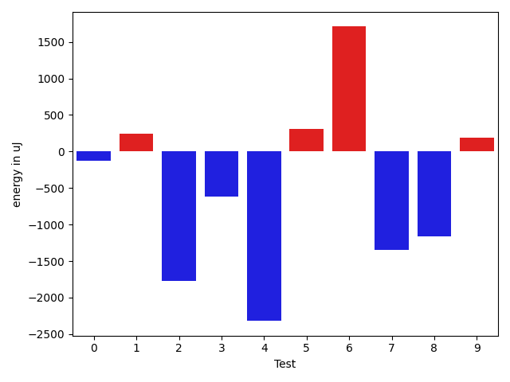

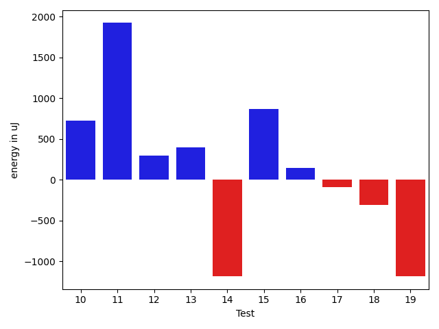

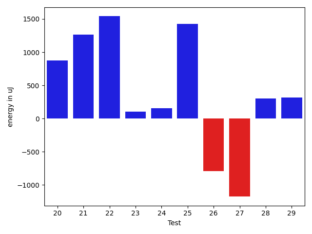

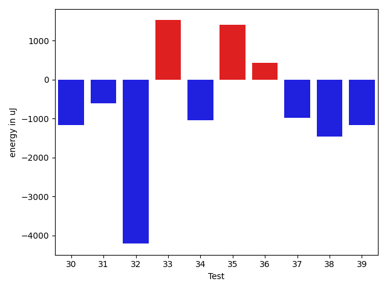

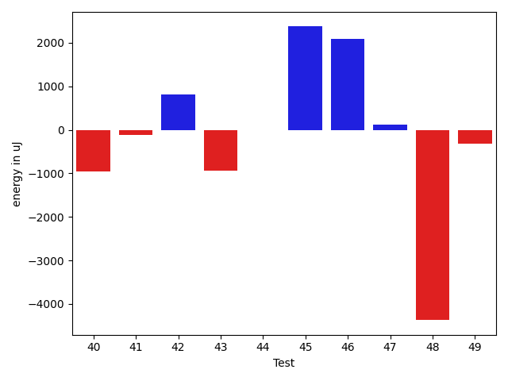

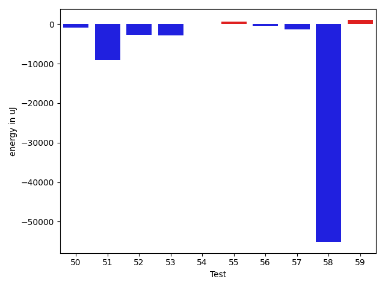

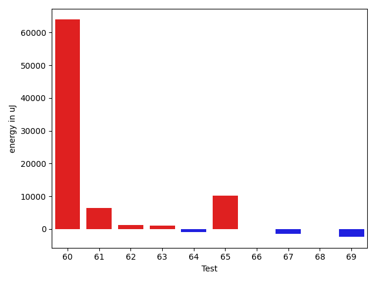

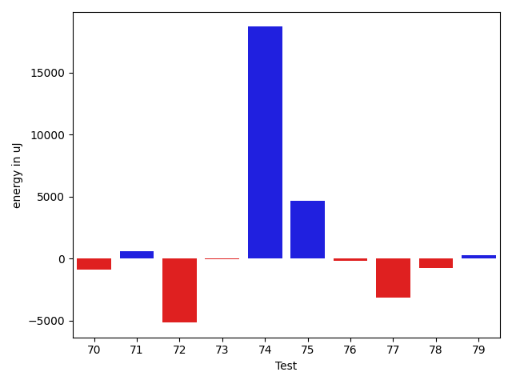

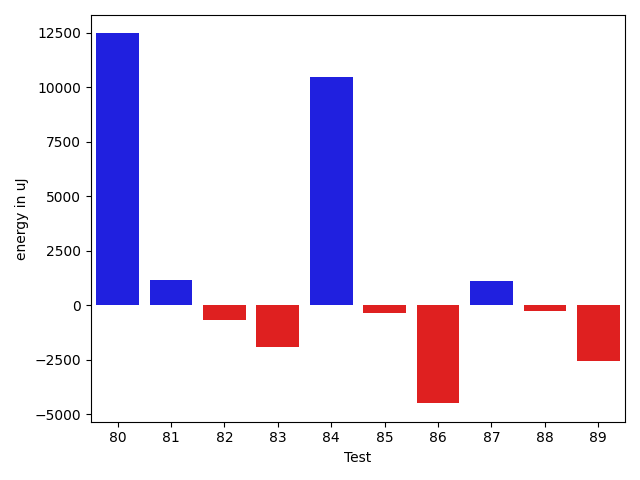

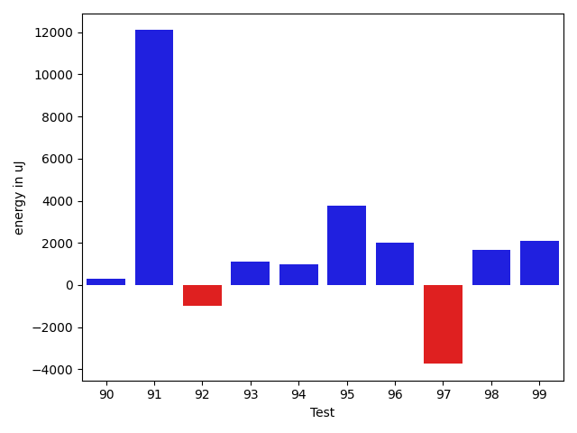

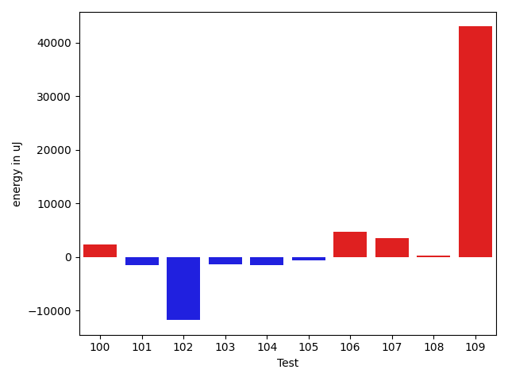

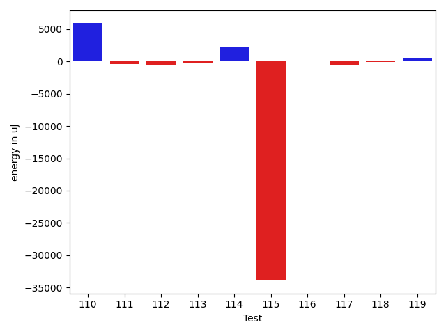

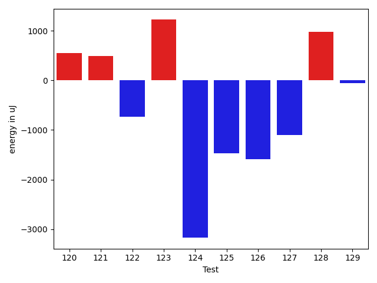

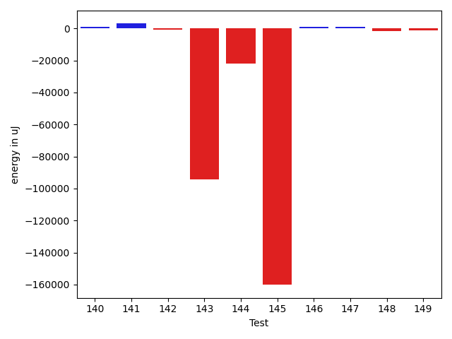

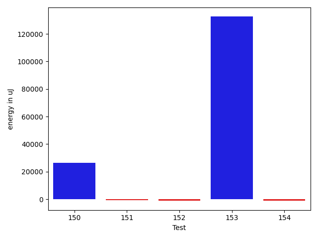

| ID | EnergyV1 | EnergyV2 | DeltaEnergy | σV1 | σV2 |
| --- | --- | --- | --- | --- | --- |
| 0 | 41272.454545454544 | 41116.10810810811 | -156.3464373464376 | 4861.4217342498605 | 5028.2340287393245 |
| 1 | 40132.75 | 40537.27777777778 | 404.527777777781 | 4466.998453939737 | 4039.229709370554 |
| 2 | 39313.73529411765 | 38754.76 | -558.9752941176484 | 4544.7239436569125 | 4460.968973485469 |
| 3 | 69637.61956521739 | 64827.40449438202 | -4810.215070835373 | 52610.80089116318 | 48658.40447185354 |
| 4 | 142499.13636363635 | 88218.68965517242 | -54280.44670846393 | 390199.3074800825 | 256184.3386777015 |
| 5 | 40873.40983606558 | 40937.301886792455 | 63.89205072687764 | 5651.805126920968 | 6356.190206924287 |
| 6 | 39971.27027027027 | 40900.42857142857 | 929.1583011582989 | 4562.361216837168 | 4745.467571638162 |
| 7 | 39993.166666666664 | 40113.07142857143 | 119.90476190476329 | 5750.436944750855 | 4639.787687018907 |
| 8 | 51843.82352941176 | 46847.57894736842 | -4996.244582043342 | 22551.991501952823 | 19296.237425210205 |
| 9 | 41701.56 | 41997.83720930233 | 296.27720930233045 | 7832.769357411209 | 6981.771831256858 |
| 10 | 38644.93548387097 | 39369.807692307695 | 724.8722084367255 | 4880.948803423789 | 4402.190250486602 |
| 11 | 39775.08 | 41697.0 | 1921.9199999999983 | 4680.341738975905 | 4974.009214573961 |
| 12 | 38142.38181818182 | 38437.37037037037 | 294.9885521885517 | 6963.019004297981 | 5928.912573758381 |
| 13 | 40744.46315789474 | 41145.11224489796 | 400.6490870032212 | 9905.818227380605 | 11255.761368170388 |
| 14 | 39728.375 | 38547.509090909094 | -1180.865909090906 | 5207.210291517838 | 4959.726997152262 |
| 15 | 37236.67857142857 | 38108.142857142855 | 871.4642857142826 | 3888.618475330754 | 3469.803170327724 |
| 16 | 126825.83838383839 | 126973.73737373737 | 147.8989898989821 | 27902.3606845704 | 24663.819591051106 |
| 17 | 36273.32558139535 | 36184.794117647056 | -88.53146374829521 | 4036.7994789847617 | 4374.432028876379 |
| 18 | 37371.71666666667 | 37063.91379310345 | -307.8028735632179 | 3850.546048253705 | 3734.624397328344 |
| 19 | 43172.94736842105 | 41990.094736842104 | -1182.8526315789495 | 11805.765180728145 | 11224.080106321862 |
| 20 | 43637.735849056604 | 44515.755102040814 | 878.0192529842097 | 15647.683060936124 | 14025.42490102566 |
| 21 | 36177.96296296296 | 37439.5 | 1261.5370370370365 | 3278.447051990063 | 3835.9062986930403 |
| 22 | 35730.83018867925 | 37271.230769230766 | 1540.400580551519 | 4681.959530649086 | 4606.183497027015 |
| 23 | 37032.34782608696 | 37138.555555555555 | 106.20772946859506 | 4196.294292832725 | 4275.982307184868 |
| 24 | 38004.53333333333 | 38156.56140350877 | 152.0280701754382 | 3607.917445470909 | 4093.8151640134906 |
| 25 | 36250.903225806454 | 37673.96428571428 | 1423.0610599078282 | 4297.219839090556 | 4199.520623000941 |
| 26 | 39404.13333333333 | 38613.32142857143 | -790.8119047619039 | 4299.885663079375 | 4540.662939747671 |
| 27 | 40081.132352941175 | 38904.763636363634 | -1176.368716577541 | 8377.251923590828 | 3808.017938095815 |
| 28 | 38793.885714285716 | 39099.450980392154 | 305.5652661064378 | 5178.750581649861 | 6383.353852361611 |
| 29 | 37691.166666666664 | 38005.93103448276 | 314.76436781609664 | 4802.639108402333 | 3943.978718651356 |
| 30 | 91920.66666666667 | 60847.934426229505 | -31072.732240437166 | 210473.855525747 | 126451.28630617999 |
| 31 | 70363.5 | 56782.05333333334 | -13581.446666666663 | 158877.31693284417 | 126746.41079403587 |
| 32 | 95583.32323232324 | 90535.85858585859 | -5047.46464646465 | 28224.8652242278 | 22404.97351848112 |
| 33 | 44788.46052631579 | 45499.34146341463 | 710.8809370988456 | 14019.120203306538 | 17051.70761795665 |
| 34 | 40652.53448275862 | 40244.709677419356 | -407.8248053392672 | 5776.448154644312 | 4512.666736753681 |
| 35 | 44708.15625 | 46635.442307692305 | 1927.286057692305 | 11745.043984350843 | 14401.73301726281 |
| 36 | 39436.88636363636 | 40054.3 | 617.4136363636426 | 4804.264054017341 | 4209.625394260159 |
| 37 | 42517.61038961039 | 39224.27536231884 | -3293.3350272915486 | 12858.687149116473 | 6821.183045598974 |
| 38 | 46858.242424242424 | 43739.683333333334 | -3118.5590909090897 | 21501.505034750753 | 17563.249569761345 |
| 39 | 39926.375 | 39238.86486486487 | -687.5101351351332 | 4886.0632910733975 | 4456.90651511126 |
| 40 | 40056.69090909091 | 39108.53333333333 | -948.1575757575774 | 4265.942154799942 | 4091.703039077983 |
| 41 | 39735.2 | 39623.767857142855 | -111.43214285714203 | 4985.963228460028 | 4594.517913429437 |
| 42 | 39548.68965517241 | 40355.53488372093 | 806.8452285485182 | 4302.628836384344 | 3642.9357018554274 |
| 43 | 39799.21428571428 | 38867.854166666664 | -931.3601190476184 | 5258.526140314161 | 4148.571546275413 |
| 44 | 40491.63888888889 | 40485.375 | -6.263888888890506 | 4545.857419140455 | 3261.055424916142 |
| 45 | 55962.35164835165 | 58334.703296703294 | 2372.3516483516432 | 23773.616331570996 | 26480.872437361937 |
| 46 | 69727.81818181818 | 71811.07070707071 | 2083.2525252525375 | 26754.900258186874 | 27526.618581114395 |
| 47 | 39294.85106382979 | 39411.166666666664 | 116.31560283687577 | 4685.944733097885 | 4925.508762296573 |
| 48 | 44792.58823529412 | 40420.6 | -4371.98823529412 | 17271.10869021654 | 5434.432216223446 |
| 49 | 42507.63157894737 | 42186.710144927536 | -320.9214340198305 | 8587.72478422132 | 10196.066456793342 |
| 50 | 40612.055555555555 | 39718.675 | -893.3805555555518 | 4111.164836360663 | 3837.142265980635 |
| 51 | 83820.98979591837 | 74791.9191919192 | -9029.070603999178 | 50588.182881125336 | 36275.57013973959 |
| 52 | 42607.82142857143 | 39845.63076923077 | -2762.19065934066 | 8740.562929540358 | 4386.561301097252 |
| 53 | 46299.17567567567 | 43395.86075949367 | -2903.314916182004 | 14157.485124014984 | 10097.785099581044 |
| 54 | 42821.76315789474 | 42821.012658227846 | -0.7504996668940294 | 9604.818465733504 | 11298.028638945028 |
| 55 | 40631.23529411765 | 41281.117647058825 | 649.8823529411748 | 5682.36134148691 | 3669.737446648689 |
| 56 | 44128.333333333336 | 43637.27272727273 | -491.0606060606078 | 7609.018124226988 | 7634.60002037267 |
| 57 | 40978.02564102564 | 39628.574468085106 | -1349.451172940535 | 4755.120578627975 | 3823.766527551135 |
| 58 | 144007.7741935484 | 88853.71264367815 | -55154.06154987024 | 381717.29963955045 | 241965.31952730723 |
| 59 | 39108.68965517241 | 40137.36111111111 | 1028.6714559386965 | 5776.552450556553 | 4523.964664568616 |
| 60 | 75356.64705882352 | 139281.17441860464 | 63924.52735978112 | 203718.29192199855 | 398697.3993753645 |
| 61 | 116256.24242424243 | 122658.76767676767 | 6402.525252525244 | 39957.73390761969 | 36564.031675130755 |
| 62 | 44141.745762711864 | 45401.65517241379 | 1259.909409701926 | 9164.970536524566 | 12410.736744297912 |
| 63 | 40443.04761904762 | 41438.6 | 995.5523809523802 | 3236.709873815729 | 4083.1496796794836 |
| 64 | 40766.3 | 39892.63492063492 | -873.6650793650842 | 4416.065512421663 | 5058.403102371552 |
| 65 | 279161.75757575757 | 289381.7272727273 | 10219.969696969725 | 294474.0022313743 | 273610.5735525473 |
| 66 | 42304.767123287675 | 42213.72619047619 | -91.0409328114838 | 6193.2741125708035 | 11342.926145054951 |
| 67 | 41348.78571428572 | 39809.39473684211 | -1539.3909774436106 | 4142.556080809656 | 5196.026252615265 |
| 68 | 40398.73684210526 | 40295.04878048781 | -103.68806161745306 | 4747.036979911012 | 4429.810335372899 |
| 69 | 41923.91428571429 | 39513.52173913043 | -2410.3925465838547 | 6833.666877500913 | 3722.035947885713 |
| 70 | 41699.6935483871 | 40792.666666666664 | -907.0268817204342 | 6452.794447391065 | 6509.236885451158 |
| 71 | 39893.0243902439 | 40491.30357142857 | 598.2791811846691 | 5069.602016841284 | 5217.498148126316 |
| 72 | 57807.60975609756 | 52642.03773584906 | -5165.572020248503 | 39734.082164528045 | 30340.029156938184 |
| 73 | 40138.73333333333 | 40062.583333333336 | -76.14999999999418 | 4829.2581551299245 | 4568.467639853529 |
| 74 | 125026.65909090909 | 143704.33333333334 | 18677.674242424255 | 142825.58490053253 | 209568.00237343044 |
| 75 | 90361.83561643836 | 94986.2602739726 | 4624.42465753424 | 37097.83019538818 | 52224.80725841726 |
| 76 | 40242.8813559322 | 40052.709677419356 | -190.17167851284466 | 6493.191793246961 | 8074.670256699184 |
| 77 | 44031.864197530864 | 40851.36666666667 | -3180.497530864195 | 12919.816795086328 | 9989.384161253942 |
| 78 | 39691.51282051282 | 38954.125 | -737.3878205128203 | 4499.2957390320025 | 4533.400628598249 |
| 79 | 39159.24137931035 | 39395.72972972973 | 236.48835041937855 | 4925.933922689335 | 5211.769262531957 |
| 80 | 54802.06060606061 | 67261.5 | 12459.439393939392 | 39035.371724023455 | 50027.687500934684 |
| 81 | 39738.5 | 40906.42857142857 | 1167.9285714285725 | 4472.783871113415 | 3806.0157404202273 |
| 82 | 40958.857142857145 | 40259.57692307692 | -699.280219780223 | 4659.634502176919 | 3340.052546489892 |
| 83 | 41919.666666666664 | 39978.09375 | -1941.5729166666642 | 4970.217835601708 | 4481.907778498006 |
| 84 | 110973.38461538461 | 121446.6170212766 | 10473.232405891991 | 167444.22666094778 | 182549.60025627463 |
| 85 | 39513.0 | 39141.25 | -371.75 | 5075.756692356323 | 3893.1006842233096 |
| 86 | 51951.140845070426 | 47451.90625 | -4499.234595070426 | 22482.544913398473 | 19077.161015136946 |
| 87 | 43067.792207792205 | 44194.42352941177 | 1126.631321619563 | 10792.722260902403 | 10839.187911165856 |
| 88 | 39736.11538461538 | 39455.89361702128 | -280.2217675941065 | 5915.713926139191 | 4343.2968173959525 |
| 89 | 67254.59016393442 | 64706.35849056604 | -2548.231673368384 | 41146.00812794382 | 38208.61721490661 |
| 90 | 40362.95384615385 | 40660.360655737706 | 297.4068095838593 | 4825.066365205669 | 3930.712316177615 |
| 91 | 68764.06666666667 | 80863.46296296296 | 12099.396296296298 | 45538.37649677711 | 52166.55209597393 |
| 92 | 40782.0 | 39798.38888888889 | -983.6111111111095 | 5253.954824141301 | 4174.123303014111 |
| 93 | 39863.4375 | 40979.724137931036 | 1116.2866379310362 | 5019.314507090959 | 4175.942461426102 |
| 94 | 40118.148148148146 | 41119.470588235294 | 1001.3224400871477 | 4198.163175976632 | 4391.795440399224 |
| 95 | 39249.857142857145 | 43014.416666666664 | 3764.5595238095193 | 4780.017346907299 | 3738.4849640447783 |
| 96 | 38037.04 | 40053.52 | 2016.479999999996 | 3808.8106750533034 | 4044.1264977248175 |
| 97 | 58358.470588235294 | 54616.84375 | -3741.6268382352937 | 28990.53360529473 | 26706.298652084603 |
| 98 | 38742.76470588235 | 40421.21052631579 | 1678.445820433437 | 3520.109332015493 | 4459.330107573362 |
| 99 | 38850.73333333333 | 40943.76470588235 | 2093.0313725490196 | 4386.419670857873 | 3208.569051212921 |
| 100 | 39147.34782608696 | 41447.72 | 2300.3721739130415 | 5181.805129562105 | 4697.762731513801 |
| 101 | 74350.46 | 72779.44 | -1571.020000000004 | 48604.13117964768 | 43255.773668337046 |
| 102 | 132122.32558139536 | 120350.11111111111 | -11772.214470284249 | 275474.4069598735 | 281998.62565474585 |
| 103 | 39992.81081081081 | 38556.0 | -1436.8108108108136 | 4463.829314993646 | 4295.300026561802 |
| 104 | 39984.256410256414 | 38519.83783783784 | -1464.4185724185736 | 5024.487960736607 | 4342.974398076977 |
| 105 | 41522.11627906977 | 40935.18421052631 | -586.9320685434577 | 5632.790973333724 | 5926.769350982936 |
| 106 | 48255.243589743586 | 52905.211764705884 | 4649.968174962298 | 16939.62037853473 | 24310.62304865877 |
| 107 | 40733.05128205128 | 44318.64705882353 | 3585.5957767722502 | 6155.3823599651505 | 11497.31001654774 |
| 108 | 43696.17808219178 | 43934.4375 | 238.25941780822177 | 11019.430513021096 | 13175.848232508362 |
| 109 | 116564.52525252526 | 159588.0101010101 | 43023.48484848483 | 158721.6576316549 | 319509.7147916039 |
| 110 | 49160.08474576271 | 55061.30158730159 | 5901.2168415388805 | 19588.473349887652 | 26700.680728279003 |
| 111 | 44662.333333333336 | 44234.0 | -428.33333333333576 | 15040.237208689587 | 13562.506369561279 |
| 112 | 42333.836363636365 | 41740.67796610169 | -593.158397534673 | 10699.799178682384 | 10246.601810307946 |
| 113 | 39886.38636363636 | 39602.0 | -284.38636363636033 | 5436.984542823803 | 4922.488133918804 |
| 114 | 185098.78787878787 | 187346.59595959596 | 2247.808080808085 | 310298.6676528222 | 347649.61434042885 |
| 115 | 155106.56565656565 | 121182.22222222222 | -33924.343434343435 | 309426.05380121624 | 178722.94514381725 |
| 116 | 64361.656565656565 | 64496.36082474227 | 134.70425908570178 | 27578.948259024895 | 28776.295197300446 |
| 117 | 40559.112676056335 | 39955.68831168831 | -603.4243643680238 | 6016.563530762262 | 6242.284081344027 |
| 118 | 40108.02631578947 | 40029.0 | -79.0263157894733 | 6618.264892214424 | 5618.307559720849 |
| 119 | 47118.967741935485 | 47578.30927835051 | 459.3415364150278 | 16454.79776323814 | 16007.125241018966 |
| 120 | 50844.2 | 59485.22988505747 | 8641.029885057476 | 29067.813706037272 | 42110.59974671 |
| 121 | 44116.96511627907 | 43111.56470588235 | -1005.4004103967163 | 15222.8516546271 | 11568.781830677472 |
| 122 | 43051.805555555555 | 42032.694444444445 | -1019.1111111111095 | 10025.308287915484 | 8459.862130540125 |
| 123 | 56678.131313131315 | 58546.22222222222 | 1868.0909090909045 | 22938.14004887817 | 23725.770787175003 |
| 124 | 39633.392857142855 | 37073.27272727273 | -2560.120129870127 | 4681.736730098029 | 4577.248818209651 |
| 125 | 39787.46551724138 | 38322.416666666664 | -1465.0488505747126 | 4427.4100672948 | 4626.123061094343 |
| 126 | 39594.975 | 39424.72340425532 | -170.25159574468125 | 4933.739116975582 | 4163.231323281756 |
| 127 | 40623.53846153846 | 39991.37037037037 | -632.1680911680887 | 4685.726224238962 | 4796.678983446067 |
| 128 | 39264.84210526316 | 39367.54054054054 | 102.69843527737976 | 5459.4108489080145 | 4841.1625675154955 |
| 129 | 40899.61016949153 | 40074.36842105263 | -825.2417484388934 | 6517.275730681271 | 7695.391365471589 |
| 130 | 40045.15 | 39031.07692307692 | -1014.0730769230795 | 4516.652192442982 | 4169.538844233259 |
| 131 | 40141.94117647059 | 41123.645833333336 | 981.7046568627484 | 4864.989258645477 | 6167.994421776496 |
| 132 | 39621.36842105263 | 40511.34782608696 | 889.9794050343262 | 5066.154746639458 | 8313.375286947277 |
| 133 | 39780.26315789474 | 39096.44117647059 | -683.8219814241529 | 3987.1178660927926 | 4213.080221455811 |
| 134 | 231330.52173913043 | 242802.47826086957 | 11471.956521739135 | 361933.7155967109 | 387440.44866061216 |
| 135 | 39659.69047619047 | 38892.181818181816 | -767.5086580086572 | 4801.020186665168 | 4810.867063881114 |
| 136 | 65422.04878048781 | 67610.92 | 2188.8712195121916 | 51431.135962922745 | 62991.583681263335 |
| 137 | 167052.76470588235 | 147433.08450704225 | -19619.6801988401 | 400779.48636431555 | 368716.5050601062 |
| 138 | 41219.23728813559 | 41129.0350877193 | -90.20220041629364 | 4898.779271458759 | 5228.171821512762 |
| 139 | 108872.20779220779 | 189120.4 | 80248.1922077922 | 310457.6439086457 | 437046.2783805591 |
| 140 | 51426.0 | 52578.30434782609 | 1152.304347826088 | 21272.389142840642 | 20291.335827595034 |
| 141 | 72416.47474747474 | 75394.17171717172 | 2977.6969696969754 | 27037.759136027653 | 24935.665815806566 |
| 142 | 42355.10526315789 | 41613.42372881356 | -741.6815343443304 | 5136.840153328649 | 4968.3278543098895 |
| 143 | 208540.78260869565 | 114311.66666666667 | -94229.11594202898 | 429462.40690709016 | 304451.48502767325 |
| 144 | 138462.07142857142 | 116573.90476190476 | -21888.166666666657 | 341592.504398456 | 345951.7073340211 |
| 145 | 329481.70707070705 | 169318.39393939395 | -160163.3131313131 | 561191.272374921 | 194376.2754862211 |
| 146 | 39913.6724137931 | 41076.61538461538 | 1162.9429708222815 | 5401.0426783517405 | 4376.084050986884 |
| 147 | 45047.470588235294 | 45911.52173913043 | 864.0511508951386 | 9091.576496423017 | 8633.63939518261 |
| 148 | 41874.92105263158 | 40214.21276595745 | -1660.708286674133 | 3888.188120730318 | 5797.40874226955 |
| 149 | 41386.46153846154 | 40181.36111111111 | -1205.1004273504295 | 3829.1268459489384 | 4003.6196758043407 |
| 150 | 87434.7042253521 | 113783.71052631579 | 26349.00630096368 | 248393.9504250407 | 284144.70252560335 |
| 151 | 41106.255319148935 | 40500.63043478261 | -605.624884366327 | 3669.5477109443927 | 3627.9807616496273 |
| 152 | 41635.4 | 40764.346153846156 | -871.0538461538454 | 3590.9291858483894 | 5788.299793165704 |
| 153 | 245613.66666666666 | 378120.06666666665 | 132506.4 | 504146.95511341427 | 561240.2988248399 |
| 154 | 44200.666666666664 | 43068.36666666667 | -1132.2999999999956 | 6822.863279689353 | 7251.260021464468 |

## Delta Duration per test method

| ID | DurationV1 | DurationsV2 | DeltaDuration |
| --- | --- | --- | --- |
| 0 | 715166.0909090909 | 656158.3513513514 | -59007.73955773958 |
| 1 | 497108.85714285716 | 466576.44444444444 | -30532.41269841272 |
| 2 | 628008.7941176471 | 616046.48 | -11962.314117647125 |
| 3 | 2022876.5217391304 | 1818338.6741573033 | -204537.84758182708 |
| 4 | 3901394.9545454546 | 2468837.8620689656 | -1432557.092476489 |
| 5 | 876627.9344262296 | 848751.0188679246 | -27876.915558304987 |
| 6 | 769900.6486486486 | 754287.6857142857 | -15612.962934362935 |
| 7 | 457617.9583333333 | 477360.5714285714 | 19742.613095238106 |
| 8 | 1349058.3823529412 | 1130938.3026315789 | -218120.07972136233 |
| 9 | 988663.5 | 855917.0930232558 | -132746.40697674418 |
| 10 | 576496.1612903225 | 572967.7692307692 | -3528.392059553298 |
| 11 | 466356.36 | 457758.0833333333 | -8598.276666666672 |
| 12 | 914790.6909090909 | 894359.8888888889 | -20430.80202020204 |
| 13 | 1343764.9684210527 | 1324101.7653061224 | -19663.203114930307 |
| 14 | 1022498.375 | 961058.7818181819 | -61439.59318181814 |
| 15 | 796980.7142857143 | 793206.8571428572 | -3773.8571428571595 |
| 16 | 3698884.0707070706 | 3665860.1919191917 | -33023.8787878789 |
| 17 | 661506.1860465116 | 571759.4117647059 | -89746.77428180573 |
| 18 | 901255.4833333333 | 860726.9655172414 | -40528.51781609189 |
| 19 | 1402702.894736842 | 1304310.2105263157 | -98392.68421052629 |
| 20 | 1291659.2452830188 | 1087758.530612245 | -203900.71467077383 |
| 21 | 627404.5925925926 | 550507.4705882353 | -76897.12200435728 |
| 22 | 899080.6226415094 | 853194.7884615385 | -45885.8341799709 |
| 23 | 527702.4347826086 | 497446.55555555556 | -30255.879227053083 |
| 24 | 802727.6444444444 | 814102.0 | 11374.35555555555 |
| 25 | 581589.9677419355 | 519731.39285714284 | -61858.57488479267 |
| 26 | 627169.0333333333 | 517780.0714285714 | -109388.9619047619 |
| 27 | 880894.0294117647 | 878073.6181818182 | -2820.411229946534 |
| 28 | 963401.4714285714 | 973365.5490196078 | 9964.077591036446 |
| 29 | 573292.4333333333 | 561794.0 | -11498.433333333349 |
| 30 | 2602772.714285714 | 1650524.737704918 | -952247.9765807961 |
| 31 | 1935096.9852941176 | 1462592.6666666667 | -472504.31862745085 |
| 32 | 2690002.8484848486 | 2606728.707070707 | -83274.14141414175 |
| 33 | 1314628.9736842106 | 1257439.4024390243 | -57189.571245186264 |
| 34 | 926736.0344827586 | 908453.8064516129 | -18282.228031145758 |
| 35 | 1050660.234375 | 1045535.75 | -5124.484375 |
| 36 | 695854.3409090909 | 651038.15 | -44816.19090909092 |
| 37 | 1136617.7402597403 | 1104567.5507246377 | -32050.189535102574 |
| 38 | 1221208.8484848484 | 1119998.2 | -101210.64848484844 |
| 39 | 658316.03125 | 648616.6756756756 | -9699.355574324378 |
| 40 | 804856.5454545454 | 804947.0666666667 | 90.52121212123893 |
| 41 | 890069.6444444444 | 853973.1964285715 | -36096.44801587297 |
| 42 | 686292.9310344828 | 614725.2558139535 | -71567.67522052932 |
| 43 | 830367.3392857143 | 820296.5833333334 | -10070.755952380947 |
| 44 | 683628.2222222222 | 657028.8125 | -26599.409722222248 |
| 45 | 1598287.6483516484 | 1631651.1098901099 | 33363.4615384615 |
| 46 | 1968337.313131313 | 2002388.4242424243 | 34051.11111111124 |
| 47 | 664554.3617021276 | 712230.3571428572 | 47675.995440729544 |
| 48 | 1104122.205882353 | 1034240.2 | -69882.00588235306 |
| 49 | 1074195.4605263157 | 1108842.8405797102 | 34647.380053394474 |
| 50 | 765290.8518518518 | 773268.875 | 7978.023148148204 |
| 51 | 2348164.173469388 | 2146656.9494949495 | -201507.22397443838 |
| 52 | 972645.5 | 932425.6923076923 | -40219.807692307746 |
| 53 | 1286049.2432432433 | 1214464.2658227847 | -71584.97742045857 |
| 54 | 1176776.4605263157 | 1089856.2911392406 | -86920.16938707512 |
| 55 | 445026.76470588235 | 433424.70588235295 | -11602.058823529398 |
| 56 | 840870.4074074074 | 775356.4545454546 | -65513.95286195283 |
| 57 | 808132.7692307692 | 773221.3191489362 | -34911.450081833056 |
| 58 | 4171795.505376344 | 2625028.264367816 | -1546767.241008528 |
| 59 | 664864.551724138 | 614475.1111111111 | -50389.44061302685 |
| 60 | 2283408.3882352943 | 3943865.2441860465 | 1660456.8559507523 |
| 61 | 3095827.515151515 | 3174852.8383838385 | 79025.3232323234 |
| 62 | 1077814.2372881356 | 1131143.5 | 53329.26271186443 |
| 63 | 442506.85714285716 | 456798.6 | 14291.742857142817 |
| 64 | 878608.9166666666 | 995896.2857142857 | 117287.36904761905 |
| 65 | 7465362.777777778 | 7832721.545454546 | 367358.7676767679 |
| 66 | 1115668.6301369863 | 1217785.392857143 | 102116.7627201567 |
| 67 | 646542.1428571428 | 723588.8684210526 | 77046.72556390974 |
| 68 | 677135.8157894737 | 708943.6829268293 | 31807.867137355614 |
| 69 | 731734.2857142857 | 763902.0434782609 | 32167.757763975183 |
| 70 | 945367.7580645161 | 1033772.3333333334 | 88404.57526881725 |
| 71 | 840985.2926829269 | 890035.6428571428 | 49050.35017421597 |
| 72 | 1312021.463414634 | 1279377.9056603773 | -32643.557754256763 |
| 73 | 654079.1333333333 | 630203.5555555555 | -23875.5777777778 |
| 74 | 3414924.1363636362 | 4041143.6296296297 | 626219.4932659934 |
| 75 | 2388962.671232877 | 2605914.7397260275 | 216952.06849315064 |
| 76 | 958625.3728813559 | 1036402.9193548387 | 77777.54647348274 |
| 77 | 1220194.8395061728 | 1217245.3333333333 | -2949.506172839552 |
| 78 | 736151.717948718 | 708520.725 | -27630.99294871802 |
| 79 | 680273.448275862 | 645435.5945945946 | -34837.85368126747 |
| 80 | 1452262.5454545454 | 1861585.8676470588 | 409323.3221925134 |
| 81 | 666434.7692307692 | 616065.6785714285 | -50369.09065934073 |
| 82 | 607982.6428571428 | 592016.6923076923 | -15965.950549450587 |
| 83 | 634251.3703703703 | 626824.53125 | -7426.839120370336 |
| 84 | 2993956.653846154 | 3209436.9574468085 | 215480.30360065447 |
| 85 | 624688.1904761905 | 605363.4583333334 | -19324.73214285716 |
| 86 | 1276764.5774647887 | 1155734.390625 | -121030.18683978869 |
| 87 | 1314022.6363636365 | 1242859.294117647 | -71163.34224598948 |
| 88 | 909249.4615384615 | 867806.2340425532 | -41443.22749590827 |
| 89 | 1729640.0655737706 | 1684156.1509433961 | -45483.914630374406 |
| 90 | 972247.323076923 | 953035.9508196721 | -19211.372257250943 |
| 91 | 1678040.3166666667 | 2081470.9814814816 | 403430.6648148149 |
| 92 | 487605.76470588235 | 451918.22222222225 | -35687.5424836601 |
| 93 | 609983.28125 | 578297.275862069 | -31686.005387931014 |
| 94 | 494187.962962963 | 560630.2941176471 | 66442.33115468413 |
| 95 | 476652.4285714286 | 472725.2083333333 | -3927.220238095266 |
| 96 | 566962.4 | 508713.44 | -58248.96000000002 |
| 97 | 1280591.3235294118 | 1343508.71875 | 62917.395220588194 |
| 98 | 586148.7058823529 | 498285.84210526315 | -87862.86377708975 |
| 99 | 500714.4 | 420799.9411764706 | -79914.45882352942 |
| 100 | 595997.9565217391 | 589273.56 | -6724.39652173908 |
| 101 | 1755005.08 | 1860403.82 | 105398.73999999999 |
| 102 | 3817760.581395349 | 3376719.2666666666 | -441041.3147286824 |
| 103 | 643346.0810810811 | 709153.2954545454 | 65807.21437346435 |
| 104 | 699123.1025641026 | 685557.5675675676 | -13565.534996535047 |
| 105 | 785997.4651162791 | 810275.552631579 | 24278.087515299907 |
| 106 | 1382139.5512820513 | 1497927.0352941176 | 115787.48401206639 |
| 107 | 1089775.2051282052 | 1173196.482352941 | 83421.27722473582 |
| 108 | 1126454.2602739725 | 1177267.075 | 50812.81472602743 |
| 109 | 3120278.696969697 | 4502935.919191919 | 1382657.2222222225 |
| 110 | 1188900.559322034 | 1379804.2857142857 | 190903.72639225167 |
| 111 | 1211109.0952380951 | 1275652.7926829269 | 64543.69744483172 |
| 112 | 1047795.9090909091 | 1000680.8813559322 | -47115.027734976844 |
| 113 | 871216.5454545454 | 824966.75 | -46249.79545454541 |
| 114 | 5049549.313131313 | 5465287.656565657 | 415738.34343434405 |
| 115 | 4510404.464646464 | 3388454.6363636362 | -1121949.828282828 |
| 116 | 1820606.1616161617 | 1850633.1546391752 | 30026.993023013463 |
| 117 | 1045676.7887323943 | 1029819.6493506493 | -15857.139381745015 |
| 118 | 1082641.8157894737 | 1124058.2328767122 | 41416.417087238515 |
| 119 | 1378433.430107527 | 1441426.824742268 | 62993.394634741126 |
| 120 | 1500227.4555555556 | 1844008.183908046 | 343780.72835249035 |
| 121 | 1211628.9302325582 | 1235982.5529411766 | 24353.622708618408 |
| 122 | 754165.0833333334 | 718669.6388888889 | -35495.444444444496 |
| 123 | 1683855.5555555555 | 1756472.2727272727 | 72616.7171717172 |
| 124 | 547324.3214285715 | 526831.4090909091 | -20492.91233766242 |
| 125 | 809311.9137931034 | 800908.8958333334 | -8403.017959770048 |
| 126 | 703181.2 | 758550.5531914893 | 55369.353191489354 |
| 127 | 511425.42307692306 | 575072.8148148148 | 63647.39173789177 |
| 128 | 745412.0 | 783413.5405405406 | 38001.54054054059 |
| 129 | 969645.3220338983 | 949844.1228070175 | -19801.199226880795 |
| 130 | 690220.05 | 690428.8974358974 | 208.84743589733262 |
| 131 | 787617.6078431372 | 863021.875 | 75404.26715686277 |
| 132 | 672925.5263157894 | 641110.4347826086 | -31815.091533180792 |
| 133 | 734724.0 | 692655.2058823529 | -42068.79411764711 |
| 134 | 6632208.0 | 6629378.608695652 | -2829.391304347664 |
| 135 | 645036.4761904762 | 628741.9696969697 | -16294.506493506487 |
| 136 | 1597466.0 | 1600667.32 | 3201.320000000065 |
| 137 | 4612295.323529412 | 3992341.591549296 | -619953.7319801161 |
| 138 | 908676.2711864407 | 948855.0175438597 | 40178.746357418946 |
| 139 | 2797187.337662338 | 5450870.6 | 2653683.262337662 |
| 140 | 1449251.3111111112 | 1460806.1630434783 | 11554.851932367077 |
| 141 | 2034656.616161616 | 2151089.8181818184 | 116433.2020202023 |
| 142 | 898103.8070175438 | 892175.593220339 | -5928.2137972047785 |
| 143 | 5070214.434782608 | 2327355.8333333335 | -2742858.601449275 |
| 144 | 2884012.214285714 | 2424494.380952381 | -459517.833333333 |
| 145 | 9109560.787878787 | 4511850.111111111 | -4597710.676767676 |
| 146 | 908711.7586206896 | 833357.5769230769 | -75354.18169761274 |
| 147 | 888568.0588235294 | 1061201.7826086956 | 172633.72378516616 |
| 148 | 807977.2631578947 | 812447.4468085107 | 4470.183650615974 |
| 149 | 674162.2307692308 | 696997.0555555555 | 22834.824786324752 |
| 150 | 2200173.6901408453 | 3164491.75 | 964318.0598591547 |
| 151 | 785282.0212765958 | 821634.4782608695 | 36352.45698427374 |
| 152 | 906546.8888888889 | 903811.4423076923 | -2735.446581196622 |
| 153 | 5663386.142857143 | 10176108.066666666 | 4512721.923809524 |
| 154 | 832427.7407407408 | 872597.0 | 40169.25925925921 |

## Misc.

| ID | Test Class | Test Method |
| --- | --- | --- |
| 0 | com.google.gson.MixedStreamTest | testReaderDoesNotMutateState |
| 1 | com.google.gson.MixedStreamTest | testReadInvalidState |
| 2 | com.google.gson.MixedStreamTest | testWriteInvalidState |
| 3 | com.google.gson.MixedStreamTest | testWriteHtmlSafe |
| 4 | com.google.gson.MixedStreamTest | testWriteMixedStreamed |
| 5 | com.google.gson.MixedStreamTest | testReadMixedStreamed |
| 6 | com.google.gson.MixedStreamTest | testWriteDoesNotMutateState |
| 7 | com.google.gson.MixedStreamTest | testReadNulls |
| 8 | com.google.gson.MixedStreamTest | testWriteLenient |
| 9 | com.google.gson.MixedStreamTest | testReadClosed |
| 10 | com.google.gson.MixedStreamTest | testWriteClosed |
| 11 | com.google.gson.MixedStreamTest | testWriteNulls |
| 12 | com.google.gson.functional.DefaultTypeAdaptersTest | testDateSerializationWithPatternNotOverridenByTypeAdapter |
| 13 | com.google.gson.functional.DefaultTypeAdaptersTest | testDateSerializationWithPattern |
| 14 | com.google.gson.functional.DefaultTypeAdaptersTest | testBitSetDeserialization |
| 15 | com.google.gson.functional.DefaultTypeAdaptersTest | testSqlDateSerialization |
| 16 | com.google.gson.functional.DefaultTypeAdaptersTest | testDefaultDateDeserializationUsingBuilder |
| 17 | com.google.gson.functional.DefaultTypeAdaptersTest | testDefaultCalendarSerialization |
| 18 | com.google.gson.functional.DefaultTypeAdaptersTest | testDateDeserializationWithPattern |
| 19 | com.google.gson.functional.DefaultTypeAdaptersTest | testDateSerializationInCollection |
| 20 | com.google.gson.functional.DefaultTypeAdaptersTest | testSetSerialization |
| 21 | com.google.gson.functional.DefaultTypeAdaptersTest | testDefaultGregorianCalendarSerialization |
| 22 | com.google.gson.functional.DefaultTypeAdaptersTest | testDefaultDateSerializationUsingBuilder |
| 23 | com.google.gson.functional.DefaultTypeAdaptersTest | testDefaultGregorianCalendarDeserialization |
| 24 | com.google.gson.functional.DefaultTypeAdaptersTest | testTimestampSerialization |
| 25 | com.google.gson.functional.DefaultTypeAdaptersTest | testDefaultCalendarDeserialization |
| 26 | com.google.gson.functional.DefaultTypeAdaptersTest | testBitSetSerialization |
| 27 | com.google.gson.functional.CustomTypeAdaptersTest | testCustomAdapterInvokedForMapElementDeserialization |
| 28 | com.google.gson.functional.CustomTypeAdaptersTest | testCustomAdapterInvokedForMapElementSerializationWithType |
| 29 | com.google.gson.functional.CustomTypeAdaptersTest | testCustomAdapterInvokedForMapElementSerialization |
| 30 | com.google.gson.functional.CustomTypeAdaptersTest | testCustomSerializers |
| 31 | com.google.gson.functional.CustomTypeAdaptersTest | testCustomNestedDeserializers |
| 32 | com.google.gson.functional.CustomTypeAdaptersTest | testCustomTypeAdapterDoesNotAppliesToSubClasses |
| 33 | com.google.gson.functional.CustomTypeAdaptersTest | testCustomAdapterInvokedForCollectionElementSerializationWithType |
| 34 | com.google.gson.functional.CustomTypeAdaptersTest | testCustomDeserializers |
| 35 | com.google.gson.functional.CustomTypeAdaptersTest | testEnsureCustomSerializerNotInvokedForNullValues |
| 36 | com.google.gson.functional.CustomTypeAdaptersTest | testEnsureCustomDeserializerNotInvokedForNullValues |
| 37 | com.google.gson.functional.CustomTypeAdaptersTest | testCustomAdapterInvokedForCollectionElementDeserialization |
| 38 | com.google.gson.functional.CustomTypeAdaptersTest | testCustomNestedSerializers |
| 39 | com.google.gson.functional.CustomTypeAdaptersTest | testCustomAdapterInvokedForCollectionElementSerialization |
| 40 | com.google.gson.functional.CustomTypeAdaptersTest | testCustomByteArraySerializer |
| 41 | com.google.gson.functional.CustomTypeAdaptersTest | testCustomTypeAdapterAppliesToSubClassesSerializedAsBaseClass |
| 42 | com.google.gson.functional.CustomTypeAdaptersTest | testCustomDeserializerForbiddenForPrimitives |
| 43 | com.google.gson.functional.CustomTypeAdaptersTest | testCustomByteArrayDeserializerAndInstanceCreator |
| 44 | com.google.gson.functional.CustomTypeAdaptersTest | testCustomSerializerForbiddenForPrimitives |
| 45 | com.google.gson.functional.MapTest | testSerializeMaps |
| 46 | com.google.gson.functional.MapTest | testInterfaceTypeMapWithSerializer |
| 47 | com.google.gson.functional.MapTest | testMapSerializationWithNullValuesSerialized |
| 48 | com.google.gson.functional.MapTest | testMapSubclassDeserialization |
| 49 | com.google.gson.functional.MapTest | testGeneralMapField |
| 50 | com.google.gson.functional.MapTest | testMapSerializationWithNullValueButSerializeNulls |
| 51 | com.google.gson.functional.MapTest | testInterfaceTypeMap |
| 52 | com.google.gson.functional.MapTest | testCustomSerializerForSpecificMapType |
| 53 | com.google.gson.functional.ReadersWritersTest | testReadWriteTwoObjects |
| 54 | com.google.gson.functional.ReadersWritersTest | testReadWriteTwoStrings |
| 55 | com.google.gson.functional.ReadersWritersTest | testTopLevelNullObjectDeserializationWithReaderAndSerializeNulls |
| 56 | com.google.gson.functional.ReadersWritersTest | testTopLevelNullObjectSerializationWithWriterAndSerializeNulls |
| 57 | com.google.gson.functional.FieldExclusionTest | testDefaultNestedStaticClassIncluded |
| 58 | com.google.gson.functional.FieldExclusionTest | testDefaultInnerClassExclusion |
| 59 | com.google.gson.functional.FieldExclusionTest | testInnerClassExclusion |
| 60 | com.google.gson.JsonParserTest | testReadWriteTwoObjects |
| 61 | com.google.gson.functional.ObjectTest | testSingletonLists |
| 62 | com.google.gson.functional.ObjectTest | testInnerClassDeserialization |
| 63 | com.google.gson.functional.ObjectTest | testJsonObjectSerialization |
| 64 | com.google.gson.functional.VersioningTest | testVersionedGsonMixingSinceAndUntilDeserialization |
| 65 | com.google.gson.functional.VersioningTest | testVersionedUntilSerialization |
| 66 | com.google.gson.functional.VersioningTest | testVersionedGsonMixingSinceAndUntilSerialization |
| 67 | com.google.gson.functional.VersioningTest | testIgnoreLaterVersionClassSerialization |
| 68 | com.google.gson.functional.VersioningTest | testVersionedUntilDeserialization |
| 69 | com.google.gson.functional.VersioningTest | testVersionedGsonWithUnversionedClassesDeserialization |
| 70 | com.google.gson.functional.VersioningTest | testVersionedClassesSerialization |
| 71 | com.google.gson.functional.VersioningTest | testVersionedClassesDeserialization |
| 72 | com.google.gson.functional.VersioningTest | testVersionedGsonWithUnversionedClassesSerialization |
| 73 | com.google.gson.functional.NamingPolicyTest | testGsonWithLowerCaseDashPolicyDeserialiation |
| 74 | com.google.gson.functional.NamingPolicyTest | testGsonDuplicateNameUsingSerializedNameFieldNamingPolicySerialization |
| 75 | com.google.gson.functional.NamingPolicyTest | testGsonWithNonDefaultFieldNamingPolicyDeserialiation |
| 76 | com.google.gson.functional.NamingPolicyTest | testComplexFieldNameStrategy |
| 77 | com.google.gson.functional.NamingPolicyTest | testDeprecatedNamingStrategy |
| 78 | com.google.gson.functional.NamingPolicyTest | testGsonWithLowerCaseDashPolicySerialization |
| 79 | com.google.gson.functional.NamingPolicyTest | testGsonWithSerializedNameFieldNamingPolicyDeserialization |
| 80 | com.google.gson.functional.NamingPolicyTest | testGsonWithSerializedNameFieldNamingPolicySerialization |
| 81 | com.google.gson.functional.NamingPolicyTest | testGsonWithLowerCaseUnderscorePolicySerialization |
| 82 | com.google.gson.functional.NamingPolicyTest | testGsonWithUpperCamelCaseSpacesPolicySerialiation |
| 83 | com.google.gson.functional.NamingPolicyTest | testGsonWithLowerCaseUnderscorePolicyDeserialiation |
| 84 | com.google.gson.functional.NamingPolicyTest | testGsonWithNonDefaultFieldNamingPolicySerialization |
| 85 | com.google.gson.functional.NamingPolicyTest | testGsonWithUpperCamelCaseSpacesPolicyDeserialiation |
| 86 | com.google.gson.functional.CustomDeserializerTest | testCustomDeserializerReturnsNull |
| 87 | com.google.gson.functional.CustomDeserializerTest | testJsonTypeFieldBasedDeserialization |
| 88 | com.google.gson.functional.CustomDeserializerTest | testCustomDeserializerReturnsNullForArrayElements |
| 89 | com.google.gson.functional.CustomDeserializerTest | testCustomDeserializerReturnsNullForTopLevelObject |
| 90 | com.google.gson.functional.CustomDeserializerTest | testCustomDeserializerReturnsNullForArrayElementsForArrayField |
| 91 | com.google.gson.functional.PrimitiveTest | testHtmlCharacterSerialization |
| 92 | com.google.gson.functional.PrimitiveTest | testFloatInfinitySerialization |
| 93 | com.google.gson.functional.PrimitiveTest | testLongAsStringSerialization |
| 94 | com.google.gson.functional.PrimitiveTest | testFloatNaNSerialization |
| 95 | com.google.gson.functional.PrimitiveTest | testDoubleInfinitySerialization |
| 96 | com.google.gson.functional.PrimitiveTest | testLongAsStringDeserialization |
| 97 | com.google.gson.functional.PrimitiveTest | testMoreSpecificSerialization |
| 98 | com.google.gson.functional.PrimitiveTest | testNegativeInfinitySerialization |
| 99 | com.google.gson.functional.PrimitiveTest | testNegativeInfinityFloatSerialization |
| 100 | com.google.gson.functional.PrimitiveTest | testDoubleNaNSerialization |
| 101 | com.google.gson.functional.SecurityTest | testJsonWithNonExectuableTokenSerialization |
| 102 | com.google.gson.functional.SecurityTest | testNonExecutableJsonSerialization |
| 103 | com.google.gson.functional.SecurityTest | testJsonWithNonExectuableTokenWithConfiguredGsonDeserialization |
| 104 | com.google.gson.functional.SecurityTest | testJsonWithNonExectuableTokenWithRegularGsonDeserialization |
| 105 | com.google.gson.functional.SecurityTest | testNonExecutableJsonDeserialization |
| 106 | com.google.gson.functional.EnumTest | testEnumSubclassWithRegisteredTypeAdapter |
| 107 | com.google.gson.functional.MapAsArrayTypeAdapterTest | testMultipleEnableComplexKeyRegistrationHasNoEffect |
| 108 | com.google.gson.functional.MapAsArrayTypeAdapterTest | testMapWithTypeVariableDeserialization |
| 109 | com.google.gson.functional.MapAsArrayTypeAdapterTest | testSerializeComplexMapWithTypeAdapter |
| 110 | com.google.gson.functional.MapAsArrayTypeAdapterTest | testTwoTypesCollapseToOneDeserialize |
| 111 | com.google.gson.functional.MapAsArrayTypeAdapterTest | testMapWithTypeVariableSerialization |
| 112 | com.google.gson.functional.ExclusionStrategyFunctionalTest | testExclusionStrategyWithMode |
| 113 | com.google.gson.functional.ExclusionStrategyFunctionalTest | testExclusionStrategyDeserialization |
| 114 | com.google.gson.functional.ExclusionStrategyFunctionalTest | testExclusionStrategySerialization |
| 115 | com.google.gson.functional.TypeVariableTest | testAdvancedTypeVariables |
| 116 | com.google.gson.functional.TypeVariableTest | testTypeVariablesViaTypeParameter |
| 117 | com.google.gson.functional.TypeVariableTest | testBasicTypeVariables |
| 118 | com.google.gson.functional.ParameterizedTypesTest | testParameterizedTypeWithReaderDeserialization |
| 119 | com.google.gson.functional.ParameterizedTypesTest | testParameterizedTypeWithCustomSerializer |
| 120 | com.google.gson.functional.ParameterizedTypesTest | testParameterizedTypeDeserialization |
| 121 | com.google.gson.functional.ParameterizedTypesTest | testParameterizedTypesWithCustomDeserializer |
| 122 | com.google.gson.functional.NullObjectAndFieldTest | testCustomSerializationOfNulls |
| 123 | com.google.gson.functional.NullObjectAndFieldTest | testExplicitSerializationOfNullArrayMembers |
| 124 | com.google.gson.functional.NullObjectAndFieldTest | testCustomTypeAdapterPassesNullSerialization |
| 125 | com.google.gson.functional.NullObjectAndFieldTest | testCustomTypeAdapterPassesNullDesrialization |
| 126 | com.google.gson.functional.NullObjectAndFieldTest | testExplicitSerializationOfNullCollectionMembers |
| 127 | com.google.gson.functional.NullObjectAndFieldTest | testNullWrappedPrimitiveMemberDeserialization |
| 128 | com.google.gson.functional.NullObjectAndFieldTest | testExplicitDeserializationOfNulls |
| 129 | com.google.gson.functional.NullObjectAndFieldTest | testPrintPrintingObjectWithNulls |
| 130 | com.google.gson.functional.NullObjectAndFieldTest | testPrintPrintingArraysWithNulls |
| 131 | com.google.gson.functional.NullObjectAndFieldTest | testNullWrappedPrimitiveMemberSerialization |
| 132 | com.google.gson.functional.NullObjectAndFieldTest | testTopLevelNullObjectDeserialization |
| 133 | com.google.gson.functional.NullObjectAndFieldTest | testExplicitSerializationOfNullStringMembers |
| 134 | com.google.gson.functional.NullObjectAndFieldTest | testTopLevelNullObjectSerialization |
| 135 | com.google.gson.functional.NullObjectAndFieldTest | testExplicitNullSetsFieldToNullDuringDeserialization |
| 136 | com.google.gson.functional.NullObjectAndFieldTest | testExplicitSerializationOfNulls |
| 137 | com.google.gson.functional.InstanceCreatorTest | testInstanceCreatorReturnsBaseType |
| 138 | com.google.gson.functional.InstanceCreatorTest | testInstanceCreatorReturnsSubTypeForTopLevelObject |
| 139 | com.google.gson.CommentsTest | testParseComments |
| 140 | com.google.gson.functional.EscapingTest | testGsonAcceptsEscapedAndNonEscapedJsonDeserialization |
| 141 | com.google.gson.functional.UncategorizedTest | testReturningDerivedClassesDuringDeserialization |
| 142 | com.google.gson.DefaultMapJsonSerializerTest | testNonEmptyMapSerialization |
| 143 | com.google.gson.JsonObjectTest | testPropertyWithQuotes |
| 144 | com.google.gson.JsonObjectTest | testWritePropertyWithEmptyStringName |
| 145 | com.google.gson.functional.TypeHierarchyAdapterTest | testTypeHierarchy |
| 146 | com.google.gson.functional.TypeHierarchyAdapterTest | testRegisterSuperTypeFirst |
| 147 | com.google.gson.functional.PrintFormattingTest | testJsonObjectWithNullValuesSerialized |
| 148 | com.google.gson.functional.CustomSerializerTest | testBaseClassSerializerInvokedForBaseClassFieldsHoldingSubClassInstances |
| 149 | com.google.gson.functional.CustomSerializerTest | testBaseClassSerializerInvokedForBaseClassFields |
| 150 | com.google.gson.functional.CustomSerializerTest | testSubClassSerializerInvokedForBaseClassFieldsHoldingSubClassInstances |
| 151 | com.google.gson.functional.CustomSerializerTest | testSerializerReturnsNull |
| 152 | com.google.gson.functional.CustomSerializerTest | testSubClassSerializerInvokedForBaseClassFieldsHoldingArrayOfSubClassInstances |
| 153 | com.google.gson.GsonBuilderTest | testCreatingMoreThanOnce |
| 154 | com.google.gson.functional.ArrayTest | testNullsInArrayWithSerializeNullPropertySetSerialization |

| Test | IterationV1 | IterationV2 | DeltaIteration |
| --- | --- | --- | --- |
| 0 | 33 | 37 | 4 |
| 1 | 28 | 18 | -10 |
| 2 | 34 | 25 | -9 |
| 3 | 92 | 89 | -3 |
| 4 | 66 | 58 | -8 |
| 5 | 61 | 53 | -8 |
| 6 | 37 | 35 | -2 |
| 7 | 24 | 14 | -10 |
| 8 | 68 | 76 | 8 |
| 9 | 50 | 43 | -7 |
| 10 | 31 | 26 | -5 |
| 11 | 25 | 12 | -13 |
| 12 | 55 | 54 | -1 |
| 13 | 95 | 98 | 3 |
| 14 | 56 | 55 | -1 |
| 15 | 56 | 49 | -7 |
| 16 | 99 | 99 | 0 |
| 17 | 43 | 34 | -9 |
| 18 | 60 | 58 | -2 |
| 19 | 95 | 95 | 0 |
| 20 | 53 | 49 | -4 |
| 21 | 27 | 34 | 7 |
| 22 | 53 | 52 | -1 |
| 23 | 23 | 27 | 4 |
| 24 | 45 | 57 | 12 |
| 25 | 31 | 28 | -3 |
| 26 | 30 | 28 | -2 |
| 27 | 68 | 55 | -13 |
| 28 | 70 | 51 | -19 |
| 29 | 30 | 29 | -1 |
| 30 | 63 | 61 | -2 |
| 31 | 68 | 75 | 7 |
| 32 | 99 | 99 | 0 |
| 33 | 76 | 82 | 6 |
| 34 | 58 | 62 | 4 |
| 35 | 64 | 52 | -12 |
| 36 | 44 | 40 | -4 |
| 37 | 77 | 69 | -8 |
| 38 | 66 | 60 | -6 |
| 39 | 32 | 37 | 5 |
| 40 | 55 | 45 | -10 |
| 41 | 45 | 56 | 11 |
| 42 | 29 | 43 | 14 |
| 43 | 56 | 48 | -8 |
| 44 | 36 | 32 | -4 |
| 45 | 91 | 91 | 0 |
| 46 | 99 | 99 | 0 |
| 47 | 47 | 42 | -5 |
| 48 | 68 | 55 | -13 |
| 49 | 76 | 69 | -7 |
| 50 | 54 | 40 | -14 |
| 51 | 98 | 99 | 1 |
| 52 | 56 | 65 | 9 |
| 53 | 74 | 79 | 5 |
| 54 | 76 | 79 | 3 |
| 55 | 17 | 17 | 0 |
| 56 | 27 | 22 | -5 |
| 57 | 39 | 47 | 8 |
| 58 | 93 | 87 | -6 |
| 59 | 29 | 36 | 7 |
| 60 | 85 | 86 | 1 |
| 61 | 99 | 99 | 0 |
| 62 | 59 | 58 | -1 |
| 63 | 21 | 15 | -6 |
| 64 | 60 | 63 | 3 |
| 65 | 99 | 99 | 0 |
| 66 | 73 | 84 | 11 |
| 67 | 28 | 38 | 10 |
| 68 | 38 | 41 | 3 |
| 69 | 35 | 46 | 11 |
| 70 | 62 | 69 | 7 |
| 71 | 41 | 56 | 15 |
| 72 | 41 | 53 | 12 |
| 73 | 30 | 36 | 6 |
| 74 | 88 | 81 | -7 |
| 75 | 73 | 73 | 0 |
| 76 | 59 | 62 | 3 |
| 77 | 81 | 90 | 9 |
| 78 | 39 | 40 | 1 |
| 79 | 29 | 37 | 8 |
| 80 | 66 | 68 | 2 |
| 81 | 26 | 28 | 2 |
| 82 | 28 | 26 | -2 |
| 83 | 27 | 32 | 5 |
| 84 | 52 | 47 | -5 |
| 85 | 21 | 24 | 3 |
| 86 | 71 | 64 | -7 |
| 87 | 77 | 85 | 8 |
| 88 | 52 | 47 | -5 |
| 89 | 61 | 53 | -8 |
| 90 | 65 | 61 | -4 |
| 91 | 60 | 54 | -6 |
| 92 | 17 | 18 | 1 |
| 93 | 32 | 29 | -3 |
| 94 | 27 | 17 | -10 |
| 95 | 14 | 24 | 10 |
| 96 | 25 | 25 | 0 |
| 97 | 34 | 32 | -2 |
| 98 | 17 | 19 | 2 |
| 99 | 15 | 17 | 2 |
| 100 | 23 | 25 | 2 |
| 101 | 50 | 50 | 0 |
| 102 | 43 | 45 | 2 |
| 103 | 37 | 44 | 7 |
| 104 | 39 | 37 | -2 |
| 105 | 43 | 38 | -5 |
| 106 | 78 | 85 | 7 |
| 107 | 78 | 85 | 7 |
| 108 | 73 | 80 | 7 |
| 109 | 99 | 99 | 0 |
| 110 | 59 | 63 | 4 |
| 111 | 84 | 82 | -2 |
| 112 | 55 | 59 | 4 |
| 113 | 44 | 56 | 12 |
| 114 | 99 | 99 | 0 |
| 115 | 99 | 99 | 0 |
| 116 | 99 | 97 | -2 |
| 117 | 71 | 77 | 6 |
| 118 | 76 | 73 | -3 |
| 119 | 93 | 97 | 4 |
| 120 | 90 | 87 | -3 |
| 121 | 86 | 85 | -1 |
| 122 | 36 | 36 | 0 |
| 123 | 99 | 99 | 0 |
| 124 | 28 | 22 | -6 |
| 125 | 58 | 48 | -10 |
| 126 | 40 | 47 | 7 |
| 127 | 26 | 27 | 1 |
| 128 | 38 | 37 | -1 |
| 129 | 59 | 57 | -2 |
| 130 | 40 | 39 | -1 |
| 131 | 51 | 48 | -3 |
| 132 | 19 | 23 | 4 |
| 133 | 38 | 34 | -4 |
| 134 | 23 | 23 | 0 |
| 135 | 42 | 33 | -9 |
| 136 | 41 | 50 | 9 |
| 137 | 68 | 71 | 3 |
| 138 | 59 | 57 | -2 |
| 139 | 77 | 70 | -7 |
| 140 | 90 | 92 | 2 |
| 141 | 99 | 99 | 0 |
| 142 | 57 | 59 | 2 |
| 143 | 23 | 18 | -5 |
| 144 | 14 | 21 | 7 |
| 145 | 99 | 99 | 0 |
| 146 | 58 | 52 | -6 |
| 147 | 17 | 23 | 6 |
| 148 | 38 | 47 | 9 |
| 149 | 39 | 36 | -3 |
| 150 | 71 | 76 | 5 |
| 151 | 47 | 46 | -1 |
| 152 | 45 | 52 | 7 |
| 153 | 21 | 15 | -6 |
| 154 | 27 | 30 | 3 |

| Time Label | Time (s) |
| --- | --- |
| Selection | 28.76314926147461 |
| Injection | 14.745894432067871 |
| Total | 1215.0573916435242 |

