# gson 3f2614

https://github.com/google/gson/commit/3f2614

## Delta Energy per test method

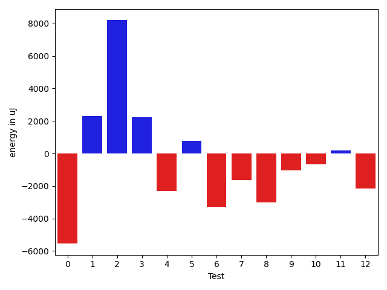

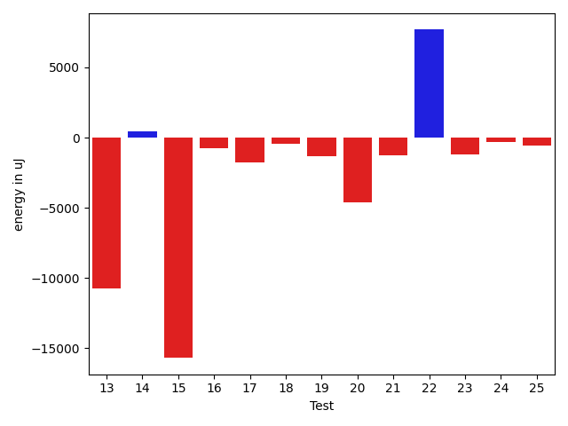

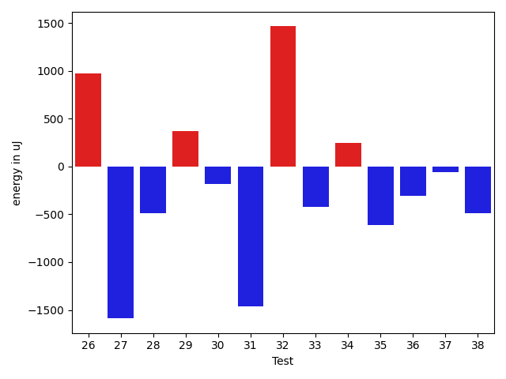

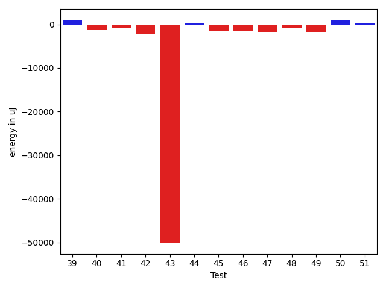

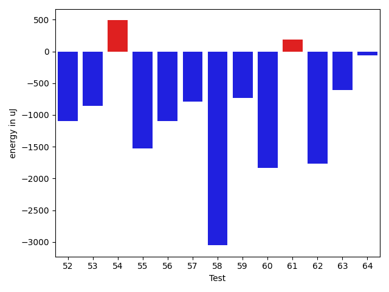

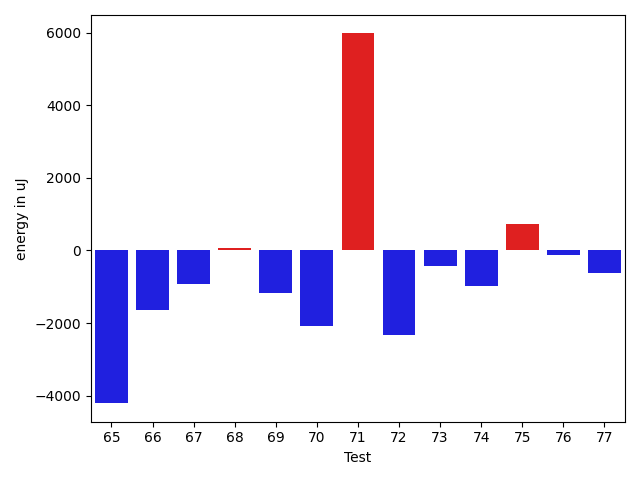

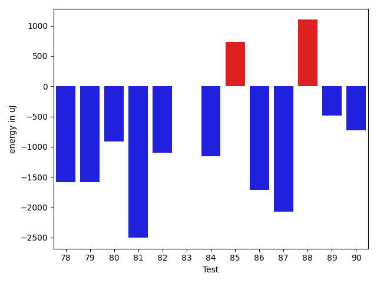

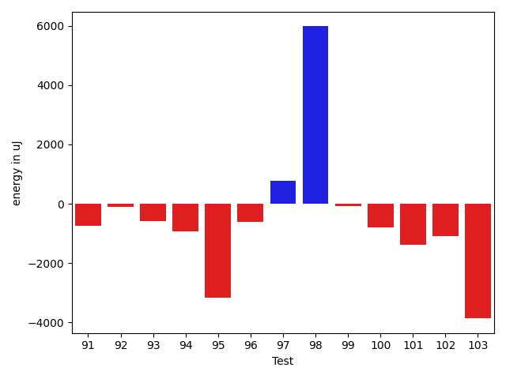

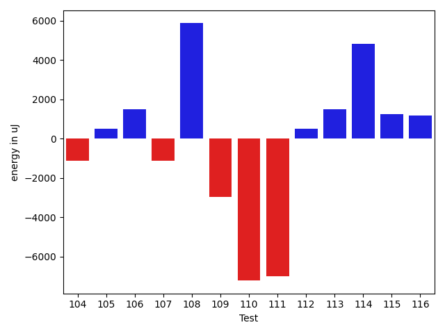

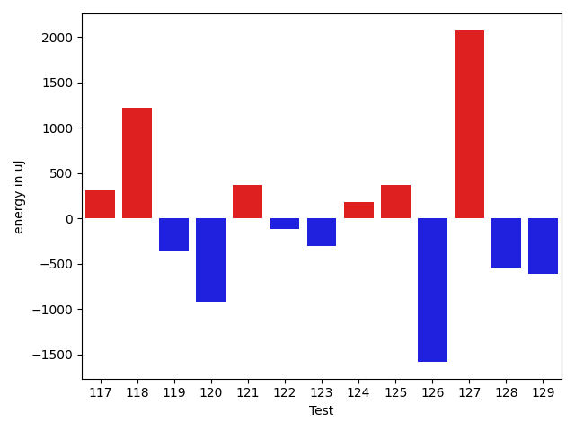

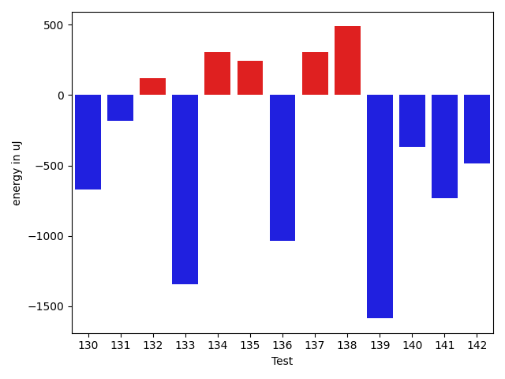

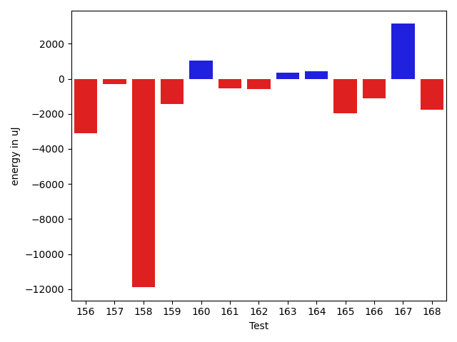

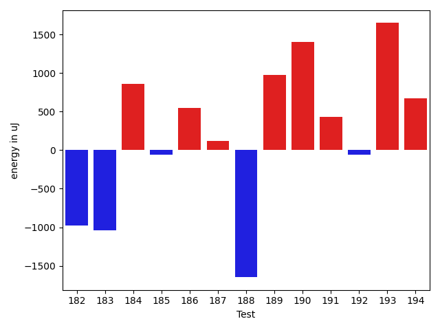

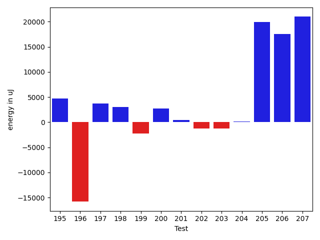

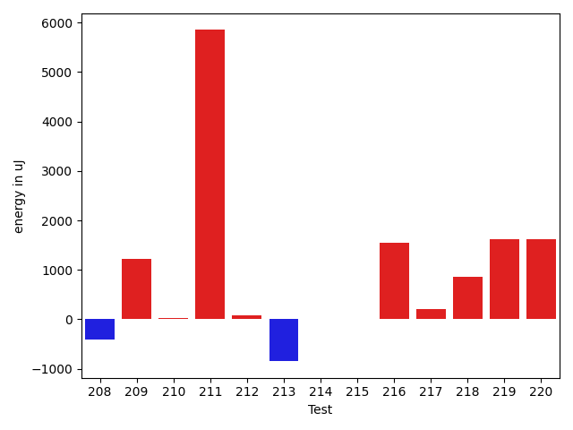

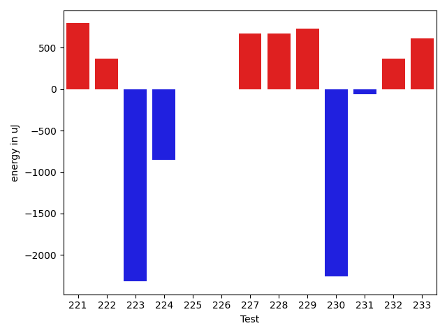

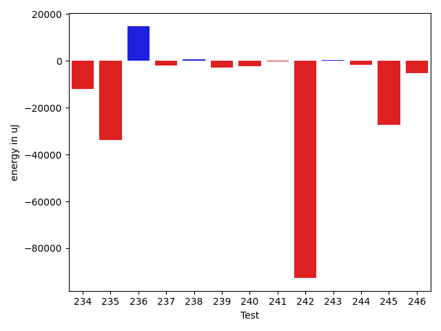

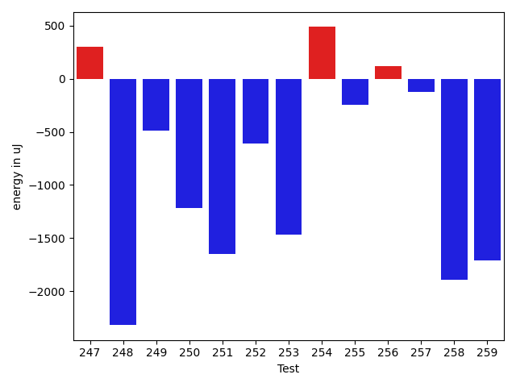

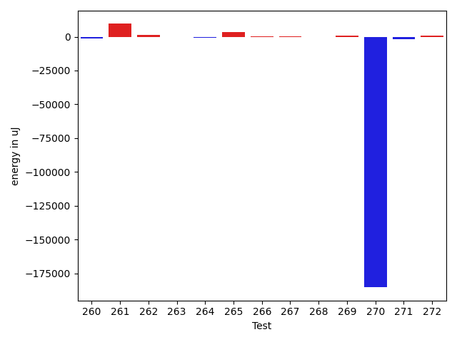

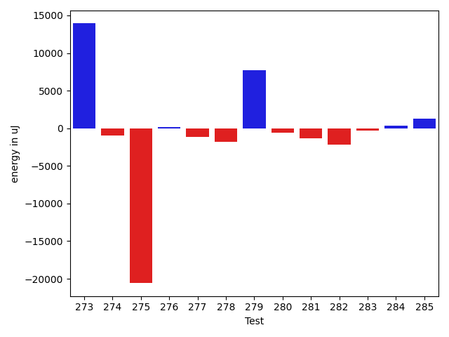

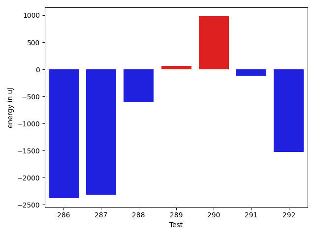

| ID | EnergyV1 | EnergyV2 | DeltaEnergy | σV1 | σV2 |
| --- | --- | --- | --- | --- | --- |
| 0 | 45209.46428571428 | 39664.913043478264 | -5544.551242236019 | 29412.723298262496 | 5388.845846529288 |
| 1 | 46264.5 | 48578.698795180724 | 2314.198795180724 | 14390.135992552201 | 17411.73954253932 |
| 2 | 88968.72727272728 | 97163.9494949495 | 8195.222222222219 | 31243.48298261921 | 34502.77420594669 |
| 3 | 47203.38372093023 | 49443.846153846156 | 2240.462432915927 | 14629.877297780287 | 17981.573092301107 |
| 4 | 42236.24137931035 | 39944.754385964916 | -2291.486993345432 | 7219.347413697936 | 5350.0434013019085 |
| 5 | 45189.717391304344 | 45964.24 | 774.5226086956536 | 20361.1134803395 | 17017.023525352484 |
| 6 | 58208.46428571428 | 54885.573033707864 | -3322.8912520064187 | 22165.181184443336 | 19473.316783147162 |
| 7 | 42514.441860465115 | 40867.958333333336 | -1646.4835271317788 | 14298.788506661946 | 4936.268179498614 |
| 8 | 41987.28947368421 | 38972.07407407407 | -3015.2153996101406 | 3430.785585255141 | 4773.412964310375 |
| 9 | 42320.83870967742 | 41278.36111111111 | -1042.4775985663073 | 6507.253962715437 | 6366.755680672578 |
| 10 | 41205.96 | 40555.90625 | -650.0537499999991 | 2635.087087441324 | 3678.2398164694127 |
| 11 | 39945.03846153846 | 40116.89655172414 | 171.8580901856767 | 3822.6927227239785 | 3554.4707384753874 |
| 12 | 41628.28 | 39489.619047619046 | -2138.660952380953 | 3100.4169980181696 | 3414.553871384894 |
| 13 | 54816.45714285714 | 44081.78947368421 | -10734.66766917293 | 23059.521500849998 | 11285.260704396906 |
| 14 | 40170.73684210526 | 40592.379310344826 | 421.64246823956637 | 2110.5677420793245 | 3740.948915336608 |
| 15 | 55863.63636363636 | 40173.58823529412 | -15690.048128342241 | 82065.31630605724 | 4623.48477002846 |
| 16 | 41192.03571428572 | 40426.206896551725 | -765.8288177339928 | 4017.4940704209316 | 3665.4357258915466 |
| 17 | 40116.39024390244 | 38367.61538461538 | -1748.7748592870557 | 4446.984233673307 | 4318.649840148492 |
| 18 | 42170.58536585366 | 41754.75555555556 | -415.8298102980989 | 5500.04075362112 | 6274.10567387206 |
| 19 | 41226.645833333336 | 39900.37837837838 | -1326.2674549549556 | 3609.613567091724 | 5501.92433830177 |
| 20 | 44382.625 | 39766.36666666667 | -4616.258333333331 | 20056.47443847103 | 3833.8063199500425 |
| 21 | 40700.64 | 39443.857142857145 | -1256.7828571428545 | 4139.49201598457 | 4306.418819741109 |
| 22 | 39863.53846153846 | 47548.933333333334 | 7685.394871794873 | 4591.463750997697 | 39711.59600161589 |
| 23 | 41263.23529411765 | 40081.434782608696 | -1181.8005115089545 | 3556.035904824554 | 4598.022210227643 |
| 24 | 40989.066666666666 | 40688.36 | -300.7066666666651 | 3585.125297051075 | 3543.7589633607986 |
| 25 | 40409.125 | 39855.882352941175 | -553.2426470588252 | 3493.8122601787004 | 3283.249948062634 |
| 26 | 39486.51282051282 | 40437.18421052631 | 950.6713900134928 | 4437.894637543594 | 3989.4654163398563 |
| 27 | 42442.63636363636 | 39763.0625 | -2679.5738636363603 | 7941.21530512264 | 5136.672720928119 |
| 28 | 43812.02272727273 | 43482.05357142857 | -329.96915584415547 | 11178.339540640512 | 14116.048057618225 |
| 29 | 39845.282608695656 | 39694.717948717946 | -150.5646599777101 | 3066.497511062045 | 4006.129252422311 |
| 30 | 40291.0 | 40090.970588235294 | -200.0294117647063 | 3704.090903225087 | 3794.7787464395165 |
| 31 | 40665.818181818184 | 39960.05882352941 | -705.7593582887712 | 3681.0543775633782 | 5309.125656059942 |
| 32 | 45873.59259259259 | 66198.9696969697 | 20325.377104377105 | 23459.341459702322 | 61326.964164759935 |
| 33 | 41809.03846153846 | 40611.42857142857 | -1197.6098901098885 | 5311.854061948972 | 3092.9007277254514 |
| 34 | 41364.88888888889 | 41094.470588235294 | -270.4183006535968 | 3417.4419752676104 | 3781.598341156928 |
| 35 | 49436.03846153846 | 40836.1875 | -8599.850961538461 | 35776.83633676616 | 3153.792265248894 |
| 36 | 57455.545454545456 | 61805.0101010101 | 4349.464646464643 | 40819.84353507166 | 58713.28789313473 |
| 37 | 40721.735849056604 | 40261.62962962963 | -460.10621942697617 | 3085.405683554607 | 4085.8931490909977 |
| 38 | 44317.729166666664 | 46499.1568627451 | 2181.4276960784337 | 12504.07000196933 | 18072.370858467417 |
| 39 | 42759.98863636364 | 43728.11111111111 | 968.1224747474698 | 8837.892161151525 | 10826.349194852757 |
| 40 | 41357.375 | 39984.179487179485 | -1373.1955128205154 | 3157.8136557395214 | 4069.8814565474086 |
| 41 | 41062.35897435898 | 40129.204545454544 | -933.1544289044323 | 3592.7537719706315 | 4900.211208711247 |
| 42 | 90688.34090909091 | 88348.83720930232 | -2339.503699788591 | 310436.0961053559 | 302439.67262064095 |
| 43 | 91434.87804878049 | 41399.07142857143 | -50035.80662020906 | 315662.31813166017 | 5124.356774468462 |
| 44 | 41452.10256410256 | 41782.023255813954 | 329.92069171139156 | 5230.905382214988 | 4485.956746301921 |
| 45 | 42248.63265306123 | 40758.46153846154 | -1490.1711145996887 | 5690.755122569959 | 5009.134077868067 |
| 46 | 41946.229166666664 | 40483.82692307692 | -1462.4022435897423 | 3869.6863096357874 | 4250.56224661539 |
| 47 | 41767.54838709677 | 40105.166666666664 | -1662.3817204301085 | 3614.430297666694 | 3860.218599883806 |
| 48 | 41701.45238095238 | 40749.15151515151 | -952.3008658008694 | 4549.734566838466 | 4453.859253475623 |
| 49 | 41321.92452830189 | 39599.22222222222 | -1722.702306079671 | 9764.658733564795 | 4005.686368645281 |
| 50 | 41955.8813559322 | 42870.96923076923 | 915.0878748370305 | 5977.854737036526 | 7928.633982586312 |
| 51 | 42166.25 | 42574.205128205125 | 407.9551282051252 | 8460.221331570863 | 8111.526680356021 |
| 52 | 40293.04651162791 | 40279.1935483871 | -13.852963240809913 | 4677.30911983459 | 3790.188653227587 |
| 53 | 79459.42105263157 | 68331.725 | -11127.696052631567 | 111098.69221022684 | 94460.90201479856 |
| 54 | 61217.98275862069 | 51671.36923076923 | -9546.613527851456 | 80631.55557021158 | 51401.381627515766 |
| 55 | 41736.541666666664 | 40957.525 | -779.0166666666628 | 3813.2182326652314 | 4072.5647569283665 |
| 56 | 40492.48837209302 | 39063.87804878049 | -1428.6103233125323 | 3699.3382618309174 | 6239.860699254713 |
| 57 | 41071.17857142857 | 40418.87755102041 | -652.3010204081656 | 5730.679550539307 | 7264.5579514451 |
| 58 | 40988.37037037037 | 38356.86440677966 | -2631.505963590709 | 4283.428586473502 | 3754.6020324786014 |
| 59 | 42155.64 | 39825.28571428572 | -2330.354285714282 | 4208.088591082655 | 4322.169006224461 |
| 60 | 50341.886597938144 | 47048.83870967742 | -3293.0478882607276 | 26950.184390424154 | 20416.287076896322 |
| 61 | 39227.444444444445 | 38982.3125 | -245.13194444444525 | 4044.983846814182 | 3784.4870147542783 |
| 62 | 40751.083333333336 | 40477.205128205125 | -273.87820512821054 | 4445.080903994386 | 3602.3679119860917 |
| 63 | 40115.82608695652 | 39204.944444444445 | -910.8816425120749 | 4735.712697405001 | 4400.570587652648 |
| 64 | 41368.9552238806 | 43406.73529411765 | 2037.7800702370514 | 9155.487877856493 | 11766.064730973574 |
| 65 | 39829.25 | 36868.04761904762 | -2961.2023809523816 | 3782.1706647770407 | 4360.253045039938 |
| 66 | 64474.05454545454 | 64415.03448275862 | -59.02006269591948 | 40441.66480811059 | 37828.24429506459 |
| 67 | 41255.32142857143 | 40384.22857142857 | -871.0928571428594 | 3856.1770488915517 | 4221.3910712378365 |
| 68 | 40207.42857142857 | 39759.857142857145 | -447.57142857142753 | 3982.6802959986694 | 3738.661627548837 |
| 69 | 40788.06060606061 | 39706.882352941175 | -1081.178253119433 | 4363.230940341245 | 4240.051461707024 |
| 70 | 40618.77777777778 | 38316.560975609755 | -2302.2168021680263 | 4626.229933224432 | 4193.0075476992 |
| 71 | 32714.0 | 38254.6 | 5540.5999999999985 | 0.0 | 3713.2209571157537 |
| 72 | 41104.5 | 39145.89473684211 | -1958.6052631578932 | 3521.7007491646227 | 5220.511750421417 |
| 73 | 49422.634146341465 | 50996.77333333333 | 1574.1391869918662 | 19091.487141676138 | 27105.610472408764 |
| 74 | 56513.913043478264 | 56888.01408450704 | 374.1010410287781 | 25999.561866843087 | 34137.2795649916 |
| 75 | 59474.26530612245 | 58995.14736842105 | -479.11793770139775 | 26193.080044067337 | 25312.44276675778 |
| 76 | 40271.625 | 40403.84444444445 | 132.2194444444467 | 3626.7590193415112 | 2955.431263551945 |
| 77 | 41261.175 | 39300.71428571428 | -1960.4607142857203 | 3867.635594827284 | 4130.411782110341 |
| 78 | 41650.26 | 39394.62962962963 | -2255.6303703703743 | 3348.4428668263104 | 4001.8223501406264 |
| 79 | 41572.12 | 46592.625 | 5020.504999999997 | 4375.537487623664 | 37194.18746514982 |
| 80 | 40716.46666666667 | 39803.936170212764 | -912.5304964539027 | 3442.8042032944913 | 3894.8395340406205 |
| 81 | 40881.325 | 38956.142857142855 | -1925.182142857142 | 3697.3143252062027 | 4814.658564620918 |
| 82 | 41833.357142857145 | 42426.96875 | 593.6116071428551 | 4123.8764323863825 | 8389.591877679357 |
| 83 | 66797.13541666667 | 69081.3894736842 | 2284.2540570175333 | 40505.32203422466 | 47973.00664448153 |
| 84 | 48666.36486486487 | 44509.55072463768 | -4156.814140227187 | 15890.06076440878 | 13092.24290251451 |
| 85 | 40224.75555555556 | 40568.26530612245 | 343.5097505668891 | 3101.0463478248794 | 3975.4359266832207 |
| 86 | 40945.828571428574 | 40179.479452054795 | -766.3491193737791 | 4589.307713032321 | 4800.0321406161065 |
| 87 | 40849.47222222222 | 43840.186046511626 | 2990.713824289407 | 3206.1162598150772 | 30839.08410643102 |
| 88 | 46660.2 | 61705.69411764706 | 15045.49411764706 | 16876.190353345537 | 79726.48503949924 |
| 89 | 40750.269230769234 | 40254.53333333333 | -495.7358974359013 | 3269.0832937325026 | 6193.701286522192 |
| 90 | 43232.01960784314 | 39781.565217391304 | -3450.454390451836 | 22578.482499495127 | 3294.0134146936134 |
| 91 | 40253.307692307695 | 39516.282051282054 | -737.0256410256407 | 3094.3840955780634 | 3530.4327326011226 |
| 92 | 40437.57777777778 | 40339.90697674418 | -97.6708010335933 | 2846.8588185646836 | 3904.7436137371546 |
| 93 | 41213.875 | 40632.72727272727 | -581.1477272727279 | 3500.510585525346 | 4035.744633125547 |
| 94 | 40212.08163265306 | 39278.29268292683 | -933.7889497262295 | 3597.278624674518 | 3607.4426334123586 |
| 95 | 50819.666666666664 | 47642.31481481482 | -3177.3518518518467 | 21156.786296544684 | 16858.606724672947 |
| 96 | 40975.42857142857 | 40361.607142857145 | -613.8214285714275 | 2996.397029631366 | 3517.62402907829 |
| 97 | 39939.708333333336 | 40701.5 | 761.7916666666642 | 3602.5448815058344 | 4792.250846791248 |
| 98 | 39506.90625 | 45488.92682926829 | 5982.02057926829 | 3474.1982470724 | 37666.7447397214 |
| 99 | 39826.75 | 39746.857142857145 | -79.89285714285506 | 3622.3944813353905 | 3116.4837754188575 |
| 100 | 42921.18518518518 | 42136.86440677966 | -784.3207784055194 | 8202.547732201245 | 8186.520625254429 |
| 101 | 39891.15789473684 | 38516.933333333334 | -1374.2245614035055 | 3190.4579651988565 | 2870.1393570502614 |
| 102 | 46220.818181818184 | 45130.47311827957 | -1090.3450635386107 | 14599.901029821347 | 12359.608385061116 |
| 103 | 44486.51851851852 | 40620.71875 | -3865.7997685185182 | 31938.49274473065 | 3793.4652177657354 |
| 104 | 65491.80612244898 | 64361.10101010101 | -1130.7051123479687 | 32689.61728247451 | 30254.085930745754 |
| 105 | 40384.26865671642 | 40900.64705882353 | 516.3784021071115 | 6162.072113647625 | 7548.215604804157 |
| 106 | 105066.41414141415 | 106585.0101010101 | 1518.5959595959575 | 89250.33472738182 | 72887.27716796324 |
| 107 | 65772.27272727272 | 64666.28282828283 | -1105.9898989898938 | 38009.19536771829 | 34172.5503717517 |
| 108 | 82983.64893617021 | 88859.39583333333 | 5875.746897163117 | 39781.44895062016 | 45456.1261255655 |
| 109 | 60389.47474747475 | 57446.80808080808 | -2942.6666666666715 | 21276.660620939907 | 23274.87792096651 |
| 110 | 55678.5 | 48461.666666666664 | -7216.833333333336 | 33048.36375515219 | 20416.93500231827 |
| 111 | 80219.15151515152 | 73208.09090909091 | -7011.060606060608 | 33583.22612009765 | 34178.20945836124 |
| 112 | 41776.95121951219 | 42290.28571428572 | 513.334494773524 | 7718.9907685801345 | 6189.133807714607 |
| 113 | 82678.54347826086 | 84176.73195876289 | 1498.1884805020236 | 36496.566380311146 | 42775.005801879604 |
| 114 | 60689.71717171717 | 65529.86734693877 | 4840.150175221599 | 24498.364162679936 | 60403.49138723784 |
| 115 | 39181.61363636364 | 40446.375 | 1264.7613636363603 | 4543.033644122859 | 3776.225368588983 |
| 116 | 39178.3 | 40375.31914893617 | 1197.0191489361678 | 4412.991766364402 | 3731.486961078271 |
| 117 | 40673.56896551724 | 40571.15789473684 | -102.41107078039931 | 3965.173819349859 | 4037.728607571661 |
| 118 | 40568.467741935485 | 42570.42622950819 | 2001.9584875727087 | 4152.799408396554 | 6171.520694867746 |
| 119 | 59128.12903225807 | 52183.0 | -6945.129032258068 | 47048.52554766363 | 34941.805880855456 |
| 120 | 41171.05 | 40026.8 | -1144.25 | 2797.5120817433476 | 3777.231155224684 |
| 121 | 40150.12 | 41860.28571428572 | 1710.1657142857148 | 4377.346852329616 | 7703.982798142895 |
| 122 | 87307.22222222222 | 87697.46464646465 | 390.2424242424313 | 25091.95871333741 | 24082.846502078806 |
| 123 | 46573.153846153844 | 42858.56862745098 | -3714.585218702865 | 14548.905513136633 | 6786.099050538656 |
| 124 | 40670.75 | 39531.28947368421 | -1139.4605263157864 | 4196.304009184749 | 4540.477501598349 |
| 125 | 40584.5 | 40718.63636363636 | 134.13636363636033 | 3649.3355131448247 | 3652.8975615313007 |
| 126 | 101744.74747474748 | 91447.76767676767 | -10296.979797979802 | 51664.29150637239 | 50755.116855811066 |
| 127 | 59689.19512195122 | 68704.0 | 9014.80487804878 | 86541.13592326346 | 76799.67222101806 |
| 128 | 45764.71698113208 | 43831.22222222222 | -1933.4947589098592 | 14117.726096204284 | 10412.603239213715 |
| 129 | 45973.640625 | 41630.36363636364 | -4343.27698863636 | 15316.279632884894 | 4883.825796772765 |
| 130 | 41024.28571428572 | 41885.65714285714 | 861.3714285714232 | 4027.999888535353 | 9696.042249857435 |
| 131 | 54795.0 | 49784.215053763444 | -5010.784946236556 | 22283.069546857936 | 25680.409915266486 |
| 132 | 39623.53846153846 | 40914.85 | 1291.3115384615376 | 3736.972769407069 | 2823.9141855764665 |
| 133 | 42148.22 | 42902.520833333336 | 754.3008333333346 | 4288.290737764873 | 8572.698884612282 |
| 134 | 40299.4 | 39985.625 | -313.77500000000146 | 3447.0658595390955 | 4064.2526661583183 |
| 135 | 43006.97142857143 | 41754.75806451613 | -1252.2133640553002 | 10765.249415160444 | 7204.605687953128 |
| 136 | 41729.6 | 41271.8 | -457.79999999999563 | 3802.0671929885716 | 3867.2342089233057 |
| 137 | 39779.583333333336 | 41021.23809523809 | 1241.654761904756 | 4041.622693059751 | 4499.2154861630825 |
| 138 | 46974.82608695652 | 46856.89705882353 | -117.9290281329886 | 14987.749327760432 | 14455.741801565246 |
| 139 | 41927.470588235294 | 41961.4 | 33.929411764707766 | 6064.346918115141 | 7834.518922052585 |
| 140 | 103585.17142857143 | 109458.42857142857 | 5873.257142857139 | 151006.87794581422 | 160675.36550702577 |
| 141 | 164515.71717171717 | 160882.59793814432 | -3633.1192335728556 | 104700.3836660544 | 109804.91935449245 |
| 142 | 41335.86363636364 | 40966.391304347824 | -369.4723320158155 | 3654.9762876417053 | 2893.8121050017785 |
| 143 | 46569.7 | 50677.148148148146 | 4107.448148148149 | 18607.39350930162 | 30867.34652563462 |
| 144 | 41616.71698113208 | 43168.270833333336 | 1551.5538522012575 | 4992.554869748303 | 5338.534883044471 |
| 145 | 42407.65957446808 | 43307.77777777778 | 900.1182033096993 | 13684.866126688528 | 15233.463374921073 |
| 146 | 44027.72549019608 | 43234.72 | -793.0054901960757 | 17432.75588787421 | 13379.509638308871 |
| 147 | 40333.17857142857 | 45622.86486486487 | 5289.686293436294 | 4506.739461656854 | 21511.6884835703 |
| 148 | 41031.96153846154 | 41126.882352941175 | 94.92081447963574 | 4115.1621099087215 | 3681.706204247491 |
| 149 | 75566.97938144329 | 71045.3469387755 | -4521.632442667789 | 85565.48885520667 | 83048.81836325364 |
| 150 | 41562.96923076923 | 43913.642857142855 | 2350.673626373624 | 5512.478816897671 | 19234.754774355504 |
| 151 | 40594.49152542373 | 46425.98387096774 | 5831.492345544015 | 6462.975526544088 | 26324.252824915322 |
| 152 | 49514.506493506495 | 50512.0 | 997.4935064935053 | 25131.16791908467 | 22962.338923660856 |
| 153 | 42746.681818181816 | 42695.150684931505 | -51.53113325031154 | 8159.501065701541 | 8200.214373527964 |
| 154 | 42557.333333333336 | 42927.746268656716 | 370.4129353233802 | 8153.32356997531 | 8503.36737924257 |
| 155 | 49793.64102564102 | 73322.62962962964 | 23528.98860398861 | 26308.22576928265 | 192149.30143513656 |
| 156 | 100580.09090909091 | 97485.24242424243 | -3094.8484848484804 | 35596.30109574317 | 30379.69084570519 |
| 157 | 41372.48484848485 | 41074.53333333333 | -297.9515151515152 | 3795.900788380141 | 3104.335911090952 |
| 158 | 153576.44444444444 | 141678.21212121213 | -11898.23232323231 | 241514.3968071377 | 199363.37352228802 |
| 159 | 41085.28571428572 | 39650.31578947369 | -1434.9699248120305 | 4342.960740070755 | 3318.4163003430226 |
| 160 | 40667.72727272727 | 41701.07692307692 | 1033.34965034965 | 4475.159250748428 | 4074.741095343708 |
| 161 | 41023.544117647056 | 40455.557692307695 | -567.9864253393607 | 6507.128847371083 | 3758.565471096353 |
| 162 | 42134.06024096385 | 41526.10810810811 | -607.9521328557457 | 8730.411684284649 | 8256.571432873967 |
| 163 | 40940.8064516129 | 41274.833333333336 | 334.0268817204342 | 4028.757460088214 | 2647.344607757407 |
| 164 | 40457.681818181816 | 40873.03333333333 | 415.35151515151665 | 3789.5275837300933 | 3859.6118413067857 |
| 165 | 41735.470588235294 | 39753.48387096774 | -1981.9867172675513 | 3789.9712418224003 | 4023.093256005141 |
| 166 | 41255.75 | 40120.375 | -1135.375 | 3526.923048139837 | 4249.970625511232 |
| 167 | 41026.83050847457 | 44157.71428571428 | 3130.883777239709 | 4370.873194196692 | 26113.20415429867 |
| 168 | 40979.88888888889 | 39201.82142857143 | -1778.067460317463 | 4062.0813957172372 | 3555.648765933395 |
| 169 | 43038.15517241379 | 53116.290322580644 | 10078.135150166854 | 8918.914934780607 | 44359.04044941834 |
| 170 | 41428.653846153844 | 40767.72 | -660.9338461538428 | 3988.048529354327 | 5960.529137719235 |
| 171 | 61172.375 | 81013.66666666667 | 19841.29166666667 | 66071.21527236886 | 89638.6586113318 |
| 172 | 41933.20754716981 | 40724.32786885246 | -1208.879678317353 | 8400.01553088971 | 4562.677929955392 |
| 173 | 236519.87878787878 | 224159.94949494948 | -12359.9292929293 | 239065.05304819185 | 131791.38445180978 |
| 174 | 41407.145833333336 | 39716.45652173913 | -1690.6893115942075 | 5087.495630586098 | 4153.406913274941 |
| 175 | 47329.625 | 49151.295454545456 | 1821.6704545454559 | 23052.344664575336 | 27607.802718351813 |
| 176 | 46572.79661016949 | 43091.771929824565 | -3481.0246803449263 | 28020.758075240847 | 9885.914415226189 |
| 177 | 42355.181818181816 | 42381.53947368421 | 26.357655502397392 | 8994.917552992023 | 8107.999840055289 |
| 178 | 40928.5 | 41552.333333333336 | 623.8333333333358 | 5687.4450107231805 | 5949.002007806762 |
| 179 | 40992.92592592593 | 39623.0 | -1369.925925925927 | 3206.8146757933177 | 3794.047003750305 |
| 180 | 76087.39130434782 | 81280.01086956522 | 5192.619565217392 | 29769.05844049887 | 28463.571222321036 |
| 181 | 55410.07317073171 | 48780.93975903615 | -6629.133411695562 | 52140.414976966335 | 26162.34268753442 |
| 182 | 59404.25 | 45764.083333333336 | -13640.166666666664 | 65099.55588548589 | 14604.333039993835 |
| 183 | 43496.846153846156 | 39600.46666666667 | -3896.379487179489 | 15909.985355580717 | 5221.811417719164 |
| 184 | 41756.61224489796 | 40971.609375 | -785.0028698979586 | 10512.346194980235 | 7517.461164717588 |
| 185 | 58804.729166666664 | 61467.26530612245 | 2662.536139455784 | 56445.870281011856 | 61199.812529316536 |
| 186 | 38983.13333333333 | 42327.791666666664 | 3344.658333333333 | 4802.979663593101 | 12240.545313898285 |
| 187 | 39499.32 | 39433.625 | -65.69499999999971 | 4367.0757055036265 | 5135.0142389651655 |
| 188 | 42229.117647058825 | 41349.27272727273 | -879.8449197860973 | 7027.95040101311 | 5308.9291779537725 |
| 189 | 47085.0 | 81489.82666666666 | 34404.82666666666 | 19463.63814471928 | 114065.82207741556 |
| 190 | 43045.21276595745 | 46039.163265306124 | 2993.950499348677 | 7951.813669571345 | 11287.547444874073 |
| 191 | 48149.98181818182 | 57294.53333333333 | 9144.551515151514 | 24016.58396986315 | 38040.43844010681 |
| 192 | 44487.808219178085 | 45618.701492537315 | 1130.89327335923 | 12035.956811744507 | 13288.505302125768 |
| 193 | 47579.96808510638 | 53298.177083333336 | 5718.208998226954 | 15231.25603673014 | 19264.431405439696 |
| 194 | 40691.65306122449 | 42132.6037735849 | 1440.9507123604126 | 3727.6573293890324 | 6785.048327408492 |
| 195 | 40351.294117647056 | 45073.60975609756 | 4722.3156384505055 | 3973.399067396695 | 33000.297827095106 |
| 196 | 156719.46464646465 | 140923.0 | -15796.46464646465 | 337822.0384542729 | 230425.81838304264 |
| 197 | 47347.0 | 51073.794117647056 | 3726.794117647056 | 16624.13697196038 | 19806.764349257657 |
| 198 | 39308.08108108108 | 42364.57894736842 | 3056.49786628734 | 4390.049918932945 | 6799.906801341119 |
| 199 | 46440.06172839506 | 44154.0 | -2286.0617283950633 | 17762.582759276316 | 13493.575784326718 |
| 200 | 39754.066666666666 | 42447.46153846154 | 2693.3948717948733 | 3270.915885327669 | 4218.618687809565 |
| 201 | 40171.18518518518 | 40656.706896551725 | 485.52171136654215 | 3044.204165745702 | 4595.568138711321 |
| 202 | 39286.066666666666 | 37990.0 | -1296.0666666666657 | 3671.2717409033557 | 4668.984370033707 |
| 203 | 39815.0 | 38536.0 | -1279.0 | 3030.9227417845323 | 5062.895206796206 |
| 204 | 40720.5 | 40881.9375 | 161.4375 | 2466.5170281188007 | 3772.272797478166 |
| 205 | 56565.166666666664 | 76480.16216216216 | 19914.995495495496 | 61553.90709510016 | 90786.68339500895 |
| 206 | 51951.206896551725 | 69492.68571428572 | 17541.478817733994 | 38333.10971613076 | 55234.375969406916 |
| 207 | 40458.84 | 61444.828571428574 | 20985.988571428577 | 9135.619241978073 | 50864.057185227 |
| 208 | 38937.26315789474 | 38535.36363636364 | -401.8995215311006 | 3220.505515109885 | 5377.718234830006 |
| 209 | 40142.52173913043 | 41371.625 | 1229.1032608695677 | 3861.50037149974 | 3112.4943883818223 |
| 210 | 39894.42105263158 | 39924.782608695656 | 30.361556064075558 | 4215.182062819432 | 3398.368277974155 |
| 211 | 41785.82 | 47637.2 | 5851.379999999997 | 10818.208642266056 | 16198.004801265439 |
| 212 | 41025.15789473684 | 41100.92 | 75.76210526315845 | 3411.989375919134 | 5138.461255434354 |
| 213 | 39489.73333333333 | 38643.086956521736 | -846.6463768115937 | 3120.041633625352 | 3637.8861027781495 |
| 214 | 39868.92857142857 | 39881.45161290323 | 12.523041474654747 | 3336.7540357206376 | 4744.472443147681 |
| 215 | 39844.77272727273 | 39848.92307692308 | 4.150349650350108 | 3088.575060265261 | 4405.218949619059 |
| 216 | 38864.0 | 40417.84210526316 | 1553.8421052631602 | 3042.139748598016 | 4385.400254950725 |
| 217 | 40297.230769230766 | 40506.857142857145 | 209.62637362637906 | 3831.924042804409 | 5239.6032136732165 |
| 218 | 39933.545454545456 | 40785.82352941176 | 852.2780748663063 | 4819.207108749819 | 2892.5771378253503 |
| 219 | 38314.6 | 39933.620689655174 | 1619.0206896551754 | 4307.795345649559 | 4622.734654261465 |
| 220 | 38769.4 | 40398.73684210526 | 1629.3368421052583 | 2984.8263333065124 | 4638.657142820825 |
| 221 | 39218.75 | 49967.09523809524 | 10748.345238095237 | 3560.2368688754405 | 40730.839026472975 |
| 222 | 41074.5 | 42186.96153846154 | 1112.461538461539 | 3739.3347246981425 | 3345.3720901564348 |
| 223 | 41134.80952380953 | 38914.21428571428 | -2220.595238095244 | 4066.5903539176365 | 4747.975330579964 |
| 224 | 48499.472727272725 | 42865.4081632653 | -5634.064564007422 | 25554.33364980624 | 10026.105378355673 |
| 225 | 48678.354838709674 | 46398.71428571428 | -2279.6405529953918 | 12306.615169842826 | 9459.347085808613 |
| 226 | 41241.78048780488 | 42393.74193548387 | 1151.9614476789939 | 4708.26791989081 | 3473.3857793387106 |
| 227 | 43699.44736842105 | 41734.5625 | -1964.8848684210534 | 9165.91906178698 | 4311.899225816131 |
| 228 | 39334.96666666667 | 40170.96 | 835.993333333332 | 4748.449631078431 | 5108.991622463282 |
| 229 | 41263.92857142857 | 41691.53846153846 | 427.6098901098885 | 4067.6963639366786 | 3133.893452496053 |
| 230 | 162242.14141414143 | 112194.09090909091 | -50048.050505050516 | 366377.54851979384 | 170178.76148832086 |
| 231 | 58044.208333333336 | 58348.1914893617 | 303.98315602836374 | 26098.644720526474 | 26492.187690792598 |
| 232 | 42124.734375 | 41778.04918032787 | -346.685194672129 | 8800.435437100165 | 5627.334661367131 |
| 233 | 122019.11111111111 | 127026.26086956522 | 5007.149758454107 | 409571.79063846974 | 324768.6524349675 |
| 234 | 83203.40206185567 | 71153.18085106384 | -12050.221210791831 | 101250.51947405597 | 82913.88118993065 |
| 235 | 417814.8787878788 | 383950.16161616164 | -33864.717171717144 | 147722.95428891171 | 126459.42202390594 |
| 236 | 466927.57575757575 | 481848.51515151514 | 14920.939393939392 | 159826.97069208283 | 178516.58344228513 |
| 237 | 55471.23595505618 | 53409.33734939759 | -2061.8986056585927 | 25969.200608993877 | 30757.972836627665 |
| 238 | 64038.84693877551 | 64789.703296703294 | 750.8563579277834 | 57477.465750758645 | 71349.81710280884 |
| 239 | 47802.365853658535 | 45083.09195402299 | -2719.2738996355474 | 14126.593146082025 | 12001.742845307 |
| 240 | 49775.41111111111 | 47546.96629213483 | -2228.4448189762843 | 17573.241660038104 | 15102.137575800796 |
| 241 | 50496.26666666667 | 50186.96385542169 | -309.3028112449829 | 22046.796377604518 | 28935.232910363906 |
| 242 | 156031.94029850746 | 63214.014925373136 | -92817.92537313432 | 452772.7825133287 | 40050.1789041386 |
| 243 | 40801.28571428572 | 41226.30909090909 | 425.0233766233723 | 5287.346871425735 | 3746.9271864858074 |
| 244 | 43434.68831168831 | 41761.88524590164 | -1672.8030657866693 | 10004.925013523442 | 6960.548061374215 |
| 245 | 123476.28282828283 | 96282.37373737374 | -27193.90909090909 | 252677.203257998 | 30219.185642580196 |
| 246 | 51210.64150943396 | 46053.5593220339 | -5157.082187400061 | 23415.310941649397 | 16288.668873490238 |
| 247 | 46940.0 | 43235.54666666667 | -3704.453333333331 | 15542.994333939161 | 9530.391192101659 |
| 248 | 45355.30882352941 | 41569.08450704225 | -3786.2243164871616 | 13512.967244201523 | 8055.8456856601 |
| 249 | 48776.380952380954 | 48574.85333333333 | -201.52761904762156 | 15941.337754482667 | 17265.14826170019 |
| 250 | 51411.49253731343 | 44912.087719298244 | -6499.404818015188 | 30619.798630791855 | 20868.897912444358 |
| 251 | 41002.63461538462 | 42298.555555555555 | 1295.9209401709377 | 3384.3496252197187 | 9606.339977224661 |
| 252 | 48761.30303030303 | 42040.030303030304 | -6721.272727272728 | 34557.26873807369 | 3878.7184894361494 |
| 253 | 218146.0655737705 | 144700.69090909092 | -73445.37466467958 | 567420.841949793 | 430694.52622896817 |
| 254 | 40188.066666666666 | 40216.705882352944 | 28.639215686278476 | 4274.331461176122 | 3874.360437007346 |
| 255 | 41256.58536585366 | 42254.475 | 997.8896341463405 | 7774.884947703712 | 6866.574171257092 |
| 256 | 40744.06896551724 | 41284.1 | 540.0310344827594 | 4026.4437798738904 | 3184.5202082365045 |
| 257 | 49730.32432432433 | 57901.066666666666 | 8170.742342342339 | 23792.603963296522 | 30229.091234034066 |
| 258 | 41723.07407407407 | 38980.40625 | -2742.667824074073 | 3940.520852261237 | 4011.4342031511546 |
| 259 | 61304.4126984127 | 77806.5 | 16502.0873015873 | 81364.56040633043 | 121229.08192569675 |
| 260 | 43233.55319148936 | 42125.29090909091 | -1108.2622823984493 | 9594.66523272291 | 8550.02534323246 |
| 261 | 58426.89887640449 | 67955.68235294118 | 9528.783476536686 | 55309.34749534259 | 63097.962692795816 |
| 262 | 42713.93103448276 | 43869.57142857143 | 1155.6403940886667 | 7079.642609482656 | 11548.87089886058 |
| 263 | 41187.02380952381 | 40893.48 | -293.543809523806 | 3671.311239015132 | 5779.860750018118 |
| 264 | 40686.30303030303 | 39876.11111111111 | -810.1919191919224 | 3227.1096504537036 | 4036.8972347522813 |
| 265 | 52448.77419354839 | 55896.14634146341 | 3447.3721479150263 | 56687.69543435938 | 67350.55274785796 |
| 266 | 41869.88888888889 | 42409.846153846156 | 539.9572649572656 | 3687.398976226541 | 3794.7658455410933 |
| 267 | 40341.15 | 40851.818181818184 | 510.66818181818235 | 3616.8472082049584 | 4542.817674251038 |
| 268 | 188231.33333333334 | 187929.24242424243 | -302.09090909091174 | 348052.9306468465 | 332807.75015284703 |
| 269 | 43407.333333333336 | 44461.75 | 1054.4166666666642 | 15290.858644107399 | 11734.660213672876 |
| 270 | 259890.38888888888 | 74496.47368421052 | -185393.91520467837 | 602472.7517511236 | 179291.48811726097 |
| 271 | 42990.57142857143 | 41156.06060606061 | -1834.5108225108197 | 7964.73245640058 | 4158.7486895692045 |
| 272 | 39955.171428571426 | 40544.4375 | 589.2660714285739 | 3497.8874562121823 | 4934.330323974445 |
| 273 | 51053.477611940296 | 64980.553846153845 | 13927.07623421355 | 31001.290131728198 | 55677.085012398675 |
| 274 | 42199.90625 | 41216.290322580644 | -983.615927419356 | 2918.6860523977116 | 3725.2261866253507 |
| 275 | 94575.38202247191 | 73994.55319148937 | -20580.828830982544 | 126299.06095708144 | 79963.54694891557 |
| 276 | 53357.06122448979 | 53522.744897959186 | 165.6836734693934 | 20238.227759697587 | 18953.291474586607 |
| 277 | 41570.53488372093 | 40410.22222222222 | -1160.3126614987123 | 3561.6776903186164 | 3927.552624381238 |
| 278 | 42409.86666666667 | 40650.37037037037 | -1759.4962962962964 | 4864.0304668270965 | 4528.875117044933 |
| 279 | 49134.794871794875 | 56874.86486486487 | 7740.069993069992 | 33610.70270413302 | 50387.62746792712 |
| 280 | 40819.125 | 40211.26470588235 | -607.8602941176505 | 3635.3536257666874 | 3311.5669856608715 |
| 281 | 40878.84 | 39590.47826086957 | -1288.3617391304288 | 3387.220839331265 | 4050.9849244625766 |
| 282 | 40992.708333333336 | 38820.36666666667 | -2172.341666666667 | 3891.3805763418404 | 3991.859512251847 |
| 283 | 41187.0 | 40848.5918367347 | -338.4081632653033 | 3739.3183021881628 | 5784.175893952247 |
| 284 | 40993.71428571428 | 41374.30303030303 | 380.58874458874925 | 3358.816658726518 | 4203.822549702206 |
| 285 | 40617.793103448275 | 41910.666666666664 | 1292.8735632183889 | 3200.629974404396 | 3852.34409639599 |
| 286 | 41064.634146341465 | 39544.17857142857 | -1520.4555749128922 | 3652.2638469330923 | 4201.763609771254 |
| 287 | 44608.295454545456 | 41627.34782608696 | -2980.947628458496 | 11520.900277676268 | 7976.930572424327 |
| 288 | 41097.94117647059 | 40797.94871794872 | -299.9924585218687 | 5581.762440100461 | 4430.581769687021 |
| 289 | 64042.84 | 66892.25862068965 | 2849.4186206896557 | 80074.1583577024 | 84738.3593998488 |
| 290 | 148296.61445783134 | 65656.97619047618 | -82639.63826735516 | 450070.5826501351 | 168781.9780753361 |
| 291 | 41551.53658536585 | 41083.93939393939 | -467.5971914264592 | 5872.390875114234 | 4293.686520429834 |
| 292 | 42859.75 | 40941.793103448275 | -1917.9568965517246 | 7383.0678274442835 | 3793.571716863531 |

## Delta Duration per test method

| ID | DurationV1 | DurationsV2 | DeltaDuration |
| --- | --- | --- | --- |
| 0 | 618887.6428571428 | 504745.73913043475 | -114141.90372670809 |
| 1 | 1209167.3292682928 | 1269625.8313253012 | 60458.502057008445 |
| 2 | 2421623.4343434344 | 2523797.9191919193 | 102174.48484848486 |
| 3 | 1195324.2906976745 | 1360261.4871794872 | 164937.19648181275 |
| 4 | 876459.5172413794 | 873719.5789473684 | -2739.9382940109354 |
| 5 | 883329.4130434783 | 949692.46 | 66363.04695652169 |
| 6 | 1489216.369047619 | 1588810.7865168538 | 99594.4174692349 |
| 7 | 798686.0930232558 | 724351.6041666666 | -74334.48885658919 |
| 8 | 520293.7894736842 | 565995.3703703703 | 45701.58089668612 |
| 9 | 644822.1935483871 | 715960.5833333334 | 71138.38978494622 |
| 10 | 485198.08 | 541890.5 | 56692.419999999984 |
| 11 | 513607.53846153844 | 462864.5172413793 | -50743.021220159135 |
| 12 | 508371.2 | 691328.7142857143 | 182957.5142857143 |
| 13 | 1101134.0857142857 | 677220.7368421053 | -423913.34887218045 |
| 14 | 472157.5263157895 | 517296.5862068966 | 45139.059891107085 |
| 15 | 1050465.121212121 | 678721.1176470588 | -371744.0035650623 |
| 16 | 572920.1428571428 | 578614.724137931 | 5694.581280788174 |
| 17 | 611205.5609756098 | 700428.9487179487 | 89223.38774233893 |
| 18 | 748384.5853658536 | 805527.6 | 57143.014634146355 |
| 19 | 734205.4583333334 | 798178.1621621621 | 63972.70382882876 |
| 20 | 694113.7083333334 | 601470.7666666667 | -92642.94166666665 |
| 21 | 508238.32 | 626971.4642857143 | 118733.14428571431 |
| 22 | 906463.3076923077 | 1003757.2 | 97293.89230769221 |
| 23 | 386183.0588235294 | 424925.47826086957 | 38742.41943734017 |
| 24 | 472181.6 | 513839.12 | 41657.52000000002 |
| 25 | 419185.125 | 386740.70588235295 | -32444.41911764705 |
| 26 | 705944.1794871795 | 676337.7368421053 | -29606.442645074218 |
| 27 | 862959.1636363637 | 893223.9791666666 | 30264.815530302934 |
| 28 | 938309.5227272727 | 946784.3571428572 | 8474.834415584453 |
| 29 | 705412.1739130435 | 758938.1025641026 | 53525.92865105916 |
| 30 | 552318.3548387097 | 557214.7941176471 | 4896.439278937411 |
| 31 | 528832.5454545454 | 620951.4705882353 | 92118.92513368989 |
| 32 | 724992.8888888889 | 1566636.9090909092 | 841644.0202020203 |
| 33 | 617974.6538461539 | 592244.4523809524 | -25730.201465201448 |
| 34 | 467031.94444444444 | 559376.8235294118 | 92344.87908496737 |
| 35 | 708376.0 | 552600.25 | -155775.75 |
| 36 | 1648083.3333333333 | 1823043.393939394 | 174960.06060606078 |
| 37 | 818402.3018867924 | 841557.6296296297 | 23155.327742837253 |
| 38 | 933898.5625 | 996663.9411764706 | 62765.3786764706 |
| 39 | 1055404.0795454546 | 1104569.5308641975 | 49165.45131874294 |
| 40 | 738207.75 | 798784.7435897436 | 60576.99358974362 |
| 41 | 709725.3846153846 | 754098.7045454546 | 44373.31993006996 |
| 42 | 2225927.3863636362 | 2428542.0 | 202614.61363636376 |
| 43 | 2083458.2926829269 | 613588.4285714285 | -1469869.8641114985 |
| 44 | 836168.8205128205 | 632672.7209302326 | -203496.09958258795 |
| 45 | 801050.4489795918 | 760436.8269230769 | -40613.622056514956 |
| 46 | 816370.2708333334 | 800629.4807692308 | -15740.79006410262 |
| 47 | 540942.0322580645 | 562660.75 | 21718.717741935514 |
| 48 | 717153.2380952381 | 681220.7575757576 | -35932.48051948054 |
| 49 | 910107.0188679246 | 849548.0 | -60559.01886792458 |
| 50 | 1074736.813559322 | 994430.1384615385 | -80306.67509778345 |
| 51 | 942851.2708333334 | 903586.4615384615 | -39264.80929487187 |
| 52 | 680278.5581395349 | 608663.3225806452 | -71615.23555888969 |
| 53 | 1968422.5526315789 | 1630608.4 | -337814.15263157897 |
| 54 | 1500828.8448275863 | 1217519.353846154 | -283309.4909814324 |
| 55 | 707461.5208333334 | 683044.9 | -24416.62083333335 |
| 56 | 1035118.0813953489 | 1027346.743902439 | -7771.3374929098645 |
| 57 | 928523.25 | 834805.9591836735 | -93717.29081632651 |
| 58 | 873390.4814814815 | 809667.8474576271 | -63722.63402385439 |
| 59 | 477073.52 | 493194.21428571426 | 16120.694285714242 |
| 60 | 1436411.4329896907 | 1317419.505376344 | -118991.9276133466 |
| 61 | 521070.9259259259 | 536803.5625 | 15732.636574074102 |
| 62 | 613858.25 | 543607.5384615385 | -70250.7115384615 |
| 63 | 450339.26086956525 | 474788.77777777775 | 24449.516908212507 |
| 64 | 1080174.5671641792 | 1030801.0735294118 | -49373.493634767365 |
| 65 | 433935.875 | 493661.61904761905 | 59725.74404761905 |
| 66 | 1782838.5454545454 | 1663943.103448276 | -118895.44200626947 |
| 67 | 607172.5714285715 | 625341.6 | 18169.0285714285 |
| 68 | 485080.95238095237 | 460662.60714285716 | -24418.345238095208 |
| 69 | 661482.9696969697 | 640171.6470588235 | -21311.32263814623 |
| 70 | 502070.5 | 580348.2195121951 | 78277.7195121951 |
| 71 | 858548.0 | 789333.0727272728 | -69214.92727272725 |
| 72 | 459931.0833333333 | 426974.94736842107 | -32956.135964912246 |
| 73 | 1302016.9268292682 | 1362344.2666666666 | 60327.33983739838 |
| 74 | 1359343.5507246377 | 1412422.4507042253 | 53078.899979587644 |
| 75 | 1655183.0 | 1676996.5684210525 | 21813.568421052536 |
| 76 | 667308.5 | 641223.4222222222 | -26085.0777777778 |
| 77 | 642869.975 | 672095.2857142857 | 29225.310714285704 |
| 78 | 736889.16 | 745782.5185185185 | 8893.358518518507 |
| 79 | 823875.54 | 965824.0416666666 | 141948.5016666666 |
| 80 | 685057.8666666667 | 743054.3191489362 | 57996.452482269495 |
| 81 | 644043.2 | 616737.9142857143 | -27305.28571428568 |
| 82 | 909055.7857142857 | 958102.34375 | 49046.55803571432 |
| 83 | 1812833.9375 | 1951314.7263157894 | 138480.7888157894 |
| 84 | 1182775.9324324324 | 1087504.7536231885 | -95271.17880924395 |
| 85 | 769126.6444444444 | 736067.6734693878 | -33058.97097505664 |
| 86 | 947144.5285714286 | 926440.205479452 | -20704.323091976577 |
| 87 | 686746.2777777778 | 800170.2790697674 | 113424.0012919897 |
| 88 | 1282035.7764705883 | 1862850.5411764707 | 580814.7647058824 |
| 89 | 748328.0 | 760795.9777777778 | 12467.977777777822 |
| 90 | 798041.8823529412 | 717523.9782608695 | -80517.9040920717 |
| 91 | 637767.0 | 675707.3076923077 | 37940.307692307746 |
| 92 | 655222.6222222223 | 666506.7441860465 | 11284.121963824262 |
| 93 | 562986.1666666666 | 496858.3181818182 | -66127.84848484845 |
| 94 | 676909.4897959183 | 684333.6585365854 | 7424.1687406670535 |
| 95 | 1341112.9649122807 | 1116680.3148148148 | -224432.65009746584 |
| 96 | 539092.0571428571 | 526027.6428571428 | -13064.414285714272 |
| 97 | 759382.0833333334 | 471543.89285714284 | -287838.19047619053 |
| 98 | 712457.78125 | 826501.3414634146 | 114043.5602134146 |
| 99 | 676486.0227272727 | 659072.0476190476 | -17413.97510822513 |
| 100 | 963607.2592592592 | 885349.8474576271 | -78257.41180163214 |
| 101 | 424857.6842105263 | 453134.5333333333 | 28276.849122807034 |
| 102 | 1240266.9431818181 | 1245162.8494623655 | 4895.90628054738 |
| 103 | 1007190.3518518518 | 871789.296875 | -135401.0549768518 |
| 104 | 1914009.6326530613 | 1796655.5151515151 | -117354.11750154616 |
| 105 | 1006143.3134328359 | 965200.7941176471 | -40942.51931518875 |
| 106 | 2909637.616161616 | 2813752.6767676766 | -95884.93939393945 |
| 107 | 1924833.5555555555 | 1867703.4444444445 | -57130.11111111101 |
| 108 | 2293804.670212766 | 2522040.9895833335 | 228236.31937056733 |
| 109 | 1726097.3333333333 | 1672307.3434343433 | -53789.98989898991 |
| 110 | 1475093.25 | 1325434.1785714286 | -149659.07142857136 |
| 111 | 2189966.505050505 | 2103250.090909091 | -86716.41414141422 |
| 112 | 1094824.524390244 | 1117293.7285714287 | 22469.20418118476 |
| 113 | 2232006.7065217393 | 2338055.597938144 | 106048.89141640486 |
| 114 | 1716635.9090909092 | 1870184.5 | 153548.59090909082 |
| 115 | 603287.5681818182 | 634747.925 | 31460.356818181812 |
| 116 | 749891.86 | 772473.3829787234 | 22581.5229787234 |
| 117 | 854265.2931034482 | 834592.4035087719 | -19672.889594676322 |
| 118 | 877075.1451612903 | 874042.7868852459 | -3032.358276044368 |
| 119 | 1546526.4677419355 | 1328079.0 | -218447.4677419355 |
| 120 | 516673.0 | 514351.24 | -2321.7600000000093 |
| 121 | 887957.98 | 870469.4285714285 | -17488.55142857146 |
| 122 | 2430898.4444444445 | 2409100.5757575757 | -21797.86868686881 |
| 123 | 949038.7115384615 | 818090.9019607843 | -130947.80957767717 |
| 124 | 666824.425 | 630299.6578947369 | -36524.76710526319 |
| 125 | 513802.15625 | 422914.54545454547 | -90887.61079545453 |
| 126 | 2801133.757575758 | 2466014.1919191917 | -335119.56565656606 |
| 127 | 1609506.6341463414 | 1580520.7906976745 | -28985.843448666856 |
| 128 | 1050844.0566037735 | 836707.8 | -214136.25660377345 |
| 129 | 1140077.453125 | 914232.0363636364 | -225845.41676136362 |
| 130 | 818877.918367347 | 743832.9142857143 | -75045.00408163271 |
| 131 | 1499371.8602150537 | 1394259.8602150537 | -105112.0 |
| 132 | 547762.3076923077 | 518088.7 | -29673.607692307734 |
| 133 | 896749.52 | 770874.9791666666 | -125874.54083333339 |
| 134 | 528795.8 | 478909.5833333333 | -49886.21666666673 |
| 135 | 1099954.4428571428 | 975884.2741935484 | -124070.1686635944 |
| 136 | 482806.85 | 472424.8 | -10382.049999999988 |
| 137 | 524592.2083333334 | 465802.6666666667 | -58789.541666666686 |
| 138 | 1145756.6231884058 | 1144320.0294117648 | -1436.593776640948 |
| 139 | 712040.6176470588 | 920224.25 | 208183.6323529412 |
| 140 | 2814231.5714285714 | 2986561.685714286 | 172330.11428571446 |
| 141 | 4349104.01010101 | 4236652.979381443 | -112451.03071956709 |
| 142 | 698284.2272727273 | 668205.2391304348 | -30078.98814229248 |
| 143 | 808765.2333333333 | 980628.4074074074 | 171863.17407407414 |
| 144 | 868636.3962264151 | 797137.2291666666 | -71499.16705974843 |
| 145 | 720030.4468085107 | 700510.4722222222 | -19519.974586288445 |
| 146 | 1011639.568627451 | 908821.66 | -102817.90862745093 |
| 147 | 670039.9285714285 | 780614.5945945946 | 110574.66602316604 |
| 148 | 492853.76923076925 | 445135.5294117647 | -47718.23981900455 |
| 149 | 2189174.597938144 | 2121982.826530612 | -67191.77140753204 |
| 150 | 859376.9846153846 | 988666.5178571428 | 129289.53324175824 |
| 151 | 974249.2542372881 | 1037433.9354838709 | 63184.68124658277 |
| 152 | 1318168.3766233767 | 1360390.38028169 | 42222.003658313304 |
| 153 | 1039310.6666666666 | 1035651.7671232877 | -3658.899543378968 |
| 154 | 995352.9710144928 | 1081966.6268656717 | 86613.65585117892 |
| 155 | 1221923.1025641025 | 1992029.6913580247 | 770106.5887939222 |
| 156 | 2742835.8181818184 | 2634190.868686869 | -108644.94949494954 |
| 157 | 578874.5454545454 | 603145.4333333333 | 24270.887878787937 |
| 158 | 4159005.898989899 | 3789853.262626263 | -369152.63636363624 |
| 159 | 540133.5714285715 | 575395.8947368421 | 35262.32330827066 |
| 160 | 587663.2727272727 | 562949.8846153846 | -24713.38811188808 |
| 161 | 889238.3382352941 | 897087.4807692308 | 7849.142533936654 |
| 162 | 1095316.8554216868 | 1054784.5945945946 | -40532.26082709222 |
| 163 | 585513.0 | 540658.1666666666 | -44854.83333333337 |
| 164 | 618186.5909090909 | 520318.5 | -97868.09090909094 |
| 165 | 627341.4705882353 | 616314.7419354839 | -11026.728652751422 |
| 166 | 540862.78125 | 580558.9583333334 | 39696.17708333337 |
| 167 | 902172.3050847457 | 971554.2678571428 | 69381.96277239709 |
| 168 | 651852.3055555555 | 579472.8928571428 | -72379.41269841266 |
| 169 | 896488.4137931034 | 1360272.7258064516 | 463784.3120133482 |
| 170 | 745833.8846153846 | 875927.1 | 130093.21538461535 |
| 171 | 1194940.2916666667 | 2111366.6666666665 | 916426.3749999998 |
| 172 | 809658.3773584906 | 845302.3278688524 | 35643.950510361814 |
| 173 | 6251462.212121212 | 5794280.909090909 | -457181.30303030275 |
| 174 | 752704.5 | 770576.9782608695 | 17872.47826086951 |
| 175 | 982195.2 | 1047456.9318181818 | 65261.73181818181 |
| 176 | 991948.0847457628 | 1026888.6842105263 | 34940.59946476354 |
| 177 | 1001330.8311688312 | 1043487.3289473684 | 42156.49777853722 |
| 178 | 644602.675 | 679212.8717948718 | 34610.19679487171 |
| 179 | 612796.0370370371 | 619809.7407407408 | 7013.703703703708 |
| 180 | 2077961.8152173914 | 2278299.054347826 | 200337.2391304348 |
| 181 | 1596945.6951219512 | 1430858.5060240964 | -166087.18909785477 |
| 182 | 1418565.2666666666 | 1144795.7833333334 | -273769.48333333316 |
| 183 | 962738.1346153846 | 929677.0166666667 | -33061.1179487179 |
| 184 | 1061385.9795918367 | 919356.53125 | -142029.4483418367 |
| 185 | 1425109.125 | 1565296.857142857 | 140187.73214285704 |
| 186 | 557740.2 | 801051.0 | 243310.80000000005 |
| 187 | 648960.92 | 695433.7083333334 | 46472.78833333333 |
| 188 | 922485.2058823529 | 949016.4696969697 | 26531.263814616832 |
| 189 | 1267097.657142857 | 2326562.8 | 1059465.1428571427 |
| 190 | 882011.914893617 | 1046156.5918367347 | 164144.67694311764 |
| 191 | 1034154.0 | 1479686.8833333333 | 445532.8833333333 |
| 192 | 1001964.7534246575 | 1041153.4179104478 | 39188.6644857903 |
| 193 | 1397469.925531915 | 1481859.25 | 84389.32446808508 |
| 194 | 905123.2040816327 | 889475.1886792453 | -15648.015402387362 |
| 195 | 770019.4411764706 | 887444.6341463415 | 117425.19296987087 |
| 196 | 4347639.898989899 | 3910240.1414141413 | -437399.7575757578 |
| 197 | 1198762.109375 | 1324291.0147058824 | 125528.90533088241 |
| 198 | 815509.5405405406 | 843226.2368421053 | 27716.69630156469 |
| 199 | 1214319.851851852 | 1274146.1578947369 | 59826.30604288494 |
| 200 | 336937.06666666665 | 347134.46153846156 | 10197.39487179491 |
| 201 | 755185.6666666666 | 760980.724137931 | 5795.057471264387 |
| 202 | 384459.4 | 405031.28571428574 | 20571.885714285716 |
| 203 | 365918.0 | 425957.8125 | 60039.8125 |
| 204 | 357862.75 | 399414.25 | 41551.5 |
| 205 | 1279298.9 | 1948870.1351351351 | 669571.2351351352 |
| 206 | 1127138.3103448276 | 1641388.342857143 | 514250.0325123153 |
| 207 | 1060155.04 | 1406226.8 | 346071.76 |
| 208 | 540326.0 | 511038.0 | -29288.0 |
| 209 | 461805.52173913043 | 518462.3333333333 | 56656.81159420288 |
| 210 | 405702.3157894737 | 436929.82608695654 | 31227.510297482833 |
| 211 | 1077528.5 | 1150876.8727272728 | 73348.3727272728 |
| 212 | 423562.2105263158 | 460423.2 | 36860.989473684225 |
| 213 | 383297.73333333334 | 461918.39130434784 | 78620.6579710145 |
| 214 | 453535.14285714284 | 509125.7419354839 | 55590.59907834104 |
| 215 | 500272.54545454547 | 841979.3846153846 | 341706.83916083915 |
| 216 | 473824.4375 | 448936.7894736842 | -24887.648026315786 |
| 217 | 369811.3076923077 | 352902.14285714284 | -16909.164835164847 |
| 218 | 456145.8181818182 | 363727.17647058825 | -92418.64171122992 |
| 219 | 533006.95 | 509246.2413793103 | -23760.708620689635 |
| 220 | 400545.6666666667 | 372886.1052631579 | -27659.561403508764 |
| 221 | 374467.3125 | 638164.7142857143 | 263697.4017857143 |
| 222 | 547897.5 | 499197.26923076925 | -48700.23076923075 |
| 223 | 477079.5714285714 | 511850.4285714286 | 34770.85714285716 |
| 224 | 1010116.490909091 | 917753.4081632653 | -92363.08274582564 |
| 225 | 898785.6774193548 | 667171.8285714285 | -231613.84884792625 |
| 226 | 686351.6585365854 | 629187.1290322581 | -57164.529504327336 |
| 227 | 891609.3947368421 | 699819.21875 | -191790.17598684214 |
| 228 | 600251.3666666667 | 521003.24 | -79248.1266666667 |
| 229 | 506763.53571428574 | 501625.6153846154 | -5137.920329670364 |
| 230 | 4671414.414141414 | 3048162.3535353537 | -1623252.06060606 |
| 231 | 1630896.7291666667 | 1617060.5 | -13836.229166666744 |
| 232 | 975810.421875 | 915690.4426229508 | -60119.979252049234 |
| 233 | 3170809.9444444445 | 3438915.7536231885 | 268105.809178744 |
| 234 | 2424597.216494845 | 1960752.4680851065 | -463844.74840973876 |
| 235 | 10358438.686868686 | 9366633.93939394 | -991804.7474747468 |
| 236 | 11925339.95959596 | 12133276.171717172 | 207936.21212121285 |
| 237 | 1454380.3146067415 | 1415923.469879518 | -38456.844727223506 |
| 238 | 1806932.918367347 | 1889146.8461538462 | 82213.92778649926 |
| 239 | 1229538.268292683 | 1182597.91954023 | -46940.34875245299 |
| 240 | 1270936.9333333333 | 1308539.7303370787 | 37602.797003745334 |
| 241 | 1281518.2533333334 | 1350249.1084337349 | 68730.85510040144 |
| 242 | 4472218.597014925 | 1488847.985074627 | -2983370.611940298 |
| 243 | 816459.306122449 | 883440.8363636363 | 66981.53024118731 |
| 244 | 1054423.1038961038 | 1053693.9672131147 | -729.1366829890758 |
| 245 | 3269087.202020202 | 2531902.101010101 | -737185.1010101009 |
| 246 | 1073891.8867924528 | 1028231.4576271187 | -45660.42916533409 |
| 247 | 1140846.0405405406 | 1147984.1333333333 | 7138.092792792711 |
| 248 | 1053561.6470588236 | 1033938.4647887324 | -19623.18227009126 |
| 249 | 1207404.3333333333 | 1227259.6933333334 | 19855.360000000102 |
| 250 | 1153518.0 | 1056505.0526315789 | -97012.94736842113 |
| 251 | 761906.9615384615 | 807359.6222222223 | 45452.66068376077 |
| 252 | 859910.7878787878 | 615971.3333333334 | -243939.45454545447 |
| 253 | 6257635.590163934 | 3762572.8 | -2495062.790163934 |
| 254 | 829377.4444444445 | 746877.2352941176 | -82500.2091503269 |
| 255 | 905177.3170731707 | 871251.75 | -33925.56707317068 |
| 256 | 646577.0344827586 | 670816.2666666667 | 24239.232183908112 |
| 257 | 1230657.9324324324 | 1573969.76 | 343311.8275675676 |
| 258 | 576596.6296296297 | 606268.875 | 29672.245370370336 |
| 259 | 1613927.4285714286 | 2236225.310810811 | 622297.8822393822 |
| 260 | 840795.4893617021 | 1054736.0 | 213940.51063829788 |
| 261 | 1591664.2808988765 | 1902689.1176470588 | 311024.8367481823 |
| 262 | 980599.2068965518 | 1133220.2857142857 | 152621.0788177339 |
| 263 | 762045.5952380953 | 856513.3 | 94467.70476190478 |
| 264 | 607527.696969697 | 657306.3703703703 | 49778.67340067332 |
| 265 | 989548.4838709678 | 1329696.8292682928 | 340148.345397325 |
| 266 | 412062.6111111111 | 451074.0 | 39011.388888888876 |
| 267 | 545036.3 | 583020.7272727273 | 37984.42727272725 |
| 268 | 5074206.161616161 | 5005996.929292929 | -68209.2323232321 |
| 269 | 705916.5555555555 | 694301.8214285715 | -11614.734126984025 |
| 270 | 7016118.694444444 | 1752514.6842105263 | -5263604.010233918 |
| 271 | 824294.7857142857 | 635735.1212121212 | -188559.66450216447 |
| 272 | 638224.1428571428 | 679313.0 | 41088.85714285716 |
| 273 | 1129512.3134328357 | 1493095.476923077 | 363583.16349024116 |
| 274 | 595738.9375 | 716857.4516129033 | 121118.51411290327 |
| 275 | 2658045.7078651683 | 2041835.8936170214 | -616209.814248147 |
| 276 | 1440949.581632653 | 1507428.7040816327 | 66479.12244897964 |
| 277 | 605830.8604651163 | 679171.0277777778 | 73340.16731266142 |
| 278 | 697530.8222222222 | 739666.5925925926 | 42135.77037037036 |
| 279 | 945115.5128205129 | 1248887.2162162163 | 303771.70339570346 |
| 280 | 610236.59375 | 574215.6470588235 | -36020.946691176505 |
| 281 | 453484.8 | 538051.0869565217 | 84566.28695652174 |
| 282 | 607969.7083333334 | 679470.8666666667 | 71501.15833333333 |
| 283 | 759888.3015873015 | 815954.2448979592 | 56065.94331065763 |
| 284 | 614088.6071428572 | 629371.8181818182 | 15283.211038961075 |
| 285 | 574828.8965517242 | 515140.1111111111 | -59688.78544061305 |
| 286 | 660973.0975609756 | 811217.3214285715 | 150244.2238675959 |
| 287 | 805461.9090909091 | 867822.5869565217 | 62360.67786561267 |
| 288 | 692065.7941176471 | 667837.717948718 | -24228.07616892911 |
| 289 | 1648727.04 | 1704981.3448275863 | 56254.30482758628 |
| 290 | 4444738.602409638 | 1828977.9523809524 | -2615760.650028686 |
| 291 | 711734.5609756098 | 674629.2727272727 | -37105.28824833711 |
| 292 | 716616.0357142857 | 607877.4827586206 | -108738.55295566504 |

## Misc.

| ID | Test Class | Test Method |
| --- | --- | --- |
| 0 | com.google.gson.functional.ObjectTest | testStringFieldWithEmptyValueDeserialization |
| 1 | com.google.gson.functional.ObjectTest | testEmptyCollectionInAnObjectDeserialization |
| 2 | com.google.gson.functional.ObjectTest | testSingletonLists |
| 3 | com.google.gson.functional.ObjectTest | testArrayOfObjectsAsFields |
| 4 | com.google.gson.functional.ObjectTest | testInnerClassSerialization |
| 5 | com.google.gson.functional.ObjectTest | testBagOfPrimitiveWrappersSerialization |
| 6 | com.google.gson.functional.ObjectTest | testArrayOfArraysSerialization |
| 7 | com.google.gson.functional.ObjectTest | testNestedDeserialization |
| 8 | com.google.gson.functional.ObjectTest | testBagOfPrimitiveWrappersDeserialization |
| 9 | com.google.gson.functional.ObjectTest | testNullFieldsSerialization |
| 10 | com.google.gson.functional.ObjectTest | testPrivateNoArgConstructorDeserialization |
| 11 | com.google.gson.functional.ObjectTest | testClassWithTransientFieldsDeserializationTransientFieldsPassedInJsonAreIgnored |
| 12 | com.google.gson.functional.ObjectTest | testPrimitiveArrayFieldSerialization |
| 13 | com.google.gson.functional.ObjectTest | testEmptyCollectionInAnObjectSerialization |
| 14 | com.google.gson.functional.ObjectTest | testClassWithObjectFieldSerialization |
| 15 | com.google.gson.functional.ObjectTest | testBagOfPrimitivesSerialization |
| 16 | com.google.gson.functional.ObjectTest | testJsonInMixedQuotesDeserialization |
| 17 | com.google.gson.functional.ObjectTest | testNullFieldsDeserialization |
| 18 | com.google.gson.functional.ObjectTest | testArrayOfObjectsSerialization |
| 19 | com.google.gson.functional.ObjectTest | testClassWithTransientFieldsSerialization |
| 20 | com.google.gson.functional.ObjectTest | testNullPrimitiveFieldsDeserialization |
| 21 | com.google.gson.functional.ObjectTest | testBagOfPrimitivesDeserialization |
| 22 | com.google.gson.functional.ObjectTest | testNestedSerialization |
| 23 | com.google.gson.functional.ObjectTest | testClassWithNoFieldsDeserialization |
| 24 | com.google.gson.functional.ObjectTest | testClassWithTransientFieldsDeserialization |
| 25 | com.google.gson.functional.ObjectTest | testClassWithNoFieldsSerialization |
| 26 | com.google.gson.functional.ObjectTest | testArrayOfObjectsDeserialization |
| 27 | com.google.gson.functional.ObjectTest | testInnerClassDeserialization |
| 28 | com.google.gson.functional.ObjectTest | testArrayOfArraysDeserialization |
| 29 | com.google.gson.functional.ObjectTest | testStringFieldWithNumberValueDeserialization |
| 30 | com.google.gson.functional.ObjectTest | testStringFieldWithEmptyValueSerialization |
| 31 | com.google.gson.functional.ObjectTest | testObjectFieldNamesWithoutQuotesDeserialization |
| 32 | com.google.gson.functional.ObjectTest | testJsonInSingleQuotesDeserialization |
| 33 | com.google.gson.functional.ObjectTest | testPrimitiveArrayInAnObjectDeserialization |
| 34 | com.google.gson.functional.ObjectTest | testNullObjectFieldsDeserialization |
| 35 | com.google.gson.functional.ObjectTest | testNullArraysDeserialization |
| 36 | com.google.gson.functional.CustomDeserializerTest | testDefaultConstructorNotCalledOnObject |
| 37 | com.google.gson.functional.CustomDeserializerTest | testCustomDeserializerReturnsNullForArrayElementsForArrayField |
| 38 | com.google.gson.functional.CustomDeserializerTest | testCustomDeserializerReturnsNull |
| 39 | com.google.gson.functional.CustomDeserializerTest | testJsonTypeFieldBasedDeserialization |
| 40 | com.google.gson.functional.CustomDeserializerTest | testCustomDeserializerReturnsNullForArrayElements |
| 41 | com.google.gson.functional.CustomDeserializerTest | testDefaultConstructorNotCalledOnField |
| 42 | com.google.gson.MixedStreamTest | testReaderDoesNotMutateState |
| 43 | com.google.gson.MixedStreamTest | testWriteInvalidState |
| 44 | com.google.gson.MixedStreamTest | testWriteDoesNotMutateState |
| 45 | com.google.gson.MixedStreamTest | testWriteMixedStreamed |
| 46 | com.google.gson.MixedStreamTest | testReadMixedStreamed |
| 47 | com.google.gson.MixedStreamTest | testWriteClosed |
| 48 | com.google.gson.functional.JsonParserTest | testBadTypeForDeserializingCustomTree |
| 49 | com.google.gson.functional.JsonParserTest | testExtraCommasInMaps |
| 50 | com.google.gson.functional.JsonParserTest | testChangingCustomTreeAndDeserializing |
| 51 | com.google.gson.functional.JsonParserTest | testBadFieldTypeForDeserializingCustomTree |
| 52 | com.google.gson.functional.JsonParserTest | testBadFieldTypeForCustomDeserializerCustomTree |
| 53 | com.google.gson.functional.JsonParserTest | testDeserializingCustomTree |
| 54 | com.google.gson.functional.InterfaceTest | testSerializingObjectImplementingInterface |
| 55 | com.google.gson.functional.InterfaceTest | testSerializingInterfaceObjectField |
| 56 | com.google.gson.functional.DefaultTypeAdaptersTest | testDefaultJavaSqlTimestampDeserialization |
| 57 | com.google.gson.functional.DefaultTypeAdaptersTest | testBitSetDeserialization |
| 58 | com.google.gson.functional.DefaultTypeAdaptersTest | testDefaultJavaSqlTimestampSerialization |
| 59 | com.google.gson.functional.DefaultTypeAdaptersTest | testUrlNullDeserialization |
| 60 | com.google.gson.functional.DefaultTypeAdaptersTest | testUrlNullSerialization |
| 61 | com.google.gson.functional.DefaultTypeAdaptersTest | testDefaultCalendarDeserialization |
| 62 | com.google.gson.functional.DefaultTypeAdaptersTest | testBigIntegerFieldDeserialization |
| 63 | com.google.gson.functional.DefaultTypeAdaptersTest | testPropertiesDeserialization |
| 64 | com.google.gson.functional.DefaultTypeAdaptersTest | testBigIntegerFieldSerialization |
| 65 | com.google.gson.functional.DefaultTypeAdaptersTest | testDefaultGregorianCalendarDeserialization |
| 66 | com.google.gson.functional.DefaultTypeAdaptersTest | testBigDecimalFieldSerialization |
| 67 | com.google.gson.functional.DefaultTypeAdaptersTest | testBigDecimalFieldDeserialization |
| 68 | com.google.gson.functional.DefaultTypeAdaptersTest | testPropertiesSerialization |
| 69 | com.google.gson.functional.DefaultTypeAdaptersTest | testBadValueForBigDecimalDeserialization |
| 70 | com.google.gson.functional.DefaultTypeAdaptersTest | testDefaultJavaSqlDateSerialization |
| 71 | com.google.gson.functional.DefaultTypeAdaptersTest | testDefaultJavaSqlDateDeserialization |
| 72 | com.google.gson.functional.MapTest | testWriteMapsWithEmptyStringKey |
| 73 | com.google.gson.functional.MapTest | testSerializeMaps |
| 74 | com.google.gson.functional.MapTest | testMapSerializationWithNullValues |
| 75 | com.google.gson.functional.MapTest | testInterfaceTypeMapWithSerializer |
| 76 | com.google.gson.functional.MapTest | testMapDeserializationWithIntegerKeys |
| 77 | com.google.gson.functional.MapTest | testMapSerializationEmpty |
| 78 | com.google.gson.functional.MapTest | testMapOfMapDeserialization |
| 79 | com.google.gson.functional.MapTest | testMapStandardSubclassDeserialization |
| 80 | com.google.gson.functional.MapTest | testReadMapsWithEmptyStringKey |
| 81 | com.google.gson.functional.MapTest | testMapSerializationWithNullValuesSerialized |
| 82 | com.google.gson.functional.MapTest | testGeneralMapField |
| 83 | com.google.gson.functional.MapTest | testInterfaceTypeMap |
| 84 | com.google.gson.functional.MapTest | testMapSerializationWithWildcardValues |
| 85 | com.google.gson.functional.MapTest | testMapDeserialization |
| 86 | com.google.gson.functional.MapTest | testParameterizedMapSubclassSerialization |
| 87 | com.google.gson.functional.MapTest | testMapDeserializationWithNullValue |
| 88 | com.google.gson.functional.MapTest | testMapSubclassSerialization |
| 89 | com.google.gson.functional.MapTest | testMapDeserializationWithWildcardValues |
| 90 | com.google.gson.functional.MapTest | testMapSerializationWithNullKey |
| 91 | com.google.gson.functional.MapTest | testMapDeserializationEmpty |
| 92 | com.google.gson.functional.MapTest | testMapSerializationWithNullValueButSerializeNulls |
| 93 | com.google.gson.functional.MapTest | testMapOfMapSerialization |
| 94 | com.google.gson.functional.MapTest | testMapDeserializationWithNullKey |
| 95 | com.google.gson.functional.MapTest | testParameterizedMapSubclassDeserialization |
| 96 | com.google.gson.functional.MapTest | testMapSerialization |
| 97 | com.google.gson.functional.MapTest | testMapWithQuotes |
| 98 | com.google.gson.functional.MapTest | testMapSerializationWithIntegerKeys |
| 99 | com.google.gson.functional.MapTest | testMapSerializationWithNullValue |
| 100 | com.google.gson.functional.MapTest | testMapSubclassDeserialization |
| 101 | com.google.gson.functional.MapTest | testRawMapSerialization |
| 102 | com.google.gson.functional.ParameterizedTypesTest | testParameterizedTypeGenericArraysSerialization |
| 103 | com.google.gson.functional.ParameterizedTypesTest | testParameterizedTypesWithWriterSerialization |
| 104 | com.google.gson.functional.ParameterizedTypesTest | testVariableTypeArrayDeserialization |
| 105 | com.google.gson.functional.ParameterizedTypesTest | testParameterizedTypeWithReaderDeserialization |
| 106 | com.google.gson.functional.ParameterizedTypesTest | testParameterizedTypesSerialization |
| 107 | com.google.gson.functional.ParameterizedTypesTest | testVariableTypeDeserialization |
| 108 | com.google.gson.functional.ParameterizedTypesTest | testVariableTypeFieldsAndGenericArraysSerialization |
| 109 | com.google.gson.functional.ParameterizedTypesTest | testParameterizedTypeGenericArraysDeserialization |
| 110 | com.google.gson.functional.ParameterizedTypesTest | testParameterizedTypeDeserialization |
| 111 | com.google.gson.functional.ParameterizedTypesTest | testVariableTypeFieldsAndGenericArraysDeserialization |
| 112 | com.google.gson.functional.ParameterizedTypesTest | testTypesWithMultipleParametersDeserialization |
| 113 | com.google.gson.functional.ParameterizedTypesTest | testTypesWithMultipleParametersSerialization |
| 114 | com.google.gson.functional.ParameterizedTypesTest | testParameterizedTypeWithVariableTypeDeserialization |
| 115 | com.google.gson.functional.ParameterizedTypesTest | testDeepParameterizedTypeSerialization |
| 116 | com.google.gson.functional.ParameterizedTypesTest | testDeepParameterizedTypeDeserialization |
| 117 | com.google.gson.functional.CustomTypeAdaptersTest | testCustomAdapterInvokedForMapElementDeserialization |
| 118 | com.google.gson.functional.CustomTypeAdaptersTest | testCustomAdapterInvokedForMapElementSerializationWithType |
| 119 | com.google.gson.functional.CustomTypeAdaptersTest | testCustomNestedSerializers |
| 120 | com.google.gson.functional.CustomTypeAdaptersTest | testCustomAdapterInvokedForMapElementSerialization |
| 121 | com.google.gson.functional.CustomTypeAdaptersTest | testCustomNestedDeserializers |
| 122 | com.google.gson.functional.CustomTypeAdaptersTest | testCustomTypeAdapterDoesNotAppliesToSubClasses |
| 123 | com.google.gson.functional.CustomTypeAdaptersTest | testEnsureCustomSerializerNotInvokedForNullValues |
| 124 | com.google.gson.functional.CustomTypeAdaptersTest | testEnsureCustomDeserializerNotInvokedForNullValues |
| 125 | com.google.gson.functional.InheritanceTest | testBaseSerializedAsSubWhenSpecifiedWithExplicitType |
| 126 | com.google.gson.functional.InheritanceTest | testSubInterfacesOfCollectionSerialization |
| 127 | com.google.gson.functional.InheritanceTest | testBaseSerializedAsBaseWhenSpecifiedWithExplicitTypeForToJsonMethod |
| 128 | com.google.gson.functional.InheritanceTest | testClassWithBaseArrayFieldSerialization |
| 129 | com.google.gson.functional.InheritanceTest | testClassWithBaseCollectionFieldSerialization |
| 130 | com.google.gson.functional.InheritanceTest | testClassWithBaseFieldSerialization |
| 131 | com.google.gson.functional.InheritanceTest | testSubClassSerialization |
| 132 | com.google.gson.functional.InheritanceTest | testBaseSerializedAsSubForToJsonMethod |
| 133 | com.google.gson.functional.InheritanceTest | testSubClassDeserialization |
| 134 | com.google.gson.functional.InheritanceTest | testBaseSerializedAsSubWhenSpecifiedWithExplicitTypeForToJsonMethod |
| 135 | com.google.gson.functional.InheritanceTest | testSubInterfacesOfCollectionDeserialization |
| 136 | com.google.gson.functional.InheritanceTest | testBaseSerializedAsBaseWhenSpecifiedWithExplicitType |
| 137 | com.google.gson.functional.InheritanceTest | testBaseSerializedAsSub |
| 138 | com.google.gson.functional.ReadersWritersTest | testReadWriteTwoObjects |
| 139 | com.google.gson.functional.ReadersWritersTest | testReaderForDeserialization |
| 140 | com.google.gson.functional.ReadersWritersTest | testWriterForSerialization |
| 141 | com.google.gson.functional.ExposeFieldsTest | testNullExposeFieldSerialization |
| 142 | com.google.gson.functional.ExposeFieldsTest | testNoExposedFieldSerialization |
| 143 | com.google.gson.functional.ExposeFieldsTest | testExposedInterfaceFieldDeserialization |
| 144 | com.google.gson.functional.ExposeFieldsTest | testArrayWithOneNullExposeFieldObjectSerialization |
| 145 | com.google.gson.functional.ExposeFieldsTest | testExposeAnnotationDeserialization |
| 146 | com.google.gson.functional.ExposeFieldsTest | testExposedInterfaceFieldSerialization |
| 147 | com.google.gson.functional.ExposeFieldsTest | testExposeAnnotationSerialization |
| 148 | com.google.gson.functional.ExposeFieldsTest | testNoExposedFieldDeserialization |
| 149 | com.google.gson.functional.MoreSpecificTypeSerializationTest | testSubclassFields |
| 150 | com.google.gson.functional.MoreSpecificTypeSerializationTest | testParameterizedSubclassFields |
| 151 | com.google.gson.functional.MoreSpecificTypeSerializationTest | testMapOfParameterizedSubclassFields |
| 152 | com.google.gson.functional.MoreSpecificTypeSerializationTest | testListOfSubclassFields |
| 153 | com.google.gson.functional.MoreSpecificTypeSerializationTest | testListOfParameterizedSubclassFields |
| 154 | com.google.gson.functional.MoreSpecificTypeSerializationTest | testMapOfSubclassFields |
| 155 | com.google.gson.JsonParserTest | testReadWriteTwoObjects |
| 156 | com.google.gson.functional.NamingPolicyTest | testGsonWithNonDefaultFieldNamingPolicySerialization |
| 157 | com.google.gson.functional.NamingPolicyTest | testGsonWithLowerCaseDashPolicyDeserialiation |
| 158 | com.google.gson.functional.NamingPolicyTest | testGsonDuplicateNameUsingSerializedNameFieldNamingPolicySerialization |
| 159 | com.google.gson.functional.NamingPolicyTest | testGsonWithUpperCamelCaseSpacesPolicyDeserialiation |
| 160 | com.google.gson.functional.NamingPolicyTest | testGsonWithLowerCaseUnderscorePolicySerialization |
| 161 | com.google.gson.functional.NamingPolicyTest | testComplexFieldNameStrategy |
| 162 | com.google.gson.functional.NamingPolicyTest | testDeprecatedNamingStrategy |
| 163 | com.google.gson.functional.NamingPolicyTest | testGsonWithLowerCaseUnderscorePolicyDeserialiation |
| 164 | com.google.gson.functional.NamingPolicyTest | testGsonWithUpperCamelCaseSpacesPolicySerialiation |
| 165 | com.google.gson.functional.NamingPolicyTest | testGsonWithLowerCaseDashPolicySerialization |
| 166 | com.google.gson.functional.NamingPolicyTest | testGsonWithSerializedNameFieldNamingPolicyDeserialization |
| 167 | com.google.gson.functional.NamingPolicyTest | testGsonWithSerializedNameFieldNamingPolicySerialization |
| 168 | com.google.gson.functional.NamingPolicyTest | testGsonWithNonDefaultFieldNamingPolicyDeserialiation |
| 169 | com.google.gson.DefaultMapJsonSerializerTest | testEmptyMapSerialization |
| 170 | com.google.gson.DefaultMapJsonSerializerTest | testNonEmptyMapSerialization |
| 171 | com.google.gson.DefaultMapJsonSerializerTest | testEmptyMapNoTypeSerialization |
| 172 | com.google.gson.functional.VersioningTest | testVersionedGsonMixingSinceAndUntilDeserialization |
| 173 | com.google.gson.functional.VersioningTest | testVersionedUntilSerialization |
| 174 | com.google.gson.functional.VersioningTest | testVersionedClassesDeserialization |
| 175 | com.google.gson.functional.VersioningTest | testVersionedGsonWithUnversionedClassesSerialization |
| 176 | com.google.gson.functional.VersioningTest | testVersionedClassesSerialization |
| 177 | com.google.gson.functional.VersioningTest | testVersionedGsonMixingSinceAndUntilSerialization |
| 178 | com.google.gson.functional.VersioningTest | testVersionedGsonWithUnversionedClassesDeserialization |
| 179 | com.google.gson.functional.VersioningTest | testVersionedUntilDeserialization |
| 180 | com.google.gson.functional.EnumTest | testEnumSubclass |
| 181 | com.google.gson.functional.EnumTest | testClassWithEnumFieldSerialization |
| 182 | com.google.gson.functional.EnumTest | testCollectionOfEnumsSerialization |
| 183 | com.google.gson.functional.EnumTest | testEnumSubclassAsParameterizedType |
| 184 | com.google.gson.functional.EnumTest | testCollectionOfEnumsDeserialization |
| 185 | com.google.gson.functional.EnumTest | testTopLevelEnumSerialization |
| 186 | com.google.gson.functional.EnumTest | testClassWithEnumFieldDeserialization |
| 187 | com.google.gson.functional.EnumTest | testTopLevelEnumDeserialization |
| 188 | com.google.gson.functional.CollectionTest | testFieldIsArrayList |
| 189 | com.google.gson.functional.CollectionTest | testSetSerialization |
| 190 | com.google.gson.functional.CollectionTest | testRawCollectionSerialization |
| 191 | com.google.gson.functional.CollectionTest | testCollectionOfBagOfPrimitivesSerialization |
| 192 | com.google.gson.functional.CollectionTest | testSetDeserialization |
| 193 | com.google.gson.functional.CollectionTest | testWildcardCollectionField |
| 194 | com.google.gson.functional.ExclusionStrategyFunctionalTest | testExclusionStrategyWithMode |
| 195 | com.google.gson.functional.ExclusionStrategyFunctionalTest | testExclusionStrategyDeserialization |
| 196 | com.google.gson.functional.ExclusionStrategyFunctionalTest | testExclusionStrategySerialization |
| 197 | com.google.gson.functional.ArrayTest | testObjectArrayWithNonPrimitivesSerialization |
| 198 | com.google.gson.functional.ArrayTest | testTopLevelArrayOfIntsDeserialization |
| 199 | com.google.gson.functional.ArrayTest | testArrayOfCollectionSerialization |
| 200 | com.google.gson.functional.ArrayTest | testSingleStringArrayDeserialization |
| 201 | com.google.gson.functional.ArrayTest | testArrayOfCollectionDeserialization |
| 202 | com.google.gson.functional.ArrayTest | testSingleStringArraySerialization |
| 203 | com.google.gson.functional.ArrayTest | testArrayOfNullSerialization |
| 204 | com.google.gson.functional.ArrayTest | testArrayOfNullDeserialization |
| 205 | com.google.gson.functional.ArrayTest | testTopLevelArrayOfIntsSerialization |
| 206 | com.google.gson.functional.ArrayTest | testSingleNullInArraySerialization |
| 207 | com.google.gson.functional.ArrayTest | testArrayOfPrimitivesAsObjectsSerialization |
| 208 | com.google.gson.functional.ArrayTest | testNullsInArraySerialization |
| 209 | com.google.gson.functional.ArrayTest | testEmptyArrayDeserialization |
| 210 | com.google.gson.functional.ArrayTest | testMultidimenstionalArraysDeserialization |
| 211 | com.google.gson.functional.ArrayTest | testArrayOfPrimitivesAsObjectsDeserialization |
| 212 | com.google.gson.functional.ArrayTest | testNullsInArrayDeserialization |
| 213 | com.google.gson.functional.ArrayTest | testMixingTypesInObjectArraySerialization |
| 214 | com.google.gson.functional.ArrayTest | testMultidimenstionalArraysSerialization |
| 215 | com.google.gson.functional.ArrayTest | testSingleNullInArrayDeserialization |
| 216 | com.google.gson.functional.ArrayTest | testNullsInArrayWithSerializeNullPropertySetSerialization |
| 217 | com.google.gson.functional.ArrayTest | testArrayOfStringsSerialization |
| 218 | com.google.gson.functional.ArrayTest | testEmptyArraySerialization |
| 219 | com.google.gson.functional.ArrayTest | testInvalidArrayDeserialization |
| 220 | com.google.gson.functional.ArrayTest | testArrayOfStringsDeserialization |
| 221 | com.google.gson.functional.ArrayTest | testMultiDimenstionalObjectArraysSerialization |
| 222 | com.google.gson.functional.PrimitiveTest | testPrimitiveIntegerAutoboxedInASingleElementArraySerialization |
| 223 | com.google.gson.functional.PrimitiveTest | testPrimitiveBooleanAutoboxedInASingleElementArraySerialization |
| 224 | com.google.gson.functional.PrimitiveTest | testDeserializePrimitiveWrapperAsObjectField |
| 225 | com.google.gson.functional.PrimitiveTest | testMoreSpecificSerialization |
| 226 | com.google.gson.functional.PrimitiveTest | testBigIntegerInASingleElementArraySerialization |
| 227 | com.google.gson.functional.PrimitiveTest | testPrimitiveDoubleAutoboxedInASingleElementArraySerialization |
| 228 | com.google.gson.functional.PrimitiveTest | testBigDecimalInASingleElementArraySerialization |
| 229 | com.google.gson.functional.PrimitiveTest | testPrimitiveLongAutoboxedInASingleElementArraySerialization |
| 230 | com.google.gson.functional.TypeVariableTest | testAdvancedTypeVariables |
| 231 | com.google.gson.functional.TypeVariableTest | testTypeVariablesViaTypeParameter |
| 232 | com.google.gson.functional.TypeVariableTest | testBasicTypeVariables |
| 233 | com.google.gson.FunctionWithInternalDependenciesTest | testAnonymousLocalClassesSerialization |
| 234 | com.google.gson.functional.ConcurrencyTest | testSingleThreadSerialization |
| 235 | com.google.gson.functional.ConcurrencyTest | testMultiThreadSerialization |
| 236 | com.google.gson.functional.ConcurrencyTest | testMultiThreadDeserialization |
| 237 | com.google.gson.functional.ConcurrencyTest | testSingleThreadDeserialization |
| 238 | com.google.gson.functional.RawSerializationTest | testThreeLevelParameterizedObject |
| 239 | com.google.gson.functional.RawSerializationTest | testParameterizedObject |
| 240 | com.google.gson.functional.RawSerializationTest | testTwoLevelParameterizedObject |
| 241 | com.google.gson.functional.RawSerializationTest | testCollectionOfObjects |
| 242 | com.google.gson.functional.InstanceCreatorTest | testInstanceCreatorReturnsBaseType |
| 243 | com.google.gson.functional.InstanceCreatorTest | testInstanceCreatorReturnsSubTypeForTopLevelObject |
| 244 | com.google.gson.functional.MapAsArrayTypeAdapterTest | testMapWithTypeVariableDeserialization |
| 245 | com.google.gson.functional.MapAsArrayTypeAdapterTest | testSerializeComplexMapWithTypeAdapter |
| 246 | com.google.gson.functional.MapAsArrayTypeAdapterTest | testTwoTypesCollapseToOneDeserialize |
| 247 | com.google.gson.functional.MapAsArrayTypeAdapterTest | testMapWithTypeVariableSerialization |
| 248 | com.google.gson.functional.MapAsArrayTypeAdapterTest | testMultipleEnableComplexKeyRegistrationHasNoEffect |
| 249 | com.google.gson.functional.EscapingTest | testGsonAcceptsEscapedAndNonEscapedJsonDeserialization |
| 250 | com.google.gson.functional.EscapingTest | testEscapingObjectFields |
| 251 | com.google.gson.functional.EscapingTest | testGsonDoubleDeserialization |
| 252 | com.google.gson.functional.EscapingTest | testEscapingQuotesInStringArray |
| 253 | com.google.gson.functional.CustomSerializerTest | testSubClassSerializerInvokedForBaseClassFieldsHoldingSubClassInstances |
| 254 | com.google.gson.functional.CustomSerializerTest | testBaseClassSerializerInvokedForBaseClassFieldsHoldingSubClassInstances |
| 255 | com.google.gson.functional.CustomSerializerTest | testSubClassSerializerInvokedForBaseClassFieldsHoldingArrayOfSubClassInstances |
| 256 | com.google.gson.functional.CustomSerializerTest | testBaseClassSerializerInvokedForBaseClassFields |
| 257 | com.google.gson.functional.JsonTreeTest | testJsonTreeToString |
| 258 | com.google.gson.functional.JsonTreeTest | testToJsonTree |
| 259 | com.google.gson.functional.JsonTreeTest | testToJsonTreeObjectType |
| 260 | com.google.gson.functional.PrettyPrintingTest | testPrettyPrintArrayOfObjects |
| 261 | com.google.gson.functional.PrettyPrintingTest | testPrettyPrintList |
| 262 | com.google.gson.functional.PrettyPrintingTest | testEmptyMapField |
| 263 | com.google.gson.functional.PrettyPrintingTest | testPrettyPrintListOfPrimitiveArrays |
| 264 | com.google.gson.functional.PrettyPrintingTest | testPrettyPrintArrayOfPrimitiveArrays |
| 265 | com.google.gson.functional.PrettyPrintingTest | testMap |
| 266 | com.google.gson.functional.PrettyPrintingTest | testPrettyPrintArrayOfPrimitives |
| 267 | com.google.gson.functional.PrettyPrintingTest | testMultipleArrays |
| 268 | com.google.gson.functional.TypeHierarchyAdapterTest | testTypeHierarchy |
| 269 | com.google.gson.functional.SecurityTest | testJsonWithNonExectuableTokenWithRegularGsonDeserialization |
| 270 | com.google.gson.functional.SecurityTest | testNonExecutableJsonSerialization |
| 271 | com.google.gson.functional.SecurityTest | testNonExecutableJsonDeserialization |
| 272 | com.google.gson.functional.SecurityTest | testJsonWithNonExectuableTokenWithConfiguredGsonDeserialization |
| 273 | com.google.gson.functional.CircularReferenceTest | testDirectedAcyclicGraphSerialization |
| 274 | com.google.gson.functional.CircularReferenceTest | testDirectedAcyclicGraphDeserialization |
| 275 | com.google.gson.functional.PrintFormattingTest | testCompactFormattingLeavesNoWhiteSpace |
| 276 | com.google.gson.functional.NullObjectAndFieldTest | testExplicitSerializationOfNullArrayMembers |
| 277 | com.google.gson.functional.NullObjectAndFieldTest | testExplicitSerializationOfNullCollectionMembers |
| 278 | com.google.gson.functional.NullObjectAndFieldTest | testNullWrappedPrimitiveMemberSerialization |
| 279 | com.google.gson.functional.NullObjectAndFieldTest | testExplicitSerializationOfNulls |
| 280 | com.google.gson.functional.NullObjectAndFieldTest | testExplicitNullSetsFieldToNullDuringDeserialization |
| 281 | com.google.gson.functional.NullObjectAndFieldTest | testNullWrappedPrimitiveMemberDeserialization |
| 282 | com.google.gson.functional.NullObjectAndFieldTest | testExplicitSerializationOfNullStringMembers |
| 283 | com.google.gson.functional.NullObjectAndFieldTest | testPrintPrintingObjectWithNulls |
| 284 | com.google.gson.functional.NullObjectAndFieldTest | testExplicitDeserializationOfNulls |
| 285 | com.google.gson.functional.NullObjectAndFieldTest | testPrintPrintingArraysWithNulls |
| 286 | com.google.gson.functional.UncategorizedTest | testStaticFieldsAreNotSerialized |
| 287 | com.google.gson.functional.UncategorizedTest | testGsonInstanceReusableForSerializationAndDeserialization |
| 288 | com.google.gson.functional.UncategorizedTest | testObjectEqualButNotSameSerialization |
| 289 | com.google.gson.functional.UncategorizedTest | testInvalidJsonDeserializationFails |
| 290 | com.google.gson.functional.FieldExclusionTest | testDefaultInnerClassExclusion |
| 291 | com.google.gson.functional.FieldExclusionTest | testDefaultNestedStaticClassIncluded |
| 292 | com.google.gson.functional.StringTest | testStringValueAsSingleElementArraySerialization |

| Test | IterationV1 | IterationV2 | DeltaIteration |
| --- | --- | --- | --- |
| 0 | 28 | 23 | -5 |
| 1 | 82 | 83 | 1 |
| 2 | 99 | 99 | 0 |
| 3 | 86 | 78 | -8 |
| 4 | 58 | 57 | -1 |
| 5 | 46 | 50 | 4 |
| 6 | 84 | 89 | 5 |
| 7 | 43 | 48 | 5 |
| 8 | 38 | 27 | -11 |
| 9 | 31 | 36 | 5 |
| 10 | 25 | 32 | 7 |
| 11 | 26 | 29 | 3 |
| 12 | 25 | 21 | -4 |
| 13 | 35 | 38 | 3 |
| 14 | 19 | 29 | 10 |
| 15 | 33 | 34 | 1 |
| 16 | 28 | 29 | 1 |
| 17 | 41 | 39 | -2 |
| 18 | 41 | 45 | 4 |
| 19 | 48 | 37 | -11 |
| 20 | 24 | 30 | 6 |
| 21 | 25 | 28 | 3 |
| 22 | 39 | 45 | 6 |
| 23 | 17 | 23 | 6 |
| 24 | 30 | 25 | -5 |
| 25 | 16 | 17 | 1 |
| 26 | 39 | 38 | -1 |
| 27 | 55 | 48 | -7 |
| 28 | 44 | 56 | 12 |
| 29 | 46 | 39 | -7 |
| 30 | 31 | 34 | 3 |
| 31 | 22 | 17 | -5 |
| 32 | 27 | 33 | 6 |
| 33 | 26 | 42 | 16 |
| 34 | 18 | 17 | -1 |
| 35 | 26 | 16 | -10 |
| 36 | 99 | 99 | 0 |
| 37 | 53 | 54 | 1 |
| 38 | 48 | 51 | 3 |
| 39 | 88 | 81 | -7 |
| 40 | 40 | 39 | -1 |
| 41 | 39 | 44 | 5 |
| 42 | 44 | 43 | -1 |
| 43 | 41 | 28 | -13 |
| 44 | 39 | 43 | 4 |
| 45 | 49 | 52 | 3 |
| 46 | 48 | 52 | 4 |
| 47 | 31 | 24 | -7 |
| 48 | 42 | 33 | -9 |
| 49 | 53 | 54 | 1 |
| 50 | 59 | 65 | 6 |
| 51 | 48 | 39 | -9 |
| 52 | 43 | 31 | -12 |
| 53 | 38 | 40 | 2 |
| 54 | 58 | 65 | 7 |
| 55 | 48 | 40 | -8 |
| 56 | 86 | 82 | -4 |
| 57 | 56 | 49 | -7 |
| 58 | 54 | 59 | 5 |
| 59 | 25 | 14 | -11 |
| 60 | 97 | 93 | -4 |
| 61 | 27 | 32 | 5 |
| 62 | 36 | 39 | 3 |
| 63 | 23 | 18 | -5 |
| 64 | 67 | 68 | 1 |
| 65 | 16 | 21 | 5 |
| 66 | 55 | 58 | 3 |
| 67 | 28 | 35 | 7 |
| 68 | 21 | 28 | 7 |
| 69 | 33 | 34 | 1 |
| 70 | 18 | 41 | 23 |
| 71 | 1 | 55 | 54 |
| 72 | 24 | 19 | -5 |
| 73 | 82 | 75 | -7 |
| 74 | 69 | 71 | 2 |
| 75 | 98 | 95 | -3 |
| 76 | 32 | 45 | 13 |
| 77 | 40 | 42 | 2 |
| 78 | 50 | 54 | 4 |
| 79 | 50 | 48 | -2 |
| 80 | 60 | 47 | -13 |
| 81 | 40 | 35 | -5 |
| 82 | 70 | 64 | -6 |
| 83 | 96 | 95 | -1 |
| 84 | 74 | 69 | -5 |
| 85 | 45 | 49 | 4 |
| 86 | 70 | 73 | 3 |
| 87 | 36 | 43 | 7 |
| 88 | 85 | 85 | 0 |
| 89 | 52 | 45 | -7 |
| 90 | 51 | 46 | -5 |
| 91 | 39 | 39 | 0 |
| 92 | 45 | 43 | -2 |
| 93 | 24 | 22 | -2 |
| 94 | 49 | 41 | -8 |
| 95 | 57 | 54 | -3 |
| 96 | 35 | 28 | -7 |
| 97 | 24 | 28 | 4 |
| 98 | 32 | 41 | 9 |
| 99 | 44 | 42 | -2 |
| 100 | 54 | 59 | 5 |
| 101 | 19 | 15 | -4 |
| 102 | 88 | 93 | 5 |
| 103 | 54 | 64 | 10 |
| 104 | 98 | 99 | 1 |
| 105 | 67 | 68 | 1 |
| 106 | 99 | 99 | 0 |
| 107 | 99 | 99 | 0 |
| 108 | 94 | 96 | 2 |
| 109 | 99 | 99 | 0 |
| 110 | 84 | 84 | 0 |
| 111 | 99 | 99 | 0 |
| 112 | 82 | 70 | -12 |
| 113 | 92 | 97 | 5 |
| 114 | 99 | 98 | -1 |
| 115 | 44 | 40 | -4 |
| 116 | 50 | 47 | -3 |
| 117 | 58 | 57 | -1 |
| 118 | 62 | 61 | -1 |
| 119 | 62 | 65 | 3 |
| 120 | 20 | 25 | 5 |
| 121 | 50 | 56 | 6 |
| 122 | 99 | 99 | 0 |
| 123 | 52 | 51 | -1 |
| 124 | 40 | 38 | -2 |
| 125 | 32 | 22 | -10 |
| 126 | 99 | 99 | 0 |
| 127 | 41 | 43 | 2 |
| 128 | 53 | 45 | -8 |
| 129 | 64 | 55 | -9 |
| 130 | 49 | 35 | -14 |
| 131 | 93 | 93 | 0 |
| 132 | 26 | 20 | -6 |
| 133 | 50 | 48 | -2 |
| 134 | 30 | 24 | -6 |
| 135 | 70 | 62 | -8 |
| 136 | 20 | 15 | -5 |
| 137 | 24 | 21 | -3 |
| 138 | 69 | 68 | -1 |
| 139 | 34 | 20 | -14 |
| 140 | 35 | 35 | 0 |
| 141 | 99 | 97 | -2 |
| 142 | 44 | 46 | 2 |
| 143 | 30 | 27 | -3 |
| 144 | 53 | 48 | -5 |
| 145 | 47 | 36 | -11 |
| 146 | 51 | 50 | -1 |
| 147 | 28 | 37 | 9 |
| 148 | 26 | 17 | -9 |
| 149 | 97 | 98 | 1 |
| 150 | 65 | 56 | -9 |
| 151 | 59 | 62 | 3 |
| 152 | 77 | 71 | -6 |
| 153 | 66 | 73 | 7 |
| 154 | 69 | 67 | -2 |
| 155 | 78 | 81 | 3 |
| 156 | 99 | 99 | 0 |
| 157 | 33 | 30 | -3 |
| 158 | 99 | 99 | 0 |
| 159 | 28 | 19 | -9 |
| 160 | 33 | 26 | -7 |
| 161 | 68 | 52 | -16 |
| 162 | 83 | 74 | -9 |
| 163 | 31 | 24 | -7 |
| 164 | 22 | 30 | 8 |
| 165 | 34 | 31 | -3 |
| 166 | 32 | 24 | -8 |
| 167 | 59 | 56 | -3 |
| 168 | 36 | 28 | -8 |
| 169 | 58 | 62 | 4 |
| 170 | 52 | 50 | -2 |
| 171 | 24 | 24 | 0 |
| 172 | 53 | 61 | 8 |
| 173 | 99 | 99 | 0 |
| 174 | 48 | 46 | -2 |
| 175 | 40 | 44 | 4 |
| 176 | 59 | 57 | -2 |
| 177 | 77 | 76 | -1 |
| 178 | 40 | 39 | -1 |
| 179 | 27 | 27 | 0 |
| 180 | 92 | 92 | 0 |
| 181 | 82 | 83 | 1 |
| 182 | 60 | 60 | 0 |
| 183 | 52 | 60 | 8 |
| 184 | 49 | 64 | 15 |
| 185 | 48 | 49 | 1 |
| 186 | 30 | 24 | -6 |
| 187 | 25 | 24 | -1 |
| 188 | 68 | 66 | -2 |
| 189 | 70 | 75 | 5 |
| 190 | 47 | 49 | 2 |
| 191 | 55 | 60 | 5 |
| 192 | 73 | 67 | -6 |
| 193 | 94 | 96 | 2 |
| 194 | 49 | 53 | 4 |
| 195 | 34 | 41 | 7 |
| 196 | 99 | 99 | 0 |
| 197 | 64 | 68 | 4 |
| 198 | 37 | 38 | 1 |
| 199 | 81 | 76 | -5 |
| 200 | 15 | 13 | -2 |
| 201 | 54 | 58 | 4 |
| 202 | 15 | 21 | 6 |
| 203 | 15 | 16 | 1 |
| 204 | 12 | 16 | 4 |
| 205 | 30 | 37 | 7 |
| 206 | 29 | 35 | 6 |
| 207 | 25 | 35 | 10 |
| 208 | 19 | 22 | 3 |
| 209 | 23 | 24 | 1 |
| 210 | 19 | 23 | 4 |
| 211 | 50 | 55 | 5 |
| 212 | 19 | 25 | 6 |
| 213 | 15 | 23 | 8 |
| 214 | 14 | 31 | 17 |
| 215 | 22 | 26 | 4 |
| 216 | 16 | 19 | 3 |
| 217 | 13 | 21 | 8 |
| 218 | 11 | 17 | 6 |
| 219 | 20 | 29 | 9 |
| 220 | 15 | 19 | 4 |
| 221 | 16 | 21 | 5 |
| 222 | 30 | 26 | -4 |
| 223 | 21 | 14 | -7 |
| 224 | 55 | 49 | -6 |
| 225 | 31 | 35 | 4 |
| 226 | 41 | 31 | -10 |
| 227 | 38 | 32 | -6 |
| 228 | 30 | 25 | -5 |
| 229 | 28 | 26 | -2 |
| 230 | 99 | 99 | 0 |
| 231 | 96 | 94 | -2 |
| 232 | 64 | 61 | -3 |
| 233 | 54 | 69 | 15 |
| 234 | 97 | 94 | -3 |
| 235 | 99 | 99 | 0 |
| 236 | 99 | 99 | 0 |
| 237 | 89 | 83 | -6 |
| 238 | 98 | 91 | -7 |
| 239 | 82 | 87 | 5 |
| 240 | 90 | 89 | -1 |
| 241 | 75 | 83 | 8 |
| 242 | 67 | 67 | 0 |
| 243 | 49 | 55 | 6 |
| 244 | 77 | 61 | -16 |
| 245 | 99 | 99 | 0 |
| 246 | 53 | 59 | 6 |
| 247 | 74 | 75 | 1 |
| 248 | 68 | 71 | 3 |
| 249 | 84 | 75 | -9 |
| 250 | 67 | 57 | -10 |
| 251 | 52 | 45 | -7 |
| 252 | 33 | 33 | 0 |
| 253 | 61 | 55 | -6 |
| 254 | 45 | 34 | -11 |
| 255 | 41 | 40 | -1 |
| 256 | 29 | 30 | 1 |
| 257 | 74 | 75 | 1 |
| 258 | 27 | 32 | 5 |
| 259 | 63 | 74 | 11 |
| 260 | 47 | 55 | 8 |
| 261 | 89 | 85 | -4 |
| 262 | 58 | 63 | 5 |
| 263 | 42 | 50 | 8 |
| 264 | 33 | 27 | -6 |
| 265 | 31 | 41 | 10 |
| 266 | 18 | 13 | -5 |
| 267 | 20 | 22 | 2 |
| 268 | 99 | 99 | 0 |
| 269 | 27 | 28 | 1 |
| 270 | 36 | 38 | 2 |
| 271 | 28 | 33 | 5 |
| 272 | 35 | 32 | -3 |
| 273 | 67 | 65 | -2 |
| 274 | 32 | 31 | -1 |
| 275 | 89 | 94 | 5 |
| 276 | 98 | 98 | 0 |
| 277 | 43 | 36 | -7 |
| 278 | 45 | 54 | 9 |
| 279 | 39 | 37 | -2 |
| 280 | 32 | 34 | 2 |
| 281 | 25 | 23 | -2 |
| 282 | 24 | 30 | 6 |
| 283 | 63 | 49 | -14 |
| 284 | 28 | 33 | 5 |
| 285 | 29 | 27 | -2 |
| 286 | 41 | 28 | -13 |
| 287 | 44 | 46 | 2 |
| 288 | 34 | 39 | 5 |
| 289 | 50 | 58 | 8 |
| 290 | 83 | 84 | 1 |
| 291 | 41 | 33 | -8 |
| 292 | 28 | 29 | 1 |

| Time Label | Time (s) |
| --- | --- |
| Selection | 29.587230682373047 |
| Injection | 15.836046934127808 |
| Total | 1255.911321401596 |

