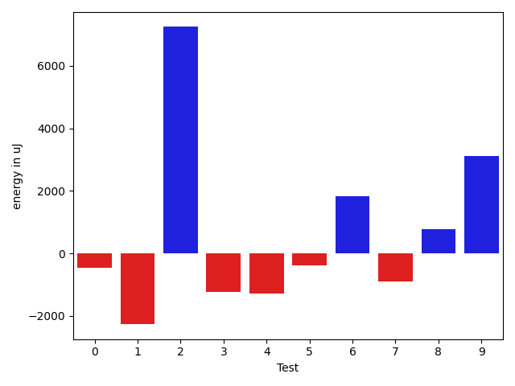
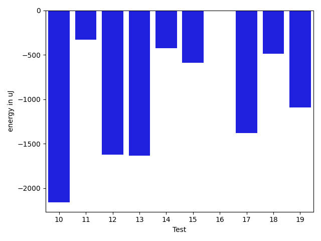
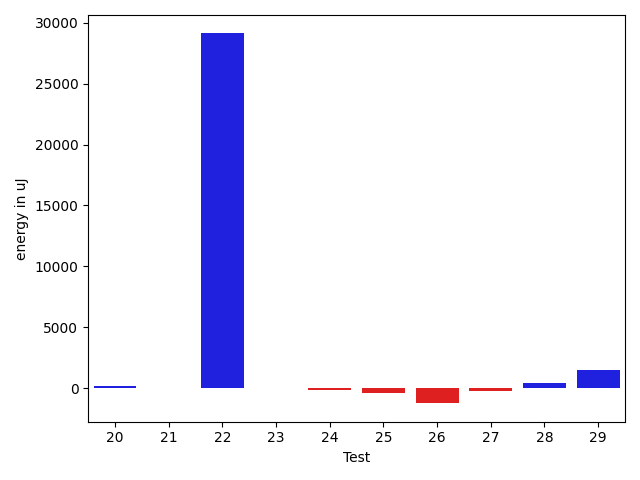
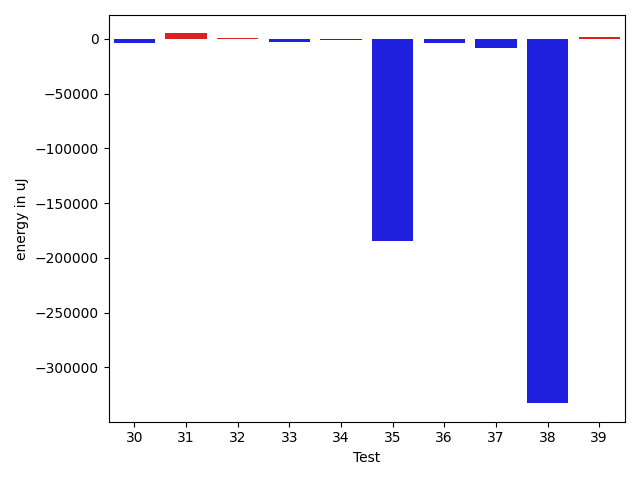
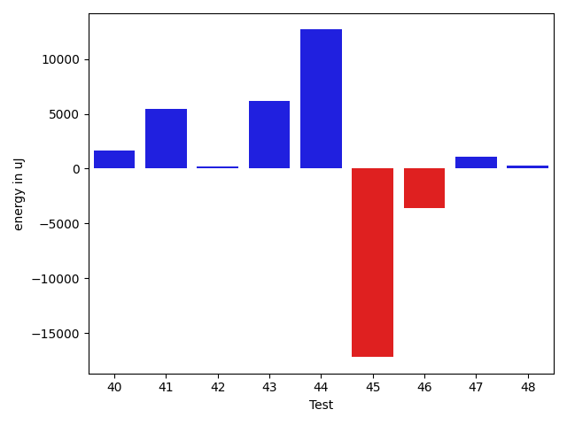

# gson b2d594

https://github.com/google/gson/commit/b2d594

## Delta Energy per test method

| ID | EnergyV1 | EnergyV2 | DeltaEnergy | σV1 | σV2 |
| --- | --- | --- | --- | --- | --- |
| 0 | 36978.72093023256 | 36529.583333333336 | -449.13759689922153 | 4669.590452265327 | 4592.544957591595 |
| 1 | 61041.21212121212 | 58774.25252525252 | -2266.959595959597 | 20013.202639365278 | 19139.8626217289 |
| 2 | 55100.36363636364 | 62347.27027027027 | 7246.906633906634 | 33160.57303638666 | 35712.1657321186 |
| 3 | 36464.606060606064 | 35237.903225806454 | -1226.7028347996093 | 3567.565114305799 | 3200.4223295385486 |
| 4 | 36493.60344827586 | 35202.467741935485 | -1291.1357063403775 | 3742.3531272387468 | 3527.1352156678913 |
| 5 | 36324.72727272727 | 35945.645161290326 | -379.08211143694643 | 3479.139352585744 | 4515.059775608215 |
| 6 | 40589.06593406593 | 42429.6 | 1840.5340659340654 | 10402.487061879758 | 14050.84415100351 |
| 7 | 36514.95081967213 | 35628.164179104475 | -886.7866405676541 | 3484.7315037630956 | 3538.791401733863 |
| 8 | 42238.16842105263 | 43021.22340425532 | 783.0549832026882 | 11021.361120118305 | 12678.159419198086 |
| 9 | 50731.232323232325 | 53858.07070707071 | 3126.8383838383816 | 18538.864680802235 | 19278.496920145273 |
| 10 | 38696.230769230766 | 36537.875 | -2158.355769230766 | 7509.865558090352 | 5199.620106148514 |
| 11 | 56768.64646464647 | 56436.42424242424 | -332.22222222222626 | 19512.995212625407 | 19090.378586279872 |
| 12 | 37002.53125 | 35378.13043478261 | -1624.400815217392 | 3892.5626398650847 | 3592.5299144036812 |
| 13 | 37402.77419354839 | 35769.25581395349 | -1633.5183795948979 | 4562.754924099972 | 3843.834423345275 |
| 14 | 36655.375 | 36230.42222222222 | -424.95277777777665 | 4068.256427436083 | 4244.528595675399 |
| 15 | 36360.73529411765 | 35772.65 | -588.085294117649 | 3731.6028357863115 | 3730.7925110937667 |
| 16 | 36963.57142857143 | 36962.61403508772 | -0.9573934837098932 | 3797.695896520544 | 3990.246972765303 |
| 17 | 36919.31746031746 | 35540.71666666667 | -1378.6007936507958 | 3823.250511102761 | 3844.7046791297535 |
| 18 | 36451.78787878788 | 35965.60655737705 | -486.18132141083333 | 3884.5808732815944 | 3631.5061919611344 |
| 19 | 37365.55714285714 | 36270.36507936508 | -1095.1920634920607 | 4491.235746701455 | 4729.4812907353235 |
| 20 | 37672.545454545456 | 37822.818181818184 | 150.27272727272793 | 5128.789151156907 | 4836.323855953963 |
| 21 | 35467.71641791045 | 35482.34482758621 | 14.62840967575903 | 3679.7990122189367 | 3536.3722086815633 |
| 22 | 82358.01234567902 | 111466.86746987952 | 29108.855124200505 | 119805.62431752091 | 141539.54987021958 |
| 23 | 36586.29230769231 | 36628.016393442624 | 41.72408575031295 | 4543.0709529774 | 4020.0986713761276 |
| 24 | 36254.8125 | 36111.444444444445 | -143.36805555555475 | 4081.3331648303047 | 3458.8995854392297 |
| 25 | 36067.29824561404 | 35692.171875 | -375.126370614038 | 3750.0027132851587 | 3947.2112645935213 |
| 26 | 37156.04255319149 | 35927.36363636364 | -1228.6789168278483 | 4129.333360021836 | 3738.157914674194 |
| 27 | 37524.807692307695 | 37265.2962962963 | -259.51139601139585 | 4245.929535079911 | 4842.266601307123 |
| 28 | 37678.62857142857 | 38117.545454545456 | 438.9168831168863 | 4795.590701501384 | 7114.045749308797 |
| 29 | 38218.0641025641 | 39703.23684210526 | 1485.172739541158 | 5802.773093342006 | 9873.249786095896 |
| 30 | 39505.76470588235 | 36256.0 | -3249.7647058823495 | 8431.446198811935 | 5376.833917798823 |
| 31 | 44084.642857142855 | 49072.87209302326 | 4988.229235880404 | 13473.863668531136 | 22690.989247243575 |
| 32 | 38696.17647058824 | 39975.67924528302 | 1279.5027746947817 | 6880.319941563031 | 7759.977819880733 |
| 33 | 50241.24742268041 | 47195.64893617021 | -3045.5984865102 | 16596.723171194255 | 15292.703601410183 |
| 34 | 47903.5625 | 46783.043956043955 | -1120.5185439560446 | 16092.863881632766 | 13327.042329444861 |
| 35 | 483984.7272727273 | 299745.35353535356 | -184239.37373737374 | 825444.7506219846 | 622534.2879810776 |
| 36 | 64457.068181818184 | 60969.09195402299 | -3487.976227795196 | 25916.51315579397 | 24836.086742504336 |
| 37 | 57501.260416666664 | 49416.24742268041 | -8085.012993986253 | 20130.898153939044 | 15460.095079148377 |
| 38 | 536362.6161616162 | 203731.22222222222 | -332631.3939393939 | 883525.7101540088 | 427566.9732414086 |
| 39 | 82902.85858585859 | 84445.28282828283 | 1542.4242424242402 | 34453.24882190419 | 29339.029350562017 |
| 40 | 40064.94117647059 | 41692.115942028984 | 1627.1747655583968 | 7159.0510357053545 | 7923.590745703493 |
| 41 | 43055.617021276594 | 48467.35632183908 | 5411.739300562484 | 11540.152440184185 | 15554.282279836987 |
| 42 | 43298.12903225807 | 43514.52272727273 | 216.3936950146599 | 11828.036296381237 | 10620.542395386909 |
| 43 | 55408.38461538462 | 61548.114583333336 | 6139.729967948719 | 26497.4121754357 | 34524.785563197736 |
| 44 | 45026.166666666664 | 57709.13114754098 | 12682.964480874318 | 45769.12534521674 | 79193.86974608483 |
| 45 | 91772.28 | 74573.4375 | -17198.8425 | 107132.53403985925 | 95376.31441392351 |
| 46 | 57449.790322580644 | 53880.23880597015 | -3569.551516610496 | 69321.06328436827 | 59880.35499004675 |
| 47 | 35794.96666666667 | 36889.333333333336 | 1094.3666666666686 | 5779.74462228989 | 5434.847595737058 |
| 48 | 36655.666666666664 | 36954.666666666664 | 299.0 | 5432.428390896856 | 4513.501163792423 |

## Delta Duration per test method

| ID | DurationV1 | DurationsV2 | DeltaDuration |
| --- | --- | --- | --- |
| 0 | 611587.0930232558 | 608652.0833333334 | -2935.0096899224445 |
| 1 | 1800833.7575757576 | 1915508.4747474748 | 114674.7171717172 |
| 2 | 1814919.4805194805 | 2095421.1216216215 | 280501.641102141 |
| 3 | 910183.8181818182 | 950906.6290322581 | 40722.810850439826 |
| 4 | 945073.0689655172 | 931144.8548387097 | -13928.214126807521 |
| 5 | 950737.3272727273 | 956782.8387096775 | 6045.5114369501825 |
| 6 | 1336977.5934065934 | 1397897.0526315789 | 60919.45922498545 |
| 7 | 946877.1803278689 | 947362.8507462686 | 485.67041839973535 |
| 8 | 1385679.6 | 1411209.4468085107 | 25529.8468085106 |
| 9 | 1697858.9494949495 | 1749870.7171717172 | 52011.76767676766 |
| 10 | 1114717.5692307693 | 1161572.5555555555 | 46854.98632478621 |
| 11 | 1963264.6363636365 | 1917478.191919192 | -45786.444444444496 |
| 12 | 914949.203125 | 980610.2608695652 | 65661.05774456519 |
| 13 | 682080.2258064516 | 680051.4186046511 | -2028.8072018005187 |
| 14 | 730280.6458333334 | 709409.4888888889 | -20871.15694444452 |
| 15 | 966882.75 | 1012422.3166666667 | 45539.56666666665 |
| 16 | 842807.6326530612 | 932434.1754385965 | 89626.54278553533 |
| 17 | 945446.0952380953 | 961790.7666666667 | 16344.671428571455 |
| 18 | 968519.0757575758 | 1042982.3278688524 | 74463.25211127661 |
| 19 | 920691.9857142858 | 928048.0634920635 | 7356.0777777777985 |
| 20 | 892270.5909090909 | 879025.8363636363 | -13244.754545454634 |
| 21 | 989801.9402985075 | 999469.7413793104 | 9667.801080802921 |
| 22 | 2672613.6172839506 | 3686982.5301204817 | 1014368.9128365312 |
| 23 | 895670.1230769231 | 907840.9016393443 | 12170.778562421212 |
| 24 | 1023809.5208333334 | 1014823.4285714285 | -8986.09226190485 |
| 25 | 996538.3859649122 | 1020613.921875 | 24075.535910087754 |
| 26 | 800960.4255319149 | 812121.4318181818 | 11161.006286266842 |
| 27 | 608673.5769230769 | 589870.1111111111 | -18803.465811965754 |
| 28 | 1063518.5571428572 | 1113326.051948052 | 49807.49480519467 |
| 29 | 1121127.3076923077 | 1298894.0131578948 | 177766.7054655871 |
| 30 | 772713.8529411765 | 790958.3469387755 | 18244.493997599 |
| 31 | 1342954.857142857 | 1482530.4069767443 | 139575.54983388726 |
| 32 | 1049407.7647058824 | 1087288.6603773586 | 37880.895671476144 |
| 33 | 1672794.1958762887 | 1480665.680851064 | -192128.51502522477 |
| 34 | 1545373.5416666667 | 1431166.0989010988 | -114207.44276556792 |
| 35 | 14427240.555555556 | 8803507.91919192 | -5623732.636363637 |
| 36 | 2011991.7954545454 | 1788362.2068965517 | -223629.58855799376 |
| 37 | 1795564.2916666667 | 1560366.4226804124 | -235197.86898625433 |
| 38 | 16105988.656565657 | 5948724.444444444 | -10157264.212121213 |
| 39 | 2545190.5454545454 | 2436441.6666666665 | -108748.8787878789 |
| 40 | 1198771.1176470588 | 1174245.2463768115 | -24525.87127024727 |
| 41 | 1393949.9361702127 | 1414454.5057471264 | 20504.569576913724 |
| 42 | 1280463.6344086023 | 1299406.0340909092 | 18942.399682306917 |
| 43 | 1833848.868131868 | 1938842.03125 | 104993.16311813192 |
| 44 | 1253145.878787879 | 1595769.6393442622 | 342623.7605563833 |
| 45 | 2723855.4 | 1918725.71875 | -805129.6812499999 |
| 46 | 1711515.935483871 | 1518559.776119403 | -192956.15936446795 |
| 47 | 863798.1 | 818721.1041666666 | -45076.99583333335 |
| 48 | 574976.7 | 647116.6666666666 | 72139.96666666667 |

## Misc.

| ID | Test Class | Test Method |
| --- | --- | --- |
| 0 | com.google.gson.functional.MapTest | testWriteMapsWithEmptyStringKey |
| 1 | com.google.gson.functional.MapTest | testSerializeMaps |
| 2 | com.google.gson.functional.MapTest | testMapSerializationWithNullValues |
| 3 | com.google.gson.functional.MapTest | testMapDeserializationWithIntegerKeys |
| 4 | com.google.gson.functional.MapTest | testMapDeserializationWithNullKey |
| 5 | com.google.gson.functional.MapTest | testMapStandardSubclassDeserialization |
| 6 | com.google.gson.functional.MapTest | testMapSubclassDeserialization |
| 7 | com.google.gson.functional.MapTest | testMapSerializationWithIntegerKeys |
| 8 | com.google.gson.functional.MapTest | testGeneralMapField |
| 9 | com.google.gson.functional.MapTest | testMapSerializationWithWildcardValues |
| 10 | com.google.gson.functional.MapTest | testMapDeserialization |
| 11 | com.google.gson.functional.MapTest | testParameterizedMapSubclassSerialization |
| 12 | com.google.gson.functional.MapTest | testMapDeserializationWithNullValue |
| 13 | com.google.gson.functional.MapTest | testMapOfMapSerialization |
| 14 | com.google.gson.functional.MapTest | testMapSubclassSerialization |
| 15 | com.google.gson.functional.MapTest | testMapSerializationWithNullKey |
| 16 | com.google.gson.functional.MapTest | testRawMapSerialization |
| 17 | com.google.gson.functional.MapTest | testMapDeserializationEmpty |
| 18 | com.google.gson.functional.MapTest | testMapSerializationWithNullValue |
| 19 | com.google.gson.functional.MapTest | testMapOfMapDeserialization |
| 20 | com.google.gson.functional.MapTest | testReadMapsWithEmptyStringKey |
| 21 | com.google.gson.functional.MapTest | testParameterizedMapSubclassDeserialization |
| 22 | com.google.gson.functional.MapTest | testMapSerialization |
| 23 | com.google.gson.functional.MapTest | testMapDeserializationWithWildcardValues |
| 24 | com.google.gson.functional.MapTest | testMapSerializationEmpty |
| 25 | com.google.gson.functional.MapTest | testMapSerializationWithNullValueButSerializeNulls |
| 26 | com.google.gson.functional.MapTest | testMapSerializationWithNullValuesSerialized |
| 27 | com.google.gson.functional.MapTest | testMapWithQuotes |
| 28 | com.google.gson.functional.CustomTypeAdaptersTest | testCustomAdapterInvokedForMapElementDeserialization |
| 29 | com.google.gson.functional.CustomTypeAdaptersTest | testCustomAdapterInvokedForMapElementSerializationWithType |
| 30 | com.google.gson.functional.CustomTypeAdaptersTest | testCustomAdapterInvokedForMapElementSerialization |
| 31 | com.google.gson.functional.PrettyPrintingTest | testEmptyMapField |
| 32 | com.google.gson.functional.PrettyPrintingTest | testMap |
| 33 | com.google.gson.functional.MapAsArrayTypeAdapterTest | testMultipleEnableComplexKeyRegistrationHasNoEffect |
| 34 | com.google.gson.functional.MapAsArrayTypeAdapterTest | testMapWithTypeVariableDeserialization |
| 35 | com.google.gson.functional.MapAsArrayTypeAdapterTest | testSerializeComplexMapWithTypeAdapter |
| 36 | com.google.gson.functional.MapAsArrayTypeAdapterTest | testTwoTypesCollapseToOneDeserialize |
| 37 | com.google.gson.functional.MapAsArrayTypeAdapterTest | testMapWithTypeVariableSerialization |
| 38 | com.google.gson.functional.TypeVariableTest | testAdvancedTypeVariables |
| 39 | com.google.gson.functional.TypeVariableTest | testTypeVariablesViaTypeParameter |
| 40 | com.google.gson.functional.JsonParserTest | testExtraCommasInMaps |
| 41 | com.google.gson.functional.MoreSpecificTypeSerializationTest | testListOfParameterizedSubclassFields |
| 42 | com.google.gson.functional.MoreSpecificTypeSerializationTest | testMapOfParameterizedSubclassFields |
| 43 | com.google.gson.functional.MoreSpecificTypeSerializationTest | testListOfSubclassFields |
| 44 | com.google.gson.DefaultMapJsonSerializerTest | testNonEmptyMapSerialization |
| 45 | com.google.gson.DefaultMapJsonSerializerTest | testEmptyMapNoTypeSerialization |
| 46 | com.google.gson.DefaultMapJsonSerializerTest | testEmptyMapSerialization |
| 47 | com.google.gson.functional.DefaultTypeAdaptersTest | testPropertiesSerialization |
| 48 | com.google.gson.functional.DefaultTypeAdaptersTest | testPropertiesDeserialization |

| Test | IterationV1 | IterationV2 | DeltaIteration |
| --- | --- | --- | --- |
| 0 | 43 | 36 | -7 |
| 1 | 99 | 99 | 0 |
| 2 | 77 | 74 | -3 |
| 3 | 66 | 62 | -4 |
| 4 | 58 | 62 | 4 |
| 5 | 55 | 62 | 7 |
| 6 | 91 | 95 | 4 |
| 7 | 61 | 67 | 6 |
| 8 | 95 | 94 | -1 |
| 9 | 99 | 99 | 0 |
| 10 | 65 | 72 | 7 |
| 11 | 99 | 99 | 0 |
| 12 | 64 | 69 | 5 |
| 13 | 31 | 43 | 12 |
| 14 | 48 | 45 | -3 |
| 15 | 68 | 60 | -8 |
| 16 | 49 | 57 | 8 |
| 17 | 63 | 60 | -3 |
| 18 | 66 | 61 | -5 |
| 19 | 70 | 63 | -7 |
| 20 | 44 | 55 | 11 |
| 21 | 67 | 58 | -9 |
| 22 | 81 | 83 | 2 |
| 23 | 65 | 61 | -4 |
| 24 | 48 | 63 | 15 |
| 25 | 57 | 64 | 7 |
| 26 | 47 | 44 | -3 |
| 27 | 26 | 27 | 1 |
| 28 | 70 | 77 | 7 |
| 29 | 78 | 76 | -2 |
| 30 | 34 | 49 | 15 |
| 31 | 84 | 86 | 2 |
| 32 | 51 | 53 | 2 |
| 33 | 97 | 94 | -3 |
| 34 | 96 | 91 | -5 |
| 35 | 99 | 99 | 0 |
| 36 | 88 | 87 | -1 |
| 37 | 96 | 97 | 1 |
| 38 | 99 | 99 | 0 |
| 39 | 99 | 99 | 0 |
| 40 | 68 | 69 | 1 |
| 41 | 94 | 87 | -7 |
| 42 | 93 | 88 | -5 |
| 43 | 91 | 96 | 5 |
| 44 | 66 | 61 | -5 |
| 45 | 25 | 32 | 7 |
| 46 | 62 | 67 | 5 |
| 47 | 30 | 48 | 18 |
| 48 | 30 | 30 | 0 |

| Time Label | Time (s) |
| --- | --- |
| Selection | 28.517257928848267 |
| Injection | 11.572442770004272 |
| Total | 1134.8515846729279 |

