# gson 3b3a60

https://github.com/google/gson/commit/3b3a60

## Delta Energy per test method

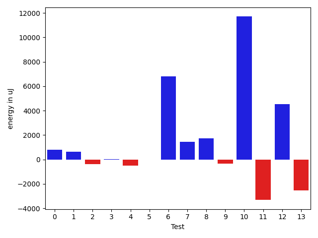

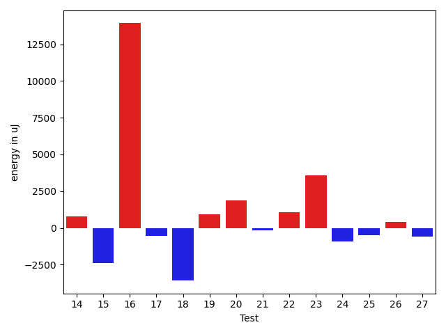

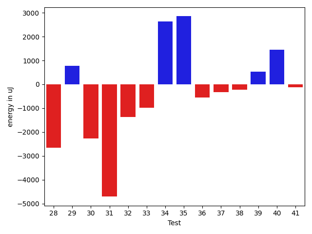

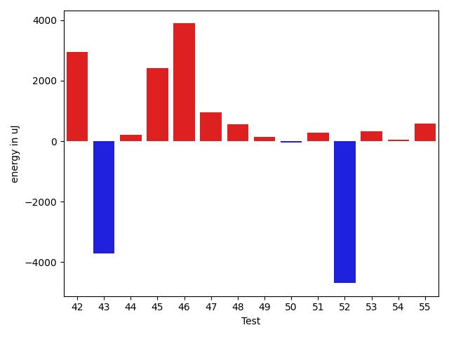

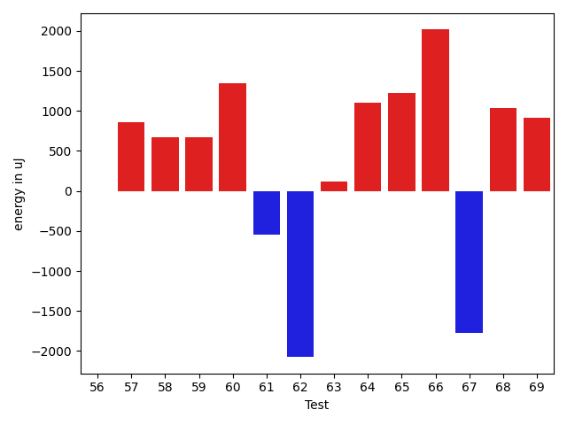

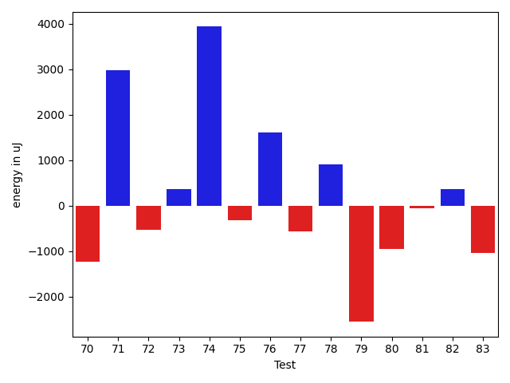

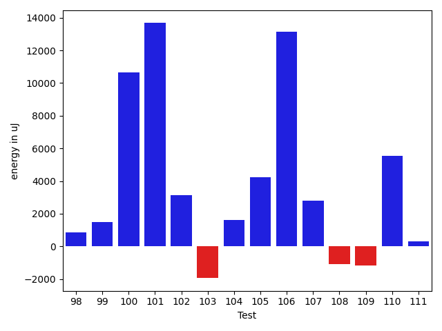

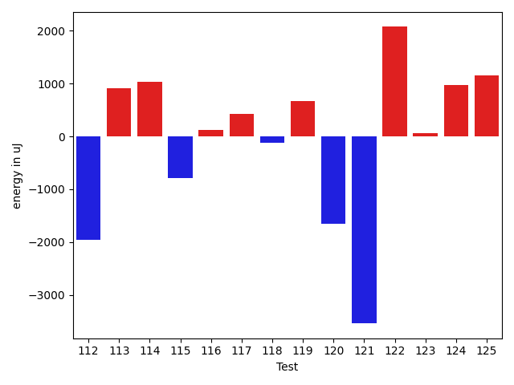

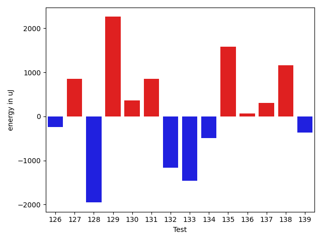

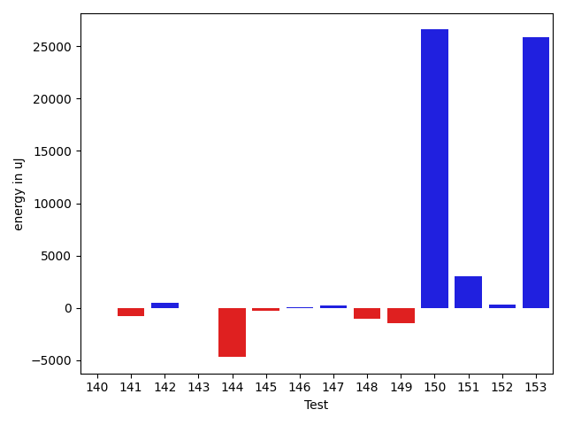

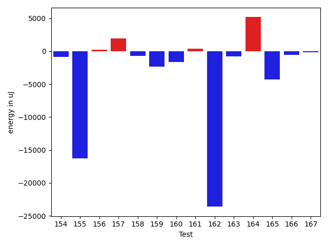

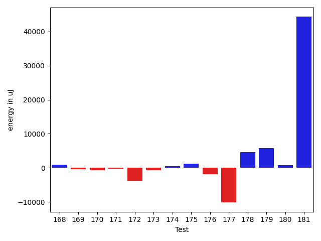

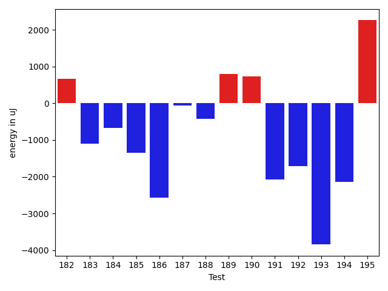

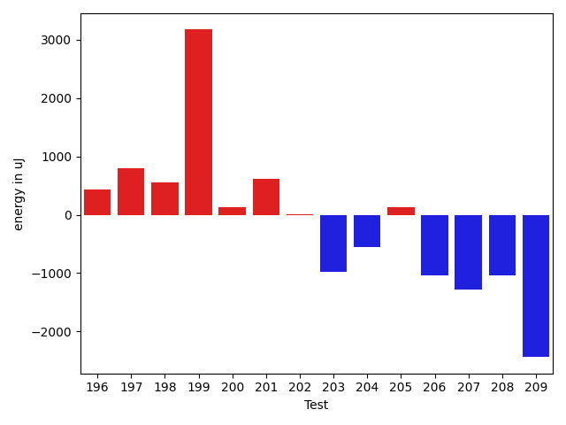

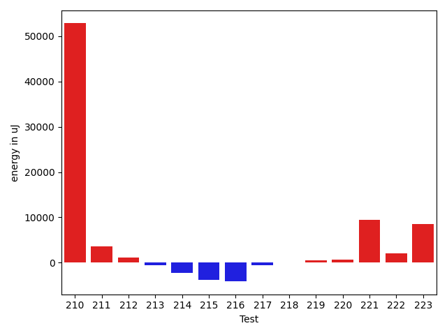

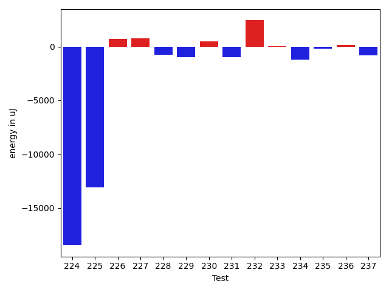

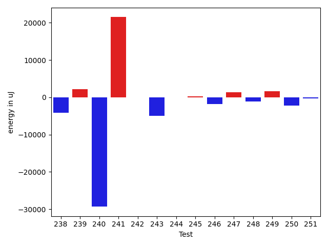

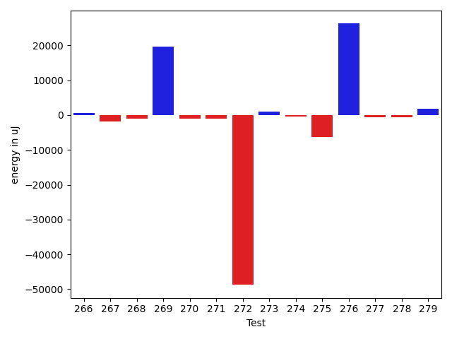

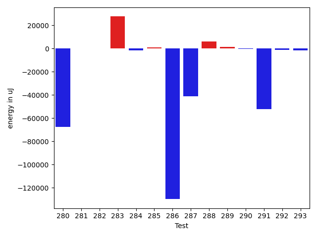

| ID | EnergyV1 | EnergyV2 | DeltaEnergy | σV1 | σV2 |
| --- | --- | --- | --- | --- | --- |
| 0 | 40734.5625 | 41543.066666666666 | 808.5041666666657 | 4023.3701250022245 | 6395.472514556251 |
| 1 | 71267.42424242424 | 71915.4387755102 | 648.0145330859668 | 71964.51949147024 | 85016.60142380677 |
| 2 | 40350.45614035088 | 39957.15094339623 | -393.30519695465046 | 4005.265578377979 | 4117.329407384623 |
| 3 | 46737.40677966102 | 46746.01587301587 | 8.60909335485485 | 15810.956295780234 | 17784.197431135013 |
| 4 | 44252.59756097561 | 43734.76315789474 | -517.834403080873 | 10544.116022877237 | 10550.976174429527 |
| 5 | 39916.914893617024 | 39902.807692307695 | -14.107201309328957 | 4169.648548023382 | 4022.898725462206 |
| 6 | 58620.524590163935 | 65412.41176470588 | 6791.887174541946 | 64742.388337873504 | 87023.1930628833 |
| 7 | 40775.382978723406 | 42224.39024390244 | 1449.0072651790324 | 4849.2256523898095 | 4743.5641425555705 |
| 8 | 45293.65517241379 | 47014.80487804878 | 1721.1497056349908 | 13167.287312444061 | 16106.737769383459 |
| 9 | 40664.57352941176 | 40335.84745762712 | -328.72607178464386 | 4042.476182461672 | 3468.574780890435 |
| 10 | 59779.131313131315 | 71484.32323232324 | 11705.191919191922 | 23969.360485287587 | 36271.948505427295 |
| 11 | 103894.51515151515 | 100576.9797979798 | -3317.5353535353497 | 71622.85782836576 | 75248.89209372403 |
| 12 | 69991.51020408163 | 74515.0101010101 | 4523.499896928479 | 46811.39059888006 | 38084.332881649665 |
| 13 | 86569.02061855671 | 84018.69696969698 | -2550.323648859732 | 42651.06741439426 | 40230.53681939701 |
| 14 | 59985.56122448979 | 60782.744897959186 | 797.1836734693934 | 26235.52628459976 | 25248.696857991697 |
| 15 | 52972.611764705885 | 50597.175 | -2375.4367647058825 | 33017.413709985405 | 27754.012058518227 |
| 16 | 74475.62626262626 | 88398.41414141415 | 13922.787878787887 | 38125.749492374176 | 85292.76357453795 |
| 17 | 46160.74025974026 | 45598.328571428574 | -562.4116883116876 | 15390.49667173431 | 13926.505573106095 |
| 18 | 64988.080808080806 | 61406.77777777778 | -3581.3030303030246 | 32415.03845242603 | 28825.098328147717 |
| 19 | 83424.18556701031 | 84362.72727272728 | 938.5417057169689 | 36811.4448578464 | 42696.933438916145 |
| 20 | 40049.307692307695 | 41926.14666666667 | 1876.8389743589723 | 4195.00918096759 | 9300.105838384614 |
| 21 | 40734.13888888889 | 40594.63157894737 | -139.507309941524 | 3319.0718511252658 | 3046.0281508621806 |
| 22 | 39471.11627906977 | 40546.875 | 1075.7587209302292 | 4258.548099612323 | 3646.7237745607263 |
| 23 | 40235.4375 | 43808.44 | 3573.0025000000023 | 4104.372903817799 | 11031.059042829931 |
| 24 | 47084.41975308642 | 46154.19277108434 | -930.2269820020811 | 18990.825890325224 | 13585.387687270528 |
| 25 | 99336.67676767676 | 98828.57575757576 | -508.10101010100334 | 37886.09061272649 | 36398.94895726738 |
| 26 | 40997.09302325582 | 41390.604166666664 | 393.5111434108476 | 5743.434459162524 | 3184.02041280349 |
| 27 | 40952.03846153846 | 40359.357142857145 | -592.681318681316 | 9898.6471199964 | 3105.199167919665 |
| 28 | 50280.48314606742 | 47628.52808988764 | -2651.9550561797805 | 20696.76985985346 | 14549.06762145621 |
| 29 | 39851.86666666667 | 40622.8 | 770.9333333333343 | 5079.709773424287 | 3118.194043566458 |
| 30 | 42025.454545454544 | 39756.0 | -2269.454545454544 | 3579.3763769592438 | 3644.115168821694 |
| 31 | 47466.2 | 42759.51515151515 | -4706.684848484845 | 19369.763148931743 | 12379.073020861902 |
| 32 | 41292.125 | 39912.666666666664 | -1379.4583333333358 | 5905.52135055619 | 4069.037530205666 |
| 33 | 58562.65517241379 | 57571.74193548387 | -990.9132369299186 | 23980.02824997501 | 22677.838886864065 |
| 34 | 55132.933333333334 | 57778.5 | 2645.5666666666657 | 51199.86119052364 | 52494.760275921544 |
| 35 | 40123.78048780488 | 42974.5625 | 2850.7820121951227 | 3450.3431749588513 | 6123.772994126558 |
| 36 | 40620.9 | 40077.125 | -543.7750000000015 | 4234.592356217224 | 4565.760504491557 |
| 37 | 40847.34426229508 | 40512.86440677966 | -334.47985551541933 | 3482.5375423593764 | 5247.798778108092 |
| 38 | 40180.125 | 39957.566666666666 | -222.5583333333343 | 3147.6081370423162 | 3041.5275951768417 |
| 39 | 40180.94545454546 | 40720.26530612245 | 539.3198515769909 | 5914.861991529724 | 10136.78230912916 |
| 40 | 43097.27659574468 | 44555.52173913043 | 1458.2451433857495 | 16503.483782706244 | 12468.109454923879 |
| 41 | 39947.380952380954 | 39816.125 | -131.2559523809541 | 6630.527286194554 | 4281.983472571444 |
| 42 | 40652.75 | 43592.02380952381 | 2939.273809523809 | 3480.0878291518898 | 14971.908396167892 |
| 43 | 45964.58620689655 | 42257.31034482759 | -3707.2758620689638 | 14830.72667440285 | 8011.612557141981 |
| 44 | 42980.66071428572 | 43191.0 | 210.3392857142826 | 11349.608171771499 | 11321.083511060537 |
| 45 | 40347.84848484849 | 42771.8064516129 | 2423.957966764414 | 2927.181539454283 | 11909.218840121037 |
| 46 | 39339.26829268293 | 43228.4358974359 | 3889.167604752969 | 4030.6133771811606 | 21134.120275886446 |
| 47 | 40538.333333333336 | 41482.875 | 944.5416666666642 | 4276.019542905894 | 3175.273145238847 |
| 48 | 39414.3 | 39972.833333333336 | 558.5333333333328 | 4774.36598338809 | 4863.660809742207 |
| 49 | 40794.13953488372 | 40933.60975609756 | 139.47022121384362 | 9235.495515801547 | 3637.3464790538314 |
| 50 | 41370.291666666664 | 41323.944444444445 | -46.34722222221899 | 7340.462306507942 | 6916.425140138205 |
| 51 | 40197.1875 | 40482.44117647059 | 285.2536764705874 | 3929.7089462635463 | 3397.8357834429958 |
| 52 | 45746.41463414634 | 41051.8085106383 | -4694.6061235080415 | 37072.32049424582 | 4212.397354710274 |
| 53 | 40210.0 | 40532.818181818184 | 322.8181818181838 | 7038.722334344494 | 4359.556173230047 |
| 54 | 38672.666666666664 | 38722.47619047619 | 49.80952380952658 | 3903.872322593441 | 4280.3452644344525 |
| 55 | 39412.74074074074 | 39983.71875 | 570.9780092592628 | 2616.4069027834307 | 3453.701033261049 |
| 56 | 43426.454545454544 | 39838.78125 | -3587.673295454544 | 15937.464571731813 | 3276.272727261642 |
| 57 | 40637.066666666666 | 40044.95 | -592.1166666666686 | 3376.936214315508 | 4171.028895548436 |
| 58 | 39748.17647058824 | 41044.57894736842 | 1296.402476780182 | 3063.7191400091056 | 3904.3834113358644 |
| 59 | 55117.6835443038 | 59334.535211267605 | 4216.851666963805 | 33261.02358029164 | 35864.12873250538 |
| 60 | 40015.91891891892 | 40411.02380952381 | 395.1048906048891 | 4214.09631477291 | 4443.286800857132 |
| 61 | 40488.98039215686 | 39296.68421052631 | -1192.296181630547 | 3356.571134942511 | 4314.31482091435 |
| 62 | 56716.94545454546 | 59231.46666666667 | 2514.52121212121 | 62722.44738714674 | 61975.066161983406 |
| 63 | 43114.03333333333 | 41132.51666666667 | -1981.5166666666628 | 11390.216819661022 | 3966.5159627884454 |
| 64 | 47778.811594202896 | 48763.5 | 984.6884057971038 | 16814.37666883922 | 15644.814059754297 |
| 65 | 40707.21052631579 | 42053.06451612903 | 1345.853989813244 | 3805.3671871927 | 3581.682582930812 |
| 66 | 38878.1320754717 | 43280.245614035084 | 4402.1135385633825 | 4182.577006645345 | 21891.001951279017 |
| 67 | 40659.444444444445 | 38954.318181818184 | -1705.1262626262615 | 3948.8750468712565 | 4319.6270081651055 |
| 68 | 51350.24096385542 | 49926.59756097561 | -1423.6434028798103 | 25844.555240523878 | 19987.280810958044 |
| 69 | 40150.333333333336 | 40307.76190476191 | 157.42857142857247 | 3785.4339024826936 | 3609.0674419375314 |
| 70 | 40757.45614035088 | 39530.03389830508 | -1227.4222420457954 | 5525.312473723713 | 4180.760602951322 |
| 71 | 40675.56862745098 | 43660.03636363636 | 2984.467736185383 | 4297.233502464352 | 27052.070367391734 |
| 72 | 40101.40476190476 | 39565.351851851854 | -536.0529100529093 | 3270.7313370292195 | 4069.7493468972566 |
| 73 | 43402.0 | 43764.63888888889 | 362.6388888888905 | 10797.248195720982 | 10573.06101386595 |
| 74 | 40502.8 | 44438.583333333336 | 3935.783333333333 | 3972.7362056899783 | 33218.69901992534 |
| 75 | 40349.208333333336 | 40031.813953488374 | -317.3943798449618 | 3678.9551390212073 | 4333.021515496869 |
| 76 | 40388.166666666664 | 41999.83098591549 | 1611.6643192488264 | 3427.8685635375364 | 18268.00162061715 |
| 77 | 40516.04081632653 | 39944.854166666664 | -571.1866496598668 | 4509.265771082072 | 4187.3070601799245 |
| 78 | 39516.48 | 40428.87096774193 | 912.3909677419288 | 3433.8510057368535 | 3605.7142171293526 |
| 79 | 59155.269662921346 | 56601.476744186046 | -2553.7929187353 | 68646.23113819028 | 59410.54883716511 |
| 80 | 40036.0 | 39088.15555555555 | -947.8444444444467 | 3280.1371402026143 | 4472.0421035364225 |
| 81 | 40097.260869565216 | 40035.04255319149 | -62.21831637372816 | 4040.8505585204325 | 3666.1499194975345 |
| 82 | 39940.568181818184 | 40306.97826086957 | 366.41007905138395 | 3783.952937902417 | 4019.1948928216875 |
| 83 | 39963.6976744186 | 38920.055555555555 | -1043.6421188630484 | 4207.234707660536 | 3975.1222758582767 |
| 84 | 45703.666666666664 | 38710.8 | -6992.866666666661 | 31054.312933085977 | 4521.287913858174 |
| 85 | 41046.813953488374 | 40181.795454545456 | -865.0184989429181 | 4674.055871613869 | 3187.703986909882 |
| 86 | 42053.05263157895 | 40017.782608695656 | -2035.270022883291 | 2551.9858412757744 | 4413.197804969147 |
| 87 | 167965.80412371134 | 169874.59595959596 | 1908.7918358846218 | 101853.87783766446 | 109909.52613605844 |
| 88 | 41068.97959183674 | 40364.102040816324 | -704.8775510204141 | 3300.201134809173 | 5034.200502947155 |
| 89 | 43304.96078431373 | 42165.58823529412 | -1139.3725490196084 | 5883.520354614915 | 5581.2153050594825 |
| 90 | 41083.07894736842 | 40719.35294117647 | -363.72600619195146 | 4224.230813704611 | 4695.736382033192 |
| 91 | 40780.67924528302 | 46472.96226415094 | 5692.283018867922 | 7426.595572856839 | 19858.498687256888 |
| 92 | 49764.620689655174 | 41441.13157894737 | -8323.489110707807 | 30621.290846925207 | 4755.915076988769 |
| 93 | 46470.75862068965 | 45043.8064516129 | -1426.9521690767506 | 17591.461923243005 | 15504.017598818524 |
| 94 | 41619.055555555555 | 42349.57142857143 | 730.5158730158728 | 5311.558794765141 | 4075.4019442016665 |
| 95 | 41391.98148148148 | 44526.69090909091 | 3134.7094276094285 | 3857.315370828193 | 21948.618636072188 |
| 96 | 42201.41428571429 | 41243.28358208955 | -958.1307036247381 | 5023.768922383892 | 3291.6839577623728 |
| 97 | 49298.80357142857 | 52620.16393442623 | 3321.360362997657 | 31774.62668906235 | 32421.94847310688 |
| 98 | 43404.72463768116 | 44252.171428571426 | 847.4467908902661 | 10467.921365141425 | 11579.667205890837 |
| 99 | 51827.290322580644 | 53334.96842105263 | 1507.678098471988 | 20847.913594885194 | 20092.803644694934 |
| 100 | 54169.666666666664 | 64827.11688311688 | 10657.45021645022 | 63894.56686788454 | 91444.97137835922 |
| 101 | 91631.36363636363 | 105300.20202020202 | 13668.838383838389 | 47850.73338100569 | 57847.37011910361 |
| 102 | 41517.09090909091 | 44666.89473684211 | 3149.803827751195 | 6329.144972478086 | 11977.727972884859 |
| 103 | 44362.50746268657 | 42426.693333333336 | -1935.8141293532317 | 11567.51694917052 | 12077.57028542119 |
| 104 | 42442.03921568627 | 44067.255319148935 | 1625.2161034626624 | 8880.621833820247 | 10546.213638317067 |
| 105 | 54977.95652173913 | 59202.03125 | 4224.074728260872 | 27747.20131790538 | 32044.194046222165 |
| 106 | 75677.78125 | 88824.61224489796 | 13146.830994897959 | 90803.10208623602 | 100981.12657885808 |
| 107 | 45195.125 | 48001.75925925926 | 2806.6342592592628 | 11705.343394551695 | 26768.25970002476 |
| 108 | 40529.875 | 39444.0 | -1085.875 | 4054.044938006361 | 4213.01915693089 |
| 109 | 39928.96 | 38762.16 | -1166.7999999999956 | 3312.519735548756 | 3421.7975004959017 |
| 110 | 43600.57407407407 | 49132.203125 | 5531.629050925927 | 14172.417021966046 | 16339.67980788991 |
| 111 | 40139.88461538462 | 40461.125 | 321.24038461538294 | 3881.6624345655255 | 3967.0522254408247 |
| 112 | 39807.0 | 38038.17391304348 | -1768.8260869565202 | 4060.224197422272 | 4042.431539601252 |
| 113 | 39297.67857142857 | 40221.96666666667 | 924.2880952380947 | 3566.4410937593093 | 3925.626247138439 |
| 114 | 47288.739130434784 | 49276.08571428571 | 1987.3465838509292 | 15951.611062747375 | 19082.7471777466 |
| 115 | 40801.121212121216 | 41014.0243902439 | 212.90317812268768 | 4079.021434620747 | 4551.132925090646 |
| 116 | 40808.980769230766 | 43545.17857142857 | 2736.1978021978066 | 4711.334101808207 | 18777.845206811387 |
| 117 | 41857.294117647056 | 41599.828571428574 | -257.4655462184819 | 4625.7648749369755 | 6228.990619838885 |
| 118 | 40981.77777777778 | 41073.57142857143 | 91.79365079364652 | 3529.5663969696457 | 3463.7766007836094 |
| 119 | 41725.208333333336 | 41195.818181818184 | -529.390151515152 | 4835.863383609028 | 3543.425623427184 |
| 120 | 41936.35294117647 | 39496.514285714286 | -2439.838655462183 | 3382.411799487886 | 4762.969928050166 |
| 121 | 43066.95652173913 | 40386.434782608696 | -2680.5217391304323 | 3728.841357268349 | 3916.6740751515285 |
| 122 | 88537.60416666667 | 81985.1237113402 | -6552.480455326469 | 123582.10191866368 | 91658.07791052973 |
| 123 | 42137.0625 | 42476.2027027027 | 339.14020270269975 | 9509.261774506671 | 9492.343271460211 |
| 124 | 42164.779661016946 | 40947.5 | -1217.2796610169462 | 10991.947790978007 | 7462.708444453869 |
| 125 | 39523.166666666664 | 40055.490909090906 | 532.3242424242417 | 4660.045343723122 | 4766.405193444969 |
| 126 | 53807.97368421053 | 51839.25974025974 | -1968.7139439507882 | 27047.47179496279 | 24863.848196273648 |
| 127 | 49976.614457831325 | 167835.71604938273 | 117859.1015915514 | 20387.315796679213 | 511043.37167414645 |
| 128 | 101585.62626262626 | 96359.48484848485 | -5226.141414141413 | 37679.236697855864 | 33403.196432169985 |
| 129 | 134688.81818181818 | 139122.19191919192 | 4433.373737373739 | 206955.9046866603 | 211058.33117227518 |
| 130 | 39458.15151515151 | 40037.27027027027 | 579.1187551187613 | 4833.144901998059 | 4481.067456374162 |
| 131 | 40242.11475409836 | 40374.07272727273 | 131.95797317437246 | 4518.405090361198 | 3709.537422054107 |
| 132 | 41643.59493670886 | 40672.925 | -970.6699367088586 | 7687.73859280912 | 8273.220562113342 |
| 133 | 39505.48148148148 | 38805.21428571428 | -700.2671957671992 | 4367.854888126566 | 4696.744612397148 |
| 134 | 40707.46031746032 | 40466.15254237288 | -241.3077750874363 | 4724.534144584621 | 7207.798694995462 |
| 135 | 39234.42424242424 | 41061.22222222222 | 1826.7979797979788 | 4375.188674929401 | 3466.172361482644 |
| 136 | 39979.64705882353 | 40352.92857142857 | 373.2815126050409 | 4372.61024400995 | 3574.3658271540326 |
| 137 | 39482.61538461538 | 40670.7 | 1188.0846153846142 | 4555.018104134613 | 3368.885878150223 |
| 138 | 40250.357142857145 | 41087.206896551725 | 836.8497536945797 | 4940.151517444188 | 4284.382741356705 |
| 139 | 39195.04347826087 | 39645.92 | 450.8765217391265 | 3922.872189544409 | 4413.280955660992 |
| 140 | 40606.444444444445 | 40563.8 | -42.64444444444234 | 4100.160912229279 | 4581.493449375069 |
| 141 | 40735.967741935485 | 39995.65789473684 | -740.309847198645 | 4475.598172195468 | 4741.5386092453155 |
| 142 | 39343.756097560974 | 39871.175 | 527.4189024390289 | 4344.486069583408 | 5036.658326149888 |
| 143 | 40137.08928571428 | 40159.717391304344 | 22.62810559006175 | 4433.149349248494 | 4560.305046352108 |
| 144 | 59522.755102040814 | 54835.53125 | -4687.223852040814 | 22454.240996656812 | 22311.310572383612 |
| 145 | 39179.769230769234 | 38913.4 | -266.3692307692327 | 4513.497691179649 | 4847.274797244324 |
| 146 | 41045.333333333336 | 41074.92682926829 | 29.593495934954262 | 5187.3804136149065 | 7400.676450262861 |
| 147 | 41242.648148148146 | 41478.98148148148 | 236.33333333333576 | 4943.894787765671 | 8325.57571914475 |
| 148 | 40288.28571428572 | 39228.90909090909 | -1059.3766233766291 | 4213.673094455569 | 4846.168948415235 |
| 149 | 41049.1 | 39631.5 | -1417.5999999999985 | 4298.994073036156 | 4877.658588792734 |
| 150 | 63139.28571428572 | 89726.43243243243 | 26587.14671814671 | 59912.880070142855 | 88682.95006507979 |
| 151 | 41977.293103448275 | 45015.692307692305 | 3038.3992042440295 | 7355.686807776034 | 12925.057065100127 |
| 152 | 40027.17021276596 | 40379.02040816326 | 351.85019539730274 | 4732.580652308217 | 4167.129621849768 |
| 153 | 60556.75 | 86439.27272727272 | 25882.52272727272 | 64503.561151852955 | 98353.77192433346 |
| 154 | 40561.28813559322 | 39683.7 | -877.5881355932215 | 3886.183518660267 | 4457.42496179128 |
| 155 | 247752.8383838384 | 231500.84848484848 | -16251.989898989908 | 239026.77695278937 | 248385.60572631328 |
| 156 | 40171.8 | 40400.7 | 228.89999999999418 | 4203.670896305328 | 3652.053033568927 |
| 157 | 51361.65853658537 | 53272.607142857145 | 1910.948606271777 | 32206.65267635105 | 35959.408528763655 |
| 158 | 41882.42372881356 | 41184.480769230766 | -697.9429595827969 | 6064.063517632184 | 4486.003915986427 |
| 159 | 43363.293333333335 | 40992.07352941176 | -2371.2198039215727 | 10688.887669941258 | 8235.627033016148 |
| 160 | 41475.62162162162 | 39868.69696969697 | -1606.9246519246517 | 6637.347635962245 | 4245.097275430754 |
| 161 | 40888.56 | 41251.666666666664 | 363.10666666666657 | 4145.132674161347 | 4746.958909542917 |
| 162 | 122699.54651162791 | 99083.34939759035 | -23616.197114037554 | 405678.62198292965 | 322596.25066257763 |
| 163 | 41427.89189189189 | 40653.4 | -774.491891891892 | 4364.213305063861 | 3351.2725901265226 |
| 164 | 43626.0 | 48793.46666666667 | 5167.466666666667 | 9085.47043784322 | 28885.798074755618 |
| 165 | 92909.42424242424 | 88637.0202020202 | -4272.4040404040425 | 28343.073975231986 | 27892.325915371217 |
| 166 | 42000.549019607846 | 41459.70491803279 | -540.8441015750577 | 3661.024684127814 | 7398.796553326548 |
| 167 | 41476.05454545454 | 41322.89090909091 | -153.1636363636353 | 3925.466264919976 | 5693.195254536858 |
| 168 | 41001.95238095238 | 42008.87096774193 | 1006.9185867895503 | 4017.866489160205 | 4541.359432975957 |
| 169 | 44773.16981132075 | 44438.313725490196 | -334.8560858305573 | 14645.894374457568 | 13228.434092099766 |
| 170 | 41358.333333333336 | 40724.35897435898 | -633.9743589743593 | 3199.0158769841364 | 4416.373773474664 |
| 171 | 40489.57142857143 | 40234.791666666664 | -254.7797619047633 | 3514.0387776193143 | 3114.2238061723433 |
| 172 | 81851.10416666667 | 78153.91860465116 | -3697.185562015511 | 35779.156461746665 | 31984.162632943564 |
| 173 | 47200.65 | 46537.76829268293 | -662.8817073170721 | 19623.60351916793 | 19520.36028961954 |
| 174 | 40060.0 | 40593.55882352941 | 533.5588235294126 | 4780.6183780890815 | 3283.5853359254274 |
| 175 | 42875.1875 | 44150.08474576271 | 1274.8972457627096 | 9786.821379530933 | 13698.31905967352 |
| 176 | 42823.54716981132 | 40987.781818181815 | -1835.7653516295031 | 9955.390241047744 | 6769.106170861608 |
| 177 | 51401.26 | 41266.19565217391 | -10135.06434782609 | 40973.42586155568 | 6454.562106251621 |
| 178 | 41768.291666666664 | 46386.5625 | 4618.270833333336 | 4027.4839486455085 | 27638.36410446707 |
| 179 | 42187.811320754714 | 48032.1 | 5844.288679245285 | 6208.758889305674 | 30637.574118882192 |
| 180 | 43798.567164179105 | 44559.3 | 760.7328358208979 | 8897.279836236183 | 10883.247297337317 |
| 181 | 122296.23232323233 | 166600.29292929292 | 44304.06060606059 | 203978.44222565435 | 381790.4251364401 |
| 182 | 51711.94642857143 | 53133.36507936508 | 1421.4186507936538 | 24502.738742273898 | 28528.23966011244 |
| 183 | 49515.01219512195 | 46098.07792207792 | -3416.9342730440258 | 28688.312719554862 | 13951.760114037312 |
| 184 | 43144.82258064516 | 44322.32876712329 | 1177.506186478131 | 8881.13424993095 | 11184.850162259043 |
| 185 | 47960.50666666667 | 44329.06578947369 | -3631.440877192981 | 17417.33312948021 | 12216.94287534144 |
| 186 | 40353.36363636364 | 38435.454545454544 | -1917.9090909090955 | 3312.1039163373302 | 3520.4434344563206 |
| 187 | 40392.26315789474 | 40561.22222222222 | 168.9590643274787 | 2213.9340750443903 | 3125.0246853346002 |
| 188 | 40836.42622950819 | 41435.58823529412 | 599.1620057859254 | 3692.3831056184126 | 6406.974701873718 |
| 189 | 40767.0 | 41530.944444444445 | 763.9444444444453 | 5395.53070340894 | 3612.1750214797826 |
| 190 | 40134.47826086957 | 40715.192307692305 | 580.7140468227371 | 3216.582251390782 | 3463.755587611525 |
| 191 | 47373.303797468354 | 41597.17283950617 | -5776.130957962181 | 16921.31960496964 | 10334.774484677393 |
| 192 | 45780.41379310345 | 42342.444444444445 | -3437.969348659004 | 15879.657940633795 | 8804.153209048276 |
| 193 | 40910.09090909091 | 39423.5 | -1486.5909090909117 | 4910.361085677461 | 5181.714058430215 |
| 194 | 41980.29824561404 | 43243.18518518518 | 1262.8869395711445 | 8797.102623032903 | 11347.932516989644 |
| 195 | 42726.51612903226 | 42302.705882352944 | -423.8102466793134 | 8793.244591348988 | 4005.73099394452 |
| 196 | 40059.333333333336 | 40405.26666666667 | 345.9333333333343 | 4029.297712450093 | 3910.897705415244 |
| 197 | 39253.30434782609 | 40263.78947368421 | 1010.4851258581257 | 4642.1640327946625 | 4201.272095310725 |
| 198 | 41853.6 | 40388.22222222222 | -1465.3777777777796 | 3164.6907126394935 | 4284.796475855787 |
| 199 | 38972.333333333336 | 41198.64705882353 | 2226.313725490196 | 4946.06588573502 | 3114.350011331351 |
| 200 | 40286.903225806454 | 40702.066666666666 | 415.16344086021127 | 4108.547505328128 | 3334.9158403507313 |
| 201 | 87494.72413793103 | 42880.3 | -44614.424137931026 | 104023.76143239866 | 4885.822797646268 |
| 202 | 69043.875 | 46940.555555555555 | -22103.319444444445 | 61913.93772646733 | 19754.81648598796 |
| 203 | 39199.65 | 39602.857142857145 | 403.2071428571435 | 3594.5498504680663 | 3764.279495793183 |
| 204 | 40699.27272727273 | 40750.944444444445 | 51.67171717171732 | 3651.9518091739556 | 4130.290176411099 |
| 205 | 39116.17647058824 | 40408.705882352944 | 1292.5294117647063 | 4202.709605442858 | 3917.1637363051627 |
| 206 | 39622.58823529412 | 46598.78947368421 | 6976.201238390095 | 4777.75523292518 | 33231.24104874642 |
| 207 | 39928.3125 | 39101.78571428572 | -826.5267857142826 | 4352.872208650714 | 2949.321451708885 |
| 208 | 41513.0 | 40527.25 | -985.75 | 3458.368329140203 | 4235.677075450866 |
| 209 | 40886.35294117647 | 39690.64705882353 | -1195.705882352937 | 4327.336783766478 | 3017.550407808927 |
| 210 | 152219.43434343435 | 205056.62626262626 | 52837.191919191915 | 377843.9081236653 | 491721.77203837264 |
| 211 | 55145.10638297872 | 58715.57142857143 | 3570.465045592704 | 21954.0166961553 | 27714.84639593719 |
| 212 | 40896.07462686567 | 42041.609375 | 1145.534748134327 | 4061.476756327927 | 9007.682295229284 |
| 213 | 41262.98181818182 | 40659.32653061225 | -603.6552875695706 | 6323.040866519006 | 4171.114725902785 |
| 214 | 42461.171428571426 | 40237.3125 | -2223.858928571426 | 3741.1988795473744 | 4115.766768154355 |
| 215 | 69866.725 | 66009.45 | -3857.2750000000087 | 93473.28277480885 | 87110.08948363847 |
| 216 | 45540.25 | 41394.78431372549 | -4145.4656862745105 | 12737.955704147873 | 7903.958004060372 |
| 217 | 41786.60975609756 | 41234.857142857145 | -551.7526132404164 | 8303.47562808769 | 8542.86279542734 |
| 218 | 40797.5 | 40838.692307692305 | 41.192307692304894 | 4925.52640043971 | 4547.547454842378 |
| 219 | 42667.53333333333 | 43217.73469387755 | 550.2013605442189 | 8613.03149522732 | 8300.139445043298 |
| 220 | 41066.305555555555 | 41722.444444444445 | 656.1388888888905 | 4495.713142165078 | 8243.5680868462 |
| 221 | 59106.53191489362 | 68528.9 | 9422.368085106376 | 70300.76370180833 | 84093.9106297834 |
| 222 | 40502.27272727273 | 42629.529411764706 | 2127.2566844919784 | 6076.217036205535 | 7566.378849634332 |
| 223 | 80158.22826086957 | 88647.86315789474 | 8489.634897025171 | 96457.39474820448 | 114232.09144079944 |
| 224 | 420041.0202020202 | 431497.68686868687 | 11456.666666666686 | 139005.89810224494 | 173326.71139493407 |
| 225 | 470513.82828282827 | 490844.0808080808 | 20330.252525252523 | 153512.18691970187 | 209330.87612694476 |
| 226 | 55160.58426966292 | 59708.5 | 4547.915730337081 | 25638.632604254322 | 39752.10605353961 |
| 227 | 71063.33684210526 | 59592.073684210525 | -11471.263157894733 | 76200.16258023969 | 25590.631785147303 |
| 228 | 46000.73809523809 | 46712.862068965514 | 712.1239737274227 | 13746.73043821438 | 16451.42577769191 |
| 229 | 50264.96666666667 | 48147.59090909091 | -2117.3757575757554 | 15529.076906421566 | 14137.47126645771 |
| 230 | 50643.38461538462 | 55247.234567901236 | 4603.849952516619 | 25860.454315238403 | 30736.53435417649 |
| 231 | 179092.5064935065 | 118499.01492537314 | -60593.49156813335 | 506827.5999281466 | 384818.4069602409 |
| 232 | 39156.96078431373 | 41235.41509433962 | 2078.454310025896 | 5132.171114782057 | 4003.7387217730616 |
| 233 | 197136.45652173914 | 100075.66666666667 | -97060.78985507246 | 471528.2274345328 | 269636.45346379513 |
| 234 | 42006.84848484849 | 41610.5625 | -396.2859848484877 | 8381.453081949569 | 6533.752118506926 |
| 235 | 40142.89189189189 | 40123.53846153846 | -19.353430353432486 | 4967.482557723339 | 2807.899423340806 |
| 236 | 39890.74285714285 | 39975.967741935485 | 85.2248847926312 | 5105.370932894982 | 3792.0095147889256 |
| 237 | 48817.22784810127 | 47342.83950617284 | -1474.388341928432 | 16294.108150773329 | 16238.946218362933 |
| 238 | 58697.166666666664 | 54574.64615384615 | -4122.5205128205125 | 50985.22431728964 | 50727.01955199654 |
| 239 | 39920.65306122449 | 42089.13636363636 | 2168.4833024118707 | 5623.493839355222 | 7074.800092231675 |
| 240 | 87195.41935483871 | 57865.53571428572 | -29329.883640552995 | 93144.85708406683 | 57439.19409470092 |
| 241 | 118507.81818181818 | 139992.68686868687 | 21484.868686868693 | 26346.29262032192 | 31035.06193982895 |
| 242 | 39573.862068965514 | 39507.95 | -65.91206896551739 | 4217.413014242163 | 3483.3414629490458 |
| 243 | 51905.230769230766 | 46875.510869565216 | -5029.71989966555 | 31045.704506925937 | 15669.079665888768 |
| 244 | 39020.72727272727 | 38954.22580645161 | -66.50146627565846 | 5418.9022217840575 | 4315.804853055408 |
| 245 | 41766.24285714285 | 42036.044117647056 | 269.8012605042022 | 9098.045030877654 | 9354.245576575224 |
| 246 | 64984.885714285716 | 63215.32307692308 | -1769.5626373626365 | 40930.23003409682 | 35982.26485842401 |
| 247 | 39228.142857142855 | 40542.18918918919 | 1314.0463320463314 | 4493.776789821084 | 4430.796224204366 |
| 248 | 40574.8125 | 39434.05882352941 | -1140.7536764705874 | 4783.656678195432 | 3149.1925850471994 |
| 249 | 38446.65217391304 | 40046.24 | 1599.5878260869576 | 3844.71321493606 | 3207.0521203123594 |
| 250 | 40344.307692307695 | 38090.875 | -2253.432692307695 | 3807.546461853302 | 3951.8271018237037 |
| 251 | 40472.851851851854 | 40233.87096774193 | -238.98088410992204 | 4362.088742824285 | 3269.8686541830307 |
| 252 | 39503.65714285714 | 40852.75 | 1349.0928571428594 | 4380.432215744777 | 3866.578234441346 |
| 253 | 40631.25925925926 | 41536.26666666667 | 905.0074074074073 | 6442.776360318659 | 4447.0680823312 |
| 254 | 40088.625 | 38473.10344827586 | -1615.5215517241377 | 3014.952277296442 | 3465.424573130552 |
| 255 | 39769.416666666664 | 39572.0 | -197.41666666666424 | 3819.0998057642964 | 4547.334202346039 |
| 256 | 33325.25 | 41597.57317073171 | 8272.32317073171 | 4332.908571329425 | 6602.141507764619 |
| 257 | 31219.0 | 40331.43396226415 | 9112.43396226415 | 2289.0 | 4034.1316547558486 |
| 258 | 30314.0 | 46389.69387755102 | 16075.69387755102 | 3260.9750075705883 | 14371.16820724686 |
| 259 | 83801.25 | 87408.32323232324 | 3607.073232323237 | 12868.577861889013 | 24381.155833022087 |
| 260 | 32959.0 | 40515.2 | 7556.199999999997 | 0.0 | 3423.8959135269674 |
| 261 | 62917.068493150684 | 51954.74285714285 | -10962.32563600783 | 43066.109340582814 | 26715.24972674688 |
| 262 | 62986.5625 | 52935.5873015873 | -10050.9751984127 | 87661.18034595526 | 60246.0362984234 |
| 263 | 39963.06060606061 | 42170.32 | 2207.259393939392 | 4323.295628017588 | 3980.145270916628 |
| 264 | 43603.1875 | 43056.596153846156 | -546.5913461538439 | 8499.344388089223 | 10232.053001493387 |
| 265 | 69427.25 | 60814.8202247191 | -8612.4297752809 | 54341.11511621623 | 60716.205000975555 |
| 266 | 40344.16 | 40861.42105263158 | 517.2610526315766 | 3361.461594961335 | 3925.3254818555056 |
| 267 | 43766.32876712329 | 41839.5 | -1926.8287671232902 | 10180.66896374921 | 4924.609776418838 |
| 268 | 40487.307692307695 | 39454.80952380953 | -1032.4981684981685 | 4162.13652392458 | 4615.077542753056 |
| 269 | 50568.393939393936 | 70209.93548387097 | 19641.541544477033 | 47420.03545359882 | 88615.35239301242 |
| 270 | 42239.730769230766 | 41222.439024390245 | -1017.2917448405206 | 5566.520765030413 | 4083.2832679452913 |
| 271 | 40635.51612903226 | 39648.82608695652 | -986.6900420757374 | 4285.774088780513 | 4584.720205318816 |
| 272 | 241503.2323232323 | 192770.0909090909 | -48733.1414141414 | 529173.4143593229 | 360557.3726968321 |
| 273 | 48081.55737704918 | 49017.8 | 936.2426229508201 | 32911.669617836065 | 31248.65005572968 |
| 274 | 42884.51351351351 | 42404.76315789474 | -479.750355618773 | 3195.408797783551 | 2824.9737812869075 |
| 275 | 86013.22093023256 | 79738.75 | -6274.470930232565 | 99422.59043204735 | 85172.83147028032 |
| 276 | 105374.18181818182 | 131616.12121212122 | 26241.939393939392 | 55705.55037401563 | 227286.2791888249 |
| 277 | 42542.6 | 41854.708333333336 | -687.8916666666628 | 5997.034267035665 | 7173.355156870265 |
| 278 | 41633.27272727273 | 41006.375 | -626.8977272727279 | 4213.0054648471505 | 4293.607473253115 |
| 279 | 40172.2962962963 | 41886.0 | 1713.7037037037007 | 4161.934395471475 | 4409.909516913972 |
| 280 | 150539.6896551724 | 83061.06153846154 | -67478.62811671087 | 466073.8638663961 | 262448.8209662616 |
| 281 | 41038.2 | 41261.38888888889 | 223.18888888889342 | 3643.12845779558 | 4075.8000460562457 |
| 282 | 41287.30952380953 | 41456.065217391304 | 168.75569358177745 | 4262.815967834358 | 3813.1315636670147 |
| 283 | 43468.51351351351 | 71088.61538461539 | 27620.101871101877 | 18185.71615696531 | 108823.61029421628 |
| 284 | 45663.26865671642 | 44259.08571428571 | -1404.182942430707 | 11530.981324929951 | 12254.169235398862 |
| 285 | 42417.529411764706 | 43523.02857142857 | 1105.4991596638647 | 3998.550099247697 | 6480.374925157667 |
| 286 | 175184.55357142858 | 45497.45283018868 | -129687.1007412399 | 529466.4686881206 | 14280.545663119958 |
| 287 | 82510.6530612245 | 41321.88679245283 | -41188.766268771666 | 288072.2824796632 | 4391.898513538512 |
| 288 | 143019.23255813954 | 149249.73684210525 | 6230.504283965711 | 454678.45063066203 | 460816.09333423397 |
| 289 | 40277.5 | 41626.0 | 1348.5 | 4189.241846683001 | 5367.217583869001 |
| 290 | 42180.86046511628 | 41896.45945945946 | -284.40100565682224 | 5639.221810825746 | 4943.175872636531 |
| 291 | 94098.57142857143 | 41972.325 | -52126.24642857144 | 319840.2931695266 | 6057.4578016999 |
| 292 | 41452.48 | 40395.4 | -1057.0800000000017 | 4290.469691024516 | 3859.8201719769277 |
| 293 | 43071.793103448275 | 41741.2962962963 | -1330.496807151976 | 4583.461185605529 | 6072.825127016224 |

## Delta Duration per test method

| ID | DurationV1 | DurationsV2 | DeltaDuration |
| --- | --- | --- | --- |
| 0 | 815771.5416666666 | 792303.4222222222 | -23468.119444444426 |
| 1 | 2096077.5757575757 | 2162471.3775510206 | 66393.8017934449 |
| 2 | 862612.350877193 | 829931.6603773584 | -32680.6904998346 |
| 3 | 1084195.2372881356 | 1044546.8888888889 | -39648.34839924669 |
| 4 | 1182808.6951219512 | 1143006.855263158 | -39801.83985879319 |
| 5 | 811958.7659574468 | 775777.9615384615 | -36180.804418985266 |
| 6 | 1498498.6393442622 | 1732946.7794117648 | 234448.14006750262 |
| 7 | 761788.4893617021 | 787025.9268292683 | 25237.437467566226 |
| 8 | 1266436.6896551724 | 1290563.6097560977 | 24126.920100925257 |
| 9 | 882792.4411764706 | 873663.5762711865 | -9128.864905284136 |
| 10 | 1704523.808080808 | 1910046.0303030303 | 205522.22222222225 |
| 11 | 2894715.8181818184 | 2776859.9595959596 | -117855.85858585872 |
| 12 | 1981174.2040816327 | 2041136.9494949495 | 59962.74541331688 |
| 13 | 2359493.1649484537 | 2283969.737373737 | -75523.42757471651 |
| 14 | 1708382.8469387756 | 1714805.336734694 | 6422.489795918344 |
| 15 | 1426057.1294117647 | 1360126.3625 | -65930.76691176463 |
| 16 | 2129841.090909091 | 2455500.505050505 | 325659.4141414142 |
| 17 | 1166350.2337662338 | 1197384.642857143 | 31034.409090909176 |
| 18 | 1795536.606060606 | 1725146.9393939395 | -70389.66666666651 |
| 19 | 2280712.144329897 | 2288919.6767676766 | 8207.532437779475 |
| 20 | 979691.2 | 1038388.8133333334 | 58697.6133333334 |
| 21 | 639117.25 | 640852.8684210526 | 1735.6184210525826 |
| 22 | 741560.023255814 | 776228.1428571428 | 34668.11960132886 |
| 23 | 551363.9375 | 629370.0 | 78006.0625 |
| 24 | 1326128.1604938272 | 1188590.096385542 | -137538.06410828512 |
| 25 | 2660938.101010101 | 2567115.3636363638 | -93822.73737373715 |
| 26 | 729321.9302325582 | 711141.8541666666 | -18180.07606589154 |
| 27 | 550881.5384615385 | 556542.7142857143 | 5661.175824175822 |
| 28 | 1378917.7078651686 | 1291025.4606741574 | -87892.2471910112 |
| 29 | 580805.8333333334 | 559042.7666666667 | -21763.06666666665 |
| 30 | 525779.8636363636 | 485434.9090909091 | -40344.95454545453 |
| 31 | 935619.8285714285 | 825690.6363636364 | -109929.19220779219 |
| 32 | 550517.1875 | 493388.5333333333 | -57128.654166666674 |
| 33 | 1651954.0919540229 | 1573098.0860215053 | -78856.00593251758 |
| 34 | 1148410.8 | 1262215.8823529412 | 113805.08235294116 |
| 35 | 668403.8536585366 | 777375.40625 | 108971.55259146343 |
| 36 | 607834.9666666667 | 612999.09375 | 5164.127083333326 |
| 37 | 834640.3278688524 | 871120.9830508474 | 36480.65518199501 |
| 38 | 429578.625 | 445499.93333333335 | 15921.308333333349 |
| 39 | 832768.9090909091 | 883769.4897959183 | 51000.580705009284 |
| 40 | 846856.914893617 | 789843.4565217391 | -57013.4583718779 |
| 41 | 747793.1428571428 | 770996.85 | 23203.707142857136 |
| 42 | 579615.0 | 669134.0 | 89519.0 |
| 43 | 1042372.0344827586 | 880585.8965517242 | -161786.13793103443 |
| 44 | 918676.3035714285 | 910799.4237288135 | -7876.879842614988 |
| 45 | 530465.3636363636 | 649175.3870967742 | 118710.02346041054 |
| 46 | 809282.756097561 | 854928.6153846154 | 45645.859287054394 |
| 47 | 596707.2424242424 | 556332.4375 | -40374.80492424243 |
| 48 | 577095.5666666667 | 592170.5 | 15074.933333333349 |
| 49 | 876192.9534883721 | 845050.3902439025 | -31142.563244469697 |
| 50 | 752670.0833333334 | 820959.5 | 68289.41666666663 |
| 51 | 796402.90625 | 600936.3235294118 | -195466.5827205882 |
| 52 | 836049.5609756098 | 691329.0638297872 | -144720.49714582262 |
| 53 | 727553.85 | 698748.4242424242 | -28805.42575757578 |
| 54 | 428342.94444444444 | 417158.7619047619 | -11184.182539682544 |
| 55 | 519958.962962963 | 557562.40625 | 37603.44328703702 |
| 56 | 636981.1363636364 | 462257.53125 | -174723.60511363635 |
| 57 | 505803.86666666664 | 582061.0 | 76257.13333333336 |
| 58 | 421433.70588235295 | 417413.6842105263 | -4020.02167182666 |
| 59 | 1434286.2911392406 | 1544844.661971831 | 110558.37083259039 |
| 60 | 601611.9459459459 | 641574.4761904762 | 39962.530244530295 |
| 61 | 681956.7450980392 | 670661.7631578947 | -11294.98194014444 |
| 62 | 1355786.3272727274 | 1515974.05 | 160187.72272727266 |
| 63 | 1011330.3666666667 | 1045876.9666666667 | 34546.59999999998 |
| 64 | 1221145.072463768 | 1207255.2 | -13889.872463768115 |
| 65 | 600463.2105263158 | 570431.4193548387 | -30031.791171477176 |
| 66 | 754378.4905660377 | 936257.701754386 | 181879.21118834824 |
| 67 | 535551.2222222222 | 515035.36363636365 | -20515.8585858586 |
| 68 | 1403947.2771084337 | 1369762.256097561 | -34185.021010872675 |
| 69 | 703985.725490196 | 685931.1428571428 | -18054.582633053185 |
| 70 | 822972.5087719298 | 781102.2711864407 | -41870.237585489056 |
| 71 | 835934.0196078431 | 887779.5818181818 | 51845.562210338656 |
| 72 | 779638.119047619 | 750251.3518518518 | -29386.767195767257 |
| 73 | 977721.88 | 890227.0555555555 | -87494.8244444445 |
| 74 | 676027.1111111111 | 814502.6458333334 | 138475.53472222225 |
| 75 | 748719.8333333334 | 753770.1162790698 | 5050.282945736428 |
| 76 | 936589.2916666666 | 1044643.7464788732 | 108054.45481220656 |
| 77 | 677832.0408163265 | 689044.0625 | 11212.02168367349 |
| 78 | 585698.96 | 507336.96774193546 | -78361.9922580645 |
| 79 | 1574996.3820224719 | 1571683.6279069767 | -3312.7541154951323 |
| 80 | 678136.512195122 | 675062.6666666666 | -3073.8455284553347 |
| 81 | 730248.304347826 | 710154.3191489362 | -20093.98519888986 |
| 82 | 648132.1363636364 | 698742.6521739131 | 50610.51581027673 |
| 83 | 650792.5116279069 | 657796.8888888889 | 7004.3772609819425 |
| 84 | 824895.2857142857 | 541648.84 | -283246.4457142857 |
| 85 | 643251.3488372093 | 629313.3636363636 | -13937.985200845636 |
| 86 | 423928.05263157893 | 463381.347826087 | 39453.29519450804 |
| 87 | 4286097.103092783 | 4470676.515151516 | 184579.41205873247 |
| 88 | 683354.8979591837 | 722656.8775510204 | 39301.97959183669 |
| 89 | 765744.6078431372 | 850851.6078431372 | 85107.0 |
| 90 | 642336.1578947369 | 676109.5 | 33773.342105263146 |
| 91 | 823199.3962264151 | 1035686.2075471698 | 212486.8113207547 |
| 92 | 853506.8965517242 | 647041.0 | -206465.89655172417 |
| 93 | 769729.275862069 | 641157.1290322581 | -128572.14682981092 |
| 94 | 408173.55555555556 | 448171.1904761905 | 39997.63492063491 |
| 95 | 905091.3703703703 | 992848.2363636363 | 87756.865993266 |
| 96 | 967043.4571428571 | 953455.9701492537 | -13587.486993603408 |
| 97 | 1163940.482142857 | 1242748.9836065574 | 78808.50146370032 |
| 98 | 1069411.8985507246 | 1085510.0571428572 | 16098.158592132619 |
| 99 | 1494246.440860215 | 1459140.4736842106 | -35105.967176004546 |
| 100 | 1479973.2098765431 | 1888943.7922077922 | 408970.582331249 |
| 101 | 2504252.0707070706 | 2993680.383838384 | 489428.3131313133 |
| 102 | 839255.6727272727 | 1011690.649122807 | 172434.97639553424 |
| 103 | 1025860.7910447761 | 1112858.3866666667 | 86997.59562189062 |
| 104 | 757606.7058823529 | 972883.4042553192 | 215276.69837296626 |
| 105 | 1481975.097826087 | 1724460.5 | 242485.40217391308 |
| 106 | 1869222.34375 | 2442604.5306122447 | 573382.1868622447 |
| 107 | 990406.1666666666 | 1285554.0185185184 | 295147.8518518518 |
| 108 | 598557.125 | 629633.0 | 31075.875 |
| 109 | 533600.16 | 589558.52 | 55958.359999999986 |
| 110 | 1048335.925925926 | 1264056.640625 | 215720.71469907404 |
| 111 | 467207.26923076925 | 535273.875 | 68066.60576923075 |
| 112 | 465853.23333333334 | 590676.9565217391 | 124823.7231884058 |
| 113 | 522084.96428571426 | 532112.1666666666 | 10027.202380952367 |
| 114 | 745740.0434782609 | 899517.4571428571 | 153777.41366459627 |
| 115 | 684442.8181818182 | 690640.6585365854 | 6197.840354767162 |
| 116 | 778409.9615384615 | 936029.8928571428 | 157619.93131868134 |
| 117 | 622857.0294117647 | 931363.2571428572 | 308506.2277310925 |
| 118 | 475689.27777777775 | 477789.2380952381 | 2099.9603174603544 |
| 119 | 488930.4166666667 | 498891.7727272727 | 9961.35606060602 |
| 120 | 539383.0 | 577637.2 | 38254.19999999995 |
| 121 | 488533.652173913 | 586739.8695652174 | 98206.21739130438 |
| 122 | 2762253.9166666665 | 2466234.618556701 | -296019.2981099654 |
| 123 | 1038503.234375 | 1095013.810810811 | 56510.576435810886 |
| 124 | 982878.6440677966 | 1033351.8846153846 | 50473.24054758798 |
| 125 | 897217.4666666667 | 964738.9090909091 | 67521.44242424238 |
| 126 | 1457926.0131578948 | 1379782.5844155843 | -78143.4287423105 |
| 127 | 1262545.78313253 | 4872419.925925926 | 3609874.1427933965 |
| 128 | 2784421.6565656564 | 2639785.515151515 | -144636.14141414128 |
| 129 | 3752206.3636363638 | 3908842.8383838385 | 156636.47474747477 |
| 130 | 544229.8484848485 | 519423.45945945947 | -24806.389025389042 |
| 131 | 905522.8196721311 | 885133.7090909091 | -20389.11058122199 |
| 132 | 1118343.3670886075 | 1075658.2625 | -42685.10458860756 |
| 133 | 561840.5185185185 | 546780.8571428572 | -15059.66137566138 |
| 134 | 936655.253968254 | 946124.1525423729 | 9468.898574118968 |
| 135 | 634188.2121212122 | 738012.3888888889 | 103824.17676767672 |
| 136 | 619243.3823529412 | 565015.4642857143 | -54227.918067226885 |
| 137 | 661267.8076923077 | 581230.875 | -80036.93269230775 |
| 138 | 562161.8928571428 | 556926.1724137932 | -5235.720443349681 |
| 139 | 677459.4347826086 | 607844.48 | -69614.95478260866 |
| 140 | 618036.4814814815 | 574644.4666666667 | -43392.014814814785 |
| 141 | 637077.0967741936 | 708897.0 | 71819.90322580643 |
| 142 | 675921.6585365854 | 685081.625 | 9159.966463414603 |
| 143 | 756928.5 | 792199.304347826 | 35270.80434782605 |
| 144 | 1583854.7653061224 | 1646403.09375 | 62548.32844387763 |
| 145 | 503064.07692307694 | 542036.0 | 38971.92307692306 |
| 146 | 653285.6153846154 | 726347.5365853659 | 73061.92120075051 |
| 147 | 891921.6666666666 | 911316.4444444445 | 19394.77777777787 |
| 148 | 637479.6857142857 | 689039.7575757576 | 51560.071861471864 |
| 149 | 578672.45 | 637349.0 | 58676.55000000005 |
| 150 | 1790540.238095238 | 2455068.756756757 | 664528.5186615188 |
| 151 | 950531.2068965518 | 969837.8653846154 | 19306.658488063607 |
| 152 | 830468.2340425532 | 757306.8367346938 | -73161.39730785938 |
| 153 | 1265101.0 | 2194141.3181818184 | 929040.3181818184 |
| 154 | 870874.3728813559 | 791328.22 | -79546.15288135596 |
| 155 | 6520476.696969697 | 5988259.161616161 | -532217.5353535358 |
| 156 | 771626.1777777778 | 721548.6 | -50077.5777777778 |
| 157 | 1126252.8536585367 | 1135266.107142857 | 9013.253484320361 |
| 158 | 926457.813559322 | 866370.4423076923 | -60087.37125162978 |
| 159 | 1092607.7333333334 | 987605.75 | -105001.9833333334 |
| 160 | 764464.2702702703 | 682862.2424242424 | -81602.02784602786 |
| 161 | 653953.48 | 572732.7666666667 | -81220.71333333326 |
| 162 | 3487832.7906976743 | 2800566.56626506 | -687266.2244326142 |
| 163 | 736290.9189189189 | 717806.4666666667 | -18484.45225225226 |
| 164 | 977118.5692307692 | 1177978.8833333333 | 200860.31410256412 |
| 165 | 2416941.222222222 | 2425779.1717171716 | 8837.949494949542 |
| 166 | 824839.9607843137 | 842549.5081967213 | 17709.547412407584 |
| 167 | 829709.9090909091 | 888310.0909090909 | 58600.18181818188 |
| 168 | 815355.6825396825 | 833704.7419354839 | 18349.059395801392 |
| 169 | 823644.5094339623 | 890563.431372549 | 66918.92193858675 |
| 170 | 619945.5384615385 | 667555.7948717949 | 47610.25641025638 |
| 171 | 477024.5714285714 | 540654.7916666666 | 63630.22023809521 |
| 172 | 2271681.7604166665 | 2176956.534883721 | -94725.22553294571 |
| 173 | 1257408.875 | 1244414.9024390243 | -12993.9725609757 |
| 174 | 659300.1153846154 | 511082.79411764705 | -148217.32126696833 |
| 175 | 942439.765625 | 1024107.1525423729 | 81667.38691737293 |
| 176 | 954512.7358490566 | 851452.3818181818 | -103060.35403087479 |
| 177 | 1098697.22 | 767831.5434782609 | -330865.6765217391 |
| 178 | 536547.1666666666 | 968068.125 | 431520.9583333334 |
| 179 | 926082.037735849 | 1066165.88 | 140083.84226415085 |
| 180 | 1074257.4029850746 | 1083105.325 | 8847.922014925396 |
| 181 | 3272805.232323232 | 4669786.767676768 | 1396981.5353535358 |
| 182 | 1124140.6785714286 | 1177807.1746031747 | 53666.496031746035 |
| 183 | 1220071.3536585367 | 1316057.12987013 | 95985.7762115933 |
| 184 | 1106890.5 | 1094798.1780821919 | -12092.321917808149 |
| 185 | 1239606.12 | 1079538.0526315789 | -160068.06736842124 |
| 186 | 468032.30303030304 | 477248.54545454547 | 9216.242424242431 |
| 187 | 348083.94736842107 | 339600.55555555556 | -8483.391812865506 |
| 188 | 772840.4426229508 | 781796.9411764706 | 8956.498553519836 |
| 189 | 469544.35714285716 | 398942.6111111111 | -70601.74603174604 |
| 190 | 442488.652173913 | 390398.03846153844 | -52090.61371237459 |
| 191 | 1293900.4936708861 | 1157596.3086419753 | -136304.18502891087 |
| 192 | 1009441.8275862068 | 733273.5555555555 | -276168.27203065134 |
| 193 | 525717.9545454546 | 477699.5 | -48018.45454545459 |
| 194 | 1057325.8070175438 | 978504.0555555555 | -78821.75146198831 |
| 195 | 829327.7419354839 | 684705.6764705882 | -144622.06546489568 |
| 196 | 363278.9166666667 | 357952.6 | -5326.316666666709 |
| 197 | 442531.347826087 | 382175.05263157893 | -60356.29519450804 |
| 198 | 397884.86666666664 | 372282.6666666667 | -25602.199999999953 |
| 199 | 488197.61904761905 | 404165.4705882353 | -84032.14845938375 |
| 200 | 546365.1935483871 | 478103.2 | -68261.99354838714 |
| 201 | 2194487.4827586208 | 508710.35 | -1685777.1327586207 |
| 202 | 1534707.125 | 678754.1111111111 | -855953.0138888889 |
| 203 | 417585.9 | 387976.7619047619 | -29609.13809523813 |
| 204 | 465965.8181818182 | 407620.77777777775 | -58345.040404040425 |
| 205 | 412999.70588235295 | 390691.35294117645 | -22308.352941176505 |
| 206 | 427924.9411764706 | 722135.2631578947 | 294210.3219814241 |
| 207 | 432583.125 | 349341.71428571426 | -83241.41071428574 |
| 208 | 446698.9 | 419246.55 | -27452.350000000035 |
| 209 | 401331.35294117645 | 724201.1764705882 | 322869.82352941175 |
| 210 | 4522948.939393939 | 5946304.343434343 | 1423355.4040404037 |
| 211 | 1557928.8085106383 | 1668055.857142857 | 110127.04863221874 |
| 212 | 878266.6417910447 | 950069.828125 | 71803.18633395527 |
| 213 | 876712.9454545454 | 905178.1020408163 | 28465.156586270896 |
| 214 | 610550.6857142857 | 624859.15625 | 14308.470535714296 |
| 215 | 1562406.925 | 1601732.825 | 39325.89999999991 |
| 216 | 1027599.6166666667 | 998267.4509803922 | -29332.16568627453 |
| 217 | 903905.6341463415 | 893744.3333333334 | -10161.3008130081 |
| 218 | 702036.5 | 699069.8461538461 | -2966.653846153873 |
| 219 | 866798.9333333333 | 847086.8775510204 | -19712.055782312993 |
| 220 | 706553.3611111111 | 753502.4444444445 | 46949.08333333337 |
| 221 | 1484252.2765957448 | 1803969.4 | 319717.12340425514 |
| 222 | 753404.5909090909 | 709845.7941176471 | -43558.796791443834 |
| 223 | 2372962.347826087 | 2640291.6210526316 | 267329.2732265447 |
| 224 | 10353620.91919192 | 10756850.282828283 | 403229.3636363633 |
| 225 | 11941564.95959596 | 12275722.696969697 | 334157.7373737376 |
| 226 | 1416110.3370786516 | 1664552.441860465 | 248442.10478181345 |
| 227 | 2032061.2105263157 | 1637573.4842105263 | -394487.7263157894 |
| 228 | 1232397.5833333333 | 1267482.6206896552 | 35085.03735632193 |
| 229 | 1320638.8666666667 | 1349918.875 | 29280.008333333302 |
| 230 | 1336792.5256410257 | 1468109.0 | 131316.47435897426 |
| 231 | 4939969.688311689 | 3188733.7462686566 | -1751235.942043032 |
| 232 | 916787.0980392157 | 794017.3396226416 | -122769.7584165741 |
| 233 | 5703723.456521739 | 2562853.3333333335 | -3140870.1231884058 |
| 234 | 855028.0303030303 | 791198.3125 | -63829.717803030275 |
| 235 | 645460.3243243244 | 683641.9615384615 | 38181.637214137125 |
| 236 | 683416.6 | 657444.9677419355 | -25971.632258064463 |
| 237 | 1311431.2784810127 | 1290287.5185185184 | -21143.759962494252 |
| 238 | 1516458.893939394 | 1429957.5846153847 | -86501.30932400934 |
| 239 | 852703.7346938775 | 833313.6818181818 | -19390.05287569575 |
| 240 | 2437213.4838709678 | 1331075.9642857143 | -1106137.5195852534 |
| 241 | 3235635.373737374 | 3714819.6868686867 | 479184.31313131284 |
| 242 | 541644.1379310344 | 506138.9 | -35505.23793103441 |
| 243 | 1524540.1538461538 | 1334027.0760869565 | -190513.07775919721 |
| 244 | 547266.0454545454 | 516517.32258064515 | -30748.72287390026 |
| 245 | 1078273.4142857143 | 1019957.75 | -58315.66428571427 |
| 246 | 1705698.0428571429 | 1498640.7538461538 | -207057.289010989 |
| 247 | 650408.7857142857 | 567142.0 | -83266.78571428568 |
| 248 | 621176.875 | 609636.8529411765 | -11540.022058823495 |
| 249 | 545139.3913043478 | 470394.52 | -74744.87130434776 |
| 250 | 468219.07692307694 | 517799.7916666667 | 49580.71474358975 |
| 251 | 497538.44444444444 | 462781.3548387097 | -34757.08960573474 |
| 252 | 648394.3142857143 | 597314.7222222222 | -51079.59206349205 |
| 253 | 487544.8888888889 | 505744.1666666667 | 18199.27777777781 |
| 254 | 448225.1875 | 452761.1379310345 | 4535.950431034493 |
| 255 | 410117.0416666667 | 411175.73913043475 | 1058.6974637680687 |
| 256 | 1103253.5 | 1041749.5975609756 | -61503.902439024416 |
| 257 | 881558.0 | 891846.8867924528 | 10288.886792452773 |
| 258 | 1125542.3333333333 | 1415679.612244898 | 290137.27891156473 |
| 259 | 2976960.5 | 2420195.3535353537 | -556765.1464646463 |
| 260 | 643326.0 | 694842.2 | 51516.19999999995 |
| 261 | 1691937.8904109588 | 1205543.6714285715 | -486394.21898238733 |
| 262 | 1682599.8625 | 1275263.9841269841 | -407335.8783730159 |
| 263 | 669851.1515151515 | 520687.44 | -149163.7115151515 |
| 264 | 1011823.7916666666 | 846029.5961538461 | -165794.1955128205 |
| 265 | 1876980.2954545454 | 1652807.393258427 | -224172.90219611838 |
| 266 | 592233.84 | 425439.15789473685 | -166794.6821052631 |
| 267 | 1063419.095890411 | 923000.35 | -140418.74589041097 |
| 268 | 499203.42307692306 | 443750.14285714284 | -55453.28021978022 |
| 269 | 1030370.1212121212 | 1724822.2580645161 | 694452.1368523949 |
| 270 | 857501.7307692308 | 789933.8536585366 | -67567.87711069419 |
| 271 | 661740.4193548387 | 597131.0434782609 | -64609.375876577804 |
| 272 | 6701312.0 | 5215731.545454546 | -1485580.4545454541 |
| 273 | 1085480.3606557378 | 1145675.4 | 60195.0393442621 |
| 274 | 597853.3513513514 | 644170.2105263158 | 46316.859174964484 |
| 275 | 2382212.8139534886 | 2206495.4545454546 | -175717.359408034 |
| 276 | 2797212.1818181816 | 3666200.8080808083 | 868988.6262626266 |
| 277 | 785166.4 | 855749.125 | 70582.72499999998 |
| 278 | 704799.2121212122 | 650364.9 | -54434.31212121213 |
| 279 | 657684.6666666666 | 585322.0789473684 | -72362.5877192982 |
| 280 | 4031519.896551724 | 2148542.846153846 | -1882977.050397878 |
| 281 | 709571.7428571428 | 649097.0833333334 | -60474.659523809445 |
| 282 | 968867.9047619047 | 741235.5 | -227632.40476190473 |
| 283 | 762544.5135135135 | 1583410.1025641025 | 820865.589050589 |
| 284 | 1033506.5820895522 | 1117475.8142857142 | 83969.23219616199 |
| 285 | 600009.6470588235 | 697774.0 | 97764.3529411765 |
| 286 | 4542189.196428572 | 991560.3773584906 | -3550628.819070081 |
| 287 | 2176582.8163265307 | 807309.8113207547 | -1369273.005005776 |
| 288 | 3720585.511627907 | 3936295.6578947366 | 215710.1462668297 |
| 289 | 713544.0909090909 | 542398.6666666666 | -171145.4242424243 |
| 290 | 718338.023255814 | 700377.6756756756 | -17960.34758013836 |
| 291 | 2336268.785714286 | 824384.525 | -1511884.260714286 |
| 292 | 634736.16 | 599432.72 | -35303.44000000006 |
| 293 | 656331.0 | 741186.5555555555 | 84855.5555555555 |

## Misc.

| ID | Test Class | Test Method |
| --- | --- | --- |
| 0 | com.google.gson.functional.CustomDeserializerTest | testDefaultConstructorNotCalledOnField |
| 1 | com.google.gson.functional.CustomDeserializerTest | testDefaultConstructorNotCalledOnObject |
| 2 | com.google.gson.functional.CustomDeserializerTest | testCustomDeserializerReturnsNullForArrayElementsForArrayField |
| 3 | com.google.gson.functional.CustomDeserializerTest | testCustomDeserializerReturnsNull |
| 4 | com.google.gson.functional.CustomDeserializerTest | testJsonTypeFieldBasedDeserialization |
| 5 | com.google.gson.functional.CustomDeserializerTest | testCustomDeserializerReturnsNullForArrayElements |
| 6 | com.google.gson.functional.InterfaceTest | testSerializingObjectImplementingInterface |
| 7 | com.google.gson.functional.InterfaceTest | testSerializingInterfaceObjectField |
| 8 | com.google.gson.functional.ParameterizedTypesTest | testParameterizedTypeGenericArraysSerialization |
| 9 | com.google.gson.functional.ParameterizedTypesTest | testParameterizedTypesWithWriterSerialization |
| 10 | com.google.gson.functional.ParameterizedTypesTest | testVariableTypeArrayDeserialization |
| 11 | com.google.gson.functional.ParameterizedTypesTest | testParameterizedTypesSerialization |
| 12 | com.google.gson.functional.ParameterizedTypesTest | testVariableTypeDeserialization |
| 13 | com.google.gson.functional.ParameterizedTypesTest | testVariableTypeFieldsAndGenericArraysSerialization |
| 14 | com.google.gson.functional.ParameterizedTypesTest | testParameterizedTypeGenericArraysDeserialization |
| 15 | com.google.gson.functional.ParameterizedTypesTest | testParameterizedTypeDeserialization |
| 16 | com.google.gson.functional.ParameterizedTypesTest | testVariableTypeFieldsAndGenericArraysDeserialization |
| 17 | com.google.gson.functional.ParameterizedTypesTest | testTypesWithMultipleParametersDeserialization |
| 18 | com.google.gson.functional.ParameterizedTypesTest | testParameterizedTypeWithVariableTypeDeserialization |
| 19 | com.google.gson.functional.ParameterizedTypesTest | testTypesWithMultipleParametersSerialization |
| 20 | com.google.gson.functional.ParameterizedTypesTest | testParameterizedTypeWithReaderDeserialization |
| 21 | com.google.gson.functional.ParameterizedTypesTest | testDeepParameterizedTypeSerialization |
| 22 | com.google.gson.functional.ParameterizedTypesTest | testDeepParameterizedTypeDeserialization |
| 23 | com.google.gson.functional.ObjectTest | testNullObjectFieldsDeserialization |
| 24 | com.google.gson.functional.ObjectTest | testEmptyCollectionInAnObjectDeserialization |
| 25 | com.google.gson.functional.ObjectTest | testSingletonLists |
| 26 | com.google.gson.functional.ObjectTest | testStringFieldWithNumberValueDeserialization |
| 27 | com.google.gson.functional.ObjectTest | testPrivateNoArgConstructorDeserialization |
| 28 | com.google.gson.functional.ObjectTest | testArrayOfObjectsAsFields |
| 29 | com.google.gson.functional.ObjectTest | testStringFieldWithEmptyValueSerialization |
| 30 | com.google.gson.functional.ObjectTest | testNullArraysDeserialization |
| 31 | com.google.gson.functional.ObjectTest | testEmptyCollectionInAnObjectSerialization |
| 32 | com.google.gson.functional.ObjectTest | testObjectFieldNamesWithoutQuotesDeserialization |
| 33 | com.google.gson.functional.ObjectTest | testArrayOfArraysSerialization |
| 34 | com.google.gson.functional.ObjectTest | testJsonInSingleQuotesDeserialization |
| 35 | com.google.gson.functional.ObjectTest | testBagOfPrimitivesSerialization |
| 36 | com.google.gson.functional.ObjectTest | testNullPrimitiveFieldsDeserialization |
| 37 | com.google.gson.functional.ObjectTest | testInnerClassDeserialization |
| 38 | com.google.gson.functional.ObjectTest | testStringFieldWithEmptyValueDeserialization |
| 39 | com.google.gson.functional.ObjectTest | testNestedSerialization |
| 40 | com.google.gson.functional.ObjectTest | testBagOfPrimitiveWrappersSerialization |
| 41 | com.google.gson.functional.ObjectTest | testNestedDeserialization |
| 42 | com.google.gson.functional.ObjectTest | testBagOfPrimitiveWrappersDeserialization |
| 43 | com.google.gson.functional.ObjectTest | testArrayOfArraysDeserialization |
| 44 | com.google.gson.functional.ObjectTest | testInnerClassSerialization |
| 45 | com.google.gson.functional.ObjectTest | testClassWithObjectFieldSerialization |
| 46 | com.google.gson.functional.ObjectTest | testArrayOfObjectsDeserialization |
| 47 | com.google.gson.functional.ObjectTest | testBagOfPrimitivesDeserialization |
| 48 | com.google.gson.functional.ObjectTest | testJsonInMixedQuotesDeserialization |
| 49 | com.google.gson.functional.ObjectTest | testArrayOfObjectsSerialization |
| 50 | com.google.gson.functional.ObjectTest | testClassWithTransientFieldsSerialization |
| 51 | com.google.gson.functional.ObjectTest | testPrimitiveArrayInAnObjectDeserialization |
| 52 | com.google.gson.functional.ObjectTest | testNullFieldsSerialization |
| 53 | com.google.gson.functional.ObjectTest | testNullFieldsDeserialization |
| 54 | com.google.gson.functional.ObjectTest | testClassWithNoFieldsDeserialization |
| 55 | com.google.gson.functional.ObjectTest | testClassWithTransientFieldsDeserialization |
| 56 | com.google.gson.functional.ObjectTest | testPrimitiveArrayFieldSerialization |
| 57 | com.google.gson.functional.ObjectTest | testClassWithTransientFieldsDeserializationTransientFieldsPassedInJsonAreIgnored |
| 58 | com.google.gson.functional.ObjectTest | testClassWithNoFieldsSerialization |
| 59 | com.google.gson.functional.MapTest | testMapSerializationWithNullValues |
| 60 | com.google.gson.functional.MapTest | testMapSerializationWithNullValuesSerialized |
| 61 | com.google.gson.functional.MapTest | testMapSerializationWithIntegerKeys |
| 62 | com.google.gson.functional.MapTest | testParameterizedMapSubclassDeserialization |
| 63 | com.google.gson.functional.MapTest | testGeneralMapField |
| 64 | com.google.gson.functional.MapTest | testMapSerializationWithWildcardValues |
| 65 | com.google.gson.functional.MapTest | testMapSerialization |
| 66 | com.google.gson.functional.MapTest | testMapDeserializationWithWildcardValues |
| 67 | com.google.gson.functional.MapTest | testWriteMapsWithEmptyStringKey |
| 68 | com.google.gson.functional.MapTest | testSerializeMaps |
| 69 | com.google.gson.functional.MapTest | testMapSerializationEmpty |
| 70 | com.google.gson.functional.MapTest | testMapOfMapDeserialization |
| 71 | com.google.gson.functional.MapTest | testMapStandardSubclassDeserialization |
| 72 | com.google.gson.functional.MapTest | testReadMapsWithEmptyStringKey |
| 73 | com.google.gson.functional.MapTest | testMapSubclassDeserialization |
| 74 | com.google.gson.functional.MapTest | testMapSerializationWithNullValueButSerializeNulls |
| 75 | com.google.gson.functional.MapTest | testMapDeserialization |
| 76 | com.google.gson.functional.MapTest | testParameterizedMapSubclassSerialization |
| 77 | com.google.gson.functional.MapTest | testMapDeserializationWithNullValue |
| 78 | com.google.gson.functional.MapTest | testMapOfMapSerialization |
| 79 | com.google.gson.functional.MapTest | testMapSubclassSerialization |
| 80 | com.google.gson.functional.MapTest | testMapDeserializationWithNullKey |
| 81 | com.google.gson.functional.MapTest | testMapSerializationWithNullKey |
| 82 | com.google.gson.functional.MapTest | testMapSerializationWithNullValue |
| 83 | com.google.gson.functional.MapTest | testMapDeserializationWithIntegerKeys |
| 84 | com.google.gson.functional.MapTest | testMapWithQuotes |
| 85 | com.google.gson.functional.MapTest | testMapDeserializationEmpty |
| 86 | com.google.gson.functional.MapTest | testRawMapSerialization |
| 87 | com.google.gson.functional.ExposeFieldsTest | testNullExposeFieldSerialization |
| 88 | com.google.gson.functional.ExposeFieldsTest | testNoExposedFieldSerialization |
| 89 | com.google.gson.functional.ExposeFieldsTest | testArrayWithOneNullExposeFieldObjectSerialization |
| 90 | com.google.gson.functional.ExposeFieldsTest | testExposeAnnotationDeserialization |
| 91 | com.google.gson.functional.ExposeFieldsTest | testExposedInterfaceFieldSerialization |
| 92 | com.google.gson.functional.ExposeFieldsTest | testExposeAnnotationSerialization |
| 93 | com.google.gson.functional.ExposeFieldsTest | testExposedInterfaceFieldDeserialization |
| 94 | com.google.gson.functional.ExposeFieldsTest | testNoExposedFieldDeserialization |
| 95 | com.google.gson.functional.CollectionTest | testRawCollectionSerialization |
| 96 | com.google.gson.functional.CollectionTest | testFieldIsArrayList |
| 97 | com.google.gson.functional.CollectionTest | testCollectionOfBagOfPrimitivesSerialization |
| 98 | com.google.gson.functional.CollectionTest | testSetDeserialization |
| 99 | com.google.gson.functional.CollectionTest | testWildcardCollectionField |
| 100 | com.google.gson.functional.CollectionTest | testSetSerialization |
| 101 | com.google.gson.functional.InheritanceTest | testSubInterfacesOfCollectionSerialization |
| 102 | com.google.gson.functional.InheritanceTest | testSubClassDeserialization |
| 103 | com.google.gson.functional.InheritanceTest | testSubInterfacesOfCollectionDeserialization |
| 104 | com.google.gson.functional.InheritanceTest | testClassWithBaseFieldSerialization |
| 105 | com.google.gson.functional.InheritanceTest | testSubClassSerialization |
| 106 | com.google.gson.functional.InheritanceTest | testBaseSerializedAsBaseWhenSpecifiedWithExplicitTypeForToJsonMethod |
| 107 | com.google.gson.functional.InheritanceTest | testClassWithBaseArrayFieldSerialization |
| 108 | com.google.gson.functional.InheritanceTest | testBaseSerializedAsSub |
| 109 | com.google.gson.functional.InheritanceTest | testBaseSerializedAsSubWhenSpecifiedWithExplicitTypeForToJsonMethod |
| 110 | com.google.gson.functional.InheritanceTest | testClassWithBaseCollectionFieldSerialization |
| 111 | com.google.gson.functional.InheritanceTest | testBaseSerializedAsBaseWhenSpecifiedWithExplicitType |
| 112 | com.google.gson.functional.InheritanceTest | testBaseSerializedAsSubWhenSpecifiedWithExplicitType |
| 113 | com.google.gson.functional.InheritanceTest | testBaseSerializedAsSubForToJsonMethod |
| 114 | com.google.gson.functional.PrimitiveTest | testMoreSpecificSerialization |
| 115 | com.google.gson.functional.PrimitiveTest | testBigIntegerInASingleElementArraySerialization |
| 116 | com.google.gson.functional.PrimitiveTest | testDeserializePrimitiveWrapperAsObjectField |
| 117 | com.google.gson.functional.PrimitiveTest | testPrimitiveDoubleAutoboxedInASingleElementArraySerialization |
| 118 | com.google.gson.functional.PrimitiveTest | testPrimitiveLongAutoboxedInASingleElementArraySerialization |
| 119 | com.google.gson.functional.PrimitiveTest | testPrimitiveBooleanAutoboxedInASingleElementArraySerialization |
| 120 | com.google.gson.functional.PrimitiveTest | testBigDecimalInASingleElementArraySerialization |
| 121 | com.google.gson.functional.PrimitiveTest | testPrimitiveIntegerAutoboxedInASingleElementArraySerialization |
| 122 | com.google.gson.functional.MoreSpecificTypeSerializationTest | testSubclassFields |
| 123 | com.google.gson.functional.MoreSpecificTypeSerializationTest | testListOfParameterizedSubclassFields |
| 124 | com.google.gson.functional.MoreSpecificTypeSerializationTest | testMapOfParameterizedSubclassFields |
| 125 | com.google.gson.functional.MoreSpecificTypeSerializationTest | testParameterizedSubclassFields |
| 126 | com.google.gson.functional.MoreSpecificTypeSerializationTest | testListOfSubclassFields |
| 127 | com.google.gson.JsonParserTest | testReadWriteTwoObjects |
| 128 | com.google.gson.functional.NamingPolicyTest | testGsonWithNonDefaultFieldNamingPolicySerialization |
| 129 | com.google.gson.functional.NamingPolicyTest | testGsonDuplicateNameUsingSerializedNameFieldNamingPolicySerialization |
| 130 | com.google.gson.functional.NamingPolicyTest | testGsonWithUpperCamelCaseSpacesPolicyDeserialiation |
| 131 | com.google.gson.functional.NamingPolicyTest | testGsonWithSerializedNameFieldNamingPolicySerialization |
| 132 | com.google.gson.functional.NamingPolicyTest | testDeprecatedNamingStrategy |
| 133 | com.google.gson.functional.NamingPolicyTest | testGsonWithUpperCamelCaseSpacesPolicySerialiation |
| 134 | com.google.gson.functional.NamingPolicyTest | testComplexFieldNameStrategy |
| 135 | com.google.gson.functional.NamingPolicyTest | testGsonWithLowerCaseDashPolicyDeserialiation |
| 136 | com.google.gson.functional.NamingPolicyTest | testGsonWithLowerCaseUnderscorePolicySerialization |
| 137 | com.google.gson.functional.NamingPolicyTest | testGsonWithLowerCaseDashPolicySerialization |
| 138 | com.google.gson.functional.NamingPolicyTest | testGsonWithSerializedNameFieldNamingPolicyDeserialization |
| 139 | com.google.gson.functional.NamingPolicyTest | testGsonWithNonDefaultFieldNamingPolicyDeserialiation |
| 140 | com.google.gson.functional.NamingPolicyTest | testGsonWithLowerCaseUnderscorePolicyDeserialiation |
| 141 | com.google.gson.functional.NullObjectAndFieldTest | testExplicitSerializationOfNullStringMembers |
| 142 | com.google.gson.functional.NullObjectAndFieldTest | testExplicitSerializationOfNullCollectionMembers |
| 143 | com.google.gson.functional.NullObjectAndFieldTest | testNullWrappedPrimitiveMemberSerialization |
| 144 | com.google.gson.functional.NullObjectAndFieldTest | testExplicitSerializationOfNullArrayMembers |
| 145 | com.google.gson.functional.NullObjectAndFieldTest | testNullWrappedPrimitiveMemberDeserialization |
| 146 | com.google.gson.functional.NullObjectAndFieldTest | testExplicitDeserializationOfNulls |
| 147 | com.google.gson.functional.NullObjectAndFieldTest | testPrintPrintingObjectWithNulls |
| 148 | com.google.gson.functional.NullObjectAndFieldTest | testPrintPrintingArraysWithNulls |
| 149 | com.google.gson.functional.NullObjectAndFieldTest | testExplicitNullSetsFieldToNullDuringDeserialization |
| 150 | com.google.gson.functional.NullObjectAndFieldTest | testExplicitSerializationOfNulls |
| 151 | com.google.gson.DefaultMapJsonSerializerTest | testEmptyMapSerialization |
| 152 | com.google.gson.DefaultMapJsonSerializerTest | testNonEmptyMapSerialization |
| 153 | com.google.gson.DefaultMapJsonSerializerTest | testEmptyMapNoTypeSerialization |
| 154 | com.google.gson.functional.VersioningTest | testVersionedGsonMixingSinceAndUntilDeserialization |
| 155 | com.google.gson.functional.VersioningTest | testVersionedUntilSerialization |
| 156 | com.google.gson.functional.VersioningTest | testVersionedClassesDeserialization |
| 157 | com.google.gson.functional.VersioningTest | testVersionedGsonWithUnversionedClassesSerialization |
| 158 | com.google.gson.functional.VersioningTest | testVersionedClassesSerialization |
| 159 | com.google.gson.functional.VersioningTest | testVersionedGsonMixingSinceAndUntilSerialization |
| 160 | com.google.gson.functional.VersioningTest | testVersionedGsonWithUnversionedClassesDeserialization |
| 161 | com.google.gson.functional.VersioningTest | testVersionedUntilDeserialization |
| 162 | com.google.gson.functional.FieldExclusionTest | testDefaultInnerClassExclusion |
| 163 | com.google.gson.functional.FieldExclusionTest | testDefaultNestedStaticClassIncluded |
| 164 | com.google.gson.functional.CustomTypeAdaptersTest | testCustomNestedSerializers |
| 165 | com.google.gson.functional.CustomTypeAdaptersTest | testCustomTypeAdapterDoesNotAppliesToSubClasses |
| 166 | com.google.gson.functional.CustomTypeAdaptersTest | testCustomAdapterInvokedForMapElementDeserialization |
| 167 | com.google.gson.functional.CustomTypeAdaptersTest | testCustomAdapterInvokedForMapElementSerializationWithType |
| 168 | com.google.gson.functional.CustomTypeAdaptersTest | testCustomNestedDeserializers |
| 169 | com.google.gson.functional.CustomTypeAdaptersTest | testEnsureCustomSerializerNotInvokedForNullValues |
| 170 | com.google.gson.functional.CustomTypeAdaptersTest | testEnsureCustomDeserializerNotInvokedForNullValues |
| 171 | com.google.gson.functional.CustomTypeAdaptersTest | testCustomAdapterInvokedForMapElementSerialization |
| 172 | com.google.gson.functional.EnumTest | testEnumSubclass |
| 173 | com.google.gson.functional.EnumTest | testClassWithEnumFieldSerialization |
| 174 | com.google.gson.functional.EnumTest | testClassWithEnumFieldDeserialization |
| 175 | com.google.gson.functional.EnumTest | testCollectionOfEnumsSerialization |
| 176 | com.google.gson.functional.EnumTest | testEnumSubclassAsParameterizedType |
| 177 | com.google.gson.functional.EnumTest | testTopLevelEnumSerialization |
| 178 | com.google.gson.functional.EnumTest | testTopLevelEnumDeserialization |
| 179 | com.google.gson.functional.EnumTest | testCollectionOfEnumsDeserialization |
| 180 | com.google.gson.functional.MapAsArrayTypeAdapterTest | testMultipleEnableComplexKeyRegistrationHasNoEffect |
| 181 | com.google.gson.functional.MapAsArrayTypeAdapterTest | testSerializeComplexMapWithTypeAdapter |
| 182 | com.google.gson.functional.MapAsArrayTypeAdapterTest | testTwoTypesCollapseToOneDeserialize |
| 183 | com.google.gson.functional.MapAsArrayTypeAdapterTest | testMapWithTypeVariableSerialization |
| 184 | com.google.gson.functional.MapAsArrayTypeAdapterTest | testMapWithTypeVariableDeserialization |
| 185 | com.google.gson.functional.ArrayTest | testObjectArrayWithNonPrimitivesSerialization |
| 186 | com.google.gson.functional.ArrayTest | testMultidimenstionalArraysSerialization |
| 187 | com.google.gson.functional.ArrayTest | testArrayOfNullDeserialization |
| 188 | com.google.gson.functional.ArrayTest | testArrayOfCollectionDeserialization |
| 189 | com.google.gson.functional.ArrayTest | testEmptyArraySerialization |
| 190 | com.google.gson.functional.ArrayTest | testMixingTypesInObjectArraySerialization |
| 191 | com.google.gson.functional.ArrayTest | testArrayOfCollectionSerialization |
| 192 | com.google.gson.functional.ArrayTest | testArrayOfPrimitivesAsObjectsSerialization |
| 193 | com.google.gson.functional.ArrayTest | testEmptyArrayDeserialization |
| 194 | com.google.gson.functional.ArrayTest | testArrayOfPrimitivesAsObjectsDeserialization |
| 195 | com.google.gson.functional.ArrayTest | testTopLevelArrayOfIntsDeserialization |
| 196 | com.google.gson.functional.ArrayTest | testArrayOfNullSerialization |
| 197 | com.google.gson.functional.ArrayTest | testNullsInArrayDeserialization |
| 198 | com.google.gson.functional.ArrayTest | testArrayOfStringsSerialization |
| 199 | com.google.gson.functional.ArrayTest | testNullsInArrayWithSerializeNullPropertySetSerialization |
| 200 | com.google.gson.functional.ArrayTest | testSingleNullInArrayDeserialization |
| 201 | com.google.gson.functional.ArrayTest | testTopLevelArrayOfIntsSerialization |
| 202 | com.google.gson.functional.ArrayTest | testSingleNullInArraySerialization |
| 203 | com.google.gson.functional.ArrayTest | testMultidimenstionalArraysDeserialization |
| 204 | com.google.gson.functional.ArrayTest | testInvalidArrayDeserialization |
| 205 | com.google.gson.functional.ArrayTest | testSingleStringArrayDeserialization |
| 206 | com.google.gson.functional.ArrayTest | testMultiDimenstionalObjectArraysSerialization |
| 207 | com.google.gson.functional.ArrayTest | testSingleStringArraySerialization |
| 208 | com.google.gson.functional.ArrayTest | testNullsInArraySerialization |
| 209 | com.google.gson.functional.ArrayTest | testArrayOfStringsDeserialization |
| 210 | com.google.gson.functional.TypeVariableTest | testAdvancedTypeVariables |
| 211 | com.google.gson.functional.TypeVariableTest | testTypeVariablesViaTypeParameter |
| 212 | com.google.gson.functional.TypeVariableTest | testBasicTypeVariables |
| 213 | com.google.gson.functional.JsonParserTest | testExtraCommasInMaps |
| 214 | com.google.gson.functional.JsonParserTest | testBadFieldTypeForCustomDeserializerCustomTree |
| 215 | com.google.gson.functional.JsonParserTest | testDeserializingCustomTree |
| 216 | com.google.gson.functional.JsonParserTest | testChangingCustomTreeAndDeserializing |
| 217 | com.google.gson.functional.JsonParserTest | testBadFieldTypeForDeserializingCustomTree |
| 218 | com.google.gson.functional.JsonParserTest | testBadTypeForDeserializingCustomTree |
| 219 | com.google.gson.functional.UncategorizedTest | testGsonInstanceReusableForSerializationAndDeserialization |
| 220 | com.google.gson.functional.UncategorizedTest | testStaticFieldsAreNotSerialized |
| 221 | com.google.gson.functional.UncategorizedTest | testInvalidJsonDeserializationFails |
| 222 | com.google.gson.functional.UncategorizedTest | testObjectEqualButNotSameSerialization |
| 223 | com.google.gson.functional.ConcurrencyTest | testSingleThreadSerialization |
| 224 | com.google.gson.functional.ConcurrencyTest | testMultiThreadSerialization |
| 225 | com.google.gson.functional.ConcurrencyTest | testMultiThreadDeserialization |
| 226 | com.google.gson.functional.ConcurrencyTest | testSingleThreadDeserialization |
| 227 | com.google.gson.functional.RawSerializationTest | testThreeLevelParameterizedObject |
| 228 | com.google.gson.functional.RawSerializationTest | testParameterizedObject |
| 229 | com.google.gson.functional.RawSerializationTest | testTwoLevelParameterizedObject |
| 230 | com.google.gson.functional.RawSerializationTest | testCollectionOfObjects |
| 231 | com.google.gson.functional.InstanceCreatorTest | testInstanceCreatorReturnsBaseType |
| 232 | com.google.gson.functional.InstanceCreatorTest | testInstanceCreatorReturnsSubTypeForTopLevelObject |
| 233 | com.google.gson.functional.SecurityTest | testNonExecutableJsonSerialization |
| 234 | com.google.gson.functional.SecurityTest | testNonExecutableJsonDeserialization |
| 235 | com.google.gson.functional.SecurityTest | testJsonWithNonExectuableTokenWithConfiguredGsonDeserialization |
| 236 | com.google.gson.functional.SecurityTest | testJsonWithNonExectuableTokenWithRegularGsonDeserialization |
| 237 | com.google.gson.functional.EscapingTest | testGsonAcceptsEscapedAndNonEscapedJsonDeserialization |
| 238 | com.google.gson.functional.EscapingTest | testEscapingObjectFields |
| 239 | com.google.gson.functional.EscapingTest | testGsonDoubleDeserialization |
| 240 | com.google.gson.functional.EscapingTest | testEscapingQuotesInStringArray |
| 241 | com.google.gson.functional.DefaultTypeAdaptersTest | testDefaultDateDeserializationUsingBuilder |
| 242 | com.google.gson.functional.DefaultTypeAdaptersTest | testDefaultCalendarSerialization |
| 243 | com.google.gson.functional.DefaultTypeAdaptersTest | testUrlNullSerialization |
| 244 | com.google.gson.functional.DefaultTypeAdaptersTest | testDefaultCalendarDeserialization |
| 245 | com.google.gson.functional.DefaultTypeAdaptersTest | testBigIntegerFieldSerialization |
| 246 | com.google.gson.functional.DefaultTypeAdaptersTest | testBigDecimalFieldSerialization |
| 247 | com.google.gson.functional.DefaultTypeAdaptersTest | testBigIntegerFieldDeserialization |
| 248 | com.google.gson.functional.DefaultTypeAdaptersTest | testBigDecimalFieldDeserialization |
| 249 | com.google.gson.functional.DefaultTypeAdaptersTest | testDefaultJavaSqlDateSerialization |
| 250 | com.google.gson.functional.DefaultTypeAdaptersTest | testDefaultGregorianCalendarSerialization |
| 251 | com.google.gson.functional.DefaultTypeAdaptersTest | testPropertiesSerialization |
| 252 | com.google.gson.functional.DefaultTypeAdaptersTest | testBadValueForBigDecimalDeserialization |
| 253 | com.google.gson.functional.DefaultTypeAdaptersTest | testUrlNullDeserialization |
| 254 | com.google.gson.functional.DefaultTypeAdaptersTest | testDefaultGregorianCalendarDeserialization |
| 255 | com.google.gson.functional.DefaultTypeAdaptersTest | testPropertiesDeserialization |
| 256 | com.google.gson.functional.DefaultTypeAdaptersTest | testDefaultJavaSqlTimestampDeserialization |
| 257 | com.google.gson.functional.DefaultTypeAdaptersTest | testDefaultJavaSqlTimestampSerialization |
| 258 | com.google.gson.functional.DefaultTypeAdaptersTest | testDefaultDateSerialization |
| 259 | com.google.gson.functional.DefaultTypeAdaptersTest | testDefaultDateDeserialization |
| 260 | com.google.gson.functional.DefaultTypeAdaptersTest | testDefaultDateSerializationUsingBuilder |
| 261 | com.google.gson.functional.JsonTreeTest | testJsonTreeToString |
| 262 | com.google.gson.functional.JsonTreeTest | testToJsonTreeObjectType |
| 263 | com.google.gson.functional.JsonTreeTest | testToJsonTree |
| 264 | com.google.gson.functional.PrettyPrintingTest | testPrettyPrintArrayOfObjects |
| 265 | com.google.gson.functional.PrettyPrintingTest | testPrettyPrintList |
| 266 | com.google.gson.functional.PrettyPrintingTest | testMultipleArrays |
| 267 | com.google.gson.functional.PrettyPrintingTest | testEmptyMapField |
| 268 | com.google.gson.functional.PrettyPrintingTest | testPrettyPrintArrayOfPrimitives |
| 269 | com.google.gson.functional.PrettyPrintingTest | testMap |
| 270 | com.google.gson.functional.PrettyPrintingTest | testPrettyPrintListOfPrimitiveArrays |
| 271 | com.google.gson.functional.PrettyPrintingTest | testPrettyPrintArrayOfPrimitiveArrays |
| 272 | com.google.gson.functional.TypeHierarchyAdapterTest | testTypeHierarchy |
| 273 | com.google.gson.functional.CircularReferenceTest | testDirectedAcyclicGraphSerialization |
| 274 | com.google.gson.functional.CircularReferenceTest | testDirectedAcyclicGraphDeserialization |
| 275 | com.google.gson.functional.PrintFormattingTest | testCompactFormattingLeavesNoWhiteSpace |
| 276 | com.google.gson.functional.ExclusionStrategyFunctionalTest | testExclusionStrategySerialization |
| 277 | com.google.gson.functional.ExclusionStrategyFunctionalTest | testExclusionStrategyWithMode |
| 278 | com.google.gson.functional.ExclusionStrategyFunctionalTest | testExclusionStrategyDeserialization |
| 279 | com.google.gson.functional.CustomSerializerTest | testBaseClassSerializerInvokedForBaseClassFields |
| 280 | com.google.gson.functional.CustomSerializerTest | testSubClassSerializerInvokedForBaseClassFieldsHoldingSubClassInstances |
| 281 | com.google.gson.functional.CustomSerializerTest | testBaseClassSerializerInvokedForBaseClassFieldsHoldingSubClassInstances |
| 282 | com.google.gson.functional.CustomSerializerTest | testSubClassSerializerInvokedForBaseClassFieldsHoldingArrayOfSubClassInstances |
| 283 | com.google.gson.functional.ReadersWritersTest | testWriterForSerialization |
| 284 | com.google.gson.functional.ReadersWritersTest | testReadWriteTwoObjects |
| 285 | com.google.gson.functional.ReadersWritersTest | testReaderForDeserialization |
| 286 | com.google.gson.FunctionWithInternalDependenciesTest | testAnonymousLocalClassesSerialization |
| 287 | com.google.gson.MixedStreamTest | testReadMixedStreamed |
| 288 | com.google.gson.MixedStreamTest | testReaderDoesNotMutateState |
| 289 | com.google.gson.MixedStreamTest | testWriteClosed |
| 290 | com.google.gson.MixedStreamTest | testWriteDoesNotMutateState |
| 291 | com.google.gson.MixedStreamTest | testWriteMixedStreamed |
| 292 | com.google.gson.MixedStreamTest | testWriteInvalidState |
| 293 | com.google.gson.functional.StringTest | testStringValueAsSingleElementArraySerialization |

| Test | IterationV1 | IterationV2 | DeltaIteration |
| --- | --- | --- | --- |
| 0 | 48 | 45 | -3 |
| 1 | 99 | 98 | -1 |
| 2 | 57 | 53 | -4 |
| 3 | 59 | 63 | 4 |
| 4 | 82 | 76 | -6 |
| 5 | 47 | 52 | 5 |
| 6 | 61 | 68 | 7 |
| 7 | 47 | 41 | -6 |
| 8 | 87 | 82 | -5 |
| 9 | 68 | 59 | -9 |
| 10 | 99 | 99 | 0 |
| 11 | 99 | 99 | 0 |
| 12 | 98 | 99 | 1 |
| 13 | 97 | 99 | 2 |
| 14 | 98 | 98 | 0 |
| 15 | 85 | 80 | -5 |
| 16 | 99 | 99 | 0 |
| 17 | 77 | 70 | -7 |
| 18 | 99 | 99 | 0 |
| 19 | 97 | 99 | 2 |
| 20 | 65 | 75 | 10 |
| 21 | 36 | 38 | 2 |
| 22 | 43 | 56 | 13 |
| 23 | 32 | 25 | -7 |
| 24 | 81 | 83 | 2 |
| 25 | 99 | 99 | 0 |
| 26 | 43 | 48 | 5 |
| 27 | 26 | 28 | 2 |
| 28 | 89 | 89 | 0 |
| 29 | 30 | 30 | 0 |
| 30 | 22 | 22 | 0 |
| 31 | 35 | 33 | -2 |
| 32 | 32 | 30 | -2 |
| 33 | 87 | 93 | 6 |
| 34 | 30 | 34 | 4 |
| 35 | 41 | 32 | -9 |
| 36 | 30 | 32 | 2 |
| 37 | 61 | 59 | -2 |
| 38 | 16 | 30 | 14 |
| 39 | 55 | 49 | -6 |
| 40 | 47 | 46 | -1 |
| 41 | 42 | 40 | -2 |
| 42 | 36 | 42 | 6 |
| 43 | 58 | 58 | 0 |
| 44 | 56 | 59 | 3 |
| 45 | 33 | 31 | -2 |
| 46 | 41 | 39 | -2 |
| 47 | 33 | 32 | -1 |
| 48 | 30 | 36 | 6 |
| 49 | 43 | 41 | -2 |
| 50 | 48 | 36 | -12 |
| 51 | 32 | 34 | 2 |
| 52 | 41 | 47 | 6 |
| 53 | 40 | 33 | -7 |
| 54 | 18 | 21 | 3 |
| 55 | 27 | 32 | 5 |
| 56 | 22 | 32 | 10 |
| 57 | 30 | 20 | -10 |
| 58 | 17 | 19 | 2 |
| 59 | 79 | 71 | -8 |
| 60 | 37 | 42 | 5 |
| 61 | 51 | 38 | -13 |
| 62 | 55 | 60 | 5 |
| 63 | 60 | 60 | 0 |
| 64 | 69 | 70 | 1 |
| 65 | 38 | 31 | -7 |
| 66 | 53 | 57 | 4 |
| 67 | 18 | 22 | 4 |
| 68 | 83 | 82 | -1 |
| 69 | 51 | 42 | -9 |
| 70 | 57 | 59 | 2 |
| 71 | 51 | 55 | 4 |
| 72 | 42 | 54 | 12 |
| 73 | 50 | 72 | 22 |
| 74 | 45 | 48 | 3 |
| 75 | 48 | 43 | -5 |
| 76 | 72 | 71 | -1 |
| 77 | 49 | 48 | -1 |
| 78 | 25 | 31 | 6 |
| 79 | 89 | 86 | -3 |
| 80 | 41 | 45 | 4 |
| 81 | 46 | 47 | 1 |
| 82 | 44 | 46 | 2 |
| 83 | 43 | 36 | -7 |
| 84 | 21 | 25 | 4 |
| 85 | 43 | 44 | 1 |
| 86 | 19 | 23 | 4 |
| 87 | 97 | 99 | 2 |
| 88 | 49 | 49 | 0 |
| 89 | 51 | 51 | 0 |
| 90 | 38 | 34 | -4 |
| 91 | 53 | 53 | 0 |
| 92 | 29 | 38 | 9 |
| 93 | 29 | 31 | 2 |
| 94 | 18 | 21 | 3 |
| 95 | 54 | 55 | 1 |
| 96 | 70 | 67 | -3 |
| 97 | 56 | 61 | 5 |
| 98 | 69 | 70 | 1 |
| 99 | 93 | 95 | 2 |
| 100 | 81 | 77 | -4 |
| 101 | 99 | 99 | 0 |
| 102 | 55 | 57 | 2 |
| 103 | 67 | 75 | 8 |
| 104 | 51 | 47 | -4 |
| 105 | 92 | 96 | 4 |
| 106 | 32 | 49 | 17 |
| 107 | 48 | 54 | 6 |
| 108 | 24 | 24 | 0 |
| 109 | 25 | 25 | 0 |
| 110 | 54 | 64 | 10 |
| 111 | 26 | 24 | -2 |
| 112 | 30 | 23 | -7 |
| 113 | 28 | 30 | 2 |
| 114 | 23 | 35 | 12 |
| 115 | 33 | 41 | 8 |
| 116 | 52 | 56 | 4 |
| 117 | 34 | 35 | 1 |
| 118 | 18 | 21 | 3 |
| 119 | 24 | 22 | -2 |
| 120 | 34 | 35 | 1 |
| 121 | 23 | 23 | 0 |
| 122 | 96 | 97 | 1 |
| 123 | 64 | 74 | 10 |
| 124 | 59 | 52 | -7 |
| 125 | 60 | 55 | -5 |
| 126 | 76 | 77 | 1 |
| 127 | 83 | 81 | -2 |
| 128 | 99 | 99 | 0 |
| 129 | 99 | 99 | 0 |
| 130 | 33 | 37 | 4 |
| 131 | 61 | 55 | -6 |
| 132 | 79 | 80 | 1 |
| 133 | 27 | 28 | 1 |
| 134 | 63 | 59 | -4 |
| 135 | 33 | 36 | 3 |
| 136 | 34 | 28 | -6 |
| 137 | 26 | 40 | 14 |
| 138 | 28 | 29 | 1 |
| 139 | 23 | 25 | 2 |
| 140 | 27 | 30 | 3 |
| 141 | 31 | 38 | 7 |
| 142 | 41 | 40 | -1 |
| 143 | 56 | 46 | -10 |
| 144 | 98 | 96 | -2 |
| 145 | 26 | 25 | -1 |
| 146 | 39 | 41 | 2 |
| 147 | 54 | 54 | 0 |
| 148 | 35 | 33 | -2 |
| 149 | 40 | 34 | -6 |
| 150 | 42 | 37 | -5 |
| 151 | 58 | 52 | -6 |
| 152 | 47 | 49 | 2 |
| 153 | 24 | 22 | -2 |
| 154 | 59 | 50 | -9 |
| 155 | 99 | 99 | 0 |
| 156 | 45 | 40 | -5 |
| 157 | 41 | 28 | -13 |
| 158 | 59 | 52 | -7 |
| 159 | 75 | 68 | -7 |
| 160 | 37 | 33 | -4 |
| 161 | 25 | 30 | 5 |
| 162 | 86 | 83 | -3 |
| 163 | 37 | 30 | -7 |
| 164 | 65 | 60 | -5 |
| 165 | 99 | 99 | 0 |
| 166 | 51 | 61 | 10 |
| 167 | 55 | 55 | 0 |
| 168 | 63 | 62 | -1 |
| 169 | 53 | 51 | -2 |
| 170 | 39 | 39 | 0 |
| 171 | 21 | 24 | 3 |
| 172 | 96 | 86 | -10 |
| 173 | 80 | 82 | 2 |
| 174 | 26 | 34 | 8 |
| 175 | 64 | 59 | -5 |
| 176 | 53 | 55 | 2 |
| 177 | 50 | 46 | -4 |
| 178 | 24 | 16 | -8 |
| 179 | 53 | 50 | -3 |
| 180 | 67 | 80 | 13 |
| 181 | 99 | 99 | 0 |
| 182 | 56 | 63 | 7 |
| 183 | 82 | 77 | -5 |
| 184 | 62 | 73 | 11 |
| 185 | 75 | 76 | 1 |
| 186 | 33 | 22 | -11 |
| 187 | 19 | 9 | -10 |
| 188 | 61 | 51 | -10 |
| 189 | 14 | 18 | 4 |
| 190 | 23 | 26 | 3 |
| 191 | 79 | 81 | 2 |
| 192 | 29 | 27 | -2 |
| 193 | 22 | 12 | -10 |
| 194 | 57 | 54 | -3 |
| 195 | 31 | 34 | 3 |
| 196 | 12 | 15 | 3 |
| 197 | 23 | 19 | -4 |
| 198 | 15 | 18 | 3 |
| 199 | 21 | 17 | -4 |
| 200 | 31 | 30 | -1 |
| 201 | 29 | 20 | -9 |
| 202 | 32 | 27 | -5 |
| 203 | 20 | 21 | 1 |
| 204 | 22 | 18 | -4 |
| 205 | 17 | 17 | 0 |
| 206 | 17 | 19 | 2 |
| 207 | 16 | 14 | -2 |
| 208 | 20 | 20 | 0 |
| 209 | 17 | 17 | 0 |
| 210 | 99 | 99 | 0 |
| 211 | 94 | 91 | -3 |
| 212 | 67 | 64 | -3 |
| 213 | 55 | 49 | -6 |
| 214 | 35 | 32 | -3 |
| 215 | 40 | 40 | 0 |
| 216 | 60 | 51 | -9 |
| 217 | 41 | 42 | 1 |
| 218 | 28 | 39 | 11 |
| 219 | 45 | 49 | 4 |
| 220 | 36 | 36 | 0 |
| 221 | 47 | 50 | 3 |
| 222 | 22 | 34 | 12 |
| 223 | 92 | 95 | 3 |
| 224 | 99 | 99 | 0 |
| 225 | 99 | 99 | 0 |
| 226 | 89 | 86 | -3 |
| 227 | 95 | 95 | 0 |
| 228 | 84 | 87 | 3 |
| 229 | 90 | 88 | -2 |
| 230 | 78 | 81 | 3 |
| 231 | 77 | 67 | -10 |
| 232 | 51 | 53 | 2 |
| 233 | 46 | 45 | -1 |
| 234 | 33 | 32 | -1 |
| 235 | 37 | 26 | -11 |
| 236 | 35 | 31 | -4 |
| 237 | 79 | 81 | 2 |
| 238 | 66 | 65 | -1 |
| 239 | 49 | 44 | -5 |
| 240 | 31 | 28 | -3 |
| 241 | 99 | 99 | 0 |
| 242 | 29 | 20 | -9 |
| 243 | 91 | 92 | 1 |
| 244 | 22 | 31 | 9 |
| 245 | 70 | 68 | -2 |
| 246 | 70 | 65 | -5 |
| 247 | 28 | 37 | 9 |
| 248 | 32 | 34 | 2 |
| 249 | 23 | 25 | 2 |
| 250 | 26 | 24 | -2 |
| 251 | 27 | 31 | 4 |
| 252 | 35 | 36 | 1 |
| 253 | 27 | 30 | 3 |
| 254 | 16 | 29 | 13 |
| 255 | 24 | 23 | -1 |
| 256 | 4 | 82 | 78 |
| 257 | 2 | 53 | 51 |
| 258 | 3 | 98 | 95 |
| 259 | 4 | 99 | 95 |
| 260 | 1 | 45 | 44 |
| 261 | 73 | 70 | -3 |
| 262 | 80 | 63 | -17 |
| 263 | 33 | 25 | -8 |
| 264 | 48 | 52 | 4 |
| 265 | 88 | 89 | 1 |
| 266 | 25 | 19 | -6 |
| 267 | 73 | 60 | -13 |
| 268 | 26 | 21 | -5 |
| 269 | 33 | 31 | -2 |
| 270 | 52 | 41 | -11 |
| 271 | 31 | 23 | -8 |
| 272 | 99 | 99 | 0 |
| 273 | 61 | 55 | -6 |
| 274 | 37 | 38 | 1 |
| 275 | 86 | 88 | 2 |
| 276 | 99 | 99 | 0 |
| 277 | 50 | 48 | -2 |
| 278 | 33 | 40 | 7 |
| 279 | 27 | 38 | 11 |
| 280 | 58 | 65 | 7 |
| 281 | 35 | 36 | 1 |
| 282 | 42 | 46 | 4 |
| 283 | 37 | 39 | 2 |
| 284 | 67 | 70 | 3 |
| 285 | 34 | 35 | 1 |
| 286 | 56 | 53 | -3 |
| 287 | 49 | 53 | 4 |
| 288 | 43 | 38 | -5 |
| 289 | 22 | 27 | 5 |
| 290 | 43 | 37 | -6 |
| 291 | 42 | 40 | -2 |
| 292 | 25 | 25 | 0 |
| 293 | 29 | 27 | -2 |

| Time Label | Time (s) |
| --- | --- |
| Selection | 28.81828022003174 |
| Injection | 15.51016879081726 |
| Total | 1257.1250903606415 |

