# gson c1bac6

https://github.com/google/gson/commit/c1bac6

## Delta Energy per test method

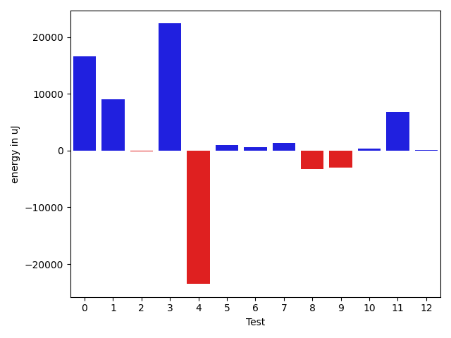

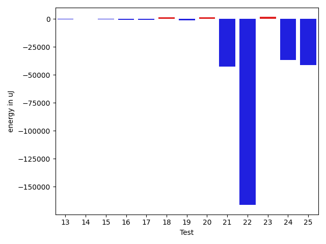

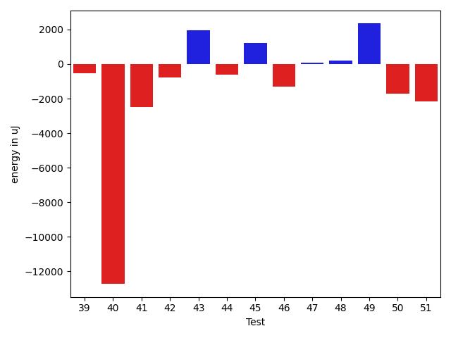

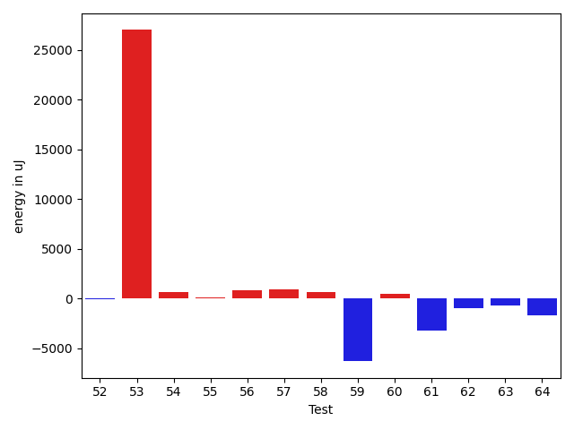

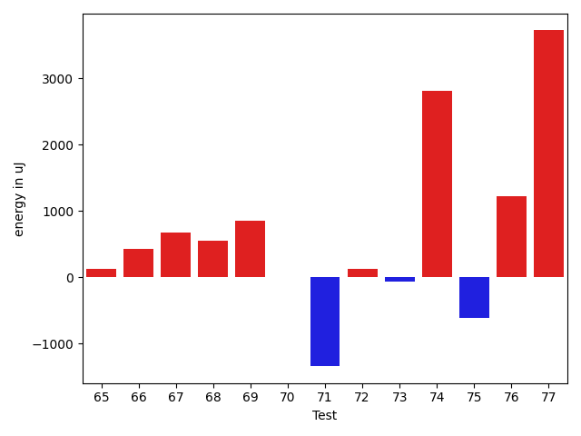

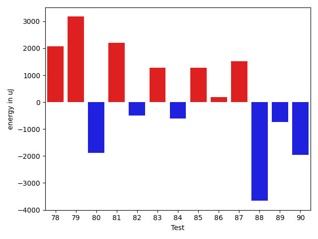

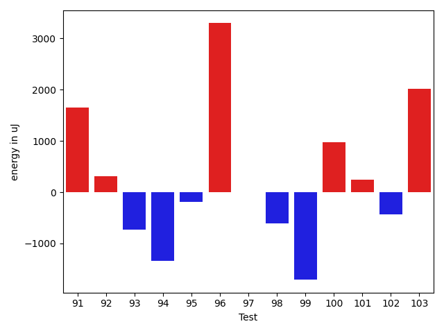

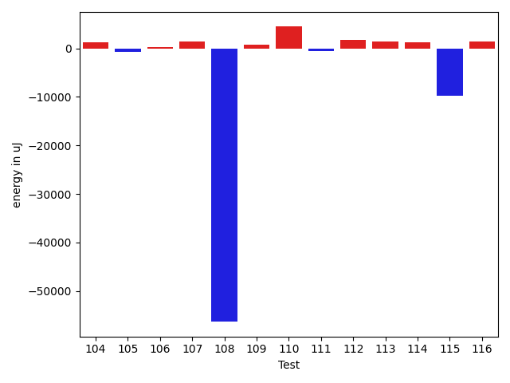

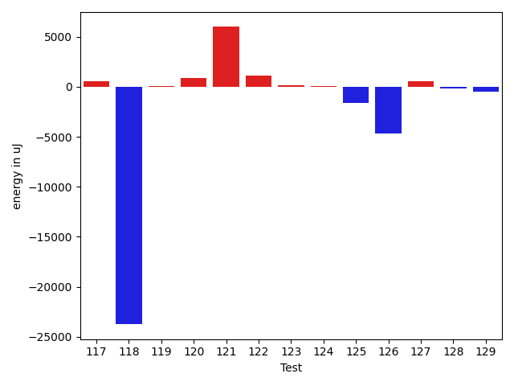

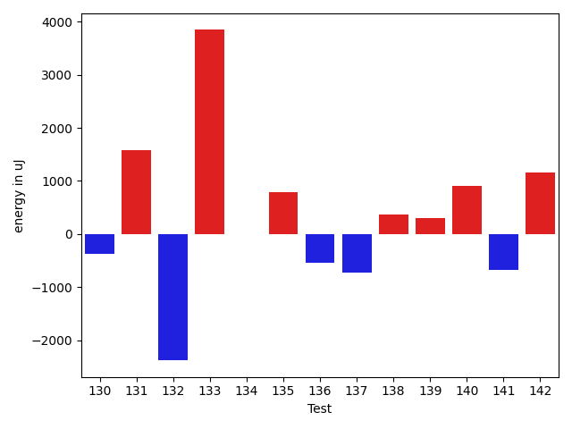

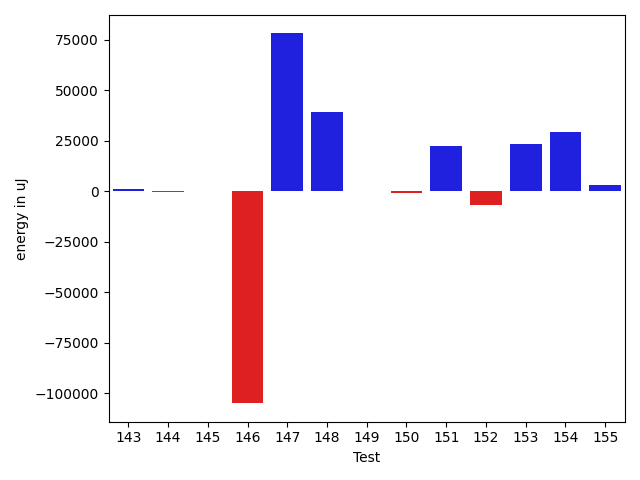

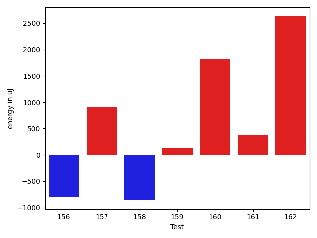

| ID | EnergyV1 | EnergyV2 | DeltaEnergy | σV1 | σV2 |
| --- | --- | --- | --- | --- | --- |
| 0 | 417723 | 446776 | 29053 | 109786.78911233706 | 144914.25616344006 |
| 1 | 77209 | 79711 | 2502 | 34611.11710317482 | 35735.553081727085 |
| 2 | 73364 | 79284 | 5920 | 42175.145016455666 | 33960.94803649025 |
| 3 | 365173 | 399840 | 34667 | 81568.24360222928 | 80535.72305904252 |
| 4 | 146789 | 106323 | -40466 | 71857.56112992184 | 61052.781402335226 |
| 5 | 40222 | 40588 | 366 | 6883.051816143108 | 7656.525030891921 |
| 6 | 40100 | 40344 | 244 | 5348.451848111774 | 7487.112053423386 |
| 7 | 39795 | 40893 | 1098 | 3939.854374024554 | 6683.8874665538415 |
| 8 | 41504 | 40161 | -1343 | 23539.546866561715 | 14021.781889951693 |
| 9 | 42053 | 42969 | 916 | 199828.47804851917 | 171342.62655487296 |
| 10 | 39734 | 40527 | 793 | 4755.296385985818 | 4009.8921340684337 |
| 11 | 83435 | 82641 | -794 | 17333.591422697707 | 23781.484302671277 |
| 12 | 40710 | 41565 | 855 | 12557.114636489074 | 12528.094788947708 |
| 13 | 41138 | 40832 | -306 | 3910.9048012630715 | 3950.2086283481276 |
| 14 | 40528 | 40772 | 244 | 3877.68659370062 | 4192.947794949114 |
| 15 | 41748 | 41260 | -488 | 3530.95648874807 | 4227.665990840542 |
| 16 | 40466 | 39734 | -732 | 9899.522530945185 | 18805.321156468828 |
| 17 | 39612 | 39002 | -610 | 3247.6664731516585 | 3937.4251710350004 |
| 18 | 39489 | 41015 | 1526 | 3292.5619896398766 | 4293.478845781229 |
| 19 | 40832 | 39490 | -1342 | 3653.148441743774 | 4044.3792768739063 |
| 20 | 39551 | 40893 | 1342 | 4997.186677116477 | 3890.59485024863 |
| 21 | 82153 | 39734 | -42419 | 22131.405140688097 | 6681.0804917089645 |
| 22 | 206787 | 40466 | -166321 | 40560.9804108807 | 8388.081376032984 |
| 23 | 39611 | 41382 | 1771 | 4509.187603422733 | 11911.708530133945 |
| 24 | 76416 | 39795 | -36621 | 21825.04732459342 | 4504.160281162295 |
| 25 | 79895 | 38818 | -41077 | 23479.676095839877 | 3922.6248941173276 |
| 26 | 105957 | 64880 | -41077 | 46145.53614164111 | 42506.98920522253 |
| 27 | 39734 | 40161 | 427 | 5229.200097256067 | 5004.76202479441 |
| 28 | 88073 | 40161 | -47912 | 20087.961655090392 | 4377.145346556955 |
| 29 | 106140 | 40527 | -65613 | 23737.09466487145 | 14793.259737272874 |
| 30 | 41931 | 43335 | 1404 | 18067.75920725275 | 17629.429185994486 |
| 31 | 40894 | 38696 | -2198 | 4278.0304981040435 | 4027.901308280224 |
| 32 | 38941 | 38758 | -183 | 4682.766808439453 | 5028.541136272395 |
| 33 | 39124 | 40100 | 976 | 4741.993070701272 | 3802.8430312070464 |
| 34 | 40161 | 40162 | 1 | 3917.246614351619 | 5495.228248127955 |
| 35 | 32348 | 31860 | -488 | 1536.320496077126 | 2750.371651654049 |
| 36 | 31860 | 31433 | -427 | 846.6832347460295 | 152.60624714167722 |
| 37 | 34241 | 32776 | -1465 | 1301.0926898188306 | 1465.0 |
| 38 | 67444 | 87647 | 20203 | 4868.818362806319 | 19222.902896284944 |
| 39 | 32715 | 35583 | 2868 | 1251.2554584185525 | 3021.0 |
| 40 | 34301 | 32776 | -1525 | 15599.26964814557 | 1408.0996724308973 |
| 41 | 33203 | 31921 | -1282 | 457.5 | 1678.5 |
| 42 | 43640 | 43579 | -61 | 28020.113131981467 | 28558.375601642016 |
| 43 | 41748 | 41687 | -61 | 5249.693462070352 | 9747.898407402188 |
| 44 | 41626 | 40832 | -794 | 4148.435886337832 | 4273.22241021302 |
| 45 | 39917 | 41199 | 1282 | 5001.540805880949 | 4476.156768592191 |
| 46 | 42053 | 41565 | -488 | 15195.066706478541 | 12276.864700817046 |
| 47 | 40710 | 41992 | 1282 | 8777.21426312367 | 8630.350258625405 |
| 48 | 41748 | 42358 | 610 | 11171.48330879134 | 11116.341872265974 |
| 49 | 41015 | 42053 | 1038 | 7192.156867576111 | 9669.535560488699 |
| 50 | 43579 | 40833 | -2746 | 4100.476801543938 | 3827.352058348789 |
| 51 | 44433 | 42603 | -1830 | 9412.399472862096 | 6599.256380238033 |
| 52 | 40405 | 40771 | 366 | 6955.834676010016 | 3319.3377033611137 |
| 53 | 43091 | 42786 | -305 | 340507.6754369475 | 439792.6223467276 |
| 54 | 40832 | 39917 | -915 | 4725.966368206778 | 4872.450289141292 |
| 55 | 38879 | 39551 | 672 | 4193.888466463528 | 4290.870123490883 |
| 56 | 41443 | 42785 | 1342 | 4813.71497186944 | 4498.890694538483 |
| 57 | 39795 | 40832 | 1037 | 4732.483579649044 | 3763.907265334896 |
| 58 | 40161 | 41870 | 1709 | 4328.235023616409 | 3663.157581805047 |
| 59 | 45471 | 44434 | -1037 | 19713.095675258784 | 12320.67114418745 |
| 60 | 40283 | 38452 | -1831 | 4062.232368748535 | 3810.698736077526 |
| 61 | 44494 | 43640 | -854 | 44987.25145622318 | 38314.25949568654 |
| 62 | 39246 | 40283 | 1037 | 4457.967408470161 | 4121.909869492809 |
| 63 | 39795 | 38879 | -916 | 4998.195031440256 | 3721.569736272458 |
| 64 | 43518 | 41199 | -2319 | 5256.073919132838 | 4204.132867732676 |
| 65 | 40223 | 40345 | 122 | 3892.47215876306 | 4530.55660337545 |
| 66 | 42114 | 42542 | 428 | 10607.118234773141 | 15026.726266577743 |
| 67 | 42541 | 43213 | 672 | 13774.420491441319 | 21738.66511228105 |
| 68 | 40161 | 40711 | 550 | 3948.990405197129 | 4326.641104191734 |
| 69 | 44921 | 45776 | 855 | 32014.987571886584 | 34219.12529556626 |
| 70 | 41199 | 41199 | 0 | 11496.380308408188 | 4110.223150747899 |
| 71 | 41015 | 39673 | -1342 | 9543.95260179482 | 7982.224916454028 |
| 72 | 43030 | 43151 | 121 | 23160.25919056401 | 22719.322770642106 |
| 73 | 42847 | 42785 | -62 | 54388.36751185352 | 48427.41485888887 |
| 74 | 39429 | 42237 | 2808 | 4560.720303153193 | 5109.662054627488 |
| 75 | 39978 | 39367 | -611 | 3811.6622565703883 | 5413.387956901065 |
| 76 | 40589 | 41809 | 1220 | 4167.340814519434 | 5654.160293088338 |
| 77 | 38635 | 42358 | 3723 | 4199.557477058951 | 4348.963089337749 |
| 78 | 39063 | 41138 | 2075 | 4215.991679524639 | 4129.20059729992 |
| 79 | 42114 | 45288 | 3174 | 561240.5153136054 | 562681.623626243 |
| 80 | 41565 | 39673 | -1892 | 5007.945885598165 | 3774.3121976799375 |
| 81 | 38391 | 40588 | 2197 | 4617.9913862212115 | 3981.5467438672626 |
| 82 | 41016 | 40528 | -488 | 4859.131022438903 | 4656.525080020688 |
| 83 | 39185 | 40466 | 1281 | 4248.360551321349 | 4436.429621086887 |
| 84 | 42175 | 41564 | -611 | 5166.057027366229 | 7166.988048238517 |
| 85 | 43029 | 44311 | 1282 | 338977.4561788504 | 486596.08678808855 |
| 86 | 86975 | 87158 | 183 | 309264.2515790464 | 173690.3099929898 |
| 87 | 39795 | 41321 | 1526 | 4229.246205137249 | 4448.354327538819 |
| 88 | 41503 | 37841 | -3662 | 4605.611585518981 | 4247.368169435007 |
| 89 | 41137 | 40406 | -731 | 5314.62046894121 | 4498.578158213499 |
| 90 | 43945 | 41992 | -1953 | 54761.109853077 | 37821.4046253829 |
| 91 | 38940 | 40588 | 1648 | 5390.4004207740445 | 3852.28212995114 |
| 92 | 39917 | 40222 | 305 | 4359.425365393469 | 4094.8981630446497 |
| 93 | 40527 | 39795 | -732 | 14745.117320946745 | 10615.817610471873 |
| 94 | 40527 | 39184 | -1343 | 4059.72140994921 | 4041.595676213556 |
| 95 | 39734 | 39551 | -183 | 4112.995074794942 | 4259.052489817473 |
| 96 | 84839 | 88135 | 3296 | 182728.25287139128 | 64521.122569216146 |
| 97 | 39795 | 39795 | 0 | 5775.804266658038 | 3589.697731772491 |
| 98 | 41260 | 40650 | -610 | 4362.338986351454 | 4405.605307667845 |
| 99 | 41381 | 39673 | -1708 | 3992.86903964354 | 5047.449415357396 |
| 100 | 44311 | 45288 | 977 | 286932.0027961307 | 627061.7686168369 |
| 101 | 40345 | 40588 | 243 | 6434.847447950883 | 4813.906825084953 |
| 102 | 39551 | 39123 | -428 | 4036.794804529647 | 4335.137338313611 |
| 103 | 39063 | 41076 | 2013 | 3990.213283979856 | 6805.536975451291 |
| 104 | 119323 | 123351 | 4028 | 34611.53582348818 | 35929.40083368671 |
| 105 | 41992 | 43335 | 1343 | 11267.221439716182 | 10073.573258097858 |
| 106 | 42908 | 42358 | -550 | 4218.49793485654 | 4597.386196508159 |
| 107 | 39185 | 40833 | 1648 | 5182.161352433529 | 5868.690447663726 |
| 108 | 185485 | 190857 | 5372 | 367765.1163175306 | 169447.08919810347 |
| 109 | 39368 | 39368 | 0 | 4163.279788449059 | 4856.750320608904 |
| 110 | 38391 | 41321 | 2930 | 4167.276089247002 | 10178.482966926358 |
| 111 | 39917 | 41748 | 1831 | 13249.539838288956 | 10791.396480850864 |
| 112 | 39184 | 42725 | 3541 | 5532.5085852771235 | 4206.428760349456 |
| 113 | 39490 | 41260 | 1770 | 3824.95324597276 | 4669.379220550213 |
| 114 | 38330 | 40405 | 2075 | 4730.391640353522 | 4954.559685796815 |
| 115 | 38757 | 41259 | 2502 | 39499.26407582629 | 14977.466053785272 |
| 116 | 39856 | 41137 | 1281 | 5702.11345009507 | 6965.888258382522 |
| 117 | 89233 | 89782 | 549 | 424898.836527317 | 229395.4398314009 |
| 118 | 68725 | 44982 | -23743 | 29614.502764292014 | 28387.85574760251 |
| 119 | 42298 | 42358 | 60 | 12971.6056290429 | 9808.472809207147 |
| 120 | 42054 | 42969 | 915 | 13809.566542091681 | 9535.584271117445 |
| 121 | 89600 | 95581 | 5981 | 587513.7519948656 | 446889.0515275385 |
| 122 | 42114 | 43213 | 1099 | 14659.3194001202 | 14383.209240905362 |
| 123 | 43823 | 44006 | 183 | 17944.847903262937 | 15769.502688417284 |
| 124 | 41076 | 41138 | 62 | 8565.640509936136 | 3943.233327167268 |
| 125 | 40771 | 39184 | -1587 | 4881.44010676177 | 4319.455996306943 |
| 126 | 90576 | 85938 | -4638 | 394050.9096886399 | 60425.76293717389 |
| 127 | 42542 | 43090 | 548 | 13124.853925055297 | 16216.028317894372 |
| 128 | 43456 | 43274 | -182 | 35504.38193354209 | 40246.029514898095 |
| 129 | 40893 | 40406 | -487 | 11921.591226982826 | 8732.65524552552 |
| 130 | 40955 | 40589 | -366 | 8289.997608943479 | 4441.57984879263 |
| 131 | 41381 | 42969 | 1588 | 510239.924642782 | 615262.5812985131 |
| 132 | 43945 | 41565 | -2380 | 412088.72691181157 | 268677.79216343566 |
| 133 | 77331 | 81176 | 3845 | 23096.124559947348 | 29313.183572954265 |
| 134 | 40649 | 40649 | 0 | 4931.449786744632 | 4451.458548125397 |
| 135 | 40588 | 41381 | 793 | 4616.802340761248 | 3942.896648137148 |
| 136 | 42480 | 41931 | -549 | 46353.77128971474 | 43139.24507496524 |
| 137 | 42298 | 41564 | -734 | 21374.751986197483 | 15252.053614917606 |
| 138 | 42358 | 42725 | 367 | 512457.9332451096 | 460552.1507735556 |
| 139 | 39795 | 40100 | 305 | 4498.688374505295 | 4196.446111526055 |
| 140 | 41687 | 42602 | 915 | 4674.446392877964 | 4156.64984249166 |
| 141 | 41931 | 41260 | -671 | 10986.567477120416 | 11444.38301501253 |
| 142 | 40405 | 41565 | 1160 | 5960.564400665616 | 4880.496251869493 |
| 143 | 41809 | 42785 | 976 | 4009.325901394616 | 4151.427678601804 |
| 144 | 39856 | 39307 | -549 | 4612.270316971168 | 4351.234825711852 |
| 145 | 39185 | 40405 | 1220 | 5153.352791736051 | 2297.32573300908 |
| 146 | 42907 | 43396 | 489 | 709922.18143254 | 612827.8707787849 |
| 147 | 40406 | 39062 | -1344 | 3978.5147825539116 | 355521.1570652461 |
| 148 | 134399 | 131164 | -3235 | 296748.4469352474 | 411800.9894338019 |
| 149 | 40649 | 41381 | 732 | 4066.5069293290267 | 4422.986593893691 |
| 150 | 41259 | 42053 | 794 | 7271.0208960918935 | 4488.36992988546 |
| 151 | 45166 | 44433 | -733 | 542565.7641786678 | 589791.1502060158 |
| 152 | 42175 | 42542 | 367 | 621867.8443870834 | 659923.9328538808 |
| 153 | 44311 | 64636 | 20325 | 37020.86210479467 | 55651.53222540919 |
| 154 | 42480 | 42053 | -427 | 469539.04947273975 | 498353.6810605294 |
| 155 | 42054 | 40222 | -1832 | 5288.9246107394965 | 23786.961388550986 |
| 156 | 41565 | 40771 | -794 | 4783.303794188699 | 5409.269002837789 |
| 157 | 40405 | 41321 | 916 | 4396.197215270894 | 11921.375091720754 |
| 158 | 44495 | 43640 | -855 | 19423.15146767043 | 21907.674401312644 |
| 159 | 43518 | 43640 | 122 | 12161.23458131574 | 4633.308002453483 |
| 160 | 41077 | 42908 | 1831 | 9330.13331408167 | 23753.057556474803 |
| 161 | 42663 | 43030 | 367 | 6905.639210798826 | 6416.812967322359 |
| 162 | 40588 | 43213 | 2625 | 12228.408467757405 | 10742.445279148753 |

## Delta Duration per test method

| ID | DurationV1 | DurationsV2 | DeltaDuration |
| --- | --- | --- | --- |
| 0 | 11146549.737373738 | 11583873.111111112 | 437323.3737373743 |
| 1 | 2296419.0404040404 | 2529729.222222222 | 233310.18181818165 |
| 2 | 2184858.0 | 2108270.484848485 | -76587.51515151514 |
| 3 | 9864305.222222222 | 10530355.515151516 | 666050.2929292936 |
| 4 | 4110573.282828283 | 3512440.888888889 | -598132.393939394 |
| 5 | 1073892.984375 | 1052330.208955224 | -21562.775419776095 |
| 6 | 864383.5454545454 | 844695.8269230769 | -19687.718531468534 |
| 7 | 884632.3571428572 | 905010.6833333333 | 20378.32619047619 |
| 8 | 1143090.5666666667 | 1163005.5 | 19914.93333333335 |
| 9 | 1836217.4583333333 | 1798333.5 | -37883.958333333256 |
| 10 | 894032.7058823529 | 883718.2 | -10314.50588235294 |
| 11 | 2405419.1515151514 | 2551445.1717171716 | 146026.02020202018 |
| 12 | 1164515.5194805195 | 1241725.2105263157 | 77209.69104579627 |
| 13 | 813684.1320754717 | 959857.574074074 | 146173.44199860236 |
| 14 | 799304.5689655172 | 860835.8076923077 | 61531.23872679053 |
| 15 | 749683.4 | 804727.8333333334 | 55044.43333333335 |
| 16 | 860206.1836734693 | 1015393.3174603175 | 155187.13378684816 |
| 17 | 654270.3611111111 | 664288.05 | 10017.688888888923 |
| 18 | 830117.2307692308 | 836244.0 | 6126.769230769249 |
| 19 | 517447.4761904762 | 530467.6923076923 | 13020.216117216041 |
| 20 | 585045.4545454546 | 620789.9210526316 | 35744.466507176985 |
| 21 | 2441803.484848485 | 837845.3703703703 | -1603958.1144781145 |
| 22 | 5571501.101010101 | 1155463.410958904 | -4416037.690051197 |
| 23 | 962330.8305084746 | 1023405.8474576271 | 61075.01694915246 |
| 24 | 2164036.9494949495 | 804254.3 | -1359782.6494949495 |
| 25 | 2252687.242424242 | 753269.3928571428 | -1499417.8495670995 |
| 26 | 2310612.9 | 2260966.057471264 | -49646.84252873575 |
| 27 | 609163.7428571428 | 627600.6046511628 | 18436.861794019933 |
| 28 | 2644229.585858586 | 808078.1428571428 | -1836151.443001443 |
| 29 | 2933830.898989899 | 1350338.293478261 | -1583492.605511638 |
| 30 | 1285504.7391304348 | 1248145.1509433961 | -37359.588187038666 |
| 31 | 449398.1666666667 | 540150.074074074 | 90751.90740740736 |
| 32 | 571362.3 | 601513.5714285715 | 30151.271428571432 |
| 33 | 565081.5185185185 | 557891.0 | -7190.51851851854 |
| 34 | 587979.6060606061 | 603251.3125 | 15271.706439393922 |
| 35 | 696544.6666666666 | 795355.0 | 98810.33333333337 |
| 36 | 1018762.0 | 1164304.0 | 145542.0 |
| 37 | 899059.75 | 1174755.0 | 275695.25 |
| 38 | 2730966.25 | 2941620.6 | 210654.3500000001 |
| 39 | 644284.6666666666 | 834405.5 | 190120.83333333337 |
| 40 | 1402430.3333333333 | 1285802.25 | -116628.08333333326 |
| 41 | 599395.5 | 884900.5 | 285505.0 |
| 42 | 1646520.7127659575 | 1608119.3953488371 | -38401.31741712033 |
| 43 | 930353.2857142857 | 994817.1228070175 | 64463.83709273185 |
| 44 | 798646.5666666667 | 799820.2962962963 | 1173.7296296296408 |
| 45 | 729452.5869565217 | 716303.4390243902 | -13149.147932131542 |
| 46 | 1143138.1923076923 | 1086263.1014492754 | -56875.090858416865 |
| 47 | 1129029.3513513512 | 1103193.463414634 | -25835.887936717132 |
| 48 | 1192276.7792207792 | 1188916.8125 | -3359.9667207791936 |
| 49 | 1100653.2933333332 | 1142191.2266666666 | 41537.93333333335 |
| 50 | 458875.36842105264 | 490471.17647058825 | 31595.80804953561 |
| 51 | 886967.7142857143 | 617303.6451612903 | -269664.069124424 |
| 52 | 781863.1224489796 | 716021.5897435897 | -65841.5327053899 |
| 53 | 2956581.855555556 | 3713071.1685393257 | 756489.3129837699 |
| 54 | 573792.8260869565 | 588130.1071428572 | 14337.281055900618 |
| 55 | 505578.6666666667 | 523150.7916666667 | 17572.125 |
| 56 | 605758.32 | 550656.6818181818 | -55101.63818181818 |
| 57 | 638224.9268292683 | 603378.0571428571 | -34846.86968641123 |
| 58 | 488747.39130434784 | 466327.94444444444 | -22419.4468599034 |
| 59 | 1368161.717948718 | 1122023.0526315789 | -246138.66531713912 |
| 60 | 542852.25 | 482111.1904761905 | -60741.05952380953 |
| 61 | 1791476.5818181818 | 1677374.5 | -114102.08181818179 |
| 62 | 537169.1379310344 | 526099.5833333334 | -11069.554597701062 |
| 63 | 544655.3636363636 | 465585.94736842107 | -79069.41626794258 |
| 64 | 508753.0909090909 | 554620.7647058824 | 45867.673796791525 |
| 65 | 963278.4 | 879933.2333333333 | -83345.16666666674 |
| 66 | 1218270.5 | 1224083.9882352941 | 5813.48823529412 |
| 67 | 1219343.0175438595 | 1195233.4615384615 | -24109.556005398044 |
| 68 | 891150.5254237289 | 806956.4285714285 | -84194.09685230034 |
| 69 | 1658177.8148148148 | 1679891.680851064 | 21713.866036249092 |
| 70 | 785705.9333333333 | 829385.3333333334 | 43679.40000000002 |
| 71 | 993949.4107142857 | 987307.509090909 | -6641.901623376645 |
| 72 | 1688815.4646464647 | 1691809.797979798 | 2994.3333333332557 |
| 73 | 1544203.3777777778 | 1430973.1666666667 | -113230.2111111111 |
| 74 | 670342.96875 | 802421.40625 | 132078.4375 |
| 75 | 756510.1071428572 | 855508.3414634146 | 98998.23432055744 |
| 76 | 830381.7045454546 | 857638.1355932204 | 27256.43104776577 |
| 77 | 561644.1612903225 | 577309.8529411765 | 15665.691650853958 |
| 78 | 604404.75 | 636950.6046511628 | 32545.85465116275 |
| 79 | 9087546.925925925 | 9966513.291666666 | 878966.3657407407 |
| 80 | 688409.7352941176 | 741186.3333333334 | 52776.59803921578 |
| 81 | 547684.4210526316 | 540233.04 | -7451.381052631536 |
| 82 | 770110.0 | 748496.7857142857 | -21613.21428571432 |
| 83 | 737975.625 | 746656.6857142857 | 8681.060714285704 |
| 84 | 653803.75 | 738627.1875 | 84823.4375 |
| 85 | 3075792.8988764044 | 4742370.068965517 | 1666577.1700891126 |
| 86 | 4140833.5353535353 | 3298423.3232323234 | -842410.2121212119 |
| 87 | 623112.2058823529 | 604737.0666666667 | -18375.139215686242 |
| 88 | 611340.9333333333 | 637442.4782608695 | 26101.54492753616 |
| 89 | 577163.0 | 595539.8 | 18376.800000000047 |
| 90 | 1887528.5081967213 | 1497005.7313432836 | -390522.77685343777 |
| 91 | 619843.4772727273 | 598408.1290322581 | -21435.348240469233 |
| 92 | 634465.6470588235 | 602532.074074074 | -31933.57298474945 |
| 93 | 1208830.9325842697 | 1193463.2441860465 | -15367.688398223137 |
| 94 | 578539.56 | 635830.3448275862 | 57290.78482758615 |
| 95 | 635271.9361702128 | 660393.4857142858 | 25121.549544072943 |
| 96 | 3072792.2375 | 2928044.102272727 | -144748.13522727275 |
| 97 | 946812.7966101695 | 946627.1587301587 | -185.63788001076318 |
| 98 | 611720.8709677419 | 587153.3870967742 | -24567.483870967757 |
| 99 | 842774.1754385965 | 775138.1153846154 | -67636.06005398114 |
| 100 | 2851273.402777778 | 6895597.9701492535 | 4044324.5673714755 |
| 101 | 901421.08 | 779282.2321428572 | -122138.8478571428 |
| 102 | 765234.1428571428 | 706883.5142857142 | -58350.62857142859 |
| 103 | 1000326.2708333334 | 932414.0357142857 | -67912.23511904769 |
| 104 | 3053622.767676768 | 3174582.282828283 | 120959.51515151514 |
| 105 | 1078372.12 | 1098987.5483870967 | 20615.428387096617 |
| 106 | 454096.0833333333 | 502305.4375 | 48209.354166666686 |
| 107 | 936452.2205882353 | 847640.3387096775 | -88811.88187855785 |
| 108 | 8222535.151515151 | 6037738.04040404 | -2184797.111111111 |
| 109 | 715556.8275862068 | 624106.8857142857 | -91449.94187192118 |
| 110 | 1020418.4179104478 | 958960.9245283019 | -61457.49338214588 |
| 111 | 1218144.1081081082 | 1100898.5735294118 | -117245.53457869636 |
| 112 | 694003.1891891892 | 643568.1944444445 | -50434.994744744734 |
| 113 | 807339.2285714286 | 713006.5714285715 | -94332.65714285709 |
| 114 | 861284.1764705882 | 784420.6470588235 | -76863.5294117647 |
| 115 | 1266452.3962264152 | 840983.9047619047 | -425468.49146451044 |
| 116 | 1056849.7142857143 | 1049728.296875 | -7121.417410714319 |
| 117 | 5091540.939393939 | 3458333.474747475 | -1633207.4646464647 |
| 118 | 1940978.9285714286 | 1783211.336734694 | -157767.59183673467 |
| 119 | 1252196.835443038 | 1226689.4938271604 | -25507.34161587758 |
| 120 | 1203916.975609756 | 1181542.487804878 | -22374.487804878037 |
| 121 | 7248109.5050505055 | 5670821.717171717 | -1577287.787878788 |
| 122 | 1351384.0 | 1320309.875 | -31074.125 |
| 123 | 1283265.109375 | 1225721.7428571428 | -57543.36651785718 |
| 124 | 955062.40625 | 927173.3125 | -27889.09375 |
| 125 | 826696.6538461539 | 741248.7192982456 | -85447.93454790825 |
| 126 | 5365611.97979798 | 3249506.404040404 | -2116105.5757575757 |
| 127 | 1362312.7362637362 | 1380481.9784946237 | 18169.242230887525 |
| 128 | 1625435.182795699 | 1687615.0352941176 | 62179.85249841865 |
| 129 | 1189825.2298850575 | 1157875.4827586208 | -31949.747126436792 |
| 130 | 1087282.1527777778 | 1032282.8192771084 | -54999.33350066934 |
| 131 | 4408865.627118644 | 5619822.35 | 1210956.7228813553 |
| 132 | 3801165.75 | 2014568.6712328766 | -1786597.0787671234 |
| 133 | 1997673.9191919193 | 2107260.3535353537 | 109586.4343434344 |
| 134 | 624649.8285714285 | 626380.0789473684 | 1730.2503759398824 |
| 135 | 749892.7804878049 | 740047.9523809524 | -9844.828106852481 |
| 136 | 1808423.7391304348 | 1774347.9583333333 | -34075.78079710156 |
| 137 | 1200270.7647058824 | 1226833.5616438356 | 26562.796937953215 |
| 138 | 5271177.484375 | 4055548.787878788 | -1215628.696496212 |
| 139 | 450879.0909090909 | 427377.0909090909 | -23502.0 |
| 140 | 698600.1515151515 | 734812.21875 | 36212.06723484851 |
| 141 | 914354.2950819673 | 929772.1481481482 | 15417.85306618095 |
| 142 | 952861.6730769231 | 899169.6842105263 | -53691.98886639683 |
| 143 | 434592.6875 | 497414.7727272727 | 62822.085227272706 |
| 144 | 602695.0689655172 | 552661.3888888889 | -50033.68007662834 |
| 145 | 475570.625 | 474562.84210526315 | -1007.7828947368544 |
| 146 | 10545217.076923076 | 7793824.826086956 | -2751392.25083612 |
| 147 | 421827.375 | 2925259.714285714 | 2503432.339285714 |
| 148 | 4747125.444444444 | 6038268.191919192 | 1291142.7474747477 |
| 149 | 893686.5272727272 | 842410.0192307692 | -51276.508041957975 |
| 150 | 915289.4181818182 | 976232.4333333333 | 60943.01515151514 |
| 151 | 5439310.297297297 | 6195837.090909091 | 756526.7936117938 |
| 152 | 8462389.785714285 | 7397634.916666667 | -1064754.8690476185 |
| 153 | 1532740.8 | 2193937.274509804 | 661196.4745098038 |
| 154 | 5503056.666666667 | 6592551.897959184 | 1089495.231292517 |
| 155 | 667053.0 | 762185.1315789474 | 95132.13157894742 |
| 156 | 653584.8333333334 | 734862.9166666666 | 81278.08333333326 |
| 157 | 772403.7333333333 | 880134.575 | 107730.84166666667 |
| 158 | 1492677.7848101265 | 1462126.7835051545 | -30551.001304971986 |
| 159 | 1013387.1967213114 | 873131.3035714285 | -140255.8931498829 |
| 160 | 1199272.731707317 | 1575259.835443038 | 375987.103735721 |
| 161 | 755518.25 | 617355.1428571428 | -138163.10714285716 |
| 162 | 916066.8888888889 | 1057691.5862068965 | 141624.6973180076 |

## Misc.

| ID | Test Class | Test Method |
| --- | --- | --- |
| 0 | com.google.gson.DefaultDateTypeAdapterTest | testParsingDatesFormattedWithUsLocale |
| 1 | com.google.gson.DefaultDateTypeAdapterTest | testFormattingInEnUs |
| 2 | com.google.gson.DefaultDateTypeAdapterTest | testFormatUsesDefaultTimezone |
| 3 | com.google.gson.DefaultDateTypeAdapterTest | testParsingDatesFormattedWithSystemLocale |
| 4 | com.google.gson.DefaultDateTypeAdapterTest | testFormattingInFr |
| 5 | com.google.gson.functional.CustomTypeAdaptersTest | testCustomAdapterInvokedForCollectionElementDeserialization |
| 6 | com.google.gson.functional.CustomTypeAdaptersTest | testCustomAdapterInvokedForMapElementDeserialization |
| 7 | com.google.gson.functional.CustomTypeAdaptersTest | testCustomAdapterInvokedForMapElementSerializationWithType |
| 8 | com.google.gson.functional.CustomTypeAdaptersTest | testCustomNestedSerializers |
| 9 | com.google.gson.functional.CustomTypeAdaptersTest | testCustomSerializers |
| 10 | com.google.gson.functional.CustomTypeAdaptersTest | testCustomNestedDeserializers |
| 11 | com.google.gson.functional.CustomTypeAdaptersTest | testCustomTypeAdapterDoesNotAppliesToSubClasses |
| 12 | com.google.gson.functional.CustomTypeAdaptersTest | testCustomAdapterInvokedForCollectionElementSerializationWithType |
| 13 | com.google.gson.functional.CustomTypeAdaptersTest | testCustomDeserializers |
| 14 | com.google.gson.functional.CustomTypeAdaptersTest | testCustomByteArrayDeserializerAndInstanceCreator |
| 15 | com.google.gson.functional.CustomTypeAdaptersTest | testCustomByteArraySerializer |
| 16 | com.google.gson.functional.CustomTypeAdaptersTest | testEnsureCustomSerializerNotInvokedForNullValues |
| 17 | com.google.gson.functional.CustomTypeAdaptersTest | testEnsureCustomDeserializerNotInvokedForNullValues |
| 18 | com.google.gson.functional.CustomTypeAdaptersTest | testCustomTypeAdapterAppliesToSubClassesSerializedAsBaseClass |
| 19 | com.google.gson.functional.CustomTypeAdaptersTest | testCustomAdapterInvokedForMapElementSerialization |
| 20 | com.google.gson.functional.CustomTypeAdaptersTest | testCustomAdapterInvokedForCollectionElementSerialization |
| 21 | com.google.gson.functional.DefaultTypeAdaptersTest | testDateSerializationWithPatternNotOverridenByTypeAdapter |
| 22 | com.google.gson.functional.DefaultTypeAdaptersTest | testDateSerializationWithPattern |
| 23 | com.google.gson.functional.DefaultTypeAdaptersTest | testBitSetDeserialization |
| 24 | com.google.gson.functional.DefaultTypeAdaptersTest | testSqlDateSerialization |
| 25 | com.google.gson.functional.DefaultTypeAdaptersTest | testTimestampSerialization |
| 26 | com.google.gson.functional.DefaultTypeAdaptersTest | testDefaultDateDeserializationUsingBuilder |
| 27 | com.google.gson.functional.DefaultTypeAdaptersTest | testDefaultCalendarSerialization |
| 28 | com.google.gson.functional.DefaultTypeAdaptersTest | testDateDeserializationWithPattern |
| 29 | com.google.gson.functional.DefaultTypeAdaptersTest | testDateSerializationInCollection |
| 30 | com.google.gson.functional.DefaultTypeAdaptersTest | testSetSerialization |
| 31 | com.google.gson.functional.DefaultTypeAdaptersTest | testDefaultGregorianCalendarDeserialization |
| 32 | com.google.gson.functional.DefaultTypeAdaptersTest | testDefaultCalendarDeserialization |
| 33 | com.google.gson.functional.DefaultTypeAdaptersTest | testDefaultGregorianCalendarSerialization |
| 34 | com.google.gson.functional.DefaultTypeAdaptersTest | testBitSetSerialization |
| 35 | com.google.gson.functional.DefaultTypeAdaptersTest | testDefaultJavaSqlTimeDeserialization |
| 36 | com.google.gson.functional.DefaultTypeAdaptersTest | testDefaultDateSerialization |
| 37 | com.google.gson.functional.DefaultTypeAdaptersTest | testDefaultJavaSqlDateDeserialization |
| 38 | com.google.gson.functional.DefaultTypeAdaptersTest | testDefaultDateDeserialization |
| 39 | com.google.gson.functional.DefaultTypeAdaptersTest | testDefaultDateSerializationUsingBuilder |
| 40 | com.google.gson.functional.DefaultTypeAdaptersTest | testDefaultJavaSqlTimestampDeserialization |
| 41 | com.google.gson.functional.DefaultTypeAdaptersTest | testDefaultJavaSqlTimestampSerialization |
| 42 | com.google.gson.functional.MapTest | testSerializeMaps |
| 43 | com.google.gson.functional.MapTest | testCustomSerializerForSpecificMapType |
| 44 | com.google.gson.functional.MapTest | testMapSerializationWithNullValueButSerializeNulls |
| 45 | com.google.gson.functional.MapTest | testMapSerializationWithNullValuesSerialized |
| 46 | com.google.gson.functional.MapTest | testMapSubclassDeserialization |
| 47 | com.google.gson.functional.MapTest | testGeneralMapField |
| 48 | com.google.gson.functional.ReadersWritersTest | testReadWriteTwoObjects |
| 49 | com.google.gson.functional.ReadersWritersTest | testReadWriteTwoStrings |
| 50 | com.google.gson.functional.ReadersWritersTest | testTopLevelNullObjectDeserializationWithReaderAndSerializeNulls |
| 51 | com.google.gson.functional.ReadersWritersTest | testTopLevelNullObjectSerializationWithWriterAndSerializeNulls |
| 52 | com.google.gson.functional.FieldExclusionTest | testDefaultNestedStaticClassIncluded |
| 53 | com.google.gson.functional.FieldExclusionTest | testDefaultInnerClassExclusion |
| 54 | com.google.gson.functional.FieldExclusionTest | testInnerClassExclusion |
| 55 | com.google.gson.functional.PrimitiveTest | testDoubleInfinitySerialization |
| 56 | com.google.gson.functional.PrimitiveTest | testDoubleNaNSerialization |
| 57 | com.google.gson.functional.PrimitiveTest | testLongAsStringSerialization |
| 58 | com.google.gson.functional.PrimitiveTest | testNegativeInfinityFloatSerialization |
| 59 | com.google.gson.functional.PrimitiveTest | testMoreSpecificSerialization |
| 60 | com.google.gson.functional.PrimitiveTest | testLongAsStringDeserialization |
| 61 | com.google.gson.functional.PrimitiveTest | testHtmlCharacterSerialization |
| 62 | com.google.gson.functional.PrimitiveTest | testNegativeInfinitySerialization |
| 63 | com.google.gson.functional.PrimitiveTest | testFloatInfinitySerialization |
| 64 | com.google.gson.functional.PrimitiveTest | testFloatNaNSerialization |
| 65 | com.google.gson.functional.CustomDeserializerTest | testCustomDeserializerReturnsNullForArrayElementsForArrayField |
| 66 | com.google.gson.functional.CustomDeserializerTest | testJsonTypeFieldBasedDeserialization |
| 67 | com.google.gson.functional.CustomDeserializerTest | testCustomDeserializerReturnsNull |
| 68 | com.google.gson.functional.CustomDeserializerTest | testCustomDeserializerReturnsNullForArrayElements |
| 69 | com.google.gson.functional.CustomDeserializerTest | testCustomDeserializerReturnsNullForTopLevelObject |
| 70 | com.google.gson.functional.NullObjectAndFieldTest | testExplicitDeserializationOfNulls |
| 71 | com.google.gson.functional.NullObjectAndFieldTest | testPrintPrintingObjectWithNulls |
| 72 | com.google.gson.functional.NullObjectAndFieldTest | testExplicitSerializationOfNullArrayMembers |
| 73 | com.google.gson.functional.NullObjectAndFieldTest | testExplicitSerializationOfNulls |
| 74 | com.google.gson.functional.NullObjectAndFieldTest | testExplicitSerializationOfNullStringMembers |
| 75 | com.google.gson.functional.NullObjectAndFieldTest | testCustomTypeAdapterPassesNullDesrialization |
| 76 | com.google.gson.functional.NullObjectAndFieldTest | testNullWrappedPrimitiveMemberSerialization |
| 77 | com.google.gson.functional.NullObjectAndFieldTest | testCustomTypeAdapterPassesNullSerialization |
| 78 | com.google.gson.functional.NullObjectAndFieldTest | testExplicitNullSetsFieldToNullDuringDeserialization |
| 79 | com.google.gson.functional.NullObjectAndFieldTest | testTopLevelNullObjectSerialization |
| 80 | com.google.gson.functional.NullObjectAndFieldTest | testCustomSerializationOfNulls |
| 81 | com.google.gson.functional.NullObjectAndFieldTest | testNullWrappedPrimitiveMemberDeserialization |
| 82 | com.google.gson.functional.NullObjectAndFieldTest | testExplicitSerializationOfNullCollectionMembers |
| 83 | com.google.gson.functional.NullObjectAndFieldTest | testPrintPrintingArraysWithNulls |
| 84 | com.google.gson.functional.NullObjectAndFieldTest | testTopLevelNullObjectDeserialization |
| 85 | com.google.gson.JsonParserTest | testReadWriteTwoObjects |
| 86 | com.google.gson.functional.NamingPolicyTest | testGsonWithNonDefaultFieldNamingPolicySerialization |
| 87 | com.google.gson.functional.NamingPolicyTest | testGsonWithLowerCaseDashPolicyDeserialiation |
| 88 | com.google.gson.functional.NamingPolicyTest | testGsonWithSerializedNameFieldNamingPolicyDeserialization |
| 89 | com.google.gson.functional.NamingPolicyTest | testGsonWithUpperCamelCaseSpacesPolicyDeserialiation |
| 90 | com.google.gson.functional.NamingPolicyTest | testGsonWithSerializedNameFieldNamingPolicySerialization |
| 91 | com.google.gson.functional.NamingPolicyTest | testGsonWithNonDefaultFieldNamingPolicyDeserialiation |
| 92 | com.google.gson.functional.NamingPolicyTest | testGsonWithLowerCaseUnderscorePolicySerialization |
| 93 | com.google.gson.functional.NamingPolicyTest | testDeprecatedNamingStrategy |
| 94 | com.google.gson.functional.NamingPolicyTest | testGsonWithUpperCamelCaseSpacesPolicySerialiation |
| 95 | com.google.gson.functional.NamingPolicyTest | testGsonWithLowerCaseDashPolicySerialization |
| 96 | com.google.gson.functional.NamingPolicyTest | testGsonDuplicateNameUsingSerializedNameFieldNamingPolicySerialization |
| 97 | com.google.gson.functional.NamingPolicyTest | testComplexFieldNameStrategy |
| 98 | com.google.gson.functional.NamingPolicyTest | testGsonWithLowerCaseUnderscorePolicyDeserialiation |
| 99 | com.google.gson.functional.CustomSerializerTest | testSerializerReturnsNull |
| 100 | com.google.gson.functional.CustomSerializerTest | testSubClassSerializerInvokedForBaseClassFieldsHoldingSubClassInstances |
| 101 | com.google.gson.functional.CustomSerializerTest | testBaseClassSerializerInvokedForBaseClassFieldsHoldingSubClassInstances |
| 102 | com.google.gson.functional.CustomSerializerTest | testBaseClassSerializerInvokedForBaseClassFields |
| 103 | com.google.gson.functional.CustomSerializerTest | testSubClassSerializerInvokedForBaseClassFieldsHoldingArrayOfSubClassInstances |
| 104 | com.google.gson.functional.ObjectTest | testSingletonLists |
| 105 | com.google.gson.functional.ObjectTest | testInnerClassDeserialization |
| 106 | com.google.gson.functional.ObjectTest | testJsonObjectSerialization |
| 107 | com.google.gson.functional.VersioningTest | testVersionedGsonMixingSinceAndUntilDeserialization |
| 108 | com.google.gson.functional.VersioningTest | testVersionedUntilSerialization |
| 109 | com.google.gson.functional.VersioningTest | testIgnoreLaterVersionClassSerialization |
| 110 | com.google.gson.functional.VersioningTest | testVersionedClassesSerialization |
| 111 | com.google.gson.functional.VersioningTest | testVersionedGsonMixingSinceAndUntilSerialization |
| 112 | com.google.gson.functional.VersioningTest | testVersionedUntilDeserialization |
| 113 | com.google.gson.functional.VersioningTest | testVersionedGsonWithUnversionedClassesDeserialization |
| 114 | com.google.gson.functional.VersioningTest | testVersionedClassesDeserialization |
| 115 | com.google.gson.functional.VersioningTest | testVersionedGsonWithUnversionedClassesSerialization |
| 116 | com.google.gson.functional.TypeVariableTest | testBasicTypeVariables |
| 117 | com.google.gson.functional.TypeVariableTest | testAdvancedTypeVariables |
| 118 | com.google.gson.functional.TypeVariableTest | testTypeVariablesViaTypeParameter |
| 119 | com.google.gson.functional.MapAsArrayTypeAdapterTest | testMultipleEnableComplexKeyRegistrationHasNoEffect |
| 120 | com.google.gson.functional.MapAsArrayTypeAdapterTest | testMapWithTypeVariableDeserialization |
| 121 | com.google.gson.functional.MapAsArrayTypeAdapterTest | testSerializeComplexMapWithTypeAdapter |
| 122 | com.google.gson.functional.MapAsArrayTypeAdapterTest | testMapWithTypeVariableSerialization |
| 123 | com.google.gson.functional.MapAsArrayTypeAdapterTest | testTwoTypesCollapseToOneDeserialize |
| 124 | com.google.gson.functional.ExclusionStrategyFunctionalTest | testExclusionStrategyWithMode |
| 125 | com.google.gson.functional.ExclusionStrategyFunctionalTest | testExclusionStrategyDeserialization |
| 126 | com.google.gson.functional.ExclusionStrategyFunctionalTest | testExclusionStrategySerialization |
| 127 | com.google.gson.functional.ParameterizedTypesTest | testParameterizedTypeWithCustomSerializer |
| 128 | com.google.gson.functional.ParameterizedTypesTest | testParameterizedTypeDeserialization |
| 129 | com.google.gson.functional.ParameterizedTypesTest | testParameterizedTypesWithCustomDeserializer |
| 130 | com.google.gson.functional.ParameterizedTypesTest | testParameterizedTypeWithReaderDeserialization |
| 131 | com.google.gson.FunctionWithInternalDependenciesTest | testAnonymousLocalClassesSerialization |
| 132 | com.google.gson.CommentsTest | testParseComments |
| 133 | com.google.gson.functional.UncategorizedTest | testReturningDerivedClassesDuringDeserialization |
| 134 | com.google.gson.MixedStreamTest | testWriteInvalidState |
| 135 | com.google.gson.MixedStreamTest | testWriteDoesNotMutateState |
| 136 | com.google.gson.MixedStreamTest | testWriteHtmlSafe |
| 137 | com.google.gson.MixedStreamTest | testWriteLenient |
| 138 | com.google.gson.MixedStreamTest | testWriteMixedStreamed |
| 139 | com.google.gson.MixedStreamTest | testWriteNulls |
| 140 | com.google.gson.MixedStreamTest | testReaderDoesNotMutateState |
| 141 | com.google.gson.MixedStreamTest | testReadClosed |
| 142 | com.google.gson.MixedStreamTest | testReadMixedStreamed |
| 143 | com.google.gson.MixedStreamTest | testReadInvalidState |
| 144 | com.google.gson.MixedStreamTest | testWriteClosed |
| 145 | com.google.gson.MixedStreamTest | testReadNulls |
| 146 | com.google.gson.JsonObjectTest | testPropertyWithQuotes |
| 147 | com.google.gson.JsonObjectTest | testWritePropertyWithEmptyStringName |
| 148 | com.google.gson.functional.TypeHierarchyAdapterTest | testTypeHierarchy |
| 149 | com.google.gson.functional.TypeHierarchyAdapterTest | testRegisterSuperTypeFirst |
| 150 | com.google.gson.functional.InstanceCreatorTest | testInstanceCreatorReturnsSubTypeForTopLevelObject |
| 151 | com.google.gson.functional.InstanceCreatorTest | testInstanceCreatorReturnsBaseType |
| 152 | com.google.gson.GsonBuilderTest | testCreatingMoreThanOnce |
| 153 | com.google.gson.functional.SecurityTest | testJsonWithNonExectuableTokenSerialization |
| 154 | com.google.gson.functional.SecurityTest | testNonExecutableJsonSerialization |
| 155 | com.google.gson.functional.SecurityTest | testJsonWithNonExectuableTokenWithRegularGsonDeserialization |
| 156 | com.google.gson.functional.SecurityTest | testJsonWithNonExectuableTokenWithConfiguredGsonDeserialization |
| 157 | com.google.gson.functional.SecurityTest | testNonExecutableJsonDeserialization |
| 158 | com.google.gson.functional.EscapingTest | testGsonAcceptsEscapedAndNonEscapedJsonDeserialization |
| 159 | com.google.gson.DefaultMapJsonSerializerTest | testNonEmptyMapSerialization |
| 160 | com.google.gson.functional.EnumTest | testEnumSubclassWithRegisteredTypeAdapter |
| 161 | com.google.gson.functional.PrintFormattingTest | testJsonObjectWithNullValuesSerialized |
| 162 | com.google.gson.functional.ArrayTest | testNullsInArrayWithSerializeNullPropertySetSerialization |

| Test | IterationV1 | IterationV2 | DeltaIteration |
| --- | --- | --- | --- |
| 0 | 99 | 99 | 0 |
| 1 | 99 | 99 | 0 |
| 2 | 99 | 99 | 0 |
| 3 | 99 | 99 | 0 |
| 4 | 99 | 99 | 0 |
| 5 | 64 | 67 | 3 |
| 6 | 55 | 52 | -3 |
| 7 | 56 | 60 | 4 |
| 8 | 60 | 68 | 8 |
| 9 | 72 | 70 | -2 |
| 10 | 51 | 65 | 14 |
| 11 | 99 | 99 | 0 |
| 12 | 77 | 76 | -1 |
| 13 | 53 | 54 | 1 |
| 14 | 58 | 52 | -6 |
| 15 | 45 | 54 | 9 |
| 16 | 49 | 63 | 14 |
| 17 | 36 | 40 | 4 |
| 18 | 52 | 56 | 4 |
| 19 | 21 | 26 | 5 |
| 20 | 22 | 38 | 16 |
| 21 | 99 | 54 | -45 |
| 22 | 99 | 73 | -26 |
| 23 | 59 | 59 | 0 |
| 24 | 99 | 50 | -49 |
| 25 | 99 | 56 | -43 |
| 26 | 90 | 87 | -3 |
| 27 | 35 | 43 | 8 |
| 28 | 99 | 56 | -43 |
| 29 | 99 | 92 | -7 |
| 30 | 46 | 53 | 7 |
| 31 | 24 | 27 | 3 |
| 32 | 30 | 21 | -9 |
| 33 | 27 | 25 | -2 |
| 34 | 33 | 32 | -1 |
| 35 | 3 | 3 | 0 |
| 36 | 4 | 3 | -1 |
| 37 | 4 | 2 | -2 |
| 38 | 4 | 5 | 1 |
| 39 | 3 | 2 | -1 |
| 40 | 3 | 4 | 1 |
| 41 | 2 | 2 | 0 |
| 42 | 94 | 86 | -8 |
| 43 | 63 | 57 | -6 |
| 44 | 60 | 54 | -6 |
| 45 | 46 | 41 | -5 |
| 46 | 78 | 69 | -9 |
| 47 | 74 | 82 | 8 |
| 48 | 77 | 80 | 3 |
| 49 | 75 | 75 | 0 |
| 50 | 19 | 17 | -2 |
| 51 | 21 | 31 | 10 |
| 52 | 49 | 39 | -10 |
| 53 | 90 | 89 | -1 |
| 54 | 23 | 28 | 5 |
| 55 | 27 | 24 | -3 |
| 56 | 25 | 22 | -3 |
| 57 | 41 | 35 | -6 |
| 58 | 23 | 18 | -5 |
| 59 | 39 | 38 | -1 |
| 60 | 24 | 21 | -3 |
| 61 | 55 | 56 | 1 |
| 62 | 29 | 12 | -17 |
| 63 | 22 | 19 | -3 |
| 64 | 22 | 17 | -5 |
| 65 | 65 | 60 | -5 |
| 66 | 84 | 85 | 1 |
| 67 | 57 | 52 | -5 |
| 68 | 59 | 49 | -10 |
| 69 | 54 | 47 | -7 |
| 70 | 30 | 33 | 3 |
| 71 | 56 | 55 | -1 |
| 72 | 99 | 99 | 0 |
| 73 | 45 | 48 | 3 |
| 74 | 32 | 32 | 0 |
| 75 | 56 | 41 | -15 |
| 76 | 44 | 59 | 15 |
| 77 | 31 | 34 | 3 |
| 78 | 36 | 43 | 7 |
| 79 | 27 | 24 | -3 |
| 80 | 34 | 30 | -4 |
| 81 | 19 | 25 | 6 |
| 82 | 39 | 42 | 3 |
| 83 | 32 | 35 | 3 |
| 84 | 20 | 16 | -4 |
| 85 | 89 | 87 | -2 |
| 86 | 99 | 99 | 0 |
| 87 | 34 | 30 | -4 |
| 88 | 30 | 23 | -7 |
| 89 | 30 | 30 | 0 |
| 90 | 61 | 67 | 6 |
| 91 | 44 | 31 | -13 |
| 92 | 34 | 27 | -7 |
| 93 | 89 | 86 | -3 |
| 94 | 25 | 29 | 4 |
| 95 | 47 | 35 | -12 |
| 96 | 80 | 88 | 8 |
| 97 | 59 | 63 | 4 |
| 98 | 31 | 31 | 0 |
| 99 | 57 | 52 | -5 |
| 100 | 72 | 67 | -5 |
| 101 | 50 | 56 | 6 |
| 102 | 35 | 35 | 0 |
| 103 | 48 | 56 | 8 |
| 104 | 99 | 99 | 0 |
| 105 | 50 | 62 | 12 |
| 106 | 24 | 16 | -8 |
| 107 | 68 | 62 | -6 |
| 108 | 99 | 99 | 0 |
| 109 | 29 | 35 | 6 |
| 110 | 67 | 53 | -14 |
| 111 | 74 | 68 | -6 |
| 112 | 37 | 36 | -1 |
| 113 | 35 | 35 | 0 |
| 114 | 51 | 51 | 0 |
| 115 | 53 | 42 | -11 |
| 116 | 70 | 64 | -6 |
| 117 | 99 | 99 | 0 |
| 118 | 98 | 98 | 0 |
| 119 | 79 | 81 | 2 |
| 120 | 82 | 82 | 0 |
| 121 | 99 | 99 | 0 |
| 122 | 85 | 88 | 3 |
| 123 | 64 | 70 | 6 |
| 124 | 64 | 48 | -16 |
| 125 | 52 | 57 | 5 |
| 126 | 99 | 99 | 0 |
| 127 | 91 | 93 | 2 |
| 128 | 93 | 85 | -8 |
| 129 | 87 | 87 | 0 |
| 130 | 72 | 83 | 11 |
| 131 | 59 | 60 | 1 |
| 132 | 68 | 73 | 5 |
| 133 | 99 | 99 | 0 |
| 134 | 35 | 38 | 3 |
| 135 | 41 | 42 | 1 |
| 136 | 92 | 96 | 4 |
| 137 | 68 | 73 | 5 |
| 138 | 64 | 66 | 2 |
| 139 | 22 | 22 | 0 |
| 140 | 33 | 32 | -1 |
| 141 | 61 | 54 | -7 |
| 142 | 52 | 57 | 5 |
| 143 | 16 | 22 | 6 |
| 144 | 29 | 36 | 7 |
| 145 | 16 | 19 | 3 |
| 146 | 26 | 23 | -3 |
| 147 | 16 | 21 | 5 |
| 148 | 99 | 99 | 0 |
| 149 | 55 | 52 | -3 |
| 150 | 55 | 60 | 5 |
| 151 | 74 | 77 | 3 |
| 152 | 28 | 24 | -4 |
| 153 | 30 | 51 | 21 |
| 154 | 48 | 49 | 1 |
| 155 | 32 | 38 | 6 |
| 156 | 36 | 36 | 0 |
| 157 | 45 | 40 | -5 |
| 158 | 79 | 97 | 18 |
| 159 | 61 | 56 | -5 |
| 160 | 82 | 79 | -3 |
| 161 | 24 | 21 | -3 |
| 162 | 27 | 29 | 2 |

| Time Label | Time (s) |
| --- | --- |
| Selection | 29.076566219329834 |
| Injection | 14.43798279762268 |
| Total | 1221.2891933918 |

