# gson f9b6c2

https://github.com/google/gson/commit/f9b6c2

## Delta Energy per test method

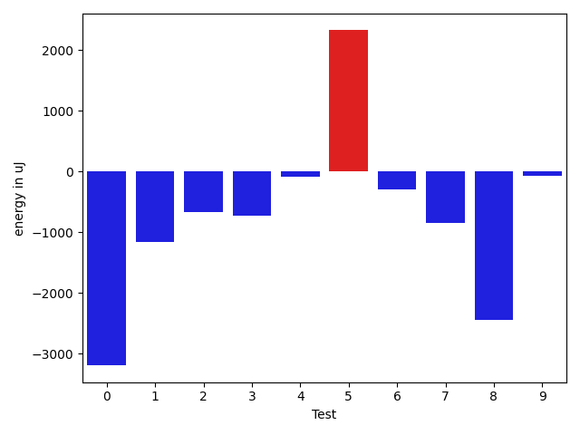

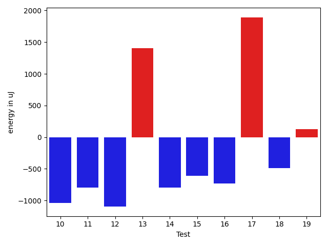

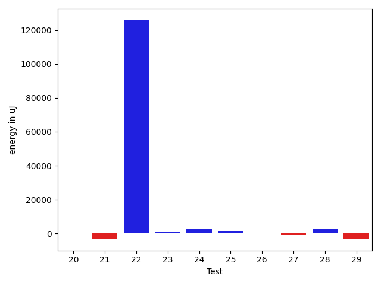

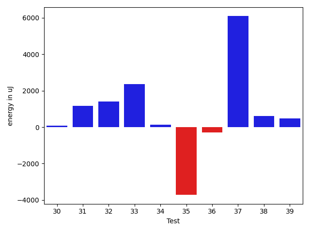

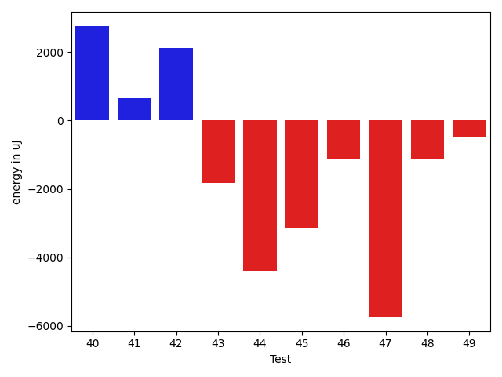

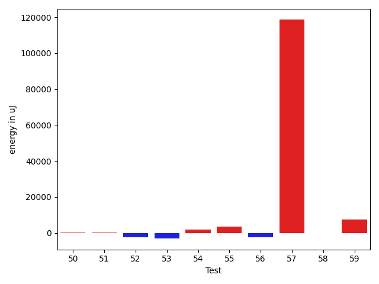

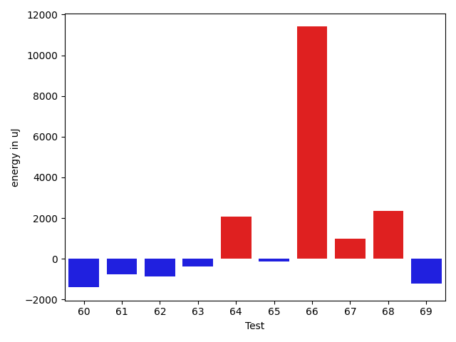

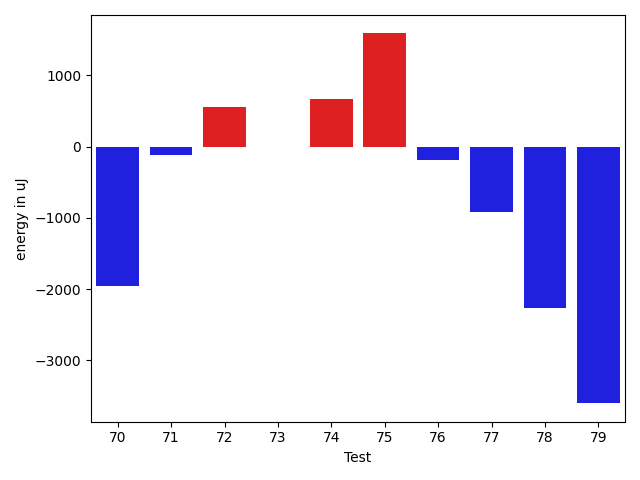

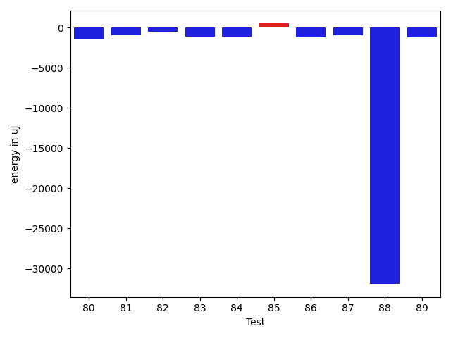

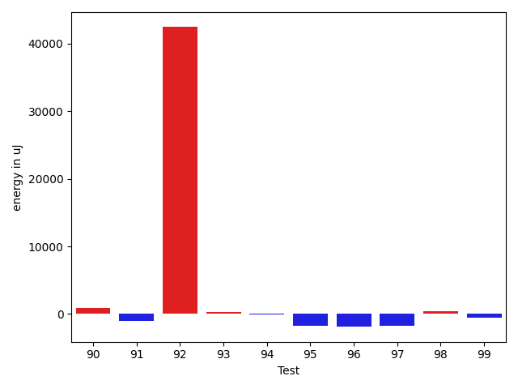

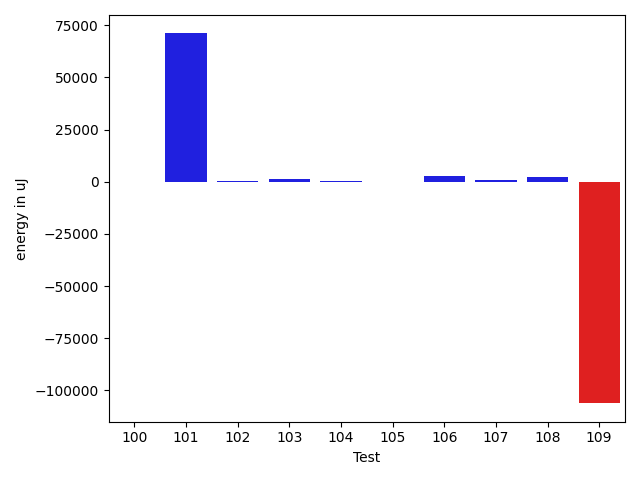

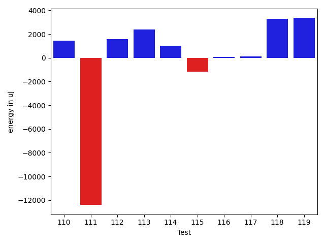

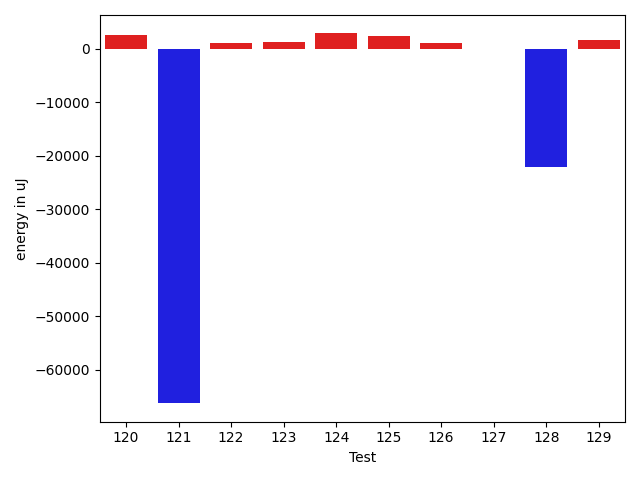

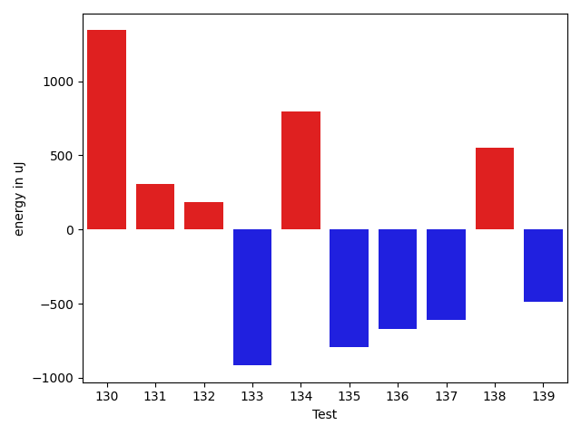

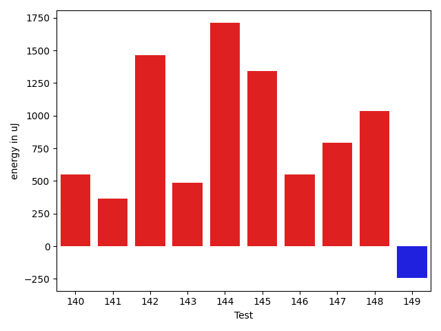

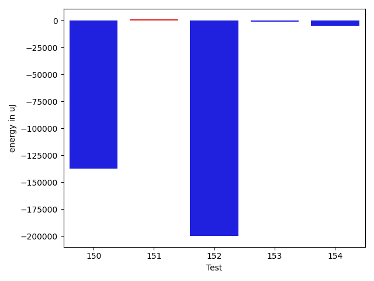

| ID | EnergyV1 | EnergyV2 | DeltaEnergy | σV1 | σV2 |
| --- | --- | --- | --- | --- | --- |
| 0 | 40894 | 40405 | -489 | 12478.672213114012 | 7345.987987723825 |
| 1 | 41565 | 40466 | -1099 | 17100.52726638419 | 14592.699060043135 |
| 2 | 84961 | 85510 | 549 | 25910.078194444737 | 25526.787514094194 |
| 3 | 42114 | 40588 | -1526 | 14804.371970365684 | 15022.558153877146 |
| 4 | 40649 | 40710 | 61 | 4289.793683531098 | 4849.833861784709 |
| 5 | 41016 | 41138 | 122 | 11815.053187020794 | 10814.332995782372 |
| 6 | 39367 | 38940 | -427 | 3334.7945474150856 | 3480.046771152906 |
| 7 | 41016 | 40222 | -794 | 3931.580097343961 | 4249.346417932037 |
| 8 | 41870 | 38025 | -3845 | 4115.114681198322 | 4353.914406305326 |
| 9 | 41809 | 41625 | -184 | 4217.566321623873 | 4623.063160113649 |
| 10 | 42420 | 41382 | -1038 | 175804.29815291875 | 187105.32543145117 |
| 11 | 41138 | 40345 | -793 | 4429.216061550884 | 4089.0928017542014 |
| 12 | 40710 | 39612 | -1098 | 4261.813809513058 | 4243.282843212317 |
| 13 | 38818 | 40222 | 1404 | 3418.858925077756 | 3887.6825549783566 |
| 14 | 40832 | 40039 | -793 | 3564.4583392949007 | 4410.43233069127 |
| 15 | 41503 | 40893 | -610 | 4260.855672883996 | 4196.853059535493 |
| 16 | 43030 | 42298 | -732 | 4408.74249940717 | 4382.801189246759 |
| 17 | 41138 | 43029 | 1891 | 4392.080531235412 | 4478.120437674827 |
| 18 | 41504 | 41016 | -488 | 4635.266087180103 | 4524.685539101597 |
| 19 | 42358 | 42481 | 123 | 39602.01234608113 | 46438.39938285441 |
| 20 | 41809 | 41138 | -671 | 4179.361168960185 | 4163.806098829548 |
| 21 | 41687 | 42724 | 1037 | 25622.086491135153 | 19811.397946580026 |
| 22 | 42664 | 42419 | -245 | 6811.370303576694 | 498896.7193759175 |
| 23 | 41687 | 41992 | 305 | 3845.429548052709 | 7668.935095968202 |
| 24 | 40406 | 40772 | 366 | 4307.601396016177 | 5862.268028953319 |
| 25 | 40894 | 41809 | 915 | 4659.9297244740765 | 8970.042673392138 |
| 26 | 41748 | 42114 | 366 | 4853.865822565493 | 4670.408433735843 |
| 27 | 41076 | 41138 | 62 | 5467.866839759702 | 4536.289266705166 |
| 28 | 105651 | 107788 | 2137 | 22514.292988965488 | 23076.12045366645 |
| 29 | 224304 | 228759 | 4455 | 56173.3709266021 | 39589.470069105715 |
| 30 | 41016 | 40955 | -61 | 8018.4667821763305 | 8157.673056886722 |
| 31 | 38330 | 39245 | 915 | 3944.4927741779215 | 4659.488864797876 |
| 32 | 84533 | 87280 | 2747 | 22332.67213086339 | 20288.927351910774 |
| 33 | 89600 | 90454 | 854 | 21740.258051009358 | 25021.775976832516 |
| 34 | 119995 | 121582 | 1587 | 24165.265320023784 | 25623.31891404388 |
| 35 | 122192 | 122131 | -61 | 25783.780257793966 | 23536.763004160297 |
| 36 | 121094 | 122803 | 1709 | 24722.815335591193 | 22099.87795744367 |
| 37 | 41076 | 42603 | 1527 | 13373.302168904771 | 20413.05207597335 |
| 38 | 40589 | 40772 | 183 | 4392.887642466534 | 5351.938176377536 |
| 39 | 37537 | 39307 | 1770 | 3856.868214428566 | 4591.352085860042 |
| 40 | 38818 | 41931 | 3113 | 3884.1546886749443 | 4709.69518055967 |
| 41 | 37353 | 38879 | 1526 | 4145.7385888508215 | 4036.5367475845615 |
| 42 | 37048 | 40649 | 3601 | 4859.330431651433 | 4386.984145173083 |
| 43 | 32715 | 31005 | -1710 | 499.3542496731821 | 1441.1741355189833 |
| 44 | 35278 | 30883 | -4395 | 0.0 | 0.0 |
| 45 | 34241 | 31311 | -2930 | 0.0 | 213.5 |
| 46 | 44189 | 43457 | -732 | 30749.019765922574 | 30756.1343188037 |
| 47 | 41076 | 41870 | 794 | 24889.777867090575 | 15961.646190381593 |
| 48 | 41443 | 41443 | 0 | 9805.694012981268 | 7757.962456248765 |
| 49 | 40955 | 41626 | 671 | 10208.81859560131 | 7273.958229727623 |
| 50 | 41321 | 40710 | -611 | 4139.062929816336 | 3851.624703367498 |
| 51 | 39367 | 41016 | 1649 | 5281.556404172307 | 4600.834085807047 |
| 52 | 42298 | 42541 | 243 | 16505.63181101747 | 15213.99757025445 |
| 53 | 44800 | 39307 | -5493 | 5457.883476019544 | 6961.53431555621 |
| 54 | 41198 | 41077 | -121 | 9914.904920615498 | 12482.648228424932 |
| 55 | 42114 | 44190 | 2076 | 4147.226577358731 | 3396.736742561881 |
| 56 | 41931 | 38574 | -3357 | 3768.9955192829566 | 4771.861291509251 |
| 57 | 43701 | 43213 | -488 | 31404.022291515135 | 512294.94815490965 |
| 58 | 40649 | 41137 | 488 | 4634.412745418556 | 5861.186389926611 |
| 59 | 44250 | 45593 | 1343 | 11065.750565483571 | 21736.26150761087 |
| 60 | 40650 | 39978 | -672 | 3617.732949481182 | 3728.712037122512 |
| 61 | 39002 | 40222 | 1220 | 4218.7347175166215 | 3561.7857967216946 |
| 62 | 42725 | 40161 | -2564 | 4370.820122809147 | 3209.690150057323 |
| 63 | 41443 | 42847 | 1404 | 4275.896678463823 | 4855.688390949321 |
| 64 | 43640 | 43213 | -427 | 5478.828685038437 | 4272.668648510225 |
| 65 | 41199 | 40466 | -733 | 3972.3955355330813 | 4066.3303254357984 |
| 66 | 43091 | 43213 | 122 | 34764.8348739977 | 46758.31199161872 |
| 67 | 39978 | 41565 | 1587 | 4060.5269360796337 | 5087.693018342291 |
| 68 | 39368 | 42114 | 2746 | 3694.521688040464 | 3328.021351789952 |
| 69 | 41931 | 40710 | -1221 | 6837.470328821935 | 8073.848689196229 |
| 70 | 43945 | 41992 | -1953 | 18979.782965631523 | 12585.457977306669 |
| 71 | 42358 | 42236 | -122 | 12583.968839815658 | 8860.39814165166 |
| 72 | 43579 | 44128 | 549 | 36365.349906331845 | 43925.985152346184 |
| 73 | 40771 | 40771 | 0 | 7172.860571441755 | 4331.725184608456 |
| 74 | 43457 | 44129 | 672 | 332400.79309707263 | 232688.51978709444 |
| 75 | 86182 | 87768 | 1586 | 175903.7293402971 | 155851.81942125483 |
| 76 | 85388 | 85205 | -183 | 177287.52712688167 | 308162.52005179244 |
| 77 | 47058 | 46142 | -916 | 55572.94862932798 | 53081.8906363893 |
| 78 | 41199 | 38941 | -2258 | 4598.58217630415 | 5306.7052381279855 |
| 79 | 41687 | 38086 | -3601 | 7180.236720369616 | 4311.785123591536 |
| 80 | 41747 | 40222 | -1525 | 14468.818447075691 | 14356.757533207654 |
| 81 | 39978 | 39001 | -977 | 5117.28485276206 | 4160.912205334234 |
| 82 | 41321 | 40833 | -488 | 4319.309076964018 | 4976.219348059328 |
| 83 | 40161 | 39062 | -1099 | 3575.4544333935282 | 4096.609853191079 |
| 84 | 40833 | 39672 | -1161 | 3984.572318186545 | 4095.0707877468344 |
| 85 | 40405 | 40894 | 489 | 3923.007442559216 | 5068.1874247566 |
| 86 | 41321 | 40100 | -1221 | 4238.60580786235 | 4327.922768501589 |
| 87 | 40833 | 39856 | -977 | 4842.453467710225 | 4362.172437982963 |
| 88 | 125488 | 93567 | -31921 | 41102.31592113772 | 38860.865963258526 |
| 89 | 42969 | 41748 | -1221 | 10544.475295695773 | 11063.070149827308 |
| 90 | 41564 | 43274 | 1710 | 4545.701068767856 | 3509.477927126434 |
| 91 | 41626 | 40222 | -1404 | 3664.6153351841517 | 5186.335727454387 |
| 92 | 204101 | 214233 | 10132 | 256252.74594874453 | 371800.0536643619 |
| 93 | 41870 | 40955 | -915 | 5695.598434561357 | 8835.797826151036 |
| 94 | 41260 | 40649 | -611 | 9665.719390588894 | 11448.401035655117 |
| 95 | 42480 | 41260 | -1220 | 4212.795306726452 | 5305.113584350211 |
| 96 | 42053 | 40344 | -1709 | 4428.896769247739 | 3723.0408861574433 |
| 97 | 40771 | 39551 | -1220 | 4057.4557265493486 | 4442.946059691792 |
| 98 | 42663 | 40588 | -2075 | 23459.603898901052 | 29662.25672925758 |
| 99 | 41626 | 39489 | -2137 | 4785.64903139188 | 7148.520039815038 |
| 100 | 42297 | 41626 | -671 | 4341.665706045959 | 4201.124167000495 |
| 101 | 130981 | 132262 | 1281 | 252722.7362084089 | 479355.9576112243 |
| 102 | 39184 | 39794 | 610 | 4665.199708598841 | 4834.2548112658405 |
| 103 | 44373 | 44739 | 366 | 25341.890748431506 | 26665.51744126422 |
| 104 | 39917 | 40039 | 122 | 4401.906582918167 | 4121.402283429265 |
| 105 | 40649 | 39734 | -915 | 4449.249962259557 | 4790.303901784376 |
| 106 | 37903 | 41443 | 3540 | 4761.032124490105 | 4295.025439580538 |
| 107 | 40466 | 40344 | -122 | 7172.734052259207 | 4710.170498672229 |
| 108 | 38941 | 39917 | 976 | 4442.976565911131 | 4970.623318205435 |
| 109 | 41992 | 42175 | 183 | 571633.7806089475 | 453543.4482860294 |
| 110 | 39306 | 41442 | 2136 | 5075.7645651300845 | 4110.186390828589 |
| 111 | 44189 | 43945 | -244 | 62656.77087093321 | 48751.85106946582 |
| 112 | 40039 | 40589 | 550 | 4336.050681252217 | 4737.68955847606 |
| 113 | 36438 | 40466 | 4028 | 5152.108934989863 | 6982.459568322891 |
| 114 | 39185 | 41138 | 1953 | 4282.888726892023 | 3694.195293702577 |
| 115 | 41260 | 41504 | 244 | 7789.60743396011 | 5135.240077381363 |
| 116 | 38819 | 40039 | 1220 | 5073.411979241496 | 4419.778416304192 |
| 117 | 39917 | 39306 | -611 | 6869.388415296882 | 6451.117347742204 |
| 118 | 88073 | 88805 | 732 | 317954.2112450065 | 327315.8622309678 |
| 119 | 45716 | 45044 | -672 | 26817.550794000726 | 30626.273185604237 |
| 120 | 44495 | 45227 | 732 | 46016.6442750006 | 44860.80590278667 |
| 121 | 41198 | 42725 | 1527 | 465199.0604484827 | 341178.7157808962 |
| 122 | 40039 | 40832 | 793 | 4982.451527180366 | 4753.425881634042 |
| 123 | 40588 | 41809 | 1221 | 5353.5508914011925 | 3715.676055878379 |
| 124 | 40344 | 41870 | 1526 | 5001.676166797351 | 8233.954439755928 |
| 125 | 42236 | 43823 | 1587 | 20812.394444302143 | 19154.289700105182 |
| 126 | 41443 | 41625 | 182 | 10623.350889137615 | 11536.44911114827 |
| 127 | 41687 | 41199 | -488 | 10798.089969419249 | 12463.355071626325 |
| 128 | 90454 | 87829 | -2625 | 400469.646228764 | 367413.1400986618 |
| 129 | 41382 | 42602 | 1220 | 12817.138857415834 | 13149.765582064876 |
| 130 | 42358 | 43701 | 1343 | 23339.51849363519 | 22637.960760119073 |
| 131 | 39917 | 40222 | 305 | 8962.002214827748 | 7132.878307724456 |
| 132 | 90393 | 90576 | 183 | 537762.2930018471 | 552939.7334290534 |
| 133 | 40405 | 39489 | -916 | 4282.295864772822 | 4741.5836731296085 |
| 134 | 42053 | 42847 | 794 | 13010.855501431137 | 14923.526185374407 |
| 135 | 44556 | 43763 | -793 | 51077.19962861946 | 45388.37467789717 |
| 136 | 39978 | 39306 | -672 | 7348.188409281332 | 7040.006963635689 |
| 137 | 40222 | 39611 | -611 | 8611.321554882226 | 6551.347269255026 |
| 138 | 42969 | 43518 | 549 | 248761.22257921632 | 641152.736736191 |
| 139 | 43701 | 43212 | -489 | 25895.724570884984 | 21798.948770466373 |
| 140 | 43762 | 44312 | 550 | 542415.5236955145 | 570247.5615495865 |
| 141 | 39734 | 40100 | 366 | 5742.508886552129 | 4686.259128241636 |
| 142 | 39063 | 40527 | 1464 | 4379.9025111205865 | 3988.994947967372 |
| 143 | 39368 | 39856 | 488 | 4756.034778633982 | 5906.8253336046155 |
| 144 | 40650 | 42359 | 1709 | 4552.95913394204 | 5063.825854173288 |
| 145 | 78003 | 79345 | 1342 | 21868.998977066905 | 24914.370066375457 |
| 146 | 42237 | 42786 | 549 | 3537.8535777666466 | 6007.413191810129 |
| 147 | 40894 | 41687 | 793 | 540054.1879674164 | 395530.0202367002 |
| 148 | 44068 | 45105 | 1037 | 543999.7398149254 | 518432.17510995746 |
| 149 | 42053 | 41809 | -244 | 6142.084091794719 | 4839.92688794142 |
| 150 | 43640 | 42602 | -1038 | 692861.3898917654 | 451919.9701429118 |
| 151 | 41504 | 43274 | 1770 | 3780.3803273614067 | 3874.836180486284 |
| 152 | 42602 | 42907 | 305 | 570713.93441634 | 4136.7849098764755 |
| 153 | 42419 | 43091 | 672 | 11213.342581588728 | 5312.849281461723 |
| 154 | 46447 | 43579 | -2868 | 14422.195095099467 | 5600.385985214859 |

## Delta Duration per test method

| ID | DurationV1 | DurationsV2 | DeltaDuration |
| --- | --- | --- | --- |
| 0 | 1150060.725 | 1066025.594936709 | -84035.13006329117 |
| 1 | 1069461.8378378379 | 1129707.8358208956 | 60245.99798305775 |
| 2 | 2527038.272727273 | 2593246.9292929294 | 66208.65656565642 |
| 3 | 1224653.9620253164 | 1220561.1012658228 | -4092.860759493662 |
| 4 | 880294.4038461539 | 872713.9777777778 | -7580.426068376051 |
| 5 | 896778.3076923077 | 967056.3478260869 | 70278.04013377917 |
| 6 | 612367.9761904762 | 670305.1470588235 | 57937.17086834728 |
| 7 | 838256.724137931 | 824809.9821428572 | -13446.741995073855 |
| 8 | 932840.3898305085 | 946172.0175438597 | 13331.627713351161 |
| 9 | 503990.8214285714 | 592942.32 | 88951.49857142853 |
| 10 | 1753337.1232876712 | 1731082.9090909092 | -22254.21419676207 |
| 11 | 849745.9245283019 | 839756.1851851852 | -9989.739343116758 |
| 12 | 854537.0943396227 | 870136.5166666667 | 15599.42232704407 |
| 13 | 636968.1379310344 | 592593.4516129033 | -44374.686318131164 |
| 14 | 775777.7906976744 | 801259.2653061225 | 25481.4746084481 |
| 15 | 908217.4716981133 | 926161.9836065574 | 17944.51190844411 |
| 16 | 716690.5151515151 | 646150.0606060605 | -70540.45454545459 |
| 17 | 492481.9285714286 | 525101.2222222222 | 32619.29365079367 |
| 18 | 685615.2352941176 | 636423.1142857143 | -49192.12100840325 |
| 19 | 1649175.7701149425 | 1743984.6304347827 | 94808.86031984026 |
| 20 | 446946.28571428574 | 439788.1212121212 | -7158.164502164524 |
| 21 | 1261467.2318840579 | 1136396.0285714285 | -125071.20331262937 |
| 22 | 1007664.6825396825 | 4846770.62745098 | 3839105.944911298 |
| 23 | 902681.3620689656 | 896448.4444444445 | -6232.917624521069 |
| 24 | 775482.3636363636 | 742781.2258064516 | -32701.13782991201 |
| 25 | 913549.6851851852 | 899943.8431372549 | -13605.84204793023 |
| 26 | 627857.4285714285 | 578770.6756756756 | -49086.7528957529 |
| 27 | 478406.0625 | 424747.35714285716 | -53658.70535714284 |
| 28 | 3042480.3131313133 | 3014955.0606060605 | -27525.252525252756 |
| 29 | 6502963.2727272725 | 6281401.5050505055 | -221561.76767676696 |
| 30 | 1019921.171875 | 997506.1166666667 | -22415.055208333302 |
| 31 | 556469.4444444445 | 540283.3939393939 | -16186.050505050574 |
| 32 | 2664269.5454545454 | 2657964.404040404 | -6305.141414141282 |
| 33 | 2799613.595959596 | 2792379.898989899 | -7233.696969696786 |
| 34 | 3314869.9393939395 | 3294717.292929293 | -20152.64646464633 |
| 35 | 3419116.121212121 | 3311365.5353535353 | -107750.58585858578 |
| 36 | 3504140.9595959596 | 3491118.868686869 | -13022.090909090824 |
| 37 | 1211079.213114754 | 1326666.6 | 115587.38688524603 |
| 38 | 583283.3157894737 | 655509.6315789474 | 72226.31578947371 |
| 39 | 636149.7142857143 | 612714.8461538461 | -23434.868131868192 |
| 40 | 582758.8333333334 | 536093.8461538461 | -46664.987179487245 |
| 41 | 615616.448275862 | 600501.2727272727 | -15115.175548589323 |
| 42 | 622515.4054054054 | 609190.6 | -13324.805405405466 |
| 43 | 981830.6666666666 | 950702.3333333334 | -31128.333333333256 |
| 44 | 694228.0 | 654170.0 | -40058.0 |
| 45 | 810816.0 | 743307.5 | -67508.5 |
| 46 | 1862770.4842105263 | 1746054.6630434783 | -116715.82116704807 |
| 47 | 1481928.5223880596 | 1237527.7887323943 | -244400.7336556653 |
| 48 | 1104653.8181818181 | 1042778.1525423729 | -61875.665639445186 |
| 49 | 1202310.8961038962 | 1164733.3333333333 | -37577.562770562945 |
| 50 | 796876.448275862 | 802504.4680851063 | 5628.019809244317 |
| 51 | 805026.119047619 | 771452.3636363636 | -33573.755411255406 |
| 52 | 1242690.5679012346 | 1291421.0416666667 | 48730.473765432136 |
| 53 | 563283.3913043478 | 725014.6666666666 | 161731.27536231885 |
| 54 | 1160655.373493976 | 1150422.9277108433 | -10232.445783132687 |
| 55 | 480247.1666666667 | 463773.0 | -16474.166666666686 |
| 56 | 787462.675 | 859470.8461538461 | 72008.17115384608 |
| 57 | 1504897.8241758242 | 5156048.054347826 | 3651150.2301720018 |
| 58 | 558840.1428571428 | 637883.21875 | 79043.07589285716 |
| 59 | 1091911.975 | 1231586.9189189188 | 139674.94391891873 |
| 60 | 499011.95652173914 | 519380.28571428574 | 20368.329192546604 |
| 61 | 527999.2857142857 | 500946.77777777775 | -27052.50793650793 |
| 62 | 507797.9259259259 | 483269.5625 | -24528.363425925898 |
| 63 | 545420.1142857143 | 544793.5 | -626.6142857143423 |
| 64 | 573192.0 | 507874.3043478261 | -65317.69565217389 |
| 65 | 594419.4864864865 | 602085.2162162162 | 7665.729729729705 |
| 66 | 1391165.482142857 | 1675464.0833333333 | 284298.6011904762 |
| 67 | 538625.2592592592 | 525523.7333333333 | -13101.525925925933 |
| 68 | 531500.5238095238 | 465920.2962962963 | -65580.2275132275 |
| 69 | 925580.2676056338 | 940102.1111111111 | 14521.8435054773 |
| 70 | 1179227.4677419355 | 1054421.6119402985 | -124805.85580163705 |
| 71 | 1238203.6341463414 | 1217172.0853658537 | -21031.548780487617 |
| 72 | 1553029.0892857143 | 1601021.5762711863 | 47992.48698547203 |
| 73 | 900595.25 | 841754.4117647059 | -58840.8382352941 |
| 74 | 2890737.035714286 | 2233204.2023809524 | -657532.8333333335 |
| 75 | 3341941.4646464647 | 3336760.02020202 | -5181.444444444496 |
| 76 | 3181872.2162162163 | 3974251.5223880596 | 792379.3061718433 |
| 77 | 2110263.7297297297 | 2094273.4625 | -15990.267229729798 |
| 78 | 601248.1 | 716606.0 | 115357.90000000002 |
| 79 | 955738.9523809524 | 1003104.6779661017 | 47365.72558514925 |
| 80 | 1307148.021978022 | 1312935.606741573 | 5787.584763550898 |
| 81 | 625816.3225806452 | 674218.7931034482 | 48402.47052280302 |
| 82 | 644592.78125 | 670597.625 | 26004.84375 |
| 83 | 652263.21875 | 649057.7837837838 | -3205.434966216213 |
| 84 | 609530.9310344828 | 636394.2121212122 | 26863.281086729374 |
| 85 | 681882.15 | 705085.875 | 23203.724999999977 |
| 86 | 579858.4444444445 | 602616.3225806452 | 22757.878136200714 |
| 87 | 620740.7142857143 | 597231.0384615385 | -23509.67582417582 |
| 88 | 3242342.6464646463 | 3039811.090909091 | -202531.5555555555 |
| 89 | 1183089.0307692308 | 1057897.7333333334 | -125191.2974358974 |
| 90 | 464396.125 | 491326.27777777775 | 26930.152777777752 |
| 91 | 883481.9393939395 | 974285.5384615385 | 90803.59906759905 |
| 92 | 6788421.343434343 | 8088777.333333333 | 1300355.98989899 |
| 93 | 957174.0694444445 | 1085304.276923077 | 128130.20747863245 |
| 94 | 1155156.2658227847 | 1184404.0843373493 | 29247.81851456454 |
| 95 | 687946.8837209302 | 752673.5476190476 | 64726.663898117375 |
| 96 | 667311.8 | 725306.575 | 57994.77499999991 |
| 97 | 826231.5 | 877982.2295081967 | 51750.7295081967 |
| 98 | 1054953.3777777778 | 1235081.9591836734 | 180128.58140589553 |
| 99 | 740086.7105263158 | 824992.0714285715 | 84905.36090225563 |
| 100 | 882295.1 | 860603.7346938775 | -21691.36530612246 |
| 101 | 4734313.666666667 | 7066516.2727272725 | 2332202.6060606055 |
| 102 | 776652.7547169811 | 786649.8518518518 | 9997.09713487071 |
| 103 | 1792250.494949495 | 1732128.7777777778 | -60121.7171717172 |
| 104 | 530739.6666666666 | 547105.8684210526 | 16366.201754385955 |
| 105 | 753803.0222222222 | 810229.1666666666 | 56426.14444444445 |
| 106 | 770930.725490196 | 739357.3571428572 | -31573.368347338866 |
| 107 | 1019914.5178571428 | 937809.5211267605 | -82104.99673038232 |
| 108 | 750665.3684210526 | 668829.6363636364 | -81835.73205741623 |
| 109 | 8455078.2 | 5354113.4 | -3100964.799999999 |
| 110 | 913014.7586206896 | 796693.2037037037 | -116321.55491698592 |
| 111 | 2018535.9545454546 | 1573491.75 | -445044.2045454546 |
| 112 | 742874.7105263158 | 663402.552631579 | -79472.15789473685 |
| 113 | 822418.7586206896 | 742297.5833333334 | -80121.17528735625 |
| 114 | 611527.6785714285 | 517851.8620689655 | -93675.81650246301 |
| 115 | 843142.1818181818 | 664967.625 | -178174.55681818177 |
| 116 | 612267.1944444445 | 600891.9444444445 | -11375.25 |
| 117 | 1010659.0491803279 | 1037683.7671232877 | 27024.717942959745 |
| 118 | 4086806.090909091 | 4267143.454545454 | 180337.3636363633 |
| 119 | 1766143.852631579 | 1822414.5454545454 | 56270.69282296649 |
| 120 | 1633409.780487805 | 1637663.825 | 4254.044512195047 |
| 121 | 5568354.583333333 | 3465506.302325581 | -2102848.281007752 |
| 122 | 666408.3658536585 | 641871.2368421053 | -24537.129011553247 |
| 123 | 656847.3783783783 | 646115.4324324324 | -10731.945945945918 |
| 124 | 833178.6764705882 | 769399.5897435897 | -63779.086726998445 |
| 125 | 1345990.471264368 | 1529885.3777777778 | 183894.90651340992 |
| 126 | 1143243.3333333333 | 1203900.6493506494 | 60657.31601731619 |
| 127 | 1161178.8846153845 | 1173116.536585366 | 11937.65196998138 |
| 128 | 4938538.242424242 | 4288350.555555556 | -650187.6868686862 |
| 129 | 1212021.945054945 | 1259632.7931034483 | 47610.84804850328 |
| 130 | 1180489.619047619 | 1260664.935483871 | 80175.31643625209 |
| 131 | 1076205.431372549 | 1022117.4285714285 | -54088.0028011204 |
| 132 | 7298592.3838383835 | 7425338.7272727275 | 126746.34343434405 |
| 133 | 880481.3181818182 | 859352.2127659575 | -21129.105415860773 |
| 134 | 1393984.7252747254 | 1379739.7916666667 | -14244.933608058607 |
| 135 | 1967508.5487804879 | 1757369.188235294 | -210139.36054519378 |
| 136 | 1117186.8051948051 | 1097512.4383561644 | -19674.366838640766 |
| 137 | 1203355.058139535 | 1192990.9285714286 | -10364.129568106262 |
| 138 | 1985434.564516129 | 6743948.049180328 | 4758513.484664199 |
| 139 | 1581962.7045454546 | 1465950.2045454546 | -116012.5 |
| 140 | 4964537.776119403 | 5568993.185714286 | 604455.4095948832 |
| 141 | 936844.6346153846 | 862488.5535714285 | -74356.0810439561 |
| 142 | 828644.9607843137 | 757525.716981132 | -71119.24380318169 |
| 143 | 886362.4651162791 | 781112.1463414634 | -105250.31877481565 |
| 144 | 677255.3947368421 | 685312.6153846154 | 8057.22064777324 |
| 145 | 2088503.4040404041 | 2091725.7575757576 | 3222.353535353439 |
| 146 | 846682.1372549019 | 905307.7068965518 | 58625.56964164984 |
| 147 | 5422221.32 | 2740557.4814814813 | -2681663.838518519 |
| 148 | 5687875.8533333335 | 5346892.328947368 | -340983.52438596543 |
| 149 | 897838.7301587302 | 918213.7586206896 | 20375.028461959446 |
| 150 | 7543309.422535211 | 3775384.5753424657 | -3767924.847192745 |
| 151 | 426544.3333333333 | 444129.4705882353 | 17585.137254901987 |
| 152 | 6533648.388888889 | 455713.7368421053 | -6077934.652046784 |
| 153 | 802608.9615384615 | 781636.9047619047 | -20972.05677655677 |
| 154 | 973980.1666666666 | 547794.2941176471 | -426185.8725490195 |

## Misc.

| ID | Test Class | Test Method |
| --- | --- | --- |
| 0 | com.google.gson.functional.CustomTypeAdaptersTest | testCustomAdapterInvokedForCollectionElementDeserialization |
| 1 | com.google.gson.functional.CustomTypeAdaptersTest | testCustomNestedSerializers |
| 2 | com.google.gson.functional.CustomTypeAdaptersTest | testCustomTypeAdapterDoesNotAppliesToSubClasses |
| 3 | com.google.gson.functional.CustomTypeAdaptersTest | testCustomAdapterInvokedForCollectionElementSerializationWithType |
| 4 | com.google.gson.functional.CustomTypeAdaptersTest | testCustomDeserializers |
| 5 | com.google.gson.functional.CustomTypeAdaptersTest | testEnsureCustomSerializerNotInvokedForNullValues |
| 6 | com.google.gson.functional.CustomTypeAdaptersTest | testEnsureCustomDeserializerNotInvokedForNullValues |
| 7 | com.google.gson.functional.CustomTypeAdaptersTest | testCustomTypeAdapterAppliesToSubClassesSerializedAsBaseClass |
| 8 | com.google.gson.functional.CustomTypeAdaptersTest | testCustomAdapterInvokedForMapElementSerializationWithType |
| 9 | com.google.gson.functional.CustomTypeAdaptersTest | testCustomAdapterInvokedForMapElementSerialization |
| 10 | com.google.gson.functional.CustomTypeAdaptersTest | testCustomSerializers |
| 11 | com.google.gson.functional.CustomTypeAdaptersTest | testCustomByteArrayDeserializerAndInstanceCreator |
| 12 | com.google.gson.functional.CustomTypeAdaptersTest | testCustomAdapterInvokedForMapElementDeserialization |
| 13 | com.google.gson.functional.CustomTypeAdaptersTest | testCustomAdapterInvokedForCollectionElementSerialization |
| 14 | com.google.gson.functional.CustomTypeAdaptersTest | testCustomByteArraySerializer |
| 15 | com.google.gson.functional.CustomTypeAdaptersTest | testCustomNestedDeserializers |
| 16 | com.google.gson.MixedStreamTest | testReaderDoesNotMutateState |
| 17 | com.google.gson.MixedStreamTest | testReadInvalidState |
| 18 | com.google.gson.MixedStreamTest | testWriteInvalidState |
| 19 | com.google.gson.MixedStreamTest | testWriteHtmlSafe |
| 20 | com.google.gson.MixedStreamTest | testReadNulls |
| 21 | com.google.gson.MixedStreamTest | testWriteLenient |
| 22 | com.google.gson.MixedStreamTest | testWriteMixedStreamed |
| 23 | com.google.gson.MixedStreamTest | testReadMixedStreamed |
| 24 | com.google.gson.MixedStreamTest | testWriteDoesNotMutateState |
| 25 | com.google.gson.MixedStreamTest | testReadClosed |
| 26 | com.google.gson.MixedStreamTest | testWriteClosed |
| 27 | com.google.gson.MixedStreamTest | testWriteNulls |
| 28 | com.google.gson.functional.DefaultTypeAdaptersTest | testDateSerializationWithPatternNotOverridenByTypeAdapter |
| 29 | com.google.gson.functional.DefaultTypeAdaptersTest | testDateSerializationWithPattern |
| 30 | com.google.gson.functional.DefaultTypeAdaptersTest | testBitSetDeserialization |
| 31 | com.google.gson.functional.DefaultTypeAdaptersTest | testDefaultGregorianCalendarDeserialization |
| 32 | com.google.gson.functional.DefaultTypeAdaptersTest | testSqlDateSerialization |
| 33 | com.google.gson.functional.DefaultTypeAdaptersTest | testTimestampSerialization |
| 34 | com.google.gson.functional.DefaultTypeAdaptersTest | testDefaultDateDeserializationUsingBuilder |
| 35 | com.google.gson.functional.DefaultTypeAdaptersTest | testDateDeserializationWithPattern |
| 36 | com.google.gson.functional.DefaultTypeAdaptersTest | testDateSerializationInCollection |
| 37 | com.google.gson.functional.DefaultTypeAdaptersTest | testSetSerialization |
| 38 | com.google.gson.functional.DefaultTypeAdaptersTest | testBitSetSerialization |
| 39 | com.google.gson.functional.DefaultTypeAdaptersTest | testDefaultGregorianCalendarSerialization |
| 40 | com.google.gson.functional.DefaultTypeAdaptersTest | testDefaultJavaSqlDateSerialization |
| 41 | com.google.gson.functional.DefaultTypeAdaptersTest | testDefaultCalendarDeserialization |
| 42 | com.google.gson.functional.DefaultTypeAdaptersTest | testDefaultCalendarSerialization |
| 43 | com.google.gson.functional.DefaultTypeAdaptersTest | testDefaultJavaSqlDateDeserialization |
| 44 | com.google.gson.functional.DefaultTypeAdaptersTest | testDefaultJavaSqlTimeSerialization |
| 45 | com.google.gson.functional.DefaultTypeAdaptersTest | testDefaultJavaSqlTimeDeserialization |
| 46 | com.google.gson.functional.MapTest | testSerializeMaps |
| 47 | com.google.gson.functional.MapTest | testMapSubclassDeserialization |
| 48 | com.google.gson.functional.MapTest | testCustomSerializerForSpecificMapType |
| 49 | com.google.gson.functional.MapTest | testGeneralMapField |
| 50 | com.google.gson.functional.MapTest | testMapSerializationWithNullValueButSerializeNulls |
| 51 | com.google.gson.functional.MapTest | testMapSerializationWithNullValuesSerialized |
| 52 | com.google.gson.functional.ReadersWritersTest | testReadWriteTwoObjects |
| 53 | com.google.gson.functional.ReadersWritersTest | testTopLevelNullObjectSerializationWithWriterAndSerializeNulls |
| 54 | com.google.gson.functional.ReadersWritersTest | testReadWriteTwoStrings |
| 55 | com.google.gson.functional.ReadersWritersTest | testTopLevelNullObjectDeserializationWithReaderAndSerializeNulls |
| 56 | com.google.gson.functional.FieldExclusionTest | testDefaultNestedStaticClassIncluded |
| 57 | com.google.gson.functional.FieldExclusionTest | testDefaultInnerClassExclusion |
| 58 | com.google.gson.functional.FieldExclusionTest | testInnerClassExclusion |
| 59 | com.google.gson.functional.PrimitiveTest | testMoreSpecificSerialization |
| 60 | com.google.gson.functional.PrimitiveTest | testLongAsStringDeserialization |
| 61 | com.google.gson.functional.PrimitiveTest | testNegativeInfinitySerialization |
| 62 | com.google.gson.functional.PrimitiveTest | testNegativeInfinityFloatSerialization |
| 63 | com.google.gson.functional.PrimitiveTest | testDoubleNaNSerialization |
| 64 | com.google.gson.functional.PrimitiveTest | testDoubleInfinitySerialization |
| 65 | com.google.gson.functional.PrimitiveTest | testLongAsStringSerialization |
| 66 | com.google.gson.functional.PrimitiveTest | testHtmlCharacterSerialization |
| 67 | com.google.gson.functional.PrimitiveTest | testFloatNaNSerialization |
| 68 | com.google.gson.functional.PrimitiveTest | testFloatInfinitySerialization |
| 69 | com.google.gson.functional.CustomDeserializerTest | testCustomDeserializerReturnsNullForArrayElementsForArrayField |
| 70 | com.google.gson.functional.CustomDeserializerTest | testCustomDeserializerReturnsNull |
| 71 | com.google.gson.functional.CustomDeserializerTest | testJsonTypeFieldBasedDeserialization |
| 72 | com.google.gson.functional.CustomDeserializerTest | testCustomDeserializerReturnsNullForTopLevelObject |
| 73 | com.google.gson.functional.CustomDeserializerTest | testCustomDeserializerReturnsNullForArrayElements |
| 74 | com.google.gson.JsonParserTest | testReadWriteTwoObjects |
| 75 | com.google.gson.functional.NamingPolicyTest | testGsonWithNonDefaultFieldNamingPolicySerialization |
| 76 | com.google.gson.functional.NamingPolicyTest | testGsonDuplicateNameUsingSerializedNameFieldNamingPolicySerialization |
| 77 | com.google.gson.functional.NamingPolicyTest | testGsonWithSerializedNameFieldNamingPolicySerialization |
| 78 | com.google.gson.functional.NamingPolicyTest | testGsonWithLowerCaseUnderscorePolicySerialization |
| 79 | com.google.gson.functional.NamingPolicyTest | testComplexFieldNameStrategy |
| 80 | com.google.gson.functional.NamingPolicyTest | testDeprecatedNamingStrategy |
| 81 | com.google.gson.functional.NamingPolicyTest | testGsonWithLowerCaseUnderscorePolicyDeserialiation |
| 82 | com.google.gson.functional.NamingPolicyTest | testGsonWithSerializedNameFieldNamingPolicyDeserialization |
| 83 | com.google.gson.functional.NamingPolicyTest | testGsonWithNonDefaultFieldNamingPolicyDeserialiation |
| 84 | com.google.gson.functional.NamingPolicyTest | testGsonWithUpperCamelCaseSpacesPolicySerialiation |
| 85 | com.google.gson.functional.NamingPolicyTest | testGsonWithLowerCaseDashPolicySerialization |
| 86 | com.google.gson.functional.NamingPolicyTest | testGsonWithUpperCamelCaseSpacesPolicyDeserialiation |
| 87 | com.google.gson.functional.NamingPolicyTest | testGsonWithLowerCaseDashPolicyDeserialiation |
| 88 | com.google.gson.functional.ObjectTest | testSingletonLists |
| 89 | com.google.gson.functional.ObjectTest | testInnerClassDeserialization |
| 90 | com.google.gson.functional.ObjectTest | testJsonObjectSerialization |
| 91 | com.google.gson.functional.VersioningTest | testVersionedGsonMixingSinceAndUntilDeserialization |
| 92 | com.google.gson.functional.VersioningTest | testVersionedUntilSerialization |
| 93 | com.google.gson.functional.VersioningTest | testVersionedClassesSerialization |
| 94 | com.google.gson.functional.VersioningTest | testVersionedGsonMixingSinceAndUntilSerialization |
| 95 | com.google.gson.functional.VersioningTest | testVersionedUntilDeserialization |
| 96 | com.google.gson.functional.VersioningTest | testIgnoreLaterVersionClassSerialization |
| 97 | com.google.gson.functional.VersioningTest | testVersionedClassesDeserialization |
| 98 | com.google.gson.functional.VersioningTest | testVersionedGsonWithUnversionedClassesSerialization |
| 99 | com.google.gson.functional.VersioningTest | testVersionedGsonWithUnversionedClassesDeserialization |
| 100 | com.google.gson.functional.TypeHierarchyAdapterTest | testRegisterSuperTypeFirst |
| 101 | com.google.gson.functional.TypeHierarchyAdapterTest | testTypeHierarchy |
| 102 | com.google.gson.functional.NullObjectAndFieldTest | testCustomTypeAdapterPassesNullDesrialization |
| 103 | com.google.gson.functional.NullObjectAndFieldTest | testExplicitSerializationOfNullArrayMembers |
| 104 | com.google.gson.functional.NullObjectAndFieldTest | testCustomTypeAdapterPassesNullSerialization |
| 105 | com.google.gson.functional.NullObjectAndFieldTest | testExplicitDeserializationOfNulls |
| 106 | com.google.gson.functional.NullObjectAndFieldTest | testExplicitSerializationOfNullCollectionMembers |
| 107 | com.google.gson.functional.NullObjectAndFieldTest | testPrintPrintingObjectWithNulls |
| 108 | com.google.gson.functional.NullObjectAndFieldTest | testPrintPrintingArraysWithNulls |
| 109 | com.google.gson.functional.NullObjectAndFieldTest | testTopLevelNullObjectSerialization |
| 110 | com.google.gson.functional.NullObjectAndFieldTest | testNullWrappedPrimitiveMemberSerialization |
| 111 | com.google.gson.functional.NullObjectAndFieldTest | testExplicitSerializationOfNulls |
| 112 | com.google.gson.functional.NullObjectAndFieldTest | testExplicitSerializationOfNullStringMembers |
| 113 | com.google.gson.functional.NullObjectAndFieldTest | testCustomSerializationOfNulls |
| 114 | com.google.gson.functional.NullObjectAndFieldTest | testNullWrappedPrimitiveMemberDeserialization |
| 115 | com.google.gson.functional.NullObjectAndFieldTest | testTopLevelNullObjectDeserialization |
| 116 | com.google.gson.functional.NullObjectAndFieldTest | testExplicitNullSetsFieldToNullDuringDeserialization |
| 117 | com.google.gson.functional.TypeVariableTest | testBasicTypeVariables |
| 118 | com.google.gson.functional.TypeVariableTest | testAdvancedTypeVariables |
| 119 | com.google.gson.functional.TypeVariableTest | testTypeVariablesViaTypeParameter |
| 120 | com.google.gson.functional.SecurityTest | testJsonWithNonExectuableTokenSerialization |
| 121 | com.google.gson.functional.SecurityTest | testNonExecutableJsonSerialization |
| 122 | com.google.gson.functional.SecurityTest | testJsonWithNonExectuableTokenWithConfiguredGsonDeserialization |
| 123 | com.google.gson.functional.SecurityTest | testJsonWithNonExectuableTokenWithRegularGsonDeserialization |
| 124 | com.google.gson.functional.SecurityTest | testNonExecutableJsonDeserialization |
| 125 | com.google.gson.functional.EnumTest | testEnumSubclassWithRegisteredTypeAdapter |
| 126 | com.google.gson.functional.MapAsArrayTypeAdapterTest | testMultipleEnableComplexKeyRegistrationHasNoEffect |
| 127 | com.google.gson.functional.MapAsArrayTypeAdapterTest | testMapWithTypeVariableDeserialization |
| 128 | com.google.gson.functional.MapAsArrayTypeAdapterTest | testSerializeComplexMapWithTypeAdapter |
| 129 | com.google.gson.functional.MapAsArrayTypeAdapterTest | testMapWithTypeVariableSerialization |
| 130 | com.google.gson.functional.MapAsArrayTypeAdapterTest | testTwoTypesCollapseToOneDeserialize |
| 131 | com.google.gson.functional.ExclusionStrategyFunctionalTest | testExclusionStrategyWithMode |
| 132 | com.google.gson.functional.ExclusionStrategyFunctionalTest | testExclusionStrategySerialization |
| 133 | com.google.gson.functional.ExclusionStrategyFunctionalTest | testExclusionStrategyDeserialization |
| 134 | com.google.gson.functional.ParameterizedTypesTest | testParameterizedTypeWithCustomSerializer |
| 135 | com.google.gson.functional.ParameterizedTypesTest | testParameterizedTypeDeserialization |
| 136 | com.google.gson.functional.ParameterizedTypesTest | testParameterizedTypeWithReaderDeserialization |
| 137 | com.google.gson.functional.ParameterizedTypesTest | testParameterizedTypesWithCustomDeserializer |
| 138 | com.google.gson.FunctionWithInternalDependenciesTest | testAnonymousLocalClassesSerialization |
| 139 | com.google.gson.functional.EscapingTest | testGsonAcceptsEscapedAndNonEscapedJsonDeserialization |
| 140 | com.google.gson.functional.CustomSerializerTest | testSubClassSerializerInvokedForBaseClassFieldsHoldingSubClassInstances |
| 141 | com.google.gson.functional.CustomSerializerTest | testSubClassSerializerInvokedForBaseClassFieldsHoldingArrayOfSubClassInstances |
| 142 | com.google.gson.functional.CustomSerializerTest | testSerializerReturnsNull |
| 143 | com.google.gson.functional.CustomSerializerTest | testBaseClassSerializerInvokedForBaseClassFieldsHoldingSubClassInstances |
| 144 | com.google.gson.functional.CustomSerializerTest | testBaseClassSerializerInvokedForBaseClassFields |
| 145 | com.google.gson.functional.UncategorizedTest | testReturningDerivedClassesDuringDeserialization |
| 146 | com.google.gson.DefaultMapJsonSerializerTest | testNonEmptyMapSerialization |
| 147 | com.google.gson.GsonBuilderTest | testCreatingMoreThanOnce |
| 148 | com.google.gson.functional.InstanceCreatorTest | testInstanceCreatorReturnsBaseType |
| 149 | com.google.gson.functional.InstanceCreatorTest | testInstanceCreatorReturnsSubTypeForTopLevelObject |
| 150 | com.google.gson.CommentsTest | testParseComments |
| 151 | com.google.gson.JsonObjectTest | testWritePropertyWithEmptyStringName |
| 152 | com.google.gson.JsonObjectTest | testPropertyWithQuotes |
| 153 | com.google.gson.functional.ArrayTest | testNullsInArrayWithSerializeNullPropertySetSerialization |
| 154 | com.google.gson.functional.PrintFormattingTest | testJsonObjectWithNullValuesSerialized |

| Test | IterationV1 | IterationV2 | DeltaIteration |
| --- | --- | --- | --- |
| 0 | 80 | 79 | -1 |
| 1 | 74 | 67 | -7 |
| 2 | 99 | 99 | 0 |
| 3 | 79 | 79 | 0 |
| 4 | 52 | 45 | -7 |
| 5 | 52 | 46 | -6 |
| 6 | 42 | 34 | -8 |
| 7 | 58 | 56 | -2 |
| 8 | 59 | 57 | -2 |
| 9 | 28 | 25 | -3 |
| 10 | 73 | 77 | 4 |
| 11 | 53 | 54 | 1 |
| 12 | 53 | 60 | 7 |
| 13 | 29 | 31 | 2 |
| 14 | 43 | 49 | 6 |
| 15 | 53 | 61 | 8 |
| 16 | 33 | 33 | 0 |
| 17 | 14 | 18 | 4 |
| 18 | 34 | 35 | 1 |
| 19 | 87 | 92 | 5 |
| 20 | 14 | 33 | 19 |
| 21 | 69 | 70 | 1 |
| 22 | 63 | 51 | -12 |
| 23 | 58 | 54 | -4 |
| 24 | 33 | 31 | -2 |
| 25 | 54 | 51 | -3 |
| 26 | 28 | 37 | 9 |
| 27 | 16 | 28 | 12 |
| 28 | 99 | 99 | 0 |
| 29 | 99 | 99 | 0 |
| 30 | 64 | 60 | -4 |
| 31 | 27 | 33 | 6 |
| 32 | 99 | 99 | 0 |
| 33 | 99 | 99 | 0 |
| 34 | 99 | 99 | 0 |
| 35 | 99 | 99 | 0 |
| 36 | 99 | 99 | 0 |
| 37 | 61 | 50 | -11 |
| 38 | 38 | 19 | -19 |
| 39 | 28 | 26 | -2 |
| 40 | 30 | 26 | -4 |
| 41 | 29 | 33 | 4 |
| 42 | 37 | 40 | 3 |
| 43 | 3 | 3 | 0 |
| 44 | 1 | 1 | 0 |
| 45 | 1 | 2 | 1 |
| 46 | 95 | 92 | -3 |
| 47 | 67 | 71 | 4 |
| 48 | 66 | 59 | -7 |
| 49 | 77 | 75 | -2 |
| 50 | 58 | 47 | -11 |
| 51 | 42 | 44 | 2 |
| 52 | 81 | 72 | -9 |
| 53 | 23 | 15 | -8 |
| 54 | 83 | 83 | 0 |
| 55 | 18 | 17 | -1 |
| 56 | 40 | 39 | -1 |
| 57 | 91 | 92 | 1 |
| 58 | 28 | 32 | 4 |
| 59 | 40 | 37 | -3 |
| 60 | 23 | 21 | -2 |
| 61 | 21 | 18 | -3 |
| 62 | 27 | 16 | -11 |
| 63 | 35 | 16 | -19 |
| 64 | 20 | 23 | 3 |
| 65 | 37 | 37 | 0 |
| 66 | 56 | 48 | -8 |
| 67 | 27 | 15 | -12 |
| 68 | 21 | 27 | 6 |
| 69 | 71 | 54 | -17 |
| 70 | 62 | 67 | 5 |
| 71 | 82 | 82 | 0 |
| 72 | 56 | 59 | 3 |
| 73 | 48 | 51 | 3 |
| 74 | 84 | 84 | 0 |
| 75 | 99 | 99 | 0 |
| 76 | 74 | 67 | -7 |
| 77 | 74 | 80 | 6 |
| 78 | 30 | 32 | 2 |
| 79 | 63 | 59 | -4 |
| 80 | 91 | 89 | -2 |
| 81 | 31 | 29 | -2 |
| 82 | 32 | 40 | 8 |
| 83 | 32 | 37 | 5 |
| 84 | 29 | 33 | 4 |
| 85 | 40 | 32 | -8 |
| 86 | 36 | 31 | -5 |
| 87 | 35 | 26 | -9 |
| 88 | 99 | 99 | 0 |
| 89 | 65 | 60 | -5 |
| 90 | 24 | 18 | -6 |
| 91 | 66 | 65 | -1 |
| 92 | 99 | 99 | 0 |
| 93 | 72 | 65 | -7 |
| 94 | 79 | 83 | 4 |
| 95 | 43 | 42 | -1 |
| 96 | 35 | 40 | 5 |
| 97 | 54 | 61 | 7 |
| 98 | 45 | 49 | 4 |
| 99 | 38 | 42 | 4 |
| 100 | 60 | 49 | -11 |
| 101 | 99 | 99 | 0 |
| 102 | 53 | 54 | 1 |
| 103 | 99 | 99 | 0 |
| 104 | 33 | 38 | 5 |
| 105 | 45 | 36 | -9 |
| 106 | 51 | 42 | -9 |
| 107 | 56 | 71 | 15 |
| 108 | 38 | 44 | 6 |
| 109 | 35 | 30 | -5 |
| 110 | 58 | 54 | -4 |
| 111 | 44 | 40 | -4 |
| 112 | 38 | 38 | 0 |
| 113 | 29 | 24 | -5 |
| 114 | 28 | 29 | 1 |
| 115 | 22 | 16 | -6 |
| 116 | 36 | 36 | 0 |
| 117 | 61 | 73 | 12 |
| 118 | 99 | 99 | 0 |
| 119 | 95 | 99 | 4 |
| 120 | 41 | 40 | -1 |
| 121 | 48 | 43 | -5 |
| 122 | 41 | 38 | -3 |
| 123 | 37 | 37 | 0 |
| 124 | 34 | 39 | 5 |
| 125 | 87 | 90 | 3 |
| 126 | 78 | 77 | -1 |
| 127 | 78 | 82 | 4 |
| 128 | 99 | 99 | 0 |
| 129 | 91 | 87 | -4 |
| 130 | 63 | 62 | -1 |
| 131 | 51 | 56 | 5 |
| 132 | 99 | 99 | 0 |
| 133 | 44 | 47 | 3 |
| 134 | 91 | 96 | 5 |
| 135 | 82 | 85 | 3 |
| 136 | 77 | 73 | -4 |
| 137 | 86 | 84 | -2 |
| 138 | 62 | 61 | -1 |
| 139 | 88 | 88 | 0 |
| 140 | 67 | 70 | 3 |
| 141 | 52 | 56 | 4 |
| 142 | 51 | 53 | 2 |
| 143 | 43 | 41 | -2 |
| 144 | 38 | 39 | 1 |
| 145 | 99 | 99 | 0 |
| 146 | 51 | 58 | 7 |
| 147 | 25 | 27 | 2 |
| 148 | 75 | 76 | 1 |
| 149 | 63 | 58 | -5 |
| 150 | 71 | 73 | 2 |
| 151 | 21 | 17 | -4 |
| 152 | 18 | 19 | 1 |
| 153 | 26 | 21 | -5 |
| 154 | 18 | 17 | -1 |

| Time Label | Time (s) |
| --- | --- |
| Selection | 28.956781148910522 |
| Injection | 14.722169876098633 |
| Total | 1215.2118165493011 |

