# gson 8217ac

https://github.com/google/gson/commit/8217ac

## Delta Energy per test method

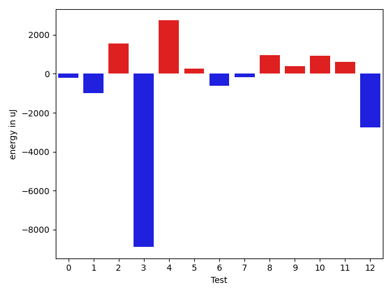

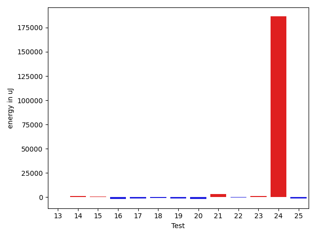

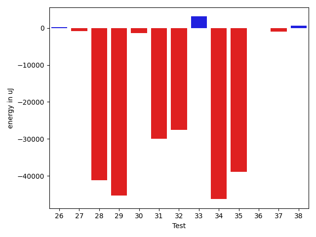

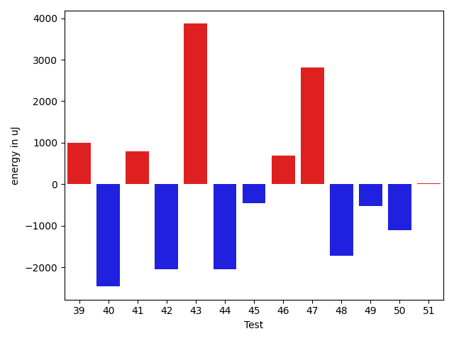

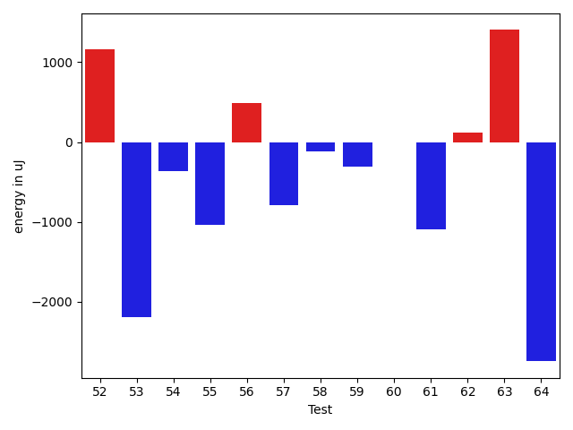

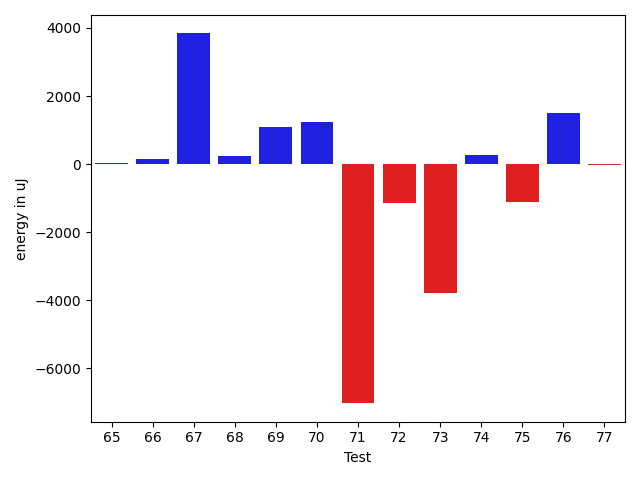

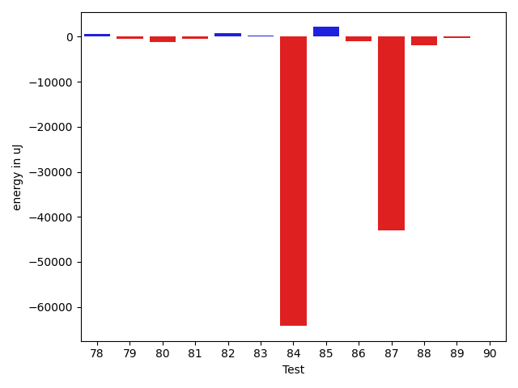

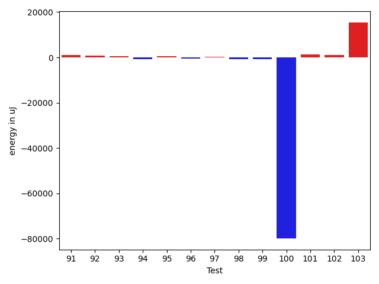

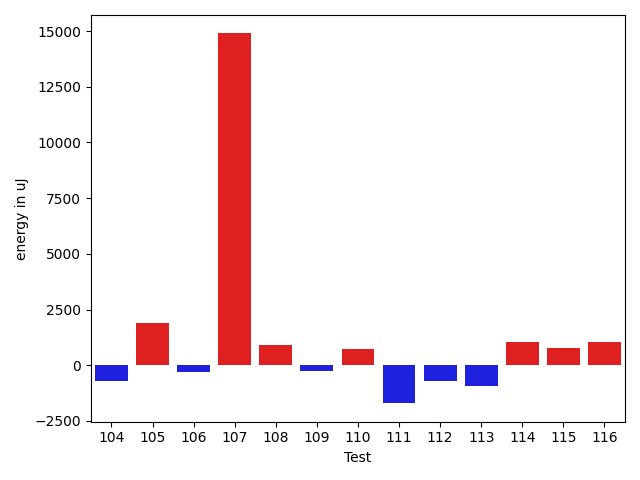

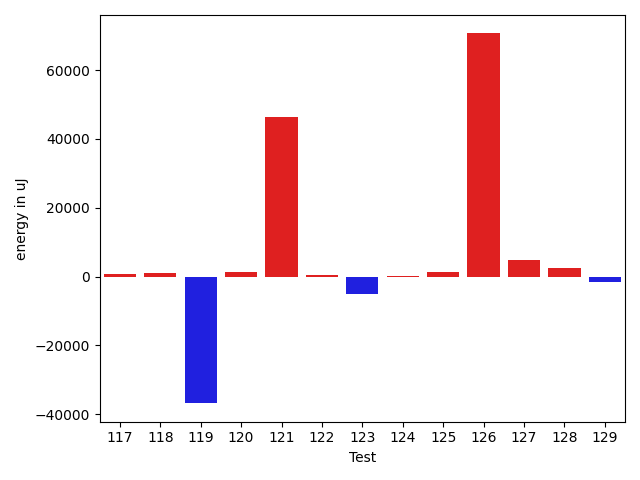

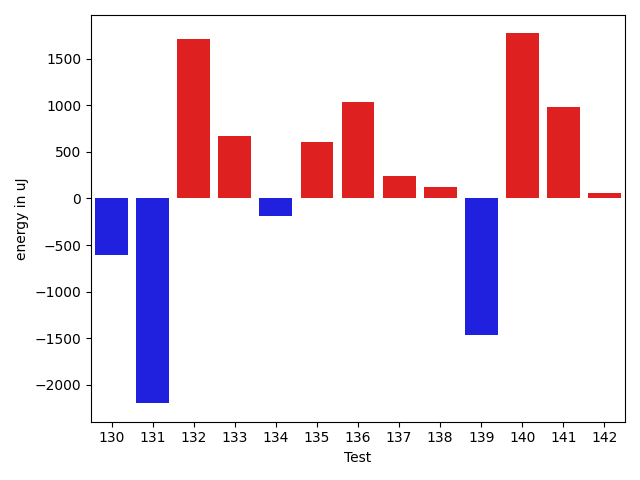

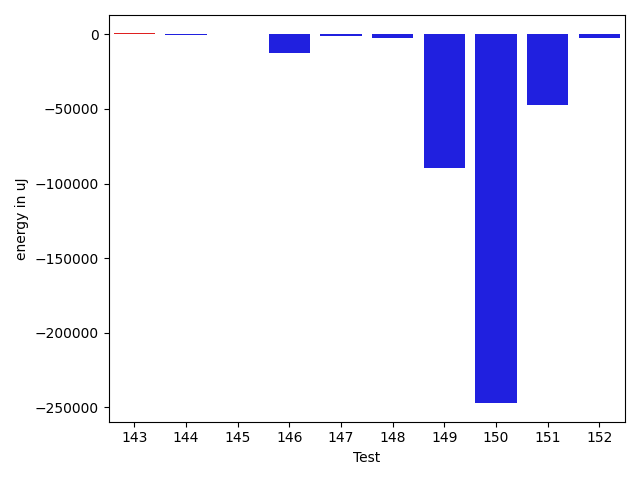

| ID | EnergyV1 | EnergyV2 | DeltaEnergy | σV1 | σV2 |
| --- | --- | --- | --- | --- | --- |
| 0 | 42824.101265822785 | 42624.51388888889 | -199.58737693389412 | 10691.259891411048 | 10397.152514822208 |
| 1 | 40257.254237288136 | 39255.61666666667 | -1001.6375706214676 | 3954.9996532739797 | 4354.760361151409 |
| 2 | 39963.49152542373 | 41527.338461538464 | 1563.8469361147363 | 4575.671651625311 | 7587.518692972888 |
| 3 | 155923.71830985916 | 147032.46478873238 | -8891.253521126782 | 400293.17678358953 | 363968.0750392788 |
| 4 | 91756.55555555556 | 94490.14141414141 | 2733.5858585858514 | 23076.99391616051 | 23959.173599604004 |
| 5 | 40734.1186440678 | 40992.23333333333 | 258.1146892655306 | 4462.917435576312 | 4871.277164381249 |
| 6 | 40807.206896551725 | 40179.11111111111 | -628.0957854406151 | 4434.284270508215 | 3882.235966394294 |
| 7 | 40097.74074074074 | 39934.775862068964 | -162.96487867177348 | 5203.818577221585 | 4480.469202812178 |
| 8 | 39756.69642857143 | 40713.85507246377 | 957.1586438923405 | 4881.777713086416 | 3603.5576031591154 |
| 9 | 38432.22580645161 | 38834.692307692305 | 402.4665012406913 | 4067.616332255391 | 4194.350951616406 |
| 10 | 41295.4 | 42230.98275862069 | 935.582758620687 | 8008.069082158034 | 9309.657804169668 |
| 11 | 38505.07894736842 | 39117.6875 | 612.6085526315801 | 4997.053602303425 | 4411.0969330024645 |
| 12 | 47038.81481481482 | 44277.23728813559 | -2761.577526679226 | 19063.207376625396 | 12784.767842677158 |
| 13 | 39520.09523809524 | 39754.63636363636 | 234.54112554112362 | 4349.646618429528 | 4477.216957659123 |
| 14 | 52683.93243243243 | 53948.887323943665 | 1264.9548915112318 | 31002.855066141758 | 33065.25375573226 |
| 15 | 49496.409638554214 | 50157.0625 | 660.6528614457857 | 18875.198124571696 | 19730.917839994006 |
| 16 | 41279.90476190476 | 39306.5 | -1973.4047619047633 | 3943.913000160432 | 5053.73358608177 |
| 17 | 41060.7037037037 | 39853.13636363636 | -1207.5673400673404 | 4544.346156080386 | 4091.528101904921 |
| 18 | 40413.97142857143 | 39358.892857142855 | -1055.078571428574 | 3681.9227545689014 | 3955.647277169383 |
| 19 | 39739.825 | 38434.354838709674 | -1305.4701612903227 | 4588.826516046885 | 5598.774759674957 |
| 20 | 41869.954545454544 | 39858.9 | -2011.0545454545427 | 4271.594900963091 | 4552.230864092901 |
| 21 | 61973.72826086957 | 65176.57777777778 | 3202.849516908209 | 43633.88301839653 | 41837.75317102373 |
| 22 | 41182.56140350877 | 40582.2 | -600.361403508774 | 4539.6729769288095 | 6595.72937285938 |
| 23 | 40241.38333333333 | 41384.19607843137 | 1142.8127450980392 | 6199.215160248557 | 8985.276870088172 |
| 24 | 74344.25373134328 | 260776.828125 | 186432.57439365672 | 262479.44057491 | 676421.9536402686 |
| 25 | 50102.58823529412 | 48618.08 | -1484.5082352941172 | 19702.790410942016 | 16722.432632253796 |
| 26 | 39921.03448275862 | 40142.7 | 221.6655172413739 | 4925.920543990484 | 5118.071825404563 |
| 27 | 39958.681818181816 | 39132.92307692308 | -825.7587412587382 | 4849.249505067428 | 4352.101003874909 |
| 28 | 148047.54545454544 | 106937.70707070707 | -41109.838383838374 | 28538.586317395067 | 22250.691061905785 |
| 29 | 287581.595959596 | 242249.78787878787 | -45331.808080808114 | 54455.05492149851 | 47297.283925322605 |
| 30 | 41207.21428571428 | 39870.205882352944 | -1337.0084033613384 | 4470.762066368734 | 3574.9400141360807 |
| 31 | 125107.59595959596 | 95218.93939393939 | -29888.656565656565 | 17905.96617569787 | 22682.21623184661 |
| 32 | 128192.66666666667 | 100688.60606060606 | -27504.060606060608 | 20307.86132252604 | 27214.12087253626 |
| 33 | 118896.85858585859 | 121975.65656565657 | 3078.7979797979788 | 26235.58308824109 | 28164.374935336567 |
| 34 | 165712.42424242425 | 119462.12121212122 | -46250.30303030304 | 28131.34709924141 | 23711.15039290596 |
| 35 | 168473.21212121213 | 129571.11111111111 | -38902.10101010102 | 28409.959253282756 | 24950.535381348778 |
| 36 | 38864.0625 | 38843.30434782609 | -20.758152173912094 | 5293.200768069708 | 4003.7643692859483 |
| 37 | 39501.48387096774 | 38446.30952380953 | -1055.1743471582158 | 4519.063511827799 | 4277.8523065407435 |
| 38 | 46528.063829787236 | 47200.0 | 671.9361702127644 | 11787.641395833894 | 16619.40003776865 |
| 39 | 38959.57894736842 | 39965.41176470588 | 1005.8328173374612 | 4986.7506276847935 | 4058.0086475254097 |
| 40 | 42855.458333333336 | 40391.29824561404 | -2464.1600877192977 | 9389.10115497026 | 6716.530884435496 |
| 41 | 40627.0 | 41419.380952380954 | 792.3809523809541 | 3762.5660392875498 | 3840.5928172885774 |
| 42 | 40846.36363636364 | 38789.23809523809 | -2057.125541125548 | 4716.711051198267 | 3917.281332576045 |
| 43 | 31678.0 | 35542.666666666664 | 3864.6666666666642 | 0.0 | 2686.756698243359 |
| 44 | 41004.18518518518 | 38955.53571428572 | -2048.649470899465 | 3887.7722749670847 | 4838.241449137595 |
| 45 | 40355.0 | 39894.51219512195 | -460.487804878052 | 3923.142732555113 | 4248.735054922165 |
| 46 | 39104.02272727273 | 39786.02040816326 | 681.997680890534 | 3713.861611270039 | 4408.701731662869 |
| 47 | 40626.1724137931 | 43430.857142857145 | 2804.6847290640435 | 4235.115681105116 | 8730.764420172165 |
| 48 | 40881.15555555555 | 39158.76 | -1722.3955555555513 | 4289.528422439182 | 3933.655361416402 |
| 49 | 40900.05454545454 | 40370.11475409836 | -529.9397913561843 | 7011.713623821163 | 6174.763658046608 |
| 50 | 40381.769230769234 | 39274.0625 | -1107.7067307692341 | 3301.5652617379524 | 4956.242717128949 |
| 51 | 39683.642857142855 | 39709.475 | 25.83214285714348 | 3571.3614072255987 | 4114.953158831216 |
| 52 | 55190.57142857143 | 58062.232323232325 | 2871.6608946608976 | 23980.092142509908 | 24414.222476000377 |
| 53 | 40568.55882352941 | 39062.25581395349 | -1506.303009575924 | 4598.745463142649 | 4014.429039845463 |
| 54 | 40542.89361702128 | 39963.2037037037 | -579.6899133175757 | 4070.177926133547 | 4553.112559230588 |
| 55 | 41153.434782608696 | 38848.75 | -2304.684782608696 | 3284.797840726632 | 4636.255634938609 |
| 56 | 49252.41860465116 | 59861.232558139534 | 10608.813953488374 | 30365.0710561226 | 46473.29064263923 |
| 57 | 40517.75 | 39623.30952380953 | -894.4404761904734 | 3187.6889551836766 | 4068.3679627567476 |
| 58 | 123645.81818181818 | 349585.81481481483 | 225939.99663299666 | 322981.5687357365 | 578095.6409240691 |
| 59 | 59880.9587628866 | 57649.18947368421 | -2231.7692892023915 | 28035.94176918082 | 24757.72598701889 |
| 60 | 40638.9 | 41717.467741935485 | 1078.5677419354834 | 5757.219728678567 | 7502.314220846408 |
| 61 | 44860.75903614458 | 40952.819444444445 | -3907.939591700131 | 11351.95926891659 | 5131.361551301708 |
| 62 | 40242.07272727273 | 40904.96226415094 | 662.8895368782105 | 4824.330000979111 | 4349.978199738322 |
| 63 | 38926.84444444445 | 39611.846153846156 | 685.0017094017094 | 4709.100314901188 | 4428.995195060593 |
| 64 | 43472.782608695656 | 44193.671428571426 | 720.8888198757704 | 10376.549272653867 | 18784.478012232354 |
| 65 | 47897.63291139241 | 47936.964705882354 | 39.33179448994633 | 16624.15062581553 | 15047.314102677481 |
| 66 | 41651.41891891892 | 41813.72727272727 | 162.30835380835197 | 7774.730088313585 | 8385.62025621623 |
| 67 | 42186.05882352941 | 46022.84 | 3836.781176470584 | 6772.971130731053 | 8782.592199026434 |
| 68 | 40881.15 | 41125.44 | 244.29000000000087 | 4245.611078219483 | 5362.810718867486 |
| 69 | 40570.857142857145 | 41649.555555555555 | 1078.6984126984098 | 5116.118769663789 | 5761.969187142556 |
| 70 | 39587.44 | 40836.67857142857 | 1249.2385714285701 | 4304.524838632018 | 5166.548751712939 |
| 71 | 67935.03278688525 | 60912.90909090909 | -7022.123695976159 | 41906.515274572055 | 36890.33809439822 |
| 72 | 41200.51612903226 | 40055.3 | -1145.2161290322547 | 4370.269511663848 | 5180.765279055467 |
| 73 | 53900.54054054054 | 50104.242424242424 | -3796.298116298116 | 24780.655022203056 | 18052.366566976838 |
| 74 | 41371.0 | 41644.769230769234 | 273.7692307692341 | 4386.943582951575 | 4238.215329300152 |
| 75 | 40051.89473684211 | 38936.88888888889 | -1115.0058479532163 | 4542.108887599944 | 4815.594619900005 |
| 76 | 39012.0 | 40511.21052631579 | 1499.2105263157864 | 4510.237841988419 | 5013.425896414204 |
| 77 | 39746.541666666664 | 39714.47368421053 | -32.06798245613754 | 4274.766845290773 | 5453.5021231500605 |
| 78 | 40134.16 | 40800.0 | 665.8399999999965 | 4800.319236717491 | 4014.1726653819965 |
| 79 | 41169.08620689655 | 40707.29508196721 | -461.7911249293393 | 3827.5247078392713 | 3683.5806544063616 |
| 80 | 44398.76136363636 | 43233.83908045977 | -1164.9222831765874 | 11807.041659529743 | 11143.821913852898 |
| 81 | 46831.83606557377 | 46317.74603174603 | -514.0900338277424 | 18149.545377660248 | 15937.976721254368 |
| 82 | 39267.5 | 40087.53703703704 | 820.0370370370365 | 4905.364048671617 | 3803.4481466406 |
| 83 | 60368.0 | 60602.24444444444 | 234.2444444444409 | 38374.40541047044 | 38148.1177477448 |
| 84 | 205161.06896551725 | 140917.76744186046 | -64243.30152365679 | 594474.4403871022 | 437956.0965720958 |
| 85 | 118442.9898989899 | 120587.33333333333 | 2144.3434343434346 | 170458.66897964748 | 159321.7379576259 |
| 86 | 40810.21212121212 | 39728.625 | -1081.58712121212 | 4339.87215115122 | 4184.774703339277 |
| 87 | 189871.15492957746 | 146892.65217391305 | -42978.502755664405 | 360591.52405498945 | 257568.65308674984 |
| 88 | 70509.11842105263 | 68624.93670886075 | -1884.181712191872 | 46634.78987272076 | 45134.57047775224 |
| 89 | 40956.305555555555 | 40629.6129032258 | -326.6926523297516 | 4561.302548002443 | 3983.7178264937174 |
| 90 | 40018.046875 | 40029.22222222222 | 11.175347222218988 | 5525.378687332456 | 5742.947648781854 |
| 91 | 43828.681818181816 | 44891.90217391304 | 1063.2203557312241 | 12058.078926543827 | 14034.304212132887 |
| 92 | 40087.4358974359 | 40965.767441860466 | 878.3315444245673 | 4213.8815944500275 | 3959.290950364427 |
| 93 | 39851.46428571428 | 40487.73529411765 | 636.2710084033679 | 3509.9101482409046 | 4270.212174841678 |
| 94 | 40114.32352941176 | 39268.142857142855 | -846.1806722689071 | 4182.502014489781 | 4445.628036254798 |
| 95 | 39683.607142857145 | 40243.96428571428 | 560.3571428571377 | 4053.7619066323155 | 3658.470752749636 |
| 96 | 40333.28571428572 | 39879.294117647056 | -453.9915966386616 | 3984.8253668237003 | 4838.913286663416 |
| 97 | 40487.10344827586 | 40742.17391304348 | 255.07046476761752 | 4205.833947767672 | 5098.436398434787 |
| 98 | 40322.02127659575 | 39642.93023255814 | -679.0910440376101 | 3880.707604314657 | 3769.34700652482 |
| 99 | 41185.37254901961 | 40398.72340425532 | -786.6491447642911 | 8743.957927263618 | 8007.318423027156 |
| 100 | 286972.8591549296 | 206917.77027027027 | -80055.08888465932 | 729113.8820941312 | 571438.9057637993 |
| 101 | 38804.72222222222 | 40007.54054054054 | 1202.818318318321 | 5436.573622804425 | 4911.684186269895 |
| 102 | 41704.10526315789 | 42637.28571428572 | 933.1804511278242 | 7994.419974317197 | 12782.635747492035 |
| 103 | 108602.83838383839 | 124085.33333333333 | 15482.49494949494 | 32911.06914361641 | 42494.32304188265 |
| 104 | 45751.5 | 41370.217391304344 | -4381.282608695656 | 12190.824903464207 | 6737.380854518169 |
| 105 | 40875.0 | 42131.71428571428 | 1256.7142857142826 | 3833.3241318730147 | 5013.736095234078 |
| 106 | 41538.607142857145 | 39929.95081967213 | -1608.656323185016 | 8050.645858471256 | 4063.2749305844086 |
| 107 | 314302.4747474748 | 272084.1414141414 | -42218.33333333337 | 404799.2483775347 | 276989.3143619575 |
| 108 | 39721.32653061225 | 40436.75925925926 | 715.4327286470143 | 4786.748960167378 | 4064.117798376534 |
| 109 | 59032.06122448979 | 52291.48936170213 | -6740.571862787663 | 38295.97646921861 | 30495.609471132797 |
| 110 | 40331.04285714286 | 41861.82666666667 | 1530.7838095238112 | 6381.038714001965 | 9203.098242618564 |
| 111 | 44484.33766233766 | 42590.32098765432 | -1894.016674683342 | 12908.322652620904 | 8507.712452881651 |
| 112 | 40410.93548387097 | 39578.26190476191 | -832.6735791090614 | 4381.085488820527 | 4661.37198819814 |
| 113 | 41718.16216216216 | 40600.75 | -1117.4121621621598 | 4174.783875380361 | 4423.8530466561715 |
| 114 | 39805.055555555555 | 40713.48717948718 | 908.4316239316249 | 4403.165199568528 | 4904.263068987596 |
| 115 | 133303.75824175825 | 56630.15730337079 | -76673.60093838745 | 422758.62856196077 | 33896.08427449688 |
| 116 | 41130.53488372093 | 41283.295454545456 | 152.76057082452462 | 6585.1968533689505 | 3602.29103601599 |
| 117 | 40466.21875 | 41188.84 | 722.6212499999965 | 4395.319326669956 | 4656.8287035707035 |
| 118 | 40220.03448275862 | 41255.69841269841 | 1035.6639299397866 | 4512.748955652416 | 4672.115049528345 |
| 119 | 255549.88888888888 | 218743.88888888888 | -36806.0 | 471840.26599331695 | 394227.54541792255 |
| 120 | 40782.7 | 42238.92537313433 | 1456.2253731343299 | 7552.7685999430505 | 8412.50932502809 |
| 121 | 124465.17171717172 | 170947.37373737374 | 46482.20202020202 | 221319.80369322776 | 399504.2505382553 |
| 122 | 62196.5306122449 | 62633.72448979592 | 437.1938775510207 | 24345.027269634902 | 30412.733918602025 |
| 123 | 51251.17857142857 | 46239.35 | -5011.828571428574 | 20439.4520632693 | 17414.608822121158 |
| 124 | 44797.27848101266 | 45084.32467532468 | 287.0461943120172 | 12063.618653250605 | 10878.963544551329 |
| 125 | 44685.506493506495 | 46100.73417721519 | 1415.2276837086974 | 11921.072248277802 | 14697.102300904839 |
| 126 | 179879.32323232322 | 250541.9292929293 | 70662.60606060608 | 425206.3199607719 | 554564.5301132613 |
| 127 | 50099.06349206349 | 54833.08955223881 | 4734.026060175318 | 30320.29977438658 | 23499.913022215256 |
| 128 | 47485.941860465115 | 49849.91463414634 | 2363.9727736812274 | 15480.896264357 | 15867.01513587168 |
| 129 | 42563.24528301887 | 40942.49180327869 | -1620.7534797401822 | 6268.349215162829 | 6292.499421632416 |
| 130 | 42365.755102040814 | 40322.82608695652 | -2042.9290150842935 | 5733.8880192741835 | 4555.003728840873 |
| 131 | 155661.45454545456 | 219021.9393939394 | 63360.48484848483 | 235211.29245864472 | 462367.37644627836 |
| 132 | 40535.40243902439 | 41879.54285714286 | 1344.1404181184698 | 7361.082104736842 | 7608.028807376951 |
| 133 | 48305.45918367347 | 47527.24731182796 | -778.2118718455094 | 15660.063146697015 | 15497.612957821917 |
| 134 | 54599.9 | 59643.318681318684 | 5043.4186813186825 | 32049.08557754288 | 43686.04475540181 |
| 135 | 41308.25 | 43401.40449438202 | 2093.154494382019 | 9250.329569374566 | 11315.349461324202 |
| 136 | 99169.19117647059 | 70963.34782608696 | -28205.843350383628 | 271850.02694096183 | 44334.00367134904 |
| 137 | 41742.833333333336 | 41973.76666666667 | 230.9333333333343 | 5789.5958672048555 | 5274.438637955281 |
| 138 | 127559.37037037036 | 132885.11111111112 | 5325.740740740759 | 401464.9311754573 | 410465.4213653406 |
| 139 | 55317.53488372093 | 50229.72727272727 | -5087.807610993659 | 23232.430542739214 | 19363.19978295712 |
| 140 | 74071.78787878787 | 77875.0808080808 | 3803.292929292933 | 26203.525027833522 | 27237.237075900775 |
| 141 | 64800.606060606064 | 69858.34146341463 | 5057.735402808568 | 36128.72790113018 | 41193.49414925694 |
| 142 | 120099.55102040817 | 177574.4090909091 | 57474.85807050092 | 323786.39652974426 | 455359.83281632833 |
| 143 | 40231.08823529412 | 40848.566666666666 | 617.4784313725468 | 4881.8509650700835 | 6350.396432157252 |
| 144 | 40626.05882352941 | 40352.75862068965 | -273.30020283976046 | 3916.2786728728356 | 3812.4828334733693 |
| 145 | 40458.22580645161 | 40982.15151515151 | 523.9257086998987 | 4552.2625477722795 | 4325.313575048371 |
| 146 | 185273.734375 | 173098.015625 | -12175.71875 | 545731.6746112575 | 493700.81180544855 |
| 147 | 43286.651162790695 | 42234.95918367347 | -1051.6919791172259 | 7142.687142980479 | 5721.524521967627 |
| 148 | 44016.04 | 41514.055555555555 | -2501.984444444446 | 7262.880158614762 | 5888.981391569081 |
| 149 | 371685.6666666667 | 281951.0 | -89734.66666666669 | 682804.509520309 | 629500.6501498827 |
| 150 | 288105.6666666667 | 40765.52380952381 | -247340.14285714287 | 632873.4918243578 | 5099.199261313091 |
| 151 | 315891.04761904763 | 268468.48 | -47422.56761904765 | 677130.864816394 | 618910.0210376381 |
| 152 | 43923.75 | 41447.03571428572 | -2476.7142857142826 | 5735.335089382311 | 4825.352507346282 |

## Delta Duration per test method

| ID | DurationV1 | DurationsV2 | DeltaDuration |
| --- | --- | --- | --- |
| 0 | 1139061.9367088608 | 1183797.9722222222 | 44736.03551336145 |
| 1 | 924476.6271186441 | 902537.5333333333 | -21939.093785310746 |
| 2 | 1034628.7118644068 | 952014.6615384616 | -82614.05032594525 |
| 3 | 4805596.309859155 | 4401997.450704225 | -403598.8591549294 |
| 4 | 2608633.1616161615 | 2630328.525252525 | 21695.363636363763 |
| 5 | 941670.4237288135 | 921754.5833333334 | -19915.84039548016 |
| 6 | 869281.5862068966 | 834802.1666666666 | -34479.41954022995 |
| 7 | 859736.1111111111 | 826082.7068965518 | -33653.404214559356 |
| 8 | 902225.8571428572 | 873032.0144927537 | -29193.8426501035 |
| 9 | 627826.7096774194 | 572587.8461538461 | -55238.863523573265 |
| 10 | 974638.3384615384 | 971183.8275862068 | -3454.510875331587 |
| 11 | 690856.552631579 | 670395.8125 | -20460.74013157899 |
| 12 | 1110397.037037037 | 1030353.7118644068 | -80043.32517263026 |
| 13 | 683170.880952381 | 674874.2045454546 | -8296.676406926359 |
| 14 | 1381001.0810810812 | 1386977.2253521127 | 5976.144271031488 |
| 15 | 1354459.156626506 | 1351922.35 | -2536.806626505917 |
| 16 | 660660.4523809524 | 745058.1818181818 | 84397.72943722934 |
| 17 | 501387.037037037 | 499216.63636363635 | -2170.400673400669 |
| 18 | 573393.9142857143 | 571570.6785714285 | -1823.2357142857509 |
| 19 | 602418.025 | 628944.4193548387 | 26526.394354838645 |
| 20 | 701338.7954545454 | 802404.475 | 101065.67954545456 |
| 21 | 1749645.5760869565 | 1928979.8333333333 | 179334.2572463767 |
| 22 | 882628.8596491228 | 950790.35 | 68161.49035087717 |
| 23 | 854010.0 | 1026423.1764705882 | 172413.1764705882 |
| 24 | 2089802.9402985075 | 7577770.53125 | 5487967.590951493 |
| 25 | 1290283.0735294118 | 1339769.3733333333 | 49486.29980392149 |
| 26 | 454704.8275862069 | 427228.75 | -27476.0775862069 |
| 27 | 440128.95454545453 | 418838.46153846156 | -21290.49300699297 |
| 28 | 3985854.0505050505 | 3030834.707070707 | -955019.3434343436 |
| 29 | 7654740.565656566 | 6468442.292929293 | -1186298.2727272734 |
| 30 | 497669.9285714286 | 512472.14705882355 | 14802.218487394974 |
| 31 | 3324829.757575758 | 2683464.242424242 | -641365.5151515156 |
| 32 | 3482671.515151515 | 2815144.626262626 | -667526.888888889 |
| 33 | 3284164.373737374 | 3361249.525252525 | 77085.15151515137 |
| 34 | 4414866.060606061 | 3321075.9494949495 | -1093790.111111111 |
| 35 | 4436672.181818182 | 3556069.4545454546 | -880602.7272727271 |
| 36 | 604573.09375 | 637861.1521739131 | 33288.058423913084 |
| 37 | 590080.2580645161 | 580815.1428571428 | -9265.115207373281 |
| 38 | 1060712.8085106383 | 1268780.076923077 | 208067.2684124387 |
| 39 | 589289.7894736842 | 570377.2647058824 | -18912.524767801748 |
| 40 | 906937.3958333334 | 1050461.8596491227 | 143524.46381578932 |
| 41 | 550312.3 | 556961.2380952381 | 6648.93809523806 |
| 42 | 573855.3636363636 | 579925.8095238095 | 6070.445887445821 |
| 43 | 1009027.0 | 927626.6666666666 | -81400.33333333337 |
| 44 | 580045.3703703703 | 528892.6428571428 | -51152.727513227495 |
| 45 | 720455.175 | 689832.5853658536 | -30622.589634146425 |
| 46 | 737981.4545454546 | 769874.3673469388 | 31892.912801484228 |
| 47 | 560981.8275862068 | 761082.619047619 | 200100.7914614122 |
| 48 | 705854.8444444444 | 696526.98 | -9327.864444444422 |
| 49 | 915621.1272727273 | 968642.262295082 | 53021.13502235466 |
| 50 | 664926.0769230769 | 758095.0 | 93168.92307692312 |
| 51 | 610563.3571428572 | 637016.075 | 26452.717857142794 |
| 52 | 1657283.612244898 | 1713468.797979798 | 56185.18573489995 |
| 53 | 666250.3529411765 | 676547.976744186 | 10297.623803009512 |
| 54 | 824700.5106382979 | 833330.8888888889 | 8630.378250590991 |
| 55 | 527518.5652173914 | 553026.40625 | 25507.841032608645 |
| 56 | 1002023.976744186 | 1514863.9767441861 | 512840.0000000001 |
| 57 | 713026.0 | 742618.0714285715 | 29592.07142857148 |
| 58 | 3393194.606060606 | 11008841.962962963 | 7615647.356902357 |
| 59 | 1741698.268041237 | 1579593.9052631578 | -162104.36277807923 |
| 60 | 1042051.9285714285 | 996563.6129032258 | -45488.315668202704 |
| 61 | 1130485.156626506 | 1079983.361111111 | -50501.795515395 |
| 62 | 844091.490909091 | 771754.5094339623 | -72336.98147512868 |
| 63 | 797563.2888888889 | 723379.0256410256 | -74184.26324786327 |
| 64 | 1196435.956521739 | 1139096.4142857143 | -57339.54223602475 |
| 65 | 1246763.3924050634 | 1289834.4705882352 | 43071.078183171805 |
| 66 | 1172601.2297297297 | 1224358.4285714286 | 51757.19884169893 |
| 67 | 699770.0 | 1018956.92 | 319186.92000000004 |
| 68 | 480202.9 | 519494.0 | 39291.09999999998 |
| 69 | 512752.0 | 467423.6666666667 | -45328.333333333314 |
| 70 | 553252.76 | 458269.8214285714 | -94982.93857142859 |
| 71 | 1687625.950819672 | 1449939.6136363635 | -237686.33718330855 |
| 72 | 647398.9677419355 | 569217.9 | -78181.06774193549 |
| 73 | 1304324.6216216215 | 987512.3939393939 | -316812.2276822276 |
| 74 | 488969.29411764705 | 470941.96153846156 | -18027.332579185488 |
| 75 | 496634.0 | 474611.3333333333 | -22022.666666666686 |
| 76 | 617435.7391304348 | 503480.94736842107 | -113954.79176201375 |
| 77 | 510175.0 | 516248.7894736842 | 6073.789473684214 |
| 78 | 580483.12 | 477196.53125 | -103286.58875 |
| 79 | 935862.9827586206 | 929725.9508196721 | -6137.031938948552 |
| 80 | 1216958.6818181819 | 1213099.551724138 | -3859.1300940439105 |
| 81 | 1119166.2295081967 | 1161192.6984126985 | 42026.46890450176 |
| 82 | 846758.76 | 853480.5555555555 | 6721.7955555554945 |
| 83 | 1418352.517857143 | 1758797.4222222222 | 340444.90436507924 |
| 84 | 5955342.954022989 | 4081853.8372093025 | -1873489.1168136862 |
| 85 | 3324085.9494949495 | 3387983.212121212 | 63897.26262626238 |
| 86 | 605179.6060606061 | 636045.0416666666 | 30865.43560606055 |
| 87 | 5246520.887323944 | 4060722.492753623 | -1185798.3945703208 |
| 88 | 1864855.6973684211 | 1903373.6202531646 | 38517.92288474343 |
| 89 | 612985.8888888889 | 613306.0 | 320.11111111112405 |
| 90 | 940906.3125 | 965745.0793650794 | 24838.766865079408 |
| 91 | 1272546.0 | 1307903.641304348 | 35357.6413043479 |
| 92 | 724906.6923076923 | 693528.6279069767 | -31378.06440071552 |
| 93 | 590974.5 | 610035.5588235294 | 19061.058823529398 |
| 94 | 621914.0 | 631810.6285714286 | 9896.628571428591 |
| 95 | 555373.4285714285 | 556006.6071428572 | 633.178571428638 |
| 96 | 680960.8214285715 | 712866.7647058824 | 31905.94327731093 |
| 97 | 577042.4137931034 | 601263.2608695652 | 24220.847076461767 |
| 98 | 801054.4255319149 | 847851.0697674418 | 46796.64423552691 |
| 99 | 940662.2352941176 | 914038.340425532 | -26623.89486858563 |
| 100 | 8230140.126760564 | 5978593.513513514 | -2251546.61324705 |
| 101 | 760039.5555555555 | 797594.0810810811 | 37554.52552552556 |
| 102 | 1033583.6666666666 | 1063063.3265306123 | 29479.65986394568 |
| 103 | 2949462.090909091 | 3350767.8080808083 | 401305.71717171744 |
| 104 | 1194003.75 | 1061926.3333333333 | -132077.41666666674 |
| 105 | 451972.7 | 499401.9285714286 | 47429.22857142857 |
| 106 | 997126.2142857143 | 930627.1475409836 | -66499.06674473069 |
| 107 | 8589941.1010101 | 7311004.111111111 | -1278936.98989899 |
| 108 | 912551.9591836735 | 880345.9814814815 | -32205.97770219203 |
| 109 | 1433065.3469387756 | 1310544.6170212766 | -122520.729917499 |
| 110 | 1029783.6571428571 | 1001806.2666666667 | -27977.39047619037 |
| 111 | 1226847.7532467532 | 1178130.5679012346 | -48717.185345518636 |
| 112 | 781962.1612903225 | 747058.5 | -34903.66129032255 |
| 113 | 687117.1891891892 | 700670.8409090909 | 13553.65171990171 |
| 114 | 717939.5277777778 | 709446.2564102564 | -8493.271367521374 |
| 115 | 3931151.4285714286 | 1540915.9662921347 | -2390235.4622792937 |
| 116 | 812633.8139534884 | 760885.5454545454 | -51748.268498942954 |
| 117 | 601743.90625 | 616195.6 | 14451.693749999977 |
| 118 | 887132.775862069 | 869860.5714285715 | -17272.204433497507 |
| 119 | 7252258.484848484 | 6049764.414141414 | -1202494.0707070706 |
| 120 | 1051420.2857142857 | 1067014.8507462686 | 15594.565031982958 |
| 121 | 3569640.909090909 | 4756741.202020202 | 1187100.2929292927 |
| 122 | 1821074.030612245 | 1839533.5714285714 | 18459.540816326393 |
| 123 | 1515349.4166666667 | 1276731.875 | -238617.54166666674 |
| 124 | 1205392.2278481012 | 1277405.2987012987 | 72013.07085319748 |
| 125 | 1181086.3376623376 | 1236549.4683544303 | 55463.1306920927 |
| 126 | 5099433.696969697 | 7194422.545454546 | 2094988.8484848486 |
| 127 | 1261646.2857142857 | 1373764.223880597 | 112117.93816631124 |
| 128 | 1283059.4767441861 | 1384442.768292683 | 101383.29154849681 |
| 129 | 967037.716981132 | 1044844.7868852459 | 77807.06990411389 |
| 130 | 792809.8367346938 | 886887.1521739131 | 94077.31543921924 |
| 131 | 4122561.373737374 | 6149373.898989899 | 2026812.5252525252 |
| 132 | 1103109.8414634147 | 1128188.9142857143 | 25079.072822299553 |
| 133 | 1421762.6836734693 | 1428676.1505376345 | 6913.4668641651515 |
| 134 | 1627537.3777777778 | 1781985.879120879 | 154448.50134310126 |
| 135 | 1245264.2727272727 | 1226111.8988764044 | -19152.373850868316 |
| 136 | 2748427.088235294 | 1880114.4347826086 | -868312.6534526853 |
| 137 | 965212.9333333333 | 960785.0666666667 | -4427.866666666698 |
| 138 | 3582608.5679012346 | 3840331.6666666665 | 257723.0987654319 |
| 139 | 1557123.5813953488 | 1475825.3977272727 | -81298.18366807606 |
| 140 | 2116506.98989899 | 2157386.484848485 | 40879.494949494954 |
| 141 | 1714198.2727272727 | 1702525.9512195121 | -11672.321507760556 |
| 142 | 3464484.2040816327 | 4991613.954545454 | 1527129.7504638215 |
| 143 | 834462.3529411765 | 858722.2333333333 | 24259.880392156774 |
| 144 | 660100.7352941176 | 657998.2068965518 | -2102.528397565824 |
| 145 | 648713.0645161291 | 667141.8181818182 | 18428.753665689146 |
| 146 | 5329302.34375 | 5078228.609375 | -251073.734375 |
| 147 | 932900.6744186047 | 952985.8775510204 | 20085.203132415656 |
| 148 | 717832.48 | 734974.2222222222 | 17141.742222222267 |
| 149 | 10372957.333333334 | 7031768.5 | -3341188.833333334 |
| 150 | 8730199.933333334 | 517372.4285714286 | -8212827.504761905 |
| 151 | 8558077.61904762 | 7202166.16 | -1355911.4590476193 |
| 152 | 621016.95 | 583163.5714285715 | -37853.378571428475 |

## Misc.

| ID | Test Class | Test Method |
| --- | --- | --- |
| 0 | com.google.gson.functional.CustomTypeAdaptersTest | testCustomAdapterInvokedForCollectionElementDeserialization |
| 1 | com.google.gson.functional.CustomTypeAdaptersTest | testCustomAdapterInvokedForMapElementDeserialization |
| 2 | com.google.gson.functional.CustomTypeAdaptersTest | testCustomAdapterInvokedForMapElementSerializationWithType |
| 3 | com.google.gson.functional.CustomTypeAdaptersTest | testCustomSerializers |
| 4 | com.google.gson.functional.CustomTypeAdaptersTest | testCustomTypeAdapterDoesNotAppliesToSubClasses |
| 5 | com.google.gson.functional.CustomTypeAdaptersTest | testCustomDeserializers |
| 6 | com.google.gson.functional.CustomTypeAdaptersTest | testCustomByteArrayDeserializerAndInstanceCreator |
| 7 | com.google.gson.functional.CustomTypeAdaptersTest | testCustomByteArraySerializer |
| 8 | com.google.gson.functional.CustomTypeAdaptersTest | testCustomTypeAdapterAppliesToSubClassesSerializedAsBaseClass |
| 9 | com.google.gson.functional.CustomTypeAdaptersTest | testCustomAdapterInvokedForMapElementSerialization |
| 10 | com.google.gson.functional.CustomTypeAdaptersTest | testCustomNestedDeserializers |
| 11 | com.google.gson.functional.CustomTypeAdaptersTest | testCustomAdapterInvokedForCollectionElementSerialization |
| 12 | com.google.gson.functional.CustomTypeAdaptersTest | testEnsureCustomSerializerNotInvokedForNullValues |
| 13 | com.google.gson.functional.CustomTypeAdaptersTest | testEnsureCustomDeserializerNotInvokedForNullValues |
| 14 | com.google.gson.functional.CustomTypeAdaptersTest | testCustomNestedSerializers |
| 15 | com.google.gson.functional.CustomTypeAdaptersTest | testCustomAdapterInvokedForCollectionElementSerializationWithType |
| 16 | com.google.gson.MixedStreamTest | testReaderDoesNotMutateState |
| 17 | com.google.gson.MixedStreamTest | testReadInvalidState |
| 18 | com.google.gson.MixedStreamTest | testWriteClosed |
| 19 | com.google.gson.MixedStreamTest | testWriteInvalidState |
| 20 | com.google.gson.MixedStreamTest | testWriteDoesNotMutateState |
| 21 | com.google.gson.MixedStreamTest | testWriteHtmlSafe |
| 22 | com.google.gson.MixedStreamTest | testReadMixedStreamed |
| 23 | com.google.gson.MixedStreamTest | testReadClosed |
| 24 | com.google.gson.MixedStreamTest | testWriteMixedStreamed |
| 25 | com.google.gson.MixedStreamTest | testWriteLenient |
| 26 | com.google.gson.MixedStreamTest | testWriteNulls |
| 27 | com.google.gson.MixedStreamTest | testReadNulls |
| 28 | com.google.gson.functional.DefaultTypeAdaptersTest | testDateSerializationWithPatternNotOverridenByTypeAdapter |
| 29 | com.google.gson.functional.DefaultTypeAdaptersTest | testDateSerializationWithPattern |
| 30 | com.google.gson.functional.DefaultTypeAdaptersTest | testDefaultGregorianCalendarDeserialization |
| 31 | com.google.gson.functional.DefaultTypeAdaptersTest | testSqlDateSerialization |
| 32 | com.google.gson.functional.DefaultTypeAdaptersTest | testTimestampSerialization |
| 33 | com.google.gson.functional.DefaultTypeAdaptersTest | testDefaultDateDeserializationUsingBuilder |
| 34 | com.google.gson.functional.DefaultTypeAdaptersTest | testDateDeserializationWithPattern |
| 35 | com.google.gson.functional.DefaultTypeAdaptersTest | testDateSerializationInCollection |
| 36 | com.google.gson.functional.DefaultTypeAdaptersTest | testDefaultCalendarSerialization |
| 37 | com.google.gson.functional.DefaultTypeAdaptersTest | testDefaultCalendarDeserialization |
| 38 | com.google.gson.functional.DefaultTypeAdaptersTest | testSetSerialization |
| 39 | com.google.gson.functional.DefaultTypeAdaptersTest | testDefaultGregorianCalendarSerialization |
| 40 | com.google.gson.functional.DefaultTypeAdaptersTest | testBitSetDeserialization |
| 41 | com.google.gson.functional.DefaultTypeAdaptersTest | testDefaultJavaSqlDateSerialization |
| 42 | com.google.gson.functional.DefaultTypeAdaptersTest | testBitSetSerialization |
| 43 | com.google.gson.functional.DefaultTypeAdaptersTest | testDefaultJavaSqlDateDeserialization |
| 44 | com.google.gson.functional.NullObjectAndFieldTest | testCustomTypeAdapterPassesNullSerialization |
| 45 | com.google.gson.functional.NullObjectAndFieldTest | testExplicitSerializationOfNullStringMembers |
| 46 | com.google.gson.functional.NullObjectAndFieldTest | testCustomTypeAdapterPassesNullDesrialization |
| 47 | com.google.gson.functional.NullObjectAndFieldTest | testTopLevelNullObjectDeserialization |
| 48 | com.google.gson.functional.NullObjectAndFieldTest | testExplicitSerializationOfNullCollectionMembers |
| 49 | com.google.gson.functional.NullObjectAndFieldTest | testPrintPrintingObjectWithNulls |
| 50 | com.google.gson.functional.NullObjectAndFieldTest | testPrintPrintingArraysWithNulls |
| 51 | com.google.gson.functional.NullObjectAndFieldTest | testExplicitNullSetsFieldToNullDuringDeserialization |
| 52 | com.google.gson.functional.NullObjectAndFieldTest | testExplicitSerializationOfNullArrayMembers |
| 53 | com.google.gson.functional.NullObjectAndFieldTest | testCustomSerializationOfNulls |
| 54 | com.google.gson.functional.NullObjectAndFieldTest | testNullWrappedPrimitiveMemberSerialization |
| 55 | com.google.gson.functional.NullObjectAndFieldTest | testNullWrappedPrimitiveMemberDeserialization |
| 56 | com.google.gson.functional.NullObjectAndFieldTest | testExplicitSerializationOfNulls |
| 57 | com.google.gson.functional.NullObjectAndFieldTest | testExplicitDeserializationOfNulls |
| 58 | com.google.gson.functional.NullObjectAndFieldTest | testTopLevelNullObjectSerialization |
| 59 | com.google.gson.functional.MapTest | testSerializeMaps |
| 60 | com.google.gson.functional.MapTest | testCustomSerializerForSpecificMapType |
| 61 | com.google.gson.functional.MapTest | testGeneralMapField |
| 62 | com.google.gson.functional.MapTest | testMapSerializationWithNullValueButSerializeNulls |
| 63 | com.google.gson.functional.MapTest | testMapSerializationWithNullValuesSerialized |
| 64 | com.google.gson.functional.MapTest | testMapSubclassDeserialization |
| 65 | com.google.gson.functional.ReadersWritersTest | testReadWriteTwoObjects |
| 66 | com.google.gson.functional.ReadersWritersTest | testReadWriteTwoStrings |
| 67 | com.google.gson.functional.ReadersWritersTest | testTopLevelNullObjectSerializationWithWriterAndSerializeNulls |
| 68 | com.google.gson.functional.ReadersWritersTest | testTopLevelNullObjectDeserializationWithReaderAndSerializeNulls |
| 69 | com.google.gson.functional.PrimitiveTest | testDoubleInfinitySerialization |
| 70 | com.google.gson.functional.PrimitiveTest | testLongAsStringDeserialization |
| 71 | com.google.gson.functional.PrimitiveTest | testHtmlCharacterSerialization |
| 72 | com.google.gson.functional.PrimitiveTest | testLongAsStringSerialization |
| 73 | com.google.gson.functional.PrimitiveTest | testMoreSpecificSerialization |
| 74 | com.google.gson.functional.PrimitiveTest | testNegativeInfinitySerialization |
| 75 | com.google.gson.functional.PrimitiveTest | testNegativeInfinityFloatSerialization |
| 76 | com.google.gson.functional.PrimitiveTest | testDoubleNaNSerialization |
| 77 | com.google.gson.functional.PrimitiveTest | testFloatInfinitySerialization |
| 78 | com.google.gson.functional.PrimitiveTest | testFloatNaNSerialization |
| 79 | com.google.gson.functional.CustomDeserializerTest | testCustomDeserializerReturnsNullForArrayElementsForArrayField |
| 80 | com.google.gson.functional.CustomDeserializerTest | testJsonTypeFieldBasedDeserialization |
| 81 | com.google.gson.functional.CustomDeserializerTest | testCustomDeserializerReturnsNull |
| 82 | com.google.gson.functional.CustomDeserializerTest | testCustomDeserializerReturnsNullForArrayElements |
| 83 | com.google.gson.functional.CustomDeserializerTest | testCustomDeserializerReturnsNullForTopLevelObject |
| 84 | com.google.gson.JsonParserTest | testReadWriteTwoObjects |
| 85 | com.google.gson.functional.NamingPolicyTest | testGsonWithNonDefaultFieldNamingPolicySerialization |
| 86 | com.google.gson.functional.NamingPolicyTest | testGsonWithLowerCaseDashPolicyDeserialiation |
| 87 | com.google.gson.functional.NamingPolicyTest | testGsonDuplicateNameUsingSerializedNameFieldNamingPolicySerialization |
| 88 | com.google.gson.functional.NamingPolicyTest | testGsonWithSerializedNameFieldNamingPolicySerialization |
| 89 | com.google.gson.functional.NamingPolicyTest | testGsonWithLowerCaseUnderscorePolicySerialization |
| 90 | com.google.gson.functional.NamingPolicyTest | testComplexFieldNameStrategy |
| 91 | com.google.gson.functional.NamingPolicyTest | testDeprecatedNamingStrategy |
| 92 | com.google.gson.functional.NamingPolicyTest | testGsonWithLowerCaseDashPolicySerialization |
| 93 | com.google.gson.functional.NamingPolicyTest | testGsonWithLowerCaseUnderscorePolicyDeserialiation |
| 94 | com.google.gson.functional.NamingPolicyTest | testGsonWithSerializedNameFieldNamingPolicyDeserialization |
| 95 | com.google.gson.functional.NamingPolicyTest | testGsonWithUpperCamelCaseSpacesPolicyDeserialiation |
| 96 | com.google.gson.functional.NamingPolicyTest | testGsonWithNonDefaultFieldNamingPolicyDeserialiation |
| 97 | com.google.gson.functional.NamingPolicyTest | testGsonWithUpperCamelCaseSpacesPolicySerialiation |
| 98 | com.google.gson.functional.CustomSerializerTest | testSerializerReturnsNull |
| 99 | com.google.gson.functional.CustomSerializerTest | testBaseClassSerializerInvokedForBaseClassFieldsHoldingSubClassInstances |
| 100 | com.google.gson.functional.CustomSerializerTest | testSubClassSerializerInvokedForBaseClassFieldsHoldingSubClassInstances |
| 101 | com.google.gson.functional.CustomSerializerTest | testBaseClassSerializerInvokedForBaseClassFields |
| 102 | com.google.gson.functional.CustomSerializerTest | testSubClassSerializerInvokedForBaseClassFieldsHoldingArrayOfSubClassInstances |
| 103 | com.google.gson.functional.ObjectTest | testSingletonLists |
| 104 | com.google.gson.functional.ObjectTest | testInnerClassDeserialization |
| 105 | com.google.gson.functional.ObjectTest | testJsonObjectSerialization |
| 106 | com.google.gson.functional.VersioningTest | testVersionedGsonMixingSinceAndUntilDeserialization |
| 107 | com.google.gson.functional.VersioningTest | testVersionedUntilSerialization |
| 108 | com.google.gson.functional.VersioningTest | testVersionedClassesDeserialization |
| 109 | com.google.gson.functional.VersioningTest | testVersionedGsonWithUnversionedClassesSerialization |
| 110 | com.google.gson.functional.VersioningTest | testVersionedClassesSerialization |
| 111 | com.google.gson.functional.VersioningTest | testVersionedGsonMixingSinceAndUntilSerialization |
| 112 | com.google.gson.functional.VersioningTest | testVersionedGsonWithUnversionedClassesDeserialization |
| 113 | com.google.gson.functional.VersioningTest | testVersionedUntilDeserialization |
| 114 | com.google.gson.functional.VersioningTest | testIgnoreLaterVersionClassSerialization |
| 115 | com.google.gson.functional.FieldExclusionTest | testDefaultInnerClassExclusion |
| 116 | com.google.gson.functional.FieldExclusionTest | testDefaultNestedStaticClassIncluded |
| 117 | com.google.gson.functional.FieldExclusionTest | testInnerClassExclusion |
| 118 | com.google.gson.functional.TypeHierarchyAdapterTest | testRegisterSuperTypeFirst |
| 119 | com.google.gson.functional.TypeHierarchyAdapterTest | testTypeHierarchy |
| 120 | com.google.gson.functional.TypeVariableTest | testBasicTypeVariables |
| 121 | com.google.gson.functional.TypeVariableTest | testAdvancedTypeVariables |
| 122 | com.google.gson.functional.TypeVariableTest | testTypeVariablesViaTypeParameter |
| 123 | com.google.gson.functional.EnumTest | testEnumSubclassWithRegisteredTypeAdapter |
| 124 | com.google.gson.functional.MapAsArrayTypeAdapterTest | testMultipleEnableComplexKeyRegistrationHasNoEffect |
| 125 | com.google.gson.functional.MapAsArrayTypeAdapterTest | testMapWithTypeVariableDeserialization |
| 126 | com.google.gson.functional.MapAsArrayTypeAdapterTest | testSerializeComplexMapWithTypeAdapter |
| 127 | com.google.gson.functional.MapAsArrayTypeAdapterTest | testTwoTypesCollapseToOneDeserialize |
| 128 | com.google.gson.functional.MapAsArrayTypeAdapterTest | testMapWithTypeVariableSerialization |
| 129 | com.google.gson.functional.ExclusionStrategyFunctionalTest | testExclusionStrategyWithMode |
| 130 | com.google.gson.functional.ExclusionStrategyFunctionalTest | testExclusionStrategyDeserialization |
| 131 | com.google.gson.functional.ExclusionStrategyFunctionalTest | testExclusionStrategySerialization |
| 132 | com.google.gson.functional.ParameterizedTypesTest | testParameterizedTypeWithReaderDeserialization |
| 133 | com.google.gson.functional.ParameterizedTypesTest | testParameterizedTypeWithCustomSerializer |
| 134 | com.google.gson.functional.ParameterizedTypesTest | testParameterizedTypeDeserialization |
| 135 | com.google.gson.functional.ParameterizedTypesTest | testParameterizedTypesWithCustomDeserializer |
| 136 | com.google.gson.functional.InstanceCreatorTest | testInstanceCreatorReturnsBaseType |
| 137 | com.google.gson.functional.InstanceCreatorTest | testInstanceCreatorReturnsSubTypeForTopLevelObject |
| 138 | com.google.gson.CommentsTest | testParseComments |
| 139 | com.google.gson.functional.EscapingTest | testGsonAcceptsEscapedAndNonEscapedJsonDeserialization |
| 140 | com.google.gson.functional.UncategorizedTest | testReturningDerivedClassesDuringDeserialization |
| 141 | com.google.gson.functional.SecurityTest | testJsonWithNonExectuableTokenSerialization |
| 142 | com.google.gson.functional.SecurityTest | testNonExecutableJsonSerialization |
| 143 | com.google.gson.functional.SecurityTest | testNonExecutableJsonDeserialization |
| 144 | com.google.gson.functional.SecurityTest | testJsonWithNonExectuableTokenWithRegularGsonDeserialization |
| 145 | com.google.gson.functional.SecurityTest | testJsonWithNonExectuableTokenWithConfiguredGsonDeserialization |
| 146 | com.google.gson.FunctionWithInternalDependenciesTest | testAnonymousLocalClassesSerialization |
| 147 | com.google.gson.DefaultMapJsonSerializerTest | testNonEmptyMapSerialization |
| 148 | com.google.gson.functional.ArrayTest | testNullsInArrayWithSerializeNullPropertySetSerialization |
| 149 | com.google.gson.JsonObjectTest | testPropertyWithQuotes |
| 150 | com.google.gson.JsonObjectTest | testWritePropertyWithEmptyStringName |
| 151 | com.google.gson.GsonBuilderTest | testCreatingMoreThanOnce |
| 152 | com.google.gson.functional.PrintFormattingTest | testJsonObjectWithNullValuesSerialized |

| Test | IterationV1 | IterationV2 | DeltaIteration |
| --- | --- | --- | --- |
| 0 | 79 | 72 | -7 |
| 1 | 59 | 60 | 1 |
| 2 | 59 | 65 | 6 |
| 3 | 71 | 71 | 0 |
| 4 | 99 | 99 | 0 |
| 5 | 59 | 60 | 1 |
| 6 | 58 | 54 | -4 |
| 7 | 54 | 58 | 4 |
| 8 | 56 | 69 | 13 |
| 9 | 31 | 26 | -5 |
| 10 | 65 | 58 | -7 |
| 11 | 38 | 32 | -6 |
| 12 | 54 | 59 | 5 |
| 13 | 42 | 44 | 2 |
| 14 | 74 | 71 | -3 |
| 15 | 83 | 80 | -3 |
| 16 | 42 | 44 | 2 |
| 17 | 27 | 22 | -5 |
| 18 | 35 | 28 | -7 |
| 19 | 40 | 31 | -9 |
| 20 | 44 | 40 | -4 |
| 21 | 92 | 90 | -2 |
| 22 | 57 | 60 | 3 |
| 23 | 60 | 51 | -9 |
| 24 | 67 | 64 | -3 |
| 25 | 68 | 75 | 7 |
| 26 | 29 | 20 | -9 |
| 27 | 22 | 13 | -9 |
| 28 | 99 | 99 | 0 |
| 29 | 99 | 99 | 0 |
| 30 | 14 | 34 | 20 |
| 31 | 99 | 99 | 0 |
| 32 | 99 | 99 | 0 |
| 33 | 99 | 99 | 0 |
| 34 | 99 | 99 | 0 |
| 35 | 99 | 99 | 0 |
| 36 | 32 | 46 | 14 |
| 37 | 31 | 42 | 11 |
| 38 | 47 | 52 | 5 |
| 39 | 19 | 34 | 15 |
| 40 | 48 | 57 | 9 |
| 41 | 30 | 21 | -9 |
| 42 | 22 | 21 | -1 |
| 43 | 1 | 3 | 2 |
| 44 | 27 | 28 | 1 |
| 45 | 40 | 41 | 1 |
| 46 | 44 | 49 | 5 |
| 47 | 29 | 21 | -8 |
| 48 | 45 | 50 | 5 |
| 49 | 55 | 61 | 6 |
| 50 | 26 | 32 | 6 |
| 51 | 28 | 40 | 12 |
| 52 | 98 | 99 | 1 |
| 53 | 34 | 43 | 9 |
| 54 | 47 | 54 | 7 |
| 55 | 23 | 32 | 9 |
| 56 | 43 | 43 | 0 |
| 57 | 32 | 42 | 10 |
| 58 | 33 | 27 | -6 |
| 59 | 97 | 95 | -2 |
| 60 | 70 | 62 | -8 |
| 61 | 83 | 72 | -11 |
| 62 | 55 | 53 | -2 |
| 63 | 45 | 39 | -6 |
| 64 | 69 | 70 | 1 |
| 65 | 79 | 85 | 6 |
| 66 | 74 | 77 | 3 |
| 67 | 17 | 25 | 8 |
| 68 | 20 | 25 | 5 |
| 69 | 28 | 18 | -10 |
| 70 | 25 | 28 | 3 |
| 71 | 61 | 44 | -17 |
| 72 | 31 | 30 | -1 |
| 73 | 37 | 33 | -4 |
| 74 | 17 | 26 | 9 |
| 75 | 19 | 18 | -1 |
| 76 | 23 | 19 | -4 |
| 77 | 24 | 19 | -5 |
| 78 | 25 | 32 | 7 |
| 79 | 58 | 61 | 3 |
| 80 | 88 | 87 | -1 |
| 81 | 61 | 63 | 2 |
| 82 | 50 | 54 | 4 |
| 83 | 56 | 45 | -11 |
| 84 | 87 | 86 | -1 |
| 85 | 99 | 99 | 0 |
| 86 | 33 | 24 | -9 |
| 87 | 71 | 69 | -2 |
| 88 | 76 | 79 | 3 |
| 89 | 36 | 31 | -5 |
| 90 | 64 | 63 | -1 |
| 91 | 88 | 92 | 4 |
| 92 | 39 | 43 | 4 |
| 93 | 28 | 34 | 6 |
| 94 | 34 | 35 | 1 |
| 95 | 28 | 28 | 0 |
| 96 | 28 | 34 | 6 |
| 97 | 29 | 23 | -6 |
| 98 | 47 | 43 | -4 |
| 99 | 51 | 47 | -4 |
| 100 | 71 | 74 | 3 |
| 101 | 36 | 37 | 1 |
| 102 | 57 | 49 | -8 |
| 103 | 99 | 99 | 0 |
| 104 | 52 | 69 | 17 |
| 105 | 20 | 14 | -6 |
| 106 | 56 | 61 | 5 |
| 107 | 99 | 99 | 0 |
| 108 | 49 | 54 | 5 |
| 109 | 49 | 47 | -2 |
| 110 | 70 | 75 | 5 |
| 111 | 77 | 81 | 4 |
| 112 | 31 | 42 | 11 |
| 113 | 37 | 44 | 7 |
| 114 | 36 | 39 | 3 |
| 115 | 91 | 89 | -2 |
| 116 | 43 | 44 | 1 |
| 117 | 32 | 25 | -7 |
| 118 | 58 | 63 | 5 |
| 119 | 99 | 99 | 0 |
| 120 | 70 | 67 | -3 |
| 121 | 99 | 99 | 0 |
| 122 | 98 | 98 | 0 |
| 123 | 84 | 80 | -4 |
| 124 | 79 | 77 | -2 |
| 125 | 77 | 79 | 2 |
| 126 | 99 | 99 | 0 |
| 127 | 63 | 67 | 4 |
| 128 | 86 | 82 | -4 |
| 129 | 53 | 61 | 8 |
| 130 | 49 | 46 | -3 |
| 131 | 99 | 99 | 0 |
| 132 | 82 | 70 | -12 |
| 133 | 98 | 93 | -5 |
| 134 | 90 | 91 | 1 |
| 135 | 88 | 89 | 1 |
| 136 | 68 | 69 | 1 |
| 137 | 60 | 60 | 0 |
| 138 | 81 | 72 | -9 |
| 139 | 86 | 88 | 2 |
| 140 | 99 | 99 | 0 |
| 141 | 33 | 41 | 8 |
| 142 | 49 | 44 | -5 |
| 143 | 34 | 30 | -4 |
| 144 | 34 | 29 | -5 |
| 145 | 31 | 33 | 2 |
| 146 | 64 | 64 | 0 |
| 147 | 43 | 49 | 6 |
| 148 | 25 | 18 | -7 |
| 149 | 21 | 16 | -5 |
| 150 | 15 | 21 | 6 |
| 151 | 21 | 25 | 4 |
| 152 | 20 | 28 | 8 |

| Time Label | Time (s) |
| --- | --- |
| Selection | 29.157291889190674 |
| Injection | 14.704447507858276 |
| Total | 1215.6525557041168 |

