# gson 440224

https://github.com/google/gson/commit/440224

## Delta Energy per test method

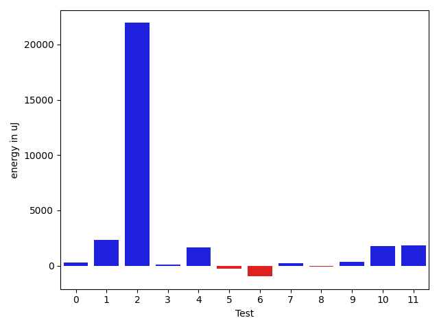

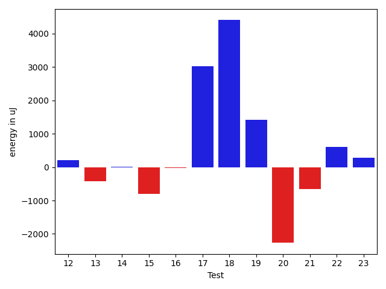

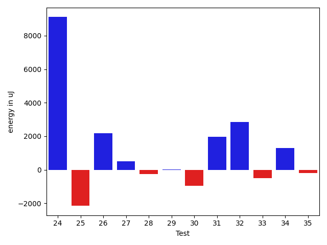

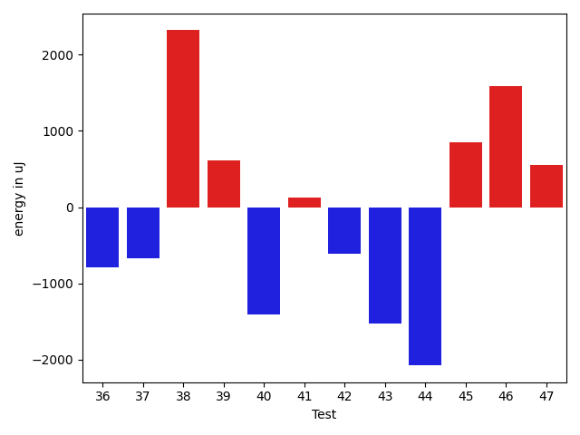

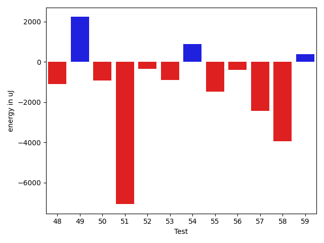

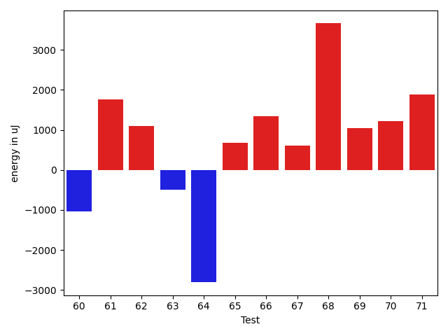

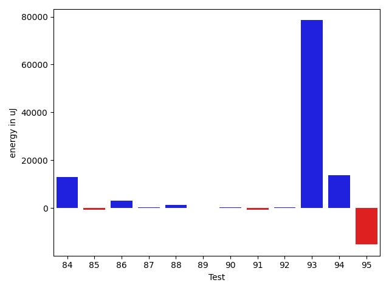

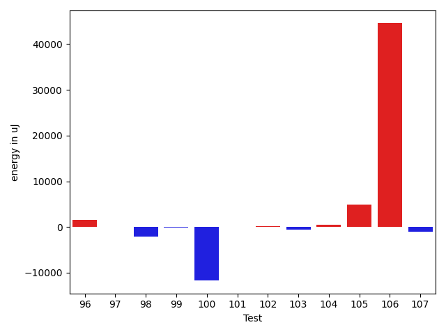

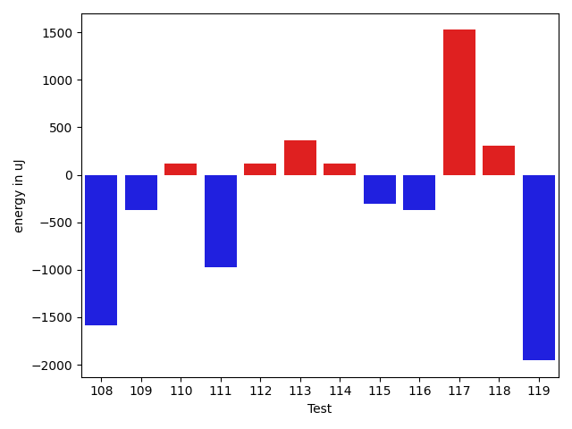

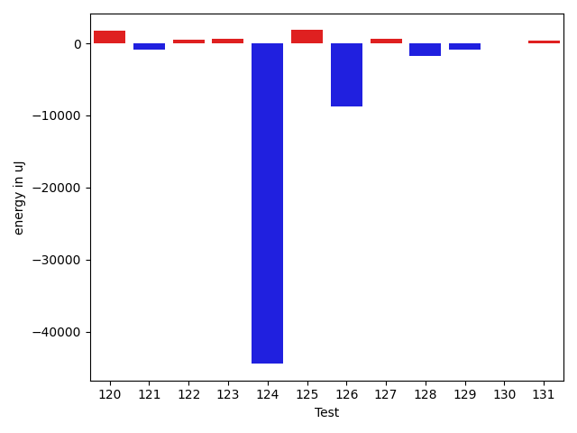

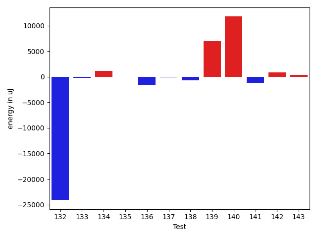

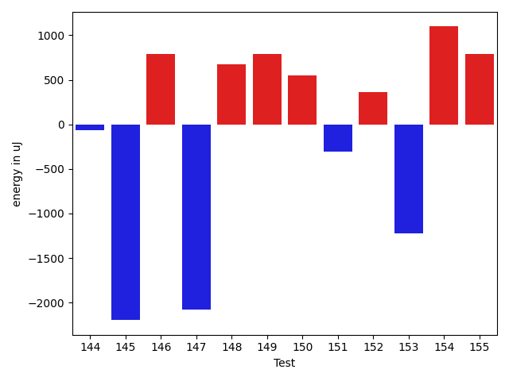

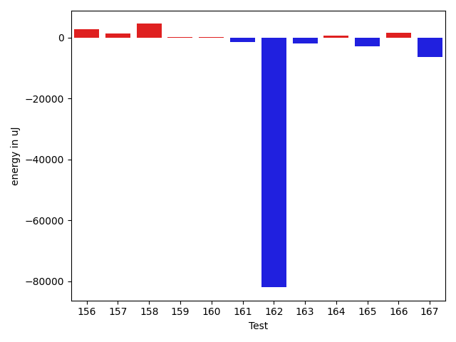

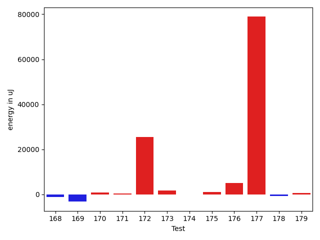

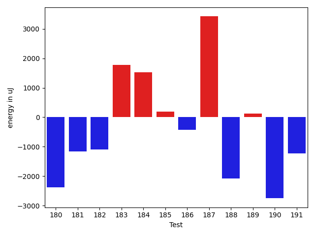

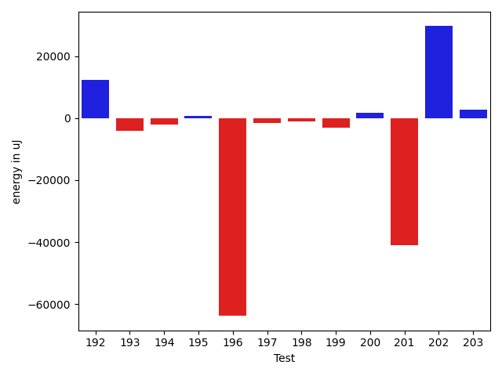

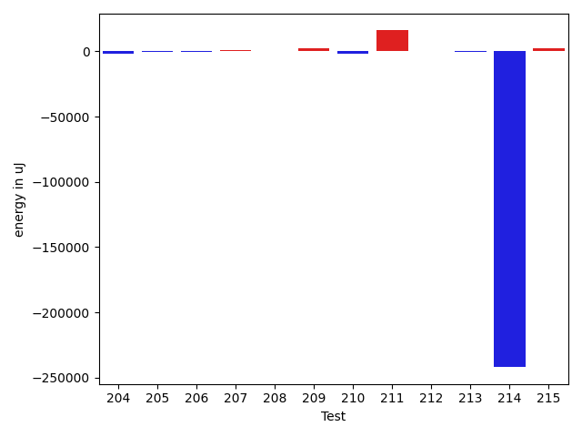

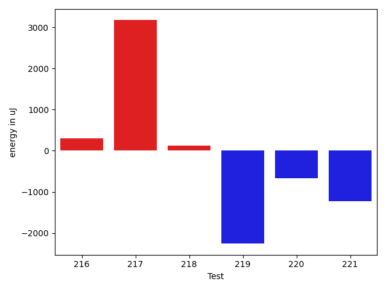

| ID | EnergyV1 | EnergyV2 | DeltaEnergy | σV1 | σV2 |
| --- | --- | --- | --- | --- | --- |
| 0 | 41076 | 40283 | -793 | 7029.325515715029 | 10440.646378244766 |
| 1 | 40955 | 41748 | 793 | 17350.33483353879 | 17845.100987636724 |
| 2 | 44067 | 44006 | -61 | 213816.6037437786 | 258583.86232497566 |
| 3 | 40771 | 40893 | 122 | 3966.2063842344924 | 4910.080463108015 |
| 4 | 83618 | 82458 | -1160 | 20993.181317018218 | 22078.24348545695 |
| 5 | 40711 | 40833 | 122 | 4104.831511405093 | 3831.206467733109 |
| 6 | 41565 | 41931 | 366 | 10016.583588094492 | 8643.704045330562 |
| 7 | 40344 | 41077 | 733 | 3348.8682627574867 | 3787.6778676404206 |
| 8 | 41137 | 40772 | -365 | 3645.212520119881 | 3700.141178259695 |
| 9 | 41382 | 40772 | -610 | 4451.319775755473 | 3849.9231831365573 |
| 10 | 42541 | 41687 | -854 | 9548.54364174787 | 13059.297045671266 |
| 11 | 40954 | 41992 | 1038 | 4080.813624121623 | 5447.315834817018 |
| 12 | 41259 | 41626 | 367 | 3916.594511332291 | 3467.2333476036324 |
| 13 | 41443 | 40527 | -916 | 4247.882065487626 | 3967.734911085154 |
| 14 | 39734 | 39855 | 121 | 3802.7966722679566 | 3772.9869503952555 |
| 15 | 41992 | 41137 | -855 | 4518.674337102962 | 4271.301150093833 |
| 16 | 39246 | 39672 | 426 | 4638.506760678282 | 3965.654916172947 |
| 17 | 136902 | 137450 | 548 | 27034.78091523173 | 29821.961620295177 |
| 18 | 276550 | 278563 | 2013 | 43988.85571177714 | 47422.756608223695 |
| 19 | 38696 | 40466 | 1770 | 4994.562442583499 | 2905.254636963858 |
| 20 | 122985 | 118163 | -4822 | 24974.143158506595 | 27823.642999240936 |
| 21 | 124633 | 126587 | 1954 | 22310.06025480897 | 24861.941068178567 |
| 22 | 121521 | 123169 | 1648 | 24377.77489135977 | 29189.740515344205 |
| 23 | 39063 | 40161 | 1098 | 5326.867049448484 | 3982.149995188038 |
| 24 | 156371 | 166686 | 10315 | 28961.89809766707 | 34355.30413880435 |
| 25 | 168212 | 167419 | -793 | 43155.08435269021 | 40657.99452288061 |
| 26 | 41870 | 42297 | 427 | 18307.45005287902 | 16834.69597932698 |
| 27 | 40527 | 41077 | 550 | 4171.64781825357 | 4736.546373826116 |
| 28 | 40100 | 40100 | 0 | 3963.295027910598 | 4838.735168120992 |
| 29 | 38452 | 38879 | 427 | 4611.601763572907 | 4324.492672039509 |
| 30 | 40466 | 40039 | -427 | 4216.204290209388 | 3209.651348050387 |
| 31 | 38879 | 42053 | 3174 | 4299.652453670452 | 4337.880934281161 |
| 32 | 31067 | 34729 | 3662 | 0.0 | 824.5 |
| 33 | 41870 | 40345 | -1525 | 4632.631220770149 | 4422.940084723685 |
| 34 | 43335 | 43701 | 366 | 16750.31269212494 | 18878.5970907649 |
| 35 | 40650 | 40466 | -184 | 3691.4204239928563 | 4611.176638342973 |
| 36 | 41137 | 40344 | -793 | 4267.339344126478 | 3996.914596455374 |
| 37 | 42114 | 41443 | -671 | 3681.6496819017034 | 4722.474589619303 |
| 38 | 43335 | 45654 | 2319 | 24200.839307921015 | 24596.256370577965 |
| 39 | 40283 | 40893 | 610 | 3057.5569371184474 | 3944.346814641194 |
| 40 | 40955 | 39551 | -1404 | 3287.4906676673627 | 4542.387673989965 |
| 41 | 40955 | 41077 | 122 | 49433.73518620188 | 3288.5069620534005 |
| 42 | 40588 | 39978 | -610 | 3779.1587797609964 | 3475.1324875867663 |
| 43 | 41321 | 39795 | -1526 | 4152.881695155933 | 4503.349765188768 |
| 44 | 47180 | 45105 | -2075 | 51478.05147508895 | 69088.27314437104 |
| 45 | 41138 | 41992 | 854 | 5915.171847872787 | 7456.484175867691 |
| 46 | 40039 | 41626 | 1587 | 3793.470911321362 | 3831.7387376665865 |
| 47 | 41382 | 41931 | 549 | 8634.454630132826 | 21883.583261189404 |
| 48 | 41382 | 40467 | -915 | 4421.978768334376 | 4319.759857205387 |
| 49 | 40649 | 41137 | 488 | 4035.3730134607877 | 18619.716693460017 |
| 50 | 40771 | 39673 | -1098 | 4336.347320226166 | 3595.0219967406238 |
| 51 | 41870 | 41077 | -793 | 47238.662702244226 | 3843.5387840654585 |
| 52 | 42175 | 42053 | -122 | 3397.779225577389 | 4164.244500973604 |
| 53 | 42358 | 41931 | -427 | 12684.637075560253 | 12390.861724199256 |
| 54 | 41931 | 41076 | -855 | 3180.479121837533 | 3716.5368446508182 |
| 55 | 41992 | 41931 | -61 | 10881.686067274888 | 8104.702552504484 |
| 56 | 42358 | 43274 | 916 | 6399.722626278158 | 7262.0915634096955 |
| 57 | 43762 | 41016 | -2746 | 4228.698734539977 | 3967.3382090318128 |
| 58 | 45471 | 43884 | -1587 | 17143.24920197092 | 14001.366788216386 |
| 59 | 41382 | 41077 | -305 | 2759.150457568416 | 4771.481027940906 |
| 60 | 39184 | 38147 | -1037 | 3377.092193256771 | 3535.831432162267 |
| 61 | 39184 | 40954 | 1770 | 3090.821142932732 | 4039.347364833439 |
| 62 | 41199 | 42297 | 1098 | 32046.642475338085 | 3597.9539659221464 |
| 63 | 42542 | 42053 | -489 | 3884.104059981585 | 3624.2678618758355 |
| 64 | 42420 | 39612 | -2808 | 3572.8294148117047 | 2579.67081035467 |
| 65 | 42664 | 43335 | 671 | 42262.05432745655 | 42322.40919946636 |
| 66 | 41016 | 42358 | 1342 | 3867.3746185118007 | 4027.2928769418627 |
| 67 | 40650 | 41260 | 610 | 3010.6688829682594 | 3900.4539299932767 |
| 68 | 39368 | 43029 | 3661 | 4440.6409503118775 | 28710.65094034412 |
| 69 | 39612 | 40649 | 1037 | 3326.1785697853284 | 3734.3769783156017 |
| 70 | 39246 | 40466 | 1220 | 4768.310588433665 | 4515.804380904605 |
| 71 | 39367 | 41259 | 1892 | 4407.806336489842 | 3674.9524051415146 |
| 72 | 41382 | 43823 | 2441 | 3124.541698256165 | 2439.215544436822 |
| 73 | 41565 | 43029 | 1464 | 3919.6771534980176 | 3732.273554937913 |
| 74 | 41625 | 39856 | -1769 | 3986.327176585052 | 4564.128473239605 |
| 75 | 43152 | 42236 | -916 | 11023.588298117815 | 26010.227392131696 |
| 76 | 44067 | 44128 | 61 | 34615.74930973893 | 35744.45908386921 |
| 77 | 42054 | 41993 | -61 | 17741.027729565172 | 19390.630737291325 |
| 78 | 40527 | 40588 | 61 | 4749.263087843316 | 4527.708017033206 |
| 79 | 42724 | 41260 | -1464 | 5792.245636958169 | 6823.015581591102 |
| 80 | 87951 | 88135 | 184 | 35234.77835221098 | 38926.00788022419 |
| 81 | 40832 | 41015 | 183 | 32535.938072179295 | 3652.217601697754 |
| 82 | 43274 | 41626 | -1648 | 4213.647297772161 | 3134.9372285851946 |
| 83 | 43091 | 40833 | -2258 | 3481.411288686447 | 3900.1859243342483 |
| 84 | 40466 | 41260 | 794 | 3967.4082232107144 | 79227.11439981332 |
| 85 | 41992 | 40710 | -1282 | 3151.0080560547976 | 3471.058880284228 |
| 86 | 41931 | 42663 | 732 | 26344.853976053993 | 35081.71802410041 |
| 87 | 41199 | 42969 | 1770 | 11769.316897205339 | 11785.624359389818 |
| 88 | 41992 | 42237 | 245 | 3942.065073730353 | 5756.072078283881 |
| 89 | 42969 | 42236 | -733 | 10725.691166602912 | 12327.95650554046 |
| 90 | 40588 | 41504 | 916 | 3841.1320745734606 | 4308.4193249296295 |
| 91 | 42724 | 41199 | -1525 | 2970.82066839905 | 2632.0498662202235 |
| 92 | 41443 | 42053 | 610 | 3701.0923544369207 | 4743.579387244569 |
| 93 | 43701 | 43945 | 244 | 256657.6387768002 | 470828.7069071253 |
| 94 | 44617 | 73059 | 28442 | 36722.05221190313 | 42666.18090284725 |
| 95 | 41809 | 42908 | 1099 | 54327.37004904877 | 4099.303036967246 |
| 96 | 39490 | 42359 | 2869 | 4906.710892010836 | 4570.49620528231 |
| 97 | 41503 | 41382 | -121 | 4265.971326441927 | 5538.9001214641485 |
| 98 | 40527 | 40161 | -366 | 3946.169491288893 | 3391.2540393169716 |
| 99 | 40955 | 40405 | -550 | 3005.8238815839813 | 3198.1705410933537 |
| 100 | 43701 | 44312 | 611 | 46656.974097272745 | 38310.697976913194 |
| 101 | 42725 | 42724 | -1 | 5436.916996768671 | 4165.883321649803 |
| 102 | 41870 | 42603 | 733 | 4243.128848656832 | 3747.0596659247362 |
| 103 | 40649 | 39673 | -976 | 3259.8196809088713 | 3090.8202143821204 |
| 104 | 40833 | 41076 | 243 | 4124.264284558992 | 3951.5496241473124 |
| 105 | 86548 | 88439 | 1891 | 31174.67147932586 | 32153.957309807935 |
| 106 | 90515 | 89233 | -1282 | 149873.91965692933 | 289831.477536318 |
| 107 | 41687 | 41443 | -244 | 4234.184107375456 | 3350.874891717211 |
| 108 | 41198 | 39612 | -1586 | 7473.015821398229 | 6931.930357063799 |
| 109 | 40588 | 40222 | -366 | 3959.002567923986 | 4120.594705533745 |
| 110 | 40893 | 41016 | 123 | 4607.190556953178 | 5032.82832379642 |
| 111 | 41931 | 40954 | -977 | 4268.088997024715 | 4564.083664146981 |
| 112 | 40955 | 41076 | 121 | 4390.961714577899 | 4266.101650988415 |
| 113 | 40039 | 40405 | 366 | 4293.557323475387 | 4431.838375443784 |
| 114 | 39673 | 39795 | 122 | 3834.5826568668135 | 4096.898163244969 |
| 115 | 41077 | 40771 | -306 | 4492.464012303731 | 4594.305095288487 |
| 116 | 40039 | 39673 | -366 | 4108.415208573942 | 3923.2686928996322 |
| 117 | 39306 | 40832 | 1526 | 3690.5427386225997 | 4223.633147605928 |
| 118 | 41320 | 41626 | 306 | 4426.185477626637 | 3795.0321780254408 |
| 119 | 45105 | 43151 | -1954 | 292836.64158183377 | 69219.6270200982 |
| 120 | 40100 | 40405 | 305 | 3973.496898199368 | 6697.77771827639 |
| 121 | 42053 | 41199 | -854 | 4025.726766357865 | 4062.054392486288 |
| 122 | 39734 | 40527 | 793 | 4691.2187491692075 | 5843.523352995449 |
| 123 | 39551 | 39856 | 305 | 4573.855195779808 | 3739.382428923884 |
| 124 | 190490 | 181701 | -8789 | 296726.89697483135 | 162681.31778805473 |
| 125 | 40588 | 41687 | 1099 | 5975.746072640731 | 7566.014008370066 |
| 126 | 41504 | 42480 | 976 | 33272.47696028179 | 14750.469224707072 |
| 127 | 41748 | 40589 | -1159 | 6861.613424131546 | 8109.4731424634065 |
| 128 | 40832 | 40650 | -182 | 9880.004340205975 | 7961.220407583018 |
| 129 | 41381 | 41565 | 184 | 4096.796652744458 | 3681.8674524621333 |
| 130 | 40527 | 40283 | -244 | 7416.74306473406 | 4074.624776874008 |
| 131 | 39978 | 40771 | 793 | 4299.703524697044 | 4232.101900752905 |
| 132 | 44067 | 43334 | -733 | 414107.7538495209 | 357988.82963523746 |
| 133 | 41748 | 41016 | -732 | 5231.112749203939 | 3398.227329293701 |
| 134 | 40649 | 42785 | 2136 | 4397.19181296427 | 3796.3854693087933 |
| 135 | 42114 | 40527 | -1587 | 4603.57163264128 | 6185.889539014489 |
| 136 | 40833 | 39367 | -1466 | 4212.277900932256 | 4792.693112596705 |
| 137 | 39917 | 40161 | 244 | 5644.91150414676 | 4242.685040372495 |
| 138 | 41382 | 41260 | -122 | 3930.3075489964162 | 4711.583797790294 |
| 139 | 43396 | 43884 | 488 | 20345.50157547007 | 29435.457569428065 |
| 140 | 41138 | 42603 | 1465 | 46136.942705181005 | 58757.98813044724 |
| 141 | 41260 | 40100 | -1160 | 2991.264031275256 | 4448.284900023284 |
| 142 | 39367 | 40528 | 1161 | 3780.691628223103 | 4517.25204046422 |
| 143 | 39551 | 42419 | 2868 | 3637.3219473895815 | 4907.544143326483 |
| 144 | 41138 | 41077 | -61 | 5165.761765264424 | 6523.324862037065 |
| 145 | 41931 | 39734 | -2197 | 4620.094739200016 | 4326.899027767322 |
| 146 | 40100 | 40893 | 793 | 4258.119024333422 | 4382.201893280294 |
| 147 | 40893 | 38818 | -2075 | 4160.217771723406 | 4099.569362343644 |
| 148 | 41260 | 41931 | 671 | 3935.7750466204243 | 4339.799031710255 |
| 149 | 42480 | 43274 | 794 | 355442.67111560085 | 552186.8073868423 |
| 150 | 41320 | 41870 | 550 | 11694.390992690012 | 15161.281240925387 |
| 151 | 42481 | 42175 | -306 | 10160.732970861915 | 10935.552373658134 |
| 152 | 41076 | 41443 | 367 | 13745.920051313171 | 11551.68865831499 |
| 153 | 87280 | 86060 | -1220 | 328265.3533283371 | 367099.81237477117 |
| 154 | 42237 | 43335 | 1098 | 16241.69195572848 | 20243.268656763714 |
| 155 | 41504 | 42298 | 794 | 11009.607733204313 | 16885.589142411096 |
| 156 | 39367 | 41748 | 2381 | 4818.614554228448 | 3723.2239862880942 |
| 157 | 42053 | 43030 | 977 | 3472.126359420451 | 2985.7390636445175 |
| 158 | 40772 | 41748 | 976 | 3867.7751094883806 | 23281.05682966019 |
| 159 | 42968 | 42847 | -121 | 3411.8217826468035 | 3366.9312951144047 |
| 160 | 41382 | 42176 | 794 | 3582.578057553183 | 3672.088191472314 |
| 161 | 43213 | 42602 | -611 | 3370.729667132754 | 5097.789971699065 |
| 162 | 86670 | 87036 | 366 | 589782.5348568958 | 411651.9344067677 |
| 163 | 45654 | 44067 | -1587 | 24201.550815838076 | 23697.29980756795 |
| 164 | 41504 | 41504 | 0 | 6106.712243060924 | 7540.379380659644 |
| 165 | 40466 | 39673 | -793 | 8997.387740315156 | 5443.441523759534 |
| 166 | 41381 | 41016 | -365 | 13408.258480280263 | 14362.981847775176 |
| 167 | 42480 | 41443 | -1037 | 40960.94820594984 | 39243.156284165314 |
| 168 | 41320 | 42358 | 1038 | 15766.330561772274 | 12643.927181582294 |
| 169 | 41931 | 40771 | -1160 | 14015.460014184448 | 8947.13221167294 |
| 170 | 40100 | 41626 | 1526 | 4759.927067779349 | 4529.852700716686 |
| 171 | 43518 | 42968 | -550 | 10097.973098584234 | 12064.503595883634 |
| 172 | 43579 | 42175 | -1404 | 126052.46214736397 | 159336.69557201816 |
| 173 | 43212 | 42969 | -243 | 20494.733561556335 | 21013.797947006824 |
| 174 | 39612 | 41992 | 2380 | 4191.340181141095 | 4761.474708707592 |
| 175 | 42786 | 42663 | -123 | 8344.238083789334 | 12375.656411403796 |
| 176 | 70435 | 72326 | 1891 | 21511.656840287415 | 38189.42888990149 |
| 177 | 42358 | 42480 | 122 | 269242.8820624399 | 473583.6553422547 |
| 178 | 40771 | 40588 | -183 | 6212.61517265046 | 4951.456754945331 |
| 179 | 43030 | 42541 | -489 | 14706.214791933675 | 15993.435112247706 |
| 180 | 43762 | 41382 | -2380 | 57191.505142751084 | 46019.93048525581 |
| 181 | 43457 | 42297 | -1160 | 77606.11162064843 | 69891.42558111117 |
| 182 | 42664 | 41565 | -1099 | 9683.835227992477 | 5758.250996320619 |
| 183 | 41260 | 43030 | 1770 | 8407.893354582819 | 11960.047129025486 |
| 184 | 44189 | 45715 | 1526 | 261951.8841732071 | 517456.0765818344 |
| 185 | 42480 | 42664 | 184 | 4482.381562703467 | 8322.175974256508 |
| 186 | 42542 | 42114 | -428 | 378407.71400099574 | 498950.5526161982 |
| 187 | 45288 | 48706 | 3418 | 42294.44863615616 | 42621.616240217765 |
| 188 | 41870 | 39795 | -2075 | 4076.011849742692 | 5224.785469957208 |
| 189 | 40954 | 41077 | 123 | 5644.504385500688 | 6973.831859348857 |
| 190 | 41443 | 38696 | -2747 | 3950.561049279157 | 5009.3855964633085 |
| 191 | 43518 | 42297 | -1221 | 584935.237042002 | 327992.9133871595 |
| 192 | 465758 | 478026 | 12268 | 158814.45099313732 | 172849.7335451204 |
| 193 | 44860 | 44433 | -427 | 22761.67972521946 | 19811.54158888616 |
| 194 | 41260 | 42114 | 854 | 19629.792312487796 | 4154.263637591173 |
| 195 | 40100 | 41809 | 1709 | 2995.395334025309 | 3937.921947482302 |
| 196 | 127686 | 132690 | 5004 | 407681.5661567123 | 60127.31857620605 |
| 197 | 42541 | 43213 | 672 | 21462.478575482735 | 4308.62819445518 |
| 198 | 43274 | 43457 | 183 | 10094.276684978446 | 8239.303976722385 |
| 199 | 42968 | 42725 | -243 | 45463.939364565405 | 47889.991207690415 |
| 200 | 41382 | 42664 | 1282 | 21661.56939051405 | 22500.85916789074 |
| 201 | 41321 | 42114 | 793 | 324339.0552123648 | 24957.509965529272 |
| 202 | 41870 | 42175 | 305 | 304049.06437806523 | 376246.98856604873 |
| 203 | 38940 | 44434 | 5494 | 3295.151698468663 | 4392.172963225479 |
| 204 | 42236 | 40772 | -1464 | 3821.0600511732623 | 3868.1105361432583 |
| 205 | 42236 | 41015 | -1221 | 3898.742479993462 | 3942.358072220229 |
| 206 | 41992 | 40771 | -1221 | 4252.881390433285 | 4482.442482131716 |
| 207 | 39062 | 40893 | 1831 | 3259.0286488572056 | 3609.5286395871694 |
| 208 | 41199 | 40711 | -488 | 4221.931876532721 | 5227.59253714126 |
| 209 | 39307 | 40893 | 1586 | 4742.2039471794105 | 3642.8319545223176 |
| 210 | 41320 | 38513 | -2807 | 3754.080057963232 | 4477.592503578142 |
| 211 | 89417 | 90026 | 609 | 346738.92461336387 | 380199.26604840695 |
| 212 | 42175 | 40894 | -1281 | 4212.087930330932 | 4955.516704714908 |
| 213 | 41016 | 40405 | -611 | 7467.020560157462 | 8096.262970681205 |
| 214 | 41321 | 42908 | 1587 | 662398.2355259768 | 359008.7243288116 |
| 215 | 41321 | 44434 | 3113 | 4731.198023735206 | 4896.997662562528 |
| 216 | 42419 | 42724 | 305 | 337259.0569479682 | 682540.4652470412 |
| 217 | 41748 | 44922 | 3174 | 42051.391004249665 | 50289.70718969447 |
| 218 | 42603 | 42725 | 122 | 4363.432778143259 | 4212.7214221465265 |
| 219 | 44251 | 41992 | -2259 | 4281.166184779718 | 4503.642864115671 |
| 220 | 42847 | 42176 | -671 | 6449.666426069584 | 5630.320421785583 |
| 221 | 43823 | 42602 | -1221 | 79951.41658906762 | 47474.15544473789 |

## Delta Duration per test method

| ID | DurationV1 | DurationsV2 | DeltaDuration |
| --- | --- | --- | --- |
| 0 | 1034107.5 | 958284.7 | -75822.80000000005 |
| 1 | 979215.8620689656 | 1111287.5909090908 | 132071.72884012526 |
| 2 | 1653710.4307692307 | 2602091.0303030303 | 948380.5995337996 |
| 3 | 778584.1896551724 | 848476.0793650794 | 69891.889709907 |
| 4 | 2356611.383838384 | 2412644.9696969697 | 56033.58585858578 |
| 5 | 738752.6666666666 | 789912.96 | 51160.293333333335 |
| 6 | 833211.0 | 834550.4166666666 | 1339.4166666666279 |
| 7 | 754610.2391304348 | 799119.5862068966 | 44509.34707646177 |
| 8 | 802858.4150943396 | 827725.8679245283 | 24867.452830188675 |
| 9 | 501375.4761904762 | 441923.0344827586 | -59452.441707717604 |
| 10 | 1062980.1506849315 | 1151958.8493150685 | 88978.6986301369 |
| 11 | 751024.8867924528 | 828605.5714285715 | 77580.6846361187 |
| 12 | 698555.4423076923 | 759125.7380952381 | 60570.29578754585 |
| 13 | 928186.8039215687 | 773480.606557377 | -154706.19736419164 |
| 14 | 589946.6428571428 | 655629.4186046511 | 65682.77574750828 |
| 15 | 531284.2307692308 | 618642.2692307692 | 87358.0384615385 |
| 16 | 740986.9803921569 | 879911.3833333333 | 138924.40294117643 |
| 17 | 3845800.262626263 | 3894264.0808080807 | 48463.818181817885 |
| 18 | 7254974.94949495 | 7499879.414141414 | 244904.4646464642 |
| 19 | 490952.0689655172 | 475656.24 | -15295.828965517227 |
| 20 | 3245540.727272727 | 3283078.6565656564 | 37537.92929292936 |
| 21 | 3357799.1717171716 | 3400161.9494949495 | 42362.777777777985 |
| 22 | 3255081.5656565656 | 3324618.3333333335 | 69536.7676767679 |
| 23 | 603443.625 | 640538.1951219512 | 37094.57012195117 |
| 24 | 4228087.737373738 | 4346518.101010101 | 118430.3636363633 |
| 25 | 4358530.151515151 | 4422219.95959596 | 63689.80808080826 |
| 26 | 1066611.7234042552 | 1208080.775510204 | 141469.0521059488 |
| 27 | 951617.2816901408 | 991301.7307692308 | 39684.449079089914 |
| 28 | 412843.47826086957 | 437660.38095238095 | 24816.90269151138 |
| 29 | 572991.5185185185 | 620988.2727272727 | 47996.754208754166 |
| 30 | 516354.0 | 557502.0833333334 | 41148.08333333337 |
| 31 | 546971.7931034482 | 483875.4166666667 | -63096.376436781546 |
| 32 | 798765.0 | 833172.5 | 34407.5 |
| 33 | 729585.2888888889 | 678743.4375 | -50841.8513888889 |
| 34 | 1439478.0227272727 | 1404901.319148936 | -34576.70357833663 |
| 35 | 705521.5961538461 | 698516.15 | -7005.446153846104 |
| 36 | 758336.8292682926 | 695940.0 | -62396.82926829264 |
| 37 | 815354.6 | 701140.1 | -114214.5 |
| 38 | 1588567.1511627906 | 1645592.294117647 | 57025.14295485639 |
| 39 | 729210.2553191489 | 906683.5609756098 | 177473.30565646093 |
| 40 | 694986.3 | 753642.75 | 58656.44999999995 |
| 41 | 1030447.1666666666 | 831193.2105263158 | -199253.95614035078 |
| 42 | 752488.6363636364 | 755619.4363636364 | 3130.8000000000466 |
| 43 | 730909.1842105263 | 747299.5348837209 | 16390.350673194625 |
| 44 | 1841635.7346938776 | 2022835.724489796 | 181199.98979591834 |
| 45 | 950300.7808219178 | 958779.6849315069 | 8478.904109589057 |
| 46 | 768176.7272727273 | 759140.5319148937 | -9036.19535783364 |
| 47 | 1059515.2133333334 | 1182974.6575342466 | 123459.44420091319 |
| 48 | 882506.12 | 810201.8679245283 | -72304.25207547168 |
| 49 | 766351.0204081633 | 853274.9803921569 | 86923.95998399355 |
| 50 | 690925.306122449 | 730720.7567567568 | 39795.45063430781 |
| 51 | 997793.0 | 827233.6730769231 | -170559.32692307688 |
| 52 | 761008.4651162791 | 759817.1666666666 | -1191.2984496124554 |
| 53 | 1146615.554054054 | 1098392.1012658228 | -48223.452788231196 |
| 54 | 426029.27777777775 | 468030.8823529412 | 42001.60457516345 |
| 55 | 1126907.8684210526 | 1095857.9864864864 | -31049.88193456619 |
| 56 | 776285.7575757576 | 727189.1842105263 | -49096.57336523128 |
| 57 | 417694.1 | 459093.3125 | 41399.21250000002 |
| 58 | 1200158.1081081082 | 1113281.9310344828 | -86876.17707362538 |
| 59 | 434101.55 | 480677.65 | 46576.100000000035 |
| 60 | 479823.48148148146 | 476598.3888888889 | -3225.092592592584 |
| 61 | 447263.04 | 413206.5238095238 | -34056.51619047619 |
| 62 | 729328.4102564103 | 530791.6774193548 | -198536.73283705546 |
| 63 | 421318.5 | 396259.8947368421 | -25058.605263157922 |
| 64 | 435894.375 | 449478.5 | 13584.125 |
| 65 | 1523919.8524590165 | 1668502.641025641 | 144582.7885666245 |
| 66 | 459696.5238095238 | 463614.0 | 3917.4761904762127 |
| 67 | 495956.5652173913 | 547747.65 | 51791.08478260873 |
| 68 | 526875.6363636364 | 699215.2631578947 | 172339.62679425837 |
| 69 | 531298.6818181818 | 948989.1538461539 | 417690.4720279721 |
| 70 | 521217.95454545453 | 520281.9166666667 | -936.0378787878435 |
| 71 | 595274.0 | 469882.05263157893 | -125391.94736842107 |
| 72 | 444696.8387096774 | 324385.0 | -120311.8387096774 |
| 73 | 457897.1666666667 | 455312.22222222225 | -2584.944444444438 |
| 74 | 853966.4444444445 | 882427.6229508197 | 28461.178506375174 |
| 75 | 1198931.4133333333 | 1246679.3827160494 | 47747.96938271611 |
| 76 | 1530842.388888889 | 1418802.84 | -112039.54888888891 |
| 77 | 1087757.2631578948 | 1110637.3214285714 | 22880.058270676527 |
| 78 | 793804.4693877551 | 980906.3720930233 | 187101.90270526812 |
| 79 | 899276.9038461539 | 925539.3103448276 | 26262.40649867372 |
| 80 | 2607338.898989899 | 2717173.5555555555 | 109834.65656565642 |
| 81 | 765891.9615384615 | 571724.0 | -194167.9615384615 |
| 82 | 730651.9574468085 | 707933.9318181818 | -22718.025628626696 |
| 83 | 805469.4324324324 | 801444.3 | -4025.1324324323796 |
| 84 | 550479.56 | 972896.4705882353 | 422416.91058823525 |
| 85 | 455018.9310344828 | 498450.96 | 43432.02896551724 |
| 86 | 822372.5882352941 | 885019.6470588235 | 62647.0588235294 |
| 87 | 981787.6739130435 | 893215.9347826086 | -88571.73913043481 |
| 88 | 694365.9722222222 | 712004.2291666666 | 17638.25694444438 |
| 89 | 1007325.0327868853 | 1025960.0 | 18634.967213114724 |
| 90 | 726563.2162162162 | 741767.0 | 15203.783783783787 |
| 91 | 376057.8461538461 | 361485.17647058825 | -14572.669683257875 |
| 92 | 587434.1071428572 | 623803.551724138 | 36369.44458128081 |
| 93 | 2222213.7439024393 | 4603652.070588236 | 2381438.3266857965 |
| 94 | 1600263.2631578948 | 2095967.8157894737 | 495704.5526315789 |
| 95 | 868122.6363636364 | 365577.5 | -502545.13636363635 |
| 96 | 428295.05555555556 | 395883.4375 | -32411.618055555562 |
| 97 | 417307.8888888889 | 423452.0833333333 | 6144.194444444438 |
| 98 | 413590.35294117645 | 429918.85714285716 | 16328.504201680713 |
| 99 | 364049.0 | 363721.2727272727 | -327.7272727272939 |
| 100 | 1641163.4444444445 | 1008318.7391304348 | -632844.7053140097 |
| 101 | 483520.0909090909 | 435389.28 | -48130.810909090855 |
| 102 | 427657.7619047619 | 412945.75 | -14712.011904761894 |
| 103 | 360605.21428571426 | 443842.46153846156 | 83237.2472527473 |
| 104 | 392012.9166666667 | 402854.8333333333 | 10841.916666666628 |
| 105 | 2671795.474747475 | 2774748.383838384 | 102952.90909090918 |
| 106 | 3661505.5656565656 | 5073942.686868687 | 1412437.1212121216 |
| 107 | 599727.8709677419 | 588786.7692307692 | -10941.10173697269 |
| 108 | 938844.0952380953 | 917212.9365079365 | -21631.158730158815 |
| 109 | 866623.8382352941 | 914809.3181818182 | 48185.47994652414 |
| 110 | 1113071.5731707318 | 1117449.6184210526 | 4378.045250320807 |
| 111 | 637249.6875 | 675600.9666666667 | 38351.279166666674 |
| 112 | 579635.9666666667 | 549843.5161290322 | -29792.45053763443 |
| 113 | 587120.9444444445 | 582821.7419354839 | -4299.202508960618 |
| 114 | 544791.40625 | 623817.84 | 79026.43374999997 |
| 115 | 591678.487804878 | 620238.0 | 28559.512195121963 |
| 116 | 607109.7916666666 | 601998.5769230769 | -5111.21474358975 |
| 117 | 556898.28 | 555759.8 | -1138.4799999999814 |
| 118 | 785404.4509803922 | 712601.3846153846 | -72803.06636500754 |
| 119 | 3006326.0 | 1625103.4516129033 | -1381222.5483870967 |
| 120 | 784012.1333333333 | 701435.1395348837 | -82576.99379844964 |
| 121 | 623405.6923076923 | 627119.6296296297 | 3713.93732193741 |
| 122 | 792418.431372549 | 836512.6382978724 | 44094.20692532335 |
| 123 | 927048.6724137932 | 863955.0491803279 | -63093.623233465245 |
| 124 | 7464889.94949495 | 5973056.070707071 | -1491833.878787879 |
| 125 | 856933.0535714285 | 792093.0192307692 | -64840.03434065927 |
| 126 | 1321163.875 | 949822.3684210526 | -371341.5065789474 |
| 127 | 970245.88 | 946465.0689655172 | -23780.811034482787 |
| 128 | 1145987.2133333334 | 1045405.1184210526 | -100582.0949122808 |
| 129 | 682455.4871794871 | 661151.53125 | -21303.95592948713 |
| 130 | 757428.8292682926 | 627905.7567567568 | -129523.07251153584 |
| 131 | 669007.1351351351 | 625027.0 | -43980.13513513515 |
| 132 | 3655440.3571428573 | 2966264.9655172415 | -689175.3916256158 |
| 133 | 746521.487804878 | 769373.8536585366 | 22852.365853658528 |
| 134 | 571955.92 | 542646.1052631579 | -29309.814736842178 |
| 135 | 505559.13636363635 | 639365.0416666666 | 133805.90530303027 |
| 136 | 619348.027027027 | 780170.6923076923 | 160822.66528066527 |
| 137 | 632145.34375 | 644252.4736842106 | 12107.129934210563 |
| 138 | 758895.3888888889 | 756445.48 | -2449.9088888888946 |
| 139 | 1546746.3775510204 | 1656577.0303030303 | 109830.65275200992 |
| 140 | 1129164.3243243243 | 1508697.6666666667 | 379533.3423423425 |
| 141 | 518503.6296296296 | 502556.8076923077 | -15946.821937321918 |
| 142 | 664829.1470588235 | 769505.7567567568 | 104676.60969793331 |
| 143 | 653759.1176470588 | 710688.447368421 | 56929.32972136221 |
| 144 | 904044.3720930233 | 968239.5294117647 | 64195.15731874143 |
| 145 | 632448.2285714286 | 713404.4324324324 | 80956.20386100386 |
| 146 | 574396.6774193548 | 613757.0285714286 | 39360.351152073825 |
| 147 | 542463.0714285715 | 509396.76666666666 | -33066.304761904816 |
| 148 | 740822.94 | 756849.1304347826 | 16026.19043478265 |
| 149 | 3223266.6666666665 | 8927229.379310345 | 5703962.712643679 |
| 150 | 1180483.630952381 | 1252271.4 | 71787.76904761884 |
| 151 | 1061925.4246575343 | 1157630.1643835616 | 95704.73972602724 |
| 152 | 1109389.0 | 1163338.2318840579 | 53949.23188405787 |
| 153 | 4039923.696969697 | 4293262.535353536 | 253338.838383839 |
| 154 | 1044656.9852941176 | 1149722.765625 | 105065.78033088241 |
| 155 | 1189339.0 | 1237769.939759036 | 48430.93975903606 |
| 156 | 460413.13333333336 | 414156.53846153844 | -46256.59487179492 |
| 157 | 439634.28571428574 | 382659.3333333333 | -56974.952380952425 |
| 158 | 535890.9411764706 | 613242.1785714285 | 77351.23739495792 |
| 159 | 496339.8333333333 | 435069.4705882353 | -61270.36274509801 |
| 160 | 454748.96153846156 | 382814.04545454547 | -71934.91608391609 |
| 161 | 486861.13333333336 | 508652.2 | 21791.06666666665 |
| 162 | 7016842.151515151 | 4591708.444444444 | -2425133.7070707073 |
| 163 | 1704403.7835051545 | 1647815.5212765958 | -56588.26222855877 |
| 164 | 1046865.6176470588 | 985182.567164179 | -61683.05048287974 |
| 165 | 1069342.633802817 | 935170.2121212122 | -134172.4216816048 |
| 166 | 1324028.5652173914 | 1219008.0574712644 | -105020.50774612697 |
| 167 | 1667785.735632184 | 1478418.7407407407 | -189366.9948914433 |
| 168 | 1247371.1445783132 | 1126488.96 | -120882.18457831326 |
| 169 | 1158441.8192771084 | 1084574.32 | -73867.49927710835 |
| 170 | 951795.6181818182 | 973256.1034482758 | 21460.48526645766 |
| 171 | 1072557.5098039217 | 1083732.1851851852 | 11174.675381263485 |
| 172 | 2378735.529411765 | 3024565.2 | 645829.6705882354 |
| 173 | 1324717.6 | 1404662.506849315 | 79944.90684931492 |
| 174 | 673831.8387096775 | 684340.4736842106 | 10508.63497453311 |
| 175 | 905615.1521739131 | 939669.5681818182 | 34054.41600790515 |
| 176 | 1830603.1616161617 | 1994041.2828282828 | 163438.1212121211 |
| 177 | 2025676.7538461538 | 4671603.140350877 | 2645926.3865047237 |
| 178 | 861902.9523809524 | 787941.8958333334 | -73961.05654761905 |
| 179 | 1268319.76 | 1264111.358974359 | -4208.401025641011 |
| 180 | 1466772.4603174604 | 1337693.6557377048 | -129078.80457975552 |
| 181 | 1637867.361111111 | 1446666.8 | -191200.56111111096 |
| 182 | 987532.6111111111 | 969921.593220339 | -17611.017890772084 |
| 183 | 1071738.8630136987 | 1116565.9305555555 | 44827.067541856784 |
| 184 | 2179936.15942029 | 5673969.986111111 | 3494033.826690821 |
| 185 | 875200.2549019608 | 980553.8793103448 | 105353.62440838397 |
| 186 | 4116659.95 | 6404716.357142857 | 2288056.407142857 |
| 187 | 1566890.6279069767 | 2026368.9555555556 | 459478.3276485789 |
| 188 | 613070.2093023256 | 707864.9677419355 | 94794.7584396099 |
| 189 | 792971.3571428572 | 779073.3888888889 | -13897.968253968284 |
| 190 | 634331.4 | 653110.1891891892 | 18778.789189189207 |
| 191 | 6379180.966666667 | 2750464.712121212 | -3628716.254545455 |
| 192 | 12268738.838383839 | 12479048.373737374 | 210309.5353535358 |
| 193 | 1531009.034883721 | 1397564.8823529412 | -133444.15253077983 |
| 194 | 925026.1212121212 | 773141.1428571428 | -151884.97835497838 |
| 195 | 852272.6923076923 | 552252.8181818182 | -300019.874125874 |
| 196 | 5872066.585858586 | 3707138.6363636362 | -2164927.94949495 |
| 197 | 930248.3166666667 | 848118.2903225806 | -82130.02634408604 |
| 198 | 948604.2307692308 | 760276.8333333334 | -188327.39743589738 |
| 199 | 1719613.6516853932 | 1611410.3647058823 | -108203.28697951091 |
| 200 | 1249759.121212121 | 1186530.8235294118 | -63228.29768270929 |
| 201 | 2132466.3606557376 | 1060480.6382978724 | -1071985.7223578652 |
| 202 | 2303392.604651163 | 3064953.6470588236 | 761561.0424076607 |
| 203 | 544599.7096774194 | 605060.6333333333 | 60460.92365591391 |
| 204 | 749568.0 | 662070.0384615385 | -87497.9615384615 |
| 205 | 750578.0 | 826496.6 | 75918.59999999998 |
| 206 | 579136.0625 | 642253.5806451613 | 63117.51814516133 |
| 207 | 473547.94736842107 | 413905.8888888889 | -59642.05847953219 |
| 208 | 399909.2631578947 | 415909.0 | 15999.736842105282 |
| 209 | 421928.61904761905 | 431902.4 | 9973.78095238097 |
| 210 | 514805.2916666667 | 534454.0 | 19648.708333333314 |
| 211 | 4734623.929292929 | 5288428.151515151 | 553804.222222222 |
| 212 | 788609.8 | 781345.7674418605 | -7264.03255813953 |
| 213 | 973545.693877551 | 898342.6226415094 | -75203.07123604161 |
| 214 | 10894483.2 | 3031173.6666666665 | -7863309.533333333 |
| 215 | 480497.64285714284 | 422546.9285714286 | -57950.71428571426 |
| 216 | 3085202.304347826 | 8970547.3 | 5885344.995652175 |
| 217 | 1277116.0 | 1496574.5454545454 | 219458.5454545454 |
| 218 | 424662.4375 | 563707.7857142857 | 139045.34821428568 |
| 219 | 418769.60869565216 | 477983.75 | 59214.14130434784 |
| 220 | 918259.4117647059 | 792587.8679245283 | -125671.54384017759 |
| 221 | 1675759.857142857 | 865432.4210526316 | -810327.4360902255 |

## Misc.

| ID | Test Class | Test Method |
| --- | --- | --- |
| 0 | com.google.gson.functional.CustomTypeAdaptersTest | testCustomAdapterInvokedForCollectionElementDeserialization |
| 1 | com.google.gson.functional.CustomTypeAdaptersTest | testCustomNestedSerializers |
| 2 | com.google.gson.functional.CustomTypeAdaptersTest | testCustomSerializers |
| 3 | com.google.gson.functional.CustomTypeAdaptersTest | testCustomNestedDeserializers |
| 4 | com.google.gson.functional.CustomTypeAdaptersTest | testCustomTypeAdapterDoesNotAppliesToSubClasses |
| 5 | com.google.gson.functional.CustomTypeAdaptersTest | testCustomByteArrayDeserializerAndInstanceCreator |
| 6 | com.google.gson.functional.CustomTypeAdaptersTest | testEnsureCustomSerializerNotInvokedForNullValues |
| 7 | com.google.gson.functional.CustomTypeAdaptersTest | testCustomAdapterInvokedForMapElementDeserialization |
| 8 | com.google.gson.functional.CustomTypeAdaptersTest | testCustomAdapterInvokedForMapElementSerializationWithType |
| 9 | com.google.gson.functional.CustomTypeAdaptersTest | testCustomAdapterInvokedForMapElementSerialization |
| 10 | com.google.gson.functional.CustomTypeAdaptersTest | testCustomAdapterInvokedForCollectionElementSerializationWithType |
| 11 | com.google.gson.functional.CustomTypeAdaptersTest | testCustomDeserializers |
| 12 | com.google.gson.functional.CustomTypeAdaptersTest | testCustomByteArraySerializer |
| 13 | com.google.gson.functional.CustomTypeAdaptersTest | testCustomTypeAdapterAppliesToSubClassesSerializedAsBaseClass |
| 14 | com.google.gson.functional.CustomTypeAdaptersTest | testEnsureCustomDeserializerNotInvokedForNullValues |
| 15 | com.google.gson.functional.CustomTypeAdaptersTest | testCustomAdapterInvokedForCollectionElementSerialization |
| 16 | com.google.gson.functional.DefaultTypeAdaptersTest | testTreeSetDeserialization |
| 17 | com.google.gson.functional.DefaultTypeAdaptersTest | testDateSerializationWithPatternNotOverridenByTypeAdapter |
| 18 | com.google.gson.functional.DefaultTypeAdaptersTest | testDateSerializationWithPattern |
| 19 | com.google.gson.functional.DefaultTypeAdaptersTest | testDefaultGregorianCalendarDeserialization |
| 20 | com.google.gson.functional.DefaultTypeAdaptersTest | testSqlDateSerialization |
| 21 | com.google.gson.functional.DefaultTypeAdaptersTest | testTimestampSerialization |
| 22 | com.google.gson.functional.DefaultTypeAdaptersTest | testDefaultDateDeserializationUsingBuilder |
| 23 | com.google.gson.functional.DefaultTypeAdaptersTest | testDefaultCalendarSerialization |
| 24 | com.google.gson.functional.DefaultTypeAdaptersTest | testDateDeserializationWithPattern |
| 25 | com.google.gson.functional.DefaultTypeAdaptersTest | testDateSerializationInCollection |
| 26 | com.google.gson.functional.DefaultTypeAdaptersTest | testSetSerialization |
| 27 | com.google.gson.functional.DefaultTypeAdaptersTest | testBitSetDeserialization |
| 28 | com.google.gson.functional.DefaultTypeAdaptersTest | testPropertiesDeserialization |
| 29 | com.google.gson.functional.DefaultTypeAdaptersTest | testDefaultCalendarDeserialization |
| 30 | com.google.gson.functional.DefaultTypeAdaptersTest | testDefaultGregorianCalendarSerialization |
| 31 | com.google.gson.functional.DefaultTypeAdaptersTest | testBitSetSerialization |
| 32 | com.google.gson.functional.DefaultTypeAdaptersTest | testDefaultDateSerializationUsingBuilder |
| 33 | com.google.gson.functional.CollectionTest | testNullsInListDeserialization |
| 34 | com.google.gson.functional.CollectionTest | testWildcardCollectionField |
| 35 | com.google.gson.functional.CollectionTest | testCollectionOfStringsDeserialization |
| 36 | com.google.gson.functional.CollectionTest | testQueueDeserialization |
| 37 | com.google.gson.functional.CollectionTest | testLinkedListDeserialization |
| 38 | com.google.gson.functional.MapTest | testSerializeMaps |
| 39 | com.google.gson.functional.MapTest | testMapDeserializationWithIntegerKeys |
| 40 | com.google.gson.functional.MapTest | testMapDeserializationWithNullKey |
| 41 | com.google.gson.functional.MapTest | testMapStandardSubclassDeserialization |
| 42 | com.google.gson.functional.MapTest | testReadMapsWithEmptyStringKey |
| 43 | com.google.gson.functional.MapTest | testMapSerializationWithNullValuesSerialized |
| 44 | com.google.gson.functional.MapTest | testMapSubclassDeserialization |
| 45 | com.google.gson.functional.MapTest | testCustomSerializerForSpecificMapType |
| 46 | com.google.gson.functional.MapTest | testParameterizedMapSubclassDeserialization |
| 47 | com.google.gson.functional.MapTest | testGeneralMapField |
| 48 | com.google.gson.functional.MapTest | testMapDeserializationWithWildcardValues |
| 49 | com.google.gson.functional.MapTest | testMapSerializationWithNullValueButSerializeNulls |
| 50 | com.google.gson.functional.MapTest | testMapDeserializationWithNullValue |
| 51 | com.google.gson.functional.MapTest | testMapOfMapDeserialization |
| 52 | com.google.gson.functional.MapTest | testMapDeserialization |
| 53 | com.google.gson.functional.ReadersWritersTest | testReadWriteTwoObjects |
| 54 | com.google.gson.functional.ReadersWritersTest | testTopLevelNullObjectDeserializationWithReaderAndSerializeNulls |
| 55 | com.google.gson.functional.ReadersWritersTest | testReadWriteTwoStrings |
| 56 | com.google.gson.functional.ReadersWritersTest | testReaderForDeserialization |
| 57 | com.google.gson.functional.ReadersWritersTest | testTopLevelNullObjectSerializationWithWriterAndSerializeNulls |
| 58 | com.google.gson.functional.PrimitiveTest | testMoreSpecificSerialization |
| 59 | com.google.gson.functional.PrimitiveTest | testDoubleInfinitySerialization |
| 60 | com.google.gson.functional.PrimitiveTest | testLongAsStringDeserialization |
| 61 | com.google.gson.functional.PrimitiveTest | testQuotedStringSerializationAndDeserialization |
| 62 | com.google.gson.functional.PrimitiveTest | testLongAsStringSerialization |
| 63 | com.google.gson.functional.PrimitiveTest | testNegativeInfinityFloatSerialization |
| 64 | com.google.gson.functional.PrimitiveTest | testDeserializeJsonArrayAsNumber |
| 65 | com.google.gson.functional.PrimitiveTest | testHtmlCharacterSerialization |
| 66 | com.google.gson.functional.PrimitiveTest | testNegativeInfinitySerialization |
| 67 | com.google.gson.functional.PrimitiveTest | testUnquotedStringDeserializationFails |
| 68 | com.google.gson.functional.PrimitiveTest | testNumberSerialization |
| 69 | com.google.gson.functional.PrimitiveTest | testNumberDeserialization |
| 70 | com.google.gson.functional.PrimitiveTest | testFloatNaNSerialization |
| 71 | com.google.gson.functional.PrimitiveTest | testDoubleNaNSerialization |
| 72 | com.google.gson.functional.PrimitiveTest | testDeserializeJsonObjectAsNumber |
| 73 | com.google.gson.functional.PrimitiveTest | testFloatInfinitySerialization |
| 74 | com.google.gson.functional.CustomDeserializerTest | testCustomDeserializerReturnsNullForArrayElementsForArrayField |
| 75 | com.google.gson.functional.CustomDeserializerTest | testJsonTypeFieldBasedDeserialization |
| 76 | com.google.gson.functional.CustomDeserializerTest | testCustomDeserializerReturnsNullForTopLevelObject |
| 77 | com.google.gson.functional.CustomDeserializerTest | testCustomDeserializerReturnsNull |
| 78 | com.google.gson.functional.CustomDeserializerTest | testCustomDeserializerReturnsNullForArrayElements |
| 79 | com.google.gson.functional.ObjectTest | testArrayOfArraysDeserialization |
| 80 | com.google.gson.functional.ObjectTest | testSingletonLists |
| 81 | com.google.gson.functional.ObjectTest | testObjectFieldNamesWithoutQuotesDeserialization |
| 82 | com.google.gson.functional.ObjectTest | testArrayOfObjectsDeserialization |
| 83 | com.google.gson.functional.ObjectTest | testNestedDeserialization |
| 84 | com.google.gson.functional.ObjectTest | testJsonInMixedQuotesDeserialization |
| 85 | com.google.gson.functional.ObjectTest | testStringFieldWithEmptyValueDeserialization |
| 86 | com.google.gson.functional.ObjectTest | testJsonInSingleQuotesDeserialization |
| 87 | com.google.gson.functional.ObjectTest | testTruncatedDeserialization |
| 88 | com.google.gson.functional.ObjectTest | testNullFieldsDeserialization |
| 89 | com.google.gson.functional.ObjectTest | testInnerClassDeserialization |
| 90 | com.google.gson.functional.ObjectTest | testStringFieldWithNumberValueDeserialization |
| 91 | com.google.gson.functional.ObjectTest | testJsonObjectSerialization |
| 92 | com.google.gson.functional.ObjectTest | testBagOfPrimitivesDeserialization |
| 93 | com.google.gson.JsonParserTest | testReadWriteTwoObjects |
| 94 | com.google.gson.functional.StringTest | testSingleQuoteInStringSerialization |
| 95 | com.google.gson.functional.StringTest | testSingleQuoteInStringDeserialization |
| 96 | com.google.gson.functional.StringTest | testEscapedCtrlNInStringDeserialization |
| 97 | com.google.gson.functional.StringTest | testStringValueDeserialization |
| 98 | com.google.gson.functional.StringTest | testEscapedBackslashInStringDeserialization |
| 99 | com.google.gson.functional.StringTest | testEscapedCtrlRInStringDeserialization |
| 100 | com.google.gson.functional.StringTest | testStringWithEscapedSlashDeserialization |
| 101 | com.google.gson.functional.StringTest | testAssignmentCharDeserialization |
| 102 | com.google.gson.functional.StringTest | testJavascriptKeywordsInStringDeserialization |
| 103 | com.google.gson.functional.StringTest | testEscapingQuotesInStringSerialization |
| 104 | com.google.gson.functional.StringTest | testEscapingQuotesInStringDeserialization |
| 105 | com.google.gson.functional.NamingPolicyTest | testGsonWithNonDefaultFieldNamingPolicySerialization |
| 106 | com.google.gson.functional.NamingPolicyTest | testGsonDuplicateNameUsingSerializedNameFieldNamingPolicySerialization |
| 107 | com.google.gson.functional.NamingPolicyTest | testGsonWithUpperCamelCaseSpacesPolicyDeserialiation |
| 108 | com.google.gson.functional.NamingPolicyTest | testGsonWithSerializedNameFieldNamingPolicySerialization |
| 109 | com.google.gson.functional.NamingPolicyTest | testComplexFieldNameStrategy |
| 110 | com.google.gson.functional.NamingPolicyTest | testDeprecatedNamingStrategy |
| 111 | com.google.gson.functional.NamingPolicyTest | testGsonWithLowerCaseDashPolicySerialization |
| 112 | com.google.gson.functional.NamingPolicyTest | testGsonWithLowerCaseUnderscorePolicyDeserialiation |
| 113 | com.google.gson.functional.NamingPolicyTest | testGsonWithSerializedNameFieldNamingPolicyDeserialization |
| 114 | com.google.gson.functional.NamingPolicyTest | testGsonWithUpperCamelCaseSpacesPolicySerialiation |
| 115 | com.google.gson.functional.NamingPolicyTest | testGsonWithLowerCaseDashPolicyDeserialiation |
| 116 | com.google.gson.functional.NamingPolicyTest | testGsonWithNonDefaultFieldNamingPolicyDeserialiation |
| 117 | com.google.gson.functional.NamingPolicyTest | testGsonWithLowerCaseUnderscorePolicySerialization |
| 118 | com.google.gson.functional.CustomSerializerTest | testSerializerReturnsNull |
| 119 | com.google.gson.functional.CustomSerializerTest | testSubClassSerializerInvokedForBaseClassFieldsHoldingSubClassInstances |
| 120 | com.google.gson.functional.CustomSerializerTest | testBaseClassSerializerInvokedForBaseClassFieldsHoldingSubClassInstances |
| 121 | com.google.gson.functional.CustomSerializerTest | testBaseClassSerializerInvokedForBaseClassFields |
| 122 | com.google.gson.functional.CustomSerializerTest | testSubClassSerializerInvokedForBaseClassFieldsHoldingArrayOfSubClassInstances |
| 123 | com.google.gson.functional.VersioningTest | testVersionedGsonMixingSinceAndUntilDeserialization |
| 124 | com.google.gson.functional.VersioningTest | testVersionedUntilSerialization |
| 125 | com.google.gson.functional.VersioningTest | testVersionedClassesDeserialization |
| 126 | com.google.gson.functional.VersioningTest | testVersionedGsonWithUnversionedClassesSerialization |
| 127 | com.google.gson.functional.VersioningTest | testVersionedClassesSerialization |
| 128 | com.google.gson.functional.VersioningTest | testVersionedGsonMixingSinceAndUntilSerialization |
| 129 | com.google.gson.functional.VersioningTest | testVersionedUntilDeserialization |
| 130 | com.google.gson.functional.VersioningTest | testVersionedGsonWithUnversionedClassesDeserialization |
| 131 | com.google.gson.functional.VersioningTest | testIgnoreLaterVersionClassSerialization |
| 132 | com.google.gson.functional.FieldExclusionTest | testDefaultInnerClassExclusion |
| 133 | com.google.gson.functional.FieldExclusionTest | testDefaultNestedStaticClassIncluded |
| 134 | com.google.gson.functional.FieldExclusionTest | testInnerClassExclusion |
| 135 | com.google.gson.functional.NullObjectAndFieldTest | testTopLevelNullObjectDeserialization |
| 136 | com.google.gson.functional.NullObjectAndFieldTest | testExplicitSerializationOfNullCollectionMembers |
| 137 | com.google.gson.functional.NullObjectAndFieldTest | testCustomSerializationOfNulls |
| 138 | com.google.gson.functional.NullObjectAndFieldTest | testNullWrappedPrimitiveMemberSerialization |
| 139 | com.google.gson.functional.NullObjectAndFieldTest | testExplicitSerializationOfNullArrayMembers |
| 140 | com.google.gson.functional.NullObjectAndFieldTest | testExplicitSerializationOfNulls |
| 141 | com.google.gson.functional.NullObjectAndFieldTest | testNullWrappedPrimitiveMemberDeserialization |
| 142 | com.google.gson.functional.NullObjectAndFieldTest | testExplicitDeserializationOfNulls |
| 143 | com.google.gson.functional.NullObjectAndFieldTest | testExplicitSerializationOfNullStringMembers |
| 144 | com.google.gson.functional.NullObjectAndFieldTest | testPrintPrintingObjectWithNulls |
| 145 | com.google.gson.functional.NullObjectAndFieldTest | testPrintPrintingArraysWithNulls |
| 146 | com.google.gson.functional.NullObjectAndFieldTest | testExplicitNullSetsFieldToNullDuringDeserialization |
| 147 | com.google.gson.functional.NullObjectAndFieldTest | testCustomTypeAdapterPassesNullSerialization |
| 148 | com.google.gson.functional.NullObjectAndFieldTest | testCustomTypeAdapterPassesNullDesrialization |
| 149 | com.google.gson.functional.NullObjectAndFieldTest | testTopLevelNullObjectSerialization |
| 150 | com.google.gson.functional.EnumTest | testEnumSubclassWithRegisteredTypeAdapter |
| 151 | com.google.gson.functional.MapAsArrayTypeAdapterTest | testMultipleEnableComplexKeyRegistrationHasNoEffect |
| 152 | com.google.gson.functional.MapAsArrayTypeAdapterTest | testMapWithTypeVariableDeserialization |
| 153 | com.google.gson.functional.MapAsArrayTypeAdapterTest | testSerializeComplexMapWithTypeAdapter |
| 154 | com.google.gson.functional.MapAsArrayTypeAdapterTest | testTwoTypesCollapseToOneDeserialize |
| 155 | com.google.gson.functional.MapAsArrayTypeAdapterTest | testMapWithTypeVariableSerialization |
| 156 | com.google.gson.functional.ArrayTest | testArrayOfStringsDeserialization |
| 157 | com.google.gson.functional.ArrayTest | testArrayOfNullDeserialization |
| 158 | com.google.gson.functional.ArrayTest | testNullsInArrayWithSerializeNullPropertySetSerialization |
| 159 | com.google.gson.functional.ArrayTest | testMultidimenstionalArraysDeserialization |
| 160 | com.google.gson.functional.ArrayTest | testSingleStringArrayDeserialization |
| 161 | com.google.gson.functional.ArrayTest | testNullsInArrayDeserialization |
| 162 | com.google.gson.functional.TypeVariableTest | testAdvancedTypeVariables |
| 163 | com.google.gson.functional.TypeVariableTest | testTypeVariablesViaTypeParameter |
| 164 | com.google.gson.functional.TypeVariableTest | testBasicTypeVariables |
| 165 | com.google.gson.functional.ParameterizedTypesTest | testParameterizedTypeWithReaderDeserialization |
| 166 | com.google.gson.functional.ParameterizedTypesTest | testParameterizedTypeWithCustomSerializer |
| 167 | com.google.gson.functional.ParameterizedTypesTest | testParameterizedTypeDeserialization |
| 168 | com.google.gson.functional.ParameterizedTypesTest | testTypesWithMultipleParametersDeserialization |
| 169 | com.google.gson.functional.ParameterizedTypesTest | testParameterizedTypesWithCustomDeserializer |
| 170 | com.google.gson.functional.JsonParserTest | testExtraCommasInMaps |
| 171 | com.google.gson.functional.JsonParserTest | testChangingCustomTreeAndDeserializing |
| 172 | com.google.gson.functional.JsonParserTest | testDeserializingCustomTree |
| 173 | com.google.gson.functional.JsonParserTest | testExtraCommasInArrays |
| 174 | com.google.gson.functional.JsonParserTest | testBadFieldTypeForCustomDeserializerCustomTree |
| 175 | com.google.gson.functional.UncategorizedTest | testGsonInstanceReusableForSerializationAndDeserialization |
| 176 | com.google.gson.functional.UncategorizedTest | testReturningDerivedClassesDuringDeserialization |
| 177 | com.google.gson.FunctionWithInternalDependenciesTest | testAnonymousLocalClassesSerialization |
| 178 | com.google.gson.functional.EscapingTest | testGsonDoubleDeserialization |
| 179 | com.google.gson.functional.EscapingTest | testGsonAcceptsEscapedAndNonEscapedJsonDeserialization |
| 180 | com.google.gson.functional.EscapingTest | testEscapingObjectFields |
| 181 | com.google.gson.functional.EscapingTest | testEscapingQuotesInStringArray |
| 182 | com.google.gson.functional.InheritanceTest | testSubClassDeserialization |
| 183 | com.google.gson.functional.InheritanceTest | testSubInterfacesOfCollectionDeserialization |
| 184 | com.google.gson.functional.InstanceCreatorTest | testInstanceCreatorReturnsBaseType |
| 185 | com.google.gson.functional.InstanceCreatorTest | testInstanceCreatorReturnsSubTypeForTopLevelObject |
| 186 | com.google.gson.functional.SecurityTest | testNonExecutableJsonSerialization |
| 187 | com.google.gson.functional.SecurityTest | testJsonWithNonExectuableTokenSerialization |
| 188 | com.google.gson.functional.SecurityTest | testJsonWithNonExectuableTokenWithRegularGsonDeserialization |
| 189 | com.google.gson.functional.SecurityTest | testNonExecutableJsonDeserialization |
| 190 | com.google.gson.functional.SecurityTest | testJsonWithNonExectuableTokenWithConfiguredGsonDeserialization |
| 191 | com.google.gson.CommentsTest | testParseComments |
| 192 | com.google.gson.functional.ConcurrencyTest | testMultiThreadDeserialization |
| 193 | com.google.gson.functional.ConcurrencyTest | testSingleThreadDeserialization |
| 194 | com.google.gson.internal.bind.MiniGsonTest | testDeserialize |
| 195 | com.google.gson.functional.PrimitiveCharacterTest | testPrimitiveCharacterAutoboxedDeserialization |
| 196 | com.google.gson.functional.TypeHierarchyAdapterTest | testTypeHierarchy |
| 197 | com.google.gson.functional.TypeHierarchyAdapterTest | testRegisterSuperTypeFirst |
| 198 | com.google.gson.functional.PrintFormattingTest | testJsonObjectWithNullValuesSerialized |
| 199 | com.google.gson.MixedStreamTest | testWriteHtmlSafe |
| 200 | com.google.gson.MixedStreamTest | testWriteLenient |
| 201 | com.google.gson.MixedStreamTest | testWriteMixedStreamed |
| 202 | com.google.gson.MixedStreamTest | testReadClosed |
| 203 | com.google.gson.MixedStreamTest | testWriteInvalidState |
| 204 | com.google.gson.MixedStreamTest | testWriteDoesNotMutateState |
| 205 | com.google.gson.MixedStreamTest | testReadMixedStreamed |
| 206 | com.google.gson.MixedStreamTest | testReaderDoesNotMutateState |
| 207 | com.google.gson.MixedStreamTest | testReadInvalidState |
| 208 | com.google.gson.MixedStreamTest | testReadNulls |
| 209 | com.google.gson.MixedStreamTest | testWriteNulls |
| 210 | com.google.gson.MixedStreamTest | testWriteClosed |
| 211 | com.google.gson.functional.ExclusionStrategyFunctionalTest | testExclusionStrategySerialization |
| 212 | com.google.gson.functional.ExclusionStrategyFunctionalTest | testExclusionStrategyDeserialization |
| 213 | com.google.gson.functional.ExclusionStrategyFunctionalTest | testExclusionStrategyWithMode |
| 214 | com.google.gson.JsonObjectTest | testPropertyWithQuotes |
| 215 | com.google.gson.JsonObjectTest | testWritePropertyWithEmptyStringName |
| 216 | com.google.gson.GsonBuilderTest | testCreatingMoreThanOnce |
| 217 | com.google.gson.functional.InternationalizationTest | testStringsWithRawChineseCharactersDeserialization |
| 218 | com.google.gson.functional.InternationalizationTest | testStringsWithUnicodeChineseCharactersDeserialization |
| 219 | com.google.gson.functional.InternationalizationTest | testStringsWithUnicodeChineseCharactersEscapedDeserialization |
| 220 | com.google.gson.DefaultMapJsonSerializerTest | testNonEmptyMapSerialization |
| 221 | com.google.gson.GsonTypeAdapterTest | testTypeAdapterDoesNotAffectNonAdaptedTypes |

| Test | IterationV1 | IterationV2 | DeltaIteration |
| --- | --- | --- | --- |
| 0 | 68 | 60 | -8 |
| 1 | 58 | 66 | 8 |
| 2 | 65 | 66 | 1 |
| 3 | 58 | 63 | 5 |
| 4 | 99 | 99 | 0 |
| 5 | 51 | 50 | -1 |
| 6 | 45 | 48 | 3 |
| 7 | 46 | 58 | 12 |
| 8 | 53 | 53 | 0 |
| 9 | 21 | 29 | 8 |
| 10 | 73 | 73 | 0 |
| 11 | 53 | 49 | -4 |
| 12 | 52 | 42 | -10 |
| 13 | 51 | 61 | 10 |
| 14 | 28 | 43 | 15 |
| 15 | 26 | 26 | 0 |
| 16 | 51 | 60 | 9 |
| 17 | 99 | 99 | 0 |
| 18 | 99 | 99 | 0 |
| 19 | 29 | 25 | -4 |
| 20 | 99 | 99 | 0 |
| 21 | 99 | 99 | 0 |
| 22 | 99 | 99 | 0 |
| 23 | 32 | 41 | 9 |
| 24 | 99 | 99 | 0 |
| 25 | 99 | 99 | 0 |
| 26 | 47 | 49 | 2 |
| 27 | 71 | 52 | -19 |
| 28 | 23 | 21 | -2 |
| 29 | 27 | 33 | 6 |
| 30 | 21 | 24 | 3 |
| 31 | 29 | 24 | -5 |
| 32 | 1 | 2 | 1 |
| 33 | 45 | 48 | 3 |
| 34 | 88 | 94 | 6 |
| 35 | 52 | 40 | -12 |
| 36 | 41 | 45 | 4 |
| 37 | 45 | 50 | 5 |
| 38 | 86 | 85 | -1 |
| 39 | 47 | 41 | -6 |
| 40 | 50 | 48 | -2 |
| 41 | 54 | 38 | -16 |
| 42 | 44 | 55 | 11 |
| 43 | 38 | 43 | 5 |
| 44 | 98 | 98 | 0 |
| 45 | 73 | 73 | 0 |
| 46 | 55 | 47 | -8 |
| 47 | 75 | 73 | -2 |
| 48 | 50 | 53 | 3 |
| 49 | 49 | 51 | 2 |
| 50 | 49 | 37 | -12 |
| 51 | 50 | 52 | 2 |
| 52 | 43 | 48 | 5 |
| 53 | 74 | 79 | 5 |
| 54 | 18 | 17 | -1 |
| 55 | 76 | 74 | -2 |
| 56 | 33 | 38 | 5 |
| 57 | 20 | 16 | -4 |
| 58 | 37 | 29 | -8 |
| 59 | 20 | 20 | 0 |
| 60 | 27 | 18 | -9 |
| 61 | 25 | 21 | -4 |
| 62 | 39 | 31 | -8 |
| 63 | 18 | 19 | 1 |
| 64 | 16 | 14 | -2 |
| 65 | 61 | 39 | -22 |
| 66 | 21 | 12 | -9 |
| 67 | 23 | 20 | -3 |
| 68 | 22 | 19 | -3 |
| 69 | 22 | 39 | 17 |
| 70 | 22 | 24 | 2 |
| 71 | 20 | 19 | -1 |
| 72 | 31 | 6 | -25 |
| 73 | 18 | 18 | 0 |
| 74 | 63 | 61 | -2 |
| 75 | 75 | 81 | 6 |
| 76 | 54 | 50 | -4 |
| 77 | 57 | 56 | -1 |
| 78 | 49 | 43 | -6 |
| 79 | 52 | 58 | 6 |
| 80 | 99 | 99 | 0 |
| 81 | 26 | 27 | 1 |
| 82 | 47 | 44 | -3 |
| 83 | 37 | 40 | 3 |
| 84 | 25 | 34 | 9 |
| 85 | 29 | 25 | -4 |
| 86 | 51 | 34 | -17 |
| 87 | 46 | 46 | 0 |
| 88 | 36 | 48 | 12 |
| 89 | 61 | 62 | 1 |
| 90 | 37 | 48 | 11 |
| 91 | 13 | 17 | 4 |
| 92 | 28 | 29 | 1 |
| 93 | 82 | 85 | 3 |
| 94 | 38 | 38 | 0 |
| 95 | 11 | 12 | 1 |
| 96 | 18 | 16 | -2 |
| 97 | 18 | 12 | -6 |
| 98 | 17 | 14 | -3 |
| 99 | 13 | 11 | -2 |
| 100 | 18 | 23 | 5 |
| 101 | 11 | 25 | 14 |
| 102 | 21 | 20 | -1 |
| 103 | 14 | 13 | -1 |
| 104 | 12 | 18 | 6 |
| 105 | 99 | 99 | 0 |
| 106 | 99 | 99 | 0 |
| 107 | 31 | 26 | -5 |
| 108 | 63 | 63 | 0 |
| 109 | 68 | 66 | -2 |
| 110 | 82 | 76 | -6 |
| 111 | 32 | 30 | -2 |
| 112 | 30 | 31 | 1 |
| 113 | 36 | 31 | -5 |
| 114 | 32 | 25 | -7 |
| 115 | 41 | 32 | -9 |
| 116 | 24 | 26 | 2 |
| 117 | 25 | 30 | 5 |
| 118 | 51 | 52 | 1 |
| 119 | 64 | 62 | -2 |
| 120 | 45 | 43 | -2 |
| 121 | 39 | 27 | -12 |
| 122 | 51 | 47 | -4 |
| 123 | 58 | 61 | 3 |
| 124 | 99 | 99 | 0 |
| 125 | 56 | 52 | -4 |
| 126 | 48 | 38 | -10 |
| 127 | 75 | 58 | -17 |
| 128 | 75 | 76 | 1 |
| 129 | 39 | 32 | -7 |
| 130 | 41 | 37 | -4 |
| 131 | 37 | 39 | 2 |
| 132 | 84 | 87 | 3 |
| 133 | 41 | 41 | 0 |
| 134 | 25 | 19 | -6 |
| 135 | 22 | 24 | 2 |
| 136 | 37 | 39 | 2 |
| 137 | 32 | 38 | 6 |
| 138 | 54 | 50 | -4 |
| 139 | 98 | 99 | 1 |
| 140 | 37 | 45 | 8 |
| 141 | 27 | 26 | -1 |
| 142 | 34 | 37 | 3 |
| 143 | 34 | 38 | 4 |
| 144 | 43 | 51 | 8 |
| 145 | 35 | 37 | 2 |
| 146 | 31 | 35 | 4 |
| 147 | 28 | 30 | 2 |
| 148 | 50 | 46 | -4 |
| 149 | 18 | 29 | 11 |
| 150 | 84 | 85 | 1 |
| 151 | 73 | 73 | 0 |
| 152 | 68 | 69 | 1 |
| 153 | 99 | 99 | 0 |
| 154 | 68 | 64 | -4 |
| 155 | 79 | 83 | 4 |
| 156 | 15 | 13 | -2 |
| 157 | 21 | 18 | -3 |
| 158 | 17 | 28 | 11 |
| 159 | 18 | 17 | -1 |
| 160 | 26 | 22 | -4 |
| 161 | 15 | 15 | 0 |
| 162 | 99 | 99 | 0 |
| 163 | 97 | 94 | -3 |
| 164 | 68 | 67 | -1 |
| 165 | 71 | 66 | -5 |
| 166 | 92 | 87 | -5 |
| 167 | 87 | 81 | -6 |
| 168 | 83 | 75 | -8 |
| 169 | 83 | 75 | -8 |
| 170 | 55 | 58 | 3 |
| 171 | 51 | 54 | 3 |
| 172 | 34 | 30 | -4 |
| 173 | 70 | 73 | 3 |
| 174 | 31 | 38 | 7 |
| 175 | 46 | 44 | -2 |
| 176 | 99 | 99 | 0 |
| 177 | 65 | 57 | -8 |
| 178 | 42 | 48 | 6 |
| 179 | 75 | 78 | 3 |
| 180 | 63 | 61 | -2 |
| 181 | 36 | 30 | -6 |
| 182 | 54 | 59 | 5 |
| 183 | 73 | 72 | -1 |
| 184 | 69 | 72 | 3 |
| 185 | 51 | 58 | 7 |
| 186 | 40 | 42 | 2 |
| 187 | 43 | 45 | 2 |
| 188 | 43 | 31 | -12 |
| 189 | 42 | 36 | -6 |
| 190 | 35 | 37 | 2 |
| 191 | 60 | 66 | 6 |
| 192 | 99 | 99 | 0 |
| 193 | 86 | 85 | -1 |
| 194 | 33 | 35 | 2 |
| 195 | 26 | 22 | -4 |
| 196 | 99 | 99 | 0 |
| 197 | 60 | 62 | 2 |
| 198 | 26 | 24 | -2 |
| 199 | 89 | 85 | -4 |
| 200 | 66 | 68 | 2 |
| 201 | 61 | 47 | -14 |
| 202 | 43 | 51 | 8 |
| 203 | 31 | 30 | -1 |
| 204 | 31 | 26 | -5 |
| 205 | 47 | 50 | 3 |
| 206 | 32 | 31 | -1 |
| 207 | 19 | 18 | -1 |
| 208 | 19 | 16 | -3 |
| 209 | 21 | 15 | -6 |
| 210 | 24 | 22 | -2 |
| 211 | 99 | 99 | 0 |
| 212 | 45 | 43 | -2 |
| 213 | 49 | 53 | 4 |
| 214 | 20 | 18 | -2 |
| 215 | 14 | 14 | 0 |
| 216 | 23 | 20 | -3 |
| 217 | 21 | 22 | 1 |
| 218 | 16 | 14 | -2 |
| 219 | 23 | 20 | -3 |
| 220 | 68 | 53 | -15 |
| 221 | 21 | 19 | -2 |

| Time Label | Time (s) |
| --- | --- |
| Selection | 28.472334623336792 |
| Injection | 15.63905143737793 |
| Total | 1242.5824074745178 |

