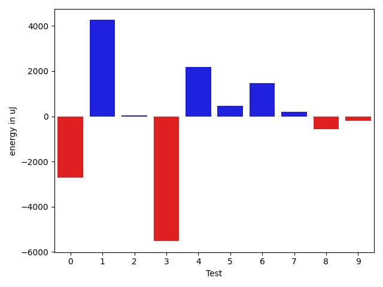
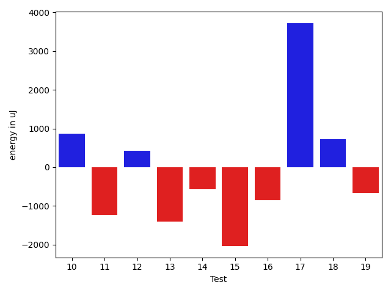
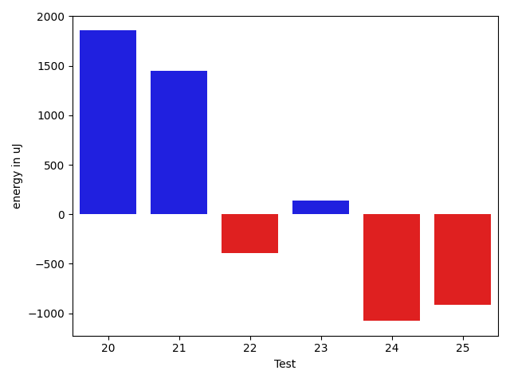

# gson 2780a2

https://github.com/google/gson/commit/2780a2

## Delta Energy per test method

| ID | EnergyV1 | EnergyV2 | DeltaEnergy | σV1 | σV2 |
| --- | --- | --- | --- | --- | --- |
| 0 | 42297 | 42298 | 1 | 19629.53041302553 | 17142.27393980637 |
| 1 | 77698 | 83740 | 6042 | 23979.04439815628 | 20057.14947102836 |
| 2 | 81603 | 84472 | 2869 | 56356.68818990258 | 27833.053596621357 |
| 3 | 77515 | 76110 | -1405 | 25367.7952659235 | 21803.441370395787 |
| 4 | 77331 | 80017 | 2686 | 22140.665685503795 | 20546.73294583532 |
| 5 | 36926 | 38025 | 1099 | 3817.1551313720015 | 2886.3657672581967 |
| 6 | 37109 | 37841 | 732 | 3752.0182886891484 | 3443.344200791429 |
| 7 | 35461 | 37110 | 1649 | 5356.900120689865 | 4912.233227938723 |
| 8 | 41137 | 42114 | 977 | 18449.15677127349 | 19002.410134408387 |
| 9 | 41931 | 42481 | 550 | 13456.906012196629 | 11180.839834468623 |
| 10 | 39672 | 41443 | 1771 | 13537.728486959979 | 14419.2704397508 |
| 11 | 37964 | 38208 | 244 | 4632.82143905772 | 4907.665861193915 |
| 12 | 37536 | 37415 | -121 | 5091.369585150635 | 5993.89721858896 |
| 13 | 38696 | 38147 | -549 | 5358.654977170441 | 5266.5894404633445 |
| 14 | 37231 | 37659 | 428 | 5436.084583994794 | 4949.399206895793 |
| 15 | 40344 | 37842 | -2502 | 4813.244142660161 | 4670.4305564072165 |
| 16 | 40100 | 40711 | 611 | 9056.389973664453 | 6510.413829384715 |
| 17 | 46386 | 75927 | 29541 | 31822.390216921944 | 28190.915424870367 |
| 18 | 38636 | 41076 | 2440 | 6086.066555867506 | 4736.850380459974 |
| 19 | 40405 | 38269 | -2136 | 5659.538792824661 | 6902.3530770600255 |
| 20 | 39184 | 41626 | 2442 | 10148.897722095931 | 10190.978773765735 |
| 21 | 66223 | 46326 | -19897 | 23787.46552084345 | 28209.594805898007 |
| 22 | 39551 | 39490 | -61 | 4521.588120374909 | 5013.616211602298 |
| 23 | 38574 | 38696 | 122 | 4990.608652308066 | 4576.637366152929 |
| 24 | 40710 | 38879 | -1831 | 6147.313833179498 | 5350.664318789477 |
| 25 | 38391 | 37841 | -550 | 5048.629774165552 | 5402.954597460747 |

## Delta Duration per test method

| ID | DurationV1 | DurationsV2 | DeltaDuration |
| --- | --- | --- | --- |
| 0 | 1696158.292929293 | 1697322.3434343433 | 1164.050505050458 |
| 1 | 2454644.262626263 | 2499118.595959596 | 44474.33333333302 |
| 2 | 2710871.474747475 | 2638564.868686869 | -72306.60606060596 |
| 3 | 2313298.131313131 | 2289016.8383838385 | -24281.292929292656 |
| 4 | 2303292.0303030303 | 2349925.787878788 | 46633.7575757578 |
| 5 | 882575.387755102 | 878556.34 | -4019.047755102045 |
| 6 | 855022.4782608695 | 878817.9318181818 | 23795.453557312256 |
| 7 | 960372.3333333334 | 966710.1666666666 | 6337.833333333256 |
| 8 | 1398746.9589041097 | 1450068.3333333333 | 51321.37442922359 |
| 9 | 1389740.7625 | 1373662.4545454546 | -16078.307954545366 |
| 10 | 1399937.9318181819 | 1399779.7647058824 | -158.16711229947396 |
| 11 | 775422.6382978724 | 806952.641025641 | 31530.002727768617 |
| 12 | 1200005.4736842106 | 1230503.8481012657 | 30498.374417055165 |
| 13 | 767514.4594594594 | 816144.0 | 48629.54054054059 |
| 14 | 880806.2765957447 | 955170.4634146341 | 74364.18681888946 |
| 15 | 823749.4883720931 | 899654.3111111111 | 75904.82273901801 |
| 16 | 1315183.4342105263 | 1221668.0625 | -93515.37171052629 |
| 17 | 2194663.6464646463 | 2183968.616161616 | -10695.030303030275 |
| 18 | 1045203.25 | 953781.1020408163 | -91422.14795918367 |
| 19 | 990306.344262295 | 1006534.82 | 16228.475737704895 |
| 20 | 1318790.2352941176 | 1345193.325 | 26403.08970588236 |
| 21 | 2085307.111111111 | 2114269.1818181816 | 28962.07070707064 |
| 22 | 987933.7222222222 | 1013618.5689655172 | 25684.84674329497 |
| 23 | 773158.2156862745 | 806434.8181818182 | 33276.602495543775 |
| 24 | 867060.6 | 953621.5576923077 | 86560.95769230777 |
| 25 | 963418.1363636364 | 999831.4 | 36413.26363636367 |

## Misc.

| ID | Test Class | Test Method |
| --- | --- | --- |
| 0 | com.google.gson.functional.ParameterizedTypesTest | testParameterizedTypeGenericArraysSerialization |
| 1 | com.google.gson.functional.ParameterizedTypesTest | testVariableTypeArrayDeserialization |
| 2 | com.google.gson.functional.ParameterizedTypesTest | testVariableTypeDeserialization |
| 3 | com.google.gson.functional.ParameterizedTypesTest | testParameterizedTypeGenericArraysDeserialization |
| 4 | com.google.gson.functional.ParameterizedTypesTest | testParameterizedTypeWithVariableTypeDeserialization |
| 5 | com.google.gson.functional.DefaultTypeAdaptersTest | testBadValueForBigDecimalDeserialization |
| 6 | com.google.gson.functional.DefaultTypeAdaptersTest | testBigDecimalFieldDeserialization |
| 7 | com.google.gson.functional.DefaultTypeAdaptersTest | testBigIntegerFieldDeserialization |
| 8 | com.google.gson.functional.CustomDeserializerTest | testCustomDeserializerReturnsNull |
| 9 | com.google.gson.functional.InheritanceTest | testSubClassDeserialization |
| 10 | com.google.gson.functional.InheritanceTest | testSubInterfacesOfCollectionDeserialization |
| 11 | com.google.gson.functional.NamingPolicyTest | testGsonWithUpperCamelCaseSpacesPolicyDeserialiation |
| 12 | com.google.gson.functional.NamingPolicyTest | testComplexFieldNameStrategy |
| 13 | com.google.gson.functional.NamingPolicyTest | testGsonWithLowerCaseUnderscorePolicyDeserialiation |
| 14 | com.google.gson.functional.NamingPolicyTest | testGsonWithNonDefaultFieldNamingPolicyDeserialiation |
| 15 | com.google.gson.functional.NamingPolicyTest | testGsonWithLowerCaseDashPolicyDeserialiation |
| 16 | com.google.gson.functional.NullObjectAndFieldTest | testPrintPrintingObjectWithNulls |
| 17 | com.google.gson.functional.NullObjectAndFieldTest | testExplicitSerializationOfNullArrayMembers |
| 18 | com.google.gson.functional.NullObjectAndFieldTest | testExplicitSerializationOfNullStringMembers |
| 19 | com.google.gson.functional.NullObjectAndFieldTest | testExplicitSerializationOfNullCollectionMembers |
| 20 | com.google.gson.functional.CollectionTest | testSetDeserialization |
| 21 | com.google.gson.functional.CollectionTest | testWildcardCollectionField |
| 22 | com.google.gson.functional.ExposeFieldsTest | testExposeAnnotationDeserialization |
| 23 | com.google.gson.functional.ExposeFieldsTest | testExposedInterfaceFieldDeserialization |
| 24 | com.google.gson.functional.CustomTypeAdaptersTest | testEnsureCustomDeserializerNotInvokedForNullValues |
| 25 | com.google.gson.functional.ObjectTest | testBagOfPrimitiveWrappersDeserialization |

| Test | IterationV1 | IterationV2 | DeltaIteration |
| --- | --- | --- | --- |
| 0 | 99 | 99 | 0 |
| 1 | 99 | 99 | 0 |
| 2 | 99 | 99 | 0 |
| 3 | 99 | 99 | 0 |
| 4 | 99 | 99 | 0 |
| 5 | 49 | 50 | 1 |
| 6 | 46 | 44 | -2 |
| 7 | 57 | 54 | -3 |
| 8 | 73 | 75 | 2 |
| 9 | 80 | 66 | -14 |
| 10 | 88 | 85 | -3 |
| 11 | 47 | 39 | -8 |
| 12 | 76 | 79 | 3 |
| 13 | 37 | 50 | 13 |
| 14 | 47 | 41 | -6 |
| 15 | 43 | 45 | 2 |
| 16 | 76 | 80 | 4 |
| 17 | 99 | 99 | 0 |
| 18 | 56 | 49 | -7 |
| 19 | 61 | 50 | -11 |
| 20 | 85 | 80 | -5 |
| 21 | 99 | 99 | 0 |
| 22 | 54 | 58 | 4 |
| 23 | 51 | 33 | -18 |
| 24 | 50 | 52 | 2 |
| 25 | 44 | 45 | 1 |

| Time Label | Time (s) |
| --- | --- |
| Selection | 29.079599618911743 |
| Injection | 12.33726954460144 |
| Total | 1146.4736351966858 |

