# gson b5f8ef

https://github.com/google/gson/commit/b5f8ef

## Delta Energy per test method

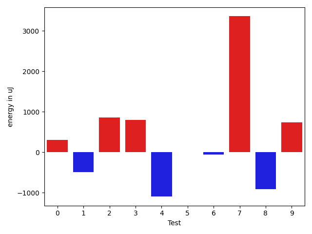

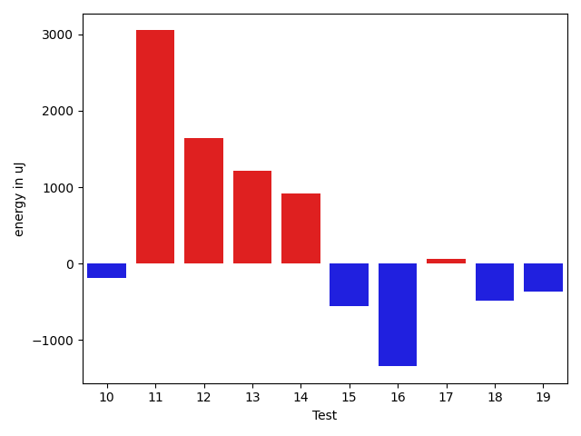

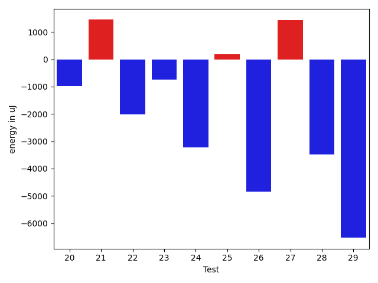

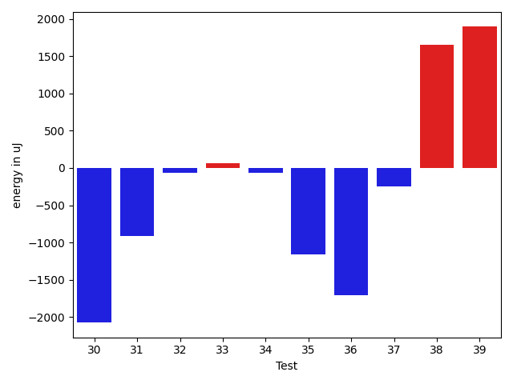

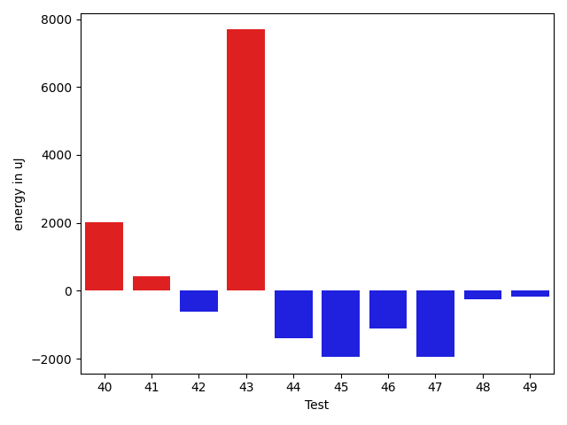

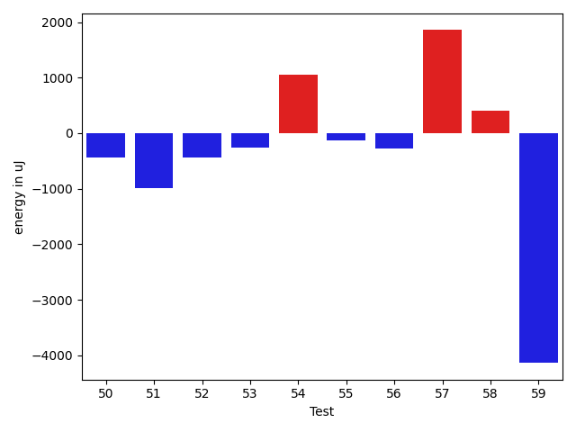

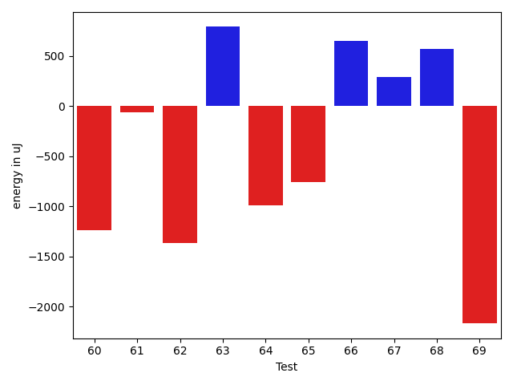

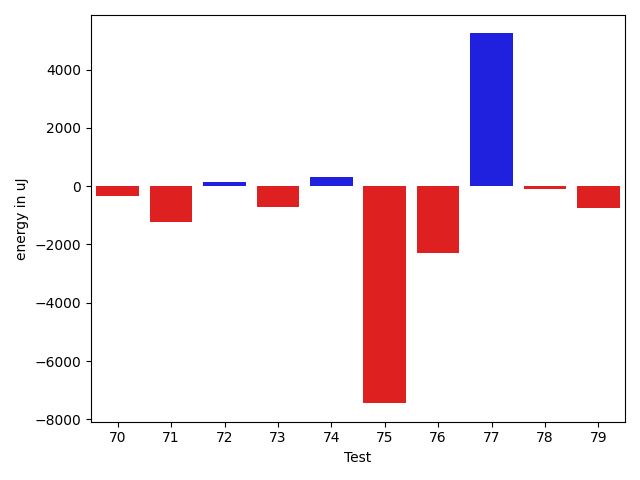

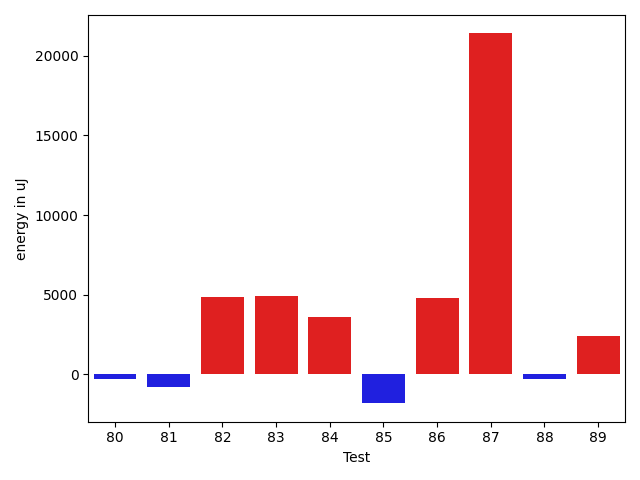

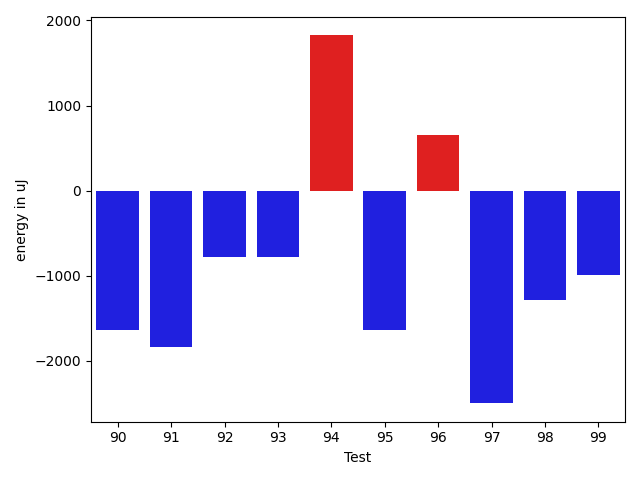

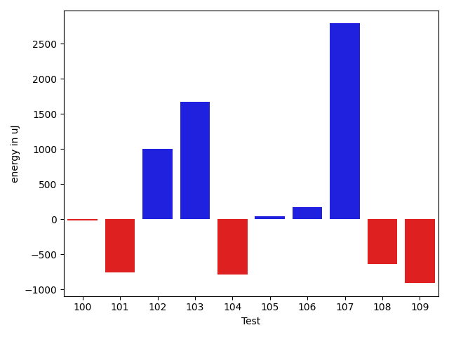

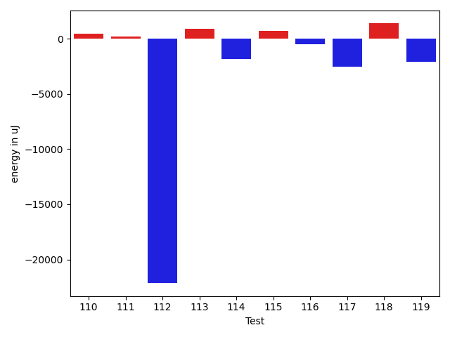

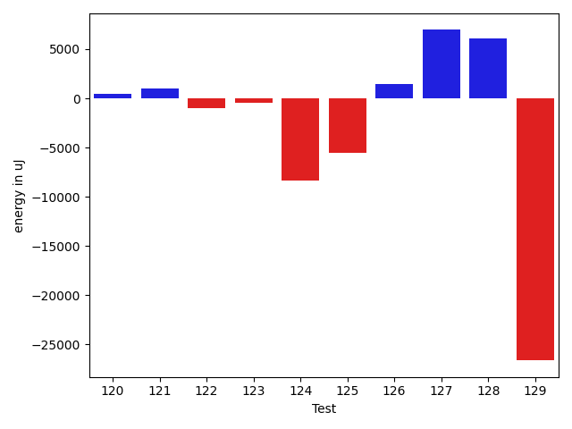

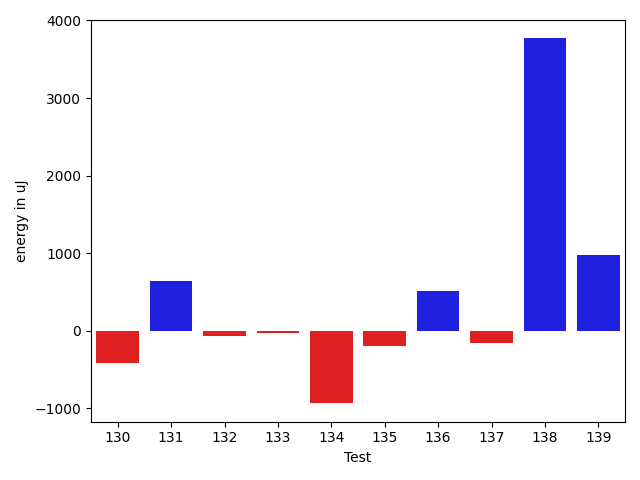

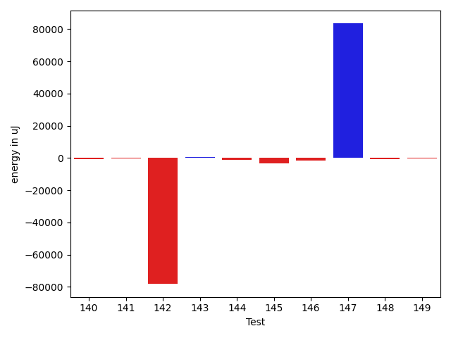

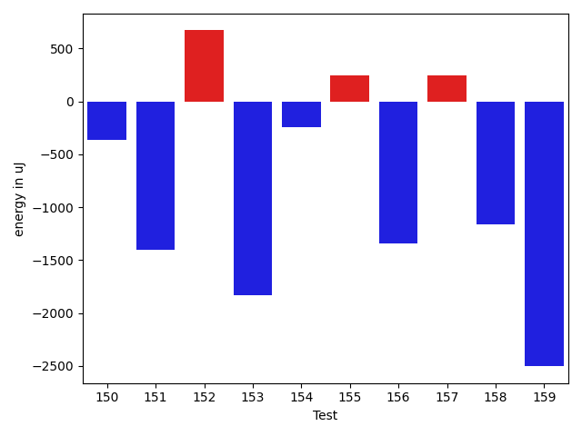

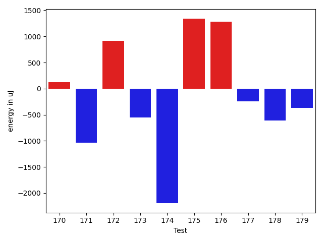

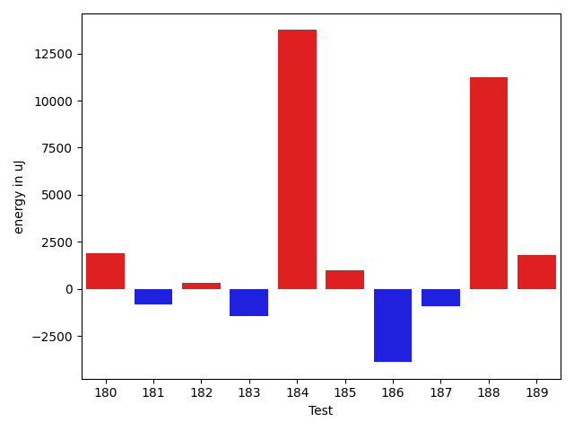

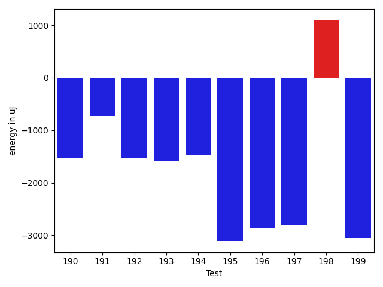

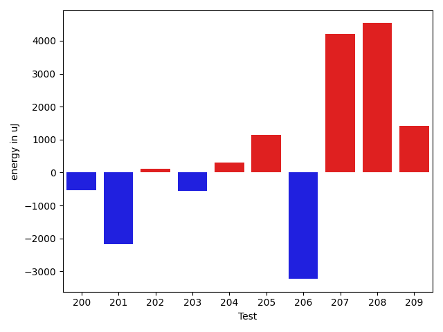

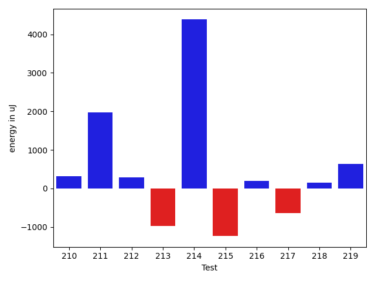

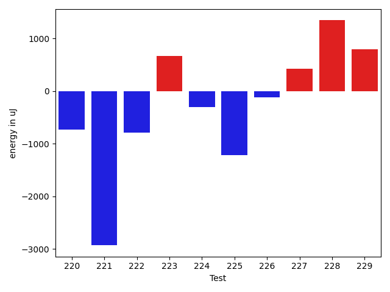

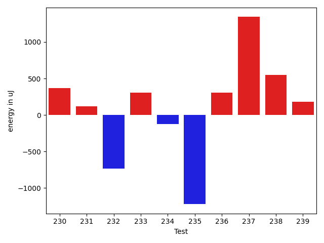

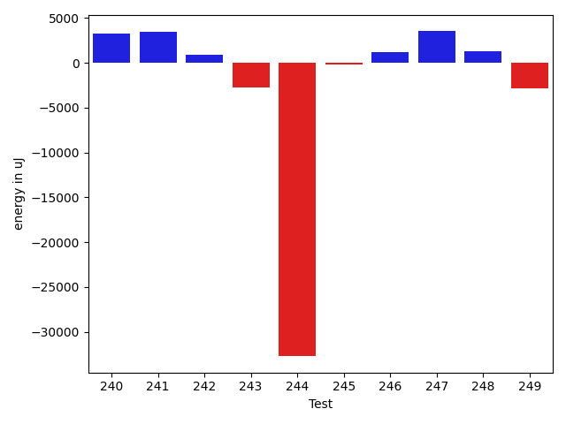

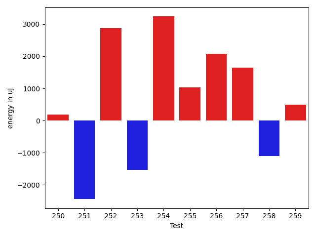

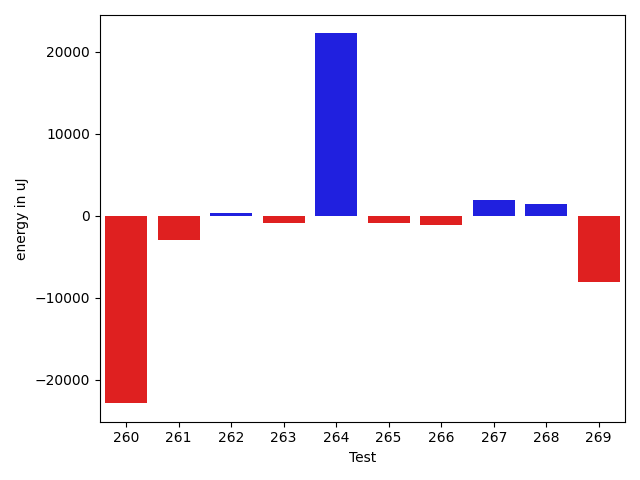

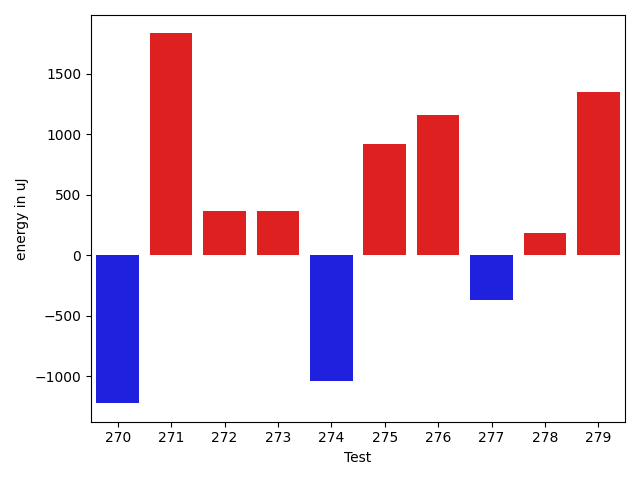

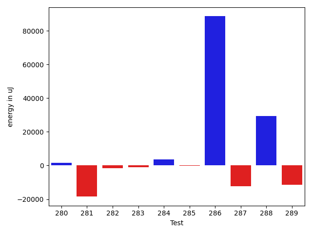

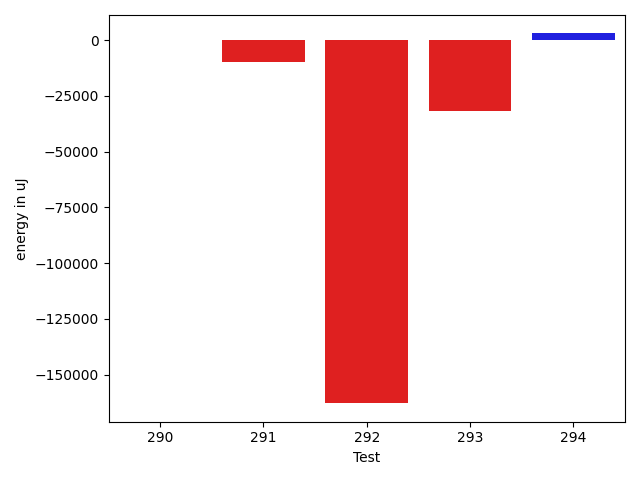

| ID | EnergyV1 | EnergyV2 | DeltaEnergy | σV1 | σV2 |
| --- | --- | --- | --- | --- | --- |
| 0 | 40588 | 40894 | 306 | 3758.8908148174323 | 8356.893353062656 |
| 1 | 41077 | 40588 | -489 | 3605.0413015109825 | 4053.800433733933 |
| 2 | 39063 | 39917 | 854 | 3678.832589723417 | 9996.953306629504 |
| 3 | 39856 | 40649 | 793 | 4044.404040534411 | 3584.945618000874 |
| 4 | 42663 | 41565 | -1098 | 18231.291397535508 | 23864.179787692232 |
| 5 | 43396 | 43396 | 0 | 176433.1169906561 | 264302.3807845115 |
| 6 | 41382 | 41320 | -62 | 4044.198123626037 | 3637.6810128697757 |
| 7 | 82214 | 85571 | 3357 | 26925.352306624198 | 32979.676538697015 |
| 8 | 41077 | 40161 | -916 | 3379.993012630662 | 3396.518839772304 |
| 9 | 40650 | 41381 | 731 | 13878.548067797155 | 10920.286674384195 |
| 10 | 41626 | 41443 | -183 | 4885.455202939697 | 3905.9668638611925 |
| 11 | 39917 | 42969 | 3052 | 4114.991995784418 | 3878.305514779942 |
| 12 | 39612 | 41259 | 1647 | 3552.9372396862454 | 3131.4778722512306 |
| 13 | 40283 | 41504 | 1221 | 15819.231363991743 | 13365.705539394075 |
| 14 | 38269 | 39185 | 916 | 3741.379230071428 | 2903.7160589652376 |
| 15 | 40527 | 39977 | -550 | 4157.744950922684 | 3601.007501727815 |
| 16 | 41992 | 40649 | -1343 | 6036.402083099133 | 3778.4316882892094 |
| 17 | 44617 | 44677 | 60 | 91185.70526027917 | 20392.769542233968 |
| 18 | 40283 | 39795 | -488 | 3710.7867899595435 | 3362.781305044316 |
| 19 | 41747 | 41382 | -365 | 16835.833588310263 | 16059.572471013531 |
| 20 | 42724 | 42236 | -488 | 11564.817300938294 | 9912.99833302807 |
| 21 | 40100 | 41077 | 977 | 3859.0665767533833 | 3603.5895632337088 |
| 22 | 42053 | 43396 | 1343 | 34228.684617056286 | 28967.290136808693 |
| 23 | 39917 | 39917 | 0 | 4121.361647206077 | 4626.245985268511 |
| 24 | 148804 | 144409 | -4395 | 26119.33772023282 | 26803.14746230625 |
| 25 | 288269 | 288085 | -184 | 53609.23885296113 | 51084.30278657317 |
| 26 | 127258 | 119629 | -7629 | 22763.858103976625 | 23921.46692813972 |
| 27 | 129150 | 128662 | -488 | 25496.46734510273 | 25978.85495770705 |
| 28 | 124450 | 122436 | -2014 | 25958.9070666995 | 32129.00567579923 |
| 29 | 164794 | 165649 | 855 | 28889.35560056005 | 24059.763565197038 |
| 30 | 168090 | 166016 | -2074 | 28905.128508537935 | 29335.280787452604 |
| 31 | 41809 | 40893 | -916 | 4454.093240435015 | 4353.122023880436 |
| 32 | 40466 | 40405 | -61 | 12334.669974159364 | 10588.911517175477 |
| 33 | 39612 | 39673 | 61 | 4050.728403340952 | 3921.4923914860306 |
| 34 | 39977 | 39917 | -60 | 3629.0649069375204 | 3812.00510282702 |
| 35 | 40344 | 39185 | -1159 | 4085.0154902467084 | 4092.0049636116305 |
| 36 | 42236 | 40527 | -1709 | 3854.2538312305733 | 4082.075218189459 |
| 37 | 39246 | 39001 | -245 | 3516.9849768658382 | 2826.1814966613533 |
| 38 | 39978 | 41626 | 1648 | 4421.854229334654 | 4247.298129211087 |
| 39 | 42968 | 44861 | 1893 | 15750.860074372096 | 16550.12596962767 |
| 40 | 36377 | 38391 | 2014 | 3374.3395007507074 | 4692.8357133119525 |
| 41 | 40344 | 40771 | 427 | 3202.431133518807 | 3478.8678186425504 |
| 42 | 42541 | 41931 | -610 | 24131.813407015514 | 21442.982909454884 |
| 43 | 68664 | 76354 | 7690 | 43455.54756285029 | 37217.7930020806 |
| 44 | 41321 | 39917 | -1404 | 3600.898217625918 | 35780.28808166465 |
| 45 | 41931 | 39978 | -1953 | 4155.426766587249 | 4253.538799927092 |
| 46 | 40589 | 39489 | -1100 | 3879.0790748541413 | 3711.7951319882745 |
| 47 | 41259 | 39306 | -1953 | 4979.447941768641 | 5271.921315723867 |
| 48 | 40528 | 40283 | -245 | 4021.4502669852377 | 3865.698976170353 |
| 49 | 43579 | 43396 | -183 | 75577.33471779437 | 87328.23194165161 |
| 50 | 40710 | 40649 | -61 | 4029.666397383569 | 4287.670472401533 |
| 51 | 42785 | 43945 | 1160 | 20921.138946142954 | 16651.24818178042 |
| 52 | 41260 | 40039 | -1221 | 5404.170626840742 | 6150.335559182754 |
| 53 | 40038 | 40772 | 734 | 3917.1550725267725 | 4433.542819052801 |
| 54 | 41198 | 40832 | -366 | 4431.930516702094 | 3926.188472605392 |
| 55 | 41077 | 40467 | -610 | 4490.650782261392 | 3981.497954286513 |
| 56 | 41443 | 40405 | -1038 | 4378.196952223308 | 4142.968082809567 |
| 57 | 39978 | 41443 | 1465 | 4190.295390902383 | 3925.728255985601 |
| 58 | 39978 | 41016 | 1038 | 4390.136759883954 | 3943.5355624424787 |
| 59 | 40954 | 40528 | -426 | 24665.695266035462 | 3742.45155553428 |
| 60 | 41565 | 40222 | -1343 | 4986.680596745818 | 6931.010682703374 |
| 61 | 41016 | 41198 | 182 | 3784.355122078265 | 4039.371082422609 |
| 62 | 41687 | 38941 | -2746 | 4724.272326571442 | 4817.78617905484 |
| 63 | 41077 | 39917 | -1160 | 4468.168357512324 | 3500.5804079477743 |
| 64 | 41687 | 41138 | -549 | 10884.523849442454 | 9183.664545649752 |
| 65 | 41199 | 40344 | -855 | 4924.843247790342 | 5915.191556562344 |
| 66 | 41260 | 41626 | 366 | 4341.323703571154 | 4008.006147971152 |
| 67 | 41259 | 41198 | -61 | 3840.1034021089704 | 4454.851915300621 |
| 68 | 39795 | 40954 | 1159 | 4493.442835425355 | 3827.794760322605 |
| 69 | 40649 | 40832 | 183 | 10915.225100561407 | 6683.407125559596 |
| 70 | 40894 | 39795 | -1099 | 4189.161879869624 | 4450.159019526185 |
| 71 | 41260 | 40283 | -977 | 3903.0625103884777 | 3449.545512561326 |
| 72 | 41504 | 41870 | 366 | 8201.408407540983 | 6414.38483672806 |
| 73 | 42420 | 41504 | -916 | 13449.097606894227 | 13234.97921939003 |
| 74 | 40405 | 40039 | -366 | 4792.052118414407 | 4326.113237746851 |
| 75 | 41626 | 39917 | -1709 | 45324.21241129673 | 4423.750999005298 |
| 76 | 42725 | 40283 | -2442 | 3974.834380325854 | 4112.596375478634 |
| 77 | 40894 | 41809 | 915 | 22017.643584855457 | 29002.059914475805 |
| 78 | 41931 | 40344 | -1587 | 4022.7002916162487 | 4441.237916802004 |
| 79 | 39245 | 39428 | 183 | 3672.4639371408402 | 3449.9988365537492 |
| 80 | 41748 | 40894 | -854 | 4418.726831339238 | 4757.381016811638 |
| 81 | 41016 | 39977 | -1039 | 4087.216161742136 | 5318.746998291603 |
| 82 | 81665 | 84290 | 2625 | 48453.534088966524 | 52083.38596632492 |
| 83 | 41442 | 42480 | 1038 | 6904.4455972905835 | 21374.424406383936 |
| 84 | 42358 | 41565 | -793 | 11679.88455611873 | 18524.590194596887 |
| 85 | 42969 | 40771 | -2198 | 8139.355767572217 | 6986.352115059762 |
| 86 | 43396 | 44129 | 733 | 30427.79239306406 | 34461.07751739393 |
| 87 | 43640 | 45715 | 2075 | 94466.782506028 | 119162.02252813571 |
| 88 | 41015 | 40649 | -366 | 3967.5800781668754 | 4544.716519751034 |
| 89 | 41321 | 41747 | 426 | 8466.184062067985 | 11900.853300831286 |
| 90 | 39612 | 38635 | -977 | 3777.1592163995083 | 4174.186265169699 |
| 91 | 42053 | 41443 | -610 | 11354.053458872893 | 7457.695645842673 |
| 92 | 40893 | 39489 | -1404 | 4375.784658651392 | 4568.565797219037 |
| 93 | 39977 | 39489 | -488 | 3577.5598960628677 | 3365.3671880459783 |
| 94 | 44251 | 44434 | 183 | 18599.846804312678 | 19938.016063839317 |
| 95 | 39734 | 39612 | -122 | 3605.5092178114296 | 4992.704606443009 |
| 96 | 38574 | 41565 | 2991 | 3976.8231352285316 | 3736.6166237519483 |
| 97 | 44434 | 43579 | -855 | 41919.92175290737 | 42617.76430599532 |
| 98 | 41382 | 40222 | -1160 | 3181.1167640014314 | 3846.190543329916 |
| 99 | 42480 | 41321 | -1159 | 3531.155597666945 | 2954.8046322778355 |
| 100 | 42725 | 42786 | 61 | 4127.07867958681 | 3776.4656489611993 |
| 101 | 41321 | 39612 | -1709 | 5126.872925257221 | 4986.404984221264 |
| 102 | 39245 | 42480 | 3235 | 3387.47600465284 | 3488.598613442694 |
| 103 | 39124 | 41199 | 2075 | 3466.8853480507437 | 3039.536510628879 |
| 104 | 41077 | 41443 | 366 | 4658.8414026283135 | 4582.999445777841 |
| 105 | 39489 | 40893 | 1404 | 4689.433855943951 | 4124.153349191253 |
| 106 | 40771 | 41503 | 732 | 6332.741302022 | 6467.061821505545 |
| 107 | 86243 | 85449 | -794 | 34332.76398763296 | 42634.57127282973 |
| 108 | 41626 | 40039 | -1587 | 3770.8985692701767 | 4080.177598603961 |
| 109 | 43151 | 42175 | -976 | 2735.366241972172 | 3330.559163258536 |
| 110 | 41565 | 41381 | -184 | 7919.225775658259 | 9717.26861988853 |
| 111 | 44006 | 46021 | 2015 | 20656.966922064814 | 20257.457059181896 |
| 112 | 43640 | 40588 | -3052 | 65355.7630827948 | 21460.26503601959 |
| 113 | 40588 | 42114 | 1526 | 3593.336444712346 | 3948.125267057138 |
| 114 | 42725 | 41382 | -1343 | 15331.809596063913 | 16611.603372536454 |
| 115 | 39978 | 41015 | 1037 | 4269.027154377418 | 4511.3977611160335 |
| 116 | 41687 | 40344 | -1343 | 4200.702344633409 | 4048.0903807777613 |
| 117 | 42175 | 40588 | -1587 | 16359.070860411905 | 14130.465939546551 |
| 118 | 40649 | 42297 | 1648 | 7061.883002566618 | 5720.71123134178 |
| 119 | 42358 | 41259 | -1099 | 9436.578134276086 | 6857.502699780729 |
| 120 | 40954 | 40893 | -61 | 3885.606251912767 | 3946.468359145035 |
| 121 | 41809 | 40283 | -1526 | 3187.9433083753183 | 11735.570635695534 |
| 122 | 41504 | 41015 | -489 | 7584.606733503268 | 6349.886786185122 |
| 123 | 41382 | 40771 | -611 | 3755.9625236714455 | 3956.41034368984 |
| 124 | 42176 | 40344 | -1832 | 29936.976730726194 | 4568.97933057963 |
| 125 | 41321 | 40405 | -916 | 29184.691453562933 | 3678.7549369114245 |
| 126 | 40405 | 40161 | -244 | 3306.51074154472 | 3065.9489780168337 |
| 127 | 42053 | 41016 | -1037 | 2874.6146254581604 | 32509.83257127757 |
| 128 | 86548 | 87219 | 671 | 33139.74553373348 | 43410.05114970398 |
| 129 | 91308 | 87890 | -3418 | 290385.1391681403 | 210596.8112191297 |
| 130 | 39428 | 39550 | 122 | 3774.1116197590127 | 3987.0104614349634 |
| 131 | 40283 | 40039 | -244 | 4176.562648016857 | 6266.085469707473 |
| 132 | 40710 | 41198 | 488 | 5926.109021527063 | 6575.751859146349 |
| 133 | 40466 | 40894 | 428 | 4855.517623167369 | 3538.9150917571706 |
| 134 | 41199 | 40344 | -855 | 5030.2416504798475 | 3466.5436550290583 |
| 135 | 39917 | 39978 | 61 | 5535.89820469855 | 3926.4071413952984 |
| 136 | 40527 | 41809 | 1282 | 5042.564336449857 | 4508.395879418261 |
| 137 | 42419 | 40650 | -1769 | 4661.633103055195 | 3534.621760196461 |
| 138 | 40893 | 39307 | -1586 | 4146.634290880701 | 26988.078676636593 |
| 139 | 38025 | 40039 | 2014 | 3469.9846233665075 | 3413.8378526953084 |
| 140 | 42725 | 40894 | -1831 | 4432.125233647476 | 3997.5389800946964 |
| 141 | 41748 | 40893 | -855 | 3612.8344517165747 | 3537.0793954725614 |
| 142 | 44311 | 42725 | -1586 | 429076.4146353825 | 40123.34698768134 |
| 143 | 41077 | 41382 | 305 | 4201.932221077887 | 3585.2643510804096 |
| 144 | 40894 | 41198 | 304 | 8616.74886063006 | 4328.658074730688 |
| 145 | 42419 | 42175 | -244 | 21496.98629462601 | 3975.4154008575 |
| 146 | 41870 | 40710 | -1160 | 5365.500224324491 | 5858.555303405061 |
| 147 | 177673 | 210143 | 32470 | 180506.5831337838 | 357863.51188318996 |
| 148 | 41504 | 42114 | 610 | 4263.054559105834 | 4624.171297338387 |
| 149 | 41748 | 41809 | 61 | 9062.975812787376 | 9732.140522067808 |
| 150 | 41748 | 41381 | -367 | 6574.928306277336 | 9861.856858297968 |
| 151 | 42053 | 40649 | -1404 | 3525.2183046053833 | 4926.147114012014 |
| 152 | 40833 | 41504 | 671 | 3750.769447481845 | 4677.458784453829 |
| 153 | 42480 | 40649 | -1831 | 24197.61765454938 | 34692.7447227803 |
| 154 | 40650 | 40405 | -245 | 3766.7016906786594 | 4175.750414873003 |
| 155 | 42786 | 43029 | 243 | 345859.0784906957 | 561450.4323865658 |
| 156 | 41321 | 39978 | -1343 | 5082.769099107665 | 4879.021841607846 |
| 157 | 40344 | 40589 | 245 | 4115.452733296787 | 4621.506192127299 |
| 158 | 43091 | 41931 | -1160 | 9666.4953626386 | 23697.55323251181 |
| 159 | 42603 | 40100 | -2503 | 3957.793959688704 | 4183.8743542544835 |
| 160 | 42298 | 41626 | -672 | 11044.689653808538 | 10498.485296974697 |
| 161 | 42297 | 42846 | 549 | 39068.12493799643 | 145791.14407653292 |
| 162 | 41748 | 41198 | -550 | 3761.937182949567 | 4186.553863700085 |
| 163 | 42053 | 41137 | -916 | 3779.8935955445254 | 3921.965184999998 |
| 164 | 126159 | 125122 | -1037 | 250527.51207249792 | 247637.3489188341 |
| 165 | 40161 | 41870 | 1709 | 30510.53397796252 | 6947.778335806794 |
| 166 | 85022 | 85327 | 305 | 596552.7112797527 | 319658.14844460343 |
| 167 | 44250 | 43091 | -1159 | 25510.44778432447 | 24588.937864253112 |
| 168 | 42602 | 42908 | 306 | 31517.989555086 | 17407.096732783604 |
| 169 | 41626 | 41687 | 61 | 13352.11532982053 | 9806.837174191847 |
| 170 | 41565 | 41687 | 122 | 13320.119466232429 | 10567.123572174409 |
| 171 | 89660 | 88623 | -1037 | 227741.8513964464 | 333248.71797856933 |
| 172 | 42725 | 43640 | 915 | 23377.70403985554 | 13219.347401408886 |
| 173 | 41564 | 41015 | -549 | 17589.086520619643 | 10735.202506857888 |
| 174 | 41626 | 39428 | -2198 | 4245.523946493167 | 6166.866259896969 |
| 175 | 38940 | 40283 | 1343 | 2531.0900614968805 | 3496.037623700084 |
| 176 | 41259 | 42541 | 1282 | 3871.53142251946 | 2755.31191519218 |
| 177 | 40832 | 40588 | -244 | 2975.7683610864233 | 3644.980306874099 |
| 178 | 42297 | 41687 | -610 | 2503.5882865586645 | 3701.396251399807 |
| 179 | 41321 | 40955 | -366 | 3085.3861877405234 | 50932.6407967675 |
| 180 | 41199 | 42114 | 915 | 3383.8673928723 | 3561.317766683299 |
| 181 | 40833 | 41199 | 366 | 4148.809562693858 | 4761.6216607370225 |
| 182 | 40406 | 41138 | 732 | 3073.1980638812965 | 4901.3762553741535 |
| 183 | 43335 | 41381 | -1954 | 4128.668299036553 | 4207.573799742176 |
| 184 | 43335 | 45471 | 2136 | 61346.66167819235 | 74678.265662503 |
| 185 | 38879 | 40527 | 1648 | 6296.810890928986 | 7535.355710645013 |
| 186 | 44556 | 44982 | 426 | 42360.30858672359 | 36640.63357401596 |
| 187 | 42785 | 42358 | -427 | 3761.498325424845 | 4802.703233182409 |
| 188 | 41381 | 42969 | 1588 | 3998.6015046612965 | 43845.243983767425 |
| 189 | 40039 | 42298 | 2259 | 3178.3848850491113 | 4549.508252420582 |
| 190 | 43091 | 41565 | -1526 | 2868.5614898121553 | 5550.598038349862 |
| 191 | 40894 | 40161 | -733 | 3838.8712107871474 | 3475.6966625411947 |
| 192 | 43091 | 41565 | -1526 | 24261.453938346214 | 21421.96644944345 |
| 193 | 40832 | 39245 | -1587 | 4541.111176332783 | 3712.936033653152 |
| 194 | 42664 | 41198 | -1466 | 4300.92414668703 | 4618.139825730702 |
| 195 | 42907 | 39794 | -3113 | 4846.96689394573 | 3010.139842019322 |
| 196 | 42663 | 39795 | -2868 | 3774.4373377951515 | 3251.098883454639 |
| 197 | 43456 | 40649 | -2807 | 19646.51236449244 | 21669.096883422782 |
| 198 | 39978 | 41076 | 1098 | 4109.159369046376 | 3601.3749405753188 |
| 199 | 42419 | 39368 | -3051 | 5275.125391513814 | 2186.471589113383 |
| 200 | 41504 | 40039 | -1465 | 3734.3748392468583 | 3303.809399538123 |
| 201 | 41931 | 37354 | -4577 | 4201.717325331924 | 3496.216380925031 |
| 202 | 40588 | 40710 | 122 | 4031.6592083555797 | 3703.51079558542 |
| 203 | 43029 | 41199 | -1830 | 5302.9232798994935 | 5159.341907216031 |
| 204 | 39917 | 40528 | 611 | 3940.7856423928897 | 3815.097277183768 |
| 205 | 40710 | 40832 | 122 | 3793.684696999332 | 6652.545777284751 |
| 206 | 41259 | 40771 | -488 | 23463.444929376074 | 3638.1576458714676 |
| 207 | 42541 | 43701 | 1160 | 18515.422184035153 | 21296.862505719535 |
| 208 | 41138 | 42175 | 1037 | 30977.241745616277 | 33147.450666972494 |
| 209 | 41016 | 41260 | 244 | 3788.9926759254113 | 3633.4536716629514 |
| 210 | 42053 | 41687 | -366 | 4105.437652479939 | 4070.982845481273 |
| 211 | 40527 | 43762 | 3235 | 4368.975175209539 | 4385.369928314288 |
| 212 | 41321 | 41504 | 183 | 4202.984263401423 | 3676.09001653076 |
| 213 | 40833 | 40283 | -550 | 3952.8330157731098 | 4295.079756072105 |
| 214 | 42603 | 43396 | 793 | 266646.9002023379 | 256517.43825976853 |
| 215 | 40772 | 40711 | -61 | 3682.0056497211626 | 3564.068821444928 |
| 216 | 40406 | 40894 | 488 | 3693.4145052506974 | 3571.0309687897416 |
| 217 | 41870 | 40589 | -1281 | 4546.103151158076 | 4438.565031936777 |
| 218 | 39123 | 40161 | 1038 | 3660.9421746139815 | 3807.2267223395784 |
| 219 | 40466 | 41504 | 1038 | 3797.340025575965 | 3307.2086954669044 |
| 220 | 42908 | 42176 | -732 | 5063.206273978297 | 4101.548214927505 |
| 221 | 75745 | 72814 | -2931 | 25566.07220885023 | 23818.54285319367 |
| 222 | 43273 | 42480 | -793 | 29629.693435438105 | 10047.868356350009 |
| 223 | 42237 | 42907 | 670 | 70896.93679050346 | 58915.23020823792 |
| 224 | 44067 | 43762 | -305 | 366408.2002927506 | 335141.76740357437 |
| 225 | 43396 | 42176 | -1220 | 5556.339985992651 | 3652.94393031493 |
| 226 | 43334 | 43213 | -121 | 37744.05796975329 | 35569.67358359973 |
| 227 | 41931 | 42358 | 427 | 9255.931737396497 | 14284.657039542246 |
| 228 | 83679 | 85021 | 1342 | 34238.39429244195 | 42779.88939734053 |
| 229 | 40161 | 40955 | 794 | 9701.824033636007 | 5390.581223659665 |
| 230 | 40832 | 41199 | 367 | 4067.0099400919817 | 7146.387054226736 |
| 231 | 41687 | 41808 | 121 | 11843.782531536155 | 14832.789620656527 |
| 232 | 42724 | 41992 | -732 | 99961.72334752786 | 113549.8068174552 |
| 233 | 44067 | 44372 | 305 | 66626.90946920605 | 81121.1112100951 |
| 234 | 41931 | 41809 | -122 | 11433.234380374717 | 13746.521418622568 |
| 235 | 440123 | 438903 | -1220 | 152120.5663974853 | 184244.98890825632 |
| 236 | 43884 | 44189 | 305 | 21552.611129785717 | 24328.22314065303 |
| 237 | 45288 | 46631 | 1343 | 79573.16330720279 | 85494.03062461839 |
| 238 | 41809 | 42359 | 550 | 3316.146078858187 | 7918.838006436044 |
| 239 | 41320 | 41504 | 184 | 10004.786787097137 | 10530.828468654587 |
| 240 | 41504 | 40588 | -916 | 6794.685430213496 | 25771.141575282505 |
| 241 | 42419 | 42542 | 123 | 4333.667666641959 | 27866.759468321867 |
| 242 | 41199 | 42053 | 854 | 4292.053920723554 | 4066.959904181774 |
| 243 | 45227 | 43945 | -1282 | 48699.830588255565 | 56367.17928450217 |
| 244 | 43029 | 42114 | -915 | 255213.32565575908 | 39151.69006608963 |
| 245 | 41138 | 42724 | 1586 | 4312.291215259109 | 4386.307500242817 |
| 246 | 39794 | 40527 | 733 | 4362.50136210867 | 3762.8638024905645 |
| 247 | 43762 | 42663 | -1099 | 42883.383231145875 | 52954.09911735425 |
| 248 | 42114 | 41809 | -305 | 13244.577489257272 | 16131.973221760096 |
| 249 | 42664 | 41687 | -977 | 297165.19045760104 | 296645.54208720685 |
| 250 | 42420 | 42602 | 182 | 527465.696775271 | 428429.6167157929 |
| 251 | 40284 | 37841 | -2443 | 4470.908216794037 | 5244.919640795272 |
| 252 | 39245 | 42114 | 2869 | 7488.02106593793 | 4678.184278829092 |
| 253 | 41687 | 40161 | -1526 | 7177.471334999481 | 4627.352437916455 |
| 254 | 39124 | 42359 | 3235 | 4245.218919915031 | 4716.7223030353 |
| 255 | 40283 | 41321 | 1038 | 5233.828406869039 | 4220.1616762078365 |
| 256 | 39917 | 41992 | 2075 | 3886.6373496249944 | 3767.76236946112 |
| 257 | 40222 | 41870 | 1648 | 3804.2317295965468 | 3927.711253247734 |
| 258 | 42969 | 41870 | -1099 | 9732.63840284937 | 6312.273572362319 |
| 259 | 41259 | 41748 | 489 | 4471.705232857141 | 3445.631285357606 |
| 260 | 43396 | 42420 | -976 | 89014.38662635004 | 11938.147355545569 |
| 261 | 41443 | 40832 | -611 | 11048.660132313558 | 4474.745372490173 |
| 262 | 41077 | 42114 | 1037 | 11797.3318414281 | 11307.069222227316 |
| 263 | 42785 | 42846 | 61 | 5760.478525743808 | 6724.094881758355 |
| 264 | 43335 | 43396 | 61 | 94916.23456552283 | 137881.62060311012 |
| 265 | 40954 | 40162 | -792 | 3623.194399973592 | 4260.982186202582 |
| 266 | 41138 | 40528 | -610 | 3877.539655582164 | 4130.751819411665 |
| 267 | 40344 | 42358 | 2014 | 4450.354441426096 | 3519.078705322752 |
| 268 | 41565 | 42786 | 1221 | 4558.169832533911 | 4221.584296603982 |
| 269 | 41504 | 40832 | -672 | 40577.980863554105 | 32416.143842846857 |
| 270 | 43335 | 42114 | -1221 | 2499.3473362345735 | 4440.8110057610975 |
| 271 | 41931 | 43762 | 1831 | 45172.30882538577 | 67382.60330649403 |
| 272 | 42115 | 42480 | 365 | 55055.30067023349 | 53537.47669266771 |
| 273 | 43518 | 43884 | 366 | 50733.294258382055 | 50846.10666132994 |
| 274 | 41198 | 40161 | -1037 | 3973.4124524049957 | 4109.273540461755 |
| 275 | 41931 | 42846 | 915 | 15203.17250165966 | 15763.246287556402 |
| 276 | 42053 | 43213 | 1160 | 3795.0823446711233 | 6034.437724106688 |
| 277 | 88379 | 88012 | -367 | 346292.04078553774 | 296687.74816709943 |
| 278 | 41137 | 41321 | 184 | 6150.030176328285 | 3623.913131163911 |
| 279 | 40954 | 42298 | 1344 | 3526.662333598154 | 4379.457555166924 |
| 280 | 46081 | 44922 | -1159 | 80777.80204561114 | 96232.26363939077 |
| 281 | 44311 | 43152 | -1159 | 68472.94966282192 | 41565.28328974311 |
| 282 | 42603 | 41687 | -916 | 4525.800137488984 | 4232.540981124673 |
| 283 | 41748 | 41870 | 122 | 4037.3415159660713 | 3897.8185398283235 |
| 284 | 42297 | 41931 | -366 | 16811.093556390922 | 22100.469237131256 |
| 285 | 42297 | 39307 | -2990 | 3377.487017262264 | 11972.732223448353 |
| 286 | 43762 | 43091 | -671 | 242580.64927288785 | 468643.81511894456 |
| 287 | 43029 | 42663 | -366 | 306127.02224848716 | 237542.76855487973 |
| 288 | 43151 | 42176 | -975 | 251500.24131886312 | 354022.1143052993 |
| 289 | 43884 | 42481 | -1403 | 38362.078785574755 | 24931.637675805567 |
| 290 | 42053 | 42420 | 367 | 4735.141598258235 | 4455.072636071681 |
| 291 | 43395 | 43030 | -365 | 124576.23656911963 | 113204.80233632671 |
| 292 | 42907 | 41748 | -1159 | 574780.825893138 | 3311.273479940447 |
| 293 | 44373 | 44006 | -367 | 722364.6104846684 | 657928.6393558908 |
| 294 | 41442 | 43701 | 2259 | 3592.5967270284536 | 2782.144235199632 |

## Delta Duration per test method

| ID | DurationV1 | DurationsV2 | DeltaDuration |
| --- | --- | --- | --- |
| 0 | 980459.0746268657 | 924726.4242424242 | -55732.650384441484 |
| 1 | 785779.46 | 771606.7659574468 | -14172.694042553194 |
| 2 | 804865.8867924528 | 805883.4375 | 1017.5507075472269 |
| 3 | 824312.2372881356 | 769295.1384615385 | -55017.098826597095 |
| 4 | 1081503.3387096773 | 1070685.6811594204 | -10817.657550256932 |
| 5 | 1811770.3174603174 | 2476874.772727273 | 665104.4552669555 |
| 6 | 844214.2857142857 | 806217.3728813559 | -37996.91283292975 |
| 7 | 2393684.6767676766 | 2441899.0707070706 | 48214.39393939404 |
| 8 | 574292.3333333334 | 553986.2258064516 | -20306.107526881737 |
| 9 | 1161341.0151515151 | 1073800.4722222222 | -87540.54292929289 |
| 10 | 835150.3125 | 812573.8214285715 | -22576.49107142852 |
| 11 | 778121.7692307692 | 712889.3673469388 | -65232.40188383043 |
| 12 | 751113.8780487805 | 691818.0 | -59295.87804878049 |
| 13 | 946155.05 | 897279.1052631579 | -48875.94473684218 |
| 14 | 644271.7037037037 | 621377.9354838709 | -22893.768219832797 |
| 15 | 489202.3076923077 | 483272.95 | -5929.357692307676 |
| 16 | 788777.8095238095 | 677464.2352941176 | -111313.57422969188 |
| 17 | 2260192.0606060605 | 1581375.3265306123 | -678816.7340754482 |
| 18 | 828221.8431372549 | 862899.2 | 34677.356862745015 |
| 19 | 1051456.4426229508 | 997603.2181818181 | -53853.224441132625 |
| 20 | 1150582.6 | 1086790.6172839506 | -63791.98271604953 |
| 21 | 768135.2448979592 | 837635.4666666667 | 69500.2217687075 |
| 22 | 1440044.3846153845 | 1271150.9795918367 | -168893.40502354782 |
| 23 | 759973.3559322034 | 767662.0 | 7688.644067796646 |
| 24 | 3889340.8484848486 | 3920977.9595959596 | 31637.111111111008 |
| 25 | 7652814.898989899 | 7671912.2727272725 | 19097.37373737339 |
| 26 | 3272183.373737374 | 3351351.02020202 | 79167.64646464633 |
| 27 | 3443944.6868686867 | 3485686.696969697 | 41742.01010101009 |
| 28 | 3283159.5353535353 | 3265988.2525252528 | -17171.282828282565 |
| 29 | 4449367.575757576 | 4239094.353535353 | -210273.22222222295 |
| 30 | 4387200.060606061 | 4355239.080808081 | -31960.979797979817 |
| 31 | 944715.08 | 968350.4153846154 | 23635.335384615464 |
| 32 | 1225506.7571428572 | 1120528.6 | -104978.15714285709 |
| 33 | 484318.8461538461 | 458587.06451612903 | -25731.781637717097 |
| 34 | 604206.925925926 | 584899.6176470588 | -19307.30827886716 |
| 35 | 488020.0416666667 | 477783.1666666667 | -10236.875 |
| 36 | 489638.9666666667 | 503447.82608695654 | 13808.859420289868 |
| 37 | 563857.65 | 550989.1153846154 | -12868.534615384648 |
| 38 | 539123.2105263158 | 551100.0 | 11976.789473684155 |
| 39 | 1076138.6857142858 | 1195895.619047619 | 119756.93333333312 |
| 40 | 464606.14285714284 | 446180.52173913043 | -18425.62111801241 |
| 41 | 456300.4166666667 | 494946.1818181818 | 38645.76515151514 |
| 42 | 1540436.3896103897 | 1469037.962962963 | -71398.4266474268 |
| 43 | 2163871.3131313133 | 2032647.9191919193 | -131223.39393939404 |
| 44 | 719390.4615384615 | 851577.6888888889 | 132187.22735042742 |
| 45 | 806031.7704918033 | 941345.8461538461 | 135314.07566204283 |
| 46 | 744541.7346938775 | 776261.0925925926 | 31719.35789871507 |
| 47 | 731224.9722222222 | 692808.9142857143 | -38416.057936507976 |
| 48 | 723843.0769230769 | 724118.2558139535 | 275.1788908765884 |
| 49 | 1686751.513888889 | 1718329.157142857 | 31577.643253968097 |
| 50 | 761458.0 | 728444.2592592592 | -33013.74074074079 |
| 51 | 1285942.861111111 | 1253924.0294117648 | -32018.831699346192 |
| 52 | 1038381.7260273972 | 1029696.8194444445 | -8684.90658295271 |
| 53 | 601780.5 | 621824.1515151515 | 20043.65151515149 |
| 54 | 696271.2380952381 | 714746.5897435897 | 18475.351648351643 |
| 55 | 921623.8461538461 | 803489.1403508772 | -118134.70580296894 |
| 56 | 756791.8913043478 | 725292.3725490196 | -31499.518755328143 |
| 57 | 665348.1153846154 | 370236.6875 | -295111.4278846154 |
| 58 | 910122.8085106383 | 694133.6538461539 | -215989.15466448443 |
| 59 | 847992.7547169811 | 753937.5882352941 | -94055.16648168699 |
| 60 | 859343.5964912281 | 845630.8297872341 | -13712.766703994013 |
| 61 | 728526.76 | 751686.5957446808 | 23159.835744680837 |
| 62 | 580010.6451612903 | 760439.1071428572 | 180428.46198156686 |
| 63 | 723077.4090909091 | 678969.9677419355 | -44107.441348973545 |
| 64 | 1010345.2535211268 | 1036133.7058823529 | 25788.452361226082 |
| 65 | 463778.35714285716 | 494883.3181818182 | 31104.961038961017 |
| 66 | 767983.1395348837 | 875203.5384615385 | 107220.39892665483 |
| 67 | 581464.6666666666 | 498630.0 | -82834.66666666663 |
| 68 | 688653.3157894737 | 688346.8974358974 | -306.41835357632954 |
| 69 | 898780.2765957447 | 857157.2452830189 | -41623.03131272574 |
| 70 | 759663.282051282 | 712958.2272727273 | -46705.05477855471 |
| 71 | 726096.9555555555 | 714625.4489795918 | -11471.506575963693 |
| 72 | 921388.5925925926 | 928340.5901639344 | 6951.99757134181 |
| 73 | 1311892.475609756 | 1240231.1219512196 | -71661.35365853645 |
| 74 | 796007.5 | 775172.3953488372 | -20835.10465116275 |
| 75 | 969881.8431372549 | 774764.7894736842 | -195117.05366357078 |
| 76 | 700902.8 | 695414.22 | -5488.5800000000745 |
| 77 | 1148629.6206896552 | 1213423.0535714286 | 64793.43288177345 |
| 78 | 766618.9056603773 | 704940.7674418605 | -61678.13821851683 |
| 79 | 421226.72 | 416493.8333333333 | -4732.886666666658 |
| 80 | 919183.1639344263 | 925539.9298245613 | 6356.765890135081 |
| 81 | 495990.46428571426 | 493249.6875 | -2740.7767857142608 |
| 82 | 2470472.282828283 | 2615092.3636363638 | 144620.08080808073 |
| 83 | 969984.3275862068 | 1156310.2586206896 | 186325.93103448278 |
| 84 | 991859.2424242424 | 1187140.7142857143 | 195281.4718614719 |
| 85 | 837604.4444444445 | 859827.36 | 22222.91555555549 |
| 86 | 1567030.358695652 | 1709360.8736842105 | 142330.51498855837 |
| 87 | 1799875.4042553192 | 2542667.170212766 | 742791.765957447 |
| 88 | 679565.5 | 532850.3928571428 | -146715.10714285716 |
| 89 | 1038246.3205128205 | 1133758.3376623376 | 95512.01714951708 |
| 90 | 478978.0 | 527008.2692307692 | 48030.26923076925 |
| 91 | 980257.9215686275 | 967209.6078431372 | -13048.31372549024 |
| 92 | 513344.3333333333 | 535727.551724138 | 22383.218390804657 |
| 93 | 596380.1363636364 | 564052.3636363636 | -32327.772727272706 |
| 94 | 1109836.6756756757 | 1125517.6129032257 | 15680.937227549963 |
| 95 | 419990.64705882355 | 521867.82352941175 | 101877.1764705882 |
| 96 | 514728.8 | 495997.42307692306 | -18731.376923076925 |
| 97 | 1584278.2222222222 | 1410995.8823529412 | -173282.33986928104 |
| 98 | 590418.28125 | 576023.2068965518 | -14395.074353448232 |
| 99 | 471717.4137931034 | 462601.0 | -9116.41379310342 |
| 100 | 453965.45 | 483700.5263157895 | 29735.076315789483 |
| 101 | 453545.45454545453 | 527229.0 | 73683.54545454547 |
| 102 | 443908.8333333333 | 389098.35714285716 | -54810.476190476154 |
| 103 | 422830.8181818182 | 479011.1052631579 | 56180.287081339746 |
| 104 | 422833.25 | 387578.0 | -35255.25 |
| 105 | 481369.17647058825 | 488434.4210526316 | 7065.24458204332 |
| 106 | 879551.7413793104 | 903535.2222222222 | 23983.48084291187 |
| 107 | 2560963.3535353537 | 2590225.606060606 | 29262.25252525229 |
| 108 | 741371.0 | 675792.2894736842 | -65578.71052631584 |
| 109 | 484845.1081081081 | 504219.5588235294 | 19374.45071542129 |
| 110 | 864500.5172413794 | 886017.918367347 | 21517.40112596762 |
| 111 | 1656064.7894736843 | 1628890.6736842105 | -27174.115789473755 |
| 112 | 1490134.8378378379 | 808932.5789473684 | -681202.2588904694 |
| 113 | 553953.6285714286 | 566649.125 | 12695.496428571409 |
| 114 | 1209958.1195652173 | 1252131.6081081082 | 42173.488542890875 |
| 115 | 700058.0303030303 | 667440.9210526316 | -32617.109250398702 |
| 116 | 824802.5952380953 | 800038.224489796 | -24764.37074829929 |
| 117 | 1043493.3787878788 | 1018132.3970588235 | -25360.98172905529 |
| 118 | 866213.9024390244 | 805648.68 | -60565.222439024365 |
| 119 | 694458.0 | 768872.825 | 74414.82499999995 |
| 120 | 762558.2424242424 | 691351.8297872341 | -71206.41263700835 |
| 121 | 725098.9761904762 | 769144.3333333334 | 44045.35714285716 |
| 122 | 714316.7058823529 | 654936.7368421053 | -59379.96904024761 |
| 123 | 744568.947368421 | 718940.0652173914 | -25628.882151029655 |
| 124 | 758209.8333333334 | 512786.9166666667 | -245422.9166666667 |
| 125 | 710667.9090909091 | 541598.4827586206 | -169069.42633228842 |
| 126 | 469560.5 | 447746.1111111111 | -21814.388888888876 |
| 127 | 394178.5 | 627342.75 | 233164.25 |
| 128 | 2668766.6666666665 | 2736126.707070707 | 67360.04040404037 |
| 129 | 4628529.595959596 | 3977276.787878788 | -651252.8080808083 |
| 130 | 565866.96 | 580405.7142857143 | 14538.754285714356 |
| 131 | 876920.6935483871 | 849161.3114754099 | -27759.382072977256 |
| 132 | 1070791.5747126436 | 1087861.12 | 17069.54528735648 |
| 133 | 944419.7666666667 | 860175.2833333333 | -84244.4833333334 |
| 134 | 624782.2333333333 | 533087.5 | -91694.73333333328 |
| 135 | 571112.3703703703 | 463951.76 | -107160.61037037033 |
| 136 | 644422.303030303 | 538987.5333333333 | -105434.76969696966 |
| 137 | 576031.21875 | 509026.55555555556 | -67004.66319444444 |
| 138 | 641311.4230769231 | 749313.9142857143 | 108002.49120879115 |
| 139 | 544723.4 | 580212.8064516129 | 35489.40645161283 |
| 140 | 560229.1785714285 | 547444.4444444445 | -12784.734126984025 |
| 141 | 716564.5 | 758432.7777777778 | 41868.27777777775 |
| 142 | 3700815.882352941 | 1374166.2714285713 | -2326649.6109243697 |
| 143 | 709459.8974358974 | 783672.2941176471 | 74212.39668174973 |
| 144 | 875104.2727272727 | 770074.914893617 | -105029.35783365567 |
| 145 | 733128.0 | 593696.4375 | -139431.5625 |
| 146 | 785933.0204081633 | 907626.25 | 121693.22959183669 |
| 147 | 5785795.555555556 | 8419559.272727273 | 2633763.7171717174 |
| 148 | 607869.6086956522 | 604822.2325581395 | -3047.376137512736 |
| 149 | 1011749.7948717949 | 1085261.6710526317 | 73511.87618083681 |
| 150 | 879073.8596491228 | 990926.9464285715 | 111853.08677944867 |
| 151 | 598517.0344827586 | 643800.7916666666 | 45283.75718390802 |
| 152 | 803619.1714285715 | 784482.7627118644 | -19136.408716707025 |
| 153 | 802610.7906976744 | 1257502.84 | 454892.0493023257 |
| 154 | 643793.3076923077 | 692548.6744186047 | 48755.366726296954 |
| 155 | 2958285.3292682925 | 5520369.271604938 | 2562083.942336646 |
| 156 | 928188.59375 | 728966.1315789474 | -199222.46217105258 |
| 157 | 604665.2 | 542598.6129032258 | -62066.587096774136 |
| 158 | 1095796.2535211267 | 1315174.7260273972 | 219378.4725062705 |
| 159 | 564484.2413793104 | 652057.0789473684 | 87572.83756805805 |
| 160 | 894225.0930232558 | 1093537.2641509434 | 199312.17112768756 |
| 161 | 1042653.03125 | 2640557.7 | 1597904.6687500002 |
| 162 | 781286.283018868 | 869399.5625 | 88113.27948113205 |
| 163 | 801058.448275862 | 782457.0384615385 | -18601.40981432353 |
| 164 | 4255146.585858586 | 4092619.5555555555 | -162527.03030303074 |
| 165 | 1040655.0298507463 | 904872.8108108108 | -135782.2190399355 |
| 166 | 7545089.848484849 | 3916231.4242424243 | -3628858.4242424243 |
| 167 | 1708501.4893617022 | 1570885.574468085 | -137615.91489361716 |
| 168 | 1324468.0 | 1271458.3902439023 | -53009.60975609766 |
| 169 | 1243686.3692307693 | 1093651.0555555555 | -150035.31367521384 |
| 170 | 1165253.2597402597 | 1095463.0547945206 | -69790.20494573913 |
| 171 | 3592366.595959596 | 4071442.0 | 479075.40404040413 |
| 172 | 1257223.0967741935 | 1076344.0 | -180879.09677419346 |
| 173 | 1220072.35 | 1185844.935897436 | -34227.4141025641 |
| 174 | 450787.5 | 585924.7692307692 | 135137.26923076925 |
| 175 | 340419.3846153846 | 353746.85714285716 | 13327.472527472535 |
| 176 | 356645.73333333334 | 326582.3333333333 | -30063.400000000023 |
| 177 | 354342.3181818182 | 396105.5 | 41763.18181818182 |
| 178 | 355858.25 | 322649.77777777775 | -33208.47222222225 |
| 179 | 355388.2 | 747509.1538461539 | 392120.95384615386 |
| 180 | 352487.3076923077 | 385532.29411764705 | 33044.98642533936 |
| 181 | 376241.75 | 359840.9 | -16400.849999999977 |
| 182 | 355396.1875 | 378499.1153846154 | 23102.927884615376 |
| 183 | 368194.4285714286 | 362563.4117647059 | -5631.016806722677 |
| 184 | 1328161.75 | 1755773.0 | 427611.25 |
| 185 | 607389.6842105263 | 686195.2727272727 | 78805.58851674641 |
| 186 | 1521349.142857143 | 1287377.1714285715 | -233971.9714285715 |
| 187 | 341656.17391304346 | 364447.4705882353 | 22791.296675191843 |
| 188 | 361029.76470588235 | 640818.5625 | 279788.79779411765 |
| 189 | 404074.23529411765 | 346206.54545454547 | -57867.68983957218 |
| 190 | 345660.8333333333 | 366255.8333333333 | 20595.0 |
| 191 | 416058.0588235294 | 427362.95 | 11304.891176470614 |
| 192 | 1412561.8358208956 | 1326861.9589041097 | -85699.87691678596 |
| 193 | 501260.4827586207 | 552627.35 | 51366.86724137928 |
| 194 | 486899.6 | 528215.0 | 41315.40000000002 |
| 195 | 399759.92307692306 | 380667.5882352941 | -19092.334841628966 |
| 196 | 365583.4090909091 | 398765.35 | 33181.94090909086 |
| 197 | 1026158.0909090909 | 1235821.1724137932 | 209663.08150470222 |
| 198 | 486058.5263157895 | 433577.0 | -52481.526315789495 |
| 199 | 387523.82352941175 | 398907.2 | 11383.376470588264 |
| 200 | 511258.93333333335 | 487406.05263157893 | -23852.880701754417 |
| 201 | 480824.4210526316 | 466576.3076923077 | -14248.113360323885 |
| 202 | 371917.17647058825 | 452963.46153846156 | 81046.28506787331 |
| 203 | 425313.4375 | 491830.4666666667 | 66517.02916666667 |
| 204 | 391782.23076923075 | 430837.5625 | 39055.33173076925 |
| 205 | 630380.1388888889 | 611958.2307692308 | -18421.908119658125 |
| 206 | 923854.9803921569 | 850612.7884615385 | -73242.19193061837 |
| 207 | 1474031.9285714286 | 1512820.5463917525 | 38788.61782032391 |
| 208 | 958645.8260869565 | 1173750.0 | 215104.17391304346 |
| 209 | 499474.5517241379 | 504248.347826087 | 4773.796101949061 |
| 210 | 703655.96 | 726680.3829787234 | 23024.42297872342 |
| 211 | 473388.1666666667 | 541589.4285714285 | 68201.26190476184 |
| 212 | 680823.88 | 763698.512195122 | 82874.63219512196 |
| 213 | 635617.40625 | 664370.0 | 28752.59375 |
| 214 | 2231657.1333333333 | 2301008.8333333335 | 69351.70000000019 |
| 215 | 542967.1612903225 | 526159.7096774194 | -16807.451612903154 |
| 216 | 686197.7419354839 | 624301.052631579 | -61896.68930390489 |
| 217 | 634183.5 | 622432.7837837838 | -11750.716216216213 |
| 218 | 576393.9642857143 | 581501.5483870967 | 5107.58410138241 |
| 219 | 521510.90476190473 | 488354.3181818182 | -33156.58658008656 |
| 220 | 756081.7894736842 | 726630.725 | -29451.06447368418 |
| 221 | 1859253.0303030303 | 1859610.2828282828 | 357.2525252525229 |
| 222 | 900841.7741935484 | 685076.3793103448 | -215765.39488320355 |
| 223 | 1260621.4285714286 | 1191272.7727272727 | -69348.65584415593 |
| 224 | 3616869.765625 | 2405199.4838709678 | -1211670.2817540322 |
| 225 | 921049.6538461539 | 760551.9814814815 | -160497.6723646724 |
| 226 | 1529375.1686746988 | 1537687.4943820224 | 8312.325707323616 |
| 227 | 1125631.1625 | 1213646.825 | 88015.66249999986 |
| 228 | 2443192.111111111 | 2619257.212121212 | 176065.10101010092 |
| 229 | 1099622.7901234569 | 1121266.3493975904 | 21643.559274133528 |
| 230 | 965536.9577464788 | 1023942.4444444445 | 58405.48669796565 |
| 231 | 1237225.4666666666 | 1319568.5113636365 | 82343.04469696991 |
| 232 | 1918004.6451612904 | 1851364.282051282 | -66640.36311000842 |
| 233 | 1980916.9666666666 | 2203584.3 | 222667.33333333326 |
| 234 | 999059.283018868 | 1065522.1176470588 | 66462.83462819085 |
| 235 | 11839361.636363637 | 12276156.424242424 | 436794.78787878715 |
| 236 | 1459703.761904762 | 1430320.011904762 | -29383.75 |
| 237 | 2134450.7634408604 | 2167183.0319148935 | 32732.268474033102 |
| 238 | 853904.1785714285 | 878835.5689655172 | 24931.390394088696 |
| 239 | 1002063.78125 | 1066460.6363636365 | 64396.85511363647 |
| 240 | 894255.1166666667 | 1030313.9384615384 | 136058.8217948717 |
| 241 | 708454.3428571429 | 782891.2571428572 | 74436.91428571427 |
| 242 | 580149.90625 | 574875.6333333333 | -5274.272916666698 |
| 243 | 1821180.0263157894 | 1602180.5625 | -218999.46381578944 |
| 244 | 2198653.744680851 | 978381.7941176471 | -1220271.950563204 |
| 245 | 576172.6756756756 | 540093.8461538461 | -36078.829521829495 |
| 246 | 582863.72 | 571669.375 | -11194.344999999972 |
| 247 | 1804312.8988764044 | 1795849.375 | -8463.52387640439 |
| 248 | 1127698.2368421052 | 1023786.4166666666 | -103911.82017543854 |
| 249 | 2438816.596153846 | 2303115.074074074 | -135701.52207977185 |
| 250 | 5100445.196428572 | 4075348.1224489794 | -1025097.0739795924 |
| 251 | 598683.0 | 514120.96 | -84562.03999999998 |
| 252 | 740466.4242424242 | 573880.0714285715 | -166586.35281385272 |
| 253 | 842343.8571428572 | 805151.2 | -37192.657142857206 |
| 254 | 424818.14285714284 | 425900.1111111111 | 1081.9682539682835 |
| 255 | 657117.8648648649 | 608358.4666666667 | -48759.39819819818 |
| 256 | 396461.3 | 421178.45454545453 | 24717.15454545454 |
| 257 | 418100.6666666667 | 400468.0 | -17632.666666666686 |
| 258 | 885101.0 | 825272.5625 | -59828.4375 |
| 259 | 674808.3720930233 | 732635.6923076923 | 57827.32021466899 |
| 260 | 1664868.8615384616 | 989129.2950819673 | -675739.5664564944 |
| 261 | 1140041.0875 | 1047038.9866666667 | -93002.10083333321 |
| 262 | 1176022.3823529412 | 1147170.5 | -28851.882352941204 |
| 263 | 726220.6333333333 | 723143.1 | -3077.5333333333256 |
| 264 | 1727856.8837209302 | 2380265.7 | 652408.81627907 |
| 265 | 445317.15 | 426363.0 | -18954.150000000023 |
| 266 | 436709.35714285716 | 451913.2173913043 | 15203.860248447163 |
| 267 | 484781.27777777775 | 381110.0 | -103671.27777777775 |
| 268 | 388145.6 | 467472.4 | 79326.80000000005 |
| 269 | 1074932.2592592593 | 865038.7647058824 | -209893.49455337692 |
| 270 | 353402.78571428574 | 388497.0 | 35094.21428571426 |
| 271 | 954104.6451612903 | 1452915.4166666667 | 498810.77150537644 |
| 272 | 1400897.8596491227 | 1426363.072463768 | 25465.212814645376 |
| 273 | 1645407.8867924528 | 1651938.5254237289 | 6530.638631276088 |
| 274 | 781743.125 | 865326.512195122 | 83583.38719512196 |
| 275 | 1230274.3461538462 | 1284039.5789473683 | 53765.23279352207 |
| 276 | 698613.0238095238 | 676130.947368421 | -22482.076441102778 |
| 277 | 4764890.202020202 | 4349889.585858586 | -415000.6161616156 |
| 278 | 904546.5576923077 | 848485.4 | -56061.15769230772 |
| 279 | 477142.9310344828 | 435971.82352941175 | -41171.107505071035 |
| 280 | 2342436.097826087 | 2344638.3736263737 | 2202.275800286792 |
| 281 | 1754844.46875 | 940140.7916666666 | -814703.6770833334 |
| 282 | 701639.0967741936 | 614010.9130434783 | -87628.1837307153 |
| 283 | 691974.911111111 | 736416.3469387755 | 44441.43582766445 |
| 284 | 782154.1666666666 | 1038442.6578947369 | 256288.49122807023 |
| 285 | 586645.8846153846 | 729025.8787878788 | 142379.99417249416 |
| 286 | 2144483.4133333336 | 4925539.512820513 | 2781056.0994871794 |
| 287 | 2105965.263157895 | 1819304.7846153846 | -286660.4785425102 |
| 288 | 2037006.5161290322 | 3020576.1639344264 | 983569.6478053941 |
| 289 | 1544239.0985915493 | 1296765.0579710144 | -247474.0406205349 |
| 290 | 888663.3166666667 | 815752.8596491228 | -72910.45701754384 |
| 291 | 2058705.7083333333 | 1619954.5238095238 | -438751.18452380947 |
| 292 | 5222912.851851852 | 486733.09523809527 | -4736179.7566137565 |
| 293 | 10025727.0 | 8794576.785714285 | -1231150.2142857146 |
| 294 | 350954.1666666667 | 365090.7272727273 | 14136.560606060608 |

## Misc.

| ID | Test Class | Test Method |
| --- | --- | --- |
| 0 | com.google.gson.functional.CustomTypeAdaptersTest | testCustomAdapterInvokedForCollectionElementDeserialization |
| 1 | com.google.gson.functional.CustomTypeAdaptersTest | testCustomTypeAdapterAppliesToSubClassesSerializedAsBaseClass |
| 2 | com.google.gson.functional.CustomTypeAdaptersTest | testCustomAdapterInvokedForMapElementDeserialization |
| 3 | com.google.gson.functional.CustomTypeAdaptersTest | testCustomAdapterInvokedForMapElementSerializationWithType |
| 4 | com.google.gson.functional.CustomTypeAdaptersTest | testCustomNestedSerializers |
| 5 | com.google.gson.functional.CustomTypeAdaptersTest | testCustomSerializers |
| 6 | com.google.gson.functional.CustomTypeAdaptersTest | testCustomNestedDeserializers |
| 7 | com.google.gson.functional.CustomTypeAdaptersTest | testCustomTypeAdapterDoesNotAppliesToSubClasses |
| 8 | com.google.gson.functional.CustomTypeAdaptersTest | testCustomAdapterInvokedForCollectionElementSerialization |
| 9 | com.google.gson.functional.CustomTypeAdaptersTest | testCustomAdapterInvokedForCollectionElementSerializationWithType |
| 10 | com.google.gson.functional.CustomTypeAdaptersTest | testCustomDeserializers |
| 11 | com.google.gson.functional.CustomTypeAdaptersTest | testCustomByteArrayDeserializerAndInstanceCreator |
| 12 | com.google.gson.functional.CustomTypeAdaptersTest | testCustomByteArraySerializer |
| 13 | com.google.gson.functional.CustomTypeAdaptersTest | testEnsureCustomSerializerNotInvokedForNullValues |
| 14 | com.google.gson.functional.CustomTypeAdaptersTest | testEnsureCustomDeserializerNotInvokedForNullValues |
| 15 | com.google.gson.functional.CustomTypeAdaptersTest | testCustomAdapterInvokedForMapElementSerialization |
| 16 | com.google.gson.functional.CustomDeserializerTest | testDefaultConstructorNotCalledOnField |
| 17 | com.google.gson.functional.CustomDeserializerTest | testDefaultConstructorNotCalledOnObject |
| 18 | com.google.gson.functional.CustomDeserializerTest | testCustomDeserializerReturnsNullForArrayElementsForArrayField |
| 19 | com.google.gson.functional.CustomDeserializerTest | testCustomDeserializerReturnsNull |
| 20 | com.google.gson.functional.CustomDeserializerTest | testJsonTypeFieldBasedDeserialization |
| 21 | com.google.gson.functional.CustomDeserializerTest | testCustomDeserializerReturnsNullForArrayElements |
| 22 | com.google.gson.functional.CustomDeserializerTest | testCustomDeserializerReturnsNullForTopLevelObject |
| 23 | com.google.gson.functional.DefaultTypeAdaptersTest | testTreeSetDeserialization |
| 24 | com.google.gson.functional.DefaultTypeAdaptersTest | testDateSerializationWithPatternNotOverridenByTypeAdapter |
| 25 | com.google.gson.functional.DefaultTypeAdaptersTest | testDateSerializationWithPattern |
| 26 | com.google.gson.functional.DefaultTypeAdaptersTest | testSqlDateSerialization |
| 27 | com.google.gson.functional.DefaultTypeAdaptersTest | testTimestampSerialization |
| 28 | com.google.gson.functional.DefaultTypeAdaptersTest | testDefaultDateDeserializationUsingBuilder |
| 29 | com.google.gson.functional.DefaultTypeAdaptersTest | testDateDeserializationWithPattern |
| 30 | com.google.gson.functional.DefaultTypeAdaptersTest | testDateSerializationInCollection |
| 31 | com.google.gson.functional.DefaultTypeAdaptersTest | testBitSetDeserialization |
| 32 | com.google.gson.functional.DefaultTypeAdaptersTest | testTreeSetSerialization |
| 33 | com.google.gson.functional.DefaultTypeAdaptersTest | testPropertiesSerialization |
| 34 | com.google.gson.functional.DefaultTypeAdaptersTest | testDefaultCalendarSerialization |
| 35 | com.google.gson.functional.DefaultTypeAdaptersTest | testDefaultGregorianCalendarDeserialization |
| 36 | com.google.gson.functional.DefaultTypeAdaptersTest | testBitSetSerialization |
| 37 | com.google.gson.functional.DefaultTypeAdaptersTest | testDefaultGregorianCalendarSerialization |
| 38 | com.google.gson.functional.DefaultTypeAdaptersTest | testDefaultCalendarDeserialization |
| 39 | com.google.gson.functional.DefaultTypeAdaptersTest | testSetSerialization |
| 40 | com.google.gson.functional.DefaultTypeAdaptersTest | testPropertiesDeserialization |
| 41 | com.google.gson.functional.MapTest | testWriteMapsWithEmptyStringKey |
| 42 | com.google.gson.functional.MapTest | testSerializeMaps |
| 43 | com.google.gson.functional.MapTest | testMapSerializationWithNullValues |
| 44 | com.google.gson.functional.MapTest | testMapDeserializationWithIntegerKeys |
| 45 | com.google.gson.functional.MapTest | testMapOfMapDeserialization |
| 46 | com.google.gson.functional.MapTest | testMapStandardSubclassDeserialization |
| 47 | com.google.gson.functional.MapTest | testMapSerializationWithNullValuesSerialized |
| 48 | com.google.gson.functional.MapTest | testMapSerializationWithIntegerKeys |
| 49 | com.google.gson.functional.MapTest | testCustomSerializerForSpecificMapType |
| 50 | com.google.gson.functional.MapTest | testParameterizedMapSubclassDeserialization |
| 51 | com.google.gson.functional.MapTest | testMapSerializationWithWildcardValues |
| 52 | com.google.gson.functional.MapTest | testParameterizedMapSubclassSerialization |
| 53 | com.google.gson.functional.MapTest | testMapSerialization |
| 54 | com.google.gson.functional.MapTest | testMapDeserializationWithNullValue |
| 55 | com.google.gson.functional.MapTest | testMapDeserializationWithWildcardValues |
| 56 | com.google.gson.functional.MapTest | testMapSerializationWithNullKey |
| 57 | com.google.gson.functional.MapTest | testRawMapSerialization |
| 58 | com.google.gson.functional.MapTest | testMapDeserializationWithNullKey |
| 59 | com.google.gson.functional.MapTest | testReadMapsWithEmptyStringKey |
| 60 | com.google.gson.functional.MapTest | testMapSubclassDeserialization |
| 61 | com.google.gson.functional.MapTest | testMapSerializationWithNullValueButSerializeNulls |
| 62 | com.google.gson.functional.MapTest | testMapOfMapSerialization |
| 63 | com.google.gson.functional.MapTest | testMapSerializationWithNullValue |
| 64 | com.google.gson.functional.MapTest | testGeneralMapField |
| 65 | com.google.gson.functional.MapTest | testMapWithQuotes |
| 66 | com.google.gson.functional.MapTest | testMapDeserialization |
| 67 | com.google.gson.functional.MapTest | testMapSubclassSerialization |
| 68 | com.google.gson.functional.CollectionTest | testNullsInListDeserialization |
| 69 | com.google.gson.functional.CollectionTest | testRawCollectionSerialization |
| 70 | com.google.gson.functional.CollectionTest | testNullsInListSerialization |
| 71 | com.google.gson.functional.CollectionTest | testQueueDeserialization |
| 72 | com.google.gson.functional.CollectionTest | testQueueSerialization |
| 73 | com.google.gson.functional.CollectionTest | testWildcardCollectionField |
| 74 | com.google.gson.functional.CollectionTest | testCollectionOfObjectSerialization |
| 75 | com.google.gson.functional.CollectionTest | testCollectionOfObjectWithNullSerialization |
| 76 | com.google.gson.functional.CollectionTest | testCollectionOfStringsDeserialization |
| 77 | com.google.gson.functional.CollectionTest | testCollectionOfBagOfPrimitivesSerialization |
| 78 | com.google.gson.functional.CollectionTest | testLinkedListDeserialization |
| 79 | com.google.gson.functional.CollectionTest | testCollectionOfStringsSerialization |
| 80 | com.google.gson.functional.CollectionTest | testLinkedListSerialization |
| 81 | com.google.gson.functional.InheritanceTest | testBaseSerializedAsSubWhenSpecifiedWithExplicitType |
| 82 | com.google.gson.functional.InheritanceTest | testSubInterfacesOfCollectionSerialization |
| 83 | com.google.gson.functional.InheritanceTest | testClassWithBaseArrayFieldSerialization |
| 84 | com.google.gson.functional.InheritanceTest | testClassWithBaseCollectionFieldSerialization |
| 85 | com.google.gson.functional.InheritanceTest | testClassWithBaseFieldSerialization |
| 86 | com.google.gson.functional.InheritanceTest | testSubClassSerialization |
| 87 | com.google.gson.functional.InheritanceTest | testBaseSerializedAsBaseWhenSpecifiedWithExplicitTypeForToJsonMethod |
| 88 | com.google.gson.functional.InheritanceTest | testBaseSerializedAsSub |
| 89 | com.google.gson.functional.InheritanceTest | testSubInterfacesOfCollectionDeserialization |
| 90 | com.google.gson.functional.InheritanceTest | testBaseSerializedAsBaseWhenSpecifiedWithExplicitType |
| 91 | com.google.gson.functional.InheritanceTest | testSubClassDeserialization |
| 92 | com.google.gson.functional.InheritanceTest | testBaseSerializedAsSubWhenSpecifiedWithExplicitTypeForToJsonMethod |
| 93 | com.google.gson.functional.InheritanceTest | testBaseSerializedAsSubForToJsonMethod |
| 94 | com.google.gson.functional.PrimitiveTest | testMoreSpecificSerialization |
| 95 | com.google.gson.functional.PrimitiveTest | testDoubleInfinitySerialization |
| 96 | com.google.gson.functional.PrimitiveTest | testLongAsStringDeserialization |
| 97 | com.google.gson.functional.PrimitiveTest | testHtmlCharacterSerialization |
| 98 | com.google.gson.functional.PrimitiveTest | testLongAsStringSerialization |
| 99 | com.google.gson.functional.PrimitiveTest | testUnquotedStringDeserializationFails |
| 100 | com.google.gson.functional.PrimitiveTest | testFloatNaNSerialization |
| 101 | com.google.gson.functional.PrimitiveTest | testDoubleNaNSerialization |
| 102 | com.google.gson.functional.PrimitiveTest | testNegativeInfinityFloatSerialization |
| 103 | com.google.gson.functional.PrimitiveTest | testFloatInfinitySerialization |
| 104 | com.google.gson.functional.PrimitiveTest | testQuotedStringSerializationAndDeserialization |
| 105 | com.google.gson.functional.PrimitiveTest | testNegativeInfinitySerialization |
| 106 | com.google.gson.functional.ObjectTest | testArrayOfArraysDeserialization |
| 107 | com.google.gson.functional.ObjectTest | testSingletonLists |
| 108 | com.google.gson.functional.ObjectTest | testNullFieldsSerialization |
| 109 | com.google.gson.functional.ObjectTest | testClassWithObjectFieldSerialization |
| 110 | com.google.gson.functional.ObjectTest | testTruncatedDeserialization |
| 111 | com.google.gson.functional.ObjectTest | testArrayOfArraysSerialization |
| 112 | com.google.gson.functional.ObjectTest | testJsonInSingleQuotesDeserialization |
| 113 | com.google.gson.functional.ObjectTest | testJsonInMixedQuotesDeserialization |
| 114 | com.google.gson.functional.ObjectTest | testArrayOfObjectsAsFields |
| 115 | com.google.gson.functional.ObjectTest | testNullFieldsDeserialization |
| 116 | com.google.gson.functional.ObjectTest | testArrayOfObjectsSerialization |
| 117 | com.google.gson.functional.ObjectTest | testInnerClassDeserialization |
| 118 | com.google.gson.functional.ObjectTest | testNestedSerialization |
| 119 | com.google.gson.functional.ObjectTest | testStringFieldWithEmptyValueSerialization |
| 120 | com.google.gson.functional.ObjectTest | testArrayOfObjectsDeserialization |
| 121 | com.google.gson.functional.ObjectTest | testStringFieldWithNumberValueDeserialization |
| 122 | com.google.gson.functional.ObjectTest | testBagOfPrimitivesSerialization |
| 123 | com.google.gson.functional.ObjectTest | testNestedDeserialization |
| 124 | com.google.gson.functional.ObjectTest | testObjectFieldNamesWithoutQuotesDeserialization |
| 125 | com.google.gson.functional.ObjectTest | testBagOfPrimitivesDeserialization |
| 126 | com.google.gson.functional.ObjectTest | testStringFieldWithEmptyValueDeserialization |
| 127 | com.google.gson.functional.ObjectTest | testJsonObjectSerialization |
| 128 | com.google.gson.functional.NamingPolicyTest | testGsonWithNonDefaultFieldNamingPolicySerialization |
| 129 | com.google.gson.functional.NamingPolicyTest | testGsonDuplicateNameUsingSerializedNameFieldNamingPolicySerialization |
| 130 | com.google.gson.functional.NamingPolicyTest | testGsonWithUpperCamelCaseSpacesPolicyDeserialiation |
| 131 | com.google.gson.functional.NamingPolicyTest | testComplexFieldNameStrategy |
| 132 | com.google.gson.functional.NamingPolicyTest | testDeprecatedNamingStrategy |
| 133 | com.google.gson.functional.NamingPolicyTest | testGsonWithSerializedNameFieldNamingPolicySerialization |
| 134 | com.google.gson.functional.NamingPolicyTest | testGsonWithLowerCaseUnderscorePolicySerialization |
| 135 | com.google.gson.functional.NamingPolicyTest | testGsonWithLowerCaseUnderscorePolicyDeserialiation |
| 136 | com.google.gson.functional.NamingPolicyTest | testGsonWithNonDefaultFieldNamingPolicyDeserialiation |
| 137 | com.google.gson.functional.NamingPolicyTest | testGsonWithLowerCaseDashPolicyDeserialiation |
| 138 | com.google.gson.functional.NamingPolicyTest | testGsonWithLowerCaseDashPolicySerialization |
| 139 | com.google.gson.functional.NamingPolicyTest | testGsonWithUpperCamelCaseSpacesPolicySerialiation |
| 140 | com.google.gson.functional.NamingPolicyTest | testGsonWithSerializedNameFieldNamingPolicyDeserialization |
| 141 | com.google.gson.functional.CustomSerializerTest | testSerializerReturnsNull |
| 142 | com.google.gson.functional.CustomSerializerTest | testSubClassSerializerInvokedForBaseClassFieldsHoldingSubClassInstances |
| 143 | com.google.gson.functional.CustomSerializerTest | testBaseClassSerializerInvokedForBaseClassFieldsHoldingSubClassInstances |
| 144 | com.google.gson.functional.CustomSerializerTest | testSubClassSerializerInvokedForBaseClassFieldsHoldingArrayOfSubClassInstances |
| 145 | com.google.gson.functional.CustomSerializerTest | testBaseClassSerializerInvokedForBaseClassFields |
| 146 | com.google.gson.functional.VersioningTest | testVersionedGsonMixingSinceAndUntilDeserialization |
| 147 | com.google.gson.functional.VersioningTest | testVersionedUntilSerialization |
| 148 | com.google.gson.functional.VersioningTest | testIgnoreLaterVersionClassSerialization |
| 149 | com.google.gson.functional.VersioningTest | testVersionedGsonMixingSinceAndUntilSerialization |
| 150 | com.google.gson.functional.VersioningTest | testVersionedClassesSerialization |
| 151 | com.google.gson.functional.VersioningTest | testVersionedUntilDeserialization |
| 152 | com.google.gson.functional.VersioningTest | testVersionedClassesDeserialization |
| 153 | com.google.gson.functional.VersioningTest | testVersionedGsonWithUnversionedClassesSerialization |
| 154 | com.google.gson.functional.VersioningTest | testVersionedGsonWithUnversionedClassesDeserialization |
| 155 | com.google.gson.functional.FieldExclusionTest | testDefaultInnerClassExclusion |
| 156 | com.google.gson.functional.FieldExclusionTest | testDefaultNestedStaticClassIncluded |
| 157 | com.google.gson.functional.FieldExclusionTest | testInnerClassExclusion |
| 158 | com.google.gson.functional.JsonParserTest | testExtraCommasInArrays |
| 159 | com.google.gson.functional.JsonParserTest | testBadFieldTypeForCustomDeserializerCustomTree |
| 160 | com.google.gson.functional.JsonParserTest | testChangingCustomTreeAndDeserializing |
| 161 | com.google.gson.functional.JsonParserTest | testDeserializingCustomTree |
| 162 | com.google.gson.functional.JsonParserTest | testExtraCommasInMaps |
| 163 | com.google.gson.functional.TypeHierarchyAdapterTest | testRegisterSuperTypeFirst |
| 164 | com.google.gson.functional.TypeHierarchyAdapterTest | testTypeHierarchy |
| 165 | com.google.gson.functional.TypeVariableTest | testBasicTypeVariables |
| 166 | com.google.gson.functional.TypeVariableTest | testAdvancedTypeVariables |
| 167 | com.google.gson.functional.TypeVariableTest | testTypeVariablesViaTypeParameter |
| 168 | com.google.gson.functional.EnumTest | testEnumSubclassWithRegisteredTypeAdapter |
| 169 | com.google.gson.functional.MapAsArrayTypeAdapterTest | testMultipleEnableComplexKeyRegistrationHasNoEffect |
| 170 | com.google.gson.functional.MapAsArrayTypeAdapterTest | testMapWithTypeVariableDeserialization |
| 171 | com.google.gson.functional.MapAsArrayTypeAdapterTest | testSerializeComplexMapWithTypeAdapter |
| 172 | com.google.gson.functional.MapAsArrayTypeAdapterTest | testTwoTypesCollapseToOneDeserialize |
| 173 | com.google.gson.functional.MapAsArrayTypeAdapterTest | testMapWithTypeVariableSerialization |
| 174 | com.google.gson.functional.StringTest | testStringValueDeserialization |
| 175 | com.google.gson.functional.StringTest | testJavascriptKeywordsInStringDeserialization |
| 176 | com.google.gson.functional.StringTest | testEscapedCtrlRInStringDeserialization |
| 177 | com.google.gson.functional.StringTest | testEscapedCtrlRInStringSerialization |
| 178 | com.google.gson.functional.StringTest | testEscapedBackslashInStringDeserialization |
| 179 | com.google.gson.functional.StringTest | testJavascriptKeywordsInStringSerialization |
| 180 | com.google.gson.functional.StringTest | testEscapedBackslashInStringSerialization |
| 181 | com.google.gson.functional.StringTest | testAssignmentCharDeserialization |
| 182 | com.google.gson.functional.StringTest | testEscapedCtrlNInStringDeserialization |
| 183 | com.google.gson.functional.StringTest | testStringWithEscapedSlashDeserialization |
| 184 | com.google.gson.functional.StringTest | testStringValueSerialization |
| 185 | com.google.gson.functional.StringTest | testStringValueAsSingleElementArraySerialization |
| 186 | com.google.gson.functional.StringTest | testSingleQuoteInStringSerialization |
| 187 | com.google.gson.functional.StringTest | testEscapingQuotesInStringSerialization |
| 188 | com.google.gson.functional.StringTest | testEscapingQuotesInStringDeserialization |
| 189 | com.google.gson.functional.StringTest | testEscapedCtrlNInStringSerialization |
| 190 | com.google.gson.functional.StringTest | testSingleQuoteInStringDeserialization |
| 191 | com.google.gson.functional.StringTest | testAssignmentCharSerialization |
| 192 | com.google.gson.functional.ArrayTest | testObjectArrayWithNonPrimitivesSerialization |
| 193 | com.google.gson.functional.ArrayTest | testMultidimenstionalArraysSerialization |
| 194 | com.google.gson.functional.ArrayTest | testNullsInArraySerialization |
| 195 | com.google.gson.functional.ArrayTest | testArrayOfStringsDeserialization |
| 196 | com.google.gson.functional.ArrayTest | testArrayOfStringsSerialization |
| 197 | com.google.gson.functional.ArrayTest | testArrayOfPrimitivesAsObjectsSerialization |
| 198 | com.google.gson.functional.ArrayTest | testMixingTypesInObjectArraySerialization |
| 199 | com.google.gson.functional.ArrayTest | testSingleStringArrayDeserialization |
| 200 | com.google.gson.functional.ArrayTest | testNullsInArrayWithSerializeNullPropertySetSerialization |
| 201 | com.google.gson.functional.ArrayTest | testMultidimenstionalArraysDeserialization |
| 202 | com.google.gson.functional.ArrayTest | testSingleStringArraySerialization |
| 203 | com.google.gson.functional.ArrayTest | testNullsInArrayDeserialization |
| 204 | com.google.gson.functional.ArrayTest | testArrayOfNullDeserialization |
| 205 | com.google.gson.functional.NullObjectAndFieldTest | testExplicitSerializationOfNullCollectionMembers |
| 206 | com.google.gson.functional.NullObjectAndFieldTest | testPrintPrintingObjectWithNulls |
| 207 | com.google.gson.functional.NullObjectAndFieldTest | testExplicitSerializationOfNullArrayMembers |
| 208 | com.google.gson.functional.NullObjectAndFieldTest | testExplicitSerializationOfNulls |
| 209 | com.google.gson.functional.NullObjectAndFieldTest | testNullWrappedPrimitiveMemberDeserialization |
| 210 | com.google.gson.functional.NullObjectAndFieldTest | testCustomTypeAdapterPassesNullDesrialization |
| 211 | com.google.gson.functional.NullObjectAndFieldTest | testTopLevelNullObjectDeserialization |
| 212 | com.google.gson.functional.NullObjectAndFieldTest | testNullWrappedPrimitiveMemberSerialization |
| 213 | com.google.gson.functional.NullObjectAndFieldTest | testCustomSerializationOfNulls |
| 214 | com.google.gson.functional.NullObjectAndFieldTest | testTopLevelNullObjectSerialization |
| 215 | com.google.gson.functional.NullObjectAndFieldTest | testExplicitNullSetsFieldToNullDuringDeserialization |
| 216 | com.google.gson.functional.NullObjectAndFieldTest | testExplicitSerializationOfNullStringMembers |
| 217 | com.google.gson.functional.NullObjectAndFieldTest | testExplicitDeserializationOfNulls |
| 218 | com.google.gson.functional.NullObjectAndFieldTest | testPrintPrintingArraysWithNulls |
| 219 | com.google.gson.functional.NullObjectAndFieldTest | testCustomTypeAdapterPassesNullSerialization |
| 220 | com.google.gson.functional.UncategorizedTest | testGsonInstanceReusableForSerializationAndDeserialization |
| 221 | com.google.gson.functional.UncategorizedTest | testReturningDerivedClassesDuringDeserialization |
| 222 | com.google.gson.functional.UncategorizedTest | testStaticFieldsAreNotSerialized |
| 223 | com.google.gson.GsonTypeAdapterTest | testTypeAdapterDoesNotAffectNonAdaptedTypes |
| 224 | com.google.gson.functional.InstanceCreatorTest | testInstanceCreatorReturnsBaseType |
| 225 | com.google.gson.functional.InstanceCreatorTest | testInstanceCreatorReturnsSubTypeForTopLevelObject |
| 226 | com.google.gson.functional.ParameterizedTypesTest | testParameterizedTypeDeserialization |
| 227 | com.google.gson.functional.ParameterizedTypesTest | testTypesWithMultipleParametersDeserialization |
| 228 | com.google.gson.functional.ParameterizedTypesTest | testTypesWithMultipleParametersSerialization |
| 229 | com.google.gson.functional.ParameterizedTypesTest | testParameterizedTypesWithCustomDeserializer |
| 230 | com.google.gson.functional.ParameterizedTypesTest | testParameterizedTypeWithReaderDeserialization |
| 231 | com.google.gson.functional.ParameterizedTypesTest | testParameterizedTypeWithCustomSerializer |
| 232 | com.google.gson.functional.PrettyPrintingTest | testMap |
| 233 | com.google.gson.functional.PrettyPrintingTest | testPrettyPrintList |
| 234 | com.google.gson.functional.PrettyPrintingTest | testPrettyPrintArrayOfObjects |
| 235 | com.google.gson.functional.ConcurrencyTest | testMultiThreadDeserialization |
| 236 | com.google.gson.functional.ConcurrencyTest | testSingleThreadDeserialization |
| 237 | com.google.gson.functional.ConcurrencyTest | testSingleThreadSerialization |
| 238 | com.google.gson.functional.MoreSpecificTypeSerializationTest | testParameterizedSubclassFields |
| 239 | com.google.gson.functional.MoreSpecificTypeSerializationTest | testListOfParameterizedSubclassFields |
| 240 | com.google.gson.functional.MoreSpecificTypeSerializationTest | testMapOfParameterizedSubclassFields |
| 241 | com.google.gson.functional.SecurityTest | testNonExecutableJsonDeserialization |
| 242 | com.google.gson.functional.SecurityTest | testJsonWithNonExectuableTokenWithRegularGsonDeserialization |
| 243 | com.google.gson.functional.SecurityTest | testJsonWithNonExectuableTokenSerialization |
| 244 | com.google.gson.functional.SecurityTest | testNonExecutableJsonSerialization |
| 245 | com.google.gson.functional.SecurityTest | testJsonWithNonExectuableTokenWithConfiguredGsonDeserialization |
| 246 | com.google.gson.MixedStreamTest | testWriteInvalidState |
| 247 | com.google.gson.MixedStreamTest | testWriteHtmlSafe |
| 248 | com.google.gson.MixedStreamTest | testWriteLenient |
| 249 | com.google.gson.MixedStreamTest | testWriteMixedStreamed |
| 250 | com.google.gson.MixedStreamTest | testReadClosed |
| 251 | com.google.gson.MixedStreamTest | testWriteClosed |
| 252 | com.google.gson.MixedStreamTest | testWriteDoesNotMutateState |
| 253 | com.google.gson.MixedStreamTest | testReadMixedStreamed |
| 254 | com.google.gson.MixedStreamTest | testReadNulls |
| 255 | com.google.gson.MixedStreamTest | testReaderDoesNotMutateState |
| 256 | com.google.gson.MixedStreamTest | testReadInvalidState |
| 257 | com.google.gson.MixedStreamTest | testWriteNulls |
| 258 | com.google.gson.DefaultMapJsonSerializerTest | testNonEmptyMapSerialization |
| 259 | com.google.gson.functional.InterfaceTest | testSerializingInterfaceObjectField |
| 260 | com.google.gson.functional.InterfaceTest | testSerializingObjectImplementingInterface |
| 261 | com.google.gson.functional.ReadersWritersTest | testReadWriteTwoStrings |
| 262 | com.google.gson.functional.ReadersWritersTest | testReadWriteTwoObjects |
| 263 | com.google.gson.functional.ReadersWritersTest | testReaderForDeserialization |
| 264 | com.google.gson.functional.ReadersWritersTest | testWriterForSerialization |
| 265 | com.google.gson.functional.ReadersWritersTest | testTopLevelNullObjectSerializationWithWriterAndSerializeNulls |
| 266 | com.google.gson.functional.ReadersWritersTest | testTopLevelNullObjectDeserializationWithReaderAndSerializeNulls |
| 267 | com.google.gson.functional.InternationalizationTest | testStringsWithUnicodeChineseCharactersEscapedDeserialization |
| 268 | com.google.gson.functional.InternationalizationTest | testStringsWithUnicodeChineseCharactersSerialization |
| 269 | com.google.gson.functional.InternationalizationTest | testStringsWithRawChineseCharactersDeserialization |
| 270 | com.google.gson.functional.InternationalizationTest | testStringsWithUnicodeChineseCharactersDeserialization |
| 271 | com.google.gson.functional.EscapingTest | testEscapingQuotesInStringArray |
| 272 | com.google.gson.functional.EscapingTest | testEscapingObjectFields |
| 273 | com.google.gson.functional.EscapingTest | testEscapeAllHtmlCharacters |
| 274 | com.google.gson.functional.EscapingTest | testGsonDoubleDeserialization |
| 275 | com.google.gson.functional.EscapingTest | testGsonAcceptsEscapedAndNonEscapedJsonDeserialization |
| 276 | com.google.gson.functional.ExclusionStrategyFunctionalTest | testExclusionStrategyDeserialization |
| 277 | com.google.gson.functional.ExclusionStrategyFunctionalTest | testExclusionStrategySerialization |
| 278 | com.google.gson.functional.ExclusionStrategyFunctionalTest | testExclusionStrategyWithMode |
| 279 | com.google.gson.functional.PrintFormattingTest | testJsonObjectWithNullValuesSerialized |
| 280 | com.google.gson.functional.PrintFormattingTest | testCompactFormattingLeavesNoWhiteSpace |
| 281 | com.google.gson.functional.PrimitiveCharacterTest | testPrimitiveCharacterAutoboxedSerialization |
| 282 | com.google.gson.functional.PrimitiveCharacterTest | testPrimitiveCharacterAutoboxedDeserialization |
| 283 | com.google.gson.internal.bind.MiniGsonTest | testSerializeRecursive |
| 284 | com.google.gson.internal.bind.MiniGsonTest | testSerialize |
| 285 | com.google.gson.internal.bind.MiniGsonTest | testDeserialize |
| 286 | com.google.gson.JsonParserTest | testReadWriteTwoObjects |
| 287 | com.google.gson.FunctionWithInternalDependenciesTest | testAnonymousLocalClassesSerialization |
| 288 | com.google.gson.CommentsTest | testParseComments |
| 289 | com.google.gson.functional.JsonTreeTest | testJsonTreeToString |
| 290 | com.google.gson.functional.JsonTreeTest | testToJsonTreeObjectType |
| 291 | com.google.gson.functional.JsonTreeTest | testToJsonTree |
| 292 | com.google.gson.GsonBuilderTest | testCreatingMoreThanOnce |
| 293 | com.google.gson.JsonObjectTest | testPropertyWithQuotes |
| 294 | com.google.gson.JsonObjectTest | testWritePropertyWithEmptyStringName |

| Test | IterationV1 | IterationV2 | DeltaIteration |
| --- | --- | --- | --- |
| 0 | 67 | 66 | -1 |
| 1 | 50 | 47 | -3 |
| 2 | 53 | 48 | -5 |
| 3 | 59 | 65 | 6 |
| 4 | 62 | 69 | 7 |
| 5 | 63 | 66 | 3 |
| 6 | 49 | 59 | 10 |
| 7 | 99 | 99 | 0 |
| 8 | 27 | 31 | 4 |
| 9 | 66 | 72 | 6 |
| 10 | 48 | 56 | 8 |
| 11 | 52 | 49 | -3 |
| 12 | 41 | 42 | 1 |
| 13 | 40 | 38 | -2 |
| 14 | 27 | 31 | 4 |
| 15 | 26 | 20 | -6 |
| 16 | 42 | 51 | 9 |
| 17 | 99 | 98 | -1 |
| 18 | 51 | 60 | 9 |
| 19 | 61 | 55 | -6 |
| 20 | 70 | 81 | 11 |
| 21 | 49 | 45 | -4 |
| 22 | 52 | 49 | -3 |
| 23 | 59 | 65 | 6 |
| 24 | 99 | 99 | 0 |
| 25 | 99 | 99 | 0 |
| 26 | 99 | 99 | 0 |
| 27 | 99 | 99 | 0 |
| 28 | 99 | 99 | 0 |
| 29 | 99 | 99 | 0 |
| 30 | 99 | 99 | 0 |
| 31 | 75 | 65 | -10 |
| 32 | 70 | 70 | 0 |
| 33 | 26 | 31 | 5 |
| 34 | 27 | 34 | 7 |
| 35 | 24 | 30 | 6 |
| 36 | 30 | 23 | -7 |
| 37 | 20 | 26 | 6 |
| 38 | 19 | 25 | 6 |
| 39 | 35 | 42 | 7 |
| 40 | 14 | 23 | 9 |
| 41 | 24 | 22 | -2 |
| 42 | 77 | 81 | 4 |
| 43 | 99 | 99 | 0 |
| 44 | 39 | 45 | 6 |
| 45 | 61 | 52 | -9 |
| 46 | 49 | 54 | 5 |
| 47 | 36 | 35 | -1 |
| 48 | 39 | 43 | 4 |
| 49 | 72 | 70 | -2 |
| 50 | 43 | 54 | 11 |
| 51 | 72 | 68 | -4 |
| 52 | 73 | 72 | -1 |
| 53 | 30 | 33 | 3 |
| 54 | 42 | 39 | -3 |
| 55 | 52 | 57 | 5 |
| 56 | 46 | 51 | 5 |
| 57 | 26 | 16 | -10 |
| 58 | 47 | 52 | 5 |
| 59 | 53 | 51 | -2 |
| 60 | 57 | 47 | -10 |
| 61 | 50 | 47 | -3 |
| 62 | 31 | 28 | -3 |
| 63 | 44 | 31 | -13 |
| 64 | 71 | 68 | -3 |
| 65 | 28 | 22 | -6 |
| 66 | 43 | 52 | 9 |
| 67 | 24 | 38 | 14 |
| 68 | 38 | 39 | 1 |
| 69 | 47 | 53 | 6 |
| 70 | 39 | 44 | 5 |
| 71 | 45 | 49 | 4 |
| 72 | 54 | 61 | 7 |
| 73 | 82 | 82 | 0 |
| 74 | 50 | 43 | -7 |
| 75 | 51 | 57 | 6 |
| 76 | 35 | 50 | 15 |
| 77 | 58 | 56 | -2 |
| 78 | 53 | 43 | -10 |
| 79 | 25 | 12 | -13 |
| 80 | 61 | 57 | -4 |
| 81 | 28 | 32 | 4 |
| 82 | 99 | 99 | 0 |
| 83 | 58 | 58 | 0 |
| 84 | 66 | 70 | 4 |
| 85 | 45 | 50 | 5 |
| 86 | 92 | 95 | 3 |
| 87 | 47 | 47 | 0 |
| 88 | 30 | 28 | -2 |
| 89 | 78 | 77 | -1 |
| 90 | 21 | 26 | 5 |
| 91 | 51 | 51 | 0 |
| 92 | 30 | 29 | -1 |
| 93 | 22 | 33 | 11 |
| 94 | 37 | 31 | -6 |
| 95 | 17 | 17 | 0 |
| 96 | 15 | 26 | 11 |
| 97 | 45 | 51 | 6 |
| 98 | 32 | 29 | -3 |
| 99 | 29 | 24 | -5 |
| 100 | 20 | 19 | -1 |
| 101 | 22 | 21 | -1 |
| 102 | 18 | 14 | -4 |
| 103 | 11 | 19 | 8 |
| 104 | 16 | 25 | 9 |
| 105 | 17 | 19 | 2 |
| 106 | 58 | 63 | 5 |
| 107 | 99 | 99 | 0 |
| 108 | 39 | 38 | -1 |
| 109 | 37 | 34 | -3 |
| 110 | 58 | 49 | -9 |
| 111 | 95 | 95 | 0 |
| 112 | 37 | 38 | 1 |
| 113 | 35 | 40 | 5 |
| 114 | 92 | 74 | -18 |
| 115 | 33 | 38 | 5 |
| 116 | 42 | 49 | 7 |
| 117 | 66 | 68 | 2 |
| 118 | 41 | 50 | 9 |
| 119 | 22 | 40 | 18 |
| 120 | 33 | 47 | 14 |
| 121 | 42 | 48 | 6 |
| 122 | 34 | 38 | 4 |
| 123 | 38 | 46 | 8 |
| 124 | 24 | 24 | 0 |
| 125 | 33 | 29 | -4 |
| 126 | 18 | 18 | 0 |
| 127 | 14 | 16 | 2 |
| 128 | 99 | 99 | 0 |
| 129 | 99 | 99 | 0 |
| 130 | 25 | 35 | 10 |
| 131 | 62 | 61 | -1 |
| 132 | 87 | 75 | -12 |
| 133 | 60 | 60 | 0 |
| 134 | 30 | 30 | 0 |
| 135 | 27 | 25 | -2 |
| 136 | 33 | 30 | -3 |
| 137 | 32 | 27 | -5 |
| 138 | 26 | 35 | 9 |
| 139 | 25 | 31 | 6 |
| 140 | 28 | 36 | 8 |
| 141 | 56 | 45 | -11 |
| 142 | 68 | 70 | 2 |
| 143 | 39 | 34 | -5 |
| 144 | 44 | 47 | 3 |
| 145 | 41 | 32 | -9 |
| 146 | 49 | 48 | -1 |
| 147 | 99 | 99 | 0 |
| 148 | 23 | 43 | 20 |
| 149 | 78 | 76 | -2 |
| 150 | 57 | 56 | -1 |
| 151 | 29 | 24 | -5 |
| 152 | 35 | 59 | 24 |
| 153 | 43 | 50 | 7 |
| 154 | 39 | 43 | 4 |
| 155 | 82 | 81 | -1 |
| 156 | 32 | 38 | 6 |
| 157 | 30 | 31 | 1 |
| 158 | 71 | 73 | 2 |
| 159 | 29 | 38 | 9 |
| 160 | 43 | 53 | 10 |
| 161 | 32 | 40 | 8 |
| 162 | 53 | 64 | 11 |
| 163 | 58 | 52 | -6 |
| 164 | 99 | 99 | 0 |
| 165 | 67 | 74 | 7 |
| 166 | 99 | 99 | 0 |
| 167 | 94 | 94 | 0 |
| 168 | 78 | 82 | 4 |
| 169 | 65 | 72 | 7 |
| 170 | 77 | 73 | -4 |
| 171 | 99 | 99 | 0 |
| 172 | 62 | 72 | 10 |
| 173 | 80 | 78 | -2 |
| 174 | 18 | 13 | -5 |
| 175 | 13 | 14 | 1 |
| 176 | 15 | 12 | -3 |
| 177 | 22 | 8 | -14 |
| 178 | 16 | 18 | 2 |
| 179 | 20 | 13 | -7 |
| 180 | 13 | 17 | 4 |
| 181 | 20 | 10 | -10 |
| 182 | 16 | 26 | 10 |
| 183 | 14 | 17 | 3 |
| 184 | 16 | 16 | 0 |
| 185 | 19 | 22 | 3 |
| 186 | 35 | 35 | 0 |
| 187 | 23 | 17 | -6 |
| 188 | 17 | 16 | -1 |
| 189 | 17 | 11 | -6 |
| 190 | 12 | 12 | 0 |
| 191 | 17 | 20 | 3 |
| 192 | 67 | 73 | 6 |
| 193 | 29 | 20 | -9 |
| 194 | 15 | 20 | 5 |
| 195 | 13 | 17 | 4 |
| 196 | 22 | 20 | -2 |
| 197 | 33 | 29 | -4 |
| 198 | 19 | 19 | 0 |
| 199 | 17 | 20 | 3 |
| 200 | 15 | 19 | 4 |
| 201 | 19 | 13 | -6 |
| 202 | 17 | 13 | -4 |
| 203 | 16 | 15 | -1 |
| 204 | 13 | 16 | 3 |
| 205 | 36 | 39 | 3 |
| 206 | 51 | 52 | 1 |
| 207 | 98 | 97 | -1 |
| 208 | 46 | 40 | -6 |
| 209 | 29 | 23 | -6 |
| 210 | 50 | 47 | -3 |
| 211 | 24 | 14 | -10 |
| 212 | 50 | 41 | -9 |
| 213 | 32 | 35 | 3 |
| 214 | 30 | 24 | -6 |
| 215 | 31 | 31 | 0 |
| 216 | 31 | 38 | 7 |
| 217 | 28 | 37 | 9 |
| 218 | 28 | 31 | 3 |
| 219 | 21 | 22 | 1 |
| 220 | 38 | 40 | 2 |
| 221 | 99 | 99 | 0 |
| 222 | 31 | 29 | -2 |
| 223 | 21 | 22 | 1 |
| 224 | 64 | 62 | -2 |
| 225 | 52 | 54 | 2 |
| 226 | 83 | 89 | 6 |
| 227 | 80 | 80 | 0 |
| 228 | 99 | 99 | 0 |
| 229 | 81 | 83 | 2 |
| 230 | 71 | 72 | 1 |
| 231 | 90 | 88 | -2 |
| 232 | 31 | 39 | 8 |
| 233 | 90 | 90 | 0 |
| 234 | 53 | 51 | -2 |
| 235 | 99 | 99 | 0 |
| 236 | 84 | 84 | 0 |
| 237 | 93 | 94 | 1 |
| 238 | 56 | 58 | 2 |
| 239 | 64 | 66 | 2 |
| 240 | 60 | 65 | 5 |
| 241 | 35 | 35 | 0 |
| 242 | 32 | 30 | -2 |
| 243 | 38 | 32 | -6 |
| 244 | 47 | 34 | -13 |
| 245 | 37 | 26 | -11 |
| 246 | 25 | 32 | 7 |
| 247 | 89 | 88 | -1 |
| 248 | 76 | 72 | -4 |
| 249 | 52 | 54 | 2 |
| 250 | 56 | 49 | -7 |
| 251 | 29 | 25 | -4 |
| 252 | 33 | 28 | -5 |
| 253 | 42 | 45 | 3 |
| 254 | 21 | 27 | 6 |
| 255 | 37 | 30 | -7 |
| 256 | 20 | 22 | 2 |
| 257 | 18 | 15 | -3 |
| 258 | 58 | 48 | -10 |
| 259 | 43 | 39 | -4 |
| 260 | 65 | 61 | -4 |
| 261 | 80 | 75 | -5 |
| 262 | 68 | 64 | -4 |
| 263 | 30 | 30 | 0 |
| 264 | 43 | 40 | -3 |
| 265 | 20 | 19 | -1 |
| 266 | 14 | 23 | 9 |
| 267 | 18 | 17 | -1 |
| 268 | 15 | 15 | 0 |
| 269 | 27 | 17 | -10 |
| 270 | 14 | 12 | -2 |
| 271 | 31 | 36 | 5 |
| 272 | 57 | 69 | 12 |
| 273 | 53 | 59 | 6 |
| 274 | 48 | 41 | -7 |
| 275 | 78 | 76 | -2 |
| 276 | 42 | 38 | -4 |
| 277 | 99 | 99 | 0 |
| 278 | 52 | 60 | 8 |
| 279 | 29 | 17 | -12 |
| 280 | 92 | 91 | -1 |
| 281 | 32 | 24 | -8 |
| 282 | 31 | 23 | -8 |
| 283 | 45 | 49 | 4 |
| 284 | 36 | 38 | 2 |
| 285 | 26 | 33 | 7 |
| 286 | 75 | 78 | 3 |
| 287 | 57 | 65 | 8 |
| 288 | 62 | 61 | -1 |
| 289 | 71 | 69 | -2 |
| 290 | 60 | 57 | -3 |
| 291 | 48 | 42 | -6 |
| 292 | 27 | 21 | -6 |
| 293 | 18 | 14 | -4 |
| 294 | 12 | 11 | -1 |

| Time Label | Time (s) |
| --- | --- |
| Selection | 28.957191467285156 |
| Injection | 15.85488748550415 |
| Total | 1259.1476321220398 |

