# gson 915c5d

https://github.com/google/gson/commit/915c5d

## Delta Energy per test method

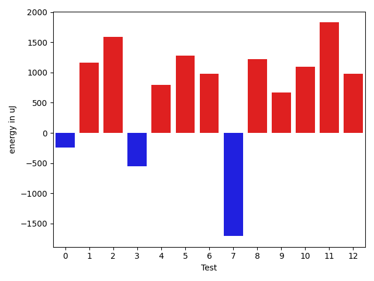

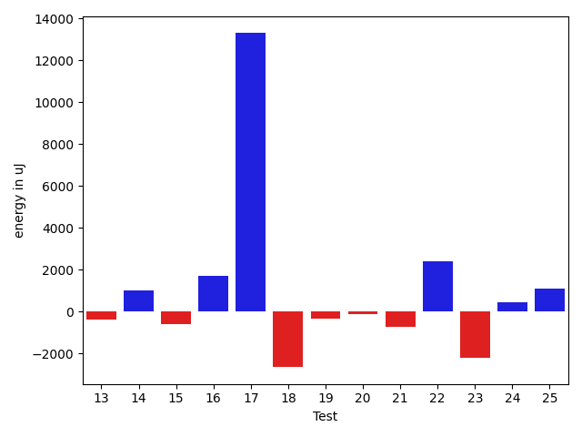

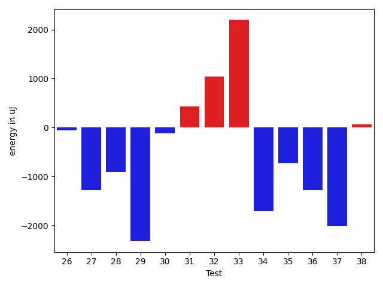

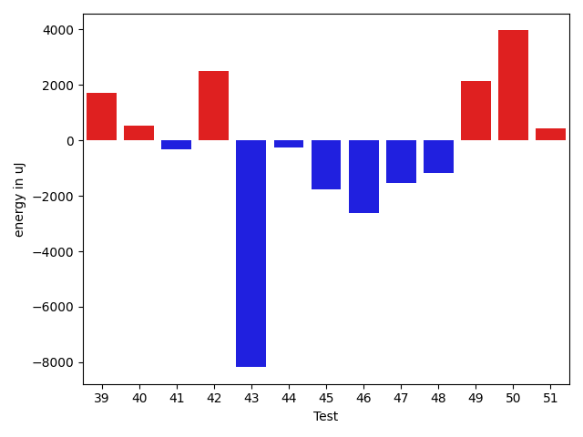

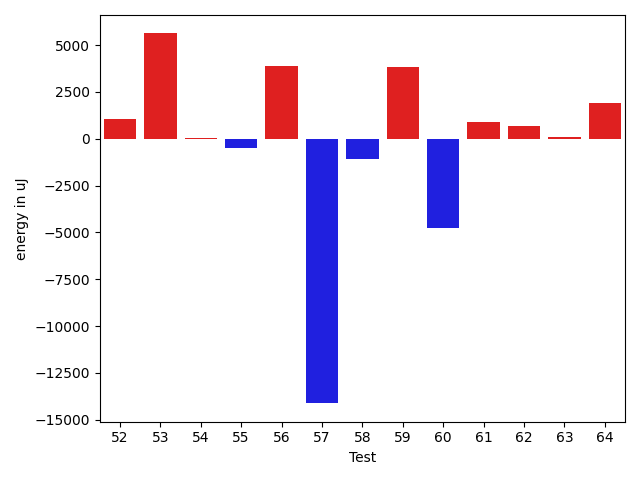

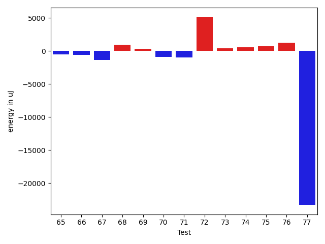

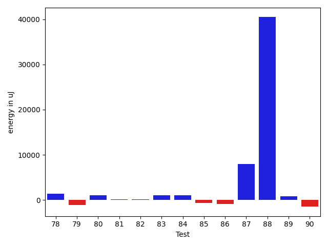

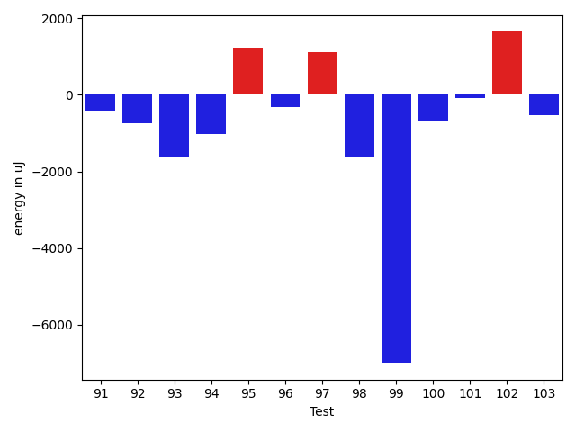

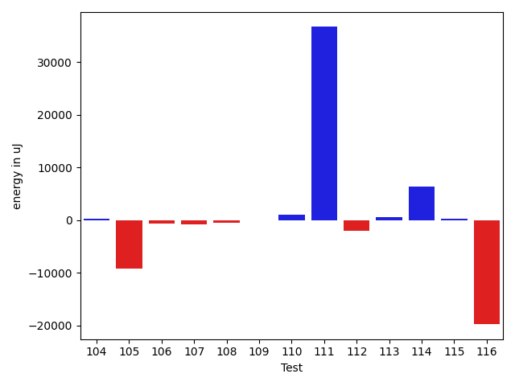

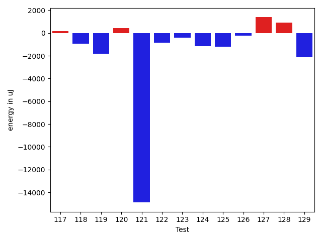

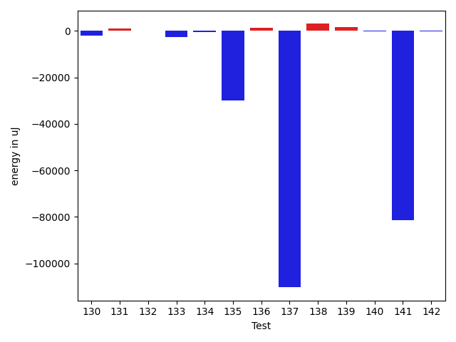

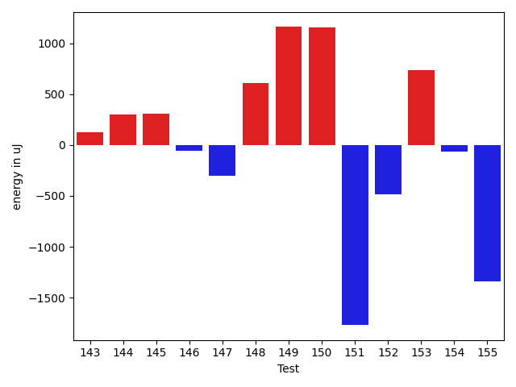

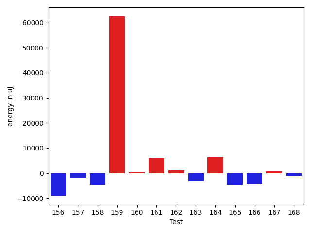

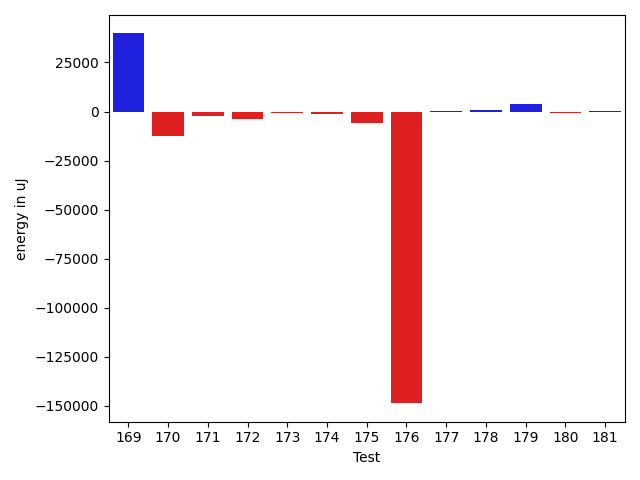

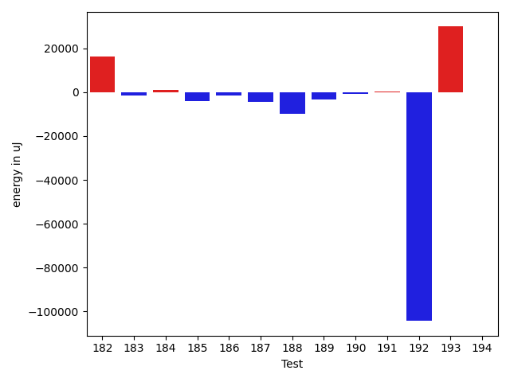

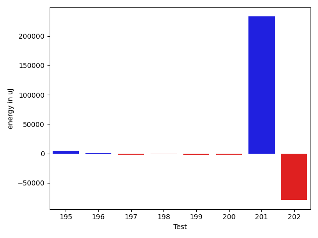

| ID | EnergyV1 | EnergyV2 | DeltaEnergy | σV1 | σV2 |
| --- | --- | --- | --- | --- | --- |
| 0 | 41565 | 41321 | -244 | 6775.850622672406 | 6955.405515874786 |
| 1 | 40100 | 41260 | 1160 | 19496.68551951986 | 4834.752229470267 |
| 2 | 42114 | 43701 | 1587 | 25156.06426931681 | 40011.69922403815 |
| 3 | 43762 | 43213 | -549 | 21413.83203443975 | 499801.73297493573 |
| 4 | 39978 | 40771 | 793 | 4040.725872462631 | 5013.262720642767 |
| 5 | 84045 | 85327 | 1282 | 19641.246172918385 | 22529.358272154273 |
| 6 | 41442 | 42419 | 977 | 15773.178579670395 | 33325.87979308777 |
| 7 | 42419 | 40710 | -1709 | 6025.925830680619 | 5030.727801887045 |
| 8 | 40100 | 41321 | 1221 | 4123.510207922645 | 3955.945801183597 |
| 9 | 39978 | 40649 | 671 | 3880.0373276539895 | 4195.746818042184 |
| 10 | 39429 | 40527 | 1098 | 3885.1249884480294 | 28458.770748278213 |
| 11 | 39612 | 41443 | 1831 | 4542.770420643614 | 4082.864305397387 |
| 12 | 41626 | 42603 | 977 | 13791.875293928088 | 13208.197329551695 |
| 13 | 39795 | 40894 | 1099 | 8273.112365939882 | 5999.581473130252 |
| 14 | 40222 | 40649 | 427 | 4804.344340410316 | 3634.397661773588 |
| 15 | 40222 | 39306 | -916 | 3832.6837020504663 | 5178.424046945955 |
| 16 | 41076 | 42053 | 977 | 3924.144027943013 | 3544.2521212190077 |
| 17 | 40650 | 39855 | -795 | 3550.1387622746465 | 59421.53008319039 |
| 18 | 42541 | 38513 | -4028 | 3864.112465089124 | 4087.931940605226 |
| 19 | 40222 | 40283 | 61 | 3357.4658335609925 | 2777.029853942622 |
| 20 | 39184 | 40771 | 1587 | 4102.30770647775 | 4715.500139574437 |
| 21 | 42175 | 41382 | -793 | 7750.238768182537 | 6926.872985653411 |
| 22 | 44739 | 42236 | -2503 | 11977.114756745823 | 20181.508101367 |
| 23 | 41809 | 38697 | -3112 | 4422.59411367762 | 3602.032881286566 |
| 24 | 40710 | 41260 | 550 | 4243.460755567299 | 4438.980864091633 |
| 25 | 40283 | 39551 | -732 | 4778.861438669257 | 3362.7971732476476 |
| 26 | 41626 | 41565 | -61 | 3469.2813785345684 | 4037.6502774898186 |
| 27 | 41809 | 40527 | -1282 | 2690.859704650798 | 4458.166304773792 |
| 28 | 41382 | 40467 | -915 | 3402.6785602838513 | 3228.7587097142386 |
| 29 | 43274 | 40955 | -2319 | 2742.696526117135 | 1924.8859405942785 |
| 30 | 41199 | 41077 | -122 | 4082.6326811721624 | 2971.2346864780266 |
| 31 | 39245 | 39673 | 428 | 2847.4605712992707 | 4500.141994683983 |
| 32 | 40711 | 41748 | 1037 | 4552.146360166268 | 5824.535767743401 |
| 33 | 40649 | 42846 | 2197 | 4039.039297592931 | 2756.049206291498 |
| 34 | 41503 | 39795 | -1708 | 4274.948979552595 | 4093.152107240871 |
| 35 | 41259 | 40527 | -732 | 3367.335273631261 | 4082.9772620373546 |
| 36 | 41931 | 40650 | -1281 | 3690.7793837933195 | 4284.311115375882 |
| 37 | 44006 | 41992 | -2014 | 42057.323195775025 | 38077.014261116026 |
| 38 | 41565 | 41626 | 61 | 3282.940549921821 | 3989.2833952160117 |
| 39 | 41931 | 43640 | 1709 | 22560.37994559729 | 18553.81784046461 |
| 40 | 40039 | 40589 | 550 | 3764.574149298271 | 3633.3020254342596 |
| 41 | 42114 | 41809 | -305 | 3860.406186915807 | 4411.232253715427 |
| 42 | 146423 | 148925 | 2502 | 46730.930693995244 | 29264.59371953125 |
| 43 | 283263 | 275085 | -8178 | 58088.98559513051 | 59141.907179202375 |
| 44 | 41137 | 40893 | -244 | 4193.61407433229 | 6450.534116538121 |
| 45 | 119385 | 117615 | -1770 | 19724.724782830104 | 35125.14195395924 |
| 46 | 126892 | 124267 | -2625 | 22313.488600662262 | 41004.115582753446 |
| 47 | 122681 | 121154 | -1527 | 39188.13683274567 | 49489.58894199453 |
| 48 | 39429 | 38269 | -1160 | 3990.862508874277 | 4268.732059154936 |
| 49 | 161804 | 163940 | 2136 | 28209.16377122456 | 29554.466667151988 |
| 50 | 163147 | 167114 | 3967 | 23997.25798105536 | 39027.69988953337 |
| 51 | 40039 | 40466 | 427 | 4621.543694834431 | 3177.341928152376 |
| 52 | 39490 | 40284 | 794 | 3785.961606605923 | 3327.4280445385493 |
| 53 | 40650 | 41931 | 1281 | 11104.166273971225 | 16627.87785748345 |
| 54 | 39062 | 39612 | 550 | 4794.221481215355 | 4915.992660694277 |
| 55 | 38941 | 39916 | 975 | 4525.180007044344 | 6042.013639783788 |
| 56 | 41870 | 42969 | 1099 | 25955.395426613763 | 24947.211898313115 |
| 57 | 41625 | 40039 | -1586 | 60931.13005360222 | 4586.290570862043 |
| 58 | 42724 | 41443 | -1281 | 23682.205445356445 | 14990.728178467758 |
| 59 | 40466 | 40954 | 488 | 7950.235993671533 | 28319.97075674233 |
| 60 | 42175 | 41626 | -549 | 26561.47460877466 | 4361.8519600498585 |
| 61 | 39916 | 41382 | 1466 | 4151.562426075272 | 4436.504636805872 |
| 62 | 41320 | 40954 | -366 | 4204.438669073153 | 4444.216935163037 |
| 63 | 43152 | 42846 | -306 | 3476.64530789938 | 4602.859671812731 |
| 64 | 40649 | 42175 | 1526 | 4510.084872136582 | 6150.544640078633 |
| 65 | 43701 | 43152 | -549 | 475120.8119131661 | 255403.64452470466 |
| 66 | 41747 | 41137 | -610 | 3776.8735804762396 | 5012.5245475301 |
| 67 | 41687 | 40344 | -1343 | 12046.11979184753 | 10006.814530740117 |
| 68 | 42115 | 43030 | 915 | 28478.190497565352 | 28776.559524735134 |
| 69 | 42968 | 43274 | 306 | 18460.814781119432 | 19860.11434050064 |
| 70 | 42785 | 41870 | -915 | 9535.604615710468 | 4219.8310515981575 |
| 71 | 42785 | 41809 | -976 | 18775.117570357903 | 11429.271350598827 |
| 72 | 86853 | 91979 | 5126 | 35777.57359168389 | 35528.516838462936 |
| 73 | 40771 | 41198 | 427 | 4587.9744431552135 | 4450.596005031236 |
| 74 | 42846 | 43396 | 550 | 17136.23250104965 | 40073.29472232235 |
| 75 | 43213 | 43884 | 671 | 24049.092429158994 | 35374.77693658776 |
| 76 | 40039 | 41259 | 1220 | 7917.4321410549555 | 4058.2783298171485 |
| 77 | 69518 | 46204 | -23314 | 27139.164055767684 | 21099.103055733332 |
| 78 | 42663 | 42175 | -488 | 18162.76348297497 | 28386.061428631754 |
| 79 | 40222 | 41809 | 1587 | 8746.728579718438 | 4488.719503098951 |
| 80 | 40527 | 41748 | 1221 | 4031.164687495745 | 4929.491443664785 |
| 81 | 40894 | 42175 | 1281 | 7390.989939980474 | 7761.43008407983 |
| 82 | 40832 | 41198 | 366 | 4716.612375986193 | 4189.946923556697 |
| 83 | 41260 | 41870 | 610 | 5129.318959742047 | 5057.925599589908 |
| 84 | 38391 | 41382 | 2991 | 3705.5055564809954 | 3194.401321448064 |
| 85 | 42297 | 39856 | -2441 | 3519.8457796471707 | 4734.9759797583865 |
| 86 | 42480 | 40954 | -1526 | 4742.24935258261 | 4368.497095428875 |
| 87 | 84228 | 85144 | 916 | 24359.80264379848 | 36909.21232654337 |
| 88 | 89111 | 89416 | 305 | 187033.8215842513 | 287291.0431541157 |
| 89 | 39551 | 41137 | 1586 | 4361.611016840248 | 5429.398662790031 |
| 90 | 39734 | 38085 | -1649 | 4140.948055999845 | 4239.390448954283 |
| 91 | 40039 | 40649 | 610 | 10297.444467042404 | 6508.507648153131 |
| 92 | 39978 | 38514 | -1464 | 4287.507432459848 | 5008.989850617973 |
| 93 | 40405 | 37902 | -2503 | 3972.858708066017 | 4780.302423719888 |
| 94 | 38940 | 37903 | -1037 | 3986.7255468439994 | 4434.918282532017 |
| 95 | 40466 | 41077 | 611 | 5023.387189569058 | 8529.23540160675 |
| 96 | 40161 | 40466 | 305 | 3136.2678281116932 | 4652.493818869501 |
| 97 | 39123 | 40649 | 1526 | 3940.015064279248 | 5512.653530647496 |
| 98 | 40100 | 39916 | -184 | 3901.579278149255 | 5284.391642577183 |
| 99 | 40588 | 39428 | -1160 | 41625.601328217715 | 4603.530929006667 |
| 100 | 40527 | 39429 | -1098 | 3977.933559665873 | 4387.724828646559 |
| 101 | 39734 | 40039 | 305 | 4226.410516330849 | 3376.0422427931744 |
| 102 | 42236 | 44372 | 2136 | 4968.208947692216 | 4003.424797595179 |
| 103 | 41382 | 39917 | -1465 | 4039.9265084046588 | 4244.105950184 |
| 104 | 43396 | 44189 | 793 | 21279.73563332068 | 21903.59169140433 |
| 105 | 42115 | 40588 | -1527 | 41594.65056112113 | 4016.9398025735964 |
| 106 | 41687 | 40893 | -794 | 8047.415562377776 | 5972.284727784017 |
| 107 | 42480 | 39307 | -3173 | 4320.1890504242865 | 4435.577700645265 |
| 108 | 40283 | 39856 | -427 | 4900.873042795255 | 3281.0994097261346 |
| 109 | 40711 | 41443 | 732 | 3813.4067748699213 | 3823.4148189664807 |
| 110 | 40832 | 40772 | -60 | 4642.9448343527565 | 3687.586179979403 |
| 111 | 42053 | 42053 | 0 | 302182.25954773265 | 356776.0115023865 |
| 112 | 41077 | 43579 | 2502 | 38761.22054399216 | 32712.183028354804 |
| 113 | 40222 | 40955 | 733 | 3904.8006555729985 | 4261.124900879865 |
| 114 | 40283 | 40588 | 305 | 3466.3199673531913 | 31505.92023961632 |
| 115 | 40039 | 41443 | 1404 | 4091.103036185692 | 4729.417374975716 |
| 116 | 43945 | 44128 | 183 | 543922.3546765117 | 494967.71772427816 |
| 117 | 40710 | 40893 | 183 | 6258.440886120829 | 6081.267319399798 |
| 118 | 42236 | 41321 | -915 | 4543.334515980754 | 4545.068685949642 |
| 119 | 41504 | 39673 | -1831 | 4563.635413160877 | 4809.871095900978 |
| 120 | 40344 | 40772 | 428 | 4672.721272751613 | 5854.560418909409 |
| 121 | 210266 | 195373 | -14893 | 223918.85244454435 | 285919.33455263876 |
| 122 | 41138 | 40283 | -855 | 4583.583596008391 | 4319.095112103651 |
| 123 | 42419 | 41992 | -427 | 26691.07542996394 | 27668.31689991717 |
| 124 | 42175 | 41015 | -1160 | 6518.472242812383 | 9259.385335383535 |
| 125 | 42785 | 41565 | -1220 | 13684.270326831878 | 10354.712100975174 |
| 126 | 41504 | 41260 | -244 | 5260.412550877743 | 6075.953882190758 |
| 127 | 39978 | 41382 | 1404 | 5035.089020265561 | 4692.075616187409 |
| 128 | 41442 | 42358 | 916 | 4304.713256319846 | 4003.749235671901 |
| 129 | 42968 | 40833 | -2135 | 17903.194142543816 | 17196.700135315663 |
| 130 | 41443 | 41565 | 122 | 14086.870286516303 | 8896.244002355808 |
| 131 | 40771 | 41077 | 306 | 4609.677600206587 | 4201.439655954524 |
| 132 | 40833 | 40100 | -733 | 4345.433425971458 | 4816.4902605270645 |
| 133 | 44312 | 44129 | -183 | 39949.12575752625 | 33579.11871431355 |
| 134 | 42298 | 40405 | -1893 | 6717.62940562471 | 6601.804608760369 |
| 135 | 130981 | 126526 | -4455 | 278893.4697023782 | 49108.20473015684 |
| 136 | 41747 | 42054 | 307 | 4620.70847838124 | 7137.554899475597 |
| 137 | 88318 | 88073 | -245 | 571779.5936420528 | 231366.4112359489 |
| 138 | 44983 | 46264 | 1281 | 24483.314089642077 | 27152.576419653138 |
| 139 | 42053 | 42420 | 367 | 14492.485900631815 | 20697.7241447714 |
| 140 | 41138 | 41321 | 183 | 7761.331230421491 | 5634.269739726702 |
| 141 | 91003 | 88623 | -2380 | 653257.5187357237 | 319054.2659038938 |
| 142 | 41199 | 40405 | -794 | 4609.443099251282 | 3999.5225934856862 |
| 143 | 43823 | 43945 | 122 | 27960.9372245446 | 22446.283374137187 |
| 144 | 44129 | 44433 | 304 | 13682.427830603163 | 33290.28854868038 |
| 145 | 41382 | 41687 | 305 | 14696.327010376968 | 14432.708522440951 |
| 146 | 42297 | 42237 | -60 | 51847.73555456627 | 43182.73985890672 |
| 147 | 84045 | 83740 | -305 | 45911.21349009464 | 37303.00534413167 |
| 148 | 41503 | 42114 | 611 | 12351.708604157122 | 13242.996994076027 |
| 149 | 39306 | 40466 | 1160 | 7710.387026542201 | 9267.172261697317 |
| 150 | 39673 | 40832 | 1159 | 6519.134187036188 | 28277.983632042815 |
| 151 | 44372 | 42602 | -1770 | 592190.3283108238 | 428974.3300853506 |
| 152 | 43457 | 42969 | -488 | 443677.86483336147 | 343558.4867988329 |
| 153 | 42053 | 42786 | 733 | 4708.732331831945 | 4986.971163718024 |
| 154 | 40954 | 40893 | -61 | 13532.384238473862 | 6269.8183561518 |
| 155 | 91980 | 90637 | -1343 | 354178.1896756585 | 389014.1550885542 |
| 156 | 43640 | 41565 | -2075 | 24490.25341759554 | 17061.11064185979 |
| 157 | 42175 | 41260 | -915 | 14203.83034623537 | 12116.409424980531 |
| 158 | 42358 | 40710 | -1648 | 14523.644298255145 | 8262.843944189528 |
| 159 | 42602 | 42237 | -365 | 322241.0236412079 | 419028.13617223274 |
| 160 | 40100 | 40406 | 306 | 3829.267471641933 | 4566.922457721715 |
| 161 | 47302 | 45532 | -1770 | 35774.352298237325 | 49770.37923306226 |
| 162 | 40649 | 43091 | 2442 | 3610.541519008821 | 6111.596724874769 |
| 163 | 41504 | 40283 | -1221 | 12153.340877171784 | 4791.338074279545 |
| 164 | 41565 | 40344 | -1221 | 4512.871272929581 | 42853.44503921345 |
| 165 | 39794 | 40710 | 916 | 28463.727073545924 | 4002.084638711459 |
| 166 | 42968 | 42053 | -915 | 43838.63100473799 | 38746.24707185062 |
| 167 | 41199 | 41504 | 305 | 4648.765842930787 | 3630.266953489785 |
| 168 | 42480 | 39856 | -2624 | 17122.339044717006 | 13328.861087510388 |
| 169 | 42785 | 42663 | -122 | 465869.37437237316 | 538118.7133815668 |
| 170 | 39856 | 38635 | -1221 | 45828.32436997404 | 4366.477435004102 |
| 171 | 40710 | 39551 | -1159 | 5758.085570095174 | 3832.44427970255 |
| 172 | 41137 | 40527 | -610 | 29614.310300631416 | 8963.966445899567 |
| 173 | 39001 | 40222 | 1221 | 3945.7098486681134 | 4151.112929752159 |
| 174 | 42176 | 39612 | -2564 | 4971.06997145662 | 4152.119276152654 |
| 175 | 41748 | 39733 | -2015 | 28032.337011625208 | 4421.839895094716 |
| 176 | 43640 | 43335 | -305 | 654809.3624293489 | 411264.6497461725 |
| 177 | 43396 | 44068 | 672 | 19638.699198819893 | 22044.476899113997 |
| 178 | 40650 | 42603 | 1953 | 4350.33556582921 | 5175.960204512712 |
| 179 | 43274 | 43213 | -61 | 55736.3606765769 | 56096.65919721205 |
| 180 | 43151 | 42725 | -426 | 33182.61549406565 | 30834.218570643043 |
| 181 | 41443 | 40527 | -916 | 3663.2034088114983 | 7271.318125966707 |
| 182 | 42298 | 42053 | -245 | 62010.31032415597 | 102676.96527085509 |
| 183 | 80933 | 75134 | -5799 | 23103.739251062445 | 26263.816292183597 |
| 184 | 41992 | 43213 | 1221 | 9821.2065073975 | 8828.488443900327 |
| 185 | 42969 | 41382 | -1587 | 13738.621021995306 | 6216.781618081303 |
| 186 | 41381 | 41870 | 489 | 10362.162443281155 | 7094.017130683439 |
| 187 | 41381 | 41564 | 183 | 31302.020818748166 | 12368.721412665183 |
| 188 | 42725 | 42114 | -611 | 74410.43506427093 | 62211.72597570066 |
| 189 | 43518 | 38453 | -5065 | 5527.178405158366 | 4449.560137663624 |
| 190 | 42907 | 42358 | -549 | 6613.328784351665 | 4605.200166787247 |
| 191 | 42114 | 43091 | 977 | 3891.455107450912 | 3497.914597386883 |
| 192 | 42358 | 40711 | -1647 | 545655.3514629077 | 335700.41028573754 |
| 193 | 44494 | 46936 | 2442 | 30419.842028155872 | 114919.37547148937 |
| 194 | 41565 | 42236 | 671 | 3856.64302499236 | 2942.6819319085357 |
| 195 | 44617 | 43457 | -1160 | 109374.19112251139 | 132104.6884443553 |
| 196 | 43091 | 43701 | 610 | 10031.526415173115 | 8698.269718836289 |
| 197 | 44189 | 43945 | -244 | 32363.06705095654 | 28565.139716305923 |
| 198 | 41381 | 41626 | 245 | 7424.955772223641 | 3922.2773923714694 |
| 199 | 44006 | 43823 | -183 | 410520.0162618486 | 410792.44763719937 |
| 200 | 43152 | 42542 | -610 | 11384.945589700314 | 6848.230454095422 |
| 201 | 43396 | 44433 | 1037 | 539272.8676834089 | 771013.5815898067 |
| 202 | 42114 | 44068 | 1954 | 352169.8196215001 | 4286.878289877405 |

## Delta Duration per test method

| ID | DurationV1 | DurationsV2 | DeltaDuration |
| --- | --- | --- | --- |
| 0 | 1005682.7258064516 | 996700.7288135593 | -8981.996992892353 |
| 1 | 932938.2372881356 | 856027.8983050848 | -76910.33898305078 |
| 2 | 1289461.7068965517 | 1444047.1506849315 | 154585.4437883799 |
| 3 | 1130457.865671642 | 5851269.567164179 | 4720811.701492537 |
| 4 | 852658.5416666666 | 1093608.2280701755 | 240949.68640350888 |
| 5 | 2411678.757575758 | 2547198.0707070706 | 135519.31313131284 |
| 6 | 1182263.5416666667 | 1321679.7721518988 | 139416.23048523208 |
| 7 | 835127.0 | 861356.4285714285 | 26229.42857142852 |
| 8 | 876590.9444444445 | 812085.5087719298 | -64505.43567251472 |
| 9 | 671136.1081081082 | 643773.0277777778 | -27363.080330330413 |
| 10 | 831567.716981132 | 1049359.9 | 217792.18301886786 |
| 11 | 569706.8846153846 | 521875.2631578947 | -47831.621457489906 |
| 12 | 1025589.4583333334 | 1044211.0612244898 | 18621.60289115645 |
| 13 | 877157.0 | 926088.4426229508 | 48931.442622950766 |
| 14 | 781707.7291666666 | 817371.6730769231 | 35663.943910256494 |
| 15 | 607705.0606060605 | 640633.7931034482 | 32928.73249738768 |
| 16 | 451327.5714285714 | 417508.8333333333 | -33818.738095238106 |
| 17 | 499764.2272727273 | 853345.9 | 353581.67272727273 |
| 18 | 394799.71428571426 | 383735.9285714286 | -11063.785714285681 |
| 19 | 476109.64705882355 | 438730.0 | -37379.64705882355 |
| 20 | 589323.4864864865 | 549174.8571428572 | -40148.62934362935 |
| 21 | 1013704.7051282051 | 1021167.1527777778 | 7462.447649572627 |
| 22 | 893445.8095238095 | 1091446.8148148148 | 198001.00529100536 |
| 23 | 563144.09375 | 582138.3939393939 | 18994.30018939392 |
| 24 | 950077.0 | 940420.8620689656 | -9656.137931034435 |
| 25 | 382253.5 | 391081.6923076923 | 8828.192307692312 |
| 26 | 421904.71428571426 | 402689.23076923075 | -19215.48351648351 |
| 27 | 427291.3333333333 | 430135.0 | 2843.666666666686 |
| 28 | 546012.8076923077 | 563476.9444444445 | 17464.13675213675 |
| 29 | 387005.5 | 343319.1818181818 | -43686.31818181818 |
| 30 | 396402.8125 | 404100.8461538461 | 7698.033653846127 |
| 31 | 438715.60869565216 | 490199.76470588235 | 51484.15601023019 |
| 32 | 581909.8125 | 545018.5 | -36891.3125 |
| 33 | 449430.9 | 429623.1 | -19807.800000000047 |
| 34 | 407488.1111111111 | 452111.9411764706 | 44623.83006535948 |
| 35 | 487731.04545454547 | 557527.7727272727 | 69796.72727272724 |
| 36 | 381274.94736842107 | 412161.06666666665 | 30886.119298245583 |
| 37 | 1715993.2931034483 | 1599498.1666666667 | -116495.1264367816 |
| 38 | 525885.9444444445 | 504737.6666666667 | -21148.27777777781 |
| 39 | 1067275.5853658537 | 996268.0571428571 | -71007.52822299663 |
| 40 | 482480.6206896552 | 425417.55555555556 | -57063.06513409963 |
| 41 | 493198.3157894737 | 439184.9130434783 | -54013.40274599544 |
| 42 | 4102985.6363636362 | 4029591.3636363638 | -73394.27272727247 |
| 43 | 7745249.535353536 | 7697758.262626262 | -47491.272727273405 |
| 44 | 787037.3653846154 | 1063565.1066666667 | 276527.7412820513 |
| 45 | 3280160.8585858587 | 3309527.9696969697 | 29367.111111111008 |
| 46 | 3432456.090909091 | 3548801.1919191917 | 116345.10101010092 |
| 47 | 3299828.868686869 | 3448475.515151515 | 148646.64646464633 |
| 48 | 642843.9696969697 | 637707.8333333334 | -5136.136363636353 |
| 49 | 4362605.7272727275 | 4363694.323232323 | 1088.5959595954046 |
| 50 | 4312029.858585859 | 4509793.606060606 | 197763.7474747477 |
| 51 | 528436.2083333334 | 535971.5555555555 | 7535.347222222132 |
| 52 | 763603.2592592592 | 539263.7142857143 | -224339.5449735449 |
| 53 | 1031067.0222222222 | 1237455.75 | 206388.72777777782 |
| 54 | 588349.3076923077 | 567148.44 | -21200.867692307802 |
| 55 | 555165.1538461539 | 630070.2333333333 | 74905.0794871794 |
| 56 | 1463872.5747126436 | 1616913.054945055 | 153040.4802324113 |
| 57 | 981281.6818181818 | 692354.5869565217 | -288927.09486166004 |
| 58 | 1008634.104477612 | 1107473.3636363635 | 98839.25915875158 |
| 59 | 912273.6610169491 | 1114284.1186440678 | 202010.45762711868 |
| 60 | 1170817.5352112676 | 1104187.8607594937 | -66629.67445177399 |
| 61 | 754536.34 | 780991.94 | 26455.599999999977 |
| 62 | 743033.551724138 | 918343.3461538461 | 175309.79442970816 |
| 63 | 470818.5714285714 | 525156.92 | 54338.34857142862 |
| 64 | 812030.1304347826 | 814942.58 | 2912.4495652173646 |
| 65 | 4190273.7831325303 | 2206347.1555555556 | -1983926.6275769747 |
| 66 | 660402.6538461539 | 635216.0857142857 | -25186.568131868145 |
| 67 | 1012596.7142857143 | 1078602.754385965 | 66006.04010025063 |
| 68 | 1230286.3230769231 | 1307791.0163934426 | 77504.6933165195 |
| 69 | 1516353.4673913044 | 1519252.8602150537 | 2899.392823749222 |
| 70 | 991639.7058823529 | 916374.4035087719 | -75265.30237358098 |
| 71 | 1074922.6515151516 | 1141902.3387096773 | 66979.68719452573 |
| 72 | 2810085.9393939395 | 2787014.3434343436 | -23071.59595959587 |
| 73 | 827257.4693877551 | 846703.8888888889 | 19446.41950113373 |
| 74 | 1404024.9425287356 | 1487060.2325581396 | 83035.29002940399 |
| 75 | 1143213.0208333333 | 1193444.5882352942 | 50231.56740196096 |
| 76 | 818651.9423076923 | 840859.1276595745 | 22207.185351882246 |
| 77 | 1879511.3894736841 | 1801757.7551020407 | -77753.63437164342 |
| 78 | 971276.3414634146 | 1013803.8947368421 | 42527.55327342753 |
| 79 | 836258.1923076923 | 792360.1132075472 | -43898.07910014503 |
| 80 | 983308.4782608695 | 722124.0 | -261184.4782608695 |
| 81 | 939980.2363636363 | 884922.9655172414 | -55057.27084639494 |
| 82 | 669194.4571428571 | 651441.0 | -17753.457142857136 |
| 83 | 946447.1846153847 | 916060.1724137932 | -30387.01220159151 |
| 84 | 539777.8695652174 | 513992.4074074074 | -25785.46215780999 |
| 85 | 405577.125 | 427351.3333333333 | 21774.208333333314 |
| 86 | 587317.8536585366 | 655203.448275862 | 67885.59461732546 |
| 87 | 2597778.090909091 | 2746456.7474747472 | 148678.65656565642 |
| 88 | 3574654.121212121 | 5020647.090909091 | 1445992.9696969697 |
| 89 | 609507.2333333333 | 593912.6111111111 | -15594.622222222155 |
| 90 | 890945.16 | 929864.6031746032 | 38919.44317460316 |
| 91 | 1106030.5866666667 | 1139497.9390243902 | 33467.35235772352 |
| 92 | 599757.25 | 653241.4054054054 | 53484.15540540544 |
| 93 | 586363.8387096775 | 670348.3 | 83984.4612903226 |
| 94 | 601718.6060606061 | 622466.8064516129 | 20748.200391006772 |
| 95 | 910725.1857142857 | 986040.2028985508 | 75315.01718426507 |
| 96 | 591373.5625 | 552189.9393939395 | -39183.62310606055 |
| 97 | 666317.0882352941 | 641566.7391304348 | -24750.349104859284 |
| 98 | 603725.4193548387 | 643426.0909090909 | 39700.67155425227 |
| 99 | 765185.303030303 | 616051.0222222222 | -149134.2808080808 |
| 100 | 715009.6829268293 | 675597.6341463415 | -39412.04878048785 |
| 101 | 777515.6739130435 | 769139.7090909091 | -8375.964822134352 |
| 102 | 544995.2307692308 | 488344.15 | -56651.08076923073 |
| 103 | 757188.9047619047 | 678527.3023255814 | -78661.6024363233 |
| 104 | 1654015.0606060605 | 1593452.3673469387 | -60562.69325912185 |
| 105 | 941433.8461538461 | 657260.775 | -284173.0711538461 |
| 106 | 982175.16 | 1017463.45 | 35288.28999999992 |
| 107 | 680227.2619047619 | 722890.4615384615 | 42663.19963369961 |
| 108 | 676937.2916666666 | 654017.6176470588 | -22919.67401960783 |
| 109 | 978954.2173913043 | 772176.2452830189 | -206777.9721082854 |
| 110 | 582244.1081081082 | 610316.4411764706 | 28072.333068362437 |
| 111 | 2716465.375 | 3935437.5714285714 | 1218972.1964285714 |
| 112 | 1158448.325 | 1055482.3137254901 | -102966.01127450983 |
| 113 | 592609.3076923077 | 531716.9375 | -60892.370192307746 |
| 114 | 566089.1071428572 | 688536.0689655172 | 122446.96182266006 |
| 115 | 781771.320754717 | 768612.0731707317 | -13159.247583985329 |
| 116 | 5324006.385714286 | 4756427.898305085 | -567578.4874092015 |
| 117 | 808608.5454545454 | 740689.375 | -67919.17045454541 |
| 118 | 869405.9782608695 | 823081.1777777778 | -46324.800483091734 |
| 119 | 699529.8823529412 | 642887.6 | -56642.28235294123 |
| 120 | 955544.0576923077 | 893572.6785714285 | -61971.379120879225 |
| 121 | 6651201.595959596 | 7209198.525252526 | 557996.9292929294 |
| 122 | 851533.0208333334 | 817885.5283018867 | -33647.49253144662 |
| 123 | 1025639.3703703703 | 1090024.9574468085 | 64385.587076438125 |
| 124 | 1013151.7407407408 | 1032318.4444444445 | 19166.703703703708 |
| 125 | 1159823.2352941176 | 1202857.4142857143 | 43034.17899159668 |
| 126 | 678612.6444444444 | 667085.224489796 | -11527.419954648474 |
| 127 | 682038.1951219512 | 646447.8108108108 | -35590.3843111404 |
| 128 | 659044.0277777778 | 642325.7435897436 | -16718.28418803413 |
| 129 | 1231066.390625 | 1074445.5238095238 | -156620.8668154762 |
| 130 | 1234436.888888889 | 1173446.0229885057 | -60990.86590038333 |
| 131 | 846304.0 | 843823.4716981133 | -2480.5283018867485 |
| 132 | 909395.4545454546 | 926169.8363636363 | 16774.38181818172 |
| 133 | 1608951.950819672 | 1531928.7391304348 | -77023.21168923727 |
| 134 | 876511.8392857143 | 994976.0185185185 | 118464.17923280422 |
| 135 | 4518620.848484849 | 3633363.383838384 | -885257.4646464647 |
| 136 | 980135.0821917808 | 1008009.8548387097 | 27874.772646928905 |
| 137 | 6891934.868686869 | 3538681.3333333335 | -3353253.5353535353 |
| 138 | 1726466.3125 | 1769503.0721649486 | 43036.759664948564 |
| 139 | 1225532.9146341463 | 1362332.938271605 | 136800.02363745868 |
| 140 | 991158.4583333334 | 857444.1875 | -133714.27083333337 |
| 141 | 8343851.090909091 | 4520108.939393939 | -3823742.1515151514 |
| 142 | 802577.7674418605 | 779921.8 | -22655.96744186047 |
| 143 | 1594994.4810126582 | 1339080.0882352942 | -255914.392777364 |
| 144 | 882811.6756756756 | 993834.52 | 111022.8443243244 |
| 145 | 1368620.3369565217 | 1336131.3789473684 | -32488.95800915337 |
| 146 | 1793123.1590909092 | 1736007.7325581396 | -57115.426532769576 |
| 147 | 2801005.4444444445 | 2753176.111111111 | -47829.33333333349 |
| 148 | 1313882.0240963856 | 1252232.3493975904 | -61649.67469879519 |
| 149 | 1192624.8024691357 | 1174728.1686746988 | -17896.63379443693 |
| 150 | 1071412.78125 | 1172327.0142857144 | 100914.23303571437 |
| 151 | 6180252.393442623 | 3235948.9375 | -2944303.4559426233 |
| 152 | 4008679.9577464787 | 3070944.9452054794 | -937735.0125409993 |
| 153 | 867973.5555555555 | 894960.1964285715 | 26986.640873015975 |
| 154 | 1240577.164556962 | 1093363.5675675676 | -147213.5969893944 |
| 155 | 4616688.919191919 | 4748099.121212121 | 131410.20202020183 |
| 156 | 1416735.888888889 | 1126424.8360655739 | -290311.05282331514 |
| 157 | 1326966.6 | 1237310.086419753 | -89656.51358024706 |
| 158 | 1226048.738095238 | 1119727.6296296297 | -106321.10846560844 |
| 159 | 2161663.3220338984 | 4442304.886363637 | 2280641.5643297383 |
| 160 | 665584.3 | 805755.0810810811 | 140170.78108108102 |
| 161 | 1789008.40625 | 1793319.380952381 | 4310.974702381063 |
| 162 | 779499.0256410256 | 713901.95 | -65597.07564102567 |
| 163 | 731721.8 | 670028.0285714286 | -61693.77142857143 |
| 164 | 525154.4545454546 | 818593.0333333333 | 293438.57878787874 |
| 165 | 772952.5853658536 | 673285.551724138 | -99667.03364171565 |
| 166 | 1759661.313253012 | 1664168.5340909092 | -95492.77916210284 |
| 167 | 464549.16 | 430851.68 | -33697.47999999998 |
| 168 | 1110423.705882353 | 1182376.650793651 | 71952.94491129788 |
| 169 | 4195043.193548387 | 5255758.770491803 | 1060715.5769434161 |
| 170 | 734936.7368421053 | 463272.84 | -271663.89684210526 |
| 171 | 875623.641509434 | 872719.7272727273 | -2903.9142367066815 |
| 172 | 1003531.0980392157 | 884314.6140350878 | -119216.48400412791 |
| 173 | 525049.4444444445 | 492210.3333333333 | -32839.11111111118 |
| 174 | 642692.551724138 | 678780.09375 | 36087.54202586203 |
| 175 | 813124.6944444445 | 694663.4545454546 | -118461.23989898991 |
| 176 | 8225577.289855072 | 3579851.323943662 | -4645725.965911411 |
| 177 | 1411243.3076923077 | 1478016.8705882353 | 66773.56289592758 |
| 178 | 904938.2105263158 | 921402.0983606557 | 16463.88783433987 |
| 179 | 1484207.303030303 | 1638640.0 | 154432.69696969702 |
| 180 | 1311886.7083333333 | 1385350.0 | 73463.29166666674 |
| 181 | 852841.8448275862 | 880408.9298245613 | 27567.084996975143 |
| 182 | 1102257.0612244897 | 1807098.6140350876 | 704841.5528105979 |
| 183 | 1967071.9393939395 | 2032179.808080808 | 65107.868686868576 |
| 184 | 868398.5094339623 | 900983.25 | 32584.74056603771 |
| 185 | 897037.5 | 774202.3333333334 | -122835.16666666663 |
| 186 | 1139228.1744186047 | 1062860.1948051949 | -76367.97961340984 |
| 187 | 1257674.425 | 1063387.1153846155 | -194287.30961538455 |
| 188 | 1446995.4761904762 | 1173562.0487804879 | -273433.42740998836 |
| 189 | 400978.0714285714 | 459175.5294117647 | 58197.45798319328 |
| 190 | 739261.4864864865 | 650248.3421052631 | -89013.14438122336 |
| 191 | 459875.36363636365 | 504339.5714285714 | 44464.20779220777 |
| 192 | 5266032.416666667 | 2603184.9032258065 | -2662847.5134408604 |
| 193 | 1606612.7391304348 | 2555378.7252747254 | 948765.9861442905 |
| 194 | 496669.4 | 490024.09523809527 | -6645.3047619047575 |
| 195 | 2258140.164835165 | 2473937.382022472 | 215797.2171873073 |
| 196 | 944006.875 | 1010601.4693877551 | 66594.59438775515 |
| 197 | 1701755.105263158 | 1654556.8631578947 | -47198.242105263285 |
| 198 | 927417.4576271187 | 918542.625 | -8874.832627118682 |
| 199 | 3761774.7011494255 | 3978294.9777777777 | 216520.27662835224 |
| 200 | 1028237.8644067796 | 956355.6 | -71882.26440677966 |
| 201 | 5926152.2 | 13432748.277777778 | 7506596.077777778 |
| 202 | 3010649.4 | 442020.7083333333 | -2568628.6916666664 |

## Misc.

| ID | Test Class | Test Method |
| --- | --- | --- |
| 0 | com.google.gson.functional.CustomTypeAdaptersTest | testCustomAdapterInvokedForCollectionElementDeserialization |
| 1 | com.google.gson.functional.CustomTypeAdaptersTest | testCustomAdapterInvokedForMapElementDeserialization |
| 2 | com.google.gson.functional.CustomTypeAdaptersTest | testCustomNestedSerializers |
| 3 | com.google.gson.functional.CustomTypeAdaptersTest | testCustomSerializers |
| 4 | com.google.gson.functional.CustomTypeAdaptersTest | testCustomNestedDeserializers |
| 5 | com.google.gson.functional.CustomTypeAdaptersTest | testCustomTypeAdapterDoesNotAppliesToSubClasses |
| 6 | com.google.gson.functional.CustomTypeAdaptersTest | testCustomAdapterInvokedForCollectionElementSerializationWithType |
| 7 | com.google.gson.functional.CustomTypeAdaptersTest | testCustomDeserializers |
| 8 | com.google.gson.functional.CustomTypeAdaptersTest | testCustomByteArraySerializer |
| 9 | com.google.gson.functional.CustomTypeAdaptersTest | testEnsureCustomDeserializerNotInvokedForNullValues |
| 10 | com.google.gson.functional.CustomTypeAdaptersTest | testCustomTypeAdapterAppliesToSubClassesSerializedAsBaseClass |
| 11 | com.google.gson.functional.CustomTypeAdaptersTest | testCustomAdapterInvokedForMapElementSerialization |
| 12 | com.google.gson.functional.CustomTypeAdaptersTest | testEnsureCustomSerializerNotInvokedForNullValues |
| 13 | com.google.gson.functional.CustomTypeAdaptersTest | testCustomAdapterInvokedForMapElementSerializationWithType |
| 14 | com.google.gson.functional.CustomTypeAdaptersTest | testCustomByteArrayDeserializerAndInstanceCreator |
| 15 | com.google.gson.functional.CustomTypeAdaptersTest | testCustomAdapterInvokedForCollectionElementSerialization |
| 16 | com.google.gson.functional.PrimitiveTest | testDeserializeJsonArrayAsNumber |
| 17 | com.google.gson.functional.PrimitiveTest | testLongAsStringDeserialization |
| 18 | com.google.gson.functional.PrimitiveTest | testDeserializeJsonObjectAsBooleanPrimitive |
| 19 | com.google.gson.functional.PrimitiveTest | testDeserializeJsonObjectAsNumber |
| 20 | com.google.gson.functional.PrimitiveTest | testPrimitiveBooleanAutoboxedInASingleElementArraySerialization |
| 21 | com.google.gson.functional.PrimitiveTest | testValueVeryCloseToZeroIsZero |
| 22 | com.google.gson.functional.PrimitiveTest | testMoreSpecificSerialization |
| 23 | com.google.gson.functional.PrimitiveTest | testLongAsStringSerialization |
| 24 | com.google.gson.functional.PrimitiveTest | testByteDeserialization |
| 25 | com.google.gson.functional.PrimitiveTest | testDeserializeJsonArrayAsBooleanWrapper |
| 26 | com.google.gson.functional.PrimitiveTest | testDeserializeJsonObjectAsShortPrimitive |
| 27 | com.google.gson.functional.PrimitiveTest | testDoubleInfinitySerialization |
| 28 | com.google.gson.functional.PrimitiveTest | testDeserializingNonZeroDecimalPointValuesAsIntegerFails |
| 29 | com.google.gson.functional.PrimitiveTest | testDeserializeJsonArrayAsByteWrapper |
| 30 | com.google.gson.functional.PrimitiveTest | testDeserializeJsonObjectAsBytePrimitive |
| 31 | com.google.gson.functional.PrimitiveTest | testNegativeInfinityFloatSerialization |
| 32 | com.google.gson.functional.PrimitiveTest | testByteSerialization |
| 33 | com.google.gson.functional.PrimitiveTest | testNegativeInfinitySerialization |
| 34 | com.google.gson.functional.PrimitiveTest | testFloatInfinitySerialization |
| 35 | com.google.gson.functional.PrimitiveTest | testDoubleNaNSerialization |
| 36 | com.google.gson.functional.PrimitiveTest | testDeserializeJsonArrayAsShortWrapper |
| 37 | com.google.gson.functional.PrimitiveTest | testHtmlCharacterSerialization |
| 38 | com.google.gson.functional.PrimitiveTest | testFloatNaNSerialization |
| 39 | com.google.gson.functional.PrimitiveTest | testNumberDeserialization |
| 40 | com.google.gson.functional.PrimitiveTest | testPrimitiveBooleanAutoboxedSerialization |
| 41 | com.google.gson.functional.PrimitiveTest | testBooleanDeserialization |
| 42 | com.google.gson.functional.DefaultTypeAdaptersTest | testDateSerializationWithPatternNotOverridenByTypeAdapter |
| 43 | com.google.gson.functional.DefaultTypeAdaptersTest | testDateSerializationWithPattern |
| 44 | com.google.gson.functional.DefaultTypeAdaptersTest | testBitSetDeserialization |
| 45 | com.google.gson.functional.DefaultTypeAdaptersTest | testSqlDateSerialization |
| 46 | com.google.gson.functional.DefaultTypeAdaptersTest | testTimestampSerialization |
| 47 | com.google.gson.functional.DefaultTypeAdaptersTest | testDefaultDateDeserializationUsingBuilder |
| 48 | com.google.gson.functional.DefaultTypeAdaptersTest | testDefaultCalendarSerialization |
| 49 | com.google.gson.functional.DefaultTypeAdaptersTest | testDateDeserializationWithPattern |
| 50 | com.google.gson.functional.DefaultTypeAdaptersTest | testDateSerializationInCollection |
| 51 | com.google.gson.functional.DefaultTypeAdaptersTest | testDefaultGregorianCalendarDeserialization |
| 52 | com.google.gson.functional.DefaultTypeAdaptersTest | testDefaultCalendarDeserialization |
| 53 | com.google.gson.functional.DefaultTypeAdaptersTest | testSetSerialization |
| 54 | com.google.gson.functional.DefaultTypeAdaptersTest | testDefaultGregorianCalendarSerialization |
| 55 | com.google.gson.functional.DefaultTypeAdaptersTest | testBitSetSerialization |
| 56 | com.google.gson.functional.MapTest | testSerializeMaps |
| 57 | com.google.gson.functional.MapTest | testMapSerializationWithNullValuesSerialized |
| 58 | com.google.gson.functional.MapTest | testMapSubclassDeserialization |
| 59 | com.google.gson.functional.MapTest | testCustomSerializerForSpecificMapType |
| 60 | com.google.gson.functional.MapTest | testGeneralMapField |
| 61 | com.google.gson.functional.MapTest | testMapSerializationWithNullValueButSerializeNulls |
| 62 | com.google.gson.functional.MapTest | testReadMapsWithEmptyStringKey |
| 63 | com.google.gson.functional.MapTest | testWriteMapsWithEmptyStringKey |
| 64 | com.google.gson.functional.FieldExclusionTest | testDefaultNestedStaticClassIncluded |
| 65 | com.google.gson.functional.FieldExclusionTest | testDefaultInnerClassExclusion |
| 66 | com.google.gson.functional.FieldExclusionTest | testInnerClassExclusion |
| 67 | com.google.gson.functional.CollectionTest | testRawCollectionSerialization |
| 68 | com.google.gson.functional.CollectionTest | testCollectionOfBagOfPrimitivesSerialization |
| 69 | com.google.gson.functional.CollectionTest | testWildcardCollectionField |
| 70 | com.google.gson.functional.ObjectTest | testNestedSerialization |
| 71 | com.google.gson.functional.ObjectTest | testArrayOfArraysDeserialization |
| 72 | com.google.gson.functional.ObjectTest | testSingletonLists |
| 73 | com.google.gson.functional.ObjectTest | testNullFieldsSerialization |
| 74 | com.google.gson.functional.ObjectTest | testArrayOfObjectsAsFields |
| 75 | com.google.gson.functional.ObjectTest | testBagOfPrimitiveWrappersSerialization |
| 76 | com.google.gson.functional.ObjectTest | testArrayOfObjectsDeserialization |
| 77 | com.google.gson.functional.ObjectTest | testArrayOfArraysSerialization |
| 78 | com.google.gson.functional.ObjectTest | testBagOfPrimitivesSerialization |
| 79 | com.google.gson.functional.ObjectTest | testNestedDeserialization |
| 80 | com.google.gson.functional.ObjectTest | testNullFieldsDeserialization |
| 81 | com.google.gson.functional.ObjectTest | testArrayOfObjectsSerialization |
| 82 | com.google.gson.functional.ObjectTest | testBagOfPrimitivesDeserialization |
| 83 | com.google.gson.functional.ObjectTest | testInnerClassDeserialization |
| 84 | com.google.gson.functional.ObjectTest | testObjectFieldNamesWithoutQuotesDeserialization |
| 85 | com.google.gson.functional.ObjectTest | testJsonObjectSerialization |
| 86 | com.google.gson.functional.ObjectTest | testBagOfPrimitiveWrappersDeserialization |
| 87 | com.google.gson.functional.NamingPolicyTest | testGsonWithNonDefaultFieldNamingPolicySerialization |
| 88 | com.google.gson.functional.NamingPolicyTest | testGsonDuplicateNameUsingSerializedNameFieldNamingPolicySerialization |
| 89 | com.google.gson.functional.NamingPolicyTest | testGsonWithNonDefaultFieldNamingPolicyDeserialiation |
| 90 | com.google.gson.functional.NamingPolicyTest | testComplexFieldNameStrategy |
| 91 | com.google.gson.functional.NamingPolicyTest | testDeprecatedNamingStrategy |
| 92 | com.google.gson.functional.NamingPolicyTest | testGsonWithUpperCamelCaseSpacesPolicySerialiation |
| 93 | com.google.gson.functional.NamingPolicyTest | testGsonWithSerializedNameFieldNamingPolicyDeserialization |
| 94 | com.google.gson.functional.NamingPolicyTest | testGsonWithUpperCamelCaseSpacesPolicyDeserialiation |
| 95 | com.google.gson.functional.NamingPolicyTest | testGsonWithSerializedNameFieldNamingPolicySerialization |
| 96 | com.google.gson.functional.NamingPolicyTest | testGsonWithLowerCaseUnderscorePolicySerialization |
| 97 | com.google.gson.functional.NamingPolicyTest | testGsonWithLowerCaseDashPolicySerialization |
| 98 | com.google.gson.functional.NamingPolicyTest | testGsonWithLowerCaseDashPolicyDeserialiation |
| 99 | com.google.gson.functional.NamingPolicyTest | testGsonWithLowerCaseUnderscorePolicyDeserialiation |
| 100 | com.google.gson.functional.NullObjectAndFieldTest | testExplicitSerializationOfNullStringMembers |
| 101 | com.google.gson.functional.NullObjectAndFieldTest | testCustomTypeAdapterPassesNullDesrialization |
| 102 | com.google.gson.functional.NullObjectAndFieldTest | testTopLevelNullObjectDeserialization |
| 103 | com.google.gson.functional.NullObjectAndFieldTest | testExplicitSerializationOfNullCollectionMembers |
| 104 | com.google.gson.functional.NullObjectAndFieldTest | testExplicitSerializationOfNullArrayMembers |
| 105 | com.google.gson.functional.NullObjectAndFieldTest | testCustomSerializationOfNulls |
| 106 | com.google.gson.functional.NullObjectAndFieldTest | testPrintPrintingObjectWithNulls |
| 107 | com.google.gson.functional.NullObjectAndFieldTest | testExplicitDeserializationOfNulls |
| 108 | com.google.gson.functional.NullObjectAndFieldTest | testPrintPrintingArraysWithNulls |
| 109 | com.google.gson.functional.NullObjectAndFieldTest | testNullWrappedPrimitiveMemberSerialization |
| 110 | com.google.gson.functional.NullObjectAndFieldTest | testExplicitNullSetsFieldToNullDuringDeserialization |
| 111 | com.google.gson.functional.NullObjectAndFieldTest | testTopLevelNullObjectSerialization |
| 112 | com.google.gson.functional.NullObjectAndFieldTest | testExplicitSerializationOfNulls |
| 113 | com.google.gson.functional.NullObjectAndFieldTest | testNullWrappedPrimitiveMemberDeserialization |
| 114 | com.google.gson.functional.NullObjectAndFieldTest | testCustomTypeAdapterPassesNullSerialization |
| 115 | com.google.gson.functional.CustomSerializerTest | testSerializerReturnsNull |
| 116 | com.google.gson.functional.CustomSerializerTest | testSubClassSerializerInvokedForBaseClassFieldsHoldingSubClassInstances |
| 117 | com.google.gson.functional.CustomSerializerTest | testBaseClassSerializerInvokedForBaseClassFieldsHoldingSubClassInstances |
| 118 | com.google.gson.functional.CustomSerializerTest | testSubClassSerializerInvokedForBaseClassFieldsHoldingArrayOfSubClassInstances |
| 119 | com.google.gson.functional.CustomSerializerTest | testBaseClassSerializerInvokedForBaseClassFields |
| 120 | com.google.gson.functional.VersioningTest | testVersionedGsonMixingSinceAndUntilDeserialization |
| 121 | com.google.gson.functional.VersioningTest | testVersionedUntilSerialization |
| 122 | com.google.gson.functional.VersioningTest | testVersionedClassesDeserialization |
| 123 | com.google.gson.functional.VersioningTest | testVersionedGsonWithUnversionedClassesSerialization |
| 124 | com.google.gson.functional.VersioningTest | testVersionedClassesSerialization |
| 125 | com.google.gson.functional.VersioningTest | testVersionedGsonMixingSinceAndUntilSerialization |
| 126 | com.google.gson.functional.VersioningTest | testVersionedGsonWithUnversionedClassesDeserialization |
| 127 | com.google.gson.functional.VersioningTest | testIgnoreLaterVersionClassSerialization |
| 128 | com.google.gson.functional.VersioningTest | testVersionedUntilDeserialization |
| 129 | com.google.gson.functional.CustomDeserializerTest | testCustomDeserializerReturnsNull |
| 130 | com.google.gson.functional.CustomDeserializerTest | testJsonTypeFieldBasedDeserialization |
| 131 | com.google.gson.functional.CustomDeserializerTest | testCustomDeserializerReturnsNullForArrayElements |
| 132 | com.google.gson.functional.CustomDeserializerTest | testCustomDeserializerReturnsNullForArrayElementsForArrayField |
| 133 | com.google.gson.functional.CustomDeserializerTest | testCustomDeserializerReturnsNullForTopLevelObject |
| 134 | com.google.gson.functional.TypeHierarchyAdapterTest | testRegisterSuperTypeFirst |
| 135 | com.google.gson.functional.TypeHierarchyAdapterTest | testTypeHierarchy |
| 136 | com.google.gson.functional.TypeVariableTest | testBasicTypeVariables |
| 137 | com.google.gson.functional.TypeVariableTest | testAdvancedTypeVariables |
| 138 | com.google.gson.functional.TypeVariableTest | testTypeVariablesViaTypeParameter |
| 139 | com.google.gson.functional.EnumTest | testEnumSubclassWithRegisteredTypeAdapter |
| 140 | com.google.gson.functional.ExclusionStrategyFunctionalTest | testExclusionStrategyWithMode |
| 141 | com.google.gson.functional.ExclusionStrategyFunctionalTest | testExclusionStrategySerialization |
| 142 | com.google.gson.functional.ExclusionStrategyFunctionalTest | testExclusionStrategyDeserialization |
| 143 | com.google.gson.functional.ArrayTest | testObjectArrayWithNonPrimitivesSerialization |
| 144 | com.google.gson.functional.ArrayTest | testNullsInArrayWithSerializeNullPropertySetSerialization |
| 145 | com.google.gson.functional.ParameterizedTypesTest | testParameterizedTypeWithCustomSerializer |
| 146 | com.google.gson.functional.ParameterizedTypesTest | testParameterizedTypeDeserialization |
| 147 | com.google.gson.functional.ParameterizedTypesTest | testTypesWithMultipleParametersSerialization |
| 148 | com.google.gson.functional.ParameterizedTypesTest | testTypesWithMultipleParametersDeserialization |
| 149 | com.google.gson.functional.ParameterizedTypesTest | testParameterizedTypesWithCustomDeserializer |
| 150 | com.google.gson.functional.ParameterizedTypesTest | testParameterizedTypeWithReaderDeserialization |
| 151 | com.google.gson.FunctionWithInternalDependenciesTest | testAnonymousLocalClassesSerialization |
| 152 | com.google.gson.functional.InstanceCreatorTest | testInstanceCreatorReturnsBaseType |
| 153 | com.google.gson.functional.InstanceCreatorTest | testInstanceCreatorReturnsSubTypeForTopLevelObject |
| 154 | com.google.gson.functional.MapAsArrayTypeAdapterTest | testMapWithTypeVariableDeserialization |
| 155 | com.google.gson.functional.MapAsArrayTypeAdapterTest | testSerializeComplexMapWithTypeAdapter |
| 156 | com.google.gson.functional.MapAsArrayTypeAdapterTest | testTwoTypesCollapseToOneDeserialize |
| 157 | com.google.gson.functional.MapAsArrayTypeAdapterTest | testMapWithTypeVariableSerialization |
| 158 | com.google.gson.functional.MapAsArrayTypeAdapterTest | testMultipleEnableComplexKeyRegistrationHasNoEffect |
| 159 | com.google.gson.functional.SecurityTest | testNonExecutableJsonSerialization |
| 160 | com.google.gson.functional.SecurityTest | testJsonWithNonExectuableTokenWithConfiguredGsonDeserialization |
| 161 | com.google.gson.functional.SecurityTest | testJsonWithNonExectuableTokenSerialization |
| 162 | com.google.gson.functional.SecurityTest | testNonExecutableJsonDeserialization |
| 163 | com.google.gson.functional.SecurityTest | testJsonWithNonExectuableTokenWithRegularGsonDeserialization |
| 164 | com.google.gson.MixedStreamTest | testWriteClosed |
| 165 | com.google.gson.MixedStreamTest | testWriteInvalidState |
| 166 | com.google.gson.MixedStreamTest | testWriteHtmlSafe |
| 167 | com.google.gson.MixedStreamTest | testReadNulls |
| 168 | com.google.gson.MixedStreamTest | testWriteLenient |
| 169 | com.google.gson.MixedStreamTest | testWriteMixedStreamed |
| 170 | com.google.gson.MixedStreamTest | testWriteNulls |
| 171 | com.google.gson.MixedStreamTest | testReadMixedStreamed |
| 172 | com.google.gson.MixedStreamTest | testReadClosed |
| 173 | com.google.gson.MixedStreamTest | testReadInvalidState |
| 174 | com.google.gson.MixedStreamTest | testReaderDoesNotMutateState |
| 175 | com.google.gson.MixedStreamTest | testWriteDoesNotMutateState |
| 176 | com.google.gson.CommentsTest | testParseComments |
| 177 | com.google.gson.functional.EscapingTest | testGsonAcceptsEscapedAndNonEscapedJsonDeserialization |
| 178 | com.google.gson.functional.EscapingTest | testGsonDoubleDeserialization |
| 179 | com.google.gson.functional.EscapingTest | testEscapingObjectFields |
| 180 | com.google.gson.functional.JsonTreeTest | testJsonTreeToString |
| 181 | com.google.gson.functional.JsonTreeTest | testToJsonTreeObjectType |
| 182 | com.google.gson.functional.JsonTreeTest | testToJsonTree |
| 183 | com.google.gson.functional.UncategorizedTest | testReturningDerivedClassesDuringDeserialization |
| 184 | com.google.gson.functional.UncategorizedTest | testGsonInstanceReusableForSerializationAndDeserialization |
| 185 | com.google.gson.functional.UncategorizedTest | testStaticFieldsAreNotSerialized |
| 186 | com.google.gson.functional.ReadersWritersTest | testReadWriteTwoStrings |
| 187 | com.google.gson.functional.ReadersWritersTest | testReadWriteTwoObjects |
| 188 | com.google.gson.functional.ReadersWritersTest | testWriterForSerialization |
| 189 | com.google.gson.functional.ReadersWritersTest | testTopLevelNullObjectDeserializationWithReaderAndSerializeNulls |
| 190 | com.google.gson.functional.ReadersWritersTest | testReaderForDeserialization |
| 191 | com.google.gson.functional.ReadersWritersTest | testTopLevelNullObjectSerializationWithWriterAndSerializeNulls |
| 192 | com.google.gson.GsonBuilderTest | testCreatingMoreThanOnce |
| 193 | com.google.gson.functional.PrintFormattingTest | testCompactFormattingLeavesNoWhiteSpace |
| 194 | com.google.gson.functional.PrintFormattingTest | testJsonObjectWithNullValuesSerialized |
| 195 | com.google.gson.functional.PrettyPrintingTest | testPrettyPrintList |
| 196 | com.google.gson.functional.PrettyPrintingTest | testPrettyPrintArrayOfObjects |
| 197 | com.google.gson.functional.InheritanceTest | testSubClassSerialization |
| 198 | com.google.gson.functional.InheritanceTest | testSubClassDeserialization |
| 199 | com.google.gson.JsonParserTest | testReadWriteTwoObjects |
| 200 | com.google.gson.DefaultMapJsonSerializerTest | testNonEmptyMapSerialization |
| 201 | com.google.gson.JsonObjectTest | testPropertyWithQuotes |
| 202 | com.google.gson.JsonObjectTest | testWritePropertyWithEmptyStringName |

| Test | IterationV1 | IterationV2 | DeltaIteration |
| --- | --- | --- | --- |
| 0 | 62 | 59 | -3 |
| 1 | 59 | 59 | 0 |
| 2 | 58 | 73 | 15 |
| 3 | 67 | 67 | 0 |
| 4 | 48 | 57 | 9 |
| 5 | 99 | 99 | 0 |
| 6 | 72 | 79 | 7 |
| 7 | 52 | 63 | 11 |
| 8 | 54 | 57 | 3 |
| 9 | 37 | 36 | -1 |
| 10 | 53 | 60 | 7 |
| 11 | 26 | 19 | -7 |
| 12 | 48 | 49 | 1 |
| 13 | 66 | 61 | -5 |
| 14 | 48 | 52 | 4 |
| 15 | 33 | 29 | -4 |
| 16 | 14 | 18 | 4 |
| 17 | 22 | 20 | -2 |
| 18 | 7 | 14 | 7 |
| 19 | 17 | 17 | 0 |
| 20 | 37 | 28 | -9 |
| 21 | 78 | 72 | -6 |
| 22 | 42 | 27 | -15 |
| 23 | 32 | 33 | 1 |
| 24 | 68 | 58 | -10 |
| 25 | 10 | 13 | 3 |
| 26 | 21 | 13 | -8 |
| 27 | 21 | 14 | -7 |
| 28 | 26 | 36 | 10 |
| 29 | 8 | 11 | 3 |
| 30 | 16 | 13 | -3 |
| 31 | 23 | 17 | -6 |
| 32 | 16 | 12 | -4 |
| 33 | 20 | 20 | 0 |
| 34 | 18 | 17 | -1 |
| 35 | 22 | 22 | 0 |
| 36 | 19 | 15 | -4 |
| 37 | 58 | 48 | -10 |
| 38 | 18 | 33 | 15 |
| 39 | 41 | 35 | -6 |
| 40 | 29 | 18 | -11 |
| 41 | 19 | 23 | 4 |
| 42 | 99 | 99 | 0 |
| 43 | 99 | 99 | 0 |
| 44 | 52 | 75 | 23 |
| 45 | 99 | 99 | 0 |
| 46 | 99 | 99 | 0 |
| 47 | 99 | 99 | 0 |
| 48 | 33 | 42 | 9 |
| 49 | 99 | 99 | 0 |
| 50 | 99 | 99 | 0 |
| 51 | 24 | 27 | 3 |
| 52 | 27 | 28 | 1 |
| 53 | 45 | 44 | -1 |
| 54 | 26 | 25 | -1 |
| 55 | 26 | 30 | 4 |
| 56 | 87 | 91 | 4 |
| 57 | 44 | 46 | 2 |
| 58 | 67 | 66 | -1 |
| 59 | 59 | 59 | 0 |
| 60 | 71 | 79 | 8 |
| 61 | 50 | 50 | 0 |
| 62 | 58 | 52 | -6 |
| 63 | 14 | 25 | 11 |
| 64 | 46 | 50 | 4 |
| 65 | 83 | 90 | 7 |
| 66 | 26 | 35 | 9 |
| 67 | 56 | 57 | 1 |
| 68 | 65 | 61 | -4 |
| 69 | 92 | 93 | 1 |
| 70 | 51 | 57 | 6 |
| 71 | 66 | 62 | -4 |
| 72 | 99 | 99 | 0 |
| 73 | 49 | 45 | -4 |
| 74 | 87 | 86 | -1 |
| 75 | 48 | 51 | 3 |
| 76 | 52 | 47 | -5 |
| 77 | 95 | 98 | 3 |
| 78 | 41 | 38 | -3 |
| 79 | 52 | 53 | 1 |
| 80 | 46 | 47 | 1 |
| 81 | 55 | 58 | 3 |
| 82 | 35 | 30 | -5 |
| 83 | 65 | 58 | -7 |
| 84 | 23 | 27 | 4 |
| 85 | 16 | 15 | -1 |
| 86 | 41 | 29 | -12 |
| 87 | 99 | 99 | 0 |
| 88 | 99 | 99 | 0 |
| 89 | 30 | 36 | 6 |
| 90 | 75 | 63 | -12 |
| 91 | 75 | 82 | 7 |
| 92 | 32 | 37 | 5 |
| 93 | 31 | 30 | -1 |
| 94 | 33 | 31 | -2 |
| 95 | 70 | 69 | -1 |
| 96 | 32 | 33 | 1 |
| 97 | 34 | 46 | 12 |
| 98 | 31 | 33 | 2 |
| 99 | 33 | 45 | 12 |
| 100 | 41 | 41 | 0 |
| 101 | 46 | 55 | 9 |
| 102 | 26 | 20 | -6 |
| 103 | 42 | 43 | 1 |
| 104 | 99 | 98 | -1 |
| 105 | 26 | 40 | 14 |
| 106 | 50 | 60 | 10 |
| 107 | 42 | 39 | -3 |
| 108 | 24 | 34 | 10 |
| 109 | 46 | 53 | 7 |
| 110 | 37 | 34 | -3 |
| 111 | 24 | 28 | 4 |
| 112 | 40 | 51 | 11 |
| 113 | 26 | 32 | 6 |
| 114 | 28 | 29 | 1 |
| 115 | 53 | 41 | -12 |
| 116 | 70 | 59 | -11 |
| 117 | 33 | 40 | 7 |
| 118 | 46 | 45 | -1 |
| 119 | 34 | 35 | 1 |
| 120 | 52 | 56 | 4 |
| 121 | 99 | 99 | 0 |
| 122 | 48 | 53 | 5 |
| 123 | 54 | 47 | -7 |
| 124 | 54 | 63 | 9 |
| 125 | 68 | 70 | 2 |
| 126 | 45 | 49 | 4 |
| 127 | 41 | 37 | -4 |
| 128 | 36 | 39 | 3 |
| 129 | 64 | 63 | -1 |
| 130 | 81 | 87 | 6 |
| 131 | 54 | 53 | -1 |
| 132 | 66 | 55 | -11 |
| 133 | 61 | 46 | -15 |
| 134 | 56 | 54 | -2 |
| 135 | 99 | 99 | 0 |
| 136 | 73 | 62 | -11 |
| 137 | 99 | 99 | 0 |
| 138 | 96 | 97 | 1 |
| 139 | 82 | 81 | -1 |
| 140 | 48 | 64 | 16 |
| 141 | 99 | 99 | 0 |
| 142 | 43 | 45 | 2 |
| 143 | 79 | 68 | -11 |
| 144 | 37 | 25 | -12 |
| 145 | 92 | 95 | 3 |
| 146 | 88 | 86 | -2 |
| 147 | 99 | 99 | 0 |
| 148 | 83 | 83 | 0 |
| 149 | 81 | 83 | 2 |
| 150 | 64 | 70 | 6 |
| 151 | 61 | 64 | 3 |
| 152 | 71 | 73 | 2 |
| 153 | 54 | 56 | 2 |
| 154 | 79 | 74 | -5 |
| 155 | 99 | 99 | 0 |
| 156 | 63 | 61 | -2 |
| 157 | 85 | 81 | -4 |
| 158 | 84 | 81 | -3 |
| 159 | 59 | 44 | -15 |
| 160 | 40 | 37 | -3 |
| 161 | 32 | 42 | 10 |
| 162 | 39 | 40 | 1 |
| 163 | 35 | 35 | 0 |
| 164 | 22 | 30 | 8 |
| 165 | 41 | 29 | -12 |
| 166 | 83 | 88 | 5 |
| 167 | 25 | 25 | 0 |
| 168 | 68 | 63 | -5 |
| 169 | 62 | 61 | -1 |
| 170 | 19 | 25 | 6 |
| 171 | 53 | 44 | -9 |
| 172 | 51 | 57 | 6 |
| 173 | 18 | 18 | 0 |
| 174 | 29 | 32 | 3 |
| 175 | 36 | 44 | 8 |
| 176 | 69 | 71 | 2 |
| 177 | 78 | 85 | 7 |
| 178 | 38 | 61 | 23 |
| 179 | 66 | 66 | 0 |
| 180 | 72 | 76 | 4 |
| 181 | 58 | 57 | -1 |
| 182 | 49 | 57 | 8 |
| 183 | 99 | 99 | 0 |
| 184 | 53 | 56 | 3 |
| 185 | 46 | 45 | -1 |
| 186 | 86 | 77 | -9 |
| 187 | 80 | 78 | -2 |
| 188 | 42 | 41 | -1 |
| 189 | 14 | 17 | 3 |
| 190 | 37 | 38 | 1 |
| 191 | 22 | 14 | -8 |
| 192 | 24 | 31 | 7 |
| 193 | 92 | 91 | -1 |
| 194 | 15 | 21 | 6 |
| 195 | 91 | 89 | -2 |
| 196 | 48 | 49 | 1 |
| 197 | 95 | 95 | 0 |
| 198 | 59 | 48 | -11 |
| 199 | 87 | 90 | 3 |
| 200 | 59 | 50 | -9 |
| 201 | 20 | 18 | -2 |
| 202 | 20 | 24 | 4 |

| Time Label | Time (s) |
| --- | --- |
| Selection | 29.259055137634277 |
| Injection | 15.166118383407593 |
| Total | 1237.3093645572662 |

