# gson b90b43

https://github.com/google/gson/commit/b90b43

## Delta Energy per test method

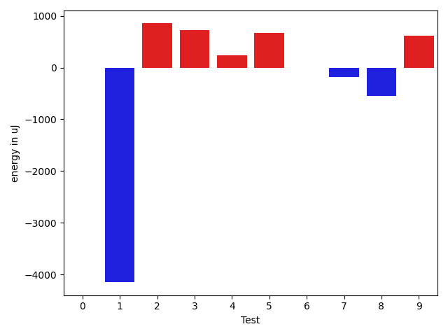

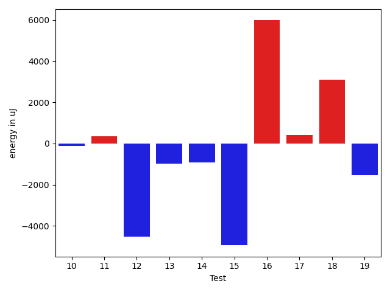

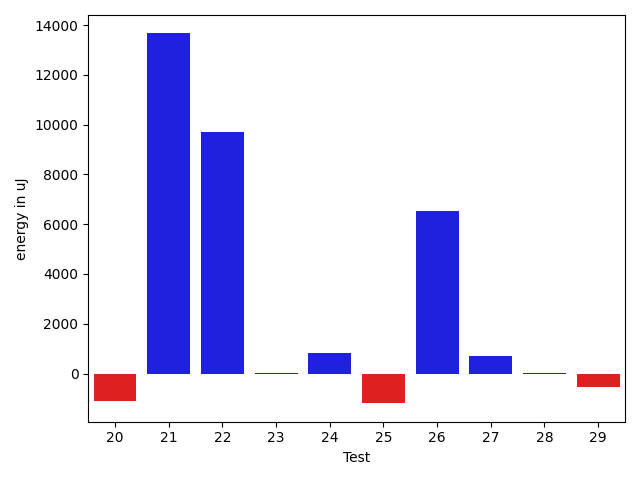

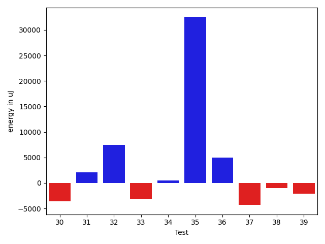

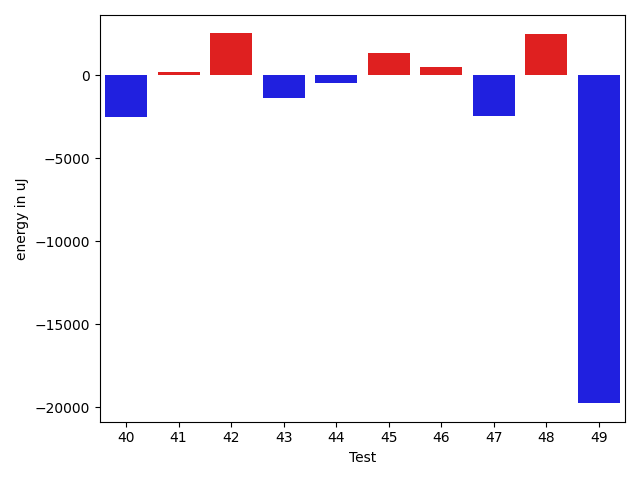

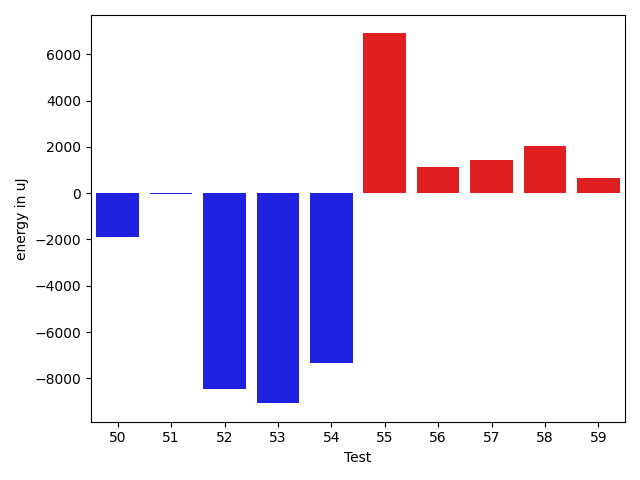

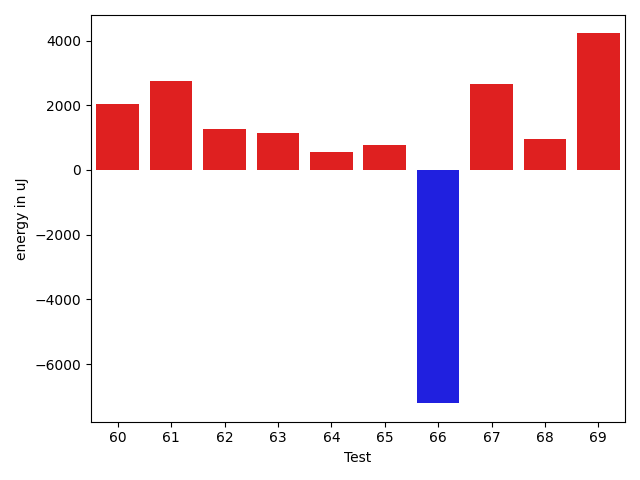

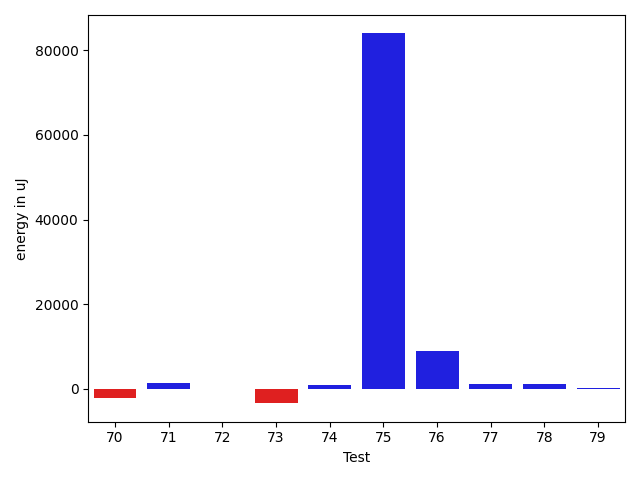

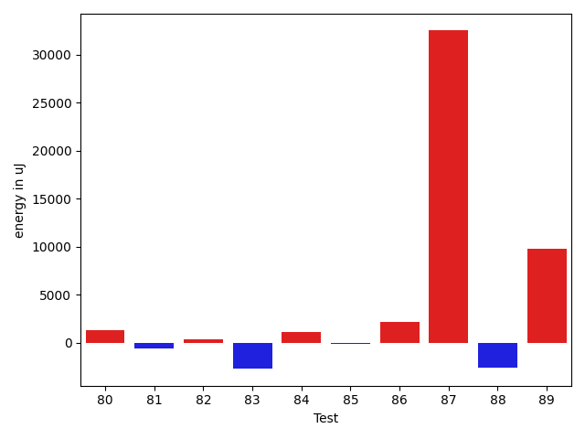

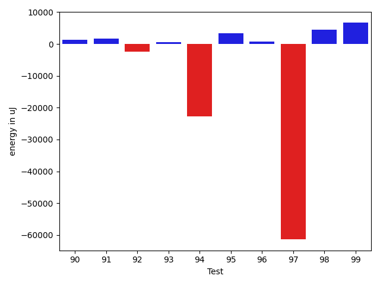

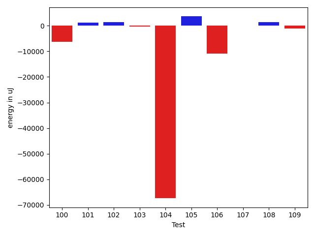

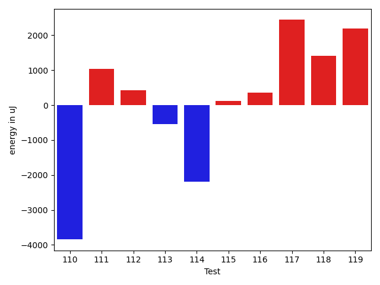

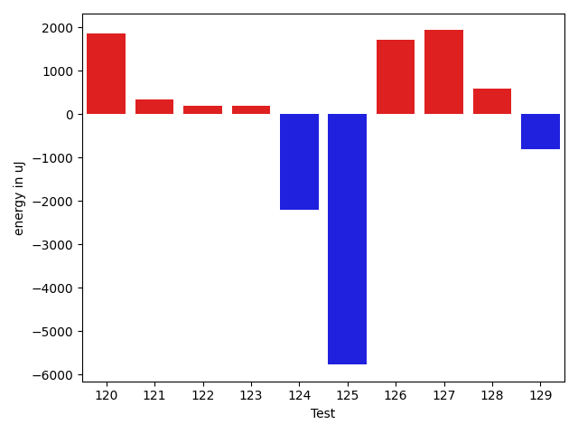

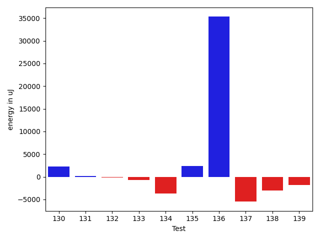

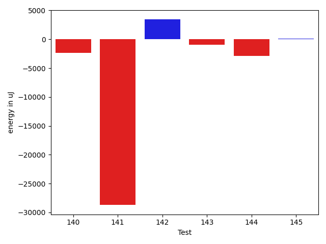

| ID | EnergyV1 | EnergyV2 | DeltaEnergy | σV1 | σV2 |
| --- | --- | --- | --- | --- | --- |
| 0 | 41069.23529411765 | 40244.236363636366 | -824.9989304812843 | 3706.5458767960154 | 4434.430384507274 |
| 1 | 41160.5 | 37764.68421052631 | -3395.815789473687 | 4971.840303147316 | 5496.95668005327 |
| 2 | 46336.88888888889 | 47003.47692307692 | 666.5880341880329 | 19370.488858500292 | 18771.430008317417 |
| 3 | 41695.13636363636 | 40979.0 | -716.1363636363603 | 6807.816164964387 | 7538.882776645357 |
| 4 | 39542.0 | 39048.117647058825 | -493.88235294117476 | 4265.2120530101265 | 3954.731877315235 |
| 5 | 39557.48888888889 | 40687.333333333336 | 1129.8444444444467 | 4480.641737877497 | 4017.881719402789 |
| 6 | 64567.555555555555 | 67048.48484848485 | 2480.9292929292933 | 61067.81639519475 | 65141.19370521756 |
| 7 | 46141.372881355936 | 63550.765625 | 17409.392743644064 | 18460.20707864306 | 83764.90117020639 |
| 8 | 42333.230769230766 | 40813.045454545456 | -1520.18531468531 | 4179.260672326911 | 4624.511192619298 |
| 9 | 44161.6 | 47471.49438202247 | 3309.894382022474 | 11396.222346608254 | 15496.954314847973 |
| 10 | 40224.46153846154 | 39685.88333333333 | -538.5782051282076 | 3713.803044887144 | 4589.02414859509 |
| 11 | 62005.40404040404 | 64392.51515151515 | 2387.1111111111095 | 24238.12059875897 | 32767.803394494964 |
| 12 | 96522.82828282828 | 103886.53535353535 | 7363.707070707067 | 75014.35676784642 | 109087.45084761386 |
| 13 | 64187.19191919192 | 61393.82828282828 | -2793.3636363636397 | 31935.965249823195 | 23704.069670208726 |
| 14 | 95506.21212121213 | 90878.67676767676 | -4627.535353535364 | 38162.246813890524 | 38132.79743367569 |
| 15 | 62368.49494949495 | 57389.58585858586 | -4978.909090909088 | 23902.915700333444 | 23093.225110850282 |
| 16 | 72936.78787878787 | 79994.04040404041 | 7057.252525252537 | 30700.599423382675 | 31402.929745879286 |
| 17 | 87571.71717171717 | 92742.36363636363 | 5170.646464646459 | 27802.411972991977 | 36990.33051877167 |
| 18 | 57511.57575757576 | 61885.74747474748 | 4374.171717171717 | 22840.473484403417 | 23560.280334093633 |
| 19 | 40622.13888888889 | 39520.142857142855 | -1101.9960317460354 | 3520.4677573739937 | 4055.6608619571343 |
| 20 | 40806.28571428572 | 39683.607142857145 | -1122.6785714285725 | 4393.072567694963 | 5804.259281764467 |
| 21 | 87853.39393939394 | 101519.06060606061 | 13665.666666666672 | 44004.98465723169 | 48481.258125076194 |
| 22 | 68987.74468085106 | 78697.36 | 9709.615319148943 | 84115.72673367812 | 77173.98281902004 |
| 23 | 44387.98039215686 | 44424.44262295082 | 36.46223079395713 | 10803.834369243492 | 10935.7497760666 |
| 24 | 44888.92592592593 | 45697.279411764706 | 808.3534858387793 | 11746.444792096554 | 13340.687740060906 |
| 25 | 42632.35849056604 | 41438.2962962963 | -1194.0621942697398 | 10229.061782341341 | 6384.117130961661 |
| 26 | 53791.936170212764 | 60338.68817204301 | 6546.752001830246 | 25761.53484830837 | 37645.44415308987 |
| 27 | 39733.80952380953 | 40419.76190476191 | 685.9523809523816 | 4357.190112676349 | 5687.249547848339 |
| 28 | 40882.148148148146 | 40904.13043478261 | 21.98228663446207 | 3877.4307998572663 | 4057.71678468642 |
| 29 | 40217.16 | 39692.36 | -524.8000000000029 | 3612.8894993342933 | 4496.815761224825 |
| 30 | 41521.23809523809 | 37877.77272727273 | -3643.465367965364 | 4653.527068945221 | 5795.959085524533 |
| 31 | 43671.85507246377 | 45740.485714285714 | 2068.6306418219465 | 8597.274480946573 | 12444.109521884364 |
| 32 | 61184.90217391304 | 68610.91666666667 | 7426.014492753631 | 65428.19586071631 | 91092.79965801208 |
| 33 | 44531.93877551021 | 41455.744680851065 | -3076.194094659142 | 9630.789802541709 | 3458.337249395555 |
| 34 | 46887.2972972973 | 47353.25675675676 | 465.95945945946005 | 14281.462096519286 | 15342.545383328066 |
| 35 | 42717.08163265306 | 75256.11428571428 | 32539.032653061222 | 11303.098948079274 | 102157.23394447865 |
| 36 | 188374.39393939395 | 193385.36363636365 | 5010.969696969696 | 126298.96488661603 | 121605.82071814836 |
| 37 | 44779.769230769234 | 40458.92 | -4320.849230769236 | 24160.24400874565 | 3220.502270391996 |
| 38 | 40143.607142857145 | 39118.975 | -1024.6321428571464 | 3654.4974868478907 | 4164.920308286223 |
| 39 | 43692.491228070176 | 41610.32203389831 | -2082.1691941718673 | 10379.218702845701 | 6704.388134067595 |
| 40 | 42930.44642857143 | 40409.63636363636 | -2520.810064935067 | 11592.46943050229 | 4128.258908210959 |
| 41 | 41607.17391304348 | 41803.75 | 196.57608695652016 | 4124.727412887283 | 3359.7922089766207 |
| 42 | 45794.666666666664 | 48307.86956521739 | 2513.2028985507277 | 13244.643028619363 | 14406.290987845032 |
| 43 | 43489.57142857143 | 42103.17857142857 | -1386.392857142855 | 3899.016977105268 | 4068.1585519527785 |
| 44 | 42372.78947368421 | 41918.26865671642 | -454.5208169677935 | 6383.727854796108 | 5969.203745949653 |
| 45 | 40645.2 | 41983.681818181816 | 1338.481818181819 | 3906.971208835134 | 3408.3011682223428 |
| 46 | 40834.730769230766 | 41313.48 | 478.74923076923733 | 3149.1906964963882 | 4004.202763297583 |
| 47 | 42724.58823529412 | 40295.26666666667 | -2429.321568627449 | 3390.502063443486 | 3526.5383114638385 |
| 48 | 40958.704545454544 | 43469.13333333333 | 2510.4287878787873 | 4486.39559000088 | 2913.921363996557 |
| 49 | 91753.83908045977 | 71984.23809523809 | -19769.60098522168 | 311318.8861427982 | 236130.3999151951 |
| 50 | 45544.916666666664 | 43671.57407407407 | -1873.3425925925912 | 12830.766874056628 | 8957.378288320115 |
| 51 | 41609.89230769231 | 41587.25352112676 | -22.6387865655488 | 3677.2684181565533 | 3728.4248863172957 |
| 52 | 54913.07526881721 | 46444.4 | -8468.675268817206 | 21684.27996986616 | 13782.378185586342 |
| 53 | 67720.69736842105 | 58647.31578947369 | -9073.381578947367 | 97250.57673094035 | 74637.18214755024 |
| 54 | 56507.30909090909 | 49180.22641509434 | -7327.082675814752 | 37163.05311357834 | 24142.071123609414 |
| 55 | 70346.36842105263 | 77240.40816326531 | 6894.039742212684 | 89427.14174237949 | 94517.50075480966 |
| 56 | 40919.04838709677 | 42058.78461538462 | 1139.7362282878457 | 4465.605397051426 | 7805.284879228762 |
| 57 | 42820.98684210526 | 44259.12857142857 | 1438.1417293233098 | 9538.337921381191 | 10201.986998229353 |
| 58 | 42272.596774193546 | 44316.835820895525 | 2044.2390467019795 | 7882.110779315967 | 10259.507690316925 |
| 59 | 48381.638554216865 | 49045.08860759494 | 663.4500533780738 | 17422.560675625817 | 20513.616881828206 |
| 60 | 40320.489795918365 | 42372.84 | 2052.350204081631 | 4698.600048223 | 8902.281115219852 |
| 61 | 97444.51515151515 | 100203.38383838384 | 2758.8686868686927 | 40162.88155392261 | 37261.87971795432 |
| 62 | 39506.5 | 40759.2 | 1252.699999999997 | 4271.977176905326 | 5506.124172632184 |
| 63 | 50068.10227272727 | 51197.55294117647 | 1129.4506684492007 | 16915.761251136453 | 16623.653797777846 |
| 64 | 40100.03448275862 | 40668.683333333334 | 568.6488505747111 | 4094.699542535267 | 4198.521269414057 |
| 65 | 40508.275862068964 | 41269.32 | 761.044137931036 | 4509.093179699268 | 3694.508104957952 |
| 66 | 63821.45918367347 | 56609.030303030304 | -7212.428880643165 | 22290.09649001207 | 22609.859224475436 |
| 67 | 40928.46808510638 | 43579.09523809524 | 2650.6271529888545 | 6864.905193286447 | 22590.60061577394 |
| 68 | 45971.816326530614 | 46933.70909090909 | 961.8927643784773 | 15172.92398693155 | 15204.553798329007 |
| 69 | 40463.19047619047 | 44681.89655172414 | 4218.706075533664 | 4113.784083727334 | 25765.142824801143 |
| 70 | 42855.62962962963 | 40734.8 | -2120.829629629625 | 3347.0558223072117 | 3982.0005139795417 |
| 71 | 40730.1 | 42204.519230769234 | 1474.4192307692356 | 4129.21631063329 | 6600.478771942301 |
| 72 | 39992.11538461538 | 40044.260869565216 | 52.14548494983319 | 5319.939352798639 | 3043.6101878238824 |
| 73 | 47763.333333333336 | 44399.875 | -3363.4583333333358 | 23738.40408494218 | 13431.258558280195 |
| 74 | 39984.36842105263 | 40885.13636363636 | 900.7679425837268 | 4063.991766083224 | 4219.509528751315 |
| 75 | 59008.6125 | 142959.5641025641 | 83950.95160256409 | 41119.99806708828 | 442135.89315977803 |
| 76 | 103024.60606060606 | 111968.42424242424 | 8943.818181818177 | 37143.23361243937 | 62922.49139613584 |
| 77 | 40991.5 | 42283.3962264151 | 1291.8962264150978 | 4272.552958795746 | 9319.796486035402 |
| 78 | 39992.95081967213 | 41173.72881355932 | 1180.77799388719 | 3832.7103170772616 | 5655.8627204785125 |
| 79 | 40106.805555555555 | 40359.77142857143 | 252.96587301587715 | 4323.512318445145 | 4538.559526581814 |
| 80 | 41914.903614457835 | 43244.01190476191 | 1329.1082903040733 | 6170.833008176952 | 10356.850039942563 |
| 81 | 40571.88461538462 | 39992.166666666664 | -579.7179487179528 | 4238.705973860447 | 3984.0131449191895 |
| 82 | 40256.7027027027 | 40627.305555555555 | 370.602852852855 | 4053.7341001670993 | 5147.562987685664 |
| 83 | 44192.19696969697 | 41500.83870967742 | -2691.3582600195514 | 11782.600313944826 | 6505.377929547484 |
| 84 | 55480.232323232325 | 56620.80808080808 | 1140.5757575757525 | 22054.422313275143 | 22424.23072683743 |
| 85 | 49905.892857142855 | 49792.29090909091 | -113.60194805194624 | 25104.379698768684 | 33048.61712121194 |
| 86 | 40361.72727272727 | 42549.930555555555 | 2188.2032828282827 | 5481.876303274976 | 8240.921373996945 |
| 87 | 162706.9696969697 | 195197.9797979798 | 32491.01010101009 | 389306.4201839906 | 454878.7416330824 |
| 88 | 61959.59574468085 | 59400.6914893617 | -2558.904255319154 | 27996.017597994472 | 27006.401936856273 |
| 89 | 282795.50505050505 | 292634.42424242425 | 9838.919191919209 | 382563.66191873763 | 380153.4544780539 |
| 90 | 54512.0 | 55798.6976744186 | 1286.6976744186031 | 32755.24086310464 | 33454.76161717622 |
| 91 | 41571.60317460317 | 43205.87096774193 | 1634.2677931387589 | 6674.888892814508 | 7793.887237680133 |
| 92 | 43936.32 | 41566.36363636364 | -2369.95636363636 | 9971.591728719477 | 7348.96342528728 |
| 93 | 44325.84210526316 | 44836.155844155845 | 510.31373889268434 | 12352.25596596644 | 18800.92010808986 |
| 94 | 213320.36363636365 | 190497.0101010101 | -22823.353535353555 | 509547.77083585307 | 447326.36213419394 |
| 95 | 43765.89024390244 | 47097.5 | 3331.6097560975613 | 10310.226076873694 | 14008.909842728923 |
| 96 | 42075.56140350877 | 42901.05454545454 | 825.4931419457716 | 7892.220333346583 | 6832.085842600423 |
| 97 | 188601.24242424243 | 127161.77777777778 | -61439.46464646465 | 398468.6034135758 | 251944.8221298295 |
| 98 | 50006.64935064935 | 54436.05882352941 | 4429.409472880063 | 19812.942104218066 | 26120.170662492168 |
| 99 | 55353.92307692308 | 62072.51612903226 | 6718.59305210918 | 35770.23877140484 | 46342.24647670637 |
| 100 | 53639.63291139241 | 47332.294117647056 | -6307.338793745352 | 27899.742399417486 | 18101.658193022653 |
| 101 | 43965.019230769234 | 45115.02380952381 | 1150.004578754575 | 21802.269515324795 | 11733.403303000443 |
| 102 | 40417.02777777778 | 41706.2 | 1289.172222222216 | 4400.193660423186 | 4417.037577381474 |
| 103 | 44579.25806451613 | 44253.63157894737 | -325.6264855687623 | 15491.041692139243 | 15688.431598542942 |
| 104 | 149149.5 | 81788.08 | -67361.42 | 469614.33308503934 | 261902.8007434697 |
| 105 | 73502.06521739131 | 77094.37234042553 | 3592.3071230342175 | 76672.08404185863 | 92465.1256702354 |
| 106 | 425217.2626262626 | 414396.1818181818 | -10821.080808080791 | 157129.15016574677 | 152365.7276390496 |
| 107 | 40538.07843137255 | 40536.88636363636 | -1.1920677361922571 | 5073.266379617218 | 4089.8135944180603 |
| 108 | 48603.95294117647 | 49951.456790123455 | 1347.503848946988 | 14773.950654012531 | 19502.478392074125 |
| 109 | 61997.83870967742 | 60912.98245614035 | -1084.8562535370656 | 55669.98839537985 | 48221.557053343015 |
| 110 | 104894.82653061225 | 92882.22448979592 | -12012.602040816331 | 97764.74544246044 | 74358.46092004987 |
| 111 | 45655.54651162791 | 45789.851851851854 | 134.30534022394568 | 13620.733648800184 | 12993.93160748614 |
| 112 | 44551.703125 | 43467.35593220339 | -1084.3471927966093 | 18165.65256679457 | 9079.004564943309 |
| 113 | 50232.471264367814 | 49461.8021978022 | -770.6690665656133 | 18247.485902622742 | 16926.755942946747 |
| 114 | 229033.775 | 85261.39024390244 | -143772.38475609757 | 525265.1584649646 | 257027.76664815884 |
| 115 | 39484.17647058824 | 39477.14705882353 | -7.02941176470631 | 3805.782222066747 | 5387.02017452382 |
| 116 | 40596.68965517241 | 41657.94736842105 | 1061.2577132486404 | 3946.9577206392364 | 4305.430872424955 |
| 117 | 38849.793103448275 | 41259.67441860465 | 2409.8813151563736 | 4046.187838714279 | 3799.796369825137 |
| 118 | 116318.63076923077 | 161028.1896551724 | 44709.55888594163 | 410519.5654262298 | 504894.23813970276 |
| 119 | 219544.91525423728 | 227584.26666666666 | 8039.351412429387 | 590161.5484418919 | 608782.031356732 |
| 120 | 39766.15625 | 41634.36111111111 | 1868.2048611111095 | 4009.938996647697 | 4536.948773697397 |
| 121 | 40846.92857142857 | 41189.177777777775 | 342.2492063492027 | 4487.96697208402 | 5516.469907020406 |
| 122 | 40161.11538461538 | 40354.8431372549 | 193.72775263951917 | 4186.453422160237 | 4727.262800314493 |
| 123 | 40597.218181818185 | 40787.78846153846 | 190.57027972027572 | 6691.098593561472 | 4922.413199361821 |
| 124 | 58928.02040816326 | 56737.21212121212 | -2190.808286951142 | 25280.001198406222 | 20499.626842266574 |
| 125 | 60429.95652173913 | 54664.09523809524 | -5765.8612836438915 | 49046.236640167685 | 42524.40979171594 |
| 126 | 40177.625 | 41892.09090909091 | 1714.4659090909117 | 4174.117000561317 | 3881.4544631247827 |
| 127 | 39840.91891891892 | 41772.37142857143 | 1931.4525096525103 | 3827.58147743439 | 4675.18469664623 |
| 128 | 40501.2037037037 | 41090.78571428572 | 589.5820105820167 | 3686.1947878619167 | 4604.10049270634 |
| 129 | 40341.27272727273 | 39537.11111111111 | -804.1616161616184 | 3650.92725683637 | 4331.114648536267 |
| 130 | 45987.979166666664 | 48269.574468085106 | 2281.5953014184415 | 17605.93271515029 | 18592.64178835236 |
| 131 | 43058.42857142857 | 43278.35294117647 | 219.92436974789598 | 10677.950982644334 | 21730.689091808486 |
| 132 | 40943.03703703704 | 40777.19047619047 | -165.84656084656308 | 4775.801204696066 | 4490.131609260548 |
| 133 | 41276.555555555555 | 40608.7 | -667.8555555555577 | 5128.84380757195 | 3509.3453534811874 |
| 134 | 60002.67647058824 | 56360.83870967742 | -3641.837760910821 | 34117.095342813445 | 28590.208137207122 |
| 135 | 40077.47368421053 | 42467.57894736842 | 2390.105263157893 | 4192.965592493431 | 3593.6920073605797 |
| 136 | 191304.59595959596 | 226600.11111111112 | 35295.51515151517 | 374397.7780563524 | 431726.4047937994 |
| 137 | 59829.243589743586 | 54353.48235294117 | -5475.761236802413 | 63132.144261509515 | 38755.8119241069 |
| 138 | 59216.171428571426 | 56161.36486486487 | -3054.8065637065592 | 78292.5924454399 | 60799.132018514145 |
| 139 | 41171.68 | 39313.03571428572 | -1858.644285714283 | 4166.4623240346245 | 4584.536699463152 |
| 140 | 59373.13636363636 | 56983.05 | -2390.0863636363574 | 41038.06360872955 | 33620.87341477761 |
| 141 | 99407.08510638298 | 70675.69662921349 | -28731.388477169487 | 126610.22444323846 | 50541.612109832575 |
| 142 | 51002.37634408602 | 54445.4 | 3443.023655913981 | 33067.058686730794 | 37628.74656592156 |
| 143 | 44124.028169014084 | 43169.56 | -954.468169014086 | 10369.66199208983 | 7596.8226959082485 |
| 144 | 52249.58823529412 | 49389.57142857143 | -2860.0168067226914 | 22170.224932019344 | 18577.78375877368 |
| 145 | 39591.4358974359 | 39711.05714285714 | 119.62124542124366 | 4069.363642023046 | 4189.016993062127 |

## Delta Duration per test method

| ID | DurationV1 | DurationsV2 | DeltaDuration |
| --- | --- | --- | --- |
| 0 | 787250.6862745098 | 847464.9818181818 | 60214.29554367205 |
| 1 | 470536.3333333333 | 511201.7368421053 | 40665.40350877197 |
| 2 | 1084208.6851851852 | 1238076.7538461538 | 153868.06866096868 |
| 3 | 687044.9545454546 | 817480.56 | 130435.60545454547 |
| 4 | 476147.0 | 448612.23529411765 | -27534.76470588235 |
| 5 | 822350.1111111111 | 781234.8222222222 | -41115.2888888889 |
| 6 | 2002425.686868687 | 1928769.7676767677 | -73655.91919191927 |
| 7 | 1125617.5423728814 | 1651209.0 | 525591.4576271186 |
| 8 | 927822.2051282051 | 747809.2045454546 | -180013.00058275054 |
| 9 | 1245333.5 | 1281604.7078651686 | 36271.20786516857 |
| 10 | 970755.6153846154 | 897447.4333333333 | -73308.18205128203 |
| 11 | 1752757.1818181819 | 1817929.4141414142 | 65172.23232323234 |
| 12 | 2660204.888888889 | 3061111.5757575757 | 400906.6868686867 |
| 13 | 1855672.0202020202 | 1797525.4646464647 | -58146.555555555504 |
| 14 | 2625404.131313131 | 2610592.373737374 | -14811.757575757336 |
| 15 | 1671191.3535353534 | 1724584.393939394 | 53393.0404040406 |
| 16 | 2117135.4646464647 | 2156031.02020202 | 38895.555555555504 |
| 17 | 2435052.777777778 | 2557288.757575758 | 122235.97979797982 |
| 18 | 1687849.888888889 | 1728234.606060606 | 40384.71717171697 |
| 19 | 622967.7222222222 | 687590.380952381 | 64622.6587301587 |
| 20 | 515093.95238095237 | 569232.25 | 54138.29761904763 |
| 21 | 2521034.777777778 | 2872592.606060606 | 351557.828282828 |
| 22 | 1738698.0 | 2114380.62 | 375682.6200000001 |
| 23 | 1056868.5882352942 | 1108804.2786885246 | 51935.6904532304 |
| 24 | 1104005.4074074074 | 1156124.544117647 | 52119.136710239574 |
| 25 | 833068.4339622641 | 891542.1111111111 | 58473.677148847026 |
| 26 | 1494324.2340425532 | 1729726.3440860214 | 235402.1100434682 |
| 27 | 562240.7142857143 | 597374.0 | 35133.28571428568 |
| 28 | 581005.7777777778 | 544764.7826086957 | -36240.995169082074 |
| 29 | 584928.08 | 581840.48 | -3087.5999999999767 |
| 30 | 590087.7619047619 | 636973.1818181818 | 46885.41991341987 |
| 31 | 1004554.6086956522 | 1011474.1428571428 | 6919.534161490621 |
| 32 | 1703931.706521739 | 1969372.8333333333 | 265441.12681159424 |
| 33 | 949232.6734693878 | 936129.5319148937 | -13103.141554494156 |
| 34 | 1162255.0675675676 | 1137370.3783783785 | -24884.689189189114 |
| 35 | 814806.6734693878 | 1733508.8285714285 | 918702.1551020407 |
| 36 | 5102018.424242424 | 5224314.747474748 | 122296.32323232386 |
| 37 | 835673.1153846154 | 748713.46 | -86959.65538461541 |
| 38 | 757262.6428571428 | 760437.45 | 3174.807142857113 |
| 39 | 993523.5789473684 | 975519.186440678 | -18004.392506690463 |
| 40 | 1003263.3035714285 | 954579.4181818182 | -48683.88538961031 |
| 41 | 481258.26086956525 | 437247.4166666667 | -44010.84420289856 |
| 42 | 815362.2666666667 | 960697.3478260869 | 145335.0811594202 |
| 43 | 628718.3214285715 | 572877.9642857143 | -55840.35714285716 |
| 44 | 1046469.3947368421 | 1027840.1194029851 | -18629.275333857047 |
| 45 | 475371.2 | 427677.7727272727 | -47693.427272727306 |
| 46 | 500069.73076923075 | 485717.16 | -14352.570769230777 |
| 47 | 403490.23529411765 | 394491.4666666667 | -8998.768627450976 |
| 48 | 732319.0 | 703478.4666666667 | -28840.533333333326 |
| 49 | 2705447.252873563 | 2033206.738095238 | -672240.5147783251 |
| 50 | 1043410.875 | 919954.1111111111 | -123456.76388888888 |
| 51 | 972908.0307692308 | 1012058.7042253522 | 39150.67345612135 |
| 52 | 1569812.430107527 | 1468254.4315789475 | -101557.99852857948 |
| 53 | 1907486.9868421052 | 1654765.4605263157 | -252721.52631578944 |
| 54 | 1415866.9090909092 | 1165565.4716981133 | -250301.43739279592 |
| 55 | 2222602.494736842 | 2264931.112244898 | 42328.61750805611 |
| 56 | 915244.7741935484 | 939822.0923076923 | 24577.318114143913 |
| 57 | 1054464.0 | 1127222.5428571429 | 72758.54285714286 |
| 58 | 991610.3870967742 | 1060969.0597014925 | 69358.67260471836 |
| 59 | 1262707.9518072288 | 1303257.0379746836 | 40549.08616745472 |
| 60 | 897056.9591836735 | 976650.22 | 79593.26081632648 |
| 61 | 2655699.727272727 | 2698675.1818181816 | 42975.45454545459 |
| 62 | 852345.525 | 795955.088888889 | -56390.43611111108 |
| 63 | 1324370.6818181819 | 1396286.517647059 | 71915.83582887705 |
| 64 | 829141.2068965518 | 824989.0666666667 | -4152.140229885117 |
| 65 | 578575.0689655172 | 541760.12 | -36814.94896551722 |
| 66 | 1806766.0612244897 | 1778583.2727272727 | -28182.788497217 |
| 67 | 802339.6808510638 | 1034478.880952381 | 232139.20010131714 |
| 68 | 980776.7142857143 | 988632.7818181819 | 7856.067532467539 |
| 69 | 587160.7619047619 | 671277.4827586206 | 84116.72085385874 |
| 70 | 599561.8518518518 | 664821.4333333333 | 65259.58148148155 |
| 71 | 944849.7 | 892517.8076923077 | -52331.89230769221 |
| 72 | 556297.4615384615 | 524377.2173913043 | -31920.24414715718 |
| 73 | 1022712.9722222222 | 828350.925 | -194362.0472222222 |
| 74 | 508347.0 | 538498.2727272727 | 30151.272727272706 |
| 75 | 1572023.15 | 3997505.717948718 | 2425482.567948718 |
| 76 | 2799303.868686869 | 3130924.222222222 | 331620.3535353532 |
| 77 | 872529.2142857143 | 995788.8113207547 | 123259.59703504038 |
| 78 | 916406.0655737704 | 971913.5084745763 | 55507.44290080585 |
| 79 | 568706.3611111111 | 594087.6857142857 | 25381.32460317458 |
| 80 | 1102423.1927710844 | 1117569.5833333333 | 15146.390562248882 |
| 81 | 562567.5769230769 | 657003.2666666667 | 94435.68974358984 |
| 82 | 642313.5135135135 | 675510.0555555555 | 33196.54204204201 |
| 83 | 1107005.6515151516 | 1088347.7580645161 | -18657.893450635485 |
| 84 | 1686524.898989899 | 1657915.9292929294 | -28608.969696969725 |
| 85 | 1270733.4107142857 | 1136959.5272727273 | -133773.88344155834 |
| 86 | 1015878.0757575758 | 1053258.125 | 37380.0492424242 |
| 87 | 4628477.373737373 | 5617029.888888889 | 988552.5151515156 |
| 88 | 1749207.2234042552 | 1753360.9680851065 | 4153.744680851232 |
| 89 | 7681297.98989899 | 8108503.373737373 | 427205.3838383835 |
| 90 | 1306642.1489361702 | 1354242.8837209302 | 47600.73478476005 |
| 91 | 1012471.1428571428 | 994205.6774193548 | -18265.46543778805 |
| 92 | 1231900.2933333332 | 1197168.5844155843 | -34731.70891774888 |
| 93 | 1204446.6315789474 | 1195148.3766233767 | -9298.25495557068 |
| 94 | 6338437.4949494945 | 5375896.080808081 | -962541.4141414138 |
| 95 | 1304940.5975609757 | 1205637.0 | -99303.5975609757 |
| 96 | 1073007.7894736843 | 922144.1090909091 | -150863.68038277514 |
| 97 | 5362454.404040404 | 3503699.1414141413 | -1858755.2626262624 |
| 98 | 1293321.3116883116 | 1438378.6617647058 | 145057.35007639416 |
| 99 | 1037338.6923076923 | 1420453.1290322582 | 383114.4367245659 |
| 100 | 1554176.6835443038 | 1416616.4235294117 | -137560.2600148921 |
| 101 | 905915.9038461539 | 986285.119047619 | 80369.21520146518 |
| 102 | 758549.8055555555 | 842947.1142857143 | 84397.30873015884 |
| 103 | 911432.1612903225 | 825213.1578947369 | -86219.00339558569 |
| 104 | 4014435.671875 | 2251664.4 | -1762771.271875 |
| 105 | 2095016.152173913 | 2156117.7021276597 | 61101.54995374661 |
| 106 | 10421369.141414141 | 10218421.535353536 | -202947.6060606055 |
| 107 | 843942.6666666666 | 916877.7272727273 | 72935.06060606067 |
| 108 | 1305144.2 | 1306349.938271605 | 1205.7382716049906 |
| 109 | 1574890.0806451612 | 1531539.6842105263 | -43350.396434634924 |
| 110 | 2954982.8775510206 | 2537502.5408163266 | -417480.33673469396 |
| 111 | 1245563.558139535 | 1233567.049382716 | -11996.508756818948 |
| 112 | 1056482.984375 | 993628.8474576271 | -62854.13691737293 |
| 113 | 1485899.3218390804 | 1354545.6373626373 | -131353.6844764431 |
| 114 | 6888588.825 | 2248960.2682926827 | -4639628.556707317 |
| 115 | 598049.9705882353 | 604332.0588235294 | 6282.088235294097 |
| 116 | 644926.3103448276 | 653809.2368421053 | 8882.926497277687 |
| 117 | 876083.275862069 | 747947.9069767442 | -128135.3688853248 |
| 118 | 3243960.5692307693 | 4597454.327586207 | 1353493.7583554373 |
| 119 | 6260673.576271187 | 6686658.883333334 | 425985.3070621472 |
| 120 | 644039.6875 | 664015.1111111111 | 19975.423611111124 |
| 121 | 784537.7380952381 | 839276.7111111111 | 54738.973015872994 |
| 122 | 798372.5961538461 | 875433.1568627451 | 77060.56070889893 |
| 123 | 1021653.0909090909 | 955413.2692307692 | -66239.82167832169 |
| 124 | 1661462.1326530613 | 1563232.9191919193 | -98229.21346114203 |
| 125 | 1373367.956521739 | 1158741.642857143 | -214626.31366459606 |
| 126 | 739903.45 | 677735.9090909091 | -62167.540909090894 |
| 127 | 769902.5945945946 | 747148.4857142858 | -22754.108880308806 |
| 128 | 823916.3703703703 | 816174.3035714285 | -7742.066798941814 |
| 129 | 477811.1818181818 | 543069.0 | 65257.81818181818 |
| 130 | 1411703.4895833333 | 1407619.585106383 | -4083.904476950178 |
| 131 | 1074421.9 | 1146360.0147058824 | 71938.1147058825 |
| 132 | 532986.6666666666 | 519002.71428571426 | -13983.952380952367 |
| 133 | 500758.8888888889 | 432359.13333333336 | -68399.75555555552 |
| 134 | 1546619.0147058824 | 1447098.3064516129 | -99520.70825426956 |
| 135 | 516244.36842105264 | 460586.1052631579 | -55658.26315789472 |
| 136 | 5091431.717171717 | 6364737.242424242 | 1273305.5252525248 |
| 137 | 1561509.1538461538 | 1478749.9647058824 | -82759.1891402714 |
| 138 | 1583987.7571428572 | 1434397.8648648649 | -149589.89227799233 |
| 139 | 658116.8 | 659320.5357142857 | 1203.7357142856345 |
| 140 | 1575213.4545454546 | 1442595.5375 | -132617.9170454545 |
| 141 | 2858515.234042553 | 1948714.7865168538 | -909800.4475256994 |
| 142 | 1434150.7311827957 | 1528001.5882352942 | 93850.8570524985 |
| 143 | 1134252.4225352113 | 1107354.3333333333 | -26898.089201878058 |
| 144 | 1425209.6176470588 | 1371838.8142857142 | -53370.80336134462 |
| 145 | 667967.0256410256 | 722609.6 | 54642.57435897435 |

## Misc.

| ID | Test Class | Test Method |
| --- | --- | --- |
| 0 | com.google.gson.internal.bind.MiniGsonTest | testSerializeRecursive |
| 1 | com.google.gson.internal.bind.MiniGsonTest | testSerializeNullObject |
| 2 | com.google.gson.internal.bind.MiniGsonTest | testSerializeWithCustomTypeAdapter |
| 3 | com.google.gson.internal.bind.MiniGsonTest | testSerialize |
| 4 | com.google.gson.internal.bind.MiniGsonTest | testSerializeNullField |
| 5 | com.google.gson.functional.CustomDeserializerTest | testDefaultConstructorNotCalledOnField |
| 6 | com.google.gson.functional.CustomDeserializerTest | testDefaultConstructorNotCalledOnObject |
| 7 | com.google.gson.functional.InterfaceTest | testSerializingObjectImplementingInterface |
| 8 | com.google.gson.functional.InterfaceTest | testSerializingInterfaceObjectField |
| 9 | com.google.gson.functional.ParameterizedTypesTest | testParameterizedTypeGenericArraysSerialization |
| 10 | com.google.gson.functional.ParameterizedTypesTest | testParameterizedTypesWithWriterSerialization |
| 11 | com.google.gson.functional.ParameterizedTypesTest | testVariableTypeArrayDeserialization |
| 12 | com.google.gson.functional.ParameterizedTypesTest | testParameterizedTypesSerialization |
| 13 | com.google.gson.functional.ParameterizedTypesTest | testVariableTypeDeserialization |
| 14 | com.google.gson.functional.ParameterizedTypesTest | testVariableTypeFieldsAndGenericArraysSerialization |
| 15 | com.google.gson.functional.ParameterizedTypesTest | testParameterizedTypeGenericArraysDeserialization |
| 16 | com.google.gson.functional.ParameterizedTypesTest | testVariableTypeFieldsAndGenericArraysDeserialization |
| 17 | com.google.gson.functional.ParameterizedTypesTest | testTypesWithMultipleParametersSerialization |
| 18 | com.google.gson.functional.ParameterizedTypesTest | testParameterizedTypeWithVariableTypeDeserialization |
| 19 | com.google.gson.functional.ParameterizedTypesTest | testDeepParameterizedTypeSerialization |
| 20 | com.google.gson.functional.InheritanceTest | testBaseSerializedAsBaseWhenSpecifiedWithExplicitType |
| 21 | com.google.gson.functional.InheritanceTest | testSubInterfacesOfCollectionSerialization |
| 22 | com.google.gson.functional.InheritanceTest | testBaseSerializedAsBaseWhenSpecifiedWithExplicitTypeForToJsonMethod |
| 23 | com.google.gson.functional.InheritanceTest | testClassWithBaseArrayFieldSerialization |
| 24 | com.google.gson.functional.InheritanceTest | testClassWithBaseCollectionFieldSerialization |
| 25 | com.google.gson.functional.InheritanceTest | testClassWithBaseFieldSerialization |
| 26 | com.google.gson.functional.InheritanceTest | testSubClassSerialization |
| 27 | com.google.gson.functional.InheritanceTest | testBaseSerializedAsSubWhenSpecifiedWithExplicitType |
| 28 | com.google.gson.functional.InheritanceTest | testBaseSerializedAsSub |
| 29 | com.google.gson.functional.InheritanceTest | testBaseSerializedAsSubForToJsonMethod |
| 30 | com.google.gson.functional.InheritanceTest | testBaseSerializedAsSubWhenSpecifiedWithExplicitTypeForToJsonMethod |
| 31 | com.google.gson.functional.PrettyPrintingTest | testEmptyMapField |
| 32 | com.google.gson.functional.PrettyPrintingTest | testPrettyPrintList |
| 33 | com.google.gson.functional.PrettyPrintingTest | testPrettyPrintArrayOfObjects |
| 34 | com.google.gson.functional.ReadersWritersTest | testReadWriteTwoObjects |
| 35 | com.google.gson.functional.ReadersWritersTest | testWriterForSerialization |
| 36 | com.google.gson.functional.ExposeFieldsTest | testNullExposeFieldSerialization |
| 37 | com.google.gson.functional.ExposeFieldsTest | testNoExposedFieldSerialization |
| 38 | com.google.gson.functional.ExposeFieldsTest | testExposeAnnotationSerialization |
| 39 | com.google.gson.functional.ExposeFieldsTest | testArrayWithOneNullExposeFieldObjectSerialization |
| 40 | com.google.gson.functional.ExposeFieldsTest | testExposedInterfaceFieldSerialization |
| 41 | com.google.gson.functional.PrimitiveTest | testDeserializeJsonObjectAsShortPrimitive |
| 42 | com.google.gson.functional.PrimitiveTest | testMoreSpecificSerialization |
| 43 | com.google.gson.functional.PrimitiveTest | testDeserializingNonZeroDecimalPointValuesAsIntegerFails |
| 44 | com.google.gson.functional.PrimitiveTest | testValueVeryCloseToZeroIsZero |
| 45 | com.google.gson.functional.PrimitiveTest | testDeserializingBigDecimalAsIntegerFails |
| 46 | com.google.gson.functional.PrimitiveTest | testDeserializingBigIntegerAsInteger |
| 47 | com.google.gson.functional.PrimitiveTest | testDeserializeJsonArrayAsShortWrapper |
| 48 | com.google.gson.functional.FieldExclusionTest | testDefaultNestedStaticClassIncluded |
| 49 | com.google.gson.functional.FieldExclusionTest | testDefaultInnerClassExclusion |
| 50 | com.google.gson.functional.CollectionTest | testRawCollectionSerialization |
| 51 | com.google.gson.functional.CollectionTest | testFieldIsArrayList |
| 52 | com.google.gson.functional.CollectionTest | testWildcardCollectionField |
| 53 | com.google.gson.functional.CollectionTest | testSetSerialization |
| 54 | com.google.gson.functional.CollectionTest | testCollectionOfBagOfPrimitivesSerialization |
| 55 | com.google.gson.functional.MoreSpecificTypeSerializationTest | testSubclassFields |
| 56 | com.google.gson.functional.MoreSpecificTypeSerializationTest | testParameterizedSubclassFields |
| 57 | com.google.gson.functional.MoreSpecificTypeSerializationTest | testListOfParameterizedSubclassFields |
| 58 | com.google.gson.functional.MoreSpecificTypeSerializationTest | testMapOfParameterizedSubclassFields |
| 59 | com.google.gson.functional.MoreSpecificTypeSerializationTest | testListOfSubclassFields |
| 60 | com.google.gson.functional.ObjectTest | testNestedSerialization |
| 61 | com.google.gson.functional.ObjectTest | testSingletonLists |
| 62 | com.google.gson.functional.ObjectTest | testNullFieldsSerialization |
| 63 | com.google.gson.functional.ObjectTest | testArrayOfObjectsAsFields |
| 64 | com.google.gson.functional.ObjectTest | testInnerClassSerialization |
| 65 | com.google.gson.functional.ObjectTest | testEmptyCollectionInAnObjectSerialization |
| 66 | com.google.gson.functional.ObjectTest | testArrayOfArraysSerialization |
| 67 | com.google.gson.functional.ObjectTest | testClassWithTransientFieldsSerialization |
| 68 | com.google.gson.functional.ObjectTest | testBagOfPrimitiveWrappersSerialization |
| 69 | com.google.gson.functional.ObjectTest | testPrimitiveArrayFieldSerialization |
| 70 | com.google.gson.functional.ObjectTest | testStringFieldWithEmptyValueSerialization |
| 71 | com.google.gson.functional.ObjectTest | testArrayOfObjectsSerialization |
| 72 | com.google.gson.functional.ObjectTest | testClassWithObjectFieldSerialization |
| 73 | com.google.gson.functional.ObjectTest | testBagOfPrimitivesSerialization |
| 74 | com.google.gson.functional.ObjectTest | testClassWithNoFieldsSerialization |
| 75 | com.google.gson.JsonParserTest | testReadWriteTwoObjects |
| 76 | com.google.gson.functional.NamingPolicyTest | testGsonWithNonDefaultFieldNamingPolicySerialization |
| 77 | com.google.gson.functional.NamingPolicyTest | testGsonWithSerializedNameFieldNamingPolicySerialization |
| 78 | com.google.gson.functional.NamingPolicyTest | testComplexFieldNameStrategy |
| 79 | com.google.gson.functional.NamingPolicyTest | testGsonWithLowerCaseUnderscorePolicySerialization |
| 80 | com.google.gson.functional.NamingPolicyTest | testDeprecatedNamingStrategy |
| 81 | com.google.gson.functional.NamingPolicyTest | testGsonWithUpperCamelCaseSpacesPolicySerialiation |
| 82 | com.google.gson.functional.NamingPolicyTest | testGsonWithLowerCaseDashPolicySerialization |
| 83 | com.google.gson.functional.CustomTypeAdaptersTest | testCustomNestedSerializers |
| 84 | com.google.gson.functional.CustomTypeAdaptersTest | testCustomTypeAdapterDoesNotAppliesToSubClasses |
| 85 | com.google.gson.functional.CustomTypeAdaptersTest | testEnsureCustomSerializerNotInvokedForNullValues |
| 86 | com.google.gson.functional.TypeVariableTest | testBasicTypeVariables |
| 87 | com.google.gson.functional.TypeVariableTest | testAdvancedTypeVariables |
| 88 | com.google.gson.functional.TypeVariableTest | testTypeVariablesViaTypeParameter |
| 89 | com.google.gson.functional.VersioningTest | testVersionedUntilSerialization |
| 90 | com.google.gson.functional.VersioningTest | testVersionedGsonWithUnversionedClassesSerialization |
| 91 | com.google.gson.functional.VersioningTest | testVersionedClassesSerialization |
| 92 | com.google.gson.functional.VersioningTest | testVersionedGsonMixingSinceAndUntilSerialization |
| 93 | com.google.gson.functional.MapAsArrayTypeAdapterTest | testMultipleEnableComplexKeyRegistrationHasNoEffect |
| 94 | com.google.gson.functional.MapAsArrayTypeAdapterTest | testSerializeComplexMapWithTypeAdapter |
| 95 | com.google.gson.functional.MapAsArrayTypeAdapterTest | testMapWithTypeVariableSerialization |
| 96 | com.google.gson.functional.ExclusionStrategyFunctionalTest | testExclusionStrategyWithMode |
| 97 | com.google.gson.functional.ExclusionStrategyFunctionalTest | testExclusionStrategySerialization |
| 98 | com.google.gson.functional.ArrayTest | testObjectArrayWithNonPrimitivesSerialization |
| 99 | com.google.gson.functional.ArrayTest | testSingleNullInArraySerialization |
| 100 | com.google.gson.functional.EnumTest | testClassWithEnumFieldSerialization |
| 101 | com.google.gson.functional.UncategorizedTest | testGsonInstanceReusableForSerializationAndDeserialization |
| 102 | com.google.gson.functional.UncategorizedTest | testStaticFieldsAreNotSerialized |
| 103 | com.google.gson.functional.UncategorizedTest | testObjectEqualButNotSameSerialization |
| 104 | com.google.gson.FunctionWithInternalDependenciesTest | testAnonymousLocalClassesSerialization |
| 105 | com.google.gson.functional.ConcurrencyTest | testSingleThreadSerialization |
| 106 | com.google.gson.functional.ConcurrencyTest | testMultiThreadSerialization |
| 107 | com.google.gson.functional.EscapingTest | testGsonDoubleDeserialization |
| 108 | com.google.gson.functional.EscapingTest | testGsonAcceptsEscapedAndNonEscapedJsonDeserialization |
| 109 | com.google.gson.functional.EscapingTest | testEscapingObjectFields |
| 110 | com.google.gson.functional.RawSerializationTest | testThreeLevelParameterizedObject |
| 111 | com.google.gson.functional.RawSerializationTest | testParameterizedObject |
| 112 | com.google.gson.functional.RawSerializationTest | testCollectionOfObjects |
| 113 | com.google.gson.functional.RawSerializationTest | testTwoLevelParameterizedObject |
| 114 | com.google.gson.functional.SecurityTest | testNonExecutableJsonSerialization |
| 115 | com.google.gson.MixedStreamTest | testWriteClosed |
| 116 | com.google.gson.MixedStreamTest | testWriteInvalidState |
| 117 | com.google.gson.MixedStreamTest | testWriteDoesNotMutateState |
| 118 | com.google.gson.MixedStreamTest | testWriteMixedStreamed |
| 119 | com.google.gson.functional.CustomSerializerTest | testSubClassSerializerInvokedForBaseClassFieldsHoldingSubClassInstances |
| 120 | com.google.gson.functional.CustomSerializerTest | testBaseClassSerializerInvokedForBaseClassFields |
| 121 | com.google.gson.functional.CustomSerializerTest | testBaseClassSerializerInvokedForBaseClassFieldsHoldingSubClassInstances |
| 122 | com.google.gson.functional.CustomSerializerTest | testSubClassSerializerInvokedForBaseClassFieldsHoldingArrayOfSubClassInstances |
| 123 | com.google.gson.functional.NullObjectAndFieldTest | testPrintPrintingObjectWithNulls |
| 124 | com.google.gson.functional.NullObjectAndFieldTest | testExplicitSerializationOfNullArrayMembers |
| 125 | com.google.gson.functional.NullObjectAndFieldTest | testExplicitSerializationOfNulls |
| 126 | com.google.gson.functional.NullObjectAndFieldTest | testExplicitSerializationOfNullStringMembers |
| 127 | com.google.gson.functional.NullObjectAndFieldTest | testExplicitSerializationOfNullCollectionMembers |
| 128 | com.google.gson.functional.NullObjectAndFieldTest | testNullWrappedPrimitiveMemberSerialization |
| 129 | com.google.gson.functional.DefaultTypeAdaptersTest | testLocaleDeserializationWithLanguage |
| 130 | com.google.gson.functional.DefaultTypeAdaptersTest | testUrlNullSerialization |
| 131 | com.google.gson.functional.DefaultTypeAdaptersTest | testBigIntegerFieldSerialization |
| 132 | com.google.gson.functional.DefaultTypeAdaptersTest | testUriDeserialization |
| 133 | com.google.gson.functional.DefaultTypeAdaptersTest | testLocaleDeserializationWithLanguageCountryVariant |
| 134 | com.google.gson.functional.DefaultTypeAdaptersTest | testBigDecimalFieldSerialization |
| 135 | com.google.gson.functional.DefaultTypeAdaptersTest | testLocaleDeserializationWithLanguageCountry |
| 136 | com.google.gson.functional.TypeHierarchyAdapterTest | testTypeHierarchy |
| 137 | com.google.gson.functional.CircularReferenceTest | testDirectedAcyclicGraphSerialization |
| 138 | com.google.gson.functional.JsonTreeTest | testToJsonTreeObjectType |
| 139 | com.google.gson.functional.JsonTreeTest | testToJsonTree |
| 140 | com.google.gson.functional.JsonTreeTest | testJsonTreeToString |
| 141 | com.google.gson.functional.PrintFormattingTest | testCompactFormattingLeavesNoWhiteSpace |
| 142 | com.google.gson.ObjectTypeAdapterTest | testSerialize |
| 143 | com.google.gson.functional.MapTest | testGeneralMapField |
| 144 | com.google.gson.functional.MapTest | testMapSerializationWithNullValues |
| 145 | com.google.gson.functional.MapTest | testMapSerializationWithNullValuesSerialized |

| Test | IterationV1 | IterationV2 | DeltaIteration |
| --- | --- | --- | --- |
| 0 | 51 | 55 | 4 |
| 1 | 24 | 19 | -5 |
| 2 | 54 | 65 | 11 |
| 3 | 22 | 25 | 3 |
| 4 | 14 | 17 | 3 |
| 5 | 45 | 45 | 0 |
| 6 | 99 | 99 | 0 |
| 7 | 59 | 64 | 5 |
| 8 | 39 | 44 | 5 |
| 9 | 90 | 89 | -1 |
| 10 | 52 | 60 | 8 |
| 11 | 99 | 99 | 0 |
| 12 | 99 | 99 | 0 |
| 13 | 99 | 99 | 0 |
| 14 | 99 | 99 | 0 |
| 15 | 99 | 99 | 0 |
| 16 | 99 | 99 | 0 |
| 17 | 99 | 99 | 0 |
| 18 | 99 | 99 | 0 |
| 19 | 36 | 42 | 6 |
| 20 | 21 | 28 | 7 |
| 21 | 99 | 99 | 0 |
| 22 | 47 | 50 | 3 |
| 23 | 51 | 61 | 10 |
| 24 | 54 | 68 | 14 |
| 25 | 53 | 54 | 1 |
| 26 | 94 | 93 | -1 |
| 27 | 21 | 21 | 0 |
| 28 | 27 | 23 | -4 |
| 29 | 25 | 25 | 0 |
| 30 | 21 | 22 | 1 |
| 31 | 69 | 70 | 1 |
| 32 | 92 | 96 | 4 |
| 33 | 49 | 47 | -2 |
| 34 | 74 | 74 | 0 |
| 35 | 49 | 35 | -14 |
| 36 | 99 | 99 | 0 |
| 37 | 52 | 50 | -2 |
| 38 | 28 | 40 | 12 |
| 39 | 57 | 59 | 2 |
| 40 | 56 | 55 | -1 |
| 41 | 23 | 12 | -11 |
| 42 | 30 | 23 | -7 |
| 43 | 28 | 28 | 0 |
| 44 | 76 | 67 | -9 |
| 45 | 15 | 22 | 7 |
| 46 | 26 | 25 | -1 |
| 47 | 17 | 15 | -2 |
| 48 | 44 | 45 | 1 |
| 49 | 87 | 84 | -3 |
| 50 | 48 | 54 | 6 |
| 51 | 65 | 71 | 6 |
| 52 | 93 | 95 | 2 |
| 53 | 76 | 76 | 0 |
| 54 | 55 | 53 | -2 |
| 55 | 95 | 98 | 3 |
| 56 | 62 | 65 | 3 |
| 57 | 76 | 70 | -6 |
| 58 | 62 | 67 | 5 |
| 59 | 83 | 79 | -4 |
| 60 | 49 | 50 | 1 |
| 61 | 99 | 99 | 0 |
| 62 | 40 | 45 | 5 |
| 63 | 88 | 85 | -3 |
| 64 | 58 | 60 | 2 |
| 65 | 29 | 25 | -4 |
| 66 | 98 | 99 | 1 |
| 67 | 47 | 42 | -5 |
| 68 | 49 | 55 | 6 |
| 69 | 21 | 29 | 8 |
| 70 | 27 | 30 | 3 |
| 71 | 40 | 52 | 12 |
| 72 | 26 | 23 | -3 |
| 73 | 36 | 40 | 4 |
| 74 | 19 | 22 | 3 |
| 75 | 80 | 78 | -2 |
| 76 | 99 | 99 | 0 |
| 77 | 56 | 53 | -3 |
| 78 | 61 | 59 | -2 |
| 79 | 36 | 35 | -1 |
| 80 | 83 | 84 | 1 |
| 81 | 26 | 30 | 4 |
| 82 | 37 | 36 | -1 |
| 83 | 66 | 62 | -4 |
| 84 | 99 | 99 | 0 |
| 85 | 56 | 55 | -1 |
| 86 | 66 | 72 | 6 |
| 87 | 99 | 99 | 0 |
| 88 | 94 | 94 | 0 |
| 89 | 99 | 99 | 0 |
| 90 | 47 | 43 | -4 |
| 91 | 63 | 62 | -1 |
| 92 | 75 | 77 | 2 |
| 93 | 76 | 77 | 1 |
| 94 | 99 | 99 | 0 |
| 95 | 82 | 82 | 0 |
| 96 | 57 | 55 | -2 |
| 97 | 99 | 99 | 0 |
| 98 | 77 | 68 | -9 |
| 99 | 26 | 31 | 5 |
| 100 | 79 | 85 | 6 |
| 101 | 52 | 42 | -10 |
| 102 | 36 | 35 | -1 |
| 103 | 31 | 38 | 7 |
| 104 | 64 | 50 | -14 |
| 105 | 92 | 94 | 2 |
| 106 | 99 | 99 | 0 |
| 107 | 51 | 44 | -7 |
| 108 | 85 | 81 | -4 |
| 109 | 62 | 57 | -5 |
| 110 | 98 | 98 | 0 |
| 111 | 86 | 81 | -5 |
| 112 | 64 | 59 | -5 |
| 113 | 87 | 91 | 4 |
| 114 | 40 | 41 | 1 |
| 115 | 34 | 34 | 0 |
| 116 | 29 | 38 | 9 |
| 117 | 29 | 43 | 14 |
| 118 | 65 | 58 | -7 |
| 119 | 59 | 60 | 1 |
| 120 | 32 | 36 | 4 |
| 121 | 42 | 45 | 3 |
| 122 | 52 | 51 | -1 |
| 123 | 55 | 52 | -3 |
| 124 | 98 | 99 | 1 |
| 125 | 46 | 42 | -4 |
| 126 | 40 | 33 | -7 |
| 127 | 37 | 35 | -2 |
| 128 | 54 | 56 | 2 |
| 129 | 22 | 18 | -4 |
| 130 | 96 | 94 | -2 |
| 131 | 70 | 68 | -2 |
| 132 | 27 | 21 | -6 |
| 133 | 18 | 30 | 12 |
| 134 | 68 | 62 | -6 |
| 135 | 19 | 19 | 0 |
| 136 | 99 | 99 | 0 |
| 137 | 78 | 85 | 7 |
| 138 | 70 | 74 | 4 |
| 139 | 25 | 28 | 3 |
| 140 | 66 | 80 | 14 |
| 141 | 94 | 89 | -5 |
| 142 | 93 | 85 | -8 |
| 143 | 71 | 75 | 4 |
| 144 | 68 | 70 | 2 |
| 145 | 39 | 35 | -4 |

| Time Label | Time (s) |
| --- | --- |
| Selection | 29.451696634292603 |
| Injection | 15.194767951965332 |
| Total | 1231.9657723903656 |

