# gson 6b2c27

https://github.com/google/gson/commit/6b2c27

## Delta Energy per test method

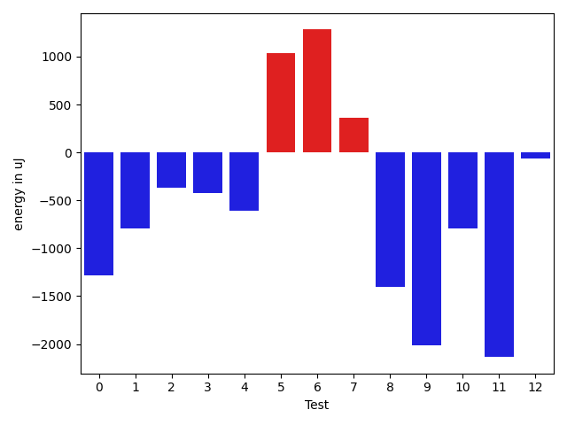

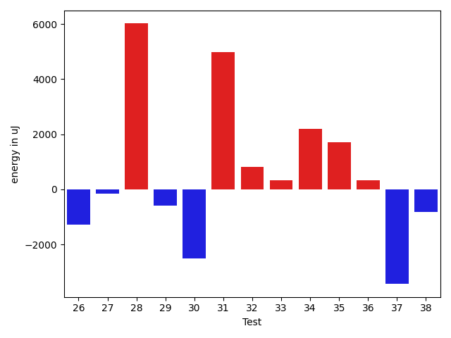

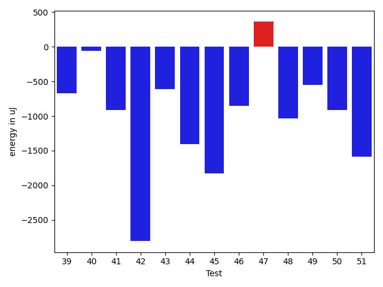

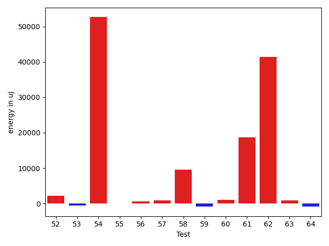

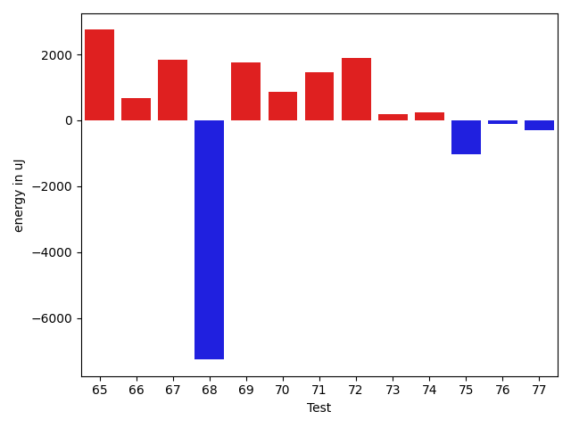

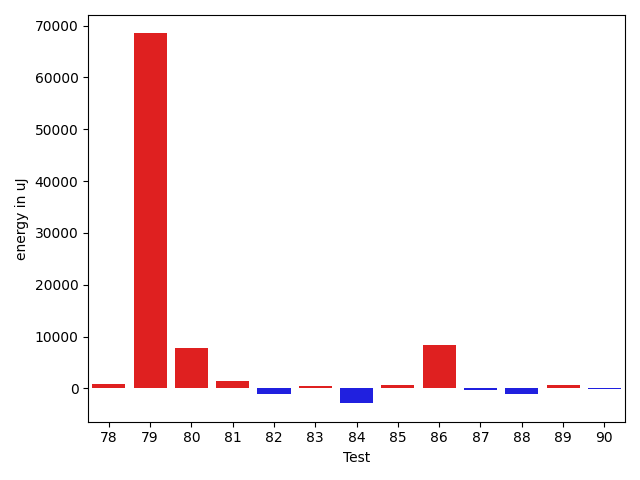

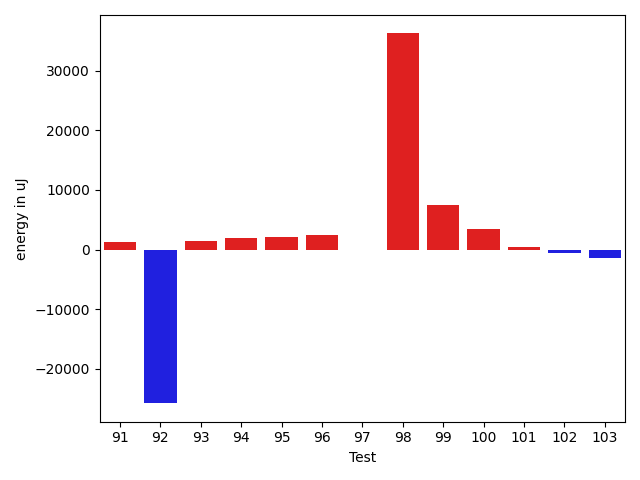

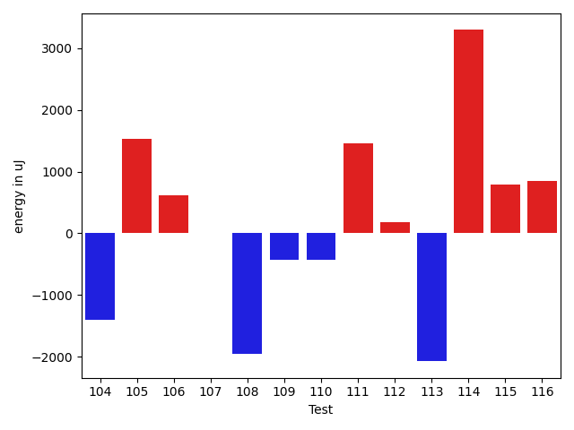

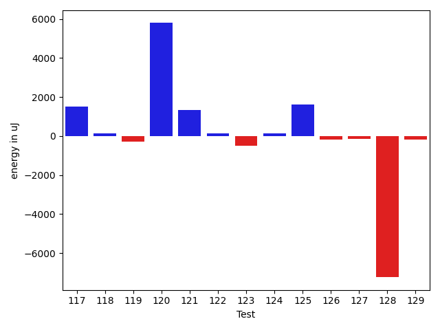

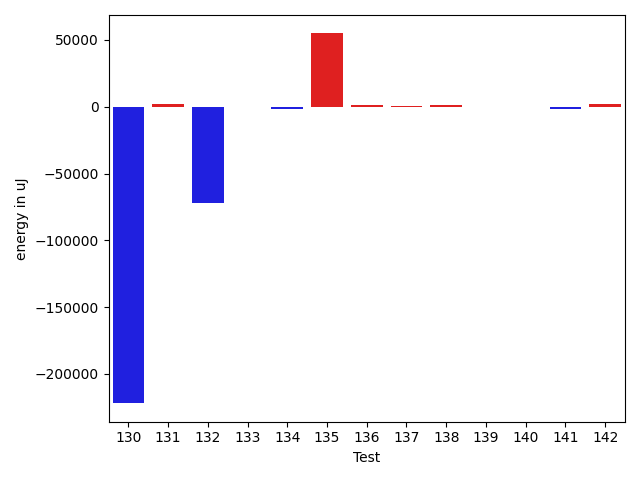

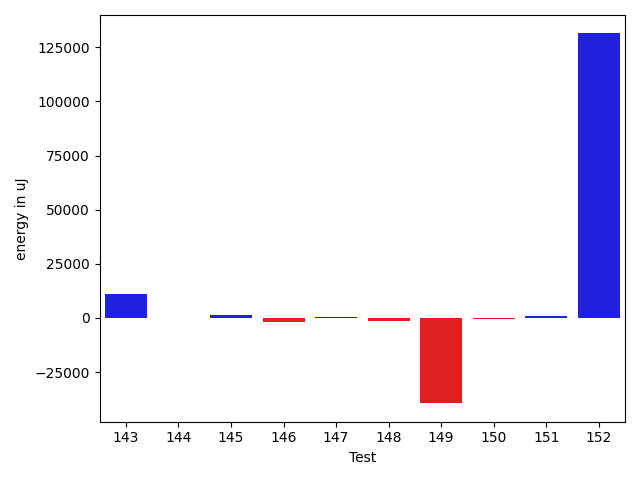

| ID | EnergyV1 | EnergyV2 | DeltaEnergy | σV1 | σV2 |
| --- | --- | --- | --- | --- | --- |
| 0 | 42897.25352112676 | 40513.378787878784 | -2383.874733247976 | 11482.887237799068 | 7744.720261718774 |
| 1 | 40701.41818181818 | 39452.96666666667 | -1248.4515151515152 | 3584.6658456715268 | 3984.388497484764 |
| 2 | 41512.13559322034 | 39276.0 | -2236.135593220337 | 8191.2698555243105 | 4541.258342500824 |
| 3 | 47479.34920634921 | 124076.2987012987 | 76596.94949494948 | 16919.135524427005 | 341469.8416067849 |
| 4 | 41301.514285714286 | 40294.854838709674 | -1006.6594470046111 | 5374.597217447639 | 4043.6714587148363 |
| 5 | 92270.71717171717 | 93801.59595959596 | 1530.8787878787844 | 22234.164675766413 | 24469.198038448918 |
| 6 | 47521.37037037037 | 50260.39240506329 | 2739.02203469292 | 18738.48949763426 | 19601.85003243621 |
| 7 | 39705.94736842105 | 40067.41379310345 | 361.4664246823959 | 3944.6935594456095 | 4201.922462456845 |
| 8 | 49768.27659574468 | 43843.53703703704 | -5924.739558707646 | 20722.92045538202 | 10114.688709647604 |
| 9 | 44355.553846153845 | 47300.35820895522 | 2944.8043628013766 | 14045.988091902605 | 26290.692688115694 |
| 10 | 39615.84482758621 | 38996.48387096774 | -619.3609566184678 | 3776.641747599926 | 4482.745284086295 |
| 11 | 39578.42424242424 | 38275.1724137931 | -1303.2518286311388 | 4749.519663306973 | 4164.784964179986 |
| 12 | 41481.985714285714 | 40540.89655172414 | -941.0891625615768 | 6303.775083217669 | 4308.724287918461 |
| 13 | 40682.61818181818 | 40275.236363636366 | -407.3818181818133 | 4397.543551868306 | 4034.7936613396696 |
| 14 | 39681.03333333333 | 40867.22857142857 | 1186.1952380952353 | 4255.467443836876 | 4266.2280301102 |
| 15 | 39140.38888888889 | 39363.94117647059 | 223.55228758169687 | 4041.517827347224 | 5084.798179470997 |
| 16 | 138307.84848484848 | 132963.19191919192 | -5344.656565656565 | 29019.30293016703 | 28848.47571404377 |
| 17 | 279785.1212121212 | 278971.89898989897 | -813.2222222222481 | 44911.52068824616 | 49070.01738836912 |
| 18 | 112574.41414141415 | 109494.93939393939 | -3079.4747474747564 | 24969.649640147516 | 23347.153190428533 |
| 19 | 116252.61616161616 | 114175.58585858585 | -2077.030303030304 | 28450.770807653655 | 22867.229589771363 |
| 20 | 80375.40229885057 | 78950.86363636363 | -1424.5386624869425 | 43176.7673914848 | 42232.08848816637 |
| 21 | 153375.39393939395 | 149378.50505050505 | -3996.888888888905 | 27462.85601354254 | 24188.98790286865 |
| 22 | 150422.88888888888 | 150249.75757575757 | -173.13131313130725 | 33770.406845085585 | 29073.863880663182 |
| 23 | 38644.93548387097 | 38855.88461538462 | 210.94913151364744 | 4121.088142676475 | 4497.493441453491 |
| 24 | 40237.42857142857 | 39255.0 | -982.4285714285725 | 3200.200668134192 | 3739.180232684699 |
| 25 | 39901.255319148935 | 39831.454545454544 | -69.80077369439095 | 5654.843758656126 | 5756.963169835548 |
| 26 | 40309.56756756757 | 39034.02222222222 | -1275.5453453453447 | 4538.960951110385 | 4450.407779013758 |
| 27 | 38820.61538461538 | 38677.555555555555 | -143.0598290598282 | 4187.309932099082 | 5931.405063278967 |
| 28 | 45230.5 | 51250.03333333333 | 6019.533333333333 | 16144.708285390925 | 22462.922798073767 |
| 29 | 39829.4 | 39229.846153846156 | -599.5538461538454 | 4365.371596248518 | 4658.075307042057 |
| 30 | 34332.25 | 31830.0 | -2502.25 | 2770.7297211204127 | 2080.4423808411516 |
| 31 | 56761.90425531915 | 61748.20652173913 | 4986.302266419982 | 24955.987540224767 | 30312.641180500646 |
| 32 | 43314.875 | 44141.640625 | 826.765625 | 15645.041797942727 | 14270.778539956207 |
| 33 | 41719.48333333333 | 42040.28070175439 | 320.7973684210592 | 8790.837350127058 | 7996.663836732027 |
| 34 | 42814.5625 | 45011.32876712329 | 2196.76626712329 | 7256.140149631466 | 10862.255070057074 |
| 35 | 38379.969696969696 | 40098.51162790698 | 1718.541930937281 | 5042.910706429484 | 4373.4575878954865 |
| 36 | 40325.0625 | 40658.25 | 333.1875 | 3882.3146575542296 | 4762.185022392558 |
| 37 | 48881.72289156626 | 45447.05633802817 | -3434.666553538096 | 17446.40553535123 | 13649.842324722425 |
| 38 | 46412.083333333336 | 45602.35 | -809.7333333333372 | 12486.764208942293 | 9428.08746923256 |
| 39 | 43991.31707317073 | 42237.857142857145 | -1753.4599303135838 | 10271.235883884247 | 8530.360452356295 |
| 40 | 41039.166666666664 | 41127.5 | 88.33333333333576 | 5023.990017351193 | 2881.95632340256 |
| 41 | 41245.74285714285 | 39551.640625 | -1694.1022321428536 | 3958.029559139296 | 4139.767884371611 |
| 42 | 49985.666666666664 | 43782.01818181818 | -6203.648484848483 | 18374.97055650378 | 12234.689478529199 |
| 43 | 45432.654320987655 | 42454.53846153846 | -2978.1158594491935 | 12802.673573173957 | 8790.688098694021 |
| 44 | 65510.294117647056 | 55494.596774193546 | -10015.69734345351 | 36851.760455617325 | 31570.356219934198 |
| 45 | 40766.46 | 39619.21951219512 | -1147.2404878048765 | 4578.351367948948 | 4293.449852361295 |
| 46 | 40601.822222222225 | 40333.205128205125 | -268.6170940170996 | 3869.823793225899 | 4947.192190860089 |
| 47 | 40256.46875 | 41527.40350877193 | 1270.9347587719312 | 6571.633608188564 | 8084.891004613416 |
| 48 | 40625.46341463415 | 39621.41935483871 | -1004.0440597954366 | 6169.797312943744 | 4818.789037910194 |
| 49 | 39812.36734693877 | 39877.41176470588 | 65.04441776710883 | 4411.566498093058 | 4368.198085792853 |
| 50 | 39907.0 | 39862.39473684211 | -44.605263157893205 | 4379.582955586623 | 4280.384079787539 |
| 51 | 60075.07070707071 | 57265.63636363636 | -2809.4343434343464 | 23973.409090053105 | 25259.4295665873 |
| 52 | 40482.148148148146 | 42701.19047619047 | 2219.0423280423274 | 4684.444515894767 | 7205.082667772321 |
| 53 | 40508.5918367347 | 39908.7027027027 | -599.889134031997 | 4148.5626225721535 | 4348.32093636939 |
| 54 | 142074.75862068965 | 194748.16666666666 | 52673.408045977005 | 375377.6363511775 | 477604.60687830165 |
| 55 | 40319.48648648649 | 40391.31428571429 | 71.82779922780173 | 3908.108823221497 | 4607.10298046973 |
| 56 | 39452.27272727273 | 40078.509803921566 | 626.2370766488384 | 4465.395148775833 | 4407.283487603215 |
| 57 | 38630.26315789474 | 39447.6875 | 817.4243421052597 | 4375.759661471189 | 4035.3545804357454 |
| 58 | 50870.73333333333 | 60491.52380952381 | 9620.79047619048 | 36248.17169544172 | 49797.440640027395 |
| 59 | 39714.0 | 38815.25 | -898.75 | 4617.448089274297 | 4393.024423731332 |
| 60 | 39162.91176470588 | 40184.857142857145 | 1021.9453781512639 | 4190.952210821665 | 4517.312235913596 |
| 61 | 167244.1573033708 | 185960.7294117647 | 18716.572108393913 | 476223.46545309474 | 533178.9739065418 |
| 62 | 98893.33333333333 | 140342.25252525252 | 41448.919191919194 | 27828.892253929334 | 246334.23023879618 |
| 63 | 39706.379310344826 | 40510.57575757576 | 804.1964472309337 | 4013.02894817397 | 4068.059063889202 |
| 64 | 39752.71428571428 | 38953.88888888889 | -798.8253968253921 | 4536.117383662745 | 4525.775876460369 |
| 65 | 59022.50666666667 | 68486.02597402598 | 9463.519307359311 | 41870.908847511564 | 54178.357980174114 |
| 66 | 46316.82142857143 | 42281.01162790698 | -4035.8098006644504 | 15090.860719055152 | 10224.355830614835 |
| 67 | 39336.395348837206 | 40534.70731707317 | 1198.311968235961 | 3527.3274232308004 | 5100.396705010606 |
| 68 | 148937.77528089887 | 119001.6049382716 | -29936.170342627272 | 237092.21018881904 | 172768.16101258673 |
| 69 | 39320.36363636364 | 39916.862068965514 | 596.4984326018748 | 4794.047488533467 | 5498.214981334854 |
| 70 | 39394.014925373136 | 40122.41176470588 | 728.396839332745 | 5808.799872176792 | 6700.350320594075 |
| 71 | 39921.64102564102 | 40057.63888888889 | 135.99786324786692 | 4350.739079490297 | 5230.070390182662 |
| 72 | 38966.64864864865 | 39995.0 | 1028.3513513513535 | 4134.180648364193 | 4493.686942070323 |
| 73 | 40447.44827586207 | 40426.705882352944 | -20.742393509128306 | 3927.034492145062 | 4759.877040733992 |
| 74 | 39455.694444444445 | 40426.08571428571 | 970.3912698412678 | 5194.578224881552 | 5527.205805940692 |
| 75 | 40712.76 | 40138.166666666664 | -574.5933333333378 | 4760.230484167757 | 4669.93659991463 |
| 76 | 39861.36363636364 | 40035.37254901961 | 174.00891265596874 | 4447.784346732801 | 4291.6573377128425 |
| 77 | 40196.583333333336 | 40354.26190476191 | 157.67857142857247 | 4519.364258234903 | 4686.633496086928 |
| 78 | 41489.981132075474 | 42394.90909090909 | 904.927958833614 | 5122.122442933078 | 9042.290601335939 |
| 79 | 99413.11267605633 | 167889.9090909091 | 68476.79641485275 | 316326.17203260976 | 493481.60032774345 |
| 80 | 107549.21212121213 | 115322.27272727272 | 7773.060606060593 | 35401.685201077875 | 33030.23652879043 |
| 81 | 40962.39344262295 | 42450.31343283582 | 1487.9199902128676 | 4841.015180347037 | 8026.418699554976 |
| 82 | 43029.5 | 41939.2 | -1090.300000000003 | 4394.7103065584915 | 4124.743082100184 |
| 83 | 39315.23809523809 | 39736.44117647059 | 421.2030812324956 | 4117.346929390509 | 5097.604118263775 |
| 84 | 289975.44444444444 | 287130.7878787879 | -2844.6565656565363 | 385064.11562961905 | 312070.43873728614 |
| 85 | 39402.97368421053 | 40087.73333333333 | 684.7596491228032 | 4840.745851007293 | 4384.0475179906525 |
| 86 | 49907.37037037037 | 58259.6037735849 | 8352.23340321453 | 28688.519883135275 | 41544.236457122046 |
| 87 | 40982.61538461538 | 40727.933333333334 | -254.68205128204863 | 5899.720374144578 | 6626.686523779772 |
| 88 | 41178.35294117647 | 40098.69565217391 | -1079.6572890025564 | 4741.7655428825055 | 4598.384725236183 |
| 89 | 42302.260273972606 | 43029.72619047619 | 727.4659165035846 | 8795.077919904345 | 11209.396704754105 |
| 90 | 41627.96610169492 | 41612.78571428572 | -15.180387409200193 | 6137.397770120609 | 8898.309588893608 |
| 91 | 39796.23809523809 | 41011.617021276594 | 1215.378926038502 | 4204.629862026382 | 4180.32076318487 |
| 92 | 129436.02173913043 | 103674.04444444444 | -25761.97729468599 | 431859.34170380916 | 341707.785368724 |
| 93 | 39127.22448979592 | 40643.6976744186 | 1516.473184622686 | 4196.329427474689 | 6889.585694955404 |
| 94 | 38446.916666666664 | 40354.333333333336 | 1907.4166666666715 | 5243.325788694508 | 5526.557804516901 |
| 95 | 39571.057971014496 | 41614.901639344265 | 2043.8436683297696 | 3752.0644206795296 | 7383.949888612347 |
| 96 | 241807.0303030303 | 244318.21212121213 | 2511.1818181818235 | 457782.1813853929 | 458547.04380938795 |
| 97 | 42239.72463768116 | 42196.64788732395 | -43.076750357213314 | 9968.290551462596 | 8541.742071053834 |
| 98 | 149187.40404040404 | 185411.38383838383 | 36223.97979797979 | 349679.72447190277 | 411454.4185143526 |
| 99 | 60036.26262626263 | 67585.84536082474 | 7549.582734562107 | 26961.415782216114 | 30896.607595563484 |
| 100 | 78880.46428571429 | 82381.11494252873 | 3500.6506568144396 | 49407.290271647355 | 69921.74174877362 |
| 101 | 46777.51898734177 | 47234.37037037037 | 456.85138302860287 | 14763.802036696154 | 15025.98284161981 |
| 102 | 43637.0987654321 | 43039.08974358974 | -598.0090218423575 | 11573.159212725144 | 9624.025205630582 |
| 103 | 201472.22222222222 | 200049.9292929293 | -1422.2929292929184 | 487838.8968636289 | 519850.3930101167 |
| 104 | 49811.02631578947 | 46831.148148148146 | -2979.8781676413273 | 17412.8241149218 | 15549.994193251356 |
| 105 | 52946.833333333336 | 56083.42857142857 | 3136.5952380952367 | 22772.876919826256 | 25284.323457848117 |
| 106 | 40921.94805194805 | 42230.9756097561 | 1309.0275578080473 | 7517.230475599071 | 10816.22587120693 |
| 107 | 48246.51648351648 | 47815.663043478264 | -430.85344003821956 | 15283.27377791183 | 15865.746852258122 |
| 108 | 63474.23529411765 | 54701.04494382023 | -8773.190350297424 | 45835.282288710885 | 39607.73959349164 |
| 109 | 42517.818181818184 | 41545.54347826087 | -972.274703557312 | 10706.277992104207 | 9634.026637295003 |
| 110 | 375735.7543859649 | 211567.89705882352 | -164167.85732714136 | 809593.7083819413 | 586768.6348595796 |
| 111 | 187992.66666666666 | 171744.2985074627 | -16248.368159203965 | 534187.0296724008 | 495026.7314923814 |
| 112 | 40375.681818181816 | 40535.982142857145 | 160.30032467532874 | 6694.127349738568 | 3957.401453926334 |
| 113 | 57812.07608695652 | 51238.892857142855 | -6573.183229813665 | 27997.067669914577 | 22653.63188689822 |
| 114 | 70304.32323232324 | 73827.09090909091 | 3522.767676767675 | 26714.85064994855 | 26786.204561865787 |
| 115 | 43086.30357142857 | 43150.59649122807 | 64.2929197994963 | 7177.048012637336 | 6307.272707963345 |
| 116 | 162094.76666666666 | 306485.1785714286 | 144390.41190476192 | 448637.6931015853 | 652079.7560256749 |
| 117 | 39136.166666666664 | 40646.739130434784 | 1510.5724637681196 | 4058.987647458689 | 5847.004823857078 |
| 118 | 40926.375 | 41081.666666666664 | 155.29166666666424 | 4387.129032868952 | 4523.922750838652 |
| 119 | 51211.63157894737 | 50911.857142857145 | -299.77443609022157 | 24239.588981035326 | 17688.97054768125 |
| 120 | 69511.09090909091 | 75304.08510638298 | 5792.994197292064 | 44853.05037210563 | 52161.22132545374 |
| 121 | 40328.48936170213 | 41675.92307692308 | 1347.4337152209482 | 4004.079711368545 | 4163.077894801562 |
| 122 | 40123.57692307692 | 40267.75 | 144.17307692307804 | 3967.892224547096 | 3766.8360535290976 |
| 123 | 40859.0625 | 40350.35 | -508.71250000000146 | 3977.1498976771986 | 3640.4746706301908 |
| 124 | 40676.12 | 40817.857142857145 | 141.73714285714232 | 3462.547655354363 | 4321.265845027514 |
| 125 | 41143.94736842105 | 42779.05263157895 | 1635.1052631578932 | 3688.8226687441133 | 4369.097154401392 |
| 126 | 42287.73684210526 | 42105.818181818184 | -181.9186602870759 | 3650.353001561778 | 4872.1002810656855 |
| 127 | 39851.08 | 39724.10526315789 | -126.97473684210854 | 4003.7598621295956 | 4578.432297709462 |
| 128 | 48290.96 | 41057.95652173913 | -7233.003478260871 | 16831.66319168727 | 5952.440204606342 |
| 129 | 42409.166666666664 | 42215.958333333336 | -193.20833333332848 | 3097.1729376248195 | 6973.836542625864 |
| 130 | 559530.3703703703 | 337631.46153846156 | -221898.90883190878 | 880674.6457443715 | 699673.7960739678 |
| 131 | 47795.57534246575 | 50010.426666666666 | 2214.851324200914 | 17490.06368004401 | 19224.364308639415 |
| 132 | 151686.67741935485 | 79381.8125 | -72304.86491935485 | 462846.7731564949 | 299583.63858861866 |
| 133 | 41278.220338983054 | 41033.53703703704 | -244.6833019460173 | 8328.554384639116 | 7747.650288272503 |
| 134 | 41756.829268292684 | 40020.73333333333 | -1736.095934959354 | 6395.4702296747155 | 3139.3831658818303 |
| 135 | 40322.282051282054 | 95137.89743589744 | 54815.61538461538 | 4537.735428369857 | 335584.2252309946 |
| 136 | 62733.822222222225 | 63787.752808988764 | 1053.930586766539 | 42388.04532217852 | 42131.31914028677 |
| 137 | 41428.07407407407 | 41688.318181818184 | 260.2441077441108 | 7842.034604313715 | 7687.599376365007 |
| 138 | 39469.333333333336 | 40789.444444444445 | 1320.1111111111095 | 4297.437655631597 | 4248.956667869431 |
| 139 | 39237.969696969696 | 39133.16129032258 | -104.80840664711286 | 3826.1122168660213 | 4146.941446546142 |
| 140 | 40469.9375 | 40072.6 | -397.33750000000146 | 4148.070175828002 | 3007.241200835078 |
| 141 | 40875.2 | 38921.782608695656 | -1953.4173913043414 | 4939.71179928546 | 3922.148667520435 |
| 142 | 38768.40909090909 | 40785.96 | 2017.5509090909109 | 4797.055277213785 | 3819.618163953041 |
| 143 | 140259.12121212122 | 151144.2323232323 | 10885.111111111095 | 76204.73142052401 | 240113.4310732203 |
| 144 | 40632.67272727273 | 40625.71929824561 | -6.9534290271185455 | 4190.698410243792 | 4616.83462138363 |
| 145 | 41163.66176470588 | 42523.12 | 1359.4582352941216 | 4278.982154982153 | 7919.438155930004 |
| 146 | 40202.882352941175 | 38537.35 | -1665.5323529411762 | 4689.725179652745 | 4869.612697894977 |
| 147 | 39343.833333333336 | 39957.61111111111 | 613.7777777777737 | 4351.495180458731 | 4468.898331044228 |
| 148 | 75301.4 | 73907.5 | -1393.8999999999942 | 46268.73219245522 | 48833.701647884685 |
| 149 | 176046.79245283018 | 136630.7435897436 | -39416.04886308659 | 453547.85956260975 | 372998.5285738983 |
| 150 | 41201.97222222222 | 40805.41176470588 | -396.5604575163379 | 5375.449446253624 | 4590.0393380196065 |
| 151 | 39509.23529411765 | 40342.35294117647 | 833.117647058818 | 4477.8915144546445 | 3740.7955734698135 |
| 152 | 75664.3125 | 207053.8260869565 | 131389.5135869565 | 252472.94480200467 | 575047.749715381 |

## Delta Duration per test method

| ID | DurationV1 | DurationsV2 | DeltaDuration |
| --- | --- | --- | --- |
| 0 | 1085901.9154929577 | 1058532.6515151516 | -27369.263977806084 |
| 1 | 877021.1272727273 | 850572.4 | -26448.727272727294 |
| 2 | 961024.4576271187 | 936966.574074074 | -24057.883553044638 |
| 3 | 1232053.238095238 | 3765513.2207792206 | 2533459.9826839827 |
| 4 | 940667.2142857143 | 910997.5645161291 | -29669.64976958523 |
| 5 | 2580687.8080808083 | 2581945.9494949495 | 1258.1414141412824 |
| 6 | 1275364.4691358025 | 1358403.7215189873 | 83039.25238318485 |
| 7 | 869669.8245614035 | 829351.3448275862 | -40318.47973381728 |
| 8 | 1114731.5957446808 | 956902.6111111111 | -157828.98463356972 |
| 9 | 1134939.8923076922 | 1276613.4328358208 | 141673.54052812862 |
| 10 | 867845.1034482758 | 871404.0322580645 | 3558.92880978866 |
| 11 | 580222.0 | 550651.9655172414 | -29570.03448275861 |
| 12 | 890926.7571428572 | 887000.2586206896 | -3926.4985221675597 |
| 13 | 848089.1090909091 | 825288.1272727273 | -22800.981818181812 |
| 14 | 684933.5666666667 | 653906.2 | -31027.366666666698 |
| 15 | 665207.1388888889 | 698502.1764705882 | 33295.03758169932 |
| 16 | 3871484.292929293 | 3739844.5454545454 | -131639.7474747477 |
| 17 | 7430984.141414141 | 7646012.01010101 | 215027.8686868688 |
| 18 | 3104548.585858586 | 3050000.0404040404 | -54548.54545454541 |
| 19 | 3313004.5656565656 | 3191224.222222222 | -121780.34343434358 |
| 20 | 2195863.988505747 | 2206010.4204545454 | 10146.431948798243 |
| 21 | 4123923.1414141413 | 4061534.9696969697 | -62388.17171717156 |
| 22 | 4218304.3838383835 | 4119379.9393939395 | -98924.44444444403 |
| 23 | 578216.6129032258 | 589400.0 | 11183.387096774182 |
| 24 | 550670.6428571428 | 530165.09375 | -20505.54910714284 |
| 25 | 859281.8297872341 | 874397.509090909 | 15115.679303674959 |
| 26 | 677113.2432432432 | 681812.6222222223 | 4699.378978979075 |
| 27 | 630260.3846153846 | 667410.9444444445 | 37150.55982905987 |
| 28 | 1215736.5740740742 | 1415725.3 | 199988.7259259259 |
| 29 | 672747.8666666667 | 614305.6923076923 | -58442.174358974444 |
| 30 | 808209.75 | 789167.75 | -19042.0 |
| 31 | 1611956.7659574468 | 1720395.2282608696 | 108438.46230342286 |
| 32 | 1147060.375 | 1185455.265625 | 38394.890625 |
| 33 | 981568.1833333333 | 1011397.9649122807 | 29829.781578947324 |
| 34 | 1050683.85 | 1140682.4520547944 | 89998.60205479432 |
| 35 | 719898.7575757576 | 716468.0930232558 | -3430.664552501752 |
| 36 | 804469.125 | 797222.3333333334 | -7246.791666666628 |
| 37 | 1290395.5180722892 | 1165590.676056338 | -124804.84201595117 |
| 38 | 810309.4166666666 | 723492.9 | -86816.5166666666 |
| 39 | 1207712.7073170731 | 1124422.9350649351 | -83289.772252138 |
| 40 | 504519.5 | 463699.5833333333 | -40819.916666666686 |
| 41 | 941491.3142857143 | 859935.921875 | -81555.3924107143 |
| 42 | 1233026.1904761905 | 998288.490909091 | -234737.69956709957 |
| 43 | 1299646.987654321 | 1208586.358974359 | -91060.6286799619 |
| 44 | 1662817.044117647 | 1361869.2096774194 | -300947.8344402276 |
| 45 | 897937.34 | 815855.3414634146 | -82081.99853658536 |
| 46 | 724994.0444444445 | 751863.7692307692 | 26869.724786324776 |
| 47 | 985098.84375 | 976522.4561403509 | -8576.3876096491 |
| 48 | 679288.6585365854 | 749436.5806451613 | 70147.92210857593 |
| 49 | 853677.8571428572 | 867909.725490196 | 14231.868347338866 |
| 50 | 655109.7567567568 | 624217.8421052631 | -30891.91465149366 |
| 51 | 1679644.2828282828 | 1722822.5757575757 | 43178.29292929289 |
| 52 | 571286.0 | 767955.8095238095 | 196669.80952380947 |
| 53 | 762354.4693877551 | 762020.1351351351 | -334.33425261999946 |
| 54 | 3811898.7586206896 | 5232982.547619048 | 1421083.788998358 |
| 55 | 745885.0540540541 | 731013.2 | -14871.854054054129 |
| 56 | 769388.6363636364 | 788080.7058823529 | 18692.06951871654 |
| 57 | 724358.2105263158 | 741464.1875 | 17105.976973684155 |
| 58 | 1180807.6888888888 | 1510921.2142857143 | 330113.5253968255 |
| 59 | 602553.6785714285 | 616724.45 | 14170.771428571432 |
| 60 | 562714.4411764706 | 525845.75 | -36868.6911764706 |
| 61 | 4902742.97752809 | 5525887.976470588 | 623144.9989424981 |
| 62 | 2782000.0404040404 | 4094904.727272727 | 1312904.6868686867 |
| 63 | 635510.551724138 | 685630.3636363636 | 50119.811912225676 |
| 64 | 589487.9285714285 | 653754.4814814815 | 64266.55291005294 |
| 65 | 1519732.24 | 1731194.2337662338 | 211461.9937662338 |
| 66 | 1243773.0 | 1285653.2906976745 | 41880.2906976745 |
| 67 | 729620.6279069767 | 747097.5609756098 | 17476.93306863308 |
| 68 | 4210442.370786517 | 3329192.12345679 | -881250.2473297268 |
| 69 | 612907.2272727273 | 609242.551724138 | -3664.6755485893227 |
| 70 | 978441.0298507463 | 971792.2058823529 | -6648.823968393379 |
| 71 | 685521.8717948718 | 726247.3333333334 | 40725.46153846162 |
| 72 | 593541.7027027027 | 618726.75 | 25185.04729729728 |
| 73 | 658964.448275862 | 665716.9705882353 | 6752.522312373272 |
| 74 | 654912.0555555555 | 649023.6857142857 | -5888.3698412697995 |
| 75 | 774662.5 | 866333.0 | 91670.5 |
| 76 | 779595.0 | 877520.8039215687 | 97925.80392156867 |
| 77 | 636167.8333333334 | 730657.0238095238 | 94489.19047619042 |
| 78 | 870728.716981132 | 1012353.2181818181 | 141624.5012006861 |
| 79 | 2664898.8309859154 | 4497159.51948052 | 1832260.6884946045 |
| 80 | 2977658.4242424243 | 2983256.393939394 | 5597.969696969725 |
| 81 | 1015953.0163934426 | 1009478.4776119404 | -6474.538781502284 |
| 82 | 542820.5714285715 | 449525.8 | -93294.77142857149 |
| 83 | 863079.4285714285 | 1005974.1911764706 | 142894.76260504208 |
| 84 | 8020541.090909091 | 7675693.818181818 | -344847.2727272725 |
| 85 | 646604.8421052631 | 692947.1333333333 | 46342.29122807016 |
| 86 | 1024412.2222222222 | 1465775.924528302 | 441363.7023060797 |
| 87 | 683150.0 | 826798.8444444444 | 143648.8444444444 |
| 88 | 791993.4901960784 | 902772.195652174 | 110778.70545609551 |
| 89 | 1115827.410958904 | 1262495.7261904762 | 146668.31523157214 |
| 90 | 943269.2542372881 | 1038736.9714285714 | 95467.71719128324 |
| 91 | 699585.5238095238 | 709249.1276595745 | 9663.603850050713 |
| 92 | 3724265.6413043477 | 2982121.5444444446 | -742144.0968599031 |
| 93 | 808784.0 | 864843.976744186 | 56059.97674418602 |
| 94 | 678145.9583333334 | 647407.9722222222 | -30737.986111111124 |
| 95 | 872102.304347826 | 881819.0491803279 | 9716.744832501863 |
| 96 | 6729387.303030303 | 6974989.333333333 | 245602.03030303027 |
| 97 | 1034450.1739130435 | 1115432.2676056337 | 80982.09369259025 |
| 98 | 4133879.595959596 | 5081533.333333333 | 947653.7373737372 |
| 99 | 1715558.1515151516 | 1923630.06185567 | 208071.91034051846 |
| 100 | 2178107.0595238097 | 2171086.896551724 | -7020.162972085644 |
| 101 | 1241052.430379747 | 1222000.4197530865 | -19052.010626660427 |
| 102 | 1175068.5679012346 | 1179402.5897435897 | 4334.021842355141 |
| 103 | 5824693.676767677 | 5410214.676767677 | -414479.0 |
| 104 | 1368817.9210526317 | 1317069.7160493827 | -51748.20500324899 |
| 105 | 1343314.0166666666 | 1421824.7301587302 | 78510.71349206357 |
| 106 | 1097113.7142857143 | 1068444.487804878 | -28669.22648083628 |
| 107 | 1453002.2417582418 | 1358472.25 | -94529.99175824178 |
| 108 | 1869578.2470588235 | 1577944.9325842697 | -291633.3144745538 |
| 109 | 1236803.3522727273 | 1157297.5760869565 | -79505.77618577075 |
| 110 | 10828210.52631579 | 5910471.323529412 | -4917739.202786378 |
| 111 | 5459048.1866666665 | 4620367.582089553 | -838680.6045771139 |
| 112 | 949502.0151515151 | 932487.8928571428 | -17014.122294372297 |
| 113 | 1642187.4130434783 | 1454173.6904761905 | -188013.72256728774 |
| 114 | 2014919.5454545454 | 2199531.01010101 | 184611.46464646468 |
| 115 | 1025760.8928571428 | 971336.8947368421 | -54423.998120300705 |
| 116 | 4051764.433333333 | 8761570.214285715 | 4709805.780952381 |
| 117 | 439360.7916666667 | 457170.04347826086 | 17809.25181159418 |
| 118 | 468791.1666666667 | 515538.5833333333 | 46747.41666666663 |
| 119 | 1100250.0789473683 | 1182361.0 | 82110.92105263169 |
| 120 | 1726634.6727272726 | 1848964.914893617 | 122330.24216634431 |
| 121 | 630547.2340425532 | 584787.4102564103 | -45759.82378614298 |
| 122 | 482141.23076923075 | 473133.2916666667 | -9007.939102564065 |
| 123 | 525601.75 | 470586.15 | -55015.59999999998 |
| 124 | 554282.16 | 509981.09523809527 | -44301.06476190477 |
| 125 | 512021.05263157893 | 495114.5263157895 | -16906.526315789437 |
| 126 | 515216.0 | 530074.9545454546 | 14858.954545454588 |
| 127 | 518612.68 | 456368.1052631579 | -62244.57473684207 |
| 128 | 1010133.12 | 740843.7826086957 | -269289.3373913043 |
| 129 | 513778.3 | 619081.9583333334 | 105303.65833333338 |
| 130 | 16194598.25925926 | 9649386.923076924 | -6545211.336182335 |
| 131 | 1248042.7260273972 | 1284094.8 | 36052.07397260284 |
| 132 | 4306222.20967742 | 2163595.234375 | -2142626.9753024196 |
| 133 | 967560.220338983 | 867394.2962962963 | -100165.9240426867 |
| 134 | 721346.6097560975 | 676523.9333333333 | -44822.6764227642 |
| 135 | 793865.4358974359 | 2354555.4615384615 | 1560690.0256410255 |
| 136 | 1864881.7777777778 | 1887386.3595505618 | 22504.581772784004 |
| 137 | 966185.5370370371 | 860866.4318181818 | -105319.10521885531 |
| 138 | 572532.9696969697 | 549088.0 | -23444.969696969725 |
| 139 | 667417.2121212122 | 633070.8709677419 | -34346.34115347022 |
| 140 | 470279.8125 | 471319.65 | 1039.8375000000233 |
| 141 | 485439.3 | 477798.47826086957 | -7640.821739130421 |
| 142 | 548717.1363636364 | 481085.64 | -67631.49636363634 |
| 143 | 3696432.7474747472 | 4043700.7474747472 | 347268.0 |
| 144 | 813662.2909090909 | 795916.5087719298 | -17745.78213716112 |
| 145 | 939556.25 | 974085.3 | 34529.05000000005 |
| 146 | 811104.2549019608 | 812496.15 | 1391.895098039182 |
| 147 | 756259.6111111111 | 777289.6388888889 | 21030.027777777752 |
| 148 | 1915944.5142857144 | 1754273.923076923 | -161670.59120879136 |
| 149 | 5078896.396226415 | 4098180.7435897435 | -980715.6526366719 |
| 150 | 856748.3611111111 | 838423.1764705882 | -18325.18464052293 |
| 151 | 708434.6470588235 | 686945.8235294118 | -21488.82352941169 |
| 152 | 2184478.515625 | 5768603.724637682 | 3584125.2090126816 |

## Misc.

| ID | Test Class | Test Method |
| --- | --- | --- |
| 0 | com.google.gson.functional.CustomTypeAdaptersTest | testCustomAdapterInvokedForCollectionElementDeserialization |
| 1 | com.google.gson.functional.CustomTypeAdaptersTest | testCustomTypeAdapterAppliesToSubClassesSerializedAsBaseClass |
| 2 | com.google.gson.functional.CustomTypeAdaptersTest | testCustomAdapterInvokedForMapElementSerializationWithType |
| 3 | com.google.gson.functional.CustomTypeAdaptersTest | testCustomSerializers |
| 4 | com.google.gson.functional.CustomTypeAdaptersTest | testCustomNestedDeserializers |
| 5 | com.google.gson.functional.CustomTypeAdaptersTest | testCustomTypeAdapterDoesNotAppliesToSubClasses |
| 6 | com.google.gson.functional.CustomTypeAdaptersTest | testCustomAdapterInvokedForCollectionElementSerializationWithType |
| 7 | com.google.gson.functional.CustomTypeAdaptersTest | testCustomByteArrayDeserializerAndInstanceCreator |
| 8 | com.google.gson.functional.CustomTypeAdaptersTest | testEnsureCustomSerializerNotInvokedForNullValues |
| 9 | com.google.gson.functional.CustomTypeAdaptersTest | testCustomNestedSerializers |
| 10 | com.google.gson.functional.CustomTypeAdaptersTest | testCustomAdapterInvokedForMapElementDeserialization |
| 11 | com.google.gson.functional.CustomTypeAdaptersTest | testCustomAdapterInvokedForMapElementSerialization |
| 12 | com.google.gson.functional.CustomTypeAdaptersTest | testCustomDeserializers |
| 13 | com.google.gson.functional.CustomTypeAdaptersTest | testCustomByteArraySerializer |
| 14 | com.google.gson.functional.CustomTypeAdaptersTest | testEnsureCustomDeserializerNotInvokedForNullValues |
| 15 | com.google.gson.functional.CustomTypeAdaptersTest | testCustomAdapterInvokedForCollectionElementSerialization |
| 16 | com.google.gson.functional.DefaultTypeAdaptersTest | testDateSerializationWithPatternNotOverridenByTypeAdapter |
| 17 | com.google.gson.functional.DefaultTypeAdaptersTest | testDateSerializationWithPattern |
| 18 | com.google.gson.functional.DefaultTypeAdaptersTest | testSqlDateSerialization |
| 19 | com.google.gson.functional.DefaultTypeAdaptersTest | testTimestampSerialization |
| 20 | com.google.gson.functional.DefaultTypeAdaptersTest | testDefaultDateDeserializationUsingBuilder |
| 21 | com.google.gson.functional.DefaultTypeAdaptersTest | testDateDeserializationWithPattern |
| 22 | com.google.gson.functional.DefaultTypeAdaptersTest | testDateSerializationInCollection |
| 23 | com.google.gson.functional.DefaultTypeAdaptersTest | testDefaultGregorianCalendarSerialization |
| 24 | com.google.gson.functional.DefaultTypeAdaptersTest | testDefaultGregorianCalendarDeserialization |
| 25 | com.google.gson.functional.DefaultTypeAdaptersTest | testBitSetDeserialization |
| 26 | com.google.gson.functional.DefaultTypeAdaptersTest | testDefaultCalendarSerialization |
| 27 | com.google.gson.functional.DefaultTypeAdaptersTest | testBitSetSerialization |
| 28 | com.google.gson.functional.DefaultTypeAdaptersTest | testSetSerialization |
| 29 | com.google.gson.functional.DefaultTypeAdaptersTest | testDefaultCalendarDeserialization |
| 30 | com.google.gson.functional.DefaultTypeAdaptersTest | testDefaultDateSerializationUsingBuilder |
| 31 | com.google.gson.functional.MapTest | testSerializeMaps |
| 32 | com.google.gson.functional.MapTest | testMapSubclassDeserialization |
| 33 | com.google.gson.functional.MapTest | testCustomSerializerForSpecificMapType |
| 34 | com.google.gson.functional.MapTest | testGeneralMapField |
| 35 | com.google.gson.functional.MapTest | testMapSerializationWithNullValuesSerialized |
| 36 | com.google.gson.functional.MapTest | testMapSerializationWithNullValueButSerializeNulls |
| 37 | com.google.gson.functional.ReadersWritersTest | testReadWriteTwoObjects |
| 38 | com.google.gson.functional.ReadersWritersTest | testTopLevelNullObjectSerializationWithWriterAndSerializeNulls |
| 39 | com.google.gson.functional.ReadersWritersTest | testReadWriteTwoStrings |
| 40 | com.google.gson.functional.ReadersWritersTest | testTopLevelNullObjectDeserializationWithReaderAndSerializeNulls |
| 41 | com.google.gson.functional.CustomDeserializerTest | testCustomDeserializerReturnsNullForArrayElementsForArrayField |
| 42 | com.google.gson.functional.CustomDeserializerTest | testCustomDeserializerReturnsNull |
| 43 | com.google.gson.functional.CustomDeserializerTest | testJsonTypeFieldBasedDeserialization |
| 44 | com.google.gson.functional.CustomDeserializerTest | testCustomDeserializerReturnsNullForTopLevelObject |
| 45 | com.google.gson.functional.CustomDeserializerTest | testCustomDeserializerReturnsNullForArrayElements |
| 46 | com.google.gson.functional.NullObjectAndFieldTest | testExplicitDeserializationOfNulls |
| 47 | com.google.gson.functional.NullObjectAndFieldTest | testPrintPrintingObjectWithNulls |
| 48 | com.google.gson.functional.NullObjectAndFieldTest | testPrintPrintingArraysWithNulls |
| 49 | com.google.gson.functional.NullObjectAndFieldTest | testNullWrappedPrimitiveMemberSerialization |
| 50 | com.google.gson.functional.NullObjectAndFieldTest | testExplicitNullSetsFieldToNullDuringDeserialization |
| 51 | com.google.gson.functional.NullObjectAndFieldTest | testExplicitSerializationOfNullArrayMembers |
| 52 | com.google.gson.functional.NullObjectAndFieldTest | testTopLevelNullObjectDeserialization |
| 53 | com.google.gson.functional.NullObjectAndFieldTest | testExplicitSerializationOfNullCollectionMembers |
| 54 | com.google.gson.functional.NullObjectAndFieldTest | testTopLevelNullObjectSerialization |
| 55 | com.google.gson.functional.NullObjectAndFieldTest | testExplicitSerializationOfNullStringMembers |
| 56 | com.google.gson.functional.NullObjectAndFieldTest | testCustomTypeAdapterPassesNullDesrialization |
| 57 | com.google.gson.functional.NullObjectAndFieldTest | testCustomSerializationOfNulls |
| 58 | com.google.gson.functional.NullObjectAndFieldTest | testExplicitSerializationOfNulls |
| 59 | com.google.gson.functional.NullObjectAndFieldTest | testNullWrappedPrimitiveMemberDeserialization |
| 60 | com.google.gson.functional.NullObjectAndFieldTest | testCustomTypeAdapterPassesNullSerialization |
| 61 | com.google.gson.JsonParserTest | testReadWriteTwoObjects |
| 62 | com.google.gson.functional.NamingPolicyTest | testGsonWithNonDefaultFieldNamingPolicySerialization |
| 63 | com.google.gson.functional.NamingPolicyTest | testGsonWithLowerCaseDashPolicyDeserialiation |
| 64 | com.google.gson.functional.NamingPolicyTest | testGsonWithSerializedNameFieldNamingPolicyDeserialization |
| 65 | com.google.gson.functional.NamingPolicyTest | testGsonWithSerializedNameFieldNamingPolicySerialization |
| 66 | com.google.gson.functional.NamingPolicyTest | testDeprecatedNamingStrategy |
| 67 | com.google.gson.functional.NamingPolicyTest | testGsonWithLowerCaseDashPolicySerialization |
| 68 | com.google.gson.functional.NamingPolicyTest | testGsonDuplicateNameUsingSerializedNameFieldNamingPolicySerialization |
| 69 | com.google.gson.functional.NamingPolicyTest | testGsonWithUpperCamelCaseSpacesPolicyDeserialiation |
| 70 | com.google.gson.functional.NamingPolicyTest | testComplexFieldNameStrategy |
| 71 | com.google.gson.functional.NamingPolicyTest | testGsonWithNonDefaultFieldNamingPolicyDeserialiation |
| 72 | com.google.gson.functional.NamingPolicyTest | testGsonWithUpperCamelCaseSpacesPolicySerialiation |
| 73 | com.google.gson.functional.NamingPolicyTest | testGsonWithLowerCaseUnderscorePolicySerialization |
| 74 | com.google.gson.functional.NamingPolicyTest | testGsonWithLowerCaseUnderscorePolicyDeserialiation |
| 75 | com.google.gson.functional.CustomSerializerTest | testSerializerReturnsNull |
| 76 | com.google.gson.functional.CustomSerializerTest | testBaseClassSerializerInvokedForBaseClassFieldsHoldingSubClassInstances |
| 77 | com.google.gson.functional.CustomSerializerTest | testBaseClassSerializerInvokedForBaseClassFields |
| 78 | com.google.gson.functional.CustomSerializerTest | testSubClassSerializerInvokedForBaseClassFieldsHoldingArrayOfSubClassInstances |
| 79 | com.google.gson.functional.CustomSerializerTest | testSubClassSerializerInvokedForBaseClassFieldsHoldingSubClassInstances |
| 80 | com.google.gson.functional.ObjectTest | testSingletonLists |
| 81 | com.google.gson.functional.ObjectTest | testInnerClassDeserialization |
| 82 | com.google.gson.functional.ObjectTest | testJsonObjectSerialization |
| 83 | com.google.gson.functional.VersioningTest | testVersionedGsonMixingSinceAndUntilDeserialization |
| 84 | com.google.gson.functional.VersioningTest | testVersionedUntilSerialization |
| 85 | com.google.gson.functional.VersioningTest | testIgnoreLaterVersionClassSerialization |
| 86 | com.google.gson.functional.VersioningTest | testVersionedGsonWithUnversionedClassesSerialization |
| 87 | com.google.gson.functional.VersioningTest | testVersionedGsonWithUnversionedClassesDeserialization |
| 88 | com.google.gson.functional.VersioningTest | testVersionedClassesDeserialization |
| 89 | com.google.gson.functional.VersioningTest | testVersionedGsonMixingSinceAndUntilSerialization |
| 90 | com.google.gson.functional.VersioningTest | testVersionedClassesSerialization |
| 91 | com.google.gson.functional.VersioningTest | testVersionedUntilDeserialization |
| 92 | com.google.gson.functional.FieldExclusionTest | testDefaultInnerClassExclusion |
| 93 | com.google.gson.functional.FieldExclusionTest | testDefaultNestedStaticClassIncluded |
| 94 | com.google.gson.functional.FieldExclusionTest | testInnerClassExclusion |
| 95 | com.google.gson.functional.TypeHierarchyAdapterTest | testRegisterSuperTypeFirst |
| 96 | com.google.gson.functional.TypeHierarchyAdapterTest | testTypeHierarchy |
| 97 | com.google.gson.functional.TypeVariableTest | testBasicTypeVariables |
| 98 | com.google.gson.functional.TypeVariableTest | testAdvancedTypeVariables |
| 99 | com.google.gson.functional.TypeVariableTest | testTypeVariablesViaTypeParameter |
| 100 | com.google.gson.functional.EnumTest | testEnumSubclassWithRegisteredTypeAdapter |
| 101 | com.google.gson.functional.MapAsArrayTypeAdapterTest | testMultipleEnableComplexKeyRegistrationHasNoEffect |
| 102 | com.google.gson.functional.MapAsArrayTypeAdapterTest | testMapWithTypeVariableDeserialization |
| 103 | com.google.gson.functional.MapAsArrayTypeAdapterTest | testSerializeComplexMapWithTypeAdapter |
| 104 | com.google.gson.functional.MapAsArrayTypeAdapterTest | testMapWithTypeVariableSerialization |
| 105 | com.google.gson.functional.MapAsArrayTypeAdapterTest | testTwoTypesCollapseToOneDeserialize |
| 106 | com.google.gson.functional.ParameterizedTypesTest | testParameterizedTypeWithReaderDeserialization |
| 107 | com.google.gson.functional.ParameterizedTypesTest | testParameterizedTypeWithCustomSerializer |
| 108 | com.google.gson.functional.ParameterizedTypesTest | testParameterizedTypeDeserialization |
| 109 | com.google.gson.functional.ParameterizedTypesTest | testParameterizedTypesWithCustomDeserializer |
| 110 | com.google.gson.FunctionWithInternalDependenciesTest | testAnonymousLocalClassesSerialization |
| 111 | com.google.gson.functional.InstanceCreatorTest | testInstanceCreatorReturnsBaseType |
| 112 | com.google.gson.functional.InstanceCreatorTest | testInstanceCreatorReturnsSubTypeForTopLevelObject |
| 113 | com.google.gson.functional.EscapingTest | testGsonAcceptsEscapedAndNonEscapedJsonDeserialization |
| 114 | com.google.gson.functional.UncategorizedTest | testReturningDerivedClassesDuringDeserialization |
| 115 | com.google.gson.DefaultMapJsonSerializerTest | testNonEmptyMapSerialization |
| 116 | com.google.gson.JsonObjectTest | testPropertyWithQuotes |
| 117 | com.google.gson.JsonObjectTest | testWritePropertyWithEmptyStringName |
| 118 | com.google.gson.functional.PrimitiveTest | testFloatNaNSerialization |
| 119 | com.google.gson.functional.PrimitiveTest | testMoreSpecificSerialization |
| 120 | com.google.gson.functional.PrimitiveTest | testHtmlCharacterSerialization |
| 121 | com.google.gson.functional.PrimitiveTest | testLongAsStringSerialization |
| 122 | com.google.gson.functional.PrimitiveTest | testDoubleInfinitySerialization |
| 123 | com.google.gson.functional.PrimitiveTest | testNegativeInfinityFloatSerialization |
| 124 | com.google.gson.functional.PrimitiveTest | testDoubleNaNSerialization |
| 125 | com.google.gson.functional.PrimitiveTest | testFloatInfinitySerialization |
| 126 | com.google.gson.functional.PrimitiveTest | testNegativeInfinitySerialization |
| 127 | com.google.gson.functional.PrimitiveTest | testLongAsStringDeserialization |
| 128 | com.google.gson.functional.ArrayTest | testNullsInArrayWithSerializeNullPropertySetSerialization |
| 129 | com.google.gson.functional.PrintFormattingTest | testJsonObjectWithNullValuesSerialized |
| 130 | com.google.gson.GsonBuilderTest | testCreatingMoreThanOnce |
| 131 | com.google.gson.MixedStreamTest | testWriteLenient |
| 132 | com.google.gson.MixedStreamTest | testWriteMixedStreamed |
| 133 | com.google.gson.MixedStreamTest | testReadClosed |
| 134 | com.google.gson.MixedStreamTest | testReaderDoesNotMutateState |
| 135 | com.google.gson.MixedStreamTest | testWriteDoesNotMutateState |
| 136 | com.google.gson.MixedStreamTest | testWriteHtmlSafe |
| 137 | com.google.gson.MixedStreamTest | testReadMixedStreamed |
| 138 | com.google.gson.MixedStreamTest | testWriteClosed |
| 139 | com.google.gson.MixedStreamTest | testWriteInvalidState |
| 140 | com.google.gson.MixedStreamTest | testWriteNulls |
| 141 | com.google.gson.MixedStreamTest | testReadNulls |
| 142 | com.google.gson.MixedStreamTest | testReadInvalidState |
| 143 | com.google.gson.functional.ExclusionStrategyFunctionalTest | testExclusionStrategySerialization |
| 144 | com.google.gson.functional.ExclusionStrategyFunctionalTest | testExclusionStrategyDeserialization |
| 145 | com.google.gson.functional.ExclusionStrategyFunctionalTest | testExclusionStrategyWithMode |
| 146 | com.google.gson.DefaultDateTypeAdapterTest | testDatePattern |
| 147 | com.google.gson.functional.SecurityTest | testJsonWithNonExectuableTokenWithRegularGsonDeserialization |
| 148 | com.google.gson.functional.SecurityTest | testJsonWithNonExectuableTokenSerialization |
| 149 | com.google.gson.functional.SecurityTest | testNonExecutableJsonSerialization |
| 150 | com.google.gson.functional.SecurityTest | testNonExecutableJsonDeserialization |
| 151 | com.google.gson.functional.SecurityTest | testJsonWithNonExectuableTokenWithConfiguredGsonDeserialization |
| 152 | com.google.gson.CommentsTest | testParseComments |

| Test | IterationV1 | IterationV2 | DeltaIteration |
| --- | --- | --- | --- |
| 0 | 71 | 66 | -5 |
| 1 | 55 | 60 | 5 |
| 2 | 59 | 54 | -5 |
| 3 | 63 | 77 | 14 |
| 4 | 70 | 62 | -8 |
| 5 | 99 | 99 | 0 |
| 6 | 81 | 79 | -2 |
| 7 | 57 | 58 | 1 |
| 8 | 47 | 54 | 7 |
| 9 | 65 | 67 | 2 |
| 10 | 58 | 62 | 4 |
| 11 | 33 | 29 | -4 |
| 12 | 70 | 58 | -12 |
| 13 | 55 | 55 | 0 |
| 14 | 30 | 35 | 5 |
| 15 | 36 | 34 | -2 |
| 16 | 99 | 99 | 0 |
| 17 | 99 | 99 | 0 |
| 18 | 99 | 99 | 0 |
| 19 | 99 | 99 | 0 |
| 20 | 87 | 88 | 1 |
| 21 | 99 | 99 | 0 |
| 22 | 99 | 99 | 0 |
| 23 | 31 | 26 | -5 |
| 24 | 28 | 32 | 4 |
| 25 | 47 | 55 | 8 |
| 26 | 37 | 45 | 8 |
| 27 | 26 | 36 | 10 |
| 28 | 54 | 60 | 6 |
| 29 | 30 | 39 | 9 |
| 30 | 4 | 4 | 0 |
| 31 | 94 | 92 | -2 |
| 32 | 64 | 64 | 0 |
| 33 | 60 | 57 | -3 |
| 34 | 80 | 73 | -7 |
| 35 | 33 | 43 | 10 |
| 36 | 48 | 48 | 0 |
| 37 | 83 | 71 | -12 |
| 38 | 24 | 20 | -4 |
| 39 | 82 | 77 | -5 |
| 40 | 18 | 12 | -6 |
| 41 | 70 | 64 | -6 |
| 42 | 63 | 55 | -8 |
| 43 | 81 | 78 | -3 |
| 44 | 68 | 62 | -6 |
| 45 | 50 | 41 | -9 |
| 46 | 45 | 39 | -6 |
| 47 | 64 | 57 | -7 |
| 48 | 41 | 31 | -10 |
| 49 | 49 | 51 | 2 |
| 50 | 37 | 38 | 1 |
| 51 | 99 | 99 | 0 |
| 52 | 27 | 21 | -6 |
| 53 | 49 | 37 | -12 |
| 54 | 29 | 42 | 13 |
| 55 | 37 | 35 | -2 |
| 56 | 44 | 51 | 7 |
| 57 | 38 | 32 | -6 |
| 58 | 45 | 42 | -3 |
| 59 | 28 | 20 | -8 |
| 60 | 34 | 28 | -6 |
| 61 | 89 | 85 | -4 |
| 62 | 99 | 99 | 0 |
| 63 | 29 | 33 | 4 |
| 64 | 42 | 27 | -15 |
| 65 | 75 | 77 | 2 |
| 66 | 84 | 86 | 2 |
| 67 | 43 | 41 | -2 |
| 68 | 89 | 81 | -8 |
| 69 | 44 | 29 | -15 |
| 70 | 67 | 68 | 1 |
| 71 | 39 | 36 | -3 |
| 72 | 37 | 36 | -1 |
| 73 | 29 | 34 | 5 |
| 74 | 36 | 35 | -1 |
| 75 | 50 | 48 | -2 |
| 76 | 44 | 51 | 7 |
| 77 | 36 | 42 | 6 |
| 78 | 53 | 55 | 2 |
| 79 | 71 | 77 | 6 |
| 80 | 99 | 99 | 0 |
| 81 | 61 | 67 | 6 |
| 82 | 14 | 15 | 1 |
| 83 | 63 | 68 | 5 |
| 84 | 99 | 99 | 0 |
| 85 | 38 | 45 | 7 |
| 86 | 54 | 53 | -1 |
| 87 | 39 | 45 | 6 |
| 88 | 51 | 46 | -5 |
| 89 | 73 | 84 | 11 |
| 90 | 59 | 70 | 11 |
| 91 | 42 | 47 | 5 |
| 92 | 92 | 90 | -2 |
| 93 | 49 | 43 | -6 |
| 94 | 24 | 36 | 12 |
| 95 | 69 | 61 | -8 |
| 96 | 99 | 99 | 0 |
| 97 | 69 | 71 | 2 |
| 98 | 99 | 99 | 0 |
| 99 | 99 | 97 | -2 |
| 100 | 84 | 87 | 3 |
| 101 | 79 | 81 | 2 |
| 102 | 81 | 78 | -3 |
| 103 | 99 | 99 | 0 |
| 104 | 76 | 81 | 5 |
| 105 | 60 | 63 | 3 |
| 106 | 77 | 82 | 5 |
| 107 | 91 | 92 | 1 |
| 108 | 85 | 89 | 4 |
| 109 | 88 | 92 | 4 |
| 110 | 57 | 68 | 11 |
| 111 | 75 | 67 | -8 |
| 112 | 66 | 56 | -10 |
| 113 | 92 | 84 | -8 |
| 114 | 99 | 99 | 0 |
| 115 | 56 | 57 | 1 |
| 116 | 30 | 28 | -2 |
| 117 | 24 | 23 | -1 |
| 118 | 24 | 24 | 0 |
| 119 | 38 | 35 | -3 |
| 120 | 55 | 47 | -8 |
| 121 | 47 | 39 | -8 |
| 122 | 26 | 24 | -2 |
| 123 | 16 | 20 | 4 |
| 124 | 25 | 21 | -4 |
| 125 | 19 | 19 | 0 |
| 126 | 19 | 22 | 3 |
| 127 | 25 | 19 | -6 |
| 128 | 25 | 23 | -2 |
| 129 | 30 | 24 | -6 |
| 130 | 27 | 13 | -14 |
| 131 | 73 | 75 | 2 |
| 132 | 62 | 64 | 2 |
| 133 | 59 | 54 | -5 |
| 134 | 41 | 30 | -11 |
| 135 | 39 | 39 | 0 |
| 136 | 90 | 89 | -1 |
| 137 | 54 | 44 | -10 |
| 138 | 33 | 27 | -6 |
| 139 | 33 | 31 | -2 |
| 140 | 16 | 20 | 4 |
| 141 | 20 | 23 | 3 |
| 142 | 22 | 25 | 3 |
| 143 | 99 | 99 | 0 |
| 144 | 55 | 57 | 2 |
| 145 | 68 | 50 | -18 |
| 146 | 51 | 40 | -11 |
| 147 | 36 | 36 | 0 |
| 148 | 35 | 52 | 17 |
| 149 | 53 | 39 | -14 |
| 150 | 36 | 34 | -2 |
| 151 | 34 | 34 | 0 |
| 152 | 64 | 69 | 5 |

| Time Label | Time (s) |
| --- | --- |
| Selection | 28.761082649230957 |
| Injection | 14.604641437530518 |
| Total | 1223.0884654521942 |

