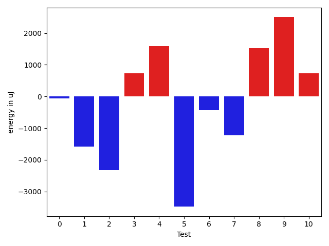
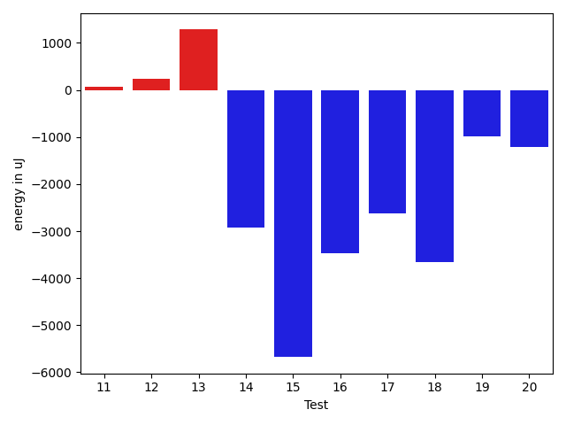

# gson cdd5d8

https://github.com/google/gson/commit/cdd5d8

## Delta Energy per test method

| ID | EnergyV1 | EnergyV2 | DeltaEnergy | σV1 | σV2 |
| --- | --- | --- | --- | --- | --- |
| 0 | 38364.3125 | 39552.294117647056 | 1187.9816176470558 | 5128.349499580128 | 5160.723259442772 |
| 1 | 60388.343434343435 | 60559.0404040404 | 170.69696969696815 | 20907.942944366412 | 20629.731009238076 |
| 2 | 61359.60975609756 | 52652.329113924054 | -8707.280642173508 | 30377.54913593666 | 23727.22823870677 |
| 3 | 47776.94736842105 | 50947.257731958765 | 3170.310363537712 | 15642.471656472504 | 17085.70971724094 |
| 4 | 37083.311475409835 | 38445.43243243243 | 1362.1209570225983 | 4233.171393946158 | 5987.232953094762 |
| 5 | 57271.73737373737 | 52447.0 | -4824.737373737371 | 21973.315326920507 | 20577.741578823672 |
| 6 | 92161.31578947368 | 66875.02631578948 | -25286.2894736842 | 118058.13932040018 | 86825.14842183105 |
| 7 | 39428.692307692305 | 39775.78125 | 347.0889423076951 | 5832.904480150194 | 5287.724520850007 |
| 8 | 37513.362068965514 | 37982.92537313433 | 469.56330416881246 | 4310.821938180602 | 4707.407228541669 |
| 9 | 37067.898305084746 | 38915.578125 | 1847.6798199152545 | 4172.479105755142 | 4577.703165906073 |
| 10 | 38404.1568627451 | 38343.107142857145 | -61.04971988795296 | 4975.4142181391035 | 5012.602452385714 |
| 11 | 38043.9375 | 38092.885714285716 | 48.94821428571595 | 4885.3486501573 | 5130.000856426709 |
| 12 | 39271.833333333336 | 38328.25 | -943.5833333333358 | 5250.633847980219 | 4147.54176440696 |
| 13 | 39026.72727272727 | 39262.45569620253 | 235.72842347525875 | 7448.3993288480115 | 6182.2379316048555 |
| 14 | 38793.179487179485 | 81173.05555555556 | 42379.87606837608 | 4976.8415422851385 | 247904.19118515035 |
| 15 | 410250.1414141414 | 409454.7878787879 | -795.3535353534971 | 772573.1338166853 | 771105.035151362 |
| 16 | 122861.0303030303 | 141122.19191919192 | 18261.16161616161 | 293219.51173296483 | 319194.5773492482 |
| 17 | 39190.97368421053 | 38410.44680851064 | -780.5268756998848 | 5808.543002775908 | 5764.593956317584 |
| 18 | 441123.1971830986 | 258373.84146341463 | -182749.35571968395 | 806063.8693209001 | 616280.0557510552 |
| 19 | 50435.693181818184 | 47094.945054945056 | -3340.748126873128 | 44700.394298738356 | 39805.43182779181 |
| 20 | 36238.46341463415 | 35474.10526315789 | -764.3581514762554 | 5852.404742757609 | 5611.680172402978 |

## Delta Duration per test method

| ID | DurationV1 | DurationsV2 | DeltaDuration |
| --- | --- | --- | --- |
| 0 | 644716.375 | 662057.5 | 17341.125 |
| 1 | 1942087.292929293 | 1881696.6464646466 | -60390.64646464633 |
| 2 | 1857411.0 | 1665892.2658227847 | -191518.73417721526 |
| 3 | 1631863.5789473683 | 1595420.1030927836 | -36443.475854584714 |
| 4 | 1112664.3770491802 | 1105122.9324324324 | -7541.444616747787 |
| 5 | 1763543.7272727273 | 1772672.888888889 | 9129.161616161698 |
| 6 | 3049292.3552631577 | 2212089.4736842103 | -837202.8815789474 |
| 7 | 682321.8461538461 | 669524.71875 | -12797.127403846127 |
| 8 | 1058983.2413793104 | 1011299.0447761194 | -47684.19660319097 |
| 9 | 1036807.5423728813 | 1014885.921875 | -21921.62049788132 |
| 10 | 903887.7058823529 | 911001.4107142857 | 7113.704831932788 |
| 11 | 705505.90625 | 727924.6571428571 | 22418.75089285709 |
| 12 | 730657.4666666667 | 831965.8611111111 | 101308.39444444445 |
| 13 | 1261870.4675324676 | 1203028.7215189873 | -58841.74601348024 |
| 14 | 834528.5384615385 | 2209998.0555555555 | 1375469.517094017 |
| 15 | 11880615.95959596 | 12355907.525252525 | 475291.56565656513 |
| 16 | 3542608.5757575757 | 4213513.545454546 | 670904.9696969702 |
| 17 | 838563.5789473684 | 828488.4042553192 | -10075.174692049273 |
| 18 | 13583403.42253521 | 8104338.780487805 | -5479064.642047406 |
| 19 | 1582536.2727272727 | 1541330.923076923 | -41205.3496503497 |
| 20 | 897700.5609756098 | 861545.5 | -36155.06097560981 |

## Misc.

| ID | Test Class | Test Method |
| --- | --- | --- |
| 0 | com.google.gson.functional.MapTest | testWriteMapsWithEmptyStringKey |
| 1 | com.google.gson.functional.MapTest | testSerializeMaps |
| 2 | com.google.gson.functional.MapTest | testMapSerializationWithNullValues |
| 3 | com.google.gson.functional.MapTest | testGeneralMapField |
| 4 | com.google.gson.functional.MapTest | testMapSerializationWithNullValueButSerializeNulls |
| 5 | com.google.gson.functional.MapTest | testMapSerializationWithWildcardValues |
| 6 | com.google.gson.functional.MapTest | testMapSerialization |
| 7 | com.google.gson.functional.MapTest | testMapWithQuotes |
| 8 | com.google.gson.functional.MapTest | testMapSerializationWithNullKey |
| 9 | com.google.gson.functional.MapTest | testMapSerializationWithNullValue |
| 10 | com.google.gson.functional.MapTest | testMapSerializationWithNullValuesSerialized |
| 11 | com.google.gson.functional.MapTest | testMapOfMapSerialization |
| 12 | com.google.gson.functional.MapTest | testRawMapSerialization |
| 13 | com.google.gson.functional.CustomTypeAdaptersTest | testCustomAdapterInvokedForMapElementSerializationWithType |
| 14 | com.google.gson.functional.CustomTypeAdaptersTest | testCustomAdapterInvokedForMapElementSerialization |
| 15 | com.google.gson.functional.TypeVariableTest | testAdvancedTypeVariables |
| 16 | com.google.gson.functional.TypeVariableTest | testTypeVariablesViaTypeParameter |
| 17 | com.google.gson.functional.PrettyPrintingTest | testMap |
| 18 | com.google.gson.DefaultMapJsonSerializerTest | testNonEmptyMapSerialization |
| 19 | com.google.gson.functional.MoreSpecificTypeSerializationTest | testMapOfParameterizedSubclassFields |
| 20 | com.google.gson.functional.DefaultTypeAdaptersTest | testPropertiesSerialization |

| Test | IterationV1 | IterationV2 | DeltaIteration |
| --- | --- | --- | --- |
| 0 | 32 | 34 | 2 |
| 1 | 99 | 99 | 0 |
| 2 | 82 | 79 | -3 |
| 3 | 95 | 97 | 2 |
| 4 | 61 | 74 | 13 |
| 5 | 99 | 99 | 0 |
| 6 | 76 | 76 | 0 |
| 7 | 26 | 32 | 6 |
| 8 | 58 | 67 | 9 |
| 9 | 59 | 64 | 5 |
| 10 | 51 | 56 | 5 |
| 11 | 32 | 35 | 3 |
| 12 | 30 | 36 | 6 |
| 13 | 77 | 79 | 2 |
| 14 | 39 | 36 | -3 |
| 15 | 99 | 99 | 0 |
| 16 | 99 | 99 | 0 |
| 17 | 38 | 47 | 9 |
| 18 | 71 | 82 | 11 |
| 19 | 88 | 91 | 3 |
| 20 | 41 | 38 | -3 |

| Time Label | Time (s) |
| --- | --- |
| Selection | 29.399120092391968 |
| Injection | 11.306604146957397 |
| Total | 1147.7814207077026 |

