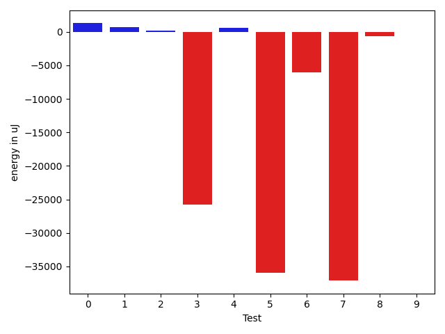
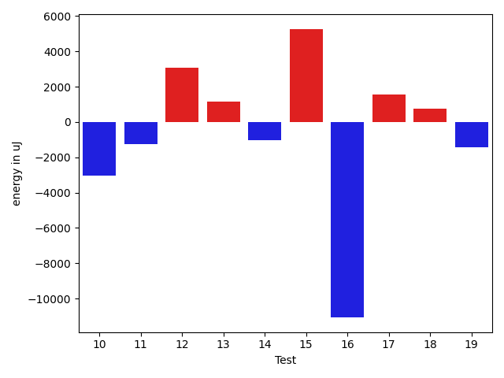
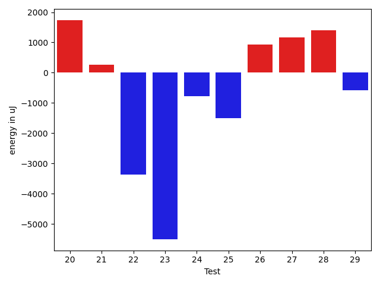
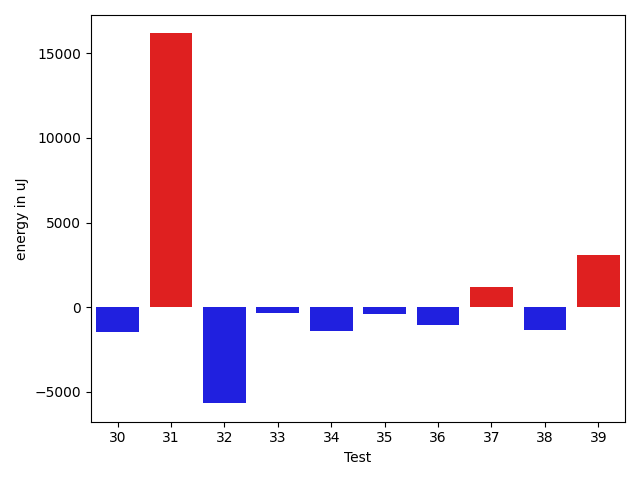
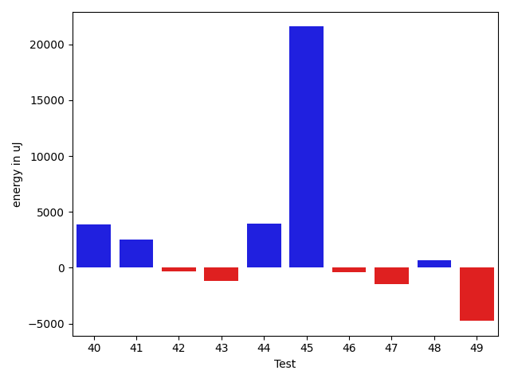
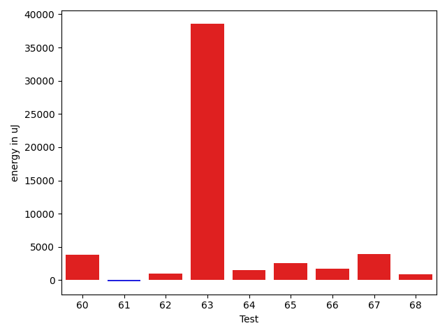

# gson f50cce

https://github.com/google/gson/commit/f50cce

## Delta Energy per test method

| ID | EnergyV1 | EnergyV2 | DeltaEnergy | σV1 | σV2 |
| --- | --- | --- | --- | --- | --- |
| 0 | 42278.65217391304 | 43558.94936708861 | 1280.2971931755674 | 12495.372633152478 | 15128.84202977853 |
| 1 | 40000.47692307692 | 40733.08955223881 | 732.6126291618857 | 4975.0167347463175 | 8789.508197287796 |
| 2 | 39659.4375 | 39857.796875 | 198.359375 | 4597.6935313909025 | 6673.125486278168 |
| 3 | 64355.0 | 38629.73134328358 | -25725.26865671642 | 188887.75552179292 | 5079.694862683468 |
| 4 | 51156.04761904762 | 51784.51648351648 | 628.4688644688649 | 29784.2934098881 | 34577.055849461234 |
| 5 | 150023.078125 | 114068.81538461539 | -35954.26274038461 | 399160.6648481794 | 323997.1810137524 |
| 6 | 98902.06060606061 | 92862.64646464646 | -6039.414141414149 | 32647.897595873925 | 28345.002025837104 |
| 7 | 77940.32608695653 | 40821.163265306124 | -37119.1628216504 | 242530.34989945113 | 10837.095567572125 |
| 8 | 40514.583333333336 | 39877.542372881355 | -637.0409604519809 | 5789.776328797167 | 4686.60483275196 |
| 9 | 39142.27272727273 | 39143.0 | 0.7272727272720658 | 5320.427120429491 | 4478.926328552835 |
| 10 | 42805.75 | 39790.666666666664 | -3015.0833333333358 | 11977.728827042572 | 8043.634155170301 |
| 11 | 40520.47222222222 | 39262.7323943662 | -1257.7398278560213 | 4716.994997324457 | 5221.737639008757 |
| 12 | 45992.90243902439 | 49080.833333333336 | 3087.930894308949 | 17874.025734738425 | 22173.328761757537 |
| 13 | 39145.48275862069 | 40307.56363636364 | 1162.0808777429484 | 4517.260358475528 | 5009.423885451522 |
| 14 | 41582.6 | 40544.45614035088 | -1038.1438596491207 | 8277.695442573375 | 10732.0907563467 |
| 15 | 94538.92929292929 | 99811.90909090909 | 5272.979797979802 | 22654.799943273567 | 24455.42910333203 |
| 16 | 241437.18181818182 | 230355.37373737374 | -11081.808080808085 | 70303.68551963483 | 67565.29224590435 |
| 17 | 39833.42647058824 | 41371.875 | 1538.4485294117621 | 4865.396547880022 | 9572.116998013591 |
| 18 | 39433.8 | 40194.30303030303 | 760.5030303030289 | 5260.904288373679 | 4160.580164125195 |
| 19 | 81458.9191919192 | 80012.53535353535 | -1446.3838383838447 | 15307.435300807889 | 28603.512018000547 |
| 20 | 82338.72727272728 | 84082.22222222222 | 1743.4949494949396 | 15934.436612505106 | 19145.441984950412 |
| 21 | 39018.0 | 39276.02380952381 | 258.0238095238092 | 5493.493186847454 | 4272.904223058727 |
| 22 | 106297.68686868687 | 102931.57575757576 | -3366.1111111111095 | 21474.032966619103 | 24274.918484645415 |
| 23 | 113313.67676767676 | 107801.36363636363 | -5512.313131313131 | 23487.945207645113 | 26006.021393443734 |
| 24 | 39953.651162790695 | 39186.02631578947 | -767.6248470012215 | 6138.187464018093 | 6106.952403384376 |
| 25 | 40375.8275862069 | 38870.25925925926 | -1505.5683269476358 | 4568.2882863086925 | 5143.565866368733 |
| 26 | 32592.5 | 33515.11111111111 | 922.6111111111095 | 2380.5 | 1884.8085340098985 |
| 27 | 33599.5 | 34774.75 | 1175.25 | 396.5 | 2045.0920975594229 |
| 28 | 32409.0 | 33813.0 | 1404.0 | 0.0 | 1248.9566312193017 |
| 29 | 31372.0 | 30799.5 | -572.5 | 366.0 | 1988.1128614844781 |
| 30 | 32623.5 | 32203.75 | -419.75 | 885.5 | 2028.385118142016 |
| 31 | 62103.0 | 76632.88888888889 | 14529.88888888889 | 4120.0 | 16664.327392130133 |
| 32 | 103865.49494949495 | 96191.74747474748 | -7673.747474747477 | 64266.31607526867 | 54858.08529772244 |
| 33 | 46550.294117647056 | 44837.12 | -1713.1741176470532 | 14745.240338195299 | 12638.837300912348 |
| 34 | 45662.26666666667 | 44945.34328358209 | -716.9233830845769 | 20916.218725402756 | 26550.31453761585 |
| 35 | 40268.04615384615 | 40471.86153846154 | 203.8153846153873 | 4657.879535486141 | 6333.528827722949 |
| 36 | 56248.88333333333 | 49339.54929577465 | -6909.334037558685 | 57710.520382362294 | 40499.13427027714 |
| 37 | 65510.32307692308 | 71314.56521739131 | 5804.242140468232 | 45439.20026859482 | 43884.85150127803 |
| 38 | 56665.443181818184 | 58868.22826086957 | 2202.785079051384 | 36928.9127208854 | 39771.92463860363 |
| 39 | 39791.51351351351 | 42641.83823529412 | 2850.3247217806056 | 8061.977991889414 | 10710.32420090718 |
| 40 | 116468.63440860216 | 120378.69892473119 | 3910.0645161290304 | 85086.64105749496 | 90048.5940861855 |
| 41 | 66227.02197802198 | 68770.91489361702 | 2543.8929155950464 | 39852.55213303159 | 42124.30446440366 |
| 42 | 55473.829545454544 | 55125.941860465115 | -347.88768498942954 | 51448.73471922882 | 43759.11906460839 |
| 43 | 41205.3698630137 | 40059.346153846156 | -1146.0237091675444 | 7250.733541552788 | 6805.070205984846 |
| 44 | 43198.470588235294 | 47144.35064935065 | 3945.8800611153565 | 15082.841479710516 | 24407.773148033728 |
| 45 | 41328.88461538462 | 62903.13725490196 | 21574.25263951734 | 4583.689719889954 | 68040.19161251264 |
| 46 | 40111.77419354839 | 39691.21212121212 | -420.5620723362663 | 5641.311673770946 | 5445.8996961438 |
| 47 | 40786.24 | 39296.416666666664 | -1489.8233333333337 | 4696.128509996293 | 5011.851556145027 |
| 48 | 40378.11111111111 | 41040.46153846154 | 662.3504273504295 | 6798.7776874383735 | 6227.395293857344 |
| 49 | 60232.71134020619 | 55477.767676767675 | -4754.943663438513 | 27825.332941000004 | 25595.125298521903 |
| 50 | 46329.677777777775 | 48923.416666666664 | 2593.738888888889 | 18589.525088565202 | 18405.191458337387 |
| 51 | 42006.36666666667 | 41383.068181818184 | -623.2984848484848 | 5668.842612522908 | 6962.763396022272 |
| 52 | 41856.13636363636 | 39854.02857142857 | -2002.1077922077893 | 4418.462621314162 | 5968.862339487743 |
| 53 | 39606.514285714286 | 49677.142857142855 | 10070.62857142857 | 4880.802155216635 | 39363.751530813126 |
| 54 | 66335.20930232559 | 49720.604166666664 | -16614.605135658923 | 63893.604732401654 | 40716.47882805946 |
| 55 | 275000.02777777775 | 267947.7837837838 | -7052.243993993965 | 661722.466972244 | 687279.6707158036 |
| 56 | 40681.08 | 41244.09523809524 | 563.015238095235 | 5169.2889214668585 | 6019.371331711056 |
| 57 | 39746.65789473684 | 40859.41860465116 | 1112.7607099143206 | 5000.281325118859 | 5419.207134286808 |
| 58 | 82576.63076923077 | 43626.10526315789 | -38950.52550607288 | 310185.90627902595 | 11406.549527761257 |
| 59 | 40722.58 | 39374.19565217391 | -1348.3843478260897 | 6471.958217077734 | 6532.171350223198 |
| 60 | 79388.0808080808 | 81642.63636363637 | 2254.555555555562 | 31083.372886050638 | 34349.56323909015 |
| 61 | 75285.101010101 | 78388.0101010101 | 3102.909090909103 | 23943.499790381928 | 27296.130005972063 |
| 62 | 39804.0 | 40341.02631578947 | 537.0263157894733 | 5331.053656727635 | 5674.127943601564 |
| 63 | 361568.89898989897 | 270316.0505050505 | -91252.84848484845 | 685379.0099205745 | 470205.0695410122 |
| 64 | 40289.91935483871 | 41159.69565217391 | 869.7762973352001 | 5516.862672893071 | 4763.378901530542 |
| 65 | 39077.725 | 40261.529411764706 | 1183.8044117647078 | 5494.426312125315 | 7211.988467884544 |
| 66 | 58230.02173913043 | 60985.183673469386 | 2755.161934338954 | 26942.056616318634 | 29942.78636965018 |
| 67 | 38859.11111111111 | 41853.10344827586 | 2993.992337164753 | 3920.401749380184 | 3945.083980093213 |
| 68 | 42674.875 | 42161.27272727273 | -513.6022727272721 | 5447.8873643252755 | 4293.120386489594 |

## Delta Duration per test method

| ID | DurationV1 | DurationsV2 | DeltaDuration |
| --- | --- | --- | --- |
| 0 | 1094840.2898550725 | 1143343.8860759493 | 48503.59622087679 |
| 1 | 917487.3538461538 | 973051.7462686567 | 55564.39242250286 |
| 2 | 970940.5625 | 988438.921875 | 17498.359375 |
| 3 | 1736228.5151515151 | 1028348.8507462686 | -707879.6644052465 |
| 4 | 1504452.1785714286 | 1502162.1098901099 | -2290.0686813187785 |
| 5 | 4603764.0 | 3494683.6923076925 | -1109080.3076923075 |
| 6 | 2696486.494949495 | 2713070.02020202 | 16583.52525252523 |
| 7 | 1974113.0 | 923988.2448979592 | -1050124.7551020407 |
| 8 | 979422.9444444445 | 944810.4915254237 | -34612.45291902078 |
| 9 | 883591.7818181819 | 949207.5471698113 | 65615.76535162947 |
| 10 | 720530.1111111111 | 744643.8 | 24113.688888888923 |
| 11 | 1031164.4861111111 | 1066089.028169014 | 34924.5420579029 |
| 12 | 1313082.024390244 | 1416307.0 | 103224.97560975607 |
| 13 | 881399.1896551724 | 902396.8909090909 | 20997.701253918465 |
| 14 | 935878.9636363636 | 920049.3684210526 | -15829.595215311041 |
| 15 | 2787047.9393939395 | 2738146.262626263 | -48901.6767676766 |
| 16 | 6564453.858585859 | 6434842.212121212 | -129611.6464646468 |
| 17 | 1063540.7647058824 | 1140234.892857143 | 76694.12815126055 |
| 18 | 683369.3428571429 | 617991.303030303 | -65378.03982683993 |
| 19 | 2382625.868686869 | 2448554.6868686867 | 65928.81818181789 |
| 20 | 2439405.727272727 | 2444633.6464646463 | 5227.919191919267 |
| 21 | 760220.8181818182 | 693619.9047619047 | -66600.9134199135 |
| 22 | 2999306.9292929294 | 2949164.5656565656 | -50142.36363636376 |
| 23 | 3234975.878787879 | 3143232.757575758 | -91743.1212121211 |
| 24 | 823584.3488372093 | 1027416.8684210526 | 203832.5195838433 |
| 25 | 671567.5172413794 | 689276.9629629629 | 17709.445721583557 |
| 26 | 1076507.5 | 1190168.111111111 | 113660.61111111101 |
| 27 | 763596.0 | 767085.5 | 3489.5 |
| 28 | 726879.0 | 661705.0 | -65174.0 |
| 29 | 1280285.0 | 1262952.625 | -17332.375 |
| 30 | 914372.5 | 1004687.25 | 90314.75 |
| 31 | 2784026.0 | 2879652.222222222 | 95626.22222222202 |
| 32 | 2962457.242424242 | 2653390.0 | -309067.2424242422 |
| 33 | 1294895.2470588235 | 1179645.28 | -115249.96705882344 |
| 34 | 1204853.6 | 1232808.9402985075 | 27955.340298507363 |
| 35 | 1003343.4923076923 | 1082717.2923076923 | 79373.80000000005 |
| 36 | 1429400.6333333333 | 1271412.7746478873 | -157987.85868544597 |
| 37 | 1602244.7538461538 | 1945587.4347826086 | 343342.6809364548 |
| 38 | 1680467.8409090908 | 1796636.2391304348 | 116168.39822134399 |
| 39 | 1022124.9459459459 | 1121526.6176470588 | 99401.67170111288 |
| 40 | 3251129.6021505375 | 3334767.2795698927 | 83637.67741935514 |
| 41 | 1895118.6813186812 | 1981077.2234042552 | 85958.54208557401 |
| 42 | 1709012.0113636365 | 1691740.1046511629 | -17271.906712473603 |
| 43 | 1194788.2191780822 | 1190327.8076923077 | -4460.411485774443 |
| 44 | 1187876.705882353 | 1301565.6493506494 | 113688.94346829643 |
| 45 | 837410.5384615385 | 1577737.843137255 | 740327.3046757164 |
| 46 | 617527.8387096775 | 602426.9696969697 | -15100.869012707728 |
| 47 | 584531.24 | 703755.5 | 119224.26000000001 |
| 48 | 699485.8055555555 | 674752.9230769231 | -24732.882478632382 |
| 49 | 1845830.7835051545 | 1754216.1515151516 | -91614.63199000293 |
| 50 | 1422500.2555555555 | 1428665.8854166667 | 6165.629861111287 |
| 51 | 934076.6 | 967596.6363636364 | 33520.036363636376 |
| 52 | 698931.3181818182 | 678206.3142857143 | -20725.00389610394 |
| 53 | 696688.2 | 967486.8857142857 | 270798.6857142857 |
| 54 | 1661049.0697674418 | 1144241.7916666667 | -516807.2781007751 |
| 55 | 7974162.819444444 | 7763803.635135135 | -210359.18430930935 |
| 56 | 1008185.96 | 960449.7619047619 | -47736.19809523807 |
| 57 | 809529.1578947369 | 773699.6279069767 | -35829.52998776012 |
| 58 | 2255558.6615384617 | 1065003.7894736843 | -1190554.8720647774 |
| 59 | 995087.14 | 913683.7173913043 | -81403.42260869569 |
| 60 | 2317700.0404040404 | 2384254.525252525 | 66554.48484848486 |
| 61 | 2322579.8383838385 | 2247672.2525252528 | -74907.58585858578 |
| 62 | 706850.8181818182 | 715015.3157894737 | 8164.497607655474 |
| 63 | 10592063.06060606 | 7285959.101010101 | -3306103.9595959596 |
| 64 | 992915.5322580645 | 986958.1304347826 | -5957.401823281893 |
| 65 | 768631.575 | 787030.7058823529 | 18399.13088235294 |
| 66 | 1357697.108695652 | 1538308.7551020407 | 180611.6464063886 |
| 67 | 557077.0555555555 | 489187.9655172414 | -67889.09003831411 |
| 68 | 632387.6875 | 579416.9090909091 | -52970.77840909094 |

## Misc.

| ID | Test Class | Test Method |
| --- | --- | --- |
| 0 | com.google.gson.functional.CustomTypeAdaptersTest | testCustomAdapterInvokedForCollectionElementDeserialization |
| 1 | com.google.gson.functional.CustomTypeAdaptersTest | testCustomTypeAdapterAppliesToSubClassesSerializedAsBaseClass |
| 2 | com.google.gson.functional.CustomTypeAdaptersTest | testCustomAdapterInvokedForMapElementDeserialization |
| 3 | com.google.gson.functional.CustomTypeAdaptersTest | testCustomAdapterInvokedForMapElementSerializationWithType |
| 4 | com.google.gson.functional.CustomTypeAdaptersTest | testCustomNestedSerializers |
| 5 | com.google.gson.functional.CustomTypeAdaptersTest | testCustomSerializers |
| 6 | com.google.gson.functional.CustomTypeAdaptersTest | testCustomTypeAdapterDoesNotAppliesToSubClasses |
| 7 | com.google.gson.functional.CustomTypeAdaptersTest | testCustomAdapterInvokedForCollectionElementSerialization |
| 8 | com.google.gson.functional.CustomTypeAdaptersTest | testCustomDeserializers |
| 9 | com.google.gson.functional.CustomTypeAdaptersTest | testCustomByteArrayDeserializerAndInstanceCreator |
| 10 | com.google.gson.functional.CustomTypeAdaptersTest | testCustomAdapterInvokedForMapElementSerialization |
| 11 | com.google.gson.functional.CustomTypeAdaptersTest | testCustomNestedDeserializers |
| 12 | com.google.gson.functional.CustomTypeAdaptersTest | testCustomAdapterInvokedForCollectionElementSerializationWithType |
| 13 | com.google.gson.functional.CustomTypeAdaptersTest | testCustomByteArraySerializer |
| 14 | com.google.gson.functional.CustomTypeAdaptersTest | testEnsureCustomSerializerNotInvokedForNullValues |
| 15 | com.google.gson.functional.DefaultTypeAdaptersTest | testDateSerializationWithPatternNotOverridenByTypeAdapter |
| 16 | com.google.gson.functional.DefaultTypeAdaptersTest | testDateSerializationWithPattern |
| 17 | com.google.gson.functional.DefaultTypeAdaptersTest | testBitSetDeserialization |
| 18 | com.google.gson.functional.DefaultTypeAdaptersTest | testDefaultGregorianCalendarDeserialization |
| 19 | com.google.gson.functional.DefaultTypeAdaptersTest | testSqlDateSerialization |
| 20 | com.google.gson.functional.DefaultTypeAdaptersTest | testTimestampSerialization |
| 21 | com.google.gson.functional.DefaultTypeAdaptersTest | testDefaultCalendarDeserialization |
| 22 | com.google.gson.functional.DefaultTypeAdaptersTest | testDateDeserializationWithPattern |
| 23 | com.google.gson.functional.DefaultTypeAdaptersTest | testDateSerializationInCollection |
| 24 | com.google.gson.functional.DefaultTypeAdaptersTest | testBitSetSerialization |
| 25 | com.google.gson.functional.DefaultTypeAdaptersTest | testDefaultJavaSqlDateSerialization |
| 26 | com.google.gson.functional.DefaultTypeAdaptersTest | testDefaultJavaSqlTimestampDeserialization |
| 27 | com.google.gson.functional.DefaultTypeAdaptersTest | testDefaultJavaSqlTimeDeserialization |
| 28 | com.google.gson.functional.DefaultTypeAdaptersTest | testDefaultJavaSqlTimeSerialization |
| 29 | com.google.gson.functional.DefaultTypeAdaptersTest | testDefaultDateSerialization |
| 30 | com.google.gson.functional.DefaultTypeAdaptersTest | testDefaultJavaSqlDateDeserialization |
| 31 | com.google.gson.functional.DefaultTypeAdaptersTest | testDefaultDateDeserialization |
| 32 | com.google.gson.functional.InheritanceTest | testSubInterfacesOfCollectionSerialization |
| 33 | com.google.gson.functional.InheritanceTest | testSubInterfacesOfCollectionDeserialization |
| 34 | com.google.gson.functional.CustomDeserializerTest | testCustomDeserializerReturnsNullForArrayElementsForArrayField |
| 35 | com.google.gson.functional.CustomDeserializerTest | testCustomDeserializerReturnsNull |
| 36 | com.google.gson.functional.CustomDeserializerTest | testCustomDeserializerReturnsNullForArrayElements |
| 37 | com.google.gson.functional.CustomDeserializerTest | testCustomDeserializerReturnsNullForTopLevelObject |
| 38 | com.google.gson.functional.CustomDeserializerTest | testJsonTypeFieldBasedDeserialization |
| 39 | com.google.gson.functional.EnumTest | testEnumSubclassAsParameterizedType |
| 40 | com.google.gson.functional.EnumTest | testEnumSubclass |
| 41 | com.google.gson.functional.EnumTest | testEnumSubclassWithRegisteredTypeAdapter |
| 42 | com.google.gson.functional.EnumTest | testClassWithEnumFieldSerialization |
| 43 | com.google.gson.functional.EnumTest | testCollectionOfEnumsDeserialization |
| 44 | com.google.gson.functional.EnumTest | testCollectionOfEnumsSerialization |
| 45 | com.google.gson.functional.EnumTest | testTopLevelEnumSerialization |
| 46 | com.google.gson.functional.EnumTest | testTopLevelEnumInASingleElementArrayDeserialization |
| 47 | com.google.gson.functional.EnumTest | testTopLevelEnumDeserialization |
| 48 | com.google.gson.functional.EnumTest | testClassWithEnumFieldDeserialization |
| 49 | com.google.gson.functional.ParameterizedTypesTest | testParameterizedTypeWithCustomSerializer |
| 50 | com.google.gson.functional.ParameterizedTypesTest | testParameterizedTypesWithCustomDeserializer |
| 51 | com.google.gson.functional.NullObjectAndFieldTest | testCustomSerializationOfNulls |
| 52 | com.google.gson.functional.NullObjectAndFieldTest | testCustomTypeAdapterPassesNullSerialization |
| 53 | com.google.gson.GsonTypeAdapterTest | testTypeAdapterProperlyConvertsTypes |
| 54 | com.google.gson.GsonTypeAdapterTest | testTypeAdapterThrowsException |
| 55 | com.google.gson.functional.CustomSerializerTest | testSubClassSerializerInvokedForBaseClassFieldsHoldingSubClassInstances |
| 56 | com.google.gson.functional.CustomSerializerTest | testSerializerReturnsNull |
| 57 | com.google.gson.functional.CustomSerializerTest | testBaseClassSerializerInvokedForBaseClassFields |
| 58 | com.google.gson.functional.CustomSerializerTest | testSubClassSerializerInvokedForBaseClassFieldsHoldingArrayOfSubClassInstances |
| 59 | com.google.gson.functional.CustomSerializerTest | testBaseClassSerializerInvokedForBaseClassFieldsHoldingSubClassInstances |
| 60 | com.google.gson.functional.UncategorizedTest | testReturningDerivedClassesDuringDeserialization |
| 61 | com.google.gson.functional.MapTest | testParameterizedMapSubclassSerialization |
| 62 | com.google.gson.functional.MapTest | testMapSubclassSerialization |
| 63 | com.google.gson.functional.TypeHierarchyAdapterTest | testTypeHierarchy |
| 64 | com.google.gson.functional.TypeHierarchyAdapterTest | testRegisterSuperTypeFirst |
| 65 | com.google.gson.functional.PrimitiveTest | testNumberSerialization |
| 66 | com.google.gson.functional.PrimitiveTest | testNumberDeserialization |
| 67 | com.google.gson.functional.PrimitiveTest | testDeserializeJsonObjectAsNumber |
| 68 | com.google.gson.functional.PrimitiveTest | testDeserializeJsonArrayAsNumber |

| Test | IterationV1 | IterationV2 | DeltaIteration |
| --- | --- | --- | --- |
| 0 | 69 | 79 | 10 |
| 1 | 65 | 67 | 2 |
| 2 | 64 | 64 | 0 |
| 3 | 66 | 67 | 1 |
| 4 | 84 | 91 | 7 |
| 5 | 64 | 65 | 1 |
| 6 | 99 | 99 | 0 |
| 7 | 46 | 49 | 3 |
| 8 | 72 | 59 | -13 |
| 9 | 55 | 53 | -2 |
| 10 | 36 | 30 | -6 |
| 11 | 72 | 71 | -1 |
| 12 | 82 | 84 | 2 |
| 13 | 58 | 55 | -3 |
| 14 | 55 | 57 | 2 |
| 15 | 99 | 99 | 0 |
| 16 | 99 | 99 | 0 |
| 17 | 68 | 56 | -12 |
| 18 | 35 | 33 | -2 |
| 19 | 99 | 99 | 0 |
| 20 | 99 | 99 | 0 |
| 21 | 33 | 42 | 9 |
| 22 | 99 | 99 | 0 |
| 23 | 99 | 99 | 0 |
| 24 | 43 | 38 | -5 |
| 25 | 29 | 27 | -2 |
| 26 | 2 | 9 | 7 |
| 27 | 2 | 4 | 2 |
| 28 | 1 | 3 | 2 |
| 29 | 2 | 8 | 6 |
| 30 | 2 | 8 | 6 |
| 31 | 2 | 9 | 7 |
| 32 | 99 | 99 | 0 |
| 33 | 85 | 75 | -10 |
| 34 | 75 | 67 | -8 |
| 35 | 65 | 65 | 0 |
| 36 | 60 | 71 | 11 |
| 37 | 65 | 69 | 4 |
| 38 | 88 | 92 | 4 |
| 39 | 74 | 68 | -6 |
| 40 | 93 | 93 | 0 |
| 41 | 91 | 94 | 3 |
| 42 | 88 | 86 | -2 |
| 43 | 73 | 78 | 5 |
| 44 | 68 | 77 | 9 |
| 45 | 52 | 51 | -1 |
| 46 | 31 | 33 | 2 |
| 47 | 25 | 36 | 11 |
| 48 | 36 | 39 | 3 |
| 49 | 97 | 99 | 2 |
| 50 | 90 | 96 | 6 |
| 51 | 30 | 44 | 14 |
| 52 | 22 | 35 | 13 |
| 53 | 35 | 35 | 0 |
| 54 | 43 | 48 | 5 |
| 55 | 72 | 74 | 2 |
| 56 | 50 | 63 | 13 |
| 57 | 38 | 43 | 5 |
| 58 | 65 | 57 | -8 |
| 59 | 50 | 46 | -4 |
| 60 | 99 | 99 | 0 |
| 61 | 99 | 99 | 0 |
| 62 | 33 | 38 | 5 |
| 63 | 99 | 99 | 0 |
| 64 | 62 | 69 | 7 |
| 65 | 40 | 34 | -6 |
| 66 | 46 | 49 | 3 |
| 67 | 18 | 29 | 11 |
| 68 | 16 | 22 | 6 |

| Time Label | Time (s) |
| --- | --- |
| Selection | 28.963605403900146 |
| Injection | 13.593344688415527 |
| Total | 1194.14182472229 |

