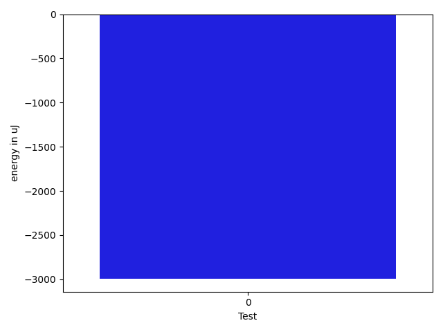

# gson ee9ffa

https://github.com/google/gson/commit/ee9ffa

## Delta Energy per test method

| ID | EnergyV1 | EnergyV2 | DeltaEnergy | σV1 | σV2 |
| --- | --- | --- | --- | --- | --- |
| 0 | 128669.4125 | 131568.0987654321 | 2898.686265432101 | 132249.17863872484 | 133935.75447958228 |

## Delta Duration per test method

| ID | DurationV1 | DurationsV2 | DeltaDuration |
| --- | --- | --- | --- |
| 0 | 4207177.4375 | 4339962.530864198 | 132785.09336419776 |

## Misc.

| ID | Test Class | Test Method |
| --- | --- | --- |
| 0 | com.google.gson.functional.UncategorizedTest | testInvalidJsonDeserializationFails |

| Test | IterationV1 | IterationV2 | DeltaIteration |
| --- | --- | --- | --- |
| 0 | 80 | 81 | 1 |

| Time Label | Time (s) |
| --- | --- |
| Selection | 29.535159587860107 |
| Injection | 10.921853065490723 |
| Total | 1119.7522978782654 |

