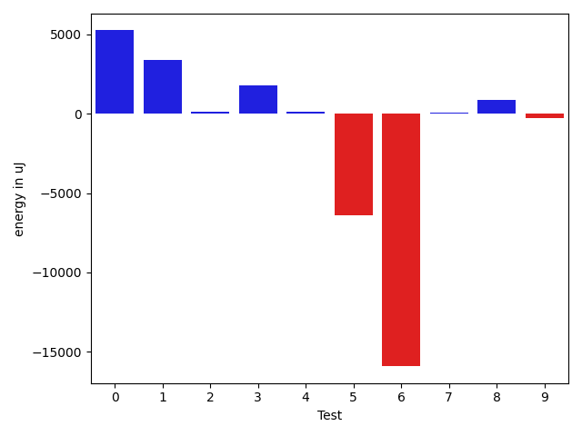
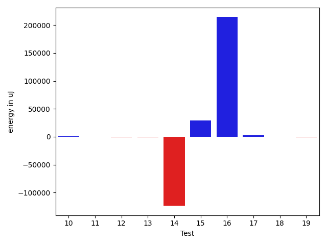

# gson 1bb486

https://github.com/google/gson/commit/1bb486

## Delta Energy per test method

| ID | EnergyV1 | EnergyV2 | DeltaEnergy | σV1 | σV2 |
| --- | --- | --- | --- | --- | --- |
| 0 | 66345 | 70007 | 3662 | 21182.823335384655 | 22718.67998920252 |
| 1 | 43395 | 46386 | 2991 | 30862.089566506893 | 30014.555317475417 |
| 2 | 37842 | 39612 | 1770 | 5881.236302105797 | 5033.291543059237 |
| 3 | 42664 | 44128 | 1464 | 18272.8985999021 | 18069.50820328203 |
| 4 | 37231 | 37414 | 183 | 6448.29158972196 | 4161.657969819357 |
| 5 | 60852 | 44983 | -15869 | 35973.1290948112 | 20470.14825498993 |
| 6 | 40711 | 40161 | -550 | 127611.83856425462 | 107134.77803723146 |
| 7 | 38635 | 37720 | -915 | 5744.793905580948 | 4578.8613559122605 |
| 8 | 37842 | 38696 | 854 | 4378.029452231542 | 3785.7689419151775 |
| 9 | 38086 | 38696 | 610 | 5310.560614532885 | 5383.048605887078 |
| 10 | 36499 | 37536 | 1037 | 4174.365209373095 | 4514.531500036293 |
| 11 | 39917 | 39246 | -671 | 5992.176511107676 | 4958.213048719099 |
| 12 | 39551 | 37964 | -1587 | 7993.711653379185 | 6401.604333927806 |
| 13 | 39490 | 38024 | -1466 | 6172.7629346778285 | 6309.731610421759 |
| 14 | 146300 | 145874 | -426 | 919700.6260608573 | 790638.7470724281 |
| 15 | 92773 | 90698 | -2075 | 326263.62792743783 | 418849.28133162414 |
| 16 | 43945 | 45349 | 1404 | 579689.0907196514 | 827837.8742167661 |
| 17 | 42053 | 42724 | 671 | 8803.591020875487 | 12363.994088880572 |
| 18 | 40100 | 40466 | 366 | 38195.34473763211 | 33281.13554718347 |
| 19 | 38940 | 37536 | -1404 | 4249.306717697107 | 5050.020774837849 |

## Delta Duration per test method

| ID | DurationV1 | DurationsV2 | DeltaDuration |
| --- | --- | --- | --- |
| 0 | 1956047.0505050505 | 1961829.2828282828 | 5782.23232323234 |
| 1 | 1978177.625 | 1925004.7951807228 | -53172.82981927716 |
| 2 | 691803.5806451613 | 642047.9655172414 | -49755.61512791994 |
| 3 | 1641504.6489361702 | 1615900.2947368422 | -25604.354199327994 |
| 4 | 1075359.1515151516 | 1071533.420289855 | -3825.731225296622 |
| 5 | 1873763.5252525252 | 1755005.0303030303 | -118758.49494949495 |
| 6 | 3225785.1625 | 2741142.5975609757 | -484642.5649390244 |
| 7 | 783047.4 | 723628.3 | -59419.09999999998 |
| 8 | 1033058.1940298508 | 1049276.2241379311 | 16218.030108080362 |
| 9 | 915854.8421052631 | 893621.6603773584 | -22233.18172790471 |
| 10 | 819059.3428571429 | 807079.3157894737 | -11980.027067669202 |
| 11 | 633119.4193548387 | 665138.1111111111 | 32018.691756272456 |
| 12 | 1243521.4487179487 | 1189627.9428571428 | -53893.50586080598 |
| 13 | 773680.380952381 | 811836.4666666667 | 38156.08571428573 |
| 14 | 16411266.454545455 | 12660720.646464646 | -3750545.808080809 |
| 15 | 4251365.404040404 | 5008444.3838383835 | 757078.9797979798 |
| 16 | 6836706.6329113925 | 13136032.906666666 | 6299326.273755274 |
| 17 | 1363677.0555555555 | 1367351.4096385543 | 3674.3540829988196 |
| 18 | 1051304.1025641025 | 996410.5 | -54893.602564102504 |
| 19 | 792310.4761904762 | 787219.9512195121 | -5090.524970964063 |

## Misc.

| ID | Test Class | Test Method |
| --- | --- | --- |
| 0 | com.google.gson.functional.MapTest | testSerializeMaps |
| 1 | com.google.gson.functional.MapTest | testMapSerializationWithNullValues |
| 2 | com.google.gson.functional.MapTest | testMapWithQuotes |
| 3 | com.google.gson.functional.MapTest | testGeneralMapField |
| 4 | com.google.gson.functional.MapTest | testMapSerializationWithNullValueButSerializeNulls |
| 5 | com.google.gson.functional.MapTest | testMapSerializationWithWildcardValues |
| 6 | com.google.gson.functional.MapTest | testMapSerialization |
| 7 | com.google.gson.functional.MapTest | testMapOfMapSerialization |
| 8 | com.google.gson.functional.MapTest | testMapSerializationWithNullValue |
| 9 | com.google.gson.functional.MapTest | testMapSerializationWithNullValuesSerialized |
| 10 | com.google.gson.functional.MapTest | testRawMapSerialization |
| 11 | com.google.gson.functional.MapTest | testWriteMapsWithEmptyStringKey |
| 12 | com.google.gson.functional.CustomTypeAdaptersTest | testCustomAdapterInvokedForMapElementSerializationWithType |
| 13 | com.google.gson.functional.CustomTypeAdaptersTest | testCustomAdapterInvokedForMapElementSerialization |
| 14 | com.google.gson.functional.TypeVariableTest | testAdvancedTypeVariables |
| 15 | com.google.gson.functional.TypeVariableTest | testTypeVariablesViaTypeParameter |
| 16 | com.google.gson.DefaultMapJsonSerializerTest | testNonEmptyMapSerialization |
| 17 | com.google.gson.functional.MoreSpecificTypeSerializationTest | testMapOfParameterizedSubclassFields |
| 18 | com.google.gson.functional.PrettyPrintingTest | testMap |
| 19 | com.google.gson.functional.DefaultTypeAdaptersTest | testPropertiesSerialization |

| Test | IterationV1 | IterationV2 | DeltaIteration |
| --- | --- | --- | --- |
| 0 | 99 | 99 | 0 |
| 1 | 80 | 83 | 3 |
| 2 | 31 | 29 | -2 |
| 3 | 94 | 95 | 1 |
| 4 | 66 | 69 | 3 |
| 5 | 99 | 99 | 0 |
| 6 | 80 | 82 | 2 |
| 7 | 25 | 30 | 5 |
| 8 | 67 | 58 | -9 |
| 9 | 57 | 53 | -4 |
| 10 | 35 | 38 | 3 |
| 11 | 31 | 27 | -4 |
| 12 | 78 | 70 | -8 |
| 13 | 42 | 45 | 3 |
| 14 | 99 | 99 | 0 |
| 15 | 99 | 99 | 0 |
| 16 | 79 | 75 | -4 |
| 17 | 90 | 83 | -7 |
| 18 | 39 | 40 | 1 |
| 19 | 42 | 41 | -1 |

| Time Label | Time (s) |
| --- | --- |
| Selection | 29.04117703437805 |
| Injection | 11.737244129180908 |
| Total | 1150.7013630867004 |

