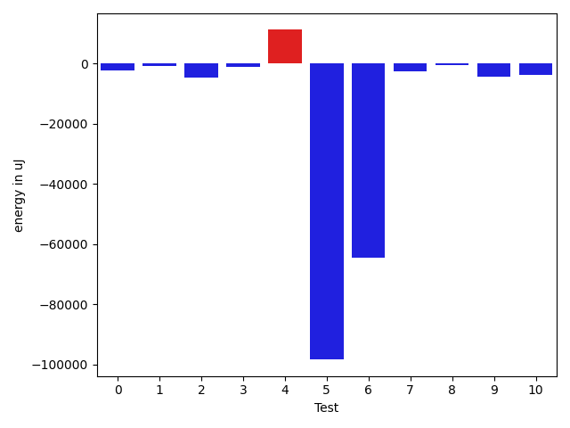
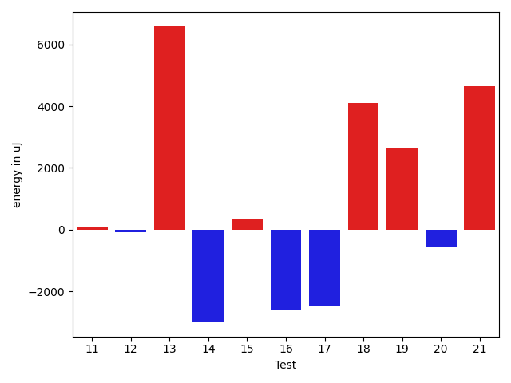
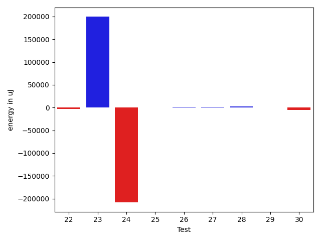

# gson e75660

https://github.com/google/gson/commit/e75660

## Delta Energy per test method

| ID | EnergyV1 | EnergyV2 | DeltaEnergy | σV1 | σV2 |
| --- | --- | --- | --- | --- | --- |
| 0 | 39489 | 39795 | 306 | 14287.706188265722 | 8599.403238389441 |
| 1 | 40039 | 38879 | -1160 | 5550.271465419953 | 4715.114469521748 |
| 2 | 40832 | 38635 | -2197 | 16427.968027913557 | 5104.349879024752 |
| 3 | 38269 | 39245 | 976 | 13503.558763000594 | 4930.45597474337 |
| 4 | 43457 | 42907 | -550 | 44175.75225002323 | 194342.78482045207 |
| 5 | 42175 | 38513 | -3662 | 361144.34408238705 | 4686.144872355728 |
| 6 | 45777 | 44433 | -1344 | 565410.8759677432 | 502868.5752679871 |
| 7 | 114379 | 107971 | -6408 | 31237.2661340005 | 29623.15203214471 |
| 8 | 44555 | 43335 | -1220 | 25854.633296153777 | 23857.344559327958 |
| 9 | 42297 | 39856 | -2441 | 12419.760889520263 | 5542.737606105156 |
| 10 | 39734 | 37903 | -1831 | 13346.267102756674 | 5304.992310777538 |
| 11 | 42114 | 41442 | -672 | 8806.90423743611 | 5630.36072830053 |
| 12 | 41016 | 38880 | -2136 | 5334.170383293407 | 5340.198722154332 |
| 13 | 99181 | 101806 | 2625 | 24869.651116636072 | 28817.07892082096 |
| 14 | 44372 | 40710 | -3662 | 5958.962620755022 | 5922.2284336611 |
| 15 | 39795 | 40894 | 1099 | 7764.061245276167 | 6234.763137136829 |
| 16 | 40100 | 41382 | 1282 | 22838.26041645513 | 5232.73631254454 |
| 17 | 45044 | 45349 | 305 | 54564.94571308465 | 47216.9583063818 |
| 18 | 45105 | 45532 | 427 | 50762.66011784134 | 39519.70669730863 |
| 19 | 40039 | 40710 | 671 | 11277.852428241182 | 35990.18524648825 |
| 20 | 43457 | 44311 | 854 | 29004.41142999402 | 23057.92271254663 |
| 21 | 44495 | 43945 | -550 | 52105.65260659774 | 61383.80474765755 |
| 22 | 40466 | 41626 | 1160 | 19741.645039273248 | 12800.128932760472 |
| 23 | 45898 | 44006 | -1892 | 612335.3836015539 | 871276.2620547472 |
| 24 | 44922 | 45410 | 488 | 797853.1265047335 | 417147.08483795635 |
| 25 | 41748 | 42724 | 976 | 5787.201466495938 | 4326.71734177309 |
| 26 | 41809 | 43091 | 1282 | 6093.8054615367855 | 8169.5082530357195 |
| 27 | 39368 | 41564 | 2196 | 9086.280312139286 | 4566.888001085948 |
| 28 | 40344 | 43457 | 3113 | 5514.566877489917 | 4543.61768917789 |
| 29 | 85082 | 84838 | -244 | 27383.52488860714 | 28094.525926543785 |
| 30 | 43945 | 43762 | -183 | 24962.110868233784 | 15729.722534403572 |

## Delta Duration per test method

| ID | DurationV1 | DurationsV2 | DeltaDuration |
| --- | --- | --- | --- |
| 0 | 1293798.5617977527 | 1268741.247311828 | -25057.314485924784 |
| 1 | 1076156.8051948051 | 1094287.96875 | 18131.163555194857 |
| 2 | 1164119.420289855 | 1013923.4166666666 | -150196.00362318836 |
| 3 | 1094984.619047619 | 1040469.9855072463 | -54514.6335403726 |
| 4 | 1945372.177777778 | 2459418.6774193547 | 514046.4996415768 |
| 5 | 3943247.32 | 640976.5588235294 | -3302270.7611764707 |
| 6 | 8797987.096385542 | 6601592.6329113925 | -2196394.46347415 |
| 7 | 3252604.242424242 | 3130311.585858586 | -122292.65656565642 |
| 8 | 1697693.9885057472 | 1681984.608695652 | -15709.379810095066 |
| 9 | 1332105.6857142858 | 1165420.5652173914 | -166685.12049689447 |
| 10 | 1059001.03125 | 943098.1694915254 | -115902.86175847461 |
| 11 | 1159176.5384615385 | 1194563.6351351351 | 35387.09667359665 |
| 12 | 813203.9047619047 | 804950.5333333333 | -8253.371428571409 |
| 13 | 3034323.131313131 | 3028678.494949495 | -5644.636363636237 |
| 14 | 735040.0666666667 | 819865.756097561 | 84825.68943089433 |
| 15 | 1083978.625 | 1049383.0555555555 | -34595.569444444496 |
| 16 | 1214817.8115942029 | 1067167.0266666666 | -147650.78492753627 |
| 17 | 2198896.09375 | 2064156.1770833333 | -134739.91666666674 |
| 18 | 1872928.2692307692 | 1968432.7611940298 | 95504.49196326057 |
| 19 | 1344024.7790697673 | 1339898.3978494625 | -4126.381220304873 |
| 20 | 1830965.0 | 1745761.4040404041 | -85203.59595959587 |
| 21 | 2162553.389473684 | 2346358.7731958763 | 183805.38372219214 |
| 22 | 1483394.03125 | 1476330.5567010308 | -7063.474548969185 |
| 23 | 6839372.914634147 | 12436768.710843373 | 5597395.796209226 |
| 24 | 9640022.767123288 | 3461961.3088235296 | -6178061.458299758 |
| 25 | 836193.4150943396 | 800802.48 | -35390.93509433966 |
| 26 | 1132988.5166666666 | 1036967.1515151515 | -96021.36515151511 |
| 27 | 1026953.6774193548 | 946589.1590909091 | -80364.51832844573 |
| 28 | 1018160.7301587302 | 908478.275862069 | -109682.45429666119 |
| 29 | 2430701.797979798 | 2556118.3535353537 | 125416.5555555555 |
| 30 | 1410011.9552238807 | 1358872.676056338 | -51139.2791675427 |

## Misc.

| ID | Test Class | Test Method |
| --- | --- | --- |
| 0 | com.google.gson.functional.CustomTypeAdaptersTest | testCustomAdapterInvokedForCollectionElementDeserialization |
| 1 | com.google.gson.functional.CustomTypeAdaptersTest | testCustomTypeAdapterAppliesToSubClassesSerializedAsBaseClass |
| 2 | com.google.gson.functional.CustomTypeAdaptersTest | testCustomAdapterInvokedForMapElementDeserialization |
| 3 | com.google.gson.functional.CustomTypeAdaptersTest | testCustomAdapterInvokedForMapElementSerializationWithType |
| 4 | com.google.gson.functional.CustomTypeAdaptersTest | testCustomNestedSerializers |
| 5 | com.google.gson.functional.CustomTypeAdaptersTest | testCustomAdapterInvokedForMapElementSerialization |
| 6 | com.google.gson.functional.CustomTypeAdaptersTest | testCustomSerializers |
| 7 | com.google.gson.functional.CustomTypeAdaptersTest | testCustomTypeAdapterDoesNotAppliesToSubClasses |
| 8 | com.google.gson.functional.CustomTypeAdaptersTest | testCustomAdapterInvokedForCollectionElementSerializationWithType |
| 9 | com.google.gson.functional.CustomTypeAdaptersTest | testCustomDeserializers |
| 10 | com.google.gson.functional.CustomTypeAdaptersTest | testEnsureCustomSerializerNotInvokedForNullValues |
| 11 | com.google.gson.functional.CustomTypeAdaptersTest | testCustomNestedDeserializers |
| 12 | com.google.gson.functional.CustomTypeAdaptersTest | testCustomAdapterInvokedForCollectionElementSerialization |
| 13 | com.google.gson.functional.DefaultTypeAdaptersTest | testDateSerializationWithPatternNotOverridenByTypeAdapter |
| 14 | com.google.gson.functional.NullObjectAndFieldTest | testCustomTypeAdapterPassesNullSerialization |
| 15 | com.google.gson.functional.NullObjectAndFieldTest | testCustomSerializationOfNulls |
| 16 | com.google.gson.functional.CustomDeserializerTest | testCustomDeserializerReturnsNull |
| 17 | com.google.gson.functional.CustomDeserializerTest | testJsonTypeFieldBasedDeserialization |
| 18 | com.google.gson.functional.CustomDeserializerTest | testCustomDeserializerReturnsNullForTopLevelObject |
| 19 | com.google.gson.functional.ParameterizedTypesTest | testParameterizedTypeWithReaderDeserialization |
| 20 | com.google.gson.functional.ParameterizedTypesTest | testParameterizedTypeWithCustomSerializer |
| 21 | com.google.gson.functional.ParameterizedTypesTest | testParameterizedTypeDeserialization |
| 22 | com.google.gson.functional.ParameterizedTypesTest | testParameterizedTypesWithCustomDeserializer |
| 23 | com.google.gson.functional.InstanceCreatorTest | testInstanceCreatorReturnsBaseType |
| 24 | com.google.gson.functional.CustomSerializerTest | testSubClassSerializerInvokedForBaseClassFieldsHoldingSubClassInstances |
| 25 | com.google.gson.functional.CustomSerializerTest | testBaseClassSerializerInvokedForBaseClassFields |
| 26 | com.google.gson.functional.CustomSerializerTest | testSubClassSerializerInvokedForBaseClassFieldsHoldingArrayOfSubClassInstances |
| 27 | com.google.gson.functional.CustomSerializerTest | testBaseClassSerializerInvokedForBaseClassFieldsHoldingSubClassInstances |
| 28 | com.google.gson.functional.CustomSerializerTest | testSerializerReturnsNull |
| 29 | com.google.gson.functional.UncategorizedTest | testReturningDerivedClassesDuringDeserialization |
| 30 | com.google.gson.functional.ObjectTest | testInnerClassDeserialization |

| Test | IterationV1 | IterationV2 | DeltaIteration |
| --- | --- | --- | --- |
| 0 | 89 | 93 | 4 |
| 1 | 77 | 64 | -13 |
| 2 | 69 | 72 | 3 |
| 3 | 63 | 69 | 6 |
| 4 | 90 | 93 | 3 |
| 5 | 50 | 34 | -16 |
| 6 | 83 | 79 | -4 |
| 7 | 99 | 99 | 0 |
| 8 | 87 | 92 | 5 |
| 9 | 70 | 69 | -1 |
| 10 | 64 | 59 | -5 |
| 11 | 78 | 74 | -4 |
| 12 | 42 | 45 | 3 |
| 13 | 99 | 99 | 0 |
| 14 | 30 | 41 | 11 |
| 15 | 48 | 54 | 6 |
| 16 | 69 | 75 | 6 |
| 17 | 96 | 96 | 0 |
| 18 | 78 | 67 | -11 |
| 19 | 86 | 93 | 7 |
| 20 | 99 | 99 | 0 |
| 21 | 95 | 97 | 2 |
| 22 | 96 | 97 | 1 |
| 23 | 82 | 83 | 1 |
| 24 | 73 | 68 | -5 |
| 25 | 53 | 50 | -3 |
| 26 | 60 | 66 | 6 |
| 27 | 62 | 44 | -18 |
| 28 | 63 | 58 | -5 |
| 29 | 99 | 99 | 0 |
| 30 | 67 | 71 | 4 |

| Time Label | Time (s) |
| --- | --- |
| Selection | 29.729259252548218 |
| Injection | 12.842460632324219 |
| Total | 1180.1807823181152 |

