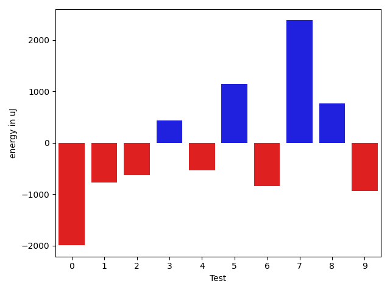
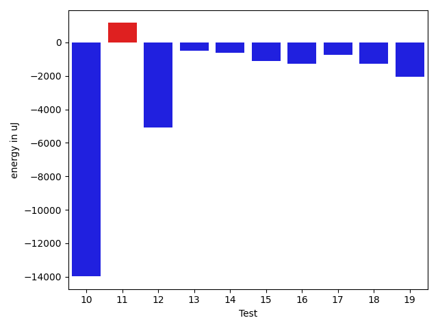
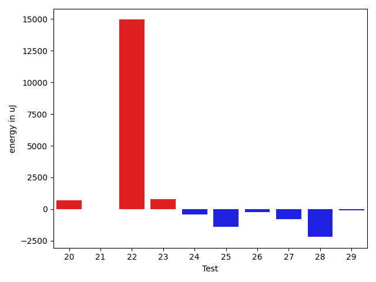
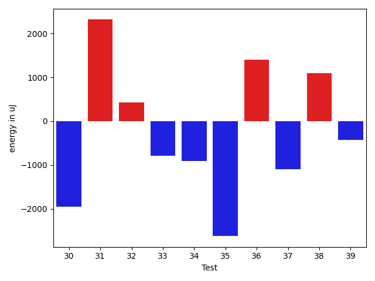
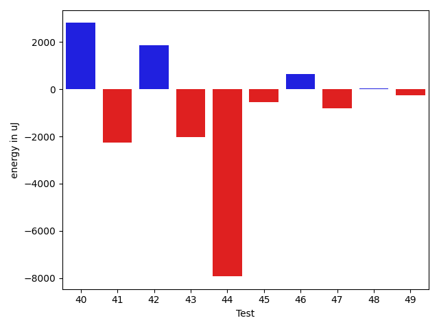
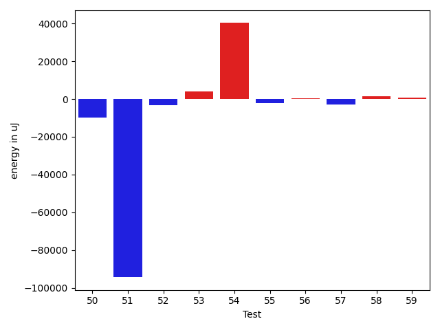
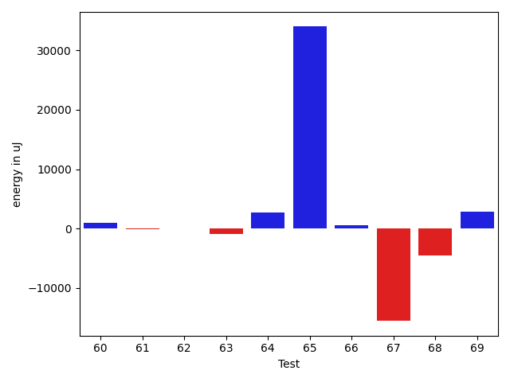
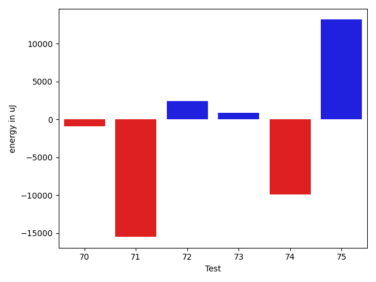

# gson fede58

https://github.com/google/gson/commit/fede58

## Delta Energy per test method

| ID | EnergyV1 | EnergyV2 | DeltaEnergy | σV1 | σV2 |
| --- | --- | --- | --- | --- | --- |
| 0 | 40771 | 39612 | -1159 | 6204.652630104818 | 5025.65989134107 |
| 1 | 40405 | 40894 | 489 | 5349.5600013231215 | 4735.776577396828 |
| 2 | 42725 | 42175 | -550 | 14603.12410407609 | 13455.791395247787 |
| 3 | 36621 | 37231 | 610 | 3478.650642742211 | 3833.9596285832567 |
| 4 | 37903 | 37475 | -428 | 6100.439545542192 | 6600.785208847 |
| 5 | 109985 | 115844 | 5859 | 24474.90228626984 | 25423.735924661058 |
| 6 | 40466 | 41382 | 916 | 17576.35140230312 | 16658.429342575026 |
| 7 | 41565 | 42053 | 488 | 13857.381387908237 | 17437.59636929342 |
| 8 | 70983 | 73242 | 2259 | 23420.398215356214 | 26118.536027292153 |
| 9 | 75012 | 72021 | -2991 | 24728.646275927335 | 28966.435196909086 |
| 10 | 103454 | 89477 | -13977 | 40398.65965906233 | 42670.961519012504 |
| 11 | 65125 | 66284 | 1159 | 24535.34297610296 | 24378.453759094682 |
| 12 | 87402 | 82336 | -5066 | 35390.57555032537 | 37927.99683895383 |
| 13 | 68055 | 67566 | -489 | 23234.57619253797 | 24388.403705547535 |
| 14 | 39429 | 38818 | -611 | 4096.614079287785 | 5267.939736741802 |
| 15 | 39184 | 38086 | -1098 | 6748.383137165998 | 7508.832119641788 |
| 16 | 39551 | 38269 | -1282 | 9593.963096364298 | 6541.674633457742 |
| 17 | 40222 | 39489 | -733 | 4614.344345714399 | 3791.0220394030403 |
| 18 | 41931 | 40649 | -1282 | 7068.702592402919 | 9148.376393249699 |
| 19 | 38330 | 36255 | -2075 | 3516.497138733624 | 4249.6160068923145 |
| 20 | 39795 | 40466 | 671 | 4048.441358766871 | 5584.544022127155 |
| 21 | 42480 | 41870 | -610 | 17068.37280612563 | 15369.021364430206 |
| 22 | 42603 | 43762 | 1159 | 72060.05937293173 | 95789.39589802513 |
| 23 | 39368 | 39978 | 610 | 4369.381232717509 | 4959.079696879251 |
| 24 | 38757 | 37353 | -1404 | 4118.192985658639 | 7894.343650292037 |
| 25 | 41015 | 40161 | -854 | 6913.5684201336035 | 5164.806852422457 |
| 26 | 40039 | 39551 | -488 | 4528.671194374444 | 4719.284571551492 |
| 27 | 39612 | 39001 | -611 | 4913.130112130604 | 4576.606905127462 |
| 28 | 39856 | 38025 | -1831 | 6754.584219982713 | 4078.7971923430355 |
| 29 | 40039 | 38940 | -1099 | 4568.087631848244 | 5711.050385208797 |
| 30 | 40161 | 38208 | -1953 | 4407.448710493811 | 4508.14757739806 |
| 31 | 41321 | 43640 | 2319 | 12609.714223284343 | 17031.289235904518 |
| 32 | 38574 | 39002 | 428 | 26789.980943810362 | 32097.00592428863 |
| 33 | 40467 | 39673 | -794 | 4660.160255415754 | 5209.96116207092 |
| 34 | 41809 | 40893 | -916 | 6519.553901672841 | 6423.397706960769 |
| 35 | 40161 | 37537 | -2624 | 4934.765692838242 | 5157.148249537561 |
| 36 | 82153 | 83557 | 1404 | 48529.571489673865 | 54243.777943721754 |
| 37 | 42420 | 41321 | -1099 | 9455.052209745587 | 10533.784099846931 |
| 38 | 42114 | 43213 | 1099 | 15662.936510431111 | 19329.519441657376 |
| 39 | 40344 | 39917 | -427 | 6503.992118605994 | 5201.234754971012 |
| 40 | 87890 | 86303 | -1587 | 32896.775500572505 | 39355.642528033466 |
| 41 | 41993 | 42359 | 366 | 25681.181235082153 | 22176.299657491934 |
| 42 | 41443 | 41198 | -245 | 16165.326632797161 | 22790.212327211353 |
| 43 | 40649 | 40283 | -366 | 10142.921179278124 | 5822.297032425752 |
| 44 | 112121 | 100647 | -11474 | 46404.017364883926 | 38254.46439656067 |
| 45 | 43152 | 42542 | -610 | 19366.515495412394 | 18772.393772238196 |
| 46 | 43335 | 42541 | -794 | 8669.475414501987 | 12918.171763146225 |
| 47 | 41443 | 41932 | 489 | 4715.46448423822 | 4553.561880481587 |
| 48 | 42725 | 42419 | -306 | 15310.652766556266 | 15737.510498567453 |
| 49 | 42602 | 42420 | -182 | 8771.25999276484 | 6445.311211764261 |
| 50 | 45472 | 45532 | 60 | 131183.6762226753 | 122761.62953666464 |
| 51 | 88806 | 88012 | -794 | 510536.7937064845 | 257317.6818932623 |
| 52 | 46264 | 45411 | -853 | 25813.920782594225 | 22650.513390672255 |
| 53 | 41992 | 42664 | 672 | 13091.70761081836 | 17299.191677092997 |
| 54 | 42846 | 43884 | 1038 | 522594.43232523685 | 585522.539442991 |
| 55 | 41260 | 41931 | 671 | 12864.627969041936 | 7860.291317895565 |
| 56 | 41137 | 40772 | -365 | 6580.367768576707 | 6388.386732715443 |
| 57 | 43945 | 42602 | -1343 | 25079.721154103572 | 21031.155808586976 |
| 58 | 39733 | 40710 | 977 | 6466.746162285763 | 8503.85709237285 |
| 59 | 45227 | 44861 | -366 | 22182.72302401588 | 23231.991757266384 |
| 60 | 38269 | 39917 | 1648 | 5229.659783176349 | 4638.524221196289 |
| 61 | 41565 | 41382 | -183 | 5067.44619462643 | 4581.1271644005155 |
| 62 | 43090 | 43701 | 611 | 16634.886517317795 | 16794.89384325707 |
| 63 | 40771 | 41077 | 306 | 7877.884424365599 | 4925.53523519536 |
| 64 | 42908 | 43274 | 366 | 19542.932360300118 | 23413.099415670622 |
| 65 | 41442 | 42176 | 734 | 63959.76907524596 | 115984.58631832394 |
| 66 | 51758 | 47791 | -3967 | 114729.44631782235 | 114422.80570187925 |
| 67 | 44800 | 43518 | -1282 | 67689.12777425566 | 46702.6204973673 |
| 68 | 44007 | 42237 | -1770 | 30089.897890106524 | 26559.801991633354 |
| 69 | 42358 | 42969 | 611 | 8079.945655500487 | 22863.897157965 |
| 70 | 42908 | 42907 | -1 | 7994.61216599884 | 3013.7038607380246 |
| 71 | 43090 | 43091 | 1 | 50106.38516837713 | 24494.620184211442 |
| 72 | 41260 | 41442 | 182 | 5106.156020140924 | 15371.372054667228 |
| 73 | 41260 | 42846 | 1586 | 4879.506676444831 | 4211.018995709022 |
| 74 | 43457 | 44128 | 671 | 59091.019081533064 | 29412.61758814342 |
| 75 | 45837 | 95947 | 50110 | 62053.855491755334 | 60281.744182468865 |

## Delta Duration per test method

| ID | DurationV1 | DurationsV2 | DeltaDuration |
| --- | --- | --- | --- |
| 0 | 1050121.3333333333 | 1052052.1363636365 | 1930.8030303032137 |
| 1 | 725321.5 | 714876.5142857142 | -10444.98571428575 |
| 2 | 1267075.0 | 1297678.4683544303 | 30603.468354430282 |
| 3 | 886317.4255319149 | 874830.4150943396 | -11487.010437575285 |
| 4 | 1015648.0 | 1027568.7 | 11920.699999999953 |
| 5 | 3111422.0 | 3079041.626262626 | -32380.373737373855 |
| 6 | 1218501.4897959183 | 1223201.5 | 4700.010204081656 |
| 7 | 1405809.7872340425 | 1394562.4555555556 | -11247.331678486895 |
| 8 | 1982165.383838384 | 1949366.4242424243 | -32798.95959595963 |
| 9 | 2032262.494949495 | 1959276.4747474748 | -72986.02020202018 |
| 10 | 3012931.0505050505 | 2808421.767676768 | -204509.28282828256 |
| 11 | 1895298.1515151516 | 1894506.202020202 | -791.949494949542 |
| 12 | 2598396.9191919193 | 2399531.1919191917 | -198865.72727272753 |
| 13 | 1895376.808080808 | 1881454.3333333333 | -13922.474747474771 |
| 14 | 767239.1632653062 | 892584.3695652174 | 125345.20629991125 |
| 15 | 938783.1587301587 | 1063402.9848484849 | 124619.82611832616 |
| 16 | 1057399.7733333334 | 1087497.8059701493 | 30098.032636815915 |
| 17 | 772207.2363636363 | 868907.5283018867 | 96700.29193825042 |
| 18 | 995755.96875 | 1125281.375 | 129525.40625 |
| 19 | 668268.8181818182 | 709967.2580645161 | 41698.43988269789 |
| 20 | 890204.4761904762 | 932387.8644067796 | 42183.38821630343 |
| 21 | 1402983.6333333333 | 1512225.9139784947 | 109242.2806451614 |
| 22 | 1697203.105882353 | 2204127.0375 | 506923.9316176472 |
| 23 | 960170.5 | 973740.92 | 13570.420000000042 |
| 24 | 867237.4901960784 | 957845.6393442623 | 90608.14914818387 |
| 25 | 943510.4520547945 | 1093506.9655172413 | 149996.51346244675 |
| 26 | 784419.641509434 | 893276.074074074 | 108856.43256464007 |
| 27 | 801798.9821428572 | 855140.5925925926 | 53341.610449735424 |
| 28 | 1016794.275862069 | 1019739.9305555555 | 2945.654693486518 |
| 29 | 895830.6734693878 | 941883.9523809524 | 46053.278911564616 |
| 30 | 808557.0243902439 | 855895.7 | 47338.67560975603 |
| 31 | 1181689.2461538462 | 1521551.012345679 | 339861.76619183295 |
| 32 | 1264054.5166666666 | 1445941.6944444445 | 181887.1777777779 |
| 33 | 848501.2553191489 | 899195.7959183673 | 50694.54059921845 |
| 34 | 949288.7407407408 | 997658.6349206349 | 48369.89417989412 |
| 35 | 557704.7368421053 | 503566.625 | -54138.11184210528 |
| 36 | 2517374.2959183673 | 2598413.868686869 | 81039.57276850147 |
| 37 | 1189234.7681159421 | 1202198.7671232878 | 12963.999007345643 |
| 38 | 1248849.4285714286 | 1307430.2028985508 | 58580.77432712214 |
| 39 | 970988.7 | 983482.40625 | 12493.706250000047 |
| 40 | 2571913.88172043 | 2655445.224489796 | 83531.34276936576 |
| 41 | 1515764.8444444444 | 1530663.9885057472 | 14899.144061302766 |
| 42 | 1143254.6268656717 | 1220851.0327868853 | 77596.40592121356 |
| 43 | 1056700.8103448276 | 998467.4776119404 | -58233.33273288724 |
| 44 | 3167327.121212121 | 3151710.4444444445 | -15616.676767676603 |
| 45 | 1408175.7764705883 | 1510299.1627906978 | 102123.38632010948 |
| 46 | 1091672.4576271186 | 1096311.375 | 4638.917372881435 |
| 47 | 714335.6363636364 | 728042.225 | 13706.588636363624 |
| 48 | 1314450.7027027027 | 1316174.5263157894 | 1723.8236130867153 |
| 49 | 1071627.9166666667 | 955175.1346153846 | -116452.78205128212 |
| 50 | 2951948.9183673467 | 2606606.8020833335 | -345342.11628401326 |
| 51 | 6118909.313131313 | 3176124.111111111 | -2942785.202020202 |
| 52 | 1756902.731958763 | 1689200.2234042552 | -67702.50855450775 |
| 53 | 1162649.3442622952 | 1345524.732142857 | 182875.38788056187 |
| 54 | 4851049.602739726 | 6087916.19117647 | 1236866.5884367442 |
| 55 | 1143752.5 | 1142946.1739130435 | -806.326086956542 |
| 56 | 1048781.6911764706 | 996754.3857142857 | -52027.305462184944 |
| 57 | 1535565.5526315789 | 1409160.388888889 | -126405.16374268988 |
| 58 | 1048783.9206349207 | 1069478.3666666667 | 20694.44603174599 |
| 59 | 1758369.3673469387 | 1736359.111111111 | -22010.256235827692 |
| 60 | 855801.8648648649 | 801330.8048780488 | -54471.05998681602 |
| 61 | 850793.6363636364 | 815906.0869565217 | -34887.549407114624 |
| 62 | 1409526.3855421687 | 1395152.1948051949 | -14374.190736973891 |
| 63 | 934833.15625 | 957392.7413793104 | 22559.585129310377 |
| 64 | 1415979.0919540229 | 1519724.1914893617 | 103745.09953533881 |
| 65 | 1298864.7826086956 | 2459007.1224489794 | 1160142.3398402839 |
| 66 | 2733803.15625 | 2743496.1041666665 | 9692.947916666511 |
| 67 | 2332107.488888889 | 1913359.5111111111 | -418747.97777777794 |
| 68 | 1525376.6419753085 | 1365692.768292683 | -159683.8736826256 |
| 69 | 1118356.9710144927 | 1142966.4310344828 | 24609.460019990103 |
| 70 | 902739.3725490196 | 840865.6818181818 | -61873.69073083787 |
| 71 | 1542793.8032786886 | 1145591.121212121 | -397202.6820665675 |
| 72 | 958903.7068965518 | 1055808.9811320754 | 96905.27423552366 |
| 73 | 735201.1379310344 | 719814.9 | -15386.237931034411 |
| 74 | 1884602.3488372094 | 1625713.6818181819 | -258888.66701902752 |
| 75 | 2294646.838235294 | 2695355.0422535213 | 400708.2040182273 |

## Misc.

| ID | Test Class | Test Method |
| --- | --- | --- |
| 0 | com.google.gson.functional.CustomTypeAdaptersTest | testCustomAdapterInvokedForCollectionElementDeserialization |
| 1 | com.google.gson.functional.CustomTypeAdaptersTest | testCustomAdapterInvokedForCollectionElementSerialization |
| 2 | com.google.gson.functional.CustomTypeAdaptersTest | testCustomAdapterInvokedForCollectionElementSerializationWithType |
| 3 | com.google.gson.functional.DefaultTypeAdaptersTest | testTreeSetDeserialization |
| 4 | com.google.gson.functional.DefaultTypeAdaptersTest | testTreeSetSerialization |
| 5 | com.google.gson.functional.DefaultTypeAdaptersTest | testDateSerializationInCollection |
| 6 | com.google.gson.functional.DefaultTypeAdaptersTest | testSetSerialization |
| 7 | com.google.gson.functional.ParameterizedTypesTest | testParameterizedTypeGenericArraysSerialization |
| 8 | com.google.gson.functional.ParameterizedTypesTest | testVariableTypeArrayDeserialization |
| 9 | com.google.gson.functional.ParameterizedTypesTest | testVariableTypeDeserialization |
| 10 | com.google.gson.functional.ParameterizedTypesTest | testVariableTypeFieldsAndGenericArraysSerialization |
| 11 | com.google.gson.functional.ParameterizedTypesTest | testParameterizedTypeGenericArraysDeserialization |
| 12 | com.google.gson.functional.ParameterizedTypesTest | testVariableTypeFieldsAndGenericArraysDeserialization |
| 13 | com.google.gson.functional.ParameterizedTypesTest | testParameterizedTypeWithVariableTypeDeserialization |
| 14 | com.google.gson.functional.CollectionTest | testNullsInListDeserialization |
| 15 | com.google.gson.functional.CollectionTest | testRawCollectionSerialization |
| 16 | com.google.gson.functional.CollectionTest | testFieldIsArrayList |
| 17 | com.google.gson.functional.CollectionTest | testWildcardPrimitiveCollectionDeserilaization |
| 18 | com.google.gson.functional.CollectionTest | testTopLevelCollectionOfIntegersDeserialization |
| 19 | com.google.gson.functional.CollectionTest | testRawCollectionOfIntegersSerialization |
| 20 | com.google.gson.functional.CollectionTest | testQueueSerialization |
| 21 | com.google.gson.functional.CollectionTest | testWildcardCollectionField |
| 22 | com.google.gson.functional.CollectionTest | testSetSerialization |
| 23 | com.google.gson.functional.CollectionTest | testTopLevelListOfIntegerCollectionsDeserialization |
| 24 | com.google.gson.functional.CollectionTest | testCollectionOfObjectWithNullSerialization |
| 25 | com.google.gson.functional.CollectionTest | testLinkedListSerialization |
| 26 | com.google.gson.functional.CollectionTest | testNullsInListSerialization |
| 27 | com.google.gson.functional.CollectionTest | testQueueDeserialization |
| 28 | com.google.gson.functional.CollectionTest | testSetDeserialization |
| 29 | com.google.gson.functional.CollectionTest | testCollectionOfObjectSerialization |
| 30 | com.google.gson.functional.CollectionTest | testCollectionOfStringsDeserialization |
| 31 | com.google.gson.functional.CollectionTest | testWildcardPrimitiveCollectionSerilaization |
| 32 | com.google.gson.functional.CollectionTest | testCollectionOfBagOfPrimitivesSerialization |
| 33 | com.google.gson.functional.CollectionTest | testLinkedListDeserialization |
| 34 | com.google.gson.functional.CollectionTest | testTopLevelCollectionOfIntegersSerialization |
| 35 | com.google.gson.functional.CollectionTest | testCollectionOfStringsSerialization |
| 36 | com.google.gson.functional.InheritanceTest | testSubInterfacesOfCollectionSerialization |
| 37 | com.google.gson.functional.InheritanceTest | testSubInterfacesOfCollectionDeserialization |
| 38 | com.google.gson.functional.InheritanceTest | testClassWithBaseCollectionFieldSerialization |
| 39 | com.google.gson.functional.EnumTest | testEnumSubclassAsParameterizedType |
| 40 | com.google.gson.functional.EnumTest | testEnumSubclass |
| 41 | com.google.gson.functional.EnumTest | testEnumSubclassWithRegisteredTypeAdapter |
| 42 | com.google.gson.functional.EnumTest | testCollectionOfEnumsSerialization |
| 43 | com.google.gson.functional.EnumTest | testCollectionOfEnumsDeserialization |
| 44 | com.google.gson.functional.ObjectTest | testSingletonLists |
| 45 | com.google.gson.functional.ObjectTest | testEmptyCollectionInAnObjectDeserialization |
| 46 | com.google.gson.functional.ObjectTest | testTruncatedDeserialization |
| 47 | com.google.gson.functional.ObjectTest | testEmptyCollectionInAnObjectSerialization |
| 48 | com.google.gson.functional.JsonParserTest | testExtraCommasInArrays |
| 49 | com.google.gson.functional.PrettyPrintingTest | testPrettyPrintListOfPrimitiveArrays |
| 50 | com.google.gson.functional.PrettyPrintingTest | testPrettyPrintList |
| 51 | com.google.gson.functional.TypeVariableTest | testAdvancedTypeVariables |
| 52 | com.google.gson.functional.TypeVariableTest | testTypeVariablesViaTypeParameter |
| 53 | com.google.gson.functional.UncategorizedTest | testTrailingWhitespace |
| 54 | com.google.gson.CommentsTest | testParseComments |
| 55 | com.google.gson.functional.MoreSpecificTypeSerializationTest | testListOfParameterizedSubclassFields |
| 56 | com.google.gson.functional.MoreSpecificTypeSerializationTest | testMapOfParameterizedSubclassFields |
| 57 | com.google.gson.functional.MoreSpecificTypeSerializationTest | testListOfSubclassFields |
| 58 | com.google.gson.functional.NullObjectAndFieldTest | testPrintPrintingObjectWithNulls |
| 59 | com.google.gson.functional.NullObjectAndFieldTest | testExplicitSerializationOfNullArrayMembers |
| 60 | com.google.gson.functional.NullObjectAndFieldTest | testExplicitSerializationOfNullStringMembers |
| 61 | com.google.gson.functional.NullObjectAndFieldTest | testExplicitSerializationOfNullCollectionMembers |
| 62 | com.google.gson.functional.ArrayTest | testArrayOfCollectionSerialization |
| 63 | com.google.gson.functional.ArrayTest | testArrayOfCollectionDeserialization |
| 64 | com.google.gson.functional.RawSerializationTest | testCollectionOfObjects |
| 65 | com.google.gson.functional.RawSerializationTest | testCollectionOfPrimitives |
| 66 | com.google.gson.functional.PrintFormattingTest | testCompactFormattingLeavesNoWhiteSpace |
| 67 | com.google.gson.MixedStreamTest | testWriteHtmlSafe |
| 68 | com.google.gson.MixedStreamTest | testWriteLenient |
| 69 | com.google.gson.MixedStreamTest | testReadClosed |
| 70 | com.google.gson.functional.CircularReferenceTest | testDirectedAcyclicGraphDeserialization |
| 71 | com.google.gson.functional.CircularReferenceTest | testDirectedAcyclicGraphSerialization |
| 72 | com.google.gson.internal.bind.MiniGsonTest | testSerializeWithCustomTypeAdapter |
| 73 | com.google.gson.internal.bind.MiniGsonTest | testDeserializeWithCustomTypeAdapter |
| 74 | com.google.gson.ObjectTypeAdapterTest | testSerialize |
| 75 | com.google.gson.functional.EscapingTest | testEscapeAllHtmlCharacters |

| Test | IterationV1 | IterationV2 | DeltaIteration |
| --- | --- | --- | --- |
| 0 | 75 | 66 | -9 |
| 1 | 38 | 35 | -3 |
| 2 | 82 | 79 | -3 |
| 3 | 47 | 53 | 6 |
| 4 | 57 | 60 | 3 |
| 5 | 99 | 99 | 0 |
| 6 | 49 | 42 | -7 |
| 7 | 94 | 90 | -4 |
| 8 | 99 | 99 | 0 |
| 9 | 99 | 99 | 0 |
| 10 | 99 | 99 | 0 |
| 11 | 99 | 99 | 0 |
| 12 | 99 | 99 | 0 |
| 13 | 99 | 99 | 0 |
| 14 | 49 | 46 | -3 |
| 15 | 63 | 66 | 3 |
| 16 | 75 | 67 | -8 |
| 17 | 55 | 53 | -2 |
| 18 | 64 | 64 | 0 |
| 19 | 33 | 31 | -2 |
| 20 | 42 | 59 | 17 |
| 21 | 90 | 93 | 3 |
| 22 | 85 | 80 | -5 |
| 23 | 56 | 75 | 19 |
| 24 | 51 | 61 | 10 |
| 25 | 73 | 58 | -15 |
| 26 | 53 | 54 | 1 |
| 27 | 56 | 54 | -2 |
| 28 | 58 | 72 | 14 |
| 29 | 49 | 63 | 14 |
| 30 | 41 | 50 | 9 |
| 31 | 65 | 81 | 16 |
| 32 | 60 | 72 | 12 |
| 33 | 47 | 49 | 2 |
| 34 | 54 | 63 | 9 |
| 35 | 19 | 24 | 5 |
| 36 | 98 | 99 | 1 |
| 37 | 69 | 73 | 4 |
| 38 | 70 | 69 | -1 |
| 39 | 60 | 64 | 4 |
| 40 | 93 | 98 | 5 |
| 41 | 90 | 87 | -3 |
| 42 | 67 | 61 | -6 |
| 43 | 58 | 67 | 9 |
| 44 | 99 | 99 | 0 |
| 45 | 85 | 86 | 1 |
| 46 | 59 | 64 | 5 |
| 47 | 33 | 40 | 7 |
| 48 | 74 | 76 | 2 |
| 49 | 48 | 52 | 4 |
| 50 | 98 | 96 | -2 |
| 51 | 99 | 99 | 0 |
| 52 | 97 | 94 | -3 |
| 53 | 61 | 56 | -5 |
| 54 | 73 | 68 | -5 |
| 55 | 76 | 69 | -7 |
| 56 | 68 | 70 | 2 |
| 57 | 76 | 72 | -4 |
| 58 | 63 | 60 | -3 |
| 59 | 98 | 99 | 1 |
| 60 | 37 | 41 | 4 |
| 61 | 44 | 46 | 2 |
| 62 | 83 | 77 | -6 |
| 63 | 64 | 58 | -6 |
| 64 | 87 | 94 | 7 |
| 65 | 46 | 49 | 3 |
| 66 | 96 | 96 | 0 |
| 67 | 90 | 90 | 0 |
| 68 | 81 | 82 | 1 |
| 69 | 69 | 58 | -11 |
| 70 | 51 | 44 | -7 |
| 71 | 61 | 66 | 5 |
| 72 | 58 | 53 | -5 |
| 73 | 29 | 30 | 1 |
| 74 | 86 | 88 | 2 |
| 75 | 68 | 71 | 3 |

| Time Label | Time (s) |
| --- | --- |
| Selection | 30.13538694381714 |
| Injection | 14.183812856674194 |
| Total | 1206.9523215293884 |

