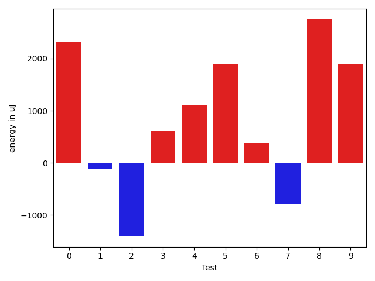
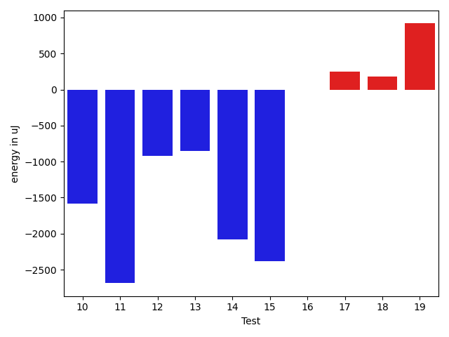
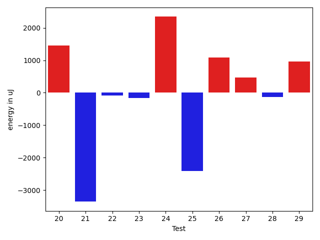
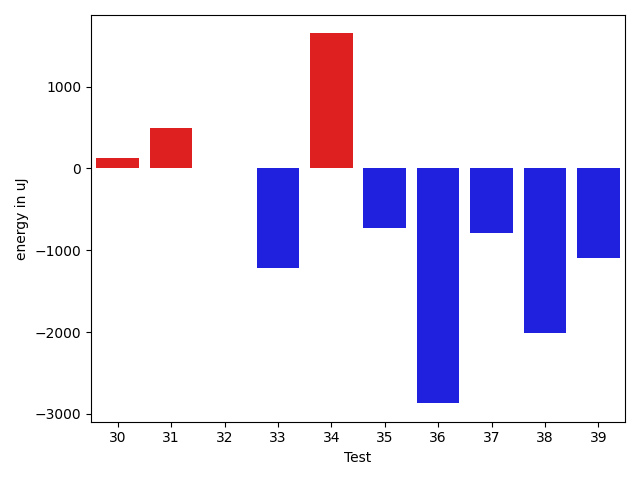
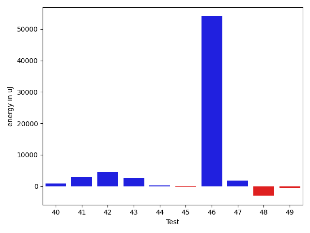
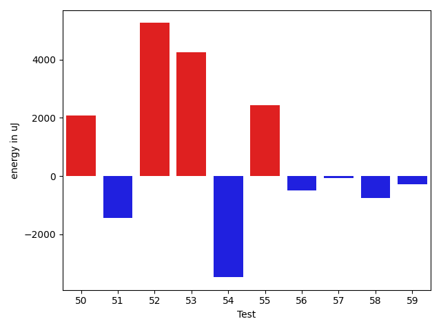
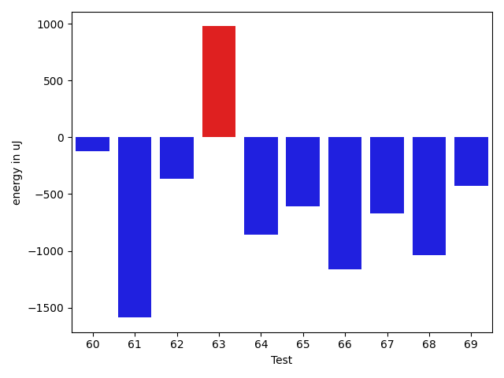
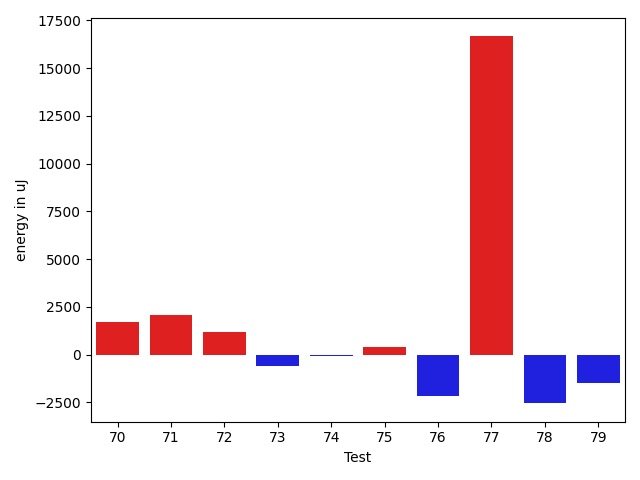
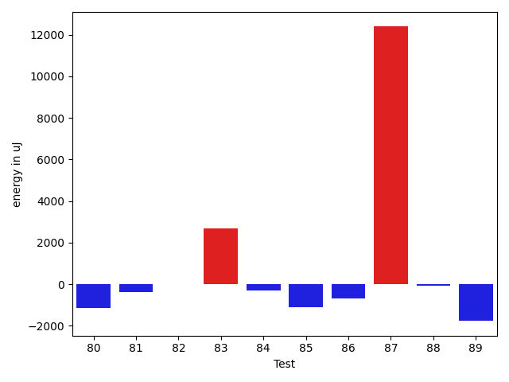
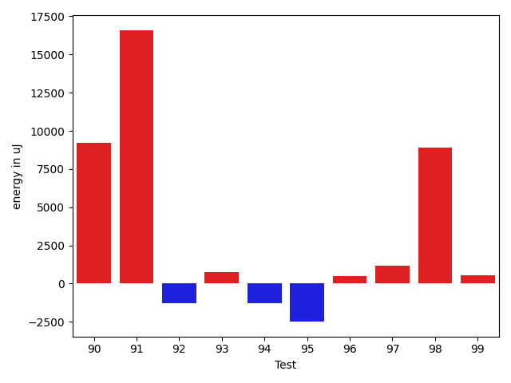

# gson f3c0a9

https://github.com/google/gson/commit/f3c0a9

## Delta Energy per test method

| ID | EnergyV1 | EnergyV2 | DeltaEnergy | σV1 | σV2 |
| --- | --- | --- | --- | --- | --- |
| 0 | 38514 | 40832 | 2318 | 286822.5557681281 | 548804.6789320147 |
| 1 | 39855 | 39734 | -121 | 6568.275455926677 | 6374.515681614667 |
| 2 | 42298 | 40893 | -1405 | 19897.169614906914 | 19419.13050292487 |
| 3 | 43335 | 43945 | 610 | 9213.024144273788 | 6882.716049074766 |
| 4 | 38330 | 39429 | 1099 | 4699.8070420695985 | 4069.6943167266536 |
| 5 | 38452 | 40344 | 1892 | 4551.530887094316 | 4433.110688604991 |
| 6 | 37537 | 37903 | 366 | 4747.110411495458 | 4274.154615437616 |
| 7 | 40161 | 39368 | -793 | 4447.06933234503 | 4270.8393554429085 |
| 8 | 38452 | 41198 | 2746 | 26348.64453154651 | 13696.624545463526 |
| 9 | 39062 | 40954 | 1892 | 4537.863815222934 | 3577.6327017630656 |
| 10 | 40649 | 39062 | -1587 | 4551.019202172928 | 3493.869020665202 |
| 11 | 41687 | 39001 | -2686 | 8054.950117262157 | 5273.507128028072 |
| 12 | 38147 | 37231 | -916 | 3765.301467664973 | 3438.1550536355257 |
| 13 | 41015 | 40161 | -854 | 25640.467578221153 | 21282.686469834203 |
| 14 | 40161 | 38086 | -2075 | 4001.7037921365445 | 4323.917822222496 |
| 15 | 42663 | 40283 | -2380 | 57811.40111415092 | 38910.546818327086 |
| 16 | 37110 | 37109 | -1 | 4022.247761960189 | 4603.954109652591 |
| 17 | 39916 | 40161 | 245 | 5243.722829005937 | 4135.603108097818 |
| 18 | 39795 | 39978 | 183 | 3700.5900778870673 | 5992.687251157398 |
| 19 | 38391 | 39307 | 916 | 4621.437552277429 | 4024.3037772491325 |
| 20 | 38208 | 40893 | 2685 | 5403.486102431614 | 4342.156140168154 |
| 21 | 40100 | 36499 | -3601 | 3554.941574156074 | 4324.615796784992 |
| 22 | 38757 | 38025 | -732 | 4186.433539708949 | 3749.6296875359294 |
| 23 | 37964 | 38330 | 366 | 4395.944509138374 | 5127.737970973355 |
| 24 | 36254 | 40710 | 4456 | 5238.825859759884 | 5290.201306990191 |
| 25 | 41626 | 41992 | 366 | 22905.015702619283 | 15453.216317968157 |
| 26 | 38330 | 39062 | 732 | 3211.8859396398557 | 4047.526827857009 |
| 27 | 38330 | 39307 | 977 | 3853.6117778488015 | 4027.445330893187 |
| 28 | 42541 | 41015 | -1526 | 3975.471229669998 | 2865.7684117604044 |
| 29 | 39428 | 40039 | 611 | 4312.735705120616 | 3222.344952995217 |
| 30 | 39245 | 39368 | 123 | 11493.096853182959 | 6813.75465068768 |
| 31 | 39673 | 40161 | 488 | 4469.655951263404 | 3123.824401808356 |
| 32 | 39672 | 39673 | 1 | 4164.8924398168865 | 6580.418401377688 |
| 33 | 39612 | 38391 | -1221 | 5084.443474342789 | 4151.2050590373 |
| 34 | 39917 | 41565 | 1648 | 4068.716185472252 | 5176.229732150612 |
| 35 | 40222 | 39490 | -732 | 3802.7965223629662 | 3573.3880821711027 |
| 36 | 41504 | 38635 | -2869 | 4069.8536693596247 | 3696.7921692191467 |
| 37 | 38391 | 37597 | -794 | 4547.7755177669005 | 3904.488189851694 |
| 38 | 42725 | 40711 | -2014 | 3639.539554614017 | 3701.028158048337 |
| 39 | 40832 | 39733 | -1099 | 4708.374532659432 | 4767.1316360180335 |
| 40 | 37415 | 39794 | 2379 | 5303.1359064904545 | 4190.737463783447 |
| 41 | 39856 | 40527 | 671 | 4511.362984324289 | 4466.207066664831 |
| 42 | 36560 | 41565 | 5005 | 3591.4180554251852 | 4045.471136840339 |
| 43 | 36987 | 41382 | 4395 | 3536.498012943816 | 5753.168614868776 |
| 44 | 39124 | 38635 | -489 | 4997.983808029867 | 3715.5184887172877 |
| 45 | 39855 | 38940 | -915 | 3978.7685511466675 | 4905.180134413176 |
| 46 | 43518 | 42908 | -610 | 273048.88024886686 | 441910.79653822724 |
| 47 | 66101 | 69824 | 3723 | 24317.304832084097 | 23525.284870802807 |
| 48 | 39306 | 38330 | -976 | 12520.567397182018 | 9170.872081600895 |
| 49 | 38757 | 38207 | -550 | 3641.7842568031697 | 3665.970083058036 |
| 50 | 46448 | 67321 | 20873 | 24936.722744281804 | 24549.840225019234 |
| 51 | 45837 | 65186 | 19349 | 23372.513305052966 | 21056.50856488238 |
| 52 | 79589 | 85266 | 5677 | 36010.64666223227 | 29801.684979760703 |
| 53 | 40710 | 40588 | -122 | 12540.85863408969 | 19698.454453499235 |
| 54 | 47119 | 44739 | -2380 | 24172.246247536987 | 22441.53096158562 |
| 55 | 42481 | 42053 | -428 | 48693.51657451556 | 48493.0526527738 |
| 56 | 40649 | 40161 | -488 | 4873.467077429876 | 5718.268037369005 |
| 57 | 39612 | 40466 | 854 | 3354.7881650937456 | 3834.838768645653 |
| 58 | 38696 | 37537 | -1159 | 4087.95112734874 | 4376.8452861135465 |
| 59 | 41382 | 41016 | -366 | 4906.981544293097 | 6914.804167670225 |
| 60 | 39856 | 39734 | -122 | 4742.874346741958 | 4476.844354737298 |
| 61 | 87768 | 86181 | -1587 | 412216.28441779554 | 344077.9208223918 |
| 62 | 44800 | 44433 | -367 | 24724.184054188718 | 25830.792933943118 |
| 63 | 38514 | 39490 | 976 | 5801.040388156061 | 4875.69185193873 |
| 64 | 39490 | 38635 | -855 | 4395.434655654681 | 4126.065666367914 |
| 65 | 39307 | 38696 | -611 | 4268.126777711422 | 3526.242076173909 |
| 66 | 39429 | 38269 | -1160 | 5930.878468846096 | 5740.086617243323 |
| 67 | 42359 | 41687 | -672 | 34667.22218066114 | 20094.023747395186 |
| 68 | 40222 | 39184 | -1038 | 19296.63726521511 | 11998.937937279366 |
| 69 | 40039 | 39611 | -428 | 4204.56219333884 | 3875.6063646708953 |
| 70 | 40222 | 39734 | -488 | 4666.280877183228 | 8660.230910866729 |
| 71 | 41809 | 41138 | -671 | 9718.735821846572 | 13673.410792418434 |
| 72 | 40710 | 40588 | -122 | 15042.975984890569 | 17743.77369422407 |
| 73 | 40589 | 39673 | -916 | 11597.254565185345 | 11728.446607705677 |
| 74 | 39856 | 40161 | 305 | 7653.20904148404 | 5578.80863466585 |
| 75 | 40161 | 39367 | -794 | 5527.082598370666 | 6469.8535966207955 |
| 76 | 42785 | 42419 | -366 | 20643.86686766455 | 18208.344138689696 |
| 77 | 43273 | 42541 | -732 | 43849.37559351651 | 71374.87927399878 |
| 78 | 41321 | 39428 | -1893 | 6637.226858661178 | 4879.685249715384 |
| 79 | 39123 | 38940 | -183 | 4735.928375607985 | 4555.269492539367 |
| 80 | 41077 | 39917 | -1160 | 3956.156057618488 | 3515.9160745956383 |
| 81 | 42846 | 42480 | -366 | 10350.79188081992 | 11366.35780230204 |
| 82 | 40894 | 40894 | 0 | 9012.240600585294 | 10931.19890730291 |
| 83 | 39367 | 42053 | 2686 | 116857.51315688335 | 143540.95764929554 |
| 84 | 41076 | 40771 | -305 | 20157.831396312624 | 16829.181195350997 |
| 85 | 43030 | 41931 | -1099 | 12437.935306669373 | 12638.042876403648 |
| 86 | 40893 | 40222 | -671 | 6634.943174608277 | 5364.722590096454 |
| 87 | 392943 | 405334 | 12391 | 107636.50348112143 | 118589.89164744508 |
| 88 | 43396 | 43335 | -61 | 27075.279979076407 | 22731.73062972158 |
| 89 | 133849 | 132080 | -1769 | 467750.31617879076 | 287912.0184575223 |
| 90 | 173156 | 169067 | -4089 | 51357.54711040063 | 68881.31158163442 |
| 91 | 40345 | 40344 | -1 | 58513.488915652655 | 83647.15099804562 |
| 92 | 38696 | 38269 | -427 | 8390.39754714779 | 3998.935154285304 |
| 93 | 38330 | 39429 | 1099 | 3561.479278468761 | 4260.265022924696 |
| 94 | 39306 | 38269 | -1037 | 11429.752541940705 | 10435.685925983145 |
| 95 | 39307 | 38696 | -611 | 10587.77011631869 | 3937.0183904043206 |
| 96 | 40589 | 39734 | -855 | 4699.444694151747 | 4035.2269121106715 |
| 97 | 37536 | 38757 | 1221 | 4533.9570334691425 | 4462.7534728946775 |
| 98 | 38452 | 38514 | 62 | 3576.6519543993354 | 54053.08520468863 |
| 99 | 38574 | 39063 | 489 | 4893.492310701832 | 4111.627893345084 |
| 100 | 38757 | 38086 | -671 | 4586.2914957968105 | 5081.053126849749 |
| 101 | 41809 | 37476 | -4333 | 5725.567101878843 | 3934.8272963183344 |
| 102 | 39550 | 39306 | -244 | 4411.9791593860855 | 3880.6023577892875 |
| 103 | 38940 | 38330 | -610 | 4524.407856832078 | 3187.5057263482176 |
| 104 | 38819 | 37292 | -1527 | 4459.692623897221 | 4413.571080440279 |
| 105 | 41564 | 39246 | -2318 | 5150.223852673937 | 4710.437345313807 |
| 106 | 40894 | 42969 | 2075 | 5100.530190041922 | 286579.9911765784 |
| 107 | 42480 | 40161 | -2319 | 11186.704282565825 | 13123.336512106973 |

## Delta Duration per test method

| ID | DurationV1 | DurationsV2 | DeltaDuration |
| --- | --- | --- | --- |
| 0 | 2229254.8444444444 | 5357977.020408163 | 3128722.1759637184 |
| 1 | 1003647.7704918033 | 1007916.6603773584 | 4268.889885555138 |
| 2 | 1371176.475 | 1375978.168831169 | 4801.693831168814 |
| 3 | 958093.4102564103 | 882305.75 | -75787.66025641025 |
| 4 | 478070.2105263158 | 470506.8333333333 | -7563.3771929824725 |
| 5 | 704787.6153846154 | 679691.6842105263 | -25095.931174089084 |
| 6 | 583194.3928571428 | 613453.4666666667 | 30259.073809523834 |
| 7 | 628498.5357142857 | 623024.24 | -5474.29571428569 |
| 8 | 1099775.5428571429 | 980361.9090909091 | -119413.6337662338 |
| 9 | 626530.4848484849 | 658889.0 | 32358.515151515137 |
| 10 | 583170.8823529412 | 509971.8823529412 | -73199.0 |
| 11 | 668711.6428571428 | 729984.447368421 | 61272.80451127817 |
| 12 | 463650.56 | 429170.8888888889 | -34479.67111111112 |
| 13 | 1527401.2872340425 | 1491032.9479166667 | -36368.339317375794 |
| 14 | 459328.65 | 502905.09523809527 | 43576.44523809524 |
| 15 | 1515285.671875 | 1331768.9428571428 | -183516.72901785723 |
| 16 | 422329.1875 | 405505.3076923077 | -16823.879807692312 |
| 17 | 494115.2727272727 | 509485.625 | 15370.352272727294 |
| 18 | 580380.0769230769 | 602921.3902439025 | 22541.313320825575 |
| 19 | 524949.48 | 518616.96428571426 | -6332.515714285721 |
| 20 | 537780.0384615385 | 540539.48 | 2759.441538461484 |
| 21 | 527031.5714285715 | 560448.1290322581 | 33416.55760368658 |
| 22 | 438593.4 | 460531.09523809527 | 21937.695238095243 |
| 23 | 444127.7894736842 | 401880.8823529412 | -42246.90712074301 |
| 24 | 500421.0 | 456513.0 | -43908.0 |
| 25 | 1101146.4545454546 | 1034243.8363636363 | -66902.61818181828 |
| 26 | 448259.3181818182 | 447816.63333333336 | -442.68484848481603 |
| 27 | 408229.4375 | 373223.26666666666 | -35006.17083333334 |
| 28 | 476824.5909090909 | 448831.5 | -27993.090909090883 |
| 29 | 441139.86666666664 | 437244.9375 | -3894.9291666666395 |
| 30 | 1066405.761904762 | 1032546.0853658536 | -33859.67653890827 |
| 31 | 583107.1470588235 | 612331.5 | 29224.352941176505 |
| 32 | 907703.2641509434 | 913692.7818181819 | 5989.517667238484 |
| 33 | 490113.26923076925 | 493090.1904761905 | 2976.9212454212247 |
| 34 | 456020.82352941175 | 420623.3 | -35397.52352941176 |
| 35 | 472977.5909090909 | 457814.22222222225 | -15163.368686868635 |
| 36 | 435820.55 | 468749.2 | 32928.65000000002 |
| 37 | 409998.3333333333 | 410065.6111111111 | 67.27777777781012 |
| 38 | 653504.88 | 640868.9333333333 | -12635.946666666656 |
| 39 | 420855.5714285714 | 437530.95454545453 | 16675.38311688311 |
| 40 | 528842.25 | 586932.6060606061 | 58090.35606060608 |
| 41 | 429794.3076923077 | 469775.36842105264 | 39981.06072874495 |
| 42 | 395646.6666666667 | 424326.2272727273 | 28679.560606060608 |
| 43 | 401425.4666666667 | 440268.3333333333 | 38842.86666666664 |
| 44 | 411207.0 | 403277.5 | -7929.5 |
| 45 | 434443.1875 | 480510.5416666667 | 46067.354166666686 |
| 46 | 2441745.7386363638 | 4147549.4285714286 | 1705803.6899350649 |
| 47 | 1829128.98989899 | 1906115.1313131314 | 76986.14141414152 |
| 48 | 1209607.2987012987 | 1196406.8068181819 | -13200.491883116774 |
| 49 | 825131.052631579 | 838323.6444444444 | 13192.59181286546 |
| 50 | 1887755.383838384 | 1959103.393939394 | 71348.01010101009 |
| 51 | 1809394.0202020202 | 1855849.9696969697 | 46455.94949494954 |
| 52 | 2391964.3333333335 | 2543692.7474747472 | 151728.41414141376 |
| 53 | 1331702.7701149425 | 1402818.797752809 | 71116.02763786656 |
| 54 | 1766267.1515151516 | 1838329.292929293 | 72062.14141414128 |
| 55 | 1754336.2098765431 | 1859463.8555555556 | 105127.6456790124 |
| 56 | 960208.3538461538 | 1071697.072463768 | 111488.71861761424 |
| 57 | 835558.5102040817 | 882198.7346938775 | 46640.22448979586 |
| 58 | 787904.7714285714 | 842511.0 | 54606.22857142857 |
| 59 | 729090.0909090909 | 800391.7234042553 | 71301.6324951644 |
| 60 | 1077377.051948052 | 1039201.6388888889 | -38175.413059163024 |
| 61 | 4857052.070707071 | 4018170.696969697 | -838881.3737373739 |
| 62 | 1747354.3854166667 | 1672794.0208333333 | -74560.36458333349 |
| 63 | 936221.9137931034 | 881232.0 | -54989.91379310342 |
| 64 | 849375.3653846154 | 756468.6279069767 | -92906.73747763864 |
| 65 | 891412.6222222223 | 843248.962264151 | -48163.65995807131 |
| 66 | 976718.85 | 934719.1525423729 | -41999.697457627044 |
| 67 | 1503311.7014925373 | 1140904.3484848484 | -362407.3530076889 |
| 68 | 1200707.4929577464 | 1068413.3278688525 | -132294.16508889385 |
| 69 | 801735.6851851852 | 873513.5102040817 | 71777.82501889649 |
| 70 | 976300.8870967742 | 1047806.9565217391 | 71506.06942496495 |
| 71 | 1083555.9125 | 1202677.7051282052 | 119121.79262820515 |
| 72 | 1384567.8315789474 | 1485877.0212765958 | 101309.1896976484 |
| 73 | 1127291.1126760563 | 1144432.7162162163 | 17141.603540159995 |
| 74 | 896913.2678571428 | 946681.5666666667 | 49768.29880952381 |
| 75 | 926080.4509803922 | 995175.3529411765 | 69094.90196078434 |
| 76 | 1382648.7142857143 | 1522523.4022988505 | 139874.68801313615 |
| 77 | 1422030.8450704226 | 2050777.5774647887 | 628746.7323943661 |
| 78 | 937041.1333333333 | 897302.3720930233 | -39738.761240310036 |
| 79 | 597332.6 | 601204.3333333334 | 3871.7333333333954 |
| 80 | 850072.0 | 945606.46 | 95534.45999999996 |
| 81 | 1057578.8448275863 | 1086048.6551724137 | 28469.81034482736 |
| 82 | 1164034.7704918033 | 1123970.349206349 | -40064.421285454184 |
| 83 | 1960133.163265306 | 2778323.1463414636 | 818189.9830761575 |
| 84 | 1266686.746031746 | 1153568.4666666666 | -113118.27936507948 |
| 85 | 1032483.0 | 973227.0754716981 | -59255.924528301926 |
| 86 | 932368.9354838709 | 927579.9836065574 | -4788.95187731355 |
| 87 | 10738843.686868686 | 10765215.656565657 | 26371.969696970657 |
| 88 | 1622072.1860465116 | 1582326.822222222 | -39745.363824289525 |
| 89 | 6772675.292929293 | 4802043.909090909 | -1970631.3838383835 |
| 90 | 4931109.878787879 | 5348811.191919192 | 417701.31313131284 |
| 91 | 1104438.7096774194 | 1724577.5625 | 620138.8528225806 |
| 92 | 728917.2285714286 | 772240.8974358974 | 43323.66886446881 |
| 93 | 819583.0677966102 | 877953.2666666667 | 58370.19887005654 |
| 94 | 1100499.6 | 1008789.0847457628 | -91710.51525423734 |
| 95 | 787182.8421052631 | 780046.2790697674 | -7136.563035495696 |
| 96 | 649288.4117647059 | 642427.6666666666 | -6860.745098039275 |
| 97 | 601751.6296296297 | 594169.2258064516 | -7582.403823178029 |
| 98 | 716479.3421052631 | 1072113.3235294118 | 355633.98142414866 |
| 99 | 599937.8928571428 | 636136.5 | 36198.60714285716 |
| 100 | 660793.5128205129 | 620425.6666666666 | -40367.84615384624 |
| 101 | 672329.6111111111 | 611564.1111111111 | -60765.5 |
| 102 | 699052.7142857143 | 600168.0263157894 | -98884.68796992488 |
| 103 | 804515.7692307692 | 813429.756097561 | 8913.986866791733 |
| 104 | 553831.4137931034 | 598118.0 | 44286.58620689658 |
| 105 | 748104.4054054054 | 758523.9523809524 | 10419.546975546982 |
| 106 | 922312.8684210526 | 2565689.388888889 | 1643376.5204678364 |
| 107 | 1018083.7391304348 | 886497.52 | -131586.2191304348 |

## Misc.

| ID | Test Class | Test Method |
| --- | --- | --- |
| 0 | com.google.gson.MixedStreamTest | testReaderDoesNotMutateState |
| 1 | com.google.gson.MixedStreamTest | testReadMixedStreamed |
| 2 | com.google.gson.functional.ReadersWritersTest | testReadWriteTwoObjects |
| 3 | com.google.gson.functional.ReadersWritersTest | testReaderForDeserialization |
| 4 | com.google.gson.internal.bind.MiniGsonTest | testDeserializeNullField |
| 5 | com.google.gson.internal.bind.MiniGsonTest | testDeserialize1dArray |
| 6 | com.google.gson.internal.bind.MiniGsonTest | testDeserialize2dArray |
| 7 | com.google.gson.internal.bind.MiniGsonTest | testDeserialize |
| 8 | com.google.gson.internal.bind.MiniGsonTest | testDeserializeNullObject |
| 9 | com.google.gson.internal.bind.MiniGsonTest | testDeserializeWithCustomTypeAdapter |
| 10 | com.google.gson.internal.bind.MiniGsonTest | testDeserializeMap |
| 11 | com.google.gson.functional.DefaultTypeAdaptersTest | testUrlDeserialization |
| 12 | com.google.gson.functional.DefaultTypeAdaptersTest | testStringBuilderDeserialization |
| 13 | com.google.gson.functional.DefaultTypeAdaptersTest | testUrlNullSerialization |
| 14 | com.google.gson.functional.DefaultTypeAdaptersTest | testLocaleDeserializationWithLanguageCountryVariant |
| 15 | com.google.gson.functional.DefaultTypeAdaptersTest | testUrlSerialization |
| 16 | com.google.gson.functional.DefaultTypeAdaptersTest | testStringBufferDeserialization |
| 17 | com.google.gson.functional.DefaultTypeAdaptersTest | testLocaleDeserializationWithLanguageCountry |
| 18 | com.google.gson.functional.DefaultTypeAdaptersTest | testUriSerialization |
| 19 | com.google.gson.functional.DefaultTypeAdaptersTest | testUuidDeserialization |
| 20 | com.google.gson.functional.DefaultTypeAdaptersTest | testLocaleDeserializationWithLanguage |
| 21 | com.google.gson.functional.DefaultTypeAdaptersTest | testUriDeserialization |
| 22 | com.google.gson.functional.PrimitiveTest | testPrimitiveIntegerAutoboxedDeserialization |
| 23 | com.google.gson.functional.PrimitiveTest | testDeserializeJsonObjectAsInteger |
| 24 | com.google.gson.functional.PrimitiveTest | testDeserializeJsonObjectAsBytePrimitive |
| 25 | com.google.gson.functional.PrimitiveTest | testDeserializePrimitiveWrapperAsObjectField |
| 26 | com.google.gson.functional.PrimitiveTest | testDeserializingBigIntegerAsInteger |
| 27 | com.google.gson.functional.PrimitiveTest | testReallyLongValuesDeserialization |
| 28 | com.google.gson.functional.PrimitiveTest | testDeserializingDecimalPointValueZeroSucceeds |
| 29 | com.google.gson.functional.PrimitiveTest | testPrimitiveLongAutoboxedDeserialization |
| 30 | com.google.gson.functional.PrimitiveTest | testValueVeryCloseToZeroIsZero |
| 31 | com.google.gson.functional.PrimitiveTest | testDeserializingNonZeroDecimalPointValuesAsIntegerFails |
| 32 | com.google.gson.functional.PrimitiveTest | testByteDeserialization |
| 33 | com.google.gson.functional.PrimitiveTest | testDeserializeJsonObjectAsLongPrimitive |
| 34 | com.google.gson.functional.PrimitiveTest | testDeserializeJsonArrayAsInt |
| 35 | com.google.gson.functional.PrimitiveTest | testBooleanDeserialization |
| 36 | com.google.gson.functional.PrimitiveTest | testDeserializingBigIntegerAsLong |
| 37 | com.google.gson.functional.PrimitiveTest | testDeserializeJsonArrayAsBooleanWrapper |
| 38 | com.google.gson.functional.PrimitiveTest | testLongAsStringDeserialization |
| 39 | com.google.gson.functional.PrimitiveTest | testDeserializingBigDecimalAsIntegerFails |
| 40 | com.google.gson.functional.PrimitiveTest | testPrimitiveClassLiteral |
| 41 | com.google.gson.functional.PrimitiveTest | testDeserializeJsonArrayAsLongWrapper |
| 42 | com.google.gson.functional.PrimitiveTest | testDeserializeJsonObjectAsBooleanPrimitive |
| 43 | com.google.gson.functional.PrimitiveTest | testDeserializeJsonArrayAsByteWrapper |
| 44 | com.google.gson.functional.PrimitiveTest | testDeserializeJsonArrayAsShortWrapper |
| 45 | com.google.gson.functional.PrimitiveTest | testDeserializeJsonObjectAsShortPrimitive |
| 46 | com.google.gson.JsonParserTest | testReadWriteTwoObjects |
| 47 | com.google.gson.functional.ParameterizedTypesTest | testVariableTypeArrayDeserialization |
| 48 | com.google.gson.functional.ParameterizedTypesTest | testParameterizedTypeWithReaderDeserialization |
| 49 | com.google.gson.functional.ParameterizedTypesTest | testDeepParameterizedTypeDeserialization |
| 50 | com.google.gson.functional.ParameterizedTypesTest | testVariableTypeDeserialization |
| 51 | com.google.gson.functional.ParameterizedTypesTest | testParameterizedTypeGenericArraysDeserialization |
| 52 | com.google.gson.functional.ParameterizedTypesTest | testVariableTypeFieldsAndGenericArraysDeserialization |
| 53 | com.google.gson.functional.ParameterizedTypesTest | testTypesWithMultipleParametersDeserialization |
| 54 | com.google.gson.functional.ParameterizedTypesTest | testParameterizedTypeWithVariableTypeDeserialization |
| 55 | com.google.gson.functional.ParameterizedTypesTest | testParameterizedTypeDeserialization |
| 56 | com.google.gson.functional.VersioningTest | testVersionedGsonMixingSinceAndUntilDeserialization |
| 57 | com.google.gson.functional.VersioningTest | testVersionedClassesDeserialization |
| 58 | com.google.gson.functional.VersioningTest | testVersionedGsonWithUnversionedClassesDeserialization |
| 59 | com.google.gson.functional.VersioningTest | testVersionedUntilDeserialization |
| 60 | com.google.gson.functional.TypeVariableTest | testBasicTypeVariables |
| 61 | com.google.gson.functional.TypeVariableTest | testAdvancedTypeVariables |
| 62 | com.google.gson.functional.TypeVariableTest | testTypeVariablesViaTypeParameter |
| 63 | com.google.gson.functional.MapTest | testMapDeserializationWithNullKey |
| 64 | com.google.gson.functional.MapTest | testReadMapsWithEmptyStringKey |
| 65 | com.google.gson.functional.MapTest | testMapDeserializationWithWildcardValues |
| 66 | com.google.gson.functional.MapTest | testMapDeserialization |
| 67 | com.google.gson.functional.NamingPolicyTest | testGsonWithSerializedNameFieldNamingPolicyDeserialization |
| 68 | com.google.gson.functional.NamingPolicyTest | testComplexFieldNameStrategy |
| 69 | com.google.gson.functional.CollectionTest | testWildcardPrimitiveCollectionDeserilaization |
| 70 | com.google.gson.functional.CollectionTest | testTopLevelCollectionOfIntegersDeserialization |
| 71 | com.google.gson.functional.CollectionTest | testSetDeserialization |
| 72 | com.google.gson.functional.CollectionTest | testWildcardCollectionField |
| 73 | com.google.gson.functional.CollectionTest | testFieldIsArrayList |
| 74 | com.google.gson.functional.CollectionTest | testTopLevelListOfIntegerCollectionsDeserialization |
| 75 | com.google.gson.functional.EscapingTest | testGsonDoubleDeserialization |
| 76 | com.google.gson.functional.EscapingTest | testGsonAcceptsEscapedAndNonEscapedJsonDeserialization |
| 77 | com.google.gson.functional.EscapingTest | testEscapingObjectFields |
| 78 | com.google.gson.functional.ArrayTest | testTopLevelArrayOfIntsDeserialization |
| 79 | com.google.gson.functional.ArrayTest | testInvalidArrayDeserialization |
| 80 | com.google.gson.functional.ArrayTest | testArrayOfCollectionDeserialization |
| 81 | com.google.gson.functional.InheritanceTest | testSubClassDeserialization |
| 82 | com.google.gson.functional.JsonParserTest | testChangingCustomTreeAndDeserializing |
| 83 | com.google.gson.functional.JsonParserTest | testDeserializingCustomTree |
| 84 | com.google.gson.functional.UncategorizedTest | testTrailingWhitespace |
| 85 | com.google.gson.functional.UncategorizedTest | testGsonInstanceReusableForSerializationAndDeserialization |
| 86 | com.google.gson.functional.CustomTypeAdaptersTest | testCustomNestedDeserializers |
| 87 | com.google.gson.functional.ConcurrencyTest | testMultiThreadDeserialization |
| 88 | com.google.gson.functional.ConcurrencyTest | testSingleThreadDeserialization |
| 89 | com.google.gson.functional.TypeHierarchyAdapterTest | testTypeHierarchy |
| 90 | com.google.gson.DefaultInetAddressTypeAdapterTest | testInetAddressSerializationAndDeserialization |
| 91 | com.google.gson.functional.ObjectTest | testJsonInSingleQuotesDeserialization |
| 92 | com.google.gson.functional.ObjectTest | testNullFieldsDeserialization |
| 93 | com.google.gson.functional.ObjectTest | testInnerClassDeserialization |
| 94 | com.google.gson.functional.ObjectTest | testArrayOfArraysDeserialization |
| 95 | com.google.gson.functional.ObjectTest | testArrayOfObjectsDeserialization |
| 96 | com.google.gson.functional.ObjectTest | testBagOfPrimitiveWrappersDeserialization |
| 97 | com.google.gson.functional.ObjectTest | testClassWithTransientFieldsDeserialization |
| 98 | com.google.gson.functional.ObjectTest | testPrimitiveArrayInAnObjectDeserialization |
| 99 | com.google.gson.functional.ObjectTest | testObjectFieldNamesWithoutQuotesDeserialization |
| 100 | com.google.gson.functional.ObjectTest | testJsonInMixedQuotesDeserialization |
| 101 | com.google.gson.functional.ObjectTest | testBagOfPrimitivesDeserialization |
| 102 | com.google.gson.functional.ObjectTest | testPrivateNoArgConstructorDeserialization |
| 103 | com.google.gson.functional.ObjectTest | testNestedDeserialization |
| 104 | com.google.gson.functional.ObjectTest | testClassWithTransientFieldsDeserializationTransientFieldsPassedInJsonAreIgnored |
| 105 | com.google.gson.functional.SecurityTest | testJsonWithNonExectuableTokenWithConfiguredGsonDeserialization |
| 106 | com.google.gson.functional.SecurityTest | testNonExecutableJsonDeserialization |
| 107 | com.google.gson.functional.ExposeFieldsTest | testExposeAnnotationDeserialization |

| Test | IterationV1 | IterationV2 | DeltaIteration |
| --- | --- | --- | --- |
| 0 | 45 | 49 | 4 |
| 1 | 61 | 53 | -8 |
| 2 | 80 | 77 | -3 |
| 3 | 39 | 36 | -3 |
| 4 | 19 | 24 | 5 |
| 5 | 39 | 38 | -1 |
| 6 | 28 | 30 | 2 |
| 7 | 28 | 25 | -3 |
| 8 | 35 | 33 | -2 |
| 9 | 33 | 28 | -5 |
| 10 | 17 | 17 | 0 |
| 11 | 28 | 38 | 10 |
| 12 | 25 | 9 | -16 |
| 13 | 94 | 96 | 2 |
| 14 | 20 | 21 | 1 |
| 15 | 64 | 70 | 6 |
| 16 | 16 | 13 | -3 |
| 17 | 22 | 24 | 2 |
| 18 | 26 | 41 | 15 |
| 19 | 25 | 28 | 3 |
| 20 | 26 | 25 | -1 |
| 21 | 28 | 31 | 3 |
| 22 | 25 | 21 | -4 |
| 23 | 19 | 17 | -2 |
| 24 | 12 | 21 | 9 |
| 25 | 66 | 55 | -11 |
| 26 | 22 | 30 | 8 |
| 27 | 16 | 15 | -1 |
| 28 | 22 | 16 | -6 |
| 29 | 15 | 16 | 1 |
| 30 | 84 | 82 | -2 |
| 31 | 34 | 30 | -4 |
| 32 | 53 | 55 | 2 |
| 33 | 26 | 21 | -5 |
| 34 | 17 | 20 | 3 |
| 35 | 22 | 18 | -4 |
| 36 | 20 | 25 | 5 |
| 37 | 15 | 18 | 3 |
| 38 | 25 | 30 | 5 |
| 39 | 14 | 22 | 8 |
| 40 | 24 | 33 | 9 |
| 41 | 13 | 19 | 6 |
| 42 | 27 | 22 | -5 |
| 43 | 15 | 9 | -6 |
| 44 | 17 | 10 | -7 |
| 45 | 16 | 24 | 8 |
| 46 | 88 | 91 | 3 |
| 47 | 99 | 99 | 0 |
| 48 | 77 | 88 | 11 |
| 49 | 57 | 45 | -12 |
| 50 | 99 | 99 | 0 |
| 51 | 99 | 99 | 0 |
| 52 | 99 | 99 | 0 |
| 53 | 87 | 89 | 2 |
| 54 | 99 | 99 | 0 |
| 55 | 81 | 90 | 9 |
| 56 | 65 | 69 | 4 |
| 57 | 49 | 49 | 0 |
| 58 | 35 | 44 | 9 |
| 59 | 44 | 47 | 3 |
| 60 | 77 | 72 | -5 |
| 61 | 99 | 99 | 0 |
| 62 | 96 | 96 | 0 |
| 63 | 58 | 45 | -13 |
| 64 | 52 | 43 | -9 |
| 65 | 45 | 53 | 8 |
| 66 | 60 | 59 | -1 |
| 67 | 67 | 66 | -1 |
| 68 | 71 | 61 | -10 |
| 69 | 54 | 49 | -5 |
| 70 | 62 | 69 | 7 |
| 71 | 80 | 78 | -2 |
| 72 | 95 | 94 | -1 |
| 73 | 71 | 74 | 3 |
| 74 | 56 | 60 | 4 |
| 75 | 51 | 51 | 0 |
| 76 | 84 | 87 | 3 |
| 77 | 71 | 71 | 0 |
| 78 | 45 | 43 | -2 |
| 79 | 30 | 21 | -9 |
| 80 | 57 | 50 | -7 |
| 81 | 58 | 58 | 0 |
| 82 | 61 | 63 | 2 |
| 83 | 49 | 41 | -8 |
| 84 | 63 | 75 | 12 |
| 85 | 55 | 53 | -2 |
| 86 | 62 | 61 | -1 |
| 87 | 99 | 99 | 0 |
| 88 | 86 | 90 | 4 |
| 89 | 99 | 99 | 0 |
| 90 | 99 | 99 | 0 |
| 91 | 31 | 32 | 1 |
| 92 | 35 | 39 | 4 |
| 93 | 59 | 60 | 1 |
| 94 | 50 | 59 | 9 |
| 95 | 38 | 43 | 5 |
| 96 | 34 | 30 | -4 |
| 97 | 27 | 31 | 4 |
| 98 | 38 | 34 | -4 |
| 99 | 28 | 30 | 2 |
| 100 | 39 | 33 | -6 |
| 101 | 36 | 27 | -9 |
| 102 | 35 | 38 | 3 |
| 103 | 39 | 41 | 2 |
| 104 | 29 | 36 | 7 |
| 105 | 37 | 42 | 5 |
| 106 | 38 | 36 | -2 |
| 107 | 46 | 50 | 4 |

| Time Label | Time (s) |
| --- | --- |
| Selection | 29.78670024871826 |
| Injection | 14.80420446395874 |
| Total | 1216.7857177257538 |

