# gson 998019

https://github.com/google/gson/commit/998019

## Delta Energy per test method

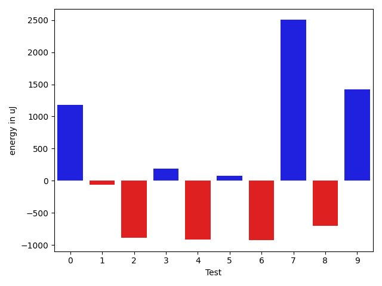

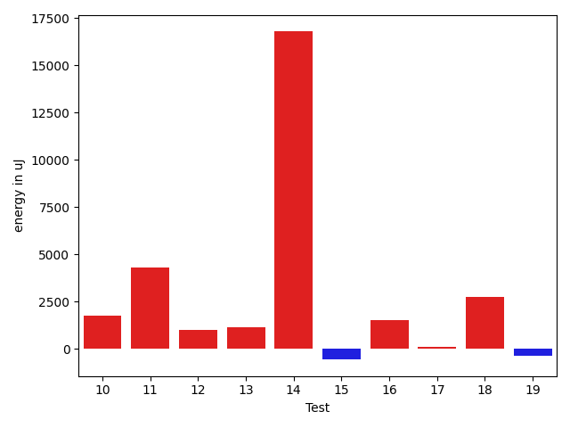

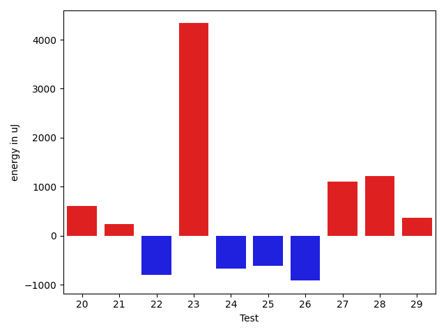

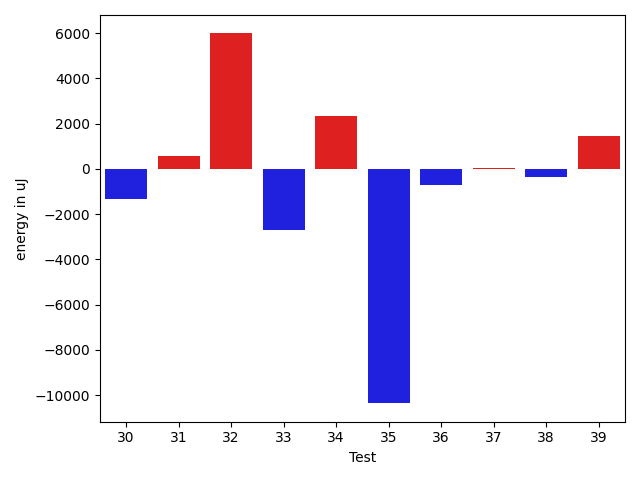

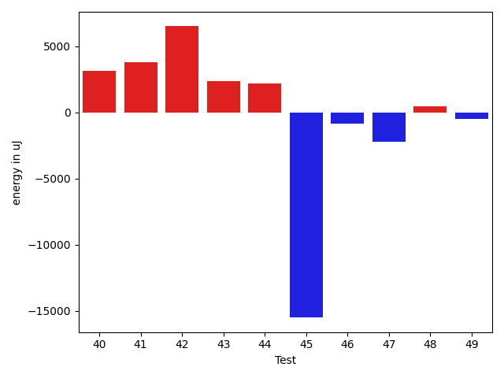

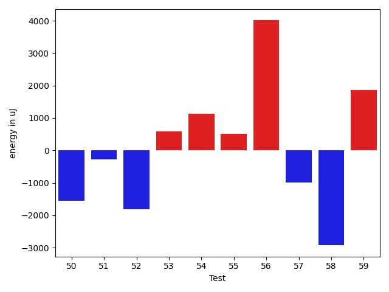

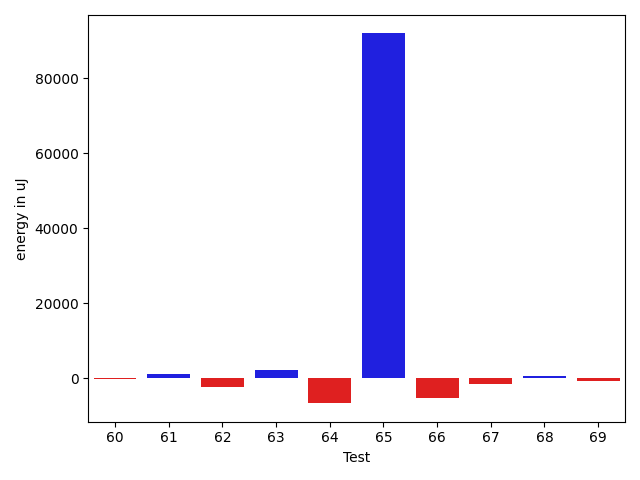

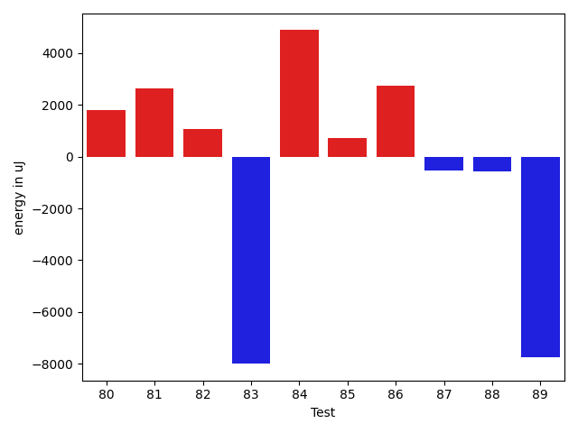

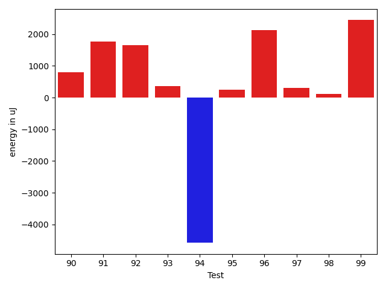

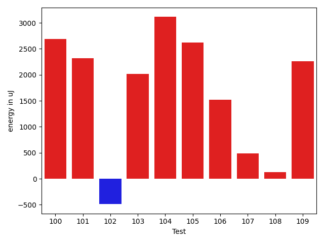

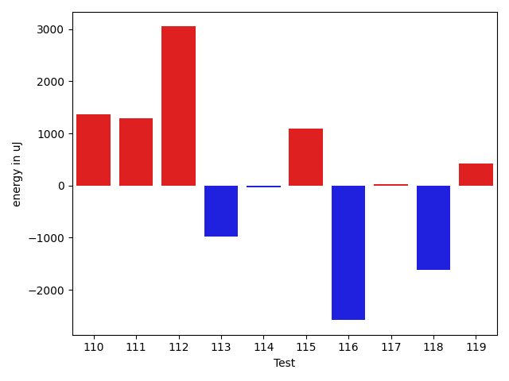

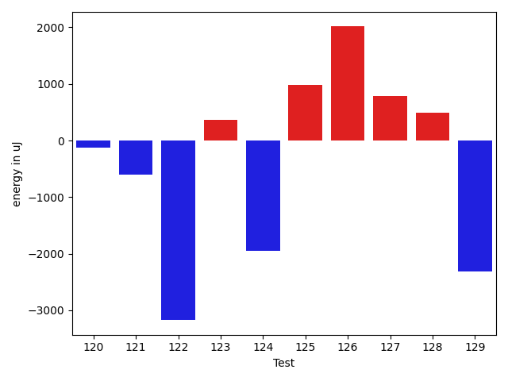

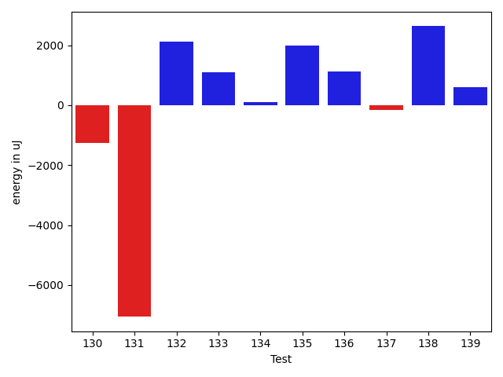

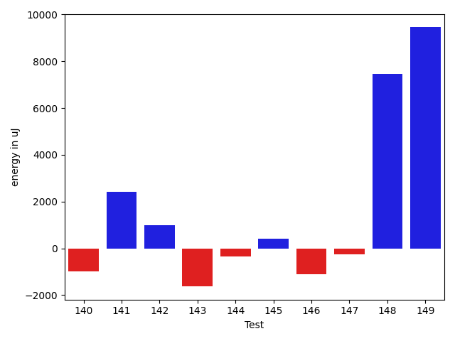

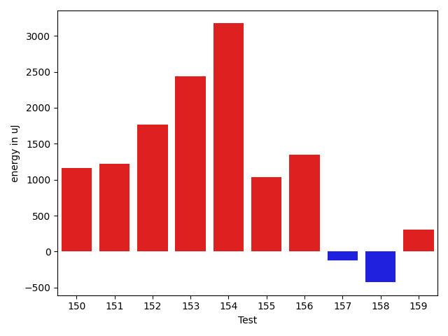

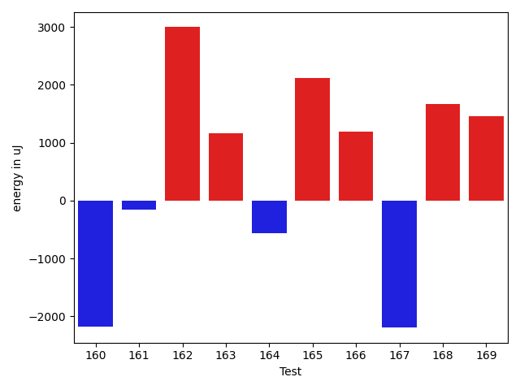

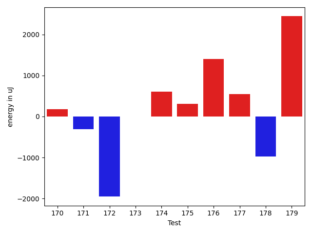

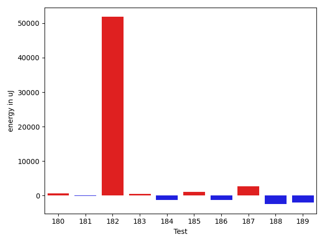

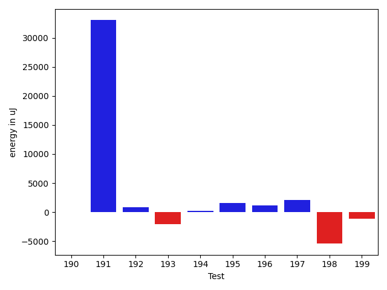

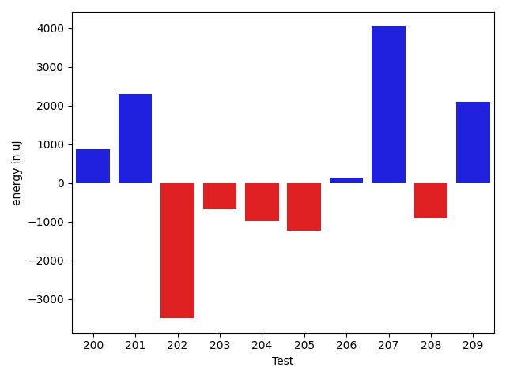

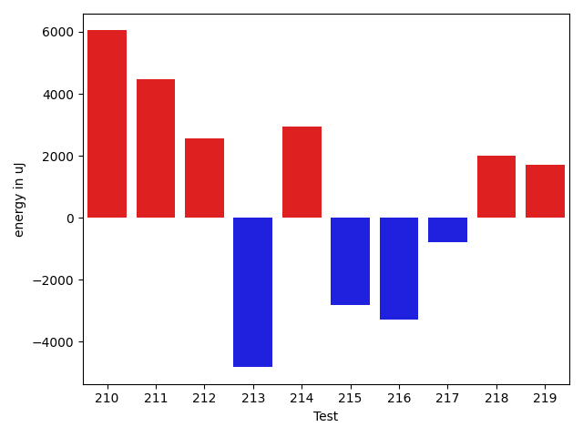

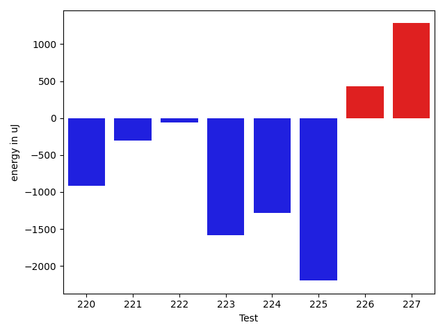

| ID | EnergyV1 | EnergyV2 | DeltaEnergy | σV1 | σV2 |
| --- | --- | --- | --- | --- | --- |
| 0 | 32140.8 | 33325.0 | 1184.2000000000007 | 2225.600988497264 | 0.0 |
| 1 | 38276.8064516129 | 38212.653846153844 | -64.15260545905767 | 4367.015408198401 | 4534.855598941872 |
| 2 | 39998.68 | 39115.791666666664 | -882.888333333336 | 8156.175712771274 | 6908.547766952466 |
| 3 | 40321.818181818184 | 40505.58823529412 | 183.77005347593513 | 6130.284685932499 | 3821.1820939541353 |
| 4 | 39678.40625 | 38761.48275862069 | -916.9234913793116 | 3569.480615749431 | 4440.639163536845 |
| 5 | 76166.79797979798 | 76244.38383838384 | 77.58585858586594 | 17925.61428218099 | 15767.064619686027 |
| 6 | 38935.35135135135 | 38008.58823529412 | -926.7631160572346 | 4827.633291880873 | 4805.617877379662 |
| 7 | 37986.045454545456 | 40488.666666666664 | 2502.6212121212084 | 6175.053532909454 | 5210.557786306995 |
| 8 | 38201.42105263158 | 37500.967741935485 | -700.4533106960953 | 3719.7913893939563 | 3354.751069885053 |
| 9 | 79283.17171717172 | 80708.61616161616 | 1425.444444444438 | 16085.098096955924 | 18477.768504973083 |
| 10 | 95783.04040404041 | 97525.26262626263 | 1742.222222222219 | 21454.755463494977 | 22898.084593084153 |
| 11 | 101522.77777777778 | 105831.61616161616 | 4308.838383838374 | 25984.895102462327 | 31415.648497513695 |
| 12 | 33467.333333333336 | 34464.333333333336 | 997.0 | 1147.7852102588222 | 926.0116389957285 |
| 13 | 38258.73333333333 | 39426.307692307695 | 1167.5743589743652 | 5042.369944998306 | 5019.563731956354 |
| 14 | 79943.8 | 96760.66666666667 | 16816.86666666667 | 19637.632814573146 | 822.2677314732849 |
| 15 | 37986.37037037037 | 37425.357142857145 | -561.0132275132273 | 3923.8671934349004 | 3859.260992491083 |
| 16 | 39450.77272727273 | 40987.0 | 1536.227272727272 | 4307.56383302904 | 5066.596832852074 |
| 17 | 39225.13333333333 | 39339.666666666664 | 114.53333333333285 | 7342.347647872731 | 4642.912552721861 |
| 18 | 39245.357142857145 | 41987.71428571428 | 2742.3571428571377 | 5661.579973913678 | 5034.535720239489 |
| 19 | 36743.05263157895 | 36389.13333333333 | -353.9192982456152 | 5257.102358500948 | 2991.052699115963 |
| 20 | 38187.6 | 38190.57142857143 | 2.971428571428987 | 4237.555801795811 | 5446.663299859908 |
| 21 | 39123.230769230766 | 40255.083333333336 | 1131.8525641025699 | 5707.670522454796 | 5112.731640364952 |
| 22 | 45719.607142857145 | 38586.705882352944 | -7132.901260504201 | 35000.19379368724 | 3751.197044469404 |
| 23 | 37793.291666666664 | 41406.2 | 3612.908333333333 | 3792.148220107422 | 3477.206703663157 |
| 24 | 32775.666666666664 | 32531.0 | -244.66666666666424 | 737.5347826072717 | 0.0 |
| 25 | 39640.03571428572 | 39374.2962962963 | -265.73941798941814 | 7026.604328662716 | 4984.314119870641 |
| 26 | 44459.34117647059 | 41796.135802469136 | -2663.2053740014526 | 27203.869958498417 | 11308.97529906627 |
| 27 | 85079.14141414141 | 88022.898989899 | 2943.7575757575833 | 37512.46180736062 | 37313.63590261106 |
| 28 | 38965.58823529412 | 40704.15 | 1738.5617647058825 | 4019.900965400305 | 3706.0388324328173 |
| 29 | 38952.4 | 39746.757575757576 | 794.3575757575745 | 4252.35382347236 | 4381.40564846283 |
| 30 | 39459.769230769234 | 38140.32432432433 | -1319.4449064449072 | 5000.274574314937 | 5333.6904877521765 |
| 31 | 39280.42857142857 | 39869.846153846156 | 589.4175824175836 | 4136.334477718724 | 4870.840897961505 |
| 32 | 68920.62857142858 | 74901.48648648648 | 5980.857915057903 | 79234.46901086338 | 96558.70237955141 |
| 33 | 43072.121212121216 | 40381.07894736842 | -2691.0422647527957 | 24111.79317107505 | 3785.2022707656474 |
| 34 | 38346.153846153844 | 40699.75862068965 | 2353.6047745358082 | 4544.070986480902 | 4315.822698214754 |
| 35 | 50456.46428571428 | 40102.42307692308 | -10354.041208791205 | 50657.84957259984 | 3976.7414876337457 |
| 36 | 43159.245614035084 | 42440.77777777778 | -718.4678362573031 | 14193.714024148963 | 10153.322571794595 |
| 37 | 39311.38 | 39354.14634146341 | 42.7663414634153 | 4178.809045122785 | 4441.886868684741 |
| 38 | 40166.698113207545 | 39807.67307692308 | -359.0250362844672 | 5996.060035273181 | 4749.265938101761 |
| 39 | 38587.43243243243 | 40021.35555555556 | 1433.9231231231242 | 5080.882587410995 | 3819.9502449089896 |
| 40 | 37599.142857142855 | 40728.46808510638 | 3129.325227963527 | 4871.919921596514 | 5421.161215997224 |
| 41 | 37029.9 | 40789.294117647056 | 3759.3941176470544 | 3804.4035831301253 | 3964.5702795801335 |
| 42 | 40095.04 | 46592.40740740741 | 6497.367407407408 | 3902.7522952911067 | 31278.545913511527 |
| 43 | 38172.730769230766 | 40510.41379310345 | 2337.6830238726834 | 5244.875275760523 | 3671.0950683943147 |
| 44 | 39182.0 | 41368.26829268293 | 2186.2682926829293 | 4771.853893753803 | 4756.127431801132 |
| 45 | 56463.89473684211 | 40952.45161290323 | -15511.44312393888 | 71613.99233676314 | 5191.209846173966 |
| 46 | 39810.15 | 38933.295454545456 | -876.8545454545456 | 5089.393183622189 | 4518.52956059594 |
| 47 | 44164.42253521127 | 41952.31884057971 | -2212.103694631558 | 12734.417270920356 | 11305.08024507637 |
| 48 | 39929.48275862069 | 40374.13559322034 | 444.6528345996485 | 4279.186102283774 | 4617.370021323596 |
| 49 | 40297.13461538462 | 39788.87804878049 | -508.2565666041264 | 3763.921405564058 | 5069.587769815175 |
| 50 | 48668.141304347824 | 47113.82978723404 | -1554.3115171137833 | 20124.1710369815 | 18643.143807136737 |
| 51 | 40264.282051282054 | 39977.9 | -286.382051282053 | 4298.554980507644 | 4527.667212815006 |
| 52 | 40448.5 | 38628.311111111114 | -1820.1888888888861 | 7211.778880761667 | 4533.2355176811 |
| 53 | 39326.15254237288 | 39914.73684210526 | 588.584299732378 | 7920.780122967171 | 6123.689684479494 |
| 54 | 39994.681818181816 | 41116.898305084746 | 1122.2164869029293 | 4421.746208809814 | 7104.692137069664 |
| 55 | 44581.7 | 45095.49230769231 | 513.7923076923107 | 13537.172530638947 | 14995.830550905785 |
| 56 | 40389.14473684211 | 44399.28 | 4010.135263157892 | 4628.3895224102 | 23761.670074616664 |
| 57 | 41265.34375 | 40269.8125 | -995.53125 | 6052.75897117058 | 4994.524905067923 |
| 58 | 44301.39344262295 | 41373.854838709674 | -2927.538603913279 | 35045.85589882589 | 9495.877276645995 |
| 59 | 82410.9574468085 | 84268.9375 | 1857.9800531914952 | 33698.445721122895 | 41703.806980201785 |
| 60 | 49741.2875 | 49512.48809523809 | -228.79940476190677 | 24048.56594851019 | 21458.81512810619 |
| 61 | 39220.62962962963 | 40281.06451612903 | 1060.4348864994026 | 5266.731189113541 | 5159.219901868661 |
| 62 | 43382.96153846154 | 40902.070175438595 | -2480.8913630229436 | 22767.816076276096 | 5121.9782563218 |
| 63 | 51326.333333333336 | 53407.59375 | 2081.2604166666642 | 19954.384898785753 | 22606.105711261083 |
| 64 | 47121.65217391304 | 40417.958333333336 | -6703.693840579705 | 37775.2208655917 | 4604.238115395845 |
| 65 | 81308.575 | 173262.28735632185 | 91953.71235632185 | 237194.68974403574 | 521502.1539478537 |
| 66 | 58576.85858585859 | 53168.30612244898 | -5408.552463409607 | 24144.867145104556 | 19952.880090510465 |
| 67 | 41343.38461538462 | 39882.31578947369 | -1461.0688259109302 | 10818.109852240728 | 8295.866590008807 |
| 68 | 39293.8125 | 39945.90909090909 | 652.0965909090883 | 4566.11961286719 | 4045.5804495218867 |
| 69 | 59539.704081632655 | 58688.59793814433 | -851.1061434883231 | 25114.388301110645 | 21983.329750067478 |
| 70 | 52893.822916666664 | 55216.47422680412 | 2322.6513101374585 | 20199.83165513329 | 20584.54374068617 |
| 71 | 60059.22619047619 | 44783.444444444445 | -15275.781746031746 | 49597.43070182817 | 27441.760850171853 |
| 72 | 74491.06060606061 | 73090.898989899 | -1400.1616161616112 | 33191.74692381998 | 31352.93726336182 |
| 73 | 46694.11392405063 | 44096.217948717946 | -2597.8959753326853 | 17161.35656538365 | 13849.294716511955 |
| 74 | 54350.720430107525 | 53443.79797979798 | -906.9224503095465 | 21784.66386934477 | 20683.695939477635 |
| 75 | 40254.361445783135 | 40849.09523809524 | 594.7337923121013 | 7658.0900912212155 | 8449.79944340615 |
| 76 | 41195.057971014496 | 42068.333333333336 | 873.27536231884 | 4291.678844110681 | 10189.041357153172 |
| 77 | 50497.65555555555 | 52915.97802197802 | 2418.322466422469 | 18762.954959269613 | 22838.78935417445 |
| 78 | 151919.21212121213 | 174264.77777777778 | 22345.565656565654 | 352652.35839357576 | 413533.70988445316 |
| 79 | 39080.88372093023 | 41302.7037037037 | 2221.8199827734716 | 4993.014246479669 | 5423.74287407325 |
| 80 | 39203.09090909091 | 41021.30952380953 | 1818.2186147186148 | 3978.1755401313267 | 4171.88268843933 |
| 81 | 40240.34042553192 | 42881.92 | 2641.57957446808 | 4220.4934937657445 | 4541.470118100525 |
| 82 | 40302.48780487805 | 41355.15217391304 | 1052.6643690349883 | 4244.671891838458 | 4770.024423268945 |
| 83 | 55163.98275862069 | 47162.76666666667 | -8001.216091954018 | 38195.90241314996 | 22369.093390484606 |
| 84 | 39557.30434782609 | 44444.73469387755 | 4887.430346051464 | 4418.297477878167 | 24695.776239520594 |
| 85 | 39760.098039215685 | 40473.56 | 713.4619607843124 | 3926.4054921043917 | 4510.515275043418 |
| 86 | 37408.5 | 40156.933333333334 | 2748.4333333333343 | 4929.402118918682 | 2708.346838120176 |
| 87 | 39944.72727272727 | 39403.35294117647 | -541.3743315508036 | 3844.3701125130333 | 4555.829864885811 |
| 88 | 37348.92857142857 | 36771.4 | -577.528571428571 | 3849.9575965064805 | 3281.390432931341 |
| 89 | 47369.04761904762 | 39615.23529411765 | -7753.812324929968 | 34801.16394533541 | 5384.592939220872 |
| 90 | 37529.41176470588 | 38040.1 | 510.6882352941175 | 3620.003592114297 | 4097.141966053898 |
| 91 | 38669.30508474576 | 39465.639344262294 | 796.3342595165304 | 3963.177022328567 | 3310.3483697254337 |
| 92 | 37091.831168831166 | 38577.5 | 1485.668831168834 | 4235.699661312955 | 6897.54780298364 |
| 93 | 45417.74545454545 | 39418.767857142855 | -5998.977597402598 | 23123.156341026846 | 9516.573222149782 |
| 94 | 39031.78571428572 | 35409.769230769234 | -3622.0164835164833 | 4306.507686522994 | 4822.081981784762 |
| 95 | 37571.61538461538 | 37048.18518518518 | -523.4301994302004 | 4103.105681881274 | 3143.1686422867283 |
| 96 | 37273.782608695656 | 38177.444444444445 | 903.6618357487896 | 4419.442183535224 | 3464.803509295252 |
| 97 | 39445.38888888889 | 38886.166666666664 | -559.2222222222263 | 3486.1415337317953 | 3379.798370876253 |
| 98 | 39059.72727272727 | 38289.380952380954 | -770.346320346318 | 4134.7740861867715 | 4860.932631229472 |
| 99 | 35522.27272727273 | 37902.705882352944 | 2380.4331550802162 | 4942.17975632227 | 4291.424249589569 |
| 100 | 35398.07407407407 | 37762.791666666664 | 2364.7175925925912 | 4065.0796896742286 | 3479.150063583138 |
| 101 | 39250.583333333336 | 39832.166666666664 | 581.5833333333285 | 4688.787449123233 | 4266.134553407543 |
| 102 | 39440.23809523809 | 45682.94117647059 | 6242.703081232496 | 4619.247577409756 | 28858.57179921864 |
| 103 | 38262.13888888889 | 39380.642857142855 | 1118.5039682539646 | 4309.976708836124 | 3406.984362141621 |
| 104 | 35537.6 | 39526.333333333336 | 3988.733333333337 | 3941.527805305958 | 2926.189209345303 |
| 105 | 35189.85 | 36206.71428571428 | 1016.864285714284 | 3971.4444510152725 | 5042.6916059435025 |
| 106 | 37225.2 | 38167.083333333336 | 941.8833333333387 | 3693.9031606147987 | 2928.3864572585967 |
| 107 | 37274.857142857145 | 38009.6875 | 734.8303571428551 | 5278.499243658762 | 4489.750852201461 |
| 108 | 37586.82352941176 | 38838.833333333336 | 1252.0098039215736 | 4984.354276844036 | 4418.500289188127 |
| 109 | 37593.41379310345 | 38786.05263157895 | 1192.6388384754973 | 4307.662263177425 | 4623.6075624956275 |
| 110 | 37151.86956521739 | 38516.05 | 1364.180434782611 | 4333.248237446662 | 2909.79910775641 |
| 111 | 34523.26315789474 | 35812.416666666664 | 1289.153508771924 | 3358.682398957024 | 3678.210376852973 |
| 112 | 36185.07142857143 | 39234.25 | 3049.1785714285725 | 5048.514413232099 | 3117.139504016463 |
| 113 | 37311.73684210526 | 36328.0 | -983.7368421052597 | 3927.0120668076875 | 3691.0100695247816 |
| 114 | 39615.22222222222 | 39574.444444444445 | -40.777777777773736 | 4414.7879973707 | 4096.968977484347 |
| 115 | 38860.3125 | 39953.46666666667 | 1093.1541666666672 | 4648.517367381104 | 2967.7500763298035 |
| 116 | 37462.357142857145 | 34881.7 | -2580.657142857148 | 5588.0330376253005 | 4997.113447781629 |
| 117 | 39820.52631578947 | 39840.75 | 20.2236842105267 | 5653.604442890915 | 4676.340416126696 |
| 118 | 39454.26315789474 | 37841.666666666664 | -1612.596491228076 | 3084.498762353204 | 3795.090910929832 |
| 119 | 38690.0 | 39112.181818181816 | 422.1818181818162 | 3444.8529431602738 | 2252.240937304315 |
| 120 | 38829.875 | 38761.125 | -68.75 | 3647.070517466724 | 5149.6163555526155 |
| 121 | 39015.454545454544 | 38579.90909090909 | -435.54545454545587 | 3570.3416786743733 | 3078.9366362296832 |
| 122 | 41259.71428571428 | 39374.38888888889 | -1885.325396825392 | 5987.187002598269 | 3574.3274758086995 |
| 123 | 37986.09090909091 | 37213.2 | -772.8909090909146 | 3979.7444745416296 | 2616.279258794825 |
| 124 | 53403.7 | 45612.64 | -7791.059999999998 | 39839.011165899516 | 30254.982747150923 |
| 125 | 38561.933333333334 | 37638.166666666664 | -923.7666666666701 | 3877.2712649777577 | 3122.3545825048263 |
| 126 | 37607.708333333336 | 38441.294117647056 | 833.5857843137201 | 3346.7347703790165 | 4276.059782841675 |
| 127 | 38578.769230769234 | 38836.117647058825 | 257.3484162895911 | 4177.70999387217 | 3588.352020280798 |
| 128 | 37344.642857142855 | 38350.47619047619 | 1005.8333333333358 | 3584.224455008022 | 3855.6245941919537 |
| 129 | 37439.41176470588 | 36828.6 | -610.8117647058825 | 4393.866702024052 | 3284.743862160336 |
| 130 | 39738.833333333336 | 38490.1875 | -1248.6458333333358 | 4394.7547302311295 | 4728.04247573388 |
| 131 | 43151.8 | 36095.22222222222 | -7056.577777777784 | 33355.187910728375 | 3541.431891129091 |
| 132 | 36076.38461538462 | 38204.23529411765 | 2127.8506787330334 | 5332.010885476533 | 4076.9154217865967 |
| 133 | 36597.13043478261 | 37691.46153846154 | 1094.331103678931 | 4709.053992547324 | 3791.0657242316156 |
| 134 | 36898.25 | 37007.666666666664 | 109.41666666666424 | 5033.545157656447 | 4354.387051307289 |
| 135 | 38129.357142857145 | 40110.166666666664 | 1980.8095238095193 | 5532.089848035252 | 4643.665341683825 |
| 136 | 36580.4 | 37716.954545454544 | 1136.5545454545427 | 4432.904026331573 | 4099.080445408932 |
| 137 | 37341.15 | 37178.78571428572 | -162.36428571428405 | 4215.875546965304 | 4593.985263030213 |
| 138 | 35617.6875 | 38250.85 | 2633.1624999999985 | 5250.282429531172 | 4031.3720403232446 |
| 139 | 36949.25 | 37553.09090909091 | 603.8409090909117 | 4082.418087053309 | 4932.355595352819 |
| 140 | 40854.72727272727 | 39876.26666666667 | -978.460606060602 | 4025.8235315818324 | 3023.3494112031153 |
| 141 | 37211.166666666664 | 39644.26666666667 | 2433.100000000006 | 4918.298737594355 | 3995.185710604981 |
| 142 | 37867.92857142857 | 38860.375 | 992.4464285714275 | 4199.446280919251 | 3272.2435131534758 |
| 143 | 41307.84210526316 | 39672.818181818184 | -1635.0239234449764 | 4916.931469965023 | 3895.0065892856346 |
| 144 | 37977.333333333336 | 37622.64705882353 | -354.6862745098042 | 3503.086860977837 | 4479.361298236436 |
| 145 | 38228.333333333336 | 38638.444444444445 | 410.1111111111095 | 3667.1777674088526 | 2902.9567727906933 |
| 146 | 37811.125 | 36721.357142857145 | -1089.767857142855 | 2908.981627541673 | 3737.972112697755 |
| 147 | 40879.28571428572 | 40610.38181818182 | -268.90389610389684 | 6715.839179332174 | 5221.639737201713 |
| 148 | 55391.41463414634 | 62841.31914893617 | 7449.904514789829 | 77596.62138231297 | 87172.2362806802 |
| 149 | 43089.788732394365 | 52554.82089552239 | 9465.032163128024 | 12503.038865446228 | 29469.52986924274 |
| 150 | 44421.529411764706 | 45322.857142857145 | 901.3277310924386 | 11433.784765031069 | 13836.196802007318 |
| 151 | 42228.239130434784 | 46066.53333333333 | 3838.294202898549 | 7732.282795231 | 16220.447786119294 |
| 152 | 67166.95348837209 | 75401.87719298246 | 8234.923704610366 | 76593.47500685515 | 90375.53228749512 |
| 153 | 71390.61616161616 | 72196.44444444444 | 805.8282828282827 | 27932.630356999125 | 23432.769642438783 |
| 154 | 48146.929824561405 | 51780.4406779661 | 3633.510853404696 | 30728.34379153087 | 30476.90423648211 |
| 155 | 49602.81176470588 | 47626.16049382716 | -1976.6512708787195 | 28998.90946042591 | 23004.155025901808 |
| 156 | 39786.57692307692 | 39965.07575757576 | 178.49883449883782 | 4224.784174488197 | 5179.95572787506 |
| 157 | 45453.354838709674 | 39918.96666666667 | -5534.388172043007 | 41254.54047116502 | 4805.648988314574 |
| 158 | 61406.06349206349 | 65392.90909090909 | 3986.845598845597 | 35766.59343571833 | 37006.53485498951 |
| 159 | 40648.275862068964 | 41105.769230769234 | 457.49336870027037 | 4612.141307586044 | 7955.176303745169 |
| 160 | 42414.2 | 40240.63636363636 | -2173.5636363636368 | 8638.452370650659 | 4551.085117480937 |
| 161 | 40544.5 | 40384.708333333336 | -159.79166666666424 | 4881.19602220018 | 5212.310807750937 |
| 162 | 36288.88888888889 | 39283.625 | 2994.7361111111095 | 3541.088923683236 | 3897.2393895390874 |
| 163 | 38248.6 | 39414.294117647056 | 1165.6941176470573 | 4778.332872456669 | 3568.667715890061 |
| 164 | 42151.52272727273 | 41582.69090909091 | -568.8318181818177 | 13124.162768948241 | 9174.528545474996 |
| 165 | 37959.666666666664 | 40081.230769230766 | 2121.5641025641016 | 3883.459362761792 | 4663.326530638933 |
| 166 | 38141.47826086957 | 39327.301886792455 | 1185.823625922887 | 4292.1663312067485 | 4330.4521293640255 |
| 167 | 41239.2 | 39045.72727272727 | -2193.472727272725 | 3740.1762204473735 | 3524.4702397770902 |
| 168 | 39107.31578947369 | 40775.846153846156 | 1668.5303643724692 | 4441.388403743652 | 4840.130733233648 |
| 169 | 40576.857142857145 | 42038.57142857143 | 1461.7142857142826 | 3392.1123533407726 | 3616.187239297748 |
| 170 | 40727.642857142855 | 41378.27777777778 | 650.634920634926 | 4173.954456030924 | 4725.613138413958 |
| 171 | 39825.912280701756 | 40017.220338983054 | 191.30805828129814 | 4857.768183965495 | 4820.6853091397525 |
| 172 | 40487.307692307695 | 40225.41818181818 | -261.88951048951276 | 5566.82127754203 | 5013.323113794461 |
| 173 | 42593.28333333333 | 41825.72580645161 | -767.5575268817192 | 12044.794904980972 | 7329.457670755632 |
| 174 | 40134.81034482759 | 44506.06896551724 | 4371.258620689652 | 4792.702860120814 | 30796.132469819837 |
| 175 | 168386.0985915493 | 139762.59722222222 | -28623.501369327074 | 485803.02702120127 | 449155.4607138843 |
| 176 | 41749.10909090909 | 43456.879310344826 | 1707.7702194357335 | 10288.330485064978 | 11631.884248697164 |
| 177 | 39513.07692307692 | 39847.171428571426 | 334.0945054945041 | 3227.6102963108897 | 4571.625328265738 |
| 178 | 39237.78125 | 39449.65517241379 | 211.87392241378984 | 5164.746374063148 | 6223.726488072505 |
| 179 | 40473.0 | 41534.5 | 1061.5 | 3810.3891703643117 | 4537.01283492627 |
| 180 | 37925.95238095238 | 39911.5 | 1985.5476190476184 | 4670.760358985008 | 5033.089013191191 |
| 181 | 39897.93103448276 | 39422.24137931035 | -475.68965517241304 | 4169.329276506404 | 4648.947531284105 |
| 182 | 441758.9898989899 | 489559.28282828286 | 47800.29292929295 | 158093.52224256538 | 169514.00741776204 |
| 183 | 54225.303797468354 | 57649.348314606745 | 3424.044517138391 | 21385.015784661904 | 27788.385729301994 |
| 184 | 52943.42622950819 | 52625.13114754098 | -318.29508196721144 | 36584.27451271388 | 47149.31348333731 |
| 185 | 40128.4 | 41492.333333333336 | 1363.9333333333343 | 4181.191172115642 | 8169.544888214739 |
| 186 | 49211.62857142857 | 46102.57692307692 | -3109.0516483516476 | 17242.523899750566 | 16188.044919662347 |
| 187 | 54189.78787878788 | 50831.382352941175 | -3358.405525846705 | 54661.79874783617 | 41132.69325503291 |
| 188 | 43477.26666666667 | 39724.85294117647 | -3752.4137254902016 | 6229.192231920782 | 4942.342771055949 |
| 189 | 42368.06451612903 | 39571.0 | -2797.0645161290304 | 4133.905947519179 | 4258.219189598707 |
| 190 | 41961.545454545456 | 41933.1724137931 | -28.373040752354427 | 3638.2772112794955 | 13700.183155254344 |
| 191 | 179364.59595959596 | 212406.0707070707 | 33041.47474747474 | 358421.435277386 | 483528.5160309117 |
| 192 | 40449.2 | 41309.351851851854 | 860.1518518518569 | 4312.354220144722 | 3920.0149525291517 |
| 193 | 194096.75757575757 | 192043.28282828283 | -2053.474747474742 | 54831.71510794282 | 57374.59404262808 |
| 194 | 41118.642857142855 | 41297.9 | 179.2571428571464 | 8584.399923064839 | 4460.632375571875 |
| 195 | 39781.434782608696 | 41387.645161290326 | 1606.2103786816297 | 4247.010742362997 | 4041.4097791639183 |
| 196 | 42015.44117647059 | 43159.21951219512 | 1143.7783357245353 | 2951.31298987194 | 4508.986758237458 |
| 197 | 39147.42424242424 | 41218.45 | 2071.025757575757 | 4289.334475680439 | 7763.730617267705 |
| 198 | 45893.529411764706 | 40470.52631578947 | -5423.003095975233 | 38686.860608978684 | 7030.108766359973 |
| 199 | 41259.653846153844 | 40176.21875 | -1083.435096153844 | 4684.153514714082 | 5204.570003458349 |
| 200 | 39295.36363636364 | 40162.234042553195 | 866.8704061895551 | 4476.602989132949 | 4660.421696803047 |
| 201 | 40042.64 | 42341.0 | 2298.3600000000006 | 5694.933234937878 | 9218.993171708069 |
| 202 | 48981.83561643836 | 45477.553846153845 | -3504.281770284513 | 24598.863498089406 | 17187.81965322292 |
| 203 | 41631.02857142857 | 40940.51612903226 | -690.5124423963134 | 4535.632049108256 | 4475.705486800774 |
| 204 | 42488.92857142857 | 41506.825 | -982.1035714285754 | 4058.507290059905 | 5061.9387732740315 |
| 205 | 42414.61538461538 | 41178.36363636364 | -1236.2517482517433 | 8651.181237310253 | 5751.7325654216775 |
| 206 | 41553.94117647059 | 41700.59090909091 | 146.64973262032436 | 4224.210186818614 | 3963.8803148968113 |
| 207 | 69724.33333333333 | 73773.05405405405 | 4048.720720720725 | 44729.77571099096 | 50431.54542918011 |
| 208 | 39293.42857142857 | 38391.0 | -902.4285714285725 | 3978.58116695397 | 4306.264261385834 |
| 209 | 39432.0 | 41526.8125 | 2094.8125 | 5724.42742063498 | 5173.672936352254 |
| 210 | 38238.38888888889 | 42110.3125 | 3871.9236111111095 | 3610.232866279602 | 4854.725078708757 |
| 211 | 39382.625 | 41011.4 | 1628.7750000000015 | 3045.622306586127 | 5224.770895136616 |
| 212 | 37121.4 | 39815.066666666666 | 2693.6666666666642 | 3794.86013444501 | 5605.367231105876 |
| 213 | 41664.72727272727 | 38257.19047619047 | -3407.5367965367986 | 4799.949016602517 | 4395.346062750676 |
| 214 | 37376.92307692308 | 40117.5 | 2740.576923076922 | 4946.61875910495 | 4998.695626289494 |
| 215 | 40278.86666666667 | 39324.7 | -954.1666666666715 | 3733.677255587163 | 3697.6879816988344 |
| 216 | 39993.0 | 37930.92307692308 | -2062.076923076922 | 4649.355304770759 | 4900.601602967326 |
| 217 | 40542.125 | 38953.88888888889 | -1588.2361111111095 | 4833.532699731636 | 4144.430183174748 |
| 218 | 39402.89473684211 | 40232.47826086957 | 829.583524027461 | 3800.523895945993 | 3676.221428132131 |
| 219 | 48847.53571428572 | 88583.92 | 39736.38428571428 | 41590.83301683724 | 97887.11984440855 |
| 220 | 39665.851851851854 | 41570.14705882353 | 1904.2952069716775 | 6362.312337063343 | 11105.428884724255 |
| 221 | 40982.53846153846 | 42572.967741935485 | 1590.4292803970238 | 6992.272505200455 | 9439.84353849244 |
| 222 | 43074.489795918365 | 42340.166666666664 | -734.3231292517012 | 10136.672978163122 | 7735.704968592786 |
| 223 | 199494.77272727274 | 64396.89189189189 | -135097.88083538084 | 542384.6940881396 | 45973.82920148997 |
| 224 | 41259.75 | 41576.9 | 317.15000000000146 | 6397.361554122657 | 3626.9184427003593 |
| 225 | 63562.37037037037 | 65077.84 | 1515.4696296296243 | 47352.952564011175 | 51759.68588287993 |
| 226 | 41102.642857142855 | 39884.230769230766 | -1218.4120879120892 | 4396.120426128065 | 5002.258000202681 |
| 227 | 47854.47457627119 | 47685.14893617021 | -169.3256401009785 | 36038.359546346255 | 20096.33414223951 |

## Delta Duration per test method

| ID | DurationV1 | DurationsV2 | DeltaDuration |
| --- | --- | --- | --- |
| 0 | 1010210.2 | 1041757.0 | 31546.800000000047 |
| 1 | 618168.4838709678 | 580334.7307692308 | -37833.753101737006 |
| 2 | 868125.22 | 892439.3958333334 | 24314.1758333334 |
| 3 | 478431.2727272727 | 489829.35294117645 | 11398.08021390374 |
| 4 | 551540.78125 | 531232.4827586206 | -20308.298491379363 |
| 5 | 2182573.131313131 | 2240548.707070707 | 57975.57575757569 |
| 6 | 595630.6756756756 | 599585.8235294118 | 3955.1478537361836 |
| 7 | 627508.8181818182 | 535854.4814814815 | -91654.33670033677 |
| 8 | 719880.8947368421 | 817724.9677419355 | 97844.07300509338 |
| 9 | 2258400.5353535353 | 2256268.5656565656 | -2131.969696969725 |
| 10 | 2690501.5353535353 | 2713107.3535353537 | 22605.81818181835 |
| 11 | 2887550.01010101 | 2937271.585858586 | 49721.57575757569 |
| 12 | 861309.3333333334 | 836612.3333333334 | -24697.0 |
| 13 | 683284.6666666666 | 579856.5384615385 | -103428.12820512813 |
| 14 | 2963992.8 | 2734341.0 | -229651.7999999998 |
| 15 | 744486.8518518518 | 763179.5892857143 | 18692.737433862523 |
| 16 | 438336.04545454547 | 475480.5333333333 | 37144.487878787855 |
| 17 | 757623.8333333334 | 732834.7916666666 | -24789.041666666744 |
| 18 | 465405.4285714286 | 469341.21428571426 | 3935.785714285681 |
| 19 | 344282.4736842105 | 392300.6666666667 | 48018.19298245618 |
| 20 | 360383.86666666664 | 330159.0 | -30224.86666666664 |
| 21 | 475238.92307692306 | 425817.0833333333 | -49421.83974358975 |
| 22 | 786248.9285714285 | 654736.0294117647 | -131512.89915966382 |
| 23 | 526032.8333333334 | 504033.15 | -21999.68333333335 |
| 24 | 732996.3333333334 | 652579.0 | -80417.33333333337 |
| 25 | 564513.1428571428 | 546940.0370370371 | -17573.10582010576 |
| 26 | 1215481.8352941177 | 1136939.2962962964 | -78542.53899782128 |
| 27 | 2428099.717171717 | 2472111.6464646463 | 44011.92929292936 |
| 28 | 400426.35294117645 | 427199.8 | 26773.44705882354 |
| 29 | 548384.0666666667 | 650645.8484848485 | 102261.78181818186 |
| 30 | 634793.7948717949 | 580083.5405405406 | -54710.254331254284 |
| 31 | 518186.14285714284 | 552288.7307692308 | 34102.58791208791 |
| 32 | 1640412.6285714286 | 1750560.3513513512 | 110147.72277992265 |
| 33 | 763114.9090909091 | 724381.9210526316 | -38732.988038277486 |
| 34 | 427802.8846153846 | 639794.9655172414 | 211992.08090185677 |
| 35 | 828870.7142857143 | 486164.23076923075 | -342706.48351648357 |
| 36 | 910816.5614035088 | 991852.1666666666 | 81035.60526315786 |
| 37 | 767955.82 | 876143.1219512195 | 108187.30195121956 |
| 38 | 883930.6981132076 | 906575.9423076923 | 22645.244194484665 |
| 39 | 715735.4054054054 | 686854.8444444444 | -28880.56096096104 |
| 40 | 779220.6 | 787958.4042553192 | 8737.804255319177 |
| 41 | 510317.0333333333 | 590929.2058823529 | 80612.17254901957 |
| 42 | 495722.92 | 686082.074074074 | 190359.15407407406 |
| 43 | 560648.3846153846 | 616293.5862068966 | 55645.201591511955 |
| 44 | 589870.4166666666 | 565939.731707317 | -23930.68495934957 |
| 45 | 1115581.3157894737 | 591857.5806451613 | -523723.7351443124 |
| 46 | 729554.125 | 742648.8181818182 | 13094.693181818235 |
| 47 | 1162229.2535211267 | 1040716.768115942 | -121512.48540518468 |
| 48 | 923708.7068965518 | 936802.406779661 | 13093.699883109191 |
| 49 | 712383.0192307692 | 685689.0975609756 | -26693.921669793664 |
| 50 | 1379605.1630434783 | 1282271.3404255318 | -97333.82261794643 |
| 51 | 716924.5641025641 | 685021.8 | -31902.764102564077 |
| 52 | 841644.9375 | 716634.3333333334 | -125010.60416666663 |
| 53 | 1014253.1186440678 | 916559.350877193 | -97693.76776687475 |
| 54 | 813517.8181818182 | 842581.9830508474 | 29064.16486902919 |
| 55 | 1135918.2285714287 | 1081907.6769230769 | -54010.55164835183 |
| 56 | 1080336.4342105263 | 1099406.8133333332 | 19070.379122806946 |
| 57 | 775528.59375 | 738450.21875 | -37078.375 |
| 58 | 1021586.0163934426 | 967823.5322580645 | -53762.48413537815 |
| 59 | 2287124.436170213 | 2331450.9270833335 | 44326.490913120564 |
| 60 | 1422970.2375 | 1342564.357142857 | -80405.880357143 |
| 61 | 581847.925925926 | 672711.6774193548 | 90863.75149342883 |
| 62 | 1026709.5961538461 | 895007.3157894737 | -131702.28036437242 |
| 63 | 979585.7333333333 | 1189081.5 | 209495.76666666672 |
| 64 | 858709.1739130435 | 534740.8333333334 | -323968.3405797101 |
| 65 | 2307908.325 | 5189266.045977011 | 2881357.720977011 |
| 66 | 1685622.4242424243 | 1608715.7142857143 | -76906.70995671 |
| 67 | 1083264.8717948718 | 1010855.3157894737 | -72409.55600539804 |
| 68 | 731935.7916666666 | 851530.1363636364 | 119594.34469696973 |
| 69 | 1751925.693877551 | 1664971.3092783506 | -86954.38459920045 |
| 70 | 1630862.0833333333 | 1582410.2783505155 | -48451.80498281773 |
| 71 | 1759902.011904762 | 1326924.5 | -432977.5119047619 |
| 72 | 2185901.2525252528 | 2074379.7676767677 | -111521.4848484851 |
| 73 | 1241782.5443037974 | 1203891.3333333333 | -37891.21097046416 |
| 74 | 1689467.6451612904 | 1563814.808080808 | -125652.8370804824 |
| 75 | 1188032.3493975904 | 1145353.119047619 | -42679.23034997145 |
| 76 | 986528.3623188406 | 993740.8055555555 | 7212.4432367149275 |
| 77 | 1449636.6555555556 | 1527401.1098901099 | 77764.45433455426 |
| 78 | 4316162.333333333 | 5012823.333333333 | 696661.0 |
| 79 | 880434.3720930233 | 809004.1296296297 | -71430.2424633936 |
| 80 | 713879.2121212122 | 716686.9047619047 | 2807.6926406925777 |
| 81 | 701191.0425531915 | 731226.7 | 30035.657446808415 |
| 82 | 634608.0 | 670835.1521739131 | 36227.152173913084 |
| 83 | 1338775.9655172413 | 1145999.9333333333 | -192776.03218390793 |
| 84 | 712885.5434782609 | 990589.0204081633 | 277703.47692990245 |
| 85 | 780350.8039215687 | 823150.44 | 42799.63607843127 |
| 86 | 422561.8 | 336854.5333333333 | -85707.26666666666 |
| 87 | 391048.0 | 423937.29411764705 | 32889.29411764705 |
| 88 | 309609.14285714284 | 353086.5333333333 | 43477.390476190485 |
| 89 | 550960.3333333334 | 419038.4117647059 | -131921.92156862747 |
| 90 | 300561.0588235294 | 339517.95 | 38956.89117647061 |
| 91 | 825667.9152542372 | 830327.9016393443 | 4659.98638510704 |
| 92 | 913107.8961038961 | 917461.2777777778 | 4353.381673881668 |
| 93 | 1033176.1272727273 | 826038.3392857143 | -207137.787987013 |
| 94 | 354858.28571428574 | 357394.3076923077 | 2536.0219780219486 |
| 95 | 389240.1153846154 | 372663.48148148146 | -16576.633903133916 |
| 96 | 457857.9130434783 | 393447.8333333333 | -64410.07971014496 |
| 97 | 390118.0 | 362077.77777777775 | -28040.222222222248 |
| 98 | 455633.9090909091 | 437436.61904761905 | -18197.290043290064 |
| 99 | 352971.36363636365 | 332320.82352941175 | -20650.5401069519 |
| 100 | 474433.2962962963 | 427162.6666666667 | -47270.629629629606 |
| 101 | 388086.0833333333 | 373216.8888888889 | -14869.194444444438 |
| 102 | 407056.28571428574 | 684747.5882352941 | 277691.30252100836 |
| 103 | 588739.7222222222 | 538375.2857142857 | -50364.43650793657 |
| 104 | 866082.0 | 307947.6666666667 | -558134.3333333333 |
| 105 | 374226.8 | 365893.35714285716 | -8333.442857142829 |
| 106 | 308024.0 | 295134.4166666667 | -12889.583333333314 |
| 107 | 381061.9285714286 | 425029.875 | 43967.94642857142 |
| 108 | 543654.8235294118 | 458079.3333333333 | -85575.49019607849 |
| 109 | 463916.5517241379 | 426666.6842105263 | -37249.86751361162 |
| 110 | 477310.8695652174 | 398397.3 | -78913.56956521742 |
| 111 | 350785.3157894737 | 349935.0 | -850.3157894737087 |
| 112 | 340635.21428571426 | 308274.0625 | -32361.15178571426 |
| 113 | 340866.6842105263 | 350427.6666666667 | 9560.982456140395 |
| 114 | 386331.27777777775 | 348152.44444444444 | -38178.833333333314 |
| 115 | 404489.4375 | 386063.6666666667 | -18425.770833333314 |
| 116 | 341917.4285714286 | 301028.2 | -40889.22857142857 |
| 117 | 497559.6842105263 | 371739.8125 | -125819.87171052629 |
| 118 | 356446.7368421053 | 361654.4666666667 | 5207.729824561393 |
| 119 | 341097.2 | 335275.36363636365 | -5821.836363636365 |
| 120 | 399786.0 | 375155.6875 | -24630.3125 |
| 121 | 374287.2727272727 | 421459.0909090909 | 47171.81818181818 |
| 122 | 535785.3571428572 | 384550.44444444444 | -151234.91269841272 |
| 123 | 452734.36363636365 | 401087.8 | -51646.56363636366 |
| 124 | 1036535.0666666667 | 720010.84 | -316524.2266666667 |
| 125 | 341296.8 | 302803.8333333333 | -38492.966666666674 |
| 126 | 383001.375 | 420522.0 | 37520.625 |
| 127 | 431042.8461538461 | 364342.8823529412 | -66699.96380090492 |
| 128 | 424224.78571428574 | 355861.2380952381 | -68363.54761904763 |
| 129 | 317962.76470588235 | 352263.2 | 34300.43529411766 |
| 130 | 384182.5833333333 | 387601.375 | 3418.791666666686 |
| 131 | 712619.05 | 385573.55555555556 | -327045.4944444445 |
| 132 | 335989.0 | 299538.4117647059 | -36450.5882352941 |
| 133 | 354553.17391304346 | 356292.6923076923 | 1739.5183946488542 |
| 134 | 501333.0 | 479065.51851851854 | -22267.48148148146 |
| 135 | 371201.78571428574 | 364107.9166666667 | -7093.869047619053 |
| 136 | 379787.93333333335 | 341997.54545454547 | -37790.38787878788 |
| 137 | 361119.35 | 336971.78571428574 | -24147.564285714237 |
| 138 | 419052.875 | 380781.25 | -38271.625 |
| 139 | 361127.0 | 351212.63636363635 | -9914.363636363647 |
| 140 | 441766.8181818182 | 451226.26666666666 | 9459.448484848486 |
| 141 | 356385.5833333333 | 429917.6 | 73532.01666666666 |
| 142 | 356695.64285714284 | 339389.4375 | -17306.20535714284 |
| 143 | 465672.5789473684 | 459058.4090909091 | -6614.16985645931 |
| 144 | 370142.3333333333 | 351559.0 | -18583.333333333314 |
| 145 | 432035.1666666667 | 422932.44444444444 | -9102.722222222248 |
| 146 | 410125.625 | 356125.64285714284 | -53999.98214285716 |
| 147 | 914934.8392857143 | 889629.8181818182 | -25305.021103896084 |
| 148 | 1133556.975609756 | 1322519.2127659575 | 188962.2371562014 |
| 149 | 1169616.1971830986 | 1352488.2537313432 | 182872.05654824455 |
| 150 | 1134462.0784313725 | 1123908.2857142857 | -10553.79271708685 |
| 151 | 933311.3478260869 | 954489.6444444444 | 21178.296618357534 |
| 152 | 1733294.6511627906 | 1808350.596491228 | 75055.94532843749 |
| 153 | 1933082.6565656567 | 1956026.2727272727 | 22943.616161616053 |
| 154 | 1176179.8421052631 | 1239163.8644067796 | 62984.022301516496 |
| 155 | 1455449.2588235294 | 1328224.8148148148 | -127224.44400871452 |
| 156 | 898898.2307692308 | 893420.7878787878 | -5477.442890442908 |
| 157 | 1012510.0967741936 | 898788.65 | -113721.44677419355 |
| 158 | 1642868.126984127 | 1602823.5454545454 | -40044.58152958169 |
| 159 | 829223.775862069 | 858487.3461538461 | 29263.57029177714 |
| 160 | 895111.4571428571 | 865399.3333333334 | -29712.123809523764 |
| 161 | 508010.3214285714 | 585550.8333333334 | 77540.51190476195 |
| 162 | 489916.44444444444 | 439797.5 | -50118.94444444444 |
| 163 | 447453.93333333335 | 393864.4705882353 | -53589.46274509805 |
| 164 | 1164055.6363636365 | 1139879.8363636364 | -24175.800000000047 |
| 165 | 533402.9333333333 | 442641.76923076925 | -90761.1641025641 |
| 166 | 785765.804347826 | 808467.8490566037 | 22702.044708777685 |
| 167 | 410670.06666666665 | 421692.1818181818 | 11022.115151515172 |
| 168 | 539514.2105263158 | 532111.1538461539 | -7403.056680161972 |
| 169 | 492380.85714285716 | 516363.95238095237 | 23983.095238095208 |
| 170 | 424829.5714285714 | 424486.8333333333 | -342.7380952381063 |
| 171 | 873786.5263157894 | 879900.5762711865 | 6114.049955397029 |
| 172 | 979927.75 | 968709.7454545455 | -11218.004545454518 |
| 173 | 966227.0 | 960149.5 | -6077.5 |
| 174 | 875115.7413793104 | 981561.8103448276 | 106446.06896551722 |
| 175 | 4906210.112676056 | 3976058.861111111 | -930151.2515649451 |
| 176 | 996164.2363636363 | 1044312.1724137932 | 48147.93605015683 |
| 177 | 525677.4230769231 | 584801.8571428572 | 59124.43406593404 |
| 178 | 670485.90625 | 808066.6896551724 | 137580.7834051724 |
| 179 | 551403.2222222222 | 666139.6428571428 | 114736.42063492059 |
| 180 | 556466.380952381 | 593844.5882352941 | 37378.20728291315 |
| 181 | 539272.1034482758 | 675104.5172413794 | 135832.41379310354 |
| 182 | 11337171.737373738 | 12562215.151515152 | 1225043.4141414147 |
| 183 | 1512333.5569620254 | 1555028.0449438202 | 42694.48798179487 |
| 184 | 1293949.0163934426 | 1337745.9180327868 | 43796.90163934417 |
| 185 | 805206.5111111111 | 817537.9166666666 | 12331.40555555548 |
| 186 | 1272620.3142857142 | 1234599.5256410257 | -38020.78864468844 |
| 187 | 1138471.8181818181 | 954285.9411764706 | -184185.87700534752 |
| 188 | 832711.4666666667 | 742534.1470588235 | -90177.31960784318 |
| 189 | 633652.6774193548 | 578508.8484848485 | -55143.82893450628 |
| 190 | 657336.1818181818 | 723299.9655172414 | 65963.78369905963 |
| 191 | 4931838.373737373 | 5882856.202020202 | 951017.8282828284 |
| 192 | 806951.3 | 804630.4444444445 | -2320.8555555555504 |
| 193 | 5146049.636363637 | 5144670.171717172 | -1379.464646465145 |
| 194 | 782614.8333333334 | 804413.8 | 21798.966666666674 |
| 195 | 546204.8260869565 | 514129.93548387097 | -32074.890603085572 |
| 196 | 755607.3235294118 | 822719.9756097561 | 67112.65208034427 |
| 197 | 677048.1818181818 | 726539.275 | 49491.09318181826 |
| 198 | 991214.2352941176 | 919619.9649122807 | -71594.27038183692 |
| 199 | 710126.6923076923 | 782875.4375 | 72748.74519230775 |
| 200 | 741299.0227272727 | 852631.7021276596 | 111332.67940038687 |
| 201 | 966441.7 | 961131.5833333334 | -5310.116666666581 |
| 202 | 1171869.6712328766 | 1075427.2461538462 | -96442.42507903045 |
| 203 | 796181.6 | 735487.8064516129 | -60693.793548387126 |
| 204 | 655228.4285714285 | 751916.65 | 96688.2214285715 |
| 205 | 722757.8974358974 | 732368.9393939395 | 9611.041958042071 |
| 206 | 501204.9411764706 | 540932.9090909091 | 39727.96791443846 |
| 207 | 1677036.0666666667 | 1746434.6486486488 | 69398.5819819821 |
| 208 | 445786.0714285714 | 378932.6111111111 | -66853.4603174603 |
| 209 | 640531.9411764706 | 663230.875 | 22698.933823529398 |
| 210 | 349564.0 | 425446.125 | 75882.125 |
| 211 | 420111.25 | 402917.93333333335 | -17193.31666666665 |
| 212 | 470973.7 | 399048.73333333334 | -71924.96666666667 |
| 213 | 407474.1818181818 | 421713.8095238095 | 14239.627705627703 |
| 214 | 415421.3076923077 | 379063.14285714284 | -36358.16483516485 |
| 215 | 436092.86666666664 | 382288.2 | -53804.66666666663 |
| 216 | 383882.5 | 393566.6153846154 | 9684.115384615376 |
| 217 | 446741.125 | 377576.1666666667 | -69164.95833333331 |
| 218 | 485410.84210526315 | 463101.04347826086 | -22309.79862700228 |
| 219 | 700741.6071428572 | 2388379.48 | 1687637.8728571427 |
| 220 | 754358.7037037037 | 715807.5294117647 | -38551.17429193901 |
| 221 | 557117.5769230769 | 752367.0967741936 | 195249.5198511167 |
| 222 | 891444.1020408163 | 977434.3518518518 | 85990.24981103546 |
| 223 | 5794679.393939394 | 1608981.6081081082 | -4185697.7858312856 |
| 224 | 453234.1666666667 | 442779.65 | -10454.516666666663 |
| 225 | 1336225.5555555555 | 1556641.04 | 220415.48444444453 |
| 226 | 475918.64285714284 | 469943.23076923075 | -5975.412087912089 |
| 227 | 1201372.186440678 | 1178959.7659574468 | -22412.42048323131 |

## Misc.

| ID | Test Class | Test Method |
| --- | --- | --- |
| 0 | com.google.gson.functional.DefaultTypeAdaptersTest | testDefaultJavaSqlTimestampDeserialization |
| 1 | com.google.gson.functional.DefaultTypeAdaptersTest | testBadValueForBigDecimalDeserialization |
| 2 | com.google.gson.functional.DefaultTypeAdaptersTest | testBitSetDeserialization |
| 3 | com.google.gson.functional.DefaultTypeAdaptersTest | testUuidDeserialization |
| 4 | com.google.gson.functional.DefaultTypeAdaptersTest | testDefaultGregorianCalendarDeserialization |
| 5 | com.google.gson.functional.DefaultTypeAdaptersTest | testSqlDateSerialization |
| 6 | com.google.gson.functional.DefaultTypeAdaptersTest | testBigIntegerFieldDeserialization |
| 7 | com.google.gson.functional.DefaultTypeAdaptersTest | testUrlNullDeserialization |
| 8 | com.google.gson.functional.DefaultTypeAdaptersTest | testPropertiesDeserialization |
| 9 | com.google.gson.functional.DefaultTypeAdaptersTest | testTimestampSerialization |
| 10 | com.google.gson.functional.DefaultTypeAdaptersTest | testDateDeserializationWithPattern |
| 11 | com.google.gson.functional.DefaultTypeAdaptersTest | testDateSerializationInCollection |
| 12 | com.google.gson.functional.DefaultTypeAdaptersTest | testDefaultJavaSqlDateDeserialization |
| 13 | com.google.gson.functional.DefaultTypeAdaptersTest | testBigDecimalFieldDeserialization |
| 14 | com.google.gson.functional.DefaultTypeAdaptersTest | testDefaultDateDeserialization |
| 15 | com.google.gson.functional.DefaultTypeAdaptersTest | testTreeSetDeserialization |
| 16 | com.google.gson.functional.DefaultTypeAdaptersTest | testLocaleDeserializationWithLanguageCountry |
| 17 | com.google.gson.functional.DefaultTypeAdaptersTest | testUrlDeserialization |
| 18 | com.google.gson.functional.DefaultTypeAdaptersTest | testLocaleDeserializationWithLanguage |
| 19 | com.google.gson.functional.DefaultTypeAdaptersTest | testStringBuilderDeserialization |
| 20 | com.google.gson.functional.DefaultTypeAdaptersTest | testStringBufferDeserialization |
| 21 | com.google.gson.functional.DefaultTypeAdaptersTest | testLocaleDeserializationWithLanguageCountryVariant |
| 22 | com.google.gson.functional.DefaultTypeAdaptersTest | testDefaultCalendarDeserialization |
| 23 | com.google.gson.functional.DefaultTypeAdaptersTest | testUriDeserialization |
| 24 | com.google.gson.functional.DefaultTypeAdaptersTest | testDefaultJavaSqlTimeDeserialization |
| 25 | com.google.gson.functional.ObjectTest | testNullObjectFieldsDeserialization |
| 26 | com.google.gson.functional.ObjectTest | testEmptyCollectionInAnObjectDeserialization |
| 27 | com.google.gson.functional.ObjectTest | testSingletonLists |
| 28 | com.google.gson.functional.ObjectTest | testClassWithNoFieldsDeserialization |
| 29 | com.google.gson.functional.ObjectTest | testClassWithTransientFieldsDeserialization |
| 30 | com.google.gson.functional.ObjectTest | testPrimitiveArrayInAnObjectDeserialization |
| 31 | com.google.gson.functional.ObjectTest | testObjectFieldNamesWithoutQuotesDeserialization |
| 32 | com.google.gson.functional.ObjectTest | testJsonInSingleQuotesDeserialization |
| 33 | com.google.gson.functional.ObjectTest | testNullFieldsDeserialization |
| 34 | com.google.gson.functional.ObjectTest | testStringFieldWithEmptyValueDeserialization |
| 35 | com.google.gson.functional.ObjectTest | testNullArraysDeserialization |
| 36 | com.google.gson.functional.ObjectTest | testTruncatedDeserialization |
| 37 | com.google.gson.functional.ObjectTest | testInnerClassDeserialization |
| 38 | com.google.gson.functional.ObjectTest | testArrayOfArraysDeserialization |
| 39 | com.google.gson.functional.ObjectTest | testArrayOfObjectsDeserialization |
| 40 | com.google.gson.functional.ObjectTest | testNestedDeserialization |
| 41 | com.google.gson.functional.ObjectTest | testBagOfPrimitiveWrappersDeserialization |
| 42 | com.google.gson.functional.ObjectTest | testPrivateNoArgConstructorDeserialization |
| 43 | com.google.gson.functional.ObjectTest | testClassWithTransientFieldsDeserializationTransientFieldsPassedInJsonAreIgnored |
| 44 | com.google.gson.functional.ObjectTest | testJsonInMixedQuotesDeserialization |
| 45 | com.google.gson.functional.ObjectTest | testBagOfPrimitivesDeserialization |
| 46 | com.google.gson.functional.CollectionTest | testNullsInListDeserialization |
| 47 | com.google.gson.functional.CollectionTest | testFieldIsArrayList |
| 48 | com.google.gson.functional.CollectionTest | testTopLevelCollectionOfIntegersDeserialization |
| 49 | com.google.gson.functional.CollectionTest | testLinkedListDeserialization |
| 50 | com.google.gson.functional.CollectionTest | testWildcardCollectionField |
| 51 | com.google.gson.functional.CollectionTest | testCollectionOfStringsDeserialization |
| 52 | com.google.gson.functional.CollectionTest | testWildcardPrimitiveCollectionDeserilaization |
| 53 | com.google.gson.functional.CollectionTest | testSetDeserialization |
| 54 | com.google.gson.functional.CollectionTest | testTopLevelListOfIntegerCollectionsDeserialization |
| 55 | com.google.gson.functional.ReadersWritersTest | testReadWriteTwoObjects |
| 56 | com.google.gson.functional.ReadersWritersTest | testReadWriteTwoStrings |
| 57 | com.google.gson.functional.ReadersWritersTest | testReaderForDeserialization |
| 58 | com.google.gson.functional.EnumTest | testEnumSubclassAsParameterizedType |
| 59 | com.google.gson.functional.EnumTest | testEnumSubclass |
| 60 | com.google.gson.functional.EnumTest | testEnumSubclassWithRegisteredTypeAdapter |
| 61 | com.google.gson.functional.EnumTest | testTopLevelEnumDeserialization |
| 62 | com.google.gson.functional.EnumTest | testCollectionOfEnumsDeserialization |
| 63 | com.google.gson.functional.EnumTest | testClassWithEnumFieldDeserialization |
| 64 | com.google.gson.functional.EnumTest | testTopLevelEnumInASingleElementArrayDeserialization |
| 65 | com.google.gson.JsonParserTest | testReadWriteTwoObjects |
| 66 | com.google.gson.functional.ParameterizedTypesTest | testVariableTypeArrayDeserialization |
| 67 | com.google.gson.functional.ParameterizedTypesTest | testParameterizedTypeWithReaderDeserialization |
| 68 | com.google.gson.functional.ParameterizedTypesTest | testDeepParameterizedTypeDeserialization |
| 69 | com.google.gson.functional.ParameterizedTypesTest | testVariableTypeDeserialization |
| 70 | com.google.gson.functional.ParameterizedTypesTest | testParameterizedTypeGenericArraysDeserialization |
| 71 | com.google.gson.functional.ParameterizedTypesTest | testParameterizedTypeDeserialization |
| 72 | com.google.gson.functional.ParameterizedTypesTest | testVariableTypeFieldsAndGenericArraysDeserialization |
| 73 | com.google.gson.functional.ParameterizedTypesTest | testTypesWithMultipleParametersDeserialization |
| 74 | com.google.gson.functional.ParameterizedTypesTest | testParameterizedTypeWithVariableTypeDeserialization |
| 75 | com.google.gson.functional.ParameterizedTypesTest | testParameterizedTypesWithCustomDeserializer |
| 76 | com.google.gson.functional.TypeVariableTest | testBasicTypeVariables |
| 77 | com.google.gson.functional.TypeVariableTest | testAdvancedTypeVariables |
| 78 | com.google.gson.functional.TypeVariableTest | testTypeVariablesViaTypeParameter |
| 79 | com.google.gson.functional.MapTest | testMapOfMapDeserialization |
| 80 | com.google.gson.functional.MapTest | testMapDeserializationWithNullKey |
| 81 | com.google.gson.functional.MapTest | testMapDeserialization |
| 82 | com.google.gson.functional.MapTest | testMapDeserializationEmpty |
| 83 | com.google.gson.functional.MapTest | testMapStandardSubclassDeserialization |
| 84 | com.google.gson.functional.MapTest | testReadMapsWithEmptyStringKey |
| 85 | com.google.gson.functional.MapTest | testMapDeserializationWithWildcardValues |
| 86 | com.google.gson.functional.PrimitiveTest | testBigDecimalInfinityDeserializationNotSupported |
| 87 | com.google.gson.functional.PrimitiveTest | testDoubleNaNDeserialization |
| 88 | com.google.gson.functional.PrimitiveTest | testDeserializeJsonArrayAsByteWrapper |
| 89 | com.google.gson.functional.PrimitiveTest | testBigDecimalNoFractAsStringRepresentationDeserialization |
| 90 | com.google.gson.functional.PrimitiveTest | testDeserializeJsonObjectAsInteger |
| 91 | com.google.gson.functional.PrimitiveTest | testByteDeserialization |
| 92 | com.google.gson.functional.PrimitiveTest | testValueVeryCloseToZeroIsZero |
| 93 | com.google.gson.functional.PrimitiveTest | testDeserializePrimitiveWrapperAsObjectField |
| 94 | com.google.gson.functional.PrimitiveTest | testDeserializeJsonArrayAsBigDecimal |
| 95 | com.google.gson.functional.PrimitiveTest | testDeserializingBigIntegerAsInteger |
| 96 | com.google.gson.functional.PrimitiveTest | testDeserializingBigIntegerAsLong |
| 97 | com.google.gson.functional.PrimitiveTest | testDeserializeJsonObjectAsLongPrimitive |
| 98 | com.google.gson.functional.PrimitiveTest | testBigIntegerDeserialization |
| 99 | com.google.gson.functional.PrimitiveTest | testDeserializeJsonObjectAsBooleanPrimitive |
| 100 | com.google.gson.functional.PrimitiveTest | testDeserializingBigIntegerAsBigDecimal |
| 101 | com.google.gson.functional.PrimitiveTest | testFloatInfinityDeserialization |
| 102 | com.google.gson.functional.PrimitiveTest | testBigDecimalDeserialization |
| 103 | com.google.gson.functional.PrimitiveTest | testNumberDeserialization |
| 104 | com.google.gson.functional.PrimitiveTest | testDeserializingBigDecimalAsFloat |
| 105 | com.google.gson.functional.PrimitiveTest | testDeserializeJsonObjectAsNumber |
| 106 | com.google.gson.functional.PrimitiveTest | testDeserializeJsonObjectAsFloatPrimitive |
| 107 | com.google.gson.functional.PrimitiveTest | testBigDecimalAsStringRepresentationDeserialization |
| 108 | com.google.gson.functional.PrimitiveTest | testBadValueForBigIntegerDeserialization |
| 109 | com.google.gson.functional.PrimitiveTest | testBigDecimalNaNDeserializationNotSupported |
| 110 | com.google.gson.functional.PrimitiveTest | testPrimitiveClassLiteral |
| 111 | com.google.gson.functional.PrimitiveTest | testDeserializeJsonObjectAsBytePrimitive |
| 112 | com.google.gson.functional.PrimitiveTest | testDeserializeJsonArrayAsFloatWrapper |
| 113 | com.google.gson.functional.PrimitiveTest | testDeserializingBigDecimalAsBigIntegerFails |
| 114 | com.google.gson.functional.PrimitiveTest | testBigDecimalPreservePrecisionDeserialization |
| 115 | com.google.gson.functional.PrimitiveTest | testPrimitiveIntegerAutoboxedDeserialization |
| 116 | com.google.gson.functional.PrimitiveTest | testDeserializeJsonObjectAsDoubleWrapper |
| 117 | com.google.gson.functional.PrimitiveTest | testLargeDoubleDeserialization |
| 118 | com.google.gson.functional.PrimitiveTest | testPrimitiveLongAutoboxedDeserialization |
| 119 | com.google.gson.functional.PrimitiveTest | testDeserializeJsonArrayAsBigInteger |
| 120 | com.google.gson.functional.PrimitiveTest | testDoubleInfinityDeserialization |
| 121 | com.google.gson.functional.PrimitiveTest | testNegativeInfinityFloatDeserialization |
| 122 | com.google.gson.functional.PrimitiveTest | testDoubleNoFractAsStringRepresentationDeserialization |
| 123 | com.google.gson.functional.PrimitiveTest | testReallyLongValuesDeserialization |
| 124 | com.google.gson.functional.PrimitiveTest | testPrimitiveDoubleAutoboxedDeserialization |
| 125 | com.google.gson.functional.PrimitiveTest | testDeserializingBigDecimalAsDouble |
| 126 | com.google.gson.functional.PrimitiveTest | testBooleanDeserialization |
| 127 | com.google.gson.functional.PrimitiveTest | testSmallValueForBigDecimalDeserialization |
| 128 | com.google.gson.functional.PrimitiveTest | testQuotedStringSerializationAndDeserialization |
| 129 | com.google.gson.functional.PrimitiveTest | testDeserializeJsonArrayAsBooleanWrapper |
| 130 | com.google.gson.functional.PrimitiveTest | testBigDecimalNegativeInfinityDeserializationNotSupported |
| 131 | com.google.gson.functional.PrimitiveTest | testDeserializingBigDecimalAsIntegerFails |
| 132 | com.google.gson.functional.PrimitiveTest | testDeserializeJsonArrayAsDoublePrimitive |
| 133 | com.google.gson.functional.PrimitiveTest | testDeserializingDecimalPointValueZeroSucceeds |
| 134 | com.google.gson.functional.PrimitiveTest | testDeserializingNonZeroDecimalPointValuesAsIntegerFails |
| 135 | com.google.gson.functional.PrimitiveTest | testNegativeInfinityDeserialization |
| 136 | com.google.gson.functional.PrimitiveTest | testDeserializeJsonArrayAsInt |
| 137 | com.google.gson.functional.PrimitiveTest | testDeserializeJsonObjectAsBigDecimal |
| 138 | com.google.gson.functional.PrimitiveTest | testDeserializeJsonArrayAsNumber |
| 139 | com.google.gson.functional.PrimitiveTest | testDeserializeJsonArrayAsShortWrapper |
| 140 | com.google.gson.functional.PrimitiveTest | testSmallValueForBigIntegerDeserialization |
| 141 | com.google.gson.functional.PrimitiveTest | testFloatNaNDeserialization |
| 142 | com.google.gson.functional.PrimitiveTest | testDeserializeJsonObjectAsBigInteger |
| 143 | com.google.gson.functional.PrimitiveTest | testDoubleAsStringRepresentationDeserialization |
| 144 | com.google.gson.functional.PrimitiveTest | testDeserializeJsonArrayAsLongWrapper |
| 145 | com.google.gson.functional.PrimitiveTest | testLongAsStringDeserialization |
| 146 | com.google.gson.functional.PrimitiveTest | testDeserializeJsonObjectAsShortPrimitive |
| 147 | com.google.gson.functional.JsonParserTest | testExtraCommasInMaps |
| 148 | com.google.gson.functional.JsonParserTest | testDeserializingCustomTree |
| 149 | com.google.gson.functional.JsonParserTest | testExtraCommasInArrays |
| 150 | com.google.gson.functional.JsonParserTest | testChangingCustomTreeAndDeserializing |
| 151 | com.google.gson.functional.UncategorizedTest | testGsonInstanceReusableForSerializationAndDeserialization |
| 152 | com.google.gson.functional.UncategorizedTest | testInvalidJsonDeserializationFails |
| 153 | com.google.gson.functional.UncategorizedTest | testReturningDerivedClassesDuringDeserialization |
| 154 | com.google.gson.functional.UncategorizedTest | testTrailingWhitespace |
| 155 | com.google.gson.functional.CustomDeserializerTest | testJsonTypeFieldBasedDeserialization |
| 156 | com.google.gson.functional.CustomDeserializerTest | testCustomDeserializerReturnsNullForArrayElementsForArrayField |
| 157 | com.google.gson.functional.CustomDeserializerTest | testCustomDeserializerReturnsNull |
| 158 | com.google.gson.functional.CustomDeserializerTest | testCustomDeserializerReturnsNullForTopLevelObject |
| 159 | com.google.gson.functional.CustomDeserializerTest | testCustomDeserializerReturnsNullForArrayElements |
| 160 | com.google.gson.functional.ArrayTest | testTopLevelArrayOfIntsDeserialization |
| 161 | com.google.gson.functional.ArrayTest | testInvalidArrayDeserialization |
| 162 | com.google.gson.functional.ArrayTest | testArrayOfStringsDeserialization |
| 163 | com.google.gson.functional.ArrayTest | testSingleStringArrayDeserialization |
| 164 | com.google.gson.functional.ArrayTest | testArrayOfPrimitivesAsObjectsDeserialization |
| 165 | com.google.gson.functional.ArrayTest | testNullsInArrayDeserialization |
| 166 | com.google.gson.functional.ArrayTest | testArrayOfCollectionDeserialization |
| 167 | com.google.gson.functional.ArrayTest | testMultidimenstionalArraysDeserialization |
| 168 | com.google.gson.functional.ArrayTest | testSingleNullInArrayDeserialization |
| 169 | com.google.gson.functional.ArrayTest | testEmptyArrayDeserialization |
| 170 | com.google.gson.functional.ArrayTest | testArrayOfNullDeserialization |
| 171 | com.google.gson.functional.CustomTypeAdaptersTest | testCustomNestedDeserializers |
| 172 | com.google.gson.functional.CustomTypeAdaptersTest | testCustomDeserializers |
| 173 | com.google.gson.functional.CustomTypeAdaptersTest | testCustomAdapterInvokedForCollectionElementDeserialization |
| 174 | com.google.gson.functional.CustomTypeAdaptersTest | testCustomAdapterInvokedForMapElementDeserialization |
| 175 | com.google.gson.CommentsTest | testParseComments |
| 176 | com.google.gson.functional.NamingPolicyTest | testComplexFieldNameStrategy |
| 177 | com.google.gson.functional.NamingPolicyTest | testGsonWithUpperCamelCaseSpacesPolicyDeserialiation |
| 178 | com.google.gson.functional.NamingPolicyTest | testGsonWithNonDefaultFieldNamingPolicyDeserialiation |
| 179 | com.google.gson.functional.NamingPolicyTest | testGsonWithLowerCaseUnderscorePolicyDeserialiation |
| 180 | com.google.gson.functional.NamingPolicyTest | testGsonWithLowerCaseDashPolicyDeserialiation |
| 181 | com.google.gson.functional.NamingPolicyTest | testGsonWithSerializedNameFieldNamingPolicyDeserialization |
| 182 | com.google.gson.functional.ConcurrencyTest | testMultiThreadDeserialization |
| 183 | com.google.gson.functional.ConcurrencyTest | testSingleThreadDeserialization |
| 184 | com.google.gson.functional.EscapingTest | testEscapingObjectFields |
| 185 | com.google.gson.functional.EscapingTest | testGsonDoubleDeserialization |
| 186 | com.google.gson.functional.EscapingTest | testGsonAcceptsEscapedAndNonEscapedJsonDeserialization |
| 187 | com.google.gson.functional.EscapingTest | testEscapingQuotesInStringArray |
| 188 | com.google.gson.functional.SecurityTest | testNonExecutableJsonDeserialization |
| 189 | com.google.gson.functional.SecurityTest | testJsonWithNonExectuableTokenWithConfiguredGsonDeserialization |
| 190 | com.google.gson.functional.SecurityTest | testJsonWithNonExectuableTokenWithRegularGsonDeserialization |
| 191 | com.google.gson.functional.TypeHierarchyAdapterTest | testTypeHierarchy |
| 192 | com.google.gson.functional.TypeHierarchyAdapterTest | testRegisterSuperTypeFirst |
| 193 | com.google.gson.DefaultInetAddressTypeAdapterTest | testInetAddressSerializationAndDeserialization |
| 194 | com.google.gson.functional.ExposeFieldsTest | testExposeAnnotationDeserialization |
| 195 | com.google.gson.functional.ExposeFieldsTest | testNoExposedFieldDeserialization |
| 196 | com.google.gson.functional.CircularReferenceTest | testDirectedAcyclicGraphDeserialization |
| 197 | com.google.gson.functional.VersioningTest | testVersionedGsonWithUnversionedClassesDeserialization |
| 198 | com.google.gson.functional.VersioningTest | testVersionedGsonMixingSinceAndUntilDeserialization |
| 199 | com.google.gson.functional.VersioningTest | testVersionedUntilDeserialization |
| 200 | com.google.gson.functional.VersioningTest | testVersionedClassesDeserialization |
| 201 | com.google.gson.MixedStreamTest | testReadMixedStreamed |
| 202 | com.google.gson.MixedStreamTest | testReadClosed |
| 203 | com.google.gson.MixedStreamTest | testReaderDoesNotMutateState |
| 204 | com.google.gson.functional.NullObjectAndFieldTest | testExplicitDeserializationOfNulls |
| 205 | com.google.gson.functional.NullObjectAndFieldTest | testExplicitNullSetsFieldToNullDuringDeserialization |
| 206 | com.google.gson.functional.NullObjectAndFieldTest | testTopLevelNullObjectDeserialization |
| 207 | com.google.gson.functional.StringTest | testSingleQuoteInStringSerialization |
| 208 | com.google.gson.functional.StringTest | testSingleQuoteInStringDeserialization |
| 209 | com.google.gson.functional.StringTest | testStringValueDeserialization |
| 210 | com.google.gson.functional.StringTest | testJavascriptKeywordsInStringDeserialization |
| 211 | com.google.gson.functional.StringTest | testEscapedBackslashInStringDeserialization |
| 212 | com.google.gson.functional.StringTest | testEscapingQuotesInStringDeserialization |
| 213 | com.google.gson.functional.StringTest | testEscapingQuotesInStringSerialization |
| 214 | com.google.gson.functional.StringTest | testStringWithEscapedSlashDeserialization |
| 215 | com.google.gson.functional.StringTest | testEscapedCtrlRInStringDeserialization |
| 216 | com.google.gson.functional.StringTest | testAssignmentCharDeserialization |
| 217 | com.google.gson.functional.StringTest | testEscapedCtrlNInStringDeserialization |
| 218 | com.google.gson.GsonTypeAdapterTest | testDefaultTypeAdapterThrowsParseException |
| 219 | com.google.gson.GsonTypeAdapterTest | testTypeAdapterDoesNotAffectNonAdaptedTypes |
| 220 | com.google.gson.GsonTypeAdapterTest | testTypeAdapterProperlyConvertsTypes |
| 221 | com.google.gson.GsonTypeAdapterTest | testTypeAdapterThrowsException |
| 222 | com.google.gson.functional.InheritanceTest | testSubClassDeserialization |
| 223 | com.google.gson.functional.InstanceCreatorTest | testInstanceCreatorReturnsBaseType |
| 224 | com.google.gson.functional.InternationalizationTest | testStringsWithUnicodeChineseCharactersEscapedDeserialization |
| 225 | com.google.gson.functional.InternationalizationTest | testStringsWithRawChineseCharactersDeserialization |
| 226 | com.google.gson.functional.InternationalizationTest | testStringsWithUnicodeChineseCharactersDeserialization |
| 227 | com.google.gson.functional.MapAsArrayTypeAdapterTest | testTwoTypesCollapseToOneDeserialize |

| Test | IterationV1 | IterationV2 | DeltaIteration |
| --- | --- | --- | --- |
| 0 | 5 | 1 | -4 |
| 1 | 31 | 26 | -5 |
| 2 | 50 | 48 | -2 |
| 3 | 11 | 17 | 6 |
| 4 | 32 | 29 | -3 |
| 5 | 99 | 99 | 0 |
| 6 | 37 | 34 | -3 |
| 7 | 22 | 27 | 5 |
| 8 | 38 | 31 | -7 |
| 9 | 99 | 99 | 0 |
| 10 | 99 | 99 | 0 |
| 11 | 99 | 99 | 0 |
| 12 | 3 | 3 | 0 |
| 13 | 30 | 26 | -4 |
| 14 | 5 | 3 | -2 |
| 15 | 54 | 56 | 2 |
| 16 | 22 | 15 | -7 |
| 17 | 30 | 24 | -6 |
| 18 | 14 | 14 | 0 |
| 19 | 19 | 15 | -4 |
| 20 | 15 | 14 | -1 |
| 21 | 13 | 24 | 11 |
| 22 | 28 | 34 | 6 |
| 23 | 24 | 20 | -4 |
| 24 | 3 | 1 | -2 |
| 25 | 28 | 27 | -1 |
| 26 | 85 | 81 | -4 |
| 27 | 99 | 99 | 0 |
| 28 | 17 | 20 | 3 |
| 29 | 30 | 33 | 3 |
| 30 | 39 | 37 | -2 |
| 31 | 21 | 26 | 5 |
| 32 | 35 | 37 | 2 |
| 33 | 33 | 38 | 5 |
| 34 | 26 | 29 | 3 |
| 35 | 28 | 26 | -2 |
| 36 | 57 | 54 | -3 |
| 37 | 50 | 41 | -9 |
| 38 | 53 | 52 | -1 |
| 39 | 37 | 45 | 8 |
| 40 | 35 | 47 | 12 |
| 41 | 30 | 34 | 4 |
| 42 | 25 | 27 | 2 |
| 43 | 26 | 29 | 3 |
| 44 | 24 | 41 | 17 |
| 45 | 19 | 31 | 12 |
| 46 | 40 | 44 | 4 |
| 47 | 71 | 69 | -2 |
| 48 | 58 | 59 | 1 |
| 49 | 52 | 41 | -11 |
| 50 | 92 | 94 | 2 |
| 51 | 39 | 40 | 1 |
| 52 | 48 | 45 | -3 |
| 53 | 59 | 57 | -2 |
| 54 | 44 | 59 | 15 |
| 55 | 70 | 65 | -5 |
| 56 | 76 | 75 | -1 |
| 57 | 32 | 32 | 0 |
| 58 | 61 | 62 | 1 |
| 59 | 94 | 96 | 2 |
| 60 | 80 | 84 | 4 |
| 61 | 27 | 31 | 4 |
| 62 | 52 | 57 | 5 |
| 63 | 30 | 32 | 2 |
| 64 | 23 | 24 | 1 |
| 65 | 80 | 87 | 7 |
| 66 | 99 | 98 | -1 |
| 67 | 78 | 76 | -2 |
| 68 | 48 | 44 | -4 |
| 69 | 98 | 97 | -1 |
| 70 | 96 | 97 | 1 |
| 71 | 84 | 90 | 6 |
| 72 | 99 | 99 | 0 |
| 73 | 79 | 78 | -1 |
| 74 | 93 | 99 | 6 |
| 75 | 83 | 84 | 1 |
| 76 | 69 | 72 | 3 |
| 77 | 90 | 91 | 1 |
| 78 | 99 | 99 | 0 |
| 79 | 43 | 54 | 11 |
| 80 | 33 | 42 | 9 |
| 81 | 47 | 50 | 3 |
| 82 | 41 | 46 | 5 |
| 83 | 58 | 60 | 2 |
| 84 | 46 | 49 | 3 |
| 85 | 51 | 50 | -1 |
| 86 | 20 | 15 | -5 |
| 87 | 22 | 17 | -5 |
| 88 | 14 | 15 | 1 |
| 89 | 21 | 17 | -4 |
| 90 | 17 | 20 | 3 |
| 91 | 59 | 61 | 2 |
| 92 | 77 | 72 | -5 |
| 93 | 55 | 56 | 1 |
| 94 | 14 | 13 | -1 |
| 95 | 26 | 27 | 1 |
| 96 | 23 | 18 | -5 |
| 97 | 18 | 18 | 0 |
| 98 | 22 | 21 | -1 |
| 99 | 11 | 17 | 6 |
| 100 | 27 | 24 | -3 |
| 101 | 12 | 18 | 6 |
| 102 | 21 | 17 | -4 |
| 103 | 36 | 28 | -8 |
| 104 | 20 | 15 | -5 |
| 105 | 20 | 14 | -6 |
| 106 | 10 | 12 | 2 |
| 107 | 14 | 16 | 2 |
| 108 | 17 | 18 | 1 |
| 109 | 29 | 19 | -10 |
| 110 | 23 | 20 | -3 |
| 111 | 19 | 12 | -7 |
| 112 | 14 | 16 | 2 |
| 113 | 19 | 15 | -4 |
| 114 | 18 | 18 | 0 |
| 115 | 16 | 15 | -1 |
| 116 | 14 | 10 | -4 |
| 117 | 19 | 16 | -3 |
| 118 | 19 | 15 | -4 |
| 119 | 10 | 11 | 1 |
| 120 | 16 | 16 | 0 |
| 121 | 22 | 11 | -11 |
| 122 | 14 | 18 | 4 |
| 123 | 11 | 10 | -1 |
| 124 | 30 | 25 | -5 |
| 125 | 15 | 6 | -9 |
| 126 | 24 | 17 | -7 |
| 127 | 13 | 17 | 4 |
| 128 | 14 | 21 | 7 |
| 129 | 17 | 5 | -12 |
| 130 | 12 | 16 | 4 |
| 131 | 20 | 18 | -2 |
| 132 | 13 | 17 | 4 |
| 133 | 23 | 13 | -10 |
| 134 | 24 | 27 | 3 |
| 135 | 14 | 12 | -2 |
| 136 | 15 | 22 | 7 |
| 137 | 20 | 14 | -6 |
| 138 | 16 | 20 | 4 |
| 139 | 8 | 11 | 3 |
| 140 | 11 | 15 | 4 |
| 141 | 12 | 15 | 3 |
| 142 | 14 | 16 | 2 |
| 143 | 19 | 22 | 3 |
| 144 | 9 | 17 | 8 |
| 145 | 18 | 18 | 0 |
| 146 | 8 | 14 | 6 |
| 147 | 56 | 55 | -1 |
| 148 | 41 | 47 | 6 |
| 149 | 71 | 67 | -4 |
| 150 | 51 | 56 | 5 |
| 151 | 46 | 45 | -1 |
| 152 | 43 | 57 | 14 |
| 153 | 99 | 99 | 0 |
| 154 | 57 | 59 | 2 |
| 155 | 85 | 81 | -4 |
| 156 | 52 | 66 | 14 |
| 157 | 62 | 60 | -2 |
| 158 | 63 | 55 | -8 |
| 159 | 58 | 52 | -6 |
| 160 | 35 | 33 | -2 |
| 161 | 28 | 24 | -4 |
| 162 | 9 | 16 | 7 |
| 163 | 15 | 17 | 2 |
| 164 | 44 | 55 | 11 |
| 165 | 15 | 13 | -2 |
| 166 | 46 | 53 | 7 |
| 167 | 15 | 22 | 7 |
| 168 | 19 | 26 | 7 |
| 169 | 21 | 21 | 0 |
| 170 | 14 | 18 | 4 |
| 171 | 57 | 59 | 2 |
| 172 | 52 | 55 | 3 |
| 173 | 60 | 62 | 2 |
| 174 | 58 | 58 | 0 |
| 175 | 71 | 72 | 1 |
| 176 | 55 | 58 | 3 |
| 177 | 26 | 35 | 9 |
| 178 | 32 | 29 | -3 |
| 179 | 27 | 28 | 1 |
| 180 | 21 | 34 | 13 |
| 181 | 29 | 29 | 0 |
| 182 | 99 | 99 | 0 |
| 183 | 79 | 89 | 10 |
| 184 | 61 | 61 | 0 |
| 185 | 45 | 48 | 3 |
| 186 | 70 | 78 | 8 |
| 187 | 33 | 34 | 1 |
| 188 | 30 | 34 | 4 |
| 189 | 31 | 33 | 2 |
| 190 | 22 | 29 | 7 |
| 191 | 99 | 99 | 0 |
| 192 | 50 | 54 | 4 |
| 193 | 99 | 99 | 0 |
| 194 | 42 | 40 | -2 |
| 195 | 23 | 31 | 8 |
| 196 | 34 | 41 | 7 |
| 197 | 33 | 40 | 7 |
| 198 | 51 | 57 | 6 |
| 199 | 26 | 32 | 6 |
| 200 | 44 | 47 | 3 |
| 201 | 50 | 60 | 10 |
| 202 | 73 | 65 | -8 |
| 203 | 35 | 31 | -4 |
| 204 | 28 | 40 | 12 |
| 205 | 39 | 33 | -6 |
| 206 | 17 | 22 | 5 |
| 207 | 30 | 37 | 7 |
| 208 | 14 | 18 | 4 |
| 209 | 17 | 16 | -1 |
| 210 | 18 | 16 | -2 |
| 211 | 8 | 15 | 7 |
| 212 | 10 | 15 | 5 |
| 213 | 11 | 21 | 10 |
| 214 | 13 | 14 | 1 |
| 215 | 15 | 10 | -5 |
| 216 | 16 | 13 | -3 |
| 217 | 8 | 18 | 10 |
| 218 | 19 | 23 | 4 |
| 219 | 28 | 25 | -3 |
| 220 | 27 | 34 | 7 |
| 221 | 26 | 31 | 5 |
| 222 | 49 | 54 | 5 |
| 223 | 66 | 74 | 8 |
| 224 | 12 | 20 | 8 |
| 225 | 27 | 25 | -2 |
| 226 | 14 | 13 | -1 |
| 227 | 59 | 47 | -12 |

| Time Label | Time (s) |
| --- | --- |
| Selection | 29.83319902420044 |
| Injection | 15.672483205795288 |
| Total | 1269.8583986759186 |

