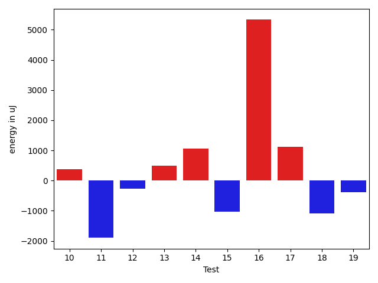
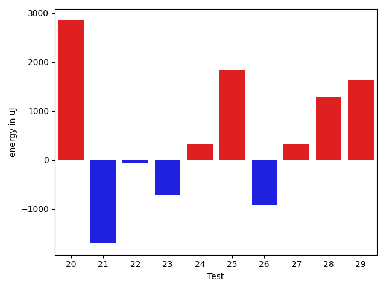
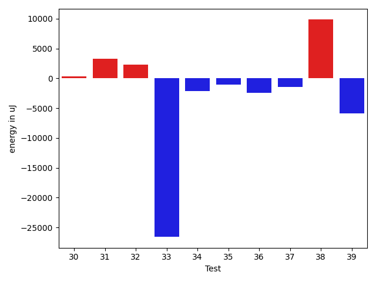
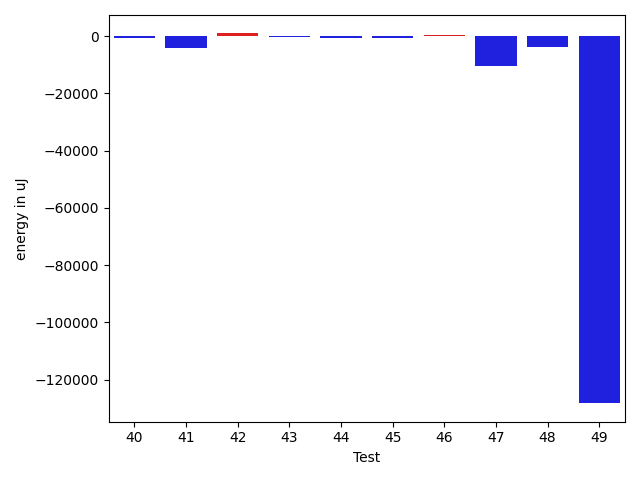
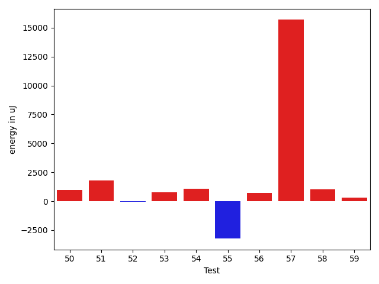
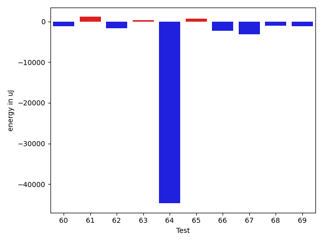
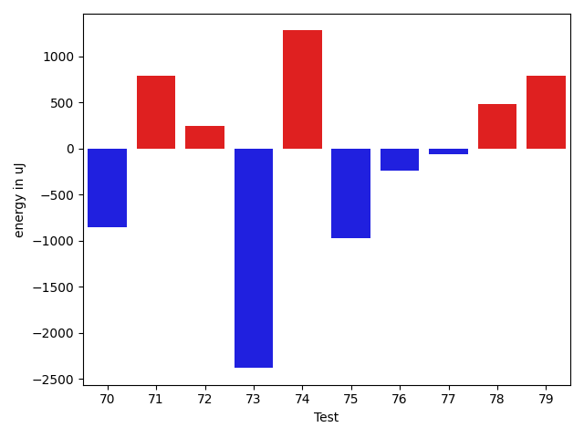
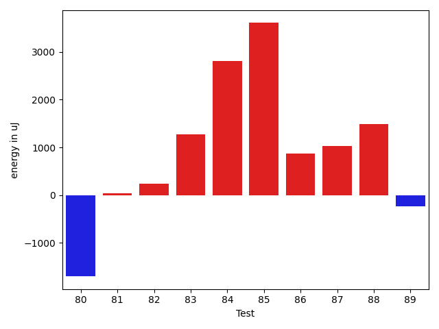
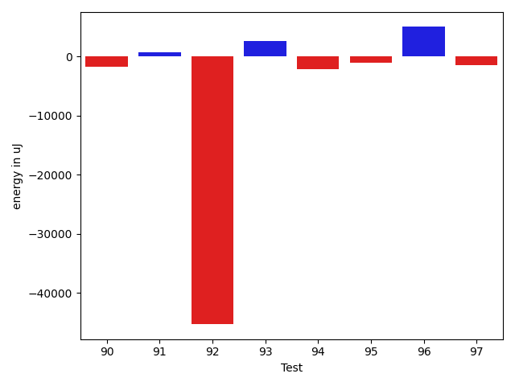

# gson e19672

https://github.com/google/gson/commit/e19672

## Delta Energy per test method

| ID | EnergyV1 | EnergyV2 | DeltaEnergy | σV1 | σV2 |
| --- | --- | --- | --- | --- | --- |
| 0 | 40772 | 41320 | 548 | 24050.200101595154 | 17448.720627487124 |
| 1 | 39429 | 39795 | 366 | 3999.238880712179 | 3808.0667896658815 |
| 2 | 40710 | 43152 | 2442 | 4870.988871019644 | 4180.988893482477 |
| 3 | 38391 | 39734 | 1343 | 3792.7159419044733 | 4131.448630453853 |
| 4 | 36865 | 42541 | 5676 | 5041.802873743386 | 4317.1905311955625 |
| 5 | 41687 | 38880 | -2807 | 4000.2784764174717 | 4932.707092684728 |
| 6 | 39551 | 42602 | 3051 | 4723.494361632604 | 5167.2607567641735 |
| 7 | 40344 | 41687 | 1343 | 3585.76562954134 | 4136.602769450098 |
| 8 | 38086 | 39368 | 1282 | 3443.8119975968843 | 4061.277514927346 |
| 9 | 38452 | 43152 | 4700 | 3960.488718439795 | 3772.8237223596866 |
| 10 | 40283 | 40650 | 367 | 4211.898644020295 | 4584.500309383204 |
| 11 | 41077 | 38940 | -2137 | 3565.4533937344577 | 4674.289561561783 |
| 12 | 40222 | 41932 | 1710 | 5403.220198214855 | 5267.522510433522 |
| 13 | 38879 | 39245 | 366 | 5796.260206566146 | 4471.641580960109 |
| 14 | 41687 | 41259 | -428 | 4085.753082288882 | 5259.182528541115 |
| 15 | 40710 | 39855 | -855 | 3971.6813061887274 | 3413.4075601365903 |
| 16 | 40894 | 43030 | 2136 | 4300.070557679304 | 24488.56597180349 |
| 17 | 39367 | 38391 | -976 | 4400.59604626756 | 3328.642095261536 |
| 18 | 39428 | 37781 | -1647 | 3984.546447785221 | 4587.018318972985 |
| 19 | 40466 | 38696 | -1770 | 4069.3587131738504 | 4801.915640898561 |
| 20 | 36438 | 40954 | 4516 | 4212.451992888173 | 3682.3966103405746 |
| 21 | 38452 | 37231 | -1221 | 4616.092155613409 | 4292.477605175094 |
| 22 | 41809 | 40466 | -1343 | 4831.010971836019 | 4175.8141653906905 |
| 23 | 37964 | 39856 | 1892 | 4728.315518236913 | 3909.510836356876 |
| 24 | 39062 | 40039 | 977 | 4682.366993049175 | 4990.7019145607155 |
| 25 | 37964 | 38574 | 610 | 3165.842896433422 | 3536.8118365191767 |
| 26 | 40161 | 37720 | -2441 | 3620.2047308589235 | 3996.1960224693685 |
| 27 | 37293 | 37354 | 61 | 5208.339693162784 | 3698.5922865792804 |
| 28 | 39490 | 41565 | 2075 | 3405.2835636346545 | 4280.560007327471 |
| 29 | 35706 | 37659 | 1953 | 3741.3548964965166 | 3723.939113453664 |
| 30 | 41382 | 39978 | -1404 | 5423.932393510727 | 4416.827914509337 |
| 31 | 41748 | 43395 | 1647 | 19352.289242784445 | 21865.865525534267 |
| 32 | 42419 | 42969 | 550 | 5304.631927866288 | 12191.942915072028 |
| 33 | 42602 | 43030 | 428 | 439019.55951402267 | 379257.2039256225 |
| 34 | 46509 | 43640 | -2869 | 24994.06796069733 | 23262.526619325046 |
| 35 | 40405 | 39490 | -915 | 9107.600959879172 | 8998.484166235614 |
| 36 | 46020 | 43945 | -2075 | 23103.907163158718 | 23737.97921328525 |
| 37 | 43579 | 43274 | -305 | 21626.23844037353 | 21959.212113056532 |
| 38 | 41565 | 41137 | -428 | 34564.779152773954 | 50614.973519867584 |
| 39 | 80628 | 78003 | -2625 | 33135.53806862407 | 33929.07084582743 |
| 40 | 41443 | 41198 | -245 | 16402.31603978995 | 13323.98941336054 |
| 41 | 44617 | 41870 | -2747 | 23363.506777379098 | 22159.945915089917 |
| 42 | 38635 | 39489 | 854 | 3693.73204730689 | 4029.389203887034 |
| 43 | 39490 | 40100 | 610 | 14032.493506053592 | 12281.135257906402 |
| 44 | 39429 | 38147 | -1282 | 4779.984094311555 | 4684.243211759901 |
| 45 | 39612 | 39978 | 366 | 10649.824940795592 | 8094.690634606111 |
| 46 | 41260 | 40711 | -549 | 11740.849925317867 | 13909.7947785368 |
| 47 | 44739 | 40832 | -3907 | 21820.836491329974 | 18243.99255972021 |
| 48 | 41076 | 39062 | -2014 | 9122.959627860373 | 4715.946975389049 |
| 49 | 86120 | 87585 | 1465 | 847242.8715610318 | 689125.6573993607 |
| 50 | 43884 | 44861 | 977 | 28941.168070975877 | 30779.107170068386 |
| 51 | 40649 | 42419 | 1770 | 22677.520957478126 | 21342.18611378399 |
| 52 | 40528 | 40466 | -62 | 10745.789425579162 | 18820.35895583074 |
| 53 | 41626 | 42419 | 793 | 20594.32058223471 | 11980.527538843504 |
| 54 | 40649 | 41748 | 1099 | 23943.977178500052 | 15771.815470789848 |
| 55 | 43885 | 40650 | -3235 | 15118.856900683686 | 11447.411187517231 |
| 56 | 42663 | 43396 | 733 | 115035.30809819259 | 96180.64648696616 |
| 57 | 449034 | 464720 | 15686 | 157891.57110948153 | 140987.56190320718 |
| 58 | 43030 | 44067 | 1037 | 24699.674229576336 | 25069.489494506448 |
| 59 | 39794 | 40100 | 306 | 4787.214546882396 | 4132.742031907254 |
| 60 | 37964 | 41992 | 4028 | 23080.19667285173 | 4482.036354454643 |
| 61 | 38208 | 38757 | 549 | 3969.9799359253984 | 4224.482682396933 |
| 62 | 41565 | 41504 | -61 | 7667.687272260539 | 5389.313974482798 |
| 63 | 40161 | 40100 | -61 | 5055.486492949849 | 5538.670522714244 |
| 64 | 130065 | 125976 | -4089 | 372595.696300159 | 80370.73298168344 |
| 65 | 39246 | 40283 | 1037 | 4410.434151271903 | 5911.161892263078 |
| 66 | 40344 | 36926 | -3418 | 5095.654990623112 | 5682.508777424778 |
| 67 | 41626 | 38085 | -3541 | 10581.608157553368 | 7330.045579389032 |
| 68 | 39002 | 39306 | 304 | 4665.476622526742 | 4966.499870170122 |
| 69 | 40283 | 39612 | -671 | 5096.746576434725 | 4369.056653416464 |
| 70 | 39795 | 38941 | -854 | 4172.589971486901 | 8747.1338134624 |
| 71 | 40711 | 41504 | 793 | 23347.23182497345 | 16699.198915749483 |
| 72 | 39185 | 39429 | 244 | 4741.253749158055 | 4426.402452002285 |
| 73 | 42664 | 40283 | -2381 | 83943.41431360441 | 45932.9172893776 |
| 74 | 40405 | 41686 | 1281 | 4718.167416840285 | 5129.656456333114 |
| 75 | 40711 | 39734 | -977 | 37974.235630973104 | 4846.392090931126 |
| 76 | 39001 | 38757 | -244 | 2981.353152731453 | 4329.586969780014 |
| 77 | 40222 | 40161 | -61 | 3875.590555626014 | 4764.367808984183 |
| 78 | 40161 | 40649 | 488 | 4282.084205946258 | 3997.2894013778077 |
| 79 | 39429 | 40222 | 793 | 4351.959989188779 | 4439.780825007545 |
| 80 | 42053 | 40954 | -1099 | 7322.401606630242 | 5286.516375235517 |
| 81 | 36194 | 38574 | 2380 | 6389.305211154453 | 4533.300739842705 |
| 82 | 39611 | 41016 | 1405 | 5073.157337766825 | 5309.103772033678 |
| 83 | 39550 | 40772 | 1222 | 4549.181835438333 | 5311.173832497697 |
| 84 | 41320 | 42603 | 1283 | 16871.100805244885 | 22978.50300653544 |
| 85 | 43579 | 41320 | -2259 | 51358.36914556008 | 61712.21984635819 |
| 86 | 40039 | 41138 | 1099 | 13323.44418715785 | 13311.998896660154 |
| 87 | 41565 | 41016 | -549 | 22510.75514359008 | 24421.443010084895 |
| 88 | 38880 | 40527 | 1647 | 4311.325644400568 | 4750.2499932721685 |
| 89 | 38941 | 38330 | -611 | 6244.676492732741 | 6102.739050822808 |
| 90 | 40833 | 39429 | -1404 | 6677.586944522853 | 4953.657772336731 |
| 91 | 40283 | 40222 | -61 | 4834.547943489444 | 8382.466672642046 |
| 92 | 38757 | 40283 | 1526 | 348012.48153941706 | 4746.823985925828 |
| 93 | 36560 | 40161 | 3601 | 5056.491557244086 | 5039.372190320521 |
| 94 | 41748 | 38330 | -3418 | 4564.0919017648075 | 5920.0457050100795 |
| 95 | 41626 | 39795 | -1831 | 3825.0529391139444 | 5161.776734926114 |
| 96 | 38147 | 40100 | 1953 | 4738.18154115023 | 25342.534890891468 |
| 97 | 42785 | 41077 | -1708 | 6887.795716655293 | 4479.48130818267 |

## Delta Duration per test method

| ID | DurationV1 | DurationsV2 | DeltaDuration |
| --- | --- | --- | --- |
| 0 | 1139784.7121212122 | 988425.7538461538 | -151358.9582750583 |
| 1 | 411410.375 | 427843.46153846156 | 16433.08653846156 |
| 2 | 493562.2916666667 | 494042.4736842105 | 480.1820175438188 |
| 3 | 935983.4230769231 | 877070.7049180327 | -58912.71815889038 |
| 4 | 476257.3333333333 | 496027.86363636365 | 19770.530303030333 |
| 5 | 418094.77777777775 | 419638.3333333333 | 1543.555555555562 |
| 6 | 448962.75 | 428363.6666666667 | -20599.083333333314 |
| 7 | 447860.8 | 434496.8333333333 | -13363.966666666674 |
| 8 | 379164.7368421053 | 399064.6923076923 | 19899.95546558703 |
| 9 | 389591.0416666667 | 387290.1 | -2300.9416666667094 |
| 10 | 471711.9375 | 470545.64285714284 | -1166.2946428571595 |
| 11 | 580660.8636363636 | 548976.6538461539 | -31684.209790209774 |
| 12 | 507145.82608695654 | 500559.23529411765 | -6586.5907928388915 |
| 13 | 582566.6 | 557723.5 | -24843.099999999977 |
| 14 | 636247.4761904762 | 584878.9117647059 | -51368.56442577031 |
| 15 | 564663.3076923077 | 556723.0 | -7940.307692307746 |
| 16 | 480354.78571428574 | 578290.0909090909 | 97935.3051948052 |
| 17 | 388858.8275862069 | 428636.36363636365 | 39777.53605015675 |
| 18 | 531367.0 | 605473.96875 | 74106.96875 |
| 19 | 565244.4347826086 | 497928.0869565217 | -67316.34782608692 |
| 20 | 516271.82352941175 | 450290.9411764706 | -65980.88235294115 |
| 21 | 412052.09523809527 | 416805.5238095238 | 4753.4285714285215 |
| 22 | 394860.6 | 458796.0 | 63935.40000000002 |
| 23 | 440451.0 | 409169.5 | -31281.5 |
| 24 | 550569.9047619047 | 533192.72 | -17377.184761904762 |
| 25 | 430023.4285714286 | 351118.45454545453 | -78904.97402597405 |
| 26 | 370596.13333333336 | 382640.95 | 12044.816666666651 |
| 27 | 401759.1875 | 371882.5625 | -29876.625 |
| 28 | 432157.1818181818 | 406140.76923076925 | -26016.412587412575 |
| 29 | 412196.0 | 392157.0 | -20039.0 |
| 30 | 549112.5833333334 | 506972.5833333333 | -42140.00000000006 |
| 31 | 1235565.2435897435 | 1417478.5131578948 | 181913.26956815133 |
| 32 | 860659.0294117647 | 962198.375 | 101539.3455882353 |
| 33 | 4109854.8255813955 | 3344900.8846153845 | -764953.940966011 |
| 34 | 1824999.8484848484 | 1701024.4591836734 | -123975.38930117502 |
| 35 | 1186679.7012987013 | 1111588.0789473683 | -75091.62235133303 |
| 36 | 1809600.5858585858 | 1739372.5918367347 | -70227.9940218511 |
| 37 | 1759784.7373737374 | 1643360.3402061856 | -116424.3971675518 |
| 38 | 1569725.8522727273 | 1801578.0120481928 | 231852.1597754655 |
| 39 | 2391910.0505050505 | 2207792.0606060605 | -184117.9898989899 |
| 40 | 1317038.1494252873 | 1250920.6 | -66117.54942528717 |
| 41 | 1745217.0303030303 | 1652875.7659574468 | -92341.2643455835 |
| 42 | 776050.0212765958 | 772750.9411764706 | -3299.0801001251675 |
| 43 | 1238384.759493671 | 1115961.8684210526 | -122422.89107261831 |
| 44 | 909308.7173913043 | 818151.1086956522 | -91157.6086956521 |
| 45 | 1153350.6714285715 | 970159.5084745763 | -183191.16295399517 |
| 46 | 1348086.4078947369 | 1171692.4246575343 | -176393.9832372025 |
| 47 | 1638593.0555555555 | 1420966.1573033708 | -217626.89825218474 |
| 48 | 1032301.5818181818 | 906359.25 | -125942.33181818179 |
| 49 | 12040309.757575758 | 7940581.878787879 | -4099727.878787879 |
| 50 | 1847159.6020408163 | 1820187.75 | -26971.85204081633 |
| 51 | 1144722.606060606 | 1266647.1746031747 | 121924.56854256871 |
| 52 | 1155616.1833333333 | 1166487.0 | 10870.816666666651 |
| 53 | 1072042.108695652 | 1159723.8409090908 | 87681.73221343872 |
| 54 | 1154580.3673469387 | 1188036.0317460317 | 33455.66439909302 |
| 55 | 1189110.6935483871 | 1150352.5692307693 | -38758.124317617854 |
| 56 | 2103851.1875 | 1762631.2826086956 | -341219.90489130444 |
| 57 | 12654610.747474747 | 12009645.686868686 | -644965.0606060605 |
| 58 | 1503192.494117647 | 1559225.8048780488 | 56033.31076040189 |
| 59 | 940699.947368421 | 829918.4615384615 | -110781.4858299595 |
| 60 | 881462.2549019608 | 821805.119047619 | -59657.13585434179 |
| 61 | 895670.0769230769 | 789401.431372549 | -106268.64555052784 |
| 62 | 927628.5675675676 | 861679.4 | -65949.16756756755 |
| 63 | 689628.1914893617 | 736054.1142857143 | 46425.92279635265 |
| 64 | 5540141.656565657 | 4160037.8080808083 | -1380103.8484848486 |
| 65 | 743427.5806451613 | 812051.088888889 | 68623.50824372761 |
| 66 | 736791.7073170731 | 829804.6060606061 | 93012.89874353295 |
| 67 | 956275.16 | 954916.186440678 | -1358.9735593220685 |
| 68 | 756453.8301886793 | 829498.1960784313 | 73044.36588975205 |
| 69 | 703292.119047619 | 823420.4615384615 | 120128.34249084245 |
| 70 | 883297.0 | 1049162.888888889 | 165865.888888889 |
| 71 | 1059488.4807692308 | 1025159.5454545454 | -34328.93531468534 |
| 72 | 575111.1538461539 | 639399.75 | 64288.59615384613 |
| 73 | 1648338.2758620689 | 1063892.0 | -584446.2758620689 |
| 74 | 612954.0666666667 | 632419.44 | 19465.373333333293 |
| 75 | 909331.4333333333 | 653841.074074074 | -255490.3592592593 |
| 76 | 598160.3076923077 | 559863.8333333334 | -38296.474358974374 |
| 77 | 692929.2702702703 | 743791.5957446808 | 50862.32547441055 |
| 78 | 726316.552631579 | 746772.7142857143 | 20456.16165413533 |
| 79 | 635187.55 | 557005.0909090909 | -78182.4590909091 |
| 80 | 897252.2368421053 | 801639.7391304348 | -95612.49771167047 |
| 81 | 669599.3913043478 | 630941.6585365854 | -38657.73276776238 |
| 82 | 659708.8787878788 | 655214.7333333333 | -4494.145454545505 |
| 83 | 820794.6666666666 | 999266.6545454545 | 178471.9878787879 |
| 84 | 1317640.061728395 | 1387244.8636363635 | 69604.80190796847 |
| 85 | 1570812.1896551724 | 1801107.1764705882 | 230294.9868154158 |
| 86 | 1067670.1578947369 | 1179334.767857143 | 111664.6099624061 |
| 87 | 1030186.4883720931 | 1143779.2926829269 | 113592.8043108338 |
| 88 | 882727.8541666666 | 919392.3478260869 | 36664.49365942029 |
| 89 | 639460.4666666667 | 637016.1578947369 | -2444.30877192982 |
| 90 | 951321.1578947369 | 1013101.1111111111 | 61779.95321637427 |
| 91 | 1037944.1290322581 | 1033913.1016949152 | -4031.02733734285 |
| 92 | 2277148.49122807 | 983333.7962962963 | -1293814.694931774 |
| 93 | 736113.5952380953 | 766437.3658536585 | 30323.770615563262 |
| 94 | 532266.1071428572 | 561129.2692307692 | 28863.16208791209 |
| 95 | 618113.8823529412 | 691967.7142857143 | 73853.83193277312 |
| 96 | 690395.8461538461 | 912708.0 | 222312.15384615387 |
| 97 | 854914.425 | 876818.8648648649 | 21904.439864864806 |

## Misc.

| ID | Test Class | Test Method |
| --- | --- | --- |
| 0 | com.google.gson.functional.PrimitiveTest | testDeserializePrimitiveWrapperAsObjectField |
| 1 | com.google.gson.functional.PrimitiveTest | testDeserializeJsonArrayAsBigDecimal |
| 2 | com.google.gson.functional.PrimitiveTest | testBigDecimalPreservePrecisionDeserialization |
| 3 | com.google.gson.functional.PrimitiveTest | testByteDeserialization |
| 4 | com.google.gson.functional.PrimitiveTest | testBigDecimalAsStringRepresentationDeserialization |
| 5 | com.google.gson.functional.PrimitiveTest | testDeserializeJsonObjectAsBytePrimitive |
| 6 | com.google.gson.functional.PrimitiveTest | testByteSerialization |
| 7 | com.google.gson.functional.PrimitiveTest | testDeserializeJsonObjectAsLongPrimitive |
| 8 | com.google.gson.functional.PrimitiveTest | testDeserializeJsonArrayAsInt |
| 9 | com.google.gson.functional.PrimitiveTest | testDeserializeJsonObjectAsBigDecimal |
| 10 | com.google.gson.functional.PrimitiveTest | testSmallValueForBigIntegerDeserialization |
| 11 | com.google.gson.functional.PrimitiveTest | testLongAsStringDeserialization |
| 12 | com.google.gson.functional.PrimitiveTest | testBigDecimalNoFractAsStringRepresentationDeserialization |
| 13 | com.google.gson.functional.PrimitiveTest | testBigDecimalDeserialization |
| 14 | com.google.gson.functional.PrimitiveTest | testFloatNaNSerialization |
| 15 | com.google.gson.functional.PrimitiveTest | testNegativeInfinityFloatSerialization |
| 16 | com.google.gson.functional.PrimitiveTest | testPrimitiveIntegerAutoboxedDeserialization |
| 17 | com.google.gson.functional.PrimitiveTest | testDeserializeJsonArrayAsLongWrapper |
| 18 | com.google.gson.functional.PrimitiveTest | testPrimitiveClassLiteral |
| 19 | com.google.gson.functional.PrimitiveTest | testFloatInfinitySerialization |
| 20 | com.google.gson.functional.PrimitiveTest | testSmallValueForBigDecimalDeserialization |
| 21 | com.google.gson.functional.PrimitiveTest | testDeserializeJsonObjectAsShortPrimitive |
| 22 | com.google.gson.functional.PrimitiveTest | testPrimitiveLongAutoboxedDeserialization |
| 23 | com.google.gson.functional.PrimitiveTest | testDeserializeJsonObjectAsInteger |
| 24 | com.google.gson.functional.PrimitiveTest | testBigIntegerDeserialization |
| 25 | com.google.gson.functional.PrimitiveTest | testDeserializeJsonArrayAsByteWrapper |
| 26 | com.google.gson.functional.PrimitiveTest | testDeserializeJsonArrayAsBigInteger |
| 27 | com.google.gson.functional.PrimitiveTest | testDeserializeJsonObjectAsBigInteger |
| 28 | com.google.gson.functional.PrimitiveTest | testReallyLongValuesDeserialization |
| 29 | com.google.gson.functional.PrimitiveTest | testDeserializeJsonArrayAsShortWrapper |
| 30 | com.google.gson.functional.PrimitiveTest | testDeserializingBigIntegerAsBigDecimal |
| 31 | com.google.gson.functional.ReadersWritersTest | testReadWriteTwoObjects |
| 32 | com.google.gson.functional.ReadersWritersTest | testReaderForDeserialization |
| 33 | com.google.gson.JsonParserTest | testReadWriteTwoObjects |
| 34 | com.google.gson.functional.ParameterizedTypesTest | testVariableTypeArrayDeserialization |
| 35 | com.google.gson.functional.ParameterizedTypesTest | testParameterizedTypeWithReaderDeserialization |
| 36 | com.google.gson.functional.ParameterizedTypesTest | testVariableTypeDeserialization |
| 37 | com.google.gson.functional.ParameterizedTypesTest | testParameterizedTypeGenericArraysDeserialization |
| 38 | com.google.gson.functional.ParameterizedTypesTest | testParameterizedTypeDeserialization |
| 39 | com.google.gson.functional.ParameterizedTypesTest | testVariableTypeFieldsAndGenericArraysDeserialization |
| 40 | com.google.gson.functional.ParameterizedTypesTest | testTypesWithMultipleParametersDeserialization |
| 41 | com.google.gson.functional.ParameterizedTypesTest | testParameterizedTypeWithVariableTypeDeserialization |
| 42 | com.google.gson.functional.ParameterizedTypesTest | testDeepParameterizedTypeDeserialization |
| 43 | com.google.gson.functional.CollectionTest | testFieldIsArrayList |
| 44 | com.google.gson.functional.CollectionTest | testWildcardPrimitiveCollectionDeserilaization |
| 45 | com.google.gson.functional.CollectionTest | testTopLevelCollectionOfIntegersDeserialization |
| 46 | com.google.gson.functional.CollectionTest | testSetDeserialization |
| 47 | com.google.gson.functional.CollectionTest | testWildcardCollectionField |
| 48 | com.google.gson.functional.CollectionTest | testTopLevelListOfIntegerCollectionsDeserialization |
| 49 | com.google.gson.functional.TypeVariableTest | testAdvancedTypeVariables |
| 50 | com.google.gson.functional.TypeVariableTest | testTypeVariablesViaTypeParameter |
| 51 | com.google.gson.functional.NamingPolicyTest | testGsonWithSerializedNameFieldNamingPolicyDeserialization |
| 52 | com.google.gson.functional.NamingPolicyTest | testComplexFieldNameStrategy |
| 53 | com.google.gson.functional.UncategorizedTest | testGsonInstanceReusableForSerializationAndDeserialization |
| 54 | com.google.gson.functional.UncategorizedTest | testTrailingWhitespace |
| 55 | com.google.gson.functional.JsonParserTest | testChangingCustomTreeAndDeserializing |
| 56 | com.google.gson.functional.JsonParserTest | testDeserializingCustomTree |
| 57 | com.google.gson.functional.ConcurrencyTest | testMultiThreadDeserialization |
| 58 | com.google.gson.functional.ConcurrencyTest | testSingleThreadDeserialization |
| 59 | com.google.gson.functional.MapTest | testMapDeserialization |
| 60 | com.google.gson.functional.MapTest | testMapDeserializationWithWildcardValues |
| 61 | com.google.gson.functional.MapTest | testMapDeserializationWithNullKey |
| 62 | com.google.gson.functional.SecurityTest | testNonExecutableJsonDeserialization |
| 63 | com.google.gson.functional.SecurityTest | testJsonWithNonExectuableTokenWithConfiguredGsonDeserialization |
| 64 | com.google.gson.functional.TypeHierarchyAdapterTest | testTypeHierarchy |
| 65 | com.google.gson.functional.VersioningTest | testVersionedUntilDeserialization |
| 66 | com.google.gson.functional.VersioningTest | testVersionedGsonWithUnversionedClassesDeserialization |
| 67 | com.google.gson.functional.VersioningTest | testVersionedGsonMixingSinceAndUntilDeserialization |
| 68 | com.google.gson.functional.VersioningTest | testVersionedClassesDeserialization |
| 69 | com.google.gson.functional.ObjectTest | testNullFieldsDeserialization |
| 70 | com.google.gson.functional.ObjectTest | testInnerClassDeserialization |
| 71 | com.google.gson.functional.ObjectTest | testArrayOfArraysDeserialization |
| 72 | com.google.gson.functional.ObjectTest | testClassWithTransientFieldsDeserialization |
| 73 | com.google.gson.functional.ObjectTest | testJsonInSingleQuotesDeserialization |
| 74 | com.google.gson.functional.ObjectTest | testJsonInMixedQuotesDeserialization |
| 75 | com.google.gson.functional.ObjectTest | testPrivateNoArgConstructorDeserialization |
| 76 | com.google.gson.functional.ObjectTest | testClassWithTransientFieldsDeserializationTransientFieldsPassedInJsonAreIgnored |
| 77 | com.google.gson.functional.ObjectTest | testPrimitiveArrayInAnObjectDeserialization |
| 78 | com.google.gson.functional.ObjectTest | testArrayOfObjectsDeserialization |
| 79 | com.google.gson.functional.ObjectTest | testBagOfPrimitiveWrappersDeserialization |
| 80 | com.google.gson.functional.ObjectTest | testNestedDeserialization |
| 81 | com.google.gson.functional.ObjectTest | testObjectFieldNamesWithoutQuotesDeserialization |
| 82 | com.google.gson.functional.ObjectTest | testBagOfPrimitivesDeserialization |
| 83 | com.google.gson.functional.EscapingTest | testGsonDoubleDeserialization |
| 84 | com.google.gson.functional.EscapingTest | testGsonAcceptsEscapedAndNonEscapedJsonDeserialization |
| 85 | com.google.gson.functional.EscapingTest | testEscapingObjectFields |
| 86 | com.google.gson.functional.InheritanceTest | testSubClassDeserialization |
| 87 | com.google.gson.internal.bind.MiniGsonTest | testDeserialize |
| 88 | com.google.gson.functional.ArrayTest | testArrayOfCollectionDeserialization |
| 89 | com.google.gson.functional.ArrayTest | testInvalidArrayDeserialization |
| 90 | com.google.gson.functional.ArrayTest | testTopLevelArrayOfIntsDeserialization |
| 91 | com.google.gson.functional.CustomTypeAdaptersTest | testCustomNestedDeserializers |
| 92 | com.google.gson.MixedStreamTest | testReadMixedStreamed |
| 93 | com.google.gson.MixedStreamTest | testReaderDoesNotMutateState |
| 94 | com.google.gson.GsonTypeAdapterTest | testDefaultTypeAdapterThrowsParseException |
| 95 | com.google.gson.functional.DefaultTypeAdaptersTest | testBigIntegerFieldDeserialization |
| 96 | com.google.gson.functional.DefaultTypeAdaptersTest | testBigDecimalFieldDeserialization |
| 97 | com.google.gson.functional.ExposeFieldsTest | testExposeAnnotationDeserialization |

| Test | IterationV1 | IterationV2 | DeltaIteration |
| --- | --- | --- | --- |
| 0 | 66 | 65 | -1 |
| 1 | 16 | 13 | -3 |
| 2 | 24 | 19 | -5 |
| 3 | 52 | 61 | 9 |
| 4 | 21 | 22 | 1 |
| 5 | 18 | 15 | -3 |
| 6 | 16 | 18 | 2 |
| 7 | 20 | 12 | -8 |
| 8 | 19 | 13 | -6 |
| 9 | 24 | 10 | -14 |
| 10 | 16 | 14 | -2 |
| 11 | 22 | 26 | 4 |
| 12 | 23 | 17 | -6 |
| 13 | 15 | 14 | -1 |
| 14 | 21 | 34 | 13 |
| 15 | 26 | 13 | -13 |
| 16 | 14 | 22 | 8 |
| 17 | 29 | 11 | -18 |
| 18 | 21 | 32 | 11 |
| 19 | 23 | 23 | 0 |
| 20 | 17 | 17 | 0 |
| 21 | 21 | 21 | 0 |
| 22 | 10 | 14 | 4 |
| 23 | 20 | 14 | -6 |
| 24 | 21 | 25 | 4 |
| 25 | 14 | 11 | -3 |
| 26 | 15 | 20 | 5 |
| 27 | 16 | 16 | 0 |
| 28 | 11 | 13 | 2 |
| 29 | 13 | 13 | 0 |
| 30 | 24 | 24 | 0 |
| 31 | 78 | 76 | -2 |
| 32 | 34 | 40 | 6 |
| 33 | 86 | 78 | -8 |
| 34 | 99 | 98 | -1 |
| 35 | 77 | 76 | -1 |
| 36 | 99 | 98 | -1 |
| 37 | 99 | 97 | -2 |
| 38 | 88 | 83 | -5 |
| 39 | 99 | 99 | 0 |
| 40 | 87 | 80 | -7 |
| 41 | 99 | 94 | -5 |
| 42 | 47 | 51 | 4 |
| 43 | 79 | 76 | -3 |
| 44 | 46 | 46 | 0 |
| 45 | 70 | 59 | -11 |
| 46 | 76 | 73 | -3 |
| 47 | 90 | 89 | -1 |
| 48 | 55 | 56 | 1 |
| 49 | 99 | 99 | 0 |
| 50 | 98 | 92 | -6 |
| 51 | 66 | 63 | -3 |
| 52 | 60 | 64 | 4 |
| 53 | 46 | 44 | -2 |
| 54 | 49 | 63 | 14 |
| 55 | 62 | 65 | 3 |
| 56 | 48 | 46 | -2 |
| 57 | 99 | 99 | 0 |
| 58 | 85 | 82 | -3 |
| 59 | 57 | 52 | -5 |
| 60 | 51 | 42 | -9 |
| 61 | 39 | 51 | 12 |
| 62 | 37 | 30 | -7 |
| 63 | 47 | 35 | -12 |
| 64 | 99 | 99 | 0 |
| 65 | 31 | 45 | 14 |
| 66 | 41 | 33 | -8 |
| 67 | 50 | 59 | 9 |
| 68 | 53 | 51 | -2 |
| 69 | 42 | 39 | -3 |
| 70 | 56 | 54 | -2 |
| 71 | 52 | 55 | 3 |
| 72 | 26 | 28 | 2 |
| 73 | 29 | 34 | 5 |
| 74 | 30 | 25 | -5 |
| 75 | 30 | 27 | -3 |
| 76 | 26 | 30 | 4 |
| 77 | 37 | 47 | 10 |
| 78 | 38 | 35 | -3 |
| 79 | 20 | 33 | 13 |
| 80 | 38 | 46 | 8 |
| 81 | 23 | 41 | 18 |
| 82 | 33 | 30 | -3 |
| 83 | 42 | 55 | 13 |
| 84 | 81 | 88 | 7 |
| 85 | 58 | 51 | -7 |
| 86 | 57 | 56 | -1 |
| 87 | 43 | 41 | -2 |
| 88 | 48 | 46 | -2 |
| 89 | 30 | 19 | -11 |
| 90 | 38 | 45 | 7 |
| 91 | 62 | 59 | -3 |
| 92 | 57 | 54 | -3 |
| 93 | 42 | 41 | -1 |
| 94 | 28 | 26 | -2 |
| 95 | 34 | 42 | 8 |
| 96 | 39 | 33 | -6 |
| 97 | 40 | 37 | -3 |

| Time Label | Time (s) |
| --- | --- |
| Selection | 29.764427661895752 |
| Injection | 14.49307894706726 |
| Total | 1234.7085008621216 |

