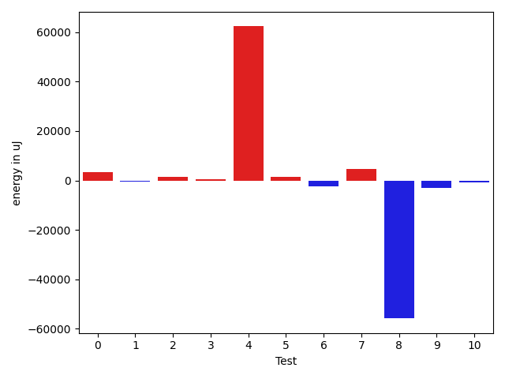
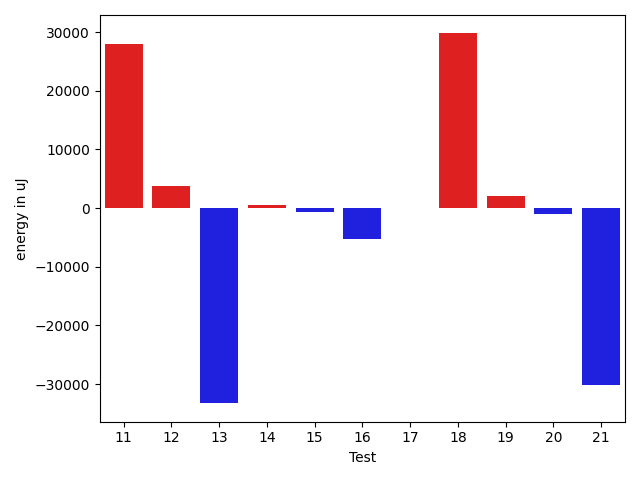
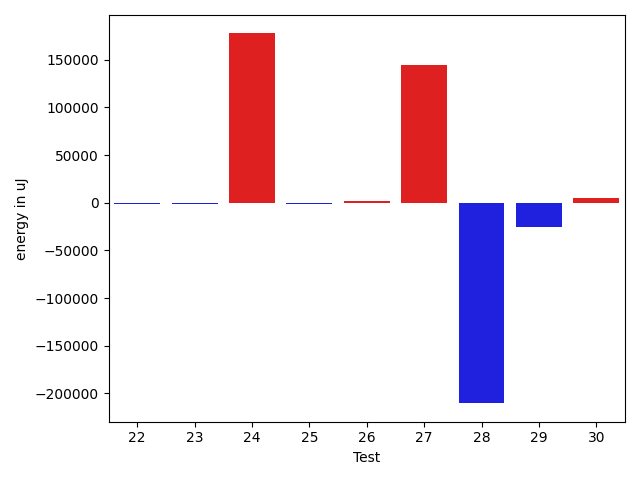

# gson ba2839

https://github.com/google/gson/commit/ba2839

## Delta Energy per test method

| ID | EnergyV1 | EnergyV2 | DeltaEnergy | σV1 | σV2 |
| --- | --- | --- | --- | --- | --- |
| 0 | 44861 | 45654 | 793 | 25330.32836203837 | 27516.137447639892 |
| 1 | 44922 | 45410 | 488 | 21095.667900032855 | 20047.457476435735 |
| 2 | 41626 | 41626 | 0 | 13162.285425253993 | 14881.412621364572 |
| 3 | 39733 | 40161 | 428 | 5039.90721590795 | 4404.568777102048 |
| 4 | 42786 | 41809 | -977 | 257570.81023966617 | 442902.39515247993 |
| 5 | 38330 | 40711 | 2381 | 7192.84554483288 | 7944.420973544766 |
| 6 | 41931 | 44555 | 2624 | 20022.972859100595 | 15595.431325149873 |
| 7 | 38146 | 42663 | 4517 | 8396.46491406019 | 11392.92284492249 |
| 8 | 46875 | 47607 | 732 | 557557.1007048311 | 455505.76799578086 |
| 9 | 134277 | 132934 | -1343 | 41253.062027364824 | 37989.34962334059 |
| 10 | 37902 | 38940 | 1038 | 14530.232218873669 | 10880.237515631956 |
| 11 | 112976 | 119934 | 6958 | 577588.6219512075 | 615108.3255104607 |
| 12 | 71961 | 76355 | 4394 | 31693.12278515822 | 26167.002030035335 |
| 13 | 42541 | 41259 | -1282 | 653357.0083962203 | 631309.5862260283 |
| 14 | 38513 | 38818 | 305 | 5835.44110722532 | 5706.92913839109 |
| 15 | 40954 | 40222 | -732 | 5559.065094629794 | 5638.635210096888 |
| 16 | 47608 | 77515 | 29907 | 86758.88743672149 | 59791.03934460073 |
| 17 | 43213 | 45105 | 1892 | 33595.74823668384 | 31098.692009010752 |
| 18 | 43274 | 43030 | -244 | 501889.2422412233 | 555223.275048918 |
| 19 | 37903 | 39612 | 1709 | 4917.24144045652 | 5620.281684821078 |
| 20 | 40161 | 39978 | -183 | 7754.547863712768 | 7898.05590453907 |
| 21 | 41198 | 42236 | 1038 | 357352.83855745045 | 212567.6019553969 |
| 22 | 40588 | 39734 | -854 | 6688.463854754782 | 5029.010337652806 |
| 23 | 40222 | 38514 | -1708 | 5355.991173208059 | 5493.404426376738 |
| 24 | 44983 | 44311 | -672 | 561105.5987450585 | 790152.0432581593 |
| 25 | 41931 | 41504 | -427 | 8471.40396777014 | 7770.740261199035 |
| 26 | 40710 | 43945 | 3235 | 11800.024010784176 | 11979.521330428894 |
| 27 | 39733 | 43396 | 3663 | 417752.16752427316 | 630594.3679524774 |
| 28 | 39978 | 40283 | 305 | 687190.4405642215 | 314140.1005522589 |
| 29 | 40710 | 40588 | -122 | 647959.5921499835 | 557417.7211947634 |
| 30 | 39795 | 44250 | 4455 | 6303.839925913512 | 8706.869397941935 |

## Delta Duration per test method

| ID | DurationV1 | DurationsV2 | DeltaDuration |
| --- | --- | --- | --- |
| 0 | 1820693.0721649486 | 1975884.0515463918 | 155190.97938144323 |
| 1 | 1731688.2 | 1585611.2727272727 | -146076.92727272725 |
| 2 | 1503159.2073170731 | 1345851.7386363635 | -157307.4686807096 |
| 3 | 1052058.262295082 | 946988.5 | -105069.76229508198 |
| 4 | 2485231.9484536084 | 4496484.778947368 | 2011252.8304937598 |
| 5 | 1157042.7866666666 | 1176232.1285714286 | 19189.341904761968 |
| 6 | 1595196.2325581396 | 1459398.816091954 | -135797.4164661856 |
| 7 | 1171088.6603773586 | 1141421.2241379311 | -29667.43623942742 |
| 8 | 6293788.340425532 | 4382549.042553191 | -1911239.2978723412 |
| 9 | 3966951.4444444445 | 3758611.9393939395 | -208339.50505050505 |
| 10 | 1277876.1411764706 | 1296450.2159090908 | 18574.07473262027 |
| 11 | 7993923.3838383835 | 8569514.414141415 | 575591.0303030312 |
| 12 | 2239467.6363636362 | 2227993.8585858587 | -11473.777777777519 |
| 13 | 8044305.756756756 | 6935161.550724638 | -1109144.2060321188 |
| 14 | 817865.0277777778 | 817247.7777777778 | -617.25 |
| 15 | 873175.1923076923 | 866500.5961538461 | -6674.596153846127 |
| 16 | 2755098.84375 | 2652448.3684210526 | -102650.47532894742 |
| 17 | 1752176.0 | 1817912.8720930233 | 65736.87209302327 |
| 18 | 5030022.375 | 5882757.25 | 852734.875 |
| 19 | 596183.1739130435 | 599142.8518518518 | 2959.677938808338 |
| 20 | 1137299.3857142858 | 1142626.1142857142 | 5326.728571428452 |
| 21 | 3030797.0344827585 | 2273371.625 | -757425.4094827585 |
| 22 | 995576.2295081967 | 1006482.4827586206 | 10906.253250423935 |
| 23 | 914688.5208333334 | 952564.4363636364 | 37875.91553030303 |
| 24 | 6433772.076923077 | 11863560.731707318 | 5429788.654784241 |
| 25 | 1052993.9361702127 | 1080501.9512195121 | 27508.015049299458 |
| 26 | 1372557.6790123456 | 1386166.430379747 | 13608.751367401332 |
| 27 | 3771063.294117647 | 8256885.2835820895 | 4485821.989464442 |
| 28 | 8629623.933333334 | 2483023.7333333334 | -6146600.2 |
| 29 | 6975271.128205128 | 6890945.892857143 | -84325.23534798529 |
| 30 | 1027251.7837837838 | 963160.3488372093 | -64091.4349465745 |

## Misc.

| ID | Test Class | Test Method |
| --- | --- | --- |
| 0 | com.google.gson.functional.MapTest | testSerializeMaps |
| 1 | com.google.gson.functional.ReadersWritersTest | testReadWriteTwoObjects |
| 2 | com.google.gson.functional.ReadersWritersTest | testReadWriteTwoStrings |
| 3 | com.google.gson.functional.FieldExclusionTest | testDefaultNestedStaticClassIncluded |
| 4 | com.google.gson.functional.FieldExclusionTest | testDefaultInnerClassExclusion |
| 5 | com.google.gson.functional.DefaultTypeAdaptersTest | testBitSetDeserialization |
| 6 | com.google.gson.functional.DefaultTypeAdaptersTest | testSetSerialization |
| 7 | com.google.gson.functional.DefaultTypeAdaptersTest | testBitSetSerialization |
| 8 | com.google.gson.JsonParserTest | testReadWriteTwoObjects |
| 9 | com.google.gson.functional.ObjectTest | testSingletonLists |
| 10 | com.google.gson.functional.TypeVariableTest | testBasicTypeVariables |
| 11 | com.google.gson.functional.TypeVariableTest | testAdvancedTypeVariables |
| 12 | com.google.gson.functional.TypeVariableTest | testTypeVariablesViaTypeParameter |
| 13 | com.google.gson.FunctionWithInternalDependenciesTest | testAnonymousLocalClassesSerialization |
| 14 | com.google.gson.MixedStreamTest | testWriteClosed |
| 15 | com.google.gson.MixedStreamTest | testWriteInvalidState |
| 16 | com.google.gson.MixedStreamTest | testWriteHtmlSafe |
| 17 | com.google.gson.MixedStreamTest | testWriteLenient |
| 18 | com.google.gson.MixedStreamTest | testWriteMixedStreamed |
| 19 | com.google.gson.MixedStreamTest | testWriteNulls |
| 20 | com.google.gson.MixedStreamTest | testReadMixedStreamed |
| 21 | com.google.gson.MixedStreamTest | testReadClosed |
| 22 | com.google.gson.MixedStreamTest | testWriteDoesNotMutateState |
| 23 | com.google.gson.MixedStreamTest | testReaderDoesNotMutateState |
| 24 | com.google.gson.CommentsTest | testParseComments |
| 25 | com.google.gson.functional.NullObjectAndFieldTest | testExplicitNullSetsFieldToNullDuringDeserialization |
| 26 | com.google.gson.functional.NamingPolicyTest | testComplexFieldNameStrategy |
| 27 | com.google.gson.DefaultMapJsonSerializerTest | testNonEmptyMapSerialization |
| 28 | com.google.gson.JsonObjectTest | testPropertyWithQuotes |
| 29 | com.google.gson.JsonObjectTest | testWritePropertyWithEmptyStringName |
| 30 | com.google.gson.functional.PrimitiveTest | testMoreSpecificSerialization |

| Test | IterationV1 | IterationV2 | DeltaIteration |
| --- | --- | --- | --- |
| 0 | 97 | 97 | 0 |
| 1 | 95 | 88 | -7 |
| 2 | 82 | 88 | 6 |
| 3 | 61 | 60 | -1 |
| 4 | 97 | 95 | -2 |
| 5 | 75 | 70 | -5 |
| 6 | 86 | 87 | 1 |
| 7 | 53 | 58 | 5 |
| 8 | 94 | 94 | 0 |
| 9 | 99 | 99 | 0 |
| 10 | 85 | 88 | 3 |
| 11 | 99 | 99 | 0 |
| 12 | 99 | 99 | 0 |
| 13 | 74 | 69 | -5 |
| 14 | 36 | 45 | 9 |
| 15 | 52 | 52 | 0 |
| 16 | 96 | 95 | -1 |
| 17 | 88 | 86 | -2 |
| 18 | 80 | 76 | -4 |
| 19 | 23 | 27 | 4 |
| 20 | 70 | 70 | 0 |
| 21 | 87 | 88 | 1 |
| 22 | 61 | 58 | -3 |
| 23 | 48 | 55 | 7 |
| 24 | 78 | 82 | 4 |
| 25 | 47 | 41 | -6 |
| 26 | 81 | 79 | -2 |
| 27 | 68 | 67 | -1 |
| 28 | 30 | 30 | 0 |
| 29 | 39 | 28 | -11 |
| 30 | 37 | 43 | 6 |

| Time Label | Time (s) |
| --- | --- |
| Selection | 29.988654613494873 |
| Injection | 11.642891645431519 |
| Total | 1188.1444697380066 |

