# gson 9db0c5

https://github.com/google/gson/commit/9db0c5

## Delta Energy per test method

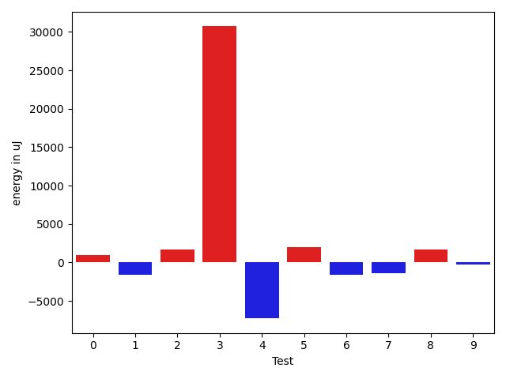

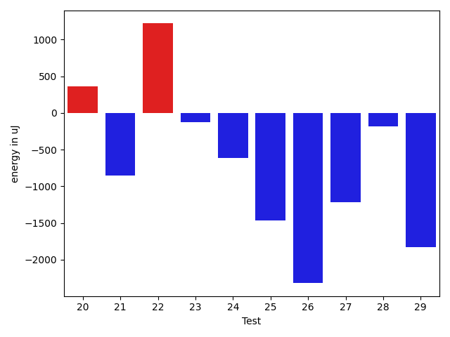

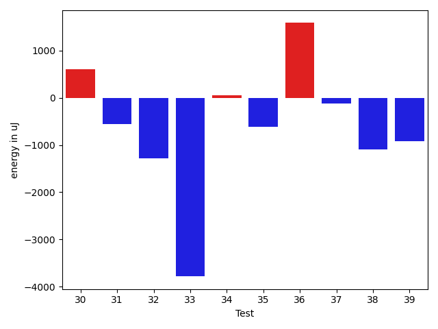

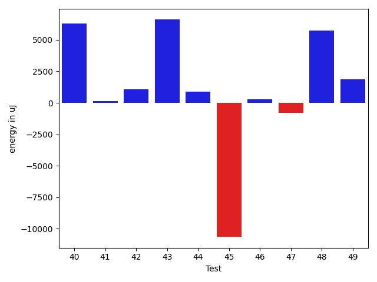

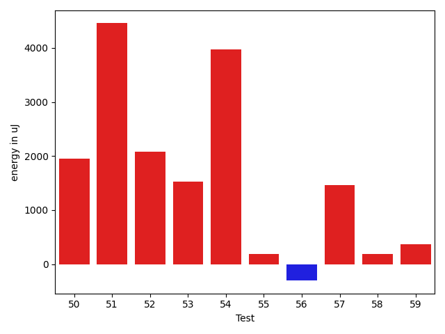

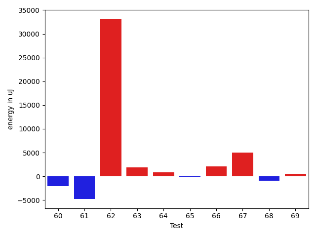

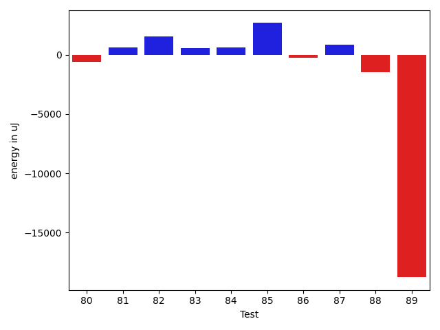

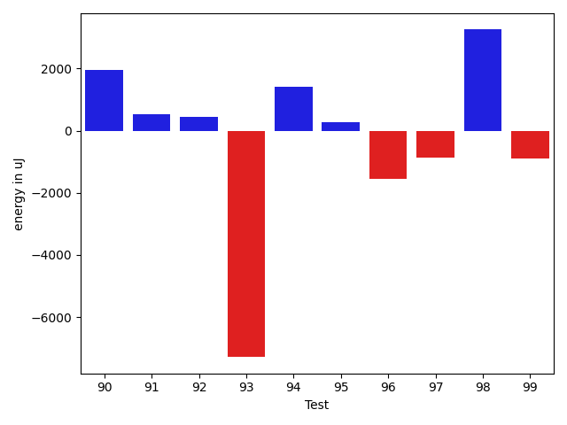

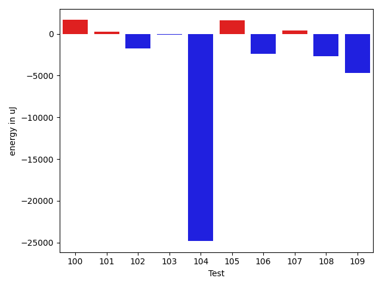

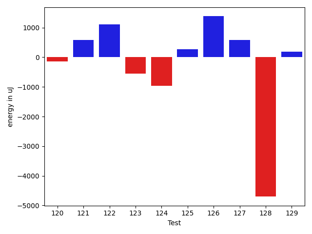

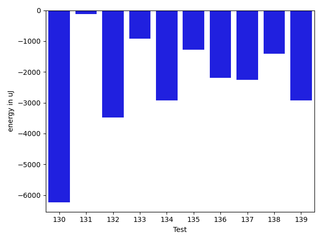

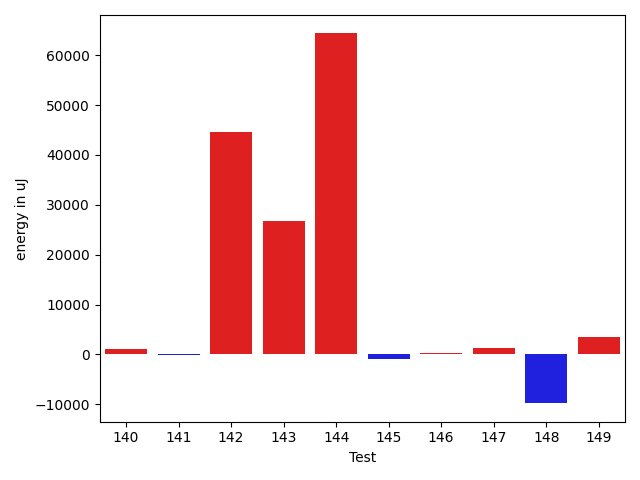

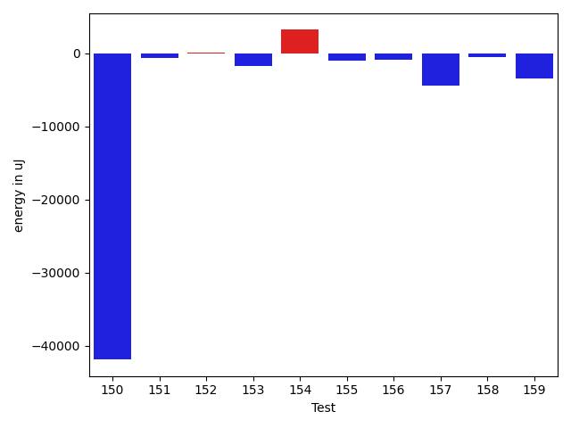

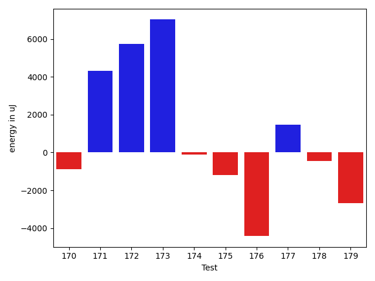

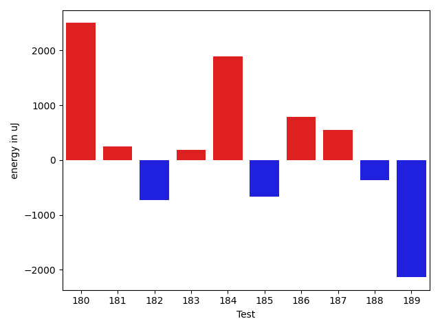

| ID | EnergyV1 | EnergyV2 | DeltaEnergy | σV1 | σV2 |
| --- | --- | --- | --- | --- | --- |
| 0 | 39184 | 38636 | -548 | 4495.500393046091 | 8179.406924614262 |
| 1 | 39367 | 37842 | -1525 | 4983.28353864731 | 4745.267157783215 |
| 2 | 41382 | 41320 | -62 | 26081.554975095194 | 27199.970911797256 |
| 3 | 43213 | 41199 | -2014 | 381571.4390711868 | 435125.43576987606 |
| 4 | 88318 | 83618 | -4700 | 31914.998846317896 | 26821.11416016061 |
| 5 | 39856 | 41321 | 1465 | 16694.661376918342 | 19753.854120257078 |
| 6 | 39672 | 37414 | -2258 | 5223.1943405547645 | 4717.5633405813105 |
| 7 | 40161 | 39123 | -1038 | 4929.131025361525 | 5346.553050367994 |
| 8 | 38269 | 38574 | 305 | 4821.361935043757 | 13164.550139959207 |
| 9 | 39246 | 39245 | -1 | 5131.226276086449 | 4145.627732586873 |
| 10 | 38269 | 39856 | 1587 | 5120.147654120924 | 4699.289138794249 |
| 11 | 40649 | 39733 | -916 | 5972.767607864814 | 7179.321694056171 |
| 12 | 38208 | 37109 | -1099 | 4845.108373068286 | 3563.415465221222 |
| 13 | 85571 | 84350 | -1221 | 22955.316637128435 | 21630.64461508807 |
| 14 | 106201 | 105591 | -610 | 63084.136971506974 | 60566.7166415388 |
| 15 | 40039 | 39185 | -854 | 5472.334971810889 | 4603.450320140319 |
| 16 | 75195 | 75683 | 488 | 22395.46106883412 | 21551.75505035341 |
| 17 | 79529 | 75134 | -4395 | 18694.11535035489 | 20963.64213863526 |
| 18 | 86426 | 84839 | -1587 | 25370.161068864672 | 25990.14690560013 |
| 19 | 103577 | 101684 | -1893 | 26309.344921024767 | 26238.52111873915 |
| 20 | 40100 | 40467 | 367 | 3473.9979415976704 | 3896.8563097312212 |
| 21 | 42175 | 41321 | -854 | 19497.278995313027 | 10307.846572861905 |
| 22 | 39124 | 40344 | 1220 | 10229.871099643382 | 4485.611105819703 |
| 23 | 40527 | 40405 | -122 | 8359.225539970743 | 5027.226405693527 |
| 24 | 42419 | 41809 | -610 | 19391.083074673497 | 26153.96785444467 |
| 25 | 40832 | 39367 | -1465 | 4216.656141483462 | 5023.309018354092 |
| 26 | 41565 | 39245 | -2320 | 9623.507791249851 | 9209.998740765279 |
| 27 | 41015 | 39794 | -1221 | 25968.496930393634 | 4452.911172480314 |
| 28 | 40649 | 40467 | -182 | 4112.773444030486 | 4538.16175495644 |
| 29 | 40772 | 38940 | -1832 | 3892.3594803089054 | 3483.2085945699737 |
| 30 | 41565 | 42175 | 610 | 17872.97594619691 | 10839.816811137698 |
| 31 | 42542 | 41992 | -550 | 5972.6220575818015 | 8589.017329255415 |
| 32 | 41565 | 40283 | -1282 | 11981.322005081032 | 19216.259841823787 |
| 33 | 42114 | 38330 | -3784 | 4250.320258441677 | 5048.075128094756 |
| 34 | 129516 | 129577 | 61 | 141552.07161077546 | 99020.46719879236 |
| 35 | 41565 | 40954 | -611 | 4301.845308538389 | 4573.135271025841 |
| 36 | 39002 | 40589 | 1587 | 8779.983535798281 | 5197.016870749233 |
| 37 | 39978 | 39856 | -122 | 7648.58699480779 | 4889.590710120838 |
| 38 | 71411 | 70313 | -1098 | 56737.217556147276 | 57972.02503212492 |
| 39 | 41443 | 40527 | -916 | 4227.787337887278 | 6406.903728704598 |
| 40 | 40283 | 41077 | 794 | 10811.816994825616 | 25669.532786403077 |
| 41 | 39490 | 39856 | 366 | 3579.402193389396 | 4256.050374508967 |
| 42 | 40711 | 39612 | -1099 | 5048.7242257408725 | 14822.864579449257 |
| 43 | 37903 | 40955 | 3052 | 4511.2697216594 | 28162.19728802857 |
| 44 | 38696 | 39917 | 1221 | 3869.4141463061887 | 4477.30361542461 |
| 45 | 39428 | 39062 | -366 | 29079.54593868343 | 9911.93489186481 |
| 46 | 40894 | 40650 | -244 | 3760.6092674222646 | 4246.203023355755 |
| 47 | 39855 | 37109 | -2746 | 4045.0947952234383 | 5287.016493940813 |
| 48 | 39856 | 42847 | 2991 | 3870.271636561378 | 28239.152802570796 |
| 49 | 40100 | 41321 | 1221 | 4707.434376600485 | 11138.130365733477 |
| 50 | 39245 | 41199 | 1954 | 3806.864844335852 | 4459.310195466695 |
| 51 | 41198 | 45654 | 4456 | 24507.52412521951 | 38937.78487917563 |
| 52 | 40039 | 42114 | 2075 | 29158.403785690443 | 36169.462384198574 |
| 53 | 40466 | 41992 | 1526 | 4632.879936756433 | 4173.061202356264 |
| 54 | 38819 | 42786 | 3967 | 4169.054222868938 | 4034.774470171528 |
| 55 | 40954 | 41137 | 183 | 5059.89219290555 | 4310.835582517748 |
| 56 | 40649 | 40344 | -305 | 4268.596846932741 | 4530.605852904775 |
| 57 | 39063 | 40528 | 1465 | 6872.520023564849 | 9028.30287025217 |
| 58 | 39795 | 39978 | 183 | 4952.246804756899 | 4794.56301444456 |
| 59 | 40344 | 40710 | 366 | 4487.119647112166 | 4056.578213223554 |
| 60 | 42786 | 42724 | -62 | 26951.06304601425 | 25334.670699818013 |
| 61 | 43396 | 42053 | -1343 | 46659.66200147665 | 42701.36557023029 |
| 62 | 43946 | 43335 | -611 | 275383.98890059936 | 338757.0235001513 |
| 63 | 38147 | 39673 | 1526 | 7423.111680053247 | 7886.2275723354805 |
| 64 | 40772 | 42236 | 1464 | 6220.2131362619975 | 7221.459538964399 |
| 65 | 38330 | 38819 | 489 | 3106.987590537675 | 4168.6190865996905 |
| 66 | 39368 | 39551 | 183 | 9161.42063685277 | 12207.680184527799 |
| 67 | 79101 | 81543 | 2442 | 36818.12537474163 | 40407.64161664578 |
| 68 | 41382 | 40649 | -733 | 3953.362475945121 | 4747.002507500182 |
| 69 | 39490 | 40589 | 1099 | 3789.178733797087 | 4894.621263905224 |
| 70 | 39551 | 42298 | 2747 | 17981.25443626039 | 51334.95360338046 |
| 71 | 39673 | 39490 | -183 | 4208.93789610804 | 4121.937552094262 |
| 72 | 39245 | 40406 | 1161 | 4625.127146480112 | 5184.472197394404 |
| 73 | 40711 | 40039 | -672 | 3880.972305619076 | 4154.723276609225 |
| 74 | 39490 | 41138 | 1648 | 2788.4448066815485 | 3014.7868662459196 |
| 75 | 39246 | 39367 | 121 | 4303.2732132127785 | 5152.5356342506 |
| 76 | 40039 | 39368 | -671 | 3817.593689274552 | 4653.498115038478 |
| 77 | 37903 | 39245 | 1342 | 3960.713832357894 | 4150.658174346984 |
| 78 | 38696 | 39307 | 611 | 3389.491336048342 | 3401.7055052827845 |
| 79 | 38269 | 39550 | 1281 | 2725.2451502367426 | 3468.404121319909 |
| 80 | 40710 | 39978 | -732 | 4305.4694280131125 | 3729.1983791453636 |
| 81 | 39062 | 40283 | 1221 | 4269.45972470863 | 3933.9796371008288 |
| 82 | 39184 | 41199 | 2015 | 4328.226490561694 | 4809.491622571977 |
| 83 | 39123 | 39978 | 855 | 6983.363081594648 | 3583.6347378232595 |
| 84 | 39307 | 39734 | 427 | 17821.185557660014 | 17160.247756738954 |
| 85 | 40954 | 43274 | 2320 | 8199.356165680354 | 8754.748383421647 |
| 86 | 38757 | 39001 | 244 | 3937.9952651112108 | 3887.081298404777 |
| 87 | 38269 | 39673 | 1404 | 5479.847926884025 | 3682.777483923479 |
| 88 | 40161 | 38391 | -1770 | 4675.835923297269 | 2983.2112049490115 |
| 89 | 43091 | 41687 | -1404 | 62907.6491360708 | 4261.505812623093 |
| 90 | 36743 | 41138 | 4395 | 3892.6561454444786 | 4616.122772414096 |
| 91 | 39307 | 38696 | -611 | 3912.3428287564752 | 3507.497168602578 |
| 92 | 41016 | 40405 | -611 | 3794.9841447995245 | 3152.9042872317646 |
| 93 | 39001 | 40588 | 1587 | 33143.07918143193 | 3435.6070053045883 |
| 94 | 38513 | 39855 | 1342 | 3856.4764206012023 | 4392.174871928485 |
| 95 | 40039 | 42236 | 2197 | 3554.736959496591 | 2400.834698599635 |
| 96 | 40833 | 38330 | -2503 | 5541.974309129875 | 4592.862968355767 |
| 97 | 39978 | 41077 | 1099 | 3785.1838898965543 | 4164.091125605172 |
| 98 | 37902 | 41016 | 3114 | 4063.84697669585 | 4460.829640362027 |
| 99 | 42114 | 40711 | -1403 | 6829.984719088014 | 6580.2359809930485 |
| 100 | 39734 | 40527 | 793 | 4325.587218240859 | 3653.493236677718 |
| 101 | 38086 | 39550 | 1464 | 3780.8117120287884 | 4381.3259747537795 |
| 102 | 38086 | 37842 | -244 | 4140.731771210016 | 4525.200642996397 |
| 103 | 40894 | 39429 | -1465 | 4302.215577507275 | 3945.580884731475 |
| 104 | 43579 | 42786 | -793 | 510192.780864217 | 474215.66205778415 |
| 105 | 42114 | 42785 | 671 | 20406.759107664224 | 20896.878484336095 |
| 106 | 39551 | 39368 | -183 | 11119.800176847502 | 6194.477497826139 |
| 107 | 42236 | 41077 | -1159 | 16205.492560514436 | 20401.35774607203 |
| 108 | 44311 | 43091 | -1220 | 19828.56073989261 | 19003.38442349045 |
| 109 | 42969 | 41443 | -1526 | 26047.907212954287 | 20376.511733025884 |
| 110 | 79833 | 73730 | -6103 | 29421.866679790655 | 30464.865022405476 |
| 111 | 40832 | 40405 | -427 | 13271.342647276608 | 11213.748155593745 |
| 112 | 82275 | 80078 | -2197 | 42253.394623969 | 39512.60148221652 |
| 113 | 42480 | 42541 | 61 | 19356.533604988872 | 19936.40081451679 |
| 114 | 39977 | 39856 | -121 | 10117.634075949663 | 10113.148127099083 |
| 115 | 40833 | 41381 | 548 | 37826.142076691285 | 33026.89382456119 |
| 116 | 39673 | 39673 | 0 | 3799.427570181292 | 4513.350746977225 |
| 117 | 84595 | 84594 | -1 | 38192.59401201488 | 31085.267055829714 |
| 118 | 84534 | 81787 | -2747 | 167934.58222839053 | 220639.427914435 |
| 119 | 39978 | 38574 | -1404 | 18525.02265030561 | 6320.170312619848 |
| 120 | 40588 | 40100 | -488 | 4503.146510955973 | 3784.9783994396807 |
| 121 | 39611 | 40039 | 428 | 4279.488688678057 | 4197.022940386457 |
| 122 | 39490 | 40955 | 1465 | 3556.0799100132726 | 4443.803297154551 |
| 123 | 36621 | 38391 | 1770 | 5322.446722708592 | 4259.556953487065 |
| 124 | 39123 | 39001 | -122 | 8200.607348111022 | 6436.779784091491 |
| 125 | 39489 | 41321 | 1832 | 3734.313004600247 | 5281.829494834153 |
| 126 | 39489 | 39489 | 0 | 4181.140732300513 | 4711.728292906207 |
| 127 | 39673 | 39795 | 122 | 4347.2676311843115 | 3896.5407406228064 |
| 128 | 40466 | 40466 | 0 | 28366.324201592925 | 4318.557617772732 |
| 129 | 38513 | 38635 | 122 | 4459.2990512565375 | 5817.652403658706 |
| 130 | 179626 | 173400 | -6226 | 247544.96515961533 | 377918.19543149596 |
| 131 | 41381 | 41259 | -122 | 21072.124562656725 | 36430.70726290693 |
| 132 | 41137 | 37659 | -3478 | 7585.072322700142 | 5481.974312728237 |
| 133 | 39367 | 38452 | -915 | 10498.313472461332 | 10497.449818914309 |
| 134 | 41809 | 38879 | -2930 | 8594.6875985365 | 25228.753591043213 |
| 135 | 38757 | 37475 | -1282 | 5332.070540281458 | 4430.078630161112 |
| 136 | 40161 | 37964 | -2197 | 4667.922493701263 | 3928.6437632910765 |
| 137 | 40161 | 37903 | -2258 | 4563.867447200277 | 4465.568832436683 |
| 138 | 42847 | 41443 | -1404 | 253987.47738448833 | 340610.18384852033 |
| 139 | 43640 | 40710 | -2930 | 4697.411295743386 | 5084.677043715647 |
| 140 | 40771 | 41198 | 427 | 4734.734014078929 | 6170.779785343921 |
| 141 | 40039 | 40222 | 183 | 4447.42636601584 | 4069.504578467343 |
| 142 | 119079 | 107482 | -11597 | 383371.6710396455 | 513849.48944207595 |
| 143 | 43762 | 61889 | 18127 | 36638.48463528002 | 78750.79894392022 |
| 144 | 84473 | 84656 | 183 | 247899.22577400913 | 507309.2792869913 |
| 145 | 44495 | 44189 | -306 | 26204.498057587185 | 27157.68301108569 |
| 146 | 40649 | 40161 | -488 | 6831.413603085758 | 8117.745660300957 |
| 147 | 42846 | 42724 | -122 | 9269.204732940576 | 13054.983981939904 |
| 148 | 73364 | 45227 | -28137 | 25590.174253511224 | 21543.180536054086 |
| 149 | 42359 | 40466 | -1893 | 14414.922167998946 | 19839.36255098269 |
| 150 | 41382 | 40894 | -488 | 425274.5000662326 | 294343.27465179586 |
| 151 | 40222 | 38269 | -1953 | 4402.797975080733 | 5112.531955534717 |
| 152 | 40039 | 38940 | -1099 | 4414.215946190218 | 8796.734312372846 |
| 153 | 40771 | 39062 | -1709 | 5954.618411408453 | 4412.078830188569 |
| 154 | 41931 | 41137 | -794 | 16895.57312579613 | 21876.510634823728 |
| 155 | 41931 | 38880 | -3051 | 5004.82630688181 | 4431.731438578484 |
| 156 | 42481 | 42358 | -123 | 9045.52171292275 | 4287.47381745355 |
| 157 | 43945 | 42847 | -1098 | 23174.478835381637 | 20366.968431913865 |
| 158 | 41686 | 41504 | -182 | 27714.808715117553 | 20174.496059982303 |
| 159 | 43335 | 38391 | -4944 | 5105.707502158736 | 5419.672283424729 |
| 160 | 43213 | 42847 | -366 | 5710.025217071448 | 40331.41391212099 |
| 161 | 44861 | 42969 | -1892 | 375695.7328912538 | 33768.67084573362 |
| 162 | 42419 | 42664 | 245 | 448564.7116946498 | 612458.9834865066 |
| 163 | 42908 | 41992 | -916 | 19283.918248942195 | 20405.930540149875 |
| 164 | 42969 | 42602 | -367 | 24619.09088023461 | 60905.048758065655 |
| 165 | 40162 | 40894 | 732 | 4175.887139404233 | 9663.0130331843 |
| 166 | 432311 | 440733 | 8422 | 148236.15665577305 | 152089.90343243614 |
| 167 | 44800 | 44128 | -672 | 31573.81370180842 | 25860.506565748437 |
| 168 | 42236 | 42541 | 305 | 34768.41983959876 | 30359.577317200135 |
| 169 | 45105 | 42236 | -2869 | 732272.8036539 | 492098.0341320608 |
| 170 | 39367 | 39672 | 305 | 4479.234519213785 | 4671.978836638711 |
| 171 | 41016 | 40283 | -733 | 4849.552647586255 | 21499.25035154139 |
| 172 | 41565 | 41259 | -306 | 38537.151631984445 | 49644.322718142976 |
| 173 | 39734 | 40406 | 672 | 12070.213389895534 | 23097.877344448167 |
| 174 | 40222 | 39124 | -1098 | 3942.9014058296907 | 3987.708797408871 |
| 175 | 40161 | 39001 | -1160 | 3995.087771206445 | 4389.028914661266 |
| 176 | 42358 | 41626 | -732 | 307677.85933546507 | 288324.3851800073 |
| 177 | 40772 | 41199 | 427 | 4172.824516905652 | 8105.618207928324 |
| 178 | 40588 | 38574 | -2014 | 3924.7356846462844 | 4982.823243744454 |
| 179 | 41382 | 39367 | -2015 | 16109.957029241998 | 13578.896843101282 |
| 180 | 38147 | 40649 | 2502 | 3635.7442611719307 | 4225.218719387988 |
| 181 | 38757 | 39001 | 244 | 3950.0295166267074 | 4918.076133034278 |
| 182 | 43152 | 42420 | -732 | 151184.73721947745 | 97957.21579047099 |
| 183 | 41321 | 41504 | 183 | 11640.111212876538 | 9950.926185074031 |
| 184 | 41565 | 43457 | 1892 | 634343.7343124846 | 405337.58454950544 |
| 185 | 39123 | 38452 | -671 | 4404.830576761416 | 4397.096219100032 |
| 186 | 39977 | 40771 | 794 | 9156.710197322785 | 5206.218859748327 |
| 187 | 40832 | 41382 | 550 | 4700.83269113037 | 4446.09133219793 |
| 188 | 41198 | 40832 | -366 | 4069.5677673977943 | 4084.8851657920977 |
| 189 | 41931 | 39794 | -2137 | 6736.005461428077 | 8634.955429495569 |
| 190 | 39489 | 40283 | 794 | 4117.514473259323 | 323431.0953107357 |
| 191 | 43152 | 43762 | 610 | 43108.54548606672 | 40060.3305211264 |
| 192 | 43518 | 40222 | -3296 | 358919.50038412516 | 389478.4964743943 |
| 193 | 40650 | 38941 | -1709 | 503422.51274503255 | 278837.39022353874 |
| 194 | 42541 | 41687 | -854 | 392563.1759788392 | 279351.8154866111 |
| 195 | 43884 | 42053 | -1831 | 8645.60571721843 | 11271.270892388311 |
| 196 | 39246 | 43030 | 3784 | 432439.7956685525 | 642695.0994582295 |

## Delta Duration per test method

| ID | DurationV1 | DurationsV2 | DeltaDuration |
| --- | --- | --- | --- |
| 0 | 945904.7857142857 | 962456.796875 | 16552.01116071432 |
| 1 | 880602.5961538461 | 805209.4576271187 | -75393.13852672745 |
| 2 | 1253464.5970149254 | 1365754.5454545454 | 112289.94843961997 |
| 3 | 4081977.5588235296 | 5139833.906666666 | 1057856.3478431366 |
| 4 | 2829830.696969697 | 2701709.6767676766 | -128121.02020202018 |
| 5 | 1304897.2083333333 | 1296406.6578947369 | -8490.550438596401 |
| 6 | 839155.7586206896 | 949361.2545454545 | 110205.4959247649 |
| 7 | 871919.3134328359 | 935547.1041666666 | 63627.79073383077 |
| 8 | 831384.3548387097 | 866125.3 | 34740.94516129035 |
| 9 | 746629.9 | 740759.7450980392 | -5870.154901960865 |
| 10 | 642526.85 | 591732.1612903225 | -50794.68870967743 |
| 11 | 954363.5961538461 | 944218.2153846154 | -10145.380769230775 |
| 12 | 493209.4074074074 | 525637.1481481482 | 32427.740740740788 |
| 13 | 2518655.1616161615 | 2502527.595959596 | -16127.565656565595 |
| 14 | 3496754.98989899 | 3369595.090909091 | -127159.89898989908 |
| 15 | 515154.12903225806 | 535407.3333333334 | 20253.20430107531 |
| 16 | 2144583.0606060605 | 2122873.9292929294 | -21709.13131313119 |
| 17 | 2225431.6565656564 | 2187743.404040404 | -37688.25252525229 |
| 18 | 2648638.878787879 | 2604571.585858586 | -44067.29292929312 |
| 19 | 2851566.3333333335 | 2880463.595959596 | 28897.26262626238 |
| 20 | 634717.0 | 572188.5172413794 | -62528.48275862064 |
| 21 | 1221081.0454545454 | 851332.1463414634 | -369748.899113082 |
| 22 | 897841.8717948718 | 688351.5428571429 | -209490.3289377289 |
| 23 | 922263.5 | 816704.0 | -105559.5 |
| 24 | 1286068.1066666667 | 1457316.3924050634 | 171248.2857383967 |
| 25 | 651029.7142857143 | 673566.6 | 22536.885714285658 |
| 26 | 1087199.8163265307 | 1081704.7571428572 | -5495.0591836734675 |
| 27 | 847961.6363636364 | 802423.825 | -45537.8113636364 |
| 28 | 705727.5283018867 | 702882.1666666666 | -2845.3616352201207 |
| 29 | 753393.3111111111 | 716622.9795918367 | -36770.33151927439 |
| 30 | 1284175.2266666666 | 1162358.109375 | -121817.11729166657 |
| 31 | 899483.2195121951 | 812581.3513513514 | -86901.86816084373 |
| 32 | 1145086.7368421052 | 1147351.12345679 | 2264.386614684947 |
| 33 | 514754.14285714284 | 424768.23333333334 | -89985.9095238095 |
| 34 | 5146281.545454546 | 4487663.191919192 | -658618.3535353541 |
| 35 | 661037.84375 | 623632.8076923077 | -37405.036057692254 |
| 36 | 986922.0833333334 | 864168.7346938775 | -122753.34863945586 |
| 37 | 820365.9428571429 | 696770.1875 | -123595.75535714289 |
| 38 | 2335864.434782609 | 2392458.2 | 56593.76521739131 |
| 39 | 921027.38 | 972963.6041666666 | 51936.22416666662 |
| 40 | 784825.76 | 904424.4166666666 | 119598.65666666662 |
| 41 | 577515.9428571429 | 611232.0810810811 | 33716.13822393818 |
| 42 | 972201.1320754717 | 1057860.9387755103 | 85659.8067000386 |
| 43 | 654688.4838709678 | 1056773.875 | 402085.39112903224 |
| 44 | 742196.6923076923 | 677975.7692307692 | -64220.923076923005 |
| 45 | 947669.5 | 868432.2173913043 | -79237.28260869568 |
| 46 | 467211.26666666666 | 367000.0 | -100211.26666666666 |
| 47 | 388409.125 | 437994.2631578947 | 49585.13815789472 |
| 48 | 828968.796875 | 986520.7272727273 | 157551.9303977273 |
| 49 | 854867.9666666667 | 892506.0819672131 | 37638.1153005464 |
| 50 | 724961.7735849057 | 819879.487804878 | 94917.71421997237 |
| 51 | 1238733.1551724137 | 1656370.8775510204 | 417637.7223786067 |
| 52 | 1353976.5697674418 | 1611611.1866666668 | 257634.61689922493 |
| 53 | 694120.3243243244 | 736949.9722222222 | 42829.64789789787 |
| 54 | 695695.4864864865 | 695809.2307692308 | 113.74428274424281 |
| 55 | 615956.3214285715 | 519612.28571428574 | -96344.03571428574 |
| 56 | 723440.4418604651 | 723254.175 | -186.26686046505347 |
| 57 | 918407.9824561403 | 837622.7931034482 | -80785.1893526921 |
| 58 | 621959.4705882353 | 664893.0322580645 | 42933.561669829185 |
| 59 | 801243.5666666667 | 772290.6 | -28952.966666666674 |
| 60 | 1626990.8969072164 | 1488375.7575757576 | -138615.13933145883 |
| 61 | 1309808.8461538462 | 1123006.657142857 | -186802.18901098915 |
| 62 | 2259902.0 | 3021625.777777778 | 761723.777777778 |
| 63 | 713783.8947368421 | 648443.3235294118 | -65340.57120743033 |
| 64 | 792918.2368421053 | 676167.972972973 | -116750.26386913226 |
| 65 | 575898.7142857143 | 600943.7407407408 | 25045.02645502647 |
| 66 | 866037.8627450981 | 968117.1086956522 | 102079.24595055415 |
| 67 | 2215418.868686869 | 2394033.737373737 | 178614.86868686834 |
| 68 | 496215.6875 | 530489.3846153846 | 34273.697115384624 |
| 69 | 830383.1794871795 | 697475.1707317074 | -132908.00875547214 |
| 70 | 652731.2702702703 | 1606534.6285714286 | 953803.3583011583 |
| 71 | 669363.3243243244 | 744181.3260869565 | 74818.00176263216 |
| 72 | 570060.6470588235 | 780891.1666666666 | 210830.51960784313 |
| 73 | 786221.7884615385 | 800038.5652173914 | 13816.776755852858 |
| 74 | 375721.3333333333 | 406541.73333333334 | 30820.400000000023 |
| 75 | 507783.8387096774 | 538756.8333333334 | 30972.994623655977 |
| 76 | 611202.5833333334 | 744990.6333333333 | 133788.04999999993 |
| 77 | 544935.1724137932 | 634465.84375 | 89530.67133620684 |
| 78 | 628966.5555555555 | 498980.95238095237 | -129985.60317460314 |
| 79 | 406990.06666666665 | 393637.4705882353 | -13352.59607843135 |
| 80 | 391324.93333333335 | 470509.78571428574 | 79184.85238095239 |
| 81 | 586358.6363636364 | 654719.0606060605 | 68360.4242424242 |
| 82 | 467262.4 | 561921.5263157894 | 94659.12631578941 |
| 83 | 938043.1408450705 | 829154.3157894737 | -108888.82505559677 |
| 84 | 874397.5918367347 | 950726.4117647059 | 76328.81992797123 |
| 85 | 678261.8181818182 | 897318.4516129033 | 219056.63343108504 |
| 86 | 698956.0408163265 | 800224.6734693878 | 101268.6326530613 |
| 87 | 473310.8461538461 | 476628.125 | 3317.278846153873 |
| 88 | 463484.0833333333 | 499906.26666666666 | 36422.18333333335 |
| 89 | 1286040.8823529412 | 658801.3428571429 | -627239.5394957983 |
| 90 | 398444.06666666665 | 425831.3 | 27387.233333333337 |
| 91 | 392855.0 | 370863.14285714284 | -21991.85714285716 |
| 92 | 443097.5789473684 | 523144.0 | 80046.42105263157 |
| 93 | 716137.2666666667 | 465353.9285714286 | -250783.33809523814 |
| 94 | 392732.53571428574 | 452020.44 | 59287.90428571426 |
| 95 | 420466.35294117645 | 399217.625 | -21248.727941176447 |
| 96 | 321137.25 | 379328.5 | 58191.25 |
| 97 | 439064.63157894736 | 377436.75 | -61627.88157894736 |
| 98 | 343878.5833333333 | 328769.2631578947 | -15109.320175438595 |
| 99 | 773130.5294117647 | 804543.2333333333 | 31412.70392156858 |
| 100 | 422269.1304347826 | 396930.5294117647 | -25338.601023017894 |
| 101 | 451121.38095238095 | 473447.4285714286 | 22326.047619047633 |
| 102 | 407537.3157894737 | 436099.9375 | 28562.62171052629 |
| 103 | 410663.5789473684 | 467911.60869565216 | 57248.029748283734 |
| 104 | 4969493.654761905 | 4148016.7195121953 | -821476.9352497095 |
| 105 | 1569656.0808080807 | 1576982.1836734693 | 7326.102865388617 |
| 106 | 1089420.6769230769 | 1021418.3636363636 | -68002.31328671321 |
| 107 | 1390741.8666666667 | 1355902.894736842 | -34838.97192982468 |
| 108 | 1606809.0909090908 | 1611730.887755102 | 4921.796846011188 |
| 109 | 1593579.707070707 | 1555989.4895833333 | -37590.217487373855 |
| 110 | 2064335.383838384 | 1999952.3232323232 | -64383.06060606078 |
| 111 | 1147432.9404761905 | 1141969.5974025973 | -5463.34307359322 |
| 112 | 2499353.7474747472 | 2484941.9292929294 | -14411.818181817885 |
| 113 | 1530942.1720430108 | 1541572.15625 | 10629.984206989175 |
| 114 | 1106770.4939759036 | 1123257.0 | 16486.506024096394 |
| 115 | 1528053.2222222222 | 1450796.988095238 | -77256.23412698414 |
| 116 | 710008.1818181818 | 703657.0508474576 | -6351.13097072416 |
| 117 | 2747380.8484848486 | 2543996.303030303 | -203384.5454545454 |
| 118 | 3299019.1515151514 | 3608061.0606060605 | 309041.9090909092 |
| 119 | 998891.53125 | 871227.7962962963 | -127663.73495370371 |
| 120 | 551672.4117647059 | 491161.3703703704 | -60511.04139433551 |
| 121 | 600359.3125 | 471192.6923076923 | -129166.62019230769 |
| 122 | 652528.36 | 548380.2272727273 | -104148.13272727269 |
| 123 | 647614.8214285715 | 495442.5 | -152172.32142857148 |
| 124 | 1000285.6226415094 | 835594.95 | -164690.67264150945 |
| 125 | 629398.7142857143 | 613968.0625 | -15430.651785714319 |
| 126 | 645377.5555555555 | 544026.5925925926 | -101350.96296296292 |
| 127 | 510844.5 | 500339.06666666665 | -10505.433333333349 |
| 128 | 791491.0833333334 | 626288.3225806452 | -165202.76075268816 |
| 129 | 898172.9827586206 | 875171.3214285715 | -23001.66133004916 |
| 130 | 6676011.848484849 | 7961203.888888889 | 1285192.0404040404 |
| 131 | 1055858.4130434783 | 1316166.6136363635 | 260308.20059288526 |
| 132 | 989106.3846153846 | 930755.8983050848 | -58350.486310299835 |
| 133 | 1120551.240506329 | 1105881.038961039 | -14670.201545290183 |
| 134 | 822479.9090909091 | 892653.696969697 | 70173.78787878796 |
| 135 | 704398.6578947369 | 700690.0370370371 | -3708.620857699774 |
| 136 | 619985.3421052631 | 632995.0 | 13009.657894736854 |
| 137 | 798697.2391304348 | 782689.7631578947 | -16007.475972540095 |
| 138 | 2046424.1075268816 | 2890168.4743589745 | 843744.3668320929 |
| 139 | 550815.8571428572 | 574380.2083333334 | 23564.351190476213 |
| 140 | 798634.4054054054 | 698441.6129032258 | -100192.79250217963 |
| 141 | 855607.7959183673 | 807069.1666666666 | -48538.62925170071 |
| 142 | 5080902.797979798 | 6425980.03030303 | 1345077.232323232 |
| 143 | 1764106.9550561798 | 2439528.814814815 | 675421.859758635 |
| 144 | 3348568.6464646463 | 5073395.707070707 | 1724827.060606061 |
| 145 | 1680482.1382978724 | 1668472.3163265307 | -12009.821971341735 |
| 146 | 1002062.3188405797 | 1025726.8985507246 | 23664.5797101449 |
| 147 | 826823.6382978724 | 1066895.880952381 | 240072.24265450868 |
| 148 | 1880366.9696969697 | 1873884.5353535353 | -6482.434343434405 |
| 149 | 1002596.2692307692 | 1243891.1509433961 | 241294.8817126269 |
| 150 | 3489302.120689655 | 2406210.890909091 | -1083091.229780564 |
| 151 | 778767.8 | 748472.4 | -30295.400000000023 |
| 152 | 807394.24 | 844007.4905660377 | 36613.25056603772 |
| 153 | 987176.8059701492 | 1015557.6935483871 | 28380.88757823792 |
| 154 | 1346424.087912088 | 1394520.0444444444 | 48095.95653235633 |
| 155 | 775037.4807692308 | 810709.3617021276 | 35671.880932896864 |
| 156 | 972736.7857142857 | 757292.4782608695 | -215444.30745341617 |
| 157 | 1397392.7105263157 | 1008218.5714285715 | -389174.13909774425 |
| 158 | 952399.3333333334 | 901801.5853658536 | -50597.74796747975 |
| 159 | 515612.08 | 494326.7083333333 | -21285.371666666702 |
| 160 | 735196.4642857143 | 712799.8636363636 | -22396.600649350672 |
| 161 | 3567512.223880597 | 1333906.55 | -2233605.6738805966 |
| 162 | 4093815.8484848486 | 7216762.362068965 | 3122946.5135841165 |
| 163 | 1235854.4556962026 | 1278126.759493671 | 42272.30379746831 |
| 164 | 1146170.5161290322 | 1706129.9310344828 | 559959.4149054505 |
| 165 | 780404.1041666666 | 745820.0869565217 | -34584.0172101449 |
| 166 | 11554793.444444444 | 11628520.767676767 | 73727.32323232293 |
| 167 | 1461687.9220779222 | 1526518.8493150685 | 64830.9272371463 |
| 168 | 1414891.0952380951 | 1360601.1538461538 | -54289.94139194139 |
| 169 | 10586414.766666668 | 5695251.375 | -4891163.391666668 |
| 170 | 523232.5789473684 | 425501.6666666667 | -97730.91228070174 |
| 171 | 881071.671641791 | 982674.75 | 101603.078358209 |
| 172 | 1578538.12987013 | 1756369.3855421687 | 177831.25567203877 |
| 173 | 1047067.1803278689 | 1249640.353846154 | 202573.17351828504 |
| 174 | 664866.1875 | 652499.1111111111 | -12367.076388888876 |
| 175 | 717096.1034482758 | 704616.9189189189 | -12479.184529356891 |
| 176 | 2324324.581818182 | 2363726.3448275863 | 39401.7630094043 |
| 177 | 860566.3666666667 | 922537.6896551724 | 61971.32298850571 |
| 178 | 568808.40625 | 603254.84 | 34446.43374999997 |
| 179 | 1016537.2923076923 | 1025695.03125 | 9157.738942307653 |
| 180 | 429453.9090909091 | 457106.2 | 27652.290909090894 |
| 181 | 566905.2666666667 | 591927.3939393939 | 25022.1272727272 |
| 182 | 3088931.7714285715 | 1986930.90625 | -1102000.8651785715 |
| 183 | 1148216.0697674418 | 944901.0980392157 | -203314.97172822617 |
| 184 | 6322254.576271187 | 2877219.6428571427 | -3445034.933414044 |
| 185 | 762293.7894736842 | 683852.4390243902 | -78441.35044929397 |
| 186 | 798497.119047619 | 769117.8636363636 | -29379.255411255406 |
| 187 | 773876.25 | 748036.3461538461 | -25839.903846153873 |
| 188 | 580551.8518518518 | 625787.375 | 45235.523148148204 |
| 189 | 785071.6388888889 | 720448.6 | -64623.0388888889 |
| 190 | 748930.0625 | 2461774.7741935486 | 1712844.7116935486 |
| 191 | 1700830.6744186047 | 1553704.4242424243 | -147126.2501761804 |
| 192 | 3683096.15 | 3287794.3191489363 | -395301.8308510636 |
| 193 | 6000092.6875 | 2325949.878787879 | -3674142.808712121 |
| 194 | 3749838.2741935486 | 2120772.7 | -1629065.5741935484 |
| 195 | 892528.56 | 617901.84 | -274626.7200000001 |
| 196 | 3040668.653846154 | 8128251.666666667 | 5087583.012820513 |

## Misc.

| ID | Test Class | Test Method |
| --- | --- | --- |
| 0 | com.google.gson.functional.CustomTypeAdaptersTest | testCustomAdapterInvokedForCollectionElementDeserialization |
| 1 | com.google.gson.functional.CustomTypeAdaptersTest | testCustomTypeAdapterAppliesToSubClassesSerializedAsBaseClass |
| 2 | com.google.gson.functional.CustomTypeAdaptersTest | testCustomNestedSerializers |
| 3 | com.google.gson.functional.CustomTypeAdaptersTest | testCustomSerializers |
| 4 | com.google.gson.functional.CustomTypeAdaptersTest | testCustomTypeAdapterDoesNotAppliesToSubClasses |
| 5 | com.google.gson.functional.CustomTypeAdaptersTest | testCustomAdapterInvokedForCollectionElementSerializationWithType |
| 6 | com.google.gson.functional.CustomTypeAdaptersTest | testCustomAdapterInvokedForMapElementSerializationWithType |
| 7 | com.google.gson.functional.CustomTypeAdaptersTest | testCustomNestedDeserializers |
| 8 | com.google.gson.functional.CustomTypeAdaptersTest | testCustomAdapterInvokedForMapElementDeserialization |
| 9 | com.google.gson.functional.CustomTypeAdaptersTest | testEnsureCustomSerializerNotInvokedForNullValues |
| 10 | com.google.gson.functional.CustomTypeAdaptersTest | testCustomAdapterInvokedForCollectionElementSerialization |
| 11 | com.google.gson.functional.CustomTypeAdaptersTest | testCustomDeserializers |
| 12 | com.google.gson.functional.CustomTypeAdaptersTest | testCustomAdapterInvokedForMapElementSerialization |
| 13 | com.google.gson.functional.DefaultTypeAdaptersTest | testDateSerializationWithPatternNotOverridenByTypeAdapter |
| 14 | com.google.gson.functional.DefaultTypeAdaptersTest | testDateSerializationWithPattern |
| 15 | com.google.gson.functional.DefaultTypeAdaptersTest | testDefaultGregorianCalendarDeserialization |
| 16 | com.google.gson.functional.DefaultTypeAdaptersTest | testSqlDateSerialization |
| 17 | com.google.gson.functional.DefaultTypeAdaptersTest | testTimestampSerialization |
| 18 | com.google.gson.functional.DefaultTypeAdaptersTest | testDateDeserializationWithPattern |
| 19 | com.google.gson.functional.DefaultTypeAdaptersTest | testDateSerializationInCollection |
| 20 | com.google.gson.functional.DefaultTypeAdaptersTest | testDefaultCalendarDeserialization |
| 21 | com.google.gson.functional.DefaultTypeAdaptersTest | testSetSerialization |
| 22 | com.google.gson.functional.DefaultTypeAdaptersTest | testBitSetSerialization |
| 23 | com.google.gson.functional.DefaultTypeAdaptersTest | testBitSetDeserialization |
| 24 | com.google.gson.functional.MapTest | testSerializeMaps |
| 25 | com.google.gson.functional.MapTest | testMapSerializationWithNullValuesSerialized |
| 26 | com.google.gson.functional.MapTest | testGeneralMapField |
| 27 | com.google.gson.functional.MapTest | testMapSerializationWithNullValueButSerializeNulls |
| 28 | com.google.gson.functional.MapTest | testMapDeserialization |
| 29 | com.google.gson.functional.MapTest | testMapDeserializationWithNullKey |
| 30 | com.google.gson.functional.ReadersWritersTest | testReadWriteTwoObjects |
| 31 | com.google.gson.functional.ReadersWritersTest | testReaderForDeserialization |
| 32 | com.google.gson.functional.ReadersWritersTest | testReadWriteTwoStrings |
| 33 | com.google.gson.functional.ReadersWritersTest | testTopLevelNullObjectSerializationWithWriterAndSerializeNulls |
| 34 | com.google.gson.functional.ExposeFieldsTest | testNullExposeFieldSerialization |
| 35 | com.google.gson.functional.ExposeFieldsTest | testExposeAnnotationSerialization |
| 36 | com.google.gson.functional.ExposeFieldsTest | testArrayWithOneNullExposeFieldObjectSerialization |
| 37 | com.google.gson.functional.ExposeFieldsTest | testExposeAnnotationDeserialization |
| 38 | com.google.gson.functional.InheritanceTest | testSubInterfacesOfCollectionSerialization |
| 39 | com.google.gson.functional.InheritanceTest | testSubClassDeserialization |
| 40 | com.google.gson.internal.bind.MiniGsonTest | testSerializeMap |
| 41 | com.google.gson.internal.bind.MiniGsonTest | testSerialize2dArray |
| 42 | com.google.gson.internal.bind.MiniGsonTest | testSerializeWithCustomTypeAdapter |
| 43 | com.google.gson.internal.bind.MiniGsonTest | testDeserialize |
| 44 | com.google.gson.internal.bind.MiniGsonTest | testSerialize1dArray |
| 45 | com.google.gson.internal.bind.MiniGsonTest | testSerialize |
| 46 | com.google.gson.internal.bind.MiniGsonTest | testSerializeNullField |
| 47 | com.google.gson.internal.bind.MiniGsonTest | testSerializeNullObject |
| 48 | com.google.gson.functional.CustomDeserializerTest | testCustomDeserializerReturnsNullForArrayElementsForArrayField |
| 49 | com.google.gson.functional.CustomDeserializerTest | testCustomDeserializerReturnsNull |
| 50 | com.google.gson.functional.CustomDeserializerTest | testCustomDeserializerReturnsNullForArrayElements |
| 51 | com.google.gson.functional.CustomDeserializerTest | testCustomDeserializerReturnsNullForTopLevelObject |
| 52 | com.google.gson.functional.CustomDeserializerTest | testJsonTypeFieldBasedDeserialization |
| 53 | com.google.gson.functional.NullObjectAndFieldTest | testExplicitDeserializationOfNulls |
| 54 | com.google.gson.functional.NullObjectAndFieldTest | testExplicitSerializationOfNullStringMembers |
| 55 | com.google.gson.functional.NullObjectAndFieldTest | testTopLevelNullObjectDeserialization |
| 56 | com.google.gson.functional.NullObjectAndFieldTest | testExplicitSerializationOfNullCollectionMembers |
| 57 | com.google.gson.functional.NullObjectAndFieldTest | testPrintPrintingObjectWithNulls |
| 58 | com.google.gson.functional.NullObjectAndFieldTest | testPrintPrintingArraysWithNulls |
| 59 | com.google.gson.functional.NullObjectAndFieldTest | testNullWrappedPrimitiveMemberSerialization |
| 60 | com.google.gson.functional.NullObjectAndFieldTest | testExplicitSerializationOfNullArrayMembers |
| 61 | com.google.gson.functional.NullObjectAndFieldTest | testExplicitSerializationOfNulls |
| 62 | com.google.gson.functional.NullObjectAndFieldTest | testTopLevelNullObjectSerialization |
| 63 | com.google.gson.functional.NullObjectAndFieldTest | testExplicitNullSetsFieldToNullDuringDeserialization |
| 64 | com.google.gson.functional.NullObjectAndFieldTest | testCustomSerializationOfNulls |
| 65 | com.google.gson.functional.NullObjectAndFieldTest | testCustomTypeAdapterPassesNullSerialization |
| 66 | com.google.gson.functional.ObjectTest | testArrayOfArraysDeserialization |
| 67 | com.google.gson.functional.ObjectTest | testSingletonLists |
| 68 | com.google.gson.functional.ObjectTest | testPrivateNoArgConstructorDeserialization |
| 69 | com.google.gson.functional.ObjectTest | testArrayOfObjectsDeserialization |
| 70 | com.google.gson.functional.ObjectTest | testJsonInSingleQuotesDeserialization |
| 71 | com.google.gson.functional.ObjectTest | testNestedDeserialization |
| 72 | com.google.gson.functional.ObjectTest | testBagOfPrimitiveWrappersDeserialization |
| 73 | com.google.gson.functional.ObjectTest | testInnerClassDeserialization |
| 74 | com.google.gson.functional.ObjectTest | testJsonObjectSerialization |
| 75 | com.google.gson.functional.ObjectTest | testJsonInMixedQuotesDeserialization |
| 76 | com.google.gson.functional.ObjectTest | testNullFieldsDeserialization |
| 77 | com.google.gson.functional.ObjectTest | testBagOfPrimitivesDeserialization |
| 78 | com.google.gson.functional.PrimitiveTest | testLongAsStringDeserialization |
| 79 | com.google.gson.functional.PrimitiveTest | testFloatInfinitySerializationNotSupportedByDefault |
| 80 | com.google.gson.functional.PrimitiveTest | testFloatNaNSerializationNotSupportedByDefault |
| 81 | com.google.gson.functional.PrimitiveTest | testLongAsStringSerialization |
| 82 | com.google.gson.functional.PrimitiveTest | testDoubleNaNSerialization |
| 83 | com.google.gson.functional.PrimitiveTest | testByteDeserialization |
| 84 | com.google.gson.functional.PrimitiveTest | testDeserializePrimitiveWrapperAsObjectField |
| 85 | com.google.gson.functional.PrimitiveTest | testMoreSpecificSerialization |
| 86 | com.google.gson.functional.PrimitiveTest | testHtmlCharacterSerialization |
| 87 | com.google.gson.functional.PrimitiveTest | testDoubleNaNSerializationNotSupportedByDefault |
| 88 | com.google.gson.functional.PrimitiveTest | testFloatNaNSerialization |
| 89 | com.google.gson.functional.PrimitiveTest | testPrimitiveDoubleAutoboxedSerialization |
| 90 | com.google.gson.functional.PrimitiveTest | testNegativeInfinityFloatSerializationNotSupportedByDefault |
| 91 | com.google.gson.functional.PrimitiveTest | testDeserializeJsonArrayAsByteWrapper |
| 92 | com.google.gson.functional.PrimitiveTest | testFloatInfinitySerialization |
| 93 | com.google.gson.functional.PrimitiveTest | testNegativeInfinitySerializationNotSupportedByDefault |
| 94 | com.google.gson.functional.PrimitiveTest | testNegativeInfinityFloatSerialization |
| 95 | com.google.gson.functional.PrimitiveTest | testDeserializeJsonObjectAsBytePrimitive |
| 96 | com.google.gson.functional.PrimitiveTest | testDeserializeJsonObjectAsInteger |
| 97 | com.google.gson.functional.PrimitiveTest | testDoubleInfinitySerializationNotSupportedByDefault |
| 98 | com.google.gson.functional.PrimitiveTest | testDeserializeJsonArrayAsInt |
| 99 | com.google.gson.functional.PrimitiveTest | testPrimitiveDoubleAutoboxedInASingleElementArraySerialization |
| 100 | com.google.gson.functional.PrimitiveTest | testNegativeInfinitySerialization |
| 101 | com.google.gson.functional.PrimitiveTest | testDoubleInfinitySerialization |
| 102 | com.google.gson.functional.PrimitiveTest | testPrimitiveIntegerAutoboxedDeserialization |
| 103 | com.google.gson.functional.PrimitiveTest | testPrimitiveClassLiteral |
| 104 | com.google.gson.JsonParserTest | testReadWriteTwoObjects |
| 105 | com.google.gson.functional.ParameterizedTypesTest | testVariableTypeArrayDeserialization |
| 106 | com.google.gson.functional.ParameterizedTypesTest | testParameterizedTypeWithReaderDeserialization |
| 107 | com.google.gson.functional.ParameterizedTypesTest | testParameterizedTypeWithCustomSerializer |
| 108 | com.google.gson.functional.ParameterizedTypesTest | testVariableTypeDeserialization |
| 109 | com.google.gson.functional.ParameterizedTypesTest | testParameterizedTypeGenericArraysDeserialization |
| 110 | com.google.gson.functional.ParameterizedTypesTest | testVariableTypeFieldsAndGenericArraysDeserialization |
| 111 | com.google.gson.functional.ParameterizedTypesTest | testTypesWithMultipleParametersDeserialization |
| 112 | com.google.gson.functional.ParameterizedTypesTest | testTypesWithMultipleParametersSerialization |
| 113 | com.google.gson.functional.ParameterizedTypesTest | testParameterizedTypeWithVariableTypeDeserialization |
| 114 | com.google.gson.functional.ParameterizedTypesTest | testParameterizedTypesWithCustomDeserializer |
| 115 | com.google.gson.functional.ParameterizedTypesTest | testParameterizedTypeDeserialization |
| 116 | com.google.gson.functional.ParameterizedTypesTest | testDeepParameterizedTypeDeserialization |
| 117 | com.google.gson.functional.NamingPolicyTest | testGsonWithNonDefaultFieldNamingPolicySerialization |
| 118 | com.google.gson.functional.NamingPolicyTest | testGsonDuplicateNameUsingSerializedNameFieldNamingPolicySerialization |
| 119 | com.google.gson.functional.NamingPolicyTest | testComplexFieldNameStrategy |
| 120 | com.google.gson.functional.NamingPolicyTest | testGsonWithUpperCamelCaseSpacesPolicySerialiation |
| 121 | com.google.gson.functional.NamingPolicyTest | testGsonWithLowerCaseUnderscorePolicyDeserialiation |
| 122 | com.google.gson.functional.NamingPolicyTest | testGsonWithLowerCaseDashPolicyDeserialiation |
| 123 | com.google.gson.functional.NamingPolicyTest | testGsonWithSerializedNameFieldNamingPolicyDeserialization |
| 124 | com.google.gson.functional.NamingPolicyTest | testGsonWithSerializedNameFieldNamingPolicySerialization |
| 125 | com.google.gson.functional.NamingPolicyTest | testGsonWithNonDefaultFieldNamingPolicyDeserialiation |
| 126 | com.google.gson.functional.NamingPolicyTest | testGsonWithLowerCaseUnderscorePolicySerialization |
| 127 | com.google.gson.functional.NamingPolicyTest | testGsonWithUpperCamelCaseSpacesPolicyDeserialiation |
| 128 | com.google.gson.functional.NamingPolicyTest | testGsonWithLowerCaseDashPolicySerialization |
| 129 | com.google.gson.functional.VersioningTest | testVersionedGsonMixingSinceAndUntilDeserialization |
| 130 | com.google.gson.functional.VersioningTest | testVersionedUntilSerialization |
| 131 | com.google.gson.functional.VersioningTest | testVersionedGsonWithUnversionedClassesSerialization |
| 132 | com.google.gson.functional.VersioningTest | testVersionedClassesSerialization |
| 133 | com.google.gson.functional.VersioningTest | testVersionedGsonMixingSinceAndUntilSerialization |
| 134 | com.google.gson.functional.VersioningTest | testVersionedUntilDeserialization |
| 135 | com.google.gson.functional.VersioningTest | testVersionedGsonWithUnversionedClassesDeserialization |
| 136 | com.google.gson.functional.VersioningTest | testIgnoreLaterVersionClassSerialization |
| 137 | com.google.gson.functional.VersioningTest | testVersionedClassesDeserialization |
| 138 | com.google.gson.functional.FieldExclusionTest | testDefaultInnerClassExclusion |
| 139 | com.google.gson.functional.FieldExclusionTest | testInnerClassExclusion |
| 140 | com.google.gson.functional.FieldExclusionTest | testDefaultNestedStaticClassIncluded |
| 141 | com.google.gson.functional.TypeHierarchyAdapterTest | testRegisterSuperTypeFirst |
| 142 | com.google.gson.functional.TypeHierarchyAdapterTest | testTypeHierarchy |
| 143 | com.google.gson.functional.EnumTest | testEnumSubclassWithRegisteredTypeAdapter |
| 144 | com.google.gson.functional.TypeVariableTest | testAdvancedTypeVariables |
| 145 | com.google.gson.functional.TypeVariableTest | testTypeVariablesViaTypeParameter |
| 146 | com.google.gson.functional.TypeVariableTest | testBasicTypeVariables |
| 147 | com.google.gson.functional.UncategorizedTest | testGsonInstanceReusableForSerializationAndDeserialization |
| 148 | com.google.gson.functional.UncategorizedTest | testReturningDerivedClassesDuringDeserialization |
| 149 | com.google.gson.functional.UncategorizedTest | testTrailingWhitespace |
| 150 | com.google.gson.FunctionWithInternalDependenciesTest | testAnonymousLocalClassesSerialization |
| 151 | com.google.gson.functional.CollectionTest | testWildcardPrimitiveCollectionDeserilaization |
| 152 | com.google.gson.functional.CollectionTest | testTopLevelCollectionOfIntegersDeserialization |
| 153 | com.google.gson.functional.CollectionTest | testSetDeserialization |
| 154 | com.google.gson.functional.CollectionTest | testWildcardCollectionField |
| 155 | com.google.gson.functional.CollectionTest | testTopLevelListOfIntegerCollectionsDeserialization |
| 156 | com.google.gson.functional.ArrayTest | testTopLevelArrayOfIntsDeserialization |
| 157 | com.google.gson.functional.ArrayTest | testArrayOfPrimitivesAsObjectsSerialization |
| 158 | com.google.gson.functional.ArrayTest | testArrayOfCollectionDeserialization |
| 159 | com.google.gson.functional.ArrayTest | testInvalidArrayDeserialization |
| 160 | com.google.gson.functional.ArrayTest | testNullsInArrayWithSerializeNullPropertySetSerialization |
| 161 | com.google.gson.functional.InstanceCreatorTest | testInstanceCreatorReturnsBaseType |
| 162 | com.google.gson.CommentsTest | testParseComments |
| 163 | com.google.gson.functional.EscapingTest | testGsonAcceptsEscapedAndNonEscapedJsonDeserialization |
| 164 | com.google.gson.functional.EscapingTest | testEscapingObjectFields |
| 165 | com.google.gson.functional.EscapingTest | testGsonDoubleDeserialization |
| 166 | com.google.gson.functional.ConcurrencyTest | testMultiThreadDeserialization |
| 167 | com.google.gson.functional.ConcurrencyTest | testSingleThreadDeserialization |
| 168 | com.google.gson.functional.JsonTreeTest | testJsonTreeToString |
| 169 | com.google.gson.JsonObjectTest | testPropertyWithQuotes |
| 170 | com.google.gson.JsonObjectTest | testWritePropertyWithEmptyStringName |
| 171 | com.google.gson.functional.MapAsArrayTypeAdapterTest | testTwoTypesCollapseToOneDeserialize |
| 172 | com.google.gson.MixedStreamTest | testWriteHtmlSafe |
| 173 | com.google.gson.MixedStreamTest | testWriteLenient |
| 174 | com.google.gson.MixedStreamTest | testReaderDoesNotMutateState |
| 175 | com.google.gson.MixedStreamTest | testWriteDoesNotMutateState |
| 176 | com.google.gson.MixedStreamTest | testWriteMixedStreamed |
| 177 | com.google.gson.MixedStreamTest | testReadMixedStreamed |
| 178 | com.google.gson.MixedStreamTest | testWriteInvalidState |
| 179 | com.google.gson.MixedStreamTest | testReadClosed |
| 180 | com.google.gson.MixedStreamTest | testWriteNulls |
| 181 | com.google.gson.MixedStreamTest | testWriteClosed |
| 182 | com.google.gson.functional.JsonParserTest | testDeserializingCustomTree |
| 183 | com.google.gson.functional.JsonParserTest | testChangingCustomTreeAndDeserializing |
| 184 | com.google.gson.functional.CustomSerializerTest | testSubClassSerializerInvokedForBaseClassFieldsHoldingSubClassInstances |
| 185 | com.google.gson.functional.CustomSerializerTest | testBaseClassSerializerInvokedForBaseClassFieldsHoldingSubClassInstances |
| 186 | com.google.gson.functional.CustomSerializerTest | testSubClassSerializerInvokedForBaseClassFieldsHoldingArrayOfSubClassInstances |
| 187 | com.google.gson.functional.CustomSerializerTest | testSerializerReturnsNull |
| 188 | com.google.gson.functional.CustomSerializerTest | testBaseClassSerializerInvokedForBaseClassFields |
| 189 | com.google.gson.functional.SecurityTest | testNonExecutableJsonDeserialization |
| 190 | com.google.gson.functional.SecurityTest | testJsonWithNonExectuableTokenWithConfiguredGsonDeserialization |
| 191 | com.google.gson.functional.SecurityTest | testJsonWithNonExectuableTokenSerialization |
| 192 | com.google.gson.functional.SecurityTest | testNonExecutableJsonSerialization |
| 193 | com.google.gson.functional.SecurityTest | testJsonWithNonExectuableTokenWithRegularGsonDeserialization |
| 194 | com.google.gson.DefaultMapJsonSerializerTest | testNonEmptyMapSerialization |
| 195 | com.google.gson.functional.PrintFormattingTest | testJsonObjectWithNullValuesSerialized |
| 196 | com.google.gson.GsonBuilderTest | testCreatingMoreThanOnce |

| Test | IterationV1 | IterationV2 | DeltaIteration |
| --- | --- | --- | --- |
| 0 | 70 | 64 | -6 |
| 1 | 52 | 59 | 7 |
| 2 | 67 | 66 | -1 |
| 3 | 68 | 75 | 7 |
| 4 | 99 | 99 | 0 |
| 5 | 72 | 76 | 4 |
| 6 | 58 | 55 | -3 |
| 7 | 67 | 48 | -19 |
| 8 | 62 | 60 | -2 |
| 9 | 50 | 51 | 1 |
| 10 | 20 | 31 | 11 |
| 11 | 52 | 65 | 13 |
| 12 | 27 | 27 | 0 |
| 13 | 99 | 99 | 0 |
| 14 | 99 | 99 | 0 |
| 15 | 31 | 30 | -1 |
| 16 | 99 | 99 | 0 |
| 17 | 99 | 99 | 0 |
| 18 | 99 | 99 | 0 |
| 19 | 99 | 99 | 0 |
| 20 | 26 | 29 | 3 |
| 21 | 44 | 41 | -3 |
| 22 | 39 | 35 | -4 |
| 23 | 44 | 51 | 7 |
| 24 | 75 | 79 | 4 |
| 25 | 35 | 35 | 0 |
| 26 | 49 | 70 | 21 |
| 27 | 44 | 40 | -4 |
| 28 | 53 | 48 | -5 |
| 29 | 45 | 49 | 4 |
| 30 | 75 | 64 | -11 |
| 31 | 41 | 37 | -4 |
| 32 | 76 | 81 | 5 |
| 33 | 21 | 30 | 9 |
| 34 | 99 | 99 | 0 |
| 35 | 32 | 26 | -6 |
| 36 | 48 | 49 | 1 |
| 37 | 35 | 32 | -3 |
| 38 | 92 | 95 | 3 |
| 39 | 50 | 48 | -2 |
| 40 | 25 | 24 | -1 |
| 41 | 35 | 37 | 2 |
| 42 | 53 | 49 | -4 |
| 43 | 31 | 32 | 1 |
| 44 | 39 | 39 | 0 |
| 45 | 32 | 23 | -9 |
| 46 | 15 | 15 | 0 |
| 47 | 16 | 19 | 3 |
| 48 | 64 | 55 | -9 |
| 49 | 60 | 61 | 1 |
| 50 | 53 | 41 | -12 |
| 51 | 58 | 49 | -9 |
| 52 | 86 | 75 | -11 |
| 53 | 37 | 36 | -1 |
| 54 | 37 | 26 | -11 |
| 55 | 28 | 21 | -7 |
| 56 | 43 | 40 | -3 |
| 57 | 57 | 58 | 1 |
| 58 | 34 | 31 | -3 |
| 59 | 60 | 55 | -5 |
| 60 | 97 | 99 | 2 |
| 61 | 39 | 35 | -4 |
| 62 | 31 | 18 | -13 |
| 63 | 38 | 34 | -4 |
| 64 | 38 | 37 | -1 |
| 65 | 28 | 27 | -1 |
| 66 | 51 | 46 | -5 |
| 67 | 99 | 99 | 0 |
| 68 | 32 | 26 | -6 |
| 69 | 39 | 41 | 2 |
| 70 | 37 | 35 | -2 |
| 71 | 37 | 46 | 9 |
| 72 | 17 | 30 | 13 |
| 73 | 52 | 46 | -6 |
| 74 | 21 | 15 | -6 |
| 75 | 31 | 30 | -1 |
| 76 | 36 | 30 | -6 |
| 77 | 29 | 32 | 3 |
| 78 | 27 | 21 | -6 |
| 79 | 15 | 17 | 2 |
| 80 | 15 | 14 | -1 |
| 81 | 22 | 33 | 11 |
| 82 | 25 | 19 | -6 |
| 83 | 71 | 57 | -14 |
| 84 | 49 | 51 | 2 |
| 85 | 33 | 31 | -2 |
| 86 | 49 | 49 | 0 |
| 87 | 13 | 16 | 3 |
| 88 | 24 | 15 | -9 |
| 89 | 34 | 35 | 1 |
| 90 | 15 | 10 | -5 |
| 91 | 24 | 14 | -10 |
| 92 | 19 | 18 | -1 |
| 93 | 15 | 14 | -1 |
| 94 | 28 | 25 | -3 |
| 95 | 17 | 16 | -1 |
| 96 | 12 | 16 | 4 |
| 97 | 19 | 16 | -3 |
| 98 | 12 | 19 | 7 |
| 99 | 34 | 30 | -4 |
| 100 | 23 | 17 | -6 |
| 101 | 21 | 21 | 0 |
| 102 | 19 | 16 | -3 |
| 103 | 19 | 23 | 4 |
| 104 | 84 | 82 | -2 |
| 105 | 99 | 98 | -1 |
| 106 | 65 | 77 | 12 |
| 107 | 90 | 95 | 5 |
| 108 | 99 | 98 | -1 |
| 109 | 99 | 96 | -3 |
| 110 | 99 | 99 | 0 |
| 111 | 84 | 77 | -7 |
| 112 | 99 | 99 | 0 |
| 113 | 93 | 96 | 3 |
| 114 | 83 | 77 | -6 |
| 115 | 81 | 84 | 3 |
| 116 | 44 | 59 | 15 |
| 117 | 99 | 99 | 0 |
| 118 | 99 | 99 | 0 |
| 119 | 64 | 54 | -10 |
| 120 | 34 | 27 | -7 |
| 121 | 32 | 26 | -6 |
| 122 | 25 | 22 | -3 |
| 123 | 28 | 30 | 2 |
| 124 | 53 | 60 | 7 |
| 125 | 35 | 32 | -3 |
| 126 | 36 | 27 | -9 |
| 127 | 28 | 30 | 2 |
| 128 | 36 | 31 | -5 |
| 129 | 58 | 56 | -2 |
| 130 | 99 | 99 | 0 |
| 131 | 46 | 44 | -2 |
| 132 | 65 | 59 | -6 |
| 133 | 79 | 77 | -2 |
| 134 | 33 | 33 | 0 |
| 135 | 38 | 27 | -11 |
| 136 | 38 | 37 | -1 |
| 137 | 46 | 38 | -8 |
| 138 | 93 | 78 | -15 |
| 139 | 28 | 24 | -4 |
| 140 | 37 | 31 | -6 |
| 141 | 49 | 60 | 11 |
| 142 | 99 | 99 | 0 |
| 143 | 89 | 81 | -8 |
| 144 | 99 | 99 | 0 |
| 145 | 94 | 98 | 4 |
| 146 | 69 | 69 | 0 |
| 147 | 47 | 42 | -5 |
| 148 | 99 | 99 | 0 |
| 149 | 52 | 53 | 1 |
| 150 | 58 | 55 | -3 |
| 151 | 40 | 55 | 15 |
| 152 | 50 | 53 | 3 |
| 153 | 67 | 62 | -5 |
| 154 | 91 | 90 | -1 |
| 155 | 52 | 47 | -5 |
| 156 | 42 | 23 | -19 |
| 157 | 38 | 21 | -17 |
| 158 | 60 | 41 | -19 |
| 159 | 25 | 24 | -1 |
| 160 | 28 | 22 | -6 |
| 161 | 67 | 60 | -7 |
| 162 | 66 | 58 | -8 |
| 163 | 79 | 79 | 0 |
| 164 | 62 | 58 | -4 |
| 165 | 48 | 46 | -2 |
| 166 | 99 | 99 | 0 |
| 167 | 77 | 73 | -4 |
| 168 | 63 | 65 | 2 |
| 169 | 30 | 24 | -6 |
| 170 | 19 | 12 | -7 |
| 171 | 67 | 56 | -11 |
| 172 | 77 | 83 | 6 |
| 173 | 61 | 65 | 4 |
| 174 | 32 | 36 | 4 |
| 175 | 29 | 37 | 8 |
| 176 | 55 | 58 | 3 |
| 177 | 60 | 58 | -2 |
| 178 | 32 | 25 | -7 |
| 179 | 65 | 64 | -1 |
| 180 | 22 | 15 | -7 |
| 181 | 30 | 33 | 3 |
| 182 | 35 | 32 | -3 |
| 183 | 43 | 51 | 8 |
| 184 | 59 | 56 | -3 |
| 185 | 38 | 41 | 3 |
| 186 | 42 | 44 | 2 |
| 187 | 40 | 52 | 12 |
| 188 | 27 | 24 | -3 |
| 189 | 36 | 40 | 4 |
| 190 | 32 | 31 | -1 |
| 191 | 43 | 33 | -10 |
| 192 | 40 | 47 | 7 |
| 193 | 32 | 33 | 1 |
| 194 | 62 | 50 | -12 |
| 195 | 25 | 25 | 0 |
| 196 | 26 | 24 | -2 |

| Time Label | Time (s) |
| --- | --- |
| Selection | 30.879297018051147 |
| Injection | 15.468959093093872 |
| Total | 1277.5653138160706 |

