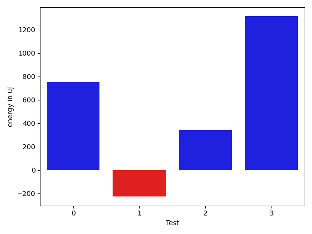

# gson a8133e

https://github.com/google/gson/commit/a8133e

## Delta Energy per test method

| ID | EnergyV1 | EnergyV2 | DeltaEnergy | σV1 | σV2 |
| --- | --- | --- | --- | --- | --- |
| 0 | 36132 | 38574 | 2442 | 6632.451310073781 | 4207.693571058694 |
| 1 | 38513 | 40832 | 2319 | 17198.450233163465 | 15581.569154850518 |
| 2 | 33203 | 32959 | -244 | 9133.291864974302 | 9676.385181026806 |
| 3 | 37536 | 38575 | 1039 | 3330.3195894933665 | 3787.3989753391443 |

## Delta Duration per test method

| ID | DurationV1 | DurationsV2 | DeltaDuration |
| --- | --- | --- | --- |
| 0 | 789724.3103448276 | 737846.1111111111 | -51878.19923371647 |
| 1 | 1573929.8115942029 | 1546797.25 | -27132.56159420288 |
| 2 | 1191982.5 | 1214271.2448979593 | 22288.74489795929 |
| 3 | 641821.2285714286 | 633113.24 | -8707.988571428577 |

## Misc.

| ID | Test Class | Test Method |
| --- | --- | --- |
| 0 | com.google.gson.functional.PrimitiveTest | testDeserializeJsonArrayAsNumber |
| 1 | com.google.gson.functional.PrimitiveTest | testNumberDeserialization |
| 2 | com.google.gson.functional.PrimitiveTest | testNumberSerialization |
| 3 | com.google.gson.functional.PrimitiveTest | testDeserializeJsonObjectAsNumber |

| Test | IterationV1 | IterationV2 | DeltaIteration |
| --- | --- | --- | --- |
| 0 | 29 | 27 | -2 |
| 1 | 69 | 76 | 7 |
| 2 | 44 | 49 | 5 |
| 3 | 35 | 25 | -10 |

| Time Label | Time (s) |
| --- | --- |
| Selection | 30.029571294784546 |
| Injection | 10.356223106384277 |
| Total | 1122.975997209549 |

