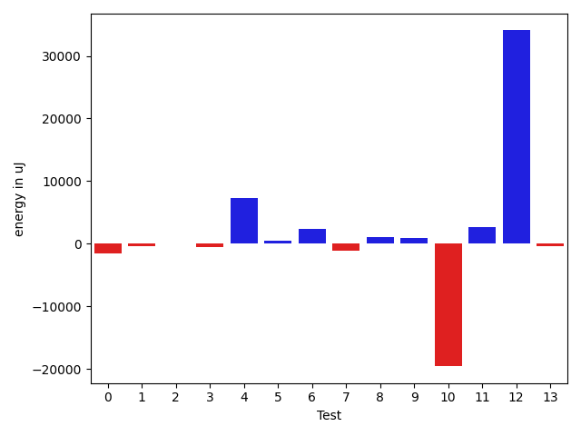
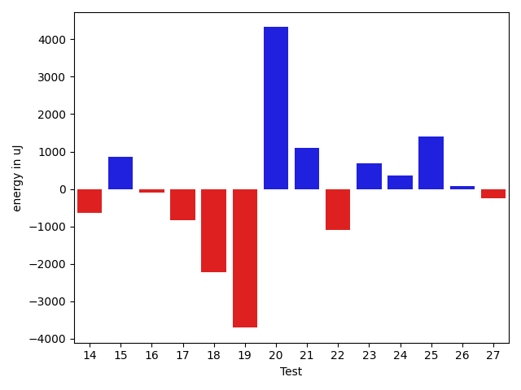
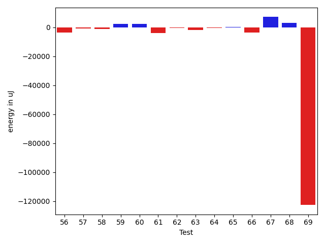
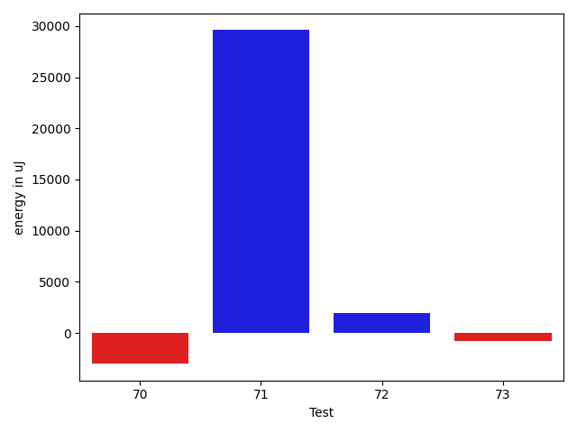

# gson 0aab1d

https://github.com/google/gson/commit/0aab1d

## Delta Energy per test method

| ID | EnergyV1 | EnergyV2 | DeltaEnergy | σV1 | σV2 |
| --- | --- | --- | --- | --- | --- |
| 0 | 40100 | 39307 | -793 | 9065.972188374062 | 6630.213865487267 |
| 1 | 40283 | 38635 | -1648 | 5221.333946565477 | 5024.398049652761 |
| 2 | 39977 | 39123 | -854 | 4132.876674337844 | 5299.0695030091465 |
| 3 | 41504 | 39978 | -1526 | 7757.668916048077 | 7672.041869418899 |
| 4 | 83862 | 85266 | 1404 | 31284.451235334316 | 35021.53889270523 |
| 5 | 41321 | 41992 | 671 | 14327.71065417455 | 11158.170004615593 |
| 6 | 41870 | 42419 | 549 | 10195.926818575675 | 18233.33763343278 |
| 7 | 44129 | 41870 | -2259 | 23428.66728160038 | 29656.364118005647 |
| 8 | 39673 | 40527 | 854 | 5169.054016510714 | 6610.6299928192 |
| 9 | 41077 | 42481 | 1404 | 14170.084704030212 | 13240.00943564117 |
| 10 | 43029 | 44434 | 1405 | 124788.89384850871 | 89761.43806729067 |
| 11 | 41199 | 40894 | -305 | 6288.6660498704905 | 14241.928710750313 |
| 12 | 86975 | 87281 | 306 | 340494.9010787802 | 434151.31332730065 |
| 13 | 43579 | 43823 | 244 | 22719.74073764408 | 25786.73341314691 |
| 14 | 39917 | 40466 | 549 | 15895.699008829086 | 7647.179019502144 |
| 15 | 40650 | 41992 | 1342 | 8459.656200552718 | 9931.478078826998 |
| 16 | 40222 | 40954 | 732 | 4295.9974142861 | 4226.637504396702 |
| 17 | 39429 | 40161 | 732 | 7568.670226738237 | 5648.519941626952 |
| 18 | 42908 | 42908 | 0 | 19912.543544383163 | 19042.072508006713 |
| 19 | 39856 | 39185 | -671 | 28100.15258027578 | 4357.328855778618 |
| 20 | 40222 | 40589 | 367 | 4266.924250635481 | 26493.548572247353 |
| 21 | 39856 | 40650 | 794 | 4576.174677670179 | 4290.305601086158 |
| 22 | 41748 | 42114 | 366 | 24986.335799208086 | 25752.027027629225 |
| 23 | 40039 | 41748 | 1709 | 4960.367359240116 | 4599.24319408458 |
| 24 | 39551 | 39734 | 183 | 4518.194095821598 | 4067.7088999686994 |
| 25 | 39856 | 41565 | 1709 | 4260.760488307944 | 4248.8943267178975 |
| 26 | 40833 | 40833 | 0 | 4972.877158207692 | 5107.110598439332 |
| 27 | 40527 | 40039 | -488 | 4076.179883930434 | 5013.444635212618 |
| 28 | 40344 | 41260 | 916 | 4985.9662577747795 | 4808.487847935451 |
| 29 | 40954 | 39611 | -1343 | 7324.497889410473 | 13889.466720572356 |
| 30 | 40344 | 41992 | 1648 | 3402.6347651890005 | 4299.862983863555 |
| 31 | 41138 | 40649 | -489 | 28695.786060684994 | 45620.1673047939 |
| 32 | 41626 | 41076 | -550 | 5600.5515927748875 | 4589.617545299522 |
| 33 | 38513 | 38574 | 61 | 4085.7479719009816 | 5544.234278743999 |
| 34 | 38940 | 39673 | 733 | 4872.155512592849 | 4349.970443270931 |
| 35 | 39185 | 38757 | -428 | 4548.188067175763 | 4980.532701521967 |
| 36 | 39306 | 40771 | 1465 | 4276.150403154606 | 84428.04150179688 |
| 37 | 41931 | 38757 | -3174 | 4640.221480284607 | 4380.850165531744 |
| 38 | 39245 | 39123 | -122 | 4852.538243831551 | 4328.255673550239 |
| 39 | 42724 | 43335 | 611 | 82010.05372593585 | 100817.57459552563 |
| 40 | 37292 | 39062 | 1770 | 4332.102543964581 | 3517.241867453341 |
| 41 | 40527 | 39856 | -671 | 13632.39638745855 | 13644.894901219483 |
| 42 | 39367 | 40649 | 1282 | 4931.014317018019 | 5340.370925481525 |
| 43 | 37963 | 39185 | 1222 | 4296.021898640648 | 5112.8999245438 |
| 44 | 39856 | 40283 | 427 | 4225.838014122169 | 4033.2087660323264 |
| 45 | 39184 | 36988 | -2196 | 4368.817274886225 | 3908.9468140033564 |
| 46 | 39124 | 40711 | 1587 | 4090.693543720802 | 4340.288183980413 |
| 47 | 42420 | 43579 | 1159 | 7050.241509732526 | 8120.0577862972195 |
| 48 | 44861 | 45654 | 793 | 491022.63861014426 | 419007.6877261114 |
| 49 | 43396 | 44433 | 1037 | 422373.5063016642 | 532976.5191681052 |
| 50 | 39734 | 38879 | -855 | 4976.107174786175 | 5505.292837933778 |
| 51 | 39795 | 39368 | -427 | 23932.328867011896 | 4302.694209704219 |
| 52 | 39551 | 44556 | 5005 | 9965.110521949951 | 26203.62973165308 |
| 53 | 39673 | 43090 | 3417 | 3687.624188308105 | 4933.750506685783 |
| 54 | 39795 | 41320 | 1525 | 16869.730411549775 | 5055.518453585878 |
| 55 | 44495 | 42725 | -1770 | 19340.1952302996 | 17680.116434389343 |
| 56 | 43152 | 44434 | 1282 | 64985.79958470154 | 59745.48331196761 |
| 57 | 40161 | 39062 | -1099 | 6036.68000603066 | 6562.377910867472 |
| 58 | 41687 | 42725 | 1038 | 10777.217997147223 | 4628.290855693704 |
| 59 | 40588 | 42786 | 2198 | 4920.054037922099 | 3181.23141425147 |
| 60 | 37781 | 41931 | 4150 | 5217.625256709483 | 3274.546722244037 |
| 61 | 108582 | 93872 | -14710 | 27198.08117230628 | 26884.856501719496 |
| 62 | 37659 | 38269 | 610 | 6031.6866531968435 | 4104.381896397957 |
| 63 | 38758 | 38452 | -306 | 4112.900482647895 | 3668.8864850156588 |
| 64 | 42236 | 41015 | -1221 | 5761.659178552296 | 4045.0082198025134 |
| 65 | 41993 | 41809 | -184 | 4412.947497103083 | 4432.393894996248 |
| 66 | 44982 | 41870 | -3112 | 19059.322551189995 | 17425.661055922068 |
| 67 | 43640 | 43212 | -428 | 6611.624386124825 | 49824.54740042327 |
| 68 | 40771 | 42053 | 1282 | 4529.759475126061 | 19518.70913020057 |
| 69 | 44799 | 43457 | -1342 | 580501.8751039198 | 266688.2260816658 |
| 70 | 42053 | 41748 | -305 | 25742.728490986756 | 23033.76253688331 |
| 71 | 43030 | 43396 | 366 | 82777.30996088241 | 127473.72843598522 |
| 72 | 42846 | 43457 | 611 | 12200.590425781556 | 14512.443414798507 |
| 73 | 41748 | 42053 | 305 | 19707.662902487493 | 14500.013626756308 |

## Delta Duration per test method

| ID | DurationV1 | DurationsV2 | DeltaDuration |
| --- | --- | --- | --- |
| 0 | 1027316.5882352941 | 1039757.375 | 12440.786764705903 |
| 1 | 878635.3389830509 | 866690.9344262296 | -11944.404556821333 |
| 2 | 967228.9830508474 | 982251.7735849057 | 15022.790534058237 |
| 3 | 891729.3114754099 | 907305.4426229508 | 15576.131147540873 |
| 4 | 2471151.98989899 | 2493132.8163265307 | 21980.826427540742 |
| 5 | 1175683.2727272727 | 1188570.8588235294 | 12887.586096256739 |
| 6 | 1105791.0701754387 | 1099895.103448276 | -5895.966727162711 |
| 7 | 1372856.4605263157 | 1339108.64 | -33747.82052631583 |
| 8 | 926119.0882352941 | 875695.0392156863 | -50424.04901960783 |
| 9 | 1212634.8983050848 | 1136180.0714285714 | -76454.82687651343 |
| 10 | 2426265.55 | 1658197.1162790698 | -768068.43372093 |
| 11 | 1032426.2597402597 | 1077497.134328358 | 45070.87458809838 |
| 12 | 3998195.4242424243 | 4995049.95959596 | 996854.5353535353 |
| 13 | 1694897.8020833333 | 1746244.7849462365 | 51346.98286290327 |
| 14 | 833522.25 | 777362.3392857143 | -56159.91071428568 |
| 15 | 1029533.4629629629 | 1043854.186440678 | 14320.723477715044 |
| 16 | 741627.1320754717 | 792419.7173913043 | 50792.585315832635 |
| 17 | 1002256.0298507463 | 965594.0322580645 | -36661.997592681786 |
| 18 | 1425293.2527472528 | 1404234.4367816092 | -21058.81596564362 |
| 19 | 1009664.245614035 | 897947.9803921569 | -111716.26522187819 |
| 20 | 747251.8 | 833542.268292683 | 86290.4682926829 |
| 21 | 792608.4285714285 | 766382.4117647059 | -26226.01680672262 |
| 22 | 1383315.1967213114 | 1320476.0793650793 | -62839.117356232135 |
| 23 | 734291.5531914893 | 796381.9791666666 | 62090.42597517732 |
| 24 | 748894.3148148148 | 796565.0 | 47670.68518518517 |
| 25 | 774982.9016393443 | 842111.7450980392 | 67128.84345869487 |
| 26 | 835185.4347826086 | 830591.6444444444 | -4593.790338164195 |
| 27 | 750630.0370370371 | 821900.5098039216 | 71270.47276688449 |
| 28 | 846962.1346153846 | 857240.9347826086 | 10278.80016722402 |
| 29 | 1085637.1807228916 | 1186069.0384615385 | 100431.85773864691 |
| 30 | 799239.4285714285 | 796606.2 | -2633.228571428568 |
| 31 | 1372719.2469135802 | 1770180.2441860465 | 397460.9972724663 |
| 32 | 711114.8666666667 | 656457.6363636364 | -54657.230303030345 |
| 33 | 635119.6896551724 | 616944.08 | -18175.609655172448 |
| 34 | 644121.0333333333 | 630359.4871794871 | -13761.546153846197 |
| 35 | 642251.08 | 494633.95238095237 | -147617.1276190476 |
| 36 | 835285.0208333334 | 1349420.111111111 | 514135.09027777764 |
| 37 | 583330.5384615385 | 613545.4444444445 | 30214.905982906 |
| 38 | 492194.1034482759 | 489765.54545454547 | -2428.5579937304137 |
| 39 | 1643419.5526315789 | 2047189.45 | 403769.8973684211 |
| 40 | 738932.5135135135 | 727123.0833333334 | -11809.43018018012 |
| 41 | 1055116.8653846155 | 1001175.5692307692 | -53941.29615384631 |
| 42 | 844285.0294117647 | 734665.2444444444 | -109619.78496732027 |
| 43 | 804323.2 | 611835.72 | -192487.47999999998 |
| 44 | 682725.76 | 623198.28 | -59527.47999999998 |
| 45 | 589294.2222222222 | 625028.7826086957 | 35734.56038647343 |
| 46 | 506395.3461538461 | 510514.44 | 4119.093846153875 |
| 47 | 880161.2166666667 | 893815.5892857143 | 13654.372619047645 |
| 48 | 5184052.8533333335 | 3831044.378787879 | -1353008.4745454546 |
| 49 | 3893161.8666666667 | 5680939.224137931 | 1787777.3574712644 |
| 50 | 549670.6315789474 | 515833.2727272727 | -33837.35885167471 |
| 51 | 876567.2068965518 | 593652.8333333334 | -282914.3735632184 |
| 52 | 845368.1851851852 | 1095052.8421052631 | 249684.65692007798 |
| 53 | 437299.38095238095 | 446739.2 | 9439.819047619065 |
| 54 | 750146.8571428572 | 618634.8064516129 | -131512.0506912443 |
| 55 | 1476055.6829268292 | 1394873.6588235295 | -81182.02410329971 |
| 56 | 1938076.3934426229 | 1731953.1967213114 | -206123.19672131143 |
| 57 | 949431.1224489796 | 934192.0909090909 | -15239.031539888703 |
| 58 | 1011313.5652173914 | 710711.6857142857 | -300601.87950310565 |
| 59 | 768903.8139534884 | 622896.9714285714 | -146006.84252491698 |
| 60 | 781166.8536585366 | 619773.1470588235 | -161393.70659971307 |
| 61 | 2982756.8181818184 | 2940946.777777778 | -41810.04040404037 |
| 62 | 829010.0588235294 | 752915.9038461539 | -76094.15497737553 |
| 63 | 769381.1515151515 | 741119.9166666666 | -28261.234848484863 |
| 64 | 837848.0857142857 | 766850.9705882353 | -70997.11512605043 |
| 65 | 1003775.4912280702 | 904481.52 | -99293.97122807021 |
| 66 | 1350418.7297297297 | 1293858.9315068494 | -56559.798222880345 |
| 67 | 897001.4146341464 | 1075313.8409090908 | 178312.42627494445 |
| 68 | 857101.0714285715 | 903572.325 | 46471.253571428475 |
| 69 | 6036033.627906977 | 2255651.2674418604 | -3780382.360465117 |
| 70 | 1331235.2545454546 | 1348123.2068965517 | 16887.952351097018 |
| 71 | 1898812.7166666666 | 2918594.6603773586 | 1019781.943710692 |
| 72 | 1090910.2051282052 | 1278086.8157894737 | 187176.61066126847 |
| 73 | 1141689.8026315789 | 1253016.8709677418 | 111327.06833616295 |

## Misc.

| ID | Test Class | Test Method |
| --- | --- | --- |
| 0 | com.google.gson.functional.CustomTypeAdaptersTest | testCustomAdapterInvokedForCollectionElementDeserialization |
| 1 | com.google.gson.functional.CustomTypeAdaptersTest | testCustomAdapterInvokedForMapElementDeserialization |
| 2 | com.google.gson.functional.CustomTypeAdaptersTest | testCustomNestedDeserializers |
| 3 | com.google.gson.functional.EnumTest | testEnumSubclassAsParameterizedType |
| 4 | com.google.gson.functional.EnumTest | testEnumSubclass |
| 5 | com.google.gson.functional.EnumTest | testEnumSubclassWithRegisteredTypeAdapter |
| 6 | com.google.gson.functional.EnumTest | testCollectionOfEnumsDeserialization |
| 7 | com.google.gson.functional.JsonParserTest | testExtraCommasInArrays |
| 8 | com.google.gson.functional.JsonParserTest | testExtraCommasInMaps |
| 9 | com.google.gson.functional.JsonParserTest | testChangingCustomTreeAndDeserializing |
| 10 | com.google.gson.functional.JsonParserTest | testDeserializingCustomTree |
| 11 | com.google.gson.functional.TypeVariableTest | testBasicTypeVariables |
| 12 | com.google.gson.functional.TypeVariableTest | testAdvancedTypeVariables |
| 13 | com.google.gson.functional.TypeVariableTest | testTypeVariablesViaTypeParameter |
| 14 | com.google.gson.functional.CollectionTest | testCollectionOfStringsDeserialization |
| 15 | com.google.gson.functional.CollectionTest | testTopLevelCollectionOfIntegersDeserialization |
| 16 | com.google.gson.functional.CollectionTest | testLinkedListDeserialization |
| 17 | com.google.gson.functional.CollectionTest | testSetDeserialization |
| 18 | com.google.gson.functional.CollectionTest | testWildcardCollectionField |
| 19 | com.google.gson.functional.CollectionTest | testTopLevelListOfIntegerCollectionsDeserialization |
| 20 | com.google.gson.functional.CollectionTest | testWildcardPrimitiveCollectionDeserilaization |
| 21 | com.google.gson.functional.CollectionTest | testNullsInListDeserialization |
| 22 | com.google.gson.functional.MapTest | testMapStandardSubclassDeserialization |
| 23 | com.google.gson.functional.MapTest | testMapDeserializationEmpty |
| 24 | com.google.gson.functional.MapTest | testMapDeserializationWithNullKey |
| 25 | com.google.gson.functional.MapTest | testMapDeserialization |
| 26 | com.google.gson.functional.MapTest | testMapOfMapDeserialization |
| 27 | com.google.gson.functional.MapTest | testReadMapsWithEmptyStringKey |
| 28 | com.google.gson.functional.MapTest | testMapDeserializationWithWildcardValues |
| 29 | com.google.gson.functional.ParameterizedTypesTest | testParameterizedTypeWithReaderDeserialization |
| 30 | com.google.gson.functional.ParameterizedTypesTest | testDeepParameterizedTypeDeserialization |
| 31 | com.google.gson.functional.ParameterizedTypesTest | testParameterizedTypeDeserialization |
| 32 | com.google.gson.functional.NamingPolicyTest | testGsonWithSerializedNameFieldNamingPolicyDeserialization |
| 33 | com.google.gson.functional.ObjectTest | testClassWithTransientFieldsDeserializationTransientFieldsPassedInJsonAreIgnored |
| 34 | com.google.gson.functional.ObjectTest | testPrimitiveArrayInAnObjectDeserialization |
| 35 | com.google.gson.functional.ObjectTest | testObjectFieldNamesWithoutQuotesDeserialization |
| 36 | com.google.gson.functional.ObjectTest | testNestedDeserialization |
| 37 | com.google.gson.functional.ObjectTest | testClassWithTransientFieldsDeserialization |
| 38 | com.google.gson.functional.ObjectTest | testClassWithNoFieldsDeserialization |
| 39 | com.google.gson.functional.ObjectTest | testJsonInSingleQuotesDeserialization |
| 40 | com.google.gson.functional.ObjectTest | testNullFieldsDeserialization |
| 41 | com.google.gson.functional.ObjectTest | testTruncatedDeserialization |
| 42 | com.google.gson.functional.ObjectTest | testArrayOfObjectsDeserialization |
| 43 | com.google.gson.functional.ObjectTest | testJsonInMixedQuotesDeserialization |
| 44 | com.google.gson.functional.ObjectTest | testBagOfPrimitivesDeserialization |
| 45 | com.google.gson.functional.ObjectTest | testNullObjectFieldsDeserialization |
| 46 | com.google.gson.functional.ObjectTest | testNullArraysDeserialization |
| 47 | com.google.gson.functional.InheritanceTest | testSubClassDeserialization |
| 48 | com.google.gson.functional.InstanceCreatorTest | testInstanceCreatorReturnsBaseType |
| 49 | com.google.gson.CommentsTest | testParseComments |
| 50 | com.google.gson.internal.bind.MiniGsonTest | testDeserializeMap |
| 51 | com.google.gson.internal.bind.MiniGsonTest | testDeserialize |
| 52 | com.google.gson.internal.bind.MiniGsonTest | testDeserializeNullObject |
| 53 | com.google.gson.internal.bind.MiniGsonTest | testDeserializeNullField |
| 54 | com.google.gson.internal.bind.MiniGsonTest | testDeserializeWithCustomTypeAdapter |
| 55 | com.google.gson.functional.EscapingTest | testGsonAcceptsEscapedAndNonEscapedJsonDeserialization |
| 56 | com.google.gson.functional.EscapingTest | testEscapingObjectFields |
| 57 | com.google.gson.functional.EscapingTest | testGsonDoubleDeserialization |
| 58 | com.google.gson.functional.SecurityTest | testNonExecutableJsonDeserialization |
| 59 | com.google.gson.functional.SecurityTest | testJsonWithNonExectuableTokenWithRegularGsonDeserialization |
| 60 | com.google.gson.functional.SecurityTest | testJsonWithNonExectuableTokenWithConfiguredGsonDeserialization |
| 61 | com.google.gson.functional.DefaultTypeAdaptersTest | testDateSerializationInCollection |
| 62 | com.google.gson.functional.DefaultTypeAdaptersTest | testTreeSetDeserialization |
| 63 | com.google.gson.functional.DefaultTypeAdaptersTest | testPropertiesDeserialization |
| 64 | com.google.gson.functional.VersioningTest | testVersionedGsonWithUnversionedClassesDeserialization |
| 65 | com.google.gson.functional.ArrayTest | testArrayOfCollectionDeserialization |
| 66 | com.google.gson.functional.ReadersWritersTest | testReadWriteTwoObjects |
| 67 | com.google.gson.functional.ReadersWritersTest | testReaderForDeserialization |
| 68 | com.google.gson.functional.NullObjectAndFieldTest | testExplicitDeserializationOfNulls |
| 69 | com.google.gson.JsonParserTest | testReadWriteTwoObjects |
| 70 | com.google.gson.functional.UncategorizedTest | testTrailingWhitespace |
| 71 | com.google.gson.functional.UncategorizedTest | testInvalidJsonDeserializationFails |
| 72 | com.google.gson.functional.UncategorizedTest | testGsonInstanceReusableForSerializationAndDeserialization |
| 73 | com.google.gson.functional.MapAsArrayTypeAdapterTest | testTwoTypesCollapseToOneDeserialize |

| Test | IterationV1 | IterationV2 | DeltaIteration |
| --- | --- | --- | --- |
| 0 | 68 | 64 | -4 |
| 1 | 59 | 61 | 2 |
| 2 | 59 | 53 | -6 |
| 3 | 61 | 61 | 0 |
| 4 | 99 | 98 | -1 |
| 5 | 88 | 85 | -3 |
| 6 | 57 | 58 | 1 |
| 7 | 76 | 75 | -1 |
| 8 | 68 | 51 | -17 |
| 9 | 59 | 56 | -3 |
| 10 | 40 | 43 | 3 |
| 11 | 77 | 67 | -10 |
| 12 | 99 | 99 | 0 |
| 13 | 96 | 93 | -3 |
| 14 | 52 | 56 | 4 |
| 15 | 54 | 59 | 5 |
| 16 | 53 | 46 | -7 |
| 17 | 67 | 62 | -5 |
| 18 | 91 | 87 | -4 |
| 19 | 57 | 51 | -6 |
| 20 | 55 | 41 | -14 |
| 21 | 49 | 51 | 2 |
| 22 | 61 | 63 | 2 |
| 23 | 47 | 48 | 1 |
| 24 | 54 | 47 | -7 |
| 25 | 61 | 51 | -10 |
| 26 | 46 | 45 | -1 |
| 27 | 54 | 51 | -3 |
| 28 | 52 | 46 | -6 |
| 29 | 83 | 78 | -5 |
| 30 | 49 | 50 | 1 |
| 31 | 81 | 86 | 5 |
| 32 | 30 | 33 | 3 |
| 33 | 29 | 25 | -4 |
| 34 | 30 | 39 | 9 |
| 35 | 25 | 21 | -4 |
| 36 | 48 | 45 | -3 |
| 37 | 26 | 27 | 1 |
| 38 | 29 | 22 | -7 |
| 39 | 38 | 40 | 2 |
| 40 | 37 | 36 | -1 |
| 41 | 52 | 65 | 13 |
| 42 | 34 | 45 | 11 |
| 43 | 25 | 25 | 0 |
| 44 | 25 | 25 | 0 |
| 45 | 27 | 23 | -4 |
| 46 | 26 | 25 | -1 |
| 47 | 60 | 56 | -4 |
| 48 | 75 | 66 | -9 |
| 49 | 75 | 58 | -17 |
| 50 | 19 | 22 | 3 |
| 51 | 29 | 30 | 1 |
| 52 | 27 | 19 | -8 |
| 53 | 21 | 15 | -6 |
| 54 | 35 | 31 | -4 |
| 55 | 82 | 85 | 3 |
| 56 | 61 | 61 | 0 |
| 57 | 49 | 44 | -5 |
| 58 | 46 | 35 | -11 |
| 59 | 43 | 35 | -8 |
| 60 | 41 | 34 | -7 |
| 61 | 99 | 99 | 0 |
| 62 | 51 | 52 | 1 |
| 63 | 33 | 24 | -9 |
| 64 | 35 | 34 | -1 |
| 65 | 57 | 50 | -7 |
| 66 | 74 | 73 | -1 |
| 67 | 41 | 44 | 3 |
| 68 | 42 | 40 | -2 |
| 69 | 86 | 86 | 0 |
| 70 | 55 | 58 | 3 |
| 71 | 60 | 53 | -7 |
| 72 | 39 | 38 | -1 |
| 73 | 76 | 62 | -14 |

| Time Label | Time (s) |
| --- | --- |
| Selection | 29.78965973854065 |
| Injection | 15.21951413154602 |
| Total | 1251.1837527751923 |

