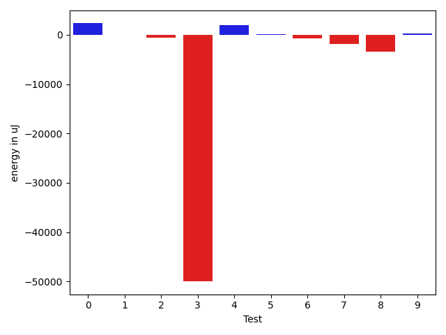
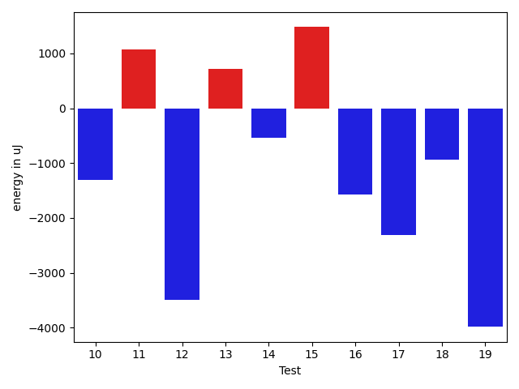
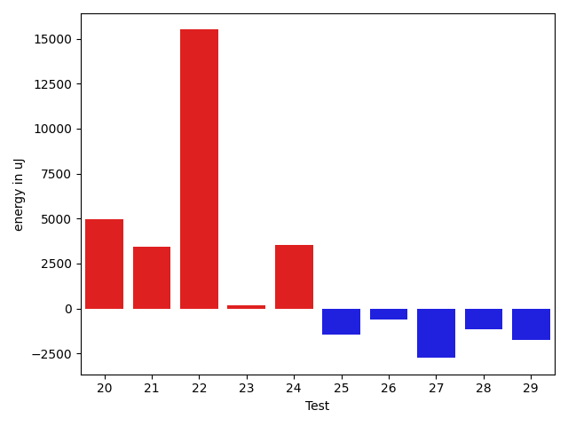
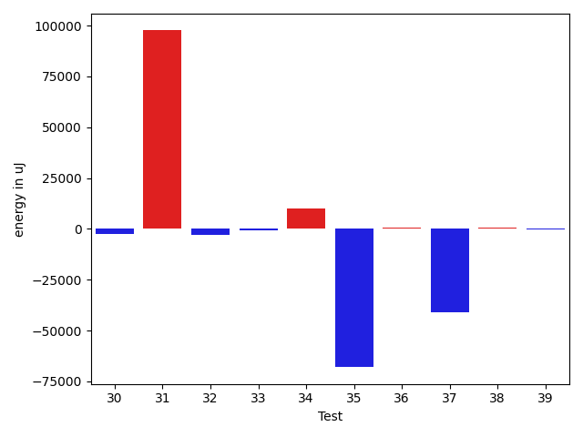
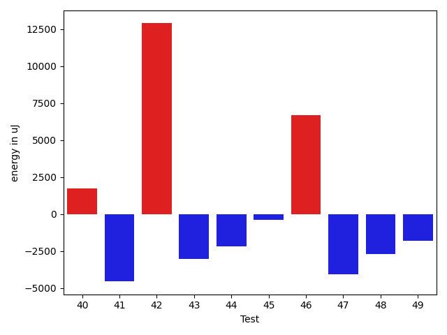
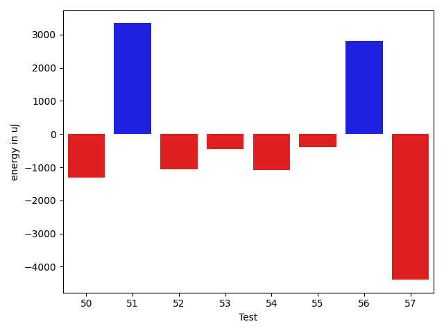

# gson 4f6a36

https://github.com/google/gson/commit/4f6a36

## Delta Energy per test method

| ID | EnergyV1 | EnergyV2 | DeltaEnergy | σV1 | σV2 |
| --- | --- | --- | --- | --- | --- |
| 0 | 42054 | 40589 | -1465 | 17310.038627647744 | 19238.949989493136 |
| 1 | 39917 | 39307 | -610 | 10873.261661608227 | 10814.042225394825 |
| 2 | 42480 | 42846 | 366 | 8802.499005964159 | 7874.5672030679425 |
| 3 | 44433 | 43579 | -854 | 683192.4708662885 | 584227.2712176392 |
| 4 | 39062 | 41138 | 2076 | 5126.3336550653385 | 4855.382081555966 |
| 5 | 39062 | 37720 | -1342 | 4722.541544549926 | 4749.993908573766 |
| 6 | 45715 | 42480 | -3235 | 41730.1482982917 | 48726.1764258135 |
| 7 | 42847 | 38757 | -4090 | 6012.18519037077 | 5968.524454580927 |
| 8 | 42786 | 40283 | -2503 | 3167.65177804983 | 3924.560556291621 |
| 9 | 37415 | 38391 | 976 | 5734.9063191822 | 5537.361425252576 |
| 10 | 38208 | 38636 | 428 | 4609.7911390887075 | 2831.256493737954 |
| 11 | 36011 | 39306 | 3295 | 4476.43559201598 | 6275.503936808554 |
| 12 | 43579 | 38635 | -4944 | 5104.700797264404 | 3932.3902360851894 |
| 13 | 37903 | 38269 | 366 | 5536.417909199605 | 4217.059161574832 |
| 14 | 40527 | 40222 | -305 | 4531.664407869977 | 5246.000807493478 |
| 15 | 37048 | 39977 | 2929 | 5605.007164607068 | 4588.925658271537 |
| 16 | 40039 | 38391 | -1648 | 5853.931402140734 | 3673.181721232128 |
| 17 | 38208 | 37232 | -976 | 6184.515887278486 | 4863.57150379136 |
| 18 | 39612 | 38758 | -854 | 5195.528022565907 | 4893.932715061597 |
| 19 | 40344 | 39917 | -427 | 23132.332958479645 | 16018.488075455532 |
| 20 | 36682 | 41626 | 4944 | 4817.227184885615 | 4167.481360058669 |
| 21 | 88318 | 91735 | 3417 | 395566.0494007442 | 441539.03902240377 |
| 22 | 43945 | 59448 | 15503 | 26591.14545112093 | 28008.592255045147 |
| 23 | 37964 | 38147 | 183 | 12016.294336142648 | 12672.034054688762 |
| 24 | 39001 | 42541 | 3540 | 49175.64224087706 | 52871.80728047642 |
| 25 | 41931 | 40466 | -1465 | 35848.44158895427 | 71893.86297323885 |
| 26 | 40100 | 39489 | -611 | 6093.980179915984 | 5886.115831077358 |
| 27 | 44006 | 41259 | -2747 | 20063.583679791616 | 24781.50270060606 |
| 28 | 43457 | 42297 | -1160 | 46025.2465397582 | 59744.151955379115 |
| 29 | 44312 | 42541 | -1771 | 78714.16100979963 | 73913.19031177076 |
| 30 | 41321 | 39184 | -2137 | 12344.972635078351 | 10278.870055116138 |
| 31 | 44250 | 45532 | 1282 | 385959.5257363292 | 593396.2760232547 |
| 32 | 41504 | 40161 | -1343 | 15631.008783383333 | 11584.43371123961 |
| 33 | 39307 | 38757 | -550 | 7540.688084328454 | 4588.592848264971 |
| 34 | 40344 | 41137 | 793 | 66373.68158984403 | 84809.36805616347 |
| 35 | 44067 | 41687 | -2380 | 524649.867904593 | 379224.8436365631 |
| 36 | 39245 | 39733 | 488 | 4708.478675057304 | 9008.482652478164 |
| 37 | 42053 | 42237 | 184 | 249535.11803685914 | 4969.2761823343835 |
| 38 | 38574 | 38208 | -366 | 4274.800054615277 | 3414.5774750814094 |
| 39 | 38513 | 38208 | -305 | 4471.426467982492 | 4654.508706318357 |
| 40 | 40039 | 40100 | 61 | 13192.592471313843 | 13477.281337282411 |
| 41 | 39611 | 38941 | -670 | 40471.2908873282 | 6015.463130186254 |
| 42 | 38819 | 38635 | -184 | 4643.9660690320925 | 70265.68176180014 |
| 43 | 43030 | 39428 | -3602 | 93345.75708668387 | 102691.98232938527 |
| 44 | 40649 | 37231 | -3418 | 4790.748483592791 | 4885.515300986461 |
| 45 | 38452 | 38879 | 427 | 5102.883756327703 | 4565.137142674749 |
| 46 | 39124 | 42236 | 3112 | 10866.17172031807 | 21923.87405565989 |
| 47 | 43335 | 41259 | -2076 | 23324.177492420826 | 22446.25446689782 |
| 48 | 41076 | 37841 | -3235 | 5461.659843244156 | 4637.059850551856 |
| 49 | 40832 | 38330 | -2502 | 4066.2856250360724 | 4922.230600896306 |
| 50 | 40833 | 40711 | -122 | 4221.216797843958 | 5045.552320379512 |
| 51 | 43029 | 41565 | -1464 | 34638.44933681324 | 39056.27684243468 |
| 52 | 42420 | 41199 | -1221 | 3780.5247274477324 | 5393.558717594387 |
| 53 | 41504 | 41443 | -61 | 3169.0310199085034 | 3982.3774336738475 |
| 54 | 36865 | 36805 | -60 | 4361.655259354094 | 3770.236463351825 |
| 55 | 40283 | 39062 | -1221 | 4526.39690147939 | 6807.504414583265 |
| 56 | 39917 | 41992 | 2075 | 4923.635651691973 | 4566.17015083757 |
| 57 | 43395 | 40405 | -2990 | 13131.20889466175 | 8721.368977577085 |

## Delta Duration per test method

| ID | DurationV1 | DurationsV2 | DeltaDuration |
| --- | --- | --- | --- |
| 0 | 1397115.4567901234 | 1373990.1704545454 | -23125.286335577955 |
| 1 | 1227254.517647059 | 1252790.3866666667 | 25535.86901960778 |
| 2 | 933450.15625 | 853039.195652174 | -80410.96059782605 |
| 3 | 7405641.857142857 | 6158311.136363637 | -1247330.7207792206 |
| 4 | 544728.125 | 488723.2105263158 | -56004.91447368421 |
| 5 | 498540.6666666667 | 424937.29411764705 | -73603.37254901964 |
| 6 | 1616130.9772727273 | 1583986.0 | -32144.977272727294 |
| 7 | 714294.0 | 665735.5416666666 | -48558.45833333337 |
| 8 | 461193.1538461539 | 494568.9 | 33375.74615384615 |
| 9 | 582458.2857142857 | 518851.9130434783 | -63606.37267080741 |
| 10 | 420089.76470588235 | 476560.44444444444 | 56470.67973856209 |
| 11 | 479426.46153846156 | 438014.0588235294 | -41412.40271493216 |
| 12 | 471547.35714285716 | 453147.0 | -18400.35714285716 |
| 13 | 455568.0714285714 | 527335.25 | 71767.17857142858 |
| 14 | 532126.75 | 466764.05555555556 | -65362.69444444444 |
| 15 | 733776.6774193548 | 688223.3428571429 | -45553.33456221188 |
| 16 | 653929.5 | 669664.4137931034 | 15734.91379310342 |
| 17 | 831751.3333333334 | 853887.8235294118 | 22136.490196078434 |
| 18 | 715683.9487179487 | 756746.1470588235 | 41062.19834087475 |
| 19 | 1340614.7464788733 | 1134463.5 | -206151.2464788733 |
| 20 | 891506.4528301887 | 859297.7924528302 | -32208.660377358436 |
| 21 | 5067750.121212121 | 5250896.95959596 | 183146.83838383853 |
| 22 | 1783932.0833333333 | 1866901.75 | 82969.66666666674 |
| 23 | 1289470.2307692308 | 1266305.3095238095 | -23164.921245421283 |
| 24 | 1853727.3023255814 | 2038303.6511627906 | 184576.34883720917 |
| 25 | 972621.3 | 1778168.0625 | 805546.7625 |
| 26 | 963494.9152542372 | 919424.9090909091 | -44070.00616332819 |
| 27 | 1500825.6179775281 | 1561152.1379310344 | 60326.5199535063 |
| 28 | 1627554.8333333333 | 1677555.6764705882 | 50000.84313725494 |
| 29 | 1909130.5897435897 | 1619151.9444444445 | -289978.64529914525 |
| 30 | 1216625.8166666667 | 1072845.5909090908 | -143780.22575757583 |
| 31 | 3874807.6 | 6762697.657534246 | 2887890.0575342462 |
| 32 | 1096656.396551724 | 1132506.6065573771 | 35850.21000565309 |
| 33 | 932198.6730769231 | 976248.28125 | 44049.60817307688 |
| 34 | 1428356.575 | 1722977.6530612244 | 294621.0780612244 |
| 35 | 5198152.571428572 | 3202319.537313433 | -1995833.034115139 |
| 36 | 751676.2857142857 | 846109.55 | 94433.26428571437 |
| 37 | 2153474.951219512 | 808082.1052631579 | -1345392.8459563544 |
| 38 | 692172.9714285714 | 688509.0555555555 | -3663.9158730158815 |
| 39 | 811279.4772727273 | 893486.8431372549 | 82207.36586452764 |
| 40 | 1118043.4666666666 | 1168203.9696969697 | 50160.50303030317 |
| 41 | 1137604.6964285714 | 960070.775862069 | -177533.92056650238 |
| 42 | 717597.7878787878 | 1146202.5483870967 | 428604.7605083089 |
| 43 | 1999004.5405405406 | 1935204.7906976745 | -63799.74984286609 |
| 44 | 862388.9361702128 | 900081.2592592592 | 37692.323089046404 |
| 45 | 678930.1290322581 | 665646.7714285714 | -13283.357603686629 |
| 46 | 1001619.6470588235 | 1191325.9302325582 | 189706.28317373467 |
| 47 | 1672827.5789473683 | 1620460.6701030927 | -52366.90884427563 |
| 48 | 862516.1818181818 | 931723.72 | 69207.5381818182 |
| 49 | 848987.15 | 826463.6 | -22523.550000000047 |
| 50 | 604591.8 | 515203.0 | -89388.80000000005 |
| 51 | 1049744.1379310344 | 1265067.8846153845 | 215323.74668435007 |
| 52 | 522345.6875 | 490127.0 | -32218.6875 |
| 53 | 605034.303030303 | 616429.6785714285 | 11395.37554112554 |
| 54 | 918329.0491803279 | 947651.0612244898 | 29322.012044161907 |
| 55 | 553650.875 | 531140.3684210526 | -22510.506578947417 |
| 56 | 549106.7142857143 | 527499.92 | -21606.794285714277 |
| 57 | 1237404.4905660378 | 1125970.9310344828 | -111433.55953155505 |

## Misc.

| ID | Test Class | Test Method |
| --- | --- | --- |
| 0 | com.google.gson.functional.ReadersWritersTest | testReadWriteTwoObjects |
| 1 | com.google.gson.functional.ReadersWritersTest | testReadWriteTwoStrings |
| 2 | com.google.gson.functional.ReadersWritersTest | testReaderForDeserialization |
| 3 | com.google.gson.JsonParserTest | testReadWriteTwoObjects |
| 4 | com.google.gson.functional.StringTest | testEscapedCtrlNInStringDeserialization |
| 5 | com.google.gson.functional.StringTest | testStringWithEscapedSlashDeserialization |
| 6 | com.google.gson.functional.StringTest | testSingleQuoteInStringSerialization |
| 7 | com.google.gson.functional.StringTest | testStringValueDeserialization |
| 8 | com.google.gson.functional.StringTest | testEscapedBackslashInStringDeserialization |
| 9 | com.google.gson.functional.StringTest | testEscapingQuotesInStringSerialization |
| 10 | com.google.gson.functional.StringTest | testAssignmentCharDeserialization |
| 11 | com.google.gson.functional.StringTest | testJavascriptKeywordsInStringDeserialization |
| 12 | com.google.gson.functional.StringTest | testEscapingQuotesInStringDeserialization |
| 13 | com.google.gson.functional.StringTest | testEscapedCtrlRInStringDeserialization |
| 14 | com.google.gson.functional.StringTest | testSingleQuoteInStringDeserialization |
| 15 | com.google.gson.functional.NamingPolicyTest | testGsonWithLowerCaseDashPolicyDeserialiation |
| 16 | com.google.gson.functional.NamingPolicyTest | testGsonWithUpperCamelCaseSpacesPolicyDeserialiation |
| 17 | com.google.gson.functional.NamingPolicyTest | testGsonWithNonDefaultFieldNamingPolicyDeserialiation |
| 18 | com.google.gson.functional.NamingPolicyTest | testGsonWithLowerCaseUnderscorePolicyDeserialiation |
| 19 | com.google.gson.functional.MapTest | testMapStandardSubclassDeserialization |
| 20 | com.google.gson.functional.MapTest | testMapOfMapDeserialization |
| 21 | com.google.gson.functional.TypeVariableTest | testAdvancedTypeVariables |
| 22 | com.google.gson.functional.TypeVariableTest | testTypeVariablesViaTypeParameter |
| 23 | com.google.gson.functional.ParameterizedTypesTest | testParameterizedTypeWithReaderDeserialization |
| 24 | com.google.gson.functional.ParameterizedTypesTest | testParameterizedTypeDeserialization |
| 25 | com.google.gson.GsonTypeAdapterTest | testTypeAdapterDoesNotAffectNonAdaptedTypes |
| 26 | com.google.gson.functional.EscapingTest | testGsonDoubleDeserialization |
| 27 | com.google.gson.functional.EscapingTest | testGsonAcceptsEscapedAndNonEscapedJsonDeserialization |
| 28 | com.google.gson.functional.EscapingTest | testEscapingObjectFields |
| 29 | com.google.gson.functional.EscapingTest | testEscapingQuotesInStringArray |
| 30 | com.google.gson.functional.InheritanceTest | testSubClassDeserialization |
| 31 | com.google.gson.functional.InstanceCreatorTest | testInstanceCreatorReturnsBaseType |
| 32 | com.google.gson.functional.JsonParserTest | testChangingCustomTreeAndDeserializing |
| 33 | com.google.gson.functional.JsonParserTest | testExtraCommasInMaps |
| 34 | com.google.gson.functional.JsonParserTest | testDeserializingCustomTree |
| 35 | com.google.gson.CommentsTest | testParseComments |
| 36 | com.google.gson.functional.SecurityTest | testJsonWithNonExectuableTokenWithConfiguredGsonDeserialization |
| 37 | com.google.gson.functional.SecurityTest | testJsonWithNonExectuableTokenWithRegularGsonDeserialization |
| 38 | com.google.gson.functional.ObjectTest | testObjectFieldNamesWithoutQuotesDeserialization |
| 39 | com.google.gson.functional.ObjectTest | testArrayOfObjectsDeserialization |
| 40 | com.google.gson.functional.ObjectTest | testTruncatedDeserialization |
| 41 | com.google.gson.functional.ObjectTest | testNestedDeserialization |
| 42 | com.google.gson.functional.ObjectTest | testBagOfPrimitivesDeserialization |
| 43 | com.google.gson.functional.ObjectTest | testJsonInSingleQuotesDeserialization |
| 44 | com.google.gson.functional.ObjectTest | testNullFieldsDeserialization |
| 45 | com.google.gson.functional.ObjectTest | testJsonInMixedQuotesDeserialization |
| 46 | com.google.gson.internal.bind.MiniGsonTest | testDeserialize |
| 47 | com.google.gson.functional.CollectionTest | testWildcardCollectionField |
| 48 | com.google.gson.functional.CollectionTest | testLinkedListDeserialization |
| 49 | com.google.gson.functional.CollectionTest | testCollectionOfStringsDeserialization |
| 50 | com.google.gson.functional.InternationalizationTest | testStringsWithUnicodeChineseCharactersEscapedDeserialization |
| 51 | com.google.gson.functional.InternationalizationTest | testStringsWithRawChineseCharactersDeserialization |
| 52 | com.google.gson.functional.InternationalizationTest | testStringsWithUnicodeChineseCharactersDeserialization |
| 53 | com.google.gson.functional.PrimitiveTest | testQuotedStringSerializationAndDeserialization |
| 54 | com.google.gson.functional.DefaultTypeAdaptersTest | testTreeSetDeserialization |
| 55 | com.google.gson.functional.ArrayTest | testArrayOfStringsDeserialization |
| 56 | com.google.gson.functional.ArrayTest | testMultidimenstionalArraysDeserialization |
| 57 | com.google.gson.functional.UncategorizedTest | testGsonInstanceReusableForSerializationAndDeserialization |

| Test | IterationV1 | IterationV2 | DeltaIteration |
| --- | --- | --- | --- |
| 0 | 81 | 88 | 7 |
| 1 | 85 | 75 | -10 |
| 2 | 32 | 46 | 14 |
| 3 | 91 | 88 | -3 |
| 4 | 24 | 19 | -5 |
| 5 | 15 | 17 | 2 |
| 6 | 44 | 43 | -1 |
| 7 | 26 | 24 | -2 |
| 8 | 13 | 10 | -3 |
| 9 | 21 | 23 | 2 |
| 10 | 17 | 18 | 1 |
| 11 | 13 | 17 | 4 |
| 12 | 14 | 17 | 3 |
| 13 | 14 | 24 | 10 |
| 14 | 12 | 18 | 6 |
| 15 | 31 | 35 | 4 |
| 16 | 28 | 29 | 1 |
| 17 | 30 | 34 | 4 |
| 18 | 39 | 34 | -5 |
| 19 | 71 | 76 | 5 |
| 20 | 53 | 53 | 0 |
| 21 | 99 | 99 | 0 |
| 22 | 96 | 96 | 0 |
| 23 | 78 | 84 | 6 |
| 24 | 86 | 86 | 0 |
| 25 | 30 | 32 | 2 |
| 26 | 59 | 55 | -4 |
| 27 | 89 | 87 | -2 |
| 28 | 72 | 68 | -4 |
| 29 | 39 | 36 | -3 |
| 30 | 60 | 66 | 6 |
| 31 | 75 | 73 | -2 |
| 32 | 58 | 61 | 3 |
| 33 | 52 | 64 | 12 |
| 34 | 40 | 49 | 9 |
| 35 | 70 | 67 | -3 |
| 36 | 35 | 40 | 5 |
| 37 | 41 | 38 | -3 |
| 38 | 35 | 36 | 1 |
| 39 | 44 | 51 | 7 |
| 40 | 60 | 66 | 6 |
| 41 | 56 | 58 | 2 |
| 42 | 33 | 31 | -2 |
| 43 | 37 | 43 | 6 |
| 44 | 47 | 54 | 7 |
| 45 | 31 | 35 | 4 |
| 46 | 51 | 43 | -8 |
| 47 | 95 | 97 | 2 |
| 48 | 55 | 50 | -5 |
| 49 | 40 | 50 | 10 |
| 50 | 25 | 21 | -4 |
| 51 | 29 | 26 | -3 |
| 52 | 16 | 17 | 1 |
| 53 | 33 | 28 | -5 |
| 54 | 61 | 49 | -12 |
| 55 | 24 | 19 | -5 |
| 56 | 28 | 25 | -3 |
| 57 | 53 | 58 | 5 |

| Time Label | Time (s) |
| --- | --- |
| Selection | 30.025165796279907 |
| Injection | 13.134435892105103 |
| Total | 1213.8539390563965 |

